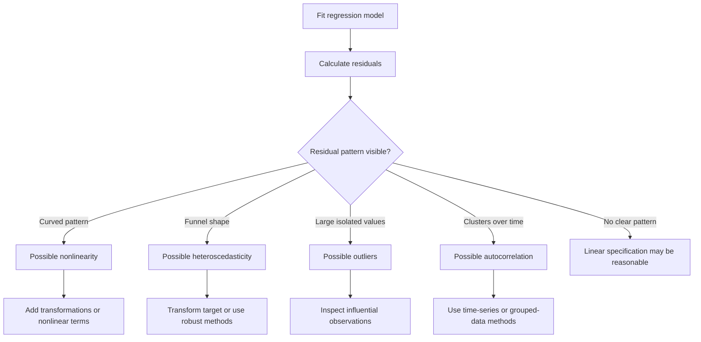
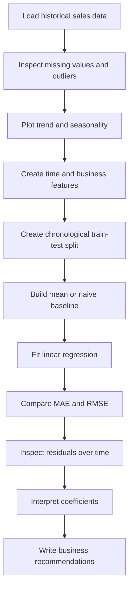

# 003 — Linear Regression

**Course:** 01 — Math, Statistics, and Econometrics
**Module:** Module 03 — Econometrics and Time Series
**Content Group:** Econometrics Fundamentals
**Roadmap Source:** Econometrics and Time Series / Econometrics Fundamentals
**Lesson Type:** Econometrics and Time Series
**Lesson Order:** 003
**Suggested Duration:** 22 minutes

---

## 1. Lesson Summary

This lesson introduces **Linear Regression** in the context of AI, data science, econometrics, and business analytics.

Linear regression is used to:

* Understand relationships between variables.
* Estimate how one variable changes when another variable changes.
* Predict a continuous numerical outcome.
* Measure the contribution of multiple features.
* Build an interpretable baseline model.
* Support business decisions with quantified evidence.

After completing this lesson, you should understand how to build, evaluate, diagnose, and interpret a linear regression model.

---

## 2. Learning Objectives

By the end of this lesson, you should be able to:

* Explain linear regression in your own words.
* Distinguish simple linear regression from multiple linear regression.
* Interpret regression coefficients, intercepts, residuals, and predictions.
* Understand how Ordinary Least Squares estimates model parameters.
* Evaluate a regression model using appropriate metrics.
* Check the main assumptions of linear regression.
* Identify common problems such as multicollinearity, outliers, leakage, and nonlinearity.
* Apply linear regression to a small dataset.
* Translate model results into business language.
* Produce a notebook, chart, model, API, or portfolio artifact.

---

## 3. What Is Linear Regression?

Linear regression models the relationship between a numerical target variable and one or more input variables.

For example, linear regression can help answer questions such as:

* How does advertising spending affect sales?
* How much does house size influence house price?
* How does work experience affect salary?
* How does temperature affect electricity demand?
* How do price, promotion, and season affect product demand?

The model assumes that the expected value of the target can be approximated by a linear combination of the input variables.

---

## 4. Simple Linear Regression

Simple linear regression uses one input variable to predict one continuous target variable.

The population model is:

$$
Y_i = \beta_0 + \beta_1 X_i + \varepsilon_i
$$

Where:

* $Y_i$ is the target value for observation $i$.
* $X_i$ is the input variable for observation $i$.
* $\beta_0$ is the intercept.
* $\beta_1$ is the slope coefficient.
* $\varepsilon_i$ is the random error term.

The fitted model is:

$$
\hat{Y}_i = \hat{\beta}_0 + \hat{\beta}_1 X_i
$$

Where $\hat{Y}_i$ is the predicted value.

### Example

Suppose a fitted salary model is:

$$
\widehat{\text{Salary}} = 25{,}000 + 4{,}500 \times \text{Experience}
$$

Interpretation:

* The intercept is $25{,}000$.
* Each additional year of experience is associated with an average salary increase of $4{,}500$.
* A person with five years of experience would have a predicted salary of:

$$
25{,}000 + 4{,}500 \times 5 = 47{,}500
$$

This interpretation describes an association unless the study design supports a causal conclusion.

---

## 5. Multiple Linear Regression

Multiple linear regression uses several input variables.

The general model is:

$$
Y_i =
\beta_0
+
\beta_1 X_{i1}
+
\beta_2 X_{i2}
+
\cdots
+
\beta_p X_{ip}
+
\varepsilon_i
$$

The fitted prediction is:

$$
\hat{Y}_i =
\hat{\beta}_0
+
\hat{\beta}*1 X*{i1}
+
\hat{\beta}*2 X*{i2}
+
\cdots
+
\hat{\beta}*p X*{ip}
$$

For example:

$$
\widehat{\text{House Price}}
============================

50{,}000
+
120 \times \text{Area}
+
15{,}000 \times \text{Bedrooms}
-------------------------------

2{,}000 \times \text{Age}
$$

Possible interpretation:

* Holding bedrooms and age constant, one additional square meter is associated with an average price increase of $120$.
* Holding area and age constant, one additional bedroom is associated with an average price increase of $15{,}000$.
* Holding area and bedrooms constant, one additional year of building age is associated with an average price decrease of $2{,}000$.

The phrase **holding other variables constant** is essential when interpreting multiple regression coefficients.

---

## 6. Linear Regression Workflow

```mermaid
flowchart LR
    A[Define the business question] --> B[Collect and inspect data]
    B --> C[Choose target and features]
    C --> D[Split training and test data]
    D --> E[Fit a baseline regression model]
    E --> F[Evaluate prediction metrics]
    F --> G[Analyze residuals]
    G --> H[Check model assumptions]
    H --> I[Refine features or model]
    I --> J[Interpret coefficients]
    J --> K[Communicate business recommendation]
```



A regression model should not be judged only by one metric. Model diagnostics and business interpretation are also required.

---

## 7. Ordinary Least Squares

The most common method for estimating linear regression coefficients is **Ordinary Least Squares**, commonly abbreviated as OLS.

For each observation, the residual is:

$$
e_i = y_i - \hat{y}_i
$$

OLS chooses the coefficients that minimize the Residual Sum of Squares:

$$
RSS =
\sum_{i=1}^{n}
\left(
y_i - \hat{y}_i
\right)^2
$$

For simple linear regression:

$$
RSS =
\sum_{i=1}^{n}
\left[
y_i -
\left(
\beta_0 + \beta_1 x_i
\right)
\right]^2
$$

The squared residuals ensure that:

* Positive and negative errors do not cancel each other.
* Larger prediction errors receive a stronger penalty.
* The optimization problem has a convenient mathematical solution.

---

## 8. Closed-Form Solution

Using matrix notation, the regression model can be written as:

$$
\mathbf{y} = \mathbf{X}\boldsymbol{\beta} + \boldsymbol{\varepsilon}
$$

The OLS estimate is:

$$
\hat{\boldsymbol{\beta}}
========================

\left(
\mathbf{X}^{T}\mathbf{X}
\right)^{-1}
\mathbf{X}^{T}\mathbf{y}
$$

This solution requires $\mathbf{X}^{T}\mathbf{X}$ to be invertible.

In practical machine learning libraries, coefficients are often computed using more numerically stable methods such as:

* QR decomposition.
* Singular Value Decomposition.
* Iterative optimization.

You normally do not need to calculate the inverse manually.

---

## 9. Meaning of the Intercept and Coefficients

### 9.1 Intercept

The intercept $\beta_0$ is the expected target value when all input variables equal zero.

However, it may not always have a meaningful real-world interpretation.

For example, if the observed house sizes range from 50 to 300 square meters, the predicted price at zero square meters is outside the relevant data range.

### 9.2 Slope coefficient

In simple regression, $\beta_1$ represents the expected change in $Y$ for a one-unit increase in $X$.

In multiple regression, $\beta_j$ represents the expected change in $Y$ for a one-unit increase in $X_j$, while holding the other predictors constant.

### 9.3 Units matter

Suppose:

$$
\widehat{\text{Sales}}
======================

2{,}000
+
3.5 \times \text{Advertising}
$$

If advertising is measured in dollars, a one-dollar increase is associated with 3.5 additional sales units.

If advertising is measured in thousands of dollars, a one-unit increase means an additional $1{,}000 in spending.

Always check the unit of every variable before interpreting a coefficient.

---

## 10. Residuals

A residual is the difference between the observed and predicted value:

$$
e_i = y_i - \hat{y}_i
$$

* A positive residual means the model underpredicted the target.
* A negative residual means the model overpredicted the target.
* A residual close to zero means the prediction was close to the observed value.

### Example

| Actual value | Predicted value | Residual |
| -----------: | --------------: | -------: |
|          120 |             110 |       10 |
|          150 |             160 |      -10 |
|          200 |             196 |        4 |

Residual analysis can reveal problems that a summary metric may hide.

---

## 11. Important Regression Assumptions

The importance of each assumption depends on whether the goal is prediction, inference, or causal analysis.

### 11.1 Linearity

The expected relationship between the predictors and target should be linear in the model parameters.

A simple diagnostic is a residual-versus-predicted plot.

A curved residual pattern may indicate:

* A nonlinear relationship.
* Missing polynomial terms.
* Missing interactions.
* An inappropriate model family.

### 11.2 Independence of errors

Residuals should not be strongly dependent across observations.

This is especially important for:

* Time-series data.
* Repeated observations.
* Users nested within groups.
* Geographic data.
* Panel data.

For time-dependent data, random train-test splitting may violate independence and cause leakage.

### 11.3 Constant error variance

The variance of the residuals should remain approximately constant across fitted values.

This assumption is called **homoscedasticity**.

When the variance changes with the prediction level, the data exhibit **heteroscedasticity**.

A funnel-shaped residual plot is a common warning sign.

Possible solutions include:

* Transforming the target.
* Using heteroscedasticity-robust standard errors.
* Applying weighted least squares.
* Adding missing explanatory variables.
* Using another model family.

### 11.4 Approximately normal residuals

Normality is mainly important for statistical inference, including:

* Confidence intervals.
* Hypothesis tests.
* Coefficient significance tests.

It is less critical for pure prediction when the sample size is large.

### 11.5 No perfect multicollinearity

Predictor variables should not be exact linear combinations of one another.

Strong multicollinearity can make coefficient estimates unstable.

### 11.6 Correct model specification

The model should include relevant variables and use an appropriate functional form.

Specification problems include:

* Missing important predictors.
* Adding irrelevant predictors.
* Ignoring nonlinear relationships.
* Ignoring interaction effects.
* Using data from the future.
* Incorrectly encoding categorical variables.

---

## 12. Residual Diagnostics



A good residual plot should look like random noise around zero.

---

## 13. Evaluation Metrics

### 13.1 Mean Absolute Error

Mean Absolute Error measures the average absolute prediction error.

$$
MAE =
\frac{1}{n}
\sum_{i=1}^{n}
\left|
y_i - \hat{y}_i
\right|
$$

Advantages:

* Easy to interpret.
* Expressed in the same unit as the target.
* Less sensitive to extreme errors than MSE.

### 13.2 Mean Squared Error

$$
MSE =
\frac{1}{n}
\sum_{i=1}^{n}
\left(
y_i - \hat{y}_i
\right)^2
$$

MSE gives more weight to large errors.

### 13.3 Root Mean Squared Error

$$
RMSE =
\sqrt{
\frac{1}{n}
\sum_{i=1}^{n}
\left(
y_i - \hat{y}_i
\right)^2
}
$$

RMSE is expressed in the same unit as the target.

### 13.4 Coefficient of Determination

$$
R^2 =
1 -
\frac{
\sum_{i=1}^{n}
\left(
y_i - \hat{y}*i
\right)^2
}{
\sum*{i=1}^{n}
\left(
y_i - \bar{y}
\righty}*i
\right)^2
}{
\sum*{i=1}^{n}
\left(
y_i - \bar{y}
\right)^2
}
$$

$R^2$ measures the proportion of variation explained by the model relative to a mean-based baseline.

Interpretation:

* $R^2 = 1$ means perfect prediction on the evaluated data.
* $R^2 = 0$ means the model performs like predicting the mean.
* $R^2 < 0$ means the model performs worse than the mean baseline.

A high $R^2$ does not prove that:

* The model is causal.
* The coefficients are unbiased.
* The model will generalize.
* The assumptions are satisfied.
* The model is useful for the business.

### 13.5 Adjusted R-squared

Adding predictors can increase ordinary $R^2$ even when they provide little value.

Adjusted $R^2$ penalizes unnecessary predictors:

$$
\bar{R}^2
=========

## 1

\left(
1 - R^2
\right)
\frac{n - 1}{n - p - 1}
$$

Where:

* $n$ is the number of observations.
* $p$ is the number of predictors.

---

## 14. Training, Validation, and Test Data

A model should be evaluated on data that were not used to estimate its parameters.

A common split is:

* Training set: used to fit the model.
* Validation set: used for model and feature selection.
* Test set: used for final evaluation.

```text
Full dataset
    |
    +-- Training set ----> Fit model
    |
    +-- Validation set --> Select features and model settings
    |
    +-- Test set --------> Final unbiased evaluation
```

For time-dependent data, preserve chronological order:

```text
Past data       Recent data       Future-like data
Training   ---> Validation   ---> Test
```

Do not randomly shuffle time-series observations when future information could leak into the training set.

---

## 15. Feature Engineering

Linear regression is linear in its coefficients, but the input features can be transformed.

### 15.1 Polynomial features

A curved relationship can be represented as:

$$
Y =
\beta_0
+
\beta_1 X
+
\beta_2 X^2
+
\varepsilon
$$

Although the relationship is nonlinear in $X$, the model remains linear in the coefficients.

### 15.2 Log transformation

A right-skewed target may be transformed:

$$
\log(Y)
=======

\beta_0
+
\beta_1 X
+
\varepsilon
$$

A log transformation can:

* Reduce skewness.
* Stabilize variance.
* Convert multiplicative relationships into additive ones.
* Make percentage-based interpretation possible.

### 15.3 Interaction terms

An interaction allows the effect of one feature to depend on another feature:

$$
Y =
\beta_0
+
\beta_1 X_1
+
\beta_2 X_2
+
\beta_3 X_1 X_2
+
\varepsilon
$$

For example, the effect of advertising may depend on whether a promotion is active.

### 15.4 Categorical variables

Categorical variables are commonly converted into dummy variables.

For a region variable with three categories:

* North.
* Central.
* South.

Use two dummy variables and leave one category as the reference group.

Using all three dummy variables together with an intercept creates perfect multicollinearity, sometimes called the dummy variable trap.

---

## 16. Multicollinearity

Multicollinearity occurs when predictors are strongly correlated with each other.

Possible consequences:

* Large coefficient standard errors.
* Unstable coefficient estimates.
* Coefficient signs that change unexpectedly.
* Difficulty interpreting individual effects.
* Sensitivity to small changes in the dataset.

### Variance Inflation Factor

A common diagnostic is the Variance Inflation Factor:

$$
VIF_j =
\frac{1}{1 - R_j^2}
$$

Here, $R_j^2$ is obtained by regressing predictor $X_j$ on the other predictors.

Higher VIF values indicate stronger multicollinearity.

Possible responses include:

* Removing redundant features.
* Combining correlated features.
* Using domain knowledge to choose one variable.
* Applying Ridge regression.
* Collecting more data.
* Avoiding strong claims about individual coefficients.

---

## 17. Outliers and Influential Observations

An outlier is an observation with an unusual target or feature value.

An influential observation is one whose removal substantially changes the fitted model.

Useful diagnostics include:

* Standardized residuals.
* Studentized residuals.
* Leverage.
* Cook’s distance.

Outliers should not be removed automatically.

Investigate whether they represent:

* A data-entry error.
* A measurement problem.
* A rare but valid event.
* A different population.
* A missing explanatory variable.
* A critical business case.

---

## 18. Prediction Versus Causation

A regression coefficient does not automatically represent a causal effect.

Suppose a model finds that ice cream sales and drowning incidents increase together.

It would be incorrect to conclude that ice cream causes drowning.

A third variable, such as temperature, may influence both.

Causal interpretation may require:

* Randomized experiments.
* Natural experiments.
* Instrumental variables.
* Difference-in-differences.
* Regression discontinuity.
* Fixed-effects models.
* Strong domain assumptions.

Linear regression can estimate associations very well, but causal claims require additional evidence.

---

## 19. Linear Regression for Time-Dependent Data

Linear regression can be used with time-related features such as:

* Time index.
* Day of week.
* Month.
* Holiday indicators.
* Promotion periods.
* Lagged target values.
* Seasonal dummy variables.
* External economic variables.

A trend model may be written as:

$$
Y_t =
\beta_0
+
\beta_1 t
+
\varepsilon_t
$$

A model with seasonality may be written as:

$$
Y_t =
\beta_0
+
\beta_1 t
+
\beta_2 D_{\text{Monday}}
+
\beta_3 D_{\text{Tuesday}}
+
\cdots
+
\varepsilon_t
$$

However, time-series regression requires additional checks:

* Autocorrelation.
* Trend.
* Seasonality.
* Structural breaks.
* Stationarity.
* Time-based leakage.
* Changing error variance.
* Future availability of features.

Linear regression can be a strong forecasting baseline, but correlated residuals may require time-series models such as ARIMA or dynamic regression.

---

## 20. Data Leakage

Data leakage occurs when the model uses information that would not be available at prediction time.

Examples include:

* Using future sales to predict current sales.
* Calculating features using the full dataset before splitting.
* Using a post-treatment variable.
* Filling missing values with statistics computed from test data.
* Including a feature generated after the target event.
* Randomly splitting observations from the same user across train and test sets.

A model with leakage may have excellent metrics but fail in production.

---

## 21. Practical Python Example

```python
import pandas as pd
from sklearn.linear_model import LinearRegression
from sklearn.metrics import mean_absolute_error, mean_squared_error, r2_score
from sklearn.model_selection import train_test_split

# Example dataset
data = pd.DataFrame(
    {
        "advertising_budget": [10, 20, 30, 40, 50, 60, 70, 80],
        "discount_rate": [0, 5, 5, 10, 10, 15, 15, 20],
        "sales": [105, 125, 145, 170, 190, 215, 235, 260],
    }
)

features = ["advertising_budget", "discount_rate"]
target = "sales"

X = data[features]
y = data[target]

X_train, X_test, y_train, y_test = train_test_split(
    X,
    y,
    test_size=0.25,
    random_state=42,
)

model = LinearRegression()
model.fit(X_train, y_train)

predictions = model.predict(X_test)

mae = mean_absolute_error(y_test, predictions)
mse = mean_squared_error(y_test, predictions)
rmse = mse ** 0.5
r2 = r2_score(y_test, predictions)

print("Intercept:", model.intercept_)
print("Coefficients:", dict(zip(features, model.coef_)))
print("MAE:", mae)
print("RMSE:", rmse)
print("R-squared:", r2)
```

### Important note

This dataset is intentionally small for demonstration.

A real project should include:

* More observations.
* Exploratory data analysis.
* Missing-value handling.
* Baseline comparison.
* Cross-validation.
* Residual diagnostics.
* Assumption checks.
* Feature availability checks.
* Production monitoring.

---

## 22. Residual Plot Example

```python
import matplotlib.pyplot as plt

residuals = y_test - predictions

plt.scatter(predictions, residuals)
plt.axhline(y=0, linestyle="--")
plt.xlabel("Predicted values")
plt.ylabel("Residuals")
plt.title("Residuals vs Predicted Values")
plt.show()
```

Look for:

* Random scatter around zero.
* No obvious curve.
* No funnel-shaped variance.
* No isolated extreme observations.
* No visible clusters.

---

## 23. Statsmodels Example for Statistical Inference

Scikit-learn focuses mainly on prediction.

For confidence intervals, p-values, and statistical summaries, `statsmodels` is often more suitable.

```python
import statsmodels.api as sm

X_with_intercept = sm.add_constant(X)

ols_model = sm.OLS(y, X_with_intercept).fit()

print(ols_model.summary())
```

The summary includes:

* Estimated coefficients.
* Standard errors.
* t-statistics.
* p-values.
* Confidence intervals.
* R-squared.
* Adjusted R-squared.
* F-statistic.
* Diagnostic information.

Do not interpret p-values without considering:

* Sample size.
* Multiple testing.
* Model assumptions.
* Practical significance.
* Data collection design.
* Causal identification.

---

## 24. Business Interpretation Example

Suppose a model predicts weekly sales:

$$
\widehat{\text{Sales}}
======================

1{,}200
+
4.8 \times \text{Advertising}
-----------------------------

30 \times \text{Price}
+
250 \times \text{Promotion}
$$

Assume:

* Advertising is measured in thousands of dollars.
* Price is measured in dollars.
* Promotion is 1 when active and 0 otherwise.

A business explanation could be:

> Holding price and promotion status constant, an additional $1,000 in advertising is associated with approximately 4.8 additional weekly sales units. Holding advertising and promotion constant, a one-dollar price increase is associated with approximately 30 fewer sales units. Promotion weeks are associated with approximately 250 additional sales units compared with non-promotion weeks.

A complete recommendation should also discuss:

* Prediction uncertainty.
* Data limitations.
* Whether promotion was randomly assigned.
* Potential omitted variables.
* Whether the effect is economically meaningful.
* Whether the relationship remains stable over time.

---

## 25. Common Mistakes

### Mistake 1: Interpreting correlation as causation

A significant coefficient does not automatically prove causality.

### Mistake 2: Evaluating only on training data

Training performance usually overstates generalization.

### Mistake 3: Ignoring residual plots

A good $R^2$ can hide nonlinearity, heteroscedasticity, or outliers.

### Mistake 4: Ignoring variable units

A coefficient cannot be interpreted correctly without understanding the feature scale.

### Mistake 5: Extrapolating too far

Predictions outside the observed feature range may be unreliable.

### Mistake 6: Removing outliers automatically

Some unusual observations are valid and business-critical.

### Mistake 7: Ignoring multicollinearity

Strongly correlated predictors can make coefficients unstable.

### Mistake 8: Using future information

Time-dependent leakage can create unrealistic model performance.

### Mistake 9: Assuming every relationship is linear

A straight-line model may not capture thresholds, saturation, or diminishing returns.

### Mistake 10: Reporting only metrics

Model results should be translated into decisions, limitations, and recommended actions.

---

## 26. When Linear Regression Works Well

Linear regression is useful when:

* The target is continuous.
* Relationships are approximately linear.
* Interpretability is important.
* A strong baseline is needed.
* Data size is moderate.
* Effects need to be communicated clearly.
* Inference about coefficients is required.
* Prediction speed matters.

---

## 27. When Another Model May Be Better

Consider another approach when:

* The target is binary or categorical.
* Relationships are strongly nonlinear.
* There are many complex interactions.
* Residuals have strong autocorrelation.
* The target is a count with nonconstant variance.
* Outliers dominate the fitted model.
* There are more predictors than observations.
* The data contain hierarchical or repeated structures.
* The goal is nonlinear forecasting.

Possible alternatives include:

* Logistic regression.
* Poisson regression.
* Ridge regression.
* Lasso regression.
* Elastic Net.
* Decision trees.
* Random forests.
* Gradient boosting.
* Generalized Additive Models.
* Mixed-effects models.
* ARIMA.
* State-space models.

---

## 28. Mini Project: Sales Forecasting Baseline

### Project objective

Build an interpretable regression model to predict daily or weekly sales.

### Possible features

* Time index.
* Product price.
* Advertising spending.
* Promotion indicator.
* Day of week.
* Month.
* Holiday indicator.
* Store traffic.
* Lagged sales.
* Competitor price.

### Suggested workflow



### Expected artifacts

* One Jupyter notebook.
* One dataset description.
* One exploratory analysis section.
* One baseline model.
* One linear regression model.
* One residual chart.
* One coefficient interpretation table.
* One limitations section.
* One business recommendation.

---

## 29. Practical Exercise

Use a small dataset with one continuous target.

Possible topics:

* House price prediction.
* Salary prediction.
* Sales prediction.
* Delivery-time prediction.
* Electricity-demand prediction.
* Customer-spending prediction.

Complete the following tasks:

1. Define the business question.
2. Identify the target variable.
3. Select at least two predictor variables.
4. Split the data into training and test sets.
5. Build a simple baseline.
6. Fit a linear regression model.
7. Calculate MAE, RMSE, and $R^2$.
8. Plot actual versus predicted values.
9. Plot residuals versus predicted values.
10. Interpret at least two coefficients.
11. Identify at least one assumption.
12. Identify at least one limitation.
13. Write one business recommendation.

---

## 30. Reflection Questions

Answer these questions without looking at the lesson:

1. What problem does linear regression solve?
2. What does the intercept represent?
3. How is a regression coefficient interpreted?
4. What is the difference between an error and a residual?
5. What does Ordinary Least Squares minimize?
6. Why can a high $R^2$ still be misleading?
7. What does heteroscedasticity look like in a residual plot?
8. Why is multicollinearity a problem?
9. Why should time-series data not always be randomly shuffled?
10. Why does regression not automatically prove causality?
11. When would MAE be more useful than RMSE?
12. What information must be available at prediction time?

---

## 31. Completion Checklist

* [ ] I can explain linear regression in one or two minutes.
* [ ] I understand simple and multiple linear regression.
* [ ] I can interpret an intercept and slope coefficient.
* [ ] I understand what OLS minimizes.
* [ ] I can calculate or explain MAE, RMSE, and $R^2$.
* [ ] I can create a train-test split.
* [ ] I can inspect a residual plot.
* [ ] I can name the main regression assumptions.
* [ ] I can identify multicollinearity and leakage risks.
* [ ] I understand the difference between prediction and causation.
* [ ] I have created a notebook, chart, model, API, or practical note.
* [ ] I have documented at least one limitation or open question.
* [ ] I can translate model results into business language.

---

## 32. Related Outcome

Model relationships and time-dependent data using regression, diagnostics, ARIMA, and forecasting workflows.

---

## 33. Related Project

**Mini Project:** Sales Forecasting with trend and seasonality analysis, a naive baseline, linear regression, and an optional ARIMA forecast.

A strong project should compare:

```text
Historical mean
      |
      v
Naive forecast
      |
      v
Linear regression
      |
      v
Time-series model
      |
      v
Metric and residual comparison
```

---

## 34. Key Takeaways

* Linear regression models a continuous target as a linear combination of predictors.
* Ordinary Least Squares estimates coefficients by minimizing squared residuals.
* Coefficients must be interpreted using their units and model context.
* Prediction metrics alone are not enough.
* Residual analysis is essential for detecting model problems.
* Regression assumptions matter, especially for statistical inference.
* Time-dependent data require chronological validation and leakage prevention.
* A regression relationship is not automatically causal.
* Linear regression is valuable because it is simple, fast, interpretable, and useful as a baseline.
* The final result should be communicated as a business insight, not only as a mathematical equation.

---

## 35. Final Summary

**Linear Regression** is one of the most important foundations in econometrics, machine learning, and data science.

It helps analysts quantify relationships, predict continuous outcomes, test hypotheses, and build interpretable baseline models.

A complete regression workflow includes:

```text
business question
      ->
data preparation
      ->
feature selection
      ->
model fitting
      ->
metric evaluation
      ->
residual diagnostics
      ->
assumption checking
      ->
coefficient interpretation
      ->
business recommendation
```

Turn this lesson into a practical artifact such as a notebook, visualization, model report, prediction API, Docker service, or portfolio case study so that the knowledge becomes reusable.
