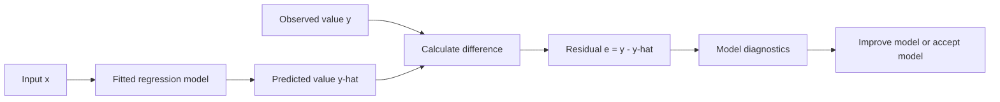
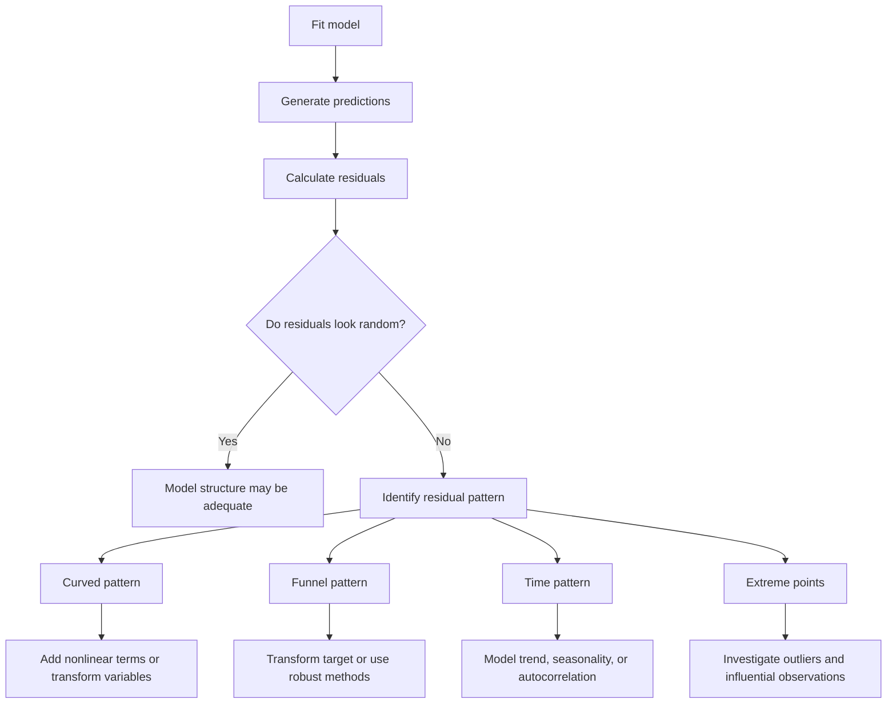
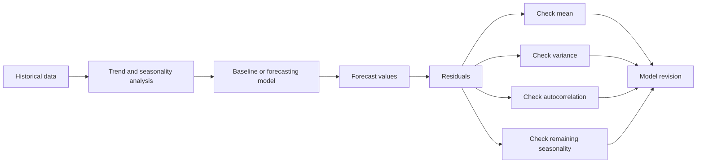
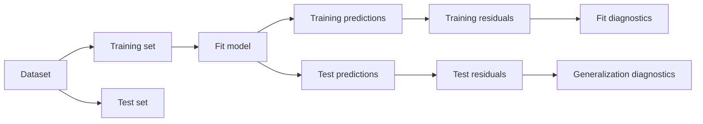
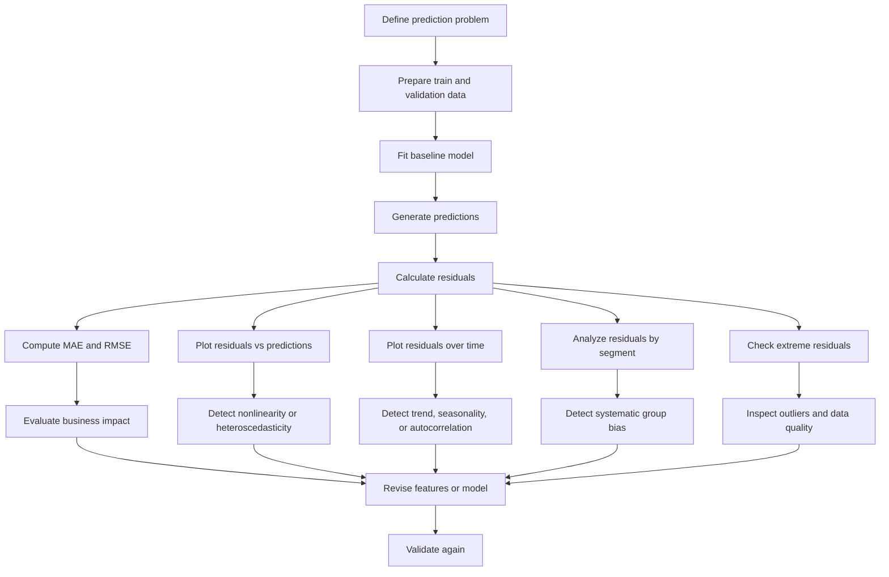

# 005 - Residual

**Course:** 01 - Math, Statistics and Econometrics
**Module:** Module 03 - Econometrics and Time Series
**Content Group:** Econometrics Fundamentals
**Roadmap Source:** Econometrics and Time Series / Econometrics Fundamentals
**Lesson Type:** Econometrics and Time Series
**Order in Module:** 005
**Suggested Duration:** 22 minutes

---

## 1. Overview

A **residual** is the difference between an observed value and the value predicted by a model.

Residuals show what the model failed to explain. They are among the most important diagnostic tools in regression, forecasting, experimentation, and machine learning.

After this lesson, you should understand:

* What a residual represents.
* How residuals are calculated.
* The difference between an error and a residual.
* How residual plots reveal model problems.
* How residuals are used in regression and time-series forecasting.
* How residual analysis connects model metrics to business decisions.

---

## 2. Learning Objectives

By the end of this lesson, you should be able to:

* Explain residuals in your own words.
* Calculate residuals from observed and predicted values.
* Distinguish residuals from theoretical errors.
* Interpret positive, negative, and zero residuals.
* Use residual plots to evaluate regression assumptions.
* Detect nonlinearity, heteroscedasticity, outliers, and time dependence.
* Apply residual analysis to a small dataset or forecasting problem.
* Translate residual patterns into practical model improvements.

---

## 3. Core Concept

Suppose a model predicts a target value (y_i) using input features (x_i).

The model produces a predicted value:

$$
\hat{y}_i
$$

The residual for observation (i) is:

$$
e_i = y_i - \hat{y}_i
$$

where:

* (y_i) is the observed value.
* (\hat{y}_i) is the predicted value.
* (e_i) is the residual.

In plain language:

```text
Residual = Actual value - Predicted value
```

---

## 4. Residual Interpretation

The sign of the residual tells us the direction of the prediction error.

### Positive residual

If:

$$
e_i > 0
$$

then:

$$
y_i > \hat{y}_i
$$

The model predicted a value that was too low.

This is called **underprediction**.

### Negative residual

If:

$$
e_i < 0
$$

then:

$$
y_i < \hat{y}_i
$$

The model predicted a value that was too high.

This is called **overprediction**.

### Zero residual

If:

$$
e_i = 0
$$

then:

$$
y_i = \hat{y}_i
$$

The prediction exactly matches the observed value.

---

## 5. Simple Example

Assume a model predicts monthly sales.

| Month    | Actual Sales | Predicted Sales | Residual |
| -------- | -----------: | --------------: | -------: |
| January  |          120 |             110 |       10 |
| February |          150 |             160 |      -10 |
| March    |          130 |             130 |        0 |
| April    |          180 |             155 |       25 |

The residual for January is:

$$
e_1 = 120 - 110 = 10
$$

The model underpredicted January sales by 10 units.

The residual for February is:

$$
e_2 = 150 - 160 = -10
$$

The model overpredicted February sales by 10 units.

The residual for April is:

$$
e_4 = 180 - 155 = 25
$$

The large positive residual suggests that the model missed an important factor, such as a promotion, holiday, or seasonal event.

---

## 6. Residual in Linear Regression

A simple linear regression model is written as:

$$
y_i = \beta_0 + \beta_1 x_i + \varepsilon_i
$$

where:

* (\beta_0) is the intercept.
* (\beta_1) is the slope.
* (x_i) is the input variable.
* (\varepsilon_i) is the theoretical error term.

After fitting the model, we estimate the coefficients:

$$
\hat{y}_i = \hat{\beta}_0 + \hat{\beta}_1 x_i
$$

The residual is:

$$
e_i = y_i - \hat{y}_i
$$

Therefore:

$$
e_i = y_i - \left(\hat{\beta}_0 + \hat{\beta}_1 x_i\right)
$$

The residual is the vertical distance between a data point and the fitted regression line.



---

## 7. Error Term vs Residual

The terms **error** and **residual** are related, but they are not identical.

### Error term

The theoretical error is:

$$
\varepsilon_i = y_i - E[y_i \mid x_i]
$$

It measures the difference between the observed value and the true population relationship.

The true expected value:

$$
E[y_i \mid x_i]
$$

is usually unknown.

Therefore, the true error cannot normally be observed.

### Residual

The residual is:

$$
e_i = y_i - \hat{y}_i
$$

It measures the difference between the observed value and the fitted model prediction.

Residuals can be calculated after training the model.

| Concept  | Formula                                 | Observable? |
| -------- | --------------------------------------- | ----------- |
| Error    | (\varepsilon_i = y_i - E[y_i \mid x_i]) | Usually no  |
| Residual | (e_i = y_i - \hat{y}_i)                 | Yes         |

Residuals are estimates or observable proxies for the underlying errors.

---

## 8. Residuals in Ordinary Least Squares

Ordinary Least Squares, or OLS, chooses model coefficients that minimize the sum of squared residuals.

The OLS objective is:

$$
\min_{\beta_0,\beta_1,\ldots,\beta_p}
\sum_{i=1}^{n} e_i^2
$$

Since:

$$
e_i = y_i - \hat{y}_i
$$

the objective can also be written as:

$$
\min_{\beta_0,\beta_1,\ldots,\beta_p}
\sum_{i=1}^{n}
\left(
y_i -
\beta_0 -
\beta_1 x_{i1} -
\cdots -
\beta_p x_{ip}
\right)^2
$$

Squaring residuals has two main effects:

1. Positive and negative residuals do not cancel each other.
2. Large residuals receive a stronger penalty.

For example:

$$
2^2 = 4
$$

but:

$$
10^2 = 100
$$

A prediction error of 10 receives 25 times more penalty than an error of 2.

---

## 9. Important OLS Residual Properties

When a linear regression model includes an intercept, OLS residuals satisfy several useful properties.

### 9.1 Residuals sum to zero

$$
\sum_{i=1}^{n} e_i = 0
$$

Therefore, their sample mean is zero:

$$
\bar{e} = \frac{1}{n}\sum_{i=1}^{n}e_i = 0
$$

This does not mean the model is accurate. Large positive and negative residuals can still offset each other.

### 9.2 Residuals are orthogonal to the predictors

For each predictor used in the OLS model:

$$
\sum_{i=1}^{n} x_i e_i = 0
$$

This means the fitted residuals have zero sample covariance with the included predictor under standard OLS conditions.

### 9.3 Residuals are orthogonal to fitted values

$$
\sum_{i=1}^{n} \hat{y}_i e_i = 0
$$

These are mathematical properties of the fitted training data. They do not guarantee that the model will perform well on unseen data.

---

## 10. Why Residual Analysis Matters

A model metric provides a summary score. Residual analysis reveals where and why the model fails.

Residuals can help detect:

* Missing nonlinear relationships.
* Unequal error variance.
* Time dependence.
* Seasonality.
* Outliers.
* Influential observations.
* Missing variables.
* Incorrect transformations.
* Data leakage.
* Model bias for specific groups.
* Changes in the data-generating process.

A good model should not leave a predictable pattern in its residuals.

The ideal residuals behave approximately like random noise.



---

## 11. Residual Plot

A common diagnostic chart plots residuals against predicted values.

* Horizontal axis: predicted values (\hat{y}_i)
* Vertical axis: residuals (e_i)

A horizontal reference line is placed at:

$$
e_i = 0
$$

### Ideal pattern

A healthy residual plot should show:

* Points distributed randomly around zero.
* No obvious curve.
* Roughly constant vertical spread.
* No long sequences of positive or negative residuals.
* Few unexplained extreme observations.

```text
Residual
   ^
 + |      .   .      .
   |  .       .  .
 0 |--------------------------> Predicted value
   |     .       .       .
 - |  .      .       .
```

This pattern suggests that the model has captured most systematic structure.

---

## 12. Common Residual Patterns

### 12.1 Curved residual pattern

```text
Residual
   ^
 + | .                 .
   |    .           .
 0 |-------.-----.-------------> Predicted value
   |          .
 - |
```

A curved pattern suggests that the relationship is nonlinear.

Possible solutions:

* Add polynomial terms.
* Add interaction terms.
* Transform the input.
* Transform the target.
* Use a nonlinear model.
* Use a tree-based model.

For example, the true relationship may be:

$$
y = \beta_0 + \beta_1 x + \beta_2 x^2 + \varepsilon
$$

but the fitted model only includes (x).

---

### 12.2 Funnel-shaped residual pattern

```text
Residual
   ^
 + |                     .   .
   |              .  .
 0 |----.----.------------------> Predicted value
   |        .       .
 - |                    .    .
```

A funnel shape means the residual variance changes as predictions increase.

This problem is called **heteroscedasticity**.

Possible solutions:

* Apply a logarithmic transformation.
* Use heteroscedasticity-robust standard errors.
* Use weighted least squares.
* Model the variance explicitly.
* Use a different probability distribution.

---

### 12.3 Residuals grouped above or below zero

If a subgroup consistently has positive residuals, the model systematically underpredicts that group.

If a subgroup consistently has negative residuals, the model systematically overpredicts that group.

This may indicate:

* Missing group-level information.
* Sampling bias.
* Model unfairness.
* Different relationships across groups.
* Distribution shift.

Residuals should therefore be analyzed not only globally but also by important business segments.

Examples include:

* Customer region.
* Product category.
* User subscription tier.
* Device type.
* Age group.
* Acquisition channel.

---

### 12.4 Isolated extreme residuals

A very large residual may indicate:

* A data-entry error.
* An unusual event.
* An outlier.
* A missing explanatory variable.
* A rare but valid case.
* A structural change in the process.

Large residuals should be investigated rather than automatically removed.

---

### 12.5 Residuals ordered over time

```text
Residual
   ^
 + | . . .        . . .
 0 |-------.--------------------> Time
 - |          . . .
```

Long runs of positive or negative residuals suggest that the errors are not independent.

Possible causes include:

* Trend.
* Seasonality.
* Autocorrelation.
* Delayed effects.
* Structural breaks.
* Missing lag variables.

---

## 13. Residuals in Time-Series Forecasting

For a time-series forecast, the residual at time (t) is:

$$
e_t = y_t - \hat{y}_{t \mid t-1}
$$

where:

* (y_t) is the observed value at time (t).
* (\hat{y}_{t \mid t-1}) is the forecast made using information available before time (t).

A well-specified forecasting model should produce residuals that resemble **white noise**.

White-noise residuals should have:

1. Mean close to zero.
2. Approximately constant variance.
3. No meaningful autocorrelation.
4. No remaining trend.
5. No remaining seasonality.



---

## 14. Residual Autocorrelation

Residual autocorrelation means that current residuals are related to previous residuals.

For lag (k), the autocorrelation can be expressed conceptually as:

$$
\rho_k =
\operatorname{Corr}(e_t, e_{t-k})
$$

If residual autocorrelation is large, the model has left time-dependent information unexplained.

For example:

* A positive residual today is often followed by another positive residual tomorrow.
* A negative residual this week is followed by another negative residual next week.

Possible improvements include:

* Add lag features.
* Add rolling statistics.
* Model seasonality.
* Use ARIMA or SARIMA.
* Use exponential smoothing.
* Include external variables.
* Use a model that directly captures sequence dependence.

---

## 15. Residual Metrics

Residuals are the building blocks of many evaluation metrics.

### 15.1 Sum of Squared Errors

$$
SSE = \sum_{i=1}^{n} e_i^2
$$

SSE measures the total squared prediction error.

Lower is better when comparing models on the same dataset and target scale.

---

### 15.2 Mean Squared Error

$$
MSE = \frac{1}{n}\sum_{i=1}^{n}e_i^2
$$

MSE gives large residuals more influence because errors are squared.

---

### 15.3 Root Mean Squared Error

$$
RMSE =
\sqrt{
\frac{1}{n}\sum_{i=1}^{n}e_i^2
}
$$

RMSE has the same unit as the target variable.

If the target is measured in dollars, RMSE is also measured in dollars.

---

### 15.4 Mean Absolute Error

$$
MAE =
\frac{1}{n}\sum_{i=1}^{n}|e_i|
$$

MAE is easier to interpret and is less sensitive to extreme residuals than RMSE.

---

### 15.5 Mean Residual

$$
\text{Mean Residual}
====================

\frac{1}{n}\sum_{i=1}^{n}e_i
$$

A nonzero mean residual on validation or production data can reveal systematic bias.

* Positive mean residual: overall underprediction.
* Negative mean residual: overall overprediction.

For OLS training data with an intercept, the mean residual is mathematically zero. Therefore, it is more informative to inspect this measure on validation, test, or production data.

---

## 16. Standardized Residuals

Raw residuals may not be directly comparable because observations can have different uncertainty levels.

A simplified standardized residual is:

$$
r_i = \frac{e_i}{\hat{\sigma}}
$$

where (\hat{\sigma}) estimates the residual standard deviation.

A more complete regression diagnostic adjusts for leverage:

$$
r_i =
\frac{e_i}
{\hat{\sigma}\sqrt{1-h_{ii}}}
$$

where (h_{ii}) is the observation's leverage.

As a practical rule:

* (|r_i| < 2): usually not unusual.
* (|r_i| > 2): worth investigating.
* (|r_i| > 3): potentially extreme.

These are diagnostic guidelines, not automatic deletion rules.

---

## 17. Leverage and Influence

A large residual does not always mean an observation strongly changes the fitted model.

Two concepts should be separated:

### Residual

Measures how far the observed target is from the prediction.

### Leverage

Measures how unusual an observation's feature values are.

An observation can have:

* A large residual but low leverage.
* A small residual but high leverage.
* Both a large residual and high leverage.

An observation with both high leverage and a large residual may be highly influential.

Cook's distance is one common influence diagnostic:

$$
D_i =
\frac{e_i^2}{p\hat{\sigma}^2}
\cdot
\frac{h_{ii}}{(1-h_{ii})^2}
$$

where (p) is the number of estimated model parameters.

Influential observations should be inspected for:

* Data errors.
* Rare business cases.
* Distribution shift.
* Missing variables.
* Incorrect model assumptions.

---

## 18. Training Residuals vs Test Residuals

Training residuals are calculated on data used to fit the model:

$$
e_i^{\text{train}}
==================

## y_i^{\text{train}}

\hat{y}_i^{\text{train}}
$$

Test residuals are calculated on unseen data:

$$
e_i^{\text{test}}
=================

## y_i^{\text{test}}

\hat{y}_i^{\text{test}}
$$

Training residuals are usually smaller because the model was optimized using the training observations.

A model can have very small training residuals but large test residuals. This is a sign of overfitting.



Test and validation residuals are more useful for estimating real-world model performance.

---

## 19. Residuals and Data Leakage

Time-series leakage occurs when a model uses information that would not have been available at prediction time.

Leakage often creates:

* Unrealistically small validation residuals.
* Excellent offline metrics.
* Large production residuals.
* Sudden performance collapse after deployment.

For time-dependent data, use chronological splitting:

```text
Past data -> Training
Later data -> Validation
Newest data -> Test
```

Do not randomly mix future observations into the training set when the deployment task predicts the future.

---

## 20. Practical Python Demo

The following example fits a linear regression model and analyzes its residuals.

```python
import numpy as np
import pandas as pd
import matplotlib.pyplot as plt

from sklearn.linear_model import LinearRegression
from sklearn.metrics import mean_absolute_error, mean_squared_error
from sklearn.model_selection import train_test_split

# Example data
data = pd.DataFrame(
    {
        "advertising_spend": [
            10, 15, 20, 25, 30,
            35, 40, 45, 50, 55,
            60, 65, 70, 75, 80
        ],
        "sales": [
            24, 31, 36, 43, 48,
            53, 61, 64, 72, 75,
            83, 86, 95, 97, 108
        ],
    }
)

X = data[["advertising_spend"]]
y = data["sales"]

X_train, X_test, y_train, y_test = train_test_split(
    X,
    y,
    test_size=0.30,
    random_state=42,
)

model = LinearRegression()
model.fit(X_train, y_train)

predictions = model.predict(X_test)
residuals = y_test.to_numpy() - predictions

results = X_test.copy()
results["actual_sales"] = y_test
results["predicted_sales"] = predictions
results["residual"] = residuals

mae = mean_absolute_error(y_test, predictions)
rmse = np.sqrt(mean_squared_error(y_test, predictions))

print(results.sort_index())
print(f"MAE: {mae:.2f}")
print(f"RMSE: {rmse:.2f}")
print(f"Mean residual: {residuals.mean():.2f}")

plt.scatter(predictions, residuals)
plt.axhline(y=0, linestyle="--")
plt.xlabel("Predicted sales")
plt.ylabel("Residual")
plt.title("Residuals vs Predicted Sales")
plt.show()
```

---

## 21. How to Interpret the Demo

After running the code, inspect:

### Residual center

Are the test residuals centered around zero?

A positive average suggests that the model generally underpredicts.

A negative average suggests that the model generally overpredicts.

### Residual spread

Are the residuals small enough for the business use case?

An RMSE of 10 may be acceptable for monthly sales of 10,000 units but unacceptable for daily sales of 20 units.

### Residual pattern

Do residuals show a curve, funnel, cluster, or time pattern?

A visible structure means that additional information remains available for the model to learn.

### Extreme observations

Are a few observations responsible for most of the total error?

Investigate those records separately.

---

## 22. Business Example: Sales Forecasting

Suppose a retailer predicts daily sales.

The model produces an RMSE of 100 units. This metric alone does not explain where the model fails.

Residual analysis reveals:

* Monday residuals are close to zero.
* Weekend residuals are mostly positive.
* Holiday residuals are extremely positive.
* High-volume stores have larger residual variance.
* Residuals remain positively autocorrelated.

These findings suggest that the model is missing:

* Day-of-week effects.
* Holiday indicators.
* Store-level differences.
* Nonconstant variance.
* Lagged sales information.

A better model may include:

```text
Sales forecast
    = trend
    + weekday effect
    + holiday effect
    + promotion effect
    + store effect
    + lagged sales
    + random residual
```

The business interpretation is:

> The model systematically underestimates weekend and holiday demand. Inventory recommendations based on the current forecast may cause stockouts during high-demand periods.

This is more actionable than reporting RMSE alone.

---

## 23. Residual Analysis Workflow



---

## 24. Common Mistakes

### Mistake 1: Looking only at aggregate metrics

A single RMSE or MAE value can hide important residual patterns.

**Better approach:** Combine metrics with residual plots and segment-level analysis.

---

### Mistake 2: Assuming zero mean residual means a good model

OLS residuals on training data sum to zero when the model includes an intercept.

A model can still have:

* Large residuals.
* Nonlinear patterns.
* Heteroscedasticity.
* Autocorrelation.
* Poor test performance.

---

### Mistake 3: Removing every large residual

Large residuals may represent valuable rare events rather than incorrect data.

**Better approach:** Investigate before removing.

---

### Mistake 4: Checking residuals only on training data

Training residuals can look excellent even when the model overfits.

**Better approach:** Analyze residuals on validation, test, and production data.

---

### Mistake 5: Ignoring time order

Random splitting can create leakage in forecasting problems.

**Better approach:** Use chronological validation or rolling-window validation.

---

### Mistake 6: Treating residual normality as the main requirement

For pure prediction, residual normality is often less important than:

* Generalization performance.
* Stable variance.
* Lack of systematic bias.
* Lack of time dependence.

Normality becomes more important for some forms of statistical inference and confidence interval construction.

---

### Mistake 7: Interpreting residuals without business scale

A residual of 50 may be tiny or enormous depending on the target.

Always compare residual magnitude with:

* Typical target values.
* Operational tolerance.
* Financial cost.
* Service-level requirements.
* Existing baseline performance.

---

## 25. Practical Exercise

Use a small sales, housing, marketing, or time-series dataset.

### Task 1: Fit a baseline model

Choose one:

* Linear regression.
* Mean baseline.
* Previous-period forecast.
* Moving-average forecast.
* ARIMA baseline.

### Task 2: Calculate residuals

Use:

$$
e_i = y_i - \hat{y}_i
$$

Create a table containing:

* Actual value.
* Predicted value.
* Residual.
* Absolute residual.
* Squared residual.

### Task 3: Create diagnostic charts

Create at least:

1. Actual values vs predicted values.
2. Residuals vs predicted values.
3. Residuals over observation order or time.
4. Residual distribution.
5. Residuals by an important business segment.

### Task 4: Answer diagnostic questions

* Are residuals centered around zero?
* Is there a visible curve?
* Does residual variance change?
* Are residuals correlated over time?
* Are there extreme observations?
* Does one subgroup have consistently positive or negative residuals?
* Could data leakage be present?
* Which missing feature could explain the largest residual pattern?

### Task 5: Write a business conclusion

Use a structure such as:

```text
The model performs reasonably for regular weekdays but systematically
underpredicts weekend demand. Residual variance also increases for
high-volume stores. Adding weekday, holiday, promotion, and store-level
features may reduce forecast error and prevent inventory shortages.
```

---

## 26. Suggested Portfolio Artifact

Create a notebook titled:

```text
Residual Diagnostics for Sales Forecasting
```

Recommended sections:

1. Business problem.
2. Dataset description.
3. Baseline model.
4. Residual calculation.
5. Residual metrics.
6. Residual plots.
7. Time-series diagnostics.
8. Segment-level residual analysis.
9. Model improvements.
10. Business recommendation.
11. Assumptions and limitations.

Possible outputs include:

* Jupyter notebook.
* Diagnostic dashboard.
* Model evaluation report.
* Forecasting API.
* Residual monitoring job.
* Dockerized prediction service.
* Portfolio article.

---

## 27. Production Monitoring

Residual analysis should continue after deployment.

In production, record:

```text
prediction_id
timestamp
model_version
predicted_value
actual_value
residual
absolute_residual
data_segment
```

Useful monitoring statistics include:

* Mean residual.
* MAE.
* RMSE.
* Residual standard deviation.
* Percentage of residuals above a threshold.
* Residuals by customer or product segment.
* Residuals over time.
* Residual autocorrelation.
* Changes between model versions.

A production warning can be triggered when:

$$
|\text{Mean Residual}| > \text{Bias Threshold}
$$

or:

$$
RMSE_{\text{current}}

>

RMSE_{\text{reference}}
\times
(1 + \delta)
$$

where (\delta) is the permitted performance degradation.

A changing residual pattern may indicate:

* Data drift.
* Concept drift.
* Broken upstream features.
* Seasonal changes.
* New customer behavior.
* Model degradation.

---

## 28. Completion Checklist

* [ ] I can define a residual in one sentence.
* [ ] I can calculate a residual using (e_i = y_i - \hat{y}_i).
* [ ] I understand positive and negative residuals.
* [ ] I can explain the difference between an error and a residual.
* [ ] I know why OLS minimizes squared residuals.
* [ ] I can create a residual plot.
* [ ] I can identify curved and funnel-shaped patterns.
* [ ] I can check residuals over time.
* [ ] I can analyze residuals by business segment.
* [ ] I understand why test residuals matter more than training residuals.
* [ ] I have recorded at least one assumption, limitation, or unanswered question.
* [ ] I have created a notebook, chart, model, report, API, or portfolio note.

---

## 29. Key Takeaways

1. A residual is the difference between an observed value and a model prediction.

$$
e_i = y_i - \hat{y}_i
$$

2. Positive residuals indicate underprediction.

3. Negative residuals indicate overprediction.

4. Residuals reveal information that aggregate metrics may hide.

5. Randomly scattered residuals around zero are generally desirable.

6. Curved residual patterns suggest missing nonlinear relationships.

7. Funnel-shaped patterns suggest changing error variance.

8. Time-dependent residuals indicate that trend, seasonality, or autocorrelation remains unexplained.

9. Large residuals should be investigated, not automatically removed.

10. Residual diagnostics should be performed on validation, test, and production data.

---

## 30. Related Outcome

Model relationships and time-dependent data using:

* Regression.
* OLS diagnostics.
* Residual analysis.
* Trend and seasonality decomposition.
* ARIMA-style forecasting.
* Validation workflows.
* Production model monitoring.

---

## 31. Related Project

### Mini Project: Sales Forecasting with Residual Diagnostics

Build a sales forecasting workflow that includes:

* Trend analysis.
* Seasonality analysis.
* Baseline forecasting.
* Regression or ARIMA model.
* Residual plots.
* Autocorrelation checks.
* Segment-level error analysis.
* Business recommendations.

Example workflow:

```text
Historical sales
    -> data validation
    -> trend and seasonality analysis
    -> chronological split
    -> baseline forecast
    -> improved model
    -> residual diagnostics
    -> business recommendation
    -> production monitoring
```

---

## 32. Summary

A **residual** represents the part of an observation that a fitted model did not explain.

Residuals are not merely leftover numbers. They are diagnostic signals that can reveal:

* Missing relationships.
* Incorrect assumptions.
* Time dependence.
* Unequal variance.
* Outliers.
* Group-level bias.
* Data leakage.
* Model degradation.

A strong AI or Data Scientist does not stop after reporting MAE, RMSE, or (R^2). They inspect residuals, explain their patterns, connect them to the data-generating process, and translate those findings into model improvements and business actions.
