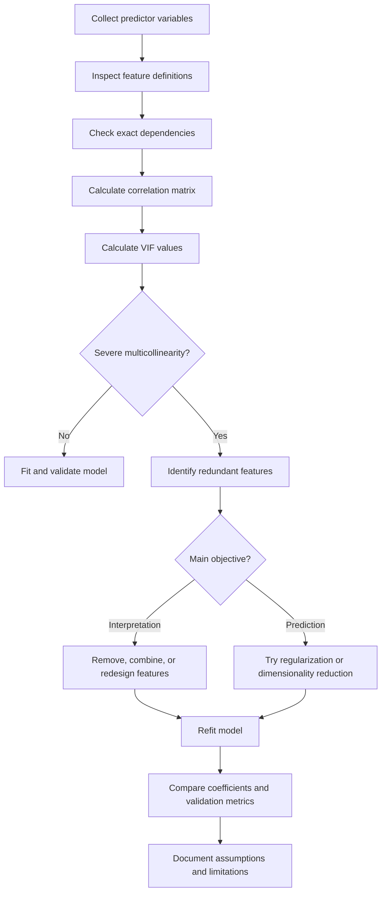
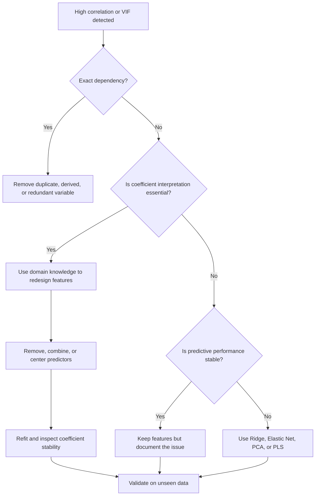

# 007 — Multicollinearity

**Course:** 01 — Math, Statistics, and Econometrics
**Module:** Module 03 — Econometrics and Time Series
**Content Group:** Econometrics Fundamentals
**Roadmap Source:** Econometrics and Time Series / Econometrics Fundamentals
**Lesson Type:** Econometrics and Time Series
**Order in Module:** 007
**Suggested Duration:** 22 minutes

---

## 1. Summary

This lesson explains **multicollinearity** in the context of econometrics, machine learning, and data science.

Multicollinearity occurs when two or more predictor variables in a regression model contain strongly overlapping information. It does not necessarily make the model's predictions inaccurate, but it can make individual coefficient estimates unstable, difficult to interpret, and sensitive to small changes in the data.

After this lesson, you should understand:

* What multicollinearity means.
* Why it affects regression coefficients.
* How to detect it using correlation analysis and the Variance Inflation Factor.
* When multicollinearity is a serious problem.
* How to reduce or manage it.
* How to document the issue in a practical data science workflow.

---

## 2. Learning Objectives

By the end of this lesson, you should be able to:

* Explain multicollinearity in your own words.
* Distinguish between perfect and imperfect multicollinearity.
* Describe how multicollinearity affects coefficient estimates and standard errors.
* Detect multicollinearity using correlation matrices, VIF, and model diagnostics.
* Apply appropriate remedies such as feature removal, feature combination, regularization, or dimensionality reduction.
* Explain why multicollinearity matters more for inference than for pure prediction.
* Build a small notebook that identifies and handles correlated predictors.

---

## 3. Core Concept

### 3.1 Definition

Consider a multiple linear regression model:

$$
y_i = \beta_0 + \beta_1 x_{i1} + \beta_2 x_{i2} + \cdots + \beta_p x_{ip} + \varepsilon_i
$$

where:

* $y_i$ is the target variable.
* $x_{i1}, x_{i2}, \ldots, x_{ip}$ are predictor variables.
* $\beta_0$ is the intercept.
* $\beta_1, \beta_2, \ldots, \beta_p$ are regression coefficients.
* $\varepsilon_i$ is the error term.

**Multicollinearity** exists when one predictor can be approximately or exactly represented as a linear combination of other predictors.

For example:

$$
x_3 \approx 2x_1 + 0.5x_2
$$

When this relationship is strong, the regression model has difficulty separating the independent contribution of $x_1$, $x_2$, and $x_3$.

---

### 3.2 Intuition

Suppose a model predicts house prices using:

* House area in square meters.
* Number of bedrooms.
* Number of bathrooms.
* Total number of rooms.

These features are likely related. Larger houses generally have more bedrooms, bathrooms, and rooms.

The model may still predict house prices well. However, it may struggle to determine whether the price increase is caused specifically by:

* An additional bedroom.
* An additional bathroom.
* A larger floor area.
* A larger total room count.

The predictors are competing to explain the same variation in the target.

---

## 4. Types of Multicollinearity

### 4.1 Perfect Multicollinearity

Perfect multicollinearity occurs when one predictor is an exact linear combination of other predictors.

For example:

$$
x_3 = x_1 + x_2
$$

In this situation, the design matrix does not have full column rank. Ordinary Least Squares cannot uniquely estimate all coefficients.

There are infinitely many coefficient combinations that produce the same fitted values.

### Example

Suppose a dataset contains:

* `height_m`
* `height_cm`

The relationship is exact:

$$
\text{height_cm} = 100 \times \text{height_m}
$$

Including both variables provides no new information.

One of them must be removed.

---

### 4.2 Imperfect Multicollinearity

Imperfect multicollinearity occurs when predictors are strongly related but not perfectly dependent.

For example:

$$
x_3 \approx 0.8x_1 + 0.3x_2
$$

The model can still estimate the coefficients, but the estimates may become:

* Unstable.
* Highly sensitive to the sample.
* Associated with large standard errors.
* Difficult to interpret.

This is the most common form of multicollinearity in real datasets.

---

### 4.3 Structural Multicollinearity

Structural multicollinearity is created by the way features are constructed.

Examples include:

* Including both $x$ and $x^2$.
* Creating interaction terms such as $x_1x_2$.
* Adding totals together with their components.
* Using multiple transformations of the same feature.

For example:

$$
\text{total_cost} = \text{material_cost} + \text{labor_cost}
$$

Including all three variables creates an exact dependency.

---

### 4.4 Data-Based Multicollinearity

Data-based multicollinearity arises from patterns in the observed sample.

For example, income and education may be highly correlated in a particular dataset even though they are not mathematically identical.

This type of multicollinearity can depend on:

* The population being studied.
* The selected time period.
* The sampling process.
* The geographic region.
* The range of observed values.

---

## 5. The Dummy Variable Trap

A common source of perfect multicollinearity is the **dummy variable trap**.

Suppose a categorical variable has three categories:

* Basic
* Standard
* Premium

You create three dummy variables:

* `is_basic`
* `is_standard`
* `is_premium`

For every observation:

$$
\text{is_basic}
+
\text{is_standard}
+
\text{is_premium}
= 1
$$

If the model also includes an intercept, one variable can be exactly derived from the others:

$$
\text{is_premium} = ## 1 ## \text{is_basic} \text{is_standard}
$$

This creates perfect multicollinearity.

### Solution

Use one category as the reference category and include only $k-1$ dummy variables for a categorical feature with $k$ categories.

For example:

* Include `is_standard`.
* Include `is_premium`.
* Treat `Basic` as the reference category.

---

## 6. Why Multicollinearity Is a Problem

### 6.1 Unstable Coefficient Estimates

When predictors are strongly correlated, small changes in the dataset can produce large changes in coefficient estimates.

A model fitted on one sample might estimate:

$$
\hat{\beta}_1 = 2.5
$$

A slightly different sample might estimate:

$$
\hat{\beta}_1 = -0.8
$$

even when the overall predictions remain similar.

---

### 6.2 Large Standard Errors

The estimated variance of an OLS coefficient depends partly on how much of a predictor's variation remains after accounting for the other predictors.

For predictor $x_j$:

$$
\operatorname{Var}(\hat{\beta}_j) = \frac{\sigma^2} {\operatorname{SST}_j(1-R_j^2)}
$$

where:

* $\sigma^2$ is the error variance.
* $\operatorname{SST}_j$ is the total variation of predictor $x_j$.
* $R_j^2$ is obtained by regressing $x_j$ on all other predictors.

As $R_j^2$ approaches $1$:

$$
1-R_j^2 \rightarrow 0
$$

Therefore:

$$
\operatorname{Var}(\hat{\beta}_j) \rightarrow \infty
$$

Strong multicollinearity increases the uncertainty of the coefficient estimate.

---

### 6.3 Wider Confidence Intervals

Because standard errors increase, confidence intervals become wider.

A coefficient may have an estimate such as:

$$
\hat{\beta}_j = 4.2
$$

but a wide confidence interval:

$$
[-2.1,\ 10.5]
$$

This makes it difficult to determine whether the predictor has a meaningful effect.

---

### 6.4 Insignificant Individual Predictors

A regression model may have:

* A high $R^2$.
* A significant overall F-test.
* Several individually insignificant coefficients.

This can happen when a group of correlated variables jointly explains the target, but the model cannot clearly separate their individual contributions.

---

### 6.5 Unexpected Coefficient Signs

A predictor that has a positive relationship with the target in isolation may receive a negative coefficient in a multiple regression model.

This is not always an error. The coefficient measures the predictor's effect while holding other predictors constant.

However, strong multicollinearity can make these conditional estimates unstable and produce signs that are difficult to explain.

---

### 6.6 Sensitivity to Feature Selection

Removing or adding one correlated feature can substantially change the coefficients of other features.

This is especially dangerous when the goal is:

* Causal interpretation.
* Policy analysis.
* Economic explanation.
* Business decision-making.
* Feature importance reporting.

---

## 7. What Multicollinearity Does Not Necessarily Cause

Multicollinearity does not automatically mean that:

* The regression model is invalid.
* The predictions are poor.
* The model is biased.
* The residual assumptions are violated.
* Every correlated feature must be removed.

Under the standard OLS assumptions, imperfect multicollinearity does not by itself create biased coefficient estimates.

However, it increases coefficient variance and reduces interpretability.

A model can still predict well because correlated predictors may collectively contain useful information.

---

## 8. Inference Versus Prediction

The importance of multicollinearity depends on the model's purpose.

### When inference is the goal

Multicollinearity is a serious concern when you need to answer questions such as:

* How much does education affect income?
* What is the effect of advertising spend while controlling for promotions?
* Does a policy variable have a statistically significant impact?
* Which factor has the strongest independent effect?

In these situations, stable and interpretable coefficients matter.

### When prediction is the goal

Multicollinearity may be less serious when the primary objective is accurate prediction on unseen data.

A model can produce strong predictions even when individual coefficients are unstable.

However, multicollinearity can still:

* Increase model sensitivity.
* Complicate feature importance.
* Reduce robustness under distribution shifts.
* Create unnecessary model complexity.

---

## 9. Multicollinearity Workflow



---

## 10. Detecting Multicollinearity

No single diagnostic is sufficient in every case. A practical analysis should combine multiple methods.

---

### 10.1 Domain and Feature Definition Review

Start by inspecting how features were created.

Look for:

* The same quantity in different units.
* Totals included with their components.
* Duplicate columns.
* Highly similar business metrics.
* Dummy variables for all categories.
* Lagged or rolling variables derived from the same source.
* Polynomial and interaction terms.
* Ratios that contain other model variables.

This step can reveal exact dependencies before any statistical calculation.

---

### 10.2 Pairwise Correlation Matrix

The Pearson correlation coefficient between two variables $x$ and $z$ is:

$$
r_{xz} = \frac{ \sum_{i=1}^{n}(x_i-\bar{x})(z_i-\bar{z}) }{ \sqrt{ \sum_{i=1}^{n}(x_i-\bar{x})^2 } \sqrt{ \sum_{i=1}^{n}(z_i-\bar{z})^2 } }
$$

Values close to $1$ or $-1$ indicate strong pairwise linear relationships.

A commonly used warning range is:

$$
|r| > 0.8
$$

However, this is only a heuristic.

### Limitation

A correlation matrix detects pairwise relationships but may miss multicollinearity involving combinations of multiple variables.

For example:

$$
x_3 \approx x_1 + x_2
$$

Neither correlation $\operatorname{Corr}(x_3,x_1)$ nor $\operatorname{Corr}(x_3,x_2)$ must be extremely high, even though $x_3$ is strongly explained by the combination of $x_1$ and $x_2$.

---

### 10.3 Variance Inflation Factor

The **Variance Inflation Factor**, or VIF, measures how much the variance of a coefficient is inflated because of relationships with other predictors.

For each predictor $x_j$:

1. Regress $x_j$ on all other predictor variables.
2. Obtain the resulting $R_j^2$.
3. Calculate:

$$
\operatorname{VIF}_j = \frac{1}{1-R_j^2}
$$

### Interpretation

|         VIF value | Typical interpretation                           |
| ----------------: | ------------------------------------------------ |
|               $1$ | No linear relationship with the other predictors |
|        $1$ to $5$ | Low to moderate multicollinearity                |
|       $5$ to $10$ | Potentially problematic                          |
| Greater than $10$ | Severe multicollinearity                         |

These thresholds are guidelines, not universal rules.

The acceptable level depends on:

* The sample size.
* The research question.
* The cost of unstable interpretation.
* The model's predictive performance.
* The expected relationships between features.

---

### 10.4 Tolerance

Tolerance is the inverse of VIF:

$$
\operatorname{Tolerance}_j = # 1-R_j^2 \frac{1}{\operatorname{VIF}_j}
$$

Low tolerance means that little unique variation remains in the predictor after accounting for the other predictors.

A tolerance value below $0.1$ is often treated as a warning sign:

$$
\operatorname{Tolerance}_j < 0.1
$$

---

### 10.5 Condition Number

The condition number is based on the singular values of the design matrix:

$$
\kappa(X) = \frac{\sigma_{\max}(X)} {\sigma_{\min}(X)}
$$

where:

* $\sigma_{\max}(X)$ is the largest singular value.
* $\sigma_{\min}(X)$ is the smallest singular value.

A large condition number indicates that the design matrix is close to being linearly dependent.

Typical rough guidelines are:

|       Condition number | Interpretation                       |
| ---------------------: | ------------------------------------ |
|             Below $10$ | Usually low concern                  |
|           $10$ to $30$ | Moderate concern                     |
|             Above $30$ | Potentially strong multicollinearity |
| Very large or infinite | Near-perfect or perfect dependency   |

The condition number is affected by feature scaling. Standardizing the predictors before interpreting it is often appropriate.

---

### 10.6 Coefficient Stability

Fit the model using:

* Different train-test splits.
* Bootstrap samples.
* Different subsets of predictors.
* Cross-validation folds.

Then compare coefficient estimates.

Large changes in coefficient magnitude or sign may indicate instability caused by multicollinearity.

---

### 10.7 Eigenvalue Analysis

Multicollinearity can also be detected by examining the eigenvalues of:

$$
X^\top X
$$

Very small eigenvalues indicate directions in feature space with little independent variation.

This diagnostic is useful for advanced econometric analysis but is less commonly used in basic workflows than correlation and VIF.

---

## 11. VIF Example

Suppose `advertising_spend` can be strongly predicted from the other variables, producing:

$$
R_j^2 = 0.90
$$

Its VIF is:

$$
\operatorname{VIF}_j = # \frac{1}{1-0.90} 10
$$

The variance of its coefficient is ten times larger than it would be if the predictor were uncorrelated with the other predictors.

If:

$$
R_j^2 = 0.99
$$

then:

$$
\operatorname{VIF}_j = # \frac{1}{1-0.99} 100
$$

The coefficient estimate is likely to be extremely unstable.

---

## 12. Practical Python Demo

### 12.1 Create a Dataset with Correlated Predictors

```python
import numpy as np
import pandas as pd

rng = np.random.default_rng(seed=42)
n = 500

house_size = rng.normal(loc=150, scale=30, size=n)

# Bedrooms are strongly related to house size.
bedrooms = 0.025 * house_size + rng.normal(
    loc=0,
    scale=0.35,
    size=n,
)

# Total rooms contain information similar to size and bedrooms.
total_rooms = (
    0.04 * house_size
    + 0.8 * bedrooms
    + rng.normal(loc=0, scale=0.4, size=n)
)

distance_to_center = rng.normal(loc=10, scale=3, size=n)

price = (
    50_000
    + 2_000 * house_size
    + 8_000 * bedrooms
    - 4_000 * distance_to_center
    + rng.normal(loc=0, scale=20_000, size=n)
)

df = pd.DataFrame(
    {
        "house_size": house_size,
        "bedrooms": bedrooms,
        "total_rooms": total_rooms,
        "distance_to_center": distance_to_center,
        "price": price,
    }
)

print(df.head())
```

---

### 12.2 Inspect Pairwise Correlations

```python
feature_columns = [
    "house_size",
    "bedrooms",
    "total_rooms",
    "distance_to_center",
]

correlation_matrix = df[feature_columns].corr()

print(correlation_matrix.round(3))
```

The correlation matrix may reveal strong relationships among:

* `house_size`
* `bedrooms`
* `total_rooms`

However, correlation alone should not be used as the final diagnostic.

---

### 12.3 Visualize the Correlation Matrix

```python
import matplotlib.pyplot as plt

fig, ax = plt.subplots(figsize=(8, 6))

image = ax.imshow(
    correlation_matrix,
    vmin=-1,
    vmax=1,
)

ax.set_xticks(range(len(feature_columns)))
ax.set_xticklabels(feature_columns, rotation=45, ha="right")

ax.set_yticks(range(len(feature_columns)))
ax.set_yticklabels(feature_columns)

for row in range(len(feature_columns)):
    for column in range(len(feature_columns)):
        value = correlation_matrix.iloc[row, column]
        ax.text(
            column,
            row,
            f"{value:.2f}",
            ha="center",
            va="center",
        )

fig.colorbar(image, ax=ax, label="Correlation")
ax.set_title("Predictor Correlation Matrix")
fig.tight_layout()
plt.show()
```

---

### 12.4 Calculate VIF

```python
import statsmodels.api as sm
from statsmodels.stats.outliers_influence import (
    variance_inflation_factor,
)

X = df[feature_columns]
X_with_intercept = sm.add_constant(X)

vif_table = pd.DataFrame(
    {
        "feature": X_with_intercept.columns,
        "VIF": [
            variance_inflation_factor(
                X_with_intercept.values,
                index,
            )
            for index in range(X_with_intercept.shape[1])
        ],
    }
)

print(vif_table)
```

Do not normally interpret the intercept's VIF as a feature diagnostic. Focus on the predictor variables.

---

### 12.5 Fit an OLS Model

```python
y = df["price"]

ols_model = sm.OLS(
    y,
    X_with_intercept,
).fit()

print(ols_model.summary())
```

Inspect:

* Coefficient signs.
* Coefficient magnitudes.
* Standard errors.
* p-values.
* Confidence intervals.
* Condition number.
* Overall $R^2$.

You may observe that the model has a strong overall fit while some correlated predictors have unstable or statistically insignificant coefficients.

---

### 12.6 Remove a Redundant Feature

Suppose `total_rooms` provides little independent information after accounting for `house_size` and `bedrooms`.

```python
reduced_features = [
    "house_size",
    "bedrooms",
    "distance_to_center",
]

X_reduced = sm.add_constant(df[reduced_features])

reduced_model = sm.OLS(
    y,
    X_reduced,
).fit()

print(reduced_model.summary())
```

Compare the original and reduced models:

```python
comparison = pd.DataFrame(
    {
        "model": ["Original", "Reduced"],
        "adjusted_r_squared": [
            ols_model.rsquared_adj,
            reduced_model.rsquared_adj,
        ],
        "aic": [
            ols_model.aic,
            reduced_model.aic,
        ],
        "bic": [
            ols_model.bic,
            reduced_model.bic,
        ],
    }
)

print(comparison)
```

Removing a redundant feature may:

* Reduce VIF.
* Stabilize coefficients.
* Decrease standard errors.
* Improve interpretability.
* Preserve most of the predictive performance.

---

## 13. Solutions and Remedies

There is no universal solution. The correct action depends on the model's purpose and the meaning of the variables.

---

### 13.1 Remove a Redundant Predictor

Remove one feature when:

* Two features represent nearly the same concept.
* One variable is directly derived from another.
* One feature has lower data quality.
* One feature is less interpretable.
* One feature is not available during deployment.
* Domain knowledge identifies one as redundant.

Do not remove features only because their pairwise correlation exceeds an arbitrary threshold.

---

### 13.2 Combine Related Features

Several correlated variables may represent one underlying concept.

For example:

* Number of bedrooms.
* Number of bathrooms.
* Total number of rooms.

These could be combined into a property-size or capacity index.

Another example:

$$
\text{total_marketing_spend} = \text{search_spend} + \text{social_spend} + \text{display_spend}
$$

Use the combined feature when the total has clearer business meaning than the individual components.

---

### 13.3 Use Domain Knowledge

Statistical diagnostics do not understand business meaning.

Before removing a variable, ask:

* Does it measure a concept that matters independently?
* Is one variable a consequence of another?
* Which variable would a stakeholder understand?
* Which variable can be controlled operationally?
* Which variable will be available at prediction time?
* Is the goal causal explanation or prediction?

---

### 13.4 Collect More Data

A larger and more diverse sample may provide more independent variation among predictors.

For example, if income and education are nearly identical in a narrow sample, collecting data from a broader population may reduce their observed dependence.

However, more rows do not solve exact mathematical dependencies.

---

### 13.5 Center Variables

Centering is useful when multicollinearity is created by polynomial or interaction terms.

For a variable $x$:

$$
x_{\text{centered}} = x-\bar{x}
$$

Then construct:

$$
x_{\text{centered}}^2
$$

instead of directly using $x^2$.

Centering can reduce non-essential multicollinearity between:

* $x$ and $x^2$.
* Main effects and interaction terms.
* The intercept and uncentered predictors.

Centering does not eliminate essential relationships between genuinely similar variables.

---

### 13.6 Standardize Variables

Standardization transforms a feature as:

$$
z = \frac{x-\bar{x}}{s_x}
$$

Standardization helps when:

* Features have very different scales.
* The model uses Ridge, Lasso, or Elastic Net.
* The condition number is affected by scale.
* Polynomial or interaction features are included.

Standardization does not remove the underlying correlation between variables.

---

### 13.7 Ridge Regression

Ridge regression adds an $L_2$ penalty:

$$
\hat{\beta}^{\text{ridge}} = \arg\min_{\beta} \left[ \sum_{i=1}^{n} \left( y_i-\beta_0-\sum_{j=1}^{p}\beta_jx_{ij} \right)^2 + \lambda\sum_{j=1}^{p}\beta_j^2 \right]
$$

Ridge regression:

* Shrinks coefficient magnitudes.
* Stabilizes coefficients under multicollinearity.
* Usually retains all features.
* Often improves predictive robustness.

It introduces bias in exchange for lower variance.

---

### 13.8 Lasso Regression

Lasso regression adds an $L_1$ penalty:

$$
\hat{\beta}^{\text{lasso}} = \arg\min_{\beta} \left[ \sum_{i=1}^{n} \left( y_i-\beta_0-\sum_{j=1}^{p}\beta_jx_{ij} \right)^2 + \lambda\sum_{j=1}^{p}|\beta_j| \right]
$$

Lasso can set some coefficients exactly to zero.

However, when predictors are strongly correlated, Lasso may:

* Select one variable and ignore another.
* Change its selected feature across samples.
* Produce unstable feature selection.

This behavior must be considered when interpreting the selected variables.

---

### 13.9 Elastic Net

Elastic Net combines $L_1$ and $L_2$ penalties:

$$
\text{Objective} = \text{SSE} + \lambda \left[ \alpha\sum_{j=1}^{p}|\beta_j| + (1-\alpha)\sum_{j=1}^{p}\beta_j^2 \right]
$$

Elastic Net is often useful when:

* Predictors appear in correlated groups.
* Feature selection is desired.
* Pure Lasso is unstable.
* Pure Ridge retains too many variables.

---

### 13.10 Principal Component Analysis

Principal Component Analysis transforms correlated predictors into uncorrelated components.

The original matrix $X$ is represented using new directions:

$$
Z = XW
$$

where columns of $Z$ are principal components.

Advantages:

* Removes linear dependence among transformed features.
* Can reduce dimensionality.
* May improve numerical stability.
* Can support predictive modeling.

Disadvantages:

* Components may be difficult to interpret.
* Original coefficient meanings are lost.
* Components with high feature variance are not always the most predictive of the target.

---

### 13.11 Partial Least Squares

Partial Least Squares constructs components using information from both:

* Predictor variation.
* Relationships with the target.

It can be useful when:

* There are many correlated predictors.
* Prediction is the main objective.
* PCA components do not align well with the target.

---

### 13.12 Reconsider the Model Specification

Multicollinearity may reveal a deeper modeling problem.

Check whether:

* Multiple features measure the same latent concept.
* A total and its components are included together.
* A control variable is actually a mediator.
* The model contains unnecessary transformations.
* The research question requires a different design.
* Time trends are creating artificial relationships.

---

## 14. Time-Series Considerations

Multicollinearity is not limited to cross-sectional regression. It frequently occurs in time-series models.

### Common causes

* Several variables share the same trend.
* Multiple lagged values are highly correlated.
* Seasonal dummy variables are incorrectly encoded.
* Moving averages overlap heavily.
* Macroeconomic indicators move together.
* A time index and trending variables are included simultaneously.

For example:

$$
y_t = \beta_0 + \beta_1 x_t + \beta_2 x_{t-1} + \beta_3 x_{t-2} + \varepsilon_t
$$

When $x_t$ changes slowly, adjacent lags may be strongly correlated.

### Important distinction

High correlation among trending variables can also create **spurious regression**.

Therefore, a time-series workflow should check:

* Stationarity.
* Common trends.
* Cointegration.
* Lag structure.
* Temporal leakage.
* Residual autocorrelation.

Multicollinearity diagnostics do not replace time-series diagnostics.

---

## 15. Multicollinearity and Feature Importance

Coefficient magnitude should not be treated as reliable feature importance when predictors are strongly correlated.

Correlated variables can share importance in unstable ways:

* One variable receives a large coefficient.
* Another receives a small coefficient.
* Their roles reverse in a different sample.
* Both remain jointly important.

Permutation importance can also underestimate correlated variables because one predictor can substitute for another.

For correlated feature groups, consider:

* Grouped permutation importance.
* Drop-column importance.
* SHAP analysis with caution.
* Domain-defined feature groups.
* Stability analysis across resamples.

---

## 16. Practical Decision Guide



---

## 17. Worked Business Example

A retail company wants to predict weekly sales using:

* Search advertising spend.
* Social advertising spend.
* Total advertising spend.
* Number of promotions.
* Website visits.

The model includes:

$$
\text{total advertising spend} = \text{search spend} + \text{social spend}
$$

This creates perfect multicollinearity if all three variables are included.

### Possible solutions

#### Option 1: Keep channel-level variables

Use:

* Search advertising spend.
* Social advertising spend.

Remove:

* Total advertising spend.

This is appropriate when the business wants to estimate channel-specific relationships.

#### Option 2: Keep only total spend

Use:

* Total advertising spend.

Remove:

* Search advertising spend.
* Social advertising spend.

This is appropriate when only the combined advertising budget matters.

#### Option 3: Separate total budget and allocation

Use:

$$
\text{total spend}
$$

and:

$$
\text{search share} = \frac{\text{search spend}} {\text{total spend}}
$$

This specification separates:

* The effect of the total budget.
* The effect of budget allocation.

However, ratio features require careful handling when the denominator is zero or very small.

---

## 18. Common Mistakes

### Mistake 1: Treating every high correlation as a reason to delete a feature

A high pairwise correlation is a warning, not an automatic deletion rule.

Feature decisions should also consider:

* Domain meaning.
* Model purpose.
* VIF.
* Coefficient stability.
* Validation performance.

---

### Mistake 2: Checking only the target correlation

A predictor can have a strong relationship with the target and still be redundant with another predictor.

Multicollinearity concerns relationships among predictors, not only relationships between predictors and the target.

---

### Mistake 3: Using pairwise correlation as the only diagnostic

Pairwise correlation can miss dependencies involving several variables.

Use VIF, condition diagnostics, feature definitions, and stability tests as well.

---

### Mistake 4: Believing multicollinearity always harms prediction

Multicollinearity often harms interpretation more than prediction.

The level of concern depends on the objective.

---

### Mistake 5: Interpreting unstable coefficients causally

A regression coefficient is not automatically a causal effect.

Multicollinearity adds instability, but resolving multicollinearity alone does not establish causality.

---

### Mistake 6: Removing variables based only on p-values

A correlated variable may have a large p-value because its standard error is inflated.

Before deleting it, evaluate:

* Joint significance.
* Domain importance.
* Model purpose.
* Coefficient stability.
* Out-of-sample performance.

---

### Mistake 7: Calculating VIF after one-hot encoding all categories

Including all category dummy variables together with an intercept creates perfect multicollinearity.

Use $k-1$ encoded columns or configure the encoder to drop a reference category.

---

### Mistake 8: Assuming standardization removes multicollinearity

Standardization changes scale, not correlation.

It is important for regularized models but does not make correlated predictors independent.

---

### Mistake 9: Ignoring deployment consistency

A model may be trained with several correlated features that are produced by the same upstream system.

If that system changes, the relationship between the features may shift and destabilize predictions.

Monitor correlated feature groups after deployment.

---

## 19. Practical Exercise

Use a housing, marketing, financial, or sales dataset.

### Task 1: Identify potentially related predictors

Write down at least three predictor pairs or groups that may measure similar information.

Example:

```text
house_size, bedrooms, and total_rooms
```

---

### Task 2: Inspect correlations

Calculate a correlation matrix and identify predictors where:

$$
|r| > 0.8
$$

Treat this threshold as an initial warning rather than an automatic decision rule.

---

### Task 3: Calculate VIF

Create a table containing:

* Feature name.
* VIF value.
* Interpretation.
* Proposed action.

Example:

| Feature     |  VIF | Interpretation | Proposed action          |
| ----------- | ---: | -------------- | ------------------------ |
| House size  |  8.4 | High           | Compare with total rooms |
| Bedrooms    |  4.1 | Moderate       | Retain and monitor       |
| Total rooms | 11.7 | Severe         | Consider removing        |
| Distance    |  1.2 | Low            | Retain                   |

---

### Task 4: Compare Two Models

Build:

1. A model containing all predictors.
2. A reduced or regularized model.

Compare:

* Validation RMSE or MAE.
* $R^2$ and adjusted $R^2$.
* Coefficient signs.
* Standard errors.
* Confidence intervals.
* VIF values.
* Coefficient stability across data splits.

---

### Task 5: Write a Business Interpretation

Write three to five sentences explaining:

* Which features are strongly related.
* Why this affects interpretation.
* What change you made.
* Whether predictive performance changed.
* What limitation remains.

Example:

> House size and total room count contained strongly overlapping information. Their high VIF values made the individual OLS coefficients unstable, although overall prediction accuracy remained similar. I removed total room count because house size was more directly interpretable and more consistently available. The reduced model had lower coefficient uncertainty with almost no loss in validation performance.

---

## 20. Mini-Project Artifact

Create a notebook named:

```text
multicollinearity_diagnostics.ipynb
```

The notebook should contain:

1. Dataset description.
2. Target and predictor definitions.
3. Missing-value checks.
4. Feature construction review.
5. Correlation matrix.
6. VIF table.
7. Baseline OLS model.
8. Coefficient and confidence interval analysis.
9. Reduced or regularized model.
10. Validation metric comparison.
11. Final business recommendation.
12. Assumptions, limitations, and next steps.

Optional artifacts include:

* A reusable VIF calculation function.
* A correlation heatmap.
* A coefficient stability chart.
* A Ridge coefficient path chart.
* A short Markdown model diagnostic report.
* An API endpoint that returns multicollinearity diagnostics.

---

## 21. Review Questions

1. What is multicollinearity?
2. What is the difference between perfect and imperfect multicollinearity?
3. Why does multicollinearity increase coefficient standard errors?
4. Can a model have high $R^2$ and insignificant individual coefficients?
5. Why is pairwise correlation not sufficient to detect every case?
6. How is VIF calculated?
7. What does a VIF of $10$ mean?
8. Why does the dummy variable trap occur?
9. When is multicollinearity more damaging: inference or prediction?
10. How do Ridge and Lasso behave with correlated predictors?
11. Why does standardization not eliminate multicollinearity?
12. How can multicollinearity appear in a time-series model?

---

## 22. Completion Checklist

* [ ] I can explain **multicollinearity** in one or two minutes.
* [ ] I understand the difference between perfect and imperfect multicollinearity.
* [ ] I can explain why correlated predictors increase coefficient uncertainty.
* [ ] I can identify redundant and derived variables.
* [ ] I can avoid the dummy variable trap.
* [ ] I can calculate and interpret a correlation matrix.
* [ ] I can calculate and interpret VIF.
* [ ] I understand the limitations of pairwise correlation and VIF.
* [ ] I can compare a full model with a reduced or regularized model.
* [ ] I can explain why inference and prediction require different responses.
* [ ] I have created a notebook, chart, diagnostic report, or reusable function.
* [ ] I have documented at least one assumption, limitation, or unanswered question.

---

## 23. Related Outcome

Model relationships and time-dependent data using:

* Multiple linear regression.
* OLS diagnostics.
* Feature engineering.
* Regularization.
* Dimensionality reduction.
* ARIMA and forecasting workflows.
* Business-focused model interpretation.

---

## 24. Related Project

### Mini Project: Sales Forecasting and Regression Diagnostics

Build a sales model using variables such as:

* Price.
* Promotion count.
* Advertising spend.
* Website traffic.
* Store visits.
* Seasonal indicators.
* Lagged sales.

The project should include:

* Trend and seasonality analysis.
* A baseline forecast.
* Multicollinearity diagnostics.
* Time-aware validation.
* A reduced, Ridge, or Elastic Net model.
* A recommendation explaining which variables should remain in the production model.

---

## 25. Key Takeaways

* Multicollinearity occurs when predictors contain overlapping linear information.
* Perfect multicollinearity prevents unique OLS estimation.
* Imperfect multicollinearity increases coefficient variance and uncertainty.
* A model may predict well even when its coefficients are unstable.
* Correlation matrices detect pairwise relationships but can miss multivariable dependencies.
* VIF measures how strongly each predictor is explained by the other predictors.
* High VIF values are diagnostic warnings, not automatic deletion rules.
* The correct remedy depends on whether the goal is interpretation, causality, or prediction.
* Common solutions include removing redundant features, combining variables, centering, regularization, PCA, and improved model specification.
* Every modeling decision should be justified using statistical evidence, domain knowledge, validation results, and deployment requirements.

---

## 26. Conclusion

**Multicollinearity** is a central regression diagnostic for AI engineers, data scientists, and econometricians.

It does not automatically destroy a model, but it can make coefficient estimates unstable and business interpretations unreliable. The key question is not simply whether correlated predictors exist. The key question is whether those relationships prevent the model from answering its intended analytical or predictive question.

Turn this lesson into a practical artifact: a notebook, VIF report, diagnostic chart, regularized model, API, or portfolio note. A useful analysis should show not only that multicollinearity exists, but also why it matters and how the final modeling decision was made.
