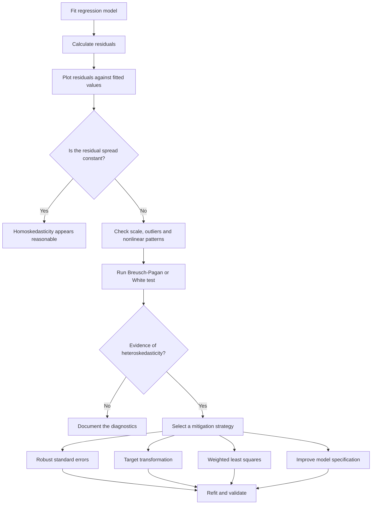

# 008 - Heteroskedasticity

**Course:** 01 - Math, Statistics and Econometrics
**Module:** Module 03 - Econometrics and Time Series
**Content Group:** Econometrics Fundamentals
**Roadmap Source:** Econometrics and Time Series / Econometrics Fundamentals
**Lesson Type:** Econometrics and Time Series
**Order in Module:** 008
**Suggested Duration:** 22 minutes

---

## 1. Overview

This lesson explains **heteroskedasticity** in the context of AI and data science.

Heteroskedasticity occurs when the variability of a regression model's errors is not constant across observations. In practical terms, the model may make relatively small errors for one group of observations but much larger errors for another group.

For example, a model that predicts household spending may be reasonably accurate for low-income households but increasingly uncertain for high-income households.

After completing this lesson, you should understand:

* What heteroskedasticity means.
* Why it matters in regression analysis.
* How to detect it using residual plots and statistical tests.
* How it affects standard errors, confidence intervals, and hypothesis tests.
* How to mitigate it using transformations, robust standard errors, or alternative models.
* How to turn the concept into a notebook, diagnostic chart, model evaluation, or portfolio artifact.

---

## 2. Learning Objectives

By the end of this lesson, you should be able to:

* Explain heteroskedasticity in your own words.
* Distinguish heteroskedasticity from homoskedasticity.
* Identify heteroskedasticity in a residual plot.
* Explain why heteroskedasticity affects statistical inference.
* Apply the Breusch-Pagan or White test.
* Calculate heteroskedasticity-robust standard errors.
* Select an appropriate mitigation strategy.
* Interpret the results in business language.
* Document assumptions, limitations, and unresolved questions.

---

## 3. Core Concept

Consider the linear regression model:

$$
y_i = \beta_0 + \beta_1 x_{i1} + \beta_2 x_{i2} + \cdots + \beta_k x_{ik} + \varepsilon_i
$$

where:

* $y_i$ is the target variable.
* $x_{ij}$ represents an input feature.
* $\beta_j$ represents a regression coefficient.
* $\varepsilon_i$ is the error term.

### 3.1 Homoskedasticity

A regression model is **homoskedastic** when the conditional variance of its error term is constant:

$$
\operatorname{Var}(\varepsilon_i \mid X_i) = \sigma^2
$$

This means that the model has approximately the same level of uncertainty across the feature space.

### 3.2 Heteroskedasticity

A regression model is **heteroskedastic** when the conditional variance changes across observations:

$$
\operatorname{Var}(\varepsilon_i \mid X_i) = \sigma_i^2
$$

The variance $\sigma_i^2$ may increase or decrease depending on one or more predictors.

A common pattern is:

$$
\operatorname{Var}(\varepsilon_i \mid X_i)
\text{ increases as }
x_i
\text{ increases}
$$

For example, prediction errors for expensive houses may be much larger than prediction errors for inexpensive houses.

---

## 4. Intuition

Suppose a model predicts monthly customer spending.

For customers with low monthly income, spending may fall within a relatively narrow range. For customers with high monthly income, spending behavior may vary widely.

| Monthly income | Actual spending | Expected error size |
| -------------: | --------------: | ------------------: |
|            500 |             300 |               Small |
|          1,000 |             650 |               Small |
|          5,000 |           2,000 |              Medium |
|         10,000 |           8,500 |               Large |
|         20,000 |           5,000 |          Very large |

As income increases, the range of possible spending values becomes wider. The residual variance therefore increases with income.

This produces a fan-shaped residual plot.

```text
Residual
   ^
   |                         *       *
   |                  *   *     *
   |             *  *    *
 0 +------*--*--*--------------------------> Predicted value
   |             *   *
   |                  *    *       *
   |                         *          *
```

The vertical spread of residuals increases from left to right.

---

## 5. Homoskedasticity vs. Heteroskedasticity

### Homoskedastic residuals

```text
Residual
   ^
   |      *    *       *    *      *
   |   *      *   *       *     *
 0 +------------------------------------> Predicted value
   |      *       *    *      *
   |   *      *       *    *      *
```

The residual spread remains approximately constant.

### Heteroskedastic residuals

```text
Residual
   ^
   |                           *       *
   |                    *   *      *
   |             *   *
 0 +------*--*----------------------------> Predicted value
   |             *    *
   |                    *      *
   |                           *         *
```

The residual spread changes as the predicted value increases.

---

## 6. Why Heteroskedasticity Matters

Heteroskedasticity does not always make the ordinary least squares coefficient estimates biased.

Under the standard exogeneity condition:

$$
E(\varepsilon_i \mid X_i) = 0
$$

OLS coefficient estimates can remain unbiased and consistent.

However, heteroskedasticity causes problems for the usual OLS variance estimates.

### 6.1 Incorrect standard errors

Traditional OLS standard errors assume constant error variance. When this assumption is violated, standard errors may be too small or too large.

### 6.2 Invalid hypothesis tests

A coefficient may appear statistically significant only because its standard error was underestimated.

For example:

$$
t_j = \frac{\hat{\beta}_j}{SE(\hat{\beta}_j)}
$$

An incorrect standard error produces an incorrect $t$-statistic.

### 6.3 Unreliable confidence intervals

A standard confidence interval is commonly calculated as:

$$
\hat{\beta}_j
\pm
t_{\alpha/2}
SE(\hat{\beta}_j)
$$

If the standard error is incorrect, the confidence interval will also be unreliable.

### 6.4 Unequal prediction uncertainty

A single global error metric may hide the fact that the model performs well for one segment and poorly for another.

For example:

* RMSE may be acceptable overall.
* Errors may still be extremely large for premium customers.
* Predictions may be unfair or operationally risky for specific groups.

---

## 7. Common Causes

### 7.1 Scale effects

Larger target values often have larger absolute errors.

Examples:

* House prices.
* Company revenue.
* Customer spending.
* Insurance claim amounts.

A prediction error of $10,000 is enormous for a $50,000 house but relatively small for a $5 million house.

### 7.2 Omitted variables

An important variable may affect both the expected target and its variance.

For example, a house-price model may omit neighborhood type. Luxury neighborhoods may have much greater price variation than ordinary neighborhoods.

### 7.3 Incorrect functional form

The true relationship may be nonlinear, while the model assumes linearity.

For example:

$$
y = \beta_0 + \beta_1 x + \beta_2 x^2 + \varepsilon
$$

If the $x^2$ term is omitted, the residual pattern may look heteroskedastic.

### 7.4 Outliers

A few extreme observations may create the appearance of increasing variance.

### 7.5 Mixed populations

The dataset may combine groups with different levels of uncertainty.

Examples:

* Small and large companies.
* New and established customers.
* Rural and urban housing markets.
* Low-risk and high-risk borrowers.

### 7.6 Measurement error

Some observations may be measured more accurately than others.

### 7.7 Time-dependent volatility

In time-series data, periods of high and low volatility may alternate.

Examples:

* Financial returns.
* Electricity prices.
* Demand during promotional campaigns.
* Sales during holidays.

---

## 8. Diagnostic Workflow



A recommended workflow is:

```text
dataset
   |
   v
fit OLS model
   |
   v
calculate residuals
   |
   v
inspect diagnostic plots
   |
   v
run statistical tests
   |
   v
identify the likely cause
   |
   v
apply a suitable correction
   |
   v
recalculate inference and model metrics
   |
   v
translate findings into business impact
```

---

## 9. Detecting Heteroskedasticity

No single diagnostic is perfect. Use visual inspection, statistical tests, and domain knowledge together.

---

### 9.1 Residuals vs. fitted values

For each observation, calculate the fitted value:

$$
\hat{y}_i = X_i^\top \hat{\beta}
$$

Then calculate the residual:

$$
e_i = y_i - \hat{y}_i
$$

Plot:

* Horizontal axis: $\hat{y}_i$
* Vertical axis: $e_i$

Look for:

* Fan shapes.
* Funnel shapes.
* Expanding variance.
* Contracting variance.
* Distinct clusters.
* Curved structures.
* Extreme observations.

A random cloud with a stable vertical spread is generally desirable.

---

### 9.2 Residuals vs. predictors

Plot residuals against important input variables.

A residual-vs-fitted plot may reveal that variance changes, while residual-vs-feature plots can help identify which feature drives the change.

```text
residuals vs. income
residuals vs. company size
residuals vs. house area
residuals vs. time
```

---

### 9.3 Scale-location plot

A scale-location plot uses:

$$
\sqrt{|r_i|}
$$

where $r_i$ is a standardized residual.

Plot:

* Horizontal axis: fitted values.
* Vertical axis: square root of the absolute standardized residual.

An increasing trend suggests that residual variance grows with the fitted value.

---

### 9.4 Group-based error analysis

Divide observations into groups based on predicted values or an important feature.

For example:

| Predicted-value group | Mean absolute error |
| --------------------- | ------------------: |
| 0-100                 |                 8.2 |
| 100-200               |                13.5 |
| 200-500               |                29.1 |
| Above 500             |                74.8 |

A sharp increase in error across groups may indicate heteroskedasticity.

This method is especially useful for communicating results to non-technical stakeholders.

---

## 10. Statistical Tests

### 10.1 Breusch-Pagan test

The Breusch-Pagan test evaluates whether the error variance depends on the explanatory variables.

#### Hypotheses

$$
H_0:
\operatorname{Var}(\varepsilon_i \mid X_i) = \sigma^2
$$

$$
H_1:
\operatorname{Var}(\varepsilon_i \mid X_i)
\text{ depends on one or more predictors}
$$

A small p-value provides evidence against homoskedasticity.

A common decision rule is:

```text
p-value < 0.05
```

This suggests evidence of heteroskedasticity at the 5% significance level.

However, the threshold should not be interpreted mechanically. Consider sample size, diagnostic plots, model purpose, and practical impact.

---

### 10.2 White test

The White test is more general than the Breusch-Pagan test.

It can detect variance patterns related to:

* Original predictors.
* Squared predictors.
* Interactions between predictors.

The test is useful when the form of heteroskedasticity is unknown.

However, it may require many auxiliary variables when the dataset contains many features.

---

### 10.3 Goldfeld-Quandt test

The Goldfeld-Quandt test is useful when error variance is expected to increase or decrease with a particular variable.

The data is ordered using that variable and divided into groups. The test compares the residual variance between the groups.

---

### 10.4 Important limitation

Statistical tests should not replace visual diagnostics.

With a very large sample, a test may detect a small variance difference that has little practical importance.

With a small sample, the test may fail to detect a meaningful problem.

Use:

```text
visual evidence
+ statistical evidence
+ domain knowledge
+ practical impact
```

---

## 11. Python Demo

The following example creates synthetic heteroskedastic data.

```python
import numpy as np
import pandas as pd
import matplotlib.pyplot as plt
import statsmodels.api as sm

from statsmodels.stats.diagnostic import het_breuschpagan

# Reproducibility
rng = np.random.default_rng(seed=42)

# Create a predictor
n = 500
x = rng.uniform(1, 20, size=n)

# Error variance increases with x
noise = rng.normal(loc=0, scale=0.6 * x, size=n)

# Generate the target
y = 5 + 3 * x + noise

df = pd.DataFrame({
    "x": x,
    "y": y,
})

# Fit OLS
X = sm.add_constant(df[["x"]])
model = sm.OLS(df["y"], X).fit()

# Store predictions and residuals
df["fitted"] = model.fittedvalues
df["residual"] = model.resid

print(model.summary())
```

### Plot the original data

```python
plt.figure(figsize=(8, 5))
plt.scatter(df["x"], df["y"], alpha=0.6)
plt.plot(df["x"], df["fitted"])
plt.xlabel("x")
plt.ylabel("y")
plt.title("Synthetic Data with Increasing Variance")
plt.show()
```

### Plot residuals against fitted values

```python
plt.figure(figsize=(8, 5))
plt.scatter(df["fitted"], df["residual"], alpha=0.6)
plt.axhline(0, linestyle="--")
plt.xlabel("Fitted values")
plt.ylabel("Residuals")
plt.title("Residuals vs. Fitted Values")
plt.show()
```

The residual plot should display a fan-shaped pattern.

### Run the Breusch-Pagan test

```python
bp_stat, bp_pvalue, f_stat, f_pvalue = het_breuschpagan(
    model.resid,
    model.model.exog,
)

results = {
    "LM statistic": bp_stat,
    "LM p-value": bp_pvalue,
    "F statistic": f_stat,
    "F p-value": f_pvalue,
}

for name, value in results.items():
    print(f"{name}: {value:.6f}")
```

A small p-value indicates evidence that the residual variance is not constant.

---

## 12. Robust Standard Errors

When the coefficient specification is appropriate but the residual variance is not constant, heteroskedasticity-consistent standard errors can be used.

```python
robust_model = model.get_robustcov_results(cov_type="HC3")

print(robust_model.summary())
```

Common covariance estimators include:

* `HC0`
* `HC1`
* `HC2`
* `HC3`

`HC3` is often a reasonable choice for small or moderate datasets because it applies a stronger correction to influential observations.

### What changes?

Robust standard errors generally do not change:

* OLS coefficients.
* Fitted values.
* Residuals.
* Basic predictions.

They may change:

* Standard errors.
* $t$-statistics.
* p-values.
* Confidence intervals.
* Statistical significance conclusions.

### Comparison table

```python
comparison = pd.DataFrame({
    "coefficient": model.params,
    "classical_se": model.bse,
    "robust_se_hc3": robust_model.bse,
})

comparison["classical_pvalue"] = model.pvalues
comparison["robust_pvalue_hc3"] = robust_model.pvalues

print(comparison)
```

A variable that appears statistically significant with classical standard errors may become insignificant after robust correction.

---

## 13. Mitigation Strategies

The correct response depends on the source of the problem and the purpose of the model.

---

### 13.1 Use heteroskedasticity-robust standard errors

Use robust standard errors when:

* The coefficient model is reasonably specified.
* The main goal is inference.
* You want more reliable confidence intervals and p-values.
* The variance pattern is difficult to model directly.

```python
robust_model = model.get_robustcov_results(cov_type="HC3")
```

#### Limitation

Robust standard errors correct the estimated uncertainty around coefficients. They do not remove the heteroskedasticity itself.

---

### 13.2 Transform the target

For positive, right-skewed targets, a logarithmic transformation may stabilize variance.

Original model:

$$
y_i = \beta_0 + \beta_1 x_i + \varepsilon_i
$$

Log-target model:

$$
\log(y_i) = \beta_0 + \beta_1 x_i + \varepsilon_i
$$

Python example:

```python
df["log_y"] = np.log(df["y"])

log_model = sm.OLS(
    df["log_y"],
    sm.add_constant(df[["x"]]),
).fit()

print(log_model.summary())
```

Use `np.log1p` when the target may include zero:

```python
df["log1p_y"] = np.log1p(df["y"])
```

#### Interpretation

In a log-linear model:

$$
\log(y) = \beta_0 + \beta_1 x
$$

A one-unit increase in $x$ is associated with an approximate change of:

$$
100\beta_1%
$$

in $y$, when $\beta_1$ is relatively small.

#### Limitation

The transformation changes the meaning of the prediction and coefficients. Converting predictions back to the original scale may require bias correction.

---

### 13.3 Improve the model specification

Heteroskedasticity may be a symptom of a misspecified model.

Possible improvements include:

* Adding omitted variables.
* Adding polynomial terms.
* Adding interaction terms.
* Modeling separate customer segments.
* Capturing nonlinear relationships.
* Including seasonal or trend variables.
* Handling structural breaks.

For example:

```python
df["x_squared"] = df["x"] ** 2

X_nonlinear = sm.add_constant(df[["x", "x_squared"]])
nonlinear_model = sm.OLS(df["y"], X_nonlinear).fit()

print(nonlinear_model.summary())
```

---

### 13.4 Weighted least squares

Weighted least squares assigns less influence to observations with greater error variance.

The objective is:

$$
\min_{\beta}
\sum_{i=1}^{n}
w_i
\left(
y_i - X_i^\top \beta
\right)^2
$$

An ideal weight is:

$$
w_i = \frac{1}{\sigma_i^2}
$$

where $\sigma_i^2$ is the conditional error variance.

Python example:

```python
# Example only:
# Assume error variance is approximately proportional to x squared.
weights = 1 / (df["x"] ** 2)

wls_model = sm.WLS(
    df["y"],
    X,
    weights=weights,
).fit()

print(wls_model.summary())
```

#### Limitation

Weighted least squares requires a reasonable model for the variance. Incorrect weights can reduce performance or distort inference.

---

### 13.5 Use generalized least squares

Generalized least squares can model more complex error structures, including:

* Non-constant variance.
* Correlated residuals.
* Group-dependent variance.
* Time-series correlation.

GLS is useful when the covariance structure of the error term can be estimated.

---

### 13.6 Use a suitable probabilistic distribution

Some target variables naturally have variance that depends on the mean.

Examples:

* Count data.
* Binary outcomes.
* Positive continuous values.
* Insurance claims.

Alternative models may include:

| Target type           | Possible model               |
| --------------------- | ---------------------------- |
| Binary result         | Logistic regression          |
| Count                 | Poisson regression           |
| Overdispersed count   | Negative binomial regression |
| Positive skewed value | Gamma regression             |
| Proportion            | Binomial or beta regression  |

For example, a Poisson model assumes:

$$
E(Y_i \mid X_i) = # \operatorname{Var}(Y_i \mid X_i) \lambda_i
$$

The variance naturally changes with the expected value.

---

### 13.7 Use quantile regression

OLS models the conditional mean:

$$
E(Y \mid X)
$$

Quantile regression models a conditional quantile:

$$
Q_\tau(Y \mid X)
$$

For example:

* $\tau = 0.50$ models the median.
* $\tau = 0.90$ models the 90th percentile.

Quantile regression is useful when the spread of the target changes across the feature space.

```python
quantile_model = sm.QuantReg(
    df["y"],
    X,
).fit(q=0.5)

print(quantile_model.summary())
```

---

## 14. Heteroskedasticity and Machine Learning

In classical econometrics, heteroskedasticity is especially important because it affects statistical inference.

In machine learning, the emphasis is often on predictive performance. However, non-constant error variance still matters.

### 14.1 Global metrics can hide local problems

A model may achieve a good average RMSE while performing poorly for a high-value segment.

Evaluate errors by:

* Target range.
* Predicted-value range.
* Customer group.
* Region.
* Time period.
* Product category.
* Risk level.

### 14.2 Prediction intervals should vary

A constant-width prediction interval is often unrealistic.

For example:

```text
Predicted price: $100,000 ± $10,000
Predicted price: $2,000,000 ± $10,000
```

The second interval is likely too narrow.

A better model may estimate both:

$$
E(Y \mid X)
$$

and:

$$
\operatorname{Var}(Y \mid X)
$$

### 14.3 Loss-function selection

Mean squared error gives greater weight to large absolute errors:

$$
MSE = \frac{1}{n} \sum_{i=1}^{n} (y_i - \hat{y}_i)^2
$$

When high-value observations naturally have larger errors, the model may focus heavily on them.

Possible alternatives include:

* Mean absolute error.
* Huber loss.
* Log-target regression.
* Weighted loss.
* Quantile loss.
* Relative error metrics.

The loss function must match the business cost of mistakes.

---

## 15. Heteroskedasticity in Time-Series Data

In time-series applications, changing residual variance is often described as **volatility clustering** or **conditional heteroskedasticity**.

Example:

```text
low-volatility period
        |
        v
small residuals
        |
        v
market shock
        |
        v
large residuals
        |
        v
high-volatility period
```

Financial returns often show periods in which large changes are followed by other large changes.

A simplified ARCH model is:

$$
\varepsilon_t = \sigma_t z_t
$$

where:

$$
z_t \sim N(0,1)
$$

and:

$$
\sigma_t^2 = \alpha_0 + \alpha_1 \varepsilon_{t-1}^2
$$

A GARCH(1,1) model extends this idea:

$$
\sigma_t^2 = \alpha_0 + \alpha_1 \varepsilon_{t-1}^2 + \beta_1 \sigma_{t-1}^2
$$

This allows current volatility to depend on:

* The previous squared shock.
* The previous estimated volatility.

For sales forecasting, changing variance may result from:

* Promotions.
* Holidays.
* Supply disruptions.
* Product launches.
* Market shocks.
* Structural changes.

---

## 16. Relationship to Other Regression Problems

Heteroskedasticity should not be confused with other regression issues.

| Problem            | Main concern                                                |
| ------------------ | ----------------------------------------------------------- |
| Heteroskedasticity | Error variance is not constant                              |
| Multicollinearity  | Predictors are strongly correlated                          |
| Autocorrelation    | Errors are correlated across time or order                  |
| Nonlinearity       | The expected relationship is incorrectly modeled            |
| Endogeneity        | A predictor is correlated with the error term               |
| Outliers           | A small number of observations strongly affect the model    |
| Data leakage       | Information unavailable at prediction time enters the model |

A model may contain several of these problems simultaneously.

---

## 17. Business Example: House-Price Prediction

Suppose a real-estate company predicts house prices using:

* Floor area.
* Number of bedrooms.
* Property age.
* Distance from the city center.

The residual plot shows that prediction errors increase sharply for expensive properties.

### Technical interpretation

The model exhibits heteroskedasticity because:

$$
\operatorname{Var}(\varepsilon_i \mid X_i)
$$

increases with predicted price.

### Possible causes

* Luxury properties are more unique.
* Neighborhood quality is missing.
* Premium amenities are not represented.
* A linear model does not capture the upper market.
* Sale prices contain larger negotiation effects.

### Possible actions

1. Add neighborhood, property type, and amenity features.
2. Model the logarithm of sale price.
3. Report robust standard errors.
4. Evaluate error separately for price bands.
5. Build quantile-based prediction intervals.
6. Consider separate models for standard and luxury properties.

### Business interpretation

Weak statement:

```text
The Breusch-Pagan test rejected the null hypothesis.
```

Better statement:

```text
Prediction uncertainty increases substantially for high-value properties.
The current model is suitable for standard homes but produces unreliable
price ranges for luxury listings. We should add luxury-property features
or train a separate model for that segment.
```

---

## 18. Business Example: Sales Forecasting

Consider a model that predicts daily sales.

During normal periods, prediction errors are small. During holidays and promotional campaigns, errors become much larger.

This may create a time-dependent variance pattern.

```text
historical sales
      |
      v
trend and seasonality
      |
      v
baseline forecast
      |
      v
residual diagnostics
      |
      +--> stable variance during normal days
      |
      +--> high variance during campaigns
      |
      v
segment-specific uncertainty model
      |
      v
inventory recommendation
```

Possible solutions include:

* Promotion indicators.
* Holiday features.
* Separate error estimates for normal and campaign periods.
* Weighted regression.
* Quantile forecasting.
* GARCH-style volatility modeling when appropriate.
* Prediction intervals that widen during uncertain periods.

---

## 19. Interpretation Checklist

When heteroskedasticity is detected, answer the following questions:

1. Is the coefficient model still conceptually valid?
2. Is the problem caused by scale, outliers, missing variables, or nonlinearity?
3. Is the main objective inference or prediction?
4. Do the standard errors change substantially after robust correction?
5. Does model performance differ across important groups?
6. Would a target transformation improve the variance pattern?
7. Can the variance be modeled directly?
8. Are prediction intervals appropriately wider for uncertain observations?
9. Does the issue create business, fairness, or operational risk?
10. Has the mitigation been validated on unseen data?

---

## 20. Common Mistakes

### Mistake 1: Treating heteroskedasticity as coefficient bias

Heteroskedasticity does not automatically make OLS coefficients biased.

Its immediate classical effect is on:

* Efficiency.
* Standard errors.
* Confidence intervals.
* Hypothesis tests.

Bias may still occur when heteroskedasticity is connected to other problems, such as omitted variables or endogeneity.

---

### Mistake 2: Looking only at $R^2$

A model can have a high $R^2$ and still suffer from severe heteroskedasticity.

$R^2$ measures the proportion of sample variation explained by the model. It does not verify the constant-variance assumption.

---

### Mistake 3: Using a test without a residual plot

A p-value does not show the shape, location, or business importance of the variance pattern.

Always inspect the residuals visually.

---

### Mistake 4: Automatically applying a log transformation

A logarithmic transformation is not always suitable.

Before using it, check:

* Whether the target is positive.
* Whether zeros or negative values exist.
* Whether the new interpretation is meaningful.
* Whether back-transformed predictions are handled correctly.

---

### Mistake 5: Assuming robust standard errors solve prediction problems

Robust standard errors improve inference but do not directly improve:

* Point predictions.
* Residual variance.
* Prediction intervals.
* Segment-level accuracy.

---

### Mistake 6: Ignoring outliers

A few extreme observations may create an apparent fan shape.

Inspect:

* Leverage.
* Studentized residuals.
* Cook's distance.
* Data quality.
* Domain validity.

---

### Mistake 7: Testing on training data only

A mitigation strategy should be evaluated on validation or test data.

For time-series data, preserve chronological order and avoid random splitting when it creates leakage.

---

### Mistake 8: Reporting only technical metrics

The final conclusion should explain:

* Which observations are less reliable.
* How uncertainty affects decisions.
* Whether the problem is operationally important.
* What action should be taken.

---

## 21. Practical Exercise

Use a regression dataset such as:

* House prices.
* Customer spending.
* Company revenue.
* Insurance claim values.
* Product sales.
* Delivery times.

### Task 1: Fit a baseline model

Fit an OLS regression and report:

* Coefficients.
* $R^2$.
* RMSE.
* MAE.
* Standard errors.
* Confidence intervals.

### Task 2: Create diagnostic charts

Create:

1. Residuals vs. fitted values.
2. Residuals vs. an important predictor.
3. Histogram of residuals.
4. Scale-location plot.
5. Error by predicted-value group.

### Task 3: Run a statistical test

Apply:

* Breusch-Pagan test, or
* White test.

State the null and alternative hypotheses before interpreting the result.

### Task 4: Apply two mitigation strategies

Choose two:

* Robust standard errors.
* Log-target transformation.
* Weighted least squares.
* Improved feature specification.
* Quantile regression.
* Separate segment models.

### Task 5: Compare the results

Create a table such as:

| Model            | RMSE | MAE | BP p-value | Maximum group MAE |
| ---------------- | ---: | --: | ---------: | ----------------: |
| Baseline OLS     |  ... | ... |        ... |               ... |
| Log-target model |  ... | ... |        ... |               ... |
| Weighted model   |  ... | ... |        ... |               ... |

### Task 6: Write a business conclusion

Complete this statement:

```text
The model is most reliable for __________ and least reliable for __________.
The main source of changing error variance appears to be __________.
The recommended action is __________ because __________.
```

---

## 22. Suggested Notebook Structure

```text
01_problem_definition.ipynb
02_data_validation.ipynb
03_baseline_ols.ipynb
04_residual_diagnostics.ipynb
05_heteroskedasticity_tests.ipynb
06_robust_standard_errors.ipynb
07_transformation_or_wls.ipynb
08_model_comparison.ipynb
09_business_recommendation.ipynb
```

A compact single-notebook structure could be:

```markdown
# Heteroskedasticity Analysis

## 1. Business Problem
## 2. Dataset and Assumptions
## 3. Exploratory Data Analysis
## 4. Baseline OLS Model
## 5. Residual Diagnostics
## 6. Breusch-Pagan Test
## 7. Robust Standard Errors
## 8. Alternative Model
## 9. Validation Results
## 10. Business Recommendation
## 11. Limitations and Next Steps
```

---

## 23. Portfolio Artifact

A useful portfolio artifact could include:

* A reproducible notebook.
* A residual diagnostic dashboard.
* Classical vs. robust standard-error comparison.
* Error metrics by customer or target segment.
* A transformed or weighted regression model.
* Dynamic prediction intervals.
* A short business recommendation.
* A documented list of assumptions and limitations.

Example portfolio title:

```text
Detecting and Correcting Heteroskedasticity
in a House-Price Regression Model
```

Possible README sections:

```text
Problem
Dataset
Baseline model
Residual diagnostics
Statistical tests
Mitigation strategies
Validation
Business interpretation
Limitations
How to run
```

---

## 24. Completion Checklist

* [ ] I can explain heteroskedasticity in one or two minutes.
* [ ] I can distinguish homoskedasticity from heteroskedasticity.
* [ ] I understand why ordinary OLS standard errors may become unreliable.
* [ ] I can create a residual-vs-fitted plot.
* [ ] I can identify a fan or funnel pattern.
* [ ] I can run and interpret the Breusch-Pagan test.
* [ ] I can calculate robust standard errors.
* [ ] I understand when a target transformation may help.
* [ ] I understand the basic idea of weighted least squares.
* [ ] I have evaluated model errors across meaningful groups.
* [ ] I have documented at least one assumption or limitation.
* [ ] I can explain the business impact of unequal prediction uncertainty.
* [ ] I have created a notebook, chart, model, API, or portfolio note.

---

## 25. Key Takeaways

1. Heteroskedasticity means that residual variance is not constant across observations.

2. It often appears as a fan-shaped or funnel-shaped pattern in a residual plot.

3. OLS coefficient estimates may remain unbiased under exogeneity, but classical standard errors can become unreliable.

4. Incorrect standard errors lead to unreliable hypothesis tests, p-values, and confidence intervals.

5. Detection should combine residual plots, statistical tests, domain knowledge, and segment-level error analysis.

6. Robust standard errors improve statistical inference but do not remove changing variance.

7. Target transformations, weighted least squares, better feature specification, quantile regression, and probabilistic models may address the underlying pattern.

8. In machine learning, heteroskedasticity matters because average performance metrics can hide large errors in specific regions or customer segments.

9. In time-series data, changing variance may require volatility models such as ARCH or GARCH.

10. The final result should be translated into a business statement about where the model is reliable, where uncertainty increases, and what action should be taken.

---

## 26. Related Outcome

Model relationships and time-dependent data using:

* Regression.
* Residual diagnostics.
* Robust inference.
* ARIMA-style forecasting workflows.
* Volatility analysis.
* Segment-level validation.
* Uncertainty estimation.

---

## 27. Related Project

### Mini Project: Sales Forecasting with Changing Variance

Build a sales-forecasting workflow that includes:

1. Trend and seasonality analysis.
2. A naive or linear-regression baseline.
3. An ARIMA or another forecasting model.
4. Residual diagnostics.
5. Error comparison between ordinary and promotional periods.
6. A test for changing error variance.
7. Dynamic or segment-specific prediction intervals.
8. Inventory or staffing recommendations.

Suggested output:

```text
sales_forecasting/
├── data/
├── notebooks/
│   ├── 01_eda.ipynb
│   ├── 02_baseline.ipynb
│   ├── 03_forecast.ipynb
│   └── 04_residual_diagnostics.ipynb
├── src/
│   ├── features.py
│   ├── train.py
│   └── diagnostics.py
├── reports/
│   ├── residual_plot.png
│   ├── error_by_period.csv
│   └── business_recommendation.md
└── README.md
```

---

## 28. Summary

**Heteroskedasticity** is an important regression diagnostic because it reveals that a model does not have the same level of uncertainty for every observation.

It may not automatically invalidate the estimated coefficients, but it can invalidate traditional standard errors, p-values, confidence intervals, and business conclusions based on them.

A complete analysis should:

```text
fit the model
    ->
inspect residuals
    ->
test for changing variance
    ->
identify the likely cause
    ->
apply an appropriate correction
    ->
validate the result
    ->
communicate the business impact
```

Turn this topic into a practical artifact such as a notebook, residual chart, statistical test report, robust regression comparison, forecasting service, or portfolio case study. Practical diagnostics make the concept easier to remember and more useful in real AI and data-science work.
