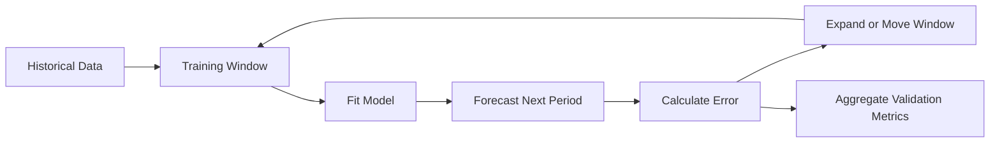
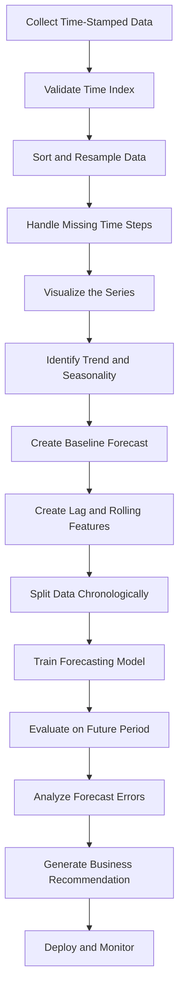
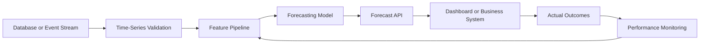

# 010 — Time Series Basics

**Course:** 01 — Math, Statistics and Econometrics
**Module:** Module 03 — Econometrics and Time Series
**Content Group:** Time Series
**Roadmap Source:** Econometrics and Time Series / Time Series
**Lesson Type:** Econometrics and Time Series
**Order in Module:** 010
**Suggested Duration:** 22 minutes

---

## 1. Overview

A **time series** is a sequence of observations recorded in chronological order.

Examples include:

* Daily sales
* Hourly electricity demand
* Monthly inflation
* Minute-by-minute stock prices
* Weekly website traffic
* Sensor measurements
* Server request latency
* User activity over time

Unlike ordinary tabular data, the order of observations in a time series is important. An observation recorded today may depend on observations from yesterday, last week, or the same period last year.

A typical time series may contain:

* **Trend**
* **Seasonality**
* **Cycles**
* **Autocorrelation**
* **Noise**
* **Structural changes**
* **Outliers**

For an AI Engineer or Data Scientist, time series analysis helps answer questions such as:

* What will sales be next week?
* Is website traffic increasing?
* Does demand repeat every seven days?
* Is the current sensor value abnormal?
* Did a marketing campaign change the underlying pattern?
* How much uncertainty should be attached to a forecast?

A time series workflow usually produces artifacts such as:

* Exploratory charts
* Lag features
* Rolling statistics
* Forecasting models
* Validation reports
* Forecasting APIs
* Monitoring dashboards
* Business recommendations

---

## 2. Learning Objectives

After completing this lesson, you should be able to:

1. Explain what time series data is.
2. Distinguish time series data from ordinary cross-sectional data.
3. Identify trend, seasonality, cycles, and noise.
4. Explain why temporal order must be preserved.
5. Understand lagged values and rolling statistics.
6. Recognize autocorrelation.
7. Create simple forecasting baselines.
8. Split time series data correctly for training and evaluation.
9. Build a small time series analysis notebook.
10. Connect time series concepts to production forecasting systems.

---

## 3. What Is a Time Series?

A time series is a set of observations indexed by time:

$$
y_1, y_2, y_3, \ldots, y_T
$$

where:

* (y_t) is the observed value at time (t)
* (T) is the total number of observations

A general representation is:

$$
y_t = f(t) + \varepsilon_t
$$

where:

* (f(t)) represents systematic temporal patterns
* (\varepsilon_t) represents random variation or noise

For example, a daily sales dataset may look like this:

| Date       | Sales |
| ---------- | ----: |
| 2026-01-01 |   120 |
| 2026-01-02 |   128 |
| 2026-01-03 |   135 |
| 2026-01-04 |   131 |
| 2026-01-05 |   145 |

The date column is not simply another feature. It defines the order and dependency structure of the observations.

---

## 4. Time Series vs. Ordinary Tabular Data

In ordinary supervised learning, rows are often assumed to be independent and identically distributed.

Time series data usually violates this assumption because nearby observations may be related.

| Property                 | Ordinary Tabular Data                  | Time Series Data                             |
| ------------------------ | -------------------------------------- | -------------------------------------------- |
| Row order                | Often unimportant                      | Essential                                    |
| Random train/test split  | Usually acceptable                     | Often incorrect                              |
| Observation independence | Common assumption                      | Frequently violated                          |
| Future information       | May be mixed across rows               | Must not enter training data                 |
| Evaluation               | Random holdout or cross-validation     | Temporal holdout or walk-forward validation  |
| Common features          | Demographics, categories, measurements | Lags, rolling statistics, calendar variables |

For example, randomly shuffling daily sales data may allow the model to train on future observations and predict earlier observations. This creates **data leakage** and produces unrealistic evaluation results.

---

## 5. Main Components of a Time Series

A useful conceptual decomposition is:

$$
y_t = T_t + S_t + C_t + \varepsilon_t
$$

where:

* (T_t): trend
* (S_t): seasonality
* (C_t): cyclical movement
* (\varepsilon_t): irregular noise

### 5.1 Trend

A **trend** is a long-term increase or decrease in the series.

Examples:

* Increasing e-commerce revenue
* Decreasing hardware failure rates
* Growth in application users
* Long-term inflation

```text
Value
  ^
  |                         *
  |                    *  *
  |                * *
  |           *  *
  |       * *
  |   * *
  +--------------------------------> Time
                 Upward trend
```

A trend does not need to be linear. It may be:

* Linear
* Exponential
* Logarithmic
* Piecewise
* Saturating

---

### 5.2 Seasonality

**Seasonality** is a regular pattern that repeats at a fixed interval.

Examples:

* Sales increasing every weekend
* Electricity demand rising every afternoon
* Retail demand increasing every December
* Website traffic falling every Sunday
* Restaurant orders peaking during lunch hours

```text
Value
  ^
  |      /\        /\        /\
  |     /  \      /  \      /  \
  |____/    \____/    \____/    \____
  +------------------------------------> Time
          Repeating seasonal pattern
```

Common seasonal periods include:

| Data Frequency | Possible Seasonal Period |
| -------------- | -----------------------: |
| Hourly         |                 24 hours |
| Daily          |                   7 days |
| Daily          |                 365 days |
| Weekly         |                 52 weeks |
| Monthly        |                12 months |
| Quarterly      |               4 quarters |

A time series may contain multiple seasonal patterns. For example, hourly electricity demand may have both daily and weekly seasonality.

---

### 5.3 Cycles

A **cycle** is a rise-and-fall pattern that does not necessarily repeat at a fixed interval.

Examples include:

* Economic expansions and recessions
* Housing market cycles
* Technology adoption cycles
* Product demand life cycles

Seasonality has a relatively fixed period, while cycles usually have less predictable duration.

---

### 5.4 Noise

**Noise** is irregular variation that is not explained by the systematic components.

Noise may be caused by:

* Measurement error
* Random customer behavior
* Unexpected external events
* Missing explanatory variables
* Data collection problems

A forecasting model should capture useful structure without fitting every random fluctuation.

---

### 5.5 Outliers and Anomalies

An outlier is an observation that differs substantially from the expected pattern.

Possible causes include:

* Promotional campaigns
* Public holidays
* Server failures
* Sensor errors
* Supply disruptions
* Extreme weather
* Data-entry mistakes

An outlier may represent either valuable information or corrupted data. It should not be removed automatically without investigation.

---

### 5.6 Structural Breaks

A **structural break** occurs when the underlying data-generating process changes.

Examples:

* A pricing policy changes
* A new competitor enters the market
* A pandemic changes customer behavior
* A sensor is replaced
* A product is redesigned
* A data pipeline changes its measurement logic

A model trained before the break may perform poorly after the break.

---

## 6. Additive and Multiplicative Structure

### 6.1 Additive Model

An additive decomposition assumes:

$$
y_t = T_t + S_t + \varepsilon_t
$$

It is appropriate when the seasonal variation remains approximately constant as the overall level changes.

Example:

* Sales fluctuate by approximately 100 units every December, regardless of total sales level.

---

### 6.2 Multiplicative Model

A multiplicative decomposition assumes:

$$
y_t = T_t \times S_t \times \varepsilon_t
$$

It is appropriate when seasonal fluctuations become larger as the level of the series increases.

Example:

* December sales are consistently around 30% higher than normal sales.

A logarithmic transformation can convert multiplicative relationships into approximately additive ones:

$$
\log(y_t) = \log(T_t) + \log(S_t) + \log(\varepsilon_t)
$$

---

## 7. Temporal Dependence

Time series observations are often dependent on previous observations.

For example:

$$
y_t = \phi y_{t-1} + \varepsilon_t
$$

The current value (y_t) depends on the previous value (y_{t-1}).

This dependence is one reason why ordinary random splitting and independent-data assumptions may fail.

---

## 8. Lagged Values

A **lag** is a previous value of the same variable.

The first lag is:

$$
\operatorname{Lag}*1(y_t) = y*{t-1}
$$

The seventh lag for daily data is:

$$
\operatorname{Lag}*7(y_t) = y*{t-7}
$$

Example:

| Date   | Sales | Lag 1 | Lag 7 |
| ------ | ----: | ----: | ----: |
| Jan 8  |   160 |   148 |   120 |
| Jan 9  |   170 |   160 |   128 |
| Jan 10 |   165 |   170 |   135 |

Lagged features allow machine learning models to use historical information.

Common lag features include:

* Previous hour
* Previous day
* Previous week
* Previous month
* Same day last year

The appropriate lag depends on the business process and data frequency.

---

## 9. Rolling Statistics

Rolling statistics summarize recent observations over a moving window.

A rolling mean with window size (k) is:

$$
\operatorname{MA}_t^{(k)} = \frac{1}{k} \sum_{i=0}^{k-1} y_{t-i}
$$

For a seven-day moving average:

$$
\operatorname{MA}_t^{(7)} = \frac{ y_t + y_{t-1} + \cdots + y_{t-6} }{7}
$$

Useful rolling features include:

* Rolling mean
* Rolling median
* Rolling minimum
* Rolling maximum
* Rolling standard deviation
* Rolling sum
* Rolling quantile

Rolling statistics are useful for:

* Smoothing noise
* Detecting local trends
* Measuring recent volatility
* Creating predictive features
* Detecting anomalies

A critical implementation detail is that rolling features must not use future values.

For forecasting, a safer feature is often:

```python
df["rolling_mean_7"] = df["sales"].shift(1).rolling(7).mean()
```

The `shift(1)` ensures that the current target value is not included in its own predictor.

---

## 10. Autocorrelation

**Autocorrelation** measures the relationship between a time series and a lagged version of itself.

For lag (k):

$$
\rho_k = \operatorname{Corr}(y_t, y_{t-k})
$$

Examples:

* High autocorrelation at lag 1 means adjacent observations are strongly related.
* High autocorrelation at lag 7 in daily data may indicate weekly seasonality.
* High autocorrelation at lag 12 in monthly data may indicate annual seasonality.

### Interpretation Example

| Lag | Autocorrelation | Possible Interpretation        |
| --: | --------------: | ------------------------------ |
|   1 |            0.88 | Strong short-term persistence  |
|   2 |            0.74 | Dependence continues           |
|   7 |            0.65 | Possible weekly pattern        |
|  14 |            0.51 | Repeated two-week relationship |

Autocorrelation does not automatically prove causality. It only describes temporal dependence.

---

## 11. Stationarity

A time series is approximately **stationary** when its statistical properties remain stable over time.

A weakly stationary series has:

1. A constant mean
2. A constant variance
3. Autocovariance that depends on lag rather than absolute time

Conceptually:

$$
\mathbb{E}[y_t] = \mu
$$

$$
\operatorname{Var}(y_t) = \sigma^2
$$

$$
\operatorname{Cov}(y_t, y_{t-k}) = \gamma_k
$$

A series with a strong trend or changing variance is usually non-stationary.

Stationarity is important for classical methods such as:

* AR
* MA
* ARMA
* ARIMA
* VAR

However, not every modern forecasting model requires the raw series to be stationary.

### Common Transformations

To make a series more stable, analysts may use:

* Differencing
* Log transformation
* Seasonal differencing
* Trend removal
* Seasonal adjustment

First-order differencing is:

$$
\Delta y_t = y_t - y_{t-1}
$$

Seasonal differencing with period (s) is:

$$
\Delta_s y_t = y_t - y_{t-s}
$$

---

## 12. Forecasting Horizon

The **forecasting horizon** is how far into the future the model must predict.

Examples:

* Next hour
* Next day
* Next seven days
* Next month
* Next twelve months

The forecasting horizon affects:

* Model selection
* Feature engineering
* Error accumulation
* Evaluation design
* Uncertainty
* Business usefulness

Predicting one step ahead is usually easier than predicting many steps ahead.

---

## 13. One-Step and Multi-Step Forecasting

### One-Step Forecast

Predict only the next value:

$$
\hat{y}_{t+1}
$$

### Multi-Step Forecast

Predict several future values:

$$
\hat{y}*{t+1}, \hat{y}*{t+2}, \ldots, \hat{y}_{t+h}
$$

where (h) is the forecast horizon.

Common multi-step strategies include:

* Recursive forecasting
* Direct forecasting
* Multi-output forecasting
* Sequence-to-sequence forecasting

Recursive forecasting uses previous predictions as inputs for later predictions, so errors may accumulate over time.

---

## 14. Forecasting Baselines

A model should always be compared with a simple baseline.

A complex model is not useful if it cannot outperform a reasonable baseline.

### 14.1 Mean Baseline

Predict the historical mean:

$$
\hat{y}_{t+h} = \frac{1}{T} \sum_{t=1}^{T} y_t
$$

This is simple but often weak for trending or seasonal data.

---

### 14.2 Naive Forecast

Predict the most recent observation:

$$
\hat{y}_{t+1} = y_t
$$

This baseline can be surprisingly strong when the series changes slowly.

---

### 14.3 Seasonal Naive Forecast

Predict the value from the same position in the previous seasonal cycle:

$$
\hat{y}*t = y*{t-s}
$$

For daily data with weekly seasonality:

$$
\hat{y}*t = y*{t-7}
$$

For monthly data with yearly seasonality:

$$
\hat{y}*t = y*{t-12}
$$

Strong seasonality often makes the seasonal naive forecast difficult to beat.

---

### 14.4 Moving-Average Baseline

Predict using a recent average:

$$
\hat{y}_{t+1} = \frac{1}{k} \sum_{i=0}^{k-1} y_{t-i}
$$

This can reduce short-term noise but may react slowly to sudden changes.

---

## 15. Correct Train/Test Splitting

Random train/test splitting is usually inappropriate for time series forecasting.

Suppose the data covers January through December.

A valid split is:

```text
January ---------------- September | October --- December
               Training data       |     Test data
```

An invalid random split may look like:

```text
Training: January, March, June, November, ...
Testing:  February, April, July, October, ...
```

The random split allows future observations to influence the training process.

### Correct Temporal Split

```text
Past observations                     Future observations
┌──────────────────────────────────┐   ┌────────────────────┐
│            Training set          │   │      Test set      │
└──────────────────────────────────┘   └────────────────────┘
────────────────────────────────────────────────────────────> Time
```

The test period should simulate the future period the model will face in production.

---

## 16. Walk-Forward Validation

A single train/test split may not provide enough evidence about model stability.

Walk-forward validation evaluates the model across multiple historical forecasting periods.

```text
Fold 1:
Train: [1 2 3 4 5]       Test: [6]

Fold 2:
Train: [1 2 3 4 5 6]     Test: [7]

Fold 3:
Train: [1 2 3 4 5 6 7]   Test: [8]

Fold 4:
Train: [1 2 3 4 5 6 7 8] Test: [9]
```

A general workflow is:



Walk-forward validation is more realistic because it reproduces repeated forecasting in chronological order.

---

## 17. Expanding and Sliding Windows

### 17.1 Expanding Window

The training set grows over time.

```text
Fold 1: [1 2 3 4]             -> [5]
Fold 2: [1 2 3 4 5]           -> [6]
Fold 3: [1 2 3 4 5 6]         -> [7]
```

Advantages:

* Uses all available historical information
* Appropriate when older data remains relevant

---

### 17.2 Sliding Window

The training set keeps a fixed length.

```text
Fold 1: [1 2 3 4] -> [5]
Fold 2: [2 3 4 5] -> [6]
Fold 3: [3 4 5 6] -> [7]
```

Advantages:

* Reduces the influence of outdated observations
* Useful when the data-generating process changes over time

---

## 18. Forecast Evaluation Metrics

Let:

* (y_t) be the actual value
* (\hat{y}_t) be the predicted value
* (e_t = y_t - \hat{y}_t) be the forecast error

### 18.1 Mean Absolute Error

$$
\operatorname{MAE} = \frac{1}{n} \sum_{t=1}^{n} |y_t-\hat{y}_t|
$$

Advantages:

* Easy to interpret
* Uses the same unit as the target
* Less sensitive to extreme errors than RMSE

---

### 18.2 Root Mean Squared Error

$$
\operatorname{RMSE} = \sqrt{ \frac{1}{n} \sum_{t=1}^{n} (y_t-\hat{y}_t)^2 }
$$

Advantages:

* Penalizes large errors more strongly
* Useful when large mistakes are especially costly

---

### 18.3 Mean Absolute Percentage Error

$$
\operatorname{MAPE} = \frac{100}{n} \sum_{t=1}^{n} \left| \frac{y_t-\hat{y}_t}{y_t} \right|
$$

Limitations:

* Undefined when (y_t=0)
* Unstable when actual values are close to zero
* Can create asymmetric penalties

---

### 18.4 Weighted Absolute Percentage Error

$$
\operatorname{WAPE} = \frac{ \sum_{t=1}^{n}|y_t-\hat{y}*t| }{ \sum*{t=1}^{n}|y_t| } \times 100
$$

WAPE is often useful for evaluating aggregate demand forecasts.

---

### 18.5 Mean Absolute Scaled Error

$$
\operatorname{MASE} = \frac{ \frac{1}{n} \sum_{t=1}^{n}|y_t-\hat{y}*t| }{ \frac{1}{T-1} \sum*{t=2}^{T}|y_t-y_{t-1}| }
$$

Interpretation:

* (\operatorname{MASE}<1): better than the naive baseline
* (\operatorname{MASE}>1): worse than the naive baseline

Metric selection should reflect the real cost of forecast errors.

---

## 19. End-to-End Time Series Workflow



A robust forecasting project should begin with data validation and a baseline, not immediately with a complex model.

---

## 20. Practical Python Demo

The following example creates synthetic daily sales data with trend, weekly seasonality, and random noise.

```python
import numpy as np
import pandas as pd
import matplotlib.pyplot as plt
from sklearn.metrics import mean_absolute_error, mean_squared_error

rng = np.random.default_rng(42)

dates = pd.date_range(
    start="2025-01-01",
    periods=240,
    freq="D",
)

trend = np.linspace(100, 180, len(dates))

weekly_pattern = np.array([
    -10,  # Monday
    -5,   # Tuesday
    0,    # Wednesday
    4,    # Thursday
    10,   # Friday
    25,   # Saturday
    18,   # Sunday
])

seasonality = np.array([
    weekly_pattern[date.dayofweek]
    for date in dates
])

noise = rng.normal(
    loc=0,
    scale=8,
    size=len(dates),
)

sales = trend + seasonality + noise

df = pd.DataFrame({
    "date": dates,
    "sales": sales,
})

df = df.set_index("date")

print(df.head())
```

### Plot the Series

```python
fig, ax = plt.subplots(figsize=(12, 5))

ax.plot(df.index, df["sales"])
ax.set_title("Daily Sales")
ax.set_xlabel("Date")
ax.set_ylabel("Sales")

plt.tight_layout()
plt.show()
```

---

## 21. Add Rolling Statistics

```python
df["rolling_mean_7"] = (
    df["sales"]
    .rolling(window=7)
    .mean()
)

df["rolling_std_7"] = (
    df["sales"]
    .rolling(window=7)
    .std()
)
```

Plot the original series and rolling mean:

```python
fig, ax = plt.subplots(figsize=(12, 5))

ax.plot(
    df.index,
    df["sales"],
    label="Daily sales",
    alpha=0.6,
)

ax.plot(
    df.index,
    df["rolling_mean_7"],
    label="7-day rolling mean",
)

ax.set_title("Daily Sales and Rolling Mean")
ax.set_xlabel("Date")
ax.set_ylabel("Sales")
ax.legend()

plt.tight_layout()
plt.show()
```

The rolling mean makes the long-term trend easier to see by reducing daily noise.

---

## 22. Create Lag Features

```python
df["lag_1"] = df["sales"].shift(1)
df["lag_7"] = df["sales"].shift(7)
df["lag_14"] = df["sales"].shift(14)

df["previous_7_day_mean"] = (
    df["sales"]
    .shift(1)
    .rolling(window=7)
    .mean()
)
```

The `shift(1)` is important because it prevents the current target from leaking into the rolling feature.

---

## 23. Create a Chronological Split

Use the final 30 days as the test set.

```python
test_size = 30

train = df.iloc[:-test_size].copy()
test = df.iloc[-test_size:].copy()

print("Training period:")
print(train.index.min(), "to", train.index.max())

print("\nTesting period:")
print(test.index.min(), "to", test.index.max())
```

The training period occurs entirely before the testing period.

---

## 24. Evaluate Baseline Forecasts

### 24.1 Naive Baseline

```python
test["naive_forecast"] = test["lag_1"]
```

### 24.2 Seasonal Naive Baseline

```python
test["seasonal_naive_forecast"] = test["lag_7"]
```

### 24.3 Seven-Day Moving-Average Baseline

```python
test["moving_average_forecast"] = test["previous_7_day_mean"]
```

### Evaluation Function

```python
def evaluate_forecast(
    actual: pd.Series,
    predicted: pd.Series,
) -> dict[str, float]:
    valid = actual.notna() & predicted.notna()

    y_true = actual.loc[valid]
    y_pred = predicted.loc[valid]

    mae = mean_absolute_error(y_true, y_pred)
    rmse = mean_squared_error(
        y_true,
        y_pred,
    ) ** 0.5

    return {
        "MAE": mae,
        "RMSE": rmse,
    }
```

Compare the baselines:

```python
results = {
    "Naive": evaluate_forecast(
        test["sales"],
        test["naive_forecast"],
    ),
    "Seasonal Naive": evaluate_forecast(
        test["sales"],
        test["seasonal_naive_forecast"],
    ),
    "Moving Average": evaluate_forecast(
        test["sales"],
        test["moving_average_forecast"],
    ),
}

results_df = (
    pd.DataFrame(results)
    .T
    .sort_values("MAE")
)

print(results_df)
```

Because the synthetic data contains weekly seasonality, the seasonal naive baseline may perform very well.

---

## 25. Visualize the Forecast

```python
fig, ax = plt.subplots(figsize=(12, 5))

ax.plot(
    test.index,
    test["sales"],
    label="Actual",
)

ax.plot(
    test.index,
    test["seasonal_naive_forecast"],
    label="Seasonal naive forecast",
)

ax.set_title("Actual Sales vs. Seasonal Naive Forecast")
ax.set_xlabel("Date")
ax.set_ylabel("Sales")
ax.legend()

plt.tight_layout()
plt.show()
```

A forecast should be evaluated both numerically and visually.

A metric may hide problems such as:

* Systematic underprediction
* Missed demand peaks
* Delayed reaction to changes
* Poor weekend performance
* Errors concentrated in important periods

---

## 26. Forecast Error Analysis

The residual or forecast error is:

$$
e_t = y_t - \hat{y}_t
$$

Create forecast errors:

```python
test["forecast_error"] = (
    test["sales"]
    - test["seasonal_naive_forecast"]
)
```

Plot errors over time:

```python
fig, ax = plt.subplots(figsize=(12, 4))

ax.plot(
    test.index,
    test["forecast_error"],
)

ax.axhline(
    y=0,
    linestyle="--",
)

ax.set_title("Forecast Errors Over Time")
ax.set_xlabel("Date")
ax.set_ylabel("Error")

plt.tight_layout()
plt.show()
```

A useful model should produce errors that:

* Have an average close to zero
* Do not show a clear trend
* Do not retain strong seasonality
* Do not become increasingly variable
* Do not contain unexplained systematic patterns

If errors remain structured, the model has not captured all available information.

---

## 27. Common Time Series Models

| Model                    | Main Idea                             | Typical Use                       |
| ------------------------ | ------------------------------------- | --------------------------------- |
| Naive                    | Use the latest value                  | Simple benchmark                  |
| Seasonal naive           | Use the same previous season          | Strong regular seasonality        |
| Moving average           | Average recent observations           | Smooth short-term noise           |
| Exponential smoothing    | Weight recent values more strongly    | Level, trend, and seasonality     |
| ARIMA                    | Model lags and differenced series     | Classical univariate forecasting  |
| SARIMA                   | ARIMA with seasonal structure         | Seasonal univariate series        |
| Linear regression        | Use lag and calendar features         | Interpretable feature-based model |
| Random forest            | Learn nonlinear feature relationships | Structured lag features           |
| Gradient boosting        | Powerful tabular forecasting          | Business forecasting              |
| Prophet-style model      | Trend, holidays, and seasonality      | Business time series              |
| Recurrent neural network | Model temporal sequences              | Complex sequential patterns       |
| Temporal transformer     | Learn long-range dependencies         | Large and multivariate datasets   |

Model complexity should be justified by measurable improvement over a strong baseline.

---

## 28. Time Series Feature Engineering

### 28.1 Calendar Features

Useful calendar variables include:

```python
df["day_of_week"] = df.index.dayofweek
df["day_of_month"] = df.index.day
df["month"] = df.index.month
df["quarter"] = df.index.quarter
df["is_weekend"] = (
    df.index.dayofweek >= 5
).astype(int)
```

Additional features may include:

* Public holidays
* Payday periods
* School holidays
* Promotion periods
* Product launches
* Weather conditions
* Special events

---

### 28.2 Lag Features

```python
for lag in [1, 2, 3, 7, 14, 28]:
    df[f"lag_{lag}"] = df["sales"].shift(lag)
```

---

### 28.3 Rolling Features

```python
for window in [7, 14, 28]:
    shifted_sales = df["sales"].shift(1)

    df[f"rolling_mean_{window}"] = (
        shifted_sales
        .rolling(window)
        .mean()
    )

    df[f"rolling_std_{window}"] = (
        shifted_sales
        .rolling(window)
        .std()
    )
```

---

### 28.4 Change Features

```python
df["difference_1"] = df["sales"].diff(1)
df["difference_7"] = df["sales"].diff(7)
df["percentage_change_1"] = df["sales"].pct_change(1)
```

These features describe recent movement rather than absolute level.

---

## 29. Data Leakage in Time Series

Time series leakage occurs when information unavailable at prediction time enters the model.

### Leakage Example 1: Random Split

```python
from sklearn.model_selection import train_test_split

X_train, X_test, y_train, y_test = train_test_split(
    X,
    y,
    test_size=0.2,
    shuffle=True,
)
```

This is usually unsafe for forecasting because future observations may enter the training set.

---

### Leakage Example 2: Unshifted Rolling Mean

```python
df["rolling_mean_7"] = (
    df["sales"]
    .rolling(7)
    .mean()
)
```

This feature includes the current target value.

A safer version is:

```python
df["rolling_mean_7"] = (
    df["sales"]
    .shift(1)
    .rolling(7)
    .mean()
)
```

---

### Leakage Example 3: Future External Variables

Suppose tomorrow's actual weather is used to forecast tomorrow's sales. This is valid only if the actual weather value is genuinely available at prediction time.

Otherwise, the model should use:

* A weather forecast
* A historical average
* A scenario-based estimate

Every feature should be evaluated using one question:

> Would this exact value be available when the prediction is generated?

---

## 30. Missing Values in Time Series

Missing timestamps and missing measurements are different problems.

### Missing Timestamp

A date or time interval is absent from the index.

Example:

```text
10:00
11:00
13:00
```

The 12:00 timestamp is missing.

### Missing Measurement

The timestamp exists, but its value is missing.

```text
10:00    14.2
11:00    NaN
12:00    14.8
```

Possible strategies include:

* Forward fill
* Backward fill
* Linear interpolation
* Seasonal interpolation
* Model-based imputation
* Leave missing
* Add a missing-value indicator

The method must reflect the meaning of the data. For example, missing sales and zero sales are not necessarily the same.

---

## 31. Resampling

Time series data may need to be converted to another frequency.

### Daily to Weekly

```python
weekly_sales = (
    df["sales"]
    .resample("W")
    .sum()
)
```

### Hourly to Daily Average

```python
daily_average = (
    hourly_df["temperature"]
    .resample("D")
    .mean()
)
```

The aggregation function depends on the variable:

| Variable          | Common Aggregation     |
| ----------------- | ---------------------- |
| Sales             | Sum                    |
| Temperature       | Mean                   |
| Maximum CPU usage | Maximum                |
| Inventory level   | Last observation       |
| Number of events  | Count                  |
| Price             | Open, high, low, close |

Incorrect aggregation can change the meaning of the series.

---

## 32. Business Example: Sales Forecasting

Suppose a retailer wants to forecast sales for the next seven days.

### Inputs

* Historical daily sales
* Day of week
* Public holidays
* Promotions
* Product price
* Weather forecast
* Inventory level

### Workflow

```text
Historical sales
      ↓
Validate timestamps and missing periods
      ↓
Plot trend and weekly seasonality
      ↓
Create seasonal naive baseline
      ↓
Create lag and rolling features
      ↓
Train model using past observations
      ↓
Evaluate on later periods
      ↓
Forecast the next seven days
      ↓
Recommend inventory and staffing levels
```

### Possible Business Output

```text
Forecast:
Expected demand will increase by approximately 18% this weekend.

Recommendation:
Increase inventory for the top three products and schedule
additional staff between 17:00 and 21:00 on Saturday.
```

The forecast is valuable only when it leads to an operational decision.

---

## 33. Time Series in an AI and Data Science Workflow



A production forecasting system may include:

* Scheduled data ingestion
* Feature generation
* Model training
* Model registry
* Batch forecasting
* Real-time inference
* Forecast storage
* Monitoring
* Automatic retraining
* Drift detection

---

## 34. Model Monitoring

Forecasting performance may deteriorate because:

* Customer behavior changes
* Seasonality shifts
* Product prices change
* New competitors appear
* Data pipelines fail
* External conditions change
* The target distribution changes

Useful monitoring metrics include:

* MAE by day
* RMSE by forecast horizon
* WAPE by product
* Forecast bias
* Missing input rate
* Feature drift
* Prediction interval coverage
* Baseline comparison

Forecast bias can be estimated as:

$$
\operatorname{Bias} = \frac{1}{n} \sum_{t=1}^{n} (\hat{y}_t-y_t)
$$

A positive bias means systematic overprediction under this definition. A negative bias means systematic underprediction.

Always document the sign convention because some teams define forecast error in the opposite direction.

---

## 35. Common Mistakes

### 35.1 Randomly Shuffling Time Series Data

This mixes past and future information and creates unrealistic evaluation results.

### 35.2 Ignoring the Baseline

A complicated model may appear accurate but still perform worse than using last week's value.

### 35.3 Using Future Information

Unshifted rolling statistics, future promotions, or actual future weather can create leakage.

### 35.4 Ignoring Missing Time Intervals

Missing timestamps can distort rolling statistics and seasonal analysis.

### 35.5 Assuming Every Pattern Is Seasonal

Some repeating-looking patterns may be temporary cycles or random coincidence.

### 35.6 Evaluating Only One Period

A model may perform well during one month and fail during holidays or demand peaks.

### 35.7 Optimizing Only a Global Average Metric

A good overall MAE may hide poor performance for important products, regions, or peak periods.

### 35.8 Ignoring Forecast Horizon

A model that performs well one day ahead may perform poorly thirty days ahead.

### 35.9 Treating Forecasts as Certain

Forecasts should include uncertainty, especially for long horizons.

### 35.10 Building a Model Without a Decision

A technically accurate forecast has limited value if no business process uses it.

---

## 36. Practical Exercise

Use a small time series dataset such as:

* Daily sales
* Website traffic
* Electricity consumption
* Temperature
* Cryptocurrency price
* Server response time
* Number of application users

Complete the following tasks:

1. Parse the timestamp column.
2. Sort observations chronologically.
3. Check for duplicate timestamps.
4. Check for missing time intervals.
5. Plot the raw series.
6. Describe its trend.
7. Identify possible seasonality.
8. Create lag-1 and lag-7 features.
9. Create a seven-period rolling mean.
10. Reserve the final 20% of observations as the test set.
11. Create a naive forecast.
12. Create a seasonal naive forecast.
13. Calculate MAE and RMSE.
14. Plot actual values against forecasts.
15. Write one business recommendation.

---

## 37. Suggested Notebook Structure

```text
01. Problem Definition
02. Dataset Description
03. Time Index Validation
04. Missing-Value Analysis
05. Exploratory Visualization
06. Trend and Seasonality Analysis
07. Baseline Forecasts
08. Feature Engineering
09. Temporal Train/Test Split
10. Model Training
11. Forecast Evaluation
12. Error Analysis
13. Business Recommendation
14. Assumptions and Limitations
```

---

## 38. Reflection Questions

1. Why is observation order important in time series data?
2. What is the difference between trend and seasonality?
3. How does seasonality differ from a business cycle?
4. What does a lag feature represent?
5. Why can an unshifted rolling mean cause leakage?
6. Why should a time series not normally be split randomly?
7. When is a seasonal naive forecast appropriate?
8. What does autocorrelation at lag 7 suggest for daily data?
9. Why might forecasting accuracy decrease at longer horizons?
10. What real decision will use the forecast?

---

## 39. Completion Checklist

* [ ] I can explain time series data in one or two minutes.
* [ ] I can distinguish trend, seasonality, cycles, and noise.
* [ ] I understand lagged observations.
* [ ] I can calculate a rolling statistic.
* [ ] I understand autocorrelation conceptually.
* [ ] I can explain why random splitting causes leakage.
* [ ] I can create a chronological train/test split.
* [ ] I can implement naive and seasonal naive baselines.
* [ ] I can evaluate forecasts with MAE and RMSE.
* [ ] I can identify at least one assumption or limitation.
* [ ] I have created a notebook, chart, model, API, or portfolio note.
* [ ] I can connect the forecast to a business decision.

---

## 40. Related Outcome

Model relationships and time-dependent data using:

* Regression
* Residual diagnostics
* Lag features
* Rolling statistics
* Autocorrelation
* Stationarity
* ARIMA
* Forecast evaluation
* Production monitoring

---

## 41. Related Project

### Mini Project: Sales Forecasting

Build a daily sales forecasting workflow containing:

1. Time-index validation
2. Trend visualization
3. Weekly seasonality analysis
4. Lag and rolling features
5. Naive baseline
6. Seasonal naive baseline
7. Chronological train/test split
8. Optional ARIMA or machine learning model
9. MAE and RMSE comparison
10. Forecast visualization
11. Business recommendation

### Suggested Portfolio Artifacts

* Jupyter notebook
* Forecasting report
* Interactive dashboard
* REST forecasting API
* Dockerized forecasting service
* Scheduled batch prediction pipeline
* Model monitoring dashboard

---

## 42. Key Takeaways

1. Time series observations are ordered and often dependent.
2. Common components include trend, seasonality, cycles, and noise.
3. Lagged observations and rolling statistics summarize historical behavior.
4. Autocorrelation measures relationships between observations separated by time.
5. Temporal order must be preserved during training and evaluation.
6. Random train/test splitting can produce future-data leakage.
7. Simple baselines are essential for determining whether a model adds value.
8. Seasonal naive forecasts can be extremely strong when seasonality is stable.
9. Forecast performance should be evaluated across multiple historical periods.
10. A forecast becomes valuable when it supports a real decision.

---

## 43. Summary

**Time Series Basics** provides the foundation for working with data observed over time.

A complete time series workflow is:

```text
Time-stamped data
      ↓
Validate chronological structure
      ↓
Identify trend, seasonality and anomalies
      ↓
Create lag and rolling features
      ↓
Build simple baselines
      ↓
Split data chronologically
      ↓
Train and evaluate forecasting models
      ↓
Analyze forecast errors
      ↓
Generate a business recommendation
      ↓
Deploy and monitor performance
```

Do not stop after learning the definitions. Turn the lesson into a practical artifact such as a notebook, chart, forecasting model, API, Docker service, dashboard, or portfolio report.
