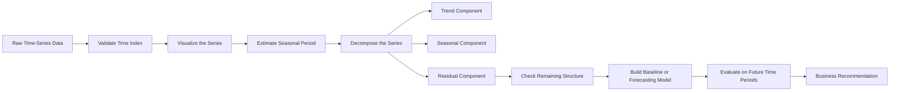
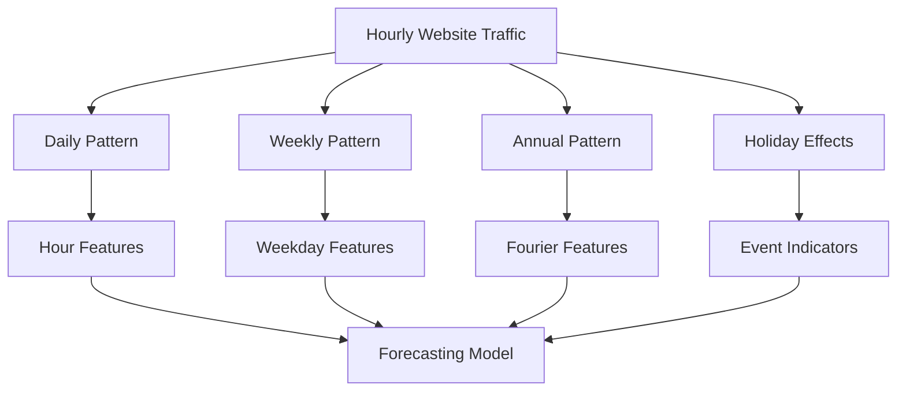
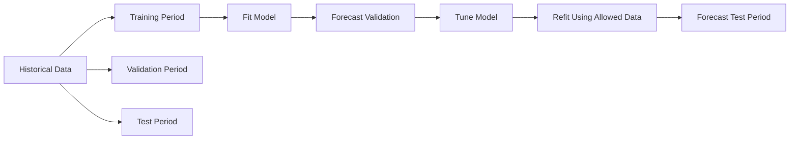
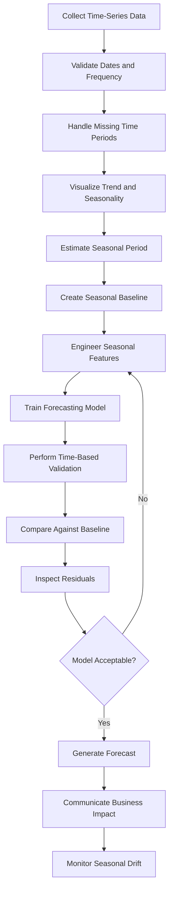

# 012 — Seasonality

**Course:** 01 — Math, Statistics and Econometrics
**Module:** Module 03 — Econometrics and Time Series
**Content Group:** Time Series
**Roadmap Source:** Econometrics and Time Series / Time Series
**Lesson Type:** Econometrics and Time Series
**Order in Module:** 012
**Suggested Duration:** 22 minutes

---

## 1. Overview

**Seasonality** describes a pattern in time-series data that repeats at regular and predictable intervals.

Examples include:

* Retail sales increasing every December
* Website traffic decreasing every weekend
* Electricity demand rising during hot summer months
* Restaurant orders peaking around lunch and dinner
* Public transportation usage changing by hour of day

Seasonality is important because a forecasting model may produce misleading predictions when it does not account for recurring patterns.

In an AI and Data Science workflow, seasonality analysis helps answer questions such as:

* Does demand follow a weekly, monthly, or yearly cycle?
* Which parts of the observed pattern are predictable?
* Is the recent increase caused by long-term growth or a seasonal event?
* Which historical periods should be compared?
* Which forecasting model should be used?

By the end of this lesson, you should be able to identify seasonal patterns, estimate their frequency, incorporate them into a model, and explain their business implications.

---

## 2. Learning Objectives

After completing this lesson, you should be able to:

* Explain seasonality in your own words.
* Distinguish seasonality from trend, cycles, and random noise.
* Identify common seasonal periods in time-series data.
* Recognize additive and multiplicative seasonality.
* Detect seasonality using plots, grouping, decomposition, and autocorrelation.
* Create seasonal baseline forecasts.
* Prevent time-based data leakage during validation.
* Interpret seasonal patterns using business language.
* Apply seasonality analysis to a small forecasting project.

---

## 3. Main Concept

A time series can often be represented using several components:

$$
Y_t = T_t + S_t + R_t
$$

where:

* (Y_t) is the observed value at time (t)
* (T_t) is the trend component
* (S_t) is the seasonal component
* (R_t) is the remaining random or irregular component

A more complete decomposition may also include a cyclical component:

$$
Y_t = T_t + S_t + C_t + R_t
$$

where (C_t) represents longer-term cycles that do not necessarily repeat at a fixed interval.

---

## 4. Trend, Seasonality, Cycles, and Noise

These time-series components describe different behaviors.

| Component   | Description                                     | Example                                     |
| ----------- | ----------------------------------------------- | ------------------------------------------- |
| Trend       | Long-term upward or downward movement           | Sales increasing over five years            |
| Seasonality | Repeating pattern with a known or stable period | Higher sales every December                 |
| Cycle       | Long-term fluctuation without a fixed period    | Economic expansion and recession            |
| Noise       | Unpredictable random variation                  | Sudden demand caused by an unexpected event |

### Key distinction

Seasonality repeats at relatively regular intervals, while a cycle may vary in both duration and intensity.

For example:

* A weekly traffic pattern is seasonal.
* An economic recession is cyclical.
* A sudden server outage is an irregular event.

---

## 5. Seasonal Period

The **seasonal period**, usually written as (m), is the number of observations required for one complete seasonal cycle.

Common examples include:

| Data Frequency | Possible Seasonal Period | Meaning            |
| -------------- | -----------------------: | ------------------ |
| Hourly         |                       24 | Daily seasonality  |
| Hourly         |                      168 | Weekly seasonality |
| Daily          |                        7 | Weekly seasonality |
| Daily          |            365 or 365.25 | Yearly seasonality |
| Weekly         |                       52 | Yearly seasonality |
| Monthly        |                       12 | Yearly seasonality |
| Quarterly      |                        4 | Yearly seasonality |

The correct period depends on both the data frequency and the business process.

For example, hourly electricity demand may contain multiple seasonal patterns:

* A 24-hour daily pattern
* A 168-hour weekly pattern
* A yearly weather-related pattern

This is known as **multiple seasonality**.

---

## 6. Additive Seasonality

An additive seasonal model is appropriate when the size of the seasonal effect remains approximately constant over time.

$$
Y_t = T_t + S_t + R_t
$$

Suppose monthly sales increase by approximately 1,000 units every December, regardless of the general sales level.

This is an additive seasonal pattern.

### Example

| Year | Normal Monthly Sales | December Increase |
| ---- | -------------------: | ----------------: |
| 2024 |               10,000 |            +1,000 |
| 2025 |               15,000 |            +1,100 |
| 2026 |               20,000 |              +950 |

The seasonal increase remains close to the same absolute amount.

---

## 7. Multiplicative Seasonality

A multiplicative seasonal model is appropriate when the seasonal effect grows or decreases with the level of the series.

$$
Y_t = T_t \times S_t \times R_t
$$

Suppose December sales are consistently about 30% higher than a normal month.

As the business grows, the absolute seasonal increase also becomes larger.

### Example

| Year | Normal Monthly Sales | December Sales |
| ---- | -------------------: | -------------: |
| 2024 |               10,000 |         13,000 |
| 2025 |               20,000 |         26,000 |
| 2026 |               30,000 |         39,000 |

The seasonal effect is proportional to the current level.

A logarithmic transformation can sometimes convert multiplicative relationships into additive ones:

$$
\log(Y_t) = \log(T_t) + \log(S_t) + \log(R_t)
$$

---

## 8. Seasonal Indices

A seasonal index represents how a specific seasonal period differs from the typical level.

For an additive model:

$$
S_j = \bar{Y}_j - \bar{Y}
$$

where:

* (\bar{Y}_j) is the average value for seasonal position (j)
* (\bar{Y}) is the overall average

For a multiplicative model:

$$
S_j = \frac{\bar{Y}_j}{\bar{Y}}
$$

For example, a December seasonal index of (1.30) means that December values are typically 30% above the overall average.

A Monday index of (0.80) means that Monday values are typically 20% below the average.

---

## 9. How to Detect Seasonality

Seasonality should be investigated using multiple methods rather than relying on a single chart or statistical test.

### 9.1 Time-Series Plot

Plot the observed values in chronological order.

Look for:

* Peaks occurring at regular intervals
* Repeated low-demand periods
* Similar shapes across weeks, months, or years
* Seasonal variation that changes with the series level

```text
Value
  ^
  |        /\          /\          /\
  |       /  \        /  \        /  \
  |______/    \______/    \______/    \____> Time
             Cycle       Cycle
```

---

### 9.2 Grouped Seasonal Plot

Group observations by their seasonal position.

Examples:

* Sales grouped by month
* Traffic grouped by weekday
* Electricity usage grouped by hour
* Orders grouped by day of month

This makes it easier to compare recurring periods.

```python
import pandas as pd
import matplotlib.pyplot as plt

df["date"] = pd.to_datetime(df["date"])
df["month"] = df["date"].dt.month

monthly_average = df.groupby("month")["sales"].mean()

monthly_average.plot(
    kind="bar",
    title="Average Sales by Month",
    xlabel="Month",
    ylabel="Average Sales"
)

plt.tight_layout()
plt.show()
```

---

### 9.3 Seasonal Subseries Plot

A seasonal subseries plot displays each seasonal period across multiple cycles.

For monthly data, all January observations are compared with other January observations, all February observations with other February observations, and so on.

This helps identify:

* Stable seasonal effects
* Changing seasonal strength
* Seasonal periods with high variance
* Possible outliers

---

### 9.4 Autocorrelation Function

The autocorrelation function measures the relationship between a series and its past values.

For lag (k):

$$
\rho_k = \operatorname{Corr}(Y_t, Y_{t-k})
$$

Strong autocorrelation at seasonal lags can indicate seasonality.

For monthly data with yearly seasonality, significant peaks may appear at:

$$
12,\ 24,\ 36,\ \ldots
$$

For daily data with weekly seasonality, peaks may appear at:

$$
7,\ 14,\ 21,\ \ldots
$$

```python
from statsmodels.graphics.tsaplots import plot_acf
import matplotlib.pyplot as plt

plot_acf(df["sales"].dropna(), lags=36)
plt.title("Autocorrelation of Monthly Sales")
plt.show()
```

Autocorrelation alone does not prove that a relationship is causal. It only shows that repeated temporal dependence may exist.

---

### 9.5 Seasonal Decomposition

Seasonal decomposition separates a time series into interpretable components.

```python
from statsmodels.tsa.seasonal import seasonal_decompose

result = seasonal_decompose(
    df.set_index("date")["sales"],
    model="additive",
    period=12
)

result.plot()
```

The output usually includes:

* Observed series
* Trend component
* Seasonal component
* Residual component

A clean residual series should contain less visible structure than the original data.

---

### 9.6 Spectral Analysis

Spectral methods search for dominant frequencies in a time series.

A strong frequency may indicate a repeating seasonal period.

This method is useful when:

* The seasonal period is unknown
* Several seasonal patterns may exist
* The series is long and regularly sampled

However, spectral analysis is usually more advanced than the visual, decomposition, and autocorrelation methods used in introductory analysis.

---

## 10. Seasonal Decomposition Workflow



---

## 11. Seasonal Baseline Forecast

A seasonal baseline predicts the current value using the value from the same seasonal position in the previous cycle.

$$
\hat{Y}_t = Y_{t-m}
$$

where (m) is the seasonal period.

Examples:

For daily data with weekly seasonality:

$$
\hat{Y}_t = Y_{t-7}
$$

For monthly data with yearly seasonality:

$$
\hat{Y}_t = Y_{t-12}
$$

```python
seasonal_period = 12

df["seasonal_naive_forecast"] = df["sales"].shift(seasonal_period)
```

A seasonal baseline is simple, but it is extremely important.

A more complex model should usually outperform this baseline before it is considered useful.

---

## 12. Modeling Seasonality

There are several ways to include seasonality in a forecasting model.

### 12.1 Seasonal Dummy Variables

For monthly data, create one indicator variable for each month.

$$
Y_t = \beta_0 + \beta_1 t + \gamma_2 D_{2,t} + \cdots + \gamma_{12} D_{12,t} + \epsilon_t
$$

One month must be omitted as the reference category to avoid perfect multicollinearity.

```python
df = pd.get_dummies(
    df,
    columns=["month"],
    drop_first=True,
    dtype=int
)
```

This approach works well when the seasonal effect is relatively stable and easy to interpret.

---

### 12.2 Fourier Features

Fourier features represent smooth seasonal patterns using sine and cosine functions.

$$
\sin\left(\frac{2\pi kt}{m}\right), \qquad \cos\left(\frac{2\pi kt}{m}\right)
$$

where:

* (m) is the seasonal period
* (k) is the harmonic number

```python
import numpy as np

period = 365.25
t = np.arange(len(df))

df["sin_year"] = np.sin(2 * np.pi * t / period)
df["cos_year"] = np.cos(2 * np.pi * t / period)
```

Fourier features are useful when:

* Seasonality changes smoothly
* The period contains many observations
* Creating hundreds of dummy variables would be inefficient
* A machine-learning model requires explicit features

---

### 12.3 Seasonal Differencing

Seasonal differencing removes repeated seasonal patterns:

$$
Y'_t = Y_t - Y_{t-m}
$$

For monthly data with yearly seasonality:

$$
Y'_t = Y_t - Y_{t-12}
$$

```python
df["seasonal_difference"] = df["sales"].diff(12)
```

Seasonal differencing is commonly used in Seasonal ARIMA models.

It should not be applied automatically. Excessive differencing may remove useful information or increase noise.

---

### 12.4 Seasonal ARIMA

A Seasonal ARIMA model is commonly written as:

$$
\operatorname{ARIMA}(p,d,q)(P,D,Q)_m
$$

where:

* (p,d,q) describe the non-seasonal component
* (P,D,Q) describe the seasonal component
* (m) is the seasonal period

For monthly sales with yearly seasonality, (m=12).

Example:

$$
\operatorname{ARIMA}(1,1,1)(1,1,1)_{12}
$$

This model includes both regular and seasonal autoregressive, differencing, and moving-average terms.

---

## 13. Multiple Seasonal Patterns

Some datasets contain more than one seasonal pattern.

For hourly website traffic, possible patterns include:

* Hour-of-day seasonality
* Day-of-week seasonality
* Holiday seasonality
* Annual seasonality



Traditional Seasonal ARIMA models usually represent one primary seasonal period. More complex seasonality may require:

* Fourier features
* Dynamic regression
* TBATS
* Prophet-style models
* Gradient boosting models
* Neural forecasting models

---

## 14. Calendar Effects Are Not Always Pure Seasonality

Calendar-related patterns may look seasonal but require special handling.

Examples include:

* Public holidays
* Lunar New Year
* Black Friday
* Leap years
* Month length
* Payday effects
* School vacations
* Marketing campaigns

A holiday may occur every year but not on the same numerical date.

Therefore, holiday indicators should often be modeled separately from regular weekly or monthly seasonality.

```python
df["is_weekend"] = df["date"].dt.dayofweek >= 5
df["day_of_week"] = df["date"].dt.dayofweek
df["month"] = df["date"].dt.month
df["days_in_month"] = df["date"].dt.days_in_month
```

---

## 15. Validation and Time Leakage

Time-series data must not be randomly split in the same way as independent tabular data.

A random split may allow future seasonal information to influence the training set.

### Incorrect approach

```text
Past ───── Future ───── Past ───── Future
        Randomly mixed between train and test
```

### Correct chronological split

```text
|------------- Training -------------|---- Validation ----|---- Test ---->
Past                                                               Future
```



The validation and test periods should contain enough observations to cover the important seasonal cycles.

For monthly data with yearly seasonality, a test set containing only two months may not provide a reliable evaluation.

---

## 16. Rolling-Origin Evaluation

Rolling-origin evaluation repeatedly trains a model using past data and tests it on future data.

```text
Fold 1: [Train----------][Validate]
Fold 2: [Train---------------][Validate]
Fold 3: [Train--------------------][Validate]
```

This provides a more realistic estimate of forecasting performance across different seasonal periods.

```python
from sklearn.model_selection import TimeSeriesSplit

splitter = TimeSeriesSplit(n_splits=5)

for train_index, validation_index in splitter.split(df):
    train = df.iloc[train_index]
    validation = df.iloc[validation_index]
```

For seasonal data, each validation window should be chosen carefully so that it represents the forecasting horizon and seasonal conditions expected in production.

---

## 17. Forecast Evaluation Metrics

Common forecasting metrics include:

### Mean Absolute Error

$$
\operatorname{MAE} = \frac{1}{n} \sum_{t=1}^{n} |Y_t-\hat{Y}_t|
$$

### Root Mean Squared Error

$$
\operatorname{RMSE} = \sqrt{ \frac{1}{n} \sum_{t=1}^{n} (Y_t-\hat{Y}_t)^2 }
$$

### Mean Absolute Percentage Error

$$
\operatorname{MAPE} = \frac{100}{n} \sum_{t=1}^{n} \left| \frac{Y_t-\hat{Y}_t}{Y_t} \right|
$$

MAPE can become unstable when actual values are zero or close to zero.

### Mean Absolute Scaled Error

$$
\operatorname{MASE} = \frac{ \frac{1}{n}\sum |Y_t-\hat{Y}_t| }{ \frac{1}{T-m}\sum_{t=m+1}^{T}|Y_t-Y_{t-m}| }
$$

For seasonal data, the denominator can use a seasonal naive forecast.

Interpretation:

* (\operatorname{MASE}<1): the model outperforms the seasonal naive baseline.
* (\operatorname{MASE}>1): the seasonal naive baseline performs better.

---

## 18. Practical Example: Monthly Sales

Suppose a company has four years of monthly sales data.

The time-series plot shows:

* A long-term upward trend
* Higher sales every November and December
* Lower sales every February
* Larger seasonal variation as total sales increase

This suggests multiplicative seasonality.

### Analysis workflow

```text
Monthly sales data
        ↓
Check missing months and duplicated dates
        ↓
Plot sales over time
        ↓
Compare average sales by month
        ↓
Inspect ACF at lags 12, 24, and 36
        ↓
Apply multiplicative decomposition
        ↓
Create a seasonal naive forecast
        ↓
Train Seasonal ARIMA or feature-based model
        ↓
Evaluate on future months
        ↓
Translate results into inventory decisions
```

### Business interpretation

A weak interpretation:

> The model detected a seasonal component with period 12.

A better interpretation:

> Sales typically rise during November and December and fall in February. Inventory and staffing should therefore be increased before the fourth-quarter peak rather than after demand has already increased.

---

## 19. Minimal Python Demo

```python
import pandas as pd
import matplotlib.pyplot as plt
from sklearn.metrics import mean_absolute_error
from statsmodels.tsa.seasonal import seasonal_decompose

# Expected columns:
# date, sales

df = pd.read_csv("monthly_sales.csv")
df["date"] = pd.to_datetime(df["date"])

df = (
    df.sort_values("date")
      .set_index("date")
      .asfreq("MS")
)

# Inspect the time series
df["sales"].plot(
    figsize=(10, 4),
    title="Monthly Sales"
)
plt.ylabel("Sales")
plt.tight_layout()
plt.show()

# Seasonal decomposition
decomposition = seasonal_decompose(
    df["sales"],
    model="multiplicative",
    period=12
)

decomposition.plot()
plt.show()

# Seasonal naive forecast
df["forecast"] = df["sales"].shift(12)

evaluation = df.dropna(subset=["forecast"])

mae = mean_absolute_error(
    evaluation["sales"],
    evaluation["forecast"]
)

print(f"Seasonal naive MAE: {mae:.2f}")
```

This demo produces three useful artifacts:

1. A time-series chart
2. A seasonal decomposition chart
3. A seasonal baseline metric

---

## 20. Residual Diagnostics

After modeling seasonality, inspect the residuals:

$$
e_t = Y_t - \hat{Y}_t
$$

A useful model should leave residuals with:

* Mean close to zero
* No obvious trend
* No strong seasonal pattern
* Relatively stable variance
* Limited autocorrelation
* No unexplained clusters of large errors

```python
residuals = evaluation["sales"] - evaluation["forecast"]

residuals.plot(
    title="Forecast Residuals"
)
plt.axhline(0)
plt.tight_layout()
plt.show()
```

If seasonal peaks remain in the residual autocorrelation plot, the model has probably not captured the seasonal structure completely.

---

## 21. Seasonality in Machine Learning

Machine-learning models do not automatically understand time unless time-related information is represented explicitly.

Useful features include:

* Hour of day
* Day of week
* Week of year
* Month
* Quarter
* Weekend indicator
* Holiday indicator
* Seasonal lag values
* Rolling seasonal averages
* Fourier features

```python
df["month"] = df.index.month
df["quarter"] = df.index.quarter
df["lag_12"] = df["sales"].shift(12)
df["rolling_12_mean"] = df["sales"].shift(1).rolling(12).mean()
```

The `shift(1)` before calculating a rolling feature prevents the current target value from leaking into its own predictors.

---

## 22. Common Mistakes

### Mistake 1: Confusing trend with seasonality

A continuous upward movement is not seasonality unless it repeats at regular intervals.

### Mistake 2: Choosing a seasonal period without understanding the data

A period of 12 makes sense for monthly yearly seasonality, but not automatically for every dataset.

### Mistake 3: Ignoring multiple seasonal patterns

Hourly or daily data may contain daily, weekly, and yearly effects simultaneously.

### Mistake 4: Using a random train-test split

This may leak future seasonal information into training.

### Mistake 5: Evaluating on less than one meaningful seasonal cycle

A test set that excludes important peak periods may produce unrealistic metrics.

### Mistake 6: Treating holidays as ordinary fixed seasonality

Some holidays move between dates and require explicit event features.

### Mistake 7: Ignoring changing seasonal strength

A fixed seasonal pattern may become weaker or stronger as customer behavior changes.

### Mistake 8: Skipping the seasonal baseline

A complex model may appear accurate while still performing worse than simply using last season's value.

### Mistake 9: Using future information in rolling features

All lagged and rolling features must be constructed using only information available at prediction time.

### Mistake 10: Reporting only a forecasting metric

The final result should explain how the seasonal pattern affects inventory, staffing, budgeting, marketing, or system capacity.

---

## 23. End-to-End Forecasting Workflow



---

## 24. Practical Exercise

Use a small dataset containing daily or monthly observations.

Possible datasets include:

* Daily website visits
* Monthly retail sales
* Hourly electricity consumption
* Daily food-delivery orders
* Weekly product demand

Complete the following tasks:

1. Convert the time column into a proper datetime index.
2. Verify that observations are ordered correctly.
3. Check for missing or duplicated periods.
4. Plot the complete time series.
5. Propose at least one possible seasonal period.
6. Group observations by month, weekday, or hour.
7. Create an autocorrelation plot.
8. Decompose the series.
9. Create a seasonal naive forecast.
10. Evaluate the forecast using MAE or MASE.
11. Inspect the residuals.
12. Write a short business recommendation.

---

## 25. Reflection Questions

Answer the following questions without reviewing the lesson:

1. What is the difference between trend and seasonality?
2. What does a seasonal period of (m=7) mean for daily data?
3. When should multiplicative seasonality be considered?
4. Why should a seasonal baseline be created?
5. Why is random train-test splitting dangerous for time-series data?
6. What does strong autocorrelation at lags 12 and 24 suggest for monthly data?
7. How would you model both daily and weekly seasonality in hourly data?
8. What business decision could be improved using seasonal forecasts?

---

## 26. Completion Checklist

* [ ] I can explain **seasonality** in one or two minutes.
* [ ] I can distinguish seasonality from trend, cycles, and noise.
* [ ] I can identify a reasonable seasonal period.
* [ ] I understand additive and multiplicative seasonality.
* [ ] I can inspect seasonality using grouped plots and autocorrelation.
* [ ] I can perform seasonal decomposition.
* [ ] I can create a seasonal naive forecast.
* [ ] I can evaluate a model using chronological validation.
* [ ] I can identify possible time leakage.
* [ ] I have created a notebook, chart, model, API, or technical note for this lesson.
* [ ] I have documented at least one assumption, limitation, or unresolved question.
* [ ] I can explain the business impact of the seasonal pattern.

---

## 27. Related Outcome

Model relationships and time-dependent data using:

* Regression
* Time-series diagnostics
* Seasonal decomposition
* Autocorrelation analysis
* Seasonal baselines
* ARIMA and Seasonal ARIMA
* Feature-based forecasting
* Time-aware validation workflows

---

## 28. Related Mini Project

### Sales Forecasting with Trend and Seasonality

Build a small forecasting project that:

1. Loads historical sales data.
2. Validates the time index.
3. Visualizes the trend and seasonal patterns.
4. Estimates the main seasonal period.
5. Decomposes the series.
6. Creates a seasonal naive baseline.
7. Trains a forecasting model such as Seasonal ARIMA.
8. Uses rolling or chronological validation.
9. Compares the model against the baseline.
10. Produces a future sales forecast.
11. Converts the forecast into an inventory or staffing recommendation.

### Suggested project artifacts

* Jupyter Notebook
* Cleaned time-series dataset
* Trend and seasonality charts
* Decomposition chart
* Autocorrelation plot
* Seasonal baseline
* Forecast evaluation table
* Residual diagnostics
* Forecast API
* README with assumptions and limitations

---

## 29. Key Takeaways

* Seasonality is a repeating pattern that occurs at regular time intervals.
* The seasonal period depends on the data frequency and the underlying business process.
* Seasonal effects may be additive or multiplicative.
* Visualizations, grouped statistics, autocorrelation, and decomposition can reveal seasonality.
* A seasonal naive forecast is an essential forecasting baseline.
* Validation must preserve chronological order.
* Calendar events, holidays, and promotions may require separate features.
* Residuals should be checked for remaining seasonal structure.
* Forecasting results should be translated into practical business decisions.
* Seasonality is not only a statistical concept; it directly affects inventory, staffing, marketing, budgeting, infrastructure, and operational planning.

---

## 30. Summary

**Seasonality** is a central concept in time-series analysis and forecasting. It explains recurring patterns such as daily traffic cycles, weekly customer behavior, monthly demand changes, and annual sales peaks.

Understanding seasonality helps an AI or Data Scientist choose appropriate features, baselines, models, validation strategies, and evaluation periods.

Do not stop at recognizing a repeating chart pattern. Convert the concept into a practical artifact such as:

* A time-series notebook
* A seasonal decomposition chart
* A seasonal baseline
* A forecasting experiment
* A Seasonal ARIMA model
* A prediction API
* A monitoring dashboard
* A portfolio case study

The objective is not only to detect seasonality, but to use it to produce more accurate forecasts and better business decisions.
