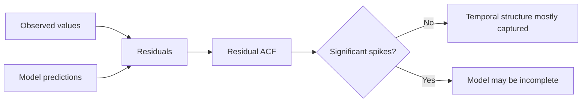
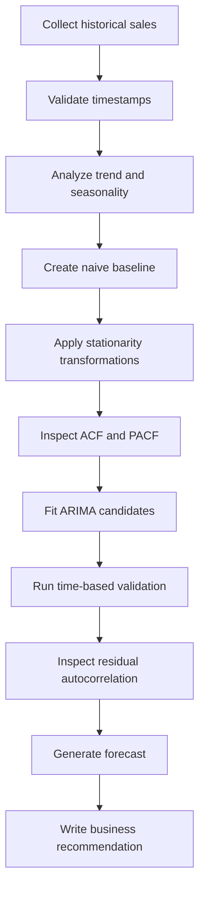

# 016 — ACF and PACF

**Course:** 01 — Mathematics, Statistics, and Econometrics
**Module:** Module 03 — Econometrics and Time Series
**Content Group:** Time Series
**Roadmap Source:** Econometrics and Time Series / Time Series
**Lesson Type:** Econometrics and Time Series
**Order in Module:** 016
**Suggested Duration:** 22 minutes

---

## 1. Overview

This lesson explains the **Autocorrelation Function (ACF)** and the **Partial Autocorrelation Function (PACF)** in the context of AI and data science.

ACF and PACF help us understand how a time series is related to its past values. They are especially useful for:

* detecting temporal dependence;
* identifying seasonal patterns;
* selecting candidate parameters for AR, MA, and ARIMA models;
* diagnosing model residuals;
* checking whether useful information remains unexplained by a forecasting model.

After completing this lesson, you should be able to interpret ACF and PACF plots, connect their patterns to time-series models, and create a small forecasting or diagnostic artifact.

---

## 2. Learning Objectives

By the end of this lesson, you should be able to:

* explain ACF and PACF in your own words;
* distinguish autocorrelation from partial autocorrelation;
* calculate and interpret correlation at different time lags;
* identify common ACF and PACF patterns;
* use ACF and PACF as diagnostic tools;
* propose candidate ARIMA parameters from ACF and PACF plots;
* apply ACF and PACF to a real time-series dataset;
* communicate the findings in practical business language.

---

## 3. Why Time Lags Matter

A time series contains observations recorded in chronological order:

$$
y_1, y_2, y_3, \ldots, y_t
$$

A **lag** represents a previous observation.

For example:

$$
y_{t-1}
$$

is the value one time step before $y_t$, while:

$$
y_{t-7}
$$

is the value seven time steps before $y_t$.

For daily sales data:

* lag 1 means yesterday;
* lag 7 means the same day last week;
* lag 30 may represent approximately one month ago;
* lag 365 may represent the same date last year.

### Lagged relationship

```text
Time:       t-3       t-2       t-1        t
Value:    y(t-3)    y(t-2)    y(t-1)     y(t)
                         └────────┬─────────┘
                          Lag-1 relationship
```

If today's sales are strongly related to yesterday's sales, the time series has strong lag-1 autocorrelation.

---

## 4. Autocorrelation Function — ACF

The **Autocorrelation Function**, or ACF, measures the correlation between a time series and lagged versions of itself.

At lag $k$, the ACF measures the relationship between:

$$
y_t
$$

and:

$$
y_{t-k}
$$

The population autocorrelation at lag $k$ is:

$$
\rho_k
=

\frac{
\operatorname{Cov}(y_t, y_{t-k})
}{
\sqrt{
\operatorname{Var}(y_t)
\operatorname{Var}(y_{t-k})
}
}
$$

For a stationary time series, the variance is constant over time, so this is commonly written as:

$$
\rho_k
=

\frac{\gamma_k}{\gamma_0}
$$

where:

* $\gamma_k$ is the autocovariance at lag $k$;
* $\gamma_0$ is the variance of the time series;
* $\rho_k$ is the autocorrelation coefficient at lag $k$.

Like an ordinary correlation coefficient:

$$
-1 \leq \rho_k \leq 1
$$

### Interpretation

* $\rho_k \approx 1$: strong positive relationship at lag $k$;
* $\rho_k \approx -1$: strong negative relationship at lag $k$;
* $\rho_k \approx 0$: weak or no linear relationship at lag $k$.

### Example

Suppose daily demand has the following ACF values:

| Lag |  ACF |
| --: | ---: |
|   1 | 0.82 |
|   2 | 0.69 |
|   3 | 0.55 |
|   4 | 0.40 |
|   5 | 0.28 |

This suggests that demand is strongly related to recent previous days, but the relationship gradually weakens as the lag increases.

---

## 5. Partial Autocorrelation Function — PACF

The **Partial Autocorrelation Function**, or PACF, measures the direct relationship between $y_t$ and $y_{t-k}$ after removing the effects of the intermediate lags.

For example, the ordinary correlation between $y_t$ and $y_{t-2}$ may exist because:

$$
y_{t-2} \rightarrow y_{t-1} \rightarrow y_t
$$

PACF attempts to remove the indirect effect through $y_{t-1}$.

### Direct versus indirect relationship

```text
ACF at lag 2 considers the total relationship:

y(t-2) ───────────────► y(t)
   │                       ▲
   └────► y(t-1) ──────────┘

PACF at lag 2 removes the effect of y(t-1):

y(t-2) ───────────────► y(t)
          direct effect
```

The PACF at lag $k$ can be interpreted as the coefficient of $y_{t-k}$ in the regression:

$$
y_t
=

\beta_0
+
\beta_1 y_{t-1}
+
\beta_2 y_{t-2}
+
\cdots
+
\beta_k y_{t-k}
+
\varepsilon_t
$$

The PACF at lag $k$ corresponds to:

$$
\beta_k
$$

after controlling for lags $1, 2, \ldots, k-1$.

---

## 6. ACF versus PACF

| Aspect                     | ACF                                   | PACF                             |
| -------------------------- | ------------------------------------- | -------------------------------- |
| Full name                  | Autocorrelation Function              | Partial Autocorrelation Function |
| Measures                   | Total correlation with a lag          | Direct correlation with a lag    |
| Controls intermediate lags | No                                    | Yes                              |
| Common use                 | Detecting MA behavior and seasonality | Detecting AR behavior            |
| Residual diagnostics       | Yes                                   | Yes                              |
| Parameter hint             | Candidate $q$                         | Candidate $p$                    |

### Intuition

* **ACF:** How much is the current value related to a past value?
* **PACF:** How much additional information does that past value provide after accounting for more recent values?

---

## 7. Understanding an ACF or PACF Plot

An ACF or PACF plot normally contains:

* the lag number on the horizontal axis;
* the correlation coefficient on the vertical axis;
* a vertical spike for each lag;
* a confidence interval around zero.

```text
Correlation
   1.0 ┤
       │      │
   0.5 ┤  │   │
       │  │   │       │
   0.0 ┼──┼───┼───┼───┼──────── Lag
       │  1   2   3   4
  -0.5 ┤
```

A spike outside the confidence interval is often treated as statistically significant.

An approximate 95% confidence interval for white noise is:

$$
\pm \frac{1.96}{\sqrt{N}}
$$

where $N$ is the number of observations.

However, this interval is only an approximation. Multiple-lag testing can also produce apparently significant spikes by chance.

---

## 8. Common ACF and PACF Patterns

### 8.1 White noise

White noise has no meaningful temporal dependence.

Expected pattern:

* most ACF spikes remain within the confidence interval;
* most PACF spikes remain within the confidence interval;
* no systematic decay or repeated seasonal pattern appears.

```text
ACF:   small random spikes around zero
PACF:  small random spikes around zero
```

A forecasting model whose residuals behave like white noise has captured most of the predictable temporal structure.

---

### 8.2 Strong trend or non-stationarity

A trending time series often produces:

* very high ACF values at small lags;
* a slow decline across many lags;
* many significant positive spikes.

```text
Lag:    1    2    3    4    5    6
ACF:  0.95 0.91 0.87 0.83 0.79 0.74
```

This pattern may indicate that the series should be detrended or differenced before fitting an ARIMA model.

The first difference is:

$$
\Delta y_t = y_t - y_{t-1}
$$

---

### 8.3 Seasonal behavior

For data with season length $s$, the ACF may contain large spikes at:

$$
s, 2s, 3s, \ldots
$$

For example, daily data with weekly seasonality may show spikes at:

$$
7, 14, 21, 28, \ldots
$$

```text
Lag:   1  2  3  4  5  6  7  8 ... 14
ACF:                         ▲         ▲
                           weekly    two weeks
```

These repeated spikes suggest that observations separated by one seasonal cycle are related.

---

### 8.4 AR process

An autoregressive process of order $p$, written as AR($p$), is:

$$
y_t
=

c
+
\phi_1 y_{t-1}
+
\phi_2 y_{t-2}
+
\cdots
+
\phi_p y_{t-p}
+
\varepsilon_t
$$

Typical identification pattern:

* ACF gradually decays;
* PACF cuts off after lag $p$.

For an AR(1) process:

```text
ACF:   gradual exponential or damped decay
PACF:  strong spike at lag 1, then approximately zero
```

For an AR(2) process:

```text
ACF:   gradual or oscillating decay
PACF:  significant spikes at lags 1 and 2, then approximately zero
```

---

### 8.5 MA process

A moving-average process of order $q$, written as MA($q$), is:

$$
y_t
=

\mu
+
\varepsilon_t
+
\theta_1 \varepsilon_{t-1}
+
\cdots
+
\theta_q \varepsilon_{t-q}
$$

Typical identification pattern:

* ACF cuts off after lag $q$;
* PACF gradually decays.

For an MA(1) process:

```text
ACF:   strong spike at lag 1, then approximately zero
PACF:  gradual exponential or damped decay
```

---

### 8.6 ARMA process

An ARMA process contains both autoregressive and moving-average components.

Typical pattern:

* ACF gradually decays;
* PACF gradually decays;
* neither plot has a clean cutoff.

In this situation, candidate parameters should be tested with validation criteria rather than selected from visual inspection alone.

---

## 9. ACF/PACF Model Identification Guide

The following table provides common starting heuristics:

| Process               | ACF pattern                  | PACF pattern                   |
| --------------------- | ---------------------------- | ------------------------------ |
| White noise           | No significant structure     | No significant structure       |
| AR($p$)               | Tails off                    | Cuts off after lag $p$         |
| MA($q$)               | Cuts off after lag $q$       | Tails off                      |
| ARMA($p, q$)           | Tails off                    | Tails off                      |
| Non-stationary series | Slow decay across many lags  | Large early spikes             |
| Seasonal process      | Spikes at seasonal multiples | Seasonal lag spikes may appear |

These are diagnostic guidelines, not strict rules.

Real-world data may include:

* trend;
* seasonality;
* missing observations;
* structural breaks;
* nonlinear relationships;
* multiple seasonal cycles;
* external variables.

As a result, ACF and PACF should be combined with model validation.

---

## 10. Relationship to ARIMA

An ARIMA model is written as:

$$
\operatorname{ARIMA}(p,d,q)
$$

where:

* $p$ is the autoregressive order;
* $d$ is the number of differences;
* $q$ is the moving-average order.

A common workflow is:

```mermaid
flowchart LR
    A[Raw time series] --> B[Inspect trend and seasonality]
    B --> C[Test stationarity]
    C --> D[Apply differencing if necessary]
    D --> E[Plot ACF and PACF]
    E --> F[Propose candidate p and q]
    F --> G[Fit ARIMA candidates]
    G --> H[Compare validation metrics]
    H --> I[Check residual ACF]
    I --> J[Forecast and communicate results]
```



### Practical interpretation

* use the differencing order to propose $d$;
* inspect PACF for candidate values of $p$;
* inspect ACF for candidate values of $q$;
* fit several nearby models;
* compare AIC, BIC, and time-based validation errors;
* inspect residual autocorrelation before accepting the model.

---

## 11. Worked Example

Suppose monthly sales show an upward trend.

The raw-series ACF has strong positive values that decline slowly:

| Lag |  ACF |
| --: | ---: |
|   1 | 0.93 |
|   2 | 0.88 |
|   3 | 0.82 |
|   4 | 0.76 |
|   5 | 0.70 |

This suggests non-stationarity.

After first differencing:

$$
\Delta y_t = y_t - y_{t-1}
$$

the plots show:

* PACF: one strong spike at lag 1;
* ACF: gradual decay.

This suggests an AR(1) structure for the differenced series.

A candidate model is therefore:

$$
\operatorname{ARIMA}(1,1,0)
$$

However, this model must still be compared with alternatives such as:

$$
\operatorname{ARIMA}(0,1,1)
$$

and:

$$
\operatorname{ARIMA}(1,1,1)
$$

using time-series validation.

---

## 12. Python Demo

### 12.1 Import libraries

```python
import numpy as np
import pandas as pd
import matplotlib.pyplot as plt

from statsmodels.graphics.tsaplots import plot_acf, plot_pacf
from statsmodels.tsa.ar_model import AutoReg
```

### 12.2 Create an AR(1) time series

```python
np.random.seed(42)

n = 300
phi = 0.75
noise = np.random.normal(loc=0, scale=1, size=n)

series = np.zeros(n)

for t in range(1, n):
    series[t] = phi * series[t - 1] + noise[t]

ts = pd.Series(series, name="value")
```

The data-generating process is:

$$
y_t = 0.75y_{t-1}+\varepsilon_t
$$

### 12.3 Plot the time series

```python
fig, ax = plt.subplots(figsize=(12, 4))

ax.plot(ts)
ax.set_title("Simulated AR(1) Time Series")
ax.set_xlabel("Time")
ax.set_ylabel("Value")

plt.tight_layout()
plt.show()
```

### 12.4 Plot ACF

```python
fig, ax = plt.subplots(figsize=(10, 4))

plot_acf(
    ts,
    lags=30,
    zero=False,
    ax=ax
)

ax.set_title("Autocorrelation Function")
plt.tight_layout()
plt.show()
```

Expected result:

* a high lag-1 autocorrelation;
* correlations that gradually decay toward zero.

### 12.5 Plot PACF

```python
fig, ax = plt.subplots(figsize=(10, 4))

plot_pacf(
    ts,
    lags=30,
    zero=False,
    method="ywm",
    ax=ax
)

ax.set_title("Partial Autocorrelation Function")
plt.tight_layout()
plt.show()
```

Expected result:

* one dominant spike at lag 1;
* later lags close to zero.

This is consistent with an AR(1) process.

---

## 13. Real Dataset Workflow

For a real sales, traffic, demand, or sensor dataset, use the following workflow:

```python
import pandas as pd
import matplotlib.pyplot as plt

from statsmodels.graphics.tsaplots import plot_acf, plot_pacf

df = pd.read_csv(
    "sales.csv",
    parse_dates=["date"]
)

df = df.sort_values("date")
df = df.set_index("date")

sales = df["sales"].dropna()
```

### Plot the original series

```python
sales.plot(figsize=(12, 4), title="Sales Over Time")
plt.tight_layout()
plt.show()
```

### Difference the series

```python
sales_diff = sales.diff().dropna()
```

### Plot ACF and PACF

```python
fig, ax = plt.subplots(figsize=(10, 4))
plot_acf(sales_diff, lags=40, zero=False, ax=ax)
ax.set_title("ACF of Differenced Sales")
plt.tight_layout()
plt.show()
```

```python
fig, ax = plt.subplots(figsize=(10, 4))
plot_pacf(
    sales_diff,
    lags=40,
    zero=False,
    method="ywm",
    ax=ax
)
ax.set_title("PACF of Differenced Sales")
plt.tight_layout()
plt.show()
```

### Questions to answer

* Does the raw series appear stationary?
* Does the ACF decay slowly?
* Are there seasonal spikes?
* Does the PACF have a clear cutoff?
* Which ARIMA parameters appear reasonable?
* Do residuals still contain autocorrelation after model fitting?

---

## 14. Residual Diagnostics

ACF is not only used before model fitting. It is also important after fitting a forecasting model.

Residuals are:

$$
e_t = y_t - \hat{y}_t
$$

A good forecasting model should leave residuals that behave approximately like white noise.



If the residual ACF contains significant spikes, the model may have failed to capture:

* autoregressive dependence;
* seasonality;
* structural changes;
* omitted external variables;
* nonlinear temporal relationships.

The Ljung–Box test can also be used to test whether residual autocorrelations are jointly different from zero.

---

## 15. Business Interpretation

ACF and PACF should not be reported only as statistical charts.

Translate the result into operational language.

### Weak interpretation

> The ACF at lag 7 is statistically significant.

### Better interpretation

> Weekly sales are strongly related to sales from the same weekday one week earlier. This suggests that weekly seasonality should be included in the forecasting model.

### Another example

> Demand has strong dependence on the previous two days. A short-term autoregressive component may improve next-day demand forecasts.

### Residual example

> The residual ACF still contains a large spike at lag 7, indicating that the current model has not fully captured the weekly purchasing cycle.

---

## 16. Important Assumptions and Caveats

### 16.1 Stationarity matters

ACF and PACF are easiest to interpret when the series is stationary.

A stationary time series has approximately stable:

* mean;
* variance;
* autocorrelation structure.

Trend and changing variance can create misleading correlations.

---

### 16.2 Correlation does not imply causation

A high autocorrelation means that past and current observations move together. It does not prove that the past observation directly causes the current one.

Both values may be influenced by:

* seasonality;
* promotions;
* weather;
* economic conditions;
* holidays;
* shared external factors.

---

### 16.3 ACF detects linear dependence

ACF and PACF measure linear relationships.

A series may have nonlinear dependence even when autocorrelation is close to zero.

---

### 16.4 Large lag counts can be misleading

Using too many lags may produce:

* noisy estimates;
* accidental significant spikes;
* unstable interpretations;
* reduced effective sample sizes.

The number of lags should be selected based on:

* dataset size;
* sampling frequency;
* expected seasonality;
* business context.

---

### 16.5 Visual identification is not sufficient

ACF and PACF provide candidate model structures, not guaranteed answers.

Candidate models should be compared using:

* rolling or expanding-window validation;
* MAE;
* RMSE;
* MAPE or WAPE where appropriate;
* AIC;
* BIC;
* residual diagnostics.

---

### 16.6 Missing timestamps can distort lags

Before computing ACF or PACF, verify that the series has a regular time interval.

For example:

```text
Correct daily series:
Monday → Tuesday → Wednesday → Thursday

Irregular series:
Monday → Wednesday → Thursday → Sunday
```

In the irregular series, lag 1 does not consistently mean one day.

---

### 16.7 Leakage must be avoided

Do not use future observations when:

* creating lag features;
* filling missing values;
* scaling the data;
* selecting model parameters;
* validating the model.

All preprocessing should respect chronological order.

---

## 17. Common Mistakes

### Mistake 1: Interpreting ACF before removing a strong trend

A slowly declining ACF may be caused by non-stationarity rather than a true high-order AR process.

**Better approach:** inspect the time series, test stationarity, and difference when appropriate.

---

### Mistake 2: Treating every significant spike as meaningful

With many lags, some spikes may cross the confidence interval by chance.

**Better approach:** look for systematic patterns and verify them using domain knowledge and validation.

---

### Mistake 3: Using PACF to select $p$ mechanically

A PACF cutoff does not guarantee that the selected AR order is optimal.

**Better approach:** evaluate several nearby candidate models.

---

### Mistake 4: Ignoring seasonality

A spike at lag 7, 12, 24, or 365 may reflect a seasonal cycle rather than an ordinary AR or MA component.

**Better approach:** understand the sampling frequency and expected seasonal period.

---

### Mistake 5: Random train-test splitting

Random splitting leaks future information into the training set.

**Better approach:** use chronological splits or walk-forward validation.

---

### Mistake 6: Checking only training residuals

A model can fit historical data well but forecast poorly.

**Better approach:** inspect both residual diagnostics and out-of-sample forecasting performance.

---

### Mistake 7: Confusing ACF with feature importance

A large ACF value does not automatically mean that the lag will improve every machine-learning model.

**Better approach:** test lag features within a properly validated forecasting pipeline.

---

## 18. Practical Exercise

Use a daily sales, web traffic, energy demand, or sensor dataset.

### Task 1 — Explore the series

* sort observations chronologically;
* verify that timestamps are regular;
* plot the raw time series;
* identify visible trend, seasonality, and outliers.

### Task 2 — Plot ACF and PACF

* plot ACF for the original series;
* plot PACF for the original series;
* choose a meaningful maximum lag;
* explain the most important spikes.

### Task 3 — Transform the data

Apply first differencing:

$$
\Delta y_t = y_t - y_{t-1}
$$

Then plot the ACF and PACF again.

Compare the original and differenced results.

### Task 4 — Propose models

Propose at least three candidates, such as:

$$
\operatorname{ARIMA}(1,1,0)
$$

$$
\operatorname{ARIMA}(0,1,1)
$$

$$
\operatorname{ARIMA}(1,1,1)
$$

Explain why each candidate is reasonable.

### Task 5 — Validate

Use a chronological train-test split and compare:

* naive forecast;
* seasonal naive forecast;
* selected ARIMA candidates.

Record at least one forecasting metric.

### Task 6 — Diagnose residuals

For the best model:

* calculate residuals;
* plot residual ACF;
* inspect whether meaningful temporal structure remains;
* write one limitation or follow-up question.

---

## 19. Suggested Notebook Structure

```text
01. Problem definition
02. Dataset description
03. Time-index validation
04. Exploratory time-series plot
05. Trend and seasonality analysis
06. Stationarity analysis
07. ACF and PACF of raw data
08. Differencing or transformation
09. ACF and PACF after transformation
10. Candidate model selection
11. Time-based validation
12. Residual diagnostics
13. Business interpretation
14. Assumptions, limitations, and next steps
```

---

## 20. Portfolio Artifact

Create a notebook titled:

> **Using ACF and PACF to Diagnose and Forecast Sales**

The notebook should include:

* a clear business question;
* a properly indexed time series;
* raw and transformed time-series charts;
* ACF and PACF plots;
* explanations of significant lags;
* at least one baseline model;
* at least one ARIMA model;
* time-based validation;
* residual ACF analysis;
* a final recommendation written for a non-technical stakeholder.

An optional extension is to expose the final forecast through:

* a FastAPI endpoint;
* a Streamlit dashboard;
* a scheduled forecasting job;
* a Docker service;
* a monitoring dashboard.

---

## 21. Completion Checklist

* [ ] I can explain ACF in one or two minutes.
* [ ] I can explain PACF in one or two minutes.
* [ ] I understand the difference between total and direct lag relationships.
* [ ] I can recognize common AR, MA, and ARMA patterns.
* [ ] I know why a slowly decaying ACF may indicate non-stationarity.
* [ ] I can identify seasonal spikes in an ACF plot.
* [ ] I can propose candidate ARIMA parameters.
* [ ] I understand that ACF/PACF patterns are diagnostic guidelines.
* [ ] I can inspect residual autocorrelation.
* [ ] I can apply chronological validation without leakage.
* [ ] I have created a notebook, chart, model, API, or portfolio note.
* [ ] I have documented at least one assumption, caveat, or follow-up question.

---

## 22. Key Takeaways

1. **ACF measures the total relationship between a time series and its lagged values.**

2. **PACF measures the direct relationship at a lag after controlling for intermediate lags.**

3. **PACF is commonly used to propose autoregressive order $p$.**

4. **ACF is commonly used to propose moving-average order $q$.**

5. **Slowly decaying ACF values may indicate trend or non-stationarity.**

6. **Repeated spikes at seasonal lags may indicate seasonality.**

7. **Residual ACF helps determine whether a forecasting model has captured the temporal structure.**

8. **ACF and PACF should be combined with stationarity analysis, domain knowledge, and time-based validation.**

---

## 23. Related Outcome

Model relationships in time-dependent data using:

* regression;
* lag features;
* stationarity diagnostics;
* ACF and PACF;
* AR, MA, ARMA, and ARIMA models;
* residual diagnostics;
* forecasting validation workflows.

---

## 24. Related Project

### Mini Project: Sales Forecasting with ACF and PACF

Build a sales forecasting workflow that includes:



The final output should contain:

* a reproducible notebook;
* forecast charts;
* validation metrics;
* residual diagnostics;
* documented assumptions;
* a practical business recommendation.

---

## 25. Summary

**ACF and PACF** are essential tools for understanding temporal dependence.

ACF shows how a time series is related to its past values through both direct and indirect paths. PACF isolates the direct contribution of each lag after controlling for shorter lags.

They are valuable for:

* diagnosing time-series structure;
* detecting seasonality;
* proposing ARIMA parameters;
* evaluating residuals;
* creating lag-based forecasting features.

Do not stop at generating two plots. Turn the analysis into a complete artifact:

$$
\text{Time series}
\rightarrow
\text{stationarity analysis}
\rightarrow
\text{ACF/PACF}
\rightarrow
\text{candidate models}
\rightarrow
\text{validation}
\rightarrow
\text{residual diagnostics}
\rightarrow
\text{business decision}
$$