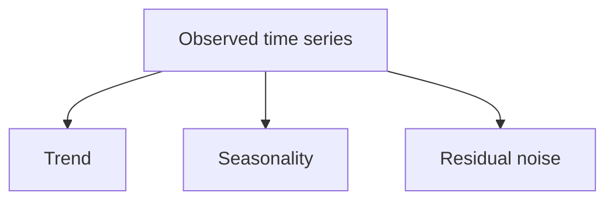
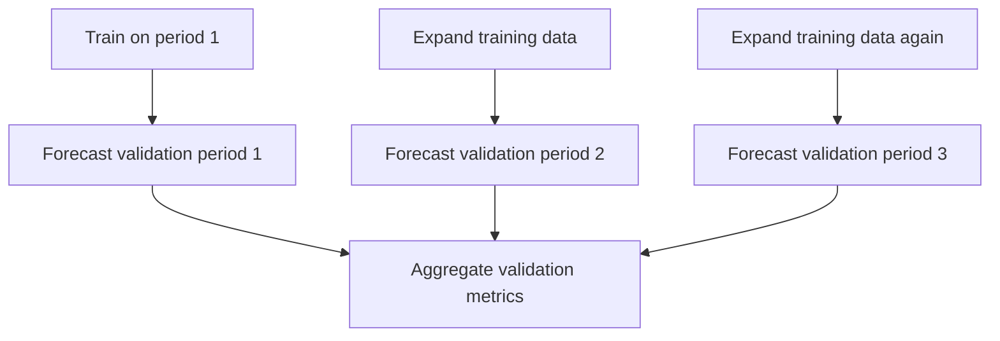
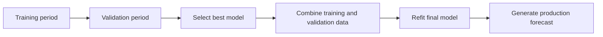
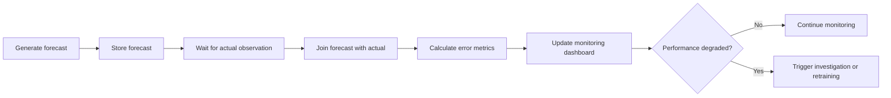
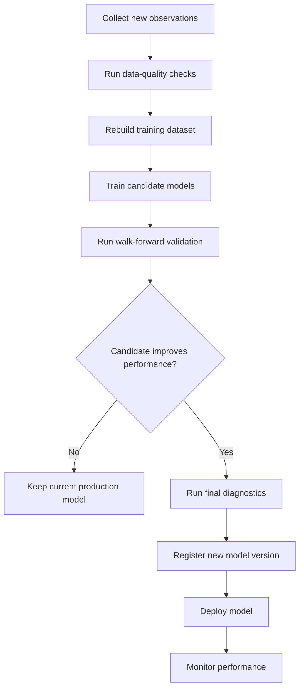
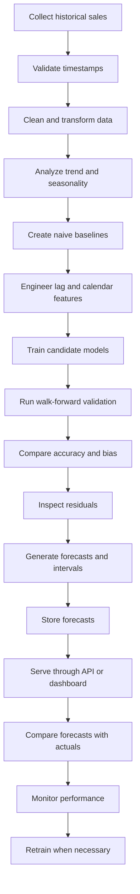

# 018 — Forecasting Pipeline

**Course:** 01 — Mathematics, Statistics, and Econometrics
**Module:** Module 03 — Econometrics and Time Series
**Content Group:** Time Series
**Roadmap Source:** Econometrics and Time Series / Time Series
**Lesson Type:** Econometrics and Time Series
**Order in Module:** 018
**Suggested Duration:** 22 minutes

---

## 1. Overview

This lesson explains how to build a complete **forecasting pipeline** in the context of AI and data science.

A forecasting pipeline is more than a model. It is an end-to-end system that transforms historical time-series data into reliable, reproducible, and actionable future predictions.

A complete forecasting pipeline usually includes:

* business problem definition;
* data collection;
* timestamp validation;
* data cleaning;
* exploratory analysis;
* baseline forecasting;
* feature engineering;
* model training;
* time-based validation;
* residual diagnostics;
* forecast generation;
* deployment;
* monitoring;
* retraining.

The main goal is not only to produce accurate predictions, but also to ensure that the forecasting system works correctly in production.

---

## 2. Learning Objectives

By the end of this lesson, you should be able to:

* explain the purpose of a forecasting pipeline;
* define a forecast horizon and prediction frequency;
* validate a time-series index;
* identify trend, seasonality, and anomalies;
* create naive and seasonal baselines;
* engineer lag and rolling features without leakage;
* train statistical and machine-learning forecasting models;
* use chronological and walk-forward validation;
* compare models with appropriate metrics;
* diagnose forecast residuals;
* generate prediction intervals;
* design a forecasting API or batch job;
* monitor forecast accuracy and data quality;
* translate forecast results into business decisions.

---

## 3. What Is a Forecasting Pipeline?

A forecasting pipeline is an ordered sequence of steps that converts historical data into future estimates.


A forecasting pipeline should be:

* reproducible;
* time-aware;
* resistant to leakage;
* measurable;
* deployable;
* observable;
* maintainable.

---

## 4. Forecasting versus Ordinary Prediction

In ordinary supervised learning, observations are often assumed to be independent.

In time-series forecasting, observations are ordered:

$$
y_1, y_2, y_3, \ldots, y_t
$$

The forecasting objective is to estimate future observations:

$$
\hat{y}_{t+1}, \hat{y}_{t+2}, \ldots, \hat{y}_{t+h}
$$

where (h) is the forecast horizon.

The key difference is that future information must never be used to predict the past.

```text
Time ─────────────────────────────────────────────────►

Historical data                 Forecast period
|---------------------------|--------------------------|
y₁  y₂  y₃  ...  yₜ₋₁  yₜ   ŷₜ₊₁  ŷₜ₊₂  ...  ŷₜ₊ₕ
```

---

## 5. Define the Business Problem

Before selecting a model, define the decision that the forecast will support.

Examples:

* How many products should be stocked next week?
* How many customer-support agents are needed tomorrow?
* How much electricity will be consumed during the next 24 hours?
* How much revenue should be expected next month?
* How many deliveries should be scheduled next Monday?

A useful forecasting specification should define:

| Element              | Example                 |
| -------------------- | ----------------------- |
| Target               | Daily product demand    |
| Forecast horizon     | Next 14 days            |
| Forecast frequency   | Once per day            |
| Data frequency       | Daily                   |
| Forecast granularity | Product and store       |
| Decision             | Inventory replenishment |
| Acceptable error     | MAE below 50 units      |
| Retraining schedule  | Weekly                  |

---

## 6. Forecast Horizon

The forecast horizon is the number of future periods being predicted.

For example:

* (h=1): one-step-ahead forecast;
* (h=7): seven-day forecast;
* (h=12): twelve-month forecast.

The horizon should match the business decision.

```text
Observed data                       Forecast horizon
────────────────────────────┬──────────────────────────
                            │
                            ├── h = 1
                            ├──────── h = 7
                            └──────────────── h = 30
```

Forecast uncertainty generally increases as the horizon becomes longer.

---

## 7. Forecasting Strategies

### 7.1 One-step-ahead forecasting

Predict only the next time step:

$$
\hat{y}_{t+1}
$$

The model is updated after the true observation becomes available.

---

### 7.2 Recursive forecasting

Predict the next value and use the prediction to generate later forecasts.

$$
\hat{y}_{t+1} = f(y_t,y_{t-1},\ldots)
$$

$$
\hat{y}_{t+2} = f(\hat{y}_{t+1},y_t,\ldots)
$$

Advantages:

* one model is sufficient;
* simple to implement.

Disadvantages:

* prediction errors accumulate;
* later horizons may become unstable.

---

### 7.3 Direct forecasting

Train a separate model for each horizon.

$$
\hat{y}_{t+h}=f_h(X_t)
$$

Advantages:

* avoids recursive error propagation;
* each horizon can learn different patterns.

Disadvantages:

* requires multiple models;
* increases training and maintenance cost.

---

### 7.4 Multi-output forecasting

Train one model that predicts multiple future values simultaneously:

$$
[\hat{y}_{t+1},\hat{y}_{t+2},\ldots,\hat{y}_{t+h}] = f(X_t)
$$

This approach is common in neural forecasting models.

---

## 8. Data Collection

Forecasting data may come from:

* transactional databases;
* event streams;
* APIs;
* sensors;
* data warehouses;
* CSV or Parquet files;
* ERP systems;
* CRM systems;
* marketing platforms;
* weather services.

A forecasting dataset often contains:

| Column        | Description                     |
| ------------- | ------------------------------- |
| `timestamp`   | Observation time                |
| `target`      | Value to forecast               |
| `series_id`   | Product, store, user, or sensor |
| `price`       | Product price                   |
| `promotion`   | Promotion indicator             |
| `holiday`     | Holiday indicator               |
| `temperature` | Weather variable                |
| `inventory`   | Available inventory             |

---

## 9. Time-Index Validation

Before modeling, verify that the time index is correct.

Check for:

* invalid timestamps;
* duplicate timestamps;
* missing timestamps;
* incorrect ordering;
* inconsistent time zones;
* irregular sampling frequency;
* delayed observations;
* duplicated business entities.

### Correct sequence

```text
2026-07-01
2026-07-02
2026-07-03
2026-07-04
```

### Irregular sequence

```text
2026-07-01
2026-07-03
2026-07-04
2026-07-08
```

In an irregular sequence, lag 1 does not consistently represent one day.

---

## 10. Python Data Validation

```python
import pandas as pd

df = pd.read_csv(
    "sales.csv",
    parse_dates=["date"],
)

df = df.sort_values("date")
df = df.set_index("date")

sales = df["sales"].astype(float)
```

Check duplicate timestamps:

```python
duplicate_count = sales.index.duplicated().sum()
print(f"Duplicate timestamps: {duplicate_count}")
```

Check missing values:

```python
print(f"Missing values: {sales.isna().sum()}")
```

Check the inferred frequency:

```python
print(f"Inferred frequency: {sales.index.inferred_freq}")
```

Create a regular daily index:

```python
sales = sales.asfreq("D")
```

---

## 11. Missing-Value Handling

Missing observations may represent:

* missing data collection;
* system downtime;
* zero activity;
* closed business days;
* delayed reporting.

Do not automatically replace every missing value with zero.

Possible methods include:

### Forward fill

```python
sales_filled = sales.ffill()
```

### Time interpolation

```python
sales_filled = sales.interpolate(method="time")
```

### Seasonal replacement

For daily data with weekly seasonality:

$$
y_t \approx y_{t-7}
$$

### Model-based imputation

Use a separate model to estimate missing values.

The correct method depends on the meaning of the missing observation.

---

## 12. Exploratory Time-Series Analysis

Before training a model, analyze:

* trend;
* seasonality;
* cycles;
* outliers;
* structural breaks;
* variance changes;
* intermittent demand;
* missing periods.

```python
import matplotlib.pyplot as plt

fig, ax = plt.subplots(figsize=(12, 4))

ax.plot(sales)
ax.set_title("Sales Over Time")
ax.set_xlabel("Date")
ax.set_ylabel("Sales")

plt.tight_layout()
plt.show()
```

---

## 13. Time-Series Components

A time series can often be represented as:

$$
y_t = T_t + S_t + R_t
$$

where:

* (T_t) is the trend;
* (S_t) is seasonality;
* (R_t) is the residual component.

This is an additive decomposition.

For multiplicative behavior:

$$
y_t = T_t \times S_t \times R_t
$$

A multiplicative structure may be more appropriate when seasonal variation grows with the series level.



---

## 14. Seasonal Decomposition

```python
from statsmodels.tsa.seasonal import seasonal_decompose

decomposition = seasonal_decompose(
    sales.dropna(),
    model="additive",
    period=7,
)

decomposition.plot()
plt.tight_layout()
plt.show()
```

For daily data:

* `period=7` may represent weekly seasonality;
* `period=365` may represent yearly seasonality.

The seasonal period should be selected using domain knowledge.

---

## 15. Build Baseline Forecasts

A forecasting model should always be compared with simple baselines.

### 15.1 Naive forecast

The next value is predicted using the latest observed value:

$$
\hat{y}_{t+1}=y_t
$$

For multiple future periods:

$$
\hat{y}_{t+h}=y_t
$$

---

### 15.2 Seasonal naive forecast

The forecast uses the value from the previous seasonal cycle:

$$
\hat{y}_t=y_{t-s}
$$

For daily data with weekly seasonality:

$$
\hat{y}_t=y_{t-7}
$$

---

### 15.3 Moving-average baseline

$$
\hat{y}_{t+1} = \frac{1}{k} \sum_{i=0}^{k-1}y_{t-i}
$$

---

### Why baselines matter

A complex model is useful only when it performs better than a suitable simple alternative.

---

## 16. Chronological Train-Test Split

Never randomly shuffle time-series observations.

```python
split_index = int(len(sales) * 0.8)

train = sales.iloc[:split_index]
test = sales.iloc[split_index:]
```

```text
Time ───────────────────────────────────────────────►

|             Training data             | Test data |
```

A random split can allow future patterns to influence training.

---

## 17. Baseline Implementation

### Naive forecast

```python
naive_forecast = pd.Series(
    train.iloc[-1],
    index=test.index,
)
```

### Seasonal naive forecast

```python
season_length = 7

seasonal_naive = pd.Series(
    [
        sales.loc[index - pd.Timedelta(days=season_length)]
        if index - pd.Timedelta(days=season_length) in sales.index
        else train.iloc[-1]
        for index in test.index
    ],
    index=test.index,
)
```

---

## 18. Feature Engineering

Machine-learning forecasting models usually require explicit input features.

Common time-series features include:

* lag values;
* rolling statistics;
* expanding statistics;
* calendar features;
* trend features;
* holiday indicators;
* promotion indicators;
* weather variables;
* event flags.

---

## 19. Lag Features

A lag feature contains a previous observation.

$$
x_{t,1}=y_{t-1}
$$

$$
x_{t,7}=y_{t-7}
$$

Example:

```python
df["lag_1"] = df["sales"].shift(1)
df["lag_7"] = df["sales"].shift(7)
df["lag_14"] = df["sales"].shift(14)
```

For daily sales:

* `lag_1` represents yesterday;
* `lag_7` represents the same weekday last week;
* `lag_14` represents two weeks ago.

---

## 20. Rolling Features

A rolling mean summarizes recent observations.

$$
\operatorname{RollingMean}_{t,k} = \frac{1}{k} \sum_{i=1}^{k}y_{t-i}
$$

The feature must exclude the current observation.

```python
df["rolling_mean_7"] = (
    df["sales"]
    .shift(1)
    .rolling(window=7)
    .mean()
)

df["rolling_std_7"] = (
    df["sales"]
    .shift(1)
    .rolling(window=7)
    .std()
)
```

The `shift(1)` operation prevents target leakage.

---

## 21. Calendar Features

Calendar features may capture recurring patterns.

```python
df["day_of_week"] = df.index.dayofweek
df["day_of_month"] = df.index.day
df["month"] = df.index.month
df["quarter"] = df.index.quarter
df["is_weekend"] = (
    df.index.dayofweek >= 5
).astype(int)
```

Other useful calendar features include:

* public holidays;
* payday periods;
* school vacations;
* end-of-month indicators;
* major events;
* product launch periods.

---

## 22. Cyclical Encoding

Calendar features are cyclical.

For example, December and January are close in time, even though their numeric values are 12 and 1.

Cyclical encoding uses sine and cosine transformations:

$$
x_{\sin} = \sin\left( \frac{2\pi x}{P} \right)
$$

$$
x_{\cos} = \cos\left( \frac{2\pi x}{P} \right)
$$

where (P) is the period.

```python
import numpy as np

df["dow_sin"] = np.sin(
    2 * np.pi * df["day_of_week"] / 7
)

df["dow_cos"] = np.cos(
    2 * np.pi * df["day_of_week"] / 7
)
```

---

## 23. Avoiding Feature Leakage

A feature contains leakage when it uses information unavailable at forecast time.

### Incorrect rolling feature

```python
df["rolling_mean_7"] = (
    df["sales"]
    .rolling(7)
    .mean()
)
```

This feature includes the current target value.

### Correct rolling feature

```python
df["rolling_mean_7"] = (
    df["sales"]
    .shift(1)
    .rolling(7)
    .mean()
)
```

### Other leakage examples

* scaling with the full dataset;
* imputing missing values using future observations;
* selecting parameters using the test set;
* using future promotions that were not planned;
* using finalized monthly totals to predict earlier days;
* computing centered rolling windows.

---

## 24. Model Candidates

A forecasting pipeline may evaluate several model families.

### Statistical models

* naive forecast;
* seasonal naive forecast;
* exponential smoothing;
* ARIMA;
* SARIMA;
* SARIMAX;
* state-space models.

### Machine-learning models

* linear regression;
* ridge regression;
* random forest;
* gradient boosting;
* XGBoost;
* LightGBM;
* CatBoost.

### Deep-learning models

* recurrent neural networks;
* LSTM;
* GRU;
* temporal convolutional networks;
* Transformers;
* temporal fusion models.

The best model depends on:

* data size;
* number of series;
* forecast horizon;
* seasonality;
* external variables;
* latency requirements;
* interpretability needs.

---

## 25. Statistical Model Example

```python
from statsmodels.tsa.arima.model import ARIMA

model = ARIMA(
    train,
    order=(1, 1, 1),
)

fitted_model = model.fit()

forecast = fitted_model.forecast(
    steps=len(test)
)
```

An ARIMA model is useful when temporal relationships are approximately linear and the series can be made stationary.

---

## 26. Machine-Learning Model Example

Create lag features:

```python
feature_df = pd.DataFrame(
    {
        "target": sales,
    }
)

feature_df["lag_1"] = feature_df["target"].shift(1)
feature_df["lag_7"] = feature_df["target"].shift(7)

feature_df["rolling_mean_7"] = (
    feature_df["target"]
    .shift(1)
    .rolling(7)
    .mean()
)

feature_df = feature_df.dropna()
```

Create chronological training and test sets:

```python
split_index = int(len(feature_df) * 0.8)

train_df = feature_df.iloc[:split_index]
test_df = feature_df.iloc[split_index:]

feature_columns = [
    "lag_1",
    "lag_7",
    "rolling_mean_7",
]

X_train = train_df[feature_columns]
y_train = train_df["target"]

X_test = test_df[feature_columns]
y_test = test_df["target"]
```

Train a model:

```python
from sklearn.ensemble import RandomForestRegressor

model = RandomForestRegressor(
    n_estimators=300,
    random_state=42,
    n_jobs=-1,
)

model.fit(X_train, y_train)

predictions = model.predict(X_test)
```

---

## 27. Walk-Forward Validation

A single train-test split may not provide a reliable estimate.

Walk-forward validation tests a model across multiple forecast origins.

```text
Fold 1:
|------ Training ------| Validation |

Fold 2:
|---------- Training ----------| Validation |

Fold 3:
|---------------- Training ----------------| Validation |
```



---

## 28. Time-Series Cross-Validation

```python
from sklearn.model_selection import TimeSeriesSplit

time_series_split = TimeSeriesSplit(
    n_splits=5,
)

for fold, (train_indices, validation_indices) in enumerate(
    time_series_split.split(feature_df),
    start=1,
):
    train_fold = feature_df.iloc[train_indices]
    validation_fold = feature_df.iloc[validation_indices]

    print(
        f"Fold {fold}: "
        f"train={len(train_fold)}, "
        f"validation={len(validation_fold)}"
    )
```

The model and preprocessing steps should be fitted independently inside every fold.

---

## 29. Expanding versus Sliding Windows

### Expanding window

The training set grows over time.

```text
Fold 1: [Train──────][Validate]
Fold 2: [Train────────────][Validate]
Fold 3: [Train──────────────────][Validate]
```

Advantages:

* uses all historical data;
* suitable for stable long-term relationships.

---

### Sliding window

The training set has a fixed length.

```text
Fold 1: [Train──────][Validate]
Fold 2:      [Train──────][Validate]
Fold 3:           [Train──────][Validate]
```

Advantages:

* adapts to recent behavior;
* may work better after structural changes.

---

## 30. Forecast Metrics

### Mean Absolute Error

$$
\operatorname{MAE} = \frac{1}{n} \sum_{t=1}^{n} |y_t-\hat{y}_t|
$$

MAE is easy to explain:

> The model is wrong by approximately 42 units on average.

---

### Root Mean Squared Error

$$
\operatorname{RMSE} = \sqrt{ \frac{1}{n} \sum_{t=1}^{n} (y_t-\hat{y}_t)^2 }
$$

RMSE penalizes large errors more strongly than MAE.

---

### Mean Absolute Percentage Error

$$
\operatorname{MAPE} = \frac{100}{n} \sum_{t=1}^{n} \left| \frac{y_t-\hat{y}_t}{y_t} \right|
$$

MAPE is problematic when actual values are zero or close to zero.

---

### Weighted Absolute Percentage Error

$$
\operatorname{WAPE} = \frac{ \sum_{t=1}^{n}|y_t-\hat{y}_t| }{ \sum_{t=1}^{n}|y_t| } \times 100
$$

WAPE is often useful for aggregate demand forecasting.

---

## 31. Metric Implementation

```python
import numpy as np
from sklearn.metrics import (
    mean_absolute_error,
    mean_squared_error,
)

def calculate_metrics(
    actual: pd.Series,
    predicted: pd.Series,
) -> dict[str, float]:
    mae = mean_absolute_error(
        actual,
        predicted,
    )

    rmse = mean_squared_error(
        actual,
        predicted,
    ) ** 0.5

    denominator = np.abs(actual).sum()

    wape = (
        np.abs(actual - predicted).sum()
        / denominator
        * 100
        if denominator != 0
        else np.nan
    )

    return {
        "mae": mae,
        "rmse": rmse,
        "wape": wape,
    }
```

---

## 32. Compare Models with a Baseline

```python
models = {
    "naive": naive_forecast,
    "seasonal_naive": seasonal_naive,
    "arima": forecast,
}

comparison = []

for model_name, model_forecast in models.items():
    metrics = calculate_metrics(
        test,
        model_forecast,
    )

    comparison.append(
        {
            "model": model_name,
            **metrics,
        }
    )

comparison_df = pd.DataFrame(comparison)
comparison_df = comparison_df.sort_values("mae")

print(comparison_df)
```

Do not select a model only because it is more complex.

---

## 33. Residual Diagnostics

Residuals are:

$$
e_t=y_t-\hat{y}_t
$$

A good forecasting model should leave residuals that are approximately:

* centered around zero;
* free of systematic trend;
* free of seasonality;
* weakly autocorrelated;
* relatively stable in variance.

```python
residuals = test - forecast
```

Plot residuals:

```python
fig, ax = plt.subplots(figsize=(12, 4))

ax.plot(residuals)
ax.axhline(0, linestyle="--")
ax.set_title("Forecast Residuals")
ax.set_xlabel("Date")
ax.set_ylabel("Residual")

plt.tight_layout()
plt.show()
```

---

## 34. Residual Autocorrelation

```python
from statsmodels.graphics.tsaplots import plot_acf

fig, ax = plt.subplots(figsize=(10, 4))

plot_acf(
    residuals.dropna(),
    lags=30,
    zero=False,
    ax=ax,
)

ax.set_title("Residual ACF")

plt.tight_layout()
plt.show()
```

Significant residual autocorrelation may indicate:

* missing lag features;
* unmodeled seasonality;
* structural changes;
* missing external variables;
* incorrect model order.

---

## 35. Ljung–Box Test

The Ljung–Box test evaluates whether residual autocorrelations are jointly different from zero.

```python
from statsmodels.stats.diagnostic import acorr_ljungbox

result = acorr_ljungbox(
    residuals.dropna(),
    lags=[7, 14],
    return_df=True,
)

print(result)
```

Typical hypotheses:

* (H_0): residuals contain no meaningful autocorrelation;
* (H_1): residual autocorrelation remains.

A small p-value suggests that the model may be incomplete.

---

## 36. Forecast Bias

Forecast bias measures whether a model consistently overpredicts or underpredicts.

$$
\operatorname{Bias} = \frac{1}{n} \sum_{t=1}^{n} (\hat{y}_t-y_t)
$$

Interpretation:

* positive bias: the model tends to overpredict;
* negative bias: the model tends to underpredict;
* bias near zero: no strong systematic direction.

```python
bias = (forecast - test).mean()

print(f"Forecast bias: {bias:.2f}")
```

Bias may be more important than MAE in some business decisions.

For example:

* underforecasting inventory may cause stockouts;
* overforecasting staffing may increase labor costs.

---

## 37. Prediction Intervals

A point forecast represents only one expected value.

A prediction interval communicates uncertainty:

$$
P( L_{t+h} \leq y_{t+h} \leq U_{t+h} ) = 1-\alpha
$$

For a 95% interval:

$$
\alpha=0.05
$$

Example:

> Expected demand is 1,200 units, with a 95% interval from 1,040 to 1,370 units.

Prediction intervals are useful for:

* inventory buffers;
* staffing plans;
* capacity planning;
* financial risk management.

---

## 38. Forecast Visualization

```python
fig, ax = plt.subplots(figsize=(12, 5))

ax.plot(
    train,
    label="Training data",
)

ax.plot(
    test,
    label="Actual values",
)

ax.plot(
    forecast,
    label="Forecast",
)

ax.set_title("Forecast versus Actual Values")
ax.set_xlabel("Date")
ax.set_ylabel("Sales")
ax.legend()

plt.tight_layout()
plt.show()
```

A forecast chart should clearly show:

* historical observations;
* forecast origin;
* predicted values;
* actual validation values;
* prediction intervals;
* forecast horizon.

---

## 39. Model Selection

Model selection should consider more than one metric.

A practical evaluation table may include:

| Model             |  MAE | RMSE |  WAPE |  Bias | Training time |
| ----------------- | ---: | ---: | ----: | ----: | ------------: |
| Naive             | 61.2 | 82.5 | 14.7% | -18.1 |      Very low |
| Seasonal naive    | 52.8 | 70.4 | 12.1% |  -6.4 |      Very low |
| ARIMA             | 45.3 | 62.7 | 10.4% |   2.8 |        Medium |
| Gradient boosting | 42.7 | 59.8 |  9.8% |   4.1 |          High |

The selected model should balance:

* forecast accuracy;
* stability;
* interpretability;
* inference latency;
* training cost;
* maintenance complexity;
* operational impact.

---

## 40. Refit the Final Model

After selecting the best model, refit it using all observations available before the production forecast date.



Do not use future observations beyond the forecast origin.

---

## 41. Forecast Output Schema

A forecast table may contain:

| Column              | Description               |
| ------------------- | ------------------------- |
| `series_id`         | Product, store, or sensor |
| `forecast_date`     | Future prediction date    |
| `prediction`        | Point forecast            |
| `lower_bound`       | Lower prediction interval |
| `upper_bound`       | Upper prediction interval |
| `model_version`     | Deployed model version    |
| `generated_at`      | Forecast creation time    |
| `training_end_date` | Last training observation |

Example:

```json
{
  "series_id": "product_001",
  "forecast_date": "2026-07-11",
  "prediction": 1240.5,
  "lower_95": 1102.3,
  "upper_95": 1378.7,
  "model_version": "sales-arima-v3",
  "generated_at": "2026-07-10T23:00:00+07:00",
  "training_end_date": "2026-07-10"
}
```

---

## 42. Batch Forecasting Pipeline

Batch forecasting generates predictions on a schedule.

Examples:

* daily demand forecast at midnight;
* weekly staffing forecast every Monday;
* monthly revenue forecast on the first day of each month.


Possible tools include:

* cron;
* Airflow;
* Prefect;
* Dagster;
* cloud schedulers;
* Kubernetes CronJobs.

---

## 43. Real-Time Forecasting Pipeline

Real-time forecasting may be required when predictions must update immediately.

Examples:

* traffic prediction;
* fraud-volume forecasting;
* server-load forecasting;
* delivery-time forecasting.


Real-time pipelines require careful handling of:

* event ordering;
* late-arriving data;
* feature freshness;
* model latency;
* state management;
* fault tolerance.

---

## 44. Forecasting API Example

A forecast request may look like:

```json
{
  "series_id": "product_001",
  "forecast_horizon": 7
}
```

Example response:

```json
{
  "series_id": "product_001",
  "model_version": "sales-forecast-v3",
  "forecast_horizon": 7,
  "forecasts": [
    {
      "date": "2026-07-11",
      "prediction": 1240.5,
      "lower_95": 1102.3,
      "upper_95": 1378.7
    },
    {
      "date": "2026-07-12",
      "prediction": 1268.4,
      "lower_95": 1089.7,
      "upper_95": 1447.1
    }
  ]
}
```

---

## 45. Minimal FastAPI Structure

```python
from fastapi import FastAPI
from pydantic import BaseModel, Field

app = FastAPI(
    title="Forecasting API",
    version="1.0.0",
)


class ForecastRequest(BaseModel):
    series_id: str
    forecast_horizon: int = Field(
        ge=1,
        le=90,
    )


class ForecastPoint(BaseModel):
    date: str
    prediction: float
    lower_95: float
    upper_95: float


class ForecastResponse(BaseModel):
    series_id: str
    model_version: str
    forecasts: list[ForecastPoint]


@app.post(
    "/forecast",
    response_model=ForecastResponse,
)
def generate_forecast(
    request: ForecastRequest,
) -> ForecastResponse:
    forecasts = [
        ForecastPoint(
            date="2026-07-11",
            prediction=1240.5,
            lower_95=1102.3,
            upper_95=1378.7,
        )
    ]

    return ForecastResponse(
        series_id=request.series_id,
        model_version="sales-forecast-v3",
        forecasts=forecasts,
    )
```

A production API should also include:

* authentication;
* request validation;
* structured logging;
* model caching;
* timeout handling;
* model-version metadata;
* error responses;
* monitoring metrics.

---

## 46. Model Versioning

Every production forecast should be traceable to:

* model name;
* model version;
* training-data range;
* feature version;
* code version;
* hyperparameters;
* validation metrics;
* deployment date.

Example model identifier:

```text
sales-forecast-arima-v3
```

Example metadata:

```json
{
  "model_name": "sales-forecast-arima",
  "model_version": "v3",
  "training_start": "2024-01-01",
  "training_end": "2026-07-10",
  "order": [1, 1, 1],
  "validation_mae": 42.7,
  "validation_wape": 9.8
}
```

---

## 47. Monitoring the Pipeline

A deployed forecasting pipeline should monitor both data and model behavior.

### Data monitoring

* missing timestamps;
* delayed data;
* duplicate observations;
* unexpected frequency;
* missing features;
* invalid values;
* target distribution shifts.

### Model monitoring

* MAE;
* RMSE;
* WAPE;
* forecast bias;
* prediction interval coverage;
* residual autocorrelation;
* error by horizon;
* error by product or location.

### System monitoring

* pipeline failures;
* API latency;
* batch duration;
* memory consumption;
* model-loading errors;
* database-write failures.

---

## 48. Forecast Accuracy Monitoring

Forecast performance can only be calculated after actual values become available.



---

## 49. Prediction Interval Coverage

For a 95% prediction interval, approximately 95% of actual observations should fall within the interval under ideal conditions.

Coverage is:

$$
\operatorname{Coverage} = \frac{1}{n} \sum_{t=1}^{n} \mathbb{1} \left( L_t \leq y_t \leq U_t \right)
$$

Poor coverage may indicate:

* underestimated uncertainty;
* data distribution changes;
* missing seasonality;
* structural breaks;
* model misspecification.

---

## 50. Retraining Strategy

A forecasting model may be retrained:

### On a schedule

* daily;
* weekly;
* monthly;
* quarterly.

### When performance degrades

Retrain when:

* MAE exceeds a threshold;
* bias becomes too large;
* interval coverage falls;
* data drift is detected;
* a structural break occurs.

### After major business events

Examples:

* pricing changes;
* new product launches;
* new store openings;
* policy changes;
* platform migrations.

---

## 51. Retraining Workflow



---

## 52. Business Interpretation

Forecasting results should be communicated in operational language.

### Weak interpretation

> The model achieved an MAE of 42.7 and an RMSE of 59.8.

### Better interpretation

> The model is wrong by approximately 43 units per day on average and improves on the seasonal baseline by 19%.

### Decision-oriented interpretation

> Expected demand for next week is 8,400 units. To maintain the desired service level, inventory planning should use the upper forecast range of approximately 9,100 units.

### Bias interpretation

> The model consistently underpredicts weekend demand by around 7%, which could increase stockout risk on Saturdays and Sundays.

---

## 53. Important Assumptions

### 53.1 Historical relationships remain useful

Forecasting models assume that historical patterns continue into the forecast period.

This assumption may fail after:

* policy changes;
* major promotions;
* economic shocks;
* product launches;
* system migrations;
* market disruptions.

---

### 53.2 Data is available on time

The production pipeline assumes that required data arrives before the forecast is generated.

Delayed data can create:

* incomplete features;
* stale forecasts;
* incorrect lag values;
* pipeline failures.

---

### 53.3 Feature availability matches training

Every feature used during training must be available when generating forecasts.

A feature is not useful in production if its future value cannot be known or estimated.

---

### 53.4 Time intervals are consistent

Irregular timestamps can change the meaning of lag and rolling features.

---

### 53.5 Forecast uncertainty is communicated

Point forecasts should not be interpreted as guaranteed outcomes.

---

## 54. Common Mistakes

### Mistake 1: Starting with the model

The model is only one part of the forecasting system.

**Better approach:** begin with the decision, horizon, frequency, and data availability.

---

### Mistake 2: Randomly splitting the data

Random splits create time leakage.

**Better approach:** use chronological or walk-forward validation.

---

### Mistake 3: Ignoring baselines

A complex model may perform worse than a seasonal naive forecast.

**Better approach:** always report baseline performance.

---

### Mistake 4: Creating leaking rolling features

Rolling statistics may accidentally include the target being predicted.

**Better approach:** shift the target before applying the rolling operation.

---

### Mistake 5: Using future external variables

A historical feature may not be available in the future.

**Better approach:** verify forecast-time availability for every feature.

---

### Mistake 6: Optimizing one metric only

A model with low RMSE may still have unacceptable bias.

**Better approach:** evaluate accuracy, bias, stability, and business cost.

---

### Mistake 7: Ignoring residual structure

Strong residual seasonality indicates that the model is incomplete.

**Better approach:** inspect residual plots and autocorrelation.

---

### Mistake 8: Deploying without monitoring

A model can degrade after deployment.

**Better approach:** monitor data quality, forecast error, bias, and interval coverage.

---

### Mistake 9: Retraining without validation

A newly trained model is not automatically better.

**Better approach:** compare the candidate against the current production model.

---

### Mistake 10: Reporting forecasts without uncertainty

Point forecasts may create false confidence.

**Better approach:** provide prediction intervals and scenario ranges.

---

## 55. Practical Exercise

Use a daily sales, traffic, demand, energy, or sensor dataset.

### Task 1 — Define the forecast

Document:

* target variable;
* forecast horizon;
* forecast frequency;
* data frequency;
* business decision;
* success metric.

### Task 2 — Validate the data

Check:

* timestamps;
* duplicates;
* missing observations;
* frequency;
* time zone;
* outliers.

### Task 3 — Explore the series

Identify:

* trend;
* seasonality;
* structural breaks;
* variance changes;
* abnormal observations.

### Task 4 — Create baselines

Implement:

* naive forecast;
* seasonal naive forecast.

Record MAE, RMSE, and WAPE.

### Task 5 — Engineer features

Create:

* lag 1;
* lag 7;
* rolling mean;
* rolling standard deviation;
* day-of-week features;
* holiday indicators.

Verify that no feature uses future information.

### Task 6 — Train candidate models

Compare at least:

* seasonal naive;
* ARIMA;
* one machine-learning model.

### Task 7 — Validate

Use:

* chronological splitting;
* or walk-forward validation.

Compare performance by forecast horizon.

### Task 8 — Diagnose residuals

Inspect:

* residual time plot;
* residual ACF;
* forecast bias;
* unusual error periods.

### Task 9 — Generate production output

Create a table containing:

* forecast date;
* prediction;
* lower bound;
* upper bound;
* model version.

### Task 10 — Write a recommendation

Explain:

* expected future demand;
* uncertainty;
* baseline improvement;
* main limitation;
* recommended business action.

---

## 56. Suggested Notebook Structure

```text
01. Business problem
02. Forecast target and horizon
03. Dataset description
04. Time-index validation
05. Missing-value analysis
06. Exploratory time-series analysis
07. Trend and seasonality
08. Naive baselines
09. Feature engineering
10. Leakage checks
11. Candidate models
12. Walk-forward validation
13. Metric comparison
14. Residual diagnostics
15. Forecast bias
16. Prediction intervals
17. Final model selection
18. Production forecast
19. Business recommendation
20. Monitoring and retraining plan
```

---

## 57. Portfolio Artifact

Create a notebook titled:

> **End-to-End Sales Forecasting Pipeline**

The notebook should include:

* a clear business problem;
* forecast horizon and frequency;
* time-index validation;
* data-quality checks;
* exploratory analysis;
* baseline forecasts;
* lag and rolling features;
* ARIMA or another statistical model;
* one machine-learning model;
* chronological validation;
* residual diagnostics;
* prediction intervals;
* model comparison;
* a final business recommendation;
* a deployment and monitoring design.

Optional extensions include:

* FastAPI forecasting endpoint;
* Streamlit dashboard;
* scheduled batch job;
* Docker container;
* model registry;
* monitoring dashboard;
* automated retraining workflow.

---

## 58. Completion Checklist

* [ ] I can explain a forecasting pipeline in one or two minutes.
* [ ] I can define the forecast target and horizon.
* [ ] I can validate a time-series index.
* [ ] I can identify trend and seasonality.
* [ ] I can build naive and seasonal naive baselines.
* [ ] I can create lag features without leakage.
* [ ] I can create rolling features without leakage.
* [ ] I can use chronological validation.
* [ ] I can perform walk-forward validation.
* [ ] I can compare models using MAE, RMSE, and WAPE.
* [ ] I can measure forecast bias.
* [ ] I can inspect residual autocorrelation.
* [ ] I can explain prediction intervals.
* [ ] I can design a forecast output schema.
* [ ] I can describe a batch forecasting pipeline.
* [ ] I can describe a real-time forecasting pipeline.
* [ ] I can define model-monitoring metrics.
* [ ] I can propose a retraining strategy.
* [ ] I have created a notebook, model, API, dashboard, or portfolio artifact.
* [ ] I have documented at least one assumption and limitation.

---

## 59. Key Takeaways

1. **A forecasting pipeline is an end-to-end system, not only a model.**

2. **The business decision determines the forecast target, horizon, frequency, and evaluation metric.**

3. **Time-index validation is required before feature engineering or modeling.**

4. **Naive and seasonal naive forecasts provide essential performance baselines.**

5. **Lag and rolling features must use only information available at forecast time.**

6. **Time-series validation must preserve chronological order.**

7. **Walk-forward validation provides a more realistic estimate of production performance.**

8. **Forecast accuracy should be evaluated using multiple metrics.**

9. **Forecast bias can be operationally more important than average error.**

10. **Residual diagnostics help identify unmodeled temporal structure.**

11. **Prediction intervals communicate uncertainty and support risk-aware decisions.**

12. **Production forecasts should include model and data metadata.**

13. **Forecasting pipelines require data, model, and system monitoring.**

14. **A retrained model must outperform the current production model before deployment.**

15. **The final result should support a business action, not merely report a metric.**

---

## 60. Related Outcome

Model relationships and time-dependent data using:

* time-index validation;
* exploratory time-series analysis;
* baselines;
* lag features;
* rolling features;
* ARIMA;
* machine-learning forecasting;
* walk-forward validation;
* residual diagnostics;
* forecast intervals;
* deployment;
* monitoring;
* automated retraining.

---

## 61. Related Project

### Mini Project: Production-Ready Sales Forecasting Pipeline

Build the following workflow:



The final output should contain:

* a reproducible notebook;
* validated time-series data;
* baseline forecasts;
* at least two candidate models;
* walk-forward validation;
* forecast metrics;
* residual diagnostics;
* prediction intervals;
* a forecast output table;
* deployment architecture;
* monitoring metrics;
* a business recommendation.

---

## 62. Summary

A **forecasting pipeline** transforms historical time-series data into reliable, monitored, and actionable future predictions.

The complete workflow is:

$$
\text{Business problem}
\rightarrow
\text{data collection}
\rightarrow
\text{time-index validation}
\rightarrow
\text{exploratory analysis}
\rightarrow
\text{baseline}
\rightarrow
\text{feature engineering}
\rightarrow
\text{model training}
\rightarrow
\text{time-based validation}
\rightarrow
\text{residual diagnostics}
\rightarrow
\text{forecast generation}
\rightarrow
\text{deployment}
\rightarrow
\text{monitoring}
\rightarrow
\text{retraining}
$$

A successful pipeline should answer the following questions:

* What business decision does the forecast support?
* Which historical data is available?
* Is the time index correct and complete?
* Does the model outperform a meaningful baseline?
* Was the model evaluated without future leakage?
* Are forecast residuals acceptable?
* How uncertain are the predictions?
* How will forecasts be delivered?
* How will performance be monitored?
* When should the model be retrained?

Do not stop after producing a forecast.

Turn the forecast into a complete, reproducible, deployable, and monitored decision-support system.
