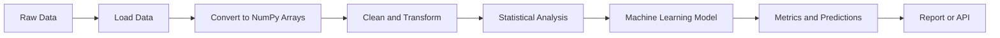
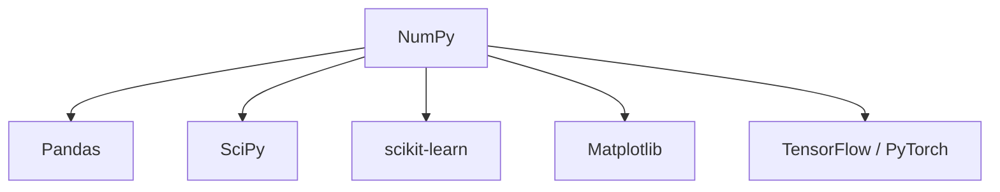
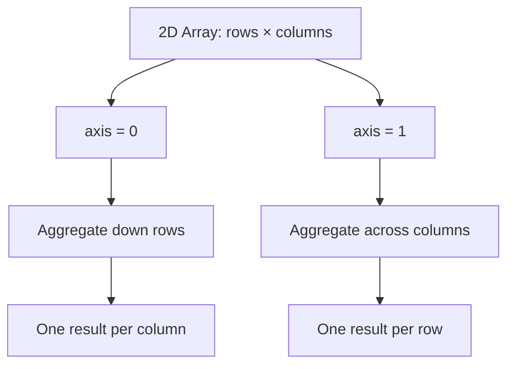
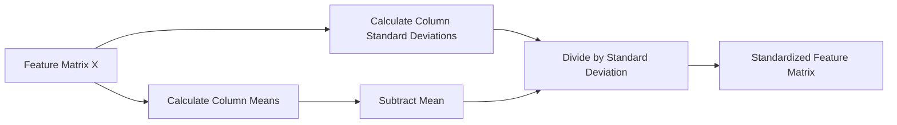
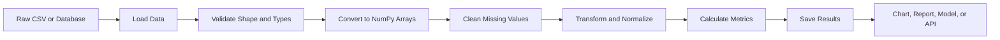
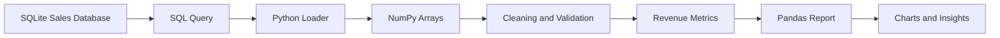

# 009 - NumPy

**Course:** 02 - Coding and EDA
**Module:** Module 04 - Coding for Data Science
**Content Group:** Python for Data
**Roadmap Source:** Coding for Data Science / Python for Data
**Lesson Type:** Coding
**Lesson Order:** 009
**Suggested Duration:** 20 minutes

---

## 1. Summary

This lesson introduces **NumPy** in the context of AI and Data Science.

NumPy, short for **Numerical Python**, is a Python library for working efficiently with numerical data. Its main data structure is the multidimensional array, called an `ndarray`.

After completing this lesson, you should understand:

* Why NumPy is faster and more memory-efficient than standard Python lists for numerical operations.
* How to create, inspect, reshape, index, and transform arrays.
* How vectorization and broadcasting simplify data calculations.
* How NumPy supports data preprocessing, statistics, machine learning, and scientific computing.
* How to turn NumPy operations into a reproducible notebook, script, pipeline, or API component.

---

## 2. Learning Objectives

By the end of this lesson, you should be able to:

* Explain NumPy in your own words.
* Create one-dimensional and multidimensional NumPy arrays.
* Inspect an array's shape, size, dimensions, and data type.
* Select and modify values using indexing and slicing.
* Perform vectorized mathematical operations.
* Use broadcasting to calculate values across arrays of different shapes.
* Calculate descriptive statistics such as mean, median, variance, and standard deviation.
* Reshape, concatenate, filter, and aggregate numerical data.
* Use NumPy in a small AI or Data Science workflow.

---

## 3. Where NumPy Fits in the Data Workflow

NumPy usually operates between data loading and higher-level analysis or modeling.



NumPy is commonly used underneath other Data Science libraries:



Although these libraries provide higher-level APIs, many of their internal numerical operations are based on array concepts introduced by NumPy.

---

## 4. Why Use NumPy?

Standard Python lists can store numerical values, but they are not optimized for large-scale numerical calculations.

NumPy provides several important advantages:

* Fast array operations implemented in optimized low-level code.
* Lower memory usage for homogeneous numerical data.
* Vectorized operations without manually written loops.
* Support for multidimensional data.
* Broadcasting across compatible array shapes.
* Statistical and mathematical functions.
* Random number generation.
* Linear algebra operations.
* Compatibility with most Python Data Science libraries.

### Python List vs. NumPy Array

```python
python_values = [10, 20, 30, 40]

result = []

for value in python_values:
    result.append(value * 2)

print(result)
```

Output:

```text
[20, 40, 60, 80]
```

The same operation with NumPy:

```python
import numpy as np

values = np.array([10, 20, 30, 40])
result = values * 2

print(result)
```

Output:

```text
[20 40 60 80]
```

The NumPy version applies the operation to the whole array. This is called **vectorization**.

---

## 5. Installing and Importing NumPy

Install NumPy with `pip`:

```bash
pip install numpy
```

Import it using the standard alias:

```python
import numpy as np
```

The alias `np` is a widely used convention in Python projects.

---

## 6. Creating NumPy Arrays

### 6.1 Creating an Array from a Python List

```python
import numpy as np

sales = np.array([120, 150, 90, 200])

print(sales)
```

Output:

```text
[120 150  90 200]
```

### 6.2 Creating a Two-Dimensional Array

```python
monthly_sales = np.array([
    [120, 150, 180],
    [100, 130, 170],
    [90, 110, 160]
])

print(monthly_sales)
```

Output:

```text
[[120 150 180]
 [100 130 170]
 [ 90 110 160]]
```

A two-dimensional array can represent:

* Rows and columns in a table.
* Samples and features in a machine learning dataset.
* Pixels in a grayscale image.
* Measurements collected over time.

---

## 7. Common Array-Creation Functions

### Array of Zeros

```python
zeros = np.zeros((2, 3))

print(zeros)
```

Output:

```text
[[0. 0. 0.]
 [0. 0. 0.]]
```

### Array of Ones

```python
ones = np.ones((2, 3))

print(ones)
```

### Array with a Constant Value

```python
filled = np.full((2, 3), 7)

print(filled)
```

### Sequence of Integers

```python
values = np.arange(0, 10, 2)

print(values)
```

Output:

```text
[0 2 4 6 8]
```

The parameters are:

```text
start, stop, step
```

The `stop` value is excluded.

### Evenly Spaced Values

```python
values = np.linspace(0, 1, 5)

print(values)
```

Output:

```text
[0.   0.25 0.5  0.75 1.  ]
```

Unlike `arange()`, `linspace()` defines the number of values rather than the step size.

### Identity Matrix

```python
identity = np.eye(3)

print(identity)
```

Output:

```text
[[1. 0. 0.]
 [0. 1. 0.]
 [0. 0. 1.]]
```

---

## 8. Understanding Array Properties

Consider the following array:

```python
data = np.array([
    [10, 20, 30],
    [40, 50, 60]
])
```

### Number of Dimensions

```python
print(data.ndim)
```

Output:

```text
2
```

### Shape

```python
print(data.shape)
```

Output:

```text
(2, 3)
```

The array contains:

* 2 rows.
* 3 columns.

### Total Number of Elements

```python
print(data.size)
```

Output:

```text
6
```

### Data Type

```python
print(data.dtype)
```

A possible output is:

```text
int64
```

### Memory Used by Each Element

```python
print(data.itemsize)
```

These properties are important when debugging machine learning input shapes or large numerical datasets.

---

## 9. NumPy Data Types

NumPy arrays normally contain values of one data type.

Common NumPy data types include:

| Data type | Description                  |
| --------- | ---------------------------- |
| `int32`   | 32-bit integer               |
| `int64`   | 64-bit integer               |
| `float32` | 32-bit floating-point number |
| `float64` | 64-bit floating-point number |
| `bool`    | Boolean value                |
| `str_`    | String value                 |

You can explicitly set the data type:

```python
values = np.array([1, 2, 3], dtype=np.float32)

print(values)
print(values.dtype)
```

Output:

```text
[1. 2. 3.]
float32
```

### Converting an Array's Data Type

```python
scores = np.array([75.8, 82.4, 91.9])
integer_scores = scores.astype(np.int32)

print(integer_scores)
```

Output:

```text
[75 82 91]
```

Be careful: converting floating-point values to integers removes the decimal part rather than rounding it.

---

## 10. Indexing and Slicing

### 10.1 One-Dimensional Indexing

```python
scores = np.array([70, 80, 90, 100])

print(scores[0])
print(scores[-1])
```

Output:

```text
70
100
```

NumPy uses zero-based indexing.

### 10.2 One-Dimensional Slicing

```python
print(scores[1:3])
```

Output:

```text
[80 90]
```

The start index is included, while the end index is excluded.

### 10.3 Two-Dimensional Indexing

```python
data = np.array([
    [10, 20, 30],
    [40, 50, 60],
    [70, 80, 90]
])

print(data[1, 2])
```

Output:

```text
60
```

The syntax is:

```text
array[row_index, column_index]
```

### Selecting a Row

```python
print(data[1, :])
```

Output:

```text
[40 50 60]
```

### Selecting a Column

```python
print(data[:, 1])
```

Output:

```text
[20 50 80]
```

### Selecting a Subarray

```python
print(data[0:2, 1:3])
```

Output:

```text
[[20 30]
 [50 60]]
```

---

## 11. Boolean Filtering

Boolean filtering selects values that satisfy a condition.

```python
scores = np.array([45, 72, 88, 61, 95])

mask = scores >= 70

print(mask)
```

Output:

```text
[False  True  True False  True]
```

Use the mask to filter the array:

```python
passed_scores = scores[mask]

print(passed_scores)
```

Output:

```text
[72 88 95]
```

The condition can be written directly:

```python
passed_scores = scores[scores >= 70]
```

### Combining Conditions

```python
selected_scores = scores[(scores >= 60) & (scores < 90)]

print(selected_scores)
```

Output:

```text
[72 88 61]
```

Use:

* `&` for element-wise AND.
* `|` for element-wise OR.
* `~` for element-wise NOT.

Each condition should be enclosed in parentheses.

---

## 12. Vectorized Operations

Vectorization means applying an operation to an entire array without manually iterating through each element.

```python
prices = np.array([10.0, 15.0, 20.0])
quantities = np.array([2, 3, 4])

revenue = prices * quantities

print(revenue)
```

Output:

```text
[20. 45. 80.]
```

### Common Arithmetic Operations

```python
values = np.array([10, 20, 30])

print(values + 5)
print(values - 5)
print(values * 2)
print(values / 2)
print(values ** 2)
```

Output:

```text
[15 25 35]
[ 5 15 25]
[20 40 60]
[ 5. 10. 15.]
[100 400 900]
```

### Element-Wise Operations Between Arrays

```python
a = np.array([1, 2, 3])
b = np.array([10, 20, 30])

print(a + b)
print(a * b)
```

Output:

```text
[11 22 33]
[10 40 90]
```

These are element-wise operations, not matrix multiplication.

---

## 13. Broadcasting

Broadcasting allows NumPy to perform operations on arrays with different but compatible shapes.

### Adding a Scalar

```python
scores = np.array([70, 80, 90])
adjusted_scores = scores + 5

print(adjusted_scores)
```

Output:

```text
[75 85 95]
```

NumPy conceptually expands the scalar `5` across every element.

### Adding a Row Vector to a Matrix

```python
data = np.array([
    [10, 20, 30],
    [40, 50, 60]
])

offset = np.array([1, 2, 3])

result = data + offset

print(result)
```

Output:

```text
[[11 22 33]
 [41 52 63]]
```

The row vector is applied to every row.

### Broadcasting Rule

Starting from the last dimension, two dimensions are compatible when:

1. They are equal.
2. One of them is `1`.
3. One of the dimensions does not exist.

For example:

```text
Matrix shape:      (2, 3)
Row-vector shape:     (3)
Result shape:      (2, 3)
```

Broadcasting is frequently used for:

* Feature normalization.
* Adding model biases.
* Applying scaling factors.
* Image transformations.
* Batch calculations.

---

## 14. Reshaping Arrays

### Reshape

```python
values = np.arange(1, 13)

matrix = values.reshape(3, 4)

print(matrix)
```

Output:

```text
[[ 1  2  3  4]
 [ 5  6  7  8]
 [ 9 10 11 12]]
```

The total number of elements must remain unchanged.

### Automatically Inferring a Dimension

```python
matrix = values.reshape(3, -1)

print(matrix.shape)
```

Output:

```text
(3, 4)
```

NumPy calculates the missing dimension represented by `-1`.

### Flattening an Array

```python
flattened = matrix.flatten()

print(flattened)
```

Output:

```text
[ 1  2  3  4  5  6  7  8  9 10 11 12]
```

Another option is:

```python
flattened = matrix.ravel()
```

`flatten()` normally creates a copy, while `ravel()` may return a view of the original data.

### Transpose

```python
transposed = matrix.T

print(transposed)
```

For a matrix with shape `(3, 4)`, the transposed result has shape `(4, 3)`.

---

## 15. Aggregation and Statistical Functions

```python
sales = np.array([120, 150, 90, 200, 170])
```

### Sum

```python
print(np.sum(sales))
```

### Mean

```python
print(np.mean(sales))
```

### Median

```python
print(np.median(sales))
```

### Minimum and Maximum

```python
print(np.min(sales))
print(np.max(sales))
```

### Variance and Standard Deviation

```python
print(np.var(sales))
print(np.std(sales))
```

### Position of Minimum and Maximum Values

```python
print(np.argmin(sales))
print(np.argmax(sales))
```

### Percentiles

```python
print(np.percentile(sales, 25))
print(np.percentile(sales, 50))
print(np.percentile(sales, 75))
```

Percentiles are useful for:

* Detecting outliers.
* Understanding distributions.
* Creating threshold-based features.
* Comparing groups.

---

## 16. Aggregation Across an Axis

Consider a matrix containing sales for three stores across four months:

```python
sales = np.array([
    [100, 120, 130, 150],
    [80, 90, 100, 110],
    [150, 160, 170, 180]
])
```

### Sum of All Values

```python
print(sales.sum())
```

### Sum of Each Column

```python
monthly_totals = sales.sum(axis=0)

print(monthly_totals)
```

Output:

```text
[330 370 400 440]
```

Here, `axis=0` collapses the row dimension and produces one result per column.

### Sum of Each Row

```python
store_totals = sales.sum(axis=1)

print(store_totals)
```

Output:

```text
[500 380 660]
```

Here, `axis=1` collapses the column dimension and produces one result per row.



A useful interpretation is:

* `axis=0`: calculate a result for each column.
* `axis=1`: calculate a result for each row.

---

## 17. Handling Missing and Invalid Values

NumPy uses `np.nan` to represent a missing numerical value.

```python
values = np.array([10.0, 20.0, np.nan, 40.0])
```

A normal mean calculation returns `nan`:

```python
print(np.mean(values))
```

Output:

```text
nan
```

Use a NaN-aware function:

```python
print(np.nanmean(values))
```

Output:

```text
23.333333333333332
```

Other useful functions include:

```python
np.nansum(values)
np.nanmin(values)
np.nanmax(values)
np.nanmedian(values)
np.nanstd(values)
```

### Detecting Missing Values

```python
missing_mask = np.isnan(values)

print(missing_mask)
```

Output:

```text
[False False  True False]
```

### Replacing Missing Values

```python
clean_values = np.nan_to_num(values, nan=0.0)

print(clean_values)
```

Output:

```text
[10. 20.  0. 40.]
```

Replacing missing data with zero is not always statistically appropriate. The replacement strategy should depend on the dataset and analytical objective.

---

## 18. Combining and Splitting Arrays

### Concatenating One-Dimensional Arrays

```python
a = np.array([1, 2, 3])
b = np.array([4, 5, 6])

combined = np.concatenate([a, b])

print(combined)
```

Output:

```text
[1 2 3 4 5 6]
```

### Vertical Stacking

```python
row_1 = np.array([1, 2, 3])
row_2 = np.array([4, 5, 6])

matrix = np.vstack([row_1, row_2])

print(matrix)
```

Output:

```text
[[1 2 3]
 [4 5 6]]
```

### Horizontal Stacking

```python
column_1 = np.array([[1], [2], [3]])
column_2 = np.array([[4], [5], [6]])

matrix = np.hstack([column_1, column_2])

print(matrix)
```

Output:

```text
[[1 4]
 [2 5]
 [3 6]]
```

### Splitting an Array

```python
values = np.array([1, 2, 3, 4, 5, 6])

parts = np.split(values, 3)

print(parts)
```

Output:

```text
[array([1, 2]), array([3, 4]), array([5, 6])]
```

---

## 19. Sorting and Finding Unique Values

### Sorting

```python
scores = np.array([88, 72, 95, 72, 81])

sorted_scores = np.sort(scores)

print(sorted_scores)
```

Output:

```text
[72 72 81 88 95]
```

### Unique Values

```python
unique_scores = np.unique(scores)

print(unique_scores)
```

Output:

```text
[72 81 88 95]
```

### Unique Values with Counts

```python
values, counts = np.unique(scores, return_counts=True)

print(values)
print(counts)
```

Output:

```text
[72 81 88 95]
[2 1 1 1]
```

This is useful for checking category frequencies and class distributions.

---

## 20. Random Number Generation

Random data is useful for:

* Creating synthetic datasets.
* Initializing model parameters.
* Sampling observations.
* Running simulations.
* Splitting datasets.
* Testing algorithms.

The recommended API uses a random generator:

```python
rng = np.random.default_rng(seed=42)
```

### Random Floating-Point Values

```python
values = rng.random(5)

print(values)
```

### Random Integers

```python
values = rng.integers(low=1, high=10, size=5)

print(values)
```

The upper bound is excluded.

### Normal Distribution

```python
samples = rng.normal(
    loc=0,
    scale=1,
    size=1000
)
```

Parameters:

* `loc`: mean.
* `scale`: standard deviation.
* `size`: number or shape of generated samples.

### Reproducibility

Using the same seed produces the same random sequence:

```python
rng = np.random.default_rng(seed=42)
```

Reproducible randomness is important for:

* Experiments.
* Unit tests.
* Model evaluation.
* Debugging.
* Comparing algorithms.

---

## 21. Linear Algebra

NumPy provides tools for matrix and vector operations.

### Dot Product

```python
a = np.array([1, 2, 3])
b = np.array([4, 5, 6])

result = np.dot(a, b)

print(result)
```

Output:

```text
32
```

The calculation is:

```text
1 × 4 + 2 × 5 + 3 × 6 = 32
```

### Matrix Multiplication

```python
A = np.array([
    [1, 2],
    [3, 4]
])

B = np.array([
    [5, 6],
    [7, 8]
])

result = A @ B

print(result)
```

Output:

```text
[[19 22]
 [43 50]]
```

The `@` operator performs matrix multiplication.

By contrast:

```python
A * B
```

performs element-wise multiplication.

### Other Linear Algebra Operations

```python
determinant = np.linalg.det(A)
inverse = np.linalg.inv(A)
eigenvalues, eigenvectors = np.linalg.eig(A)
```

These operations are important in:

* Linear regression.
* Principal Component Analysis.
* Neural networks.
* Optimization.
* Computer graphics.
* Signal processing.

---

## 22. Copy vs. View

This is one of the most important NumPy concepts.

### View

A slice often creates a view that shares memory with the original array.

```python
original = np.array([10, 20, 30, 40])
subset = original[1:3]

subset[0] = 999

print(original)
```

Output:

```text
[ 10 999  30  40]
```

Changing `subset` also changed `original`.

### Copy

Use `.copy()` when an independent array is required:

```python
original = np.array([10, 20, 30, 40])
subset = original[1:3].copy()

subset[0] = 999

print(original)
print(subset)
```

Output:

```text
[10 20 30 40]
[999  30]
```

Unexpected shared-memory modifications can create difficult-to-detect bugs in data pipelines.

---

## 23. Practical Example: Sales Analysis

Suppose the rows represent products and the columns represent monthly sales.

```python
import numpy as np

sales = np.array([
    [120, 135, 150, 160],
    [80, 90, 110, 105],
    [200, 210, 190, 230]
])

product_names = np.array([
    "Product A",
    "Product B",
    "Product C"
])
```

### Inspect the Dataset

```python
print("Shape:", sales.shape)
print("Data type:", sales.dtype)
print("Total observations:", sales.size)
```

### Calculate Total Sales by Product

```python
product_totals = sales.sum(axis=1)

print(product_totals)
```

Output:

```text
[565 385 830]
```

### Calculate Monthly Sales

```python
monthly_totals = sales.sum(axis=0)

print(monthly_totals)
```

Output:

```text
[400 435 450 495]
```

### Calculate Average Monthly Sales by Product

```python
product_averages = sales.mean(axis=1)

print(product_averages)
```

### Find the Best-Performing Product

```python
best_product_index = np.argmax(product_totals)
best_product = product_names[best_product_index]

print(best_product)
```

Output:

```text
Product C
```

### Calculate Month-to-Month Changes

```python
monthly_changes = np.diff(sales, axis=1)

print(monthly_changes)
```

Output:

```text
[[ 15  15  10]
 [ 10  20  -5]
 [ 10 -20  40]]
```

### Find Sales Above a Threshold

```python
high_sales = sales[sales >= 150]

print(high_sales)
```

### Insight Examples

1. Product C generated the highest total sales.
2. Total monthly sales increased from `400` in the first month to `495` in the fourth month.
3. Product B decreased by `5` units between the third and fourth months.

---

## 24. NumPy in Machine Learning

Machine learning datasets are frequently represented as two arrays:

```text
X = feature matrix
y = target vector
```

Example:

```python
X = np.array([
    [25, 50000],
    [35, 65000],
    [45, 80000],
    [28, 52000]
])

y = np.array([0, 1, 1, 0])
```

The shape of `X` is:

```python
print(X.shape)
```

Output:

```text
(4, 2)
```

This means:

* 4 samples.
* 2 features per sample.

The shape of `y` is:

```python
print(y.shape)
```

Output:

```text
(4,)
```

### Standardizing Features

A common preprocessing transformation is:

[
z = \frac{x-\mu}{\sigma}
]

where:

* (x) is an original value.
* (\mu) is the feature mean.
* (\sigma) is the feature standard deviation.
* (z) is the standardized value.

NumPy implementation:

```python
feature_means = X.mean(axis=0)
feature_stds = X.std(axis=0)

X_standardized = (X - feature_means) / feature_stds

print(X_standardized)
```

Broadcasting applies each feature's mean and standard deviation to the corresponding column.



---

## 25. NumPy in Image Data

Images can also be represented as NumPy arrays.

### Grayscale Image

```text
height × width
```

Example shape:

```text
(48, 48)
```

### RGB Image

```text
height × width × channels
```

Example shape:

```text
(224, 224, 3)
```

Each pixel may contain three channel values:

```text
[red, green, blue]
```

Normalizing pixel values:

```python
image = np.array([
    [0, 128, 255],
    [64, 192, 255]
], dtype=np.float32)

normalized_image = image / 255.0

print(normalized_image)
```

The transformed values fall approximately between `0` and `1`.

---

## 26. Reproducible NumPy Workflow

A maintainable NumPy analysis should separate each processing stage.



A possible project structure:

```text
numpy-sales-analysis/
├── data/
│   ├── raw/
│   │   └── sales.csv
│   └── processed/
│       └── sales_clean.npy
├── notebooks/
│   └── sales_analysis.ipynb
├── src/
│   ├── load_data.py
│   ├── transform.py
│   └── metrics.py
├── tests/
│   └── test_metrics.py
├── requirements.txt
└── README.md
```

---

## 27. Example Reusable Functions

```python
import numpy as np


def standardize_features(values: np.ndarray) -> np.ndarray:
    """Standardize every column of a two-dimensional array."""
    if values.ndim != 2:
        raise ValueError("Expected a two-dimensional array.")

    means = values.mean(axis=0)
    standard_deviations = values.std(axis=0)

    if np.any(standard_deviations == 0):
        raise ValueError(
            "Cannot standardize a feature with zero standard deviation."
        )

    return (values - means) / standard_deviations


def summarize_array(values: np.ndarray) -> dict[str, float]:
    """Return basic descriptive statistics for a numerical array."""
    if values.size == 0:
        raise ValueError("The input array must not be empty.")

    return {
        "minimum": float(np.nanmin(values)),
        "maximum": float(np.nanmax(values)),
        "mean": float(np.nanmean(values)),
        "median": float(np.nanmedian(values)),
        "standard_deviation": float(np.nanstd(values)),
    }
```

Example usage:

```python
data = np.array([
    [10.0, 100.0],
    [20.0, 150.0],
    [30.0, 200.0]
])

standardized = standardize_features(data)
summary = summarize_array(data)

print(standardized)
print(summary)
```

Good numerical code should:

* Validate input dimensions.
* Handle empty arrays.
* Check for invalid values.
* Use clear function names.
* Include type hints and docstrings.
* Avoid hidden in-place modifications.

---

## 28. Performance Comparison

A manual Python loop:

```python
values = list(range(1_000_000))
result = []

for value in values:
    result.append(value * 2)
```

A NumPy vectorized operation:

```python
values = np.arange(1_000_000)
result = values * 2
```

NumPy is generally faster because it avoids executing a Python-level loop for every element.

However, NumPy is not automatically the best choice for every task. Python lists may still be appropriate when:

* The dataset is very small.
* Values have different data types.
* The logic is highly irregular.
* Numerical performance is not important.

---

## 29. Common Mistakes

### 29.1 Confusing Element-Wise and Matrix Multiplication

Incorrect assumption:

```python
A * B
```

This performs element-wise multiplication.

For matrix multiplication, use:

```python
A @ B
```

---

### 29.2 Ignoring Array Shapes

```python
a = np.array([1, 2, 3])
b = np.array([1, 2])
```

The following operation fails because the shapes are incompatible:

```python
a + b
```

Always inspect array shapes:

```python
print(a.shape)
print(b.shape)
```

---

### 29.3 Misunderstanding the Axis Parameter

For a matrix:

```python
data.sum(axis=0)
```

returns one value per column.

```python
data.sum(axis=1)
```

returns one value per row.

Use small sample arrays to verify the intended behavior.

---

### 29.4 Accidentally Modifying the Original Array

A slice may share memory with its source array.

```python
subset = original[1:3]
```

Use `.copy()` when the new array must be independent:

```python
subset = original[1:3].copy()
```

---

### 29.5 Using Python `and` or `or` with Arrays

Incorrect:

```python
scores[(scores >= 60) and (scores < 90)]
```

Correct:

```python
scores[(scores >= 60) & (scores < 90)]
```

---

### 29.6 Dividing by Zero

```python
values = np.array([10.0, 0.0])
result = 100 / values
```

This may produce `inf` and a warning.

Check denominators before division:

```python
safe_result = np.divide(
    100,
    values,
    out=np.zeros_like(values),
    where=values != 0
)
```

---

### 29.7 Ignoring Missing Values

Functions such as `np.mean()` return `nan` when the input contains missing values.

Use NaN-aware alternatives when appropriate:

```python
np.nanmean(values)
```

---

### 29.8 Using Inconsistent Data Types

Combining integers, floating-point values, and strings may cause unexpected type conversion.

```python
mixed = np.array([1, 2.5, "3"])

print(mixed.dtype)
```

NumPy may convert all values to strings.

Always inspect:

```python
print(array.dtype)
```

---

### 29.9 Performing Too Many Manual Loops

Manual loops often make numerical code slower and harder to read.

Prefer:

```python
normalized = (values - values.mean()) / values.std()
```

instead of manually processing each element.

---

### 29.10 Setting No Random Seed

Without a controlled random seed, experiments may produce different results each time.

Prefer:

```python
rng = np.random.default_rng(seed=42)
```

---

## 30. Practical Exercise

Use a small CSV dataset containing sales information.

Suggested columns:

```text
product_id, month, units_sold, unit_price, advertising_cost
```

### Tasks

1. Load the CSV file.
2. Convert the relevant numerical columns to NumPy arrays.
3. Inspect each array's:

   * Shape.
   * Size.
   * Number of dimensions.
   * Data type.
4. Detect missing or invalid values.
5. Calculate revenue:

[
\text{revenue} = \text{units sold} \times \text{unit price}
]

6. Calculate:

   * Total revenue.
   * Average revenue.
   * Median revenue.
   * Minimum and maximum revenue.
   * Revenue standard deviation.
7. Filter records with revenue above the average.
8. Identify the record with the highest revenue.
9. Normalize the advertising cost.
10. Write at least three insights supported by numerical evidence.

### Example Insight Format

> Product P03 generated the highest revenue at $12,400, which was approximately 28% higher than the dataset's average product revenue.

---

## 31. Mini Project

### SQL and NumPy Sales Analysis

Build a small analysis pipeline using a sales database.



### Suggested Deliverables

* `sales_analysis.ipynb`
* `sales_metrics.py`
* `sales_summary.csv`
* At least two charts.
* Three evidence-based insights.
* A `README.md` explaining how to run the project.
* A short section describing assumptions and limitations.

### Possible Metrics

* Total revenue.
* Revenue by product.
* Revenue by month.
* Average order value.
* Unit-price distribution.
* Sales growth.
* Advertising efficiency.

---

## 32. Completion Checklist

* [ ] I can explain NumPy in one or two minutes.
* [ ] I can create one-dimensional and multidimensional arrays.
* [ ] I understand `shape`, `size`, `ndim`, and `dtype`.
* [ ] I can use indexing, slicing, and Boolean filtering.
* [ ] I can perform vectorized arithmetic operations.
* [ ] I understand basic broadcasting rules.
* [ ] I can reshape, flatten, and transpose arrays.
* [ ] I can aggregate values across rows or columns.
* [ ] I can detect and handle `NaN` values.
* [ ] I understand the difference between a copy and a view.
* [ ] I can generate reproducible random data.
* [ ] I can use NumPy arrays as machine learning inputs.
* [ ] I have created a notebook, script, metric, chart, or portfolio artifact.
* [ ] I documented at least one assumption, caveat, or follow-up question.

---

## 33. Related Outcome

Use Python, SQL, numerical libraries, notebooks, and Git to create reproducible data workflows.

NumPy supports this outcome by providing an efficient numerical foundation for:

* Data transformation.
* Statistical analysis.
* Machine learning.
* Image processing.
* Scientific computing.
* Simulation.
* Model evaluation.

---

## 34. Related Project

**Mini Project:** SQL and Python Data Analysis with a small sales database and a Pandas report.

NumPy can be used in this project to:

* Store numerical columns.
* Calculate revenue and summary metrics.
* Normalize features.
* Filter observations.
* Detect invalid values.
* Prepare model-ready matrices.
* Calculate changes and growth rates.

---

## 35. Key Takeaways

* NumPy is the numerical foundation of the Python Data Science ecosystem.
* Its main data structure is the multidimensional `ndarray`.
* Vectorization replaces many manual Python loops.
* Broadcasting allows concise calculations across compatible shapes.
* Array shape and data type should always be inspected.
* The `axis` parameter controls the dimension across which an operation is performed.
* Slices may share memory with the original array.
* NumPy supports statistics, random sampling, linear algebra, preprocessing, and machine learning.
* Good NumPy code should be reproducible, validated, modular, and documented.

---

## 36. Conclusion

**NumPy** is an essential milestone in the AI and Data Scientist roadmap.

It provides the numerical operations required to transform raw values into model-ready data, statistical metrics, images, simulations, and predictions.

Do not treat NumPy as only a collection of functions. Turn the lesson into a practical artifact such as:

* A reproducible notebook.
* A numerical analysis script.
* A preprocessing module.
* A machine learning feature matrix.
* A statistical report.
* A small API.
* A portfolio project.

The most important skills are understanding array shapes, writing vectorized operations, applying broadcasting correctly, validating numerical data, and producing results that can be reproduced.
