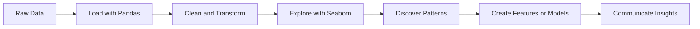
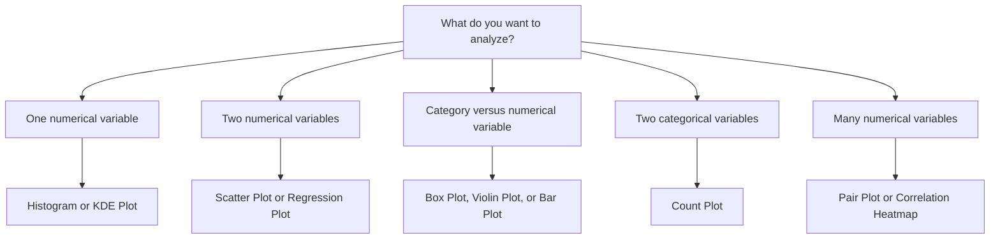
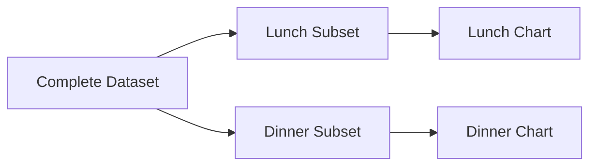

# 012 — Seaborn

**Course:** 02 — Coding and Exploratory Data Analysis
**Module:** Module 04 — Coding for Data Science
**Content Group:** Python for Data
**Roadmap Source:** Coding for Data Science / Python for Data
**Lesson Type:** Coding
**Order in Module:** 012
**Suggested Duration:** 20 minutes

---

## 1. Overview

This lesson introduces **Seaborn** in the context of AI and Data Science.

Seaborn is a Python data visualization library built on top of Matplotlib. It provides a high-level interface for creating attractive and informative statistical graphics with less code.

After completing this lesson, you should understand:

* What Seaborn is and when to use it.
* How Seaborn fits into an exploratory data analysis workflow.
* How to visualize distributions, relationships, categories, and correlations.
* How to convert visual observations into meaningful data insights.
* How Seaborn works together with Pandas and Matplotlib.

---

## 2. Learning Objectives

By the end of this lesson, you should be able to:

* Explain Seaborn in your own words.
* Identify where Seaborn fits into an AI or Data Science workflow.
* Create common statistical visualizations using Seaborn.
* Customize chart titles, labels, themes, and figure sizes.
* Interpret charts instead of only generating them.
* Select an appropriate chart for a specific analytical question.
* Build a small exploratory data analysis notebook using Pandas and Seaborn.

---

## 3. What Is Seaborn?

**Seaborn** is a Python library for statistical data visualization.

It is built on top of **Matplotlib** and integrates closely with **Pandas DataFrames**.

```python
import seaborn as sns
import matplotlib.pyplot as plt
```

Seaborn provides convenient functions for visualizing:

* Numerical distributions
* Relationships between variables
* Differences between categories
* Correlations between features
* Statistical trends
* Multivariable patterns

A simple Seaborn chart may require only a few lines of code:

```python
sns.scatterplot(
    data=df,
    x="advertising_cost",
    y="sales"
)

plt.show()
```

---

## 4. Seaborn in the Data Science Workflow

Seaborn is commonly used during **exploratory data analysis**, after the data has been loaded and cleaned.



A typical workflow is:

```text
Raw data
    ↓
Load data with Pandas
    ↓
Inspect and clean the dataset
    ↓
Visualize distributions and relationships
    ↓
Identify patterns, anomalies, and hypotheses
    ↓
Prepare features or build models
    ↓
Communicate findings
```

Seaborn helps answer questions such as:

* Is a variable normally distributed?
* Are there unusual outliers?
* Are two variables related?
* Does one customer group spend more than another?
* Which features are strongly correlated?
* Does the relationship between variables change across categories?
* Are model errors concentrated in a particular segment?

---

## 5. Seaborn, Matplotlib, and Pandas

Seaborn usually works together with Pandas and Matplotlib.

| Library    | Primary Responsibility                                     |
| ---------- | ---------------------------------------------------------- |
| Pandas     | Loading, cleaning, transforming, and summarizing data      |
| Seaborn    | Creating high-level statistical visualizations             |
| Matplotlib | Controlling low-level figure details and displaying charts |

Example:

```python
import pandas as pd
import seaborn as sns
import matplotlib.pyplot as plt

df = pd.read_csv("sales.csv")

sns.barplot(
    data=df,
    x="region",
    y="revenue",
    errorbar=None
)

plt.title("Average Revenue by Region")
plt.xlabel("Region")
plt.ylabel("Average Revenue")
plt.show()
```

In this example:

* Pandas loads the CSV file.
* Seaborn creates the bar chart.
* Matplotlib adds labels and displays the figure.

---

## 6. Loading a Practice Dataset

Seaborn includes several sample datasets that are useful for learning.

```python
import seaborn as sns

tips = sns.load_dataset("tips")

print(tips.head())
```

Example columns in the `tips` dataset include:

| Column       | Description                               |
| ------------ | ----------------------------------------- |
| `total_bill` | Total restaurant bill                     |
| `tip`        | Tip amount                                |
| `sex`        | Customer category recorded in the dataset |
| `smoker`     | Whether the table included a smoker       |
| `day`        | Day of the week                           |
| `time`       | Lunch or dinner                           |
| `size`       | Number of people at the table             |

Inspect the dataset before creating charts:

```python
print(tips.shape)
print(tips.info())
print(tips.describe())
print(tips.isna().sum())
```

---

## 7. Setting a Visual Theme

Seaborn provides built-in themes for improving chart appearance.

```python
sns.set_theme(style="whitegrid")
```

Common styles include:

```python
sns.set_theme(style="darkgrid")
sns.set_theme(style="whitegrid")
sns.set_theme(style="dark")
sns.set_theme(style="white")
sns.set_theme(style="ticks")
```

You can also change the overall context:

```python
sns.set_context("notebook")
sns.set_context("paper")
sns.set_context("talk")
sns.set_context("poster")
```

For most notebooks, the following configuration is a good default:

```python
sns.set_theme(
    style="whitegrid",
    context="notebook"
)
```

---

## 8. Choosing the Correct Chart

The best chart depends on the analytical question.



| Analytical Question                            | Recommended Chart                  |
| ---------------------------------------------- | ---------------------------------- |
| What is the distribution of a variable?        | Histogram or KDE plot              |
| Are two numerical variables related?           | Scatter plot                       |
| Is there a linear trend?                       | Regression plot                    |
| How does a value differ by category?           | Box plot, violin plot, or bar plot |
| How many observations belong to each category? | Count plot                         |
| Which variables are correlated?                | Heatmap                            |
| How do several variables relate to each other? | Pair plot                          |
| How does a metric change over time?            | Line plot                          |

---

## 9. Distribution Plots

Distribution plots show how values are spread across a numerical variable.

### 9.1 Histogram

A histogram divides values into intervals called **bins**.

```python
sns.histplot(
    data=tips,
    x="total_bill",
    bins=20
)

plt.title("Distribution of Total Bills")
plt.show()
```

A histogram can help identify:

* The center of the distribution
* The spread of the values
* Skewness
* Multiple peaks
* Potential outliers

### Histogram with a KDE curve

```python
sns.histplot(
    data=tips,
    x="total_bill",
    bins=20,
    kde=True
)

plt.title("Distribution of Total Bills")
plt.show()
```

### Histogram grouped by category

```python
sns.histplot(
    data=tips,
    x="total_bill",
    hue="time",
    kde=True,
    element="step"
)

plt.title("Total Bill Distribution by Meal Time")
plt.show()
```

---

### 9.2 KDE Plot

A Kernel Density Estimate plot shows a smooth estimate of a distribution.

```python
sns.kdeplot(
    data=tips,
    x="total_bill",
    fill=True
)

plt.title("Estimated Density of Total Bills")
plt.show()
```

A KDE plot is useful for comparing distributions, but its appearance depends on smoothing settings.

```python
sns.kdeplot(
    data=tips,
    x="total_bill",
    hue="time",
    fill=True,
    common_norm=False
)

plt.title("Bill Distribution by Meal Time")
plt.show()
```

> A KDE curve is an estimate, not the raw distribution itself. Always check the sample size and consider displaying a histogram as well.

---

## 10. Relationship Plots

Relationship plots help determine whether variables move together.

### 10.1 Scatter Plot

A scatter plot displays the relationship between two numerical variables.

```python
sns.scatterplot(
    data=tips,
    x="total_bill",
    y="tip"
)

plt.title("Relationship Between Total Bill and Tip")
plt.show()
```

Each point represents one observation.

The chart can reveal:

* Positive or negative relationships
* Nonlinear patterns
* Clusters
* Outliers
* Changes in variability

---

### 10.2 Adding a Category with `hue`

The `hue` parameter represents a third variable using color.

```python
sns.scatterplot(
    data=tips,
    x="total_bill",
    y="tip",
    hue="time"
)

plt.title("Bill and Tip Relationship by Meal Time")
plt.show()
```

Additional variables can be represented with `style` and `size`:

```python
sns.scatterplot(
    data=tips,
    x="total_bill",
    y="tip",
    hue="time",
    style="smoker",
    size="size"
)

plt.title("Restaurant Bill Analysis")
plt.show()
```

Use these parameters carefully. Too many visual encodings can make a chart difficult to interpret.

---

### 10.3 Regression Plot

A regression plot adds a fitted trend line to a scatter plot.

```python
sns.regplot(
    data=tips,
    x="total_bill",
    y="tip"
)

plt.title("Linear Trend Between Total Bill and Tip")
plt.show()
```

To compare trends between groups, use `lmplot()`:

```python
sns.lmplot(
    data=tips,
    x="total_bill",
    y="tip",
    hue="time",
    height=5,
    aspect=1.3
)
```

A regression line may suggest a relationship, but it does not prove causation.

---

## 11. Categorical Plots

Categorical plots compare numerical values across groups.

### 11.1 Count Plot

A count plot shows the number of observations in each category.

```python
sns.countplot(
    data=tips,
    x="day"
)

plt.title("Number of Records by Day")
plt.show()
```

Add another category using `hue`:

```python
sns.countplot(
    data=tips,
    x="day",
    hue="time"
)

plt.title("Number of Records by Day and Meal Time")
plt.show()
```

A count plot displays row counts, not the sum or average of another variable.

---

### 11.2 Bar Plot

A bar plot shows an estimated statistic for each category. By default, Seaborn displays the mean.

```python
sns.barplot(
    data=tips,
    x="day",
    y="total_bill"
)

plt.title("Average Total Bill by Day")
plt.show()
```

To remove error bars:

```python
sns.barplot(
    data=tips,
    x="day",
    y="total_bill",
    errorbar=None
)

plt.title("Average Total Bill by Day")
plt.show()
```

To display a different statistic:

```python
sns.barplot(
    data=tips,
    x="day",
    y="total_bill",
    estimator="median",
    errorbar=None
)

plt.title("Median Total Bill by Day")
plt.show()
```

> Do not confuse a bar plot with a count plot. A bar plot summarizes a numerical variable, while a count plot counts observations.

---

### 11.3 Box Plot

A box plot summarizes the distribution of a numerical variable across categories.

```python
sns.boxplot(
    data=tips,
    x="day",
    y="total_bill"
)

plt.title("Total Bill Distribution by Day")
plt.show()
```

A box plot displays:

* Median
* Lower quartile
* Upper quartile
* Interquartile range
* Whiskers
* Potential outliers

```text
Potential outlier
       •
       |
Upper whisker
       |
   ┌─────────┐
   │   Q3    │
   │---------│ ← Median
   │   Q1    │
   └─────────┘
       |
Lower whisker
```

Add a category using `hue`:

```python
sns.boxplot(
    data=tips,
    x="day",
    y="total_bill",
    hue="time"
)

plt.title("Bill Distribution by Day and Meal Time")
plt.show()
```

---

### 11.4 Violin Plot

A violin plot combines distribution density with a box-plot-like summary.

```python
sns.violinplot(
    data=tips,
    x="day",
    y="total_bill"
)

plt.title("Total Bill Distribution by Day")
plt.show()
```

A violin plot is useful when the distribution shape is important.

However, violin plots can be misleading for very small groups because the smooth density may suggest more information than the dataset contains.

---

### 11.5 Strip Plot

A strip plot displays individual observations.

```python
sns.stripplot(
    data=tips,
    x="day",
    y="total_bill",
    jitter=True
)

plt.title("Individual Bills by Day")
plt.show()
```

It can also be combined with a box plot:

```python
sns.boxplot(
    data=tips,
    x="day",
    y="total_bill"
)

sns.stripplot(
    data=tips,
    x="day",
    y="total_bill",
    jitter=True,
    alpha=0.5
)

plt.title("Bill Distribution and Individual Observations")
plt.show()
```

This combination displays both statistical summaries and raw observations.

---

## 12. Line Plots

Line plots are commonly used for ordered data and time series.

```python
flights = sns.load_dataset("flights")

sns.lineplot(
    data=flights,
    x="year",
    y="passengers"
)

plt.title("Passenger Trend Over Time")
plt.show()
```

Group the lines by another variable:

```python
sns.lineplot(
    data=flights,
    x="year",
    y="passengers",
    hue="month"
)

plt.title("Monthly Passenger Trends")
plt.show()
```

Before creating a line chart, make sure the x-axis is correctly ordered.

```python
df = df.sort_values("date")
```

---

## 13. Correlation Heatmaps

A heatmap represents matrix values using color intensity.

### 13.1 Calculate a Correlation Matrix

```python
numeric_columns = tips.select_dtypes(include="number")

correlation_matrix = numeric_columns.corr()

print(correlation_matrix)
```

### 13.2 Visualize the Matrix

```python
sns.heatmap(
    correlation_matrix,
    annot=True,
    fmt=".2f"
)

plt.title("Correlation Matrix")
plt.show()
```

A correlation coefficient usually ranges from `-1` to `1`:

|   Correlation | General Interpretation              |
| ------------: | ----------------------------------- |
|  Close to `1` | Strong positive linear relationship |
|  Close to `0` | Weak or no linear relationship      |
| Close to `-1` | Strong negative linear relationship |

Important limitations:

* Correlation does not imply causation.
* Pearson correlation primarily measures linear relationships.
* Outliers can strongly affect correlation values.
* Two variables may have a nonlinear relationship even when correlation is close to zero.
* Highly correlated features may create multicollinearity in some models.

---

## 14. Pair Plots

A pair plot displays pairwise relationships among multiple numerical variables.

```python
sns.pairplot(
    data=tips,
    vars=["total_bill", "tip", "size"],
    hue="time"
)
```

A pair plot contains:

* Histograms or density plots on the diagonal
* Scatter plots between pairs of variables
* Optional category grouping

Pair plots are useful for small datasets with a limited number of numerical features.

Avoid including too many columns because the number of charts grows rapidly.

For `p` variables, a pair plot creates approximately:

[
p^2
]

panels.

For example:

```text
3 variables  →  9 panels
5 variables  →  25 panels
10 variables →  100 panels
```

---

## 15. Faceted Visualizations

Faceting creates separate charts for different subsets of the data.

### 15.1 `relplot()`

```python
sns.relplot(
    data=tips,
    x="total_bill",
    y="tip",
    col="time",
    hue="smoker",
    kind="scatter"
)
```

### 15.2 `catplot()`

```python
sns.catplot(
    data=tips,
    x="day",
    y="total_bill",
    col="time",
    kind="box"
)
```

### 15.3 `displot()`

```python
sns.displot(
    data=tips,
    x="total_bill",
    col="time",
    kde=True
)
```

Faceting is useful when one crowded chart would be difficult to read.



---

## 16. Figure-Level and Axes-Level Functions

Seaborn functions can be divided into two general categories.

### 16.1 Axes-Level Functions

Axes-level functions draw on a Matplotlib `Axes` object.

Examples:

* `sns.scatterplot()`
* `sns.lineplot()`
* `sns.histplot()`
* `sns.boxplot()`
* `sns.heatmap()`

```python
fig, ax = plt.subplots(figsize=(8, 5))

sns.scatterplot(
    data=tips,
    x="total_bill",
    y="tip",
    ax=ax
)

ax.set_title("Total Bill vs Tip")
plt.show()
```

---

### 16.2 Figure-Level Functions

Figure-level functions manage their own figure and can create multiple subplots.

Examples:

* `sns.relplot()`
* `sns.displot()`
* `sns.catplot()`
* `sns.lmplot()`
* `sns.pairplot()`

```python
chart = sns.relplot(
    data=tips,
    x="total_bill",
    y="tip",
    col="time",
    height=4,
    aspect=1.2
)

chart.set_axis_labels("Total Bill", "Tip")
chart.set_titles("{col_name}")
```

Understanding this distinction helps prevent issues when changing figure size or subplot layouts.

---

## 17. Customizing a Chart

A professional visualization should include a clear title, labels, and appropriate dimensions.

```python
plt.figure(figsize=(9, 5))

sns.scatterplot(
    data=tips,
    x="total_bill",
    y="tip",
    hue="time"
)

plt.title("Relationship Between Total Bill and Tip")
plt.xlabel("Total Bill in USD")
plt.ylabel("Tip in USD")
plt.tight_layout()
plt.show()
```

### Useful customization methods

```python
plt.title("Chart Title")
plt.xlabel("X-axis Label")
plt.ylabel("Y-axis Label")
plt.xticks(rotation=45)
plt.legend(title="Category")
plt.tight_layout()
```

The chart title should communicate the main analytical question, not merely repeat column names.

Weak title:

```text
Total Bill and Tip
```

Better title:

```text
Larger Restaurant Bills Are Generally Associated with Larger Tips
```

Use an insight-based title only when the evidence clearly supports the statement.

---

## 18. Handling Missing Values

Missing values can cause observations to disappear from a chart.

Inspect missing data before plotting:

```python
print(df.isna().sum())
```

Remove rows only when appropriate:

```python
plot_data = df.dropna(
    subset=["total_bill", "tip"]
)
```

Then create the chart:

```python
sns.scatterplot(
    data=plot_data,
    x="total_bill",
    y="tip"
)
```

Do not silently remove missing values without documenting the decision.

A reproducible notebook should record:

* Which columns contained missing values
* How many records were affected
* Whether values were removed or imputed
* Why the chosen method was appropriate

---

## 19. From Chart to Insight

Creating a chart is not the final objective. The chart should support an interpretation or decision.

A useful insight contains four parts:

```text
Observation
    ↓
Evidence
    ↓
Possible explanation
    ↓
Recommended next step
```

Example:

> Dinner bills appear higher than lunch bills, but the dinner group also contains more large tables. Compare spending per person before concluding that dinner customers spend more individually.

This insight:

* Describes the visible pattern.
* Identifies a possible confounding variable.
* Avoids making an unsupported causal claim.
* Suggests the next analysis.

---

## 20. Example Exploratory Data Analysis

### 20.1 Load and inspect the data

```python
import seaborn as sns
import matplotlib.pyplot as plt

tips = sns.load_dataset("tips")

print(tips.head())
print(tips.shape)
print(tips.isna().sum())
print(tips.describe(include="all"))
```

---

### 20.2 Analyze the bill distribution

```python
sns.histplot(
    data=tips,
    x="total_bill",
    bins=20,
    kde=True
)

plt.title("Distribution of Restaurant Bills")
plt.xlabel("Total Bill")
plt.show()
```

Possible interpretation:

> Most bills are concentrated in the lower and middle ranges, while a smaller number of large bills create a right-skewed distribution.

---

### 20.3 Analyze the relationship between bills and tips

```python
sns.scatterplot(
    data=tips,
    x="total_bill",
    y="tip",
    hue="time"
)

plt.title("Relationship Between Restaurant Bills and Tips")
plt.show()
```

Possible interpretation:

> Larger bills are generally associated with larger tips, although tip amounts vary considerably among bills of similar size.

---

### 20.4 Compare bill distributions by meal time

```python
sns.boxplot(
    data=tips,
    x="time",
    y="total_bill"
)

plt.title("Bill Distribution by Meal Time")
plt.show()
```

Possible interpretation:

> Dinner records have a higher median bill and a wider spread than lunch records in this sample.

---

### 20.5 Analyze tip percentage

The absolute tip amount may be influenced by the size of the bill. Create a normalized metric:

```python
tips = tips.assign(
    tip_percentage=tips["tip"] / tips["total_bill"] * 100
)
```

Visualize it:

```python
sns.boxplot(
    data=tips,
    x="time",
    y="tip_percentage"
)

plt.title("Tip Percentage by Meal Time")
plt.ylabel("Tip Percentage")
plt.show()
```

This metric may provide a more meaningful comparison than absolute tip values.

---

## 21. Reusable Visualization Functions

Repeated chart logic should be placed in functions.

```python
import matplotlib.pyplot as plt
import seaborn as sns
import pandas as pd


def plot_distribution(
    data: pd.DataFrame,
    column: str,
    title: str,
    bins: int = 20
) -> None:
    """Plot the distribution of a numerical column."""

    if column not in data.columns:
        raise KeyError(f"Column '{column}' does not exist.")

    if not pd.api.types.is_numeric_dtype(data[column]):
        raise TypeError(f"Column '{column}' must be numerical.")

    plot_data = data.dropna(subset=[column])

    if plot_data.empty:
        raise ValueError(
            f"Column '{column}' contains no valid values."
        )

    plt.figure(figsize=(8, 5))

    sns.histplot(
        data=plot_data,
        x=column,
        bins=bins,
        kde=True
    )

    plt.title(title)
    plt.xlabel(column.replace("_", " ").title())
    plt.ylabel("Count")
    plt.tight_layout()
    plt.show()
```

Usage:

```python
plot_distribution(
    data=tips,
    column="total_bill",
    title="Distribution of Restaurant Bills"
)
```

Benefits of reusable functions include:

* Consistent chart formatting
* Less duplicated code
* Easier debugging
* Easier testing
* Faster notebook development
* Better transition from notebooks to scripts or pipelines

---

## 22. Saving Charts

Charts can be saved as portfolio or report artifacts.

```python
plt.figure(figsize=(9, 5))

sns.scatterplot(
    data=tips,
    x="total_bill",
    y="tip",
    hue="time"
)

plt.title("Relationship Between Total Bill and Tip")
plt.tight_layout()

plt.savefig(
    "outputs/bill_tip_relationship.png",
    dpi=300,
    bbox_inches="tight"
)

plt.show()
```

Useful file formats include:

* PNG for reports, documentation, and websites
* SVG for scalable vector graphics
* PDF for print-quality documents

Example:

```python
plt.savefig("chart.svg", bbox_inches="tight")
plt.savefig("chart.pdf", bbox_inches="tight")
```

---

## 23. Seaborn for Machine Learning

Seaborn can support several stages of a machine learning project.

### Before model training

Use Seaborn to inspect:

* Feature distributions
* Missing-value patterns
* Outliers
* Correlations
* Class imbalance
* Relationships between features and the target

### After model training

Use Seaborn to visualize:

* Confusion matrices
* Residual distributions
* Prediction errors
* Performance across segments
* Feature importance
* Experiment comparisons

Example confusion matrix:

```python
from sklearn.metrics import confusion_matrix

matrix = confusion_matrix(y_true, y_pred)

sns.heatmap(
    matrix,
    annot=True,
    fmt="d"
)

plt.title("Confusion Matrix")
plt.xlabel("Predicted Label")
plt.ylabel("Actual Label")
plt.show()
```

Example residual plot:

```python
residuals = y_true - y_pred

sns.scatterplot(
    x=y_pred,
    y=residuals
)

plt.axhline(0, linestyle="--")
plt.title("Residuals vs Predicted Values")
plt.xlabel("Predicted Value")
plt.ylabel("Residual")
plt.show()
```

A residual pattern may indicate:

* Nonlinearity
* Unequal error variance
* Missing features
* Outliers
* Model bias in certain prediction ranges

---

## 24. Common Mistakes

### 24.1 Choosing a chart before defining the question

A visualization should be selected based on the analytical objective.

Weak workflow:

```text
Choose an attractive chart
    ↓
Search for something to say about it
```

Better workflow:

```text
Define the question
    ↓
Identify variable types
    ↓
Choose an appropriate chart
    ↓
Interpret the result
```

---

### 24.2 Creating charts without insights

A chart alone is not an analysis.

Weak output:

> Here is a scatter plot of total bill and tip.

Better output:

> Tips generally increase with bill size, but the variation grows among larger bills. Tip percentage should be analyzed to separate bill-size effects from tipping behavior.

---

### 24.3 Using too many colors or categories

Too many `hue`, `style`, and `size` variables can make a chart difficult to read.

```python
sns.scatterplot(
    data=df,
    x="feature_1",
    y="feature_2",
    hue="category_1",
    style="category_2",
    size="feature_3"
)
```

Use only encodings that directly support the analytical question.

---

### 24.4 Hiding the raw sample size

A smooth KDE or violin plot can look convincing even when a group contains very few observations.

Check group sizes:

```python
print(
    df.groupby("category", observed=True)
      .size()
)
```

Consider displaying individual observations with `stripplot()` or `swarmplot()`.

---

### 24.5 Treating correlation as causation

A heatmap may reveal association, but it cannot establish a causal relationship.

Possible explanations for a correlation include:

* Direct causation
* Reverse causation
* A shared external factor
* Selection bias
* Coincidence
* Data leakage

---

### 24.6 Using aggregated charts without understanding the aggregation

Seaborn bar plots display an aggregate statistic rather than raw values.

Always determine:

* Which statistic is displayed
* Whether uncertainty intervals are included
* How many records exist in each group
* Whether groups have highly different sample sizes

---

### 24.7 Ignoring missing values and outliers

Missing values may silently reduce the plotted sample.

Outliers may:

* Distort axis scales
* Affect regression lines
* Affect correlation values
* Hide patterns among typical observations

Never remove outliers only to make the chart look cleaner. Investigate and document them first.

---

### 24.8 Using manual data-editing steps

Avoid manually modifying CSV files before plotting because the process cannot be reproduced reliably.

Prefer a scripted workflow:

```text
Raw dataset
    ↓
Cleaning code
    ↓
Analysis table
    ↓
Seaborn chart
    ↓
Saved output
```

---

## 25. Practical Exercise

Choose a small CSV dataset such as:

* Sales transactions
* Customer behavior
* Housing prices
* Marketing campaign performance
* Website sessions
* Product reviews
* Student performance

Create a notebook containing the following steps.

### Step 1: Load the dataset

```python
import pandas as pd

df = pd.read_csv("data.csv")
```

### Step 2: Inspect the dataset

```python
print(df.head())
print(df.shape)
print(df.info())
print(df.isna().sum())
print(df.describe(include="all"))
```

### Step 3: Clean the data

Possible tasks include:

* Converting data types
* Handling missing values
* Removing duplicate records
* Standardizing category labels
* Creating derived metrics

### Step 4: Create at least five charts

Include:

1. One distribution chart
2. One relationship chart
3. One categorical comparison
4. One correlation heatmap
5. One chart of your choice

### Step 5: Write three insights

Each insight should include:

* What you observed
* Evidence from the chart
* A possible explanation
* A recommended next step

### Step 6: Save the output

Save:

* The cleaned dataset
* The notebook
* At least three chart images
* A short README explaining how to run the analysis

---

## 26. Mini-Project Structure

A reproducible project may use the following structure:

```text
seaborn-sales-analysis/
├── data/
│   ├── raw/
│   │   └── sales.csv
│   └── processed/
│       └── cleaned_sales.csv
├── notebooks/
│   └── 01_exploratory_analysis.ipynb
├── src/
│   ├── cleaning.py
│   └── visualization.py
├── outputs/
│   ├── revenue_distribution.png
│   ├── revenue_by_region.png
│   └── correlation_heatmap.png
├── requirements.txt
└── README.md
```

Example `requirements.txt`:

```text
pandas
matplotlib
seaborn
jupyter
```

---

## 27. Completion Checklist

* [ ] I can explain Seaborn in one or two minutes.
* [ ] I understand the relationship between Pandas, Seaborn, and Matplotlib.
* [ ] I can create a histogram and KDE plot.
* [ ] I can create a scatter plot and regression plot.
* [ ] I can create a count plot and bar plot.
* [ ] I can create a box plot and violin plot.
* [ ] I can create a correlation heatmap.
* [ ] I can create a pair plot.
* [ ] I can use `hue`, `style`, `size`, `row`, or `col` appropriately.
* [ ] I can customize chart titles, labels, and figure sizes.
* [ ] I can save charts to image files.
* [ ] I can write insights supported by visual evidence.
* [ ] I understand that correlation does not imply causation.
* [ ] I have documented at least one caveat or assumption.
* [ ] I have created a notebook or portfolio artifact for this lesson.

---

## 28. Related Outcome

Use Python, SQL, data libraries, notebooks, and Git to build reproducible data workflows.

Seaborn contributes to this outcome by helping transform cleaned data into visual evidence that supports:

* Exploratory analysis
* Feature engineering
* Model diagnostics
* Experiment evaluation
* Business recommendations
* Technical communication

---

## 29. Related Project

### Mini-Project: SQL and Python Sales Analysis

Build a small sales analysis project using:

* SQL to extract transaction data
* Pandas to clean and transform records
* Seaborn to visualize patterns
* Matplotlib to customize and save charts
* Git to track changes
* A README to document the workflow

Possible analytical questions:

* Which regions generate the most revenue?
* Which product categories have the highest average order value?
* Is discount size associated with profitability?
* How does revenue change over time?
* Which customer segments show unusual behavior?
* Are sales concentrated in a small number of products?

Suggested deliverables:

```text
1 cleaned dataset
1 exploratory notebook
5 or more charts
3 evidence-based insights
1 README file
1 Git repository
```

---

## 30. Summary

**Seaborn** is a high-level Python library for statistical data visualization.

It helps Data Scientists:

* Explore distributions
* Compare categories
* Study relationships
* Identify outliers
* Detect correlations
* Diagnose model behavior
* Communicate analytical findings

The most important skill is not generating attractive charts. It is selecting the correct visualization, interpreting it responsibly, and connecting the evidence to a useful analytical decision.

Turn this lesson into a concrete artifact such as:

* An exploratory data analysis notebook
* A reusable visualization module
* A model diagnostics report
* A business analysis dashboard
* A GitHub portfolio project
* A documented experiment report
