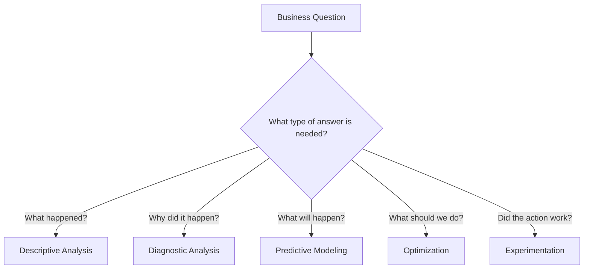

# 006 - Business Question

**Course:** 02 - Coding and EDA
**Module:** Module 05 - Exploratory Data Analysis
**Content Group:** Data Understanding
**Roadmap Source:** Exploratory Data Analysis / Data Understanding
**Lesson Type:** Exploratory Data Analysis
**Order in Module:** 006
**Suggested Duration:** 20 minutes

---

## 1. Summary

A **Business Question** defines the real-world problem that a data analysis, machine learning model, experiment, dashboard, or software system is expected to address.

Before exploring a dataset, a data scientist should understand:

* What decision needs to be made?
* Who will use the analysis?
* What outcome should be improved?
* Which metrics represent success?
* What constraints or risks must be considered?

A good business question gives direction to the entire data workflow. It helps determine which data is necessary, which charts should be created, which metrics should be calculated, and whether machine learning is actually required.

Without a clear business question, Exploratory Data Analysis may become a collection of unrelated charts and statistics that do not support any useful decision.

---

## 2. Learning Objectives

After completing this lesson, you should be able to:

* Explain a business question in your own words.
* Distinguish a business question from a data question and a machine learning question.
* Convert a broad business problem into measurable analytical questions.
* Identify the target population, outcome, metric, time period, and constraints.
* Connect a business question to a dataset, EDA notebook, model, experiment, dashboard, or API.
* Produce insights, caveats, and recommendations that support a real decision.

---

## 3. Main Concept

### 3.1 What Is a Business Question?

A business question is a clear statement describing what an organization wants to understand, improve, predict, reduce, or optimize.

Examples:

* Why are customers cancelling their subscriptions?
* Which customers are most likely to stop using the service?
* Which marketing channel produces the highest-value customers?
* What factors are associated with late deliveries?
* How can the company reduce customer support response time?
* Which products should be recommended to each customer?
* When should inventory be replenished?

A business question should connect data analysis to a decision or action.

For example:

> Which customer groups should the retention team contact first to reduce subscription cancellations next month?

This question identifies:

* A target group: customers.
* A decision-maker: the retention team.
* An outcome: subscription cancellation.
* An action: contact high-risk customers.
* A time period: next month.
* A business goal: reduce churn.

---

### 3.2 Why Business Questions Matter

Business questions guide every important decision in the data workflow.


A clear business question helps answer the following questions:

| Workflow Area   | Question                                                         |
| --------------- | ---------------------------------------------------------------- |
| Data collection | What data do we need?                                            |
| Data quality    | Which errors could affect the decision?                          |
| EDA             | Which patterns and relationships should we investigate?          |
| Metrics         | How will success be measured?                                    |
| Modeling        | Is prediction, classification, ranking, or forecasting required? |
| Experimentation | Which intervention should be tested?                             |
| Deployment      | How will the result be delivered to users?                       |
| Monitoring      | How will we know whether the solution remains useful?            |

---

## 4. Business Question vs. Data Question vs. Machine Learning Question

These concepts are related, but they are not identical.

### 4.1 Business Question

A business question focuses on an organizational goal or decision.

> How can we reduce customer churn?

### 4.2 Data Question

A data question translates the business problem into something that can be investigated with data.

> Which customer characteristics and behaviors are associated with churn?

### 4.3 Machine Learning Question

A machine learning question defines a prediction or optimization task.

> Can we predict whether an active customer will churn within the next 30 days?

### 4.4 Action Question

An action question determines how the result will be used.

> Which high-risk customers should receive a retention offer?

The relationship can be represented as follows:

```text
Business objective
        |
        v
Business question
        |
        v
Data and analytical questions
        |
        v
EDA, statistics, or machine learning
        |
        v
Insight or prediction
        |
        v
Business action
        |
        v
Measured business outcome
```

---

## 5. Components of a Strong Business Question

A useful business question usually contains several important components.

### 5.1 Stakeholder

Who needs the answer?

Examples:

* Product manager
* Marketing team
* Customer retention team
* Operations manager
* Financial analyst
* Healthcare provider
* School administrator

### 5.2 Decision

What decision will be made using the analysis?

Examples:

* Select customers for a retention campaign.
* Allocate the marketing budget.
* Adjust product prices.
* Schedule staff.
* Prioritize support tickets.
* Replenish inventory.

### 5.3 Target Population

Which entities are included?

Examples:

* Active customers
* New users
* Online orders
* Loan applicants
* Hospital patients
* Products in a specific category

### 5.4 Outcome

What result should be predicted, explained, improved, or reduced?

Examples:

* Customer churn
* Revenue
* Conversion rate
* Delivery delay
* Loan default
* Customer satisfaction

### 5.5 Metric

How will the outcome be measured?

Examples:

* Churn rate
* Monthly recurring revenue
* Conversion rate
* Average delivery time
* Customer lifetime value
* Precision and recall
* Return on investment

### 5.6 Time Period

What historical or future period is relevant?

Examples:

* During the previous quarter
* Within 30 days
* Before the next billing cycle
* During the holiday season
* Over the next six months

### 5.7 Constraints

What practical limitations must be respected?

Examples:

* Limited campaign budget
* Privacy requirements
* Maximum number of customers that can be contacted
* Minimum model accuracy
* Limited computing resources
* Need for interpretable results

---

## 6. A Framework for Writing Business Questions

A useful template is:

> How can **[stakeholder]** use **[data or analysis]** to improve, reduce, predict, or optimize **[outcome]** for **[target population]** during **[time period]**, subject to **[constraints]**?

Example:

> How can the customer retention team use subscription and usage data to identify active customers who are likely to churn within the next 30 days, so that limited retention resources can be assigned effectively?

Another compact template is:

```text
Decision + Target Population + Outcome + Metric + Time Period + Constraint
```

Example:

```text
Decision:
Select customers for a retention campaign.

Target population:
Active monthly subscribers.

Outcome:
Subscription cancellation.

Metric:
30-day churn rate.

Time period:
Next billing cycle.

Constraint:
The team can contact only 1,000 customers.
```

---

## 7. Evaluating a Business Question

A business question should be specific enough to guide analysis.

The SMART framework can be adapted for analytical questions.

| Principle  | Meaning                                      | Example                       |
| ---------- | -------------------------------------------- | ----------------------------- |
| Specific   | Clearly defines the problem and population   | Focus on active subscribers   |
| Measurable | Includes an observable outcome or metric     | Measure 30-day churn rate     |
| Actionable | Supports a decision or intervention          | Select customers for outreach |
| Relevant   | Connects to a meaningful organizational goal | Protect recurring revenue     |
| Time-bound | Defines a time period                        | Predict churn within 30 days  |

### Weak Question

> What can we learn from the customer dataset?

Problems:

* No decision is specified.
* No target outcome is defined.
* No stakeholder is identified.
* Almost any chart could be considered relevant.
* The analysis may not produce actionable results.

### Better Question

> Which behavioral and subscription factors are associated with customer churn?

This is suitable for EDA but still does not fully define an action.

### Strong Question

> Which active customers are most likely to churn within the next 30 days, and which controllable factors should the retention team prioritize to reduce churn?

This question supports:

* Descriptive analysis
* Root-cause investigation
* Predictive modeling
* Customer ranking
* Retention experiments
* Business recommendations

---

## 8. Translating a Business Question into an EDA Plan

Consider the following business question:

> Which factors are associated with customer churn, and which customer segments should receive retention attention?

The question can be decomposed into analytical tasks.

### 8.1 Define the Target Variable

Possible target:

```text
churn = 1 if the customer cancelled the service
churn = 0 if the customer remained active
```

Important questions:

* How is churn defined?
* Is temporary inactivity considered churn?
* Is the target based on future information?
* What prediction window is appropriate?
* Are all customers eligible to churn?

---

### 8.2 Identify Relevant Features

Possible customer features:

| Feature Group    | Example Features                   |
| ---------------- | ---------------------------------- |
| Demographics     | Age group, region                  |
| Subscription     | Contract type, monthly fee, tenure |
| Product usage    | Login frequency, feature usage     |
| Customer service | Number of support tickets          |
| Billing          | Payment method, failed payments    |
| Engagement       | Days since last activity           |

---

### 8.3 Perform Data Quality Checks

Before interpreting patterns, check:

* Missing values
* Duplicate customers
* Invalid categories
* Impossible values
* Incorrect data types
* Inconsistent time periods
* Target leakage
* Selection bias

Example:

```python
import pandas as pd

df = pd.read_csv("customer_churn.csv")

print(df.shape)
print(df.dtypes)
print(df.isna().sum())
print(df.duplicated().sum())
```

---

### 8.4 Explore the Target Distribution

```python
churn_distribution = (
    df["churn"]
    .value_counts(dropna=False)
    .rename_axis("churn")
    .reset_index(name="customers")
)

churn_distribution["percentage"] = (
    churn_distribution["customers"] / len(df) * 100
)

print(churn_distribution)
```

The churn rate can be calculated as:

```text
Churn rate = Number of churned customers / Total eligible customers
```

In mathematical form:

[
\text{Churn Rate}
=================

\frac{\text{Number of Churned Customers}}
{\text{Total Eligible Customers}}
]

---

### 8.5 Compare Churn Across Customer Segments

```python
churn_by_contract = (
    df.groupby("contract_type", dropna=False)
    .agg(
        customers=("customer_id", "count"),
        churn_rate=("churn", "mean")
    )
    .sort_values("churn_rate", ascending=False)
)

print(churn_by_contract)
```

Possible questions:

* Is churn higher for monthly contracts?
* Does churn change with customer tenure?
* Are customers with frequent support requests more likely to churn?
* Is churn related to payment failure?
* Are there differences between customer regions?

---

### 8.6 Investigate Relationships

```python
import matplotlib.pyplot as plt

churn_by_tenure = (
    df.groupby("tenure_group")["churn"]
    .mean()
    .sort_values()
)

churn_by_tenure.plot(kind="bar")
plt.title("Customer Churn Rate by Tenure Group")
plt.xlabel("Tenure Group")
plt.ylabel("Churn Rate")
plt.tight_layout()
plt.show()
```

A chart should answer a specific question.

Bad chart description:

> This bar chart shows churn by tenure.

Better insight:

> Customers in their first three months have the highest churn rate, suggesting that onboarding and early product adoption may be important retention opportunities.

---

## 9. From EDA Result to Business Insight

An EDA result is not automatically a business insight.

### 9.1 Observation

> Customers with month-to-month contracts have a churn rate of 34%.

### 9.2 Comparison

> Their churn rate is approximately three times higher than the churn rate of annual-contract customers.

### 9.3 Interpretation

> Short-term contracts may indicate weaker commitment, lower switching costs, or dissatisfaction that has not been addressed.

### 9.4 Recommendation

> The retention team should test incentives that encourage suitable month-to-month customers to move to longer contracts.

### 9.5 Caveat

> This relationship does not prove that contract type causes churn. Customers who already have lower commitment may be more likely to choose monthly contracts.

A strong analytical output therefore includes:

```text
Evidence -> Interpretation -> Caveat -> Recommendation
```

---

## 10. Example: Customer Churn Business Question

### 10.1 Business Context

A subscription company has experienced an increase in monthly customer cancellations. The retention team has a limited budget and cannot contact every customer.

### 10.2 Broad Business Problem

> Customer churn is increasing.

### 10.3 Business Question

> Which customer segments contribute most to churn, and which customers should be prioritized for retention outreach?

### 10.4 Data Questions

* What is the overall churn rate?
* How has churn changed over time?
* Which contract types have the highest churn rate?
* How does churn differ by tenure?
* Is churn associated with payment failures?
* Is product usage lower among churned customers?
* Are support issues associated with churn?

### 10.5 Possible Machine Learning Question

> Can we estimate the probability that each active customer will churn within the next 30 days?

### 10.6 Possible Model Output

| customer_id | churn_probability | risk_group |
| ----------- | ----------------: | ---------- |
| C001        |              0.87 | High       |
| C002        |              0.74 | High       |
| C003        |              0.38 | Medium     |
| C004        |              0.09 | Low        |

### 10.7 Possible Business Action

* Contact high-risk customers.
* Prioritize high-value customers.
* Offer onboarding support.
* Resolve repeated support problems.
* Test contract upgrade incentives.

### 10.8 Success Metrics

Model metrics:

* Precision
* Recall
* ROC-AUC
* Precision at the top 1,000 customers

Business metrics:

* Churn reduction
* Retention campaign conversion rate
* Revenue protected
* Cost per retained customer
* Incremental retention rate

---

## 11. Business Metrics and Model Metrics

A model can perform well technically but fail to generate business value.

For example, a churn model may have high accuracy because most customers do not churn. However, it may fail to identify the customers who actually need intervention.

### Model Metric

Measures the quality of predictions.

Examples:

* Accuracy
* Precision
* Recall
* F1-score
* Mean absolute error
* ROC-AUC

### Business Metric

Measures the value created by using the result.

Examples:

* Revenue saved
* Churn reduction
* Conversion increase
* Cost reduction
* Processing time reduction
* Customer satisfaction improvement

The complete evaluation should connect both:

```text
Model Performance
        +
Operational Feasibility
        +
Business Impact
        =
Useful Data Product
```

---

## 12. When Machine Learning Is Not Necessary

A business question does not always require a machine learning model.

Use descriptive analysis when the question asks:

* What happened?
* How many customers churned?
* Which segment has the highest churn rate?

Use diagnostic analysis when the question asks:

* Why did churn increase?
* Which factors are associated with cancellation?

Use predictive modeling when the question asks:

* Which customers are likely to churn?

Use optimization when the question asks:

* Which customers should receive offers under a fixed budget?

Use experimentation when the question asks:

* Does a retention offer reduce churn?



---

## 13. Assumptions and Caveats

Every business question depends on assumptions.

For a churn analysis, possible assumptions include:

* The churn label is correctly defined.
* Customer records represent unique customers.
* The historical period is representative of the future.
* Product usage is measured consistently.
* Customers with missing data are not systematically different.
* Features are available before the prediction date.
* Retention actions can influence at least some churn decisions.

Possible caveats include:

* Correlation does not prove causation.
* Historical data may contain bias.
* Customer behavior may change after product updates.
* High-risk customers may not respond to retention offers.
* A model trained on one market may not generalize to another.
* Some important variables may not exist in the dataset.

---

## 14. Common Mistakes

### 14.1 Starting with the Dataset Instead of the Decision

Bad approach:

> We have 50 columns. Let us visualize all of them.

Better approach:

> The retention team needs to identify high-risk customers. Which variables may explain or predict churn?

---

### 14.2 Asking Questions That Are Too Broad

Weak:

> How can we improve the business?

Better:

> Which customer segments have the highest 30-day churn rate?

---

### 14.3 Using Unmeasurable Terms

Weak:

> How can we make customers happier?

Better:

> Which factors are associated with low customer satisfaction scores, and which service improvements should be tested?

---

### 14.4 Confusing Correlation with Causation

An EDA result may show that customers with many support tickets churn more often.

This does not prove:

> Support tickets cause churn.

A more careful interpretation is:

> Frequent support tickets are associated with churn and may indicate unresolved product or service problems.

---

### 14.5 Ignoring the Target Population

A churn analysis may incorrectly include:

* Trial users
* Employees
* Previously cancelled accounts
* Customers who are not eligible for renewal

The target population must be clearly defined.

---

### 14.6 Using Future Information

Suppose the goal is to predict churn on January 1.

A feature such as:

```text
account_closed_date
```

may reveal the future outcome and cause target leakage.

Only information available at the decision time should be used.

---

### 14.7 Producing Charts Without Insights

Weak output:

> Here are ten charts.

Better output:

> New customers using fewer than two core features have a substantially higher churn rate. The product team should investigate onboarding and feature adoption during the first month.

---

### 14.8 Providing Recommendations Without Evidence

Weak recommendation:

> The company should reduce prices.

Better recommendation:

> Price-sensitive monthly customers show higher churn, but a controlled pricing experiment is required before concluding that a discount will improve retention profitably.

---

## 15. Practical Exercise

Use a small customer churn CSV dataset.

### Task 1: Write the Business Context

Describe:

* The organization
* The problem
* The stakeholder
* The decision to be made

Example:

> A subscription company wants to reduce monthly churn. The retention team can contact only a limited number of customers, so it needs evidence about which customer groups should be prioritized.

---

### Task 2: Write One Main Business Question

Use this structure:

```text
How can [stakeholder] use [data] to improve or reduce [outcome]
for [target population] during [time period] under [constraint]?
```

---

### Task 3: Create Five Analytical Questions

Examples:

1. What is the overall churn rate?
2. Which contract type has the highest churn rate?
3. How does churn vary by customer tenure?
4. Is churn associated with monthly charges?
5. Are support tickets associated with churn?

---

### Task 4: Build a Reproducible Notebook

Suggested notebook structure:

```text
1. Business context
2. Business question
3. Dataset description
4. Target variable definition
5. Data quality checks
6. Univariate analysis
7. Segment analysis
8. Relationship analysis
9. Key insights
10. Caveats
11. Recommendations
12. Next analysis steps
```

---

### Task 5: Produce Three Evidence-Based Insights

For each insight, include:

```text
Question:
What did you investigate?

Evidence:
What number, table, or chart supports the result?

Interpretation:
What may explain the pattern?

Recommendation:
What action should be considered?

Caveat:
What limitation should the reader remember?
```

Example:

> **Question:** Does customer tenure relate to churn?
> **Evidence:** Customers with less than three months of tenure have a churn rate of 41%, compared with 12% for customers with more than two years of tenure.
> **Interpretation:** Early-stage customers may not have adopted enough product value.
> **Recommendation:** Test a structured onboarding program during the first 90 days.
> **Caveat:** Customer tenure may also be related to contract type and acquisition channel.

---

## 16. Suggested Portfolio Artifact

Create a small portfolio project titled:

> **Customer Churn EDA: From Business Question to Retention Recommendation**

Recommended deliverables:

```text
customer-churn-eda/
|
|-- data/
|   |-- raw/
|   |   `-- customer_churn.csv
|   `-- processed/
|       `-- customer_churn_clean.csv
|
|-- notebooks/
|   `-- 01_customer_churn_eda.ipynb
|
|-- reports/
|   |-- figures/
|   `-- churn_insight_report.md
|
|-- src/
|   `-- data_cleaning.py
|
|-- README.md
|-- requirements.txt
`-- data_changelog.md
```

The `README.md` should explain:

* Business context
* Main business question
* Dataset
* Analytical approach
* Key findings
* Recommendations
* Assumptions
* Limitations
* How to reproduce the analysis

---

## 17. Completion Checklist

Use this checklist to evaluate your understanding.

* [ ] I can explain a business question in one or two minutes.
* [ ] I can distinguish a business question from a data question.
* [ ] I can distinguish a data question from a machine learning task.
* [ ] I have identified the stakeholder and decision.
* [ ] I have defined the target population.
* [ ] I have defined a measurable outcome.
* [ ] I have selected at least one business metric.
* [ ] I have specified a relevant time period.
* [ ] I have recorded important constraints.
* [ ] I have created an EDA notebook, query, chart, dashboard, model, API, or analysis note.
* [ ] I have written at least three evidence-based insights.
* [ ] I have included at least one assumption or caveat.
* [ ] I have connected my findings to a possible business action.
* [ ] I have identified at least one question for further analysis.

---

## 18. Related Outcome

> Understand, clean, visualize, and explain datasets using business-oriented insights.

This lesson supports the ability to move from raw data to a decision-oriented analytical output.

---

## 19. Related Project

### Mini Project: Customer Churn EDA

The project should include:

* Business problem definition
* Main business question
* Target variable definition
* Dataset schema review
* Data quality checks
* Churn distribution analysis
* Customer segment analysis
* Feature relationship analysis
* Three or more charts
* Three evidence-based insights
* Assumptions and caveats
* Actionable recommendations
* Reproducible notebook and cleaning workflow

---

## 20. Key Takeaways

A **Business Question** is the starting point of a useful data project.

A strong business question:

* Identifies a stakeholder.
* Supports a real decision.
* Defines a target population.
* Includes a measurable outcome.
* Connects analysis to a business metric.
* Specifies a relevant time period.
* Recognizes operational constraints.
* Guides data collection, EDA, modeling, and experimentation.
* Leads to insights and recommendations that can be acted upon.

The core workflow is:

```text
Business problem
    -> Business question
    -> Analytical questions
    -> Data requirements
    -> Data quality checks
    -> EDA or modeling
    -> Evidence
    -> Insight
    -> Caveat
    -> Recommendation
    -> Business action
    -> Measured impact
```

Do not begin by asking:

> What charts can I create from this dataset?

Begin by asking:

> What decision needs to be made, and what evidence would support that decision?

```
```
