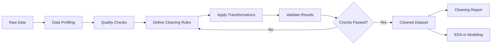
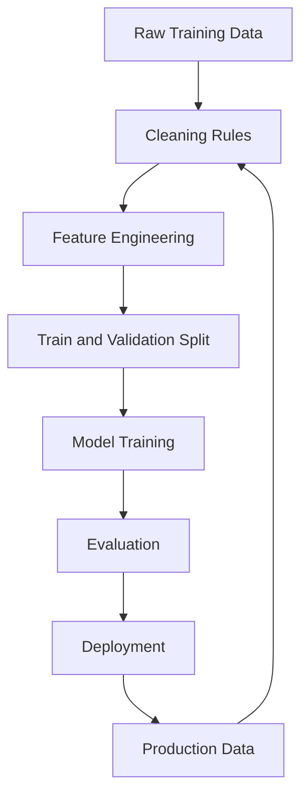
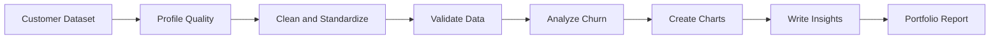

# 007 - Data Cleaning

**Course:** 02 - Coding and EDA
**Module:** Module 05 - Exploratory Data Analysis
**Content Group:** Data Cleaning
**Roadmap Source:** Exploratory Data Analysis / Data Cleaning
**Lesson Type:** Exploratory Data Analysis
**Lesson Order:** 007
**Suggested Duration:** 20 minutes

---

## 1. Overview

**Data cleaning** is the process of identifying, correcting, standardizing, or removing data that is incomplete, duplicated, inconsistent, invalid, or unsuitable for analysis.

In real-world projects, raw data is rarely ready for visualization or machine learning. It may contain:

* Missing values
* Duplicate records
* Incorrect data types
* Invalid values
* Inconsistent category labels
* Formatting problems
* Extreme or suspicious observations
* Impossible dates or numerical values
* Data collected using different units

Data cleaning transforms raw data into a reliable dataset that can be used for:

* Exploratory data analysis
* Business reporting
* Statistical analysis
* Machine learning
* Experimentation
* Dashboard development
* API services
* Production data pipelines

A strong data-cleaning process must be **reproducible, explainable, measurable, and auditable**.

---

## 2. Learning Objectives

After completing this lesson, you should be able to:

* Explain data cleaning in your own words.
* Identify common data-quality problems.
* Separate raw data from cleaned data.
* Create reproducible cleaning rules with Python or SQL.
* Validate the dataset before and after cleaning.
* Document assumptions and transformations.
* Explain how cleaning decisions affect analysis and machine-learning models.
* Produce a small cleaning report for a portfolio project.

---

## 3. Why Data Cleaning Matters

Poor-quality data can produce misleading analysis even when the charts, statistics, or models are technically correct.

A useful principle is:

> A model can only learn from the data it receives.

Examples of consequences caused by dirty data include:

| Data problem                 | Possible consequence                   |
| ---------------------------- | -------------------------------------- |
| Missing customer age         | Biased customer segmentation           |
| Duplicate transactions       | Inflated revenue                       |
| Incorrect date format        | Broken time-series analysis            |
| Mixed currency units         | Invalid price comparisons              |
| Inconsistent category labels | Incorrect group counts                 |
| Impossible numerical values  | Distorted averages                     |
| Data leakage                 | Unrealistically high model performance |
| Incorrect target labels      | Poor model predictions                 |

Data cleaning is therefore not only a technical task. It is also a business and analytical responsibility.

---

## 4. Data-Cleaning Workflow



A typical workflow is:

```text
raw data
    -> inspect schema
    -> profile data quality
    -> define cleaning rules
    -> apply transformations
    -> validate results
    -> save cleaned data
    -> document changes
```

---

## 5. Core Principles

### 5.1 Preserve the Raw Data

Never overwrite the original dataset.

A recommended project structure is:

```text
project/
├── data/
│   ├── raw/
│   │   └── customers.csv
│   ├── interim/
│   │   └── customers_standardized.csv
│   └── processed/
│       └── customers_cleaned.csv
├── notebooks/
│   └── 01_data_cleaning.ipynb
├── reports/
│   └── cleaning_report.md
└── src/
    └── clean_data.py
```

The raw dataset should remain unchanged so that:

* Results can be reproduced.
* Cleaning mistakes can be reversed.
* Other people can audit the transformations.
* New cleaning rules can be tested.
* The pipeline can be rerun on future data.

---

### 5.2 Every Cleaning Rule Needs a Reason

Do not remove or modify data simply because it looks unusual.

Each cleaning rule should answer three questions:

1. **What problem was detected?**
2. **Why is the transformation appropriate?**
3. **How will the result be validated?**

Example:

```text
Problem:
The age column contains values below 0 and above 120.

Rule:
Convert values outside the valid business range of 0-120 to missing values.

Reason:
Negative ages and ages above 120 are considered invalid for this dataset.

Validation:
Confirm that no non-missing age value remains outside the accepted range.
```

---

### 5.3 Cleaning Must Be Reproducible

Avoid manually editing spreadsheet cells whenever possible.

Prefer:

* Python scripts
* Notebook cells
* SQL queries
* Data-pipeline transformations
* Version-controlled configuration files

A reproducible process means that the same input produces the same cleaned output.

```text
same raw data + same cleaning code = same cleaned dataset
```

---

### 5.4 Validate Before and After Cleaning

Cleaning without validation can introduce new errors.

Compare important metrics before and after cleaning:

* Number of rows
* Number of columns
* Missing-value counts
* Duplicate counts
* Unique category values
* Minimum and maximum values
* Summary statistics
* Target distribution
* Number of invalid records

Example validation table:

| Check                    | Before | After | Expected result    |
| ------------------------ | -----: | ----: | ------------------ |
| Total rows               | 10,000 | 9,850 | Duplicates removed |
| Duplicate rows           |    150 |     0 | Pass               |
| Missing age values       |    420 |     0 | Imputed            |
| Invalid ages             |     12 |     0 | Pass               |
| Unique gender labels     |      7 |     3 | Standardized       |
| Negative monthly charges |      4 |     0 | Pass               |

---

## 6. Common Data-Quality Problems

### 6.1 Missing Values

Missing data may appear as:

```text
NaN
NULL
None
""
"unknown"
"N/A"
"-"
"?"
999
-1
```

Not every missing value should be treated in the same way.

Common strategies include:

* Remove rows with missing values.
* Remove columns with excessive missingness.
* Fill numerical values with the mean.
* Fill numerical values with the median.
* Fill categorical values with the mode.
* Create an `"Unknown"` category.
* Use forward fill or backward fill.
* Use model-based imputation.
* Preserve the missing value and add a missing indicator.

#### Missing rate

The missing rate for a column can be calculated as:

[
\text{Missing Rate} =
\frac{\text{Number of Missing Values}}
{\text{Total Number of Rows}}
\times 100%
]

Python example:

```python
missing_report = (
    df.isna()
    .mean()
    .mul(100)
    .sort_values(ascending=False)
    .rename("missing_percent")
)

print(missing_report)
```

Important questions include:

* Is the value missing randomly?
* Is missingness related to the target variable?
* Does a missing value have business meaning?
* Will removing missing rows create bias?

---

### 6.2 Duplicate Records

Duplicates can occur because of:

* Repeated data collection
* Data-entry errors
* Failed ingestion retries
* Joining tables incorrectly
* Multiple records representing the same entity

Check exact duplicates:

```python
duplicate_count = df.duplicated().sum()
print(f"Duplicate rows: {duplicate_count}")
```

Remove exact duplicates:

```python
df = df.drop_duplicates()
```

Check duplicates using a business key:

```python
duplicate_customers = df.duplicated(
    subset=["customer_id"],
    keep=False
)

print(df[duplicate_customers])
```

A duplicate row is not always an error. For example, one customer may legitimately have multiple transactions.

The cleaning decision depends on the **unit of observation**.

---

### 6.3 Incorrect Data Types

A column may have the wrong type because of:

* Currency symbols
* Thousands separators
* Invalid strings
* Mixed date formats
* Missing-value markers
* Leading or trailing spaces

Inspect data types:

```python
print(df.dtypes)
```

Convert a numerical column:

```python
df["monthly_charges"] = pd.to_numeric(
    df["monthly_charges"],
    errors="coerce"
)
```

Convert a date column:

```python
df["signup_date"] = pd.to_datetime(
    df["signup_date"],
    errors="coerce"
)
```

Convert a categorical column:

```python
df["contract_type"] = df["contract_type"].astype("category")
```

Using `errors="coerce"` converts invalid values to missing values so they can be reviewed later.

---

### 6.4 Inconsistent Categories

The following values may represent the same category:

```text
"Male"
"male"
"MALE"
" M "
"M"
```

Basic standardization:

```python
df["gender"] = (
    df["gender"]
    .astype("string")
    .str.strip()
    .str.lower()
)
```

Mapping inconsistent values:

```python
gender_mapping = {
    "m": "male",
    "male": "male",
    "f": "female",
    "female": "female",
    "non binary": "non-binary",
    "non-binary": "non-binary",
}

df["gender"] = df["gender"].replace(gender_mapping)
```

Validate categories:

```python
print(df["gender"].value_counts(dropna=False))
```

---

### 6.5 Text Formatting Problems

Text data may contain:

* Extra spaces
* Different capitalization
* Hidden line breaks
* Unicode inconsistencies
* Misspellings
* Different abbreviations

Example:

```python
df["city"] = (
    df["city"]
    .astype("string")
    .str.strip()
    .str.replace(r"\s+", " ", regex=True)
    .str.title()
)
```

Before:

```text
"  ho chi minh  "
"HO   CHI MINH"
"ho chi minh"
```

After:

```text
"Ho Chi Minh"
```

---

### 6.6 Invalid Values

Invalid values violate a business rule or logical constraint.

Examples:

* Age less than 0
* Discount greater than 100%
* End date before start date
* Quantity equal to 0 for a completed order
* Negative salary
* Customer status outside the approved category list

Example rule:

```python
invalid_age = ~df["age"].between(0, 120)

df.loc[invalid_age, "age"] = pd.NA
```

Date validation:

```python
invalid_dates = df["end_date"] < df["start_date"]

print(df.loc[invalid_dates])
```

Category validation:

```python
valid_statuses = {"active", "inactive", "churned"}

invalid_status = ~df["status"].isin(valid_statuses)

print(df.loc[invalid_status, "status"])
```

---

### 6.7 Outliers

An outlier is an observation that is unusually far from the majority of the data.

Outliers may represent:

* Data-entry errors
* Measurement errors
* Fraud
* Rare but valid customers
* Important business events
* Genuine extreme behavior

Therefore:

> Outliers should be investigated before they are removed.

#### Interquartile Range Method

The interquartile range is:

[
IQR = Q_3 - Q_1
]

The commonly used outlier boundaries are:

[
\text{Lower Bound} = Q_1 - 1.5 \times IQR
]

[
\text{Upper Bound} = Q_3 + 1.5 \times IQR
]

Python example:

```python
q1 = df["monthly_charges"].quantile(0.25)
q3 = df["monthly_charges"].quantile(0.75)

iqr = q3 - q1

lower_bound = q1 - 1.5 * iqr
upper_bound = q3 + 1.5 * iqr

outliers = df[
    ~df["monthly_charges"].between(
        lower_bound,
        upper_bound
    )
]

print(outliers)
```

Possible treatments include:

* Keep the values unchanged.
* Remove clearly invalid values.
* Cap values at selected boundaries.
* Apply a logarithmic transformation.
* Analyze outliers as a separate group.
* Use robust statistics or robust models.

---

### 6.8 Inconsistent Units

Numerical values may use different units.

Examples:

```text
1.75 meters
175 centimeters
5 feet 9 inches
```

Or:

```text
100 USD
2,500,000 VND
90 EUR
```

All values should be converted into a common unit before comparison.

Example:

```python
df["height_cm"] = np.where(
    df["height_unit"].eq("m"),
    df["height"] * 100,
    df["height"]
)
```

The selected standard unit should be recorded in the data dictionary.

---

### 6.9 Inconsistent Date Formats

Dates may appear as:

```text
2026-07-11
11/07/2026
07/11/2026
July 11, 2026
11-Jul-2026
```

These formats may be ambiguous.

Example:

```python
df["order_date"] = pd.to_datetime(
    df["order_date"],
    format="%d/%m/%Y",
    errors="coerce"
)
```

Always confirm:

* Day-first or month-first format
* Time zone
* Date granularity
* Whether timestamps are local or UTC

---

## 7. Data Profiling Before Cleaning

Before changing data, create a quality profile.

```python
import pandas as pd

df = pd.read_csv("data/raw/customers.csv")

print("Shape:", df.shape)
print("\nColumns:")
print(df.columns.tolist())

print("\nData types:")
print(df.dtypes)

print("\nMissing values:")
print(df.isna().sum())

print("\nDuplicate rows:")
print(df.duplicated().sum())

print("\nNumerical summary:")
print(df.describe())

print("\nCategorical summary:")
print(df.describe(include="object"))
```

A reusable profiling function:

```python
import pandas as pd


def create_quality_report(df: pd.DataFrame) -> pd.DataFrame:
    """Create a basic column-level data-quality report."""

    report = pd.DataFrame({
        "column": df.columns,
        "dtype": df.dtypes.astype(str).values,
        "row_count": len(df),
        "missing_count": df.isna().sum().values,
        "missing_percent": (
            df.isna().mean().mul(100).round(2).values
        ),
        "unique_count": df.nunique(dropna=True).values,
    })

    return report


quality_report = create_quality_report(df)
print(quality_report)
```

---

## 8. Practical Demo

Assume the following raw customer dataset:

| customer_id |  age | gender | monthly_charges | contract       | churn |
| ----------: | ---: | ------ | --------------: | -------------- | ----- |
|        1001 |   25 | Male   |           49.50 | Monthly        | No    |
|        1002 |   -5 | female |           70.00 | month-to-month | Yes   |
|        1002 |   -5 | female |           70.00 | month-to-month | Yes   |
|        1003 | null | F      |           85.20 | Annual         | No    |
|        1004 |  230 | MALE   |         unknown | yearly         | Yes   |
|        1005 |   42 | Female |           55.10 | Annual         | no    |

The dataset contains:

* A duplicate customer record
* Invalid ages
* A missing age
* Inconsistent gender labels
* A non-numerical charge value
* Inconsistent contract categories
* Inconsistent churn labels

---

### 8.1 Load the Raw Dataset

```python
import pandas as pd

raw_df = pd.read_csv("data/raw/customers.csv")

df = raw_df.copy()

print(df)
```

Using `.copy()` protects the original DataFrame from accidental modification.

---

### 8.2 Standardize Column Names

```python
df.columns = (
    df.columns
    .str.strip()
    .str.lower()
    .str.replace(" ", "_")
)
```

Example transformation:

```text
Monthly Charges -> monthly_charges
Customer ID     -> customer_id
```

---

### 8.3 Remove Exact Duplicates

```python
rows_before = len(df)

df = df.drop_duplicates()

rows_after = len(df)

print(f"Removed rows: {rows_before - rows_after}")
```

---

### 8.4 Correct Data Types

```python
df["monthly_charges"] = pd.to_numeric(
    df["monthly_charges"],
    errors="coerce"
)

df["age"] = pd.to_numeric(
    df["age"],
    errors="coerce"
)
```

---

### 8.5 Handle Invalid Ages

```python
valid_age_range = df["age"].between(0, 120)

df.loc[~valid_age_range, "age"] = pd.NA
```

Fill missing age values using the median:

```python
median_age = df["age"].median()

df["age"] = df["age"].fillna(median_age)
```

The median is often preferred when a numerical feature is skewed or contains extreme values.

---

### 8.6 Standardize Gender Values

```python
df["gender"] = (
    df["gender"]
    .astype("string")
    .str.strip()
    .str.lower()
)

gender_mapping = {
    "m": "male",
    "male": "male",
    "f": "female",
    "female": "female",
}

df["gender"] = df["gender"].replace(gender_mapping)
```

---

### 8.7 Standardize Contract Categories

```python
df["contract"] = (
    df["contract"]
    .astype("string")
    .str.strip()
    .str.lower()
)

contract_mapping = {
    "monthly": "month-to-month",
    "month-to-month": "month-to-month",
    "annual": "one-year",
    "yearly": "one-year",
}

df["contract"] = df["contract"].replace(contract_mapping)
```

---

### 8.8 Standardize the Target Variable

```python
df["churn"] = (
    df["churn"]
    .astype("string")
    .str.strip()
    .str.lower()
    .map({
        "yes": 1,
        "no": 0,
    })
)
```

Result:

```text
Yes -> 1
No  -> 0
```

---

### 8.9 Handle Missing Charges

First inspect the missing records:

```python
print(df[df["monthly_charges"].isna()])
```

Fill missing charges using the median within each contract group:

```python
df["monthly_charges"] = (
    df["monthly_charges"]
    .fillna(
        df.groupby("contract")["monthly_charges"]
        .transform("median")
    )
)
```

This may be more appropriate than using one global median when pricing differs by contract type.

---

### 8.10 Validate the Cleaned Dataset

```python
assert df["customer_id"].is_unique

assert df["age"].between(0, 120).all()

assert df["gender"].isin(
    ["male", "female"]
).all()

assert df["contract"].isin(
    ["month-to-month", "one-year"]
).all()

assert df["churn"].isin([0, 1]).all()

assert df["monthly_charges"].notna().all()
```

Assertions stop the pipeline when an important assumption is violated.

---

### 8.11 Save the Cleaned Dataset

```python
output_path = "data/processed/customers_cleaned.csv"

df.to_csv(
    output_path,
    index=False
)

print(f"Cleaned dataset saved to: {output_path}")
```

---

## 9. Reusable Cleaning Function

For repeated data-processing tasks, place the cleaning logic inside a function.

```python
import pandas as pd


def clean_customer_data(
    raw_df: pd.DataFrame
) -> pd.DataFrame:
    """Clean and validate a customer dataset."""

    df = raw_df.copy()

    # Standardize column names
    df.columns = (
        df.columns
        .str.strip()
        .str.lower()
        .str.replace(r"\s+", "_", regex=True)
    )

    # Remove exact duplicate rows
    df = df.drop_duplicates()

    # Convert numerical columns
    numeric_columns = [
        "age",
        "monthly_charges",
    ]

    for column in numeric_columns:
        df[column] = pd.to_numeric(
            df[column],
            errors="coerce"
        )

    # Replace invalid ages
    df.loc[
        ~df["age"].between(0, 120),
        "age"
    ] = pd.NA

    # Impute age
    df["age"] = df["age"].fillna(
        df["age"].median()
    )

    # Standardize gender
    df["gender"] = (
        df["gender"]
        .astype("string")
        .str.strip()
        .str.lower()
        .replace({
            "m": "male",
            "f": "female",
        })
    )

    # Standardize contract
    df["contract"] = (
        df["contract"]
        .astype("string")
        .str.strip()
        .str.lower()
        .replace({
            "monthly": "month-to-month",
            "annual": "one-year",
            "yearly": "one-year",
        })
    )

    # Encode churn
    df["churn"] = (
        df["churn"]
        .astype("string")
        .str.strip()
        .str.lower()
        .map({
            "yes": 1,
            "no": 0,
        })
    )

    # Impute charges by contract type
    group_median = (
        df.groupby("contract")["monthly_charges"]
        .transform("median")
    )

    df["monthly_charges"] = (
        df["monthly_charges"]
        .fillna(group_median)
        .fillna(df["monthly_charges"].median())
    )

    # Validation
    if not df["customer_id"].is_unique:
        raise ValueError(
            "customer_id must be unique."
        )

    if not df["age"].between(0, 120).all():
        raise ValueError(
            "Invalid age values remain."
        )

    if df["churn"].isna().any():
        raise ValueError(
            "Invalid churn labels remain."
        )

    return df
```

Usage:

```python
raw_df = pd.read_csv(
    "data/raw/customers.csv"
)

clean_df = clean_customer_data(raw_df)

clean_df.to_csv(
    "data/processed/customers_cleaned.csv",
    index=False
)
```

---

## 10. Creating a Cleaning Log

A cleaning log records what changed and why.

| Step | Column          | Problem              | Action                   | Rows affected | Reason                   |
| ---: | --------------- | -------------------- | ------------------------ | ------------: | ------------------------ |
|    1 | All             | Duplicate rows       | Removed exact duplicates |             1 | Prevent repeated records |
|    2 | Age             | Values outside 0-120 | Replaced with missing    |             2 | Invalid business values  |
|    3 | Age             | Missing values       | Filled with median       |             3 | Preserve usable records  |
|    4 | Gender          | Inconsistent labels  | Standardized categories  |             4 | Improve grouping         |
|    5 | Monthly charges | Non-numeric values   | Converted and imputed    |             1 | Required for analysis    |
|    6 | Churn           | Mixed text labels    | Encoded as 0 and 1       |             6 | Prepare target variable  |

A programmatic cleaning log can also be created:

```python
cleaning_log = []

duplicate_count = df.duplicated().sum()

cleaning_log.append({
    "step": "Remove duplicates",
    "rows_affected": int(duplicate_count),
    "reason": "Prevent duplicated customer records",
})
```

---

## 11. Data-Quality Metrics

Data quality can be evaluated using measurable dimensions.

### 11.1 Completeness

The proportion of required values that are available.

[
\text{Completeness} =
\frac{\text{Non-Missing Values}}
{\text{Expected Values}}
]

---

### 11.2 Uniqueness

The degree to which records or identifiers are not duplicated.

[
\text{Uniqueness Rate} =
\frac{\text{Unique Records}}
{\text{Total Records}}
]

---

### 11.3 Validity

The proportion of values that follow defined rules.

[
\text{Validity Rate} =
\frac{\text{Valid Values}}
{\text{Total Values}}
]

---

### 11.4 Consistency

The degree to which related values agree across columns or systems.

Example rules:

```text
end_date >= start_date
total_price = quantity × unit_price
country_code matches country_name
churn_date exists only when churn = 1
```

---

### 11.5 Accuracy

The degree to which data correctly represents the real-world value.

Accuracy usually requires comparison with:

* A trusted source
* Manual verification
* Reference data
* External systems
* Business-owner confirmation

A dataset can be valid but still inaccurate.

For example, an age of `45` is valid, but it is inaccurate if the customer's actual age is `35`.

---

### 11.6 Timeliness

The degree to which data is recent enough for its intended use.

Examples:

* Real-time fraud detection requires recent transactions.
* Annual demographic analysis may tolerate older records.
* Inventory dashboards may require updates every few minutes.

---

## 12. Data Cleaning and Machine Learning

Cleaning decisions directly affect machine-learning performance.



Important considerations:

### 12.1 Avoid Data Leakage

Cleaning rules that learn from the full dataset may leak information from the validation or test set.

Incorrect approach:

```python
median_age = full_df["age"].median()
```

Better approach:

```python
median_age = train_df["age"].median()

train_df["age"] = train_df["age"].fillna(median_age)
test_df["age"] = test_df["age"].fillna(median_age)
```

The value used for imputation should be learned from the training data only.

---

### 12.2 Use Pipelines

Scikit-learn pipelines help ensure that transformations are applied consistently.

```python
from sklearn.compose import ColumnTransformer
from sklearn.impute import SimpleImputer
from sklearn.pipeline import Pipeline
from sklearn.preprocessing import OneHotEncoder
from sklearn.preprocessing import StandardScaler

numeric_features = [
    "age",
    "monthly_charges",
]

categorical_features = [
    "gender",
    "contract",
]

numeric_pipeline = Pipeline(
    steps=[
        (
            "imputer",
            SimpleImputer(strategy="median")
        ),
        (
            "scaler",
            StandardScaler()
        ),
    ]
)

categorical_pipeline = Pipeline(
    steps=[
        (
            "imputer",
            SimpleImputer(
                strategy="most_frequent"
            )
        ),
        (
            "encoder",
            OneHotEncoder(
                handle_unknown="ignore"
            )
        ),
    ]
)

preprocessor = ColumnTransformer(
    transformers=[
        (
            "numeric",
            numeric_pipeline,
            numeric_features
        ),
        (
            "categorical",
            categorical_pipeline,
            categorical_features
        ),
    ]
)
```

---

### 12.3 Apply the Same Rules in Production

Training and production data must use the same:

* Category mappings
* Missing-value treatments
* Unit conversions
* Feature names
* Numerical transformations
* Validation rules

Otherwise, training-serving skew may occur.

---

## 13. Cleaning Validation Report

A useful cleaning report should include:

### Dataset Summary

```text
Input file: customers.csv
Output file: customers_cleaned.csv
Rows before cleaning: 10,000
Rows after cleaning: 9,850
Columns before cleaning: 18
Columns after cleaning: 18
```

### Main Transformations

```text
- Removed 150 exact duplicate rows.
- Converted three columns to numerical data types.
- Standardized six categorical variables.
- Replaced invalid ages with missing values.
- Imputed missing age values using the median.
- Converted churn labels into binary values.
```

### Remaining Issues

```text
- Income has 12% missing values.
- Some customer locations cannot be verified.
- High-value transactions require business review.
- The dataset does not include a reliable acquisition channel.
```

### Validation Result

```text
- No duplicate customer identifiers remain.
- No invalid age values remain.
- Target values are limited to 0 and 1.
- All required columns are present.
- The cleaned dataset passes schema validation.
```

---

## 14. Common Mistakes

### 14.1 Editing Data Manually

Problem:

```text
The analyst edits rows directly in Excel.
```

Why it is risky:

* The process cannot be reproduced.
* Changes are difficult to audit.
* Errors may be introduced silently.
* New datasets require the same manual work.

Better approach:

```text
Write cleaning rules in Python, SQL, or a data pipeline.
```

---

### 14.2 Overwriting the Raw Dataset

Problem:

```text
raw/customers.csv is replaced by the cleaned version.
```

Consequence:

* Original evidence is lost.
* Transformations cannot be reviewed.
* Mistakes may be irreversible.

Better approach:

```text
Save raw and processed data separately.
```

---

### 14.3 Removing All Missing Values

Problem:

```python
df = df.dropna()
```

Why it may be harmful:

* Too many records may be removed.
* Important groups may disappear.
* The remaining dataset may become biased.
* Missingness may contain useful information.

Better approach:

```text
Investigate the missing-data pattern before selecting a treatment.
```

---

### 14.4 Removing Every Outlier

Problem:

```text
Every value outside an IQR boundary is deleted.
```

Why it may be harmful:

* Rare but valid events may be lost.
* Fraud cases may disappear.
* Important high-value customers may be removed.
* The business distribution may be distorted.

Better approach:

```text
Investigate, label, cap, transform, or model outliers appropriately.
```

---

### 14.5 Cleaning Without Business Context

A technically unusual value may still be valid.

Example:

```text
A monthly charge of $5,000 may be impossible for an individual plan
but valid for an enterprise customer.
```

Always combine statistical checks with business rules.

---

### 14.6 Changing the Target Distribution Accidentally

Removing records may alter the proportion of target classes.

Example:

| Dataset         | Churn rate |
| --------------- | ---------: |
| Before cleaning |        24% |
| After cleaning  |        15% |

A large change should be investigated because it may introduce selection bias.

---

### 14.7 Cleaning Before Defining the Unit of Observation

Before removing duplicates, determine what one row represents.

Possible units include:

* One customer
* One transaction
* One product
* One customer per month
* One website session
* One sensor measurement
* One medical visit

Two rows may appear duplicated while representing two valid events.

---

### 14.8 Producing Charts Without Insights

A chart alone is not an analytical conclusion.

Weak statement:

```text
This chart shows churn by contract type.
```

Better statement:

```text
Customers with month-to-month contracts have a substantially higher
churn rate than customers with one-year contracts. This suggests that
contract renewal incentives may reduce customer loss.
```

---

## 15. Practical Exercise

### Dataset

Choose a small CSV dataset such as:

* Customer churn
* E-commerce transactions
* Employee attrition
* Loan applications
* Housing prices
* Student performance
* Marketing campaigns

---

### Task 1: Create a Raw Data Profile

Report:

* Number of rows and columns
* Column names
* Data types
* Missing-value counts
* Duplicate count
* Unique category values
* Numerical summary statistics
* Suspicious minimum and maximum values

---

### Task 2: Define Cleaning Rules

Create at least five cleaning rules.

Example:

| Problem                | Rule                             | Validation                      |
| ---------------------- | -------------------------------- | ------------------------------- |
| Duplicate customer IDs | Keep the most recent record      | IDs are unique                  |
| Negative age           | Replace with missing             | Age is between 0 and 120        |
| Mixed gender labels    | Map to standard values           | Only approved labels remain     |
| Missing charges        | Fill using contract-group median | No required charges are missing |
| Invalid churn labels   | Map Yes/No to 1/0                | Target contains only 0 and 1    |

---

### Task 3: Build a Reproducible Notebook

Suggested notebook structure:

```text
1. Business context
2. Dataset description
3. Load raw data
4. Initial quality checks
5. Cleaning rules
6. Validation
7. Save cleaned dataset
8. Exploratory analysis
9. Business insights
10. Limitations and next steps
```

---

### Task 4: Produce Three Insights

Each insight should contain:

1. A finding
2. Supporting evidence
3. A chart or table
4. A business interpretation
5. A possible recommendation
6. A caveat

Example:

```text
Finding:
Month-to-month customers have the highest churn rate.

Evidence:
Their churn rate is 41%, compared with 13% for one-year customers.

Interpretation:
Customers without long-term commitments can leave more easily.

Recommendation:
Test a discounted annual-plan conversion campaign.

Caveat:
The relationship is associative and does not prove that contract type
directly causes churn.
```

---

## 16. Suggested Charts

Useful charts after cleaning include:

### Missing-Value Bar Chart

```python
import matplotlib.pyplot as plt

missing_percent = (
    raw_df.isna()
    .mean()
    .mul(100)
    .sort_values(ascending=False)
)

missing_percent.plot(
    kind="bar",
    figsize=(10, 5)
)

plt.title("Missing Values by Column")
plt.xlabel("Column")
plt.ylabel("Missing Values (%)")
plt.tight_layout()
plt.show()
```

---

### Distribution Before and After Cleaning

```python
import matplotlib.pyplot as plt

raw_df["age"].plot(
    kind="hist",
    bins=20,
    alpha=0.6,
    label="Raw"
)

df["age"].plot(
    kind="hist",
    bins=20,
    alpha=0.6,
    label="Cleaned"
)

plt.title("Age Distribution Before and After Cleaning")
plt.xlabel("Age")
plt.legend()
plt.tight_layout()
plt.show()
```

---

### Churn Rate by Contract Type

```python
import matplotlib.pyplot as plt

churn_by_contract = (
    df.groupby("contract")["churn"]
    .mean()
    .mul(100)
    .sort_values(ascending=False)
)

churn_by_contract.plot(
    kind="bar"
)

plt.title("Churn Rate by Contract Type")
plt.xlabel("Contract Type")
plt.ylabel("Churn Rate (%)")
plt.tight_layout()
plt.show()
```

---

## 17. Portfolio Artifact

A strong portfolio artifact for this lesson could include:

```text
customer-churn-data-cleaning/
├── README.md
├── data/
│   ├── raw/
│   └── processed/
├── notebooks/
│   └── churn_data_cleaning.ipynb
├── src/
│   └── clean_data.py
├── reports/
│   ├── cleaning_report.md
│   └── figures/
├── requirements.txt
└── tests/
    └── test_clean_data.py
```

The `README.md` should explain:

* The business problem
* The dataset
* The main data-quality issues
* The cleaning decisions
* Validation results
* Key insights
* Limitations
* Instructions for reproducing the analysis

---

## 18. Completion Checklist

* [ ] I can explain data cleaning in one or two minutes.
* [ ] I can identify missing values, duplicates, invalid values, and inconsistent categories.
* [ ] I keep raw data separate from processed data.
* [ ] My cleaning steps can be rerun automatically.
* [ ] Every important cleaning rule has a reason.
* [ ] I validate the dataset after applying transformations.
* [ ] I compare important metrics before and after cleaning.
* [ ] I record assumptions and affected rows.
* [ ] I understand how cleaning may affect the target distribution.
* [ ] I know how data leakage can occur during preprocessing.
* [ ] I have saved a cleaned dataset and a cleaning report.
* [ ] I have produced at least three evidence-based insights.
* [ ] I have documented at least one caveat or unresolved question.

---

## 19. Related Outcome

After completing this lesson, you should be able to:

> Understand, clean, validate, visualize, and explain datasets using reproducible methods and business-oriented insights.

---

## 20. Related Project

### Mini Project: Customer Churn EDA

The project should include:

* Dataset schema inspection
* Data-quality profiling
* Missing-value analysis
* Duplicate detection
* Category standardization
* Numerical validation
* Outlier investigation
* Churn-rate analysis
* Feature relationships
* At least three charts
* Business insights
* Recommendations
* Assumptions and limitations
* A cleaned CSV file
* A reproducible notebook
* A cleaning report

Suggested workflow:



---

## 21. Summary

**Data cleaning** transforms raw, unreliable data into a structured and validated dataset that can support trustworthy analysis and machine learning.

The most important principles are:

1. Preserve the original raw data.
2. Understand the unit of observation.
3. Profile the dataset before changing it.
4. Make every cleaning rule explicit.
5. Use reproducible code instead of manual editing.
6. Validate the dataset after every major transformation.
7. Investigate missing values and outliers before removing them.
8. Consider business context when defining valid data.
9. Prevent data leakage in machine-learning workflows.
10. Document changes, assumptions, and unresolved issues.

Do not treat data cleaning as an invisible preparation step. Turn it into a concrete artifact such as:

* A reproducible notebook
* A Python cleaning pipeline
* A SQL transformation
* A validation report
* A cleaned dataset
* An automated data-quality test
* A documented portfolio project
