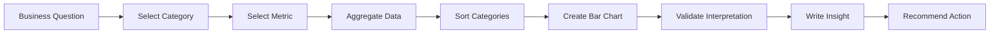
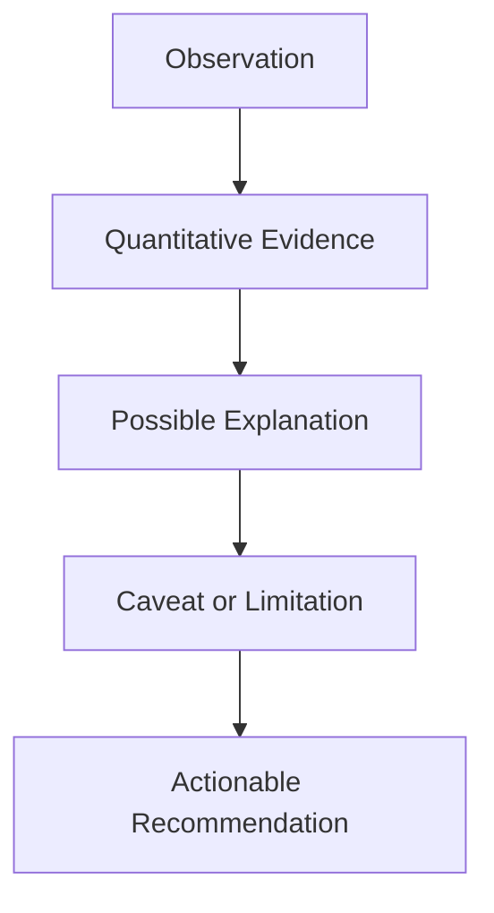
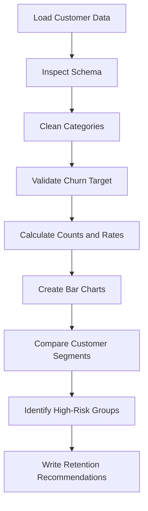

# 016 - Bar Chart

**Course:** 02 - Coding and EDA
**Module:** Module 05 - Exploratory Data Analysis
**Content Group:** Visualization
**Roadmap Source:** Exploratory Data Analysis / Visualization
**Lesson Type:** Exploratory Data Analysis
**Order in Module:** 016
**Suggested Duration:** 20 minutes

---

## 1. Summary

A **bar chart** compares values across discrete categories by representing each value with a rectangular bar.

The length or height of each bar is proportional to the value it represents. Bar charts are especially useful for answering questions such as:

* Which product category generates the most revenue?
* Which customer segment has the highest churn rate?
* Which model achieves the best validation score?
* How many observations belong to each class?
* Which region has the highest number of customers?

In an AI and Data Science workflow, bar charts are commonly used during:

* Exploratory Data Analysis
* Class-distribution analysis
* Feature analysis
* Model comparison
* Experiment evaluation
* Business reporting
* Dashboard development

A useful bar chart should produce more than a visual. It should lead to an **insight**, a **caveat**, and an **actionable recommendation**.

---

## 2. Learning Objectives

After completing this lesson, you should be able to:

* Explain what a bar chart is and when to use it.
* Distinguish a bar chart from a histogram.
* Create vertical and horizontal bar charts with Python.
* Compare category counts, totals, averages, rates, and model metrics.
* Sort and label bars to improve readability.
* Identify misleading or poorly designed bar charts.
* Turn a chart into a business-oriented insight.
* Add a bar chart to an EDA notebook or portfolio project.

---

## 3. Core Concepts

### 3.1 What Is a Bar Chart?

A bar chart visualizes a numerical value for each category.

For a category (c_i), the corresponding bar height can represent a statistic such as:

$$
v_i = \operatorname{count}(c_i)
$$

or:

$$
v_i = \sum_{j \in c_i} x_j
$$

or:

$$
v_i = \frac{1}{n_i}\sum_{j \in c_i} x_j
$$

where:

* (c_i) is a category.
* (v_i) is the value shown by the bar.
* (x_j) is a numerical observation.
* (n_i) is the number of observations in category (c_i).

Common bar-chart values include:

* Count
* Sum
* Mean
* Median
* Percentage
* Conversion rate
* Churn rate
* Error rate
* Accuracy
* Revenue
* Profit

---

### 3.2 Basic Structure

```text
Numerical value
      ^
      |
  80  |                   ███████
  60  |       ███████     ███████
  40  |       ███████     ███████
  20  | ███   ███████     ███████
      +-------------------------------->
          A       B           C
                  Categories
```

Each bar represents one category, while its height represents the category's numerical value.

---

### 3.3 Bar Chart Workflow



Example:

```text
Business question:
Which customer segment has the highest churn rate?

Category:
Contract type

Metric:
Churn rate

Aggregation:
Mean of the binary churn variable

Output:
Bar chart comparing churn rate by contract type

Insight:
Month-to-month customers have the highest churn rate.

Recommendation:
Prioritize retention campaigns for month-to-month customers.
```

---

## 4. When to Use a Bar Chart

Use a bar chart when:

* The horizontal axis contains discrete categories.
* You want to compare values across groups.
* The number of categories is reasonably small.
* Differences between category values are important.
* Category labels need to be clearly visible.

Suitable examples include:

| Question                                   | Category     | Metric          |
| ------------------------------------------ | ------------ | --------------- |
| Which region generates the most revenue?   | Region       | Total revenue   |
| Which product has the highest return rate? | Product      | Return rate     |
| Which model performs best?                 | Model        | F1-score        |
| Which class is most common?                | Target class | Count           |
| Which department has the highest salary?   | Department   | Mean salary     |
| Which campaign converts best?              | Campaign     | Conversion rate |

---

## 5. Bar Chart vs. Histogram

A bar chart and a histogram may look similar, but they represent different kinds of data.

| Characteristic | Bar Chart          | Histogram                     |
| -------------- | ------------------ | ----------------------------- |
| Main purpose   | Compare categories | Show a numerical distribution |
| Data type      | Categorical        | Continuous numerical          |
| Bars           | Usually separated  | Usually touch                 |
| Order          | Can be reordered   | Follows numerical intervals   |
| X-axis         | Category names     | Numerical bins                |
| Example        | Revenue by region  | Distribution of customer age  |

### Bar chart example

```text
Region:
North, South, East, West
```

### Histogram example

```text
Age ranges:
18-25, 26-35, 36-45, 46-55
```

> A histogram should not be used for unordered categories, and a bar chart should not replace a histogram when the objective is to understand a continuous distribution.

---

## 6. Types of Bar Charts

### 6.1 Vertical Bar Chart

A vertical bar chart places categories on the x-axis and values on the y-axis.

It works well when:

* Category labels are short.
* There are only a few categories.
* The order of categories is easy to understand.

```text
Revenue
   ^
   |             ████
   |      ████   ████
   | ███  ████   ████
   +-------------------->
      A     B      C
```

---

### 6.2 Horizontal Bar Chart

A horizontal bar chart places categories on the y-axis and values on the x-axis.

It works well when:

* Category labels are long.
* There are many categories.
* Ranking is the main objective.

```text
Product Alpha   █████████████
Product Beta    █████████
Product Gamma   █████
```

---

### 6.3 Grouped Bar Chart

A grouped bar chart compares multiple subgroups within each category.

Example:

```text
Churn rate by contract type and customer segment
```

```text
Contract Type       Standard      Premium
Month-to-month         █████         ███
One year               ███           ██
Two year               █             █
```

Use grouped bars when:

* Subgroups need direct comparison.
* The number of groups is small.
* The chart remains readable.

---

### 6.4 Stacked Bar Chart

A stacked bar chart shows how subgroups contribute to a total.

Example:

```text
Customers by region and subscription plan
```

```text
North   [Basic][Standard][Premium]
South   [Basic][Standard][Premium]
```

A stacked bar chart is useful for showing composition, but comparing internal segments can be difficult because they do not share the same baseline.

---

### 6.5 Percentage Stacked Bar Chart

A percentage stacked bar chart normalizes every bar to 100%.

It answers questions such as:

* What proportion of each region uses each product?
* How does churn composition differ across customer groups?
* What percentage of predictions belongs to each class?

For category (i) and subgroup (j):

$$
p_{ij} = \frac{n_{ij}}{\sum_j n_{ij}} \times 100
$$

---

## 7. Practical Demo

### 7.1 Example Dataset

Suppose we have the following customer dataset:

```python
import pandas as pd

data = {
    "customer_id": [1, 2, 3, 4, 5, 6, 7, 8, 9, 10],
    "contract_type": [
        "Month-to-month",
        "One year",
        "Month-to-month",
        "Two year",
        "Month-to-month",
        "One year",
        "Two year",
        "Month-to-month",
        "One year",
        "Month-to-month",
    ],
    "monthly_charge": [
        75, 60, 90, 45, 85,
        65, 50, 95, 70, 80
    ],
    "churn": [
        1, 0, 1, 0, 1,
        0, 0, 1, 0, 0
    ],
}

df = pd.DataFrame(data)

print(df.head())
```

The `churn` variable is binary:

```text
1 = Customer churned
0 = Customer stayed
```

Therefore, the mean of `churn` within a category is the churn rate.

---

### 7.2 Category Count Bar Chart

```python
import matplotlib.pyplot as plt

contract_counts = (
    df["contract_type"]
    .value_counts()
    .sort_values(ascending=False)
)

contract_counts.plot(kind="bar")

plt.title("Customer Count by Contract Type")
plt.xlabel("Contract Type")
plt.ylabel("Number of Customers")
plt.xticks(rotation=0)
plt.tight_layout()
plt.show()
```

This chart answers:

> How many customers belong to each contract type?

---

### 7.3 Horizontal Bar Chart

```python
contract_counts.sort_values().plot(kind="barh")

plt.title("Customer Count by Contract Type")
plt.xlabel("Number of Customers")
plt.ylabel("Contract Type")
plt.tight_layout()
plt.show()
```

Horizontal bars are often easier to read when category labels are long.

---

### 7.4 Average Value by Category

```python
average_charge = (
    df.groupby("contract_type")["monthly_charge"]
    .mean()
    .sort_values(ascending=False)
)

average_charge.plot(kind="bar")

plt.title("Average Monthly Charge by Contract Type")
plt.xlabel("Contract Type")
plt.ylabel("Average Monthly Charge")
plt.xticks(rotation=0)
plt.tight_layout()
plt.show()
```

This chart answers:

> Which contract type has the highest average monthly charge?

---

### 7.5 Churn Rate by Category

```python
churn_rate = (
    df.groupby("contract_type")["churn"]
    .mean()
    .sort_values(ascending=False)
)

churn_rate.plot(kind="bar")

plt.title("Churn Rate by Contract Type")
plt.xlabel("Contract Type")
plt.ylabel("Churn Rate")
plt.xticks(rotation=0)
plt.ylim(0, 1)
plt.tight_layout()
plt.show()
```

Because `churn` is encoded as `0` and `1`:

$$
\text{Churn Rate} = \frac{\text{Number of Churned Customers}} {\text{Total Customers}}
$$

---

### 7.6 Format the Axis as Percentages

```python
from matplotlib.ticker import PercentFormatter

ax = churn_rate.plot(kind="bar")

ax.set_title("Churn Rate by Contract Type")
ax.set_xlabel("Contract Type")
ax.set_ylabel("Churn Rate")
ax.set_ylim(0, 1)
ax.yaxis.set_major_formatter(PercentFormatter(1))

plt.xticks(rotation=0)
plt.tight_layout()
plt.show()
```

Displaying the values as percentages makes the chart easier for business stakeholders to understand.

---

### 7.7 Add Data Labels

```python
ax = churn_rate.plot(kind="bar")

ax.set_title("Churn Rate by Contract Type")
ax.set_xlabel("Contract Type")
ax.set_ylabel("Churn Rate")
ax.set_ylim(0, 1)
ax.yaxis.set_major_formatter(PercentFormatter(1))

for container in ax.containers:
    ax.bar_label(
        container,
        labels=[f"{value:.1%}" for value in churn_rate],
        padding=3
    )

plt.xticks(rotation=0)
plt.tight_layout()
plt.show()
```

Data labels are useful when exact values are important.

However, avoid adding labels when:

* There are too many bars.
* Labels overlap.
* The chart becomes visually crowded.
* Approximate comparison is sufficient.

---

## 8. Model Comparison Example

Bar charts are also useful for comparing machine-learning models.

```python
model_results = pd.DataFrame({
    "model": [
        "Logistic Regression",
        "Random Forest",
        "XGBoost",
        "Neural Network"
    ],
    "f1_score": [0.78, 0.84, 0.87, 0.85]
})

model_results = model_results.sort_values(
    "f1_score",
    ascending=True
)

model_results.plot(
    x="model",
    y="f1_score",
    kind="barh",
    legend=False
)

plt.title("Model Comparison by Validation F1-Score")
plt.xlabel("F1-Score")
plt.ylabel("Model")
plt.xlim(0, 1)
plt.tight_layout()
plt.show()
```

Possible interpretation:

> XGBoost achieved the highest validation F1-score at 0.87. However, the difference from the neural network is only 0.02, so model complexity, inference time, and deployment cost should also be considered.

This is stronger than writing:

> XGBoost is the best model.

The second statement ignores uncertainty, operational constraints, and whether the difference is practically meaningful.

---

## 9. Count, Total, Average, or Rate?

Before creating a bar chart, clearly define what each bar represents.

Consider a dataset with sales transactions.

### Count

```python
df.groupby("region").size()
```

Answers:

> How many transactions occurred in each region?

### Total

```python
df.groupby("region")["revenue"].sum()
```

Answers:

> How much total revenue did each region generate?

### Average

```python
df.groupby("region")["revenue"].mean()
```

Answers:

> What was the average transaction value in each region?

### Rate

```python
df.groupby("region")["converted"].mean()
```

Answers:

> What percentage of users converted in each region?

These metrics answer different questions and may produce very different rankings.

---

## 10. Sorting Categories

Sorting bars usually improves readability.

```python
summary = (
    df.groupby("contract_type")["monthly_charge"]
    .mean()
    .sort_values(ascending=False)
)
```

Use descending order when showing:

* Rankings
* Revenue
* Counts
* Error frequency
* Feature importance
* Model performance

Use a natural or logical order when categories have inherent meaning:

```text
Low -> Medium -> High
```

```text
Monday -> Tuesday -> Wednesday -> ...
```

```text
January -> February -> March -> ...
```

```text
Strongly disagree -> Disagree -> Neutral -> Agree -> Strongly agree
```

Do not sort ordinal categories alphabetically if that destroys their meaning.

---

## 11. Handling Too Many Categories

A bar chart becomes difficult to interpret when it contains too many categories.

Possible solutions include:

### Show only the top categories

```python
top_10 = (
    df["product_category"]
    .value_counts()
    .head(10)
)
```

### Group rare categories into "Other"

```python
counts = df["product_category"].value_counts()

rare_categories = counts[counts < 10].index

df["product_grouped"] = df["product_category"].replace(
    rare_categories,
    "Other"
)
```

### Use a horizontal bar chart

```python
top_10.sort_values().plot(kind="barh")
```

### Split the chart into meaningful groups

For example:

```text
Product family
Region
Customer segment
Time period
```

---

## 12. Sample Size and Uncertainty

A high rate based on a small sample may be misleading.

Consider:

| Segment   | Churned | Total | Churn Rate |
| --------- | ------: | ----: | ---------: |
| Segment A |       8 |    10 |        80% |
| Segment B |     600 | 1,000 |        60% |

Segment A has a higher observed churn rate, but it is based on only ten customers.

Always inspect both:

* The rate
* The sample size

A useful summary table is:

```python
churn_summary = (
    df.groupby("contract_type")
    .agg(
        customer_count=("customer_id", "count"),
        churned_customers=("churn", "sum"),
        churn_rate=("churn", "mean")
    )
    .sort_values("churn_rate", ascending=False)
)

print(churn_summary)
```

When the analysis is used for decision-making, consider adding confidence intervals or error bars.

---

## 13. Bar Chart Design Principles

### 13.1 Start the Numerical Axis at Zero

Bar length encodes magnitude. Truncating the axis can exaggerate small differences.

Misleading axis:

```text
Y-axis starts at 80 instead of 0
```

A difference between 91 and 93 may visually appear several times larger than it actually is.

For ordinary bar charts, the value axis should generally begin at zero.

---

### 13.2 Use Clear Titles

Weak title:

```text
Churn Chart
```

Better title:

```text
Churn Rate by Contract Type
```

Insight-oriented title:

```text
Month-to-Month Customers Have the Highest Churn Rate
```

Use insight-oriented titles only when the conclusion is supported by the analysis.

---

### 13.3 Label the Metric Correctly

Avoid ambiguous labels such as:

```text
Value
Score
Result
Total
```

Prefer:

```text
Average Monthly Revenue
Customer Churn Rate
Validation F1-Score
Number of Transactions
```

---

### 13.4 Avoid Unnecessary 3D Effects

Three-dimensional bars can:

* Distort perceived bar height.
* Hide smaller bars.
* Add visual noise.
* Make comparison more difficult.

Use simple two-dimensional charts for analytical work.

---

### 13.5 Keep Category Labels Readable

When labels are long:

* Use a horizontal bar chart.
* Wrap labels carefully.
* Increase the figure size.
* Avoid excessive rotation.
* Shorten labels only when their meaning remains clear.

---

### 13.6 Use Consistent Units

Do not mix:

* Counts and percentages
* Revenue and profit
* Monthly and annual values
* Accuracy and error rate
* Dollars and thousands of dollars

Every bar within the same comparison should use a consistent definition and unit.

---

## 14. From Chart to Insight

A good EDA result follows this structure:

```text
Observation -> Evidence -> Interpretation -> Caveat -> Recommendation
```



### Example

**Observation:**
Month-to-month customers have a higher churn rate than customers with longer contracts.

**Evidence:**
The observed churn rate is 80% for month-to-month customers, compared with 0% for one-year and two-year customers in the sample dataset.

**Interpretation:**
Customers without a long-term commitment may find it easier to leave the service.

**Caveat:**
The dataset is very small, and the observed rates may not represent the full customer population.

**Recommendation:**
Validate the pattern using the complete dataset and test retention offers for month-to-month customers.

---

## 15. Common Mistakes

### 15.1 Plotting Without a Business Question

Weak approach:

```text
Create every possible bar chart.
```

Better approach:

```text
Question:
Which customer segment should receive retention attention first?

Chart:
Churn rate by customer segment
```

---

### 15.2 Showing Counts When Rates Are Needed

Suppose a large region has more churned customers simply because it has more total customers.

A count chart may suggest:

```text
Region A has the worst churn problem.
```

However, the churn rate may reveal that Region B has a larger proportion of customers leaving.

Compare:

$$
\text{Churn Count} = \sum_i \text{Churn}_i
$$

with:

$$
\text{Churn Rate} = \frac{\text{Churn Count}} {\text{Customer Count}}
$$

---

### 15.3 Using Mean for a Highly Skewed Variable

Average revenue can be strongly affected by a small number of large transactions.

Consider comparing:

```python
df.groupby("segment")["revenue"].mean()
```

with:

```python
df.groupby("segment")["revenue"].median()
```

The median may better represent a typical customer when the distribution is strongly skewed.

---

### 15.4 Ignoring Missing Categories

Missing values may disappear during grouping.

Check them before visualization:

```python
df["contract_type"].isna().sum()
```

Include missing values when they are analytically meaningful:

```python
df["contract_type"] = df["contract_type"].fillna("Missing")
```

---

### 15.5 Using Too Many Bars

A chart with dozens of categories becomes difficult to read.

Possible improvements:

* Select the top categories.
* Group rare categories.
* Use a table.
* Add filters in a dashboard.
* Split categories into separate charts.

---

### 15.6 Using Unsorted Bars for Ranking

Unsorted bars make comparison slower.

For ranking tasks:

```python
summary.sort_values(ascending=False)
```

---

### 15.7 Writing No Insight

A chart is not a complete analytical result.

Weak output:

```text
Here is a bar chart of churn by contract type.
```

Better output:

```text
Month-to-month customers have the highest observed churn rate.
This suggests that contract flexibility may be associated with customer
attrition. However, the result should be validated after controlling for
tenure, price, service quality, and customer segment.
```

---

### 15.8 Confusing Association With Causation

A bar chart may show an association, but it does not prove that the category caused the result.

For example:

```text
Month-to-month customers have higher churn.
```

This does not automatically prove:

```text
Month-to-month contracts cause churn.
```

Possible confounding variables include:

* Customer tenure
* Monthly price
* Product type
* Support experience
* Payment method
* Customer age
* Service usage

---

## 16. Reproducible EDA Workflow

A reproducible bar-chart analysis should preserve every important step.

```text
Raw data
   |
   v
Schema validation
   |
   v
Missing-value checks
   |
   v
Category cleaning
   |
   v
Metric definition
   |
   v
Aggregation
   |
   v
Bar chart
   |
   v
Insight and recommendation
```

Example:

```python
import pandas as pd
import matplotlib.pyplot as plt

# 1. Load raw data
df = pd.read_csv("customer_churn.csv")

# 2. Validate required columns
required_columns = {
    "customer_id",
    "contract_type",
    "churn"
}

missing_columns = required_columns - set(df.columns)

if missing_columns:
    raise ValueError(
        f"Missing required columns: {missing_columns}"
    )

# 3. Preserve missing categories
df["contract_type"] = (
    df["contract_type"]
    .fillna("Missing")
    .str.strip()
)

# 4. Validate the binary target
valid_churn_values = {0, 1}

if not set(df["churn"].dropna().unique()).issubset(
    valid_churn_values
):
    raise ValueError(
        "The churn column must contain only 0 and 1."
    )

# 5. Aggregate
summary = (
    df.groupby("contract_type")
    .agg(
        customer_count=("customer_id", "count"),
        churn_rate=("churn", "mean")
    )
    .sort_values("churn_rate", ascending=False)
)

# 6. Create chart
ax = summary["churn_rate"].plot(kind="bar")

ax.set_title("Churn Rate by Contract Type")
ax.set_xlabel("Contract Type")
ax.set_ylabel("Churn Rate")
ax.set_ylim(0, 1)

plt.xticks(rotation=0)
plt.tight_layout()
plt.show()

# 7. Review the supporting table
print(summary)
```

---

## 17. Practical Exercise

Use a small CSV dataset containing customer, sales, product, or model-performance data.

### Task 1: Understand the Dataset

Identify:

* The business question
* The categorical variable
* The numerical metric
* The unit of analysis
* The target variable, if available
* Missing or inconsistent categories

---

### Task 2: Clean the Category Column

Check:

```python
df["category"].value_counts(dropna=False)
```

Possible cleaning steps:

```python
df["category"] = (
    df["category"]
    .fillna("Missing")
    .str.strip()
    .str.title()
)
```

---

### Task 3: Create Three Bar Charts

Create:

1. A count bar chart.
2. An average or total bar chart.
3. A rate or percentage bar chart.

Possible examples:

```text
Customer count by contract type
Average monthly charge by contract type
Churn rate by contract type
```

---

### Task 4: Write Three Insights

Use the following format:

```text
Insight:
Evidence:
Possible explanation:
Caveat:
Recommendation:
```

Example:

```text
Insight:
Month-to-month customers have the highest churn rate.

Evidence:
Their churn rate is 24 percentage points higher than the next
highest contract group.

Possible explanation:
These customers have fewer switching costs and lower commitment.

Caveat:
The pattern may also be influenced by customer tenure and price.

Recommendation:
Run a segmented retention experiment for high-value
month-to-month customers.
```

---

### Task 5: Save Reproducible Outputs

Save:

```text
data/raw/customer_churn.csv
data/processed/customer_churn_clean.csv
notebooks/016_bar_chart.ipynb
reports/figures/churn_rate_by_contract.png
reports/bar_chart_insights.md
```

Do not manually edit the processed dataset without recording the transformation.

---

## 18. Mini-Project Application

### Customer Churn EDA

Create bar charts for:

* Customer count by contract type
* Churn count by contract type
* Churn rate by contract type
* Churn rate by payment method
* Churn rate by internet-service type
* Average monthly charge by churn status
* Churn rate by tenure group

Suggested workflow:



Possible portfolio output:

```text
A reproducible notebook containing:
- Data-quality checks
- Category-cleaning logic
- Churn-rate bar charts
- Supporting summary tables
- Three business insights
- Limitations and assumptions
- Recommended retention actions
```

---

## 19. Completion Checklist

* [ ] I can explain a bar chart in one or two minutes.
* [ ] I understand the difference between a bar chart and a histogram.
* [ ] I can create vertical and horizontal bar charts.
* [ ] I can calculate category counts, totals, averages, and rates.
* [ ] I can choose an appropriate aggregation for the business question.
* [ ] I can sort categories logically.
* [ ] I can display percentage metrics correctly.
* [ ] I check sample sizes before interpreting category rates.
* [ ] I start the numerical axis at zero unless there is a strong analytical reason not to.
* [ ] I avoid unnecessary three-dimensional effects.
* [ ] I can write an insight, caveat, and recommendation from a chart.
* [ ] My notebook preserves the cleaning and aggregation steps.
* [ ] I have saved at least one chart or notebook artifact.
* [ ] I have documented at least one assumption or follow-up question.

---

## 20. Related Outcome

Understand, clean, visualize, and explain datasets using business-oriented insights.

A successful output should connect:

```text
Business question
        +
Validated data
        +
Correct aggregation
        +
Readable bar chart
        +
Evidence-based interpretation
        =
Actionable EDA result
```

---

## 21. Related Project

**Mini Project: Customer Churn EDA**

The project should include:

* Schema inspection
* Missing-value analysis
* Category standardization
* Duplicate checks
* Churn-distribution analysis
* Bar charts for important customer groups
* Supporting statistical tables
* Business insights
* Caveats and assumptions
* Retention recommendations

---

## 22. Summary

A **bar chart** is one of the most useful visualizations for comparing values across categories.

In an AI and Data Science workflow, it can be used to analyze:

* Class distributions
* Customer segments
* Product performance
* Model metrics
* Experiment results
* Business KPIs
* Error categories
* Feature importance

A strong bar-chart analysis follows this process:

```text
Question
-> Category and metric selection
-> Data validation
-> Aggregation
-> Visualization
-> Interpretation
-> Caveat
-> Recommendation
```

Do not stop after drawing the chart. Turn the visual pattern into an evidence-based conclusion that supports a decision, experiment, model, dashboard, or portfolio artifact.
