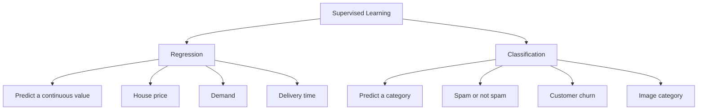
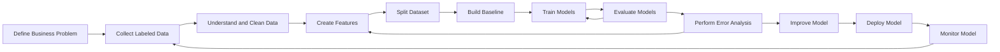
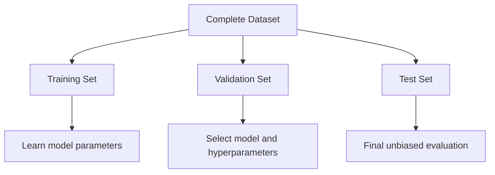
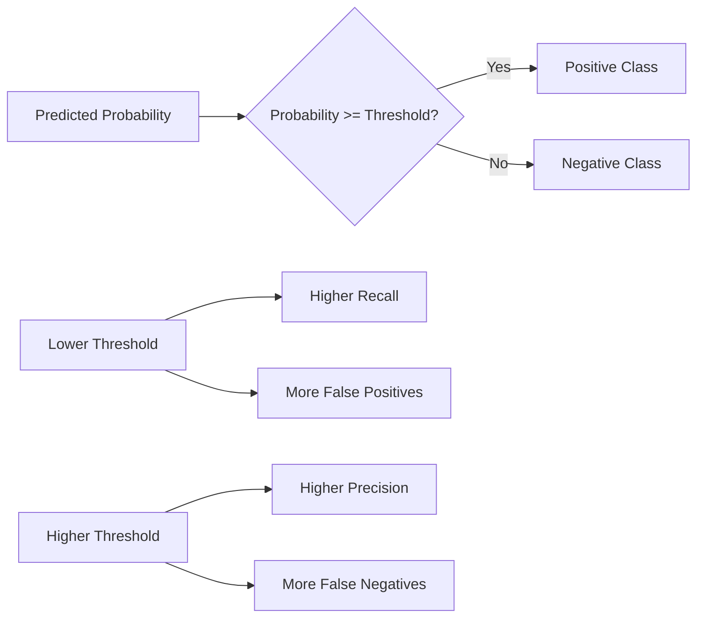
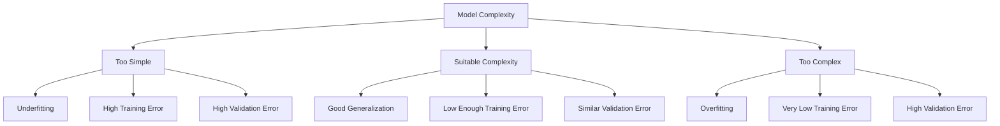
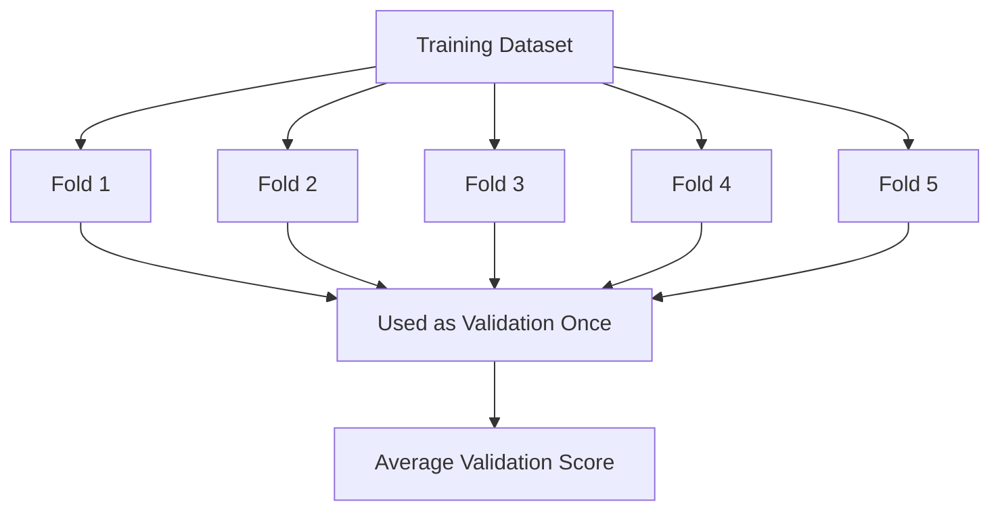
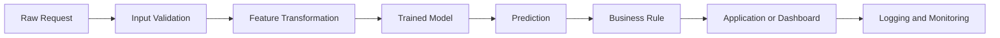
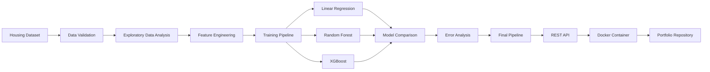

# 001 - Supervised Learning

**Course:** 03 - Machine Learning and Deep Learning
**Module:** Module 06 - Machine Learning
**Content Group:** Supervised Learning
**Roadmap Source:** Machine Learning / Supervised Learning
**Lesson Type:** Machine Learning
**Order in Module:** 001
**Suggested Duration:** 26 minutes

---

## 1. Overview

**Supervised Learning** is a machine learning approach in which a model learns from labeled examples.

Each training example contains:

* Input features, usually represented by $X$
* A known target or label, usually represented by $y$

The model learns a relationship between the input and the expected output:

$$
f(X) \rightarrow y
$$

After training, the model should be able to predict the target for new, unseen data.

Common supervised learning applications include:

* Predicting house prices
* Detecting fraudulent transactions
* Identifying spam emails
* Predicting customer churn
* Classifying medical images
* Estimating delivery times
* Forecasting product demand

A successful supervised learning project requires more than selecting an algorithm. It also depends on:

* Reliable labels
* Relevant features
* Proper dataset splitting
* Suitable evaluation metrics
* Protection against data leakage
* Careful error analysis
* Monitoring after deployment

---

## 2. Learning Objectives

After completing this lesson, you should be able to:

* Explain supervised learning in your own words.
* Distinguish between regression and classification.
* Identify features and targets in a dataset.
* Describe the supervised learning workflow.
* Split data into training, validation, and test sets.
* Create a baseline model.
* Train and compare multiple models.
* Evaluate models on unseen data.
* Select metrics that match the business problem.
* Recognize data leakage, underfitting, and overfitting.
* Create a notebook, model, API, or portfolio artifact.

---

## 3. Core Concept

In supervised learning, the model learns from examples for which the correct answer is already known.

A supervised dataset can be represented as:

$$
D = \left{(x_1,y_1),(x_2,y_2),\ldots,(x_n,y_n)\right}
$$

Where:

* $D$ is the complete dataset.
* $x_i$ is the feature vector of observation $i$.
* $y_i$ is the known target of observation $i$.
* $n$ is the number of observations.

The model attempts to learn a function:

$$
\hat{y} = f(x)
$$

Where:

* $x$ is an input example.
* $y$ is the true target.
* $\hat{y}$ is the model prediction.
* $f$ is the learned prediction function.

The goal is not to memorize the training data. The goal is to **generalize** to new observations.

---

## 4. Features, Targets, and Predictions

### 4.1 Features

Features are the input variables used by the model.

For a house price prediction problem, possible features include:

* Floor area
* Number of bedrooms
* Number of bathrooms
* House age
* Neighborhood
* Distance from the city center
* Parking availability

The complete feature dataset is usually represented by $X$.

A single observation can be represented as:

$$
x_i =
\left[
x_{i1},
x_{i2},
\ldots,
x_{ip}
\right]
$$

Where:

* $i$ identifies the observation.
* $p$ is the number of features.
* $x_{ij}$ is the value of feature $j$ for observation $i$.

### 4.2 Target

The target is the output that the model attempts to predict.

| Problem                   | Target                      |
| ------------------------- | --------------------------- |
| House price prediction    | Sale price                  |
| Customer churn prediction | Churn or no churn           |
| Spam detection            | Spam or not spam            |
| Disease classification    | Disease category            |
| Delivery time prediction  | Number of minutes           |
| Demand forecasting        | Number of products required |

### 4.3 Prediction

A prediction is the output produced by the trained model.

```text
Input:
area = 120 square meters
bedrooms = 3
house_age = 5 years

Prediction:
estimated_price = 210,000 USD
```

---

## 5. Main Types of Supervised Learning

Supervised learning is commonly divided into two main categories:

1. Regression
2. Classification



---

## 6. Regression

Regression predicts a continuous numerical value.

Examples include:

* House prices
* Temperature
* Revenue
* Electricity consumption
* Delivery duration
* Customer lifetime value

A linear regression model can be written as:

$$
\hat{y} = \beta_0 + \beta_1x_1 + \beta_2x_2 + \cdots + \beta_px_p
$$

Where:

* $\hat{y}$ is the predicted value.
* $\beta_0$ is the intercept.
* $\beta_j$ is the coefficient of feature $x_j$.
* $p$ is the number of features.

### Example

```text
Features:
- area
- bedrooms
- bathrooms
- house_age
- district

Target:
- house_price
```

### Common Regression Algorithms

* Linear Regression
* Ridge Regression
* Lasso Regression
* Decision Tree Regressor
* Random Forest Regressor
* Gradient Boosting Regressor
* XGBoost Regressor
* Neural Networks

### Common Regression Metrics

* Mean Absolute Error
* Mean Squared Error
* Root Mean Squared Error
* Mean Absolute Percentage Error
* Coefficient of Determination

---

## 7. Classification

Classification predicts a discrete category or class.

Examples include:

* Spam or not spam
* Fraud or legitimate
* Customer churn or customer stay
* Cat, dog, or bird
* Low, medium, or high risk
* Positive, neutral, or negative sentiment

### 7.1 Binary Classification

Binary classification contains two possible classes.

```text
0 = customer stays
1 = customer churns
```

The model may first predict a probability:

$$
P(y=1 \mid x)
$$

For example:

$$
P(\text{churn}=1 \mid x)=0.82
$$

This means the model estimates an 82% probability that the customer will churn.

### 7.2 Multiclass Classification

Multiclass classification contains more than two possible classes.

```text
0 = cat
1 = dog
2 = bird
3 = fish
```

### 7.3 Multilabel Classification

In multilabel classification, one observation can belong to multiple classes at the same time.

For example, an image may contain:

```text
person
car
traffic light
building
```

### Common Classification Algorithms

* Logistic Regression
* Naive Bayes
* K-Nearest Neighbors
* Decision Tree
* Random Forest
* Support Vector Machine
* Gradient Boosting
* XGBoost
* Neural Networks

### Common Classification Metrics

* Accuracy
* Precision
* Recall
* F1-score
* ROC-AUC
* PR-AUC
* Log Loss

---

## 8. Regression vs. Classification

| Property           | Regression        | Classification                  |
| ------------------ | ----------------- | ------------------------------- |
| Output type        | Continuous number | Discrete category               |
| Example target     | House price       | Fraud or legitimate             |
| Example prediction | 245,000 USD       | Fraud                           |
| Common baseline    | Mean or median    | Majority class                  |
| Common metrics     | MAE, RMSE, $R^2$  | Accuracy, Precision, Recall, F1 |
| Main question      | How much?         | Which class?                    |

A simple decision rule is:

```text
If the target is a continuous numerical value:
    Use regression.

If the target represents a category:
    Use classification.
```

---

## 9. Supervised Learning Workflow



A compact version of the workflow is:

```text
business problem
    -> labeled data
    -> data validation
    -> train-validation-test split
    -> baseline
    -> preprocessing
    -> feature engineering
    -> model training
    -> evaluation
    -> error analysis
    -> deployment
    -> monitoring
```

---

## 10. Step 1: Define the Business Problem

Before training a model, define the decision that the prediction will support.

A weak problem statement:

```text
Build a customer churn model.
```

A stronger problem statement:

```text
Predict which subscription customers are likely to cancel within
the next 30 days so that the retention team can prioritize outreach.
```

A useful business problem definition should identify:

* The prediction target
* The prediction time
* The unit of prediction
* The business action
* The cost of incorrect predictions
* The evaluation metric
* Operational constraints

### Example

```text
Business objective:
Reduce customer churn.

Prediction unit:
One active customer.

Target:
Whether the customer cancels within 30 days.

Model output:
Probability of churn.

Business action:
Contact customers with the highest predicted risk.

Most expensive error:
Failing to identify a customer who will churn.
```

Because missing a customer who will churn is expensive, **recall** may be more important than accuracy.

---

## 11. Step 2: Collect Labeled Data

Supervised learning requires labeled examples.

Labels may come from:

* Historical transactions
* Human annotation
* Sensor measurements
* Business events
* Medical diagnoses
* User behavior
* Experiment outcomes
* Existing databases

### Example Dataset

| area | bedrooms | age | district |  price |
| ---: | -------: | --: | -------- | -----: |
|   85 |        2 |  10 | A        | 145000 |
|  120 |        3 |   5 | B        | 220000 |
|  150 |        4 |   2 | C        | 310000 |
|   70 |        2 |  20 | B        | 110000 |

In this dataset:

```text
Features:
- area
- bedrooms
- age
- district

Target:
- price
```

### Label Quality Questions

Before training, ask:

* Who created the labels?
* How accurate are the labels?
* Are some labels missing?
* Are labels delayed?
* Has the label definition changed?
* Do the labels contain human bias?
* Are rare cases represented?
* Could a label include future information?

Poor labels create an upper limit on model quality.

---

## 12. Step 3: Split the Dataset

The dataset should be divided before serious model experimentation.

Typical subsets include:

* Training set
* Validation set
* Test set



### 12.1 Training Set

The training set is used to learn model parameters.

Examples include:

* Regression coefficients
* Decision tree splits
* Neural network weights

### 12.2 Validation Set

The validation set is used to:

* Compare models
* Tune hyperparameters
* Select features
* Select classification thresholds
* Make modeling decisions

### 12.3 Test Set

The test set is used for final evaluation after model selection is complete.

### Common Split Ratio

A common split is:

$$
70% \text{ training}
+
15% \text{ validation}
+
15% \text{ test}
$$

Another common split is:

$$
80% \text{ training}
+
20% \text{ test}
$$

When cross-validation is used, a separate validation set may not always be necessary.

---

## 13. Random, Time-Based, and Group-Based Splits

### 13.1 Random Split

A random split is suitable when observations are independent and similarly distributed.

```python
from sklearn.model_selection import train_test_split

X_train, X_test, y_train, y_test = train_test_split(
    X,
    y,
    test_size=0.20,
    random_state=42
)
```

### 13.2 Time-Based Split

A time-based split is more appropriate when the model predicts future events.

```text
Training period:
January 2024 to December 2025

Validation period:
January 2026 to March 2026

Test period:
April 2026 to June 2026
```

Do not randomly mix future observations into the training data when the production model must predict the future.

### 13.3 Group-Based Split

A group-based split is necessary when several rows belong to the same entity.

Examples include:

* Multiple images from the same patient
* Multiple transactions from the same customer
* Multiple measurements from the same machine
* Multiple documents from the same author

Rows from the same group should usually remain in one subset.

Otherwise, the model may indirectly see the same entity in both training and test data.

---

## 14. Baseline Models

A baseline is a simple reference model.

Without a baseline, it is difficult to determine whether a complex model provides real value.

### 14.1 Regression Baselines

Common regression baselines include:

* Predicting the mean target
* Predicting the median target
* Training a simple Linear Regression model

```python
from sklearn.dummy import DummyRegressor

baseline = DummyRegressor(strategy="mean")
baseline.fit(X_train, y_train)

baseline_predictions = baseline.predict(X_test)
```

### 14.2 Classification Baselines

Common classification baselines include:

* Predicting the majority class
* Predicting according to the class distribution
* Training a simple Logistic Regression model

```python
from sklearn.dummy import DummyClassifier

baseline = DummyClassifier(strategy="most_frequent")
baseline.fit(X_train, y_train)

baseline_predictions = baseline.predict(X_test)
```

### Why Baselines Matter

Suppose a classifier achieves 92% accuracy.

However, imagine that 92% of the observations belong to the negative class.

A model that always predicts the negative class also achieves:

$$
\text{Accuracy}=92%
$$

Therefore, the more complex model may provide no useful improvement.

---

## 15. Model Training

Model training means finding model parameters that reduce prediction error on the training data.

The optimization objective can be represented as:

$$
\theta^* = \underset{\theta}{\operatorname{argmin}} \frac{1}{n} \sum_{i=1}^{n} L\left(y_i,f_{\theta}(x_i)\right)
$$

Where:

* $\theta$ represents the model parameters.
* $\theta^*$ represents the best learned parameters.
* $f_{\theta}$ is the prediction model.
* $L$ is the loss function.
* $y_i$ is the true target.
* $f_{\theta}(x_i)$ is the prediction.

The training process attempts to minimize the average loss.

---

## 16. Regression Loss Functions

### 16.1 Mean Squared Error

Mean Squared Error is defined as:

$$
\operatorname{MSE} = \frac{1}{n} \sum_{i=1}^{n} \left(y_i-\hat{y}_i\right)^2
$$

Large errors receive a stronger penalty because the error is squared.

### 16.2 Mean Absolute Error

Mean Absolute Error is defined as:

$$
\operatorname{MAE} = \frac{1}{n} \sum_{i=1}^{n} \left|y_i-\hat{y}_i\right|
$$

MAE is usually easier to interpret because it has the same unit as the target.

---

## 17. Classification Loss Function

For binary classification, a common loss function is binary cross-entropy, also called Log Loss.

$$
\operatorname{LogLoss} = -\frac{1}{n} \sum_{i=1}^{n} \left[ y_i\log(p_i) + (1-y_i)\log(1-p_i) \right]
$$

Where:

* $y_i$ is the true binary label.
* $p_i$ is the predicted probability of the positive class.
* $n$ is the number of observations.

A confident incorrect prediction receives a large penalty.

---

## 18. Complete Regression Example

The following example creates a house price prediction pipeline.

```python
import pandas as pd

from sklearn.compose import ColumnTransformer
from sklearn.dummy import DummyRegressor
from sklearn.ensemble import RandomForestRegressor
from sklearn.impute import SimpleImputer
from sklearn.linear_model import LinearRegression
from sklearn.metrics import (
    mean_absolute_error,
    mean_squared_error,
    r2_score,
)
from sklearn.model_selection import train_test_split
from sklearn.pipeline import Pipeline
from sklearn.preprocessing import OneHotEncoder

data = pd.DataFrame(
    {
        "area": [
            80, 95, 120, 150, 70,
            110, 135, 160, 100, 145,
            75, 125, 155, 90, 115,
            130, 170, 85, 105, 140
        ],
        "bedrooms": [
            2, 3, 3, 4, 2,
            3, 4, 5, 3, 4,
            2, 3, 4, 2, 3,
            4, 5, 2, 3, 4
        ],
        "age": [
            12, 8, 4, 2, 20,
            6, 3, 1, 10, 5,
            18, 7, 2, 15, 8,
            4, 1, 14, 9, 3
        ],
        "district": [
            "A", "B", "A", "C", "B",
            "A", "C", "C", "B", "A",
            "B", "A", "C", "B", "A",
            "C", "C", "A", "B", "C"
        ],
        "price": [
            140000, 175000, 225000, 320000, 110000,
            210000, 295000, 360000, 185000, 285000,
            120000, 235000, 330000, 150000, 215000,
            280000, 390000, 155000, 195000, 305000
        ],
    }
)

X = data.drop(columns="price")
y = data["price"]

numeric_features = [
    "area",
    "bedrooms",
    "age",
]

categorical_features = [
    "district",
]

numeric_pipeline = Pipeline(
    steps=[
        (
            "imputer",
            SimpleImputer(strategy="median"),
        ),
    ]
)

categorical_pipeline = Pipeline(
    steps=[
        (
            "imputer",
            SimpleImputer(strategy="most_frequent"),
        ),
        (
            "encoder",
            OneHotEncoder(handle_unknown="ignore"),
        ),
    ]
)

preprocessor = ColumnTransformer(
    transformers=[
        (
            "numeric",
            numeric_pipeline,
            numeric_features,
        ),
        (
            "categorical",
            categorical_pipeline,
            categorical_features,
        ),
    ]
)

X_train, X_test, y_train, y_test = train_test_split(
    X,
    y,
    test_size=0.25,
    random_state=42,
)

baseline_model = DummyRegressor(strategy="mean")

linear_model = Pipeline(
    steps=[
        ("preprocessor", preprocessor),
        ("regressor", LinearRegression()),
    ]
)

random_forest_model = Pipeline(
    steps=[
        ("preprocessor", preprocessor),
        (
            "regressor",
            RandomForestRegressor(
                n_estimators=200,
                random_state=42,
            ),
        ),
    ]
)

models = {
    "Mean Baseline": baseline_model,
    "Linear Regression": linear_model,
    "Random Forest": random_forest_model,
}

for model_name, model in models.items():
    model.fit(X_train, y_train)

    predictions = model.predict(X_test)

    mae = mean_absolute_error(
        y_test,
        predictions,
    )

    rmse = mean_squared_error(
        y_test,
        predictions,
    ) ** 0.5

    r2 = r2_score(
        y_test,
        predictions,
    )

    print(f"\nModel: {model_name}")
    print(f"MAE: {mae:,.2f}")
    print(f"RMSE: {rmse:,.2f}")
    print(f"R-squared: {r2:.3f}")
```

### Why Use a Pipeline?

A pipeline ensures that:

* Missing-value handling is applied consistently.
* Categorical encoding is learned from training data only.
* The same transformations are used during inference.
* Preprocessing and modeling can be saved together.
* Data leakage is less likely.

---

## 19. Complete Classification Example

The following example trains a customer churn classifier.

```python
import pandas as pd

from sklearn.compose import ColumnTransformer
from sklearn.impute import SimpleImputer
from sklearn.linear_model import LogisticRegression
from sklearn.metrics import (
    accuracy_score,
    classification_report,
    confusion_matrix,
    roc_auc_score,
)
from sklearn.model_selection import train_test_split
from sklearn.pipeline import Pipeline
from sklearn.preprocessing import OneHotEncoder, StandardScaler

data = pd.DataFrame(
    {
        "monthly_spend": [
            20, 80, 45, 100, 35,
            70, 25, 95, 40, 85,
            30, 110, 50, 75, 28,
            90, 42, 105, 32, 88
        ],
        "support_tickets": [
            0, 5, 1, 6, 2,
            4, 0, 7, 1, 5,
            1, 8, 2, 4, 0,
            6, 1, 7, 0, 5
        ],
        "months_active": [
            24, 3, 15, 2, 10,
            5, 30, 1, 18, 4,
            20, 1, 12, 6, 28,
            3, 16, 2, 25, 4
        ],
        "contract": [
            "annual", "monthly", "annual", "monthly", "monthly",
            "monthly", "annual", "monthly", "annual", "monthly",
            "annual", "monthly", "annual", "monthly", "annual",
            "monthly", "annual", "monthly", "annual", "monthly"
        ],
        "churn": [
            0, 1, 0, 1, 0,
            1, 0, 1, 0, 1,
            0, 1, 0, 1, 0,
            1, 0, 1, 0, 1
        ],
    }
)

X = data.drop(columns="churn")
y = data["churn"]

numeric_features = [
    "monthly_spend",
    "support_tickets",
    "months_active",
]

categorical_features = [
    "contract",
]

numeric_pipeline = Pipeline(
    steps=[
        (
            "imputer",
            SimpleImputer(strategy="median"),
        ),
        (
            "scaler",
            StandardScaler(),
        ),
    ]
)

categorical_pipeline = Pipeline(
    steps=[
        (
            "imputer",
            SimpleImputer(strategy="most_frequent"),
        ),
        (
            "encoder",
            OneHotEncoder(handle_unknown="ignore"),
        ),
    ]
)

preprocessor = ColumnTransformer(
    transformers=[
        (
            "numeric",
            numeric_pipeline,
            numeric_features,
        ),
        (
            "categorical",
            categorical_pipeline,
            categorical_features,
        ),
    ]
)

model = Pipeline(
    steps=[
        ("preprocessor", preprocessor),
        (
            "classifier",
            LogisticRegression(random_state=42),
        ),
    ]
)

X_train, X_test, y_train, y_test = train_test_split(
    X,
    y,
    test_size=0.30,
    random_state=42,
    stratify=y,
)

model.fit(X_train, y_train)

predicted_classes = model.predict(X_test)

predicted_probabilities = model.predict_proba(
    X_test
)[:, 1]

accuracy = accuracy_score(
    y_test,
    predicted_classes,
)

roc_auc = roc_auc_score(
    y_test,
    predicted_probabilities,
)

print(f"Accuracy: {accuracy:.3f}")
print(f"ROC-AUC: {roc_auc:.3f}")

print(
    "\nConfusion Matrix:\n",
    confusion_matrix(
        y_test,
        predicted_classes,
    ),
)

print(
    "\nClassification Report:\n",
    classification_report(
        y_test,
        predicted_classes,
    ),
)
```

---

## 20. Regression Evaluation Metrics

### 20.1 Mean Absolute Error

$$
\operatorname{MAE} = \frac{1}{n} \sum_{i=1}^{n} \left|y_i-\hat{y}_i\right|
$$

MAE measures the average absolute prediction error.

Example:

```text
MAE = 12,000 USD
```

This means predictions differ from actual values by approximately 12,000 USD on average.

### 20.2 Mean Squared Error

$$
\operatorname{MSE} = \frac{1}{n} \sum_{i=1}^{n} \left(y_i-\hat{y}_i\right)^2
$$

MSE gives larger errors more influence because the errors are squared.

### 20.3 Root Mean Squared Error

$$
\operatorname{RMSE} = \sqrt{ \frac{1}{n} \sum_{i=1}^{n} \left(y_i-\hat{y}_i\right)^2 }
$$

RMSE has the same unit as the target.

It penalizes large prediction errors more strongly than MAE.

### 20.4 Mean Absolute Percentage Error

$$
\operatorname{MAPE} = \frac{100}{n} \sum_{i=1}^{n} \left| \frac{y_i-\hat{y}_i}{y_i} \right|
$$

MAPE expresses error as a percentage.

However, MAPE can behave poorly when actual values are zero or close to zero.

### 20.5 Coefficient of Determination

The coefficient of determination is represented by $R^2$.

$$
R^2 = ## 1 \frac{ \sum_{i=1}^{n} \left(y_i-\hat{y}*i\right)^2 }{ \sum*{i=1}^{n} \left(y_i-\bar{y}\right)^2 }
$$

Where $\bar{y}$ is the mean of the true targets:

$$
\bar{y} = \frac{1}{n} \sum_{i=1}^{n} y_i
$$

General interpretation:

* $R^2=1$: perfect predictions
* $R^2=0$: similar to predicting the target mean
* $R^2<0$: worse than predicting the target mean

A high $R^2$ does not automatically mean the model is appropriate for production.

---

## 21. Classification Evaluation Metrics

### 21.1 Confusion Matrix

For binary classification:

|                 | Predicted Positive | Predicted Negative |
| --------------- | -----------------: | -----------------: |
| Actual Positive |      True Positive |     False Negative |
| Actual Negative |     False Positive |      True Negative |

Abbreviations:

* $TP$: True Positive
* $TN$: True Negative
* $FP$: False Positive
* $FN$: False Negative

### 21.2 Accuracy

$$
\operatorname{Accuracy} = \frac{TP+TN} {TP+TN+FP+FN}
$$

Accuracy measures the proportion of all predictions that are correct.

Accuracy is most useful when:

* Classes are reasonably balanced.
* False positives and false negatives have similar costs.

### 21.3 Precision

$$
\operatorname{Precision} = \frac{TP} {TP+FP}
$$

Precision answers:

> Of all observations predicted as positive, how many were actually positive?

Precision is important when false positives are expensive.

### 21.4 Recall

$$
\operatorname{Recall} = \frac{TP} {TP+FN}
$$

Recall answers:

> Of all actual positive observations, how many did the model identify?

Recall is important when false negatives are expensive.

### 21.5 Specificity

$$
\operatorname{Specificity} = \frac{TN} {TN+FP}
$$

Specificity measures the proportion of actual negative observations correctly identified.

### 21.6 F1-Score

$$
F_1 = 2 \times \frac{ \operatorname{Precision} \times \operatorname{Recall} }{ \operatorname{Precision} + \operatorname{Recall} }
$$

F1-score is the harmonic mean of precision and recall.

It is useful when both false positives and false negatives matter.

### 21.7 Balanced Accuracy

$$
\operatorname{BalancedAccuracy} = \frac{ \operatorname{Recall} + \operatorname{Specificity} }{2}
$$

Balanced accuracy can be more informative than standard accuracy for imbalanced datasets.

### 21.8 ROC-AUC

ROC-AUC measures how well the model ranks positive observations above negative observations across multiple thresholds.

A value near $1$ indicates strong ranking performance.

A value near $0.5$ indicates performance similar to random ranking.

### 21.9 PR-AUC

PR-AUC summarizes the precision-recall relationship across multiple thresholds.

It is often useful when the positive class is rare.

Examples include:

* Fraud detection
* Disease screening
* Equipment failure
* Security incident detection

---

## 22. Choosing the Correct Metric

The metric should reflect the business cost of incorrect predictions.

| Business Problem        | Expensive Error            | Possible Metric             |
| ----------------------- | -------------------------- | --------------------------- |
| Fraud detection         | Missing real fraud         | Recall, PR-AUC              |
| Spam filtering          | Marking valid mail as spam | Precision                   |
| Disease screening       | Missing a sick patient     | Recall                      |
| House price prediction  | Large monetary error       | MAE or RMSE                 |
| Demand forecasting      | Relative forecast error    | WAPE or MAPE                |
| Balanced classification | Incorrect class            | Accuracy or Macro F1        |
| Search ranking          | Bad result ordering        | Precision at K, Recall at K |

Do not select a metric only because it is commonly used.

A useful metric should represent:

* Business cost
* Class imbalance
* Ranking quality
* Error severity
* Resource capacity
* Prediction horizon

---

## 23. Prediction Thresholds

Many classification models return a probability rather than a final class.

For example:

$$
P(\text{churn}=1 \mid x)=0.73
$$

A threshold converts the probability into a class.

For threshold $t$:

$$
\hat{y} = \begin{cases} 1, & \text{if } p \geq t \ 0, & \text{if } p < t \end{cases}
$$

For example, when $t=0.5$:

```text
If probability >= 0.50:
    predict churn
otherwise:
    predict no churn
```



A threshold of $0.5$ is not automatically optimal.

The threshold should be selected using:

* Validation data
* Business costs
* Precision-recall trade-offs
* Intervention capacity
* Expected number of positive predictions

---

## 24. Generalization

Generalization is the model's ability to perform well on unseen data.

A model that performs well only on training data is not useful.

### Good Generalization

```text
Training accuracy:   91%
Validation accuracy: 89%
Test accuracy:       88%
```

### Possible Overfitting

```text
Training accuracy:   99%
Validation accuracy: 74%
Test accuracy:       72%
```

### Possible Underfitting

```text
Training accuracy:   62%
Validation accuracy: 60%
Test accuracy:       59%
```

---

## 25. Underfitting and Overfitting



### 25.1 Underfitting

Underfitting occurs when a model is too simple to capture important patterns.

Possible solutions include:

* Adding useful features
* Using a more flexible model
* Reducing excessive regularization
* Training longer
* Improving data quality

### 25.2 Overfitting

Overfitting occurs when a model learns training-specific noise.

Possible solutions include:

* Collecting more data
* Simplifying the model
* Adding regularization
* Removing irrelevant features
* Using cross-validation
* Limiting decision tree depth
* Applying early stopping
* Improving the split strategy

---

## 26. Bias and Variance

Prediction error can be understood through bias and variance.

A simplified decomposition is:

$$
\operatorname{ExpectedError} = \operatorname{Bias}^2 + \operatorname{Variance} + \operatorname{IrreducibleNoise}
$$

### High Bias

A high-bias model is too simple.

Typical result:

* High training error
* High validation error
* Underfitting

### High Variance

A high-variance model is too sensitive to the training dataset.

Typical result:

* Very low training error
* Much higher validation error
* Overfitting

The goal is to find a suitable balance between bias and variance.

---

## 27. Data Leakage

Data leakage occurs when the model receives information during training that would not be available during real prediction.

Leakage often produces unrealistically high validation or test scores.

### 27.1 Future Information Leakage

Suppose the goal is to predict customer churn.

A feature such as:

```text
account_closed_date
```

directly reveals the future outcome and must not be used.

### 27.2 Preprocessing Leakage

Incorrect approach:

```python
from sklearn.preprocessing import StandardScaler

scaler = StandardScaler()

scaled_X = scaler.fit_transform(X)

X_train, X_test, y_train, y_test = train_test_split(
    scaled_X,
    y,
    test_size=0.20,
    random_state=42,
)
```

The scaler learns information from the complete dataset, including the test set.

Better approach:

```python
X_train, X_test, y_train, y_test = train_test_split(
    X,
    y,
    test_size=0.20,
    random_state=42,
)

scaler.fit(X_train)

X_train_scaled = scaler.transform(X_train)
X_test_scaled = scaler.transform(X_test)
```

Recommended approach:

```python
from sklearn.pipeline import Pipeline
from sklearn.preprocessing import StandardScaler
from sklearn.linear_model import LogisticRegression

model = Pipeline(
    steps=[
        ("scaler", StandardScaler()),
        ("classifier", LogisticRegression()),
    ]
)
```

### 27.3 Entity Leakage

Suppose several medical images belong to the same patient.

If images from one patient appear in both training and test sets, the model may recognize patient-specific patterns.

This produces an unrealistic evaluation.

### Leakage Prevention Checklist

* Split data before fitting transformations.
* Use machine learning pipelines.
* Remove future information.
* Use time-based splits for future prediction.
* Use group-based splits when entities repeat.
* Remove duplicates before splitting.
* Investigate suspiciously high scores.
* Confirm that every feature is available during inference.

---

## 28. Feature Engineering

Feature engineering transforms raw data into useful model inputs.

### Example 1: Age

```text
Raw feature:
date_of_birth

Engineered feature:
age
```

A simplified age calculation is:

$$
\operatorname{Age} = ## \operatorname{CurrentYear} \operatorname{BirthYear}
$$

### Example 2: Average Order Value

$$
\operatorname{AverageOrderValue} = \frac{ \operatorname{TotalSpend} }{ \operatorname{NumberOfOrders} }
$$

### Example 3: Time Features

```text
Raw feature:
order_timestamp

Engineered features:
- hour_of_day
- day_of_week
- month
- is_weekend
```

### Common Feature Engineering Techniques

* Missing-value indicators
* Logarithmic transformations
* Interaction features
* Ratios
* Aggregations
* Rolling-window statistics
* Text vectorization
* Categorical encoding
* Numerical scaling
* Domain-specific transformations

Feature engineering must use only information available at prediction time.

---

## 29. Cross-Validation

Cross-validation evaluates a model using several train-validation splits.

In $k$-fold cross-validation:

1. Divide the training data into $k$ folds.
2. Train on $k-1$ folds.
3. Validate on the remaining fold.
4. Repeat until each fold has been used for validation.
5. Calculate the average score.

The average cross-validation score is:

$$
\operatorname{CVScore} = \frac{1}{k} \sum_{j=1}^{k} s_j
$$

Where:

* $k$ is the number of folds.
* $s_j$ is the validation score from fold $j$.



Example:

```python
from sklearn.model_selection import cross_val_score

scores = cross_val_score(
    model,
    X,
    y,
    cv=5,
    scoring="neg_mean_absolute_error",
)

mae_scores = -scores

print("MAE for each fold:", mae_scores)
print("Average MAE:", mae_scores.mean())
print("MAE standard deviation:", mae_scores.std())
```

Standard random cross-validation may be inappropriate for:

* Time-series data
* Grouped data
* Repeated measurements
* Spatially correlated data

The validation strategy should match the production environment.

---

## 30. Error Analysis

A single evaluation metric does not explain why the model fails.

Error analysis studies individual mistakes and performance across meaningful groups.

### 30.1 Regression Error

The residual for observation $i$ is:

$$
e_i = y_i-\hat{y}_i
$$

The absolute error is:

$$
\left|e_i\right| = \left|y_i-\hat{y}_i\right|
$$

### Regression Error Table

| Actual Price | Predicted Price | Absolute Error | Segment        |
| -----------: | --------------: | -------------: | -------------- |
|       150000 |          145000 |           5000 | Small house    |
|       300000 |          245000 |          55000 | Luxury house   |
|       210000 |          205000 |           5000 | Standard house |

The model appears to perform poorly for luxury houses.

### Classification Error Table

| Customer | Actual | Predicted | Probability | Notes                   |
| -------- | -----: | --------: | ----------: | ----------------------- |
| A        |      1 |         0 |        0.42 | High support usage      |
| B        |      0 |         1 |        0.81 | Temporary spending drop |
| C        |      1 |         0 |        0.34 | New customer            |

### Error Analysis Questions

* Which groups have the largest errors?
* Are some labels incorrect?
* Are important features missing?
* Does the model fail on rare cases?
* Does performance change over time?
* Are errors concentrated in one region?
* Are errors related to missing values?
* Are predicted probabilities poorly calibrated?
* Would a different threshold improve business value?

### Useful Error Segments

* Geographic region
* Customer type
* Product category
* Device type
* Price range
* Prediction confidence
* Time period
* Missing-data pattern

---

## 31. Model Comparison

A practical project should compare at least:

* One simple baseline
* One interpretable model
* One more flexible model

| Model             | Validation MAE | Test MAE | Training Time | Interpretability |
| ----------------- | -------------: | -------: | ------------: | ---------------- |
| Mean baseline     |          52000 |    54000 |      Very low | High             |
| Linear Regression |          31000 |    33000 |           Low | High             |
| Random Forest     |          23000 |    25000 |        Medium | Medium           |
| XGBoost           |          21000 |    24000 |        Medium | Medium           |

The best model is not always the model with the lowest error.

Other important considerations include:

* Prediction latency
* Memory usage
* Interpretability
* Maintenance cost
* Training time
* Data requirements
* Stability
* Fairness
* Ease of deployment

---

## 32. Hyperparameters

Model parameters are learned from training data.

Examples include:

* Regression coefficients
* Neural network weights
* Decision tree split values

Hyperparameters are selected before or during model training.

Examples include:

* Number of trees
* Maximum tree depth
* Learning rate
* Regularization strength
* Number of neighbors
* Batch size

```python
from sklearn.ensemble import RandomForestRegressor

model = RandomForestRegressor(
    n_estimators=300,
    max_depth=10,
    min_samples_leaf=3,
    random_state=42,
)
```

Hyperparameters should be tuned using training and validation data.

The test set should not be used for hyperparameter tuning.

---

## 33. Regularization

Regularization reduces overfitting by penalizing model complexity.

### 33.1 L1 Regularization

L1 regularization adds the absolute value of coefficients to the loss:

$$
J(\beta) = \operatorname{Loss}(\beta) + \lambda \sum_{j=1}^{p} \left|\beta_j\right|
$$

L1 regularization can reduce some coefficients to exactly zero.

It may therefore perform feature selection.

### 33.2 L2 Regularization

L2 regularization adds squared coefficients to the loss:

$$
J(\beta) = \operatorname{Loss}(\beta) + \lambda \sum_{j=1}^{p} \beta_j^2
$$

L2 regularization usually reduces coefficient size without forcing many coefficients to zero.

Where:

* $J(\beta)$ is the regularized objective.
* $\lambda$ controls regularization strength.
* Larger $\lambda$ creates a stronger penalty.
* $\beta_j$ is a model coefficient.

---

## 34. Model Interpretability

Interpretability helps explain model behavior.

Common interpretation methods include:

* Linear model coefficients
* Decision tree visualization
* Feature importance
* Permutation importance
* Partial dependence plots
* SHAP values
* Local prediction explanations

### Important Warning

Feature importance does not prove causation.

A feature may be predictive because it is:

* Correlated with the real cause
* A proxy for another variable
* A result of historical policy
* A leakage feature
* Related to data collection behavior

Use interpretation methods to understand model behavior, not to make unsupported causal claims.

---

## 35. From Model to Deployment

A trained model becomes useful when it is integrated into a real workflow.



Possible deployment formats include:

* Batch prediction jobs
* REST APIs
* Streaming services
* Mobile models
* Dashboards
* Database scoring pipelines
* Scheduled notebooks
* Docker services

### Example API Response

```json
{
  "customer_id": "C1024",
  "churn_probability": 0.82,
  "predicted_class": "high_risk",
  "model_version": "churn_model_v3"
}
```

---

## 36. Monitoring After Deployment

Model evaluation does not end after deployment.

Important monitoring signals include:

* Input feature distributions
* Missing-value rates
* Prediction distributions
* Model latency
* API failure rate
* Business outcomes
* Accuracy after labels become available
* Performance across segments
* Data drift
* Concept drift

### 36.1 Data Drift

Data drift occurs when the distribution of input features changes.

Example:

```text
Training environment:
Most customers used desktop devices.

Production environment:
Most customers now use mobile devices.
```

### 36.2 Concept Drift

Concept drift occurs when the relationship between features and targets changes.

Example:

```text
Historical relationship:
High support usage predicted customer churn.

New relationship:
A new support program improves retention,
so support usage no longer strongly predicts churn.
```

---

## 37. Practical Exercise

### House Price Prediction

Create a notebook that predicts house prices.

### Suggested Dataset Columns

```text
area
bedrooms
bathrooms
house_age
district
distance_to_center
has_parking
price
```

### Required Tasks

1. Load and inspect the dataset.
2. Identify numerical and categorical features.
3. Define `price` as the target.
4. Check missing values and duplicate rows.
5. Explore the target distribution.
6. Split the data into training and test sets.
7. Create a mean or median baseline.
8. Train a Linear Regression model.
9. Train a Random Forest model.
10. Optionally train an XGBoost model.
11. Compare MAE, RMSE, and $R^2$.
12. Plot actual values against predicted values.
13. Inspect the largest prediction errors.
14. Compare performance across price ranges.
15. Record at least one model limitation.
16. Suggest the next feature or experiment.

---

## 38. Suggested Notebook Structure

```text
01. Business Problem
02. Dataset Description
03. Data Validation
04. Exploratory Data Analysis
05. Train-Test Split
06. Baseline Model
07. Preprocessing Pipeline
08. Linear Regression
09. Random Forest
10. XGBoost
11. Model Comparison
12. Error Analysis
13. Final Model
14. Limitations
15. Next Steps
```

---

## 39. Suggested Visualizations

Useful visualizations include:

* Target distribution histogram
* Missing-value chart
* Correlation heatmap
* Area versus price scatter plot
* Price by district box plot
* Actual versus predicted plot
* Residual plot
* Feature importance chart
* Error by price range
* Model comparison chart

### 39.1 Actual vs. Predicted Plot

```python
import matplotlib.pyplot as plt

plt.figure(figsize=(7, 5))

plt.scatter(
    y_test,
    predictions,
    alpha=0.7,
)

minimum = min(
    y_test.min(),
    predictions.min(),
)

maximum = max(
    y_test.max(),
    predictions.max(),
)

plt.plot(
    [minimum, maximum],
    [minimum, maximum],
    linestyle="--",
)

plt.xlabel("Actual Price")
plt.ylabel("Predicted Price")
plt.title("Actual vs. Predicted House Prices")
plt.tight_layout()
plt.show()
```

Points close to the diagonal line represent accurate predictions.

### 39.2 Residual Plot

```python
residuals = y_test - predictions

plt.figure(figsize=(7, 5))

plt.scatter(
    predictions,
    residuals,
    alpha=0.7,
)

plt.axhline(
    0,
    linestyle="--",
)

plt.xlabel("Predicted Price")
plt.ylabel("Residual")
plt.title("Residual Plot")
plt.tight_layout()
plt.show()
```

A useful residual plot should not show an obvious systematic pattern.

---

## 40. Common Mistakes

### 40.1 Data Leakage

Problem:

```text
Information from the validation or test set influences training.
```

Prevention:

* Split data early.
* Use pipelines.
* Fit transformations on training data only.
* Remove future information.

### 40.2 Choosing the Wrong Metric

Problem:

```text
Using accuracy for a highly imbalanced fraud dataset.
```

Better approach:

* Examine precision, recall, F1, and PR-AUC.
* Connect the metric to the business cost of errors.

### 40.3 Using a Complex Model Without a Baseline

Problem:

```text
Training XGBoost without checking whether it beats
a mean, median, majority-class, or linear baseline.
```

Better approach:

* Build the simplest relevant baseline first.

### 40.4 Evaluating on Training Data

Problem:

```text
Reporting only performance on data used during training.
```

Better approach:

* Evaluate on unseen validation and test data.

### 40.5 Repeatedly Using the Test Set

Problem:

```text
Testing every model on the test set and selecting
the model with the best test result.
```

The test set then becomes part of model selection.

Better approach:

* Tune models using validation data.
* Use the test set only for final evaluation.

### 40.6 Ignoring Class Imbalance

Problem:

```text
The model predicts only the majority class
but still obtains high accuracy.
```

Better approach:

* Inspect class counts.
* Use suitable metrics.
* Consider class weights.
* Consider resampling.
* Tune the classification threshold.

### 40.7 Ignoring Label Quality

Problem:

```text
Assuming every historical label is correct.
```

Better approach:

* Audit random examples.
* Check inconsistent definitions.
* Estimate annotation error.
* Review uncertain cases.

### 40.8 Ignoring the Production Context

Problem:

```text
Using features that will not be available
when the model makes predictions.
```

Better approach:

* Define the prediction timestamp.
* Verify feature availability.
* Reproduce production conditions during evaluation.

---

## 41. Assumptions and Caveats

Supervised learning assumes that historical labeled examples provide useful information about future observations.

This assumption may fail when:

* User behavior changes
* Business policies change
* Sensors are replaced
* Label definitions change
* A new product is introduced
* Economic conditions change
* The user population changes
* The data collection process changes

Other important caveats include:

* Correlation does not imply causation.
* High offline performance does not guarantee business value.
* More features do not always improve performance.
* A more complex model is not always better.
* A model may perform differently across user groups.
* Predictions can reproduce bias in historical data.
* A static model may become outdated.
* An accurate model may still be too slow or expensive to deploy.

---

## 42. Knowledge Check

### Question 1

What are the two main types of supervised learning?

<details>
<summary>Answer</summary>

Regression and classification.

</details>

### Question 2

What is the difference between a feature and a target?

<details>
<summary>Answer</summary>

A feature is an input variable used by the model. A target is the output that the model attempts to predict.

</details>

### Question 3

Why should the test set not be used repeatedly?

<details>
<summary>Answer</summary>

Repeatedly using the test set influences model selection and makes the final reported performance overly optimistic.

</details>

### Question 4

Why can accuracy be misleading?

<details>
<summary>Answer</summary>

In an imbalanced dataset, a model can obtain high accuracy by predicting only the majority class.

</details>

### Question 5

What is data leakage?

<details>
<summary>Answer</summary>

Data leakage occurs when training uses information that would not be available when the model makes real predictions.

</details>

### Question 6

Why is a baseline model necessary?

<details>
<summary>Answer</summary>

A baseline shows whether a more complex model provides meaningful improvement over a simple prediction strategy.

</details>

### Question 7

What is overfitting?

<details>
<summary>Answer</summary>

Overfitting occurs when a model learns training-specific patterns or noise and performs poorly on unseen data.

</details>

### Question 8

Which metric should be prioritized when false negatives are very expensive?

<details>
<summary>Answer</summary>

Recall is often prioritized because it measures how many actual positive cases the model successfully identifies.

</details>

---

## 43. Completion Checklist

* [ ] I can explain supervised learning in one to two minutes.
* [ ] I can distinguish regression from classification.
* [ ] I can identify features and targets in a dataset.
* [ ] I can create training, validation, and test subsets.
* [ ] I understand why the test set should remain untouched.
* [ ] I can build a simple baseline model.
* [ ] I can train at least one additional model.
* [ ] I can select a metric that matches the business problem.
* [ ] I can recognize data leakage.
* [ ] I can explain underfitting and overfitting.
* [ ] I understand the basic bias-variance trade-off.
* [ ] I can perform basic error analysis.
* [ ] I have created a notebook, chart, model, API, or portfolio note.
* [ ] I have documented at least one assumption or limitation.
* [ ] I have identified the next feature or experiment to try.

---

## 44. Related Learning Outcome

After completing this topic, you should be able to:

> Train, compare, and evaluate supervised and unsupervised machine learning models using thoughtful feature engineering, suitable validation strategies, and business-aligned metrics.

---

## 45. Related Project

### Mini Project: House Price Prediction

Build an end-to-end machine learning project containing:

* Business problem definition
* Exploratory data analysis
* Missing-value handling
* Categorical feature encoding
* Feature engineering
* Baseline model
* Linear Regression
* Random Forest
* XGBoost
* Cross-validation
* Metric comparison
* Error analysis
* Model interpretation
* Saved model pipeline
* Prediction API
* README documentation

### Suggested Architecture



---

## 46. Portfolio Artifact

A strong portfolio repository could use the following structure:

```text
house-price-prediction/
│
├── data/
│   ├── raw/
│   └── processed/
│
├── notebooks/
│   ├── 01_eda.ipynb
│   ├── 02_feature_engineering.ipynb
│   └── 03_model_comparison.ipynb
│
├── src/
│   ├── preprocess.py
│   ├── train.py
│   ├── evaluate.py
│   └── predict.py
│
├── models/
│   └── house_price_pipeline.joblib
│
├── api/
│   └── main.py
│
├── tests/
│   └── test_prediction.py
│
├── Dockerfile
├── requirements.txt
└── README.md
```

The README should explain:

* The business problem
* The dataset
* The target variable
* The evaluation metric
* The baseline
* The compared models
* The final results
* Important errors
* Known limitations
* Reproduction instructions

---

## 47. Summary

**Supervised Learning** trains models using labeled examples.

The two main supervised learning tasks are:

* **Regression:** predicting continuous numerical values
* **Classification:** predicting discrete categories

A reliable supervised learning workflow includes:

1. Defining the business problem
2. Collecting and validating labeled data
3. Identifying features and targets
4. Splitting the dataset correctly
5. Creating a baseline
6. Building a preprocessing pipeline
7. Training multiple models
8. Selecting suitable evaluation metrics
9. Performing error analysis
10. Evaluating the final model on the test set
11. Deploying the complete pipeline
12. Monitoring production performance

The objective is not merely to obtain a high score.

The objective is to build a model that:

* Generalizes to unseen data
* Supports a real business decision
* Avoids data leakage
* Uses appropriate metrics
* Can be deployed reliably
* Continues to provide value after deployment

Turn this lesson into a concrete artifact such as:

* A Jupyter notebook
* A trained model
* A model comparison report
* An error analysis dashboard
* A prediction API
* A Dockerized service
* A reproducible portfolio project
