# 013 - Model Evaluation

**Course:** 03 - Machine Learning and Deep Learning
**Module:** Module 06 - Machine Learning
**Content Group:** Model Evaluation
**Roadmap Source:** Machine Learning / Model Evaluation
**Lesson Type:** Machine Learning
**Order in Module:** 013
**Suggested Duration:** 26 minutes

---

## 1. Overview

**Model Evaluation** is the process of measuring how well a machine learning model performs on data that it did not use during training.

A model may achieve excellent results on the training dataset but perform poorly on new data. Therefore, evaluation must answer more than:

> “Is the model accurate?”

A complete evaluation should answer:

* Does the model generalize to unseen data?
* Is it better than a simple baseline?
* Does the selected metric reflect the business objective?
* Which examples does the model predict incorrectly?
* Are the errors acceptable for the intended application?
* Is the model stable across different data segments?
* Is the model suitable for deployment?

Model evaluation connects technical model performance with real-world decisions.

---

## 2. Learning Objectives

After completing this lesson, you should be able to:

* Explain model evaluation in your own words.
* Distinguish training, validation, and test datasets.
* Select appropriate metrics for classification and regression.
* Evaluate unsupervised learning models when labels are unavailable.
* Build and compare a simple baseline model.
* Detect overfitting, underfitting, and data leakage.
* Perform basic error analysis.
* Connect evaluation metrics to business costs.
* Produce a notebook, chart, experiment report, or portfolio artifact.

---

## 3. Why Model Evaluation Matters

Training a model only proves that the algorithm can learn patterns from the training data.

Evaluation determines whether those patterns are useful outside the training dataset.

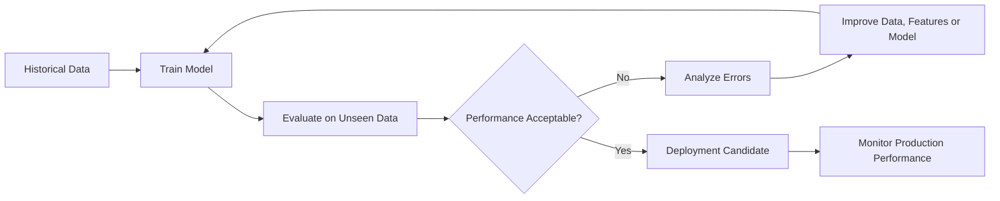

A model with a high training score can still fail because of:

* overfitting,
* data leakage,
* distribution shift,
* incorrect metrics,
* class imbalance,
* unstable predictions,
* poor performance on important user groups.

---

## 4. Train, Validation, and Test Sets

A dataset is commonly divided into three parts.

| Dataset        | Purpose                                              |
| -------------- | ---------------------------------------------------- |
| Training set   | Used to learn model parameters                       |
| Validation set | Used to select models, features, and hyperparameters |
| Test set       | Used for the final unbiased evaluation               |

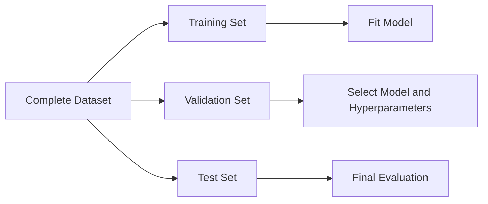

A common split is:

```text
Training set:   70%
Validation set: 15%
Test set:       15%
```

Another common approach is:

```text
Training set: 80%
Test set:     20%
```

Cross-validation is then performed inside the training set.

### Important rule

The test set should not influence:

* feature selection,
* hyperparameter tuning,
* threshold selection,
* preprocessing decisions,
* model architecture selection.

Repeatedly checking the test score effectively turns the test set into another validation set.

---

## 5. The Model Evaluation Workflow

A practical evaluation workflow is:

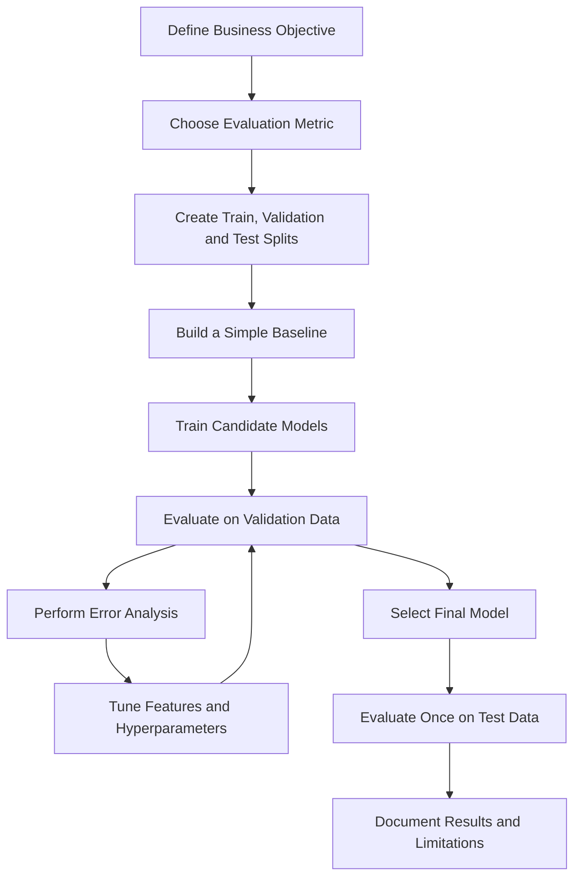

The metric should be selected before comparing many models. Otherwise, the evaluation may become biased toward whichever metric makes the preferred model look best.

---

## 6. Baseline Models

A **baseline** is a simple reference model used to determine whether a more complex model provides meaningful improvement.

### Classification baselines

Possible classification baselines include:

* predicting the most frequent class,
* predicting classes according to their frequency,
* using a simple logistic regression,
* applying a rule-based prediction.

Example:

```text
Dataset:
70% negative examples
30% positive examples

Baseline:
Always predict the negative class

Accuracy:
70%
```

A complex model with 72% accuracy may not represent a meaningful improvement.

### Regression baselines

Possible regression baselines include:

* predicting the mean target value,
* predicting the median target value,
* using a simple linear regression,
* using the previous value for time-series forecasting.

### Why baselines matter

A baseline helps answer:

> “Did the machine learning model actually learn something useful?”

---

# 7. Classification Evaluation

Classification models predict discrete categories.

Examples include:

* fraud versus non-fraud,
* spam versus non-spam,
* disease versus no disease,
* customer churn versus no churn,
* image category prediction.

---

## 7.1 Confusion Matrix

For binary classification, predictions can be summarized using a confusion matrix.

| Actual / Predicted |  Predicted Positive |  Predicted Negative |
| ------------------ | ------------------: | ------------------: |
| Actual Positive    |  True Positive (TP) | False Negative (FN) |
| Actual Negative    | False Positive (FP) |  True Negative (TN) |

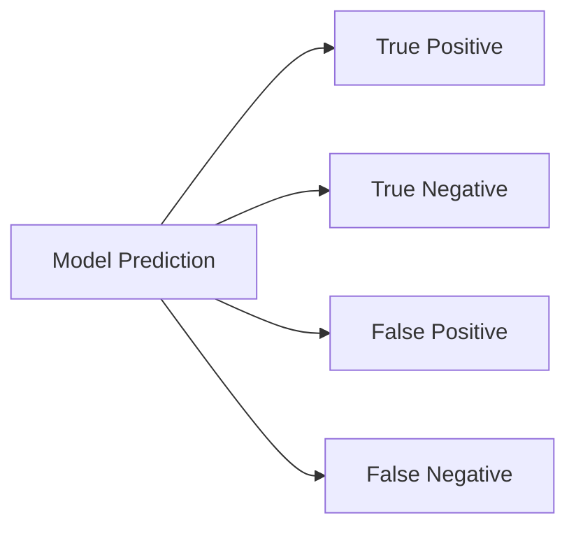

### Definitions

* **True Positive:** The model correctly predicts a positive example.
* **True Negative:** The model correctly predicts a negative example.
* **False Positive:** The model predicts positive, but the real label is negative.
* **False Negative:** The model predicts negative, but the real label is positive.

The importance of each error depends on the business problem.

For example:

| Application        | More costly error              |
| ------------------ | ------------------------------ |
| Cancer screening   | False negative                 |
| Spam filtering     | False positive                 |
| Fraud detection    | Often false negative           |
| Content moderation | Depends on policy and severity |

---

## 7.2 Accuracy

Accuracy measures the proportion of correct predictions.

$$
\text{Accuracy} = \frac{TP + TN} {TP + TN + FP + FN}
$$

Plain-text equivalent:

```text
Accuracy = (TP + TN) / (TP + TN + FP + FN)
```

Accuracy is useful when:

* classes are reasonably balanced,
* false positives and false negatives have similar costs.

Accuracy can be misleading for imbalanced datasets.

### Example

Suppose only 1% of transactions are fraudulent.

A model that always predicts “not fraud” achieves:

```text
Accuracy = 99%
```

However, it detects no fraud cases and is therefore useless.

---

## 7.3 Precision

Precision measures how many predicted positive examples are actually positive.

$$
\text{Precision} = \frac{TP} {TP + FP}
$$

Plain-text equivalent:

```text
Precision = TP / (TP + FP)
```

Precision answers:

> “When the model predicts positive, how often is it correct?”

Use precision when false positives are expensive.

Examples:

* spam detection,
* expensive manual investigations,
* recommendation notifications,
* automatic account suspension.

---

## 7.4 Recall

Recall measures how many actual positive examples are correctly detected.

$$
\text{Recall} = \frac{TP} {TP + FN}
$$

Plain-text equivalent:

```text
Recall = TP / (TP + FN)
```

Recall is also called:

* sensitivity,
* true positive rate.

Recall answers:

> “Of all real positive examples, how many did the model find?”

Use recall when false negatives are expensive.

Examples:

* disease detection,
* fraud detection,
* security threat detection,
* safety defect detection.

---

## 7.5 F1 Score

The F1 score is the harmonic mean of precision and recall.

$$
F_1 = 2 \times \frac{\text{Precision} \times \text{Recall}} {\text{Precision} + \text{Recall}}
$$

Plain-text equivalent:

```text
F1 = 2 × (Precision × Recall) / (Precision + Recall)
```

F1 is useful when:

* the positive class is important,
* the dataset is imbalanced,
* both precision and recall matter.

A high F1 score requires both precision and recall to be reasonably high.

---

## 7.6 Specificity

Specificity measures how many actual negative examples are correctly identified.

$$
\text{Specificity} = \frac{TN} {TN + FP}
$$

Plain-text equivalent:

```text
Specificity = TN / (TN + FP)
```

Specificity is useful when correctly rejecting negative examples is important.

---

## 7.7 ROC Curve and ROC-AUC

The **Receiver Operating Characteristic curve** compares:

* true positive rate,
* false positive rate,

at different classification thresholds.

$$
\text{True Positive Rate} = \frac{TP} {TP + FN}
$$

$$
\text{False Positive Rate} = \frac{FP} {FP + TN}
$$

**ROC-AUC** summarizes the area under the ROC curve.

Typical interpretation:

|   ROC-AUC | General interpretation |
| --------: | ---------------------- |
|      0.50 | Random ranking         |
| 0.60–0.70 | Weak                   |
| 0.70–0.80 | Reasonable             |
| 0.80–0.90 | Strong                 |
| 0.90–1.00 | Very strong            |

These ranges are only general guidelines. Acceptable performance depends on the domain, dataset, and business cost.

ROC-AUC measures ranking quality across thresholds, but it may appear overly optimistic when the positive class is extremely rare.

---

## 7.8 Precision-Recall Curve and PR-AUC

A precision-recall curve shows the trade-off between:

* precision,
* recall,

at different probability thresholds.

PR-AUC is often more informative than ROC-AUC for highly imbalanced datasets.

Examples:

* rare disease prediction,
* fraud detection,
* anomaly detection,
* defect detection.

---

## 7.9 Classification Threshold

Many classification models output probabilities.

Example:

```text
Predicted probability of fraud = 0.73
```

A threshold converts the probability into a class.

```text
If probability >= 0.50:
    predict fraud
Else:
    predict not fraud
```

Changing the threshold changes precision and recall.

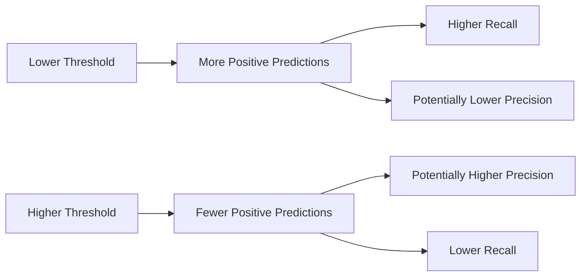

The default threshold of `0.5` is not always optimal.

Threshold selection should reflect:

* business cost,
* investigation capacity,
* safety requirements,
* desired precision or recall,
* expected class frequency.

---

## 7.10 Multiclass Classification Metrics

For multiclass problems, precision, recall, and F1 can be calculated for every class.

The results may then be combined using different averaging methods.

### Macro average

Calculates the metric independently for each class and gives every class equal weight.

```text
Macro F1 = average of F1 scores across all classes
```

Use macro averaging when minority classes are important.

### Weighted average

Calculates the metric for every class and weights each result by class frequency.

Use weighted averaging when class distribution should influence the final score.

### Micro average

Aggregates all true positives, false positives, and false negatives before calculating the metric.

Use micro averaging when overall instance-level performance matters.

---

# 8. Regression Evaluation

Regression models predict continuous numerical values.

Examples include:

* house prices,
* customer spending,
* delivery time,
* temperature,
* sales revenue,
* energy consumption.

---

## 8.1 Mean Absolute Error

Mean Absolute Error measures the average absolute difference between actual and predicted values.

$$
MAE = \frac{1}{n} \sum_{i=1}^{n} |y_i - \hat{y}_i|
$$

Plain-text equivalent:

```text
MAE = average of |actual value - predicted value|
```

Advantages:

* easy to interpret,
* expressed in the original target unit,
* less sensitive to large errors than MSE.

Example:

```text
MAE = $12,000
```

This means the prediction differs from the real house price by approximately `$12,000` on average.

---

## 8.2 Mean Squared Error

Mean Squared Error calculates the average squared prediction error.

$$
MSE = \frac{1}{n} \sum_{i=1}^{n} (y_i - \hat{y}_i)^2
$$

Plain-text equivalent:

```text
MSE = average of (actual value - predicted value)^2
```

Because errors are squared, large errors receive a stronger penalty.

MSE is useful when large mistakes are especially costly.

Its main disadvantage is that the result is expressed in squared units.

---

## 8.3 Root Mean Squared Error

Root Mean Squared Error is the square root of MSE.

$$
RMSE = \sqrt{ \frac{1}{n} \sum_{i=1}^{n} (y_i - \hat{y}_i)^2 }
$$

Plain-text equivalent:

```text
RMSE = square root of MSE
```

RMSE is expressed in the same unit as the target variable.

Compared with MAE, RMSE is more sensitive to large errors.

---

## 8.4 R-squared

R-squared measures how much target variance is explained by the model.

$$
R^2 = ## 1 \frac{ \sum_{i=1}^{n}(y_i-\hat{y}*i)^2 }{ \sum*{i=1}^{n}(y_i-\bar{y})^2 }
$$

Plain-text equivalent:

```text
R² = 1 - model squared error / baseline squared error
```

Where:

* `y_i` is the actual value,
* `ŷ_i` is the predicted value,
* `ȳ` is the mean target value.

General interpretation:

|   R-squared | Interpretation                           |
| ----------: | ---------------------------------------- |
|         1.0 | Perfect prediction                       |
|         0.0 | Equivalent to predicting the target mean |
| Less than 0 | Worse than the mean baseline             |

A high R-squared does not automatically mean the model is useful. The residual pattern and prediction error must also be examined.

---

## 8.5 Mean Absolute Percentage Error

Mean Absolute Percentage Error expresses errors as percentages.

$$
MAPE = \frac{100}{n} \sum_{i=1}^{n} \left| \frac{y_i-\hat{y}_i}{y_i} \right|
$$

Plain-text equivalent:

```text
MAPE = average absolute percentage error
```

Example:

```text
MAPE = 8%
```

This suggests that predictions differ from actual values by approximately 8% on average.

MAPE is problematic when:

* actual values are zero,
* actual values are close to zero,
* negative target values exist.

---

## 8.6 Residual Analysis

A residual is the difference between an actual and predicted value.

$$
e_i = y_i - \hat{y}_i
$$

Plain-text equivalent:

```text
Residual = actual value - predicted value
```

A good residual plot should ideally show errors randomly distributed around zero.

Patterns in residuals may indicate:

* missing nonlinear relationships,
* heteroskedasticity,
* outliers,
* missing features,
* incorrect transformations,
* systematic model bias.

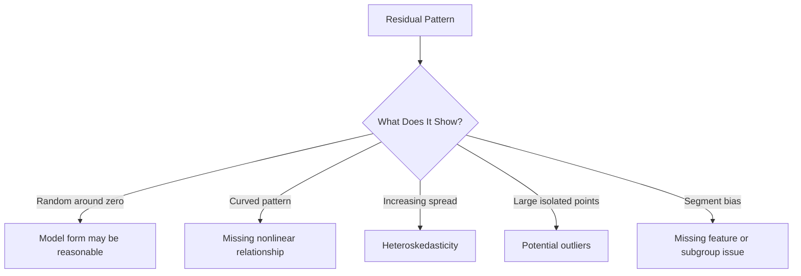

---

# 9. Evaluating Unsupervised Learning

Unsupervised learning is more difficult to evaluate because true labels may not exist.

Examples include:

* clustering,
* dimensionality reduction,
* anomaly detection,
* topic modeling.

---

## 9.1 Clustering Metrics

### Inertia

Inertia measures the sum of squared distances between samples and their assigned cluster centers.

Lower inertia usually indicates tighter clusters.

However, inertia decreases as the number of clusters increases, so it should not be used alone.

### Silhouette Score

The silhouette score compares:

* how close a sample is to its own cluster,
* how far it is from neighboring clusters.

Its range is:

```text
-1 to 1
```

General interpretation:

|   Score | Interpretation                    |
| ------: | --------------------------------- |
|  Near 1 | Well-separated clusters           |
|  Near 0 | Overlapping clusters              |
| Below 0 | Potentially incorrect assignments |

### Davies-Bouldin Index

The Davies-Bouldin Index measures similarity between clusters.

```text
Lower values are generally better.
```

### Business evaluation

Internal clustering metrics are not sufficient.

Clusters should also be evaluated based on:

* interpretability,
* stability,
* usefulness for decisions,
* segment size,
* domain relevance,
* actionability.

For example, customer clusters are valuable only when they support actions such as:

* targeted marketing,
* product recommendations,
* customer retention,
* pricing strategies.

---

## 9.2 Dimensionality Reduction Evaluation

Dimensionality reduction can be evaluated using:

* explained variance,
* reconstruction error,
* neighborhood preservation,
* visualization quality,
* downstream model performance.

For PCA, explained variance ratio indicates how much information is preserved by selected principal components.

Example:

```text
First 2 principal components explain 82% of total variance.
```

---

# 10. Cross-Validation

Cross-validation evaluates a model using multiple train-validation splits.

In **k-fold cross-validation**:

1. Divide the data into `k` folds.
2. Train on `k - 1` folds.
3. Validate on the remaining fold.
4. Repeat until every fold has been used for validation.
5. Average the results.

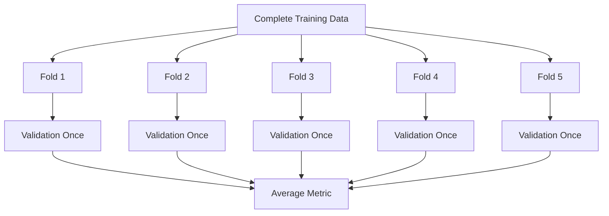

For each fold:

```text
One fold = validation data
Remaining folds = training data
```

Common values are:

```text
k = 5
k = 10
```

### Benefits

Cross-validation:

* uses the training data efficiently,
* produces a more stable performance estimate,
* helps compare models,
* reduces dependence on one random split.

### Important variations

| Method          | Appropriate use                            |
| --------------- | ------------------------------------------ |
| KFold           | Standard regression or balanced data       |
| StratifiedKFold | Classification with class imbalance        |
| GroupKFold      | Multiple records belong to the same entity |
| TimeSeriesSplit | Time-ordered data                          |

---

# 11. Time-Series Evaluation

Random train-test splitting is usually inappropriate for time-series data because it may allow the model to learn from the future.

A correct split preserves time order.

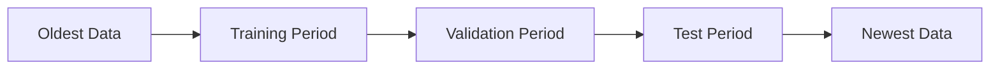

A common approach is walk-forward validation.

```text
Train: Jan–Jun  → Validate: Jul
Train: Jan–Jul  → Validate: Aug
Train: Jan–Aug  → Validate: Sep
```

Time-series baselines may include:

* previous value,
* previous day,
* previous week,
* moving average,
* same period from the previous year.

---

# 12. Overfitting and Underfitting

## 12.1 Underfitting

Underfitting occurs when a model is too simple to learn the underlying pattern.

Typical symptoms:

```text
Training performance: poor
Validation performance: poor
```

Possible solutions:

* add useful features,
* use a more expressive model,
* reduce excessive regularization,
* train longer,
* improve preprocessing.

---

## 12.2 Overfitting

Overfitting occurs when a model learns training-specific noise instead of general patterns.

Typical symptoms:

```text
Training performance: excellent
Validation performance: poor
```

Possible solutions:

* collect more data,
* simplify the model,
* add regularization,
* reduce model depth,
* perform feature selection,
* use early stopping,
* improve cross-validation,
* remove leakage.

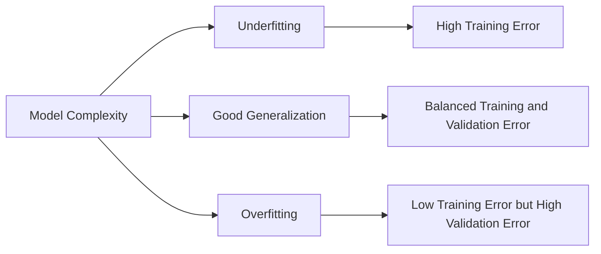

---

# 13. Data Leakage

Data leakage occurs when information unavailable at prediction time accidentally enters model training or evaluation.

Leakage can make evaluation results look unrealistically strong.

## Common leakage examples

### Preprocessing before splitting

Incorrect:

```python
scaler.fit(all_data)
train_data, test_data = split(all_data)
```

Correct:

```python
train_data, test_data = split(all_data)

scaler.fit(train_data)
train_scaled = scaler.transform(train_data)
test_scaled = scaler.transform(test_data)
```

### Target leakage

A feature directly or indirectly contains the answer.

Example:

```text
Target: customer will cancel subscription

Leaking feature:
cancellation_confirmation_date
```

### Future leakage

The model uses information created after the prediction time.

Example:

```text
Predicting loan default using the final collection status.
```

### Entity leakage

Records from the same person, patient, product, or device appear in both training and test data.

In this situation, use group-based splitting.

---

# 14. Error Analysis

A single metric does not explain why a model fails.

Error analysis investigates incorrect predictions.

A practical process is:

1. Collect incorrect predictions.
2. Sort errors by confidence or size.
3. Inspect representative examples.
4. Group errors into categories.
5. Identify repeated failure patterns.
6. Propose features, data, or model changes.
7. Re-evaluate after each change.

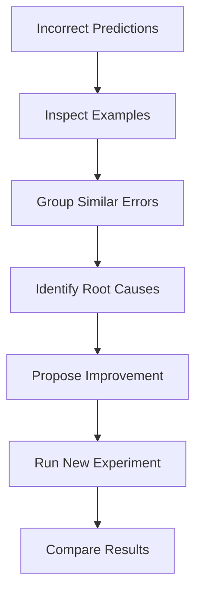

### Classification error table

| Input         | Actual | Predicted | Confidence | Error category           |
| ------------- | ------ | --------- | ---------: | ------------------------ |
| Transaction A | Fraud  | Normal    |       0.92 | Unusual location pattern |
| Transaction B | Normal | Fraud     |       0.81 | High purchase amount     |
| Transaction C | Fraud  | Normal    |       0.74 | New customer             |

### Regression error table

| Input   |  Actual | Predicted | Absolute error | Possible cause            |
| ------- | ------: | --------: | -------------: | ------------------------- |
| House A | 420,000 |   310,000 |        110,000 | Luxury renovation missing |
| House B | 180,000 |   240,000 |         60,000 | Poor neighborhood feature |
| House C | 290,000 |   295,000 |          5,000 | Acceptable prediction     |

---

# 15. Segment-Based Evaluation

Overall performance may hide poor results for important groups.

Evaluate the model by segments such as:

* geographic region,
* device type,
* customer type,
* product category,
* age group,
* time period,
* language,
* class label,
* data source.

Example:

| Segment            | Number of examples | F1 score |
| ------------------ | -----------------: | -------: |
| Existing customers |              8,000 |     0.86 |
| New customers      |              1,200 |     0.61 |
| Mobile users       |              5,400 |     0.79 |
| Desktop users      |              3,800 |     0.84 |

The overall F1 score might look strong, while the model performs poorly for new customers.

---

# 16. Statistical Uncertainty

Evaluation metrics are estimates based on a finite sample.

A small test dataset may produce unstable results.

Instead of reporting only:

```text
Accuracy = 0.84
```

A stronger report may include:

```text
Accuracy = 0.84
95% confidence interval = [0.81, 0.87]
```

Useful methods include:

* cross-validation standard deviation,
* bootstrapping,
* confidence intervals,
* repeated train-test splits,
* statistical significance tests.

Small metric differences may not represent real improvement.

For example:

```text
Model A F1 = 0.812
Model B F1 = 0.815
```

The difference may be too small to justify additional complexity.

---

# 17. Business-Aware Evaluation

Technical metrics should be connected to real costs and benefits.

Suppose a fraud model produces:

```text
True positive benefit:       $500
False positive review cost:  $10
False negative loss:         $1,000
```

A simplified utility function could be:

$$
\text{Utility} = ## 500(TP) ## 10(FP) 1000(FN)
$$

Plain-text equivalent:

```text
Utility = 500 × TP - 10 × FP - 1000 × FN
```

This evaluation may lead to a different threshold than maximizing accuracy or F1.

A production model should optimize the outcome that matters to the organization.

---

# 18. Model Comparison

A model comparison table should include more than one metric.

Example for classification:

| Model               | Precision | Recall |   F1 | ROC-AUC | Training time |
| ------------------- | --------: | -----: | ---: | ------: | ------------: |
| Majority baseline   |      0.00 |   0.00 | 0.00 |    0.50 |      Very low |
| Logistic Regression |      0.73 |   0.68 | 0.70 |    0.82 |           Low |
| Random Forest       |      0.79 |   0.72 | 0.75 |    0.87 |        Medium |
| XGBoost             |      0.78 |   0.78 | 0.78 |    0.90 |          High |

Example for regression:

| Model             |    MAE |   RMSE | R-squared | Training time |
| ----------------- | -----: | -----: | --------: | ------------: |
| Mean baseline     | 48,200 | 64,100 |      0.00 |      Very low |
| Linear Regression | 31,400 | 45,700 |      0.58 |           Low |
| Random Forest     | 23,900 | 35,800 |      0.74 |        Medium |
| XGBoost           | 21,600 | 32,900 |      0.79 |          High |

The best model is not always the model with the highest score.

Other considerations include:

* inference speed,
* training cost,
* interpretability,
* memory usage,
* maintenance complexity,
* model stability,
* deployment constraints.

---

# 19. Practical Demo: Classification

The following example evaluates a logistic regression model using scikit-learn.

```python
from sklearn.datasets import load_breast_cancer
from sklearn.linear_model import LogisticRegression
from sklearn.metrics import (
    accuracy_score,
    classification_report,
    confusion_matrix,
    roc_auc_score,
)
from sklearn.model_selection import train_test_split
from sklearn.pipeline import Pipeline
from sklearn.preprocessing import StandardScaler

# Load data
dataset = load_breast_cancer()
X = dataset.data
y = dataset.target

# Create train and test sets
X_train, X_test, y_train, y_test = train_test_split(
    X,
    y,
    test_size=0.2,
    random_state=42,
    stratify=y,
)

# Build a leakage-safe pipeline
model = Pipeline(
    steps=[
        ("scaler", StandardScaler()),
        (
            "classifier",
            LogisticRegression(
                max_iter=2000,
                random_state=42,
            ),
        ),
    ]
)

# Train the model
model.fit(X_train, y_train)

# Generate predictions
y_pred = model.predict(X_test)
y_probability = model.predict_proba(X_test)[:, 1]

# Evaluate
print("Accuracy:", accuracy_score(y_test, y_pred))
print("ROC-AUC:", roc_auc_score(y_test, y_probability))
print("\nConfusion matrix:")
print(confusion_matrix(y_test, y_pred))
print("\nClassification report:")
print(classification_report(y_test, y_pred))
```

### What to inspect

Do not stop after printing the score.

Inspect:

* false positives,
* false negatives,
* minority-class recall,
* probability calibration,
* threshold behavior,
* performance across data segments.

---

# 20. Practical Demo: Regression

The following example compares a baseline model with linear regression.

```python
from sklearn.datasets import fetch_california_housing
from sklearn.dummy import DummyRegressor
from sklearn.linear_model import LinearRegression
from sklearn.metrics import mean_absolute_error, mean_squared_error, r2_score
from sklearn.model_selection import train_test_split

# Load data
dataset = fetch_california_housing()
X = dataset.data
y = dataset.target

# Split data
X_train, X_test, y_train, y_test = train_test_split(
    X,
    y,
    test_size=0.2,
    random_state=42,
)

# Baseline model
baseline = DummyRegressor(strategy="mean")
baseline.fit(X_train, y_train)
baseline_predictions = baseline.predict(X_test)

# Linear regression model
model = LinearRegression()
model.fit(X_train, y_train)
predictions = model.predict(X_test)

# Baseline metrics
baseline_mae = mean_absolute_error(y_test, baseline_predictions)
baseline_rmse = mean_squared_error(
    y_test,
    baseline_predictions,
) ** 0.5

# Model metrics
model_mae = mean_absolute_error(y_test, predictions)
model_rmse = mean_squared_error(
    y_test,
    predictions,
) ** 0.5
model_r2 = r2_score(y_test, predictions)

print("Baseline MAE:", baseline_mae)
print("Baseline RMSE:", baseline_rmse)

print("\nLinear Regression MAE:", model_mae)
print("Linear Regression RMSE:", model_rmse)
print("Linear Regression R-squared:", model_r2)
```

The model should be considered useful only when it provides meaningful improvement over the baseline.

---

# 21. Practical Demo: Cross-Validation

```python
from sklearn.datasets import load_iris
from sklearn.linear_model import LogisticRegression
from sklearn.model_selection import StratifiedKFold, cross_validate
from sklearn.pipeline import Pipeline
from sklearn.preprocessing import StandardScaler

dataset = load_iris()
X = dataset.data
y = dataset.target

model = Pipeline(
    steps=[
        ("scaler", StandardScaler()),
        (
            "classifier",
            LogisticRegression(
                max_iter=2000,
                random_state=42,
            ),
        ),
    ]
)

cross_validation = StratifiedKFold(
    n_splits=5,
    shuffle=True,
    random_state=42,
)

scores = cross_validate(
    estimator=model,
    X=X,
    y=y,
    cv=cross_validation,
    scoring=[
        "accuracy",
        "f1_macro",
    ],
)

print("Fold accuracy:", scores["test_accuracy"])
print("Mean accuracy:", scores["test_accuracy"].mean())
print("Accuracy standard deviation:", scores["test_accuracy"].std())

print("Mean macro F1:", scores["test_f1_macro"].mean())
```

A result should ideally report both the mean and variability.

Example:

```text
Cross-validation accuracy: 0.95 ± 0.03
```

---

# 22. Common Mistakes

## 22.1 Evaluating on training data

Why it is wrong:

* the model has already seen the examples,
* the score is overly optimistic,
* the result does not estimate generalization.

---

## 22.2 Choosing the wrong metric

Example:

```text
Problem: Rare fraud detection
Selected metric: Accuracy
```

A high accuracy may hide very poor fraud recall.

---

## 22.3 Ignoring the baseline

A complex model should not be celebrated unless it meaningfully outperforms a simple reference.

---

## 22.4 Using the test set during tuning

Repeatedly evaluating on the test set causes test-set overfitting.

---

## 22.5 Ignoring class imbalance

Metrics such as accuracy may hide poor minority-class performance.

---

## 22.6 Comparing models on different splits

All candidate models should be evaluated using the same:

* data split,
* preprocessing,
* evaluation metric,
* cross-validation folds.

---

## 22.7 Reporting only one metric

One metric rarely captures all model behavior.

---

## 22.8 Ignoring error examples

Metrics show how much the model fails. Error analysis helps explain why it fails.

---

## 22.9 Using random splits for time-series data

This may expose the model to future information.

---

## 22.10 Focusing only on metric improvement

A slightly better model may not be worth:

* slower inference,
* higher infrastructure cost,
* lower interpretability,
* greater maintenance complexity.

---

# 23. Hands-On Exercise

Use a classification or regression dataset.

## Task 1: Define the problem

Write:

```text
Prediction target:
Model input:
Prediction user:
Business decision:
Most costly error:
```

## Task 2: Create a baseline

For classification:

```python
from sklearn.dummy import DummyClassifier

baseline = DummyClassifier(
    strategy="most_frequent",
    random_state=42,
)
```

For regression:

```python
from sklearn.dummy import DummyRegressor

baseline = DummyRegressor(strategy="mean")
```

## Task 3: Train at least one additional model

Possible models:

* Logistic Regression,
* Linear Regression,
* Decision Tree,
* Random Forest,
* Gradient Boosting,
* XGBoost,
* LightGBM.

## Task 4: Compare metrics

For classification, report:

* accuracy,
* precision,
* recall,
* F1 score,
* ROC-AUC or PR-AUC,
* confusion matrix.

For regression, report:

* MAE,
* RMSE,
* R-squared,
* residual distribution.

## Task 5: Perform error analysis

Inspect at least ten incorrect or high-error predictions.

Record:

```text
Input:
Actual result:
Predicted result:
Prediction confidence:
Possible reason:
Potential improvement:
```

## Task 6: Recommend the next experiment

Possible next experiments:

* create a new feature,
* collect more minority-class examples,
* tune the threshold,
* remove leakage,
* handle outliers,
* test another model,
* improve missing-value treatment.

---

# 24. Mini Project: House Price Prediction

## Objective

Predict house prices using:

* Exploratory Data Analysis,
* feature engineering,
* Linear Regression,
* Random Forest,
* XGBoost.

## Suggested workflow

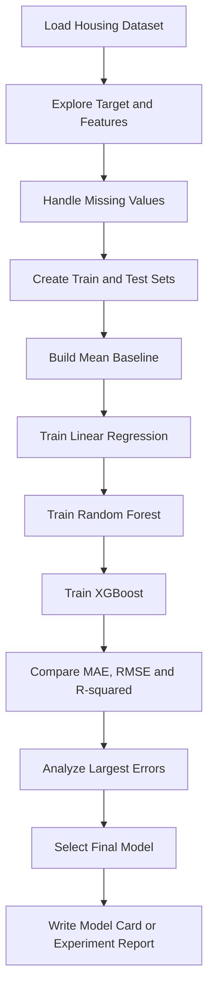

## Recommended evaluation table

| Model             | Cross-validation MAE | Test MAE | Test RMSE | Test R-squared |
| ----------------- | -------------------: | -------: | --------: | -------------: |
| Mean baseline     |                      |          |           |                |
| Linear Regression |                      |          |           |                |
| Random Forest     |                      |          |           |                |
| XGBoost           |                      |          |           |                |

## Recommended charts

Create:

* target distribution,
* actual versus predicted values,
* residual plot,
* error distribution,
* feature importance,
* metric comparison bar chart.

## Final recommendation

The report should explain:

* which model performed best,
* whether improvement over baseline was meaningful,
* where the model failed,
* which features were important,
* whether the model is ready for deployment,
* which experiment should be attempted next.

---

# 25. Evaluation Report Template

```markdown
# Model Evaluation Report

## 1. Problem Definition

- Prediction task:
- Target variable:
- Business objective:
- Prediction users:
- Cost of false positives:
- Cost of false negatives:

## 2. Dataset

- Number of rows:
- Number of features:
- Date range:
- Class distribution:
- Missing values:
- Important assumptions:

## 3. Data Split

- Training set:
- Validation set:
- Test set:
- Split strategy:
- Random seed:

## 4. Baseline

- Baseline method:
- Baseline metric:

## 5. Candidate Models

- Model A:
- Model B:
- Model C:

## 6. Evaluation Metrics

- Primary metric:
- Secondary metrics:
- Business metric:

## 7. Results

| Model | Primary metric | Secondary metric | Training time |
|---|---:|---:|---:|
| Baseline |  |  |  |
| Model A |  |  |  |
| Model B |  |  |  |

## 8. Error Analysis

- Main error category:
- Most affected segment:
- Examples of serious failures:
- Possible root causes:

## 9. Limitations

- Data limitations:
- Modeling limitations:
- Evaluation limitations:
- Deployment risks:

## 10. Recommendation

- Selected model:
- Decision threshold:
- Deployment recommendation:
- Next experiment:
```

---

# 26. Completion Checklist

* [ ] I can explain model evaluation in one or two minutes.
* [ ] I understand the roles of training, validation, and test datasets.
* [ ] I can select suitable classification metrics.
* [ ] I can select suitable regression metrics.
* [ ] I understand why imbalanced datasets require special attention.
* [ ] I can create and evaluate a baseline model.
* [ ] I know how cross-validation works.
* [ ] I can recognize overfitting and underfitting.
* [ ] I can identify common forms of data leakage.
* [ ] I can perform basic error analysis.
* [ ] I can evaluate performance across important segments.
* [ ] I can connect model metrics to business costs.
* [ ] I have created a notebook, chart, report, API, or portfolio artifact.
* [ ] I have documented at least one caveat, assumption, or unanswered question.

---

# 27. Related Outcome

Train, compare, and evaluate supervised and unsupervised machine learning models using thoughtful feature engineering and evaluation strategies.

A successful outcome should demonstrate that you can:

* choose appropriate metrics,
* establish a baseline,
* compare multiple models fairly,
* identify model weaknesses,
* communicate results clearly,
* recommend the next experiment.

---

# 28. Key Takeaways

1. Model evaluation measures performance on unseen data, not only training data.
2. The correct metric depends on the prediction task and business cost.
3. Accuracy is not sufficient for every classification problem.
4. MAE, RMSE, and R-squared describe different aspects of regression performance.
5. Every complex model should be compared with a simple baseline.
6. Cross-validation provides a more stable performance estimate.
7. The test set should be reserved for final evaluation.
8. Data leakage can create unrealistically strong results.
9. Error analysis provides insights that aggregate metrics cannot provide.
10. The best production model balances quality, speed, cost, stability, and interpretability.

---

## 29. Summary

**Model Evaluation** is a core stage in the machine learning workflow. It determines whether a model generalizes, whether it improves on a baseline, and whether its errors are acceptable for the intended application.

A complete evaluation combines:

```text
Appropriate metrics
+ Fair validation strategy
+ Baseline comparison
+ Error analysis
+ Segment analysis
+ Business impact
+ Clear documentation
```

Turn this lesson into a practical artifact such as:

* a Jupyter notebook,
* a metric comparison chart,
* an experiment report,
* a model card,
* a prediction API,
* a Dockerized service,
* a portfolio case study.
