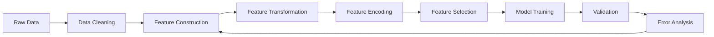
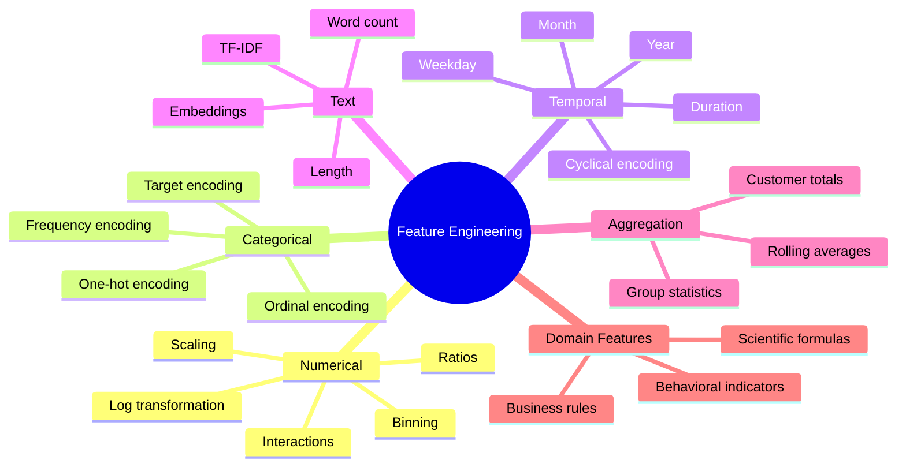
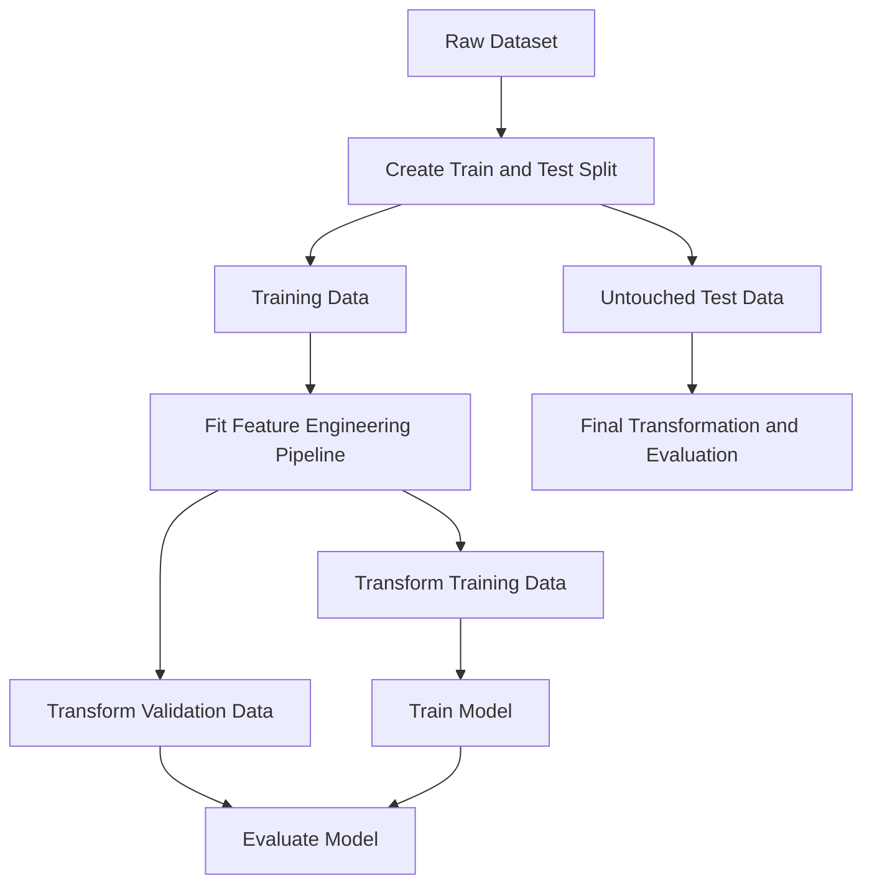
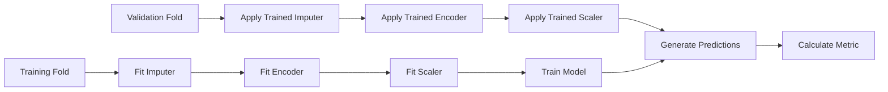
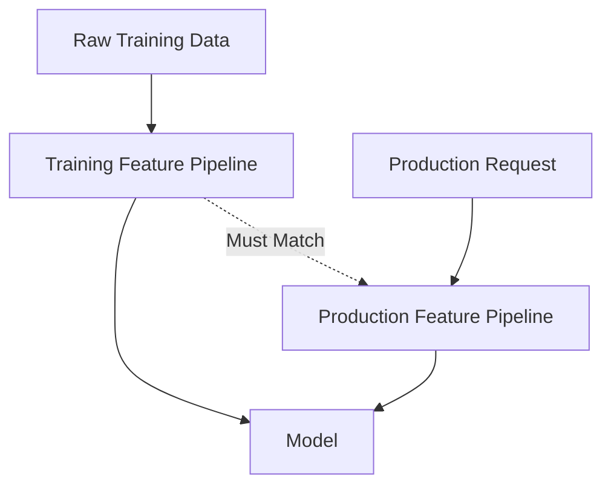
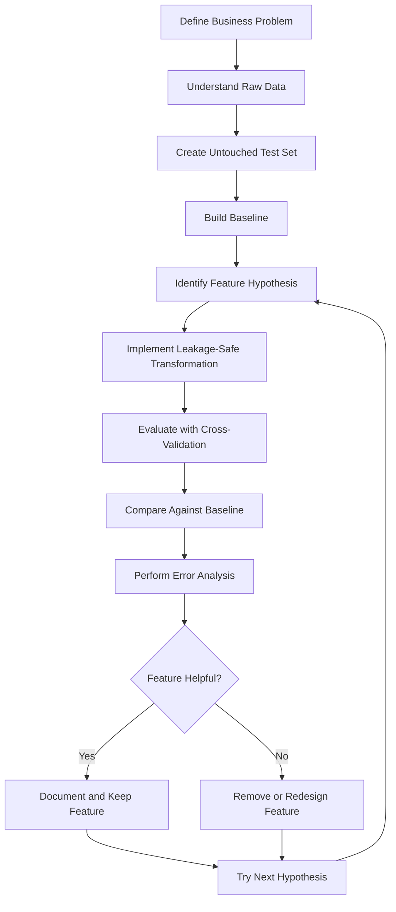

# 025 - Feature Engineering

**Course:** 03 - Machine Learning and Deep Learning
**Module:** Module 06 - Machine Learning
**Content Group:** Feature Engineering
**Roadmap Source:** Machine Learning / Feature Engineering
**Lesson Type:** Machine Learning
**Order in Module:** 025
**Suggested Duration:** 26 minutes

---

## 1. Summary

**Feature engineering** is the process of transforming raw data into meaningful inputs that help a machine learning model learn useful patterns.

Raw datasets often contain information that is:

* Missing or inconsistent.
* Stored in inconvenient formats.
* Highly skewed.
* Categorical rather than numerical.
* Distributed across several columns.
* Difficult for a model to interpret directly.

Feature engineering converts this raw information into features that better represent the underlying business problem.

Examples include:

* Scaling numerical values.
* Encoding categorical variables.
* Extracting year, month, weekday, or hour from timestamps.
* Creating price-per-unit or ratio features.
* Grouping continuous values into bins.
* Combining features through interactions.
* Transforming skewed variables.
* Extracting text statistics.
* Aggregating historical behavior.

Good feature engineering can improve:

* Predictive performance.
* Training stability.
* Model interpretability.
* Generalization to unseen data.
* Data quality.
* Production reliability.

However, feature engineering can also introduce **data leakage**, causing validation scores to appear unrealistically high.

---

## 2. Learning Objectives

By the end of this lesson, you should be able to:

* Explain feature engineering in your own words.
* Distinguish raw fields from model-ready features.
* Identify useful numerical, categorical, temporal, text, and interaction features.
* Apply common feature transformations.
* Build leakage-safe preprocessing pipelines.
* Compare model performance before and after feature engineering.
* Recognize unnecessary or harmful features.
* Perform feature engineering based on domain knowledge.
* Document assumptions and feature definitions.
* Apply feature engineering to a house price prediction project.

---

## 3. What Is a Feature?

A **feature** is an input variable used by a machine learning model to generate a prediction.

Suppose the objective is to predict the sale price of a house.

Raw fields may include:

| Raw Field         | Example      |
| ----------------- | ------------ |
| Construction date | `2008-06-15` |
| Sale date         | `2026-03-01` |
| Living area       | `145 m²`     |
| Bedrooms          | `3`          |
| Bathrooms         | `2`          |
| District          | `District 7` |
| Renovation date   | `2020-08-11` |

Possible engineered features include:

| Engineered Feature     |                     Example |
| ---------------------- | --------------------------: |
| Property age           |                    18 years |
| Years since renovation |                     6 years |
| Area per bedroom       |                     48.3 m² |
| Total rooms            |                           5 |
| Is renovated           |                           1 |
| Sale month             |                           3 |
| District encoded       | Numerical or one-hot values |

The engineered features make relevant relationships more explicit.

---

## 4. Feature Engineering Workflow



A more detailed workflow is:

```text
raw data
    -> inspect data quality
    -> define train, validation and test strategy
    -> clean invalid values
    -> create domain-based features
    -> encode categorical variables
    -> scale or transform numerical variables
    -> remove leakage and redundant features
    -> train baseline
    -> evaluate with cross-validation
    -> perform error analysis
    -> test the next feature hypothesis
```

Feature engineering should be an iterative process rather than a one-time preprocessing step.

---

## 5. Why Feature Engineering Matters

Different models understand data in different ways.

For example, consider a house's construction year:

```text
construction_year = 2005
```

The relationship between `2005` and the current value of the property may not be directly meaningful to the model.

A more useful representation may be:

$$
\text{property age} = ## \text{sale year} \text{construction year}
$$

If the house was sold in 2026:

$$
\text{property age} = # 2026 - 2005 21
$$

The engineered feature directly represents how old the property was when sold.

Feature engineering helps the model by making important relationships easier to learn.

---

## 6. Raw Features Versus Engineered Features

Suppose a dataset contains:

```text
living_area = 150
bedrooms = 3
bathrooms = 2
construction_year = 2010
sale_year = 2026
renovation_year = 2020
```

Possible engineered features are:

```text
property_age = 2026 - 2010 = 16
years_since_renovation = 2026 - 2020 = 6
area_per_bedroom = 150 / 3 = 50
total_main_rooms = 3 + 2 = 5
is_renovated = 1
```

These features represent concepts that may influence price more directly than the original columns.

---

## 7. Main Categories of Feature Engineering



---

## 8. Numerical Feature Engineering

### 8.1 Standardization

Standardization transforms a numerical feature to have approximately:

* Mean equal to zero.
* Standard deviation equal to one.

The formula is:

$$
z = \frac{x-\mu}{\sigma}
$$

where:

* (x) is the original value.
* (\mu) is the training-set mean.
* (\sigma) is the training-set standard deviation.

Example:

```python
from sklearn.preprocessing import StandardScaler

scaler = StandardScaler()
X_scaled = scaler.fit_transform(X)
```

Standardization is often useful for:

* Linear Regression with regularization.
* Logistic Regression.
* K-Nearest Neighbors.
* Support Vector Machines.
* Neural networks.
* PCA.
* Clustering algorithms.

Tree-based models such as Random Forest and XGBoost usually do not require standardization.

---

### 8.2 Min-Max Scaling

Min-max scaling transforms values to a defined range, commonly from 0 to 1.

$$
x' = \frac{x-x_{\min}} {x_{\max}-x_{\min}}
$$

Example:

```python
from sklearn.preprocessing import MinMaxScaler

scaler = MinMaxScaler()
X_scaled = scaler.fit_transform(X)
```

It may be useful when:

* Features need a fixed range.
* A neural network is sensitive to input magnitude.
* Distance-based algorithms are used.

Min-max scaling can be sensitive to outliers.

---

### 8.3 Robust Scaling

Robust scaling uses the median and interquartile range instead of the mean and standard deviation.

$$
x' = \frac{x-\operatorname{median}(x)} {Q_3-Q_1}
$$

Example:

```python
from sklearn.preprocessing import RobustScaler

scaler = RobustScaler()
X_scaled = scaler.fit_transform(X)
```

It may be useful when numerical features contain large outliers.

---

### 8.4 Log Transformation

A log transformation can reduce strong positive skew.

$$
x' = \log(1+x)
$$

The addition of 1 allows zero values to be transformed safely.

```python
import numpy as np

df["log_income"] = np.log1p(df["income"])
```

Example:

```text
Original values:
1,000
2,000
5,000
100,000

After log transformation:
6.91
7.60
8.52
11.51
```

Log transformations are commonly applied to:

* Income.
* Sales.
* House prices.
* Transaction values.
* Population.
* Website traffic.
* Count variables.

Do not apply a standard logarithm to negative values without designing an appropriate transformation.

---

### 8.5 Polynomial Features

Polynomial features allow a linear model to represent nonlinear relationships.

For one feature (x), second-degree polynomial features include:

$$
x
$$

and:

$$
x^2
$$

For two features (x_1) and (x_2), they may include:

$$
x_1,\quad x_2,\quad x_1^2,\quad x_2^2,\quad x_1x_2
$$

Example:

```python
from sklearn.preprocessing import PolynomialFeatures

poly = PolynomialFeatures(
    degree=2,
    include_bias=False
)

X_poly = poly.fit_transform(X)
```

Polynomial features can greatly increase dimensionality, so they should be used carefully.

---

## 9. Ratio Features

Ratios often represent efficiency, density, or relative scale.

Examples for house price prediction:

$$
\text{area per bedroom} = \frac{\text{living area}} {\text{number of bedrooms}}
$$

$$
\text{bathroom-to-bedroom ratio} = \frac{\text{bathrooms}} {\text{bedrooms}}
$$

$$
\text{land utilization} = \frac{\text{living area}} {\text{land area}}
$$

Python example:

```python
import numpy as np

df["area_per_bedroom"] = (
    df["living_area"]
    / df["bedrooms"].replace(0, np.nan)
)

df["bathroom_bedroom_ratio"] = (
    df["bathrooms"]
    / df["bedrooms"].replace(0, np.nan)
)
```

Always handle division by zero and missing values.

---

## 10. Interaction Features

An interaction feature represents the combined effect of two or more variables.

For example:

$$
\text{location quality} \times \text{living area}
$$

may be more informative than either feature independently.

```python
df["area_location_interaction"] = (
    df["living_area"]
    * df["location_score"]
)
```

Other examples include:

```text
advertising_budget × campaign_duration
income × credit_score
temperature × humidity
product_price × discount_rate
user_activity × account_age
```

Interaction features are especially helpful for linear models because tree-based models can often learn interactions automatically.

---

## 11. Binning Continuous Variables

Binning converts continuous values into categories.

For example, property age can be divided into:

```text
0-5 years      -> New
6-15 years     -> Modern
16-30 years    -> Mature
31+ years      -> Old
```

Python example:

```python
import pandas as pd

bins = [0, 5, 15, 30, float("inf")]
labels = ["new", "modern", "mature", "old"]

df["property_age_group"] = pd.cut(
    df["property_age"],
    bins=bins,
    labels=labels,
    include_lowest=True
)
```

Binning may help when:

* Relationships are not linear.
* Business rules use meaningful ranges.
* Interpretability is important.
* Extreme numerical precision is unnecessary.

However, binning also removes information. A property aged 6 years and one aged 15 years would belong to the same group.

---

## 12. Categorical Feature Engineering

Machine learning models usually require categorical values to be converted into numerical form.

Suppose the feature is:

```text
property_type:
- apartment
- townhouse
- villa
```

Several encoding methods are available.

---

### 12.1 One-Hot Encoding

One-hot encoding creates one binary column for each category.

| Property Type | Apartment | Townhouse | Villa |
| ------------- | --------: | --------: | ----: |
| Apartment     |         1 |         0 |     0 |
| Villa         |         0 |         0 |     1 |
| Townhouse     |         0 |         1 |     0 |

Example:

```python
from sklearn.preprocessing import OneHotEncoder

encoder = OneHotEncoder(
    handle_unknown="ignore"
)
```

Advantages:

* Simple and interpretable.
* Does not assume category order.
* Works well for low-cardinality features.

Disadvantages:

* Can create many columns.
* May be inefficient for high-cardinality features.

---

### 12.2 Ordinal Encoding

Ordinal encoding assigns ordered numerical values.

Example:

```text
poor      -> 0
average   -> 1
good      -> 2
excellent -> 3
```

```python
from sklearn.preprocessing import OrdinalEncoder

encoder = OrdinalEncoder(
    categories=[
        ["poor", "average", "good", "excellent"]
    ]
)
```

Use ordinal encoding only when categories have a real and meaningful order.

Do not encode unordered categories like this:

```text
Hanoi        -> 1
Da Nang      -> 2
Ho Chi Minh  -> 3
```

This would incorrectly imply that Ho Chi Minh City is numerically greater than Hanoi.

---

### 12.3 Frequency Encoding

Frequency encoding replaces each category with how frequently it appears.

Suppose:

| District | Number of Records |
| -------- | ----------------: |
| A        |               500 |
| B        |               300 |
| C        |               200 |

The frequency values are:

| District | Frequency |
| -------- | --------: |
| A        |      0.50 |
| B        |      0.30 |
| C        |      0.20 |

Example:

```python
frequency_map = (
    df["district"]
    .value_counts(normalize=True)
)

df["district_frequency"] = (
    df["district"]
    .map(frequency_map)
)
```

Frequency encoding can help with high-cardinality features but does not directly represent their relationship with the target.

---

### 12.4 Target Encoding

Target encoding replaces a category with a statistic calculated from the target.

For regression:

$$
\text{encoded category} = \operatorname{mean}(y \mid \text{category})
$$

For example:

| District | Average House Price |
| -------- | ------------------: |
| A        |             300,000 |
| B        |             450,000 |
| C        |             270,000 |

Target encoding can be powerful, but it has a high leakage risk.

Incorrect approach:

```python
# Incorrect when applied to the entire dataset
district_mean = df.groupby("district")["price"].mean()
df["district_target_mean"] = df["district"].map(district_mean)
```

The target statistics must be learned only from the current training fold.

Safe implementations may use:

* Cross-fold target encoding.
* Smoothing.
* Minimum category counts.
* An encoder inside a cross-validation pipeline.

---

## 13. Handling High-Cardinality Categories

A categorical feature has high cardinality when it contains many unique values.

Examples:

* User ID.
* Product ID.
* Postal code.
* Street name.
* Device ID.
* Company name.

Possible strategies include:

* Group rare categories into `"other"`.
* Use frequency encoding.
* Use leakage-safe target encoding.
* Extract broader geographic information.
* Create category embeddings.
* Remove identifiers that do not generalize.

Example:

```python
category_counts = df["district"].value_counts()

rare_categories = category_counts[
    category_counts < 20
].index

df["district_clean"] = df["district"].where(
    ~df["district"].isin(rare_categories),
    "other"
)
```

Do not include an identifier simply because it is available.

---

## 14. Date and Time Features

Raw timestamps are often difficult for models to interpret.

Suppose a transaction timestamp is:

```text
2026-07-12 18:45:00
```

Possible features include:

```text
year = 2026
month = 7
day = 12
weekday = Sunday
hour = 18
is_weekend = 1
quarter = 3
```

Python example:

```python
df["transaction_time"] = pd.to_datetime(
    df["transaction_time"]
)

df["year"] = df["transaction_time"].dt.year
df["month"] = df["transaction_time"].dt.month
df["day"] = df["transaction_time"].dt.day
df["weekday"] = df["transaction_time"].dt.weekday
df["hour"] = df["transaction_time"].dt.hour
df["quarter"] = df["transaction_time"].dt.quarter

df["is_weekend"] = (
    df["weekday"] >= 5
).astype(int)
```

---

## 15. Duration Features

Durations are frequently more meaningful than raw dates.

For house price prediction:

$$
\text{property age} = ## \text{sale year} \text{construction year}
$$

$$
\text{years since renovation} = ## \text{sale year} \text{renovation year}
$$

Example:

```python
df["property_age"] = (
    df["sale_year"]
    - df["construction_year"]
)

df["years_since_renovation"] = (
    df["sale_year"]
    - df["renovation_year"]
)
```

When renovation information is missing, create an additional indicator:

```python
df["is_renovated"] = (
    df["renovation_year"].notna()
).astype(int)
```

A missing value can sometimes contain meaningful information.

---

## 16. Cyclical Encoding

Some time variables are cyclical.

For example:

* December is close to January.
* Sunday is close to Monday.
* Hour 23 is close to hour 0.

Encoding months as integers from 1 to 12 does not represent this relationship properly.

Cyclical encoding uses sine and cosine:

$$
x_{\sin} = \sin\left( 2\pi\frac{x}{T} \right)
$$

$$
x_{\cos} = \cos\left( 2\pi\frac{x}{T} \right)
$$

where (T) is the cycle length.

For months:

$$
T = 12
$$

Example:

```python
import numpy as np

df["month_sin"] = np.sin(
    2 * np.pi * df["month"] / 12
)

df["month_cos"] = np.cos(
    2 * np.pi * df["month"] / 12
)
```


This representation preserves the circular relationship.

---

## 17. Text Features

Text data can be converted into numerical features.

Suppose a property listing contains a description:

```text
Modern three-bedroom apartment near the city center.
```

Simple text features include:

```python
df["description_length"] = (
    df["description"]
    .fillna("")
    .str.len()
)

df["word_count"] = (
    df["description"]
    .fillna("")
    .str.split()
    .str.len()
)

df["contains_modern"] = (
    df["description"]
    .fillna("")
    .str.contains(
        "modern",
        case=False,
        regex=False
    )
    .astype(int)
)
```

More advanced representations include:

* Bag of Words.
* N-grams.
* TF-IDF.
* Word embeddings.
* Sentence embeddings.
* Transformer representations.

Example using TF-IDF:

```python
from sklearn.feature_extraction.text import TfidfVectorizer

vectorizer = TfidfVectorizer(
    max_features=5000,
    ngram_range=(1, 2),
    stop_words="english"
)
```

Text vectorizers should also be fitted only on training data.

---

## 18. Aggregation Features

Aggregation features summarize behavior across multiple records.

For customer churn prediction, features may include:

```text
total_orders
average_order_value
days_since_last_order
orders_last_30_days
maximum_purchase_value
percentage_of_refunded_orders
```

Example:

```python
customer_features = (
    transactions
    .groupby("customer_id")
    .agg(
        total_orders=("order_id", "nunique"),
        total_spend=("amount", "sum"),
        average_order_value=("amount", "mean"),
        last_order_date=("order_date", "max")
    )
    .reset_index()
)
```

For house price prediction, geographic aggregations may include:

```text
number of recent sales in the district
median historical price per square meter
distance to local facilities
average nearby school rating
```

Aggregation features must respect time.

A transaction from the future must not be included when creating a historical feature for an earlier transaction.

---

## 19. Rolling and Lag Features

Rolling and lag features are common in time series and behavioral data.

A lag feature uses a previous value:

$$
\text{lag}*1(t) = y*{t-1}
$$

A rolling mean may be:

$$
\text{rolling mean}_7(t) = \frac{1}{7} \sum_{i=1}^{7} y_{t-i}
$$

Example:

```python
df = df.sort_values("date")

df["sales_lag_1"] = df["sales"].shift(1)

df["sales_rolling_mean_7"] = (
    df["sales"]
    .shift(1)
    .rolling(window=7)
    .mean()
)
```

The `shift(1)` prevents the current target value from leaking into its own feature.

---

## 20. Missing-Value Features

Missing values should not always be treated only as a cleaning problem.

The fact that a value is missing may itself be informative.

Suppose renovation year is missing because the property has never been renovated.

Create:

```python
df["renovation_year_missing"] = (
    df["renovation_year"].isna()
).astype(int)
```

Then impute the numerical value separately.

```python
df["renovation_year"] = (
    df["renovation_year"]
    .fillna(df["construction_year"])
)
```

Possible missing-value strategies include:

* Mean imputation.
* Median imputation.
* Most-frequent category.
* Constant value such as `"unknown"`.
* Model-based imputation.
* Missingness indicator.
* Domain-specific replacement.

The best method depends on why the data is missing.

---

## 21. Domain-Based Feature Engineering

Domain knowledge is often the most valuable source of new features.

Examples:

### Finance

```text
debt-to-income ratio
credit utilization
payment delay frequency
income stability
```

### E-commerce

```text
days since last purchase
average basket size
discount usage rate
repeat purchase rate
```

### Healthcare

```text
body mass index
change in blood pressure
medication adherence
number of previous admissions
```

### House Prices

```text
property age
price per square meter
distance to city center
nearby school quality
room density
renovation recency
```

### Marketing

```text
click-through rate
conversion rate
cost per acquisition
engagement frequency
```

Strong domain features frequently outperform arbitrary mathematical transformations.

---

## 22. Feature Engineering and Different Model Types

Different models benefit from different transformations.

| Model               | Scaling             | One-Hot Encoding          | Interactions          | Nonlinear Transformations |
| ------------------- | ------------------- | ------------------------- | --------------------- | ------------------------- |
| Linear Regression   | Usually useful      | Required                  | Often useful          | Often useful              |
| Logistic Regression | Usually useful      | Required                  | Often useful          | Often useful              |
| K-Nearest Neighbors | Important           | Usually required          | Sometimes useful      | Useful                    |
| SVM                 | Important           | Usually required          | Sometimes useful      | Useful                    |
| Decision Tree       | Usually unnecessary | Depends on implementation | Learned automatically | Often unnecessary         |
| Random Forest       | Usually unnecessary | Depends on implementation | Learned automatically | Often unnecessary         |
| XGBoost             | Usually unnecessary | Depends on implementation | Learned automatically | Sometimes useful          |
| Neural Network      | Usually useful      | Required or embeddings    | Learned partially     | Often useful              |

Tree-based models can learn many nonlinear relationships and interactions automatically, but they still benefit from:

* Better data cleaning.
* Useful domain features.
* Temporal features.
* Aggregations.
* Leakage prevention.
* Removal of meaningless identifiers.

---

## 23. Feature Engineering Before or After Data Splitting?

The train, validation, and test design should be established before fitting data-dependent transformations.

Correct conceptual order:



Some row-level deterministic features may be created before splitting, provided they do not use:

* The target.
* Future information.
* Statistics learned from the full dataset.
* Information from other rows that belong to validation or test data.

For safety and reproducibility, feature transformations should usually be implemented inside a pipeline.

---

## 24. Data Leakage

**Data leakage** occurs when information unavailable during real prediction is included in model training.

Leakage creates falsely high validation performance.

### Example 1: Future Information

Suppose the model predicts whether a loan will default.

A feature such as:

```text
final_collection_status
```

is determined only after default occurs.

It must not be used as an input.

---

### Example 2: Full-Dataset Scaling

Incorrect:

```python
scaler = StandardScaler()

X_scaled = scaler.fit_transform(X)

scores = cross_val_score(
    model,
    X_scaled,
    y,
    cv=5
)
```

The scaler uses statistics from validation observations.

Correct:

```python
from sklearn.pipeline import Pipeline

pipeline = Pipeline(
    steps=[
        ("scaler", StandardScaler()),
        ("model", model)
    ]
)

scores = cross_val_score(
    pipeline,
    X,
    y,
    cv=5
)
```

---

### Example 3: Target Encoding Before Splitting

Incorrect:

```python
district_price = (
    df.groupby("district")["price"].mean()
)

df["district_encoded"] = (
    df["district"].map(district_price)
)
```

The feature directly uses target information from all rows.

Use cross-fold target encoding or fit the encoder only within the training folds.

---

### Example 4: Aggregating Future Events

Suppose a churn model predicts customer churn on June 1.

A feature such as:

```text
number_of_orders_in_june
```

would contain future information.

Instead, use only events available before June 1.

---

## 25. Leakage Checklist

Before using a feature, ask:

1. Would this value be available at prediction time?
2. Does this feature directly or indirectly contain the target?
3. Was it calculated using validation or test observations?
4. Does it use future information?
5. Does it use statistics calculated from the full dataset?
6. Does it identify the exact entity rather than a generalizable pattern?
7. Was preprocessing fitted separately inside each cross-validation fold?

A suspiciously high validation score should trigger a leakage investigation.

---

## 26. Leakage-Safe Pipeline

A pipeline ensures that transformations are fitted only on the training portion of each fold.



---

## 27. Complete Preprocessing Example

```python
from sklearn.compose import ColumnTransformer
from sklearn.impute import SimpleImputer
from sklearn.pipeline import Pipeline
from sklearn.preprocessing import OneHotEncoder, StandardScaler

numeric_features = [
    "living_area",
    "bedrooms",
    "bathrooms",
    "property_age",
    "area_per_bedroom"
]

categorical_features = [
    "district",
    "property_type",
    "property_age_group"
]

numeric_pipeline = Pipeline(
    steps=[
        (
            "imputer",
            SimpleImputer(strategy="median")
        ),
        (
            "scaler",
            StandardScaler()
        )
    ]
)

categorical_pipeline = Pipeline(
    steps=[
        (
            "imputer",
            SimpleImputer(strategy="most_frequent")
        ),
        (
            "encoder",
            OneHotEncoder(
                handle_unknown="ignore"
            )
        )
    ]
)

preprocessor = ColumnTransformer(
    transformers=[
        (
            "numeric",
            numeric_pipeline,
            numeric_features
        ),
        (
            "categorical",
            categorical_pipeline,
            categorical_features
        )
    ]
)
```

Combine preprocessing with a model:

```python
from sklearn.ensemble import RandomForestRegressor

model = RandomForestRegressor(
    n_estimators=300,
    random_state=42,
    n_jobs=-1
)

pipeline = Pipeline(
    steps=[
        ("preprocessor", preprocessor),
        ("model", model)
    ]
)
```

---

## 28. Custom Feature Transformer

Reusable feature engineering can be placed inside a custom transformer.

```python
import numpy as np
import pandas as pd

from sklearn.base import BaseEstimator, TransformerMixin


class HouseFeatureEngineer(
    BaseEstimator,
    TransformerMixin
):
    def fit(self, X, y=None):
        return self

    def transform(self, X):
        X = X.copy()

        X["property_age"] = (
            X["sale_year"]
            - X["construction_year"]
        )

        X["is_renovated"] = (
            X["renovation_year"].notna()
        ).astype(int)

        X["years_since_renovation"] = np.where(
            X["is_renovated"] == 1,
            X["sale_year"] - X["renovation_year"],
            X["property_age"]
        )

        safe_bedrooms = X["bedrooms"].replace(0, np.nan)

        X["area_per_bedroom"] = (
            X["living_area"]
            / safe_bedrooms
        )

        X["total_rooms"] = (
            X["bedrooms"]
            + X["bathrooms"]
        )

        return X
```

Use it in a pipeline:

```python
pipeline = Pipeline(
    steps=[
        (
            "feature_engineering",
            HouseFeatureEngineer()
        ),
        (
            "preprocessor",
            preprocessor
        ),
        (
            "model",
            model
        )
    ]
)
```

This makes the workflow:

* Reproducible.
* Easier to test.
* Safer during cross-validation.
* Easier to deploy.

---

## 29. Comparing Baseline and Engineered Features

Feature engineering should be evaluated as an experiment.

Suppose the baseline uses:

```text
living_area
bedrooms
bathrooms
district
property_type
```

The engineered version adds:

```text
property_age
years_since_renovation
is_renovated
area_per_bedroom
total_rooms
sale_month
```

Example results:

| Experiment                 | Mean CV RMSE | RMSE Std. |
| -------------------------- | -----------: | --------: |
| Median baseline            |       59,500 |     2,100 |
| Raw features               |       33,200 |     1,800 |
| Raw + age features         |       31,400 |     1,600 |
| Raw + age + ratio features |       29,800 |     1,500 |
| All engineered features    |       28,900 |     1,450 |

The results suggest that engineered features improve both:

* Average performance.
* Stability across folds.

However, the improvement should also be confirmed on the final test set.

---

## 30. Feature Ablation

Feature ablation measures the effect of adding or removing a feature or feature group.

Example:

| Feature Set              | CV RMSE |
| ------------------------ | ------: |
| Base features            |  33,200 |
| Base + property age      |  31,900 |
| Base + location features |  30,700 |
| Base + ratio features    |  32,800 |
| All features             |  29,600 |

Ablation helps answer:

* Which feature group provides the most value?
* Is a feature unnecessary?
* Does a feature increase instability?
* Is a complex feature worth its maintenance cost?

A useful experiment changes only one major component at a time.

---

## 31. Feature Selection

Feature engineering creates features, while **feature selection** decides which features should remain.

Reasons to remove a feature include:

* It contains leakage.
* It is unavailable in production.
* It is mostly missing.
* It duplicates another feature.
* It adds noise.
* It creates excessive complexity.
* It increases training cost without improving performance.
* It causes unstable behavior.

Common feature selection methods include:

* Domain-based selection.
* Variance threshold.
* Correlation analysis.
* Recursive feature elimination.
* L1 regularization.
* Tree-based feature importance.
* Permutation importance.
* Mutual information.

More features do not automatically produce a better model.

---

## 32. Correlated and Redundant Features

Highly correlated features can cause problems for some models.

Example:

```text
living_area_m2
living_area_ft2
```

These features represent the same information in different units.

For linear regression, strong multicollinearity can make coefficients unstable.

Possible actions:

* Remove one feature.
* Combine them.
* Apply regularization.
* Use dimensionality reduction.
* Keep both only when the model and use case justify it.

Correlation alone should not determine feature removal. Two correlated features may still contain different predictive information.

---

## 33. Feature Importance Is Not Causality

A feature may be predictive without causing the outcome.

For example, an expensive postal code may strongly predict house price, but the numerical postal code itself does not cause a property to become expensive.

Feature importance answers:

> Which features help this model make predictions?

It does not necessarily answer:

> Which variables cause the outcome to change?

Causal conclusions require a different analysis design.

---

## 34. Training-Serving Skew

Training-serving skew occurs when features are calculated differently during training and production.

Examples:

* Different missing-value rules.
* Different category mappings.
* Different time zones.
* Different text normalization.
* Different aggregation windows.
* A feature available offline but unavailable in real time.



To reduce skew:

* Reuse the same transformation code.
* Save fitted preprocessing objects.
* Version feature definitions.
* Test training and production outputs.
* Monitor feature distributions.
* Document data dependencies.

---

## 35. Common Mistakes

### 35.1 Creating Features Without a Hypothesis

Do not create random features only because they are mathematically possible.

Each feature should have a reason:

```text
Hypothesis:
Older properties may have lower prices after controlling for location and area.

Feature:
property_age = sale_year - construction_year
```

---

### 35.2 Fitting Transformations on the Full Dataset

Scaling, imputation, encoding, and feature selection must be fitted only on training data.

Use pipelines.

---

### 35.3 Using Future Information

Any feature unavailable at prediction time creates leakage.

This is especially common in:

* Time series.
* Churn prediction.
* Fraud detection.
* Credit risk.
* Medical prediction.

---

### 35.4 Treating Categories as Arbitrary Integers

Encoding unordered categories as `1, 2, 3` introduces a false order.

Use one-hot encoding or another appropriate method.

---

### 35.5 Ignoring Unknown Categories

Production data may contain categories not present during training.

Use:

```python
OneHotEncoder(handle_unknown="ignore")
```

or define an `"unknown"` category.

---

### 35.6 Creating Too Many Features

Excessive features can cause:

* Overfitting.
* Slower training.
* Higher memory usage.
* More difficult debugging.
* Harder deployment.
* Increased monitoring complexity.

Prefer useful and maintainable features.

---

### 35.7 Using IDs as Predictive Features

User IDs, transaction IDs, and row numbers may allow memorization but usually do not generalize.

Ask whether the ID represents useful structure or only identity.

---

### 35.8 Evaluating Features on the Test Set Repeatedly

Feature selection should use training data and cross-validation.

The final test set should remain untouched until the model and features have been selected.

---

### 35.9 Forgetting Business Meaning

A feature may improve the score but be:

* Unavailable during inference.
* Expensive to calculate.
* Legally restricted.
* Difficult to explain.
* Unstable over time.
* Unfair to certain groups.

Model performance is only one part of feature quality.

---

## 36. Feature Engineering Evaluation Framework

Evaluate every important feature using four dimensions.

### Predictive Value

* Does it improve cross-validation performance?
* Does it reduce important business errors?
* Is the improvement stable across folds?

### Availability

* Is it available at prediction time?
* Is it available for every entity?
* How frequently is it updated?

### Reliability

* Is the source trustworthy?
* Can the feature change unexpectedly?
* How much missing data does it contain?

### Operational Cost

* Is it expensive to calculate?
* Does it increase prediction latency?
* Does it require an external service?
* Is it difficult to monitor?

A high-performing feature may still be rejected if it is operationally unreliable.

---

## 37. Suggested End-to-End Workflow



---

## 38. Practical Exercise

### Dataset

Use a house price dataset containing:

* Sale price.
* Living area.
* Land area.
* Bedrooms.
* Bathrooms.
* Construction year.
* Renovation year.
* Property type.
* District.
* Sale date.
* Distance to city center.

---

### Task 1: Build a Baseline

Train a baseline model using only the original features.

Possible models:

* Median prediction baseline.
* Linear Regression.
* Random Forest.

Evaluate with five-fold cross-validation using:

* MAE.
* RMSE.
* (R^2).

---

### Task 2: Create Age Features

Create:

```python
df["property_age"] = (
    df["sale_year"]
    - df["construction_year"]
)

df["is_renovated"] = (
    df["renovation_year"].notna()
).astype(int)

df["years_since_renovation"] = (
    df["sale_year"]
    - df["renovation_year"]
)
```

Handle invalid cases such as:

* Negative property age.
* Renovation before construction.
* Renovation after sale.
* Missing sale date.

---

### Task 3: Create Ratio Features

Create at least two features:

```python
df["area_per_bedroom"] = (
    df["living_area"]
    / df["bedrooms"].replace(0, np.nan)
)

df["bathroom_bedroom_ratio"] = (
    df["bathrooms"]
    / df["bedrooms"].replace(0, np.nan)
)

df["land_utilization"] = (
    df["living_area"]
    / df["land_area"].replace(0, np.nan)
)
```

---

### Task 4: Create Time Features

From the sale date, extract:

```python
df["sale_year"] = df["sale_date"].dt.year
df["sale_month"] = df["sale_date"].dt.month
df["sale_quarter"] = df["sale_date"].dt.quarter
```

Optionally add cyclical month encoding:

```python
df["sale_month_sin"] = np.sin(
    2 * np.pi * df["sale_month"] / 12
)

df["sale_month_cos"] = np.cos(
    2 * np.pi * df["sale_month"] / 12
)
```

---

### Task 5: Build a Leakage-Safe Pipeline

The pipeline should contain:

```text
custom feature construction
    -> missing-value imputation
    -> categorical encoding
    -> numerical scaling if needed
    -> model
```

Evaluate the complete pipeline using cross-validation.

---

### Task 6: Compare Experiments

Create an experiment table:

| Experiment   | Features                | Mean CV RMSE | CV Std. | Mean CV MAE |
| ------------ | ----------------------- | -----------: | ------: | ----------: |
| Baseline     | Raw fields              |              |         |             |
| Experiment 1 | Raw + age               |              |         |             |
| Experiment 2 | Raw + ratios            |              |         |             |
| Experiment 3 | Raw + time              |              |         |             |
| Experiment 4 | All engineered features |              |         |             |

Choose the final feature set based on:

* Mean performance.
* Score stability.
* Feature availability.
* Complexity.
* Business value.

---

### Task 7: Perform Error Analysis

Generate out-of-fold predictions and inspect errors by:

* District.
* Property type.
* Price range.
* Property age group.
* Renovation status.
* Missing-value patterns.

Questions to investigate:

```text
Does the model underestimate luxury properties?

Are older properties harder to predict?

Does the model perform worse in districts with fewer examples?

Are properties with missing renovation data associated with larger errors?

Do ratio features improve predictions for unusually large houses?
```

---

## 39. Feature Experiment Template

```markdown
## Feature Experiment

### Experiment Name

Property Age and Renovation Features

### Hypothesis

Property age and renovation recency provide more useful information than raw construction and renovation years.

### New Features

- property_age
- is_renovated
- years_since_renovation

### Definitions

property_age = sale_year - construction_year

years_since_renovation = sale_year - renovation_year

### Leakage Check

- Uses only information available at sale time.
- Does not use sale price.
- Does not use validation-set statistics.
- Implemented inside the preprocessing pipeline.

### Baseline Result

- Mean CV RMSE:
- CV standard deviation:
- Mean CV MAE:

### New Result

- Mean CV RMSE:
- CV standard deviation:
- Mean CV MAE:

### Error Analysis

- Improved segments:
- Degraded segments:
- Unexpected behavior:

### Decision

Keep, remove, or redesign the features.

### Next Experiment

Add area-per-bedroom and land-utilization features.
```

---

## 40. Feature Documentation Template

Each production feature should be documented.

| Field              | Description                      |
| ------------------ | -------------------------------- |
| Feature name       | `property_age`                   |
| Definition         | `sale_year - construction_year`  |
| Data type          | Integer                          |
| Unit               | Years                            |
| Source fields      | `sale_year`, `construction_year` |
| Availability       | Prediction time                  |
| Missing-value rule | Median imputation                |
| Valid range        | 0-200                            |
| Update frequency   | Per prediction                   |
| Leakage risk       | Low                              |
| Owner              | Data science team                |
| Version            | 1.0                              |

Feature documentation improves:

* Reproducibility.
* Collaboration.
* Deployment.
* Monitoring.
* Debugging.

---

## 41. Completion Checklist

* [ ] I can explain feature engineering in one or two minutes.
* [ ] I understand the difference between raw fields and model-ready features.
* [ ] I can create numerical, categorical, temporal, and interaction features.
* [ ] I know when scaling is necessary.
* [ ] I can choose an appropriate categorical encoding method.
* [ ] I can create ratio features safely.
* [ ] I can extract useful information from dates and timestamps.
* [ ] I understand cyclical encoding.
* [ ] I can identify possible target and time leakage.
* [ ] I fit preprocessing operations only on training data.
* [ ] I use pipelines during cross-validation.
* [ ] I have compared raw features with engineered features.
* [ ] I have performed at least one feature ablation experiment.
* [ ] I have documented the definition and assumptions of important features.
* [ ] I have considered whether each feature is available in production.
* [ ] I have recorded at least one caveat or next feature hypothesis.
* [ ] I have created a notebook, chart, model, API, or portfolio artifact for this lesson.

---

## 42. Key Takeaways

1. Feature engineering transforms raw data into useful model inputs.

2. Strong features represent the real structure of the business problem.

3. Common techniques include scaling, encoding, aggregation, binning, ratios, interactions, and time extraction.

4. Different models require different preprocessing strategies.

5. Domain knowledge is often more valuable than creating arbitrary mathematical transformations.

6. Data-dependent transformations must be fitted only on training data.

7. Pipelines help prevent data leakage and training-serving skew.

8. Target encoding, historical aggregations, and time-based features require special care.

9. More features do not automatically produce a better model.

10. Every feature should be tested through a reproducible experiment.

11. Cross-validation should be used to compare feature sets.

12. Feature availability, reliability, fairness, latency, and maintenance cost matter in production.

---

## 43. Related Outcome

Train, compare, and evaluate supervised and unsupervised machine learning models using:

* Thoughtful feature engineering.
* Leakage-safe preprocessing.
* Appropriate evaluation metrics.
* Cross-validation.
* Error analysis.
* Reproducible experiments.
* Production-aware feature design.

---

## 44. Related Project

### Mini Project: House Price Prediction

Build a complete machine learning workflow containing:

* Exploratory Data Analysis.
* Missing-value analysis.
* Numerical and categorical preprocessing.
* Property age features.
* Renovation features.
* Ratio and interaction features.
* Date and seasonal features.
* Median prediction baseline.
* Linear Regression.
* Random Forest.
* XGBoost or Gradient Boosting.
* Five-fold cross-validation.
* MAE, RMSE, and (R^2) comparison.
* Feature ablation.
* Out-of-fold error analysis.
* Final test evaluation.
* Prediction API or portfolio report.

Suggested project structure:

```text
house-price-project/
├── data/
│   ├── raw/
│   └── processed/
├── notebooks/
│   ├── 01_eda.ipynb
│   ├── 02_baseline.ipynb
│   ├── 03_feature_engineering.ipynb
│   ├── 04_model_comparison.ipynb
│   └── 05_error_analysis.ipynb
├── src/
│   ├── features.py
│   ├── preprocessing.py
│   ├── train.py
│   ├── evaluate.py
│   └── predict.py
├── models/
├── reports/
│   ├── feature_dictionary.md
│   ├── feature_experiments.csv
│   └── model_comparison.csv
├── tests/
│   └── test_features.py
├── app.py
├── requirements.txt
└── README.md
```

---

## 45. Conclusion

**Feature engineering** is one of the most important stages of a machine learning workflow.

It connects raw data with the business concepts that a model needs to understand. A strong feature may allow a simple model to outperform a complex model trained on poorly represented data.

A reliable feature engineering process includes:

```text
business understanding
    + data quality checks
    + meaningful feature hypotheses
    + leakage-safe transformations
    + pipeline implementation
    + cross-validation
    + feature ablation
    + error analysis
    + production monitoring
```

Turn this lesson into a practical artifact such as:

* A feature engineering notebook.
* A reusable preprocessing pipeline.
* A feature dictionary.
* A feature ablation report.
* A model comparison chart.
* A trained model.
* A prediction API.
* A Docker service.
* A portfolio project.

The goal is not to create the largest possible number of features. The goal is to create reliable, meaningful, and maintainable features that help the model solve a real problem.
