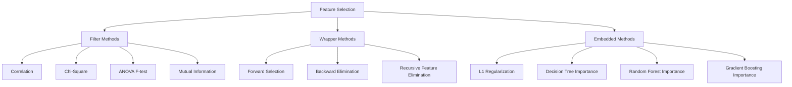
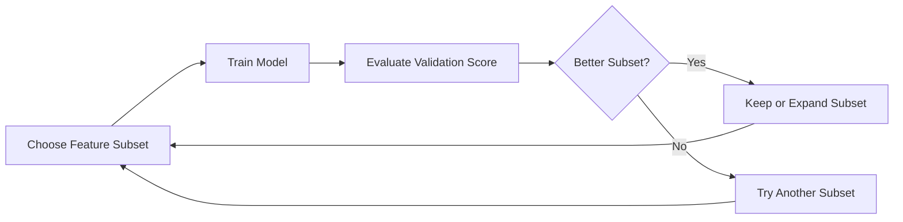
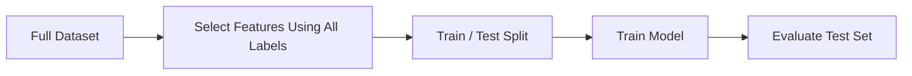
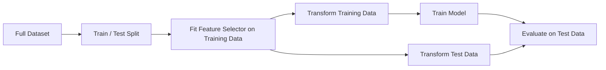
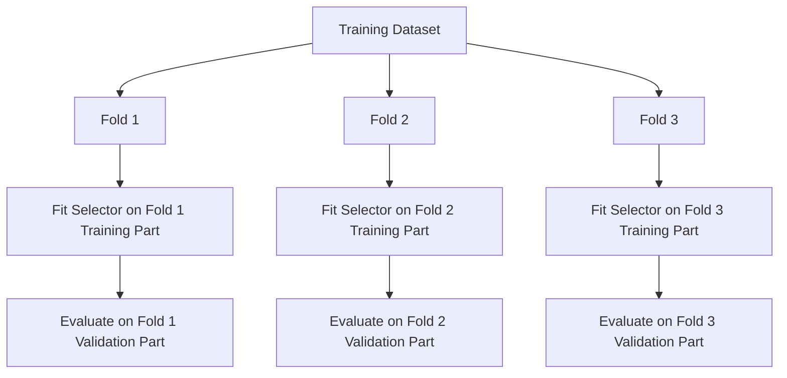
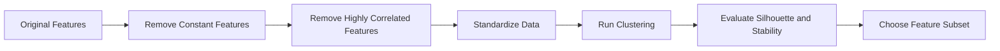
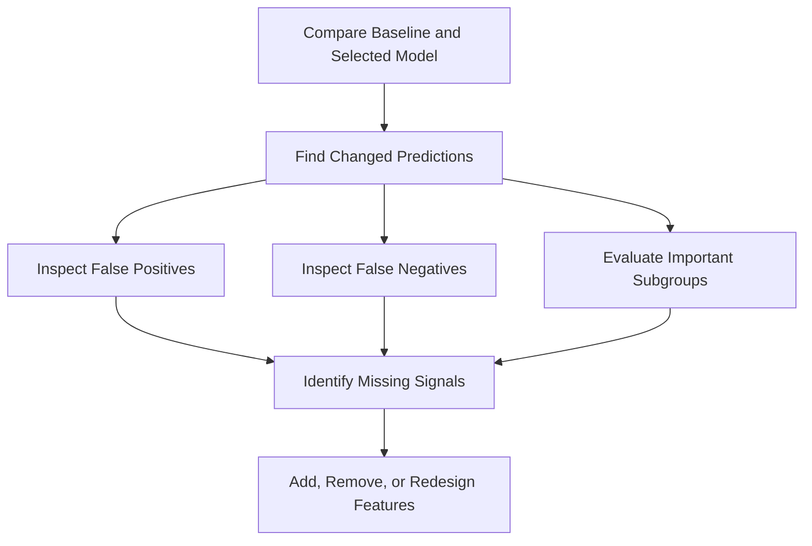
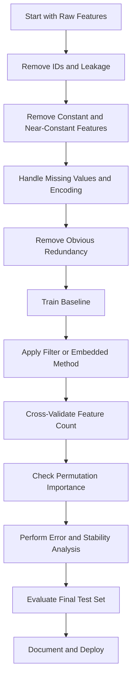
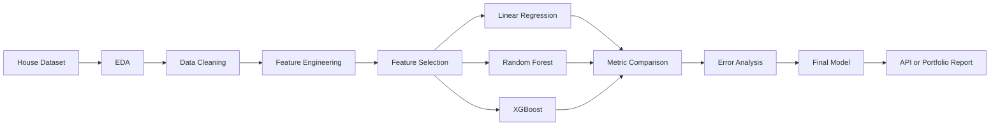

# 032 - Feature Selection

**Course:** 03 - Machine Learning and Deep Learning
**Module:** Module 06 - Machine Learning
**Content Group:** Feature Engineering
**Roadmap Source:** Machine Learning / Feature Engineering
**Lesson Type:** Machine Learning
**Order in Module:** 032
**Suggested Duration:** 26 minutes

---

## 1. Summary

**Feature Selection** is the process of choosing the most useful input variables for a machine learning model while removing irrelevant, redundant, noisy, or potentially harmful features.

A dataset may contain hundreds or thousands of features, but not all of them contribute useful predictive information. Some features may:

* Contain mostly noise
* Duplicate information from other features
* Increase training time
* Cause overfitting
* Make the model difficult to interpret
* Introduce data leakage
* Increase inference and data collection costs

Feature selection helps create models that are simpler, faster, easier to explain, and sometimes more accurate.

The main idea is:

> Keep the features that provide useful predictive information and remove those that do not.

---

## 2. Learning Objectives

After completing this lesson, you should be able to:

* Explain feature selection in your own words.
* Distinguish feature selection from feature extraction.
* Understand why removing features can improve a model.
* Identify filter, wrapper, and embedded selection methods.
* Apply feature selection only after splitting the dataset.
* Compare model performance before and after feature selection.
* Avoid data leakage during feature selection.
* Choose an appropriate feature-selection method for a dataset.
* Build a reusable feature-selection pipeline with scikit-learn.
* Document selected features, evaluation metrics, and assumptions.

---

## 3. What Is Feature Selection?

Suppose a dataset contains the following features for predicting house prices:

```text
area
number_of_rooms
number_of_bedrooms
location
building_age
owner_name
listing_id
nearby_school_score
distance_to_city_center
random_number
```

Some features are likely useful:

```text
area
number_of_rooms
location
building_age
nearby_school_score
distance_to_city_center
```

Some may be irrelevant or dangerous:

```text
owner_name
listing_id
random_number
```

Feature selection attempts to identify and retain the useful subset.

Formally, suppose the original feature set is:

$$
X = {x_1, x_2, x_3, \ldots, x_p}
$$

Feature selection produces a subset:

$$
X_{\text{selected}} \subseteq X
$$

The goal is to find a subset that preserves or improves predictive performance:

$$
\text{Performance}(X_{\text{selected}}) \geq \text{Performance}(X)
$$

while reducing complexity:

$$
|X_{\text{selected}}| < |X|
$$

---

## 4. Why Feature Selection Matters

### 4.1 Reduce Overfitting

A model may learn accidental patterns from irrelevant features.

For example:

```text
Training data:
customer_id appears correlated with churn

New production data:
customer_id has no meaningful relationship with churn
```

The model performs well on training data but poorly on unseen data.

Removing irrelevant features can improve generalization.

---

### 4.2 Improve Model Performance

More features do not automatically produce a better model.

Noisy features can reduce signal quality:

$$
X = \text{useful signal} + \text{irrelevant noise}
$$

Feature selection attempts to maximize the signal-to-noise ratio.

---

### 4.3 Reduce Training Time

Training cost generally increases as the number of features increases.

For many algorithms:

$$
\text{Training Cost} \propto n \times p
$$

where:

* (n) is the number of samples
* (p) is the number of features

Reducing (p) can significantly reduce training time.

---

### 4.4 Reduce Inference Cost

In production, every selected feature may require:

* A database query
* An API call
* A transformation
* Additional memory
* Additional network bandwidth

Removing unnecessary features can reduce prediction latency and infrastructure cost.

---

### 4.5 Improve Interpretability

A model using 12 meaningful features is usually easier to understand than a model using 2,000 features.

Feature selection can help answer questions such as:

* Why did the model make this prediction?
* Which variables influence the output?
* Which data sources are truly necessary?
* Can some expensive features be removed?

---

### 4.6 Reduce the Curse of Dimensionality

As the number of dimensions increases, data points become more sparse.

This can reduce the effectiveness of algorithms such as:

* K-Nearest Neighbors
* K-Means
* Hierarchical Clustering
* Density-based models

This challenge is known as the **curse of dimensionality**.

---

## 5. Feature Selection in the Machine Learning Workflow

```mermaid
flowchart LR
    A[Raw Data] --> B[Train / Validation / Test Split]
    B --> C[Fit Preprocessing on Training Data]
    C --> D[Fit Feature Selection on Training Data]
    D --> E[Transform Training and Validation Data]
    E --> F[Train Model]
    F --> G[Evaluate Metrics]
    G --> H[Error Analysis]
    H --> I[Finalize Selected Features]
    I --> J[Test Set Evaluation]
    J --> K[Deployment]
```



The most important rule is:

> Split the data before learning which features should be selected.

Feature selection must be fitted only on the training data.

---

## 6. Feature Selection vs. Feature Extraction

Feature selection and feature extraction are related but different.

| Aspect                     | Feature Selection                  | Feature Extraction                           |
| -------------------------- | ---------------------------------- | -------------------------------------------- |
| Main idea                  | Keep a subset of original features | Create new transformed features              |
| Original meaning preserved | Usually yes                        | Often reduced                                |
| Example                    | Select age, income, and debt       | Convert 100 variables into 10 PCA components |
| Interpretability           | Usually high                       | Often lower                                  |
| Common methods             | RFE, Lasso, mutual information     | PCA, autoencoders, embeddings                |

### Feature Selection

```text
Original:
age, income, city, customer_id, debt

Selected:
age, income, debt
```

### Feature Extraction

```text
Original:
x1, x2, x3, ..., x100

Transformed:
PC1, PC2, ..., PC10
```

---

## 7. Main Categories of Feature Selection

Feature-selection methods are commonly divided into three groups:



---

# 8. Filter Methods

Filter methods evaluate features using statistical properties without repeatedly training the final machine learning model.

They are usually:

* Fast
* Model-independent
* Suitable for high-dimensional datasets
* Easy to use as an initial screening step

---

## 8.1 Variance Threshold

A feature with almost no variation may contain little useful information.

Example:

| Customer | country_code |
| -------: | ------------ |
|        1 | VN           |
|        2 | VN           |
|        3 | VN           |
|        4 | VN           |
|        5 | VN           |

If nearly every sample has the same value, the feature may not help distinguish outcomes.

Variance is calculated as:

$$
\operatorname{Var}(X) = \frac{1}{n} \sum_{i=1}^{n}(x_i-\bar{x})^2
$$

A feature can be removed when:

$$
\operatorname{Var}(X_j) < \tau
$$

where (\tau) is a chosen threshold.

### Python Example

```python
from sklearn.feature_selection import VarianceThreshold

selector = VarianceThreshold(threshold=0.01)

X_train_selected = selector.fit_transform(X_train)
X_valid_selected = selector.transform(X_valid)

selected_columns = X_train.columns[selector.get_support()]

print(selected_columns.tolist())
```

### Limitation

A high-variance feature is not automatically useful. A random noise variable can have high variance but no predictive value.

---

## 8.2 Correlation-Based Selection

Correlation measures the strength of a relationship between variables.

The Pearson correlation coefficient is:

$$
r = \frac{ \sum_{i=1}^{n}(x_i-\bar{x})(y_i-\bar{y}) }{ \sqrt{\sum_{i=1}^{n}(x_i-\bar{x})^2} \sqrt{\sum_{i=1}^{n}(y_i-\bar{y})^2} }
$$

Its value ranges from:

$$
-1 \leq r \leq 1
$$

Interpretation:

| Correlation | Meaning                             |
| ----------: | ----------------------------------- |
|    Near (1) | Strong positive linear relationship |
|   Near (-1) | Strong negative linear relationship |
|    Near (0) | Weak linear relationship            |

### Example

```python
import pandas as pd

correlations = X_train.corrwith(y_train).abs()
selected_features = correlations[correlations > 0.20].index.tolist()

print(selected_features)
```

### Limitations

Correlation:

* Mainly detects linear relationships
* Does not imply causation
* May miss nonlinear predictive relationships
* Is not directly suitable for every categorical variable
* May select redundant features

---

## 8.3 Removing Highly Correlated Features

Two features may contain almost the same information.

Example:

```text
area_square_meters
area_square_feet
```

These features are strongly correlated because one is a direct conversion of the other.

Keeping both may:

* Increase redundancy
* Destabilize linear model coefficients
* Increase model complexity
* Make interpretation harder

### Python Example

```python
import numpy as np

correlation_matrix = X_train.corr().abs()

upper_triangle = correlation_matrix.where(
    np.triu(np.ones(correlation_matrix.shape), k=1).astype(bool)
)

features_to_drop = [
    column
    for column in upper_triangle.columns
    if any(upper_triangle[column] > 0.90)
]

X_train_reduced = X_train.drop(columns=features_to_drop)
X_valid_reduced = X_valid.drop(columns=features_to_drop)

print("Removed:", features_to_drop)
```

The threshold of `0.90` is only a starting point. It should be evaluated using cross-validation.

---

## 8.4 Chi-Square Test

The chi-square test measures dependence between categorical variables.

It is often used for:

* Categorical input features
* Non-negative count features
* Classification targets
* Bag-of-words or term-frequency features

The chi-square statistic is:

$$
\chi^2 = \sum \frac{(O-E)^2}{E}
$$

where:

* (O) is the observed frequency
* (E) is the expected frequency

A larger value suggests a stronger relationship between the feature and target.

### Python Example

```python
from sklearn.feature_selection import SelectKBest, chi2

selector = SelectKBest(score_func=chi2, k=10)

X_train_selected = selector.fit_transform(X_train, y_train)
X_valid_selected = selector.transform(X_valid)

selected_features = X_train.columns[selector.get_support()]

print(selected_features.tolist())
```

### Important Constraint

The chi-square implementation in scikit-learn requires non-negative feature values.

---

## 8.5 ANOVA F-Test

ANOVA evaluates whether the average feature values differ significantly among target classes.

For classification:

```python
from sklearn.feature_selection import SelectKBest, f_classif

selector = SelectKBest(score_func=f_classif, k=10)

X_train_selected = selector.fit_transform(X_train, y_train)
X_valid_selected = selector.transform(X_valid)
```

For regression:

```python
from sklearn.feature_selection import SelectKBest, f_regression

selector = SelectKBest(score_func=f_regression, k=10)

X_train_selected = selector.fit_transform(X_train, y_train)
X_valid_selected = selector.transform(X_valid)
```

ANOVA mainly captures linear relationships between individual features and the target.

---

## 8.6 Mutual Information

Mutual information measures how much knowing one variable reduces uncertainty about another variable.

It can detect both linear and nonlinear relationships.

$$
I(X;Y) = \sum_{x,y} p(x,y) \log \left( \frac{p(x,y)}{p(x)p(y)} \right)
$$

Interpretation:

* (I(X;Y)=0): the variables are independent
* Larger values: stronger dependency

### Classification Example

```python
from sklearn.feature_selection import SelectKBest
from sklearn.feature_selection import mutual_info_classif

selector = SelectKBest(
    score_func=mutual_info_classif,
    k=10
)

X_train_selected = selector.fit_transform(X_train, y_train)
X_valid_selected = selector.transform(X_valid)
```

### Regression Example

```python
from sklearn.feature_selection import mutual_info_regression

selector = SelectKBest(
    score_func=mutual_info_regression,
    k=10
)
```

### Advantages

* Detects nonlinear dependencies
* Works with different data distributions
* Useful when correlation is insufficient

### Limitations

* More computationally expensive than simple correlation
* Scores may vary due to estimation
* Still evaluates features mostly one at a time

---

# 9. Wrapper Methods

Wrapper methods evaluate feature subsets by training and testing a machine learning model.

The general process is:



Wrapper methods can capture interactions between features, but they are more computationally expensive.

---

## 9.1 Forward Selection

Forward selection begins with no features.

At each step:

1. Add one candidate feature.
2. Train the model.
3. Evaluate the validation score.
4. Keep the feature that gives the greatest improvement.
5. Repeat until a stopping condition is reached.

```text
Start: {}

Step 1: {area}
Step 2: {area, location}
Step 3: {area, location, age}
Step 4: Stop when improvement becomes too small
```

### Advantages

* Useful when the original feature set is large
* Starts with a simple model
* Can produce a compact subset

### Limitations

* May miss better combinations
* Once a feature is added, it may remain even if it becomes redundant later
* Requires many model-training iterations

---

## 9.2 Backward Elimination

Backward elimination begins with all features.

At each step:

1. Train the model with all remaining features.
2. Remove the least useful feature.
3. Evaluate performance.
4. Continue until the stopping condition is reached.

```text
Start:
{area, location, age, rooms, school_score, random_feature}

Remove random_feature

Remove one redundant feature

Stop when further removal reduces validation performance
```

### Limitation

Backward elimination may be expensive when the original dataset has many features.

---

## 9.3 Recursive Feature Elimination

Recursive Feature Elimination, or **RFE**, repeatedly:

1. Trains a model.
2. Ranks features by importance.
3. Removes the least important feature or group of features.
4. Trains the model again.

### Python Example

```python
from sklearn.feature_selection import RFE
from sklearn.linear_model import LogisticRegression

model = LogisticRegression(max_iter=2000)

selector = RFE(
    estimator=model,
    n_features_to_select=8,
    step=1
)

selector.fit(X_train, y_train)

selected_features = X_train.columns[selector.support_]

X_train_selected = selector.transform(X_train)
X_valid_selected = selector.transform(X_valid)

print(selected_features.tolist())
```

---

## 9.4 Recursive Feature Elimination with Cross-Validation

`RFECV` automatically searches for the number of selected features using cross-validation.

```python
from sklearn.feature_selection import RFECV
from sklearn.linear_model import LogisticRegression
from sklearn.model_selection import StratifiedKFold

model = LogisticRegression(max_iter=2000)

cv = StratifiedKFold(
    n_splits=5,
    shuffle=True,
    random_state=42
)

selector = RFECV(
    estimator=model,
    step=1,
    cv=cv,
    scoring="f1"
)

selector.fit(X_train, y_train)

print("Optimal number of features:", selector.n_features_)
print(
    "Selected features:",
    X_train.columns[selector.support_].tolist()
)
```

### Advantages

* Uses model performance directly
* Can detect useful feature combinations
* Automatically estimates the number of selected features

### Limitations

* Computationally expensive
* Results depend on the chosen estimator
* Can overfit if cross-validation is not designed carefully

---

# 10. Embedded Methods

Embedded methods perform feature selection during model training.

They combine some advantages of filter and wrapper methods.

---

## 10.1 L1 Regularization

L1 regularization adds the absolute values of model coefficients to the loss function.

$$
\mathcal{L}_{\text{L1}} = \mathcal{L}*{\text{original}} + \lambda \sum*{j=1}^{p}|w_j|
$$

L1 regularization can force some coefficients to exactly zero:

$$
w_j = 0
$$

A feature with a zero coefficient is effectively removed.

### Lasso Regression

```python
from sklearn.linear_model import Lasso

model = Lasso(alpha=0.01)
model.fit(X_train, y_train)

selected_features = X_train.columns[
    model.coef_ != 0
]

print(selected_features.tolist())
```

### Logistic Regression with L1 Penalty

```python
from sklearn.linear_model import LogisticRegression
from sklearn.feature_selection import SelectFromModel

model = LogisticRegression(
    penalty="l1",
    solver="liblinear",
    C=1.0,
    max_iter=2000
)

selector = SelectFromModel(model)
selector.fit(X_train, y_train)

selected_features = X_train.columns[
    selector.get_support()
]

print(selected_features.tolist())
```

### Important Note

Features should normally be scaled before applying L1 regularization because coefficient magnitude depends on feature scale.

---

## 10.2 Tree-Based Feature Importance

Decision trees select features when creating splits.

A feature may be considered important if it contributes strongly to impurity reduction.

For classification, Gini impurity is commonly calculated as:

$$
G = 1 - \sum_{k=1}^{K}p_k^2
$$

Tree-based models include:

* Decision Tree
* Random Forest
* Extra Trees
* Gradient Boosting
* XGBoost
* LightGBM
* CatBoost

### Python Example

```python
from sklearn.ensemble import RandomForestClassifier
from sklearn.feature_selection import SelectFromModel

model = RandomForestClassifier(
    n_estimators=300,
    random_state=42,
    n_jobs=-1
)

selector = SelectFromModel(
    estimator=model,
    threshold="median"
)

selector.fit(X_train, y_train)

selected_features = X_train.columns[
    selector.get_support()
]

X_train_selected = selector.transform(X_train)
X_valid_selected = selector.transform(X_valid)

print(selected_features.tolist())
```

---

## 10.3 Caution with Impurity-Based Importance

Tree feature importance can be biased toward:

* Continuous variables
* Features with many unique values
* High-cardinality categorical variables
* Variables with many possible split points

A random identifier may incorrectly appear important.

Therefore, impurity-based importance should be compared with permutation importance.

---

# 11. Permutation Importance

Permutation importance measures the decrease in model performance when one feature is randomly shuffled.

If shuffling a feature causes a large performance drop, the feature is likely important.

Let the original model score be:

$$
S_{\text{baseline}}
$$

Let the score after shuffling feature (j) be:

$$
S_{\text{shuffled},j}
$$

Then the permutation importance is:

$$
I_j = S_{\text{baseline}} - S_{\text{shuffled},j}
$$

### Python Example

```python
from sklearn.inspection import permutation_importance

model.fit(X_train, y_train)

result = permutation_importance(
    model,
    X_valid,
    y_valid,
    scoring="f1",
    n_repeats=10,
    random_state=42,
    n_jobs=-1
)

importance_table = (
    pd.DataFrame({
        "feature": X_valid.columns,
        "importance_mean": result.importances_mean,
        "importance_std": result.importances_std
    })
    .sort_values("importance_mean", ascending=False)
)

print(importance_table)
```

### Advantages

* Evaluates importance on validation data
* Works with almost any fitted model
* Measures contribution to an actual evaluation metric
* More reliable than training-only importance in many cases

### Limitations

* Can be slow
* Correlated features may hide each other's importance
* Results depend on the evaluation dataset

---

# 12. Feature Selection for Different Data Types

Different feature types may require different selection methods.

| Feature Type                   | Possible Methods                                                |
| ------------------------------ | --------------------------------------------------------------- |
| Continuous numerical           | Correlation, ANOVA, mutual information, Lasso                   |
| Binary numerical               | Chi-square, mutual information, tree importance                 |
| Categorical                    | Chi-square, mutual information, target-aware models             |
| Text counts                    | Chi-square, mutual information, L1 logistic regression          |
| High-dimensional sparse data   | L1 regularization, chi-square, SelectKBest                      |
| Time-series features           | Domain filtering, permutation importance, model-based selection |
| Image features                 | Embedded selection, regularization, dimensionality reduction    |
| Correlated numerical variables | Correlation filtering, VIF, L1, permutation importance          |

---

# 13. Multicollinearity and VIF

Multicollinearity occurs when one feature can be strongly explained by other features.

For feature (j), the Variance Inflation Factor is:

$$
\operatorname{VIF}_j = \frac{1}{1-R_j^2}
$$

where (R_j^2) is obtained by predicting feature (j) from the remaining features.

Typical interpretation:

|      VIF | Interpretation           |
| -------: | ------------------------ |
| Around 1 | Little multicollinearity |
|   1 to 5 | Moderate correlation     |
|  Above 5 | Potential concern        |
| Above 10 | Strong multicollinearity |

### Python Example

```python
import pandas as pd
from statsmodels.stats.outliers_influence import variance_inflation_factor

vif_table = pd.DataFrame({
    "feature": X_train.columns,
    "vif": [
        variance_inflation_factor(X_train.values, index)
        for index in range(X_train.shape[1])
    ]
})

print(vif_table.sort_values("vif", ascending=False))
```

High VIF does not always mean a feature must be removed. The decision depends on:

* Prediction performance
* Interpretability requirements
* Domain knowledge
* Model type
* Stability of coefficients

Tree-based models are generally less affected by multicollinearity than linear models, although redundant variables can still reduce interpretability.

---

# 14. Data Leakage in Feature Selection

Data leakage occurs when information unavailable at prediction time influences model training or evaluation.

Feature selection can cause leakage when it is performed before the data split.

## Incorrect Workflow



The test labels influenced the feature-selection decision.

The reported test score may therefore be overly optimistic.

---

## Correct Workflow



---

## Correct Pipeline Example

```python
from sklearn.pipeline import Pipeline
from sklearn.feature_selection import SelectKBest, mutual_info_classif
from sklearn.preprocessing import StandardScaler
from sklearn.linear_model import LogisticRegression

pipeline = Pipeline([
    (
        "selector",
        SelectKBest(
            score_func=mutual_info_classif,
            k=10
        )
    ),
    ("scaler", StandardScaler()),
    (
        "model",
        LogisticRegression(max_iter=2000)
    )
])

pipeline.fit(X_train, y_train)

validation_score = pipeline.score(X_valid, y_valid)

print("Validation score:", validation_score)
```

The pipeline ensures that feature selection is fitted only on the training partition during cross-validation.

---

# 15. Cross-Validation with Feature Selection

To evaluate a feature-selection method correctly, the selector must be refitted inside every cross-validation fold.



### Grid Search Example

```python
from sklearn.model_selection import GridSearchCV
from sklearn.pipeline import Pipeline
from sklearn.feature_selection import SelectKBest, mutual_info_classif
from sklearn.linear_model import LogisticRegression

pipeline = Pipeline([
    (
        "selector",
        SelectKBest(score_func=mutual_info_classif)
    ),
    (
        "model",
        LogisticRegression(max_iter=2000)
    )
])

parameter_grid = {
    "selector__k": [5, 10, 15, 20, "all"],
    "model__C": [0.1, 1.0, 10.0]
}

search = GridSearchCV(
    estimator=pipeline,
    param_grid=parameter_grid,
    scoring="f1",
    cv=5,
    n_jobs=-1
)

search.fit(X_train, y_train)

print("Best parameters:", search.best_params_)
print("Best CV score:", search.best_score_)
```

---

# 16. Feature Selection for Regression

For regression tasks, suitable methods include:

* Pearson correlation
* Spearman correlation
* `f_regression`
* `mutual_info_regression`
* Lasso
* Elastic Net
* Random Forest importance
* Gradient boosting importance
* Permutation importance
* RFE with a regression model

### Example

```python
from sklearn.pipeline import Pipeline
from sklearn.feature_selection import SelectKBest, mutual_info_regression
from sklearn.ensemble import RandomForestRegressor
from sklearn.metrics import mean_absolute_error

pipeline = Pipeline([
    (
        "selector",
        SelectKBest(
            score_func=mutual_info_regression,
            k=12
        )
    ),
    (
        "model",
        RandomForestRegressor(
            n_estimators=300,
            random_state=42,
            n_jobs=-1
        )
    )
])

pipeline.fit(X_train, y_train)

predictions = pipeline.predict(X_valid)

mae = mean_absolute_error(y_valid, predictions)

print("Validation MAE:", mae)
```

---

# 17. Feature Selection for Classification

For classification tasks, possible methods include:

* Chi-square
* ANOVA F-test
* Mutual information
* L1 logistic regression
* Random Forest importance
* Permutation importance
* RFE
* RFECV

### Example

```python
from sklearn.pipeline import Pipeline
from sklearn.feature_selection import SelectKBest, mutual_info_classif
from sklearn.ensemble import RandomForestClassifier
from sklearn.metrics import classification_report

pipeline = Pipeline([
    (
        "selector",
        SelectKBest(
            score_func=mutual_info_classif,
            k=15
        )
    ),
    (
        "model",
        RandomForestClassifier(
            n_estimators=300,
            class_weight="balanced",
            random_state=42,
            n_jobs=-1
        )
    )
])

pipeline.fit(X_train, y_train)

predictions = pipeline.predict(X_valid)

print(classification_report(y_valid, predictions))
```

---

# 18. Feature Selection for Unsupervised Learning

Feature selection is more difficult in unsupervised learning because there is no target variable.

Possible strategies include:

* Remove constant features
* Remove near-constant features
* Remove highly correlated features
* Remove features with excessive missing values
* Use domain knowledge
* Evaluate cluster stability
* Evaluate silhouette score
* Compare reconstruction or density metrics
* Use sparse clustering methods



For clustering, feature scale and feature relevance are especially important because distance calculations directly depend on the selected dimensions.

---

# 19. Domain Knowledge and Business Value

Statistical importance is not the only selection criterion.

A useful feature should also be evaluated using business and production constraints.

Consider:

| Question                            | Example                                                         |
| ----------------------------------- | --------------------------------------------------------------- |
| Is it available at prediction time? | Final payment status is unavailable before fraud prediction     |
| Is it expensive to collect?         | Credit bureau data may require a paid API                       |
| Is it stable over time?             | Marketing campaign ID may change every month                    |
| Is it ethically appropriate?        | Sensitive demographic data may create fairness risks            |
| Can it be computed in real time?    | A 24-hour aggregate may not be available instantly              |
| Does it create leakage?             | Post-event information cannot be used for pre-event predictions |
| Is it legally permitted?            | Some personal attributes may be restricted                      |

A slightly less accurate model may be preferable if it:

* Uses fewer data sources
* Has lower latency
* Is easier to explain
* Is more stable
* Is cheaper to operate
* Has lower fairness or privacy risk

---

# 20. Baseline Comparison

Feature selection should be treated as an experiment.

Always compare at least:

1. A simple baseline model
2. A model using all reasonable features
3. A model using selected features

Example experiment table:

| Experiment        | Features | Model             | Validation MAE | Training Time |
| ----------------- | -------: | ----------------- | -------------: | ------------: |
| Baseline          |        3 | Linear Regression |         31,200 |         0.1 s |
| All features      |       42 | Random Forest     |         21,400 |         8.5 s |
| Selected features |       16 | Random Forest     |         20,900 |         3.1 s |

The selected model is useful because it has:

* Lower MAE
* Fewer features
* Faster training
* Lower deployment complexity

However, feature selection is not successful when it only reduces feature count but damages the business metric significantly.

---

# 21. Choosing the Correct Evaluation Metric

Feature selection must be evaluated using the metric that matches the business objective.

### Classification

| Business Goal                | Possible Metric         |
| ---------------------------- | ----------------------- |
| Balanced classes             | Accuracy                |
| Detect fraud cases           | Recall                  |
| Avoid false fraud alerts     | Precision               |
| Balance precision and recall | F1-score                |
| Compare probability ranking  | ROC-AUC                 |
| Imbalanced ranking problem   | PR-AUC                  |
| Evaluate probability quality | Log loss or Brier score |

### Regression

| Business Goal                     | Possible Metric    |
| --------------------------------- | ------------------ |
| Average absolute prediction error | MAE                |
| Penalize large errors strongly    | RMSE               |
| Compare explained variance        | (R^2)              |
| Percentage-based error            | MAPE, with caution |

A feature subset selected using accuracy may not be optimal for recall or business cost.

---

# 22. Practical End-to-End Example

The following example compares a baseline model with a feature-selected model.

```python
import pandas as pd

from sklearn.datasets import load_breast_cancer
from sklearn.model_selection import train_test_split
from sklearn.pipeline import Pipeline
from sklearn.preprocessing import StandardScaler
from sklearn.feature_selection import SelectKBest, mutual_info_classif
from sklearn.linear_model import LogisticRegression
from sklearn.metrics import (
    accuracy_score,
    precision_score,
    recall_score,
    f1_score,
    roc_auc_score
)

# Load dataset
dataset = load_breast_cancer(as_frame=True)

X = dataset.data
y = dataset.target

# Split before feature selection
X_train, X_test, y_train, y_test = train_test_split(
    X,
    y,
    test_size=0.20,
    stratify=y,
    random_state=42
)

# Baseline model using all features
baseline_pipeline = Pipeline([
    ("scaler", StandardScaler()),
    (
        "model",
        LogisticRegression(max_iter=3000)
    )
])

baseline_pipeline.fit(X_train, y_train)

baseline_predictions = baseline_pipeline.predict(X_test)
baseline_probabilities = baseline_pipeline.predict_proba(X_test)[:, 1]

# Model with feature selection
selected_pipeline = Pipeline([
    (
        "selector",
        SelectKBest(
            score_func=mutual_info_classif,
            k=10
        )
    ),
    ("scaler", StandardScaler()),
    (
        "model",
        LogisticRegression(max_iter=3000)
    )
])

selected_pipeline.fit(X_train, y_train)

selected_predictions = selected_pipeline.predict(X_test)
selected_probabilities = selected_pipeline.predict_proba(X_test)[:, 1]


def evaluate_model(y_true, predictions, probabilities):
    """Return common binary classification metrics."""
    return {
        "accuracy": accuracy_score(y_true, predictions),
        "precision": precision_score(y_true, predictions),
        "recall": recall_score(y_true, predictions),
        "f1": f1_score(y_true, predictions),
        "roc_auc": roc_auc_score(y_true, probabilities)
    }


results = pd.DataFrame([
    {
        "experiment": "all_features",
        "number_of_features": X_train.shape[1],
        **evaluate_model(
            y_test,
            baseline_predictions,
            baseline_probabilities
        )
    },
    {
        "experiment": "selected_features",
        "number_of_features": 10,
        **evaluate_model(
            y_test,
            selected_predictions,
            selected_probabilities
        )
    }
])

print(results)

# Retrieve selected feature names
selector = selected_pipeline.named_steps["selector"]

selected_feature_names = X_train.columns[
    selector.get_support()
].tolist()

print("Selected features:")
for feature in selected_feature_names:
    print("-", feature)
```

---

# 23. Error Analysis After Feature Selection

A feature subset should not be accepted based only on one aggregate score.

Perform error analysis to understand:

* Which samples became incorrect?
* Which groups experienced lower performance?
* Did recall decrease for an important class?
* Did selected features remove useful minority signals?
* Did probability calibration change?
* Did prediction latency improve?
* Are the selected features stable across folds?

Example error-analysis workflow:



### Python Example

```python
error_table = X_test.copy()

error_table["actual"] = y_test
error_table["baseline_prediction"] = baseline_predictions
error_table["selected_prediction"] = selected_predictions

changed_predictions = error_table[
    error_table["baseline_prediction"]
    != error_table["selected_prediction"]
]

print(changed_predictions.head())
```

---

# 24. Feature Stability

A selected feature should ideally remain useful across:

* Different cross-validation folds
* Different random seeds
* Different time periods
* Different customer groups
* Different model versions

Suppose a feature is selected in only one out of ten cross-validation runs. It may be unstable.

A simple stability score is:

$$
\text{Stability}(x_j) = \frac{ \text{Number of runs selecting } x_j }{ \text{Total number of runs} }
$$

Example:

| Feature        | Selected Runs | Total Runs | Stability |
| -------------- | ------------: | ---------: | --------: |
| house_area     |            10 |         10 |      1.00 |
| location_score |             9 |         10 |      0.90 |
| random_feature |             2 |         10 |      0.20 |

Low-stability features should be investigated before deployment.

---

# 25. Common Mistakes

## 25.1 Selecting Features Before the Split

```python
# Incorrect
selector.fit(X, y)

X_selected = selector.transform(X)

X_train, X_test, y_train, y_test = train_test_split(
    X_selected,
    y
)
```

The feature selector has already seen the test labels.

Use a pipeline fitted only on training data.

---

## 25.2 Using the Test Set Repeatedly

The test set should be used only for the final evaluation.

Do not repeatedly change selected features based on test-set performance.

Use:

```text
Training set:
fit parameters

Validation set or cross-validation:
select features and tune models

Test set:
final unbiased evaluation
```

---

## 25.3 Selecting Features Using the Wrong Metric

A fraud model may require high recall, but selecting features using accuracy can produce a model that misses many fraud cases.

The selection metric must match the business objective.

---

## 25.4 Removing Features Only Because Correlation Is Low

A feature may have low Pearson correlation but still have a strong nonlinear relationship with the target.

Consider:

* Mutual information
* Tree-based models
* Partial dependence
* Permutation importance
* Domain knowledge

---

## 25.5 Trusting Feature Importance Without Validation

A model can assign high importance to:

* Identifiers
* Leakage features
* High-cardinality variables
* Spurious correlations
* Time-dependent artifacts

Importance must be evaluated on unseen data.

---

## 25.6 Removing Correlated Features Blindly

Two correlated features may have different:

* Missing-value patterns
* Collection costs
* Stability
* Business meanings
* Availability at inference time

The decision should include domain and production considerations.

---

## 25.7 Using a Complex Selection Method Without a Baseline

A complicated RFE or optimization process is not automatically better than:

* Removing constants
* Removing identifiers
* Removing leakage
* Keeping domain-relevant variables
* Training a regularized model

Always establish a baseline first.

---

## 25.8 Ignoring Preprocessing

Methods such as Lasso and logistic regression are sensitive to scale.

Categorical variables may need encoding.

Missing values may need imputation.

Feature selection should be part of the complete preprocessing pipeline.

---

## 25.9 Selecting Too Few Features

Aggressive feature removal may eliminate:

* Important interactions
* Minority-class signals
* Seasonal patterns
* Rare but important events

A smaller model is not automatically a better model.

---

## 25.10 Ignoring Production Availability

A highly predictive feature is useless if it is unavailable when the prediction must be made.

Always ask:

```text
Will this feature exist at inference time?
```

---

# 26. Recommended Feature-Selection Strategy

A practical strategy is:



Recommended order:

1. Remove impossible or invalid features.
2. Remove post-outcome and leakage features.
3. Remove identifiers without meaningful structure.
4. Remove constant or near-constant variables.
5. Build a baseline.
6. Try a simple filter or regularization method.
7. Compare cross-validation results.
8. Inspect feature stability.
9. Evaluate business and production costs.
10. Use the test set only once for final confirmation.

---

# 27. When Feature Selection May Not Be Necessary

Feature selection may provide limited benefits when:

* The dataset contains only a small number of meaningful variables.
* The model already uses strong regularization.
* The tree-based model handles irrelevant variables adequately.
* Predictive performance is stable and inference cost is acceptable.
* Removing variables would reduce interpretability.
* The model relies on interactions that univariate selection may remove.

Even in these cases, features should still be reviewed for:

* Leakage
* Privacy risk
* Cost
* Availability
* Stability
* Redundancy

---

# 28. Practical Exercise

## Dataset

Use a house-price dataset containing features such as:

```text
area
bedrooms
bathrooms
floors
building_age
distance_to_city_center
school_score
crime_rate
location
garage
listing_id
random_feature
sale_price
```

## Tasks

### Task 1: Build a Baseline

Train a Linear Regression or Random Forest model using all reasonable features.

Record:

* MAE
* RMSE
* (R^2)
* Number of features
* Training time

---

### Task 2: Remove Invalid Features

Remove:

* `listing_id`
* Known leakage variables
* Constant columns
* Features with excessive missingness

Explain each removal.

---

### Task 3: Apply Filter Methods

Try at least two methods:

* Correlation threshold
* Mutual information
* Variance threshold

Record the selected features.

---

### Task 4: Apply an Embedded Method

Try one of:

* Lasso
* Random Forest importance
* Gradient boosting importance

Compare the selected subset with the filter method.

---

### Task 5: Compare Models

Create an experiment table:

| Experiment   | Selection Method   | Features | Validation MAE | Validation RMSE | (R^2) |
| ------------ | ------------------ | -------: | -------------: | --------------: | ----: |
| Baseline     | None               |          |                |                 |       |
| Experiment 1 | Correlation        |          |                |                 |       |
| Experiment 2 | Mutual information |          |                |                 |       |
| Experiment 3 | Lasso              |          |                |                 |       |

---

### Task 6: Perform Error Analysis

Investigate:

* The five largest prediction errors
* Whether removing features increased errors for certain house types
* Whether the selected feature set is stable across folds
* Which feature should be engineered next

---

# 29. Suggested Mini-Project Integration

## Project: House Price Prediction

Use the following workflow:



Recommended experiments:

1. Raw numerical features
2. Engineered features without selection
3. Correlation-based selection
4. Mutual-information selection
5. Lasso-selected features
6. Random-Forest-selected features
7. Final XGBoost model with selected features

Portfolio artifacts may include:

* Jupyter Notebook
* Feature importance chart
* Correlation heatmap
* Experiment comparison table
* Error-analysis report
* Model card
* FastAPI prediction endpoint
* Dockerized inference service

---

# 30. Completion Checklist

* [ ] I can explain feature selection in one or two minutes.
* [ ] I understand why more features do not always improve a model.
* [ ] I can distinguish feature selection from feature extraction.
* [ ] I understand filter, wrapper, and embedded methods.
* [ ] I can apply variance threshold, correlation, and mutual information.
* [ ] I can use RFE or RFECV.
* [ ] I can use L1 regularization for feature selection.
* [ ] I can inspect tree-based and permutation importance.
* [ ] I split the data before fitting a feature selector.
* [ ] I place feature selection inside a machine learning pipeline.
* [ ] I compare the selected model with a baseline.
* [ ] I evaluate using the correct business metric.
* [ ] I have recorded at least one caveat or assumption.
* [ ] I have completed a notebook, chart, model, API, or portfolio note.

---

# 31. Key Takeaways

1. **Feature selection removes irrelevant, redundant, noisy, or costly variables.**

2. **The main methods are filter, wrapper, and embedded methods.**

3. **Filter methods are fast but may ignore interactions between features.**

4. **Wrapper methods evaluate subsets using model performance but can be expensive.**

5. **Embedded methods select features during model training.**

6. **Permutation importance evaluates feature contribution using unseen data.**

7. **Feature selection must be fitted only on training data.**

8. **Pipelines and cross-validation help prevent data leakage.**

9. **The best subset depends on the evaluation metric and business objective.**

10. **A selected feature should be predictive, stable, available, affordable, and safe to use.**

---

## 32. Related Outcome

Train, compare, and evaluate supervised and unsupervised machine learning models with thoughtful feature engineering and feature selection.

---

## 33. Related Project

**Mini Project:** House Price Prediction with:

* Exploratory Data Analysis
* Data Cleaning
* Feature Engineering
* Feature Selection
* Linear Regression
* Random Forest
* XGBoost
* Metric Comparison
* Error Analysis
* Model Deployment

---

## 34. Conclusion

**Feature Selection** is an important step in the AI and Data Scientist workflow.

Its purpose is not simply to reduce the number of columns. Its purpose is to build a model that is:

* Accurate
* Stable
* Efficient
* Explainable
* Affordable
* Safe from leakage
* Suitable for production

A successful feature-selection experiment should answer four questions:

```text
Which features were selected?
Why were they selected?
Did validation performance improve?
Will these features be available in production?
```

Turn this lesson into a practical artifact such as a notebook, experiment report, feature-importance chart, model comparison, API, Docker service, or portfolio case study.
