# 033 - Model Selection

**Course:** 03 - Machine Learning and Deep Learning
**Module:** Module 06 - Machine Learning
**Content Group:** Feature Engineering
**Roadmap Source:** Machine Learning / Feature Engineering
**Lesson Type:** Machine Learning
**Order in Module:** 033
**Suggested Duration:** 26 minutes

---

## 1. Summary

**Model Selection** is the process of comparing candidate machine learning models and choosing the one that best satisfies the technical and business requirements of a problem.

The goal is not simply to choose the model with the highest score. A good model should also be:

* Reliable on unseen data
* Appropriate for the business objective
* Resistant to overfitting
* Fast enough for production
* Easy enough to maintain
* Explainable when required
* Compatible with available data and infrastructure

A typical model-selection process compares:

* A simple baseline
* Several model families
* Different feature sets
* Different hyperparameters
* Multiple evaluation metrics
* Training and inference costs
* Model stability across validation folds

The central question is:

> Which model provides the best balance between predictive performance, complexity, reliability, and business value?

---

## 2. Learning Objectives

After completing this lesson, you should be able to:

* Explain model selection in your own words.
* Distinguish model selection from model training and hyperparameter tuning.
* Establish an appropriate baseline.
* Choose evaluation metrics based on the business problem.
* Compare multiple model families fairly.
* Use validation sets and cross-validation correctly.
* Recognize underfitting and overfitting.
* Avoid data leakage during model comparison.
* Select models using both technical and operational criteria.
* Build a reproducible model-selection pipeline.
* Document experiments and justify the final model choice.

---

## 3. What Is Model Selection?

Suppose you want to predict house prices.

Possible candidate models include:

```text
Mean-price baseline
Linear Regression
Ridge Regression
Decision Tree
Random Forest
Gradient Boosting
XGBoost
Neural Network
```

Each model has different properties.

| Model             | Strength                   | Limitation                          |
| ----------------- | -------------------------- | ----------------------------------- |
| Linear Regression | Fast and interpretable     | Assumes mostly linear relationships |
| Decision Tree     | Easy to visualize          | Can overfit                         |
| Random Forest     | Strong general performance | Larger and less interpretable       |
| Gradient Boosting | High predictive power      | Requires careful tuning             |
| Neural Network    | Can model complex patterns | Requires more data and computation  |

Model selection compares these candidates under the same experimental conditions.

Formally, suppose the candidate model set is:

$$
\mathcal{M} = {M_1, M_2, \ldots, M_k}
$$

The selected model is:

$$
M^* = \arg\max_{M_i \in \mathcal{M}} \operatorname{Score}(M_i)
$$

For an error metric such as MAE or RMSE, the objective becomes:

$$
M^* = \arg\min_{M_i \in \mathcal{M}} \operatorname{Error}(M_i)
$$

In practice, model selection is usually a multi-objective decision:

$$
M^* = f( \text{performance}, \text{latency}, \text{cost}, \text{stability}, \text{interpretability} )
$$

---

## 4. Model Selection in the Machine Learning Workflow


A good workflow separates:

* Model development
* Model comparison
* Final unbiased evaluation

The test set should not be used repeatedly during model selection.

---

## 5. Model Selection vs. Related Concepts

### 5.1 Model Training

Model training estimates model parameters from data.

For Linear Regression, training learns coefficients:

$$
\hat{y} = w_0 + w_1x_1 + \cdots + w_px_p
$$

The learned values (w_0, w_1, \ldots, w_p) are model parameters.

---

### 5.2 Hyperparameter Tuning

Hyperparameters are settings chosen before or during training.

Examples include:

```text
Random Forest:
- number of trees
- maximum depth
- minimum samples per leaf

XGBoost:
- learning rate
- maximum depth
- number of estimators

KNN:
- number of neighbors
- distance metric
```

Hyperparameter tuning searches for the best configuration of one model family.

---

### 5.3 Model Selection

Model selection can include comparing:

* Different model families
* Different preprocessing strategies
* Different feature sets
* Different hyperparameters
* Different decision thresholds

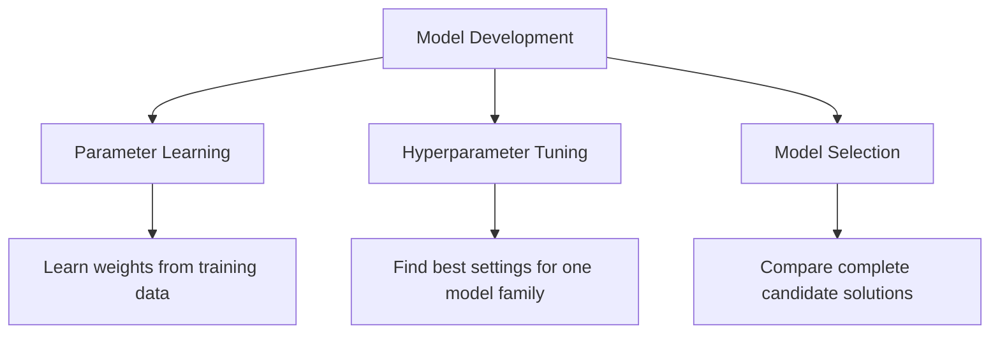

---

## 6. Start with the Business Problem

Before comparing models, define the actual decision the model will support.

Examples:

| Problem                | Prediction             | Business Decision           |
| ---------------------- | ---------------------- | --------------------------- |
| House price prediction | Estimated sale price   | Pricing and investment      |
| Customer churn         | Probability of leaving | Retention campaign          |
| Fraud detection        | Probability of fraud   | Block or review transaction |
| Medical screening      | Disease risk           | Request further examination |
| Demand forecasting     | Future demand          | Inventory planning          |

A technically strong model can still fail if it solves the wrong problem.

Important questions include:

* What decision will use the prediction?
* What is the cost of a false positive?
* What is the cost of a false negative?
* How quickly must predictions be produced?
* Does the model need to be explainable?
* How frequently will it be retrained?
* Which data will be available at inference time?

---

## 7. Establishing a Baseline

A baseline is a simple reference model used to judge whether a more complex model provides meaningful improvement.

Without a baseline, a score has little context.

---

### 7.1 Regression Baselines

A common regression baseline predicts the training-set mean:

$$
\hat{y}_i = \bar{y}_{\text{train}}
$$

Another option is the median:

$$
\hat{y}_i = \operatorname{median}(y_{\text{train}})
$$

The median is often more robust to outliers.

```python
from sklearn.dummy import DummyRegressor
from sklearn.metrics import mean_absolute_error

baseline = DummyRegressor(strategy="median")
baseline.fit(X_train, y_train)

predictions = baseline.predict(X_valid)

mae = mean_absolute_error(y_valid, predictions)

print("Baseline MAE:", mae)
```

---

### 7.2 Classification Baselines

Common classification baselines include:

* Predict the majority class
* Predict according to class frequencies
* Predict randomly
* Use a simple rule-based system

```python
from sklearn.dummy import DummyClassifier
from sklearn.metrics import classification_report

baseline = DummyClassifier(
    strategy="most_frequent"
)

baseline.fit(X_train, y_train)

predictions = baseline.predict(X_valid)

print(classification_report(y_valid, predictions))
```

---

### 7.3 Why the Baseline Matters

Suppose a classification model achieves:

```text
Accuracy = 92%
```

This may appear strong.

However, if 95% of the data belongs to one class, a majority-class baseline achieves:

```text
Accuracy = 95%
```

The trained model is therefore worse than the baseline.

---

## 8. Train, Validation, and Test Sets

A dataset is commonly divided into three parts.

| Dataset        | Purpose                                 |
| -------------- | --------------------------------------- |
| Training set   | Fit model parameters                    |
| Validation set | Compare models and tune hyperparameters |
| Test set       | Perform final unbiased evaluation       |

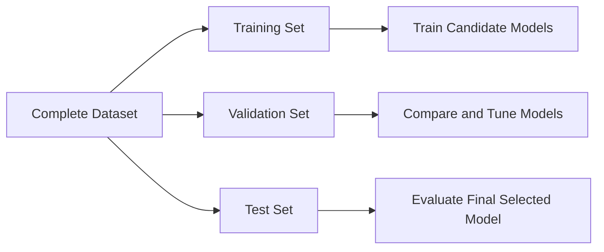

A common split is:

```text
Training:   70%
Validation: 15%
Test:       15%
```

The exact proportions depend on dataset size.

---

### Python Example

```python
from sklearn.model_selection import train_test_split

X_train_temp, X_test, y_train_temp, y_test = train_test_split(
    X,
    y,
    test_size=0.15,
    random_state=42
)

validation_ratio = 0.15 / 0.85

X_train, X_valid, y_train, y_valid = train_test_split(
    X_train_temp,
    y_train_temp,
    test_size=validation_ratio,
    random_state=42
)

print("Training samples:", len(X_train))
print("Validation samples:", len(X_valid))
print("Test samples:", len(X_test))
```

For classification, preserve the class distribution using stratification:

```python
X_train, X_test, y_train, y_test = train_test_split(
    X,
    y,
    test_size=0.20,
    stratify=y,
    random_state=42
)
```

---

## 9. Cross-Validation

A single validation split may produce unstable results.

Cross-validation evaluates a model using multiple train-validation partitions.

In (k)-fold cross-validation:

1. Divide the training data into (k) folds.
2. Train on (k-1) folds.
3. Validate on the remaining fold.
4. Repeat until every fold has been used for validation.
5. Average the scores.

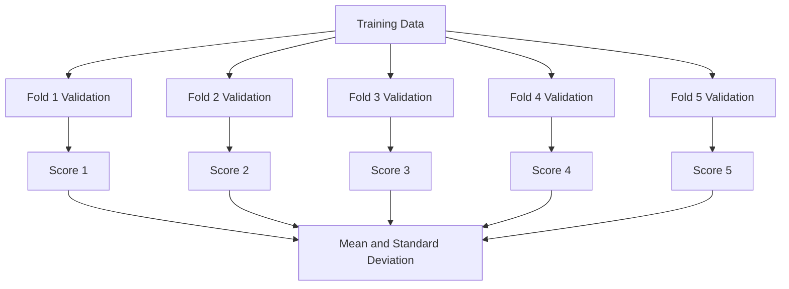

The average cross-validation score is:

$$
\bar{s} = \frac{1}{k} \sum_{i=1}^{k}s_i
$$

The standard deviation is:

$$
\sigma_s = \sqrt{ \frac{1}{k} \sum_{i=1}^{k}(s_i-\bar{s})^2 }
$$

A model with a slightly lower average score but much lower variation may be more reliable.

---

### Python Example

```python
from sklearn.model_selection import cross_validate
from sklearn.ensemble import RandomForestRegressor

model = RandomForestRegressor(
    n_estimators=300,
    random_state=42,
    n_jobs=-1
)

scores = cross_validate(
    estimator=model,
    X=X_train,
    y=y_train,
    cv=5,
    scoring={
        "mae": "neg_mean_absolute_error",
        "r2": "r2"
    },
    return_train_score=True,
    n_jobs=-1
)

mean_validation_mae = -scores["test_mae"].mean()
std_validation_mae = scores["test_mae"].std()

print("Mean validation MAE:", mean_validation_mae)
print("MAE standard deviation:", std_validation_mae)
```

---

## 10. Choosing the Correct Validation Strategy

Standard random cross-validation is not appropriate for every dataset.

### 10.1 Stratified Cross-Validation

Use stratification when classification classes are imbalanced.

```python
from sklearn.model_selection import StratifiedKFold

cv = StratifiedKFold(
    n_splits=5,
    shuffle=True,
    random_state=42
)
```

---

### 10.2 Group-Based Cross-Validation

Use group-based splitting when samples from the same entity must not appear in both training and validation sets.

Examples:

* Multiple transactions from the same customer
* Multiple images from the same patient
* Multiple records from the same machine
* Multiple observations from the same household

```python
from sklearn.model_selection import GroupKFold

cv = GroupKFold(n_splits=5)

for train_index, valid_index in cv.split(
    X,
    y,
    groups=customer_ids
):
    X_fold_train = X.iloc[train_index]
    X_fold_valid = X.iloc[valid_index]
```

---

### 10.3 Time-Series Validation

Future observations must not be used to predict the past.

Incorrect:

```text
Randomly mix 2022, 2023, and 2024 data
```

Correct:

```text
Train: January–June
Validate: July

Train: January–July
Validate: August

Train: January–August
Validate: September
```

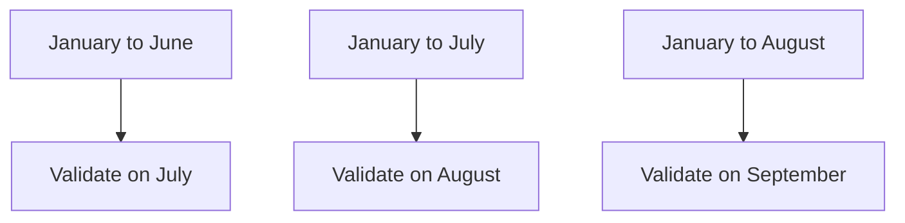

```python
from sklearn.model_selection import TimeSeriesSplit

cv = TimeSeriesSplit(n_splits=5)
```

---

## 11. Choosing Evaluation Metrics

A model should be selected using metrics that reflect the business objective.

---

## 11.1 Classification Metrics

### Accuracy

$$
\text{Accuracy} = \frac{TP+TN}{TP+TN+FP+FN}
$$

Accuracy is useful when:

* Classes are reasonably balanced.
* False positives and false negatives have similar costs.

---

### Precision

$$
\text{Precision} = \frac{TP}{TP+FP}
$$

Use precision when false positives are expensive.

Example:

```text
Do not incorrectly block legitimate financial transactions.
```

---

### Recall

$$
\text{Recall} = \frac{TP}{TP+FN}
$$

Use recall when false negatives are expensive.

Example:

```text
Detect as many fraudulent transactions as possible.
```

---

### F1-Score

$$
F_1 = 2 \cdot \frac{ \text{Precision}\cdot\text{Recall} }{ \text{Precision}+\text{Recall} }
$$

Use F1-score when precision and recall both matter.

---

### ROC-AUC

ROC-AUC evaluates how well the model ranks positive examples above negative examples across thresholds.

It is useful for comparing ranking performance, but may appear optimistic on highly imbalanced datasets.

---

### PR-AUC

Precision-Recall AUC is often more informative for rare positive classes.

Examples:

* Fraud detection
* Disease detection
* Equipment failure
* Rare-event detection

---

### Log Loss

Log loss evaluates the quality of predicted probabilities:

$$
-\frac{1}{n} \sum_{i=1}^{n} \left[ y_i\log(p_i) + (1-y_i)\log(1-p_i) \right]
$$

It penalizes confident incorrect predictions strongly.

---

## 11.2 Regression Metrics

### Mean Absolute Error

$$
MAE = \frac{1}{n} \sum_{i=1}^{n}|y_i-\hat{y}_i|
$$

MAE is easy to interpret because it uses the same unit as the target.

---

### Mean Squared Error

$$
MSE = \frac{1}{n} \sum_{i=1}^{n}(y_i-\hat{y}_i)^2
$$

MSE gives greater weight to large errors.

---

### Root Mean Squared Error

$$
RMSE = \sqrt{ \frac{1}{n} \sum_{i=1}^{n}(y_i-\hat{y}_i)^2 }
$$

RMSE has the same unit as the target while strongly penalizing large errors.

---

### R-Squared

$$
R^2 = 1- \frac{ \sum_{i=1}^{n}(y_i-\hat{y}_i)^2 }{ \sum_{i=1}^{n}(y_i-\bar{y})^2 }
$$

(R^2) measures how much variance is explained relative to a mean baseline.

---

## 12. Underfitting and Overfitting

Model selection must balance bias and variance.

---

### 12.1 Underfitting

A model underfits when it is too simple to learn the important patterns.

Typical signs:

```text
Training performance: poor
Validation performance: poor
```

Examples:

* Linear model for a strongly nonlinear relationship
* Very shallow decision tree
* Excessively strong regularization

---

### 12.2 Overfitting

A model overfits when it learns training-specific noise.

Typical signs:

```text
Training performance: excellent
Validation performance: poor
```

Examples:

* Very deep decision tree
* Too many polynomial features
* Excessively complex neural network
* Hyperparameter search that overuses one validation set

---

### 12.3 Good Generalization

```text
Training performance: strong
Validation performance: similarly strong
```

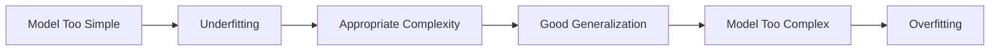

---

## 13. Bias-Variance Trade-Off

Prediction error can be viewed conceptually as:

$$
\text{Expected Error} = \text{Bias}^2 + \text{Variance} + \text{Irreducible Noise}
$$

### High Bias

The model makes overly simple assumptions.

```text
Likely result: underfitting
```

### High Variance

The model changes too much when the training data changes.

```text
Likely result: overfitting
```

The selected model should provide a reasonable balance.

---

## 14. Comparing Candidate Models

A fair comparison requires:

* The same training data
* The same validation folds
* The same preprocessing rules
* The same feature availability
* The same evaluation metric
* Reproducible random seeds
* Similar tuning effort

Example candidate models for regression:

```python
from sklearn.linear_model import LinearRegression, Ridge
from sklearn.ensemble import (
    RandomForestRegressor,
    GradientBoostingRegressor
)

models = {
    "linear_regression": LinearRegression(),
    "ridge": Ridge(alpha=1.0),
    "random_forest": RandomForestRegressor(
        n_estimators=300,
        random_state=42,
        n_jobs=-1
    ),
    "gradient_boosting": GradientBoostingRegressor(
        random_state=42
    )
}
```

---

## 15. Practical Model Comparison

```python
import pandas as pd

from sklearn.model_selection import cross_validate, KFold
from sklearn.pipeline import Pipeline
from sklearn.impute import SimpleImputer
from sklearn.preprocessing import StandardScaler
from sklearn.linear_model import LinearRegression, Ridge
from sklearn.ensemble import (
    RandomForestRegressor,
    GradientBoostingRegressor
)

models = {
    "linear_regression": LinearRegression(),
    "ridge": Ridge(alpha=1.0),
    "random_forest": RandomForestRegressor(
        n_estimators=300,
        random_state=42,
        n_jobs=-1
    ),
    "gradient_boosting": GradientBoostingRegressor(
        random_state=42
    )
}

cv = KFold(
    n_splits=5,
    shuffle=True,
    random_state=42
)

results = []

for model_name, model in models.items():
    pipeline = Pipeline([
        (
            "imputer",
            SimpleImputer(strategy="median")
        ),
        (
            "scaler",
            StandardScaler()
        ),
        (
            "model",
            model
        )
    ])

    scores = cross_validate(
        pipeline,
        X_train,
        y_train,
        cv=cv,
        scoring={
            "mae": "neg_mean_absolute_error",
            "rmse": "neg_root_mean_squared_error",
            "r2": "r2"
        },
        return_train_score=True,
        n_jobs=-1
    )

    results.append({
        "model": model_name,
        "train_mae": -scores["train_mae"].mean(),
        "validation_mae": -scores["test_mae"].mean(),
        "validation_mae_std": scores["test_mae"].std(),
        "validation_rmse": -scores["test_rmse"].mean(),
        "validation_r2": scores["test_r2"].mean()
    })

results_table = (
    pd.DataFrame(results)
    .sort_values("validation_mae")
)

print(results_table)
```

### Important Note

Scaling is essential for models such as:

* Linear Regression with regularization
* Logistic Regression
* Support Vector Machines
* K-Nearest Neighbors
* Neural Networks

Tree-based models usually do not require scaling. A real comparison may therefore use separate preprocessing pipelines for different model families.

---

## 16. Using a Column Transformer

Datasets often contain both numerical and categorical features.

```python
from sklearn.compose import ColumnTransformer
from sklearn.pipeline import Pipeline
from sklearn.preprocessing import (
    OneHotEncoder,
    StandardScaler
)
from sklearn.impute import SimpleImputer
from sklearn.linear_model import Ridge

numeric_features = [
    "area",
    "bedrooms",
    "bathrooms",
    "building_age"
]

categorical_features = [
    "location",
    "property_type"
]

numeric_pipeline = Pipeline([
    (
        "imputer",
        SimpleImputer(strategy="median")
    ),
    (
        "scaler",
        StandardScaler()
    )
])

categorical_pipeline = Pipeline([
    (
        "imputer",
        SimpleImputer(strategy="most_frequent")
    ),
    (
        "encoder",
        OneHotEncoder(
            handle_unknown="ignore"
        )
    )
])

preprocessor = ColumnTransformer([
    (
        "numeric",
        numeric_pipeline,
        numeric_features
    ),
    (
        "categorical",
        categorical_pipeline,
        categorical_features
    )
])

model_pipeline = Pipeline([
    (
        "preprocessor",
        preprocessor
    ),
    (
        "model",
        Ridge(alpha=1.0)
    )
])

model_pipeline.fit(X_train, y_train)
```

Using pipelines ensures that preprocessing is learned only from training data.

---

## 17. Hyperparameter Tuning

After identifying promising model families, tune their hyperparameters.

Common search strategies include:

* Grid Search
* Random Search
* Bayesian Optimization
* Successive Halving
* Optuna-style optimization

---

### 17.1 Grid Search

Grid Search evaluates every specified combination.

```python
from sklearn.model_selection import GridSearchCV
from sklearn.ensemble import RandomForestRegressor

pipeline = Pipeline([
    (
        "preprocessor",
        preprocessor
    ),
    (
        "model",
        RandomForestRegressor(
            random_state=42,
            n_jobs=-1
        )
    )
])

parameter_grid = {
    "model__n_estimators": [100, 300],
    "model__max_depth": [None, 10, 20],
    "model__min_samples_leaf": [1, 3, 5]
}

search = GridSearchCV(
    estimator=pipeline,
    param_grid=parameter_grid,
    scoring="neg_mean_absolute_error",
    cv=5,
    n_jobs=-1
)

search.fit(X_train, y_train)

print("Best parameters:", search.best_params_)
print("Best CV MAE:", -search.best_score_)
```

Grid Search can become expensive when many hyperparameters are included.

---

### 17.2 Random Search

Random Search evaluates randomly sampled combinations.

```python
from sklearn.model_selection import RandomizedSearchCV

parameter_distributions = {
    "model__n_estimators": [100, 200, 300, 500],
    "model__max_depth": [None, 5, 10, 20, 30],
    "model__min_samples_leaf": [1, 2, 3, 5, 10],
    "model__max_features": [
        "sqrt",
        "log2",
        None
    ]
}

search = RandomizedSearchCV(
    estimator=pipeline,
    param_distributions=parameter_distributions,
    n_iter=20,
    scoring="neg_mean_absolute_error",
    cv=5,
    random_state=42,
    n_jobs=-1
)

search.fit(X_train, y_train)
```

Random Search is often more efficient when the search space is large.

---

## 18. Nested Cross-Validation

When datasets are small, the same cross-validation process can accidentally be used both for tuning and performance estimation.

Nested cross-validation separates these tasks.

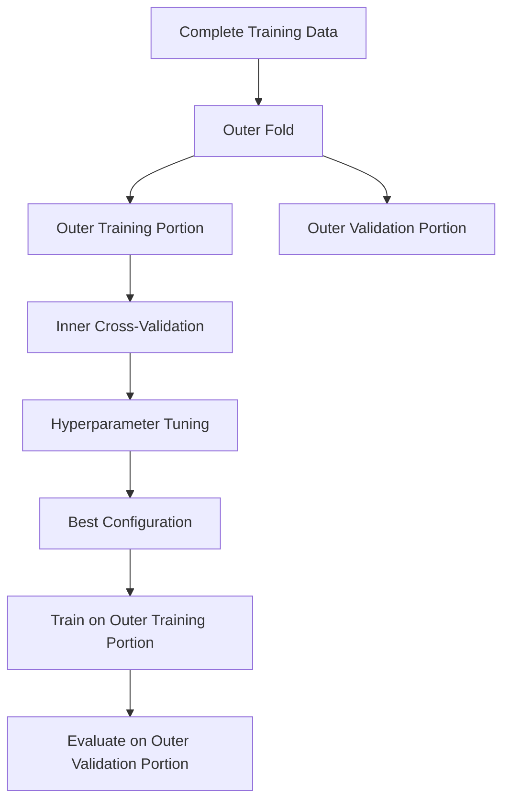

The inner loop tunes hyperparameters.

The outer loop estimates generalization performance.

Nested cross-validation is useful when:

* The dataset is small.
* Hyperparameter tuning is extensive.
* A reliable comparison is required.
* Model-selection bias is a concern.

---

## 19. Model Selection for Classification

Possible candidate models include:

```text
Dummy Classifier
Logistic Regression
Decision Tree
Random Forest
Support Vector Machine
Gradient Boosting
XGBoost
Neural Network
```

### Example

```python
import pandas as pd

from sklearn.model_selection import (
    StratifiedKFold,
    cross_validate
)
from sklearn.pipeline import Pipeline
from sklearn.preprocessing import StandardScaler
from sklearn.linear_model import LogisticRegression
from sklearn.ensemble import (
    RandomForestClassifier,
    GradientBoostingClassifier
)
from sklearn.svm import SVC

models = {
    "logistic_regression": LogisticRegression(
        max_iter=3000,
        class_weight="balanced"
    ),
    "random_forest": RandomForestClassifier(
        n_estimators=300,
        class_weight="balanced",
        random_state=42,
        n_jobs=-1
    ),
    "gradient_boosting": GradientBoostingClassifier(
        random_state=42
    ),
    "svm": SVC(
        probability=True,
        class_weight="balanced",
        random_state=42
    )
}

cv = StratifiedKFold(
    n_splits=5,
    shuffle=True,
    random_state=42
)

results = []

for model_name, model in models.items():
    pipeline = Pipeline([
        (
            "scaler",
            StandardScaler()
        ),
        (
            "model",
            model
        )
    ])

    scores = cross_validate(
        pipeline,
        X_train,
        y_train,
        cv=cv,
        scoring={
            "precision": "precision",
            "recall": "recall",
            "f1": "f1",
            "roc_auc": "roc_auc"
        },
        n_jobs=-1
    )

    results.append({
        "model": model_name,
        "precision": scores["test_precision"].mean(),
        "recall": scores["test_recall"].mean(),
        "f1": scores["test_f1"].mean(),
        "roc_auc": scores["test_roc_auc"].mean()
    })

comparison = (
    pd.DataFrame(results)
    .sort_values("f1", ascending=False)
)

print(comparison)
```

---

## 20. Model Selection for Regression

Possible candidate models include:

```text
Dummy Regressor
Linear Regression
Ridge
Lasso
Decision Tree
Random Forest
Gradient Boosting
XGBoost
Neural Network
```

Models should be compared using relevant metrics such as:

* MAE
* RMSE
* (R^2)
* Training time
* Prediction latency
* Model size

Example comparison table:

| Model             | CV MAE | CV RMSE | CV (R^2) | Training Time |
| ----------------- | -----: | ------: | -------: | ------------: |
| Median baseline   | 48,200 |  72,400 |    -0.01 |        0.01 s |
| Linear Regression | 31,100 |  47,300 |     0.69 |        0.04 s |
| Random Forest     | 22,600 |  35,700 |     0.82 |        3.80 s |
| Gradient Boosting | 21,900 |  34,800 |     0.84 |        1.90 s |

The Gradient Boosting model has the best average performance, but the final decision should still consider deployment requirements.

---

## 21. Model Selection for Unsupervised Learning

Model selection is more difficult in unsupervised learning because there may be no ground-truth target.

For clustering, compare:

* K-Means
* Hierarchical Clustering
* DBSCAN
* Gaussian Mixture Models

Possible evaluation criteria include:

* Silhouette score
* Davies-Bouldin score
* Calinski-Harabasz score
* Cluster stability
* Business usefulness
* Interpretability

### Silhouette Score

For sample (i):

$$
s(i) = \frac{b(i)-a(i)} {\max(a(i),b(i))}
$$

where:

* (a(i)) is the average distance to samples in the same cluster.
* (b(i)) is the average distance to the nearest other cluster.

The score ranges from (-1) to (1).

Higher values generally indicate better separation.

```python
from sklearn.cluster import KMeans
from sklearn.metrics import silhouette_score

results = []

for number_of_clusters in range(2, 11):
    model = KMeans(
        n_clusters=number_of_clusters,
        random_state=42,
        n_init="auto"
    )

    labels = model.fit_predict(X_scaled)

    score = silhouette_score(
        X_scaled,
        labels
    )

    results.append({
        "clusters": number_of_clusters,
        "silhouette_score": score
    })

print(pd.DataFrame(results))
```

A high internal clustering score does not guarantee that the clusters are useful for the business.

---

## 22. Decision Threshold Selection

For binary classification, the default probability threshold is commonly:

$$
0.5
$$

However, the best threshold depends on business costs.

```text
Probability >= threshold → positive class
Probability < threshold  → negative class
```

A fraud-detection system may lower the threshold to increase recall.

A system that automatically blocks customers may raise the threshold to increase precision.

---

### Python Example

```python
import numpy as np

from sklearn.metrics import (
    precision_score,
    recall_score,
    f1_score
)

probabilities = model.predict_proba(X_valid)[:, 1]

threshold_results = []

for threshold in np.arange(0.10, 0.91, 0.05):
    predictions = (
        probabilities >= threshold
    ).astype(int)

    threshold_results.append({
        "threshold": threshold,
        "precision": precision_score(
            y_valid,
            predictions,
            zero_division=0
        ),
        "recall": recall_score(
            y_valid,
            predictions,
            zero_division=0
        ),
        "f1": f1_score(
            y_valid,
            predictions,
            zero_division=0
        )
    })

threshold_table = pd.DataFrame(
    threshold_results
)

print(threshold_table)
```

Threshold selection is part of selecting the complete prediction system, not only the underlying algorithm.

---

## 23. Probability Calibration

Two models can have similar accuracy but different probability quality.

Example:

```text
Model A predicts 0.90 and is correct about 90% of the time.
Model B predicts 0.90 and is correct only 65% of the time.
```

Model A is better calibrated.

Calibration matters when probabilities are used for:

* Risk ranking
* Pricing
* Medical decisions
* Resource allocation
* Expected-value calculations

Possible calibration methods include:

* Platt scaling
* Isotonic regression
* Sigmoid calibration

```python
from sklearn.calibration import CalibratedClassifierCV

calibrated_model = CalibratedClassifierCV(
    estimator=base_model,
    method="isotonic",
    cv=5
)

calibrated_model.fit(X_train, y_train)
```

---

## 24. Error Analysis

Aggregate metrics do not explain where a model fails.

After comparing candidate models, inspect:

* False positives
* False negatives
* Largest regression errors
* Performance across important subgroups
* Errors across time periods
* Errors on rare cases
* Differences between model predictions

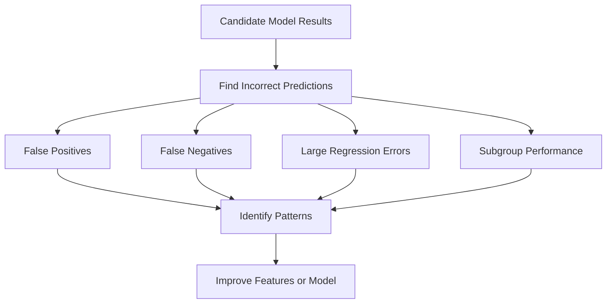

---

### Regression Error Analysis

```python
error_table = X_valid.copy()

error_table["actual"] = y_valid
error_table["prediction"] = predictions
error_table["absolute_error"] = (
    error_table["actual"]
    - error_table["prediction"]
).abs()

largest_errors = error_table.sort_values(
    "absolute_error",
    ascending=False
).head(20)

print(largest_errors)
```

---

### Classification Error Analysis

```python
error_table = X_valid.copy()

error_table["actual"] = y_valid
error_table["prediction"] = predictions
error_table["probability"] = probabilities

false_positives = error_table[
    (error_table["actual"] == 0)
    & (error_table["prediction"] == 1)
]

false_negatives = error_table[
    (error_table["actual"] == 1)
    & (error_table["prediction"] == 0)
]
```

---

## 25. Subgroup Evaluation

A model may perform well overall but poorly for an important group.

Examples of groups include:

* Geographic region
* Product category
* Customer segment
* Device type
* Time period
* Price range
* New versus existing customers

Example:

| Segment       | Samples |    MAE |
| ------------- | ------: | -----: |
| Apartments    |   2,100 | 18,400 |
| Townhouses    |     900 | 24,700 |
| Luxury houses |     300 | 61,900 |

The overall MAE may hide poor performance on luxury properties.

Model selection should consider whether the model is reliable for the groups that matter most.

---

## 26. Statistical and Practical Significance

A small metric difference may not justify selecting a more complex model.

Example:

| Model               | Mean CV F1 | Prediction Latency |
| ------------------- | ---------: | -----------------: |
| Logistic Regression |      0.841 |               3 ms |
| Gradient Boosting   |      0.846 |              48 ms |

The improvement is:

$$
0.846 - 0.841 = 0.005
$$

This may not justify:

* Sixteen times higher latency
* More difficult explanations
* Increased maintenance
* More complex deployment

The final choice should consider whether the improvement is practically meaningful.

---

## 27. Operational Selection Criteria

Predictive performance is only one dimension.

A production model may also be evaluated using:

| Criterion         | Question                                      |
| ----------------- | --------------------------------------------- |
| Inference latency | Can the model respond quickly enough?         |
| Throughput        | How many predictions can it process?          |
| Model size        | Can it fit on the target device?              |
| Training cost     | How expensive is retraining?                  |
| Feature cost      | Are required data sources expensive?          |
| Interpretability  | Can predictions be explained?                 |
| Maintainability   | Can the team support the model?               |
| Stability         | Does performance vary across time or folds?   |
| Fairness          | Does it perform consistently across groups?   |
| Privacy           | Does it require sensitive information?        |
| Robustness        | How does it handle missing or unusual inputs? |

---

## 28. Multi-Criteria Model Selection

A weighted decision score can be used when several criteria matter.

$$
S(M) = w_pP(M) - w_lL(M) - w_cC(M) + w_iI(M) + w_sS_t(M)
$$

where:

* (P(M)): predictive performance
* (L(M)): latency
* (C(M)): cost
* (I(M)): interpretability
* (S_t(M)): stability
* (w): business-defined weights

Example decision table:

| Model               | Accuracy | Latency | Explainability | Cost   | Decision               |
| ------------------- | -------: | ------: | -------------- | ------ | ---------------------- |
| Logistic Regression |     0.88 |     Low | High           | Low    | Strong candidate       |
| Random Forest       |     0.91 |  Medium | Medium         | Medium | Strong candidate       |
| Neural Network      |     0.92 |    High | Low            | High   | Reject for current use |

The highest-scoring model is not always the most appropriate production model.

---

## 29. Data Leakage During Model Selection

Data leakage occurs when information from outside the training process influences model development.

Common sources include:

* Scaling the complete dataset before splitting
* Imputing missing values using the complete dataset
* Selecting features using all labels
* Tuning models on the test set
* Including post-outcome variables
* Mixing the same customer across train and validation
* Randomly splitting time-series data

---

### Incorrect Workflow

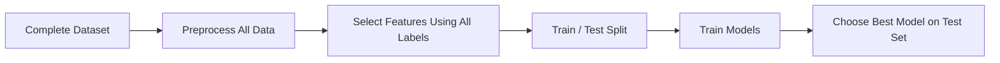

This process produces overly optimistic results.

---

### Correct Workflow

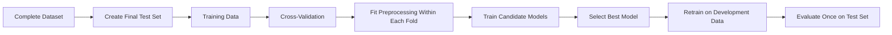

---

## 30. Repeated Test-Set Evaluation

Every time the test set influences a model decision, it becomes part of the training process.

Incorrect process:

```text
Evaluate model A on test set
Change features
Evaluate model B on test set
Tune hyperparameters
Evaluate model C on test set
Select the best test result
```

The test result is no longer unbiased.

Correct process:

```text
Use training and validation data for all decisions
Freeze the final pipeline
Evaluate once on the test set
```

---

## 31. Reproducible Experiments

A model-selection experiment should record:

* Dataset version
* Feature version
* Split strategy
* Random seed
* Preprocessing pipeline
* Model type
* Hyperparameters
* Validation metric
* Training time
* Inference latency
* Model artifact version
* Notes and assumptions

Example experiment table:

| Run | Features   | Model             | Parameters | CV MAE | CV Std | Notes       |
| --- | ---------- | ----------------- | ---------- | -----: | -----: | ----------- |
| 001 | Raw        | Linear Regression | Default    | 31,400 |  1,200 | Baseline    |
| 002 | Engineered | Random Forest     | 300 trees  | 22,300 |    950 | Strong      |
| 003 | Selected   | XGBoost           | depth 6    | 21,700 |    910 | Best score  |
| 004 | Selected   | Ridge             | alpha 1.0  | 27,900 |    700 | Most stable |

---

## 32. End-to-End Model-Selection Example

```python
import time
import pandas as pd

from sklearn.model_selection import (
    train_test_split,
    KFold,
    cross_validate
)
from sklearn.pipeline import Pipeline
from sklearn.impute import SimpleImputer
from sklearn.preprocessing import StandardScaler
from sklearn.dummy import DummyRegressor
from sklearn.linear_model import (
    LinearRegression,
    Ridge
)
from sklearn.ensemble import (
    RandomForestRegressor,
    GradientBoostingRegressor
)
from sklearn.metrics import (
    mean_absolute_error,
    mean_squared_error,
    r2_score
)

# Split the dataset before model development
X_train, X_test, y_train, y_test = train_test_split(
    X,
    y,
    test_size=0.20,
    random_state=42
)

models = {
    "median_baseline": DummyRegressor(
        strategy="median"
    ),
    "linear_regression": LinearRegression(),
    "ridge": Ridge(alpha=1.0),
    "random_forest": RandomForestRegressor(
        n_estimators=300,
        random_state=42,
        n_jobs=-1
    ),
    "gradient_boosting": GradientBoostingRegressor(
        random_state=42
    )
}

cv = KFold(
    n_splits=5,
    shuffle=True,
    random_state=42
)

experiment_results = []

for model_name, model in models.items():
    pipeline = Pipeline([
        (
            "imputer",
            SimpleImputer(strategy="median")
        ),
        (
            "scaler",
            StandardScaler()
        ),
        (
            "model",
            model
        )
    ])

    start_time = time.perf_counter()

    scores = cross_validate(
        pipeline,
        X_train,
        y_train,
        cv=cv,
        scoring={
            "mae": "neg_mean_absolute_error",
            "rmse": "neg_root_mean_squared_error",
            "r2": "r2"
        },
        n_jobs=-1,
        return_train_score=True
    )

    elapsed_time = (
        time.perf_counter() - start_time
    )

    experiment_results.append({
        "model": model_name,
        "train_mae": -scores[
            "train_mae"
        ].mean(),
        "validation_mae": -scores[
            "test_mae"
        ].mean(),
        "validation_mae_std": scores[
            "test_mae"
        ].std(),
        "validation_rmse": -scores[
            "test_rmse"
        ].mean(),
        "validation_r2": scores[
            "test_r2"
        ].mean(),
        "cv_time_seconds": elapsed_time
    })

comparison_table = (
    pd.DataFrame(experiment_results)
    .sort_values("validation_mae")
)

print(comparison_table)

# Select the model based on validation results
best_model = Pipeline([
    (
        "imputer",
        SimpleImputer(strategy="median")
    ),
    (
        "scaler",
        StandardScaler()
    ),
    (
        "model",
        GradientBoostingRegressor(
            random_state=42
        )
    )
])

# Retrain the selected pipeline on all training data
best_model.fit(X_train, y_train)

# Final test evaluation
test_predictions = best_model.predict(X_test)

test_mae = mean_absolute_error(
    y_test,
    test_predictions
)

test_rmse = mean_squared_error(
    y_test,
    test_predictions
) ** 0.5

test_r2 = r2_score(
    y_test,
    test_predictions
)

print("Final test MAE:", test_mae)
print("Final test RMSE:", test_rmse)
print("Final test R-squared:", test_r2)
```

---

## 33. Recommended Model-Selection Strategy

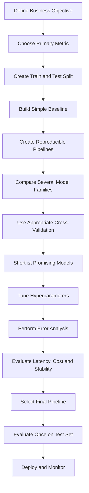

Recommended steps:

1. Define the business decision.
2. Choose one primary evaluation metric.
3. Define secondary metrics and constraints.
4. Reserve a final test set.
5. Build a simple baseline.
6. Create consistent preprocessing pipelines.
7. Compare several reasonable model families.
8. Use an appropriate cross-validation strategy.
9. Tune only promising models.
10. Analyze errors and subgroup performance.
11. Measure latency, size, and cost.
12. Select the complete model pipeline.
13. Evaluate once on the test set.
14. Document the decision and assumptions.
15. Deploy and monitor production performance.

---

## 34. Common Mistakes

### 34.1 Choosing the Model with the Best Training Score

A high training score may indicate overfitting.

Always evaluate on unseen validation data.

---

### 34.2 Using the Wrong Metric

Accuracy may be misleading for imbalanced classification.

(R^2) may not communicate actual prediction error in business units.

Choose metrics based on the decision being supported.

---

### 34.3 Selecting a Complex Model Without a Baseline

A complex model should demonstrate meaningful improvement over a simple baseline.

Complexity alone is not evidence of quality.

---

### 34.4 Tuning on the Test Set

The test set must remain independent of model-development decisions.

---

### 34.5 Applying Preprocessing Before Cross-Validation

This can leak information across folds.

Place preprocessing inside a pipeline.

---

### 34.6 Comparing Models on Different Data Splits

Candidate models should use the same validation folds.

Otherwise, score differences may come from the data split rather than the model.

---

### 34.7 Ignoring Score Variability

Compare both the average score and standard deviation.

```text
Model A: F1 = 0.84 ± 0.01
Model B: F1 = 0.85 ± 0.08
```

Model A may be more reliable despite a slightly lower mean score.

---

### 34.8 Ignoring Inference Requirements

A model that takes five seconds per prediction may be unsuitable for a real-time API.

---

### 34.9 Ignoring Feature Availability

A model cannot use a feature that does not exist at prediction time.

---

### 34.10 Selecting Models Only from One Family

Comparing only several Random Forest configurations is hyperparameter tuning, not broad model-family comparison.

Include models with different assumptions.

---

### 34.11 Tuning Every Candidate Extensively

First perform a coarse comparison.

Tune only the most promising candidates to avoid unnecessary cost.

---

### 34.12 Ignoring Error Analysis

Two models with the same aggregate metric may fail on different samples.

Review whether the errors are acceptable for the business.

---

## 35. Practical Exercise

### Dataset

Use a house-price dataset containing variables such as:

```text
area
bedrooms
bathrooms
floors
location
property_type
building_age
distance_to_city_center
school_score
crime_rate
garage
sale_price
```

---

### Task 1: Define the Objective

Write down:

* The prediction target
* The primary business metric
* The cost of large errors
* The expected inference environment

Example:

```text
Goal:
Predict sale price before a property is listed.

Primary metric:
MAE because it is easy to interpret in currency.

Secondary metric:
RMSE because large errors are especially costly.
```

---

### Task 2: Build a Baseline

Train a `DummyRegressor` using:

* Mean prediction
* Median prediction

Record MAE, RMSE, and (R^2).

---

### Task 3: Compare Candidate Models

Train at least:

* Linear Regression
* Ridge Regression
* Random Forest
* Gradient Boosting or XGBoost

Use the same five-fold cross-validation splits.

---

### Task 4: Tune Promising Models

Tune one linear model and one tree-based model.

Possible hyperparameters:

```text
Ridge:
- alpha

Random Forest:
- n_estimators
- max_depth
- min_samples_leaf

XGBoost:
- learning_rate
- max_depth
- n_estimators
- subsample
```

---

### Task 5: Create an Experiment Table

| Experiment | Model             | Features | CV MAE | CV RMSE | CV (R^2) | Training Time |
| ---------- | ----------------- | -------: | -----: | ------: | -------: | ------------: |
| Baseline   | Median            |        0 |        |         |          |               |
| Model 1    | Linear Regression |          |        |         |          |               |
| Model 2    | Ridge             |          |        |         |          |               |
| Model 3    | Random Forest     |          |        |         |          |               |
| Model 4    | XGBoost           |          |        |         |          |               |

---

### Task 6: Perform Error Analysis

Inspect:

* The ten largest absolute errors
* Errors by property type
* Errors by price range
* Errors by location
* Differences between the two strongest models

---

### Task 7: Select the Final Model

Write a short decision statement:

```text
The selected model is Gradient Boosting because it achieved the
lowest cross-validation MAE, remained stable across folds, and
met the required prediction-latency limit.

Random Forest achieved similar performance but produced a larger
model and slower inference.

Linear Regression remains the interpretability baseline.
```

---

## 36. Mini-Project Integration

## Project: House Price Prediction

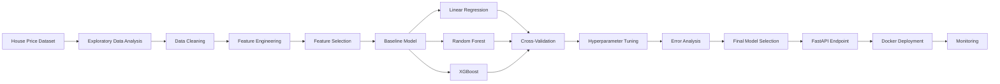

Suggested portfolio artifacts:

* Jupyter Notebook
* Data-quality report
* Feature-engineering documentation
* Cross-validation comparison table
* Hyperparameter-search results
* Error-analysis chart
* Model-selection decision report
* Saved model pipeline
* FastAPI prediction endpoint
* Docker image
* Model card

---

## 37. Model-Selection Decision Template

Use the following template in a notebook or portfolio report:

```text
Business objective:
Primary evaluation metric:
Secondary metrics:
Validation strategy:
Baseline model:
Candidate models:
Selected feature set:
Best cross-validation result:
Cross-validation variability:
Training time:
Prediction latency:
Interpretability requirement:
Known limitations:
Selected model:
Reason for selection:
Final test result:
Next experiment:
```

---

## 38. Completion Checklist

* [ ] I can explain model selection in one or two minutes.
* [ ] I understand the difference between training, tuning, and selection.
* [ ] I can build a simple baseline.
* [ ] I can create train, validation, and test sets correctly.
* [ ] I can use cross-validation for model comparison.
* [ ] I can choose a metric based on the business problem.
* [ ] I can identify underfitting and overfitting.
* [ ] I can compare multiple model families fairly.
* [ ] I can place preprocessing inside a pipeline.
* [ ] I understand why the test set should not guide model development.
* [ ] I can perform basic hyperparameter tuning.
* [ ] I can analyze false positives, false negatives, or large errors.
* [ ] I can evaluate training time and inference latency.
* [ ] I can justify the final model using technical and business criteria.
* [ ] I have created a notebook, chart, model, API, or portfolio note.
* [ ] I have documented at least one caveat or assumption.

---

## 39. Key Takeaways

1. **Model selection chooses the complete machine learning solution, not only an algorithm.**

2. **Always begin with a simple and meaningful baseline.**

3. **Use training data to fit parameters, validation data to make decisions, and the test set for final evaluation.**

4. **Cross-validation provides a more reliable comparison than one validation split.**

5. **The validation strategy must match the data structure.**

6. **Choose metrics according to business costs and objectives.**

7. **A high training score does not guarantee good generalization.**

8. **Compare candidate models using the same data, folds, and preprocessing rules.**

9. **Place preprocessing, feature selection, and modeling inside a pipeline to prevent leakage.**

10. **The model with the highest score is not always the best production model.**

11. **Latency, cost, interpretability, stability, fairness, and maintainability also matter.**

12. **Error analysis is necessary before accepting the final model.**

13. **The test set should be evaluated only after the complete pipeline has been selected.**

---

## 40. Related Outcome

Train, compare, and evaluate supervised and unsupervised machine learning models with thoughtful feature engineering and reliable model-selection practices.

---

## 41. Related Project

**Mini Project:** House Price Prediction with:

* Exploratory Data Analysis
* Data Cleaning
* Feature Engineering
* Feature Selection
* Baseline Modeling
* Linear Regression
* Random Forest
* XGBoost
* Cross-Validation
* Hyperparameter Tuning
* Metric Comparison
* Error Analysis
* Final Model Selection
* API Deployment

---

## 42. Conclusion

**Model Selection** is a critical stage in the AI and Data Scientist workflow.

Its purpose is not merely to find the algorithm with the highest validation score. Its purpose is to select a complete solution that:

* Solves the correct business problem
* Generalizes to unseen data
* Improves meaningfully over a baseline
* Uses appropriate features and metrics
* Avoids data leakage
* Produces acceptable errors
* Meets production constraints
* Can be monitored and maintained

A successful model-selection process should answer:

```text
Which candidate models were compared?
Which validation strategy was used?
Which metric represented the business objective?
How stable were the results?
What kinds of errors did each model make?
Why was the final model selected?
Will it work reliably in production?
```

Turn this lesson into a practical artifact such as a notebook, experiment table, evaluation dashboard, trained pipeline, model card, FastAPI service, Docker deployment, or portfolio case study.
