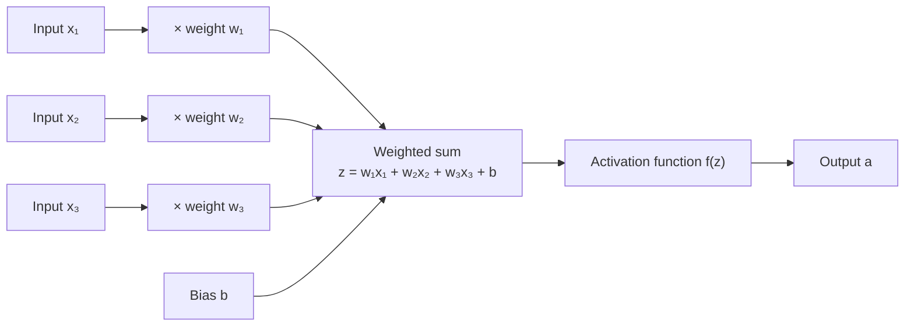
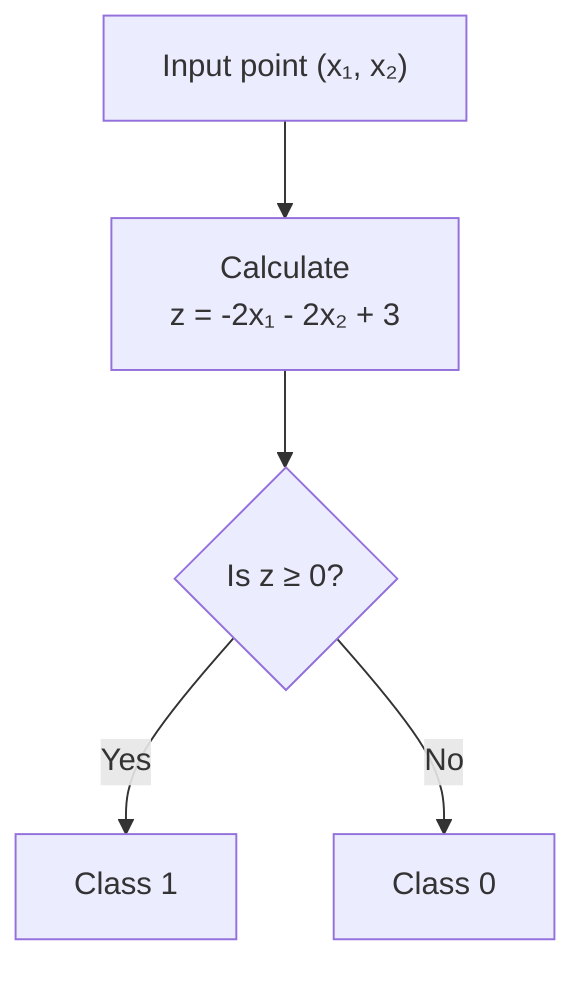
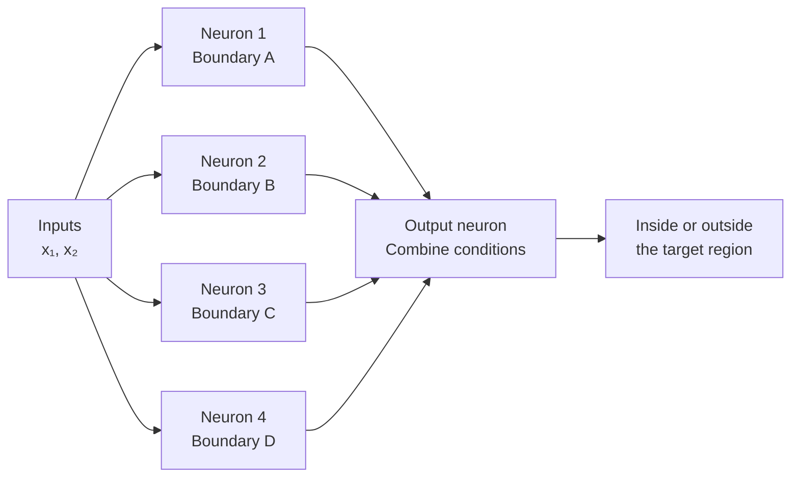
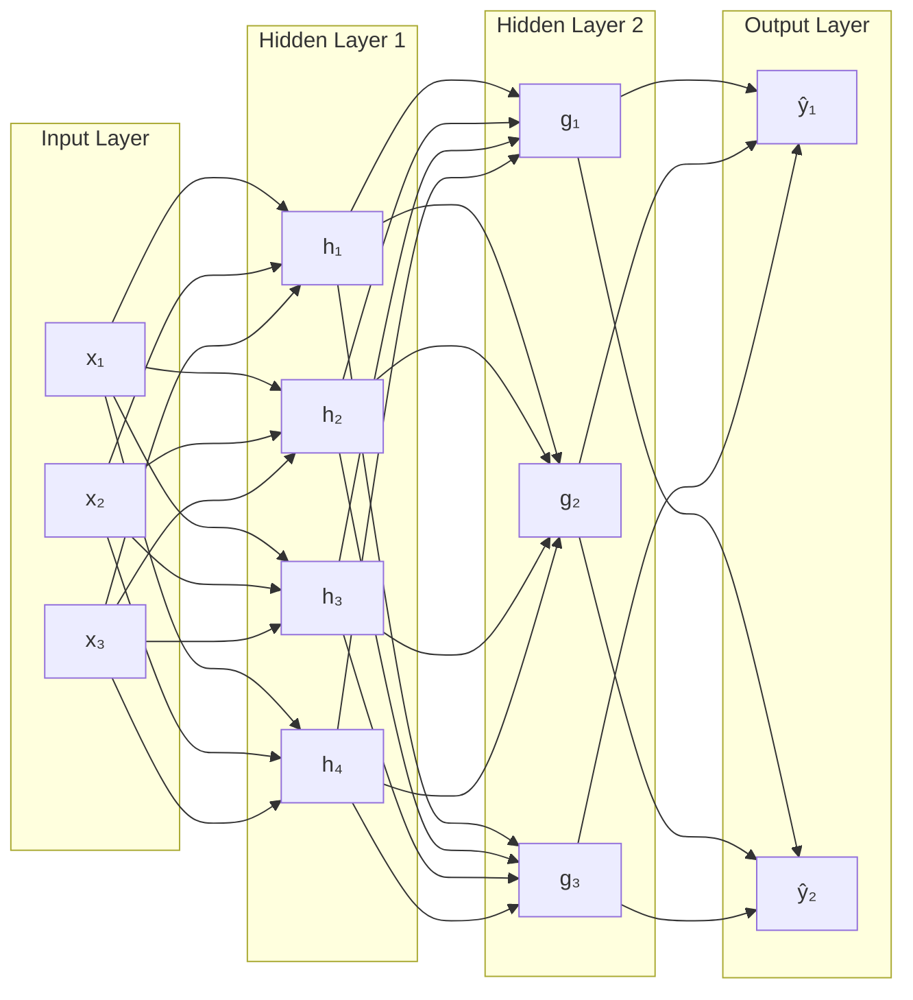
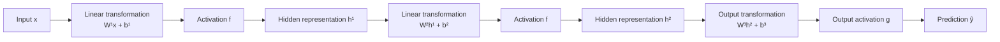
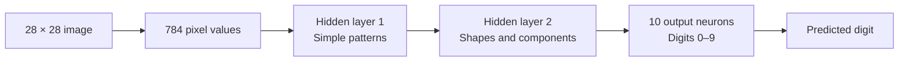
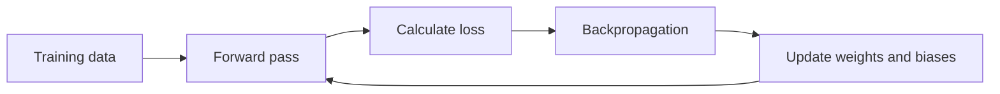

# 002 — Neuron

**Course:** 03 — Machine Learning and Deep Learning
**Module:** Module 07 — Deep Learning
**Content Group:** Neural Network Basics
**Roadmap Source:** Deep Learning / Neural Network Basics
**Lesson Type:** Deep Learning
**Order in Module:** 002
**Suggested Duration:** 24 minutes

---

## 1. Summary

A **neuron** is the basic computational unit of an artificial neural network.

It receives several input values, multiplies each input by a learnable weight, adds a bias, and passes the result through an activation function.

The general computation is:

$$
z = \sum_{i=1}^{n} w_i x_i + b
$$

$$
a = f(z)
$$

where:

* (x_i) is an input feature.
* (w_i) is the weight associated with that feature.
* (b) is the bias.
* (z) is the weighted sum before activation.
* (f) is the activation function.
* (a) is the neuron’s output, also called its activation.

A single neuron can behave like a **linear classifier**. Multiple neurons arranged into layers can represent much more complicated decision boundaries and learn hierarchical patterns.

---

## 2. Learning Objectives

After completing this lesson, you should be able to:

* Explain what an artificial neuron does.
* Identify the roles of inputs, weights, bias, and activation functions.
* Calculate the output of a neuron manually.
* Explain why a single neuron is a linear classifier.
* Describe how multiple neurons create more complex decision regions.
* Distinguish between input, hidden, and output layers.
* Implement a simple neuron using Python and NumPy.
* Explain why nonlinear activation functions are necessary.

---

## 3. What Is an Artificial Neuron?

An artificial neuron is a mathematical function that transforms a vector of inputs into an output.



The neuron performs three main operations:

1. Multiply each input by a weight.
2. Add the weighted inputs and the bias.
3. Apply an activation function.

In vector notation, the same computation is:

$$
z = \mathbf{w}^{T}\mathbf{x} + b
$$

$$
a = f(\mathbf{w}^{T}\mathbf{x} + b)
$$

This compact notation is important because neural networks are implemented efficiently using matrix and vector operations.

---

## 4. Components of a Neuron

### 4.1 Inputs

Inputs represent the information given to the neuron.

For example, in a house-price prediction model, the inputs may include:

$$
\mathbf{x} = \begin{bmatrix} \text{area} \ \text{number of bedrooms} \ \text{building age} \end{bmatrix}
$$

In image recognition, the inputs may be pixel values.

For a grayscale image with a resolution of (28 \times 28), the number of input values is:

$$
28 \times 28 = 784
$$

Each pixel can be represented by a value between (0) and (1).

---

### 4.2 Weights

A weight controls the influence of an input on the neuron’s output.

* A large positive weight increases the neuron’s output when the input is large.
* A large negative weight decreases the neuron’s output.
* A weight close to zero means that the corresponding input has little influence.

For example:

$$
z = 2x_1 - 3x_2 + 0.5x_3
$$

Here:

* (x_1) has a positive influence.
* (x_2) has a negative influence.
* (x_3) has a relatively small positive influence.

Weights are not normally selected manually. They are learned from data during training.

---

### 4.3 Bias

The bias allows the neuron to shift its decision boundary.

Without a bias:

$$
z = \mathbf{w}^{T}\mathbf{x}
$$

The decision boundary must pass through the origin.

With a bias:

$$
z = \mathbf{w}^{T}\mathbf{x} + b
$$

The boundary can move to a more appropriate position.

The bias is similar to the intercept in linear regression:

$$
y = mx + c
$$

where (c) plays a role similar to the bias.

---

### 4.4 Activation Function

The activation function transforms the weighted sum into the neuron’s final output:

$$
a = f(z)
$$

Activation functions provide **nonlinearity**.

Without nonlinear activation functions, stacking many neural-network layers would still be equivalent to applying one linear transformation.

For example:

$$
\mathbf{h} = W_1\mathbf{x}
$$

$$
\mathbf{y} = W_2\mathbf{h}
$$

Substituting the first equation into the second:

$$
\mathbf{y} = W_2W_1\mathbf{x}
$$

Because (W_2W_1) is another matrix, the entire network remains linear.

With an activation function:

$$
\mathbf{h} = f(W_1\mathbf{x} + \mathbf{b}_1)
$$

$$
\mathbf{y} = W_2\mathbf{h} + \mathbf{b}_2
$$

the model can represent nonlinear relationships.

---

## 5. Manual Neuron Calculation

Consider a neuron with two inputs:

$$
x_1 = 2
$$

$$
x_2 = 3
$$

The weights and bias are:

$$
w_1 = 0.5
$$

$$
w_2 = -1
$$

$$
b = 2
$$

First, calculate the weighted sum:

$$
z = w_1x_1 + w_2x_2 + b
$$

$$
z = (0.5)(2) + (-1)(3) + 2
$$

$$
z = 1 - 3 + 2 = 0
$$

If the neuron uses the sigmoid activation function:

$$
\sigma(z) = \frac{1}{1 + e^{-z}}
$$

then:

$$
a = \sigma(0) = 0.5
$$

The neuron produces an output of:

$$
\boxed{0.5}
$$

---

## 6. A Single Neuron as a Linear Classifier

A single neuron can divide an input space using a line, plane, or hyperplane.

Consider a neuron with two inputs:

$$
z = -2x_1 - 2x_2 + 3
$$

If a step activation is used, the neuron may output:

$$
a = \begin{cases} 1, & z \geq 0 \ 0, & z < 0 \end{cases}
$$

The decision boundary occurs when:

$$
z = 0
$$

Therefore:

$$
-2x_1 - 2x_2 + 3 = 0
$$

Rearranging:

$$
x_2 = -x_1 + 1.5
$$

This equation represents a straight line.



Changing the weights changes the orientation of the line.

Changing the bias changes the position of the line.

Because the boundary is linear, a single neuron cannot directly represent complicated nonlinear regions.

---

## 7. Why Do We Need Multiple Neurons?

Suppose the positive class is located inside a polygon-shaped region.

A single line cannot completely surround that region. However, multiple neurons can each represent one linear condition.

For example:

* Neuron 1 checks whether a point is below the top boundary.
* Neuron 2 checks whether it is above the bottom boundary.
* Neuron 3 checks whether it is to the right of the left boundary.
* Neuron 4 checks whether it is to the left of the right boundary.

An output neuron can combine these conditions.



If all four boundary neurons output (1), the output neuron can classify the point as belonging to the target region.

This demonstrates an important idea:

> A neural network combines simple decision boundaries to construct more complex decision regions.

In higher-dimensional datasets, each neuron creates a hyperplane instead of a two-dimensional line.

---

## 8. Perceptron and Modern Neuron

A **perceptron** is an early type of artificial neuron.

It commonly uses a step activation:

$$
f(z) = \begin{cases} 1, & z \geq 0 \ 0, & z < 0 \end{cases}
$$

A modern neural-network neuron usually follows the same weighted-sum structure but uses a differentiable or piecewise-differentiable activation function such as:

* ReLU
* Leaky ReLU
* Sigmoid
* Tanh
* GELU

The general form remains:

$$
a = f(\mathbf{w}^{T}\mathbf{x} + b)
$$

---

## 9. Common Activation Functions

### 9.1 Step Function

$$
f(z) = \begin{cases} 1, & z \geq 0 \ 0, & z < 0 \end{cases}
$$

The step function is useful for explaining perceptrons, but it is not normally used for training modern neural networks because its gradient is zero or undefined.

---

### 9.2 Sigmoid

$$
\sigma(z) = \frac{1}{1 + e^{-z}}
$$

Output range:

$$
0 < \sigma(z) < 1
$$

Typical use:

* Binary classification output layers
* Probability-like outputs

Advantages:

* Smooth and differentiable
* Produces values between (0) and (1)

Limitations:

* Can suffer from vanishing gradients.
* Saturates for large positive or negative inputs.
* Outputs are not zero-centered.

---

### 9.3 Hyperbolic Tangent

$$
\tanh(z) = \frac{e^z-e^{-z}}{e^z+e^{-z}}
$$

Output range:

$$
-1 < \tanh(z) < 1
$$

Compared with sigmoid, tanh is zero-centered. However, it can still suffer from gradient saturation.

---

### 9.4 ReLU

The Rectified Linear Unit is defined as:

$$
\operatorname{ReLU}(z) = \max(0,z)
$$

```text
z < 0  → output = 0
z ≥ 0  → output = z
```

ReLU is widely used in hidden layers because it is simple and computationally efficient.

Advantages:

* Fast to calculate
* Does not saturate for positive values
* Often supports faster training than sigmoid or tanh

Limitation:

* A neuron can become permanently inactive if it always receives negative inputs.

This problem is called the **dying ReLU problem**.

---

### 9.5 Leaky ReLU

Leaky ReLU allows a small negative output:

$$
f(z) = \begin{cases} z, & z \geq 0 \ \alpha z, & z < 0 \end{cases}
$$

where (\alpha) may be approximately (0.01).

It reduces the risk that a neuron becomes permanently inactive.

---

### 9.6 Activation Function Comparison

| Activation | Formula                          |                 Output range | Common usage            |
| ---------- | -------------------------------- | ---------------------------: | ----------------------- |
| Step       | (1) if (z \geq 0), otherwise (0) |                   (0) or (1) | Basic perceptron        |
| Sigmoid    | (\frac{1}{1+e^{-z}})             |                      ((0,1)) | Binary output           |
| Tanh       | (\tanh(z))                       |                     ((-1,1)) | Some recurrent networks |
| ReLU       | (\max(0,z))                      |                 ([0,\infty)) | Hidden layers           |
| Leaky ReLU | (\max(\alpha z,z))               |           ((-\infty,\infty)) | Hidden layers           |
| Softmax    | (\frac{e^{z_i}}{\sum_j e^{z_j}}) | Probabilities summing to (1) | Multiclass output       |

---

## 10. From Neurons to Neural Networks

A neural network organizes neurons into layers.

The main layer types are:

1. Input layer
2. Hidden layer or layers
3. Output layer



### Input Layer

The input layer stores the original feature values.

It usually does not perform the weighted-sum computation associated with hidden neurons.

For an MNIST image:

$$
28 \times 28 = 784
$$

Therefore, the input layer contains 784 input units.

---

### Hidden Layers

Hidden layers transform the original input into intermediate representations.

For image recognition, a useful conceptual hierarchy might be:

```text
Pixels
  ↓
Edges
  ↓
Shapes and curves
  ↓
Object or digit components
  ↓
Predicted class
```

These interpretations are useful for understanding neural networks, although real hidden neurons do not always learn concepts that are so easy to name.

---

### Output Layer

The output layer produces the model’s prediction.

Examples:

* One output neuron for regression
* One sigmoid neuron for binary classification
* Multiple softmax neurons for multiclass classification

For handwritten digit classification, the output layer contains 10 neurons:

```text
Neuron 0 → digit 0
Neuron 1 → digit 1
Neuron 2 → digit 2
...
Neuron 9 → digit 9
```

The neuron with the highest output determines the predicted digit.

---

## 11. Fully Connected Layers

A layer is **fully connected** when every neuron in one layer is connected to every neuron in the next layer.

Suppose:

* The input layer contains 3 features.
* The hidden layer contains 4 neurons.

Each hidden neuron requires 3 weights.

The total number of weights is:

$$
3 \times 4 = 12
$$

Each hidden neuron also has one bias:

$$
4 \text{ biases}
$$

Therefore, the layer contains:

$$
12 + 4 = 16
$$

learnable parameters.

In general, for a fully connected layer with:

* (n_{\text{in}}) input units
* (n_{\text{out}}) output units

the parameter count is:

$$
n_{\text{in}}n_{\text{out}} + n_{\text{out}}
$$

or:

$$
(n_{\text{in}} + 1)n_{\text{out}}
$$

---

## 12. Matrix Representation of a Layer

Suppose the input vector is:

$$
\mathbf{x} = \begin{bmatrix} x_1 \ x_2 \ x_3 \end{bmatrix}
$$

A hidden layer has four neurons.

Its weight matrix is:

$$
W = \begin{bmatrix} w_{11} & w_{12} & w_{13} \ w_{21} & w_{22} & w_{23} \ w_{31} & w_{32} & w_{33} \ w_{41} & w_{42} & w_{43} \end{bmatrix}
$$

Its bias vector is:

$$
\mathbf{b} = \begin{bmatrix} b_1 \ b_2 \ b_3 \ b_4 \end{bmatrix}
$$

The entire layer can be calculated simultaneously:

$$
\mathbf{z} = W\mathbf{x} + \mathbf{b}
$$

$$
\mathbf{h} = f(\mathbf{z})
$$

The output vector is:

$$
\mathbf{h} = \begin{bmatrix} h_1 \ h_2 \ h_3 \ h_4 \end{bmatrix}
$$

This matrix representation allows deep-learning libraries to process many neurons and many data samples efficiently.

---

## 13. Feed-Forward Computation

The process of moving information from the input layer to the output layer is called the **forward pass** or **forward propagation**.

For a network with two hidden layers:

$$
\mathbf{h}^{(1)} = f\left( W^{(1)}\mathbf{x}+\mathbf{b}^{(1)} \right)
$$

$$
\mathbf{h}^{(2)} = f\left( W^{(2)}\mathbf{h}^{(1)}+\mathbf{b}^{(2)} \right)
$$

$$
\hat{\mathbf{y}} = g\left( W^{(3)}\mathbf{h}^{(2)}+\mathbf{b}^{(3)} \right)
$$

where:

* (f) is the hidden-layer activation function.
* (g) is the output activation function.
* (\hat{\mathbf{y}}) is the prediction.



---

## 14. Python Implementation

### 14.1 A Single Neuron

```python
import numpy as np


def relu(value: float) -> float:
    """Return the ReLU activation of a scalar value."""
    return max(0.0, value)


inputs = np.array([2.0, 3.0])
weights = np.array([0.5, -1.0])
bias = 2.0

weighted_sum = np.dot(weights, inputs) + bias
output = relu(weighted_sum)

print(f"Weighted sum: {weighted_sum}")
print(f"Neuron output: {output}")
```

Expected result:

```text
Weighted sum: 0.0
Neuron output: 0.0
```

---

### 14.2 A Fully Connected Layer

```python
import numpy as np


def relu(values: np.ndarray) -> np.ndarray:
    """Apply ReLU elementwise."""
    return np.maximum(0.0, values)


inputs = np.array([
    [1.0],
    [2.0],
    [3.0],
])

weights = np.array([
    [0.2, 0.4, -0.5],
    [0.7, -0.3, 0.1],
    [-0.6, 0.8, 0.2],
    [0.9, 0.1, -0.4],
])

biases = np.array([
    [0.1],
    [-0.2],
    [0.3],
    [0.0],
])

weighted_sums = weights @ inputs + biases
hidden_activations = relu(weighted_sums)

print("Weighted sums:")
print(weighted_sums)

print("\nHidden activations:")
print(hidden_activations)
```

Each row of the weight matrix represents the weights of one neuron.

---

## 15. Practical Example: Handwritten Digit Recognition

Suppose the model receives a (28 \times 28) grayscale image.

### Input

The image is flattened into a vector:

$$
\mathbf{x} \in \mathbb{R}^{784}
$$

### Hidden layer 1

The first hidden layer may learn simple patterns such as:

* Horizontal edges
* Vertical edges
* Diagonal edges
* Bright or dark regions

### Hidden layer 2

The next layer may combine those patterns into:

* Loops
* Curves
* Intersections
* Long strokes

### Output

The output layer predicts one of ten digits:

$$
\hat{\mathbf{y}} \in \mathbb{R}^{10}
$$



This is a simplified interpretation. Neural networks learn useful internal representations from the data rather than receiving explicit instructions to detect particular edges or shapes.

---

## 16. Why Neural Networks Are Powerful

Each neuron creates a relatively simple transformation.

However, many neurons can collaborate to construct complicated functions.

A hidden layer can divide an input space into multiple regions. Additional layers can combine these regions into increasingly complex structures.

A neural network with at least one sufficiently large hidden layer can approximate a broad class of continuous functions. However, this does not mean that every architecture will be easy to train or generalize well.

The practical success of a neural network depends on:

* Training data
* Network architecture
* Activation functions
* Weight initialization
* Loss function
* Optimization algorithm
* Regularization
* Evaluation procedure
* Computational resources

---

## 17. Training a Neuron

During training, the model repeatedly performs the following workflow:



The model learns by adjusting:

$$
\mathbf{w}
$$

and:

$$
b
$$

to reduce a loss function.

A simplified update rule is:

$$
w_i \leftarrow w_i - \eta \frac{\partial L}{\partial w_i}
$$

$$
b \leftarrow b - \eta \frac{\partial L}{\partial b}
$$

where:

* (L) is the loss.
* (\eta) is the learning rate.
* The partial derivatives represent gradients.

The gradients are computed using backpropagation and the chain rule.

---

## 18. Common Mistakes

### 18.1 Thinking a Neuron Stores Knowledge Directly

A neuron does not usually store a human-readable rule such as:

```text
This neuron recognizes a circle.
```

Its behavior is determined by numerical weights, bias, and activation values.

Some neurons may respond to interpretable patterns, but this should be verified rather than assumed.

---

### 18.2 Forgetting the Bias

Incorrect:

$$
z = \mathbf{w}^{T}\mathbf{x}
$$

Complete neuron:

$$
z = \mathbf{w}^{T}\mathbf{x} + b
$$

Without the bias, the neuron has less flexibility.

---

### 18.3 Removing All Nonlinear Activations

A deep network without nonlinear activation functions collapses into a single linear transformation.

Depth becomes useful only when layers contain nonlinear operations.

---

### 18.4 Using Sigmoid in Every Hidden Layer

Sigmoid can cause gradient saturation in deep networks.

For many standard feed-forward networks, ReLU or one of its variants is usually a better starting point for hidden layers.

Sigmoid remains useful for certain output layers, especially binary classification.

---

### 18.5 Assuming More Neurons Always Improve the Model

More neurons increase model capacity, but they can also increase:

* Training time
* Memory usage
* Risk of overfitting
* Optimization complexity

Architecture size should be validated experimentally.

---

### 18.6 Ignoring Input Scaling

Very large or inconsistent feature scales can make training unstable.

Common preprocessing methods include:

* Standardization
* Min-max scaling
* Image normalization

---

### 18.7 Using Deep Learning When Simpler Models Are Sufficient

For small structured datasets, models such as logistic regression, random forests, or gradient boosting may be faster and more effective.

Deep learning is especially useful when the data contains complex patterns or large-scale unstructured inputs such as images, audio, and text.

---

## 19. Practical Exercise

Create a notebook that demonstrates the behavior of a single neuron.

### Task 1: Manual Forward Pass

Use:

$$
\mathbf{x} = \begin{bmatrix} 1 \ 2 \end{bmatrix}
$$

$$
\mathbf{w} = \begin{bmatrix} 3 \ -1 \end{bmatrix}
$$

$$
b = -1
$$

Calculate:

$$
z = \mathbf{w}^{T}\mathbf{x}+b
$$

Then calculate the output using:

1. Step activation
2. Sigmoid activation
3. ReLU activation

---

### Task 2: Visualize a Decision Boundary

Create a two-dimensional dataset and visualize the boundary:

$$
w_1x_1+w_2x_2+b=0
$$

Experiment with:

* Different weights
* Positive and negative biases
* Different activation functions

Observe how weights change the orientation and how bias changes the position.

---

### Task 3: Build a Tiny Network

Create a network with:

* 2 input features
* 4 hidden neurons
* ReLU activation
* 1 sigmoid output neuron

Train it on a synthetic binary-classification dataset such as:

* `make_moons`
* `make_circles`
* XOR data

Compare it with logistic regression.

---

### Task 4: Inspect Training Behavior

Record:

* Training loss
* Validation loss
* Training accuracy
* Validation accuracy

Plot the metrics across epochs.

Explain whether the model is:

* Underfitting
* Overfitting
* Generalizing appropriately

---

## 20. Completion Checklist

* [ ] I can explain a neuron in one or two minutes.
* [ ] I can identify inputs, weights, bias, and activation.
* [ ] I can calculate a neuron’s output manually.
* [ ] I understand why a single neuron is a linear classifier.
* [ ] I can explain why nonlinear activation functions are necessary.
* [ ] I understand the difference between input, hidden, and output layers.
* [ ] I can calculate the parameter count of a fully connected layer.
* [ ] I have implemented a neuron or small neural network in a notebook.
* [ ] I have visualized a decision boundary or activation function.
* [ ] I have documented at least one limitation or assumption.

---

## 21. Related Outcome

Understand neural networks, CNNs, RNNs, LSTMs, Transformers, and transfer learning at a practical level.

A strong understanding of neurons is required before studying:

* Forward propagation
* Loss functions
* Gradient descent
* Backpropagation
* Multilayer perceptrons
* Convolutional neural networks
* Recurrent neural networks
* Attention mechanisms
* Transformers

---

## 22. Related Project

### Mini Project: Image Classification

Compare:

1. A small convolutional neural network trained from scratch
2. A pretrained model using transfer learning

Evaluate both models using:

* Accuracy
* Precision
* Recall
* F1-score
* Confusion matrix
* Training and validation curves

Before implementing the full project, create a smaller notebook showing how one neuron and one fully connected layer process an input vector.

---

## 23. Key Takeaways

* A neuron calculates a weighted sum of its inputs.
* The bias shifts the neuron’s response threshold.
* The activation function transforms the weighted sum.
* A single neuron creates a linear decision boundary.
* Multiple neurons can combine linear boundaries into complex regions.
* Hidden layers learn intermediate representations.
* Nonlinear activation functions give neural networks their expressive power.
* A forward pass consists mainly of matrix multiplications, bias additions, and activation functions.
* Training means finding useful values for the weights and biases.
* The artificial neuron is only a simplified mathematical inspiration from biological neurons, not a complete simulation of the brain.

---

## 24. Final Mental Model

Remember the following formula:

$$
\boxed{ \text{Neuron output} = \text{activation} \left( \text{weighted inputs} + \text{bias} \right) }
$$

Or mathematically:

$$
\boxed{ a = f(\mathbf{w}^{T}\mathbf{x}+b) }
$$

A neural network is created by repeating this computation across many neurons and many layers:

```text
Input data
    ↓
Weighted sums
    ↓
Activation functions
    ↓
Intermediate representations
    ↓
Prediction
```

A neuron is simple. The power of deep learning comes from combining a large number of these simple units and learning their parameters from data.
