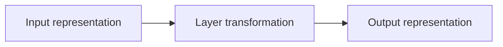
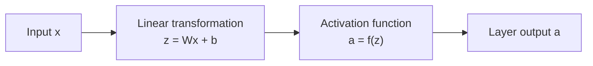
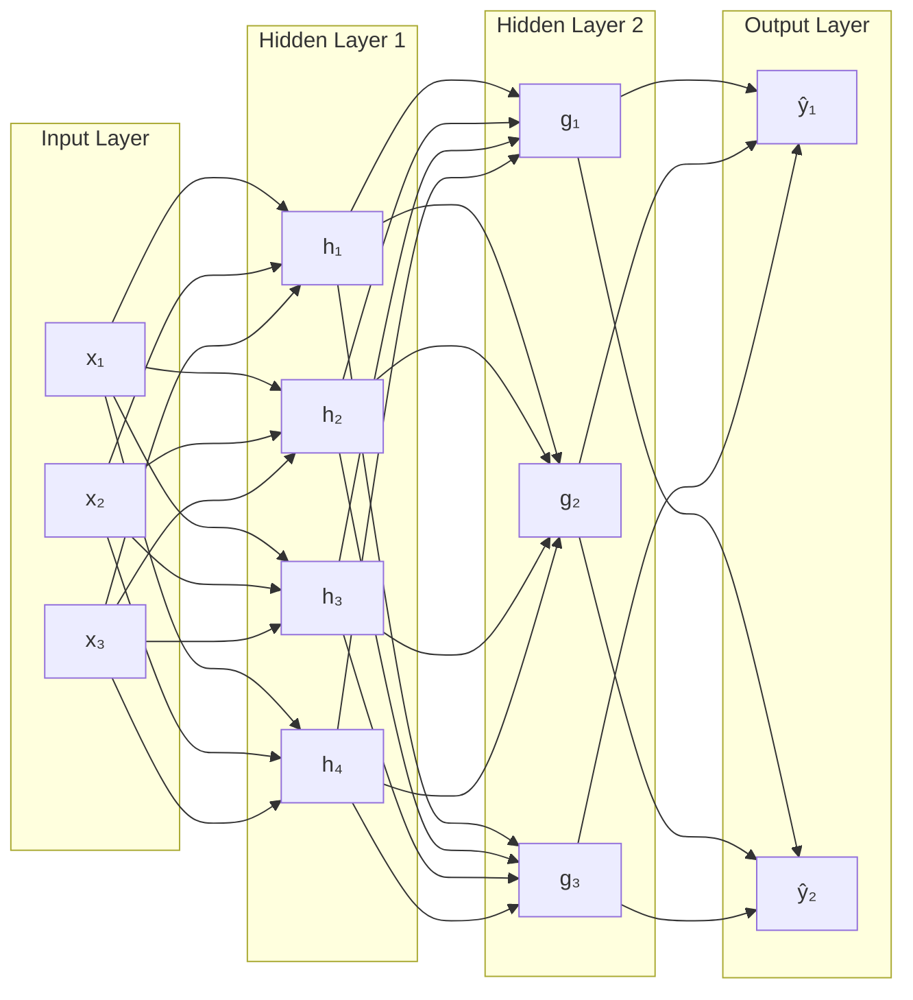
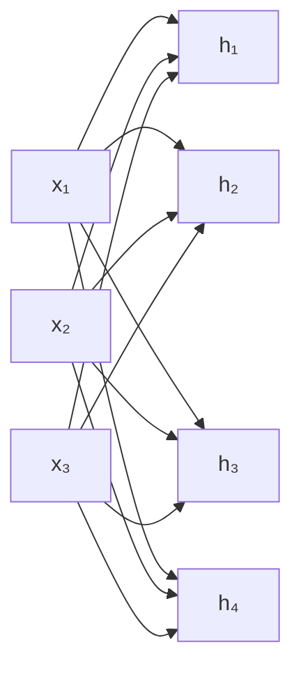
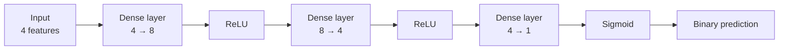
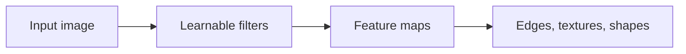
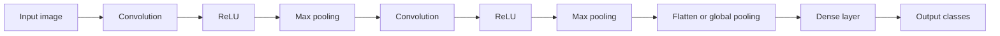
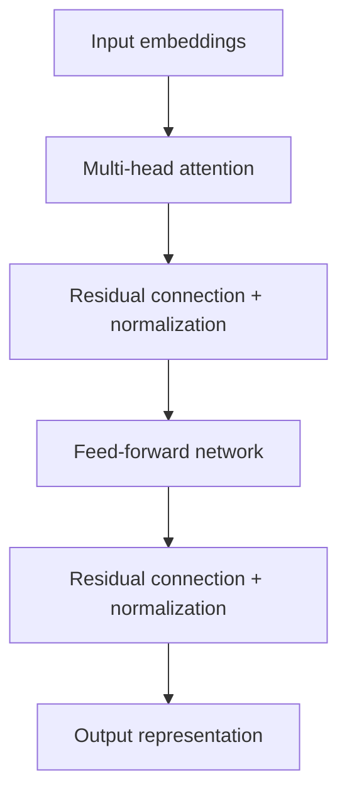

# 003 — Layer

**Course:** 03 — Machine Learning and Deep Learning
**Module:** Module 07 — Deep Learning
**Content Group:** Neural Network Basics
**Roadmap Source:** Deep Learning / Neural Network Basics
**Lesson Type:** Deep Learning
**Order in Module:** 003
**Suggested Duration:** 24 minutes

---

## 1. Summary

A **layer** is a group of computational units that transform an input representation into a new representation.

In a neural network, data moves through a sequence of layers:

```text
Input data
    ↓
Layer 1
    ↓
Layer 2
    ↓
...
    ↓
Output layer
    ↓
Prediction
```

Each layer normally performs one or more operations such as:

1. Applying a linear transformation
2. Adding a bias
3. Applying an activation function
4. Normalizing values
5. Reducing dimensions
6. Extracting patterns
7. Combining information

For a fully connected layer, the basic computation is:

$$
\mathbf{z} = W\mathbf{x} + \mathbf{b}
$$

$$
\mathbf{a} = f(\mathbf{z})
$$

where:

* (\mathbf{x}) is the input vector.
* (W) is the weight matrix.
* (\mathbf{b}) is the bias vector.
* (f) is the activation function.
* (\mathbf{a}) is the output of the layer.

Layers allow neural networks to learn representations at different levels of abstraction.

---

## 2. Learning Objectives

After completing this lesson, you should be able to:

* Explain what a neural-network layer is.
* Distinguish between input, hidden, and output layers.
* Describe the forward pass through a layer.
* Understand the shapes of layer inputs, weights, biases, and outputs.
* Calculate the number of parameters in a fully connected layer.
* Explain why activation functions are placed between layers.
* Identify common layer types used in modern neural networks.
* Build a small multilayer neural network using PyTorch or Keras.
* Select an appropriate output layer for a given machine-learning task.

---

## 3. What Is a Layer?

A neural-network layer receives data from a previous layer, performs a transformation, and sends the result to the next layer.



For a standard dense layer:



A layer may contain many neurons. Each neuron usually receives the same input vector but has its own weights and bias.

Suppose a layer contains (m) neurons and receives (n) input features.

Then:

$$
\mathbf{x} \in \mathbb{R}^{n}
$$

$$
W \in \mathbb{R}^{m \times n}
$$

$$
\mathbf{b} \in \mathbb{R}^{m}
$$

$$
\mathbf{a} \in \mathbb{R}^{m}
$$

The layer transforms an (n)-dimensional input into an (m)-dimensional output.

---

## 4. Main Layer Categories

A basic feed-forward neural network normally contains three categories of layers:

1. Input layer
2. Hidden layer
3. Output layer



---

## 5. Input Layer

The input layer represents the original data given to the model.

It does not normally perform the weighted-sum computation of a hidden neuron. Instead, it defines the expected shape of the input.

Examples:

### Tabular data

A dataset may contain:

```text
age
income
account_age
purchase_count
```

The input vector is:

$$
\mathbf{x} = \begin{bmatrix} x_{\text{age}} \ x_{\text{income}} \ x_{\text{account age}} \ x_{\text{purchase count}} \end{bmatrix}
$$

The input dimension is:

$$
n_{\text{features}} = 4
$$

### Grayscale image

A (28 \times 28) image contains:

$$
28 \times 28 = 784
$$

pixel values.

A dense neural network may flatten the image into:

$$
\mathbf{x} \in \mathbb{R}^{784}
$$

A convolutional neural network normally preserves the spatial shape:

$$
28 \times 28 \times 1
$$

### Color image

An RGB image with width (224) and height (224) has the shape:

$$
224 \times 224 \times 3
$$

where the final dimension represents the red, green, and blue channels.

### Text

A sentence may be represented as:

* Token IDs
* One-hot vectors
* Word embeddings
* Contextual embeddings

For example:

```text
"deep learning is useful"
        ↓
[125, 842, 17, 390]
```

---

## 6. Hidden Layers

A hidden layer is located between the input and output layers.

It is called hidden because its values are not directly observed in the original dataset or prediction target.

Hidden layers learn intermediate representations.

```text
Raw input
    ↓
Low-level features
    ↓
Intermediate patterns
    ↓
High-level representation
    ↓
Prediction
```

For image classification, a conceptual hierarchy may be:

```text
Pixels
  ↓
Edges
  ↓
Corners and textures
  ↓
Shapes and object parts
  ↓
Object category
```

For text processing, a conceptual hierarchy may be:

```text
Tokens
  ↓
Local phrases
  ↓
Syntactic relationships
  ↓
Semantic meaning
  ↓
Prediction
```

These descriptions are useful mental models. However, actual hidden-layer representations are often distributed across many neurons and may not have a simple human-readable interpretation.

---

## 7. Output Layer

The output layer converts the final hidden representation into a prediction.

The design of the output layer depends on the task.

---

### 7.1 Regression

For regression with one continuous target, use one output neuron with a linear activation:

$$
\hat{y} = \mathbf{w}^{T}\mathbf{h} + b
$$

Example:

```text
Input: house features
Output: predicted house price
```

Output shape:

$$
(1)
$$

Common loss functions:

* Mean Absolute Error
* Mean Squared Error
* Huber Loss

---

### 7.2 Binary Classification

For binary classification, use one output neuron with sigmoid activation:

$$
\hat{y} = \sigma(z)
$$

$$
\sigma(z) = \frac{1}{1+e^{-z}}
$$

The output is between (0) and (1).

Example:

```text
0.91 → high probability of positive class
0.12 → low probability of positive class
```

A threshold such as (0.5) may be used:

$$
\hat{c} = \begin{cases} 1, & \hat{y} \geq 0.5 \ 0, & \hat{y} < 0.5 \end{cases}
$$

---

### 7.3 Multiclass Classification

For (K) mutually exclusive classes, use (K) output neurons.

Example for three classes:

```text
Class 0 → cat
Class 1 → dog
Class 2 → bird
```

The output logits may be:

$$
\mathbf{z} = \begin{bmatrix} 2.1 \ 0.7 \ -1.2 \end{bmatrix}
$$

Softmax converts them into probabilities:

$$
P(y=i) = \frac{e^{z_i}} {\sum_{j=1}^{K} e^{z_j}}
$$

The probabilities sum to (1).

---

### 7.4 Multilabel Classification

In multilabel classification, multiple classes may be correct at the same time.

Example:

```text
Image labels:
- beach
- person
- sunset
```

Use one sigmoid output neuron per label:

$$
\hat{\mathbf{y}} = \begin{bmatrix} 0.95 \ 0.81 \ 0.76 \end{bmatrix}
$$

Unlike softmax, these outputs do not need to sum to (1).

---

## 8. Fully Connected Layer

A **fully connected layer**, also called a **dense layer** or **linear layer**, connects every input unit to every output neuron.

Suppose the input contains three features and the layer contains four neurons.



The computation is:

$$
\mathbf{z} = W\mathbf{x}+\mathbf{b}
$$

where:

$$
W = \begin{bmatrix} w_{11} & w_{12} & w_{13} \ w_{21} & w_{22} & w_{23} \ w_{31} & w_{32} & w_{33} \ w_{41} & w_{42} & w_{43} \end{bmatrix}
$$

and:

$$
\mathbf{b} = \begin{bmatrix} b_1 \ b_2 \ b_3 \ b_4 \end{bmatrix}
$$

After applying an activation function:

$$
\mathbf{h} = f(\mathbf{z})
$$

the output contains four values.

---

## 9. Parameter Count

A dense layer with:

* (n_{\text{in}}) input units
* (n_{\text{out}}) output units

contains:

$$
n_{\text{in}} \times n_{\text{out}}
$$

weights and:

$$
n_{\text{out}}
$$

biases.

Therefore, the total parameter count is:

$$
\boxed{ n_{\text{parameters}} = n_{\text{in}}n_{\text{out}} + n_{\text{out}} }
$$

or:

$$
\boxed{ n_{\text{parameters}} = (n_{\text{in}}+1)n_{\text{out}} }
$$

### Example

A layer receives 10 features and contains 32 neurons.

Weights:

$$
10 \times 32 = 320
$$

Biases:

$$
32
$$

Total:

$$
320+32=352
$$

learnable parameters.

---

## 10. Layer Shapes

Understanding tensor shapes is essential when building neural networks.

Suppose a batch contains 64 observations, each with 10 features.

The input shape is:

$$
(64,10)
$$

A dense layer contains 32 neurons.

The weight matrix shape is:

$$
(10,32)
$$

The bias shape is:

$$
(32)
$$

The output shape is:

$$
(64,32)
$$

The batch dimension remains unchanged.

```text
Input:
(batch_size, input_features)
(64, 10)

Weight matrix:
(input_features, output_features)
(10, 32)

Output:
(batch_size, output_features)
(64, 32)
```

Depending on the framework, weight matrices may be stored in the transposed orientation, but the mathematical operation is equivalent.

---

## 11. Forward Pass Through Multiple Layers

Consider a network with:

* 4 input features
* First hidden layer with 8 neurons
* Second hidden layer with 4 neurons
* One output neuron

The forward pass is:

$$
\mathbf{h}^{(1)} = \operatorname{ReLU} \left( W^{(1)}\mathbf{x} + \mathbf{b}^{(1)} \right)
$$

$$
\mathbf{h}^{(2)} = \operatorname{ReLU} \left( W^{(2)}\mathbf{h}^{(1)} + \mathbf{b}^{(2)} \right)
$$

$$
\hat{y} = \sigma \left( W^{(3)}\mathbf{h}^{(2)} + b^{(3)} \right)
$$



---

## 12. Why Activation Functions Are Needed Between Layers

Suppose two dense layers do not use activation functions:

$$
\mathbf{h} = W_1\mathbf{x}+\mathbf{b}_1
$$

$$
\mathbf{y} = W_2\mathbf{h}+\mathbf{b}_2
$$

Substitute the first equation:

$$
\mathbf{y} = W_2(W_1\mathbf{x}+\mathbf{b}_1) + \mathbf{b}_2
$$

$$
\mathbf{y} = W_2W_1\mathbf{x} + W_2\mathbf{b}_1 + \mathbf{b}_2
$$

Define:

$$
W' = W_2W_1
$$

and:

$$
\mathbf{b}' = W_2\mathbf{b}_1+\mathbf{b}_2
$$

Then:

$$
\mathbf{y} = W'\mathbf{x}+\mathbf{b}'
$$

Therefore, two linear layers without a nonlinear activation are equivalent to one linear layer.

Adding nonlinear activation functions allows the network to learn nonlinear decision boundaries.

---

## 13. Common Layer Types

Modern deep-learning models use many different kinds of layers.

---

### 13.1 Dense Layer

A dense layer connects every input to every output unit.

Typical use cases:

* Tabular data
* Final classifier
* Regression output
* Feature transformation

Computation:

$$
\mathbf{y} = f(W\mathbf{x}+\mathbf{b})
$$

---

### 13.2 Convolutional Layer

A convolutional layer applies learnable filters across spatial regions.

It is commonly used for:

* Images
* Video
* Audio spectrograms
* Spatial signals



Unlike a dense layer, a convolutional layer:

* Preserves spatial relationships
* Uses local connections
* Shares weights across locations
* Usually requires fewer parameters than a comparable dense layer

---

### 13.3 Pooling Layer

A pooling layer reduces the spatial dimensions of feature maps.

Common types:

* Max pooling
* Average pooling
* Global average pooling

Example:

```text
Input feature map: 28 × 28
        ↓
2 × 2 max pooling
        ↓
Output feature map: 14 × 14
```

Pooling can:

* Reduce computation
* Reduce memory usage
* Increase the effective receptive field
* Provide some robustness to small spatial changes

Pooling layers usually do not contain learnable weights.

---

### 13.4 Recurrent Layer

A recurrent layer processes sequential data and maintains a hidden state.

Typical use cases:

* Time series
* Text
* Audio
* Event sequences

A simplified recurrent computation is:

$$
\mathbf{h}_t = f \left( W_x\mathbf{x}_t + W_h\mathbf{h}_{t-1} + \mathbf{b} \right)
$$

where:

* (\mathbf{x}_t) is the input at time (t).
* (\mathbf{h}_{t-1}) is the previous hidden state.
* (\mathbf{h}_t) is the new hidden state.

Common recurrent layers include:

* Simple RNN
* LSTM
* GRU

---

### 13.5 Embedding Layer

An embedding layer maps discrete IDs into dense vectors.

Example:

```text
Token ID 42
    ↓
Embedding layer
    ↓
[0.12, -0.44, 0.83, ...]
```

If the vocabulary contains (V) tokens and the embedding dimension is (d), the embedding matrix has shape:

$$
V \times d
$$

The parameter count is:

$$
Vd
$$

Embedding layers are commonly used for:

* Words
* Subword tokens
* Product IDs
* User IDs
* Categories

---

### 13.6 Normalization Layer

Normalization layers stabilize or improve training by controlling activation distributions.

Common examples:

* Batch Normalization
* Layer Normalization
* Group Normalization

Conceptual pipeline:

```text
Linear or convolutional output
            ↓
Normalization
            ↓
Activation
            ↓
Next layer
```

Batch normalization is common in convolutional networks.

Layer normalization is common in Transformers.

---

### 13.7 Dropout Layer

Dropout randomly disables some activations during training.

```text
Original activations:
[0.8, 0.3, 0.0, 1.2, 0.6]

After dropout:
[0.8, 0.0, 0.0, 1.2, 0.0]
```

Dropout can reduce overfitting by preventing the network from depending too heavily on specific units.

Important:

* Dropout behaves differently during training and inference.
* It does not contain learnable parameters.
* Very high dropout rates can cause underfitting.

---

### 13.8 Attention Layer

An attention layer allows a model to determine which parts of the input are most relevant.

In a simplified form:

$$
\operatorname{Attention}(Q,K,V) = \operatorname{softmax} \left( \frac{QK^T}{\sqrt{d_k}} \right)V
$$

Attention is central to Transformer architectures.

It is commonly used for:

* Language models
* Machine translation
* Vision Transformers
* Multimodal models
* Long-sequence processing

---

## 14. Trainable and Non-Trainable Layers

Not every layer contains learnable parameters.

### Trainable layers

Examples:

* Dense
* Convolutional
* Recurrent
* Embedding
* Attention
* Batch normalization

These layers usually contain values updated by gradient descent.

### Non-trainable layers

Examples:

* ReLU
* Max pooling
* Flatten
* Reshape
* Dropout
* Concatenation

These layers perform fixed operations and usually do not contain weights.

However, they still affect the network’s behavior and output shapes.

---

## 15. Flatten and Reshape Layers

A flatten layer converts a multidimensional tensor into a vector.

Example:

$$
7 \times 7 \times 64
$$

becomes:

$$
7 \times 7 \times 64 = 3136
$$

```text
Feature maps: (7, 7, 64)
        ↓
Flatten
        ↓
Vector: (3136)
```

Flatten layers are often used when connecting convolutional layers to dense layers.

However, global average pooling is sometimes preferred because it can reduce the number of parameters.

---

## 16. Layer Depth and Width

Two important architecture properties are:

* Depth
* Width

### Depth

Depth refers to the number of computational layers.

A deeper network contains more sequential transformations.

```text
Shallow network:
Input → Hidden → Output

Deeper network:
Input → Hidden 1 → Hidden 2 → Hidden 3 → Output
```

Greater depth may allow the model to learn hierarchical representations.

However, deeper networks may be more difficult to train and may require:

* Better initialization
* Normalization
* Residual connections
* Careful learning-rate selection
* More data and computation

---

### Width

Width refers to the number of units or channels in a layer.

Example:

```text
Layer A: 32 neurons
Layer B: 128 neurons
```

Layer B is wider.

Wider layers can represent more features but require more memory and computation.

---

## 17. Naming Conventions

Layer-count conventions are not always consistent.

One common convention does not count the input layer.

For example:

```text
Input layer
Hidden layer
Output layer
```

may be called a **two-layer neural network** because only the hidden and output layers contain learnable transformations.

Another source may describe the same model as having three layers because it counts the input layer.

Therefore, architecture descriptions should preferably include explicit details:

```text
Input: 10 features
Hidden layer 1: 32 neurons
Hidden layer 2: 16 neurons
Output: 1 neuron
```

This is clearer than saying only “a three-layer network.”

---

## 18. PyTorch Example

The following model performs binary classification.

```python
import torch
from torch import nn


class BinaryClassifier(nn.Module):
    def __init__(self, input_features: int) -> None:
        super().__init__()

        self.network = nn.Sequential(
            nn.Linear(input_features, 16),
            nn.ReLU(),
            nn.Linear(16, 8),
            nn.ReLU(),
            nn.Linear(8, 1),
        )

    def forward(self, inputs: torch.Tensor) -> torch.Tensor:
        """Return raw logits for binary classification."""
        return self.network(inputs)


model = BinaryClassifier(input_features=10)

sample_batch = torch.randn(32, 10)
logits = model(sample_batch)

print("Input shape:", sample_batch.shape)
print("Output shape:", logits.shape)
print(model)
```

Expected shapes:

```text
Input shape:  torch.Size([32, 10])
Output shape: torch.Size([32, 1])
```

When using `BCEWithLogitsLoss`, do not place a sigmoid layer inside the model because the loss function already combines sigmoid and binary cross-entropy in a numerically stable way.

---

## 19. Keras Example

```python
import tensorflow as tf


model = tf.keras.Sequential([
    tf.keras.layers.Input(shape=(10,)),
    tf.keras.layers.Dense(16, activation="relu"),
    tf.keras.layers.Dense(8, activation="relu"),
    tf.keras.layers.Dense(1, activation="sigmoid"),
])

model.compile(
    optimizer="adam",
    loss="binary_crossentropy",
    metrics=["accuracy"],
)

model.summary()
```

Architecture:

```text
10 input features
       ↓
Dense: 16 neurons + ReLU
       ↓
Dense: 8 neurons + ReLU
       ↓
Dense: 1 neuron + Sigmoid
       ↓
Binary probability
```

---

## 20. Parameter Count Example

Consider the following architecture:

```text
Input: 10 features
Dense layer 1: 16 neurons
Dense layer 2: 8 neurons
Output layer: 1 neuron
```

### First layer

$$
10 \times 16 + 16 = 176
$$

### Second layer

$$
16 \times 8 + 8 = 136
$$

### Output layer

$$
8 \times 1 + 1 = 9
$$

### Total

$$
176+136+9=321
$$

The model contains:

$$
\boxed{321}
$$

learnable parameters.

---

## 21. Choosing Layer Sizes

There is no universal formula for choosing the best number of layers or neurons.

A practical process is:

1. Start with a small baseline.
2. Train the model.
3. Compare training and validation performance.
4. Increase capacity if the model underfits.
5. Add regularization if the model overfits.
6. Track computational cost.
7. Validate architecture changes experimentally.

Example baseline:

```text
Input
  ↓
Dense 64 + ReLU
  ↓
Dense 32 + ReLU
  ↓
Output
```

Possible experiment:

| Experiment | Hidden layers | Validation accuracy | Parameters |
| ---------- | ------------- | ------------------: | ---------: |
| A          | 32            |                 82% |      1,025 |
| B          | 64 → 32       |                 87% |      4,289 |
| C          | 128 → 64 → 32 |               87.2% |    14,000+ |

The largest model is not automatically the best. The improvement should justify its additional cost.

---

## 22. Layer Output as Learned Features

Each layer changes the representation of the data.

Suppose the original input is:

$$
\mathbf{x} = \begin{bmatrix} \text{age} \ \text{income} \ \text{account activity} \end{bmatrix}
$$

A hidden layer may produce:

$$
\mathbf{h} = \begin{bmatrix} 0.82 \ 0.00 \ 1.34 \ 0.27 \end{bmatrix}
$$

These new values are learned features.

They may represent combinations such as:

* High-income activity pattern
* Long-term customer behavior
* Risk-related interaction
* Purchase-intent signal

However, these meanings are normally not explicitly assigned. They emerge from training.

---

## 23. Layers in an Image Classification Pipeline

A small convolutional network may use:



Each layer has a different role:

| Layer       | Purpose                          |
| ----------- | -------------------------------- |
| Convolution | Detect local patterns            |
| ReLU        | Introduce nonlinearity           |
| Pooling     | Reduce spatial dimensions        |
| Flatten     | Convert feature maps to a vector |
| Dense       | Combine extracted features       |
| Output      | Produce class scores             |

---

## 24. Layers in a Transformer

A simplified Transformer block contains:



A Transformer stacks many of these blocks.

Each block allows the model to:

* Exchange information across tokens
* Transform token representations
* Preserve information through residual connections
* Stabilize activations with normalization

---

## 25. Common Mistakes

### 25.1 Confusing Layers and Neurons

A neuron is one computational unit.

A layer is a collection of units or operations.

```text
Neuron:
one weighted sum + activation

Layer:
many neurons or one structured transformation
```

---

### 25.2 Forgetting Tensor Shapes

A layer cannot process input with an incompatible shape.

For example:

```text
Expected input: (batch_size, 10)
Received input: (batch_size, 8)
```

This produces a matrix multiplication error.

Always inspect:

* Input shape
* Output shape
* Weight shape
* Batch dimension

---

### 25.3 Using the Wrong Output Layer

Examples of incorrect designs:

* Softmax with one output neuron
* Sigmoid for mutually exclusive multiclass classification without a clear reason
* ReLU for unrestricted regression where negative outputs are possible
* Linear output for probability prediction without suitable post-processing

The output layer must match the target and loss function.

---

### 25.4 Adding Too Many Dense Layers After Convolution

Flattening large feature maps can create millions of parameters.

Example:

$$
32 \times 32 \times 128 = 131{,}072
$$

Connecting this vector to 1,024 dense neurons creates approximately:

$$
131{,}072 \times 1{,}024
$$

weights, which is over 134 million parameters.

Possible alternatives include:

* Additional pooling
* Global average pooling
* Smaller dense layers
* Bottleneck layers

---

### 25.5 Removing Nonlinear Activations

Multiple dense layers without activation functions behave like a single linear layer.

The model gains depth but not nonlinear representational power.

---

### 25.6 Assuming More Layers Always Improve Performance

More layers can cause:

* Overfitting
* Slower training
* Higher memory usage
* Vanishing or exploding gradients
* More difficult debugging

Architecture depth must be validated.

---

### 25.7 Ignoring Training and Validation Curves

Training accuracy alone does not show whether the architecture generalizes.

Monitor:

* Training loss
* Validation loss
* Training metric
* Validation metric
* Learning rate
* Gradient behavior

---

### 25.8 Using Deep Learning for Every Dataset

A small tabular dataset may be better handled by:

* Logistic regression
* Random forest
* Gradient boosting
* Support vector machine

A neural network should be compared with a strong baseline.

---

## 26. Practical Exercise

### Task 1: Calculate Layer Parameters

Calculate the number of parameters in each layer:

```text
Input: 20 features
Hidden layer 1: 64 neurons
Hidden layer 2: 32 neurons
Output layer: 5 neurons
```

Use:

$$
n_{\text{parameters}} = n_{\text{in}}n_{\text{out}} + n_{\text{out}}
$$

Then calculate the total number of parameters.

---

### Task 2: Track Tensor Shapes

For a batch of 128 observations, determine the shape after every layer:

```text
Input: 12 features
Dense: 32 neurons
Dense: 16 neurons
Output: 3 neurons
```

Expected format:

```text
Input:        (128, 12)
Hidden 1:     (?, ?)
Hidden 2:     (?, ?)
Output:       (?, ?)
```

---

### Task 3: Build a Small Classifier

Create a neural network for a synthetic dataset such as `make_moons`.

Suggested architecture:

```text
Input: 2 features
Dense: 16 + ReLU
Dense: 8 + ReLU
Output: 1
```

Train the model and record:

* Training loss
* Validation loss
* Training accuracy
* Validation accuracy

---

### Task 4: Compare Architectures

Compare at least three architectures:

```text
Model A:
2 → 4 → 1

Model B:
2 → 16 → 8 → 1

Model C:
2 → 64 → 32 → 16 → 1
```

For each model, record:

| Model | Parameters | Train accuracy | Validation accuracy | Training time |
| ----- | ---------: | -------------: | ------------------: | ------------: |
| A     |            |                |                     |               |
| B     |            |                |                     |               |
| C     |            |                |                     |               |

Explain which model provides the best balance between performance and complexity.

---

### Task 5: Visualize a Hidden Layer

For a two-dimensional classification dataset:

1. Train a small network.
2. Extract hidden-layer activations.
3. Visualize the decision boundary.
4. Compare it with logistic regression.

Explain how the hidden layer changes the representation of the input.

---

## 27. Completion Checklist

* [ ] I can explain what a layer is.
* [ ] I understand the difference between input, hidden, and output layers.
* [ ] I can calculate a dense layer’s output shape.
* [ ] I can calculate the number of weights and biases.
* [ ] I understand why nonlinear activations are required.
* [ ] I can select an output layer for regression or classification.
* [ ] I can identify dense, convolutional, recurrent, embedding, pooling, normalization, dropout, and attention layers.
* [ ] I can build a multilayer model in PyTorch or Keras.
* [ ] I can inspect model parameters and tensor shapes.
* [ ] I can compare architectures using validation performance.
* [ ] I have documented at least one caveat or assumption.

---

## 28. Related Outcome

Understand neural networks, CNNs, RNNs, LSTMs, Transformers, and transfer learning at a practical level.

Knowledge of layers is required for understanding:

* Forward propagation
* Activation functions
* Loss functions
* Backpropagation
* Dense neural networks
* Convolutional neural networks
* Recurrent neural networks
* Attention mechanisms
* Transformers
* Transfer learning

---

## 29. Related Project

### Mini Project: Image Classification

Compare:

1. A small convolutional neural network trained from scratch
2. A pretrained model using transfer learning

A possible small CNN architecture is:

```text
Input image
    ↓
Convolution + ReLU
    ↓
Max pooling
    ↓
Convolution + ReLU
    ↓
Max pooling
    ↓
Global average pooling
    ↓
Dense output layer
```

Evaluate the models using:

* Accuracy
* Precision
* Recall
* F1-score
* Confusion matrix
* Training and validation curves
* Parameter count
* Training time
* Inference time

---

## 30. Key Takeaways

* A layer transforms one representation into another.
* A dense layer performs a matrix multiplication, adds a bias, and normally applies an activation function.
* The input layer defines the model’s expected input.
* Hidden layers learn intermediate representations.
* The output layer must match the prediction task.
* Tensor shapes must be compatible between adjacent layers.
* The parameter count depends on the input and output dimensions.
* Nonlinear activation functions prevent stacked layers from collapsing into one linear transformation.
* Different layer types are designed for different data structures.
* Deeper or wider models are not automatically better.
* Architecture choices should be evaluated using validation data and computational cost.

---

## 31. Final Mental Model

A layer can be understood as a transformation:

$$
\boxed{ \text{output representation} = \text{layer} \left( \text{input representation} \right) }
$$

For a dense layer:

$$
\boxed{ \mathbf{a} = f(W\mathbf{x}+\mathbf{b}) }
$$

A neural network is a composition of many layer functions:

$$
\boxed{ \hat{\mathbf{y}} = f_L \left( f_{L-1} \left( \cdots f_2 \left( f_1(\mathbf{x}) \right) \right) \right) }
$$

In practical terms:

```text
Data
  ↓
Layer transforms the data
  ↓
The next layer receives a better representation
  ↓
Repeated transformations produce a prediction
```

A neuron is one computational unit. A layer organizes many units or operations. A neural network combines multiple layers into a trainable function.
