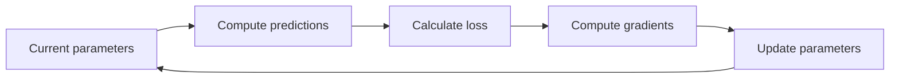
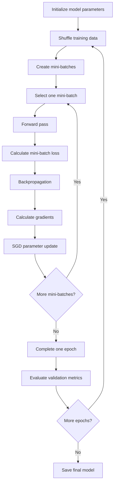
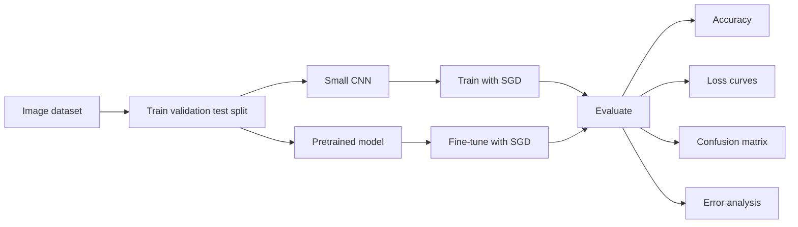

# 007 — Stochastic Gradient Descent (SGD)

**Course:** 03 — Machine Learning and Deep Learning
**Module:** Module 07 — Deep Learning
**Content Group:** Neural Network Basics
**Roadmap Source:** Deep Learning / Neural Network Basics
**Lesson Type:** Deep Learning
**Order in Module:** 007
**Suggested Duration:** 24 minutes

---

## 1. Summary

**Stochastic Gradient Descent**, commonly abbreviated as **SGD**, is an optimization algorithm used to train machine learning and deep learning models.

A neural network learns by adjusting its parameters—weights and biases—to reduce a loss function. Standard batch gradient descent calculates the gradient using the entire training dataset before updating the parameters. SGD instead estimates the gradient using one randomly selected training example.

In practice, most deep learning systems use **mini-batch SGD**, which computes the gradient using a small subset of the training data.

SGD is especially useful when:

* The training dataset is large.
* The model contains millions or billions of parameters.
* Loading the entire dataset into memory is impractical.
* The model needs to learn continuously from new data.
* Faster and more frequent parameter updates are desirable.

---

## 2. Learning Objectives

After completing this lesson, you should be able to:

* Explain SGD in your own words.
* Describe the difference between batch, stochastic, and mini-batch gradient descent.
* Write the mathematical update rule for SGD.
* Explain the roles of learning rate, batch size, iteration, and epoch.
* Implement a basic SGD training loop.
* Recognize common SGD failure modes.
* Interpret training and validation loss curves.
* Apply SGD to a small neural network experiment.

---

## 3. Why Optimization Is Needed

A neural network contains parameters represented by:

$$
\theta = {W_1, b_1, W_2, b_2, \dots, W_L, b_L}
$$

The goal of training is to find parameter values that minimize a loss function:

$$
\theta^* = \arg\min_{\theta} J(\theta)
$$

For a dataset containing (N) training examples, the empirical loss is commonly written as:

$$
J(\theta) = \frac{1}{N} \sum_{i=1}^{N} \mathcal{L} \left( f_{\theta}(x_i), y_i \right)
$$

where:

* (x_i) is the input of training example (i).
* (y_i) is its true label.
* (f_{\theta}(x_i)) is the model prediction.
* (\mathcal{L}) is the loss for one example.
* (J(\theta)) is the average loss over the dataset.

The optimizer updates the model parameters in a direction that reduces this loss.

---

## 4. Review: Gradient Descent

Gradient descent updates the parameters using the gradient of the loss:

$$
\theta_{t+1} = ## \theta_t \eta \nabla_{\theta}J(\theta_t)
$$

where:

* (\theta_t) contains the current parameter values.
* (\theta_{t+1}) contains the updated parameter values.
* (\eta) is the learning rate.
* (\nabla_{\theta}J(\theta_t)) is the gradient of the loss.

The gradient points toward the direction of the greatest increase in the loss. Therefore, subtracting the gradient moves the parameters toward a lower-loss region.



---

## 5. The Problem with Batch Gradient Descent

In batch gradient descent, every parameter update uses the complete training dataset:

$$
\nabla_{\theta}J(\theta) = \frac{1}{N} \sum_{i=1}^{N} \nabla_{\theta} \mathcal{L}_i(\theta)
$$

This produces an accurate and stable gradient, but it can be computationally expensive.

Consider a model with:

* (1{,}000{,}000) training examples.
* (23{,}000) parameters.
* Thousands of optimization steps.

Calculating the complete gradient before every update may require an enormous number of operations. A single update can become slow, and the entire dataset may not fit into memory.

This is one reason stochastic and mini-batch optimization methods are central to large-scale machine learning.

---

## 6. What Is Stochastic Gradient Descent?

Strictly speaking, **Stochastic Gradient Descent** selects one training example at each optimization step.

Instead of calculating:

$$
\nabla_{\theta}J(\theta) = \frac{1}{N} \sum_{i=1}^{N} \nabla_{\theta}\mathcal{L}_i(\theta)
$$

SGD randomly selects an index (i_t) and uses:

$$
g_t = \nabla_{\theta} \mathcal{L}_{i_t}(\theta_t)
$$

The parameter update becomes:

$$
\boxed{ \theta_{t+1} = ## \theta_t \eta_t g_t }
$$

or:

$$
\boxed{ \theta_{t+1} = ## \theta_t \eta_t \nabla_{\theta} \mathcal{L}_{i_t}(\theta_t) }
$$

The gradient from one example is only an estimate of the complete gradient. It is therefore noisy, but much cheaper to calculate.

### Core intuition

```text
Batch gradient descent:
Use every training example → calculate one accurate gradient → update once

Stochastic gradient descent:
Use one random example → calculate one noisy gradient → update immediately
```

---

## 7. Why the Stochastic Gradient Is Useful

Suppose the full gradient is:

$$
\nabla_{\theta}J(\theta) = \frac{1}{N} \sum_{i=1}^{N} \nabla_{\theta}\mathcal{L}_i(\theta)
$$

If an example (i) is sampled uniformly, the expected stochastic gradient is:

$$
\mathbb{E} \left[ \nabla_{\theta}\mathcal{L}_i(\theta) \right] = \nabla_{\theta}J(\theta)
$$

Therefore, an individual SGD update may point in an imperfect direction, but its expected direction agrees with the full gradient.

This produces a noisy optimization path:

```text
Batch Gradient Descent

Start ────────────────► Minimum


Stochastic Gradient Descent

Start ─► ↗ ─► ↘ ─► ↗ ─► ↘ ─► Minimum region
```

SGD does not necessarily reduce the complete loss after every individual update. Some updates may temporarily increase it. However, repeated updates can still move the parameters toward a useful solution.

---

## 8. Mini-Batch SGD

Pure SGD uses one example per update. In modern deep learning, **mini-batch SGD** is more common.

A mini-batch contains (B) examples:

$$
\mathcal{B}_t = \left{ (x_1,y_1), (x_2,y_2), \dots, (x_B,y_B) \right}
$$

The mini-batch gradient is:

$$
g_t = \frac{1}{B} \sum_{i \in \mathcal{B}*t} \nabla*{\theta} \mathcal{L}_i(\theta_t)
$$

The update becomes:

$$
\boxed{ \theta_{t+1} = ## \theta_t \eta_t \left( \frac{1}{B} \sum_{i \in \mathcal{B}*t} \nabla*{\theta} \mathcal{L}_i(\theta_t) \right) }
$$

Mini-batches provide a compromise between computational efficiency and gradient stability. They also take advantage of vectorized GPU and tensor operations.

---

## 9. Batch, Stochastic, and Mini-Batch Comparison

| Method                      | Examples per update | Gradient stability | Memory usage | Update frequency |
| --------------------------- | ------------------: | ------------------ | ------------ | ---------------- |
| Batch Gradient Descent      |      Entire dataset | High               | High         | Low              |
| Stochastic Gradient Descent |                   1 | Low                | Very low     | Very high        |
| Mini-Batch SGD              |         Small batch | Medium             | Medium       | High             |

### Batch gradient descent

```text
Entire dataset
      ↓
Compute average gradient
      ↓
One parameter update
```

### Pure SGD

```text
One random example
      ↓
Compute gradient
      ↓
Immediate parameter update
```

### Mini-batch SGD

```text
Small group of examples
      ↓
Compute average batch gradient
      ↓
Parameter update
```

---

## 10. Epoch, Batch, and Iteration

These terms are frequently confused.

### Epoch

One **epoch** means that the model has processed every training example once.

### Batch

A **batch** is the subset of examples processed together before an update.

### Iteration

One **iteration** is one optimizer update.

If:

* Dataset size (N = 10{,}000)
* Batch size (B = 100)

then the number of iterations per epoch is:

$$
\text{Iterations per epoch} = \left\lceil \frac{N}{B} \right\rceil = 100
$$

Training for 20 epochs produces approximately:

$$
20 \times 100 = 2{,}000
$$

parameter updates.

---

## 11. The SGD Training Workflow



---

## 12. SGD Pseudocode

```text
initialize model parameters θ

for epoch in range(number_of_epochs):

    shuffle(training_data)

    for mini_batch in training_data:

        predictions = model(mini_batch.inputs)

        loss = loss_function(
            predictions,
            mini_batch.labels
        )

        gradients = backpropagation(loss, θ)

        θ = θ - learning_rate * gradients

    evaluate model on validation data
```

The data should usually be shuffled before every epoch. Otherwise, the order of examples may create biased or correlated updates.

---

## 13. Simple Numerical Example

Assume a model has one parameter (w):

$$
\hat{y} = wx
$$

For one training example:

$$
x = 2, \qquad y = 6
$$

Suppose the current parameter is:

$$
w = 1
$$

The prediction is:

$$
\hat{y} = wx = 1 \times 2 = 2
$$

Use squared error:

$$
\mathcal{L}(w) = # (\hat{y} - y)^2 (wx-y)^2
$$

The derivative is:

$$
\frac{\partial \mathcal{L}}{\partial w} = 2(wx-y)x
$$

Substitute the values:

$$
\frac{\partial \mathcal{L}}{\partial w} = # 2(1 \times 2 - 6)(2) -16
$$

If the learning rate is:

$$
\eta = 0.01
$$

then:

$$
w_{\text{new}} = ## w_{\text{old}} \eta \frac{\partial \mathcal{L}}{\partial w}
$$

$$
w_{\text{new}} = # 1 - 0.01(-16) 1.16
$$

The parameter moves from (1) toward the ideal value (3).

---

## 14. Learning Rate

The learning rate controls the size of each optimization step:

$$
\theta_{t+1} = ## \theta_t \eta_t g_t
$$

### Learning rate too small

* Training progresses slowly.
* The model may require many epochs.
* Optimization can appear to be stuck.

### Learning rate too large

* The optimizer may overshoot good solutions.
* Loss may oscillate strongly.
* Training may diverge.
* The loss may become `NaN`.

### Reasonable learning rate

* Loss decreases consistently.
* Training remains stable.
* The model reaches a useful solution efficiently.

```text
Too small:
Start → → → → → → Minimum

Appropriate:
Start ─────► ───► Minimum

Too large:
Start ─────────► Overshoot ◄─────────► Divergence
```

---

## 15. Learning Rate Schedules

A constant learning rate may work, but decreasing it during training often improves convergence.

### Step decay

$$
\eta_t = \eta_0 \gamma^{\lfloor t/s \rfloor}
$$

where (s) is the decay interval.

### Exponential decay

$$
\eta_t = \eta_0 e^{-kt}
$$

### Inverse-time decay

$$
\eta_t = \frac{\eta_0}{1 + kt}
$$

### Cosine decay

$$
\eta_t = \eta_{\min} + \frac{1}{2} (\eta_{\max}-\eta_{\min}) \left( 1+ \cos\left(\frac{\pi t}{T}\right) \right)
$$

A common strategy is:

1. Start with a relatively large learning rate.
2. Make rapid progress during early training.
3. Reduce the learning rate later.
4. Allow the model to settle into a better solution.

---

## 16. The Effect of Batch Size

Batch size affects memory usage, computation, and gradient noise.

### Small batches

Advantages:

* Require less memory.
* Produce frequent parameter updates.
* Introduce gradient noise that may help exploration.
* Can sometimes improve generalization.

Disadvantages:

* Produce noisy loss curves.
* May underutilize GPU parallelism.
* Can make training unstable.

### Large batches

Advantages:

* Produce more stable gradient estimates.
* Use matrix and GPU operations efficiently.
* Generate smoother training curves.

Disadvantages:

* Require more memory.
* Produce fewer updates per epoch.
* May require learning-rate adjustment.
* Can converge to solutions with weaker generalization in some settings.

Typical batch sizes include:

```text
16, 32, 64, 128, 256
```

There is no universally optimal batch size. It depends on:

* Dataset size.
* Model architecture.
* GPU memory.
* Learning rate.
* Normalization method.
* Desired training speed.
* Generalization behavior.

---

## 17. Advantages of SGD

### 17.1 Computational efficiency

Each update uses only one example or a small mini-batch.

### 17.2 Lower memory requirements

The entire dataset does not need to be loaded into memory at once.

### 17.3 Frequent updates

The model begins improving before it has processed the complete dataset.

### 17.4 Suitable for large datasets

SGD remains practical when batch gradient descent becomes too expensive.

### 17.5 Online learning

When new data arrives, training can continue from the current parameters instead of starting from the beginning.

### 17.6 Useful optimization noise

Noisy gradients can help the model move away from flat regions, saddle points, or undesirable local structures.

### 17.7 Strong baseline optimizer

SGD remains an important baseline, especially for computer vision and carefully tuned deep neural networks.

---

## 18. Limitations of SGD

### 18.1 Noisy optimization path

The loss may move up and down instead of decreasing smoothly.

### 18.2 Sensitive to the learning rate

An unsuitable learning rate can make training extremely slow or unstable.

### 18.3 Requires data shuffling

Poor data order can introduce biased updates.

### 18.4 May converge slowly near a minimum

Gradient noise prevents the parameters from settling exactly at the minimum when the learning rate remains large.

### 18.5 Sensitive to feature scale

Features with very different scales can produce poorly conditioned optimization surfaces.

### 18.6 Reproducibility can be difficult

Results may depend on:

* Random initialization.
* Data-shuffling order.
* Mini-batch composition.
* GPU implementation.
* Numerical precision.

---

## 19. SGD with Momentum

Basic SGD treats every update independently. Momentum maintains a moving average of previous gradients.

A common formulation is:

$$
v_t = \beta v_{t-1} + g_t
$$

$$
\theta_{t+1} = ## \theta_t \eta v_t
$$

Another implementation uses:

$$
v_t = \beta v_{t-1} + (1-\beta)g_t
$$

Momentum can:

* Reduce oscillation.
* Accelerate movement in consistent directions.
* Improve optimization in narrow valleys.
* Allow a larger learning rate in some cases.

```text
Without momentum:

Start ↘ ↗ ↘ ↗ ↘ ↗ Minimum


With momentum:

Start ────────► Minimum
```

The physical intuition is similar to a ball rolling downhill. The ball accumulates velocity in directions where gradients remain consistent while oscillations partly cancel.

A commonly used value is:

$$
\beta = 0.9
$$

---

## 20. NumPy Demonstration

The following example fits a simple linear regression model using mini-batch SGD.

```python
import numpy as np


def mean_squared_error(
    predictions: np.ndarray,
    targets: np.ndarray,
) -> float:
    """Return the mean squared error."""
    return float(np.mean((predictions - targets) ** 2))


rng = np.random.default_rng(seed=42)

# Synthetic dataset: y = 3x + 2 + noise
x = rng.normal(size=(1_000, 1))
noise = rng.normal(scale=0.5, size=(1_000, 1))
y = 3.0 * x + 2.0 + noise

# Model parameters
weight = rng.normal(size=(1, 1))
bias = np.zeros((1,))

learning_rate = 0.05
batch_size = 32
epochs = 50

for epoch in range(epochs):
    indices = rng.permutation(len(x))
    x_shuffled = x[indices]
    y_shuffled = y[indices]

    for start in range(0, len(x), batch_size):
        end = start + batch_size

        x_batch = x_shuffled[start:end]
        y_batch = y_shuffled[start:end]

        predictions = x_batch @ weight + bias
        errors = predictions - y_batch

        # Gradients of mean squared error
        gradient_weight = (
            2.0 / len(x_batch)
        ) * x_batch.T @ errors

        gradient_bias = (
            2.0 / len(x_batch)
        ) * np.sum(errors, axis=0)

        # SGD update
        weight -= learning_rate * gradient_weight
        bias -= learning_rate * gradient_bias

    full_predictions = x @ weight + bias
    epoch_loss = mean_squared_error(full_predictions, y)

    if (epoch + 1) % 5 == 0:
        print(
            f"Epoch {epoch + 1:02d} | "
            f"Loss: {epoch_loss:.4f} | "
            f"Weight: {weight.item():.3f} | "
            f"Bias: {bias.item():.3f}"
        )
```

Expected result:

```text
Weight ≈ 3
Bias ≈ 2
```

---

## 21. PyTorch Demonstration

```python
import torch
from torch import nn
from torch.utils.data import DataLoader, TensorDataset


torch.manual_seed(42)

# Synthetic data
x = torch.randn(1_000, 1)
y = 3.0 * x + 2.0 + 0.5 * torch.randn(1_000, 1)

dataset = TensorDataset(x, y)

data_loader = DataLoader(
    dataset,
    batch_size=32,
    shuffle=True,
)

model = nn.Linear(
    in_features=1,
    out_features=1,
)

loss_function = nn.MSELoss()

optimizer = torch.optim.SGD(
    model.parameters(),
    lr=0.05,
    momentum=0.9,
)

epochs = 50

for epoch in range(epochs):
    model.train()
    running_loss = 0.0

    for x_batch, y_batch in data_loader:
        # Clear gradients from the previous iteration
        optimizer.zero_grad()

        # Forward pass
        predictions = model(x_batch)

        # Calculate loss
        loss = loss_function(predictions, y_batch)

        # Backpropagation
        loss.backward()

        # SGD parameter update
        optimizer.step()

        running_loss += loss.item() * len(x_batch)

    epoch_loss = running_loss / len(dataset)

    if (epoch + 1) % 5 == 0:
        print(
            f"Epoch {epoch + 1:02d} | "
            f"Loss: {epoch_loss:.4f}"
        )

weight = model.weight.item()
bias = model.bias.item()

print(f"Learned weight: {weight:.3f}")
print(f"Learned bias: {bias:.3f}")
```

The critical PyTorch sequence is:

```python
optimizer.zero_grad()
predictions = model(inputs)
loss = loss_function(predictions, targets)
loss.backward()
optimizer.step()
```

---

## 22. Monitoring SGD Training

At minimum, monitor:

* Training loss.
* Validation loss.
* Training metric.
* Validation metric.
* Learning rate.
* Gradient magnitude.
* Number of epochs.
* Batch size.

### Healthy learning curves

```text
Loss
│\
│ \
│  \____ Training loss
│
│   \___ Validation loss
└──────────────────── Epoch
```

Both training and validation loss decrease before becoming relatively stable.

### Overfitting

```text
Loss
│\
│ \________ Training loss
│
│   \__
│      \___
│          \ Validation loss rises
└────────────────────────── Epoch
```

Training loss continues decreasing, but validation loss begins increasing.

### Unstable training

```text
Loss
│ \/\/\ /\_/\/\
│
│
└──────────────── Epoch
```

Possible causes include:

* Learning rate too large.
* Batch size too small.
* Exploding gradients.
* Poor feature scaling.
* Incorrect loss implementation.
* Corrupted labels.
* Numerical instability.

---

## 23. Common Mistakes

### Mistake 1: Calling all mini-batch training “pure SGD”

Strict SGD uses one example per update. Most neural-network training uses mini-batches.

### Mistake 2: Forgetting to shuffle the dataset

Sequentially ordered data may create biased updates.

### Mistake 3: Using a learning rate that is too large

Symptoms include oscillation, divergence, `NaN` values, and unstable accuracy.

### Mistake 4: Using a learning rate that is too small

Training appears stable but progresses extremely slowly.

### Mistake 5: Forgetting to reset gradients

In frameworks such as PyTorch, gradients accumulate by default.

```python
optimizer.zero_grad()
```

should normally be called before `loss.backward()`.

### Mistake 6: Evaluating only training performance

A decreasing training loss does not guarantee that the model generalizes.

### Mistake 7: Ignoring feature scaling

Unscaled numerical features can create poorly conditioned loss surfaces.

### Mistake 8: Changing batch size without adjusting the learning rate

Batch size and learning rate interact. A larger batch may support a larger learning rate, but the relationship must be validated experimentally.

### Mistake 9: Comparing optimizers unfairly

When comparing SGD with Adam or another optimizer, tune the learning rate and schedule for each optimizer separately.

---

## 24. SGD Versus Adam

| Property                   | SGD                             | Adam                                            |
| -------------------------- | ------------------------------- | ----------------------------------------------- |
| Main learning rate         | Global                          | Adaptive per parameter                          |
| Momentum support           | Optional                        | Built in                                        |
| Early training speed       | Sometimes slower                | Often faster                                    |
| Hyperparameter sensitivity | High                            | Usually easier initially                        |
| Memory use                 | Lower                           | Higher                                          |
| Final generalization       | Often strong when tuned         | Task dependent                                  |
| Common use                 | Vision, large supervised models | Transformers, prototypes, general deep learning |

Adam is often easier for initial experimentation. However, tuned SGD with momentum can produce excellent results, particularly in image classification.

A reasonable experiment is:

```text
Model A: SGD + momentum + learning-rate schedule
Model B: Adam with its own tuned learning rate
```

Compare:

* Validation accuracy.
* Validation loss.
* Training time.
* Number of epochs to convergence.
* Stability across random seeds.
* Final confusion matrix.

---

## 25. Practical Exercise

### Task

Train a small image classifier using mini-batch SGD.

Possible datasets:

* MNIST.
* Fashion-MNIST.
* CIFAR-10.
* A small custom image dataset.

### Baseline configuration

```python
optimizer = torch.optim.SGD(
    model.parameters(),
    lr=0.01,
    momentum=0.9,
    weight_decay=1e-4,
)
```

Suggested starting settings:

| Hyperparameter | Initial value |
| -------------- | ------------: |
| Batch size     |            64 |
| Learning rate  |          0.01 |
| Momentum       |           0.9 |
| Epochs         |            20 |
| Weight decay   |     (10^{-4}) |

### Required outputs

1. Training-loss curve.
2. Validation-loss curve.
3. Training-accuracy curve.
4. Validation-accuracy curve.
5. Confusion matrix.
6. Final test accuracy.
7. Short analysis of overfitting or underfitting.

---

## 26. Suggested Experiments

Keep the model and dataset fixed, then change one variable at a time.

### Experiment A: Learning rate

Test:

```text
0.1
0.01
0.001
0.0001
```

Record:

* Whether training converges.
* Epochs required.
* Final validation score.
* Loss stability.

### Experiment B: Batch size

Test:

```text
16
32
64
128
256
```

Record:

* Training time.
* GPU memory usage.
* Gradient noise.
* Validation performance.

### Experiment C: Momentum

Compare:

```text
momentum = 0.0
momentum = 0.9
```

### Experiment D: Learning-rate schedule

Compare:

* Constant learning rate.
* Step decay.
* Cosine decay.
* Reduce-on-plateau.

### Experiment E: Optimizer comparison

Compare:

* SGD.
* SGD with momentum.
* Adam.

Do not assume that one optimizer is always superior. Evaluate the result using the same dataset split and model architecture.

---

## 27. Mini Project Connection

### Project

**Image Classification: Small CNN versus Transfer Learning**

### Experiment plan



### Questions to answer

* Does the pretrained model converge faster?
* Does SGD require different learning rates for the two models?
* Does momentum reduce oscillation?
* Which classes are frequently confused?
* Is the model overfitting?
* How does batch size affect GPU utilization?
* Does the final model outperform a classic machine-learning baseline?

---

## 28. Completion Checklist

* [ ] I can explain SGD in one or two minutes.
* [ ] I can distinguish batch, stochastic, and mini-batch gradient descent.
* [ ] I understand the SGD update equation.
* [ ] I understand the difference between an epoch and an iteration.
* [ ] I can explain the role of the learning rate.
* [ ] I can explain how batch size affects optimization.
* [ ] I can implement a mini-batch SGD training loop.
* [ ] I can identify overfitting using training and validation curves.
* [ ] I have compared at least two SGD configurations.
* [ ] I have recorded at least one caveat or assumption.
* [ ] I have created a notebook, chart, model, API, or portfolio note for this lesson.

---

## 29. Key Takeaways

1. SGD is an optimization algorithm that updates model parameters using a randomly selected training example.

2. Pure SGD uses one example per update, while mini-batch SGD uses a small subset of the dataset.

3. Mini-batch SGD is the standard approach in modern deep learning because it balances speed, memory efficiency, gradient stability, and hardware utilization.

4. SGD updates follow:

$$
\theta_{t+1} = ## \theta_t \eta_t g_t
$$

5. The learning rate is one of the most important SGD hyperparameters.

6. Small batches create noisier gradients, while larger batches produce more stable estimates.

7. Momentum can reduce oscillation and accelerate optimization.

8. SGD does not need to reduce the complete dataset loss after every update.

9. Training loss alone is insufficient; validation metrics must also be monitored.

10. SGD is best understood through experiments involving learning rate, batch size, momentum, schedules, and validation curves.

---

## 30. Related Outcome

Understand neural networks, CNNs, RNNs, LSTMs, Transformers, optimization algorithms, and transfer learning at a practical level.

---

## 31. Related Project

**Mini Project:** Image Classification comparing a small CNN and transfer learning using:

* SGD with momentum.
* Training and validation curves.
* Accuracy.
* Confusion matrix.
* Error analysis.
* Hyperparameter comparison.

---

## 32. Further Reading

* Dive into Deep Learning — Stochastic Gradient Descent:
  https://d2l.ai/chapter_optimization/sgd.html

* Topics to study next:

  * Mini-batch Gradient Descent.
  * Momentum.
  * Learning-rate scheduling.
  * RMSProp.
  * Adam.
  * Weight decay.
  * Gradient clipping.

---

## 33. Conclusion

**Stochastic Gradient Descent** is one of the foundational algorithms behind modern deep learning.

Its central idea is simple: instead of waiting to calculate an exact gradient from the complete dataset, calculate a fast approximate gradient from one example or a mini-batch and update the model immediately.

This introduces noise, but it makes large-scale training computationally practical. With a suitable learning rate, batch size, momentum value, and learning-rate schedule, SGD can train powerful neural networks efficiently and produce strong generalization performance.

The best way to understand SGD is to implement it, visualize the loss curves, change its hyperparameters, and observe how the optimization behavior changes.
