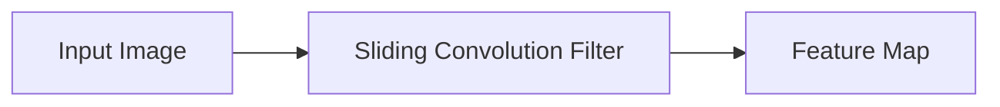
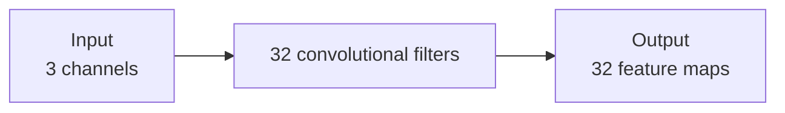
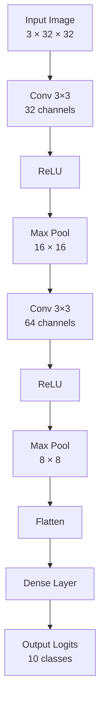
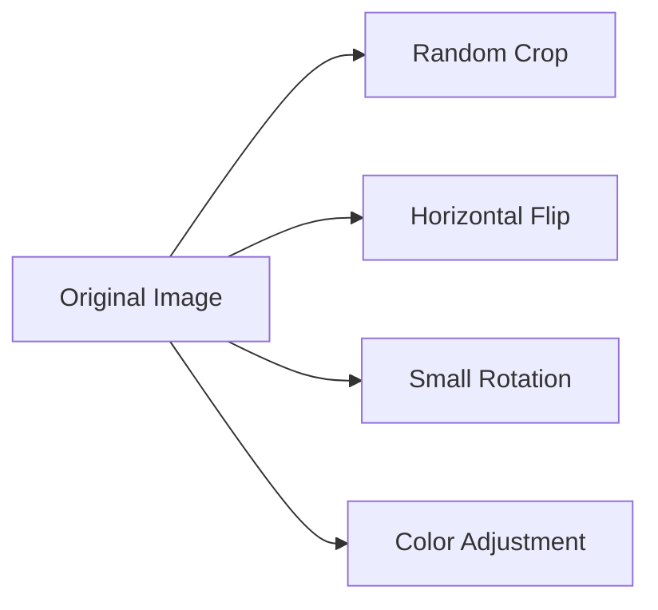
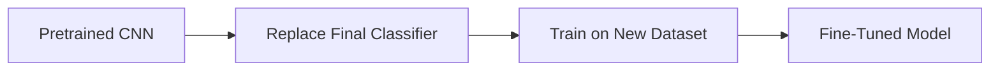

# 010 — Convolutional Neural Network

**Course:** 03 — Machine Learning and Deep Learning
**Module:** Module 07 — Deep Learning
**Content Group:** Architectures
**Roadmap Source:** Deep Learning / Architectures
**Lesson Type:** Deep Learning
**Lesson Order:** 010
**Suggested Duration:** 24 minutes

---

## 1. Summary

A **Convolutional Neural Network**, or **CNN**, is a neural-network architecture designed to process data with spatial structure.

CNNs are especially effective for:

* Image classification
* Object detection
* Image segmentation
* Face recognition
* Medical-image analysis
* Video understanding
* Audio spectrogram analysis
* Satellite-image analysis

Unlike a Fully Connected Network, a CNN does not connect every input pixel directly to every neuron. Instead, it uses small learnable filters that move across the input and detect local patterns.

A CNN usually learns hierarchical features:

```text
Pixels
  ↓
Edges
  ↓
Corners and textures
  ↓
Shapes and object parts
  ↓
Objects or classes
```

For small datasets, **transfer learning** with a pretrained CNN often performs better than training a new CNN from scratch.

---

## 2. Learning Objectives

By the end of this lesson, you should be able to:

* Explain what a CNN is in your own words.
* Describe why CNNs are suitable for image data.
* Explain convolutional filters, feature maps, stride, and padding.
* Calculate the output shape of a convolutional layer.
* Explain the purpose of pooling.
* Understand channels and tensor shapes.
* Build a small CNN using PyTorch.
* Train and evaluate an image classifier.
* Compare a CNN with a Fully Connected Network.
* Explain when transfer learning should be used.
* Identify common CNN training mistakes.

---

## 3. Why Images Need a Specialized Architecture

An image is not only a list of numbers. It contains spatial relationships.

For example:

* Neighboring pixels are often related.
* Edges are formed by local changes in intensity.
* Textures are repeated across small regions.
* Objects may appear in different positions.
* Larger shapes are composed of smaller patterns.

Consider a grayscale image:

$$
X\in\mathbb{R}^{H\times W}
$$

For an RGB image:

$$
X\in\mathbb{R}^{C\times H\times W}
$$

where:

* (C) is the number of channels.
* (H) is the image height.
* (W) is the image width.

An RGB image usually has:

$$
C=3
$$

representing:

```text
Red channel
Green channel
Blue channel
```

---

## 4. Why Not Use Only a Fully Connected Network?

Suppose an RGB image has the shape:

$$
224\times224\times3
$$

The total number of input values is:

$$
224\times224\times3=150{,}528
$$

Connecting this image directly to a dense layer with 1,000 neurons requires:

$$
150{,}528\times1{,}000 = 150{,}528{,}000
$$

weights, excluding biases.

This creates several problems:

* Extremely large parameter counts
* High memory consumption
* High overfitting risk
* Loss of explicit spatial structure
* Poor use of local image patterns

CNNs solve these problems using:

1. **Local connectivity**
2. **Weight sharing**
3. **Hierarchical feature learning**

---

## 5. Core Idea of Convolution

A convolutional layer uses a small matrix called a:

* Filter
* Kernel
* Convolutional kernel

The filter moves across the image and calculates a weighted sum at each location.



For a small input region (X) and kernel (K), the output at position ((i,j)) can be written as:

$$
Y_{i,j} = \sum_m\sum_n X_{i+m,j+n}K_{m,n} + b
$$

where:

* (X) is the input.
* (K) is the kernel.
* (b) is the bias.
* (Y) is the output feature map.

In deep-learning libraries, the operation commonly called convolution is technically closer to **cross-correlation**, because the kernel is not reversed. However, the term convolution is normally used in practice.

---

## 6. Simple Convolution Example

Suppose the input region is:

$$
X= \begin{bmatrix} 1 & 2 & 0\ 0 & 1 & 3\ 2 & 1 & 0 \end{bmatrix}
$$

and the kernel is:

$$
K= \begin{bmatrix} 1 & 0 & -1\ 1 & 0 & -1\ 1 & 0 & -1 \end{bmatrix}
$$

The convolution output for this region is:

$$
(1)(1)+(2)(0)+(0)(-1)
$$

$$
+(0)(1)+(1)(0)+(3)(-1)
$$

$$
+(2)(1)+(1)(0)+(0)(-1)
$$

$$
=1-3+2=0
$$

This particular kernel resembles a vertical-edge detector.

During CNN training, filters are not normally designed manually. Their values are learned using:

* Backpropagation
* An optimizer such as Adam or SGD
* A task-specific loss function

---

## 7. Local Receptive Fields

A convolutional neuron processes only a small local region of the input.

For example, a (3\times3) filter observes nine spatial positions at a time.

```text
Input image

┌─────────────────────┐
│                     │
│     ┌───────┐       │
│     │ 3 × 3 │       │
│     │ region│       │
│     └───────┘       │
│                     │
└─────────────────────┘
```

This local region is called the neuron's **receptive field**.

Deeper layers indirectly observe larger input regions because they process feature maps created by earlier layers.

```text
Layer 1:
small local edges

Layer 2:
combinations of edges

Layer 3:
textures and shapes

Layer 4:
object parts

Later layers:
high-level semantic patterns
```

---

## 8. Weight Sharing

A convolutional filter uses the same weights at every spatial position.

This is called **weight sharing**.

```text
One filter
    ↓
Applied to top-left region
    ↓
Applied to center region
    ↓
Applied to bottom-right region
```

Because the same filter is reused, it can detect the same feature in different parts of the image.

For example, an edge detector can identify an edge near:

* The top of an image
* The center of an image
* The bottom of an image

This greatly reduces the number of trainable parameters.

---

## 9. Filters and Feature Maps

One convolutional filter produces one output channel called a **feature map**.

If a convolutional layer has 32 filters, it produces 32 feature maps.



Different filters may learn to detect different patterns:

```text
Filter 1  → vertical edges
Filter 2  → horizontal edges
Filter 3  → diagonal edges
Filter 4  → texture pattern
Filter 5  → color contrast
...
```

These interpretations are simplified. Learned filters are not always directly understandable.

---

## 10. Multi-Channel Convolution

For an RGB input:

$$
X\in\mathbb{R}^{3\times H\times W}
$$

each convolutional filter must also have three input channels.

For example, a (3\times3) RGB filter has the shape:

$$
3\times3\times3
$$

More generally, a convolutional weight tensor has the shape:

$$
C_{\text{out}} \times C_{\text{in}} \times K_h \times K_w
$$

In PyTorch:

```text
[out_channels, in_channels, kernel_height, kernel_width]
```

For:

```python
nn.Conv2d(
    in_channels=3,
    out_channels=32,
    kernel_size=3,
)
```

the weight tensor has the shape:

```text
[32, 3, 3, 3]
```

---

## 11. CNN Tensor Shapes

PyTorch normally represents image batches using:

$$
[N,C,H,W]
$$

where:

* (N) is the batch size.
* (C) is the number of channels.
* (H) is the height.
* (W) is the width.

Example:

```text
[64, 3, 32, 32]
```

means:

* 64 images
* 3 color channels
* Height of 32
* Width of 32

TensorFlow commonly uses:

$$
[N,H,W,C]
$$

unless configured otherwise.

Always check the framework's channel convention.

---

## 12. Stride

The **stride** determines how far the filter moves after each operation.

### Stride 1

The filter moves one position at a time.

```text
Position 1 → Position 2 → Position 3
```

### Stride 2

The filter moves two positions at a time.

```text
Position 1 → skip → Position 3
```

A larger stride:

* Reduces the output dimensions
* Reduces computation
* Discards more spatial information

---

## 13. Padding

Without padding, the output becomes smaller after convolution.

**Padding** adds values around the input border, usually zeros.

```text
Original image:

a b c
d e f
g h i
```

With one layer of zero padding:

```text
0 0 0 0 0
0 a b c 0
0 d e f 0
0 g h i 0
0 0 0 0 0
```

Padding helps:

* Preserve spatial dimensions
* Process edge pixels more equally
* Build deeper networks without shrinking too quickly

For a (3\times3) kernel with stride 1, using padding 1 usually preserves height and width.

```python
nn.Conv2d(
    in_channels=3,
    out_channels=32,
    kernel_size=3,
    stride=1,
    padding=1,
)
```

---

## 14. Convolution Output Shape

For one spatial dimension, the output size is:

$$
O = \left\lfloor \frac{ I+2P-D(K-1)-1 }{ S } \right\rfloor +1
$$

where:

* (I) is the input size.
* (K) is the kernel size.
* (P) is the padding.
* (S) is the stride.
* (D) is the dilation.
* (O) is the output size.

Without dilation:

$$
O = \left\lfloor \frac{I+2P-K}{S} \right\rfloor +1
$$

### Example 1: Preserve the size

Given:

$$
I=32,\quad K=3,\quad P=1,\quad S=1
$$

$$
O = \frac{32+2(1)-3}{1}+1
$$

$$
O=32
$$

### Example 2: Downsample

Given:

$$
I=32,\quad K=3,\quad P=1,\quad S=2
$$

$$
O = \left\lfloor \frac{32+2-3}{2} \right\rfloor+1
$$

$$
O=16
$$

---

## 15. Pooling

Pooling reduces the spatial dimensions of a feature map.

Common pooling operations include:

* Max pooling
* Average pooling
* Global average pooling

### Max Pooling

Max pooling keeps the largest value in each region.

For example:

$$
\begin{bmatrix} 1 & 5\ 2 & 3 \end{bmatrix} \rightarrow 5
$$

A (2\times2) max-pooling operation with stride 2 usually halves the height and width.

```python
nn.MaxPool2d(
    kernel_size=2,
    stride=2,
)
```

### Why Use Pooling?

Pooling can:

* Reduce computation
* Reduce memory usage
* Increase the effective receptive field
* Provide limited robustness to small translations
* Reduce overfitting in some architectures

However, excessive pooling may remove useful spatial information.

Modern CNNs may also use stride-based convolution instead of pooling.

---

## 16. Global Average Pooling

Global average pooling averages each entire feature map.

Suppose the tensor before pooling is:

$$
[N,C,H,W]
$$

After global average pooling:

$$
[N,C,1,1]
$$

After flattening:

$$
[N,C]
$$

PyTorch example:

```python
nn.AdaptiveAvgPool2d((1, 1))
```

Global average pooling can replace a large fully connected classifier and greatly reduce the number of parameters.

---

## 17. Activation Functions in CNNs

A convolution without an activation function is still a linear operation.

CNNs commonly use ReLU:

$$
\operatorname{ReLU}(x)=\max(0,x)
$$

Typical pattern:

```text
Convolution
    ↓
Batch Normalization
    ↓
ReLU
```

or:

```text
Convolution
    ↓
ReLU
    ↓
Pooling
```

Without nonlinear activation functions, stacking convolutional layers would still represent one larger linear transformation.

---

## 18. Batch Normalization

Batch normalization normalizes intermediate activations during training.

For convolutional feature maps, PyTorch provides:

```python
nn.BatchNorm2d(number_of_channels)
```

A typical convolution block is:

```python
nn.Sequential(
    nn.Conv2d(3, 32, kernel_size=3, padding=1),
    nn.BatchNorm2d(32),
    nn.ReLU(),
)
```

Potential benefits include:

* More stable optimization
* Faster convergence
* Reduced sensitivity to initialization
* Support for larger learning rates

During training and evaluation, batch normalization behaves differently. Therefore, it is important to use:

```python
model.train()
```

during training and:

```python
model.eval()
```

during validation or inference.

---

## 19. Dropout in CNNs

Dropout randomly disables activations during training.

For dense layers:

```python
nn.Dropout(p=0.5)
```

For convolutional feature maps:

```python
nn.Dropout2d(p=0.2)
```

Dropout may help reduce overfitting, but it is not required in every CNN.

Data augmentation, batch normalization, weight decay, and transfer learning may already provide strong regularization.

---

## 20. Basic CNN Architecture

A simple image-classification CNN might follow this pattern:



The model has two main sections:

### Feature Extractor

```text
Convolution
Activation
Pooling
Convolution
Activation
Pooling
```

### Classifier

```text
Flatten
Dense layer
Output logits
```

---

## 21. Shape Walkthrough

Assume the input is:

$$
[N,3,32,32]
$$

### First convolution

```python
nn.Conv2d(3, 32, kernel_size=3, padding=1)
```

Output:

$$
[N,32,32,32]
$$

### First pooling

```python
nn.MaxPool2d(2)
```

Output:

$$
[N,32,16,16]
$$

### Second convolution

```python
nn.Conv2d(32, 64, kernel_size=3, padding=1)
```

Output:

$$
[N,64,16,16]
$$

### Second pooling

Output:

$$
[N,64,8,8]
$$

### Flatten

$$
64\times8\times8=4096
$$

Output:

$$
[N,4096]
$$

### Dense classifier

```python
nn.Linear(4096, 128)
nn.Linear(128, 10)
```

Final output:

$$
[N,10]
$$

---

## 22. Counting CNN Parameters

For a convolutional layer:

$$
\text{Parameters} = K_hK_wC_{\text{in}}C_{\text{out}} + C_{\text{out}}
$$

The final term counts one bias per output channel.

### Example

For:

```python
nn.Conv2d(
    in_channels=3,
    out_channels=32,
    kernel_size=3,
)
```

the number of weights is:

$$
3\times3\times3\times32 = 864
$$

The number of biases is:

$$
32
$$

Total:

$$
864+32=896
$$

This is much smaller than connecting every pixel directly to every output neuron.

### Pooling Parameters

Pooling layers have:

$$
0
$$

trainable parameters.

---

## 23. PyTorch CNN Implementation

```python
import torch
from torch import nn


class SmallCNN(nn.Module):
    def __init__(self, number_of_classes: int = 10) -> None:
        super().__init__()

        self.features = nn.Sequential(
            nn.Conv2d(
                in_channels=3,
                out_channels=32,
                kernel_size=3,
                padding=1,
            ),
            nn.BatchNorm2d(32),
            nn.ReLU(),
            nn.MaxPool2d(kernel_size=2),

            nn.Conv2d(
                in_channels=32,
                out_channels=64,
                kernel_size=3,
                padding=1,
            ),
            nn.BatchNorm2d(64),
            nn.ReLU(),
            nn.MaxPool2d(kernel_size=2),

            nn.Conv2d(
                in_channels=64,
                out_channels=128,
                kernel_size=3,
                padding=1,
            ),
            nn.BatchNorm2d(128),
            nn.ReLU(),

            nn.AdaptiveAvgPool2d((1, 1)),
        )

        self.classifier = nn.Linear(
            in_features=128,
            out_features=number_of_classes,
        )

    def forward(self, inputs: torch.Tensor) -> torch.Tensor:
        features = self.features(inputs)

        # [batch, 128, 1, 1] -> [batch, 128]
        flattened_features = torch.flatten(
            features,
            start_dim=1,
        )

        # Return raw logits.
        return self.classifier(flattened_features)
```

Create the model:

```python
device = torch.device(
    "cuda" if torch.cuda.is_available() else "cpu"
)

model = SmallCNN(number_of_classes=10).to(device)
```

---

## 24. Loss Function and Optimizer

For multiclass image classification:

```python
criterion = nn.CrossEntropyLoss()
```

Adam optimizer:

```python
optimizer = torch.optim.Adam(
    model.parameters(),
    lr=1e-3,
)
```

Or AdamW:

```python
optimizer = torch.optim.AdamW(
    model.parameters(),
    lr=3e-4,
    weight_decay=1e-4,
)
```

`CrossEntropyLoss` expects raw logits.

Do not apply softmax inside the model during training.

Correct:

```python
logits = model(images)
loss = criterion(logits, labels)
```

For inference probabilities:

```python
probabilities = torch.softmax(logits, dim=1)
```

---

## 25. Training Loop

```python
def train_one_epoch(
    model: nn.Module,
    data_loader,
    criterion: nn.Module,
    optimizer: torch.optim.Optimizer,
    device: torch.device,
) -> tuple[float, float]:
    model.train()

    total_loss = 0.0
    total_correct = 0
    total_samples = 0

    for images, labels in data_loader:
        images = images.to(device)
        labels = labels.to(device)

        optimizer.zero_grad()

        logits = model(images)
        loss = criterion(logits, labels)

        loss.backward()
        optimizer.step()

        batch_size = labels.size(0)

        total_loss += loss.item() * batch_size
        total_correct += (
            logits.argmax(dim=1) == labels
        ).sum().item()
        total_samples += batch_size

    average_loss = total_loss / total_samples
    accuracy = total_correct / total_samples

    return average_loss, accuracy
```

---

## 26. Validation Loop

```python
@torch.no_grad()
def evaluate(
    model: nn.Module,
    data_loader,
    criterion: nn.Module,
    device: torch.device,
) -> tuple[float, float]:
    model.eval()

    total_loss = 0.0
    total_correct = 0
    total_samples = 0

    for images, labels in data_loader:
        images = images.to(device)
        labels = labels.to(device)

        logits = model(images)
        loss = criterion(logits, labels)

        batch_size = labels.size(0)

        total_loss += loss.item() * batch_size
        total_correct += (
            logits.argmax(dim=1) == labels
        ).sum().item()
        total_samples += batch_size

    average_loss = total_loss / total_samples
    accuracy = total_correct / total_samples

    return average_loss, accuracy
```

---

## 27. Complete Training Process

```python
number_of_epochs = 15

for epoch in range(number_of_epochs):
    train_loss, train_accuracy = train_one_epoch(
        model=model,
        data_loader=train_loader,
        criterion=criterion,
        optimizer=optimizer,
        device=device,
    )

    validation_loss, validation_accuracy = evaluate(
        model=model,
        data_loader=validation_loader,
        criterion=criterion,
        device=device,
    )

    print(
        f"Epoch {epoch + 1:02d} | "
        f"Train Loss: {train_loss:.4f} | "
        f"Train Accuracy: {train_accuracy:.4f} | "
        f"Validation Loss: {validation_loss:.4f} | "
        f"Validation Accuracy: {validation_accuracy:.4f}"
    )
```

---

## 28. Data Preprocessing

CNN performance depends heavily on correct preprocessing.

Common steps include:

* Resize images
* Convert images to tensors
* Normalize pixel values
* Apply data augmentation to training data
* Use deterministic preprocessing for validation and testing

PyTorch example:

```python
from torchvision import transforms


train_transform = transforms.Compose([
    transforms.RandomHorizontalFlip(),
    transforms.RandomCrop(
        size=32,
        padding=4,
    ),
    transforms.ToTensor(),
    transforms.Normalize(
        mean=(0.4914, 0.4822, 0.4465),
        std=(0.2470, 0.2435, 0.2616),
    ),
])

evaluation_transform = transforms.Compose([
    transforms.ToTensor(),
    transforms.Normalize(
        mean=(0.4914, 0.4822, 0.4465),
        std=(0.2470, 0.2435, 0.2616),
    ),
])
```

The exact mean and standard deviation should match the dataset or the pretrained model's expected preprocessing.

---

## 29. Data Augmentation

Data augmentation creates modified training samples without changing their semantic labels.

Common image augmentations include:

* Horizontal flipping
* Random cropping
* Rotation
* Translation
* Scaling
* Color jitter
* Random erasing



Potential benefits:

* Reduces overfitting
* Improves robustness
* Increases effective dataset diversity
* Encourages the model to learn meaningful patterns

Augmentation should only be applied when it preserves the label.

For example, horizontal flipping may be inappropriate for:

* Handwritten letters
* Directional traffic signs
* Medical images with orientation constraints

Validation and test data should not use random augmentation.

---

## 30. CNN Versus Fully Connected Network

| Property                   | Fully Connected Network  | CNN                 |
| -------------------------- | ------------------------ | ------------------- |
| Local spatial structure    | Not explicitly preserved | Preserved           |
| Weight sharing             | No                       | Yes                 |
| Parameter count for images | Usually large            | Usually smaller     |
| Position robustness        | Limited                  | Better              |
| Image feature extraction   | Weak baseline            | Strong              |
| Tabular data               | Often suitable           | Usually unnecessary |
| Main operation             | Matrix multiplication    | Convolution         |

### Architecture comparison

```text
MLP:

Image
  ↓
Flatten
  ↓
Dense layers
  ↓
Prediction
```

```text
CNN:

Image
  ↓
Convolutional feature extraction
  ↓
Pooling or downsampling
  ↓
High-level features
  ↓
Classifier
  ↓
Prediction
```

---

## 31. Hierarchical Feature Learning

CNN layers often learn increasingly abstract representations.


Early layers may respond to:

* Edges
* Corners
* Color transitions

Middle layers may respond to:

* Textures
* Repeated patterns
* Simple shapes

Later layers may respond to:

* Eyes
* Wheels
* Faces
* Object parts
* Class-specific structures

This hierarchy is learned from data rather than programmed manually.

---

## 32. Transfer Learning

Transfer learning starts with a CNN pretrained on a large dataset.

Common pretrained architectures include:

* ResNet
* EfficientNet
* MobileNet
* DenseNet
* ConvNeXt

The pretrained model has already learned general visual features.



Transfer learning is especially useful when:

* The dataset is small.
* Training time is limited.
* Compute resources are limited.
* The new images are similar to natural images.
* A strong baseline is needed quickly.

---

## 33. Feature Extraction

In feature extraction, the pretrained backbone is frozen.

Only the new classifier is trained.

```python
from torchvision.models import (
    ResNet18_Weights,
    resnet18,
)


weights = ResNet18_Weights.DEFAULT

model = resnet18(weights=weights)

for parameter in model.parameters():
    parameter.requires_grad = False

number_of_features = model.fc.in_features

model.fc = nn.Linear(
    number_of_features,
    number_of_classes,
)
```

Only the final layer has trainable parameters.

```text
Frozen pretrained layers
        ↓
Learned visual features
        ↓
New trainable classifier
```

---

## 34. Fine-Tuning

Fine-tuning updates some or all pretrained layers.

A common strategy is:

1. Train the new classifier while freezing the backbone.
2. Unfreeze the last few backbone layers.
3. Continue training using a smaller learning rate.

Example:

```python
for parameter in model.layer4.parameters():
    parameter.requires_grad = True
```

Use a smaller learning rate for pretrained parameters:

```python
optimizer = torch.optim.AdamW(
    [
        {
            "params": model.layer4.parameters(),
            "lr": 1e-5,
        },
        {
            "params": model.fc.parameters(),
            "lr": 1e-3,
        },
    ],
    weight_decay=1e-4,
)
```

Fine-tuning too aggressively can destroy useful pretrained features. This is sometimes called **catastrophic forgetting**.

---

## 35. When to Train From Scratch

Training a CNN from scratch may be reasonable when:

* The dataset is large.
* The image domain is very different from the pretraining domain.
* The architecture is small.
* The task is educational.
* Pretrained models are unavailable.
* Model constraints require a custom architecture.

Examples of specialized domains include:

* Radar data
* Scientific microscopy
* Some medical modalities
* Multispectral satellite imagery
* Non-image spatial tensors

Even in specialized domains, transfer learning should often be tested rather than rejected automatically.

---

## 36. Evaluation Metrics

For image classification, monitor:

* Training loss
* Validation loss
* Accuracy
* Precision
* Recall
* F1-score
* Per-class recall
* Confusion matrix
* Inference latency
* Model size

Accuracy alone can be misleading when classes are imbalanced.

For example, if 95% of images belong to one class, always predicting that class produces:

$$
95%
$$

accuracy but provides little practical value.

---

## 37. Confusion Matrix

For a multiclass problem, a confusion matrix shows:

* Correct predictions on the diagonal
* Incorrect class assignments outside the diagonal

```text
                  Predicted
               Cat  Dog  Bird
Actual Cat      90    7     3
Actual Dog       8   85     7
Actual Bird      4    6    90
```

A confusion matrix helps answer:

* Which classes are frequently confused?
* Does the model ignore a minority class?
* Are labels ambiguous?
* Is the training data missing important variations?

---

## 38. Training Curves

Always plot:

```text
Training Loss
Validation Loss
Training Accuracy
Validation Accuracy
```

### Healthy training

```text
Training loss decreases
Validation loss decreases
Validation accuracy improves
```

### Overfitting

```text
Training loss continues decreasing
Validation loss starts increasing
Training accuracy becomes much higher than validation accuracy
```

Possible responses include:

* More data augmentation
* Weight decay
* Dropout
* Early stopping
* A smaller model
* Transfer learning
* Better data quality

---

## 39. Common Mistakes

### Mistake 1: Incorrect Channel Order

PyTorch expects:

```text
[batch, channels, height, width]
```

Not:

```text
[batch, height, width, channels]
```

Incorrect channel order may cause shape errors or incorrect learning.

---

### Mistake 2: Incorrect Input Channels

For grayscale images:

```python
nn.Conv2d(
    in_channels=1,
    out_channels=32,
    kernel_size=3,
)
```

For RGB images:

```python
nn.Conv2d(
    in_channels=3,
    out_channels=32,
    kernel_size=3,
)
```

---

### Mistake 3: Incorrect Flattened Size

Hardcoding a flatten size can cause errors when the image size or architecture changes.

Risky:

```python
self.fc = nn.Linear(4096, 128)
```

Safer alternatives include:

* Carefully calculate every output shape.
* Use `AdaptiveAvgPool2d`.
* Use `nn.LazyLinear` for experimentation.

```python
self.fc = nn.LazyLinear(128)
```

---

### Mistake 4: Applying Softmax Before Cross-Entropy Loss

`CrossEntropyLoss` requires raw logits.

Do not place softmax in the final model layer during training.

---

### Mistake 5: Forgetting `model.eval()`

Batch normalization and dropout behave differently during training and evaluation.

Use:

```python
model.train()
```

for training and:

```python
model.eval()
```

for validation and inference.

---

### Mistake 6: Applying Augmentation to Validation Data

Random augmentation makes validation results inconsistent and may invalidate evaluation.

Use deterministic preprocessing for:

* Validation data
* Test data
* Production inference

---

### Mistake 7: Ignoring Dataset Normalization

Poorly scaled image values can slow or destabilize training.

Use normalization appropriate for the dataset or pretrained model.

---

### Mistake 8: Training a Large CNN on a Small Dataset

A large model can memorize a small dataset.

Consider:

* Transfer learning
* Data augmentation
* Smaller architecture
* Early stopping
* Weight decay

---

### Mistake 9: Data Leakage

Images from the same source may appear in both training and validation sets.

Examples include:

* Frames from the same video
* Multiple scans from the same patient
* Photos of the same product
* Augmented versions of one original image
* Images from the same physical location

Split the data by the correct group, such as:

* Patient
* User
* Video
* Device
* Location
* Original image ID

---

### Mistake 10: Ignoring Label Noise

Incorrect labels limit model performance.

Inspect:

* High-loss examples
* Confident incorrect predictions
* Confusing class pairs
* Duplicated images
* Ambiguous labels

---

## 40. Debugging Shape Problems

A useful forward-pass debugging technique is:

```python
def forward(self, inputs: torch.Tensor) -> torch.Tensor:
    print("Input:", inputs.shape)

    features = self.features(inputs)
    print("Features:", features.shape)

    flattened = torch.flatten(features, start_dim=1)
    print("Flattened:", flattened.shape)

    logits = self.classifier(flattened)
    print("Logits:", logits.shape)

    return logits
```

Expected example:

```text
Input:      [64, 3, 32, 32]
Features:   [64, 128, 1, 1]
Flattened:  [64, 128]
Logits:     [64, 10]
```

Remove debugging prints after confirming the architecture.

---

## 41. Practical Exercise

### Exercise: CIFAR-10 Image Classifier

Build a small CNN for CIFAR-10.

Dataset characteristics:

```text
Images: 32 × 32
Channels: 3
Classes: 10
```

Suggested architecture:

```text
Conv 3 → 32
ReLU
Max Pool

Conv 32 → 64
ReLU
Max Pool

Conv 64 → 128
ReLU
Global Average Pooling

Dense 128 → 10
```

Use:

* Cross-entropy loss
* Adam or AdamW
* Training augmentation
* Validation normalization
* Five to twenty epochs
* Early stopping if needed

### Required outputs

1. Training-loss curve
2. Validation-loss curve
3. Training-accuracy curve
4. Validation-accuracy curve
5. Test accuracy
6. Confusion matrix
7. Per-class recall
8. Incorrect prediction examples
9. Parameter count
10. Training time

---

## 42. Transfer-Learning Exercise

Compare two approaches:

### Model A: Small CNN From Scratch

```text
Custom convolution blocks
Random initialization
Train all parameters
```

### Model B: Pretrained ResNet18

```text
Pretrained backbone
Replace final classifier
Fine-tune selected layers
```

Record:

| Model     | Parameters | Trainable parameters | Validation accuracy | Test accuracy | Training time |
| --------- | ---------: | -------------------: | ------------------: | ------------: | ------------: |
| Small CNN |          — |                    — |                   — |             — |             — |
| ResNet18  |          — |                    — |                   — |             — |             — |

Discuss:

* Which model converges faster?
* Which model generalizes better?
* Which model requires more memory?
* Is transfer learning worth the additional complexity?
* Does the pretrained model match the image domain?

---

## 43. Portfolio Project

### Project: Image Classification — CNN Versus Transfer Learning

Create a complete image-classification project that compares:

1. A small CNN trained from scratch
2. A pretrained model using transfer learning

Suggested datasets:

* CIFAR-10
* Fashion-MNIST
* Cats versus Dogs
* Food classification
* Plant-disease classification
* Waste classification
* Custom image dataset

### Portfolio structure

```text
project/
├── data/
├── notebooks/
├── src/
│   ├── dataset.py
│   ├── model.py
│   ├── train.py
│   ├── evaluate.py
│   └── predict.py
├── models/
├── reports/
├── requirements.txt
├── Dockerfile
└── README.md
```

The project report should include:

* Problem definition
* Dataset description
* Class distribution
* Data-quality analysis
* Preprocessing
* Data augmentation
* CNN architecture
* Transfer-learning architecture
* Hyperparameters
* Training curves
* Confusion matrix
* Error analysis
* Inference examples
* Limitations
* Deployment considerations

---

## 44. CNN Deployment Considerations

Before deployment, evaluate:

* Model size
* Inference latency
* Memory usage
* Hardware requirements
* Input image format
* Image resizing behavior
* Normalization consistency
* Batch versus single-image inference
* Confidence thresholds
* Out-of-distribution inputs
* Class imbalance
* Monitoring strategy

A production pipeline may look like:


The preprocessing used in production must match the preprocessing used during training.

---

## 45. Completion Checklist

* [ ] I can explain a CNN in one or two minutes.
* [ ] I understand why CNNs are suitable for image data.
* [ ] I can explain filters and feature maps.
* [ ] I understand local receptive fields.
* [ ] I understand weight sharing.
* [ ] I can explain stride and padding.
* [ ] I can calculate convolution output dimensions.
* [ ] I understand max pooling and global average pooling.
* [ ] I can identify CNN tensor shapes.
* [ ] I can count convolutional parameters.
* [ ] I can build a CNN in PyTorch.
* [ ] I know not to apply softmax before `CrossEntropyLoss`.
* [ ] I can train and validate an image classifier.
* [ ] I can generate a confusion matrix.
* [ ] I can identify overfitting from training curves.
* [ ] I understand when transfer learning is useful.
* [ ] I have compared a custom CNN with a pretrained model.
* [ ] I have recorded at least one limitation or open question.

---

## 46. Related Outcome

Understand neural networks, Fully Connected Networks, CNNs, RNNs, LSTMs, Transformers, and transfer learning at a practical level.

---

## 47. Key Takeaways

A CNN is designed to learn spatial patterns efficiently.

Its most important ideas are:

```text
Local connectivity
Weight sharing
Convolutional filters
Feature maps
Hierarchical representations
Spatial downsampling
```

A convolutional layer transforms an input tensor using learned filters:

$$
Y_{i,j} = \sum_m\sum_n X_{i+m,j+n}K_{m,n} +b
$$

The output dimension is controlled by:

* Kernel size
* Padding
* Stride
* Dilation

CNNs generally perform better than Fully Connected Networks on images because they preserve spatial structure and use far fewer parameters.

A typical CNN pipeline is:

```text
Image
  ↓
Convolution
  ↓
Activation
  ↓
Pooling or downsampling
  ↓
Deeper convolutional features
  ↓
Classifier
  ↓
Prediction
```

For small datasets, the recommended starting strategy is often:

```text
Pretrained CNN
    ↓
Replace classifier
    ↓
Train classifier
    ↓
Fine-tune selected layers
```

The final model should be selected using:

* Validation performance
* Error analysis
* Model size
* Training cost
* Inference speed
* Deployment requirements
