# 013 — Transformer

**Course:** 03 — Machine Learning and Deep Learning
**Module:** Module 07 — Deep Learning
**Content Group:** Architectures
**Roadmap Source:** Deep Learning / Architectures
**Lesson Type:** Deep Learning
**Order in Module:** 013
**Suggested Duration:** 24 minutes

---

## 1. Summary

A **Transformer** is a neural-network architecture designed to process sequential or structured data using an operation called **attention**.

Unlike RNNs and LSTMs, a Transformer does not need to process every token strictly one after another. During training, it can examine many sequence positions in parallel and learn which parts of the sequence are most relevant to each other.

Transformers were introduced in the 2017 paper **“Attention Is All You Need.”** The original architecture was developed for machine translation and contained an encoder and a decoder. Transformer-based architectures later became the foundation of many modern language, vision, speech, and multimodal systems.
Common applications include:

* Text classification
* Machine translation
* Question answering
* Text generation
* Information retrieval
* Named-entity recognition
* Speech recognition
* Image classification
* Image generation
* Multimodal reasoning
* Time-series modeling

The most important idea to understand first is **self-attention**: each token creates a contextual representation by examining its relationship with other tokens in the sequence.

---

## 2. Learning Objectives

By the end of this lesson, you should be able to:

* Explain the Transformer architecture using your own words.
* Describe why Transformers were developed as an alternative to recurrent models.
* Explain self-attention conceptually.
* Define query, key, and value vectors.
* Calculate scaled dot-product attention.
* Explain why positional information is required.
* Describe multi-head attention.
* Identify the components of a Transformer block.
* Distinguish encoder-only, decoder-only, and encoder–decoder architectures.
* Implement a small Transformer model using PyTorch.
* Evaluate a Transformer using appropriate validation metrics.
* Decide when transfer learning is more appropriate than training from scratch.

---

## 3. Motivation

Before Transformers, sequential tasks were commonly handled using:

* Recurrent Neural Networks
* Long Short-Term Memory networks
* Gated Recurrent Units

An RNN processes sequence elements step by step:

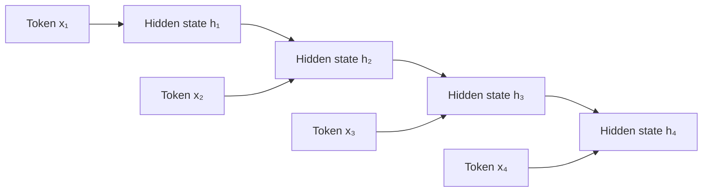

This recurrence creates several challenges.

### Sequential computation

The model must usually calculate $h_1$ before $h_2$, and $h_2$ before $h_3$.

This limits parallel computation during training.

### Long-range dependencies

Information from an early token must pass through many recurrent steps before reaching a later position.

Even LSTMs may struggle when sequences become very long.

### Information bottleneck

Traditional sequence-to-sequence models may compress a long input sequence into a limited representation before decoding the output.

Attention helps reduce this bottleneck by allowing the model to access relevant sequence positions directly.

The Transformer replaces recurrence with attention-based processing.

---

## 4. Core Idea

The central idea of a Transformer is:

> Each token should determine which other tokens are important for understanding its meaning.

Consider the sentence:

```text
The animal did not cross the street because it was tired.
```

To understand the token `it`, the model should connect it with `animal`.

The two tokens are not adjacent, but self-attention can create a direct relationship between them.

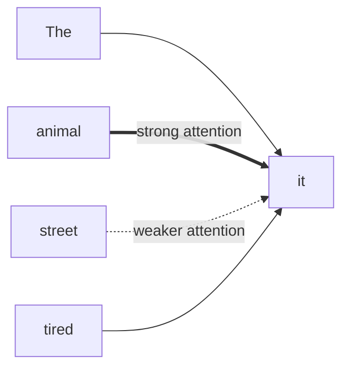

Self-attention therefore produces **contextual representations**.

The initial representation of a token only identifies the token itself. After attention, its representation contains information from relevant surrounding tokens.

---

## 5. From Tokens to Vectors

Neural networks cannot process raw words directly.

The text is first divided into **tokens**.

A token may represent:

* A complete word
* Part of a word
* A character
* A punctuation symbol
* An image patch
* A short audio segment

Example:

```text
"Transformers are powerful."
```

A possible subword tokenization is:

```text
["Transform", "ers", "are", "powerful", "."]
```

Each token is converted into an integer ID:

```text
["Transform", "ers", "are", "powerful", "."]
       ↓        ↓       ↓        ↓        ↓
     1054      328     124      9082      13
```

An embedding layer maps each ID to a dense vector:

$$
x_i = E[\text{token}_i]
$$

where:

* $E$ is the embedding matrix.
* $x_i$ is the vector representation of token $i$.

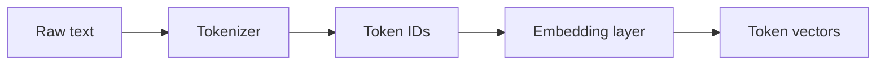

---

## 6. Why Initial Embeddings Are Not Enough

A normal embedding lookup returns the same initial vector every time a token appears.

Consider the word `bank`:

```text
She deposited money at the bank.

They sat on the river bank.
```

The initial embedding for `bank` may be identical in both sentences.

However, the correct meaning depends on context.

Self-attention transforms the initial embedding into a contextual representation:

```text
bank + money + deposited
        ↓
financial institution
```

```text
bank + river + sat
        ↓
side of a river
```

The model does not merely store dictionary definitions. It learns how each token should be represented within the current sequence.

---

## 7. Query, Key, and Value

For each input token vector $x_i$, the Transformer creates three vectors:

* Query
* Key
* Value

They are calculated using learned linear transformations:

$$
q_i = x_iW_Q
$$

$$
k_i = x_iW_K
$$

$$
v_i = x_iW_V
$$

where:

* $W_Q$ is the query projection matrix.
* $W_K$ is the key projection matrix.
* $W_V$ is the value projection matrix.

The matrices are learned during training.

### Intuition

A useful interpretation is:

* **Query:** What information is this token looking for?
* **Key:** What kind of information does this token contain?
* **Value:** What information should this token contribute?

This is similar to a search system:

```text
Query  → What am I searching for?
Key    → Does this item match the search?
Value  → What information will be returned?
```

The self-attention mechanism compares a token's query with every token's key. The resulting scores determine how much of each value should be included in the final representation.

---

## 8. Self-Attention Step by Step

Suppose the sequence contains $n$ tokens.

For token $i$, self-attention performs the following steps.

### Step 1: Create the query

$$
q_i = x_iW_Q
$$

### Step 2: Compare the query with all keys

For every token $j$:

$$
s_{ij} = q_i k_j^T
$$

A larger dot product indicates a stronger relationship between token $i$ and token $j$.

### Step 3: Scale the scores

$$
\hat{s}_{ij} = \frac{q_i k_j^T}{\sqrt{d_k}}
$$

where $d_k$ is the dimension of the key vectors.

Scaling prevents the dot products from becoming excessively large.

### Step 4: Normalize using softmax

$$
\alpha_{ij} = \frac{\exp(\hat{s}_{ij})}{\sum_{m=1}^{n}\exp(\hat{s}_{im})}
$$

The attention weights sum to one:

$$
\sum_{j=1}^{n}\alpha_{ij}=1
$$

### Step 5: Combine the values

$$
a_i = \sum_{j=1}^{n}\alpha_{ij}v_j
$$

The output $a_i$ is a weighted combination of the value vectors.

---

## 9. Self-Attention Diagram

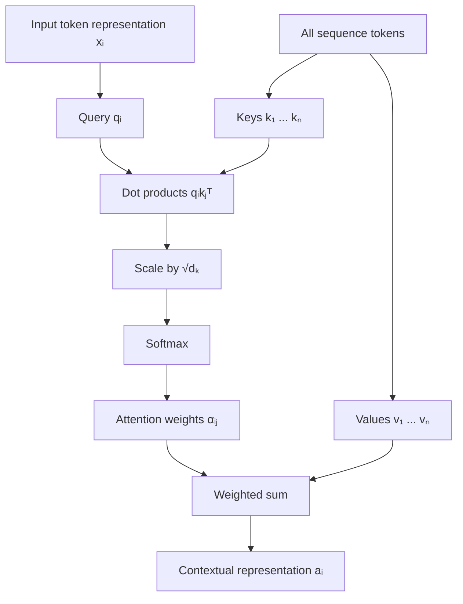

This process is repeated for every token.

During training, the calculations for all tokens can be vectorized and executed in parallel.

---

## 10. Matrix Form

Instead of calculating attention separately for each token, the model combines the query, key, and value vectors into matrices:

$$
Q = XW_Q
$$

$$
K = XW_K
$$

$$
V = XW_V
$$

Scaled dot-product attention is:

$$
\operatorname{Attention}(Q,K,V) =
\operatorname{softmax}
\left(
\frac{QK^T}{\sqrt{d_k}}
\right)V
$$

The attention-score matrix has shape:

$$
[\text{sequence length},\text{sequence length}]
$$

Each row describes how one token attends to all tokens in the sequence.

---

## 11. Small Numerical Example

Suppose one token has the query:

$$
q=[1,0]
$$

Three tokens have the following keys:

$$
k_1=[1,0]
$$

$$
k_2=[0,1]
$$

$$
k_3=[1,1]
$$

The raw scores are:

$$
qk_1^T = 1
$$

$$
qk_2^T = 0
$$

$$
qk_3^T = 1
$$

After softmax, approximate attention weights might be:

$$
[0.42,\ 0.16,\ 0.42]
$$

Suppose the value vectors are:

$$
v_1=[2,0]
$$

$$
v_2=[0,3]
$$

$$
v_3=[1,1]
$$

The output becomes:

$$
a = 0.42v_1 + 0.16v_2 + 0.42v_3
$$

$$
a =
0.42[2,0]
+
0.16[0,3]
+
0.42[1,1]
$$

$$
a = [1.26,\ 0.90]
$$

The new representation combines information from all three tokens, with more weight assigned to the first and third tokens.

---

## 12. Minimal Self-Attention Implementation

```python
import math

import torch
from torch import nn


class SelfAttention(nn.Module):
    def __init__(
        self,
        model_dimension: int,
        attention_dimension: int,
    ) -> None:
        super().__init__()

        self.query_projection = nn.Linear(
            model_dimension,
            attention_dimension,
            bias=False,
        )
        self.key_projection = nn.Linear(
            model_dimension,
            attention_dimension,
            bias=False,
        )
        self.value_projection = nn.Linear(
            model_dimension,
            attention_dimension,
            bias=False,
        )

        self.scale = math.sqrt(attention_dimension)

    def forward(
        self,
        inputs: torch.Tensor,
        mask: torch.Tensor | None = None,
    ) -> tuple[torch.Tensor, torch.Tensor]:
        """
        inputs:
            [batch_size, sequence_length, model_dimension]

        mask:
            Broadcastable to
            [batch_size, sequence_length, sequence_length]
        """

        queries = self.query_projection(inputs)
        keys = self.key_projection(inputs)
        values = self.value_projection(inputs)

        scores = torch.matmul(
            queries,
            keys.transpose(-2, -1),
        )

        scores = scores / self.scale

        if mask is not None:
            scores = scores.masked_fill(
                mask == 0,
                float("-inf"),
            )

        attention_weights = torch.softmax(
            scores,
            dim=-1,
        )

        outputs = torch.matmul(
            attention_weights,
            values,
        )

        return outputs, attention_weights
```

---

## 13. Why Positional Information Is Required

Self-attention processes relationships between token vectors, but it does not inherently understand token order.

Without positional information, the following sequences contain the same collection of token embeddings:

```text
The dog chased the cat.
```

```text
The cat chased the dog.
```

However, their meanings are different.

A Transformer therefore adds positional information to each token embedding:

$$
z_i = x_i + p_i
$$

where:

* $x_i$ is the token embedding.
* $p_i$ is the positional representation.
* $z_i$ is the input to the first Transformer block.

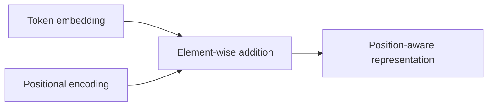

The original Transformer used sinusoidal positional encoding. Many later models use learned positional embeddings or relative-position methods.

---

## 14. Sinusoidal Positional Encoding

For position $pos$ and vector dimension $i$:

$$
PE(pos,2i) =
\sin
\left(
\frac{pos}{10000^{2i/d_{\text{model}}}}
\right)
$$

$$
PE(pos,2i+1) =
\cos
\left(
\frac{pos}{10000^{2i/d_{\text{model}}}}
\right)
$$

Even dimensions use sine, while odd dimensions use cosine.

The encoding creates a unique pattern for every position and allows the model to reason about relative distances between tokens.

---

## 15. Multi-Head Attention

A single attention operation may focus on one type of relationship.

For example, one attention head may learn:

* Subject–verb relationships
* Pronoun references
* Nearby phrase structure
* Long-range semantic relationships

**Multi-head attention** runs several attention operations in parallel.

For attention head $h$:

$$
\operatorname{head}_h =
\operatorname{Attention}
\left(
QW_h^Q,
KW_h^K,
VW_h^V
\right)
$$

The head outputs are concatenated:

$$
\operatorname{MultiHead}(Q,K,V) =
\operatorname{Concat}
(
\operatorname{head}_1,
\dots,
\operatorname{head}_H
)W_O
$$

where:

* $H$ is the number of attention heads.
* $W_O$ combines the head outputs.

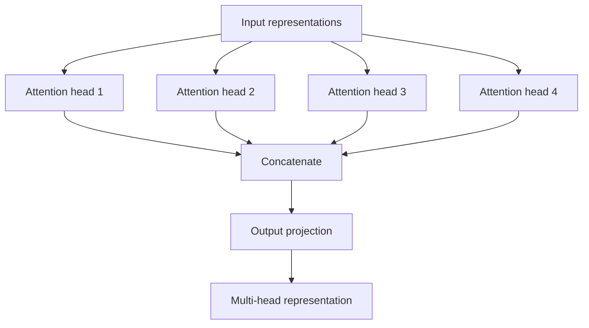

Multi-head attention allows the model to examine the same sequence from several learned representation spaces.

---

## 16. Transformer Encoder Block

A standard encoder block contains:

1. Multi-head self-attention
2. Residual connection
3. Layer normalization
4. Position-wise feed-forward network
5. Another residual connection
6. Another layer normalization

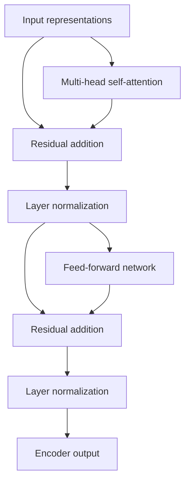

A complete encoder contains several stacked encoder blocks.

---

## 17. Position-Wise Feed-Forward Network

After attention, each token representation passes through a small neural network:

$$
\operatorname{FFN}(x) =
\phi(xW_1+b_1)W_2+b_2
$$

where $\phi$ may be:

* ReLU
* GELU
* SwiGLU
* Another nonlinear activation

The same feed-forward network is applied independently to every sequence position.

```text
Token representation
        ↓
Linear expansion
        ↓
Nonlinear activation
        ↓
Linear projection
        ↓
Updated representation
```

Attention allows tokens to exchange information.

The feed-forward network transforms the information stored inside each token representation.

---

## 18. Residual Connections

A residual connection adds the input of a sublayer to its output:

$$
y=x+\operatorname{Sublayer}(x)
$$

Residual connections help:

* Preserve existing information
* Improve gradient flow
* Stabilize deep-network training
* Make it easier to stack many Transformer blocks

```text
x ───────────────┐
                 +
x → Sublayer ────┘
        ↓
        y
```

---

## 19. Layer Normalization

Layer normalization stabilizes activations across the feature dimension.

A simplified form is:

$$
\operatorname{LayerNorm}(x) =
\gamma
\frac{x-\mu}{\sqrt{\sigma^2+\epsilon}}
+
\beta
$$

where:

* $\mu$ is the mean of the features.
* $\sigma^2$ is their variance.
* $\gamma$ and $\beta$ are learned parameters.

Layer normalization is especially important when many Transformer blocks are stacked.

---

## 20. Encoder–Decoder Transformer

The original Transformer architecture contains two main parts:

* Encoder
* Decoder

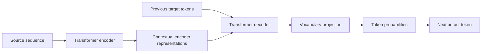

### Encoder

The encoder reads and represents the input sequence.

Example:

```text
French sentence → Encoder representations
```

### Decoder

The decoder generates an output sequence while attending to:

* Previously generated output tokens
* Encoder representations

Example:

```text
Encoder representations → English translation
```

---

## 21. Decoder Block

A Transformer decoder block normally contains:

1. Masked self-attention
2. Encoder–decoder attention
3. Feed-forward network
4. Residual connections
5. Layer normalization

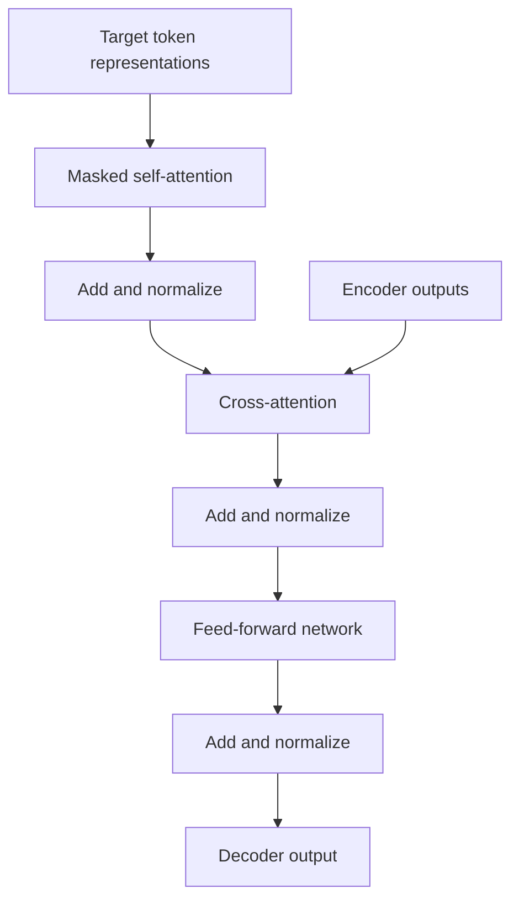

---

## 22. Causal Masking

A text-generation model must not examine future tokens while predicting the next token.

Consider:

```text
The weather is very ...
```

When predicting `very`, the model must not see tokens that occur after it.

A causal attention mask blocks future positions.

Example mask:

$$
M=
\begin{bmatrix}
1&0&0&0\\
1&1&0&0\\
1&1&1&0\\
1&1&1&1
\end{bmatrix}
$$

```text
Token 1 can attend to: 1
Token 2 can attend to: 1, 2
Token 3 can attend to: 1, 2, 3
Token 4 can attend to: 1, 2, 3, 4
```

This creates **causal self-attention**.

---

## 23. Three Main Transformer Families

### Encoder-only Transformer

Examples of tasks:

* Text classification
* Sentiment analysis
* Named-entity recognition
* Semantic similarity
* Information retrieval

Encoder-only models process the entire input bidirectionally.

```text
Input sequence
      ↓
Transformer encoder
      ↓
Contextual representations
      ↓
Classification or extraction
```

A well-known encoder-only family is BERT-like architecture.

---

### Decoder-only Transformer

Examples of tasks:

* Text generation
* Code generation
* Dialogue
* Autocomplete
* Next-token prediction

Decoder-only models use causal masking and generate outputs autoregressively. The decoder-only structure is the foundation of GPT-style language models.

```text
Prompt
  ↓
Decoder blocks
  ↓
Next-token distribution
  ↓
Select token
  ↓
Append token and repeat
```

---

### Encoder–decoder Transformer

Examples of tasks:

* Machine translation
* Text summarization
* Structured text generation
* Speech-to-text conversion

```text
Input sequence
      ↓
Encoder
      ↓
Context representations
      ↓
Decoder
      ↓
Output sequence
```

---

## 24. Autoregressive Text Generation

A decoder-only language model predicts a probability distribution over the next token:

$$
P(x_{t+1}\mid x_1,x_2,\dots,x_t)
$$

Generation proceeds repeatedly:

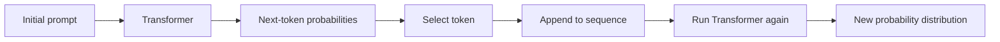

For example:

```text
Input:
Deep learning is

Prediction:
powerful

New input:
Deep learning is powerful

Next prediction:
because
```

This process continues until:

* An end token is generated
* A length limit is reached
* Another stopping rule is triggered

---

## 25. Transformer Training Objective

For next-token prediction, the input and target sequences are shifted.

Input:

```text
Transformers are powerful models
```

Target:

```text
are powerful models <EOS>
```

The model learns:

```text
Transformers → are
are          → powerful
powerful     → models
models       → <EOS>
```

Cross-entropy loss is commonly used:

$$
\mathcal{L} =
-\frac{1}{T}
\sum_{t=1}^{T}
\log
P(y_t\mid y_{<t})
$$

The model is penalized when it assigns low probability to the correct next token.

---

## 26. Minimal Transformer Text Classifier

The following example uses PyTorch's `TransformerEncoder`.

```python
import torch
from torch import nn


class TransformerTextClassifier(nn.Module):
    def __init__(
        self,
        vocabulary_size: int,
        model_dimension: int,
        number_of_heads: int,
        feed_forward_dimension: int,
        number_of_layers: int,
        number_of_classes: int,
        maximum_sequence_length: int,
        padding_index: int = 0,
    ) -> None:
        super().__init__()

        self.token_embedding = nn.Embedding(
            num_embeddings=vocabulary_size,
            embedding_dim=model_dimension,
            padding_idx=padding_index,
        )

        self.position_embedding = nn.Embedding(
            num_embeddings=maximum_sequence_length,
            embedding_dim=model_dimension,
        )

        encoder_layer = nn.TransformerEncoderLayer(
            d_model=model_dimension,
            nhead=number_of_heads,
            dim_feedforward=feed_forward_dimension,
            dropout=0.1,
            activation="gelu",
            batch_first=True,
            norm_first=True,
        )

        self.encoder = nn.TransformerEncoder(
            encoder_layer=encoder_layer,
            num_layers=number_of_layers,
        )

        self.classifier = nn.Linear(
            model_dimension,
            number_of_classes,
        )

        self.padding_index = padding_index

    def forward(
        self,
        token_ids: torch.Tensor,
    ) -> torch.Tensor:
        batch_size, sequence_length = token_ids.shape

        positions = torch.arange(
            sequence_length,
            device=token_ids.device,
        )

        positions = positions.unsqueeze(0).expand(
            batch_size,
            sequence_length,
        )

        token_vectors = self.token_embedding(token_ids)
        position_vectors = self.position_embedding(positions)

        representations = token_vectors + position_vectors

        padding_mask = token_ids.eq(self.padding_index)

        encoded = self.encoder(
            representations,
            src_key_padding_mask=padding_mask,
        )

        valid_tokens = (~padding_mask).unsqueeze(-1)

        summed = (
            encoded * valid_tokens
        ).sum(dim=1)

        lengths = valid_tokens.sum(dim=1).clamp(min=1)

        pooled = summed / lengths

        logits = self.classifier(pooled)

        return logits
```

---

## 27. Tensor Shapes

Assume:

```text
batch_size = 16
sequence_length = 40
model_dimension = 128
number_of_heads = 8
```

Input token IDs:

```text
[16, 40]
```

Token embeddings:

```text
[16, 40, 128]
```

Queries, keys, and values before splitting into heads:

```text
[16, 40, 128]
```

After splitting into eight heads:

```text
[16, 8, 40, 16]
```

because:

$$
\text{head dimension} = \frac{128}{8} = 16
$$

Attention-score tensor:

```text
[16, 8, 40, 40]
```

The last two dimensions represent relationships between every query position and every key position.

---

## 28. Training Loop

```python
from collections.abc import Iterable

import torch
from torch import nn


def train_one_epoch(
    model: nn.Module,
    data_loader: Iterable,
    optimizer: torch.optim.Optimizer,
    loss_function: nn.Module,
    device: torch.device,
) -> float:
    model.train()

    total_loss = 0.0
    number_of_batches = 0

    for token_ids, labels in data_loader:
        token_ids = token_ids.to(device)
        labels = labels.to(device)

        optimizer.zero_grad()

        logits = model(token_ids)
        loss = loss_function(logits, labels)

        loss.backward()

        nn.utils.clip_grad_norm_(
            model.parameters(),
            max_norm=1.0,
        )

        optimizer.step()

        total_loss += loss.item()
        number_of_batches += 1

    if number_of_batches == 0:
        raise ValueError("The training data loader is empty.")

    return total_loss / number_of_batches
```

Example configuration:

```python
device = torch.device(
    "cuda" if torch.cuda.is_available() else "cpu"
)

model = TransformerTextClassifier(
    vocabulary_size=20_000,
    model_dimension=128,
    number_of_heads=4,
    feed_forward_dimension=256,
    number_of_layers=2,
    number_of_classes=3,
    maximum_sequence_length=256,
).to(device)

optimizer = torch.optim.AdamW(
    model.parameters(),
    lr=3e-4,
    weight_decay=1e-2,
)

loss_function = nn.CrossEntropyLoss()
```

---

## 29. Practical Workflow

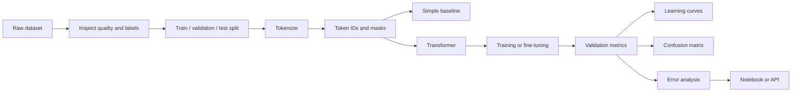

Recommended sequence:

1. Define the prediction problem.
2. Inspect data quality.
3. Build a simple baseline.
4. Tokenize the data.
5. Create attention and padding masks.
6. Train or fine-tune the model.
7. Monitor training and validation loss.
8. Calculate task-specific metrics.
9. Inspect incorrect predictions.
10. Save and deploy the best model.

---

## 30. Training from Scratch vs Transfer Learning

### Training from scratch

Training a Transformer from scratch may be reasonable when:

* The purpose is educational.
* The dataset is synthetic or very small.
* The vocabulary is highly specialized.
* The model is intentionally tiny.
* You need full control over the architecture.

However, training a useful large Transformer from scratch generally requires substantial:

* Data
* Compute
* Memory
* Engineering effort
* Evaluation effort

### Transfer learning

For most practical NLP projects, transfer learning is preferred.

Typical workflow:

```text
Pretrained Transformer
         ↓
Replace or add task-specific head
         ↓
Fine-tune on labeled dataset
         ↓
Evaluate on validation and test sets
```

Benefits include:

* Less training data
* Faster convergence
* Better generalization
* Lower computational cost
* Stronger performance

---

## 31. Evaluation Metrics

### Classification

Use:

* Accuracy
* Precision
* Recall
* Macro F1
* Weighted F1
* ROC-AUC
* PR-AUC
* Confusion matrix

### Sequence labeling

Use:

* Token accuracy
* Entity-level precision
* Entity-level recall
* Entity-level F1

### Text generation

Possible metrics include:

* Perplexity
* BLEU
* ROUGE
* Exact match
* BERTScore
* Human evaluation
* Factuality evaluation
* Safety evaluation

No single automatic metric completely captures generation quality.

---

## 32. Attention Complexity

For a sequence of length $n$, standard self-attention creates an $n\times n$ attention matrix.

Its approximate complexity is:

$$
O(n^2d)
$$

where $d$ is the representation dimension.

Memory usage also grows approximately quadratically with sequence length.

Examples:

```text
Sequence length:  128 → 16,384 attention relationships
Sequence length:  512 → 262,144 attention relationships
Sequence length: 4096 → 16,777,216 attention relationships
```

This is one of the main limitations of standard Transformers for very long sequences.

---

## 33. Transformer Advantages

Transformers provide several important benefits.

### Parallel training

All sequence positions can be processed simultaneously during training.

### Direct long-range connections

Any token can attend directly to another token.

### Flexible architecture

The same basic architecture can process:

* Text tokens
* Image patches
* Audio segments
* Time-series windows
* Multimodal inputs

### Scalable representation learning

Transformer performance can improve significantly with more:

* Parameters
* Training data
* Compute
* Context
* Task-specific fine-tuning

---

## 34. Transformer Limitations

Transformers are powerful but not automatically the best choice.

Important limitations include:

* Quadratic attention cost
* High memory usage
* Large data requirements
* Expensive training
* Expensive inference
* Sensitivity to tokenization
* Limited context windows
* Possible hallucinations in generation
* Difficult interpretability
* Potential bias inherited from training data

Attention weights should not automatically be treated as complete explanations of model reasoning.

---

## 35. Transformer vs Other Architectures

| Architecture      | Main Strength                                | Main Limitation                              |
| ----------------- | -------------------------------------------- | -------------------------------------------- |
| RNN               | Simple sequential modeling                   | Slow sequential computation                  |
| LSTM              | Better long-term memory than vanilla RNN     | Still recurrent and difficult to parallelize |
| GRU               | Simpler gated recurrence                     | Still processes sequences recurrently        |
| 1D CNN            | Efficient local-pattern detection            | Long-range context may require many layers   |
| Transformer       | Parallel processing and global relationships | Attention cost grows quadratically           |
| State-space model | Efficient long-sequence processing           | Different tooling and learning dynamics      |

---

## 36. Common Mistakes

### Using a Transformer without a baseline

A TF-IDF model with logistic regression may perform well on a small text-classification dataset.

Always compare against simpler alternatives.

---

### Forgetting positional information

Without positional encodings or another position mechanism, the model cannot reliably distinguish sequence order.

---

### Using the wrong attention mask

A decoder-only language model requires causal masking.

A classification encoder normally allows bidirectional attention but needs a padding mask.

---

### Padding without a padding mask

The model may incorrectly attend to padding tokens.

Always construct and pass the appropriate padding mask.

---

### Mixing up queries, keys, and values

Remember:

```text
Query: What am I looking for?
Key: What information do I contain?
Value: What content should I contribute?
```

---

### Using incompatible dimensions

The model dimension must normally be divisible by the number of heads:

$$
d_{\text{model}} \bmod H=0
$$

For example:

```text
d_model = 128
heads   = 8
head dimension = 16
```

---

### Training a large model from scratch unnecessarily

For most practical projects, fine-tuning a pretrained model is more effective.

---

### Ignoring data leakage

Duplicate or near-duplicate text can appear across training and test sets.

This can produce misleadingly high performance.

---

### Evaluating only with loss

Loss is useful for optimization, but it does not fully describe task performance.

Track task-specific metrics and inspect individual errors.

---

### Assuming attention equals explanation

A high attention score indicates a learned relationship, but it does not necessarily provide a complete causal explanation for the prediction.

---

## 37. Practical Exercises

### Exercise 1 — Explain Self-Attention

Explain the following concepts using your own words:

* Query
* Key
* Value
* Attention score
* Softmax weight
* Contextual representation

---

### Exercise 2 — Calculate Attention

Given:

$$
Q=
\begin{bmatrix}
1&0
\end{bmatrix}
$$

$$
K=
\begin{bmatrix}
1&0\\
0&1
\end{bmatrix}
$$

$$
V=
\begin{bmatrix}
2&1\\
0&3
\end{bmatrix}
$$

Calculate:

1. $QK^T$
2. Scaled scores
3. Softmax weights
4. Attention output

---

### Exercise 3 — Inspect Attention

Create a short sentence and visualize its attention matrix.

Example:

```text
The cat slept because it was tired.
```

Investigate which token receives the most attention from `it`.

Do not assume the attention pattern will match human linguistic intuition.

---

### Exercise 4 — Train a Text Classifier

Train a small Transformer encoder on a sentiment dataset.

Required outputs:

* Training-loss curve
* Validation-loss curve
* Accuracy
* Macro F1
* Confusion matrix
* Five incorrect predictions

---

### Exercise 5 — Compare Architectures

Train and compare:

1. TF-IDF with logistic regression
2. LSTM
3. Transformer encoder

Record:

* Number of parameters
* Training time
* Inference time
* Validation F1
* Memory usage
* Error patterns

---

### Exercise 6 — Fine-Tune a Pretrained Model

Fine-tune a small pretrained Transformer for:

* Sentiment classification
* Spam classification
* Intent detection
* News-topic classification

Compare it with the Transformer trained from scratch.

---

## 38. Completion Checklist

* [ ] I can explain the Transformer in one or two minutes.
* [ ] I understand why Transformers reduce sequential computation during training.
* [ ] I can explain self-attention conceptually.
* [ ] I can define query, key, and value.
* [ ] I understand scaled dot-product attention.
* [ ] I can explain why positional information is required.
* [ ] I understand multi-head attention.
* [ ] I can describe an encoder block.
* [ ] I can describe causal masking.
* [ ] I know the difference between encoder-only, decoder-only, and encoder–decoder models.
* [ ] I have trained or fine-tuned a small Transformer.
* [ ] I have plotted training and validation curves.
* [ ] I have calculated task-specific metrics.
* [ ] I have compared the Transformer with a simple baseline.
* [ ] I have recorded at least one limitation or assumption.

---

## 39. Related Outcome

Understand neural networks, CNNs, RNNs, LSTMs, Transformers, and transfer learning at a practical level.

You should be able to connect the Transformer architecture to:

* Sequential datasets
* Tokenization
* Embeddings
* Model architecture
* Training objectives
* Validation metrics
* Error analysis
* Deployment constraints

---

## 40. Related Mini Project

### Text Classification: LSTM vs Transformer vs Transfer Learning

Build a sentiment or topic-classification system.

Compare:

```text
TF-IDF + Logistic Regression
             vs
            LSTM
             vs
Small Transformer from scratch
             vs
Fine-tuned pretrained Transformer
```

### Required deliverables

* Exploratory data analysis
* Label-distribution chart
* Sequence-length distribution
* Tokenization pipeline
* Reproducible data split
* Baseline results
* Training and validation curves
* Accuracy and macro F1
* Confusion matrix
* Error-analysis table
* Saved model
* Prediction API
* README with conclusions

### Example API

```text
POST /predict

Request:
{
  "text": "The application is fast and easy to use."
}

Response:
{
  "label": "positive",
  "confidence": 0.96
}
```

---

## 41. Key Takeaways

* Transformers model relationships using attention instead of recurrence.
* Self-attention creates contextual token representations.
* Queries search for information.
* Keys describe what information is available.
* Values provide the information that is combined.
* Scaled dot-product attention uses $QK^T$, scaling, softmax, and a weighted sum of $V$.
* Positional information is required because attention alone does not represent sequence order.
* Multi-head attention learns several relationship patterns simultaneously.
* Transformer blocks also contain feed-forward networks, residual connections, and normalization.
* Encoder-only models are commonly used for understanding tasks.
* Decoder-only models are commonly used for autoregressive generation.
* Encoder–decoder models are commonly used for sequence transformation.
* Transfer learning is usually more practical than training a large Transformer from scratch.
* Transformers remain limited by data quality, computation cost, context length, and attention complexity.

---

## 42. Final Summary

The **Transformer** is one of the most important architectures in modern deep learning.

Its core mechanism is self-attention:

```text
Tokens
  ↓
Embeddings + positional information
  ↓
Queries, keys, and values
  ↓
Attention scores
  ↓
Softmax weights
  ↓
Contextual token representations
  ↓
Feed-forward transformation
  ↓
Stacked Transformer blocks
  ↓
Prediction or generation
```

The most important idea is not merely that the model “pays attention.”

The important idea is that every token can dynamically collect information from other relevant tokens and construct a representation that depends on the current context.

Turn this lesson into a concrete artifact:

```text
Dataset
   ↓
Tokenizer
   ↓
Simple baseline
   ↓
Transformer model or pretrained model
   ↓
Training or fine-tuning
   ↓
Validation metrics
   ↓
Learning curves
   ↓
Confusion matrix
   ↓
Error analysis
   ↓
Notebook, API, or portfolio project
```

A Transformer should not be selected only because it is modern. Its value must be demonstrated through strong validation, comparison with simpler baselines, and careful error analysis.
