# 019 — Object Detection Basics

**Course:** 03 — Machine Learning and Deep Learning
**Module:** Module 07 — Deep Learning
**Content Group:** Applications
**Roadmap Source:** Deep Learning / Applications
**Lesson Type:** Deep Learning
**Order in Module:** 019
**Suggested Duration:** 24 minutes

---

## 1. Overview

**Object detection** is a computer vision task that identifies:

1. **What objects are present in an image**
2. **Where each object is located**

Unlike image classification, which normally predicts one label for an entire image, object detection may return multiple objects.

For each detected object, the model produces:

* A bounding box
* A class label
* A confidence score

Example:

```text
Image:
- Person at [42, 30, 170, 310], confidence = 0.96
- Bicycle at [80, 170, 310, 360], confidence = 0.91
- Car at [330, 140, 610, 350], confidence = 0.88
```

Object detection is used in:

* Autonomous driving
* Surveillance systems
* Medical imaging
* Manufacturing quality control
* Retail analytics
* Robotics
* Wildlife monitoring
* Traffic analysis
* Sports analytics
* Agricultural automation

---

## 2. Learning Objectives

By the end of this lesson, you should be able to:

* Explain object detection in your own words.
* Distinguish image classification, localization, detection, and segmentation.
* Represent objects using bounding boxes.
* Calculate Intersection over Union.
* Explain anchors, feature maps, and receptive fields.
* Describe why multiscale detection is necessary.
* Explain the difference between one-stage and two-stage detectors.
* Describe the purpose of Non-Maximum Suppression.
* Evaluate a detector using precision, recall, AP, and mAP.
* Fine-tune a pretrained detector on a small custom dataset.
* Identify common dataset and evaluation problems.
* Design a small object-detection portfolio project.

---

## 3. Classification vs. Object Detection

### Image classification

Image classification predicts one class for the complete image.

```text
Input image
    ↓
CNN classifier
    ↓
"Dog"
```

### Classification with localization

The model predicts one class and one bounding box.

```text
Input image
    ↓
Model
    ↓
Class: Dog
Box: [x1, y1, x2, y2]
```

### Object detection

The model predicts multiple objects and their locations.

```text
Input image
    ↓
Object detector
    ↓
Dog:    box 1, confidence 0.95
Person: box 2, confidence 0.91
Ball:   box 3, confidence 0.84
```

### Instance segmentation

Instance segmentation predicts a precise mask for every object rather than only a rectangular box.

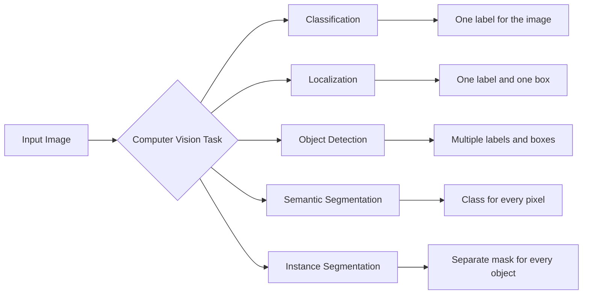

---

## 4. Object-Detection Output

Suppose an image contains $N$ detected objects.

The model may produce:

$$
\{(b_i, c_i, s_i)\}_{i=1}^{N}
$$

Where:

* $b_i$ is the bounding box.
* $c_i$ is the predicted class.
* $s_i$ is the confidence score.

A typical detector output can be represented as:

```python
detections = [
    {
        "box": [52, 31, 190, 280],
        "class": "person",
        "confidence": 0.96,
    },
    {
        "box": [210, 120, 430, 340],
        "class": "car",
        "confidence": 0.89,
    },
]
```

---

## 5. Bounding-Box Representations

A bounding box is a rectangle that approximately encloses an object.

### 5.1 Corner format: `XYXY`

$$
(x_{\min}, y_{\min}, x_{\max}, y_{\max})
$$

Where:

* $x_{\min}$: left coordinate
* $y_{\min}$: top coordinate
* $x_{\max}$: right coordinate
* $y_{\max}$: bottom coordinate

```text
(x_min, y_min) ┌────────────────────┐
               │                    │
               │       object       │
               │                    │
               └────────────────────┘ (x_max, y_max)
```

### 5.2 Origin-size format: `XYWH`

$$
(x_{\min}, y_{\min}, w, h)
$$

Where:

$$
w=x_{\max}-x_{\min}
$$

$$
h=y_{\max}-y_{\min}
$$

### 5.3 Center-size format

$$
(x_c,y_c,w,h)
$$

Where:

$$
x_c=\frac{x_{\min}+x_{\max}}{2}
$$

$$
y_c=\frac{y_{\min}+y_{\max}}{2}
$$

### 5.4 Normalized coordinates

Some dataset formats divide coordinates by image width and height:

$$
x'_c=\frac{x_c}{W}
$$

$$
y'_c=\frac{y_c}{H}
$$

$$
w'=\frac{w}{W}
$$

$$
h'=\frac{h}{H}
$$

The resulting values are normally between 0 and 1.

---

## 6. Example Annotation

Suppose an image has a width of 800 pixels and a height of 600 pixels.

An object has this bounding box:

```text
x_min = 200
y_min = 150
x_max = 600
y_max = 450
```

Its width and height are:

$$
w=600-200=400
$$

$$
h=450-150=300
$$

Its center is:

$$
x_c=\frac{200+600}{2}=400
$$

$$
y_c=\frac{150+450}{2}=300
$$

Normalized center-format coordinates are:

$$
x'_c=\frac{400}{800}=0.5
$$

$$
y'_c=\frac{300}{600}=0.5
$$

$$
w'=\frac{400}{800}=0.5
$$

$$
h'=\frac{300}{600}=0.5
$$

The normalized annotation is therefore:

```text
0.5 0.5 0.5 0.5
```

---

## 7. Dataset Structure

An object-detection sample normally contains:

```text
image
+
one or more bounding boxes
+
one class label for each box
```

Example:

```python
image_shape = [3, 480, 640]

target = {
    "boxes": [
        [50, 80, 180, 320],
        [260, 100, 510, 390],
    ],
    "labels": [
        1,
        3,
    ],
}
```

The shapes are commonly:

```text
image:  [C, H, W]
boxes:  [N, 4]
labels: [N]
```

Where $N$ can be different for every image.

One image might contain no objects, while another image might contain 20 objects.

---

## 8. Common Annotation Formats

### Pascal VOC

Usually stores annotations in XML files.

Typical box format:

```text
x_min, y_min, x_max, y_max
```

### COCO

Stores annotations in JSON.

Typical box format:

```text
x_min, y_min, width, height
```

COCO can support:

* Bounding boxes
* Segmentation masks
* Keypoints
* Crowd annotations
* Object area

### YOLO

Stores one text file for each image.

Typical row:

```text
class_id x_center y_center width height
```

The coordinates are usually normalized.

Example:

```text
0 0.512 0.438 0.225 0.510
2 0.731 0.604 0.180 0.242
```

---

## 9. Intersection over Union

A predicted box is rarely identical to the ground-truth box. We therefore need a measure of overlap.

**Intersection over Union**, or IoU, compares two bounding boxes.

$$
\operatorname{IoU}(A,B) =
\frac{|A\cap B|}
{|A\cup B|}
$$

Where:

* $A\cap B$ is the intersection area.
* $A\cup B$ is the union area.

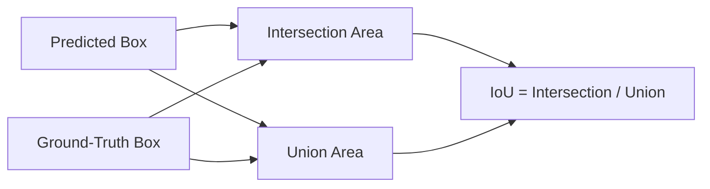

### IoU interpretation

|  IoU | Interpretation   |
| ---: | ---------------- |
| 0.00 | No overlap       |
| 0.25 | Weak overlap     |
| 0.50 | Moderate overlap |
| 0.75 | Strong overlap   |
| 1.00 | Perfect overlap  |

A prediction may be considered correct when:

1. The predicted class is correct.
2. The confidence exceeds a threshold.
3. The IoU exceeds an evaluation threshold.

For example:

```text
Correct class
AND
confidence >= 0.50
AND
IoU >= 0.50
```

---

## 10. Calculating IoU in Python

```python
def calculate_iou(box_a, box_b):
    """
    Calculate IoU between two XYXY bounding boxes.

    box_a and box_b:
        [x_min, y_min, x_max, y_max]
    """
    ax1, ay1, ax2, ay2 = box_a
    bx1, by1, bx2, by2 = box_b

    intersection_x1 = max(ax1, bx1)
    intersection_y1 = max(ay1, by1)
    intersection_x2 = min(ax2, bx2)
    intersection_y2 = min(ay2, by2)

    intersection_width = max(0, intersection_x2 - intersection_x1)
    intersection_height = max(0, intersection_y2 - intersection_y1)
    intersection_area = intersection_width * intersection_height

    area_a = max(0, ax2 - ax1) * max(0, ay2 - ay1)
    area_b = max(0, bx2 - bx1) * max(0, by2 - by1)

    union_area = area_a + area_b - intersection_area

    if union_area == 0:
        return 0.0

    return intersection_area / union_area
```

Example:

```python
ground_truth = [100, 100, 300, 300]
prediction = [120, 130, 310, 320]

iou = calculate_iou(ground_truth, prediction)
print(f"IoU: {iou:.4f}")
```

---

## 11. Why Object Detection Is More Difficult Than Classification

Image classification predicts:

```text
one image → one label
```

Object detection predicts:

```text
one image → variable number of objects
```

The model must solve several problems simultaneously:

1. Determine whether an object exists.
2. Predict the object's class.
3. Predict its position.
4. Predict its size.
5. Separate nearby objects.
6. avoid duplicate detections.
7. Detect small and large objects.
8. Handle partial occlusion.
9. Handle background clutter.

The output structure is therefore more complex than standard classification.

---

## 12. Anchor Boxes

An **anchor box** is a predefined candidate box placed at a location on a feature map.

Anchors may have different:

* Sizes
* Aspect ratios
* Center positions

```text
Same center, different shapes:

┌───────────────────────┐
│       wide anchor     │
└───────────────────────┘

       ┌──────────┐
       │  square  │
       │  anchor  │
       └──────────┘

          ┌────┐
          │tall│
          │box │
          └────┘
```

Instead of predicting every box from nothing, the network predicts adjustments to anchor boxes.

For each anchor, the model may predict:

* Objectness
* Class probabilities
* Horizontal offset
* Vertical offset
* Width adjustment
* Height adjustment

---

## 13. Anchor-Box Regression

Suppose an anchor box has:

$$
(x_a,y_a,w_a,h_a)
$$

The model predicts offsets:

$$
(t_x,t_y,t_w,t_h)
$$

A common transformation is:

$$
x=x_a+t_xw_a
$$

$$
y=y_a+t_yh_a
$$

$$
w=w_a e^{t_w}
$$

$$
h=h_a e^{t_h}
$$

This allows the detector to move and resize the original anchor to match the target object.

---

## 14. The Problem with Too Many Anchors

Generating many anchors at every image pixel is computationally expensive.

For example, imagine an image with:

```text
561 × 728 pixels
```

If five anchors are generated for every pixel:

$$
561 \times 728 \times 5 =
2{,}042{,}040
$$

The detector would need to classify and regress more than two million anchors for one image.

Instead, anchor-based detectors normally generate anchors on lower-resolution feature maps.

---

## 15. Feature Maps

A convolutional network converts an input image into multiple feature maps.

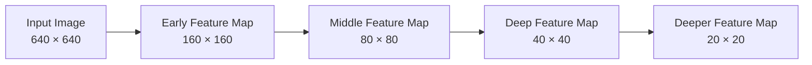

Each feature-map position corresponds to a region of the original image.

A position in a feature map can be used as the center of one or more anchor boxes.

For a feature map of shape:

$$
H_f \times W_f
$$

with $A$ anchors per location, the total number of anchors is:

$$
H_fW_fA
$$

For example:

$$
40 \times 40 \times 3=4800
$$

This is much smaller than generating anchors at every original image pixel.

---

## 16. Receptive Field

The **receptive field** of a feature-map unit is the region of the original image that influences that unit.

Early CNN layers normally have:

* Smaller receptive fields
* Higher spatial resolution
* More local detail

Deeper CNN layers normally have:

* Larger receptive fields
* Lower spatial resolution
* More semantic information

```text
Early layer:
small receptive field
→ edges and textures
→ useful for small objects

Deep layer:
large receptive field
→ shapes and object-level context
→ useful for large objects
```

---

## 17. Multiscale Object Detection

Objects may appear at very different sizes.

Examples:

* A distant pedestrian may occupy 20 pixels.
* A nearby pedestrian may occupy most of the image.
* A small car and a large bus may appear in the same scene.

A detector using only one feature-map resolution may fail to represent every object size effectively.

### Main idea

Use several feature-map scales:

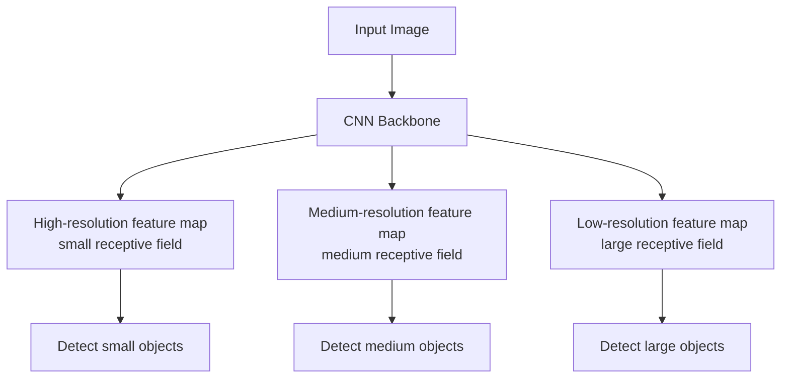

### Example scales

```text
Feature map: 4 × 4
Anchor scale: 0.15
Purpose: small objects

Feature map: 2 × 2
Anchor scale: 0.40
Purpose: medium objects

Feature map: 1 × 1
Anchor scale: 0.80
Purpose: large objects
```

For smaller objects, use:

* More spatial locations
* Smaller anchors
* Higher-resolution feature maps

For larger objects, use:

* Fewer spatial locations
* Larger anchors
* Lower-resolution feature maps

---

## 18. Feature Pyramid Networks

A **Feature Pyramid Network**, or FPN, combines:

* Detailed features from early layers
* Semantic features from deep layers

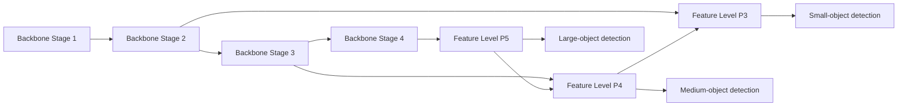

FPN-style architectures improve detection across object scales.

They are used in detector families such as:

* Faster R-CNN with FPN
* RetinaNet
* Mask R-CNN
* Several modern YOLO variants

---

## 19. Positive and Negative Anchors

During training, anchors must be matched to ground-truth boxes.

A common strategy uses IoU.

Example:

```text
IoU >= 0.70  → positive anchor
IoU <= 0.30  → negative anchor
otherwise    → ignored anchor
```

A positive anchor learns:

* The object's class
* The target box offsets

A negative anchor learns:

* Background or no-object

The exact thresholds depend on the model.

---

## 20. Class Imbalance in Detection

Most candidate locations contain background.

For example:

```text
Total anchors:    10,000
Positive anchors:    70
Negative anchors: 9,930
```

This creates a severe imbalance.

Possible solutions include:

* Positive-negative sampling
* Hard-negative mining
* Focal loss
* Objectness filtering
* Ignoring uncertain anchors

### Focal loss

Focal loss reduces the contribution of easy examples.

$$
FL(p_t) =
-\alpha_t(1-p_t)^\gamma\log(p_t)
$$

When the model already classifies an example correctly with high confidence, its loss is reduced.

This allows training to focus more on difficult examples.

---

## 21. Detection Loss

Object detectors often optimize multiple objectives.

$$
L_{\text{total}} =
\lambda_{\text{cls}}L_{\text{cls}}
+
\lambda_{\text{box}}L_{\text{box}}
+
\lambda_{\text{obj}}L_{\text{obj}}
$$

Where:

* $L_{\text{cls}}$: class prediction loss
* $L_{\text{box}}$: bounding-box regression loss
* $L_{\text{obj}}$: objectness loss

Some models also include:

* Region proposal loss
* Mask loss
* Distribution focal loss
* IoU-based box loss

### Classification loss

Measures whether the predicted class is correct.

### Objectness loss

Measures whether an object exists at a candidate location.

### Box regression loss

Measures how closely the predicted box matches the target.

Common box losses include:

* L1 loss
* Smooth L1 loss
* IoU loss
* Generalized IoU
* Distance IoU
* Complete IoU

---

## 22. Non-Maximum Suppression

A detector may produce several overlapping boxes for the same object.

```text
Box A: confidence 0.95
Box B: confidence 0.91
Box C: confidence 0.76
```

All three boxes may describe one person.

**Non-Maximum Suppression**, or NMS, removes duplicate predictions.

### NMS procedure

1. Select the box with the highest confidence.
2. Keep that box.
3. Compare it with the remaining boxes.
4. Remove boxes with IoU above the NMS threshold.
5. Repeat with the remaining boxes.

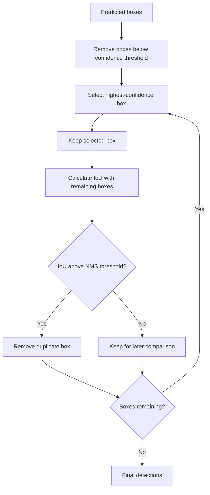

### NMS pseudocode

```python
def non_maximum_suppression(boxes, scores, iou_threshold):
    selected = []

    order = scores.argsort(descending=True)

    while len(order) > 0:
        current = order[0]
        selected.append(current)

        if len(order) == 1:
            break

        remaining = order[1:]
        ious = calculate_iou_batch(
            boxes[current],
            boxes[remaining],
        )

        order = remaining[ious <= iou_threshold]

    return selected
```

### Important caveat

A very low NMS threshold may remove nearby objects.

A very high NMS threshold may retain duplicate boxes.

---

## 23. Confidence Threshold

A detector normally produces many low-confidence predictions.

The confidence threshold decides which predictions are displayed.

```text
Confidence threshold = 0.25
```

Predictions below 0.25 are removed.

### Low threshold

* Higher recall
* More false positives

### High threshold

* Higher precision
* More missed objects

The appropriate threshold depends on the application.

For example:

* Medical screening may prioritize recall.
* Automated billing may prioritize precision.
* Real-time alerts may need a balance.

---

## 24. One-Stage Detectors

A one-stage detector predicts objects directly from feature maps.

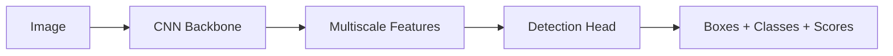

Examples include:

* YOLO
* SSD
* RetinaNet

### Advantages

* Fast inference
* Simple end-to-end pipeline
* Suitable for real-time applications
* Often easier to deploy

### Limitations

* Small or crowded objects may be difficult.
* There may be strong foreground-background imbalance.
* Performance depends heavily on multiscale features.

---

## 25. Two-Stage Detectors

A two-stage detector first proposes candidate regions and then classifies them.

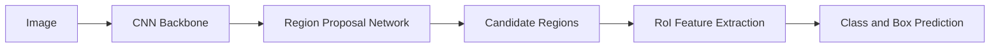

Examples include:

* Faster R-CNN
* Mask R-CNN

### Stage 1

Generate possible object regions.

### Stage 2

Classify each region and refine its box.

### Advantages

* Strong detection accuracy
* Often effective for small objects
* Flexible architecture
* Well suited to instance segmentation extensions

### Limitations

* Slower than one-stage detectors
* More components
* More complicated training and deployment

---

## 26. Anchor-Based and Anchor-Free Detection

### Anchor-based detectors

Use predefined boxes.

Examples:

* Faster R-CNN
* SSD
* RetinaNet
* Several earlier YOLO versions

The model predicts adjustments relative to anchors.

### Anchor-free detectors

Predict objects without predefined anchor shapes.

They may predict:

* Object centers
* Corner locations
* Distances from a point to box boundaries

Examples include:

* CenterNet
* FCOS
* Several modern detection heads

### Comparison

| Anchor-based                 | Anchor-free                         |
| ---------------------------- | ----------------------------------- |
| Uses predefined box shapes   | Does not require predefined anchors |
| Requires anchor design       | Reduces anchor engineering          |
| Well-established approach    | Often simpler conceptually          |
| Can generate many candidates | May reduce candidate complexity     |

---

## 27. Detection Metrics

A confusion matrix alone is not sufficient for object detection.

The model must be evaluated for both:

* Classification correctness
* Localization correctness

Important metrics include:

* Precision
* Recall
* Precision-recall curve
* Average Precision
* Mean Average Precision
* IoU-specific AP
* Per-class AP

---

## 28. True Positives, False Positives, and False Negatives

A prediction is a **true positive** when:

* The class is correct.
* The prediction is matched to an unused ground-truth object.
* Its IoU is greater than the required threshold.

A **false positive** may occur when:

* The class is wrong.
* The IoU is too low.
* The box is a duplicate detection.
* The model detects an object that does not exist.

A **false negative** occurs when:

* A ground-truth object is not detected.

---

## 29. Precision and Recall

### Precision

$$
\text{Precision} =
\frac{TP}{TP+FP}
$$

Precision asks:

> Of all predicted objects, how many were correct?

### Recall

$$
\text{Recall} =
\frac{TP}{TP+FN}
$$

Recall asks:

> Of all real objects, how many were detected?

### Example

Suppose:

```text
True positives  = 80
False positives = 20
False negatives = 40
```

Then:

$$
\text{Precision} = \frac{80}{80+20} = 0.80
$$

$$
\text{Recall} = \frac{80}{80+40} = 0.667
$$

---

## 30. Precision-Recall Curve

Changing the confidence threshold changes precision and recall.

```text
High confidence threshold
→ fewer detections
→ higher precision
→ lower recall

Low confidence threshold
→ more detections
→ lower precision
→ higher recall
```

The precision-recall curve evaluates the detector across many confidence thresholds.

---

## 31. Average Precision

**Average Precision**, or AP, summarizes the area under the precision-recall curve for one class.

Conceptually:

$$
AP =
\int_0^1 P(R)\,dR
$$

Where:

* $P$ is precision.
* $R$ is recall.

AP depends on the IoU threshold.

Examples:

* $AP_{50}$: AP at IoU 0.50
* $AP_{75}$: AP at IoU 0.75

A detector may have good $AP_{50}$ but weaker $AP_{75}$, meaning that it finds objects but its boxes are not always precisely aligned.

---

## 32. Mean Average Precision

**Mean Average Precision**, or mAP, averages AP across classes.

$$
mAP =
\frac{1}{C}
\sum_{c=1}^{C}AP_c
$$

Where $C$ is the number of classes.

### Common reporting styles

#### mAP@0.50

Average AP using an IoU threshold of 0.50.

#### mAP@0.50:0.95

Average AP over several IoU thresholds:

```text
0.50, 0.55, 0.60, ..., 0.95
```

This metric is stricter because it rewards accurate box localization.

---

## 33. Small, Medium, and Large Objects

Detection performance should often be measured separately for different object sizes.

```text
AP_small
AP_medium
AP_large
```

A model may perform well on large objects but poorly on small ones.

Possible causes of weak small-object detection include:

* Low input resolution
* Excessive downsampling
* Insufficient high-resolution features
* Small-object annotation errors
* Background clutter
* Inappropriate augmentation
* Objects occupying only a few pixels

---

## 34. End-to-End Detection Workflow

```mermaid
flowchart LR
    A[Define classes] --> B[Collect images]
    B --> C[Annotate bounding boxes]
    C --> D[Inspect annotation quality]
    D --> E[Split train validation test]
    E --> F[Load pretrained detector]
    F --> G[Apply box-aware augmentation]
    G --> H[Train model]
    H --> I[Monitor losses and mAP]
    I --> J[Evaluate per class and object size]
    J --> K[Inspect false positives and false negatives]
    K --> L[Tune model data and thresholds]
    L --> M[Export and deploy]
```

---

## 35. Why Transfer Learning Is Usually Recommended

Training an object detector from scratch often requires:

* A large labeled dataset
* Significant GPU compute
* Careful optimization
* Long training time

Bounding-box annotation is also expensive.

A practical workflow usually starts with a detector pretrained on a large dataset such as COCO.

Then:

1. Replace or reconfigure the detection head.
2. Fine-tune the model on custom classes.
3. Optionally unfreeze more backbone layers.
4. Train with a smaller learning rate.

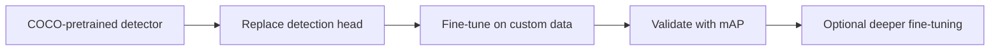

---

## 36. Practical YOLO Example

A pretrained detector is suitable for a small introductory project.

### Install the package

```bash
pip install ultralytics
```

### Train a pretrained model

```python
from ultralytics import YOLO

model = YOLO("pretrained_detector.pt")

training_results = model.train(
    data="dataset.yaml",
    epochs=50,
    imgsz=640,
    batch=16,
    patience=10,
    device=0,
)
```

Replace `"pretrained_detector.pt"` with a checkpoint supported by the installed library version.

### Validate the model

```python
metrics = model.val()

print("mAP@0.50:0.95:", metrics.box.map)
print("mAP@0.50:", metrics.box.map50)
print("mAP@0.75:", metrics.box.map75)
```

### Run inference

```python
results = model.predict(
    source="sample.jpg",
    conf=0.25,
    iou=0.70,
    save=True,
)
```

### Read predictions

```python
for result in results:
    boxes_xyxy = result.boxes.xyxy
    confidence_scores = result.boxes.conf
    class_ids = result.boxes.cls

    for box, score, class_id in zip(
        boxes_xyxy,
        confidence_scores,
        class_ids,
    ):
        print(
            "Box:",
            box.tolist(),
            "Confidence:",
            float(score),
            "Class:",
            int(class_id),
        )
```

---

## 37. Example YOLO Dataset Structure

```text
object-detection-dataset/
│
├── images/
│   ├── train/
│   ├── val/
│   └── test/
│
├── labels/
│   ├── train/
│   ├── val/
│   └── test/
│
└── dataset.yaml
```

Example `dataset.yaml`:

```yaml
path: object-detection-dataset

train: images/train
val: images/val
test: images/test

names:
  0: person
  1: bicycle
  2: car
```

For every image:

```text
images/train/example_001.jpg
```

There should normally be a matching annotation:

```text
labels/train/example_001.txt
```

---

## 38. Detection-Aware Data Augmentation

Object-detection augmentation must update the boxes whenever the image changes.

Common transformations include:

* Horizontal flipping
* Scaling
* Cropping
* Translation
* Brightness adjustment
* Contrast adjustment
* Blur
* Noise
* Mosaic
* MixUp

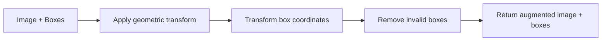

### Important caveat

Applying augmentation to the image without transforming its boxes creates incorrect training labels.

---

## 39. Augmentation Risks

### Cropping

Cropping may:

* Remove an object completely.
* Truncate part of an object.
* Create extremely small boxes.

### Rotation

Rotation may require more complex box transformations.

A rotated object may no longer fit tightly inside an axis-aligned rectangle.

### Horizontal flipping

Horizontal flipping is often safe for:

* People
* Cars
* Animals

It may not be safe when direction carries semantic meaning.

Examples:

* Left-turn versus right-turn signs
* Text
* Medical orientation
* Asymmetric equipment

### Mosaic augmentation

Mosaic combines several images into one.

It can improve:

* Small-object exposure
* Context diversity
* Batch diversity

However, it may produce scenes that differ from the real deployment environment.

---

## 40. Training Curves

Detection training may report several loss components:

```text
classification loss
box regression loss
objectness loss
distribution loss
mask loss
```

Monitor:

* Training loss
* Validation loss
* Precision
* Recall
* mAP@0.50
* mAP@0.50:0.95
* Learning rate

### Healthy training

```text
Training loss decreases
Validation mAP improves
Per-class AP becomes stable
Prediction quality improves visually
```

### Overfitting

```text
Training loss continues decreasing
Validation mAP stops improving or decreases
Predictions work on training images but fail on new scenes
```

### Underfitting

```text
Training loss remains high
Training and validation mAP remain low
Boxes are poorly localized
Common objects are repeatedly missed
```

---

## 41. Error Analysis

After evaluation, inspect individual predictions.

### False positive

```text
Model detects a person,
but the region is actually a lamp.
```

Possible causes:

* Background resembles the target.
* Dataset lacks negative examples.
* Confidence threshold is too low.
* Labels are inconsistent.

### False negative

```text
A real person is present,
but the model produces no detection.
```

Possible causes:

* Object is too small.
* Object is partially occluded.
* Lighting differs from training data.
* Confidence threshold is too high.
* Training examples are insufficient.

### Localization error

```text
Correct class,
but bounding box is too large or too small.
```

Possible causes:

* Loose ground-truth annotations
* Low image resolution
* Weak box regression
* Inappropriate anchor scales
* Difficult object boundaries

### Duplicate detections

```text
Several boxes remain around one object.
```

Possible causes:

* NMS threshold is too high.
* Boxes have insufficient overlap.
* Detector confidence calibration is poor.

---

## 42. Error-Analysis Table

| Error type            | Example                          | Possible action               |
| --------------------- | -------------------------------- | ----------------------------- |
| False positive        | Background predicted as object   | Add negative images           |
| False negative        | Small object missed              | Increase resolution           |
| Wrong class           | Bus predicted as truck           | Add class-specific examples   |
| Loose box             | Box includes too much background | Improve annotation quality    |
| Duplicate boxes       | Multiple boxes for one object    | Adjust NMS                    |
| Crowded-scene failure | Nearby objects merged            | Use stronger multiscale model |
| Domain shift          | Day model fails at night         | Add night data                |

---

## 43. Data Quality Checks

Before training, verify:

* Every image can be opened.
* Every annotation file exists.
* Every box has valid coordinates.
* Boxes are inside image boundaries.
* Box width and height are positive.
* Class IDs are valid.
* Class names are consistent.
* There are no unexpected duplicates.
* Train and test sets do not share near-identical images.
* Small objects are annotated consistently.
* Occluded objects follow one annotation policy.

### Invalid box example

```text
x_min = 500
x_max = 300
```

This produces negative width and must be corrected.

---

## 44. Data Leakage

Detection datasets can contain leakage when:

* Frames from the same video appear in both train and test sets.
* Near-duplicate images are randomly divided across splits.
* The same physical object appears under almost identical conditions.
* Cropped copies of the same image exist in several partitions.

For video data, split by:

* Video
* Camera
* Recording session
* Time period

Do not split only by individual frame.

---

## 45. Common Mistakes

### 45.1 Reusing an image-classification metric plan

A confusion matrix and accuracy are not sufficient for detection.

**Better approach:** use IoU, AP, mAP, precision, and recall.

---

### 45.2 Ignoring box quality

A correct class with an inaccurate box may still be a poor detection.

**Better approach:** evaluate at several IoU thresholds.

---

### 45.3 Using inappropriate bounding-box formats

Confusing `XYXY`, `XYWH`, and normalized center format causes incorrect annotations.

**Better approach:** document and validate the box format.

---

### 45.4 Applying image-only augmentation

The image changes, but the box does not.

**Result:** corrupted labels.

**Better approach:** use detection-aware transformation libraries.

---

### 45.5 Ignoring small objects

Overall mAP may hide poor small-object performance.

**Better approach:** evaluate results by object size.

---

### 45.6 Training from scratch on a tiny dataset

A detector has many parameters and a complex objective.

**Better approach:** begin with transfer learning.

---

### 45.7 Using only positive images

The detector may learn to predict objects in background regions.

**Better approach:** include representative negative images.

---

### 45.8 Incorrect class mapping

Example:

```text
Training:
0 = cat
1 = dog

Deployment:
0 = dog
1 = cat
```

The numeric output is valid, but the displayed label is wrong.

---

### 45.9 Tuning on the test set

Repeatedly selecting thresholds based on the test set creates optimistic results.

**Better approach:** tune on validation data and evaluate the test set once.

---

### 45.10 Reporting only the best image

A few visually impressive predictions do not represent model quality.

**Better approach:** report aggregate metrics and failure cases.

---

## 46. Practical Exercise

Create a small object-detection project with two or three classes.

Possible datasets:

* People and bicycles
* Cats and dogs
* Cars and motorcycles
* Safety helmets
* Road signs
* Packaging defects
* Fruits
* Marine animals

### Part A — Dataset

1. Collect at least 100 images.
2. Define clear class names.
3. Draw bounding boxes.
4. Visualize random annotations.
5. Count objects per class.
6. Measure box-size distribution.
7. Create train, validation, and test splits.

### Part B — Baseline

1. Load a pretrained detector.
2. Fine-tune it on the custom dataset.
3. Train with early stopping.
4. Record the best validation checkpoint.
5. Save training curves.

### Part C — Evaluation

1. Calculate precision and recall.
2. Report mAP@0.50.
3. Report mAP@0.50:0.95.
4. Report per-class AP.
5. Visualize true positives.
6. Visualize false positives.
7. Visualize false negatives.
8. Analyze small-object performance.

### Part D — Improvement

Try at least two experiments:

* Increase input resolution.
* Add suitable augmentation.
* Add more negative images.
* Correct inconsistent labels.
* Increase small-object samples.
* Compare two model sizes.
* Adjust confidence threshold.
* Adjust NMS threshold.
* Compare a one-stage and two-stage detector.

### Part E — Conclusion

Answer:

1. Which classes were easiest?
2. Which classes were hardest?
3. Were errors caused by classification or localization?
4. Did the model fail on small objects?
5. Which augmentation helped?
6. Which threshold produced the best practical balance?
7. Was the larger model worth its additional latency?
8. What data should be collected next?

---

## 47. Suggested Experiment Table

| Experiment | Model           | Image size | Augmentation | mAP@0.50 | mAP@0.50:0.95 | Latency |
| ---------- | --------------- | ---------: | ------------ | -------: | ------------: | ------: |
| E01        | Small detector  |        640 | Basic        |     0.78 |          0.51 |   12 ms |
| E02        | Small detector  |        960 | Basic        |     0.81 |          0.56 |   23 ms |
| E03        | Medium detector |        640 | Basic        |     0.83 |          0.59 |   28 ms |
| E04        | Medium detector |        640 | Strong       |     0.84 |          0.60 |   28 ms |

These values are examples only. Record the actual outputs from your experiments.

---

## 48. Detection Threshold Experiment

Evaluate several confidence thresholds:

| Confidence threshold | Precision | Recall | F1-score |
| -------------------: | --------: | -----: | -------: |
|                 0.10 |      0.62 |   0.93 |     0.74 |
|                 0.25 |      0.74 |   0.86 |     0.80 |
|                 0.50 |      0.86 |   0.68 |     0.76 |
|                 0.75 |      0.93 |   0.41 |     0.57 |

Choose the threshold based on the application rather than selecting it only from habit.

---

## 49. Deployment Considerations

A strong detector is not automatically suitable for production.

Consider:

* Inference latency
* Throughput
* GPU or CPU availability
* Model size
* Input resolution
* Memory usage
* Batch size
* Confidence threshold
* NMS threshold
* Camera quality
* Lighting changes
* Real-world class distribution

### Accuracy-latency trade-off

```text
Larger model
→ usually better accuracy
→ slower inference
→ more memory

Smaller model
→ usually lower accuracy
→ faster inference
→ easier edge deployment
```

---

## 50. Deployment Pipeline

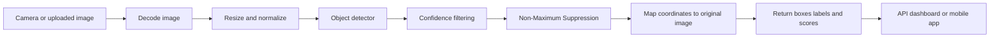

---

## 51. Example Prediction API Response

```json
{
  "image_width": 1280,
  "image_height": 720,
  "detections": [
    {
      "class_id": 0,
      "class_name": "person",
      "confidence": 0.962,
      "box_xyxy": [124, 83, 361, 694]
    },
    {
      "class_id": 2,
      "class_name": "car",
      "confidence": 0.887,
      "box_xyxy": [640, 304, 1097, 691]
    }
  ]
}
```

---

## 52. Suggested Project Structure

```text
object-detection-project/
│
├── data/
│   ├── images/
│   ├── labels/
│   └── dataset.yaml
│
├── notebooks/
│   ├── 01_annotation_analysis.ipynb
│   ├── 02_train_detector.ipynb
│   ├── 03_evaluation.ipynb
│   └── 04_error_analysis.ipynb
│
├── src/
│   ├── dataset.py
│   ├── train.py
│   ├── evaluate.py
│   ├── predict.py
│   └── api.py
│
├── models/
│   └── best_detector.pt
│
├── reports/
│   ├── training_curves.png
│   ├── precision_recall_curve.png
│   ├── prediction_examples/
│   └── experiment_results.csv
│
├── requirements.txt
├── Dockerfile
└── README.md
```

---

## 53. Portfolio Deliverables

A portfolio-ready project should include:

* Problem definition
* Class definitions
* Dataset description
* Annotation format
* Class distribution
* Bounding-box visualization
* Object-size analysis
* Pretrained baseline
* Training configuration
* Precision-recall curve
* mAP results
* Per-class AP
* False-positive analysis
* False-negative analysis
* Speed and model-size comparison
* Saved model
* Prediction script or API
* Limitations
* Next steps

Optional deliverables:

* Gradio or Streamlit interface
* FastAPI service
* Docker image
* ONNX export
* TensorRT export
* Mobile deployment
* Webcam demonstration
* Video inference pipeline

---

## 54. Completion Checklist

* [ ] I can explain object detection in one or two minutes.
* [ ] I understand the difference between classification and detection.
* [ ] I can describe `XYXY`, `XYWH`, and center-size boxes.
* [ ] I can calculate Intersection over Union.
* [ ] I understand anchors and anchor matching.
* [ ] I can explain multiscale detection.
* [ ] I understand receptive fields and feature pyramids.
* [ ] I can explain Non-Maximum Suppression.
* [ ] I understand one-stage and two-stage detectors.
* [ ] I can explain precision, recall, AP, and mAP.
* [ ] I have visualized ground-truth annotations.
* [ ] I have fine-tuned a pretrained detector.
* [ ] I have inspected false positives and false negatives.
* [ ] I have measured model latency or inference speed.
* [ ] I have documented at least one limitation or assumption.
* [ ] I have created a notebook, model, API, chart, or portfolio artifact.

---

## 55. Related Outcome

Develop a practical understanding of:

* Convolutional Neural Networks
* Bounding-box regression
* Objectness prediction
* Anchor boxes
* Multiscale features
* Feature Pyramid Networks
* Non-Maximum Suppression
* One-stage detectors
* Two-stage detectors
* Transfer learning
* Detection evaluation
* Model deployment

---

## 56. Related Project

### Mini Project: Custom Object Detector

Fine-tune a pretrained detector on a small dataset containing two or three classes.

Compare at least two configurations:

1. Small pretrained detector at standard resolution
2. Larger detector or higher input resolution

Required outputs:

* Dataset visualization
* Class and box-size distributions
* Training curves
* Precision and recall
* mAP@0.50
* mAP@0.50:0.95
* Per-class AP
* Prediction examples
* False positives
* False negatives
* Inference latency
* Final model recommendation

---

## 57. Summary

Object detection answers two questions:

```text
What objects are present?
Where is each object?
```

A complete detector produces:

```text
bounding boxes
+
class labels
+
confidence scores
```

The core workflow is:

```text
image dataset
    → bounding-box annotation
    → data validation
    → pretrained detector
    → multiscale feature extraction
    → class and box prediction
    → confidence filtering
    → Non-Maximum Suppression
    → AP and mAP evaluation
    → error analysis
    → deployment
```

Important concepts include:

* Bounding-box formats
* Intersection over Union
* Anchor boxes
* Receptive fields
* Multiscale detection
* Feature pyramids
* Objectness
* Box regression
* Non-Maximum Suppression
* Precision and recall
* Average Precision
* Mean Average Precision

Do not evaluate an object detector using accuracy alone. A strong detector must correctly classify objects, locate them accurately, avoid duplicate predictions, detect objects at different scales, and perform reliably on data that represents the real deployment environment.
