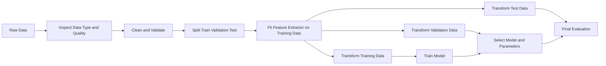
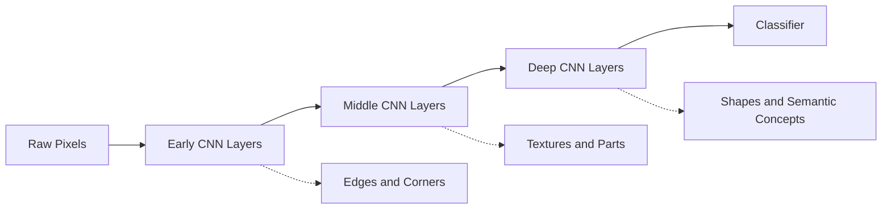
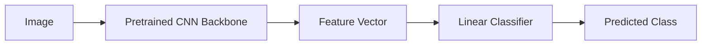
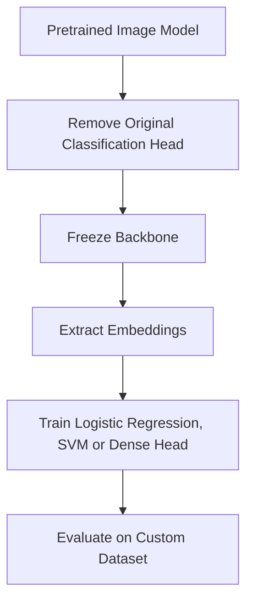
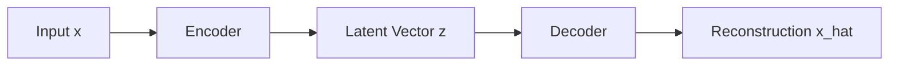

# 020 — Feature Extraction

**Course:** 03 — Machine Learning and Deep Learning
**Module:** Module 07 — Deep Learning
**Content Group:** Applications
**Roadmap Source:** Deep Learning / Applications
**Lesson Type:** Deep Learning
**Order in Module:** 020
**Suggested Duration:** 24 minutes

---

## 1. Overview

**Feature extraction** is the process of transforming raw data into useful numerical representations that a machine-learning model can understand.

Raw data may include:

* Tables
* Dates
* Text
* Images
* Audio
* Video
* Sensor signals
* Time series

A model normally cannot directly understand concepts such as:

* “This customer has not purchased anything recently.”
* “This image contains circular edges.”
* “This review expresses negative sentiment.”
* “This sound contains a repeated frequency pattern.”

Feature extraction converts these concepts into numerical values or vectors.

```text
raw data
    → feature extraction
    → numerical representation
    → machine-learning model
    → prediction
```

Examples:

```text
height + weight
    → BMI

registration timestamp
    → registration year, month and weekday

text document
    → TF-IDF vector

image
    → CNN embedding

audio waveform
    → spectrogram or MFCC features
```

---

## 2. Learning Objectives

By the end of this lesson, you should be able to:

* Explain feature extraction in your own words.
* Distinguish raw data from model-ready features.
* Distinguish feature extraction, feature engineering, feature selection, and dimensionality reduction.
* Extract useful features from tabular, text, image, and time-series data.
* Explain how PCA and SVD create lower-dimensional representations.
* Explain how neural networks learn features automatically.
* Use a pretrained CNN as a frozen feature extractor.
* Visualize high-dimensional embeddings using PCA.
* Evaluate whether extracted features are useful.
* Avoid data leakage when building a feature-extraction pipeline.
* Build a small portfolio project using extracted image embeddings.

---

## 3. What Is a Feature?

A **feature** is an input variable used by a model to make a prediction.

For tabular data, a feature is often a column:

```text
age
income
purchase_count
account_age_days
```

For images, features may represent:

* Edges
* Corners
* Textures
* Shapes
* Object parts
* Semantic concepts

For text, features may represent:

* Word counts
* N-grams
* TF-IDF scores
* Topics
* Sentence embeddings

For audio, features may represent:

* Frequency
* Energy
* Pitch
* Spectral shape
* Temporal rhythm

---

## 4. Feature Extraction as a Transformation

Let the original sample be:

$$
x \in \mathbb{R}^{d}
$$

A feature extractor applies a transformation:

$$
z = \phi(x)
$$

Where:

* $x$ is the original input.
* $\phi$ is the feature-extraction function.
* $z$ is the extracted representation.
* $d$ is the original dimensionality.
* $k$ is the extracted dimensionality.

$$
\phi:\mathbb{R}^{d}\rightarrow\mathbb{R}^{k}
$$

The extracted representation may have:

* Lower dimensionality
* Higher dimensionality
* The same dimensionality
* Greater semantic meaning
* Less noise
* Better separation between classes

Feature extraction is therefore not always dimensionality reduction.

---

## 5. Why Feature Extraction Matters

A model's performance depends strongly on how the input is represented.

Poor representation:

```text
raw timestamp: 2026-07-12 15:35:20
```

More useful representation:

```text
hour_of_day       = 15
day_of_week       = Sunday
is_weekend        = 1
month             = 7
days_since_signup = 214
```

Poor image representation:

```text
millions of unrelated raw pixels
```

More useful image representation:

```text
edges
textures
shapes
semantic embedding
```

Good features can:

* Improve predictive performance
* Reduce noise
* Lower training cost
* Simplify the model
* Improve visualization
* Make classes easier to separate
* Improve transfer to a new task

---

## 6. End-to-End Feature Extraction Workflow



The feature extractor must be fitted only on the training data when it learns information from the dataset.

Examples include:

* Vocabulary
* Mean and standard deviation
* PCA components
* Category mappings
* Imputation values

---

## 7. Feature Extraction vs. Related Concepts

These concepts are related but not identical.

### 7.1 Feature Extraction

Feature extraction transforms raw or existing data into a new representation.

Example:

$$
BMI=\frac{\text{weight}}{\text{height}^{2}}
$$

```text
height + weight → BMI
```

---

### 7.2 Feature Engineering

Feature engineering is the broader process of designing, creating, transforming, and validating features.

It may include:

* Feature extraction
* Feature crossing
* Binning
* Scaling
* Encoding
* Aggregation
* Domain-specific transformations

Feature extraction is often considered one part of feature engineering.

---

### 7.3 Feature Selection

Feature selection chooses a subset of existing features.

```text
Original:
age, income, city, browser, device, account_age

Selected:
income, device, account_age
```

No new representation is necessarily created.

---

### 7.4 Dimensionality Reduction

Dimensionality reduction maps data into fewer dimensions.

```text
100 original variables
    → PCA
10 principal components
```

Dimensionality reduction is one type of feature extraction.

---

### 7.5 Representation Learning

Representation learning allows a model to automatically discover useful features.

Examples:

* CNN image embeddings
* Transformer text embeddings
* Autoencoder latent vectors
* Word embeddings

Deep learning is especially powerful because it learns hierarchical representations directly from data.

---

## 8. Manual vs. Learned Feature Extraction

### Manual feature extraction

A human specifies the transformation.

Examples:

```text
weight and height → BMI
date → day of week
transaction records → average order value
audio → MFCC coefficients
image → HOG descriptor
```

Advantages:

* Often interpretable
* Can incorporate domain knowledge
* May work well with small datasets
* Can be computationally inexpensive

Limitations:

* Requires domain expertise
* Can be time-consuming
* May not generalize across domains
* May miss useful hidden patterns

---

### Learned feature extraction

A model learns useful representations from data.

Examples:

```text
image → CNN embedding
sentence → Transformer embedding
audio → neural audio embedding
user-item graph → graph neural network embedding
```

Advantages:

* Reduces manual feature design
* Handles complex unstructured data
* Can capture nonlinear relationships
* Often transfers to related tasks

Limitations:

* May require more data and compute
* Features may be difficult to interpret
* Can learn unwanted shortcuts
* May fail under domain shift

---

## 9. Domain-Specific Feature Extraction

Feature quality is task-dependent.

A useful feature for one problem may be irrelevant for another.

### Healthcare

```text
height + weight → BMI
systolic and diastolic pressure → pulse pressure
lab measurements → clinical risk score
```

### E-commerce

```text
last purchase date → days since last purchase
total revenue / number of orders → average order value
purchase timestamps → purchase frequency
```

### Finance

```text
price series → daily return
high, low and close → volatility measure
transactions → spending ratio
```

### Time series

```text
timestamp → hour, weekday, month
series → rolling mean
series → lag values
series → seasonal difference
```

### Images

```text
pixels → edges, textures, shapes or embeddings
```

### Text

```text
documents → counts, TF-IDF or contextual embeddings
```

---

## 10. Tabular Feature Extraction

### 10.1 BMI Example

Suppose the dataset contains:

```text
height_m
weight_kg
blood_pressure
heart_disease
```

BMI is:

$$
BMI=
\frac{\text{weight in kilograms}}
{(\text{height in meters})^2}
$$

```python
import pandas as pd

data = pd.DataFrame(
    {
        "height_m": [1.72, 1.65, 1.80],
        "weight_kg": [68, 72, 90],
        "blood_pressure": [118, 135, 145],
    }
)

data["bmi"] = (
    data["weight_kg"]
    / data["height_m"].pow(2)
)

print(data)
```

The extracted feature may be more useful than height and weight independently for certain tasks.

However, this does not mean the original columns must always be deleted. The best representation should be verified experimentally.

---

## 11. Date and Time Features

A timestamp contains many possible signals.

```python
import pandas as pd

data = pd.DataFrame(
    {
        "registration_date": [
            "2024-01-12",
            "2025-06-22",
            "2026-07-01",
        ]
    }
)

data["registration_date"] = pd.to_datetime(
    data["registration_date"]
)

data["registration_year"] = (
    data["registration_date"].dt.year
)

data["registration_month"] = (
    data["registration_date"].dt.month
)

data["registration_weekday"] = (
    data["registration_date"].dt.dayofweek
)

reference_date = pd.Timestamp("2026-07-12")

data["account_age_days"] = (
    reference_date - data["registration_date"]
).dt.days
```

Useful date features include:

* Year
* Month
* Day
* Day of week
* Hour
* Weekend indicator
* Holiday indicator
* Time since previous event
* Time until deadline
* Account age

### Cyclical encoding

Hour 23 and hour 0 are close in time, but numerically they appear far apart.

Cyclical encoding solves this:

$$
x_{\sin}=
\sin\left(2\pi\frac{x}{P}\right)
$$

$$
x_{\cos}=
\cos\left(2\pi\frac{x}{P}\right)
$$

Where $P$ is the period.

```python
import numpy as np

data["hour_sin"] = np.sin(
    2 * np.pi * data["hour"] / 24
)

data["hour_cos"] = np.cos(
    2 * np.pi * data["hour"] / 24
)
```

---

## 12. Aggregated Features

Transaction-level data can be aggregated into customer-level features.

```text
customer transactions
    → total orders
    → total revenue
    → average order value
    → days since last purchase
    → purchase frequency
```

Example:

```python
customer_features = (
    transactions
    .groupby("customer_id")
    .agg(
        order_count=("order_id", "nunique"),
        total_revenue=("amount", "sum"),
        average_order_value=("amount", "mean"),
        last_purchase=("order_date", "max"),
    )
    .reset_index()
)
```

These are especially useful for:

* Customer churn
* Recommendation
* Fraud detection
* Customer segmentation
* Lifetime-value prediction

---

## 13. Categorical Representations

Categorical values must usually be represented numerically.

### One-hot encoding

```text
color = red
    → [1, 0, 0]

color = green
    → [0, 1, 0]

color = blue
    → [0, 0, 1]
```

One-hot encoding is a transformation, but it is usually described as encoding rather than semantic feature extraction.

### Learned embeddings

High-cardinality categories can be converted into dense vectors:

```text
product_id
    → [0.18, -0.42, 0.73, ...]
```

Embeddings can learn similarity between:

* Products
* Users
* Locations
* Words
* Categories

---

## 14. Feature Extraction from Dictionaries

Some observations arrive as Python dictionaries or JSON objects.

```python
records = [
    {"city": "Dubai", "temperature": 32},
    {"city": "London", "temperature": 15},
    {"city": "Bangkok", "temperature": 34},
]
```

`DictVectorizer` converts them into numerical features:

```python
from sklearn.feature_extraction import DictVectorizer

vectorizer = DictVectorizer(sparse=False)

features = vectorizer.fit_transform(records)

print(vectorizer.get_feature_names_out())
print(features)
```

Possible output columns:

```text
city=Bangkok
city=Dubai
city=London
temperature
```

---

## 15. Text Feature Extraction

Machine-learning models require numerical text representations.


Common text representations include:

* Bag of Words
* N-grams
* TF-IDF
* Word embeddings
* Sentence embeddings
* Transformer embeddings

---

## 16. Bag of Words

The Bag-of-Words representation counts how many times each vocabulary term appears.

Documents:

```text
D1: machine learning is useful
D2: deep learning is powerful
```

Vocabulary:

```text
machine
deep
learning
is
useful
powerful
```

Vectors:

```text
D1 → [1, 0, 1, 1, 1, 0]
D2 → [0, 1, 1, 1, 0, 1]
```

### Scikit-learn example

```python
from sklearn.feature_extraction.text import CountVectorizer

documents = [
    "machine learning is useful",
    "deep learning is powerful",
    "machine learning uses data",
]

vectorizer = CountVectorizer()

count_matrix = vectorizer.fit_transform(documents)

print(vectorizer.get_feature_names_out())
print(count_matrix.toarray())
```

For large vocabularies, keep the matrix sparse rather than calling `.toarray()`.

---

## 17. N-Gram Features

Unigrams treat each word independently.

```text
"not good"
    → "not", "good"
```

Bigrams preserve short word combinations:

```text
"not good"
    → "not good"
```

```python
vectorizer = CountVectorizer(
    ngram_range=(1, 2),
    min_df=2,
)
```

N-grams can help distinguish:

```text
good
not good
very good
```

However, they increase feature dimensionality.

---

## 18. TF-IDF

Raw counts give common words large values even when those words are not informative.

TF-IDF gives higher weight to terms that are:

* Frequent in one document
* Uncommon across the document collection

### Term frequency

$$
TF(t,d) =
\text{frequency of term }t\text{ in document }d
$$

### Inverse document frequency

A common definition is:

$$
IDF(t) =
\log
\left(
\frac{N}
{DF(t)}
\right)
$$

Where:

* $N$ is the number of documents.
* $DF(t)$ is the number of documents containing term $t$.

### TF-IDF score

$$
TFIDF(t,d) =
TF(t,d)\times IDF(t)
$$

### Scikit-learn example

```python
from sklearn.feature_extraction.text import TfidfVectorizer

documents = [
    "data science uses statistics",
    "machine learning uses data",
    "medical statistics analyzes health data",
]

vectorizer = TfidfVectorizer(
    ngram_range=(1, 2),
    max_features=5000,
)

tfidf_matrix = vectorizer.fit_transform(documents)

print(tfidf_matrix.shape)
```

---

## 19. Limitations of Count and TF-IDF Features

Bag-of-Words and TF-IDF usually ignore:

* Long-range context
* Word order beyond selected n-grams
* Synonyms
* Polysemy
* Semantic similarity

For example:

```text
"The movie was excellent."
"The film was outstanding."
```

The sentences are semantically similar, but traditional word-count vectors may look different.

Dense neural embeddings can capture more semantic information.

---

## 20. Text Embeddings

An embedding maps text to a dense vector.

$$
\text{text}
\rightarrow
z\in\mathbb{R}^{k}
$$

Example:

```text
"machine learning"
    → [0.18, -0.31, 0.72, ..., 0.09]
```

Possible levels include:

* Word embeddings
* Sentence embeddings
* Paragraph embeddings
* Document embeddings

Embedding similarity can be measured using cosine similarity:

$$
\operatorname{cosine}(u,v) =
\frac{u\cdot v}
{\lVert u\rVert\lVert v\rVert}
$$

---

## 21. Image Feature Extraction

An image begins as a tensor of pixel values.

For an RGB image:

$$
X\in\mathbb{R}^{H\times W\times3}
$$

Raw pixels contain visual information, but they are sensitive to:

* Translation
* Scale
* Lighting
* Rotation
* Background variation
* Camera quality

A useful image feature extractor should create a representation that preserves task-relevant information while reducing irrelevant variation.

---

## 22. Traditional Image Features

Before deep learning, image pipelines often used hand-designed descriptors.

### Edge features

Detect strong intensity changes.

Examples:

* Sobel
* Canny

### HOG

Histogram of Oriented Gradients summarizes edge directions.

Useful for:

* Pedestrian detection
* Shape recognition
* Traditional image classification

### SIFT and related local descriptors

Represent distinctive keypoints.

Useful for:

* Image matching
* Panorama construction
* Object recognition
* Visual search

### Color histograms

Represent the distribution of colors.

Useful for:

* Scene recognition
* Product search
* Image retrieval

Traditional features can remain useful when:

* The dataset is small.
* Interpretability is important.
* Compute is limited.
* The visual task has clear handcrafted cues.

---

## 23. Deep Image Features

CNNs learn feature hierarchies automatically.



Early layers often respond to:

* Edges
* Lines
* Color transitions

Middle layers often respond to:

* Textures
* Repeated patterns
* Object parts

Deep layers often represent:

* Shapes
* Categories
* Semantic concepts

---

## 24. Neural Networks as Feature Extractors

A neural model can be divided into:

```text
feature extractor + prediction head
```

For an image classifier:

$$
z=f_{\theta}(x)
$$

$$
\hat{y}=g_{\phi}(z)
$$

Where:

* $f_{\theta}$ is the CNN backbone.
* $z$ is the image embedding.
* $g_{\phi}$ is the classifier.
* $\hat{y}$ is the prediction.



---

## 25. Transfer Learning as Feature Extraction

A pretrained network has already learned useful visual patterns from a large dataset.

A common workflow is:

1. Load a pretrained model.
2. Remove its original classifier.
3. Freeze the backbone.
4. Extract feature vectors.
5. Train a smaller classifier on those vectors.



This approach is useful when:

* The custom dataset is small.
* Training compute is limited.
* The source and target domains are reasonably related.
* A quick baseline is needed.

---

## 26. Frozen Feature Extractor vs. Fine-Tuning

### Frozen feature extraction

The backbone weights are not updated.

$$
\theta=\text{constant}
$$

Only the downstream classifier is trained.

Advantages:

* Fast
* Low memory usage
* Lower overfitting risk
* Good baseline

Limitations:

* Features may not match the target domain.
* Performance may be lower than fine-tuning.

---

### Fine-tuning

Some or all backbone layers are updated.

$$
\theta\leftarrow\theta-\eta\nabla_{\theta}L
$$

Advantages:

* Adapts features to the new task
* Often improves accuracy
* Useful for domain-specific imagery

Limitations:

* Requires more compute
* Can overfit small datasets
* Requires careful learning-rate selection

---

## 27. PyTorch Image Feature Extraction

The example below uses a pretrained CNN and removes the final classifier.

```python
from pathlib import Path

import numpy as np
import torch
from PIL import Image
from torchvision import models
from torchvision.models import ResNet18_Weights

device = torch.device(
    "cuda" if torch.cuda.is_available() else "cpu"
)

weights = ResNet18_Weights.DEFAULT
preprocess = weights.transforms()

base_model = models.resnet18(weights=weights)

# Remove the final classification layer.
feature_extractor = torch.nn.Sequential(
    *list(base_model.children())[:-1]
)

feature_extractor.eval()
feature_extractor.to(device)
```

Extract one image embedding:

```python
def extract_image_feature(
    image_path: str | Path,
) -> np.ndarray:
    image = Image.open(image_path).convert("RGB")
    image_tensor = preprocess(image).unsqueeze(0).to(device)

    with torch.inference_mode():
        feature = feature_extractor(image_tensor)

    return (
        feature
        .flatten(start_dim=1)
        .squeeze(0)
        .cpu()
        .numpy()
    )
```

Example:

```python
embedding = extract_image_feature("sample.jpg")

print(embedding.shape)
```

For ResNet-18, this produces one fixed-length feature vector for the image.

---

## 28. Training a Classical Classifier on CNN Features

After extracting embeddings, train a smaller classifier.

```python
from sklearn.linear_model import LogisticRegression
from sklearn.metrics import classification_report
from sklearn.pipeline import make_pipeline
from sklearn.preprocessing import StandardScaler

classifier = make_pipeline(
    StandardScaler(),
    LogisticRegression(
        max_iter=2000,
        class_weight="balanced",
    ),
)

classifier.fit(
    train_features,
    train_labels,
)

predictions = classifier.predict(test_features)

print(
    classification_report(
        test_labels,
        predictions,
    )
)
```

Possible downstream models include:

* Logistic regression
* Linear SVM
* Random forest
* Gradient boosting
* K-nearest neighbors
* Small multilayer perceptron

---

## 29. Saving Extracted Features

Feature extraction may be expensive, so the vectors can be cached.

```python
import numpy as np

np.save(
    "train_features.npy",
    train_features,
)

np.save(
    "train_labels.npy",
    train_labels,
)
```

Later:

```python
train_features = np.load(
    "train_features.npy"
)

train_labels = np.load(
    "train_labels.npy"
)
```

Store metadata with the vectors:

```text
model name
model checkpoint
preprocessing configuration
image size
normalization
dataset version
extraction date
feature dimension
```

Without this metadata, reproduced features may be inconsistent.

---

## 30. Audio Feature Extraction

An audio waveform may contain thousands of values per second.

Common extracted representations include:

* Spectrogram
* Mel spectrogram
* MFCC
* Chroma features
* Zero-crossing rate
* Spectral centroid


A spectrogram represents how frequency energy changes over time.

---

## 31. Time-Series Feature Extraction

Useful time-series features include:

### Lag features

$$
x_{t-1},x_{t-2},x_{t-7}
$$

### Rolling mean

$$
MA_t=
\frac{1}{w}
\sum_{i=0}^{w-1}x_{t-i}
$$

### Rolling standard deviation

Measures recent volatility.

### Change features

$$
\Delta x_t=x_t-x_{t-1}
$$

### Percentage change

$$
r_t=
\frac{x_t-x_{t-1}}
{x_{t-1}}
$$

### Seasonal features

* Hour
* Weekday
* Month
* Holiday
* Season
* Time since previous event

---

## 32. Principal Component Analysis

**Principal Component Analysis**, or PCA, transforms correlated variables into a smaller set of uncorrelated components.

Suppose:

$$
X\in\mathbb{R}^{n\times d}
$$

PCA produces:

$$
Z=XW
$$

Where:

* $W\in\mathbb{R}^{d\times k}$ contains principal directions.
* $Z\in\mathbb{R}^{n\times k}$ is the lower-dimensional representation.
* $k<d$.

Each principal component is a linear combination of the original variables:

$$
PC_1=
w_{11}x_1+
w_{12}x_2+
\cdots+
w_{1d}x_d
$$

---

## 33. PCA Intuition

PCA searches for directions that preserve the greatest variation.


### First component

Captures the largest possible variance.

### Second component

Captures the largest remaining variance while being orthogonal to the first component.

Additional components follow the same rule.

---

## 34. PCA Through SVD

For a centered data matrix $X$, Singular Value Decomposition gives:

$$
X=U\Sigma V^{T}
$$

Where:

* $U$ contains left singular vectors.
* $\Sigma$ contains singular values.
* $V$ contains principal directions.

Keeping only the first $k$ components gives:

$$
X\approx U_k\Sigma_kV_k^{T}
$$

The reduced representation can be written as:

$$
Z=XV_k
$$

Large singular values correspond to directions containing more variation.

---

## 35. PCA Example with Scikit-Learn

```python
from sklearn.decomposition import PCA
from sklearn.pipeline import make_pipeline
from sklearn.preprocessing import StandardScaler

pca_pipeline = make_pipeline(
    StandardScaler(),
    PCA(n_components=2),
)

reduced_features = pca_pipeline.fit_transform(
    train_features
)

print(reduced_features.shape)
```

### Explained variance

```python
pca = pca_pipeline.named_steps["pca"]

print(
    pca.explained_variance_ratio_
)

print(
    pca.explained_variance_ratio_.sum()
)
```

If the sum is 0.82, the two retained components explain approximately 82% of the observed variance.

---

## 36. Choosing the Number of Components

Instead of selecting an exact number, PCA can retain a target proportion of variance.

```python
pca = PCA(n_components=0.95)
```

This keeps enough components to explain approximately 95% of the variance.

### Scree-style analysis

```python
import matplotlib.pyplot as plt
from sklearn.decomposition import PCA
from sklearn.preprocessing import StandardScaler

scaled = StandardScaler().fit_transform(train_features)

pca = PCA().fit(scaled)

cumulative_variance = (
    pca.explained_variance_ratio_.cumsum()
)

plt.plot(cumulative_variance)
plt.xlabel("Number of components")
plt.ylabel("Cumulative explained variance")
plt.title("PCA Explained Variance")
plt.show()
```

---

## 37. PCA Caveats

PCA:

* Is linear
* Maximizes variance, not predictive power
* Is sensitive to scale
* Can be affected by outliers
* Produces components that may be difficult to interpret
* May remove low-variance features that are important for prediction

PCA should be validated using downstream task performance.

Do not assume that greater explained variance always means better classification.

---

## 38. Truncated SVD

Truncated SVD is useful for sparse matrices such as TF-IDF data.

Unlike standard PCA implementations, it does not require converting the sparse matrix into a dense matrix.

```python
from sklearn.decomposition import TruncatedSVD

svd = TruncatedSVD(
    n_components=100,
    random_state=42,
)

text_embeddings = svd.fit_transform(
    tfidf_matrix
)
```

This technique is related to **Latent Semantic Analysis** when applied to document-term matrices.

---

## 39. Autoencoders

An autoencoder learns a compressed representation.



The encoder produces:

$$
z=f_{\theta}(x)
$$

The decoder reconstructs:

$$
\hat{x}=g_{\phi}(z)
$$

A common objective is:

$$
L=
\lVert x-\hat{x}\rVert^2
$$

After training, $z$ can be used as an extracted feature vector.

Possible uses:

* Dimensionality reduction
* Denoising
* Anomaly detection
* Visualization
* Pretraining
* Retrieval

---

## 40. Feature Visualization

High-dimensional features can be reduced to two dimensions for visualization.

Example:

```python
from sklearn.decomposition import PCA
import matplotlib.pyplot as plt

projection = PCA(
    n_components=2
).fit_transform(image_embeddings)

plt.scatter(
    projection[:, 0],
    projection[:, 1],
    c=labels,
)

plt.xlabel("Principal Component 1")
plt.ylabel("Principal Component 2")
plt.title("Two-Dimensional Feature Projection")
plt.show()
```

A useful representation may show:

* Samples from the same class clustering together
* Similar samples appearing close to each other
* Outliers separated from normal samples
* Domain shift between datasets

However, a two-dimensional projection always loses information.

---

## 41. Evaluating Extracted Features

Feature extraction should be evaluated using the target task.

### Classification

Use:

* Accuracy
* Precision
* Recall
* F1-score
* ROC-AUC
* Confusion matrix

### Regression

Use:

* MAE
* RMSE
* $R^2$

### Clustering

Use:

* Silhouette score
* Cluster stability
* Domain interpretation

### Retrieval

Use:

* Recall@K
* Precision@K
* Mean reciprocal rank
* Nearest-neighbor quality

### Efficiency

Also measure:

* Extraction time
* Feature dimension
* Storage size
* Training time
* Inference latency

---

## 42. Feature Ablation

Ablation tests whether a feature group improves the model.

Example:

| Experiment | Feature groups          | Validation F1 |
| ---------- | ----------------------- | ------------: |
| E01        | Raw numerical columns   |          0.71 |
| E02        | Raw + date features     |          0.76 |
| E03        | Raw + date + aggregates |          0.81 |
| E04        | PCA components only     |          0.75 |

This is stronger evidence than assuming a feature is useful.

---

## 43. Comparing Representations

For an image-classification project, compare:

1. Raw resized pixels
2. PCA-reduced pixels
3. Frozen CNN embeddings
4. Fine-tuned CNN

Example table:

| Representation | Classifier          | Feature dimension | Accuracy | Training time |
| -------------- | ------------------- | ----------------: | -------: | ------------: |
| Raw pixels     | Logistic regression |             3,072 |     0.64 |          40 s |
| PCA pixels     | Logistic regression |               128 |     0.68 |           8 s |
| CNN embeddings | Logistic regression |               512 |     0.86 |           6 s |
| Fine-tuned CNN | Neural head         |                 — |     0.89 |         7 min |

The numbers above are illustrative. Record the actual experiment results.

---

## 44. Data Leakage

Feature extraction can create leakage when information from validation or test data influences the training representation.

Incorrect:

```python
pca.fit(all_data)
```

Correct:

```python
pca.fit(x_train)

x_train_pca = pca.transform(x_train)
x_validation_pca = pca.transform(x_validation)
x_test_pca = pca.transform(x_test)
```

Leakage can happen through:

* Scaling before splitting
* PCA before splitting
* Vocabulary creation before splitting
* Aggregates using future events
* Target-based encoding using all labels
* Image normalization statistics from the test set

---

## 45. Use Pipelines

Scikit-learn pipelines reduce leakage risk.

```python
from sklearn.decomposition import PCA
from sklearn.linear_model import LogisticRegression
from sklearn.pipeline import Pipeline
from sklearn.preprocessing import StandardScaler

pipeline = Pipeline(
    steps=[
        ("scale", StandardScaler()),
        ("pca", PCA(n_components=50)),
        (
            "classifier",
            LogisticRegression(
                max_iter=2000
            ),
        ),
    ]
)

pipeline.fit(x_train, y_train)

predictions = pipeline.predict(x_test)
```

During cross-validation, each transformation is fitted only on the training fold.

---

## 46. Common Mistakes

### 46.1 Confusing feature extraction with feature selection

Creating PCA components is extraction.

Keeping 20 existing columns is selection.

---

### 46.2 Fitting the extractor before splitting

This leaks information from validation or test data.

---

### 46.3 Assuming more features are always better

More features may increase:

* Noise
* Overfitting
* Training time
* Storage cost

---

### 46.4 Removing original features too early

An extracted feature such as BMI may complement rather than replace height and weight.

Compare both approaches experimentally.

---

### 46.5 Using PCA without scaling

Features with large numerical ranges may dominate the principal components.

---

### 46.6 Selecting PCA only by explained variance

High explained variance does not guarantee strong predictive performance.

---

### 46.7 Converting large sparse matrices to dense arrays

A TF-IDF matrix can contain tens of thousands of columns.

Converting it to a dense matrix may exhaust memory.

---

### 46.8 Extracting image embeddings with inconsistent preprocessing

The input must use the preprocessing expected by the pretrained model.

This may include:

* Image size
* Channel order
* Pixel range
* Mean normalization
* Standard-deviation normalization

---

### 46.9 Mixing embeddings from different model versions

Features extracted by different checkpoints may not be directly comparable.

Store the model and preprocessing version.

---

### 46.10 Ignoring domain shift

A model pretrained on natural photographs may produce weaker features for:

* Medical scans
* Satellite images
* Underwater imagery
* Industrial sensor images

Fine-tuning or domain-specific pretraining may be needed.

---

### 46.11 Using the target inside feature extraction

Features must not directly or indirectly contain the answer.

Example leakage:

```text
target: customer churned on July 10
feature: customer status updated after July 10
```

---

## 47. Practical Exercise

Build an image-classification pipeline using pretrained feature extraction.

### Dataset

Use a small image dataset with three or four classes.

Examples:

* Weather conditions
* Fruits
* Animal species
* Clothing categories
* Marine animals
* Product categories

### Part A — Data preparation

1. Create train, validation, and test folders.
2. Count images per class.
3. Display random samples.
4. Check for corrupted images.
5. Check for duplicate or near-duplicate images.
6. Verify that class labels are correct.

### Part B — Baseline

1. Resize images.
2. Flatten raw pixels.
3. Train logistic regression.
4. Record validation and test accuracy.
5. Create a confusion matrix.

### Part C — PCA features

1. Standardize the pixel vectors.
2. Apply PCA.
3. Retain 90% to 95% of the variance.
4. Train the same classifier.
5. Compare accuracy, training time, and feature size.

### Part D — CNN embeddings

1. Load a pretrained CNN.
2. Remove its classification head.
3. Freeze the backbone.
4. Extract one embedding per image.
5. Cache the feature vectors.
6. Train logistic regression or a linear SVM.
7. Evaluate the test set.

### Part E — Fine-tuning

1. Add a new classification head.
2. Train the head while freezing the backbone.
3. Optionally unfreeze the last CNN block.
4. Use a smaller learning rate.
5. Compare performance with frozen embeddings.

### Part F — Visualization

1. Apply PCA to the CNN embeddings.
2. Plot the first two components.
3. Color each point by class.
4. Inspect overlapping classes and outliers.

---

## 48. Questions for Analysis

After completing the project, answer:

1. Did raw pixels provide a useful baseline?
2. Did PCA reduce training time?
3. How much variance did the selected components preserve?
4. Did PCA improve or reduce classification performance?
5. Were pretrained CNN features more useful than raw pixels?
6. Which classes overlapped in embedding space?
7. Did fine-tuning improve performance enough to justify its cost?
8. Which misclassified images appear ambiguous?
9. Does the feature extractor rely on the background?
10. What domain shift could affect deployment?

---

## 49. Suggested Experiment Table

| Experiment | Feature extractor | Classifier          | Dimension | Accuracy | Macro F1 |
| ---------- | ----------------- | ------------------- | --------: | -------: | -------: |
| E01        | Raw pixels        | Logistic regression |     3,072 |        — |        — |
| E02        | PCA pixels        | Logistic regression |       128 |        — |        — |
| E03        | Frozen CNN        | Logistic regression |       512 |        — |        — |
| E04        | Frozen CNN        | Linear SVM          |       512 |        — |        — |
| E05        | Fine-tuned CNN    | Neural head         |         — |        — |        — |

---

## 50. Suggested Project Structure

```text
feature-extraction-project/
│
├── data/
│   ├── train/
│   ├── validation/
│   └── test/
│
├── notebooks/
│   ├── 01_data_exploration.ipynb
│   ├── 02_raw_pixel_baseline.ipynb
│   ├── 03_pca_features.ipynb
│   ├── 04_cnn_embeddings.ipynb
│   └── 05_feature_visualization.ipynb
│
├── src/
│   ├── dataset.py
│   ├── extract_features.py
│   ├── train_classifier.py
│   ├── evaluate.py
│   └── predict.py
│
├── features/
│   ├── train_features.npy
│   ├── validation_features.npy
│   └── test_features.npy
│
├── models/
│   ├── classifier.pkl
│   └── fine_tuned_model.pt
│
├── reports/
│   ├── feature_projection.png
│   ├── confusion_matrix.png
│   └── experiment_results.csv
│
├── requirements.txt
├── Dockerfile
└── README.md
```

---

## 51. Portfolio Deliverables

A portfolio-ready feature-extraction project should contain:

* Problem definition
* Dataset description
* Raw-data visualization
* Baseline representation
* Extracted feature description
* PCA explained-variance plot
* Two-dimensional embedding visualization
* Model comparison table
* Confusion matrix
* Error analysis
* Extraction-time comparison
* Feature-size comparison
* Saved extractor configuration
* Saved classifier
* Prediction script or API
* Limitations and next steps

Optional artifacts:

* FastAPI feature-extraction endpoint
* Image similarity search
* Streamlit embedding explorer
* Docker service
* Nearest-neighbor retrieval demo

---

## 52. Completion Checklist

* [ ] I can explain feature extraction in one or two minutes.
* [ ] I can distinguish extraction, engineering, selection, and dimensionality reduction.
* [ ] I can extract useful features from dates and numerical columns.
* [ ] I understand CountVectorizer and TF-IDF.
* [ ] I understand why sparse text matrices are useful.
* [ ] I can explain PCA conceptually.
* [ ] I understand the relationship between PCA and SVD.
* [ ] I can use a pretrained CNN as a frozen feature extractor.
* [ ] I can train a classical model on extracted embeddings.
* [ ] I can visualize high-dimensional features with PCA.
* [ ] I fit extractors only on training data.
* [ ] I have compared at least two feature representations.
* [ ] I have documented extraction time and feature dimension.
* [ ] I have identified at least one caveat or limitation.
* [ ] I have created a notebook, model, visualization, API, or portfolio artifact.

---

## 53. Related Outcome

Develop a practical understanding of:

* Feature engineering
* Dimensionality reduction
* PCA
* SVD
* Sparse matrices
* Text vectorization
* Image embeddings
* CNN feature hierarchies
* Representation learning
* Transfer learning
* Feature visualization
* Model evaluation
* Leakage-safe pipelines

---

## 54. Related Project

### Mini Project: Image Classification with Extracted Features

Compare four approaches:

1. Raw image pixels with logistic regression
2. PCA-reduced pixels with logistic regression
3. Frozen pretrained CNN embeddings with a classical classifier
4. A fine-tuned CNN

Required outputs:

* Dataset visualization
* PCA explained-variance chart
* Two-dimensional feature projection
* Accuracy and macro F1-score
* Confusion matrix
* Feature dimension
* Extraction time
* Training time
* Error analysis
* Final recommendation

---

## 55. Summary

Feature extraction transforms raw data into useful numerical representations.

```text
raw data
    → transformation
    → feature vector
    → model
    → prediction
```

Feature extraction may be:

### Manual

```text
height + weight → BMI
timestamp → weekday
transactions → customer aggregates
text → TF-IDF
audio → MFCC
```

### Learned

```text
image → CNN embedding
text → Transformer embedding
audio → neural embedding
data → autoencoder latent vector
```

PCA and SVD create lower-dimensional representations from existing variables. Deep neural networks learn hierarchical features directly from data, reducing the need for manual visual or textual feature design.

A strong feature-extraction workflow must:

* Preserve task-relevant information
* Avoid data leakage
* Use consistent preprocessing
* Be evaluated on downstream performance
* Balance predictive quality, interpretability, storage, and inference cost

The best feature representation is not automatically the largest or most complex one. It is the representation that allows the target model to generalize effectively to new data.
