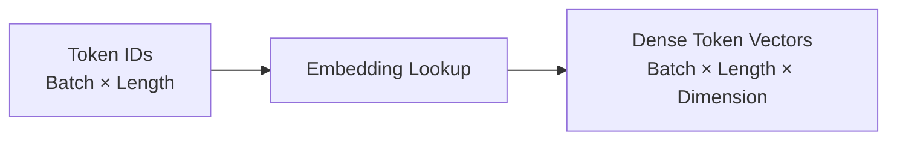
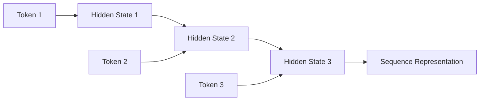
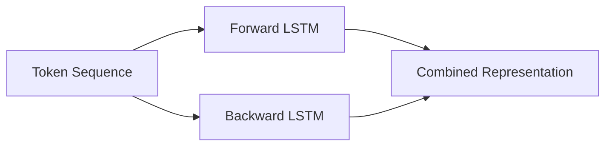
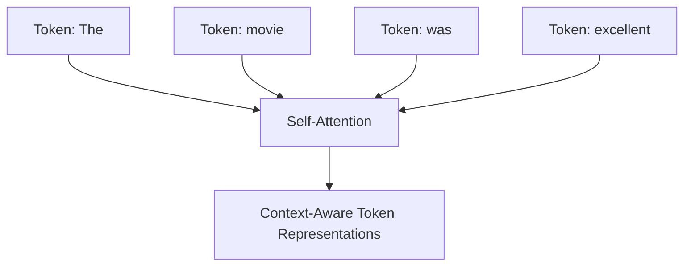
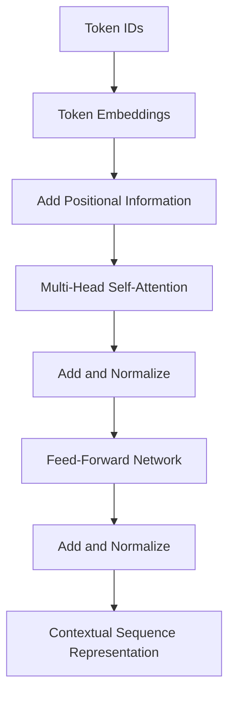
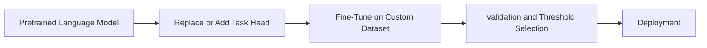

# 021 — Text Sequence

**Course:** 03 — Machine Learning and Deep Learning
**Module:** Module 07 — Deep Learning
**Content Group:** Applications
**Roadmap Source:** Deep Learning / Applications
**Lesson Type:** Deep Learning
**Order in Module:** 021
**Suggested Duration:** 24 minutes

---

## 1. Overview

A **text sequence** is an ordered series of textual units such as:

* Characters
* Subwords
* Words
* Sentences
* Paragraphs

Examples:

```text
"I love this movie"
```

As a word sequence:

```text
["I", "love", "this", "movie"]
```

As a token-ID sequence:

```text
[14, 82, 36, 519]
```

The order of the tokens matters.

Consider:

```text
"The dog chased the cat."
"The cat chased the dog."
```

Both sentences contain nearly the same words, but they express different meanings because the token order is different.

Text-sequence modeling is the foundation of many natural language processing tasks, including:

* Sentiment analysis
* Spam detection
* Topic classification
* Named Entity Recognition
* Machine translation
* Question answering
* Text summarization
* Language modeling
* Text generation
* Search and retrieval
* Chatbots and language assistants

---

## 2. Learning Objectives

By the end of this lesson, you should be able to:

* Explain what a text sequence is.
* Describe why token order matters.
* Distinguish characters, words, and subword tokens.
* Convert raw text into numerical sequences.
* Explain vocabulary, token IDs, padding, truncation, and masking.
* Use an embedding layer to represent tokens.
* Describe how RNNs, LSTMs, GRUs, CNNs, and Transformers process text.
* Distinguish sequence classification, token classification, and sequence generation.
* Build a small sentiment-classification model.
* Evaluate a text classifier using suitable metrics.
* Identify common problems such as data leakage, class imbalance, and vocabulary mismatch.
* Explain when transfer learning is preferable to training from scratch.

---

## 3. What Is Sequential Data?

Sequential data contains observations whose position or order carries information.

Examples include:

* Words in a sentence
* Characters in a word
* Events in a customer journey
* Measurements in a time series
* Frames in a video
* Notes in a melody

A text sequence can be represented as:

$$
X=(x_1,x_2,\ldots,x_T)
$$

Where:

* $T$ is the sequence length.
* $x_t$ is the token at position $t$.

For example:

```text
Sentence: "deep learning understands sequences"

x₁ = deep
x₂ = learning
x₃ = understands
x₄ = sequences
T  = 4
```

A sequence model attempts to learn:

$$
f(x_1,x_2,\ldots,x_T)
$$

Depending on the task, the output may be:

* One label
* One label per token
* Another sequence
* The next token

---

## 4. Why Word Order Matters

A Bag-of-Words model represents text through token counts and mostly ignores order.

For example:

```text
"dog bites man"
"man bites dog"
```

A basic Bag-of-Words representation may treat them as identical because both contain:

```text
dog: 1
bites: 1
man: 1
```

However, their meanings are different.

Sequence models preserve ordering information:

```text
dog → bites → man
man → bites → dog
```

Order is especially important for:

* Negation
* Subject-object relationships
* Time expressions
* Causal relationships
* Question structure
* Long-distance dependencies

Example:

```text
"The movie was good."
"The movie was not good."
```

The word `not` changes the sentiment of the sequence.

---

## 5. Common Text-Sequence Tasks

### 5.1 Sequence Classification

The entire input sequence receives one label.

```text
Input:
"The product arrived quickly and works perfectly."

Output:
Positive
```

Applications:

* Sentiment analysis
* Spam detection
* Topic classification
* Intent classification
* Toxicity detection

---

### 5.2 Token Classification

Every token receives a label.

Example: Named Entity Recognition

```text
Apple      → ORGANIZATION
released   → OTHER
a          → OTHER
product    → OTHER
in         → OTHER
California → LOCATION
```

Applications:

* Named Entity Recognition
* Part-of-speech tagging
* Slot filling
* Error detection
* Medical concept extraction

---

### 5.3 Sequence-to-Sequence Modeling

The model receives one sequence and produces another sequence.

```text
Input:
"Bonjour tout le monde"

Output:
"Hello everyone"
```

Applications:

* Translation
* Summarization
* Paraphrasing
* Grammar correction
* Question answering

---

### 5.4 Language Modeling

The model predicts the next token:

$$
P(x_t\mid x_1,x_2,\ldots,x_{t-1})
$$

Example:

```text
Input:
"Machine learning is"

Possible next token:
"powerful"
```

A language model assigns probability to complete sequences:

$$
P(x_1,x_2,\ldots,x_T) =
\prod_{t=1}^{T}
P(x_t\mid x_1,\ldots,x_{t-1})
$$

---

## 6. End-to-End Text-Sequence Pipeline


A practical NLP system normally includes:

1. Dataset collection
2. Label validation
3. Train-validation-test splitting
4. Text normalization
5. Tokenization
6. Numerical encoding
7. Batching
8. Model training
9. Evaluation
10. Deployment and monitoring

---

## 7. Text Normalization

Text normalization attempts to make textual input more consistent.

Possible operations include:

* Lowercasing
* Unicode normalization
* Whitespace normalization
* HTML removal
* URL replacement
* Username replacement
* Number normalization
* Punctuation handling
* Spelling normalization

Example:

```text
Original:
"This PRODUCT is AMAZING!!! Visit https://example.com"

Normalized:
"this product is amazing visit <URL>"
```

### Important caveat

Do not remove information automatically.

For example:

* Capitalization may help Named Entity Recognition.
* Punctuation may express emotion.
* Emojis may indicate sentiment.
* Numbers may carry business meaning.
* Hashtags may identify topics.
* Code formatting matters in programming-related datasets.

Normalization should depend on the target task.

---

## 8. Tokenization

**Tokenization** splits text into smaller units called tokens.

```text
Raw text
    → tokenizer
    → token sequence
```

---

## 9. Character-Level Tokenization

A character tokenizer splits text into individual characters.

```text
"cat"

→ ["c", "a", "t"]
```

Advantages:

* Very small vocabulary
* Handles unseen words
* Useful for spelling and morphology
* Useful for noisy text

Limitations:

* Produces long sequences
* Harder to learn semantic meaning
* Requires more computation for long documents

Character-level models may be useful for:

* Spelling correction
* Language identification
* Source-code modeling
* Username analysis
* Morphologically rich languages

---

## 10. Word-Level Tokenization

A word tokenizer splits text into words.

```text
"deep learning is useful"

→ ["deep", "learning", "is", "useful"]
```

Advantages:

* Intuitive
* Shorter sequences
* Tokens may be semantically meaningful

Limitations:

* Large vocabulary
* Difficulty with unseen words
* Different forms become different tokens
* Misspellings create new tokens

Example:

```text
run
runs
running
runner
```

A word-level tokenizer may treat these as four unrelated tokens.

---

## 11. Subword Tokenization

Subword tokenization divides uncommon words into reusable pieces.

Example:

```text
"unbelievable"

→ ["un", "believ", "able"]
```

Or:

```text
"tokenization"

→ ["token", "ization"]
```

Popular approaches include:

* Byte Pair Encoding
* WordPiece
* Unigram tokenization
* SentencePiece

Advantages:

* Handles unseen words
* Controls vocabulary size
* Preserves common words as single tokens
* Supports rare and morphologically complex words

Subword tokenization is widely used by Transformer models.

---

## 12. Vocabulary

A vocabulary maps tokens to integer IDs.

Example:

```text
<PAD>     → 0
<UNK>     → 1
deep      → 2
learning  → 3
is        → 4
useful    → 5
```

Then:

```text
"deep learning is useful"

→ [2, 3, 4, 5]
```

The vocabulary may contain special tokens.

| Token     | Purpose                          |
| --------- | -------------------------------- |
| `<PAD>`   | Fills unused sequence positions  |
| `<UNK>`   | Represents an unknown token      |
| `<START>` | Marks the beginning              |
| `<END>`   | Marks the end                    |
| `<MASK>`  | Hides a token during pretraining |
| `<CLS>`   | Represents the full sequence     |
| `<SEP>`   | Separates sequences              |

The exact tokens depend on the tokenizer and model architecture.

---

## 13. Out-of-Vocabulary Tokens

An **out-of-vocabulary**, or OOV, token is not present in the learned vocabulary.

Example:

```text
Vocabulary:
["machine", "learning", "data"]

New word:
"transformer"
```

A word-level tokenizer may map it to:

```text
<UNK>
```

Subword tokenization can often represent it using smaller units:

```text
["trans", "form", "er"]
```

This is one reason modern NLP systems prefer subword tokenization.

---

## 14. Token IDs

Models do not directly process string tokens.

Tokens are converted into integer IDs:

```text
["this", "movie", "is", "good"]

→ [18, 271, 9, 64]
```

However, token IDs are categorical identifiers.

The number `271` is not mathematically larger or more important than `18`.

Token IDs must be converted into meaningful dense vectors through an embedding layer.

---

## 15. Variable-Length Sequences

Sentences have different lengths.

```text
Sequence A:
"I liked it"
Length = 3

Sequence B:
"The movie was interesting and beautifully produced"
Length = 7
```

Neural-network batches generally require consistent tensor shapes.

Two common operations solve this problem:

* Padding
* Truncation

---

## 16. Padding

Padding adds special tokens to shorter sequences.

Suppose the target length is 6:

```text
Original:
[12, 43, 81]

Padded:
[12, 43, 81, 0, 0, 0]
```

Where token ID `0` represents `<PAD>`.

### Post-padding

Padding is added after the content:

```text
[12, 43, 81, 0, 0]
```

### Pre-padding

Padding is added before the content:

```text
[0, 0, 12, 43, 81]
```

Post-padding is common in modern NLP pipelines.

---

## 17. Truncation

Truncation removes tokens from sequences that exceed the maximum length.

```text
Original:
[21, 34, 18, 92, 56, 71, 44]

Maximum length:
5

Truncated:
[21, 34, 18, 92, 56]
```

Truncation may remove important information.

Possible strategies include:

* Keep the beginning
* Keep the end
* Keep both beginning and end
* Use sliding windows
* Use hierarchical models
* Increase the maximum length

The correct strategy depends on where important information occurs.

---

## 18. Attention Masks

An attention mask tells the model which positions contain real tokens and which contain padding.

```text
Token IDs:
[14, 29, 83, 0, 0]

Attention mask:
[1, 1, 1, 0, 0]
```

The model should process positions with mask value `1` and ignore positions with value `0`.

Without proper masking, padding can affect the sequence representation.

---

## 19. Sequence-Length Distribution

Before selecting a maximum length, inspect the dataset.

```python
import matplotlib.pyplot as plt

lengths = [
    len(text.split())
    for text in texts
]

plt.hist(lengths, bins=30)
plt.xlabel("Sequence length")
plt.ylabel("Number of documents")
plt.title("Text Sequence Length Distribution")
plt.show()
```

Useful statistics include:

```python
import numpy as np

print("Median:", np.median(lengths))
print("90th percentile:", np.percentile(lengths, 90))
print("95th percentile:", np.percentile(lengths, 95))
print("Maximum:", np.max(lengths))
```

A reasonable maximum length might cover 90% to 95% of the data without wasting excessive computation.

---

## 20. Text Vectorization with TensorFlow

TensorFlow provides `TextVectorization` for vocabulary creation and sequence conversion.

```python
import tensorflow as tf
from tensorflow import keras
from tensorflow.keras import layers

max_tokens = 20_000
sequence_length = 200

vectorizer = layers.TextVectorization(
    max_tokens=max_tokens,
    output_mode="int",
    output_sequence_length=sequence_length,
    standardize="lower_and_strip_punctuation",
)
```

Fit the vectorizer only on training text:

```python
vectorizer.adapt(train_texts)
```

Transform text:

```python
sample = tf.constant(
    ["Deep learning processes text sequences."]
)

token_ids = vectorizer(sample)

print(token_ids)
```

The result has a fixed length because padding or truncation is applied automatically.

---

## 21. Preventing Vocabulary Leakage

Incorrect:

```python
vectorizer.adapt(all_texts)
```

This allows validation and test text to influence the vocabulary.

Correct:

```python
vectorizer.adapt(train_texts)
```

Then apply the same fitted vectorizer to:

* Training data
* Validation data
* Test data
* Production input

The same rule applies to:

* TF-IDF vocabularies
* Token frequency thresholds
* Text normalization statistics
* Label mappings

---

## 22. Word Embeddings

An embedding layer maps each token ID to a dense vector.

$$
E\in\mathbb{R}^{V\times d}
$$

Where:

* $V$ is vocabulary size.
* $d$ is embedding dimension.

For token ID $i$:

$$
e_i=E[i]
$$

Example:

```text
Token:
"excellent"

Embedding:
[0.18, -0.72, 0.31, ..., 0.09]
```

Embeddings are learned during training or loaded from a pretrained source.

---

## 23. Embedding Tensor Shape

Suppose:

```text
Batch size       = 32
Sequence length  = 200
Embedding size   = 128
```

Input token-ID shape:

$$
(32,200)
$$

After the embedding layer:

$$
(32,200,128)
$$

Each token is now represented by a 128-dimensional vector.



---

## 24. Semantic Relationships in Embeddings

Useful embeddings place semantically related words near each other.

Example:

```text
king
queen
prince
royalty
```

Similarity is commonly measured using cosine similarity:

$$
\operatorname{cosine}(u,v) =
\frac{u\cdot v}
{\lVert u\rVert\lVert v\rVert}
$$

A value near 1 indicates similar vector directions.

However, embedding similarity depends on:

* Training data
* Objective
* Model architecture
* Tokenization
* Domain

---

## 25. Static vs. Contextual Embeddings

### Static embeddings

Each word has one vector regardless of context.

Example:

```text
"bank" in "river bank"
"bank" in "financial bank"
```

A static embedding uses the same vector for both occurrences.

Examples:

* Word2Vec
* GloVe
* FastText

---

### Contextual embeddings

The representation depends on surrounding tokens.

```text
"river bank"
"central bank"
```

The word `bank` receives different representations.

Contextual embeddings are produced by models such as Transformers.

---

## 26. Recurrent Neural Networks

A Recurrent Neural Network processes a sequence one step at a time.

At each position:

$$
h_t=f(x_t,h_{t-1})
$$

Where:

* $x_t$ is the current token representation.
* $h_{t-1}$ is the previous hidden state.
* $h_t$ is the updated hidden state.



The hidden state summarizes previous tokens.

---

## 27. RNN Limitations

Basic RNNs may struggle with long sequences because of:

* Vanishing gradients
* Exploding gradients
* Sequential computation
* Difficulty preserving distant information

Example dependency:

```text
"The books that were placed on the old wooden table are valuable."
```

The model must connect:

```text
books → are
```

even though many tokens occur between them.

LSTM and GRU architectures were designed to improve long-term information flow.

---

## 28. LSTM

A Long Short-Term Memory network uses gates to control information.

Main components:

* Forget gate
* Input gate
* Candidate state
* Output gate
* Cell state

Simplified equations:

$$
f_t=\sigma(W_f[x_t,h_{t-1}]+b_f)
$$

$$
i_t=\sigma(W_i[x_t,h_{t-1}]+b_i)
$$

$$
\tilde{c}_t=
\tanh(W_c[x_t,h_{t-1}]+b_c)
$$

$$
c_t=
f_t\odot c_{t-1}
+
i_t\odot\tilde{c}_t
$$

$$
o_t=
\sigma(W_o[x_t,h_{t-1}]+b_o)
$$

$$
h_t=o_t\odot\tanh(c_t)
$$

The cell state helps preserve information across longer distances.

---

## 29. GRU

A Gated Recurrent Unit is a simpler gated recurrent architecture.

It commonly uses:

* Update gate
* Reset gate

GRUs often:

* Have fewer parameters than LSTMs
* Train faster
* Perform similarly on many tasks

Choosing between LSTM and GRU is usually an experimental decision.

---

## 30. Bidirectional Sequence Models

A bidirectional model processes text in both directions.

```text
Forward:
The → movie → was → excellent

Backward:
excellent → was → movie → The
```



Bidirectional models are useful when the complete input is available.

Applications include:

* Sentiment classification
* Named Entity Recognition
* Document classification

They are not directly suitable for causal next-token generation because they use future context.

---

## 31. CNNs for Text Sequences

A one-dimensional CNN can detect local token patterns.

Example:

```text
"not very good"
```

A convolutional filter may learn to respond to this phrase.


Advantages:

* Parallel computation
* Fast training
* Good at local patterns
* Effective for sentence classification

Limitations:

* Basic CNNs may struggle with long-range dependencies
* Receptive field depends on kernel size and depth

---

## 32. Attention

Attention allows a model to focus on relevant sequence positions.

Given query $Q$, key $K$, and value $V$:

$$
\operatorname{Attention}(Q,K,V) =
\operatorname{softmax}
\left(
\frac{QK^T}{\sqrt{d_k}}
\right)V
$$

For the sentence:

```text
"The movie was long, but the ending was excellent."
```

When determining the sentiment, the model may focus strongly on:

```text
ending
excellent
```

Attention reduces the need to compress the entire sequence into one recurrent hidden state.

---

## 33. Self-Attention

In self-attention, each token attends to other tokens in the same sequence.



This allows each token to incorporate context from other positions.

Advantages:

* Models long-range relationships
* Supports parallel training
* Produces contextual representations
* Forms the core of Transformer architectures

---

## 34. Positional Information

Self-attention alone does not inherently know token order.

The sequence:

```text
dog bites man
```

contains the same token set as:

```text
man bites dog
```

Transformers add positional information to token embeddings:

$$
z_t=e_t+p_t
$$

Where:

* $e_t$ is the token embedding.
* $p_t$ is the positional representation.

Positional information may be:

* Fixed sinusoidal encoding
* Learned positional embedding
* Relative position encoding
* Rotary positional encoding

---

## 35. Transformer Encoder

A Transformer encoder processes the complete sequence using repeated blocks.



A model can stack several encoder blocks.

Common encoder-based tasks include:

* Text classification
* Token classification
* Sentence similarity
* Information retrieval
* Extractive question answering

---

## 36. Multi-Head Attention

Multi-head attention applies several attention operations in parallel.

$$
\operatorname{MultiHead}(Q,K,V) =
\operatorname{Concat}
(\text{head}_1,\ldots,\text{head}_h)W^O
$$

Different heads may learn different relationships:

* Subject and verb
* Pronoun and referenced noun
* Negation and adjective
* Entity and context
* Long-distance dependencies

Attention heads are not guaranteed to have simple human-readable meanings, but multiple heads increase representational capacity.

---

## 37. Model Families for Text Sequences

| Model                  | Main strength                | Main limitation             |
| ---------------------- | ---------------------------- | --------------------------- |
| Bag of Words           | Simple and fast              | Ignores most order          |
| TF-IDF + linear model  | Strong baseline              | Limited semantics           |
| Text CNN               | Good local pattern detection | Limited long-range context  |
| RNN                    | Sequential memory            | Difficult long dependencies |
| LSTM                   | Better long-term memory      | Sequential and slower       |
| GRU                    | Simpler gated recurrence     | Still sequential            |
| Transformer            | Strong contextual modeling   | Higher compute and memory   |
| Pretrained Transformer | Strong transfer learning     | Larger deployment cost      |

Always include a simple baseline before training a complex neural model.

---

## 38. Sequence Classification Architecture

A typical neural text classifier contains:


Possible sequence encoders:

* LSTM
* GRU
* Bidirectional LSTM
* Conv1D
* Transformer encoder

Possible pooling methods:

* Final hidden state
* Global average pooling
* Global max pooling
* Attention pooling
* Special classification token

---

## 39. Pooling Sequence Representations

A sequence encoder returns one vector for every token:

$$
H=(h_1,h_2,\ldots,h_T)
$$

To classify the whole sequence, these vectors must be combined.

### Average pooling

$$
h_{\text{avg}} =
\frac{1}{T}
\sum_{t=1}^{T}h_t
$$

### Max pooling

$$
h_{\text{max},j} =
\max_t h_{t,j}
$$

### Final recurrent state

Use the last hidden state:

$$
h_{\text{sequence}}=h_T
$$

### Attention pooling

Learn a weighted combination:

$$
h=
\sum_{t=1}^{T}\alpha_t h_t
$$

Padding positions must be excluded from pooling.

---

## 40. TensorFlow Sentiment-Classification Example

### 40.1 Example dataset

```python
train_texts = [
    "The movie was excellent",
    "I really enjoyed this product",
    "The service was terrible",
    "This was a disappointing experience",
]

train_labels = [1, 1, 0, 0]
```

Where:

```text
0 = negative
1 = positive
```

---

### 40.2 Create the vectorizer

```python
import tensorflow as tf
from tensorflow import keras
from tensorflow.keras import layers

max_tokens = 10_000
sequence_length = 100

vectorizer = layers.TextVectorization(
    max_tokens=max_tokens,
    output_mode="int",
    output_sequence_length=sequence_length,
)

vectorizer.adapt(train_texts)
```

---

### 40.3 Build an LSTM classifier

```python
model = keras.Sequential(
    [
        layers.Input(shape=(), dtype=tf.string),

        vectorizer,

        layers.Embedding(
            input_dim=max_tokens,
            output_dim=128,
            mask_zero=True,
        ),

        layers.Bidirectional(
            layers.LSTM(64)
        ),

        layers.Dropout(0.30),

        layers.Dense(
            64,
            activation="relu",
        ),

        layers.Dropout(0.30),

        layers.Dense(
            1,
            activation="sigmoid",
        ),
    ]
)
```

---

### 40.4 Compile the model

```python
model.compile(
    optimizer=keras.optimizers.Adam(
        learning_rate=1e-3
    ),
    loss="binary_crossentropy",
    metrics=[
        keras.metrics.BinaryAccuracy(
            name="accuracy"
        ),
        keras.metrics.Precision(
            name="precision"
        ),
        keras.metrics.Recall(
            name="recall"
        ),
        keras.metrics.AUC(
            name="auc"
        ),
    ],
)
```

---

### 40.5 Train the model

```python
callbacks = [
    keras.callbacks.ModelCheckpoint(
        "best_text_sequence.keras",
        monitor="val_loss",
        save_best_only=True,
    ),

    keras.callbacks.EarlyStopping(
        monitor="val_loss",
        patience=4,
        restore_best_weights=True,
    ),

    keras.callbacks.ReduceLROnPlateau(
        monitor="val_loss",
        factor=0.5,
        patience=2,
        min_lr=1e-6,
    ),
]

history = model.fit(
    train_dataset,
    validation_data=validation_dataset,
    epochs=30,
    callbacks=callbacks,
)
```

---

## 41. Simpler Baseline with Global Average Pooling

An LSTM is not always necessary.

A fast baseline is:

```python
baseline_model = keras.Sequential(
    [
        layers.Input(shape=(), dtype=tf.string),

        vectorizer,

        layers.Embedding(
            input_dim=max_tokens,
            output_dim=128,
            mask_zero=True,
        ),

        layers.GlobalAveragePooling1D(),

        layers.Dense(
            64,
            activation="relu",
        ),

        layers.Dropout(0.30),

        layers.Dense(
            1,
            activation="sigmoid",
        ),
    ]
)
```

This model:

* Trains quickly
* Uses fewer parameters
* Establishes a useful baseline
* May perform well on simple classification tasks

Compare it against:

* TF-IDF + logistic regression
* Conv1D
* LSTM
* GRU
* Pretrained Transformer

---

## 42. Text CNN Example

```python
cnn_model = keras.Sequential(
    [
        layers.Input(shape=(), dtype=tf.string),

        vectorizer,

        layers.Embedding(
            input_dim=max_tokens,
            output_dim=128,
        ),

        layers.Conv1D(
            filters=128,
            kernel_size=5,
            activation="relu",
        ),

        layers.GlobalMaxPooling1D(),

        layers.Dense(
            64,
            activation="relu",
        ),

        layers.Dropout(0.30),

        layers.Dense(
            1,
            activation="sigmoid",
        ),
    ]
)
```

The convolutional filters can learn local phrases such as:

```text
"very good"
"not worth"
"highly recommend"
"poor customer service"
```

---

## 43. Multiclass Sequence Classification

For $K$ mutually exclusive classes, use:

```python
layers.Dense(
    K,
    activation="softmax",
)
```

With integer labels:

```python
loss="sparse_categorical_crossentropy"
```

Example classes:

```text
0 = technology
1 = business
2 = sports
3 = politics
```

The model output is:

$$
P(y=k\mid X)
$$

The predicted class is:

$$
\hat{y} =
\arg\max_k P(y=k\mid X)
$$

---

## 44. Multilabel Text Classification

One document may belong to several categories.

Example:

```text
Article labels:
["technology", "business", "artificial intelligence"]
```

Use one sigmoid output for each label:

```python
layers.Dense(
    number_of_labels,
    activation="sigmoid",
)
```

Typical loss:

```python
loss="binary_crossentropy"
```

Each label receives an independent probability.

---

## 45. Training Losses

### Binary classification

$$
L=
-[y\log p+(1-y)\log(1-p)]
$$

### Multiclass classification

$$
L=
-\sum_{k=1}^{K}
y_k\log p_k
$$

### Token classification

Calculate classification loss at each valid token position.

Padding tokens must be ignored.

### Language modeling

Calculate next-token cross-entropy:

$$
L=
-\sum_{t=1}^{T}
\log
P(x_t\mid x_1,\ldots,x_{t-1})
$$

---

## 46. Evaluation Metrics

Accuracy alone may be insufficient.

### Accuracy

$$
\text{Accuracy} =
\frac{\text{Correct predictions}}
{\text{Total predictions}}
$$

### Precision

$$
\text{Precision} =
\frac{TP}{TP+FP}
$$

### Recall

$$
\text{Recall} =
\frac{TP}{TP+FN}
$$

### F1-score

$$
F_1=
2
\cdot
\frac{\text{Precision}\cdot\text{Recall}}
{\text{Precision}+\text{Recall}}
$$

### ROC-AUC

Measures ranking ability across thresholds.

### PR-AUC

Especially useful for imbalanced positive classes.

### Confusion matrix

Shows which classes are confused.

---

## 47. Metrics for Token Classification

Token classification may use:

* Token accuracy
* Token-level precision
* Token-level recall
* Token-level F1
* Entity-level F1

For Named Entity Recognition, entity-level evaluation is often more meaningful.

Example:

```text
Ground truth:
[New York] = LOCATION

Prediction:
New = LOCATION
York = OTHER
```

Some token labels are correct, but the complete entity is not correctly extracted.

---

## 48. Metrics for Language Models

A common metric is perplexity.

$$
\operatorname{Perplexity} =
\exp
\left(
-\frac{1}{T}
\sum_{t=1}^{T}
\log P(x_t)
\right)
$$

Lower perplexity generally means the model assigns higher probability to the observed sequence.

However, lower perplexity does not guarantee:

* Factual accuracy
* Safety
* Usefulness
* Strong reasoning
* High-quality generation

---

## 49. Confusion Matrix

```python
from sklearn.metrics import (
    ConfusionMatrixDisplay,
    classification_report,
)

predicted_probabilities = model.predict(
    test_texts
)

predicted_labels = (
    predicted_probabilities.reshape(-1) >= 0.5
).astype(int)

print(
    classification_report(
        test_labels,
        predicted_labels,
        target_names=[
            "negative",
            "positive",
        ],
    )
)

ConfusionMatrixDisplay.from_predictions(
    test_labels,
    predicted_labels,
    display_labels=[
        "negative",
        "positive",
    ],
)
```

Inspect mistakes instead of reporting only aggregate scores.

---

## 50. Error Analysis

Useful error categories include:

### Negation

```text
"I thought it would be good, but it was not."
```

### Sarcasm

```text
"Wonderful. It stopped working after one day."
```

### Mixed sentiment

```text
"The camera is excellent, but the battery is terrible."
```

### Domain-specific vocabulary

```text
"The latency regression makes this release unusable."
```

### Long documents

The important sentence may appear beyond the truncation boundary.

### Label ambiguity

Different annotators may interpret the same text differently.

### Spelling and slang

```text
"this app is soooo goood"
```

### Context dependency

```text
"That is exactly what I expected."
```

The sentiment depends on previous context.

---

## 51. Error-Analysis Table

| Text                        | True label | Prediction | Likely issue      |
| --------------------------- | ---------- | ---------- | ----------------- |
| “Not bad at all”            | Positive   | Negative   | Negation          |
| “Great, another crash”      | Negative   | Positive   | Sarcasm           |
| “Good design, poor battery” | Mixed      | Positive   | Multiple aspects  |
| Very long review            | Negative   | Positive   | Truncation        |
| Technical complaint         | Negative   | Neutral    | Domain vocabulary |

Error analysis may reveal that the next improvement should come from:

* Better labels
* More representative data
* Different preprocessing
* Longer context
* Pretrained language models
* Aspect-based modeling

---

## 52. Class Imbalance

Suppose:

```text
Positive reviews: 9,500
Negative reviews:   500
```

A model that always predicts positive obtains:

$$
\frac{9500}{10000}=95\%
$$

accuracy, but it detects no negative reviews.

Possible solutions:

* Class weights
* Oversampling
* Undersampling
* Threshold tuning
* Focal loss
* Collecting more minority examples

Use:

* Macro F1
* Per-class recall
* PR-AUC
* Confusion matrix

---

## 53. Sequence Batching

Text sequences are grouped into batches for efficient training.

```text
Batch:
Sequence 1 length = 20
Sequence 2 length = 45
Sequence 3 length = 31
```

All sequences may be padded to length 45.

Excessive padding wastes computation.

Possible optimizations:

* Bucket sequences by length
* Use dynamic padding
* Use packed sequences
* Limit maximum length
* Group similar-length samples

---

## 54. Data Splitting

Random splitting is not always safe.

Potential leakage cases:

* Reviews by the same user appear in train and test.
* Duplicated articles appear in different splits.
* Messages from the same conversation are separated.
* Later versions of the same document appear in training.
* Future data is used to predict the past.

Better split units may include:

* User
* Conversation
* Document source
* Time period
* Product
* Organization

For time-sensitive tasks, use chronological splitting.

---

## 55. Duplicate Text

Exact or near-duplicate text can produce overly optimistic results.

Examples:

```text
"Excellent service and fast delivery."
"Excellent service & fast delivery!"
```

Possible detection approaches:

* Exact string matching
* Normalized-string matching
* Character n-gram similarity
* MinHash
* Embedding similarity

Remove or group duplicates before splitting.

---

## 56. Transfer Learning

Training a language model from scratch requires large datasets and significant computation.

A practical approach is to use a pretrained language model.



Pretrained models have already learned:

* Syntax
* Word relationships
* Contextual representations
* Common linguistic patterns

They can be adapted to:

* Sentiment analysis
* Topic classification
* Entity recognition
* Question answering
* Similarity search

---

## 57. Frozen Embeddings vs. Fine-Tuning

### Frozen embeddings

1. Pass text through a pretrained encoder.
2. Extract sentence vectors.
3. Train a separate classifier.

Advantages:

* Fast
* Low compute
* Easy to cache
* Good baseline

Limitations:

* Encoder does not adapt to the task.

---

### Fine-tuning

Update the pretrained model weights using task-specific data.

Advantages:

* Usually stronger task performance
* Better domain adaptation

Limitations:

* Higher GPU memory
* Slower training
* Greater overfitting risk
* More complex deployment

---

## 58. When a Classical Baseline May Be Enough

Deep learning is not automatically required.

TF-IDF with logistic regression or a linear SVM may perform very well when:

* The dataset is small.
* The task depends heavily on keywords.
* Documents are short.
* Latency requirements are strict.
* Interpretability is important.
* Compute is limited.

Always compare a neural sequence model with a simpler baseline.

Suggested comparison:

```text
TF-IDF + Logistic Regression
vs.
Embedding + Global Average Pooling
vs.
BiLSTM
vs.
Pretrained Transformer
```

---

## 59. Common Mistakes

### 59.1 Fitting the tokenizer on the full dataset

This leaks validation and test vocabulary information.

---

### 59.2 Removing useful punctuation

Punctuation can express emotion or structure.

```text
"Great."
"Great!!!"
"Great?"
```

These may carry different meanings.

---

### 59.3 Ignoring padding masks

Padding tokens can corrupt the sequence representation.

---

### 59.4 Choosing maximum length without analysis

A very small limit removes useful content.

A very large limit wastes memory and computation.

---

### 59.5 Using accuracy on an imbalanced dataset

A high score may hide poor minority-class recall.

---

### 59.6 Training a complex model without a baseline

A Transformer should be compared with TF-IDF and simpler neural architectures.

---

### 59.7 Randomly splitting duplicated or related documents

This creates leakage and unrealistic evaluation.

---

### 59.8 Using different preprocessing in training and production

The tokenizer, vocabulary, sequence length, and normalization must remain consistent.

---

### 59.9 Ignoring unknown or rare tokens

Production text may contain:

* New products
* Usernames
* Misspellings
* New slang
* New domains

---

### 59.10 Over-cleaning text

Removing stop words such as `not` can destroy sentiment information.

---

### 59.11 Assuming longer context is always better

Longer sequences increase:

* Memory usage
* Training time
* Inference latency
* Padding cost

Relevant context matters more than unlimited context.

---

### 59.12 Using the test set for threshold tuning

Select confidence thresholds on validation data.

Evaluate the test set only after the pipeline is finalized.

---

## 60. Practical Exercise

Build a sentiment-classification project using a review dataset.

### Part A — Dataset exploration

1. Load the text and labels.
2. Count examples per class.
3. Inspect missing values.
4. Inspect duplicate reviews.
5. Plot sequence-length distribution.
6. Display random positive and negative examples.
7. Identify ambiguous labels.

### Part B — Classical baseline

1. Build a TF-IDF representation.
2. Train logistic regression.
3. Report accuracy and macro F1.
4. Generate a confusion matrix.
5. Inspect the most influential terms.

### Part C — Neural baseline

1. Build a vocabulary from training text.
2. Convert text into token sequences.
3. Apply padding and truncation.
4. Train an embedding plus global-average-pooling model.
5. Plot train and validation curves.

### Part D — Sequence model

Train one of:

* Conv1D
* GRU
* Bidirectional LSTM
* Transformer encoder

Compare it with the neural baseline.

### Part E — Transfer learning

1. Load a pretrained text encoder.
2. Fine-tune it or extract frozen embeddings.
3. Compare accuracy, macro F1, latency, and model size.

### Part F — Error analysis

Inspect at least 30 errors and categorize them:

* Negation
* Sarcasm
* Mixed sentiment
* Truncation
* Domain-specific language
* Misspellings
* Label ambiguity

---

## 61. Recommended Experiment Table

| Experiment | Representation    | Model                  | Accuracy | Macro F1 | Latency |
| ---------- | ----------------- | ---------------------- | -------: | -------: | ------: |
| E01        | TF-IDF            | Logistic regression    |        — |        — |       — |
| E02        | Learned embedding | Average pooling        |        — |        — |       — |
| E03        | Learned embedding | Conv1D                 |        — |        — |       — |
| E04        | Learned embedding | BiLSTM                 |        — |        — |       — |
| E05        | Subword tokens    | Pretrained Transformer |        — |        — |       — |

Also record:

* Vocabulary size
* Maximum sequence length
* Parameter count
* Training time
* Model size
* Peak memory

---

## 62. Suggested Project Structure

```text
text-sequence-project/
│
├── data/
│   ├── train.csv
│   ├── validation.csv
│   └── test.csv
│
├── notebooks/
│   ├── 01_text_exploration.ipynb
│   ├── 02_tfidf_baseline.ipynb
│   ├── 03_neural_baseline.ipynb
│   ├── 04_sequence_models.ipynb
│   └── 05_error_analysis.ipynb
│
├── src/
│   ├── preprocessing.py
│   ├── dataset.py
│   ├── models.py
│   ├── train.py
│   ├── evaluate.py
│   └── predict.py
│
├── artifacts/
│   ├── vocabulary.txt
│   ├── tokenizer_config.json
│   └── label_mapping.json
│
├── models/
│   ├── tfidf_classifier.pkl
│   └── best_sequence_model.keras
│
├── reports/
│   ├── sequence_lengths.png
│   ├── learning_curves.png
│   ├── confusion_matrix.png
│   └── experiment_results.csv
│
├── requirements.txt
├── Dockerfile
└── README.md
```

---

## 63. Prediction API Example

A deployed sentiment API may accept:

```json
{
  "text": "The application is easy to use and very fast."
}
```

And return:

```json
{
  "label": "positive",
  "confidence": 0.9472,
  "model_version": "text-sequence-v1"
}
```

The API must use the exact tokenizer and preprocessing configuration used during training.

---

## 64. Production Considerations

Monitor:

* Input length distribution
* Unknown-token rate
* Language distribution
* Prediction confidence
* Class distribution
* Data drift
* Latency
* Error rate
* Memory usage
* User feedback

New slang, products, topics, and writing styles may cause model quality to decline.

A text model should be reevaluated when:

* Vocabulary changes
* Product domains change
* User behavior changes
* New languages appear
* Label definitions change

---

## 65. Completion Checklist

* [ ] I can explain what a text sequence is.
* [ ] I understand why token order matters.
* [ ] I can distinguish character, word, and subword tokenization.
* [ ] I can build a vocabulary from training data.
* [ ] I can convert text into token IDs.
* [ ] I understand padding, truncation, and attention masks.
* [ ] I can explain how an embedding layer works.
* [ ] I understand the basic operation of RNN, LSTM, and GRU.
* [ ] I can explain self-attention conceptually.
* [ ] I understand why Transformers need positional information.
* [ ] I can distinguish sequence classification, token classification, and generation.
* [ ] I have built a simple text-classification model.
* [ ] I have compared it with a TF-IDF baseline.
* [ ] I have plotted training and validation curves.
* [ ] I have generated a confusion matrix.
* [ ] I have performed text-specific error analysis.
* [ ] I have documented at least one limitation or assumption.
* [ ] I have created a notebook, model, API, chart, or portfolio artifact.

---

## 66. Related Outcome

Develop a practical understanding of:

* Natural language processing
* Tokenization
* Vocabulary construction
* Padding and masking
* Word and subword embeddings
* RNNs
* LSTMs
* GRUs
* Text CNNs
* Attention
* Transformers
* Transfer learning
* Sequence evaluation
* Text-model deployment

---

## 67. Related Project

### Mini Project: Text Sequence Classification

Build and compare several sentiment-classification approaches:

1. TF-IDF with logistic regression
2. Learned embedding with global average pooling
3. Conv1D or Bidirectional LSTM
4. Pretrained Transformer

Required outputs:

* Class-distribution chart
* Sequence-length distribution
* Vocabulary statistics
* Training and validation curves
* Accuracy
* Precision
* Recall
* Macro F1-score
* Confusion matrix
* Error-analysis table
* Inference-latency comparison
* Final model recommendation

---

## 68. Summary

A text sequence is an ordered series of characters, words, or subword tokens.

```text
raw text
    → normalization
    → tokenization
    → vocabulary mapping
    → token IDs
    → padding and masking
    → embeddings
    → sequence encoder
    → prediction
```

Important concepts include:

* Token order
* Character, word, and subword tokenization
* Vocabulary
* Unknown tokens
* Padding
* Truncation
* Attention masks
* Embeddings
* RNNs
* LSTMs
* GRUs
* Text CNNs
* Self-attention
* Positional information
* Transformers

Different tasks require different outputs:

```text
Sequence classification:
text → one label

Token classification:
text → one label per token

Sequence-to-sequence:
text sequence → another sequence

Language modeling:
previous tokens → next token
```

A strong text-sequence project should not begin with the most complex model. Start with a simple TF-IDF baseline, build a small neural sequence model, evaluate failure cases, and introduce pretrained Transformers only when their additional accuracy justifies their compute, latency, and deployment cost.
