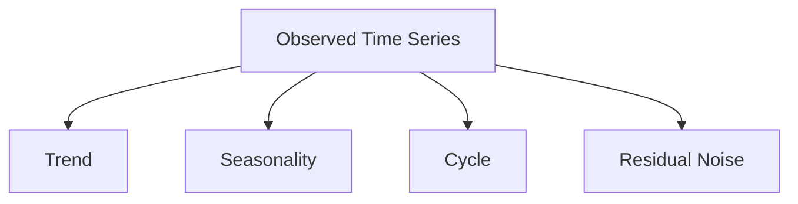
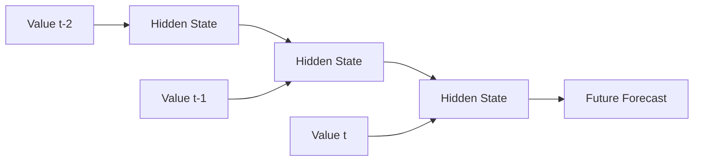
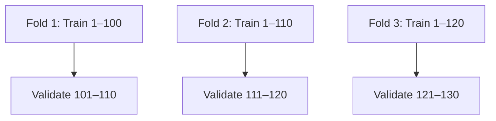
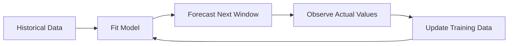
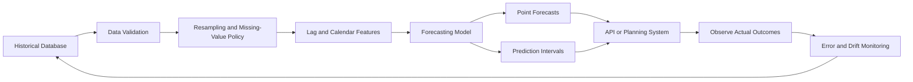

# 022 — Time Series

**Course:** 03 — Machine Learning and Deep Learning
**Module:** Module 07 — Deep Learning
**Content Group:** Applications
**Roadmap Source:** Deep Learning / Applications
**Lesson Type:** Deep Learning
**Order in Module:** 022
**Suggested Duration:** 24 minutes

---

## 1. Overview

A **time series** is a sequence of observations ordered by time.

$$
Y=\{y_1,y_2,\ldots,y_T\}
$$

Each value $y_t$ is associated with a timestamp $t$.

Examples include:

* Hourly electricity consumption
* Daily product sales
* Monthly revenue
* Website traffic per minute
* Temperature measurements
* Stock prices
* Sensor readings
* Patient heart rate
* Server latency
* Number of support tickets

Time-series analysis is not only about predicting future values. It also includes:

* Understanding historical behavior
* Detecting trends and seasonal patterns
* Measuring temporal dependence
* Identifying anomalies
* Estimating uncertainty
* Evaluating interventions
* Monitoring changes in a system

A typical forecasting problem is:

$$
\hat{y}_{t+h} =
f(y_t,y_{t-1},\ldots,y_{t-p+1},x_t)
$$

Where:

* $h$ is the forecast horizon.
* $p$ is the lookback-window length.
* $y_t$ is the target value at time $t$.
* $x_t$ represents additional explanatory variables.
* $\hat{y}_{t+h}$ is the prediction for a future timestamp.

---

## 2. Learning Objectives

By the end of this lesson, you should be able to:

* Explain time-series data in your own words.
* Distinguish time-series analysis from forecasting.
* Identify trend, seasonality, cycles, and residual noise.
* Explain autocorrelation and partial autocorrelation.
* Understand the idea of stationarity.
* Prepare a time-indexed dataset using Python and pandas.
* Handle missing timestamps, missing values, and outliers.
* Create lag, rolling, and calendar features.
* Build appropriate forecasting baselines.
* Distinguish AR, MA, ARIMA, SARIMA, and SARIMAX models.
* Explain how RNNs, LSTMs, CNNs, and Transformers process time series.
* Use chronological splitting and walk-forward validation.
* Evaluate forecasts using MAE, RMSE, MAPE, sMAPE, and MASE.
* Explain prediction intervals and forecast uncertainty.
* Avoid leakage from future information.
* Build a small forecasting portfolio project.

---

## 3. What Makes Time-Series Data Different?

In ordinary supervised learning, samples are often treated as independent.

Time-series observations are usually dependent on earlier observations:

$$
y_t
\not\perp
y_{t-1}
$$

For example:

* Today's temperature is related to yesterday's temperature.
* This month's sales may depend on last month's sales.
* Current electricity demand depends on recent demand.
* Current account balance depends on previous balances.

The temporal order therefore matters.

Incorrect assumption:

```text id="rk34ta"
shuffle observations freely
```

Correct principle:

```text id="510x75"
past observations → future observations
```

A forecasting model must never use information that would not have been available at prediction time.

---

## 4. Time-Series Analysis vs. Forecasting

### Time-Series Analysis

Time-series analysis studies how a process behaves over time.

Questions include:

* Is the series increasing?
* Does it have weekly seasonality?
* Are there structural breaks?
* How volatile is it?
* Are observations correlated with previous values?
* When did unusual behavior occur?

### Forecasting

Forecasting estimates future values.

Example:

```text id="aq7brg"
Historical daily demand
    → forecasting model
    → demand for the next seven days
```

Analysis helps us understand the process. Forecasting uses that understanding to estimate future outcomes.

---

## 5. Types of Time-Series Problems

### 5.1 Univariate Forecasting

One variable is modeled using its own history.

$$
\hat{y}_{t+h} =
f(y_t,y_{t-1},\ldots)
$$

Example:

```text id="fxtznq"
past sales → future sales
```

---

### 5.2 Multivariate Forecasting

Several historical variables are used.

$$
\hat{y}_{t+h} =
f(y_t,x_t^{(1)},x_t^{(2)},\ldots)
$$

Example:

```text id="qfwv9d"
past sales
past price
past advertising
past weather
    → future sales
```

---

### 5.3 Single-Step Forecasting

Predict one future point:

$$
\hat{y}_{t+1}
$$

Example:

```text id="3yb1us"
predict tomorrow's demand
```

---

### 5.4 Multi-Step Forecasting

Predict several future points:

$$
\hat{y}_{t+1},
\hat{y}_{t+2},
\ldots,
\hat{y}_{t+H}
$$

Example:

```text id="zp6iwv"
predict demand for the next 30 days
```

---

### 5.5 Global Forecasting

One model learns from many related series.

Examples:

* Sales for thousands of products
* Demand at hundreds of stores
* Traffic for many web pages
* Energy consumption for many households

A series identifier becomes part of the modeling problem.

---

### 5.6 Time-Series Classification

The input is a sequence, but the output is a class.

Examples:

* Normal versus faulty sensor behavior
* Human activity recognition
* Arrhythmia classification
* Machine-state classification

For classification tasks, metrics such as accuracy and a confusion matrix may be appropriate.

For forecasting, use forecast-error metrics instead.

---

## 6. Time-Series Structure

A time series is commonly described using four components:

$$
y_t=T_t+S_t+C_t+R_t
$$

Where:

* $T_t$: trend
* $S_t$: seasonality
* $C_t$: cycle
* $R_t$: residual or irregular component



---

## 7. Trend

A **trend** is the long-term direction of the series.

Examples:

```text id="6573kp"
sales gradually increase
population declines
server traffic grows over several years
```

A simple linear trend can be represented as:

$$
T_t=\beta_0+\beta_1t
$$

Where:

* $\beta_0$ is the starting level.
* $\beta_1$ is the rate of change.

Trends may be:

* Increasing
* Decreasing
* Linear
* Nonlinear
* Piecewise
* Saturating

A trend does not need to continue forever.

---

## 8. Seasonality

**Seasonality** is a recurring pattern with a relatively fixed period.

Examples:

* Hourly demand changes during each day.
* Website traffic changes by weekday.
* Retail sales increase every December.
* Electricity use changes by season.
* Restaurant demand peaks every weekend.

For daily observations:

```text id="6vv8mm"
weekly seasonality → period 7
yearly seasonality → approximately period 365
```

For monthly observations:

```text id="bv8gaw"
annual seasonality → period 12
```

A series may contain several seasonal patterns simultaneously.

Example:

```text id="2k6tkk"
hourly data:
daily seasonality
weekly seasonality
yearly seasonality
```

---

## 9. Cycles

A **cycle** is a rise-and-fall pattern without a perfectly fixed period.

Examples:

* Business cycles
* Economic expansions and recessions
* Product adoption cycles
* Multi-year commodity cycles

Seasonality repeats at a predictable frequency.

Cycles may vary in length and intensity.

---

## 10. Residual Component

The residual contains what remains after the modeled structure is removed:

$$
R_t=y_t-\hat{T}_t-\hat{S}_t
$$

A useful model should leave residuals that are approximately:

* Centered near zero
* Uncorrelated
* Stable in variance
* Free from obvious patterns

Residuals do not need to be perfectly random, but visible structure suggests that the model has missed useful information.

---

## 11. Additive and Multiplicative Decomposition

### Additive Decomposition

$$
y_t=T_t+S_t+R_t
$$

Use an additive model when the seasonal amplitude remains approximately constant.

```text id="g0vjj7"
trend increases
seasonal variation remains about ±20 units
```

### Multiplicative Decomposition

$$
y_t=T_t\times S_t\times R_t
$$

Use a multiplicative model when seasonal variation grows with the level of the series.

```text id="67bspz"
small sales → small seasonal swings
large sales → large seasonal swings
```

A logarithmic transformation can convert multiplicative relationships into additive ones:

$$
\log y_t =
\log T_t+\log S_t+\log R_t
$$

---

## 12. Time-Series Decomposition in Python

```python id="62cj1l"
import pandas as pd
from statsmodels.tsa.seasonal import seasonal_decompose

series = pd.read_csv(
    "monthly_sales.csv",
    parse_dates=["date"],
    index_col="date",
)["sales"]

decomposition = seasonal_decompose(
    series,
    model="additive",
    period=12,
)

decomposition.plot()
```

The result contains:

```python id="nupdyf"
trend = decomposition.trend
seasonal = decomposition.seasonal
residual = decomposition.resid
```

Before setting `period`, understand the data frequency and the expected seasonal cycle.

---

## 13. Time Index and Frequency

A time-series dataset should have:

* A valid timestamp
* A clear time zone when relevant
* Sorted timestamps
* A known frequency
* No unexpected duplicate timestamps

Example:

```python id="lj28w0"
import pandas as pd

data = pd.read_csv(
    "energy.csv",
    parse_dates=["timestamp"],
)

data = (
    data
    .sort_values("timestamp")
    .set_index("timestamp")
)

print(data.index)
print(pd.infer_freq(data.index))
```

Possible frequencies include:

```text id="x76f3l"
minute
hourly
daily
weekly
monthly
quarterly
yearly
```

---

## 14. Regular and Irregular Time Series

### Regular Time Series

Observations are recorded at equal intervals.

```text id="2dr5fs"
10:00
11:00
12:00
13:00
```

### Irregular Time Series

Intervals vary.

```text id="z93uys"
10:00
10:17
11:42
15:05
```

Many forecasting models assume regular spacing.

Irregular data may require:

* Resampling
* Event-based models
* Time-gap features
* Specialized continuous-time methods

Do not resample blindly. Aggregation may remove useful event information.

---

## 15. Resampling

Resampling changes the frequency of a time series.

### Downsampling

Convert high-frequency data into lower-frequency observations.

```python id="8xmn1a"
daily_sales = hourly_sales.resample("D").sum()
```

Possible aggregation functions:

* Sum
* Mean
* Median
* Minimum
* Maximum
* First
* Last

Choose the function based on the meaning of the variable.

Examples:

```text id="xg67r3"
hourly revenue → daily sum
hourly temperature → daily mean
stock price → daily last value
daily maximum load → weekly maximum
```

### Upsampling

Convert low-frequency data into higher-frequency timestamps.

```python id="cuy8p0"
hourly_series = daily_series.resample("h").asfreq()
```

Upsampling creates missing values that need an explicit filling policy.

---

## 16. Missing Timestamps and Missing Values

Missing time-series observations are not equivalent to ordinary missing table rows.

Deleting a timestamp may break the expected frequency.

Check missing timestamps:

```python id="kk2p36"
expected_index = pd.date_range(
    start=data.index.min(),
    end=data.index.max(),
    freq="D",
)

missing_timestamps = expected_index.difference(
    data.index
)

print(missing_timestamps)
```

Restore the full index:

```python id="2ei39f"
data = data.reindex(expected_index)
data.index.name = "date"
```

Possible filling strategies include:

* Leave missing
* Forward fill
* Backward fill
* Linear interpolation
* Seasonal interpolation
* Model-based imputation
* Zero, when zero has a valid meaning

```python id="2ex5db"
data["value_interpolated"] = (
    data["value"].interpolate(method="time")
)
```

### Important caveat

Do not use future values to fill training-time inputs when those future values would be unavailable during production forecasting.

---

## 17. Outliers and Anomalies

Time-series outliers may be:

* Data errors
* Sensor failures
* Real rare events
* Promotions
* Holidays
* System outages
* Market shocks

An unusual value should not automatically be removed.

Questions to ask:

1. Is the value impossible?
2. Is it caused by a data pipeline problem?
3. Could it occur again?
4. Will the forecasting system need to predict similar events?
5. Is there an external variable explaining it?

Possible strategies:

* Correct a confirmed error
* Cap extreme values
* Transform the target
* Add event indicators
* Use robust losses
* Model anomalies separately
* Keep the event as valid data

---

## 18. Autocorrelation

**Autocorrelation** measures the relationship between a series and delayed versions of itself.

For lag $k$:

$$
\rho_k =
\operatorname{Corr}(y_t,y_{t-k})
$$

Examples:

```text id="ud6yh2"
lag 1:
today versus yesterday

lag 7:
today versus the same weekday last week

lag 12:
this month versus the same month last year
```

High autocorrelation at lag 7 may indicate weekly dependence.

High autocorrelation at lag 12 in monthly data may indicate yearly seasonality.

---

## 19. Autocorrelation Function

The **Autocorrelation Function**, or ACF, measures correlation at several lags.

```python id="20kmml"
from statsmodels.graphics.tsaplots import plot_acf

plot_acf(
    series.dropna(),
    lags=40,
)
```

The ACF includes both:

* Direct relationships
* Indirect relationships through intermediate lags

For example, lag 2 may correlate with the present partly because:

```text id="49xezm"
yₜ₋₂ influences yₜ₋₁
and
yₜ₋₁ influences yₜ
```

---

## 20. Partial Autocorrelation Function

The **Partial Autocorrelation Function**, or PACF, measures the relationship between $y_t$ and $y_{t-k}$ after controlling for intermediate lags.

```python id="c4eew4"
from statsmodels.graphics.tsaplots import plot_pacf

plot_pacf(
    series.dropna(),
    lags=40,
    method="ywm",
)
```

Conceptually:

```text id="m2iwtc"
ACF:
total relationship at each lag

PACF:
direct relationship after controlling for shorter lags
```

ACF and PACF can help inspect temporal structure, but they should not be treated as automatic model-selection rules.

---

## 21. Stationarity

A time series is **stationary** when its statistical behavior remains stable over time.

A weakly stationary series has approximately:

1. Constant mean

$$
E[y_t]=\mu
$$

2. Constant variance

$$
\operatorname{Var}(y_t)=\sigma^2
$$

3. Autocovariance depending only on lag

$$
\operatorname{Cov}(y_t,y_{t-k}) =
\gamma_k
$$

and not on the absolute time $t$.

---

## 22. Why Stationarity Matters

Several classical time-series models assume that relationships remain stable.

A strongly trending series violates this assumption because its mean changes over time.

A series with increasing volatility violates the constant-variance assumption.

Stationarity helps classical models learn repeatable temporal relationships.

Deep-learning models do not always require strict stationarity, but nonstationarity can still cause:

* Distribution shift
* Unstable training
* Poor long-horizon forecasts
* Failure after regime changes

---

## 23. Making a Series More Stationary

### Differencing

First difference:

$$
\nabla y_t =
y_t-y_{t-1}
$$

```python id="fj9umf"
difference = series.diff().dropna()
```

Second difference:

$$
\nabla^2y_t =
\nabla y_t-\nabla y_{t-1}
$$

### Seasonal Differencing

For seasonal period $m$:

$$
\nabla_m y_t =
y_t-y_{t-m}
$$

```python id="zps0mb"
seasonal_difference = (
    series - series.shift(12)
).dropna()
```

### Log Transformation

```python id="wehvha"
import numpy as np

log_series = np.log1p(series)
```

Useful when variability increases with the series level.

### Detrending

Remove an estimated trend.

### Seasonal Adjustment

Remove an estimated seasonal component.

Over-differencing may destroy useful signal, so use the minimum transformation needed.

---

## 24. Stationarity Tests

### Augmented Dickey–Fuller Test

The ADF test commonly uses:

$$
H_0:
\text{the series contains a unit root}
$$

A small p-value provides evidence against the unit-root null hypothesis.

```python id="nlnetg"
from statsmodels.tsa.stattools import adfuller

result = adfuller(series.dropna())

print("ADF statistic:", result[0])
print("p-value:", result[1])
```

### KPSS Test

The KPSS test commonly uses:

$$
H_0:
\text{the series is stationary}
$$

Using ADF and KPSS together can provide a more complete diagnosis.

Statistical tests should be combined with:

* Plots
* Domain knowledge
* Rolling statistics
* Model diagnostics

---

## 25. White Noise

A white-noise series has approximately:

$$
E[\epsilon_t]=0
$$

$$
\operatorname{Var}(\epsilon_t)=\sigma^2
$$

$$
\operatorname{Cov}
(\epsilon_t,\epsilon_{t-k})
=0
\quad
\text{for }k\ne0
$$

White noise is unpredictable from its own past.

After fitting a forecasting model, residuals should ideally resemble white noise.

If residual autocorrelation remains, the model has likely missed temporal structure.

---

## 26. Random Walk

A random walk can be represented as:

$$
y_t=y_{t-1}+\epsilon_t
$$

It is nonstationary because shocks accumulate over time.

The best one-step point forecast under a basic random walk is often:

$$
\hat{y}_{t+1}=y_t
$$

This is the naive forecast.

A sophisticated model should be compared against it.

---

## 27. Converting a Time Series into Supervised Learning

To use ordinary machine-learning or neural-network models, create input-output windows.

Given:

```text id="y3mmjo"
[10, 12, 13, 15, 16, 18]
```

With lookback $p=3$:

```text id="t3fuwg"
Input [10, 12, 13] → Target 15
Input [12, 13, 15] → Target 16
Input [13, 15, 16] → Target 18
```

Mathematically:

$$
X_t=
[y_{t-p+1},\ldots,y_t]
$$

$$
Y_t=y_{t+h}
$$

---

## 28. Sliding Windows in Python

```python id="efvprj"
import numpy as np


def create_windows(
    values: np.ndarray,
    lookback: int,
    horizon: int = 1,
) -> tuple[np.ndarray, np.ndarray]:
    x_samples = []
    y_samples = []

    final_start = (
        len(values)
        - lookback
        - horizon
        + 1
    )

    for start in range(final_start):
        input_end = start + lookback
        target_end = input_end + horizon

        x_samples.append(
            values[start:input_end]
        )

        y_samples.append(
            values[input_end:target_end]
        )

    return (
        np.asarray(x_samples),
        np.asarray(y_samples),
    )
```

Usage:

```python id="im6new"
values = series.to_numpy(dtype="float32")

x, y = create_windows(
    values,
    lookback=30,
    horizon=7,
)

print(x.shape)
print(y.shape)
```

---

## 29. Time-Series Features

Machine-learning models can use manually constructed features.

### Lag Features

$$
y_{t-1},y_{t-2},y_{t-7},y_{t-28}
$$

```python id="m0719z"
for lag in [1, 2, 7, 14, 28]:
    data[f"lag_{lag}"] = (
        data["target"].shift(lag)
    )
```

### Rolling Mean

$$
MA_t^{(w)} =
\frac{1}{w}
\sum_{i=1}^{w}y_{t-i}
$$

```python id="qx9byh"
data["rolling_mean_7"] = (
    data["target"]
    .shift(1)
    .rolling(7)
    .mean()
)
```

The shift is important. Without it, the current target may leak into its own feature.

### Rolling Standard Deviation

```python id="rzj0xc"
data["rolling_std_7"] = (
    data["target"]
    .shift(1)
    .rolling(7)
    .std()
)
```

### Calendar Features

```python id="ner450"
data["day_of_week"] = data.index.dayofweek
data["month"] = data.index.month
data["day_of_month"] = data.index.day
data["is_weekend"] = (
    data.index.dayofweek >= 5
).astype(int)
```

---

## 30. Cyclical Calendar Encoding

Month 12 and month 1 are adjacent, although their numeric values are far apart.

Encode cyclical variables using sine and cosine:

$$
x_{\sin} =
\sin
\left(
2\pi\frac{x}{P}
\right)
$$

$$
x_{\cos} =
\cos
\left(
2\pi\frac{x}{P}
\right)
$$

Example for hour:

```python id="2w7ldf"
import numpy as np

data["hour_sin"] = np.sin(
    2 * np.pi * data.index.hour / 24
)

data["hour_cos"] = np.cos(
    2 * np.pi * data.index.hour / 24
)
```

---

## 31. Exogenous Variables

An exogenous variable provides information beyond the target's history.

Examples:

* Temperature
* Product price
* Promotions
* Holidays
* Marketing spend
* Interest rates
* Store closures
* Weather forecasts

Model:

$$
y_t =
f(
y_{t-1},
y_{t-2},
x_t
)
$$

### Critical question

Will the exogenous value be known at prediction time?

Examples:

```text id="b2nvka"
holiday calendar:
known in advance

future promotion plan:
possibly known in advance

tomorrow's actual temperature:
not known, unless using a weather forecast
```

Training with unavailable future variables creates leakage.

---

## 32. Forecasting Strategies

### Recursive Strategy

Train a one-step model and repeatedly feed predictions back into it.

```text id="q7v1sc"
predict t+1
use predicted t+1 to predict t+2
use predicted t+2 to predict t+3
```

Advantages:

* One model
* Simple design

Limitations:

* Errors accumulate

---

### Direct Strategy

Train a separate model for every horizon.

```text id="gyrkwg"
model 1 → predict t+1
model 2 → predict t+2
model 3 → predict t+3
```

Advantages:

* No recursive feedback

Limitations:

* More models
* Forecasts may be inconsistent across horizons

---

### Multi-Output Strategy

One model predicts the entire horizon:

$$
[\hat{y}_{t+1},\ldots,\hat{y}_{t+H}] =
f(X_t)
$$

This is common in deep-learning forecasting.

---

## 33. Forecasting Baselines

Always create simple baselines before using complex models.

### Mean Baseline

$$
\hat{y}_{t+h} =
\frac{1}{t}
\sum_{i=1}^{t}y_i
$$

### Naive Baseline

$$
\hat{y}_{t+h}=y_t
$$

### Seasonal Naive Baseline

For seasonal period $m$:

$$
\hat{y}_{t+h}=y_{t+h-m}
$$

Example:

```text id="3jj9g7"
daily data with weekly seasonality:
forecast next Monday using last Monday
```

### Drift Baseline

Extrapolate the average historical change:

$$
\hat{y}_{T+h} =
y_T+
h
\frac{y_T-y_1}{T-1}
$$

If an advanced model cannot outperform a suitable baseline, it may not provide practical value.

---

## 34. Moving Average

A moving average smooths short-term variation.

$$
MA_t^{(w)} =
\frac{1}{w}
\sum_{i=0}^{w-1}y_{t-i}
$$

```python id="icm1xn"
rolling_mean = series.rolling(7).mean()
```

Moving averages are useful for:

* Visualization
* Smoothing
* Trend inspection
* Simple forecasting features

A moving-average smoothing operation is not the same concept as the MA component in an ARMA model.

---

## 35. Exponential Smoothing

Exponential smoothing gives larger weights to recent observations.

### Simple Exponential Smoothing

$$
\ell_t =
\alpha y_t
+
(1-\alpha)\ell_{t-1}
$$

Where:

$$
0<\alpha<1
$$

It is suitable for a series with no strong trend or seasonality.

### Holt's Method

Adds a trend component.

### Holt–Winters Method

Adds trend and seasonality.

```python id="sci6nz"
from statsmodels.tsa.holtwinters import (
    ExponentialSmoothing,
)

model = ExponentialSmoothing(
    train_series,
    trend="add",
    seasonal="add",
    seasonal_periods=12,
)

fitted_model = model.fit()

forecast = fitted_model.forecast(
    steps=len(test_series)
)
```

---

## 36. Autoregressive Models

An autoregressive model predicts the current value using previous values.

An AR($p$) model is:

$$
y_t =
c+
\phi_1y_{t-1}
+
\phi_2y_{t-2}
+
\cdots+
\phi_py_{t-p}
+
\epsilon_t
$$

Where:

* $p$ is the number of lags.
* $\epsilon_t$ is the residual.

Example AR(2):

$$
y_t =
c+
\phi_1y_{t-1}
+
\phi_2y_{t-2}
+
\epsilon_t
$$

---

## 37. Moving-Average Models

An MA($q$) model predicts the series using previous forecast errors:

$$
y_t =
\mu+
\epsilon_t+
\theta_1\epsilon_{t-1}
+
\cdots+
\theta_q\epsilon_{t-q}
$$

Where $q$ is the number of lagged error terms.

This is different from calculating a rolling average of observations.

---

## 38. ARMA

An ARMA($p,q$) model combines:

* Autoregressive terms
* Moving-average error terms

$$
y_t =
c+
\sum_{i=1}^{p}\phi_i y_{t-i}
+
\epsilon_t
+
\sum_{j=1}^{q}\theta_j\epsilon_{t-j}
$$

ARMA is generally applied to stationary series.

---

## 39. ARIMA

ARIMA stands for:

* AutoRegressive
* Integrated
* Moving Average

Its order is:

$$
ARIMA(p,d,q)
$$

Where:

* $p$: autoregressive order
* $d$: number of differences
* $q$: moving-average order

The integrated component applies differencing to reduce nonstationarity.

```python id="naw5rg"
from statsmodels.tsa.arima.model import ARIMA

model = ARIMA(
    train_series,
    order=(2, 1, 2),
)

fitted_model = model.fit()

forecast = fitted_model.forecast(
    steps=len(test_series)
)
```

Do not select $(p,d,q)$ only by guessing. Use:

* Diagnostics
* Cross-validation
* Information criteria
* Residual analysis
* Domain knowledge

---

## 40. SARIMA

SARIMA adds seasonal components.

$$
SARIMA(p,d,q)(P,D,Q)_m
$$

Where:

* $P$: seasonal autoregressive order
* $D$: seasonal differencing order
* $Q$: seasonal moving-average order
* $m$: seasonal period

For monthly data with yearly seasonality:

$$
m=12
$$

For daily data with weekly seasonality:

$$
m=7
$$

---

## 41. SARIMAX

SARIMAX extends SARIMA with exogenous variables.

$$
y_t =
\text{seasonal ARIMA structure}
+
\beta^Tx_t
+
\epsilon_t
$$

```python id="0liwwh"
from statsmodels.tsa.statespace.sarimax import SARIMAX

model = SARIMAX(
    endog=train_target,
    exog=train_exogenous,
    order=(1, 1, 1),
    seasonal_order=(1, 1, 1, 7),
)

fitted_model = model.fit()

forecast = fitted_model.get_forecast(
    steps=len(test_target),
    exog=test_exogenous,
)
```

The future exogenous variables must be available when forecasting.

---

## 42. Machine-Learning Forecasting

A time series can be converted into a tabular supervised-learning problem.

Possible models:

* Linear regression
* Random forest
* Gradient boosting
* XGBoost
* LightGBM
* CatBoost
* Neural networks

Input:

```text id="ffahvz"
lag_1
lag_7
rolling_mean_7
rolling_std_28
day_of_week
holiday
temperature
promotion
```

Output:

```text id="9jcwku"
future demand
```

Tree-based models can work well when:

* Calendar effects matter
* Exogenous variables are available
* Nonlinear interactions exist
* Many related series are modeled

---

## 43. Deep Learning for Time Series

Deep learning is useful when:

* Large datasets are available
* Many related series exist
* Long temporal dependencies matter
* There are many input variables
* Nonlinear relationships are important
* Multi-horizon forecasts are required

Possible architectures include:

* Multilayer perceptron
* One-dimensional CNN
* RNN
* LSTM
* GRU
* Temporal convolutional network
* Transformer
* Encoder-decoder model

Deep learning is not automatically better than statistical baselines.

---

## 44. RNN Forecasting

An RNN updates its hidden state sequentially:

$$
h_t=f(x_t,h_{t-1})
$$

Forecast:

$$
\hat{y}_{t+1}=g(h_t)
$$



Basic RNNs may struggle with long dependencies due to gradient problems.

---

## 45. LSTM and GRU Forecasting

LSTMs and GRUs use gates to control information flow.

They may learn:

* Recent momentum
* Delayed effects
* Seasonal behavior
* Interactions between variables

LSTMs are commonly used when the model must preserve information over longer windows.

GRUs have a simpler gated structure and often require fewer parameters.

Neither architecture automatically discovers the correct seasonal period. Input design and validation remain important.

---

## 46. One-Dimensional CNNs

A Conv1D model applies filters across the time dimension.


A CNN may learn patterns such as:

* Short-term spikes
* Local trends
* Repeated motifs
* Sudden changes

Advantages:

* Parallel computation
* Efficient training
* Strong local-pattern detection

Dilated convolutions can increase the receptive field without extremely deep networks.

---

## 47. Transformers for Time Series

Transformers use attention to connect different timestamps.

$$
\operatorname{Attention}(Q,K,V) =
\operatorname{softmax}
\left(
\frac{QK^T}{\sqrt{d_k}}
\right)V
$$

Potential advantages:

* Long-range dependency modeling
* Parallel training
* Multivariate input handling
* Multi-horizon output

Potential limitations:

* High memory use
* Large data requirements
* Complex tuning
* Weak performance on small datasets
* Quadratic attention cost in basic architectures

A Transformer should be compared with naive, statistical, and simpler neural baselines.

---

## 48. LSTM Forecasting Example

Prepare data shape:

```text id="ej6h1w"
samples × lookback × features
```

Example model:

```python id="dhpkil"
import tensorflow as tf
from tensorflow import keras
from tensorflow.keras import layers

lookback = 30
number_of_features = 1
forecast_horizon = 7

model = keras.Sequential(
    [
        layers.Input(
            shape=(
                lookback,
                number_of_features,
            )
        ),

        layers.LSTM(
            64,
            return_sequences=True,
        ),

        layers.Dropout(0.20),

        layers.LSTM(32),

        layers.Dense(64, activation="relu"),

        layers.Dense(forecast_horizon),
    ]
)

model.compile(
    optimizer=keras.optimizers.Adam(
        learning_rate=1e-3
    ),
    loss="mae",
    metrics=[
        keras.metrics.MeanAbsoluteError(
            name="mae"
        ),
    ],
)
```

Training:

```python id="td0e5g"
callbacks = [
    keras.callbacks.ModelCheckpoint(
        "best_lstm_forecaster.keras",
        monitor="val_loss",
        save_best_only=True,
    ),

    keras.callbacks.EarlyStopping(
        monitor="val_loss",
        patience=8,
        restore_best_weights=True,
    ),

    keras.callbacks.ReduceLROnPlateau(
        monitor="val_loss",
        factor=0.5,
        patience=3,
        min_lr=1e-6,
    ),
]

history = model.fit(
    x_train,
    y_train,
    validation_data=(
        x_validation,
        y_validation,
    ),
    epochs=100,
    batch_size=64,
    callbacks=callbacks,
)
```

---

## 49. Scaling Time-Series Data

Neural networks often benefit from scaling.

### Standardization

$$
z_t =
\frac{y_t-\mu}{\sigma}
$$

### Min-Max Scaling

$$
z_t =
\frac{y_t-y_{\min}}
{y_{\max}-y_{\min}}
$$

Fit the scaler only on the training period:

```python id="6kueiz"
from sklearn.preprocessing import StandardScaler

scaler = StandardScaler()

train_scaled = scaler.fit_transform(
    train_values.reshape(-1, 1)
)

validation_scaled = scaler.transform(
    validation_values.reshape(-1, 1)
)

test_scaled = scaler.transform(
    test_values.reshape(-1, 1)
)
```

Incorrect:

```python id="68cc2l"
scaler.fit(all_values)
```

That leaks future distribution information.

---

## 50. Chronological Train-Validation-Test Split

A random split is usually inappropriate for forecasting.

Correct split:

```text id="spx4f3"
past                   future
|--------------------------|
training | validation | test
```

Example:

```python id="0dfygp"
n = len(data)

train_end = int(n * 0.70)
validation_end = int(n * 0.85)

train = data.iloc[:train_end]
validation = data.iloc[
    train_end:validation_end
]
test = data.iloc[validation_end:]
```

The test period must occur after training and validation.

---

## 51. Expanding-Window Validation

Training data grows over time.

```text id="10cupg"
Fold 1:
Train [1 ... 100]
Validate [101 ... 110]

Fold 2:
Train [1 ... 110]
Validate [111 ... 120]

Fold 3:
Train [1 ... 120]
Validate [121 ... 130]
```



This simulates repeated real-world forecasting.

---

## 52. Sliding-Window Validation

Use a fixed-length training window.

```text id="689dz4"
Fold 1:
Train [1 ... 100]
Validate [101 ... 110]

Fold 2:
Train [11 ... 110]
Validate [111 ... 120]

Fold 3:
Train [21 ... 120]
Validate [121 ... 130]
```

Sliding windows may be preferable when older observations become less relevant.

---

## 53. Walk-Forward Validation

Walk-forward validation repeatedly:

1. Trains on historical data.
2. Predicts the next period.
3. Observes the actual value.
4. Expands or shifts the training window.
5. Repeats.



This is more realistic than ordinary random cross-validation.

---

## 54. Forecast Horizon

Model quality often changes by horizon.

Example:

```text id="l7hwci"
one-day forecast:
high accuracy

seven-day forecast:
moderate accuracy

ninety-day forecast:
high uncertainty
```

Report errors separately by horizon:

$$
MAE_h =
\frac{1}{N}
\sum_{i=1}^{N}
|y_{i,h}-\hat{y}_{i,h}|
$$

Do not hide weak long-horizon performance inside one average.

---

## 55. Mean Absolute Error

$$
MAE =
\frac{1}{n}
\sum_{i=1}^{n}
|y_i-\hat{y}_i|
$$

Advantages:

* Easy to interpret
* Same unit as the target
* Less sensitive to large errors than RMSE

Example:

```text id="rhpp5r"
MAE = 12 units

Average absolute forecast error:
12 units
```

---

## 56. Root Mean Squared Error

$$
RMSE =
\sqrt{
\frac{1}{n}
\sum_{i=1}^{n}
(y_i-\hat{y}_i)^2
}
$$

RMSE penalizes large errors more strongly.

Use it when large misses are especially costly.

It is sensitive to outliers.

---

## 57. Mean Absolute Percentage Error

$$
MAPE =
\frac{100}{n}
\sum_{i=1}^{n}
\left|
\frac{y_i-\hat{y}_i}{y_i}
\right|
$$

Advantages:

* Expressed as a percentage
* Easy for stakeholders to interpret

Problems:

* Undefined when $y_i=0$
* Unstable near zero
* Can favor underforecasting
* Difficult with negative targets

Do not use MAPE automatically.

---

## 58. Symmetric MAPE

$$
sMAPE =
\frac{100}{n}
\sum_{i=1}^{n}
\frac{
2|y_i-\hat{y}_i|
}{
|y_i|+|\hat{y}_i|
}
$$

sMAPE reduces some MAPE problems but still behaves poorly when both actual and predicted values are near zero.

---

## 59. Mean Absolute Scaled Error

$$
MASE =
\frac{
\frac{1}{n}
\sum |y_i-\hat{y}_i|
}{
\frac{1}{T-m}
\sum_{t=m+1}^{T}
|y_t-y_{t-m}|
}
$$

The denominator is the in-sample error of a naive or seasonal-naive forecast.

Interpretation:

```text id="m46hd1"
MASE < 1:
better than baseline

MASE = 1:
similar to baseline

MASE > 1:
worse than baseline
```

MASE is useful for comparing different series with different scales.

---

## 60. Forecast Bias

A model may systematically overforecast or underforecast.

Mean error:

$$
ME =
\frac{1}{n}
\sum_{i=1}^{n}
(\hat{y}_i-y_i)
$$

Interpretation:

```text id="5dx2gz"
ME > 0:
average overforecast

ME < 0:
average underforecast
```

A low MAE can still hide harmful systematic bias.

---

## 61. Prediction Intervals

A point forecast gives one value:

$$
\hat{y}_{t+h}
$$

A prediction interval gives a plausible range:

$$
[L_{t+h},U_{t+h}]
$$

Example:

```text id="kp2bmd"
point forecast:
1,200 units

90% prediction interval:
[950, 1,480]
```

The interval reflects uncertainty caused by:

* Random variation
* Parameter uncertainty
* Long forecast horizons
* Changing conditions
* Model limitations

Intervals usually widen as the horizon increases.

---

## 62. Interval Evaluation

Two important properties are:

### Coverage

How often the actual value falls inside the interval.

$$
Coverage =
\frac{
\text{actuals inside interval}
}{
\text{total forecasts}
}
$$

A nominal 90% interval should contain approximately 90% of actual outcomes.

### Width

Narrow intervals are useful only when coverage remains appropriate.

A very wide interval may have good coverage but little operational value.

---

## 63. Probabilistic Forecasting

Instead of predicting only the mean, a model may predict:

* Quantiles
* Distribution parameters
* Multiple scenarios
* Samples from a future distribution

Quantile loss for quantile $\tau$:

$$
L_\tau(y,\hat{y}) =
\max
\left(
\tau(y-\hat{y}),
(\tau-1)(y-\hat{y})
\right)
$$

Examples:

```text id="gt5vzi"
10th percentile forecast
50th percentile forecast
90th percentile forecast
```

This is useful for:

* Inventory planning
* Capacity planning
* Risk management
* Staffing
* Energy scheduling

---

## 64. Residual Diagnostics

After fitting a model, calculate:

$$
e_t=y_t-\hat{y}_t
$$

Inspect:

* Residual time plot
* Residual histogram
* Residual ACF
* Mean residual
* Changing variance
* Large outliers

A residual ACF with significant patterns suggests missing temporal structure.

The Ljung–Box test can help test whether residual autocorrelation remains.

---

## 65. Data Leakage in Time Series

Time-series leakage is especially dangerous because many features use moving windows.

### Leakage from current target

Incorrect:

```python id="5bdhgm"
data["rolling_mean_7"] = (
    data["target"].rolling(7).mean()
)
```

The current target is included in its own feature.

Correct:

```python id="41q3o7"
data["rolling_mean_7"] = (
    data["target"]
    .shift(1)
    .rolling(7)
    .mean()
)
```

### Leakage from future values

Incorrect:

```text id="uj44td"
using tomorrow's actual weather
to forecast tomorrow's demand
```

Correct:

```text id="tfmt2o"
use tomorrow's weather forecast
or variables known in advance
```

### Leakage from preprocessing

Fit scalers, imputers, PCA, and encoders only on historical training data.

---

## 66. Common Mistakes

### 66.1 Randomly shuffling time-series observations

This allows future patterns to influence training.

---

### 66.2 Using a confusion matrix for forecasting

Confusion matrices are designed for classification.

Forecasting requires error metrics such as:

* MAE
* RMSE
* MASE
* sMAPE

---

### 66.3 Skipping the naive baseline

A complex model may appear impressive while performing worse than:

```text id="j0p7ps"
tomorrow = today
```

---

### 66.4 Evaluating on only one split

One test window may be unusually easy or difficult.

Use rolling or walk-forward validation.

---

### 66.5 Ignoring seasonality

A nonseasonal model may fail badly on periodic data.

---

### 66.6 Applying ARIMA without inspecting the series

Do not fit an ARIMA-family model without checking:

* Trend
* Seasonality
* Stationarity
* Residuals
* Forecast horizon

---

### 66.7 Using deep learning on a tiny dataset

A large LSTM or Transformer may overfit a short series.

Statistical models may be more reliable.

---

### 66.8 Assuming a lower training loss means a better forecast

Training loss does not measure real future performance.

Use time-aware validation.

---

### 66.9 Ignoring horizon-specific error

Good one-step predictions do not guarantee good long-term predictions.

---

### 66.10 Using future exogenous information

Only use values known or forecastable at prediction time.

---

### 66.11 Interpolating across major events

Interpolation may erase outages, promotions, shocks, or true demand changes.

---

### 66.12 Ignoring regime changes

A model trained before a major structural change may no longer be valid.

Examples:

* Pricing policy change
* Pandemic behavior
* Product launch
* Store relocation
* New regulation

---

### 66.13 Optimizing only one metric

Different business decisions may have different error costs.

A stock shortage and overstock may not be equally expensive.

---

## 67. Practical Exercise

Build a daily demand-forecasting notebook.

### Dataset

Use a dataset containing:

```text id="25dvr2"
date
demand
price
promotion
holiday
temperature
```

### Part A — Data Understanding

1. Parse the timestamp.
2. Set it as the index.
3. Sort observations.
4. Check duplicates.
5. Confirm the frequency.
6. Identify missing timestamps.
7. Plot the target.
8. Inspect trend and seasonality.
9. Plot the sequence-length history.
10. Identify unusual periods.

### Part B — Decomposition

1. Apply additive decomposition.
2. Inspect trend.
3. Inspect seasonal pattern.
4. Inspect residuals.
5. Decide whether multiplicative behavior may be present.

### Part C — Baselines

Build:

1. Mean baseline
2. Naive baseline
3. Seasonal-naive baseline
4. Moving-average baseline

Evaluate all baselines using:

* MAE
* RMSE
* MASE

### Part D — Statistical Model

Train one of:

* Exponential smoothing
* ARIMA
* SARIMA
* SARIMAX

Perform residual analysis.

### Part E — Machine-Learning Model

Create:

* Lag features
* Rolling means
* Rolling standard deviations
* Calendar features
* Known exogenous features

Train a gradient-boosting model.

### Part F — Deep-Learning Model

Train one of:

* LSTM
* GRU
* Conv1D
* Small Transformer

Use the same forecast horizon as the other models.

### Part G — Validation

Use expanding-window or walk-forward validation.

Report performance for each horizon.

### Part H — Forecast Uncertainty

Generate or estimate prediction intervals.

Measure:

* Coverage
* Average width

### Part I — Error Analysis

Identify:

* High-error dates
* Holidays
* Promotions
* Sudden demand changes
* Long-term drift
* Underforecasting periods
* Overforecasting periods

---

## 68. Suggested Experiment Table

| Experiment | Model             | Features          | MAE | RMSE | MASE | Training time |
| ---------- | ----------------- | ----------------- | --: | ---: | ---: | ------------: |
| E01        | Naive             | Last value        |   — |    — |    — |             — |
| E02        | Seasonal naive    | Lag 7             |   — |    — |    — |             — |
| E03        | Holt–Winters      | Target history    |   — |    — |    — |             — |
| E04        | SARIMAX           | History + weather |   — |    — |    — |             — |
| E05        | Gradient boosting | Lag + calendar    |   — |    — |    — |             — |
| E06        | LSTM              | Sequence window   |   — |    — |    — |             — |

Also record:

* Lookback length
* Forecast horizon
* Seasonal period
* Parameter count
* Inference latency
* Interval coverage
* Interval width

---

## 69. Visualization Checklist

Create at least:

1. Full historical line chart
2. Train-validation-test split chart
3. Seasonal plot
4. Decomposition plot
5. ACF plot
6. PACF plot
7. Forecast versus actual chart
8. Residual chart
9. Error by horizon chart
10. Prediction-interval chart

Example forecast visualization:

```python id="od9rqe"
import matplotlib.pyplot as plt

plt.figure(figsize=(12, 5))

plt.plot(
    test.index,
    test["target"],
    label="Actual",
)

plt.plot(
    test.index,
    predictions,
    label="Forecast",
)

plt.fill_between(
    test.index,
    lower_interval,
    upper_interval,
    alpha=0.2,
    label="Prediction interval",
)

plt.xlabel("Date")
plt.ylabel("Demand")
plt.title("Forecast versus Actual")
plt.legend()
plt.show()
```

---

## 70. Production Forecasting Pipeline



---

## 71. Forecast API Example

Request:

```json id="wnfls7"
{
  "series_id": "store_17_product_42",
  "forecast_horizon": 7,
  "as_of": "2026-07-12"
}
```

Response:

```json id="2gy4wl"
{
  "series_id": "store_17_product_42",
  "as_of": "2026-07-12",
  "forecast": [
    {
      "date": "2026-07-13",
      "point": 128.4,
      "lower_90": 110.2,
      "upper_90": 147.9
    },
    {
      "date": "2026-07-14",
      "point": 131.1,
      "lower_90": 109.0,
      "upper_90": 153.7
    }
  ],
  "model_version": "demand-forecast-v1"
}
```

---

## 72. Production Monitoring

Monitor:

* Forecast MAE over time
* Error by horizon
* Bias
* Prediction-interval coverage
* Missing timestamps
* Missing exogenous values
* Input-distribution drift
* Target-distribution drift
* Forecast latency
* Data freshness
* Model failures
* Business override frequency

Retraining may be triggered by:

* A regular schedule
* Significant drift
* Performance degradation
* New product launches
* Structural changes
* New data availability

---

## 73. Suggested Project Structure

```text id="mkin2c"
time-series-project/
│
├── data/
│   ├── raw/
│   └── processed/
│
├── notebooks/
│   ├── 01_time_series_exploration.ipynb
│   ├── 02_decomposition_and_stationarity.ipynb
│   ├── 03_baseline_models.ipynb
│   ├── 04_statistical_forecasting.ipynb
│   ├── 05_machine_learning_forecast.ipynb
│   ├── 06_deep_learning_forecast.ipynb
│   └── 07_error_analysis.ipynb
│
├── src/
│   ├── data.py
│   ├── features.py
│   ├── baselines.py
│   ├── models.py
│   ├── validation.py
│   ├── metrics.py
│   ├── train.py
│   ├── predict.py
│   └── api.py
│
├── models/
│   ├── seasonal_naive.pkl
│   ├── sarimax.pkl
│   └── lstm_forecaster.keras
│
├── reports/
│   ├── decomposition.png
│   ├── acf_pacf.png
│   ├── forecasts.png
│   ├── residuals.png
│   └── experiment_results.csv
│
├── requirements.txt
├── Dockerfile
└── README.md
```

---

## 74. Portfolio Deliverables

A portfolio-ready time-series project should include:

* Problem definition
* Forecast horizon
* Data frequency
* Business use case
* Time-index validation
* Missing-data policy
* Trend and seasonality analysis
* Decomposition chart
* ACF and PACF
* Baseline models
* Classical forecasting model
* Machine-learning or deep-learning model
* Walk-forward validation
* MAE, RMSE, and MASE
* Horizon-specific errors
* Prediction intervals
* Residual diagnostics
* Error analysis
* Final model recommendation
* Inference script or API
* Limitations and monitoring plan

---

## 75. Completion Checklist

* [ ] I can explain time-series data in one or two minutes.
* [ ] I understand why temporal order matters.
* [ ] I can identify trend, seasonality, cycles, and residuals.
* [ ] I understand additive and multiplicative decomposition.
* [ ] I can explain autocorrelation and partial autocorrelation.
* [ ] I understand stationarity conceptually.
* [ ] I can create lag and rolling features safely.
* [ ] I know why rolling features usually require a shift.
* [ ] I have implemented naive and seasonal-naive baselines.
* [ ] I can explain AR, MA, ARIMA, and SARIMA.
* [ ] I understand when exogenous variables are safe to use.
* [ ] I can convert a time series into supervised windows.
* [ ] I understand how LSTM or Conv1D can forecast sequences.
* [ ] I use chronological rather than random splitting.
* [ ] I understand walk-forward validation.
* [ ] I can calculate MAE, RMSE, MAPE, sMAPE, and MASE.
* [ ] I can explain prediction intervals.
* [ ] I have analyzed residuals and forecast errors.
* [ ] I have documented at least one limitation or assumption.
* [ ] I have created a notebook, model, chart, API, or portfolio artifact.

---

## 76. Related Outcome

Develop a practical understanding of:

* Time-series indexing
* Trend
* Seasonality
* Decomposition
* Autocorrelation
* Stationarity
* Lag features
* Rolling features
* Forecasting baselines
* Exponential smoothing
* ARIMA-family models
* RNNs
* LSTMs
* GRUs
* Temporal CNNs
* Transformers
* Walk-forward validation
* Forecast metrics
* Prediction intervals
* Forecast deployment

---

## 77. Related Project

### Mini Project: Multi-Model Demand Forecasting

Forecast daily demand for the next seven days.

Compare:

1. Naive forecast
2. Seasonal-naive forecast
3. Holt–Winters or SARIMA
4. Gradient-boosting model with lag features
5. LSTM, GRU, or Conv1D model

Required outputs:

* Historical time-series plot
* Trend and seasonal analysis
* Decomposition
* ACF and PACF
* Train-validation-test timeline
* Walk-forward validation results
* MAE
* RMSE
* MASE
* Error by forecast horizon
* Forecast-versus-actual plot
* Prediction intervals
* Residual diagnostics
* Training and inference time
* Final model recommendation

---

## 78. Summary

A time series is an ordered sequence of observations indexed by time.

```text id="caa6up"
time-indexed data
    → validation and cleaning
    → trend and seasonality analysis
    → chronological split
    → forecasting baselines
    → statistical or machine-learning model
    → walk-forward evaluation
    → prediction intervals
    → deployment and monitoring
```

Important time-series components include:

```text id="5wlv0q"
trend
seasonality
cycles
residual noise
```

Important modeling concepts include:

```text id="z0suvs"
autocorrelation
stationarity
lag features
rolling features
forecast horizon
exogenous variables
prediction uncertainty
```

A strong forecasting workflow should:

1. Preserve temporal order.
2. Begin with naive and seasonal-naive baselines.
3. Use only information available at prediction time.
4. Evaluate across several historical windows.
5. Report horizon-specific errors.
6. Inspect residuals and forecast bias.
7. Quantify uncertainty with prediction intervals.
8. Compare model quality with training and deployment cost.

Deep learning is useful for large, complex, multivariate, or multi-series forecasting problems. For smaller datasets, statistical and machine-learning models may be simpler, faster, and more reliable.
