# 024 — Transfer Learning

**Course:** 03 — Machine Learning and Deep Learning
**Module:** Module 07 — Deep Learning
**Content Group:** Applications
**Roadmap Source:** Deep Learning / Applications
**Lesson Type:** Deep Learning
**Order in Module:** 024
**Suggested Duration:** 24 minutes

---

## 1. Overview

**Transfer Learning** is a machine-learning technique in which knowledge learned from one task is reused to solve another related task.

Instead of training a neural network from random initialization, we start with a model that has already learned useful representations from a large dataset.

For example:

```text
Large source dataset:
ImageNet with millions of labeled images

Pretrained model:
MobileNet, ResNet, EfficientNet, or Vision Transformer

New target task:
Classify five types of flowers using a small custom dataset
```

The pretrained model has already learned visual patterns such as:

* Edges
* Lines
* Curves
* Colors
* Textures
* Shapes
* Object parts
* High-level visual structures

These learned features can be transferred to a new image-classification problem.

Transfer Learning is especially useful when:

* The target dataset is small.
* Training from scratch is too expensive.
* A related pretrained model is available.
* The source and target inputs have similar structures.
* A fast and strong baseline is required.

---

## 2. Learning Objectives

After completing this lesson, you should be able to:

1. Explain Transfer Learning in your own words.
2. Distinguish pretraining, feature extraction, and fine-tuning.
3. Explain why pretrained features can generalize to new tasks.
4. Replace the original classification head of a pretrained model.
5. Freeze and unfreeze neural-network layers.
6. Build a Transfer Learning model with TensorFlow and Keras.
7. Compare Transfer Learning with training a small CNN from scratch.
8. Evaluate the model using learning curves and a confusion matrix.
9. Recognize negative transfer, domain shift, and overfitting.
10. Package the result as a notebook, API, dashboard, or portfolio project.

---

## 3. Core Idea

Suppose a neural network has been trained on a source task:

$$
f_{\theta_A}: X_A \rightarrow Y_A
$$

where:

* $X_A$ is the source input
* $Y_A$ is the source label
* $\theta_A$ represents the learned model parameters

For a related target task, we reuse some or all of the learned parameters:

$$
\theta_B^{(0)} \leftarrow \theta_A
$$

We then train the target model:

$$
f_{\theta_B}: X_B \rightarrow Y_B
$$

Instead of beginning with random parameters, the target model begins with useful pretrained knowledge.

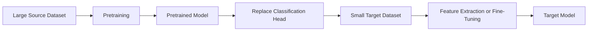

---

## 4. Why Transfer Learning Works

Deep neural networks learn hierarchical representations.

In an image model, the learned features often progress from general to task-specific.

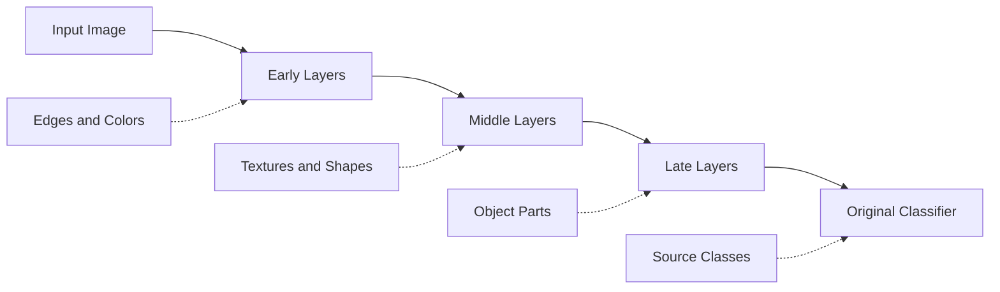

### Early Layers

Early layers often detect general visual patterns:

* Horizontal and vertical edges
* Color transitions
* Simple curves
* Corners
* Basic textures

These features can be useful across many image domains.

### Middle Layers

Middle layers combine basic features into:

* Patterns
* Repeated textures
* Object surfaces
* Simple shapes
* Local structures

### Late Layers

Late layers are usually more specific to the source task:

* Animal faces
* Vehicle parts
* Particular object categories
* Dataset-specific features

The final classification layer is usually the most task-specific component. It must normally be replaced when the target labels differ from the source labels.

---

## 5. Example

Assume that a pretrained model was originally trained to classify 1,000 ImageNet classes.

Its original output is:

```text
Input image
    ↓
Pretrained feature extractor
    ↓
1,000-class softmax layer
```

Your new task contains three classes:

```text
Tigger
Misty
Neither
```

The original head is removed and replaced:

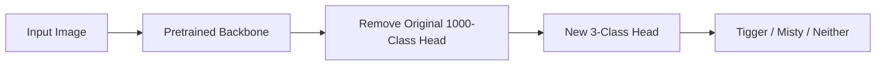

The new output layer contains three units:

$$
\hat{y} = \operatorname{softmax}(Wz+b)
$$

where:

* $z$ is the feature vector created by the pretrained backbone
* $W$ and $b$ are the parameters of the new classifier
* $\hat{y}$ contains the three class probabilities

---

## 6. Important Terminology

### 6.1 Source Task

The task used to train the original model.

Example:

```text
Classifying 1,000 ImageNet object categories
```

### 6.2 Target Task

The new problem that we want to solve.

Example:

```text
Classifying five flower species
```

### 6.3 Pretraining

Training a model on a large source dataset before adapting it to the final task.

```text
Large dataset → pretrained model
```

### 6.4 Backbone

The main feature-extraction part of a pretrained model.

Examples:

* ResNet50
* MobileNetV2
* EfficientNet
* VGG16
* DenseNet
* Vision Transformer
* BERT
* RoBERTa

### 6.5 Classification Head

The final task-specific layers that convert extracted features into predictions.

Typical classification head:

```text
Global Average Pooling
        ↓
Dense Layer
        ↓
Dropout
        ↓
Output Layer
```

### 6.6 Feature Extraction

The pretrained backbone is frozen, and only the new task-specific head is trained.

### 6.7 Fine-Tuning

Some or all of the pretrained layers are unfrozen and updated using the target dataset.

---

## 7. Main Transfer Learning Strategies

### Strategy 1: Train Only the New Head

Use this approach when:

* The target dataset is small.
* The source and target domains are similar.
* Overfitting is a major concern.
* Training resources are limited.

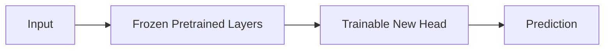

Only the head receives gradient updates:

$$
\theta_{\text{backbone}} = \text{fixed}
$$

$$
\theta_{\text{head}}
\leftarrow
\theta_{\text{head}}
-
\eta \nabla_{\theta_{\text{head}}}L
$$

This strategy is called **feature extraction**.

---

### Strategy 2: Fine-Tune the Final Layers

Use this approach when:

* The target dataset is moderately sized.
* The source and target domains are related but not identical.
* The new classification head has already been trained.
* Additional adaptation is required.

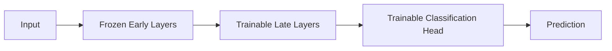

The early layers retain general features, while later layers adapt to the target task.

---

### Strategy 3: Fine-Tune the Entire Network

Use this approach when:

* The target dataset is large.
* The target domain differs substantially from the source domain.
* Enough compute is available.
* Strong regularization and careful validation are used.

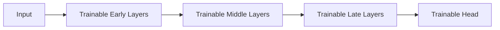

The pretrained weights act as an intelligent initialization instead of a fixed feature extractor.

---

## 8. Choosing How Many Layers to Train

A useful rule of thumb is:

| Target Dataset | Source–Target Similarity | Suggested Strategy                                         |
| -------------- | ------------------------ | ---------------------------------------------------------- |
| Small          | High                     | Freeze backbone; train head                                |
| Small          | Low                      | Freeze most layers; use augmentation; test carefully       |
| Medium         | High                     | Train head, then fine-tune final layers                    |
| Medium         | Low                      | Fine-tune more layers                                      |
| Large          | High                     | Fine-tune most or all layers                               |
| Large          | Low                      | Use pretrained initialization and train most or all layers |

General principle:

```text
More target data
      ↓
More layers can be safely fine-tuned
```

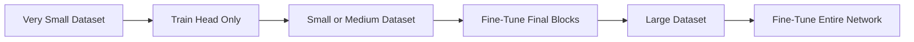

This is a heuristic rather than a strict rule. The correct choice should be validated experimentally.

---

## 9. When Transfer Learning Is Useful

Transfer Learning is usually effective when the source and target tasks share useful low-level or semantic structure.

### Image Example

Source task:

```text
General object recognition
```

Target task:

```text
Medical X-ray classification
```

The domains differ, but both contain visual structures such as:

* Edges
* Curves
* Regions
* Textures
* Spatial patterns

### Audio Example

Source task:

```text
Speech recognition
```

Target task:

```text
Wake-word detection
```

The source model has already learned useful representations of human speech.

### NLP Example

Source task:

```text
Language-model pretraining on a large text corpus
```

Target task:

```text
Sentiment analysis
```

The pretrained model already understands:

* Vocabulary
* Grammar
* Context
* Syntax
* Semantic relationships

---

## 10. Conditions for Effective Transfer

Transfer Learning tends to be useful when:

1. The source and target tasks use similar input types.
2. The source task has substantially more data.
3. The source model has learned reusable representations.
4. The target dataset is too small for reliable training from scratch.
5. The target task is related to the source task.
6. The model architecture can accept the target input format.

A simplified condition is:

$$
D_A \gg D_B
$$

where:

* $D_A$ is the amount of source-task data
* $D_B$ is the amount of target-task data

The source dataset does not always need labels. Modern models are often pretrained using self-supervised learning.

---

## 11. Feature Extraction vs Fine-Tuning

| Property                  | Feature Extraction    | Fine-Tuning                 |
| ------------------------- | --------------------- | --------------------------- |
| Frozen backbone           | Yes                   | Partially or fully unfrozen |
| Trainable parameters      | Few                   | More                        |
| Training speed            | Fast                  | Slower                      |
| Compute requirement       | Lower                 | Higher                      |
| Overfitting risk          | Lower                 | Higher                      |
| Domain adaptation         | Limited               | Stronger                    |
| Recommended learning rate | Normal for new head   | Very small                  |
| Best for                  | Small similar dataset | Larger or shifted dataset   |

A common two-stage process is:

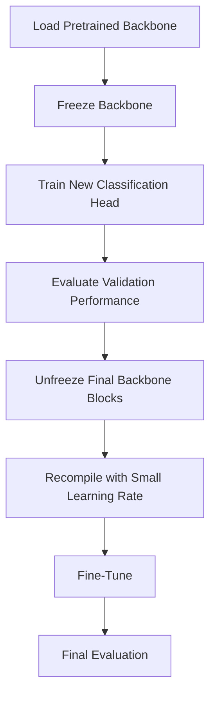

---

## 12. Practical Workflow

```text
target dataset
    ↓
inspect labels and data quality
    ↓
create train / validation / test sets
    ↓
apply model-specific preprocessing
    ↓
load pretrained backbone
    ↓
remove original classification head
    ↓
freeze backbone
    ↓
train new head
    ↓
inspect learning curves
    ↓
optionally unfreeze final layers
    ↓
fine-tune with a small learning rate
    ↓
evaluate confusion matrix
    ↓
compare against training from scratch
```

---

## 13. Data Preparation

A typical image folder structure is:

```text
dataset/
├── train/
│   ├── daisy/
│   ├── dandelion/
│   ├── roses/
│   ├── sunflowers/
│   └── tulips/
├── validation/
│   ├── daisy/
│   ├── dandelion/
│   ├── roses/
│   ├── sunflowers/
│   └── tulips/
└── test/
    ├── daisy/
    ├── dandelion/
    ├── roses/
    ├── sunflowers/
    └── tulips/
```

Each folder name becomes a class label.

Load the dataset with TensorFlow:

```python
import tensorflow as tf

IMAGE_SIZE = (224, 224)
BATCH_SIZE = 32
SEED = 42

train_ds = tf.keras.utils.image_dataset_from_directory(
    "dataset/train",
    image_size=IMAGE_SIZE,
    batch_size=BATCH_SIZE,
    label_mode="categorical",
    shuffle=True,
    seed=SEED
)

validation_ds = tf.keras.utils.image_dataset_from_directory(
    "dataset/validation",
    image_size=IMAGE_SIZE,
    batch_size=BATCH_SIZE,
    label_mode="categorical",
    shuffle=False
)

test_ds = tf.keras.utils.image_dataset_from_directory(
    "dataset/test",
    image_size=IMAGE_SIZE,
    batch_size=BATCH_SIZE,
    label_mode="categorical",
    shuffle=False
)
```

Improve input-pipeline performance:

```python
AUTOTUNE = tf.data.AUTOTUNE

train_ds = train_ds.prefetch(AUTOTUNE)
validation_ds = validation_ds.prefetch(AUTOTUNE)
test_ds = test_ds.prefetch(AUTOTUNE)
```

---

## 14. Data Augmentation

A small target dataset can easily produce overfitting.

Data augmentation generates realistic variations of the training examples.

```python
data_augmentation = tf.keras.Sequential(
    [
        tf.keras.layers.RandomFlip("horizontal"),
        tf.keras.layers.RandomRotation(0.10),
        tf.keras.layers.RandomZoom(0.10),
        tf.keras.layers.RandomContrast(0.10)
    ],
    name="data_augmentation"
)
```

Possible augmentations include:

* Horizontal flipping
* Rotation
* Cropping
* Zoom
* Translation
* Contrast adjustment
* Brightness adjustment
* Noise

Augmentation must preserve the label.

For example, horizontal flipping may be valid for animals but invalid for text recognition.

---

## 15. Building a Transfer Learning Model

This example uses `MobileNetV2`.

```python
import tensorflow as tf

NUM_CLASSES = 5
INPUT_SHAPE = (224, 224, 3)

base_model = tf.keras.applications.MobileNetV2(
    input_shape=INPUT_SHAPE,
    include_top=False,
    weights="imagenet"
)
```

Important arguments:

* `weights="imagenet"` loads pretrained weights.
* `include_top=False` removes the original ImageNet classifier.
* `input_shape` defines the target image dimensions.

Freeze the backbone:

```python
base_model.trainable = False
```

Build the new model:

```python
inputs = tf.keras.Input(shape=INPUT_SHAPE)

x = data_augmentation(inputs)

x = tf.keras.applications.mobilenet_v2.preprocess_input(x)

x = base_model(
    x,
    training=False
)

x = tf.keras.layers.GlobalAveragePooling2D()(x)

x = tf.keras.layers.Dropout(0.20)(x)

outputs = tf.keras.layers.Dense(
    NUM_CLASSES,
    activation="softmax"
)(x)

model = tf.keras.Model(
    inputs=inputs,
    outputs=outputs
)
```

Architecture:

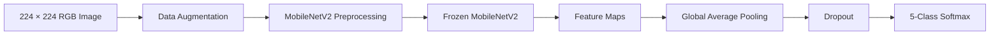

---

## 16. Why Use Global Average Pooling?

Suppose the backbone output has shape:

$$
7 \times 7 \times 1280
$$

`GlobalAveragePooling2D` calculates the average of every $7 \times 7$ feature map.

The output becomes:

$$
1280
$$

Instead of flattening all values:

$$
7 \times 7 \times 1280 = 62{,}720
$$

Global average pooling:

* Reduces the number of parameters
* Lowers overfitting risk
* Produces a compact feature vector
* Works well with pretrained convolutional networks

---

## 17. Compile the Feature-Extraction Model

```python
model.compile(
    optimizer=tf.keras.optimizers.Adam(
        learning_rate=1e-3
    ),
    loss="categorical_crossentropy",
    metrics=["accuracy"]
)
```

Inspect the model:

```python
model.summary()
```

The summary should show:

* Frozen parameters in the backbone
* Trainable parameters in the new classification head

Check directly:

```python
print("Base model trainable:", base_model.trainable)
print("Trainable weights:", len(model.trainable_weights))
```

---

## 18. Train the New Head

Use callbacks to control training:

```python
callbacks = [
    tf.keras.callbacks.EarlyStopping(
        monitor="val_loss",
        patience=3,
        restore_best_weights=True
    ),
    tf.keras.callbacks.ReduceLROnPlateau(
        monitor="val_loss",
        factor=0.2,
        patience=2,
        min_lr=1e-6
    ),
    tf.keras.callbacks.ModelCheckpoint(
        "best_feature_extractor.keras",
        monitor="val_loss",
        save_best_only=True
    )
]
```

Train:

```python
initial_epochs = 10

history = model.fit(
    train_ds,
    validation_data=validation_ds,
    epochs=initial_epochs,
    callbacks=callbacks
)
```

During this stage:

```text
Pretrained backbone: frozen
New classification head: trainable
```

The pretrained model therefore acts as a fixed feature extractor.

---

## 19. Visualize Learning Curves

```python
import matplotlib.pyplot as plt

train_accuracy = history.history["accuracy"]
validation_accuracy = history.history["val_accuracy"]

train_loss = history.history["loss"]
validation_loss = history.history["val_loss"]

epochs = range(1, len(train_accuracy) + 1)

plt.figure(figsize=(8, 5))
plt.plot(epochs, train_accuracy, label="Training Accuracy")
plt.plot(epochs, validation_accuracy, label="Validation Accuracy")
plt.xlabel("Epoch")
plt.ylabel("Accuracy")
plt.title("Feature Extraction Accuracy")
plt.legend()
plt.tight_layout()
plt.show()
```

Plot loss separately:

```python
plt.figure(figsize=(8, 5))
plt.plot(epochs, train_loss, label="Training Loss")
plt.plot(epochs, validation_loss, label="Validation Loss")
plt.xlabel("Epoch")
plt.ylabel("Loss")
plt.title("Feature Extraction Loss")
plt.legend()
plt.tight_layout()
plt.show()
```

Possible overfitting pattern:

```text
Training accuracy:   continues increasing
Validation accuracy: stops improving
Validation loss:     begins increasing
```

---

## 20. Fine-Tuning

Once the new head has learned reasonable weights, unfreeze part of the backbone.

```python
base_model.trainable = True
```

Do not necessarily train every layer.

```python
fine_tune_at = 100

for layer in base_model.layers[:fine_tune_at]:
    layer.trainable = False
```

This configuration means:

```text
Layers before index 100: frozen
Layers after index 100: trainable
```

Recompile the model with a much smaller learning rate:

```python
model.compile(
    optimizer=tf.keras.optimizers.Adam(
        learning_rate=1e-5
    ),
    loss="categorical_crossentropy",
    metrics=["accuracy"]
)
```

Recompilation is essential because trainable-layer changes are applied during compilation.

Continue training:

```python
fine_tune_epochs = 10
total_epochs = initial_epochs + fine_tune_epochs

fine_tune_history = model.fit(
    train_ds,
    validation_data=validation_ds,
    initial_epoch=len(history.history["loss"]),
    epochs=total_epochs,
    callbacks=callbacks
)
```

---

## 21. Why Use a Small Learning Rate?

Pretrained weights already contain useful knowledge.

A large learning rate may destroy that knowledge rapidly.

This problem is sometimes described as **catastrophic forgetting**.

Feature-extraction stage:

$$
\eta = 10^{-3}
$$

Fine-tuning stage:

$$
\eta = 10^{-5}
$$

A small learning rate allows gradual target-domain adaptation.

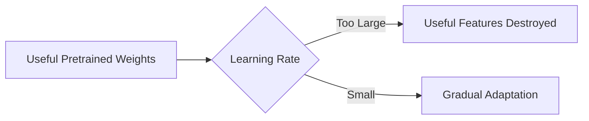

---

## 22. Batch Normalization Caution

Some pretrained models contain Batch Normalization layers.

During feature extraction, call the frozen backbone with:

```python
x = base_model(
    x,
    training=False
)
```

This keeps Batch Normalization behavior stable.

Careless Batch Normalization updates can damage performance when:

* The target batch size is small.
* The target dataset is small.
* The target distribution differs from the source distribution.

When fine-tuning, test whether Batch Normalization layers should remain frozen.

Example:

```python
for layer in base_model.layers:
    if isinstance(
        layer,
        tf.keras.layers.BatchNormalization
    ):
        layer.trainable = False
```

---

## 23. Evaluation on the Test Set

The test set should remain untouched during model development.

```python
test_loss, test_accuracy = model.evaluate(
    test_ds
)

print(f"Test loss: {test_loss:.4f}")
print(f"Test accuracy: {test_accuracy:.4f}")
```

Do not use the test set to:

* Select the backbone
* Choose augmentation settings
* Choose the learning rate
* Decide when to stop training
* Select how many layers to unfreeze

Those choices belong to the validation set.

---

## 24. Confusion Matrix

Collect predictions:

```python
import numpy as np

probabilities = model.predict(test_ds)
predicted_labels = np.argmax(
    probabilities,
    axis=1
)

true_labels = np.concatenate(
    [
        np.argmax(labels.numpy(), axis=1)
        for _, labels in test_ds
    ]
)
```

Plot a confusion matrix:

```python
from sklearn.metrics import ConfusionMatrixDisplay
import matplotlib.pyplot as plt

class_names = test_ds.class_names

ConfusionMatrixDisplay.from_predictions(
    true_labels,
    predicted_labels,
    display_labels=class_names,
    normalize="true",
    xticks_rotation=45
)

plt.title("Normalized Confusion Matrix")
plt.tight_layout()
plt.show()
```

A confusion matrix can reveal:

* Which classes are difficult
* Which classes are confused with each other
* Whether a minority class has poor recall
* Whether the dataset contains ambiguous labels

---

## 25. Classification Report

```python
from sklearn.metrics import classification_report

print(
    classification_report(
        true_labels,
        predicted_labels,
        target_names=class_names,
        digits=3
    )
)
```

Evaluate:

* Precision
* Recall
* F1-score
* Per-class support
* Macro F1
* Weighted F1

Accuracy alone may be misleading when classes are imbalanced.

---

## 26. Compare Against Training from Scratch

Transfer Learning should be compared with a baseline.

### Small CNN Baseline

```python
scratch_model = tf.keras.Sequential(
    [
        tf.keras.Input(
            shape=(224, 224, 3)
        ),
        tf.keras.layers.Rescaling(
            1.0 / 255
        ),
        tf.keras.layers.Conv2D(
            32,
            3,
            activation="relu"
        ),
        tf.keras.layers.MaxPooling2D(),
        tf.keras.layers.Conv2D(
            64,
            3,
            activation="relu"
        ),
        tf.keras.layers.MaxPooling2D(),
        tf.keras.layers.Conv2D(
            128,
            3,
            activation="relu"
        ),
        tf.keras.layers.GlobalAveragePooling2D(),
        tf.keras.layers.Dropout(0.20),
        tf.keras.layers.Dense(
            NUM_CLASSES,
            activation="softmax"
        )
    ]
)
```

Compile:

```python
scratch_model.compile(
    optimizer="adam",
    loss="categorical_crossentropy",
    metrics=["accuracy"]
)
```

Compare both approaches:

| Model                  | Validation Accuracy | Test Accuracy | Training Time |  Parameters Trained |
| ---------------------- | ------------------: | ------------: | ------------: | ------------------: |
| Small CNN              |                0.78 |          0.75 |    12 minutes |                 All |
| Frozen MobileNetV2     |                0.91 |          0.89 |     4 minutes |           Head only |
| Fine-Tuned MobileNetV2 |                0.94 |          0.92 |     9 minutes | Final blocks + head |

The actual numbers depend on the dataset and hardware. Do not invent performance results in a real project.

---

## 27. Precomputing Features

When the backbone is completely frozen, its output for each image does not change between epochs.

Therefore, features can be precomputed:

```text
image
  ↓
frozen backbone
  ↓
feature vector
  ↓
save to disk
```

Training then becomes:

```text
saved feature vectors
       ↓
small classifier
       ↓
predictions
```

Advantages:

* Faster repeated experiments
* Lower GPU usage
* Faster head training
* Useful for small datasets

Disadvantages:

* Online augmentation cannot easily produce new backbone features each epoch.
* More storage may be required.
* The backbone cannot be fine-tuned.

Precomputing features is most suitable when:

* The backbone remains frozen.
* Augmentation is fixed or already applied.
* Many classifiers will be tested on the same representation.

---

## 28. Transfer Learning Beyond Computer Vision

### 28.1 Natural Language Processing

Modern NLP commonly uses pretrained language models.

```text
Large text corpus
      ↓
BERT / RoBERTa / T5 pretraining
      ↓
Fine-tuning
      ↓
Sentiment analysis / NER / classification / QA
```

Example:

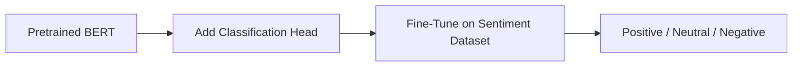

---

### 28.2 Audio

A speech model may be adapted to:

* Keyword spotting
* Speaker identification
* Emotion recognition
* Wake-word detection
* Audio-event classification

---

### 28.3 Time Series

A pretrained sequence encoder may be reused for:

* Fault detection
* Forecasting
* Anomaly detection
* Sensor classification

Transfer is more difficult when the source and target time-series distributions differ significantly.

---

### 28.4 Multimodal Models

Vision-language models can be transferred to:

* Image retrieval
* Zero-shot classification
* Visual question answering
* Captioning
* Product search

---

## 29. Self-Supervised Pretraining

Pretraining does not always require manual labels.

A self-supervised model learns from the structure of the data itself.

Examples:

### Images

* Predicting missing image regions
* Contrastive learning
* Matching augmented views
* Masked image modeling

### Text

* Predicting masked words
* Predicting the next token
* Reconstructing corrupted text

### Audio

* Predicting masked acoustic units
* Contrastive speech representation learning

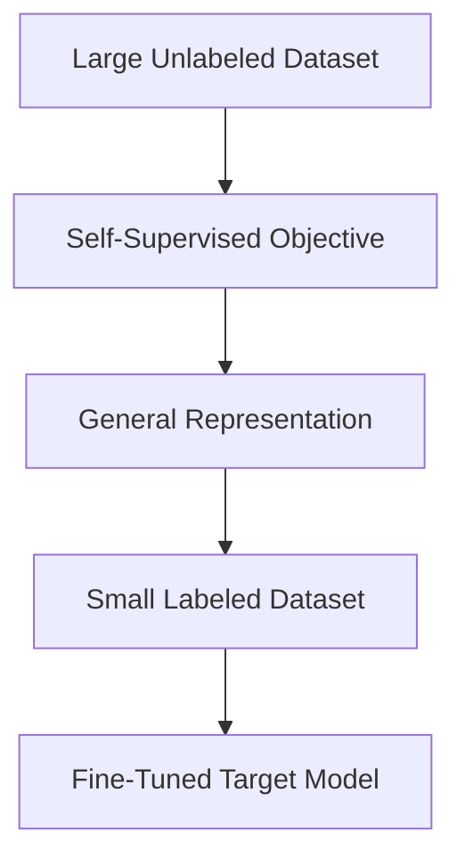

A major advantage is that unlabeled data is usually much easier to collect than labeled data.

---

## 30. Domain Shift

Transfer Learning works best when source and target domains share relevant structure.

Example of small domain shift:

```text
Source:
General photographs of animals

Target:
Photographs of local pet breeds
```

Example of large domain shift:

```text
Source:
Natural RGB photographs

Target:
Thermal industrial images
```

The greater the domain difference, the less useful some pretrained features may become.

Possible responses:

* Fine-tune more layers.
* Use a domain-specific pretrained model.
* Collect more target data.
* Apply domain adaptation.
* Modify the input layer.
* Use self-supervised pretraining on target-domain data.

---

## 31. Different Input Shapes or Channels

A pretrained image model may expect:

$$
224 \times 224 \times 3
$$

However, the target input may be:

* Grayscale
* RGBA
* RGB-D
* Multispectral
* Hyperspectral

### Grayscale to RGB

Repeat the grayscale channel:

```python
image = tf.image.grayscale_to_rgb(image)
```

### Four-Channel Input

For RGB-D data, possible strategies include:

* Learn a projection from four channels to three channels.
* Modify the first convolutional layer.
* Train a separate depth encoder.
* Fuse RGB and depth features later.

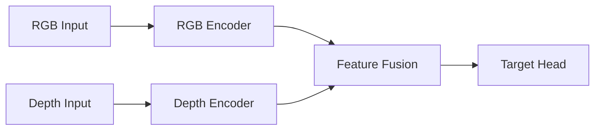

Changes to the input representation should be tested carefully because the pretrained model expects a particular input distribution.

---

## 32. Negative Transfer

Transfer Learning does not always improve performance.

**Negative transfer** occurs when transferred knowledge harms the target task.

Possible causes:

* Source and target domains are unrelated.
* Pretrained features encode irrelevant patterns.
* Fine-tuning uses an excessively large learning rate.
* Too many layers are frozen.
* Too many layers are unfrozen with too little data.
* Source preprocessing is not reproduced.
* The target labels depend on features absent from the source data.

Example:

```text
Source task:
Classifying natural landscape photographs

Target task:
Classifying encrypted binary signals
```

The learned visual features may provide little or no benefit.

Always compare against:

* Random initialization
* A simple baseline
* Another pretrained backbone

---

## 33. Common Mistakes

### Mistake 1: Forgetting Model-Specific Preprocessing

Different pretrained models expect different input normalization.

Examples include:

* Scaling to $[0,1]$
* Scaling to $[-1,1]$
* Mean subtraction
* Channel-specific standardization

Use the preprocessing function supplied with the architecture:

```python
tf.keras.applications.mobilenet_v2.preprocess_input
```

---

### Mistake 2: Using `include_top=True`

The original classification head predicts the source classes.

For a new task, normally use:

```python
include_top=False
```

Then add a new target-specific head.

---

### Mistake 3: Fine-Tuning Before Training the New Head

A randomly initialized classification head can produce unstable gradients that damage pretrained features.

Safer sequence:

```text
Freeze backbone
      ↓
Train new head
      ↓
Unfreeze selected layers
      ↓
Fine-tune with small learning rate
```

---

### Mistake 4: Forgetting to Recompile

After changing `layer.trainable`, recompile the model:

```python
model.compile(...)
```

Otherwise, the optimizer may not use the updated trainable-variable configuration.

---

### Mistake 5: Using a Large Fine-Tuning Learning Rate

A large learning rate can destroy pretrained knowledge.

Use a significantly smaller learning rate for fine-tuning.

---

### Mistake 6: Ignoring Overfitting

A pretrained model can still overfit a small target dataset.

Monitor:

* Training loss
* Validation loss
* Training accuracy
* Validation accuracy
* Per-class metrics

Use:

* Data augmentation
* Dropout
* Weight decay
* Early stopping
* Fewer trainable layers

---

### Mistake 7: Evaluating Only Accuracy

Inspect:

* Precision
* Recall
* F1-score
* Confusion matrix
* Minority-class performance
* Error examples

---

### Mistake 8: Using the Test Set During Development

The test set must be reserved for final evaluation.

Use a validation set for model selection and hyperparameter tuning.

---

### Mistake 9: Unfreezing Too Many Layers with Too Little Data

This increases:

* Variance
* Compute cost
* Overfitting risk
* Catastrophic forgetting

Begin conservatively and unfreeze more layers only when validation evidence supports it.

---

### Mistake 10: Assuming the Latest or Largest Model Is Always Best

A smaller backbone may provide:

* Faster inference
* Lower memory usage
* Easier mobile deployment
* Similar target-task performance

Model selection should consider both quality and operational cost.

---

## 34. Model Selection Considerations

| Model              | Approximate Characteristic              | Suitable Use                 |
| ------------------ | --------------------------------------- | ---------------------------- |
| MobileNet          | Lightweight and fast                    | Mobile and edge deployment   |
| EfficientNet       | Strong accuracy-efficiency balance      | General applications         |
| ResNet             | Stable and widely supported             | Strong baseline              |
| DenseNet           | Feature reuse through dense connections | Medical and visual tasks     |
| VGG                | Simple but parameter-heavy              | Education and legacy systems |
| Vision Transformer | Strong with large-scale pretraining     | Modern vision workloads      |

Choose a backbone based on:

* Validation quality
* Inference speed
* Hardware
* Model size
* Memory usage
* Input resolution
* Licensing
* Deployment environment

---

## 35. Saving the Model

Save the complete model:

```python
model.save(
    "flower_transfer_model.keras"
)
```

Load it later:

```python
loaded_model = tf.keras.models.load_model(
    "flower_transfer_model.keras"
)
```

Store additional metadata:

```json
{
  "model_name": "MobileNetV2",
  "input_shape": [224, 224, 3],
  "classes": [
    "daisy",
    "dandelion",
    "roses",
    "sunflowers",
    "tulips"
  ],
  "preprocessing": "mobilenet_v2.preprocess_input",
  "training_strategy": "feature extraction then fine-tuning"
}
```

---

## 36. Prediction Function

```python
import numpy as np
import tensorflow as tf

def predict_image(
    model,
    image_path: str,
    class_names: list[str]
) -> dict:
    image = tf.keras.utils.load_img(
        image_path,
        target_size=(224, 224)
    )

    image_array = tf.keras.utils.img_to_array(
        image
    )

    image_array = tf.expand_dims(
        image_array,
        axis=0
    )

    probabilities = model.predict(
        image_array,
        verbose=0
    )[0]

    predicted_index = int(
        np.argmax(probabilities)
    )

    return {
        "class": class_names[predicted_index],
        "confidence": float(
            probabilities[predicted_index]
        )
    }
```

Usage:

```python
result = predict_image(
    model=model,
    image_path="sample_flower.jpg",
    class_names=class_names
)

print(result)
```

---

## 37. Deployment Architecture

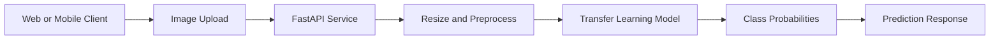

Possible deployment targets:

* FastAPI
* Flask
* TensorFlow Serving
* Docker
* Cloud Run
* AWS Lambda
* Mobile application
* TensorFlow Lite
* Edge device

---

## 38. Production Monitoring

Track:

* Prediction latency
* Error rate
* Input resolution
* Class distribution
* Confidence distribution
* Low-confidence predictions
* Data drift
* Per-class performance on newly labeled samples
* Model version
* Input preprocessing version

Potential drift example:

```text
Training images:
Clear daylight flower photographs

Production images:
Low-light mobile photographs with cluttered backgrounds
```

The model may require:

* Better augmentation
* More production-like training examples
* Domain-specific fine-tuning
* Input-quality validation

---

## 39. Practical Exercise

Build an image classifier using:

* A small CNN trained from scratch
* A frozen pretrained backbone
* A partially fine-tuned pretrained backbone

Suggested datasets:

* Flowers
* Cats and dogs
* Food categories
* Plant diseases
* Waste classification
* Product images
* Marine species
* Custom phone photographs

### Required Steps

1. Inspect the dataset.
2. Check class balance.
3. Create train, validation, and test sets.
4. Visualize random images.
5. Train a small CNN from scratch.
6. Load a pretrained model.
7. Replace its classification head.
8. Freeze the backbone.
9. Train the new head.
10. Plot training and validation curves.
11. Fine-tune the final layers.
12. Evaluate the test set.
13. Plot a confusion matrix.
14. Compare training time and performance.
15. Document at least one failure case.

---

## 40. Suggested Notebook Structure

```text
01. Problem Definition
02. Dataset Description
03. Data Quality Checks
04. Class Distribution
05. Image Visualization
06. Train / Validation / Test Split
07. Data Augmentation
08. Small CNN Baseline
09. Load Pretrained Backbone
10. Feature Extraction
11. Learning Curves
12. Fine-Tuning
13. Test Evaluation
14. Confusion Matrix
15. Error Analysis
16. Model Comparison
17. Save and Load Model
18. API or Deployment Example
19. Limitations
20. Next Experiments
```

---

## 41. Mini Project

### Project: Small CNN vs Transfer Learning

Build an image-classification system that compares:

1. A CNN trained from scratch
2. A frozen pretrained model
3. A partially fine-tuned pretrained model

### Required Models

```text
Custom CNN
vs.
MobileNetV2 feature extractor
vs.
Fine-tuned MobileNetV2
```

Alternative backbones:

* ResNet50
* EfficientNetB0
* DenseNet121
* VGG16

### Required Metrics

* Training accuracy
* Validation accuracy
* Test accuracy
* Macro F1-score
* Per-class recall
* Confusion matrix
* Training duration
* Inference latency
* Number of trainable parameters
* Model file size

### Model Comparison Table

| Model               | Test Accuracy | Macro F1 | Training Time | Trainable Parameters | Model Size |
| ------------------- | ------------: | -------: | ------------: | -------------------: | ---------: |
| Small CNN           |             — |        — |             — |                    — |          — |
| Frozen Backbone     |             — |        — |             — |                    — |          — |
| Fine-Tuned Backbone |             — |        — |             — |                    — |          — |

Fill the table using measured results rather than estimated values.

---

## 42. Portfolio Architecture

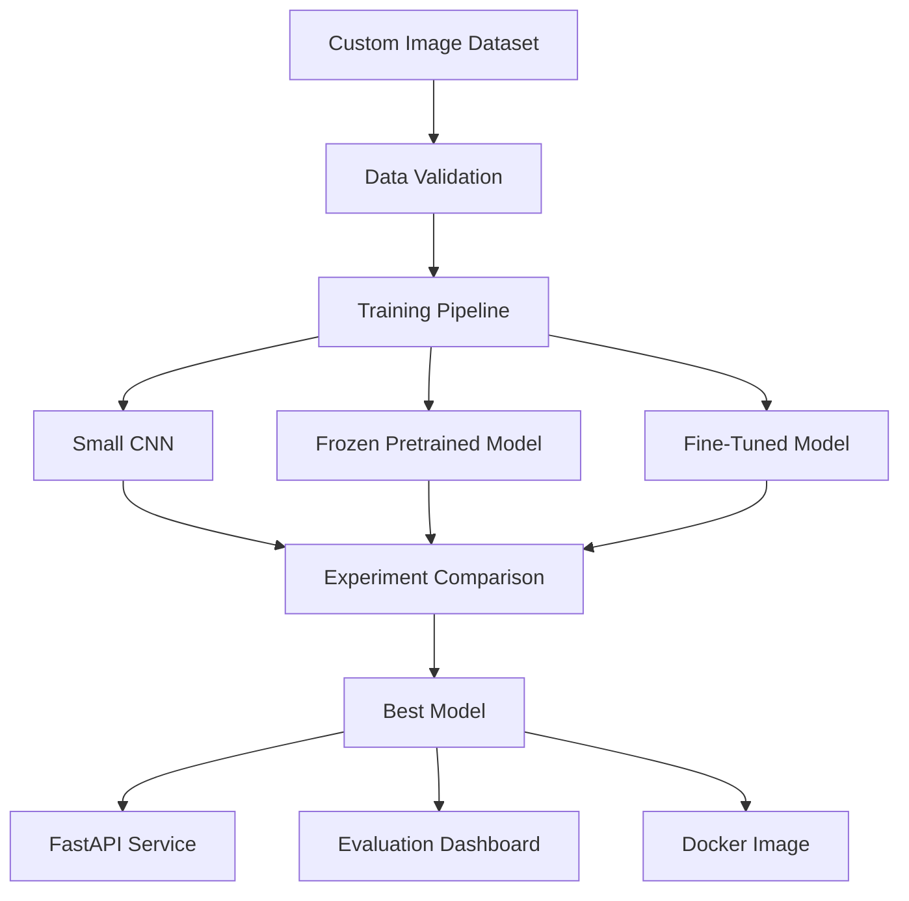

Portfolio deliverables:

* Jupyter notebook
* Training script
* Saved model
* Confusion matrix
* Learning curves
* Example predictions
* Model comparison table
* FastAPI endpoint
* Dockerfile
* README
* Limitations section

---

## 43. Completion Checklist

* [ ] I can explain Transfer Learning in one or two minutes.
* [ ] I understand pretraining and fine-tuning.
* [ ] I can explain why early neural-network layers are reusable.
* [ ] I can remove an original classification head.
* [ ] I can freeze a pretrained backbone.
* [ ] I can train a new classification head.
* [ ] I can selectively unfreeze final layers.
* [ ] I know why fine-tuning requires a small learning rate.
* [ ] I can plot training and validation curves.
* [ ] I can create and interpret a confusion matrix.
* [ ] I have compared Transfer Learning with training from scratch.
* [ ] I understand domain shift and negative transfer.
* [ ] I have created a notebook, model, API, dashboard, or portfolio artifact.
* [ ] I have recorded at least one caveat or unanswered question.

---

## 44. Related Outcome

After completing this lesson, you should understand neural networks, CNNs, Transformers, pretrained representations, and Transfer Learning at a practical level.

You should be able to determine:

* When to reuse a pretrained model
* Which layers to freeze
* When to begin fine-tuning
* How to select a learning rate
* How to evaluate whether transfer was beneficial
* How to deploy the resulting model

---

## 45. Summary

Transfer Learning reuses knowledge learned from a large source task to improve performance on a related target task.

The standard workflow is:

```text
load pretrained model
        ↓
remove original output layer
        ↓
add target-specific head
        ↓
freeze pretrained backbone
        ↓
train new head
        ↓
evaluate validation performance
        ↓
unfreeze selected layers
        ↓
fine-tune with small learning rate
        ↓
evaluate on untouched test data
```

The amount of target data influences how much of the model should be trained:

```text
Very little data:
Train only the new head

Moderate data:
Fine-tune the final layers

Large data:
Fine-tune most or all layers
```

Transfer Learning can:

* Reduce training time
* Reduce computational cost
* Improve sample efficiency
* Improve performance on small datasets
* Provide a strong baseline quickly

However, it can fail because of:

* Domain mismatch
* Incorrect preprocessing
* Excessive fine-tuning
* Large learning rates
* Label noise
* Class imbalance
* Data leakage
* Negative transfer

The correct question is not simply:

> Can I use a pretrained model?

The more useful questions are:

> What knowledge does the pretrained model contain?

> Is that knowledge relevant to my target problem?

> How much of the model should be allowed to adapt?

> Does Transfer Learning outperform a properly evaluated baseline?

---

## 46. Practice Questions

1. What is the difference between pretraining and fine-tuning?
2. Why is the original classification head usually removed?
3. Why are early CNN layers more transferable than later layers?
4. When should only the new head be trained?
5. When should more pretrained layers be unfrozen?
6. Why is a small learning rate used during fine-tuning?
7. What is negative transfer?
8. Why must the correct model-specific preprocessing be used?
9. Why should the model be recompiled after changing trainable layers?
10. What evidence would show that Transfer Learning is better than training from scratch?
11. Why can Batch Normalization cause problems during fine-tuning?
12. How would you adapt a three-channel model to grayscale images?
13. How does source–target domain similarity affect Transfer Learning?
14. What should be monitored after deployment?

---

## 47. Further Experiment Ideas

* Compare MobileNetV2, ResNet50, and EfficientNetB0.
* Compare freezing all layers with freezing only early layers.
* Test several fine-tuning learning rates.
* Compare global average pooling with flattening.
* Add different levels of augmentation.
* Test class-weighted loss.
* Evaluate model calibration.
* Measure inference time on CPU and GPU.
* Convert the best model to TensorFlow Lite.
* Test on real mobile-phone photographs.
* Fine-tune a self-supervised backbone.
* Compare ImageNet pretraining with domain-specific pretraining.
* Add Grad-CAM visualizations to inspect model attention.
* Build a Dockerized FastAPI service.
* Add automated data and model tests.

---

## References from the Supplied Tutorials

The explanations of transferring learned representations, feature extraction, fine-tuning, few-shot learning, and adapting model inputs and outputs are reflected in the supplied Transfer Learning lecture.

The MobileNet-based flower-classification workflow, including freezing the pretrained network and replacing the original output layer, is reflected in the supplied TensorFlow tutorial.

The Keras workflow for removing a pretrained classification layer, freezing layers, applying model-specific preprocessing, and training a new classifier is reflected in the supplied practical tutorial.

The EfficientNet example, data augmentation, global average pooling, dropout, binary and multiclass output choices, and custom-dataset organization are reflected in the supplied image-classification tutorial.
