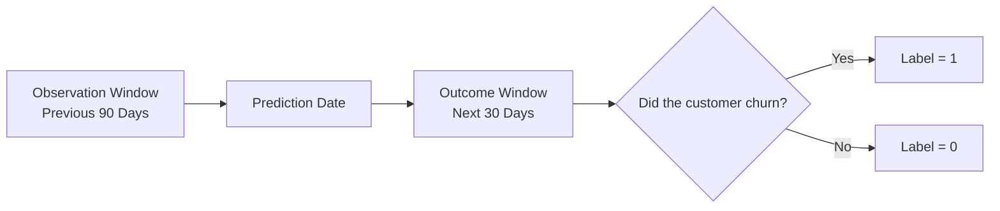
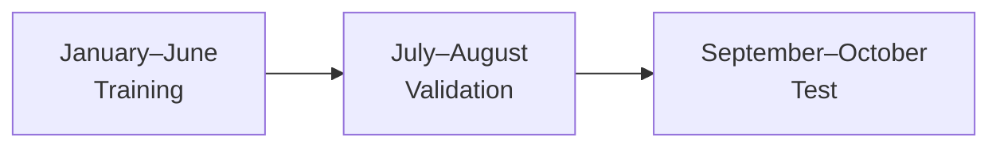
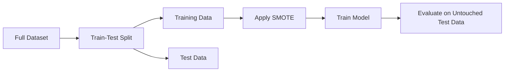
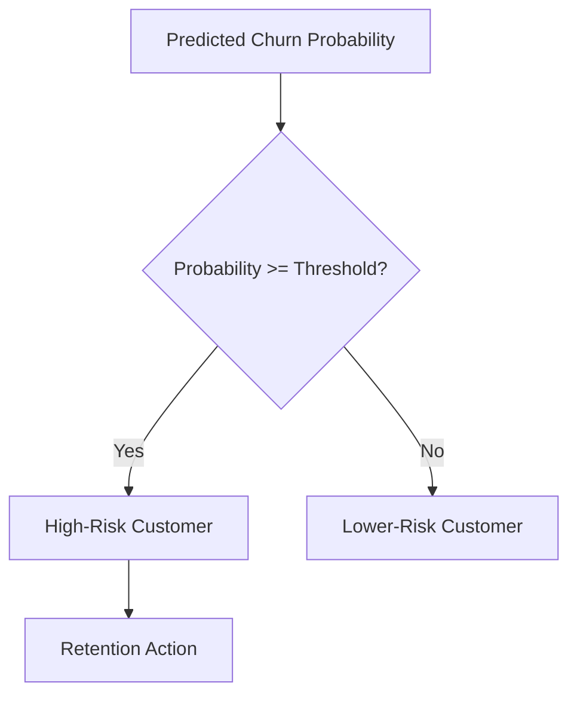
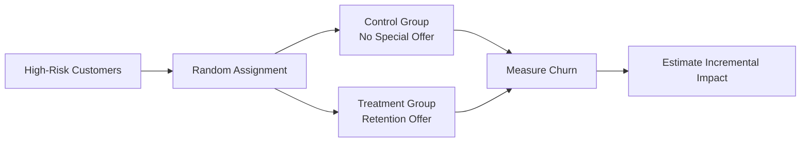
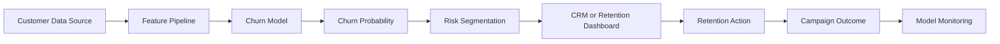

# 001 — Customer Churn Prediction

**Course:** 05 — Capstone and Portfolio
**Module:** Module 09 — Capstone Projects
**Content Group:** Capstone Options
**Roadmap Source:** Capstone Projects / Capstone Options
**Lesson Type:** Capstone
**Order in Module:** 001
**Suggested Duration:** 24 minutes

---

## 1. Overview

**Customer Churn Prediction** is the process of identifying customers who are likely to stop using a product or service.

Depending on the business, churn may mean:

* Canceling a subscription
* Closing a bank account
* Switching to another provider
* Deactivating a membership
* Not purchasing anything for a defined period
* Uninstalling or abandoning an application

A churn prediction project combines:

* Business understanding
* Exploratory Data Analysis
* Data preprocessing
* Feature engineering
* Classification modeling
* Model evaluation
* Explainability
* Business decision-making
* API or application deployment

This is a strong portfolio project because it demonstrates both **technical modeling skills** and the ability to translate predictions into business actions.

A useful churn system should answer two questions:

1. **Which customers are most likely to leave?**
2. **What should the business do about them?**

---

## 2. Learning Objectives

After completing this lesson, you should be able to:

* Explain customer churn prediction in your own words.
* Define churn for a specific business problem.
* Recognize churn prediction as a supervised classification task.
* Prepare historical customer data without introducing data leakage.
* Perform EDA and identify potential churn drivers.
* Train and compare classification models.
* Select suitable metrics for an imbalanced dataset.
* Convert churn probabilities into business actions.
* Deploy a trained model through an API or web application.
* Present the project as a reproducible portfolio artifact.

---

## 3. Business Problem

Acquiring new customers is often more expensive than retaining existing ones. However, contacting every customer with discounts, messages, or retention offers is also expensive.

Instead of applying the same campaign to the entire customer base, a business can use a churn model to identify customers with the highest risk.

### Without churn prediction

```text
All Customers
      |
      v
Mass Retention Campaign
      |
      v
High Cost + Low Personalization
```

### With churn prediction

```text
All Customers
      |
      v
Churn Prediction Model
      |
      v
High-Risk Customer Segment
      |
      v
Targeted Retention Campaign
```

This allows the organization to focus its retention budget on customers who are most likely to leave.

The business motivation, historical-label construction, class imbalance, domain-driven feature selection, and the need to track experiments are common themes in practical churn projects.

---

## 4. Problem Formulation

Customer churn prediction is usually a **binary classification problem**.

Let:

$$
y =
\begin{cases}
1, & \text{if the customer churns} \\
0, & \text{if the customer remains active}
\end{cases}
$$

The machine-learning model estimates:

$$
P(y=1 \mid X)
$$

where:

* \(X\) represents customer features.
* \(y=1\) represents churn.
* \(P(y=1 \mid X)\) is the predicted churn probability.

For example:

```text
Customer A -> Churn Probability: 0.12
Customer B -> Churn Probability: 0.81
Customer C -> Churn Probability: 0.56
```

A business may decide to contact customers whose churn probability is greater than a selected threshold.

```text
if churn_probability >= threshold:
    send_retention_offer
```

---

## 5. Define Churn Before Modeling

The model cannot be useful unless the churn label has a clear business definition.

### Example definitions

#### Telecommunications

A customer is considered churned when they cancel their subscription.

#### Banking

A customer is considered churned when they close their account or become inactive for several months.

#### E-commerce

A customer is considered churned when they make no purchase within a defined period.

#### Software as a Service

A customer is considered churned when they cancel or fail to renew their subscription.

### Churn window

A churn label should include a future prediction window.

Example:

> Use customer behavior from the previous 90 days to predict whether the customer will churn during the next 30 days.



This temporal structure is essential because the model must only use information that would have been available at prediction time.

---

## 6. End-to-End Project Workflow


A typical practical implementation follows the sequence of data collection, EDA, preprocessing, train-test splitting, cross-validation, model comparison, prediction, and model persistence.

A portfolio-oriented version can extend the workflow into a Streamlit application or another interactive interface.

---

## 7. Example Dataset

A churn dataset may contain one row per customer.

| Feature               | Type        | Description                              |
| --------------------- | ----------- | ---------------------------------------- |
| `customer_id`         | Identifier  | Unique customer identifier               |
| `tenure_months`       | Numerical   | Number of months as a customer           |
| `monthly_charges`     | Numerical   | Monthly service cost                     |
| `total_charges`       | Numerical   | Total amount paid                        |
| `contract_type`       | Categorical | Monthly, yearly, or multi-year contract  |
| `payment_method`      | Categorical | Credit card, bank transfer, cash, etc.   |
| `support_tickets_90d` | Numerical   | Recent number of support requests        |
| `login_frequency_30d` | Numerical   | Recent product usage                     |
| `late_payments_6m`    | Numerical   | Number of recent late payments           |
| `has_premium_plan`    | Binary      | Whether the customer uses a premium plan |
| `churn`               | Target      | Whether the customer left                |

### Features that should usually be excluded

Identifiers such as `customer_id` normally do not contain generalizable predictive information.

Other suspicious columns include:

* Customer name
* Phone number
* Email address
* Account-closing date
* Cancellation reason recorded after churn
* Final account status created after churn

Some of these fields may cause **data leakage**.

---

## 8. Data Leakage

Data leakage occurs when the training data contains information that would not be available when the prediction is made.

### Leakage example

Suppose the goal is to predict churn on January 1.

The following feature would be invalid:

```text
account_closed_on_january_15 = True
```

The model cannot know this value on January 1.

### Correct design


### Incorrect design


Leakage often produces excellent validation results but poor production performance.

---

## 9. Exploratory Data Analysis

EDA helps you understand:

* Dataset size
* Missing values
* Duplicate rows
* Target distribution
* Numerical distributions
* Categorical distributions
* Outliers
* Relationships with churn
* Potential leakage
* Possible data-quality problems

### Initial inspection

```python
import pandas as pd

df = pd.read_csv("data/raw/customer_churn.csv")

print(df.shape)
print(df.head())
print(df.info())
print(df.isna().sum())
print(df.duplicated().sum())
```

### Check churn distribution

```python
churn_distribution = df["churn"].value_counts(normalize=True)
print(churn_distribution)
```

Example output:

```text
0    0.82
1    0.18
```

This means:

* 82% of customers remained active.
* 18% of customers churned.

The dataset is imbalanced because the churn class is much smaller.

### Questions to explore

* Do new customers churn more frequently?
* Are monthly contracts associated with higher churn?
* Does churn increase with monthly charges?
* Are customers with many support tickets more likely to leave?
* Does low product usage indicate churn risk?
* Are late payments associated with churn?
* Are some customer groups underrepresented?

---

## 10. Useful Visualizations

### Churn distribution

```python
import matplotlib.pyplot as plt

df["churn"].value_counts().plot(kind="bar")
plt.title("Customer Churn Distribution")
plt.xlabel("Churn")
plt.ylabel("Number of Customers")
plt.show()
```

### Churn rate by contract type

```python
contract_churn = (
    df.groupby("contract_type")["churn"]
    .mean()
    .sort_values(ascending=False)
)

contract_churn.plot(kind="bar")
plt.title("Churn Rate by Contract Type")
plt.ylabel("Churn Rate")
plt.show()
```

### Monthly charges by churn status

```python
df.boxplot(column="monthly_charges", by="churn")
plt.title("Monthly Charges by Churn Status")
plt.suptitle("")
plt.xlabel("Churn")
plt.ylabel("Monthly Charges")
plt.show()
```

### Correlation does not imply causation

A feature may be associated with churn without directly causing it.

For example:

```text
Monthly Contract -> Higher Churn
```

This does not automatically prove that monthly contracts cause churn. The relationship may be influenced by tenure, price, customer type, or other factors.

---

## 11. Feature Engineering

Feature engineering converts raw customer data into signals that are easier for a model to learn.

### Behavioral features

```text
Number of logins during the last 30 days
Number of transactions during the last 90 days
Days since the last product interaction
Percentage change in usage
Number of failed payments
```

### Customer-service features

```text
Support tickets during the last 90 days
Average ticket resolution time
Number of complaints
Customer satisfaction score
```

### Financial features

```text
Monthly charges
Total spending
Average transaction amount
Number of late payments
Discount usage
```

### Relationship features

```text
Customer tenure
Contract type
Number of subscribed services
Loyalty membership
Automatic payment status
```

### Recency, Frequency, and Monetary features

A common framework is RFM:

$$
\text{Recency} = \text{Days since last activity}
$$

$$
\text{Frequency} = \text{Number of activities in a period}
$$

$$
\text{Monetary} = \text{Total customer spending}
$$

These features can summarize customer engagement.

---

## 12. Preprocessing Pipeline

Typical preprocessing steps include:

1. Remove identifiers.
2. Correct data types.
3. Handle missing values.
4. Encode categorical variables.
5. Scale numerical variables when required.
6. Split data into training, validation, and test sets.
7. Handle class imbalance only on the training data.

### Example with Scikit-learn

```python
from sklearn.compose import ColumnTransformer
from sklearn.impute import SimpleImputer
from sklearn.pipeline import Pipeline
from sklearn.preprocessing import OneHotEncoder, StandardScaler

numerical_features = [
    "tenure_months",
    "monthly_charges",
    "total_charges",
    "support_tickets_90d",
]

categorical_features = [
    "contract_type",
    "payment_method",
]

numerical_pipeline = Pipeline(
    steps=[
        ("imputer", SimpleImputer(strategy="median")),
        ("scaler", StandardScaler()),
    ]
)

categorical_pipeline = Pipeline(
    steps=[
        ("imputer", SimpleImputer(strategy="most_frequent")),
        (
            "encoder",
            OneHotEncoder(handle_unknown="ignore"),
        ),
    ]
)

preprocessor = ColumnTransformer(
    transformers=[
        ("numerical", numerical_pipeline, numerical_features),
        ("categorical", categorical_pipeline, categorical_features),
    ]
)
```

Using a pipeline helps ensure that the same transformations are applied during training and inference.

---

## 13. Train, Validation, and Test Splits

A simple random split may be acceptable for static datasets.

```python
from sklearn.model_selection import train_test_split

X = df.drop(columns=["churn", "customer_id"])
y = df["churn"]

X_train, X_test, y_train, y_test = train_test_split(
    X,
    y,
    test_size=0.20,
    stratify=y,
    random_state=42,
)
```

The `stratify=y` argument preserves the churn ratio in both datasets.

### Time-based split

For production churn prediction, a time-based split is often more realistic.

```text
Older Customers and Outcomes -> Training Set
More Recent Customers         -> Validation Set
Newest Customers              -> Test Set
```



This evaluates whether the model generalizes to future periods.

---

## 14. Baseline Model

Always create a simple baseline before training advanced models.

### Majority-class baseline

If 82% of customers do not churn, a model that always predicts “no churn” achieves:

$$
\text{Accuracy} = 82\%
$$

However, it detects zero churned customers.

### Logistic regression baseline

```python
from sklearn.linear_model import LogisticRegression
from sklearn.pipeline import Pipeline

baseline_model = Pipeline(
    steps=[
        ("preprocessor", preprocessor),
        (
            "classifier",
            LogisticRegression(
                class_weight="balanced",
                max_iter=1000,
                random_state=42,
            ),
        ),
    ]
)

baseline_model.fit(X_train, y_train)
```

Logistic regression is valuable because it is:

* Fast
* Interpretable
* Easy to reproduce
* A strong baseline for binary classification

---

## 15. Candidate Models

Suitable models may include:

| Model               | Strength                              |
| ------------------- | ------------------------------------- |
| Logistic Regression | Simple and interpretable              |
| Decision Tree       | Easy to explain                       |
| Random Forest       | Robust nonlinear baseline             |
| Gradient Boosting   | Strong tabular performance            |
| XGBoost             | Powerful and widely used              |
| LightGBM            | Efficient for large tabular data      |
| CatBoost            | Effective with categorical features   |
| Neural Network      | Useful for large and complex datasets |

Do not select a model only because it is more advanced.

The final model should be selected according to:

* Validation performance
* Stability
* Interpretability
* Inference speed
* Maintenance cost
* Business requirements

---

## 16. Class Imbalance

Churn datasets are commonly imbalanced because most customers remain active.

### Why accuracy is misleading

Assume:

```text
Non-churn customers: 9,500
Churn customers:       500
```

A model that predicts every customer as non-churn achieves:

$$
\text{Accuracy} = \frac{9500}{10000} = 95\%
$$

However:

$$
\text{Recall for churn} = 0
$$

The model is useless for retention.

### Possible strategies

* Use class weights.
* Undersample the majority class.
* Oversample the minority class.
* Apply SMOTE.
* Tune the decision threshold.
* Optimize an appropriate business metric.

### Important SMOTE rule

Apply SMOTE only to the training data.



Applying SMOTE before splitting can leak synthetic information into the test set.

---

## 17. Evaluation Metrics

### Confusion matrix

|                  | Predicted Non-Churn | Predicted Churn |
| ---------------- | ------------------: | --------------: |
| Actual Non-Churn |       True Negative |  False Positive |
| Actual Churn     |      False Negative |   True Positive |

### Precision

Of all customers predicted to churn, how many actually churned?

$$
\text{Precision} =
\frac{TP}{TP+FP}
$$

High precision is important when retention actions are expensive.

### Recall

Of all customers who actually churned, how many did the model identify?

$$
\text{Recall} =
\frac{TP}{TP+FN}
$$

High recall is important when missing a churned customer is expensive.

### F1-score

$$
F_1 =
2 \times
\frac{\text{Precision} \times \text{Recall}}
{\text{Precision}+\text{Recall}}
$$

F1 balances precision and recall.

### ROC-AUC

ROC-AUC measures ranking performance across classification thresholds.

### PR-AUC

Precision-Recall AUC is often more informative when the positive class is rare.

### Recall at Top K

Businesses often contact only a limited percentage of customers.

Example:

> Of the top 10% highest-risk customers, what percentage of all churners did the model capture?

This metric connects the model directly to campaign capacity.

---

## 18. Example Evaluation Code

```python
from sklearn.metrics import (
    classification_report,
    confusion_matrix,
    precision_recall_curve,
    average_precision_score,
    roc_auc_score,
)

y_probability = baseline_model.predict_proba(X_test)[:, 1]
y_prediction = (y_probability >= 0.50).astype(int)

print(confusion_matrix(y_test, y_prediction))
print(classification_report(y_test, y_prediction))

print("ROC-AUC:", roc_auc_score(y_test, y_probability))
print(
    "PR-AUC:",
    average_precision_score(y_test, y_probability),
)
```

Do not evaluate probability-based models using only hard class predictions. Metrics such as ROC-AUC and PR-AUC require predicted probabilities.

---

## 19. Threshold Selection

The default threshold is often:

$$
t = 0.50
$$

However, 0.50 is not automatically the best business threshold.

### Lower threshold

```text
More customers predicted as churn
Higher recall
More false positives
Higher campaign cost
```

### Higher threshold

```text
Fewer customers predicted as churn
Higher precision
More missed churners
Lower campaign cost
```



### Business-based threshold

Suppose:

* Contacting one customer costs \$5.
* Retaining a churner produces \$100 in expected value.
* The retention campaign succeeds 20% of the time.

Expected benefit of contacting a customer with churn probability \(p\):

$$
\text{Expected Value} = p \times 0.20 \times 100 - 5
$$

Contact the customer when:

$$
p \times 20 > 5
$$

$$
p > 0.25
$$

In this simplified example, the business threshold would be 0.25.

---

## 20. Model Explainability

A useful churn project should explain why a customer is considered high-risk.

### Global explanations

Global explanations describe overall model behavior.

Examples:

* Most important features
* Average effect of tenure
* Churn rate by contract type
* Partial dependence plots
* SHAP summary plots

### Local explanations

Local explanations describe one customer.

Example:

```text
Predicted churn probability: 82%

Main risk factors:
- Monthly contract
- Low tenure
- Three recent support tickets
- High monthly charge
- Reduced product usage
```

### Important distinction

A feature may explain a model prediction without proving causality.

The model may discover that high support-ticket volume is associated with churn. It does not prove that reducing ticket volume alone will prevent churn.

---

## 21. Business Segmentation

Prediction scores can be converted into risk groups.

| Risk Group | Probability Range | Suggested Action              |
| ---------- | ----------------: | ----------------------------- |
| Low        |         0.00–0.30 | No immediate action           |
| Medium     |         0.30–0.60 | Educational message or survey |
| High       |         0.60–0.80 | Personalized retention offer  |
| Critical   |         0.80–1.00 | Priority human outreach       |

Example output:

```json
{
  "customer_id": "CUS-1042",
  "churn_probability": 0.84,
  "risk_level": "critical",
  "recommended_action": "priority_retention_call"
}
```

The exact probability ranges should be determined through validation and business-cost analysis.

---

## 22. Retention Experiment

A churn prediction does not prove that a retention action will work.

The recommended intervention should be tested through an experiment.



### Important metrics

* Churn reduction
* Retention uplift
* Cost per retained customer
* Incremental revenue
* Campaign conversion rate
* Return on investment

### Predictive versus causal question

A churn model asks:

> Who is likely to leave?

An uplift model asks:

> Who is likely to stay because of an intervention?

These are different questions.

---

## 23. Experiment Tracking

Record every meaningful model run.

| Run | Model               | Features | Parameters       | Recall | Precision |   F1 | PR-AUC |
| --- | ------------------- | -------- | ---------------- | -----: | --------: | ---: | -----: |
| 001 | Logistic Regression | Basic    | Balanced weights |   0.71 |      0.54 | 0.61 |   0.58 |
| 002 | Random Forest       | Basic    | 300 trees        |   0.64 |      0.63 | 0.63 |   0.62 |
| 003 | XGBoost             | Extended | Tuned            |   0.74 |      0.66 | 0.70 |   0.69 |

Possible tracking tools:

* CSV or Excel
* MLflow
* Weights & Biases
* DVC
* Git
* Structured experiment logs

Record at least:

* Dataset version
* Feature list
* Split strategy
* Random seed
* Preprocessing configuration
* Model parameters
* Evaluation metrics
* Decision threshold
* Code commit
* Model artifact path

---

## 24. Deployment Architecture



### FastAPI endpoint

```python
from fastapi import FastAPI
import joblib
import pandas as pd

app = FastAPI(title="Customer Churn Prediction API")

model = joblib.load("models/churn_pipeline.joblib")


@app.post("/predict")
def predict_churn(customer: dict) -> dict:
    customer_frame = pd.DataFrame([customer])

    probability = float(
        model.predict_proba(customer_frame)[0, 1]
    )

    return {
        "churn_probability": round(probability, 4),
        "prediction": int(probability >= 0.50),
    }
```

### Example request

```json
{
  "tenure_months": 4,
  "monthly_charges": 95.5,
  "total_charges": 382.0,
  "support_tickets_90d": 4,
  "contract_type": "month-to-month",
  "payment_method": "electronic-check"
}
```

### Example response

```json
{
  "churn_probability": 0.8173,
  "prediction": 1
}
```

---

## 25. Monitoring

A deployed model must be monitored because customer behavior changes over time.

### Data drift

The distribution of input features changes.

Example:

```text
Training period:
20% monthly contracts

Production period:
45% monthly contracts
```

### Concept drift

The relationship between features and churn changes.

Example:

> Monthly contracts were previously associated with churn, but a new loyalty program changes that relationship.

### Metrics to monitor

* Input feature distributions
* Missing-value rates
* Unknown categorical values
* Prediction distribution
* Churn rate
* Precision and recall
* PR-AUC
* Calibration
* Retention campaign outcomes
* API latency and errors

---

## 26. Recommended Project Structure

```text
customer-churn-prediction/
├── README.md
├── requirements.txt
├── Dockerfile
├── .gitignore
├── data/
│   ├── raw/
│   │   └── customer_churn.csv
│   └── processed/
├── notebooks/
│   ├── 01_data_validation.ipynb
│   ├── 02_eda.ipynb
│   ├── 03_feature_engineering.ipynb
│   └── 04_model_experiments.ipynb
├── src/
│   ├── data.py
│   ├── features.py
│   ├── train.py
│   ├── evaluate.py
│   └── predict.py
├── api/
│   └── main.py
├── models/
│   └── churn_pipeline.joblib
├── reports/
│   ├── figures/
│   └── model_report.md
└── tests/
    ├── test_features.py
    └── test_api.py
```

---

## 27. README Structure

A strong README should contain:

### 1. Project overview

What is customer churn, and why does it matter?

### 2. Business objective

Who will use the prediction, and what decision will it support?

### 3. Churn definition

What event and time window define churn?

### 4. Dataset

What does each row represent? What are the important features?

### 5. Methodology

Describe:

* Data validation
* EDA
* Feature engineering
* Split strategy
* Models
* Evaluation metrics
* Threshold selection

### 6. Results

Include:

* Baseline performance
* Final model performance
* Confusion matrix
* Precision-recall curve
* Feature importance
* Business interpretation

### 7. Deployment

Explain how to run the API or application.

### 8. Limitations

Document what the model does not solve.

### 9. Future improvements

List realistic next steps.

---

## 28. Practical Exercise

Build a small churn project using a public telecommunications, banking, subscription, or e-commerce dataset.

### Task 1 — Define the problem

Write:

* The business objective
* The churn definition
* The observation window
* The prediction window
* The business action after prediction

### Task 2 — Validate the data

Check:

* Data types
* Missing values
* Duplicate rows
* Invalid values
* Target distribution
* Suspicious leakage columns

### Task 3 — Perform EDA

Create at least five charts:

1. Churn class distribution
2. Churn rate by contract type
3. Churn rate by tenure group
4. Monthly charges by churn status
5. Support activity by churn status

### Task 4 — Build models

Train at least:

* Logistic Regression
* Random Forest
* Gradient Boosting or XGBoost

### Task 5 — Compare models

Record:

* Precision
* Recall
* F1-score
* ROC-AUC
* PR-AUC
* Training time
* Inference time

### Task 6 — Select a threshold

Choose a threshold based on:

* Campaign capacity
* Retention cost
* Cost of missing churners
* Precision-recall trade-off

### Task 7 — Deploy the model

Create one of the following:

* FastAPI prediction endpoint
* Streamlit application
* Batch prediction script
* Dockerized service

### Task 8 — Document the project

Your README should explain:

* Problem
* Data
* Method
* Results
* Recommendations
* Limitations
* Reproduction instructions

---

## 29. Portfolio Artifacts

A completed capstone may include:

* EDA notebook
* Data-validation report
* Feature-engineering pipeline
* Experiment table
* Trained model
* Confusion matrix
* Precision-recall curve
* Feature-importance chart
* SHAP explanations
* FastAPI endpoint
* Streamlit dashboard
* Dockerfile
* Unit tests
* Model card
* Business recommendation report
* README with reproducible instructions

---

## 30. Common Mistakes

### 1. Using an unclear churn definition

“Customer stopped using the service” is not precise enough.

Define:

* How long the customer must be inactive
* Which event represents cancellation
* When the outcome is measured

### 2. Using future information

Columns created after churn can cause data leakage.

### 3. Evaluating only accuracy

A high-accuracy model may detect no churners.

### 4. Applying SMOTE before splitting

This contaminates the test data.

### 5. Fitting preprocessing on the entire dataset

Imputation, encoding, and scaling should be fitted only on training data.

### 6. Using a random split for a temporal problem

Random splitting can produce overly optimistic results.

### 7. Automatically using a 0.50 threshold

The decision threshold should reflect business costs.

### 8. Reporting metrics without business interpretation

A model result should explain what the business can do with the predictions.

### 9. Ignoring probability calibration

A score of 0.80 should ideally correspond to an approximately 80% observed churn rate among similar predictions.

### 10. Treating prediction as causation

A churn driver identified by a model may not be a controllable cause.

### 11. Ignoring limitations

A professional project should clearly document assumptions, caveats, and unsupported use cases.

### 12. Building only a notebook

A portfolio project is stronger when it includes reusable code, documentation, testing, and deployment.

---

## 31. Completion Checklist

### Problem definition

* [ ] I defined churn using a measurable event.
* [ ] I specified the observation and prediction windows.
* [ ] I explained the business decision supported by the model.

### Data

* [ ] I inspected missing values and duplicates.
* [ ] I removed identifiers and leakage features.
* [ ] I documented feature definitions.
* [ ] I checked the target-class distribution.

### Modeling

* [ ] I created a simple baseline.
* [ ] I compared multiple models.
* [ ] I used an appropriate validation strategy.
* [ ] I evaluated metrics beyond accuracy.
* [ ] I selected and justified a decision threshold.

### Interpretation

* [ ] I identified major churn indicators.
* [ ] I explained individual predictions where appropriate.
* [ ] I separated association from causation.
* [ ] I proposed a retention experiment.

### Engineering

* [ ] My preprocessing and model are stored in one pipeline.
* [ ] I saved the trained model.
* [ ] I created an API, application, or batch script.
* [ ] Another person can reproduce the project.
* [ ] I included at least one automated test.

### Documentation

* [ ] My README describes the problem, data, method, and results.
* [ ] I included charts and model metrics.
* [ ] I documented assumptions and limitations.
* [ ] I proposed realistic future improvements.

---

## 32. Expected Outcome

By completing this capstone, you will build an end-to-end portfolio project that connects:

```text
Business Understanding
        +
Data Analysis
        +
Feature Engineering
        +
Machine Learning
        +
Model Evaluation
        +
Explainability
        +
Deployment
        +
Business Recommendations
```

The final project should demonstrate that you can do more than train a classifier. It should show that you can create a reproducible system that supports a real decision.

---

## 33. Summary

**Customer Churn Prediction** is a practical classification project used to identify customers who are likely to leave a product or service.

A strong churn project should:

1. Define churn precisely.
2. Construct labels using correct time windows.
3. Prevent data leakage.
4. Explore customer behavior through EDA.
5. Engineer meaningful behavioral features.
6. Compare baseline and advanced models.
7. Use metrics appropriate for class imbalance.
8. Select a threshold based on business costs.
9. Explain predictions.
10. Connect risk scores to retention actions.
11. Deploy the model through an API or application.
12. Monitor performance and retrain when necessary.

The goal is not merely to produce a high model score. The goal is to build a trustworthy and actionable system that helps an organization retain valuable customers.
