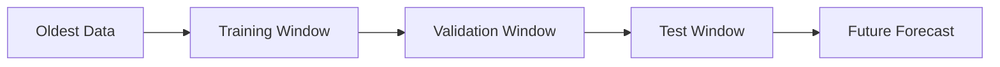
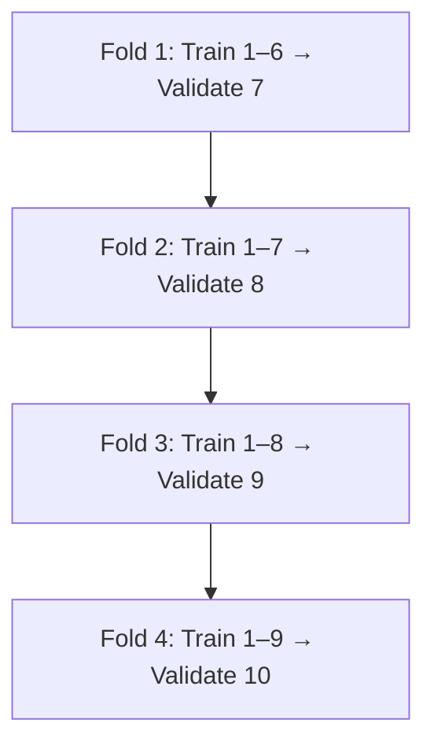
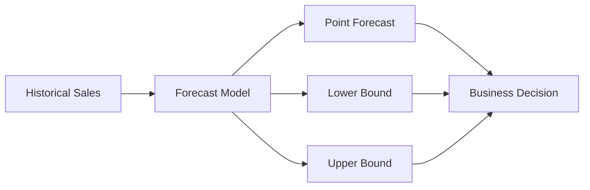
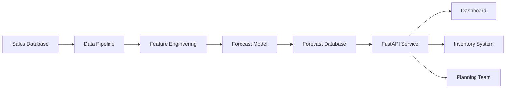

# 002 — Sales Forecasting

**Course:** 05 — Capstone and Portfolio
**Module:** Module 09 — Capstone Projects
**Content Group:** Capstone Options
**Roadmap Source:** Capstone Projects / Capstone Options
**Lesson Type:** Capstone
**Order in Module:** 002
**Suggested Duration:** 24 minutes

---

## 1. Overview

**Sales forecasting** is the process of predicting future sales, revenue, or product demand using historical data and relevant business variables.

A sales forecasting system can help answer questions such as:

* How many units will be sold next week?
* What revenue should the company expect next month?
* Which products may experience higher demand?
* How much inventory should each store prepare?
* When should the company increase staffing or production capacity?
* How uncertain is the forecast?

Sales forecasting is usually treated as a **time-series forecasting problem** because observations are ordered by time. Common time frequencies include:

* Hourly sales
* Daily sales
* Weekly sales
* Monthly revenue
* Quarterly business performance

A strong forecasting project should not stop at producing predictions. It should connect the forecast to decisions such as inventory planning, staffing, budgeting, supply-chain management, and promotion planning.

---

## 2. Learning Objectives

By the end of this lesson, you should be able to:

* Explain sales forecasting in your own words.
* Identify the target variable, time frequency, and forecast horizon.
* Recognize trend, seasonality, noise, and unusual events in sales data.
* Build simple baseline forecasting models.
* Train and compare statistical and machine-learning models.
* Evaluate forecasts using time-aware validation.
* Communicate forecast uncertainty and business limitations.
* Turn the solution into a reproducible portfolio project.

---

## 3. Why Sales Forecasting Matters

A reliable sales forecast can support several business functions.

| Business Function | Forecasting Use Case                            |
| ----------------- | ----------------------------------------------- |
| Inventory         | Estimate how many units should be stocked       |
| Finance           | Predict revenue and cash flow                   |
| Marketing         | Estimate the effect of campaigns and promotions |
| Operations        | Plan staffing and production capacity           |
| Supply Chain      | Schedule purchasing and deliveries              |
| Management        | Set targets and evaluate business scenarios     |

A forecast should be connected to a specific decision.

For example:

> Predict daily product demand for the next 14 days so that the inventory team can reduce stockouts and excess inventory.

This is more useful than a vague objective such as:

> Predict future sales.

---

## 4. Problem Definition

Before selecting a model, define the forecasting problem clearly.

### 4.1 Target Variable

The target is the value that the model must predict.

Common targets include:

* Units sold
* Daily revenue
* Weekly order count
* Monthly profit
* Product demand
* Store-level sales

Example:

```text
Target: units_sold
```

### 4.2 Forecast Granularity

Granularity determines the level at which predictions are produced.

Examples:

```text
Total company sales per day
Sales per store per week
Demand per product per store per day
Revenue per region per month
```

The more detailed the granularity, the more individual time series the system must handle.

For example:

```text
100 stores × 500 products = 50,000 store-product time series
```

### 4.3 Forecast Horizon

The forecast horizon is the number of future periods being predicted.

Examples:

* Next 7 days
* Next 4 weeks
* Next 3 months
* Next 4 quarters

A short forecast horizon may support inventory replenishment, while a long horizon may support budgeting and strategic planning.

### 4.4 Time Frequency

The data frequency must match the business decision.

| Frequency | Example Use                     |
| --------- | ------------------------------- |
| Hourly    | Workforce and delivery planning |
| Daily     | Inventory replenishment         |
| Weekly    | Promotion and supply planning   |
| Monthly   | Revenue forecasting             |
| Quarterly | Strategic planning              |

---

## 5. Main Time-Series Components

A sales series can often be described using four components:

$$
y_t = T_t + S_t + C_t + R_t
$$

where:

* \(y_t\): observed sales at time \(t\)
* \(T_t\): trend
* \(S_t\): seasonality
* \(C_t\): cyclic or event-related effects
* \(R_t\): residual noise

### 5.1 Trend

A **trend** is the long-term direction of the series.

Examples:

* Gradual sales growth
* Long-term decline
* Market expansion
* Customer-base growth

### 5.2 Seasonality

**Seasonality** is a repeating pattern with a known period.

Examples:

* Higher sales on weekends
* Monthly salary-cycle effects
* Holiday shopping peaks
* Higher ice cream demand during summer

A daily sales dataset may contain weekly seasonality with a period of seven days. A monthly dataset may contain yearly seasonality with a period of twelve months.

### 5.3 Residual Noise

Residuals are variations not explained by the model.

Possible causes include:

* Random customer behavior
* Unexpected weather
* Competitor actions
* Supply shortages
* Data-entry errors
* Unrecorded promotions

A forecasting model attempts to learn predictable structures such as trend and seasonality, but random residual behavior prevents forecasts from being perfectly accurate.

---

## 6. Sales Forecasting Workflow

```mermaid
flowchart LR
    A[Define Business Problem] --> B[Collect Sales Data]
    B --> C[Clean and Aggregate Data]
    C --> D[Explore Trend and Seasonality]
    D --> E[Create Time-Based Split]
    E --> F[Build Baseline Models]
    F --> G[Train Advanced Models]
    G --> H[Evaluate Forecasts]
    H --> I[Generate Prediction Intervals]
    I --> J[Deploy Forecast Service]
    J --> K[Monitor Error and Retrain]
```



The workflow should be iterative. If errors are concentrated around promotions, holidays, or specific products, return to feature engineering or problem definition.

---

## 7. Data Requirements

A minimum sales dataset contains:

| Column       | Description             |
| ------------ | ----------------------- |
| `date`       | Time of the observation |
| `sales`      | Target value            |
| `product_id` | Product identifier      |
| `store_id`   | Store identifier        |

Additional variables can improve predictions:

| Variable           | Example                                      |
| ------------------ | -------------------------------------------- |
| Price              | Current selling price                        |
| Base price         | Normal price before discount                 |
| Promotion          | Whether a product is promoted                |
| Display            | Whether a product receives special placement |
| Holiday            | Public holiday indicator                     |
| Weather            | Temperature or rainfall                      |
| Stock availability | Whether the product was available            |
| Marketing spend    | Advertising expenditure                      |
| Competitor price   | Competitor pricing information               |

A demand-forecasting dataset may include store IDs, SKU IDs, selling price, base price, promotion indicators, display indicators, and units sold. These variables allow the model to estimate demand for a specific product, store, and period.

### Example Dataset

```csv
date,store_id,product_id,price,promotion,units_sold
2026-01-01,S01,P001,4.50,0,43
2026-01-02,S01,P001,4.50,0,47
2026-01-03,S01,P001,3.99,1,82
2026-01-04,S01,P001,3.99,1,91
```

---

## 8. Exploratory Data Analysis

Before modeling, inspect the data carefully.

### 8.1 Data Quality Checks

Check for:

* Duplicate timestamps
* Missing dates
* Missing sales values
* Negative sales
* Impossible prices
* Product or store identifiers that change unexpectedly
* Long periods with zero sales
* Stockout periods
* Extreme outliers

### 8.2 Important Visualizations

Create at least the following charts:

1. Sales over time
2. Rolling average
3. Sales by day of week
4. Sales by month
5. Sales distribution
6. Sales by product or store
7. Promotion versus non-promotion sales
8. Missing-value heatmap
9. Actual versus predicted sales
10. Forecast with uncertainty intervals

### Example Rolling Average

```python
df["rolling_mean_7"] = df["sales"].rolling(7).mean()
df["rolling_mean_30"] = df["sales"].rolling(30).mean()
```

Rolling averages help reveal longer-term patterns while reducing short-term noise.

---

## 9. Baseline Models

Every forecasting project should include at least one simple baseline.

A complex model is only useful when it performs better than a reasonable baseline.

### 9.1 Historical Mean

Predict the average historical sales value:

$$
\hat{y}_{t+h} = \frac{1}{n}\sum_{i=1}^{n}y_i
$$

This baseline is simple but may fail when the data contains strong trends.

### 9.2 Recent Window Mean

Predict using the average of the most recent observations:

$$
\hat{y}_{t+h} = \frac{1}{k}\sum_{i=t-k+1}^{t}y_i
$$

For daily data, \(k=7\) could represent the previous week.

### 9.3 Naive Forecast

Use the latest known value:

$$
\hat{y}_{t+h}=y_t
$$

### 9.4 Seasonal Naive Forecast

Use the value from the previous seasonal period:

$$
\hat{y}_{t+h}=y_{t+h-m}
$$

where \(m\) is the seasonal period.

Examples:

* \(m=7\) for weekly seasonality in daily data
* \(m=12\) for yearly seasonality in monthly data
* \(m=24\) for daily seasonality in hourly data

Seasonal-naive forecasting can be extremely competitive when sales follow stable repeating patterns. A forecasting course transcript provided for this lesson demonstrates historical mean, recent-window mean, naive, and seasonal-naive approaches before introducing ARIMA.

---

## 10. Time-Based Validation

A forecasting model must never be evaluated using a random train-test split when future observations can leak into the training set.

### Incorrect Split

```text
Randomly distribute dates between training and testing sets.
```

This can allow later observations to influence predictions for earlier periods.

### Correct Split

```text
Training: January–October
Validation: November
Testing: December
```



### Python Example

```python
train = df[df["date"] < "2026-10-01"]
validation = df[
    (df["date"] >= "2026-10-01")
    & (df["date"] < "2026-11-01")
]
test = df[df["date"] >= "2026-11-01"]
```

### Walk-Forward Validation

Walk-forward validation evaluates a model across multiple forecast origins.



This method provides a more reliable estimate of future performance than a single split.

---

## 11. Forecasting Models

### 11.1 Statistical Models

Common statistical forecasting models include:

* Exponential smoothing
* Holt’s linear trend model
* Holt-Winters seasonal model
* ARIMA
* SARIMA
* Prophet

### 11.2 ARIMA

ARIMA stands for:

* **AR:** AutoRegressive
* **I:** Integrated
* **MA:** Moving Average

It is represented as:

$$
ARIMA(p,d,q)
$$

where:

* \(p\): number of autoregressive lags
* \(d\): number of differencing operations
* \(q\): number of moving-average error terms

ARIMA generally works best when the series is stationary or can be transformed into a stationary series through differencing.

The Augmented Dickey-Fuller test, ACF plot, and PACF plot can help inspect stationarity and select model parameters.

### 11.3 SARIMA

SARIMA extends ARIMA with seasonal components:

$$
SARIMA(p,d,q)(P,D,Q)_m
$$

where \(m\) is the seasonal period.

SARIMA is appropriate when sales contain stable seasonality, such as weekly or yearly patterns.

### 11.4 Prophet

Prophet models a time series using components such as:

$$
y(t)=g(t)+s(t)+h(t)+\epsilon_t
$$

where:

* \(g(t)\): trend
* \(s(t)\): seasonality
* \(h(t)\): holiday and event effects
* \(\epsilon_t\): residual noise

Prophet can be useful when the series contains multiple seasonal patterns, holidays, and trend changes. It can also be trained separately for different store-product combinations.

### 11.5 Machine-Learning Models

Sales forecasting can also be converted into a supervised regression problem.

Common models include:

* Linear regression
* Random forest
* XGBoost
* LightGBM
* CatBoost
* Neural networks
* LSTM
* Temporal Fusion Transformer

Machine-learning approaches are particularly useful when many external variables are available.

---

## 12. Feature Engineering

For machine-learning models, time-series information must be converted into input features.

### 12.1 Calendar Features

```python
df["year"] = df["date"].dt.year
df["month"] = df["date"].dt.month
df["day"] = df["date"].dt.day
df["day_of_week"] = df["date"].dt.dayofweek
df["week_of_year"] = df["date"].dt.isocalendar().week
df["is_weekend"] = (df["day_of_week"] >= 5).astype(int)
```

### 12.2 Lag Features

```python
df["lag_1"] = df["sales"].shift(1)
df["lag_7"] = df["sales"].shift(7)
df["lag_14"] = df["sales"].shift(14)
df["lag_28"] = df["sales"].shift(28)
```

Lag features allow the model to learn from previous sales values.

### 12.3 Rolling Features

```python
df["rolling_mean_7"] = (
    df["sales"]
    .shift(1)
    .rolling(7)
    .mean()
)

df["rolling_std_7"] = (
    df["sales"]
    .shift(1)
    .rolling(7)
    .std()
)
```

The target should be shifted before creating rolling features to avoid target leakage.

### 12.4 Price and Promotion Features

Useful features include:

```python
df["discount"] = df["base_price"] - df["price"]

df["discount_rate"] = (
    df["base_price"] - df["price"]
) / df["base_price"]

df["promotion_price"] = (
    df["promotion"] * df["price"]
)
```

### 12.5 External Regressors

External regressors may include:

* Holidays
* Promotions
* Marketing campaigns
* Weather
* Local events
* Competitor prices
* Economic indicators

Only use external variables that will also be available when generating future forecasts.

---

## 13. Evaluation Metrics

No single metric is best for every project.

### 13.1 Mean Absolute Error

$$
MAE=
\frac{1}{n}
\sum_{i=1}^{n}
|y_i-\hat{y}_i|
$$

MAE is easy to interpret because it uses the same unit as the target.

### 13.2 Root Mean Squared Error

$$
RMSE=
\sqrt{
\frac{1}{n}
\sum_{i=1}^{n}
(y_i-\hat{y}_i)^2
}
$$

RMSE penalizes large errors more strongly than MAE.

### 13.3 Mean Absolute Percentage Error

$$
MAPE=
\frac{100}{n}
\sum_{i=1}^{n}
\left|
\frac{y_i-\hat{y}_i}{y_i}
\right|
$$

MAPE is intuitive but becomes unstable when actual sales are zero or close to zero.

### 13.4 Weighted Absolute Percentage Error

$$
WAPE=
\frac{
\sum_{i=1}^{n}|y_i-\hat{y}_i|
}{
\sum_{i=1}^{n}|y_i|
}
\times 100
$$

WAPE is often more stable than MAPE for aggregated sales forecasting.

### 13.5 Forecast Bias

$$
Bias=
\frac{1}{n}
\sum_{i=1}^{n}
(\hat{y}_i-y_i)
$$

Interpretation:

* Positive bias: systematic overforecasting
* Negative bias: systematic underforecasting

### Metric Selection

| Business Concern               | Recommended Metric |
| ------------------------------ | ------------------ |
| Easy unit interpretation       | MAE                |
| Penalize large misses          | RMSE               |
| Percentage comparison          | MAPE or WAPE       |
| Detect overforecasting         | Bias               |
| Compare against naive forecast | MASE               |

---

## 14. Prediction Intervals and Uncertainty

A point forecast gives one predicted value:

```text
Expected sales tomorrow: 120 units
```

A prediction interval communicates uncertainty:

```text
Expected sales tomorrow: 120 units
80% prediction interval: 100–143 units
```



Prediction intervals are important because business teams may make different decisions depending on forecast risk.

For inventory planning:

* Point forecast: expected inventory requirement
* Upper bound: safer stock level
* Lower bound: conservative purchasing scenario

Forecasts should never be presented as guaranteed future values.

---

## 15. Minimal Python Demo

The following example builds a seasonal-naive baseline and evaluates it.

```python
from __future__ import annotations

import pandas as pd
from sklearn.metrics import mean_absolute_error, mean_squared_error


def prepare_sales_data(path: str) -> pd.DataFrame:
    """Load and validate a daily sales dataset."""
    df = pd.read_csv(path)

    required_columns = {"date", "sales"}
    missing_columns = required_columns.difference(df.columns)

    if missing_columns:
        raise ValueError(
            f"Missing required columns: {sorted(missing_columns)}"
        )

    df["date"] = pd.to_datetime(df["date"], errors="coerce")

    if df["date"].isna().any():
        raise ValueError("The date column contains invalid values.")

    df = (
        df.sort_values("date")
        .drop_duplicates(subset=["date"], keep="last")
        .reset_index(drop=True)
    )

    return df


def seasonal_naive_forecast(
    series: pd.Series,
    season_length: int,
) -> pd.Series:
    """Predict each value using the value from one season earlier."""
    if season_length <= 0:
        raise ValueError("season_length must be greater than zero.")

    return series.shift(season_length)


df = prepare_sales_data("sales.csv")

# Daily data with weekly seasonality
season_length = 7
df["forecast"] = seasonal_naive_forecast(
    df["sales"],
    season_length=season_length,
)

evaluation = df.dropna(subset=["forecast"]).copy()

mae = mean_absolute_error(
    evaluation["sales"],
    evaluation["forecast"],
)

rmse = mean_squared_error(
    evaluation["sales"],
    evaluation["forecast"],
) ** 0.5

print(f"Seasonal naive MAE: {mae:.2f}")
print(f"Seasonal naive RMSE: {rmse:.2f}")
```

---

## 16. Machine-Learning Demo Structure

For a stronger portfolio project, create lag features and train a regression model.

```python
from __future__ import annotations

import pandas as pd
from sklearn.ensemble import RandomForestRegressor
from sklearn.metrics import mean_absolute_error


def create_features(df: pd.DataFrame) -> pd.DataFrame:
    """Create leakage-safe calendar, lag, and rolling features."""
    result = df.copy()
    result["date"] = pd.to_datetime(result["date"])

    result["day_of_week"] = result["date"].dt.dayofweek
    result["month"] = result["date"].dt.month
    result["is_weekend"] = (
        result["day_of_week"] >= 5
    ).astype(int)

    result["lag_1"] = result["sales"].shift(1)
    result["lag_7"] = result["sales"].shift(7)
    result["lag_14"] = result["sales"].shift(14)

    result["rolling_mean_7"] = (
        result["sales"]
        .shift(1)
        .rolling(7)
        .mean()
    )

    return result.dropna().reset_index(drop=True)


df = pd.read_csv("sales.csv")
df = create_features(df)

cutoff_date = pd.Timestamp("2026-10-01")

train = df[df["date"] < cutoff_date]
test = df[df["date"] >= cutoff_date]

feature_columns = [
    "day_of_week",
    "month",
    "is_weekend",
    "lag_1",
    "lag_7",
    "lag_14",
    "rolling_mean_7",
]

model = RandomForestRegressor(
    n_estimators=300,
    random_state=42,
    n_jobs=-1,
)

model.fit(
    train[feature_columns],
    train["sales"],
)

predictions = model.predict(test[feature_columns])

mae = mean_absolute_error(
    test["sales"],
    predictions,
)

print(f"Test MAE: {mae:.2f}")
```

The random forest should be compared against the seasonal-naive baseline. A lower test error does not automatically make the model production-ready; stability, interpretability, inference cost, and business value must also be considered.

---

## 17. Model Comparison Table

A project should summarize model performance in a clear table.

| Model           |  MAE | RMSE |  WAPE | Training Time | Notes                  |
| --------------- | ---: | ---: | ----: | ------------: | ---------------------- |
| Historical Mean | 28.4 | 39.2 | 31.5% |      Very low | Weak baseline          |
| Naive           | 20.7 | 29.8 | 23.1% |      Very low | Misses weekly pattern  |
| Seasonal Naive  | 15.3 | 22.4 | 17.2% |      Very low | Strong baseline        |
| ARIMA           | 14.8 | 21.6 | 16.8% |        Medium | Good local dynamics    |
| Prophet         | 15.0 | 22.1 | 17.0% |        Medium | Handles holidays       |
| LightGBM        | 12.6 | 19.4 | 14.3% |        Medium | Best validation result |

These values are illustrative. Actual results must come from the project dataset.

---

## 18. Error Analysis

Overall metrics can hide important failures.

Evaluate errors by:

* Product
* Store
* Region
* Day of week
* Promotion status
* Holiday versus normal day
* High-demand versus low-demand periods
* Forecast horizon
* Product popularity

### Example Questions

* Does the model underpredict promotional spikes?
* Are errors larger for new products?
* Does performance decline for longer forecast horizons?
* Are low-volume products producing unstable percentage errors?
* Are stockouts incorrectly interpreted as low demand?
* Are certain stores consistently overforecasted?

### Residual Plot

Residuals are calculated as:

$$
e_t=y_t-\hat{y}_t
$$

A useful model should ideally produce residuals with:

* Mean close to zero
* No obvious trend
* No strong seasonal pattern
* Few extreme outliers

---

## 19. Business Recommendations

A final project should translate model results into actions.

### Weak Recommendation

> The LightGBM model achieved the lowest MAE.

### Better Recommendation

> Use the LightGBM forecast as the primary weekly inventory estimate because it reduced WAPE from 17.2% for the seasonal-naive baseline to 14.3%. For products with high forecast uncertainty, use the upper prediction bound when calculating safety stock.

### Example Recommendations

* Increase stock for products with strong weekend demand.
* Use separate models for high-volume and low-volume products.
* Include promotion schedules before generating forecasts.
* Retrain the model after major pricing or product changes.
* Use upper prediction bounds for critical inventory.
* Review products with repeated negative forecast bias.
* Do not automate purchasing when input data is incomplete.

---

## 20. Deployment Architecture

A portfolio project can expose forecasts through an API.



### Example API Response

```json
{
  "product_id": "P001",
  "store_id": "S01",
  "forecast_date": "2026-11-01",
  "predicted_units": 128.4,
  "lower_bound": 104.2,
  "upper_bound": 151.9,
  "model_version": "sales-forecast-v1"
}
```

### Suggested Endpoints

```text
POST /forecast
GET  /forecast/{store_id}/{product_id}
GET  /health
GET  /model-info
```

---

## 21. Monitoring

Forecasting models can degrade as customer behavior changes.

Monitor:

* MAE and WAPE over time
* Forecast bias
* Data freshness
* Missing input features
* Changes in sales distribution
* Changes in product assortment
* Changes in promotion strategy
* Prediction interval coverage
* API latency
* Forecast generation failures

### Retraining Triggers

Retrain when:

* Error exceeds an agreed threshold
* New products or stores are introduced
* Pricing policy changes
* Seasonal behavior changes
* A major campaign begins
* Data drift is detected
* A fixed retraining period is reached

---

## 22. Common Mistakes

### 22.1 Random Train-Test Splitting

Random splitting can leak future information into training data.

**Solution:** Use chronological or walk-forward validation.

### 22.2 No Baseline

A complex model may look impressive while performing worse than seasonal naive.

**Solution:** Always compare against simple baselines.

### 22.3 Target Leakage

Using future sales when creating features produces unrealistic performance.

**Solution:** Shift target values before calculating lag and rolling features.

### 22.4 Ignoring Missing Dates

Missing timestamps can distort lag features and seasonal periods.

**Solution:** Reindex the series to the expected frequency and decide how missing values should be handled.

### 22.5 Ignoring Stockouts

Zero sales may indicate unavailable inventory rather than zero demand.

**Solution:** Include stock availability when possible.

### 22.6 Using MAPE with Zero Sales

MAPE becomes undefined or unstable around zero.

**Solution:** Use MAE, WAPE, MASE, or another suitable metric.

### 22.7 Treating Forecasts as Certain

A point forecast hides risk.

**Solution:** Include prediction intervals and scenario analysis.

### 22.8 Forecasting Too Far Ahead

Uncertainty usually increases with the forecast horizon.

**Solution:** Select a horizon connected to a real planning decision.

### 22.9 Ignoring Business Cost

Overforecasting and underforecasting may have different consequences.

**Solution:** Evaluate the cost of excess inventory, stockouts, lost sales, and waste.

---

## 23. Practical Exercise

Build a small sales forecasting project using a daily, weekly, or monthly dataset.

### Required Tasks

1. Define the business problem.
2. Identify the target and forecast horizon.
3. Clean and validate the time-series data.
4. Plot sales over time.
5. Identify trend and seasonality.
6. Create a chronological train-test split.
7. Build a naive baseline.
8. Build a seasonal-naive baseline.
9. Train at least one advanced model.
10. Evaluate MAE, RMSE, and WAPE.
11. Plot actual versus predicted values.
12. Perform error analysis.
13. Add one business recommendation.
14. Document assumptions and limitations.

### Suggested Model Options

Choose at least one:

* ARIMA or SARIMA
* Exponential smoothing
* Prophet
* Random forest
* XGBoost or LightGBM

---

## 24. Suggested Repository Structure

```text
sales-forecasting-project/
├── README.md
├── data/
│   ├── raw/
│   └── processed/
├── notebooks/
│   ├── 01_data_validation.ipynb
│   ├── 02_exploratory_analysis.ipynb
│   ├── 03_baseline_models.ipynb
│   ├── 04_model_training.ipynb
│   └── 05_error_analysis.ipynb
├── src/
│   ├── data.py
│   ├── features.py
│   ├── train.py
│   ├── evaluate.py
│   └── predict.py
├── models/
├── reports/
│   └── figures/
├── api/
│   └── main.py
├── tests/
├── requirements.txt
├── Dockerfile
└── .gitignore
```

---

## 25. README Structure

A strong README should contain:

```markdown
# Sales Forecasting Project

## Business Problem

## Dataset

## Forecast Target and Horizon

## Exploratory Analysis

## Validation Strategy

## Baseline Models

## Advanced Models

## Evaluation Metrics

## Results

## Error Analysis

## Business Recommendations

## Limitations

## Repository Structure

## Installation

## How to Run

## API Usage

## Future Improvements
```

---

## 26. Portfolio Deliverables

A complete project may include:

* Cleaned dataset
* Exploratory notebook
* Baseline forecast
* Advanced forecasting model
* Time-aware validation
* Evaluation table
* Forecast chart
* Prediction intervals
* Error analysis
* Business recommendations
* Reusable Python modules
* Unit tests
* REST API
* Docker image
* Dashboard
* Model card
* Reproducible README

---

## 27. Completion Checklist

* [ ] I can explain sales forecasting in one or two minutes.
* [ ] I have clearly defined the target variable.
* [ ] I have selected a forecast frequency and horizon.
* [ ] I have checked trend and seasonality.
* [ ] I have used a chronological validation strategy.
* [ ] I have built at least one baseline.
* [ ] I have compared an advanced model with the baseline.
* [ ] I have reported suitable forecast metrics.
* [ ] I have checked forecast bias.
* [ ] I have created an actual-versus-predicted chart.
* [ ] I have communicated uncertainty.
* [ ] I have written at least one business recommendation.
* [ ] I have documented assumptions and limitations.
* [ ] Another person can reproduce the project.

---

## 28. Related Outcome

Build one end-to-end portfolio project that connects:

```text
Business Problem
    ↓
Data Collection
    ↓
Exploratory Analysis
    ↓
Feature Engineering
    ↓
Forecasting
    ↓
Time-Based Evaluation
    ↓
Business Recommendation
    ↓
Deployment
    ↓
Monitoring
```

---

## 29. Related Project

**Capstone: End-to-End AI/Data Science Portfolio Project**

Suggested project title:

> Multi-Store Product Sales Forecasting and Inventory Planning System

Possible project objective:

> Forecast the next 14 days of product demand for each store-product combination and expose predictions through a FastAPI service for inventory planning.

---

## 30. Summary

Sales forecasting predicts future sales, revenue, or product demand from historical time-series data and relevant business variables.

A strong sales forecasting project should include:

1. A clearly defined business decision
2. A target, frequency, granularity, and forecast horizon
3. Time-series exploration
4. Simple but competitive baselines
5. Time-aware validation
6. Appropriate evaluation metrics
7. Prediction intervals
8. Error analysis
9. Business recommendations
10. Reproducible deployment artifacts

The most important goal is not merely to produce a low error score. The forecast must be understandable, reproducible, connected to a business decision, and honest about uncertainty.

Turn the lesson into a practical artifact such as a notebook, reusable training pipeline, dashboard, API, Docker service, or complete portfolio repository.
