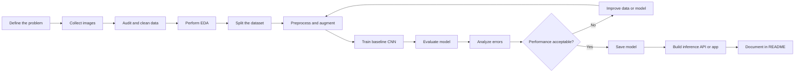
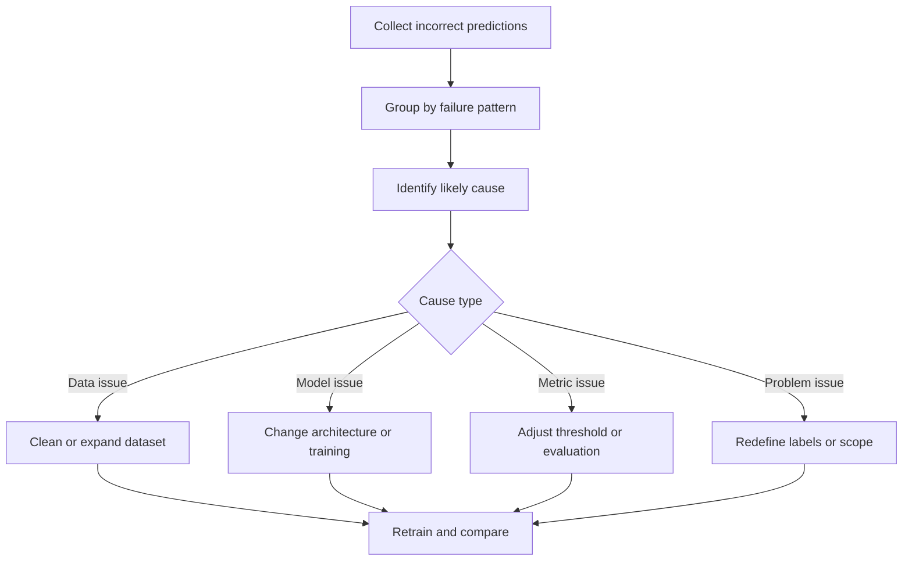

# 003 — Image Classification Capstone

**Course:** 05 — Capstone and Portfolio
**Module:** Module 09 — Capstone Projects
**Content Group:** Capstone Options
**Roadmap Source:** Capstone Projects / Capstone Options
**Lesson Type:** Capstone
**Lesson Order:** 003
**Suggested Duration:** 24 minutes

---

## 1. Overview

An **Image Classification Capstone** is an end-to-end computer vision project in which a model receives an image and predicts its class.

Typical examples include:

* Cat versus dog classification
* Healthy versus diseased plant classification
* Happy versus sad facial-expression classification
* Different waste-category classification
* Product-defect detection
* Underwater species classification

The purpose of the capstone is not only to train a model. A complete project should demonstrate that you can:

1. Define a meaningful problem.
2. Collect and validate image data.
3. Explore class distributions and image quality.
4. Build a baseline model.
5. Train and evaluate the model correctly.
6. Analyze errors and limitations.
7. Save or deploy the model.
8. Explain the entire project through a clear README.

By the end of the project, another person should be able to understand the problem, reproduce the experiment, inspect the results, and test the trained classifier.

---

## 2. Learning Objectives

After completing this lesson, you should be able to:

* Explain image classification in your own words.
* Convert a real-world question into a supervised learning problem.
* Organize an image dataset into training, validation, and test sets.
* Inspect images for corruption, duplication, imbalance, and leakage.
* Build a baseline convolutional neural network.
* Evaluate a classifier using appropriate metrics.
* Identify overfitting and improve generalization.
* Save the trained model and use it for inference.
* Present the project as a reproducible portfolio artifact.

---

## 3. Problem Definition

In image classification, the model learns a function:

$$
f(X) \rightarrow Y
$$

where:

* \(X\) is an input image.
* \(Y\) is the predicted class.
* \(f\) is the trained classification model.

For a binary Cats vs. Dogs classifier:

$$
Y \in \{0,1\}
$$

For example:

* \(0\): Cat
* \(1\): Dog

For a multi-class marine-species classifier:

$$
Y \in
\{
\text{shark},
\text{turtle},
\text{ray},
\text{dolphin}
\}
$$

### Example problem statement

> Build an image-classification model that determines whether an input image contains a cat or a dog. The model will be evaluated on previously unseen images using accuracy, precision, recall, F1-score, and a confusion matrix.

A strong problem statement specifies:

| Component  | Question                                  |
| ---------- | ----------------------------------------- |
| Input      | What does the model receive?              |
| Output     | What classes must it predict?             |
| User       | Who will use the prediction?              |
| Metric     | How will success be measured?             |
| Constraint | What limitations must the system respect? |

---

## 4. End-to-End Workflow



A capstone should cover this complete loop rather than presenting only a final accuracy value.

---

## 5. Dataset Design

### 5.1 Recommended directory structure

TensorFlow and PyTorch can infer class labels from directory names.

```text
data/
├── train/
│   ├── cats/
│   │   ├── cat_001.jpg
│   │   ├── cat_002.jpg
│   │   └── ...
│   └── dogs/
│       ├── dog_001.jpg
│       ├── dog_002.jpg
│       └── ...
├── validation/
│   ├── cats/
│   └── dogs/
└── test/
    ├── cats/
    └── dogs/
```

Keep test images separate until the model and training decisions have been finalized.

### 5.2 Data-source requirements

For every dataset, record:

* Dataset name
* Dataset URL or source
* License
* Number of images
* Class definitions
* Collection method
* Known biases
* Allowed usage

Avoid downloading arbitrary images without checking their licenses or privacy implications.

### 5.3 Data-quality checks

Before training, check for:

* Corrupted files
* Incorrect file extensions
* Extremely small images
* Duplicate images
* Incorrect labels
* Empty class directories
* Severe class imbalance
* Watermarks or text that reveal the label
* Multiple versions of the same image across different splits

A model can appear highly accurate when duplicated or nearly identical images exist in both training and test sets.

---

## 6. Exploratory Data Analysis

Image EDA helps you understand what the model will learn.

### 6.1 Count images by class

```python
from pathlib import Path

data_dir = Path("data/train")

class_counts = {
    class_dir.name: len(
        [
            path
            for path in class_dir.iterdir()
            if path.suffix.lower() in {".jpg", ".jpeg", ".png", ".bmp"}
        ]
    )
    for class_dir in data_dir.iterdir()
    if class_dir.is_dir()
}

print(class_counts)
```

Example output:

```text
{
    "cats": 4_000,
    "dogs": 4_000
}
```

Do not present invented results in the final project. Replace example values with measurements from your own dataset.

### 6.2 Display sample images

```python
import matplotlib.pyplot as plt
from PIL import Image

sample_paths = list(data_dir.glob("*/*"))[:9]

plt.figure(figsize=(9, 9))

for index, image_path in enumerate(sample_paths, start=1):
    image = Image.open(image_path).convert("RGB")

    plt.subplot(3, 3, index)
    plt.imshow(image)
    plt.title(image_path.parent.name)
    plt.axis("off")

plt.tight_layout()
plt.show()
```

While inspecting samples, ask:

* Are the labels correct?
* Are the objects clearly visible?
* Do backgrounds differ strongly between classes?
* Are some images drawings while others are photographs?
* Are image resolutions extremely different?
* Is one class generally brighter or darker?
* Are there hidden shortcuts the model could exploit?

### 6.3 Useful EDA charts

A portfolio project may include:

* Class-distribution bar chart
* Image-width distribution
* Image-height distribution
* Aspect-ratio distribution
* File-size distribution
* Random image grid
* Average image per class
* Duplicate-image report

---

## 7. Data Splitting

A common split is:

$$
70\% \text{ training}
+
15\% \text{ validation}
+
15\% \text{ testing}
$$

The exact proportions may vary, but each set has a different role.

| Dataset    | Purpose                                    |
| ---------- | ------------------------------------------ |
| Training   | Updates model weights                      |
| Validation | Selects architecture and hyperparameters   |
| Test       | Estimates final generalization performance |

### Data-leakage warning

Do not use test data to:

* Select the best epoch
* Tune the learning rate
* Choose augmentation strategies
* Compare many architectures repeatedly
* Decide classification thresholds

Those decisions belong to the validation set.

---

## 8. Loading Images with TensorFlow

```python
from pathlib import Path

import tensorflow as tf

DATA_DIR = Path("data/train")
IMAGE_SIZE = (224, 224)
BATCH_SIZE = 32
SEED = 42

train_dataset = tf.keras.utils.image_dataset_from_directory(
    DATA_DIR,
    validation_split=0.20,
    subset="training",
    seed=SEED,
    image_size=IMAGE_SIZE,
    batch_size=BATCH_SIZE,
    label_mode="binary",
)

validation_dataset = tf.keras.utils.image_dataset_from_directory(
    DATA_DIR,
    validation_split=0.20,
    subset="validation",
    seed=SEED,
    image_size=IMAGE_SIZE,
    batch_size=BATCH_SIZE,
    label_mode="binary",
)
```

Batch-based loading is important because a large image dataset may not fit into memory at once.

### Improve input performance

```python
AUTOTUNE = tf.data.AUTOTUNE

train_dataset = train_dataset.cache().shuffle(1_000).prefetch(AUTOTUNE)
validation_dataset = validation_dataset.cache().prefetch(AUTOTUNE)
```

Use `.cache()` only when the processed dataset fits into available memory or storage.

---

## 9. Preprocessing and Data Augmentation

Raw image pixels commonly range from 0 to 255. Neural networks usually train more reliably when values are normalized.

$$
x_{\text{normalized}} = \frac{x}{255}
$$

### Augmentation pipeline

```python
from tensorflow.keras import Sequential
from tensorflow.keras.layers import (
    RandomFlip,
    RandomRotation,
    RandomZoom,
    Rescaling,
)

data_augmentation = Sequential(
    [
        RandomFlip("horizontal"),
        RandomRotation(0.08),
        RandomZoom(0.10),
    ],
    name="data_augmentation",
)

normalization = Rescaling(1.0 / 255)
```

Augmentation produces modified training examples and can reduce overfitting.

Possible transformations include:

* Horizontal flipping
* Small rotations
* Random zoom
* Random cropping
* Contrast adjustment
* Brightness adjustment

Transformations must preserve the label. For example, vertical flipping may be inappropriate for street scenes or handwritten digits.

---

## 10. Building a Baseline CNN

A convolutional neural network learns spatial patterns such as:

* Edges
* Textures
* Shapes
* Object parts
* Higher-level visual structures

### Architecture

```mermaid
flowchart LR
    A[224 x 224 RGB image] --> B[Rescaling]
    B --> C[Data augmentation]
    C --> D[Conv2D + ReLU]
    D --> E[MaxPooling]
    E --> F[Conv2D + ReLU]
    F --> G[MaxPooling]
    G --> H[Conv2D + ReLU]
    H --> I[MaxPooling]
    I --> J[Global Average Pooling]
    J --> K[Dropout]
    K --> L[Sigmoid output]
```



### TensorFlow implementation

```python
from tensorflow.keras import Sequential
from tensorflow.keras.layers import (
    Conv2D,
    Dense,
    Dropout,
    GlobalAveragePooling2D,
    Input,
    MaxPooling2D,
)

model = Sequential(
    [
        Input(shape=(*IMAGE_SIZE, 3)),
        normalization,
        data_augmentation,

        Conv2D(32, kernel_size=3, activation="relu"),
        MaxPooling2D(),

        Conv2D(64, kernel_size=3, activation="relu"),
        MaxPooling2D(),

        Conv2D(128, kernel_size=3, activation="relu"),
        MaxPooling2D(),

        GlobalAveragePooling2D(),
        Dropout(0.30),
        Dense(1, activation="sigmoid"),
    ]
)

model.summary()
```

### Compile the model

```python
model.compile(
    optimizer=tf.keras.optimizers.Adam(learning_rate=1e-3),
    loss="binary_crossentropy",
    metrics=[
        tf.keras.metrics.BinaryAccuracy(name="accuracy"),
        tf.keras.metrics.Precision(name="precision"),
        tf.keras.metrics.Recall(name="recall"),
        tf.keras.metrics.AUC(name="auc"),
    ],
)
```

For multi-class classification, use:

* `Dense(number_of_classes, activation="softmax")`
* `sparse_categorical_crossentropy` for integer labels

---

## 11. Training

```python
callbacks = [
    tf.keras.callbacks.EarlyStopping(
        monitor="val_loss",
        patience=4,
        restore_best_weights=True,
    ),
    tf.keras.callbacks.ReduceLROnPlateau(
        monitor="val_loss",
        factor=0.5,
        patience=2,
        min_lr=1e-6,
    ),
    tf.keras.callbacks.ModelCheckpoint(
        filepath="models/best_classifier.keras",
        monitor="val_loss",
        save_best_only=True,
    ),
]

history = model.fit(
    train_dataset,
    validation_data=validation_dataset,
    epochs=20,
    callbacks=callbacks,
)
```

### Why callbacks matter

* **Early stopping** prevents unnecessary training after validation performance stops improving.
* **Model checkpointing** preserves the best model rather than only the final epoch.
* **Learning-rate reduction** allows more careful optimization near a minimum.

---

## 12. Training-Curve Analysis

```python
import matplotlib.pyplot as plt

training_accuracy = history.history["accuracy"]
validation_accuracy = history.history["val_accuracy"]

training_loss = history.history["loss"]
validation_loss = history.history["val_loss"]

epochs = range(1, len(training_accuracy) + 1)

plt.figure(figsize=(8, 5))
plt.plot(epochs, training_accuracy, label="Training accuracy")
plt.plot(epochs, validation_accuracy, label="Validation accuracy")
plt.xlabel("Epoch")
plt.ylabel("Accuracy")
plt.title("Training and Validation Accuracy")
plt.legend()
plt.show()
```

Create a separate chart for loss:

```python
plt.figure(figsize=(8, 5))
plt.plot(epochs, training_loss, label="Training loss")
plt.plot(epochs, validation_loss, label="Validation loss")
plt.xlabel("Epoch")
plt.ylabel("Loss")
plt.title("Training and Validation Loss")
plt.legend()
plt.show()
```

### Common patterns

#### Healthy learning

* Training loss decreases.
* Validation loss decreases.
* Training and validation metrics remain reasonably close.

#### Overfitting

* Training accuracy continues increasing.
* Validation accuracy stops improving.
* Validation loss begins increasing.

Possible solutions:

* Add more training data.
* Correct mislabeled images.
* Increase augmentation.
* Add dropout.
* Reduce model complexity.
* Use weight regularization.
* Apply early stopping.
* Use transfer learning.

#### Underfitting

* Both training and validation performance are poor.
* The model cannot learn the training set sufficiently.

Possible solutions:

* Train longer.
* Increase model capacity.
* Improve image resolution.
* Reduce excessive regularization.
* Use a pretrained model.
* Revisit labels and problem definition.

---

## 13. Evaluation Metrics

Accuracy alone may hide important weaknesses.

### Accuracy

$$
\text{Accuracy} = \frac{TP+TN}{TP+TN+FP+FN}
$$

### Precision

$$
\text{Precision} = \frac{TP}{TP+FP}
$$

Precision answers:

> When the model predicts the positive class, how often is it correct?

### Recall

$$
\text{Recall} = \frac{TP}{TP+FN}
$$

Recall answers:

> Of all actual positive examples, how many did the model detect?

### F1-score

$$
F_1 =
2
\cdot
\frac{
\text{Precision}\cdot\text{Recall}
}{
\text{Precision}+\text{Recall}
}
$$

### Confusion matrix

|                 | Predicted Negative | Predicted Positive |
| --------------- | -----------------: | -----------------: |
| Actual Negative |      True Negative |     False Positive |
| Actual Positive |     False Negative |      True Positive |

Choose metrics according to the business problem.

For medical-image screening, missing a positive case may be more serious than producing a false alarm. Recall may therefore be more important than raw accuracy.

---

## 14. Test-Set Evaluation

```python
test_dataset = tf.keras.utils.image_dataset_from_directory(
    "data/test",
    image_size=IMAGE_SIZE,
    batch_size=BATCH_SIZE,
    label_mode="binary",
    shuffle=False,
)

test_results = model.evaluate(
    test_dataset,
    return_dict=True,
)

for metric_name, metric_value in test_results.items():
    print(f"{metric_name}: {metric_value:.4f}")
```

### Results table template

Replace the placeholders with your actual results.

| Metric    | Baseline CNN | Improved Model |
| --------- | -----------: | -------------: |
| Accuracy  |    `<value>` |      `<value>` |
| Precision |    `<value>` |      `<value>` |
| Recall    |    `<value>` |      `<value>` |
| F1-score  |    `<value>` |      `<value>` |
| ROC-AUC   |    `<value>` |      `<value>` |

Do not report only the best result. Explain what changed between experiments.

---

## 15. Confusion Matrix

```python
import numpy as np
from sklearn.metrics import ConfusionMatrixDisplay, classification_report

true_labels = np.concatenate(
    [labels.numpy().reshape(-1) for _, labels in test_dataset]
)

probabilities = model.predict(test_dataset).reshape(-1)
predicted_labels = (probabilities >= 0.5).astype(int)

ConfusionMatrixDisplay.from_predictions(
    true_labels,
    predicted_labels,
    display_labels=["Cat", "Dog"],
)

plt.title("Test Confusion Matrix")
plt.show()

print(
    classification_report(
        true_labels,
        predicted_labels,
        target_names=["Cat", "Dog"],
    )
)
```

The default threshold is often 0.5, but the best threshold depends on the cost of false positives and false negatives.

---

## 16. Predicting a New Image

```python
import numpy as np
from tensorflow.keras.utils import img_to_array, load_img

CLASS_NAMES = ["Cat", "Dog"]

def predict_image(image_path: str) -> dict[str, object]:
    image = load_img(
        image_path,
        target_size=IMAGE_SIZE,
    )

    image_array = img_to_array(image)
    image_batch = np.expand_dims(image_array, axis=0)

    dog_probability = float(model.predict(image_batch, verbose=0)[0][0])
    predicted_index = int(dog_probability >= 0.5)

    confidence = (
        dog_probability
        if predicted_index == 1
        else 1.0 - dog_probability
    )

    return {
        "predicted_class": CLASS_NAMES[predicted_index],
        "confidence": confidence,
        "dog_probability": dog_probability,
    }

result = predict_image("samples/example.jpg")
print(result)
```

Example output format:

```text
{
    "predicted_class": "Dog",
    "confidence": 0.94,
    "dog_probability": 0.94
}
```

Test the model on images from different environments, cameras, backgrounds, and lighting conditions.

---

## 17. Error Analysis

Error analysis is more valuable than reporting one final metric.

Create a table of incorrect predictions:

| Image          | Actual | Predicted | Confidence | Possible reason           |
| -------------- | ------ | --------- | ---------: | ------------------------- |
| `image_01.jpg` | Cat    | Dog       |       0.87 | Dog visible in background |
| `image_02.jpg` | Dog    | Cat       |       0.76 | Face heavily occluded     |
| `image_03.jpg` | Cat    | Dog       |       0.61 | Low-resolution image      |

Investigate whether errors are associated with:

* Dark lighting
* Small objects
* Multiple objects
* Occlusion
* Unusual camera angles
* Drawings or cartoons
* Blurry images
* Incorrect labels
* Background bias
* Classes that look visually similar

### Error-analysis loop



---

## 18. Improving the Baseline

### 18.1 Transfer learning

Instead of training every feature from scratch, use a model pretrained on a large image dataset.

Common backbones include:

* MobileNet
* EfficientNet
* ResNet
* DenseNet
* ConvNeXt

Example:

```python
base_model = tf.keras.applications.MobileNetV2(
    input_shape=(*IMAGE_SIZE, 3),
    include_top=False,
    weights="imagenet",
)

base_model.trainable = False

transfer_model = Sequential(
    [
        Input(shape=(*IMAGE_SIZE, 3)),
        data_augmentation,
        tf.keras.applications.mobilenet_v2.preprocess_input,
        base_model,
        GlobalAveragePooling2D(),
        Dropout(0.30),
        Dense(1, activation="sigmoid"),
    ]
)

transfer_model.compile(
    optimizer=tf.keras.optimizers.Adam(learning_rate=1e-3),
    loss="binary_crossentropy",
    metrics=["accuracy"],
)
```

Transfer learning is especially useful when your custom dataset is relatively small.

### 18.2 Experiment table

Track every meaningful experiment.

| Experiment | Architecture | Augmentation | Learning rate | Best validation score | Notes             |
| ---------- | ------------ | ------------ | ------------: | --------------------: | ----------------- |
| E01        | Small CNN    | No           |     \(10^{-3}\) |             `<value>` | Baseline          |
| E02        | Small CNN    | Yes          |     \(10^{-3}\) |             `<value>` | Less overfitting  |
| E03        | MobileNetV2  | Yes          |     \(10^{-3}\) |             `<value>` | Frozen backbone   |
| E04        | MobileNetV2  | Yes          |     \(10^{-5}\) |             `<value>` | Fine-tuned layers |

Change one major factor at a time whenever possible.

---

## 19. Saving and Reloading the Model

```python
from pathlib import Path

model_dir = Path("models")
model_dir.mkdir(parents=True, exist_ok=True)

model.save(model_dir / "image_classifier.keras")
```

Reload it later:

```python
loaded_model = tf.keras.models.load_model(
    "models/image_classifier.keras"
)
```

Also save:

* Class names
* Image size
* Normalization method
* Classification threshold
* Library versions
* Experiment configuration
* Model limitations

A model file without preprocessing metadata may be difficult to use correctly.

---

## 20. Optional Deployment Artifact

A simple FastAPI service can expose the model through an HTTP endpoint.

```python
from io import BytesIO

import numpy as np
import tensorflow as tf
from fastapi import FastAPI, File, HTTPException, UploadFile
from PIL import Image

app = FastAPI(title="Image Classification API")

model = tf.keras.models.load_model("models/image_classifier.keras")
class_names = ["Cat", "Dog"]

@app.post("/predict")
async def predict(file: UploadFile = File(...)) -> dict[str, object]:
    if not file.content_type or not file.content_type.startswith("image/"):
        raise HTTPException(
            status_code=400,
            detail="The uploaded file must be an image.",
        )

    contents = await file.read()

    try:
        image = Image.open(BytesIO(contents)).convert("RGB")
    except Exception as exc:
        raise HTTPException(
            status_code=400,
            detail="The uploaded image could not be decoded.",
        ) from exc

    image = image.resize(IMAGE_SIZE)
    image_array = np.asarray(image, dtype=np.float32)
    image_batch = np.expand_dims(image_array, axis=0)

    positive_probability = float(
        model.predict(image_batch, verbose=0)[0][0]
    )

    predicted_index = int(positive_probability >= 0.5)

    return {
        "class": class_names[predicted_index],
        "positive_probability": positive_probability,
    }
```

Possible deployment deliverables include:

* FastAPI endpoint
* Streamlit demonstration
* Gradio application
* Docker container
* Cloud-hosted inference service
* Mobile or web interface

---

## 21. Recommended Project Structure

```text
image-classification-capstone/
├── README.md
├── requirements.txt
├── .gitignore
├── data/
│   ├── raw/
│   ├── processed/
│   └── README.md
├── notebooks/
│   ├── 01_data_audit.ipynb
│   ├── 02_eda.ipynb
│   ├── 03_baseline_model.ipynb
│   └── 04_error_analysis.ipynb
├── src/
│   ├── data.py
│   ├── model.py
│   ├── train.py
│   ├── evaluate.py
│   └── predict.py
├── models/
│   └── .gitkeep
├── reports/
│   ├── figures/
│   └── metrics.json
├── tests/
│   └── test_inference.py
└── app/
    └── main.py
```

Do not commit a large private or copyrighted dataset directly to Git unless its license permits redistribution.

---

## 22. README Template

A strong README should include the following sections.

```markdown
# Image Classification Capstone

## Problem

Explain what the model classifies, who may use it, and why the
problem matters.

## Dataset

Describe the source, license, classes, number of images, split
strategy, and known limitations.

## Method

Explain preprocessing, augmentation, model architecture, training
configuration, and experiment design.

## Results

Include test metrics, a confusion matrix, training curves, sample
predictions, and error analysis.

## How to Run

Provide installation, training, evaluation, and inference commands.

## Repository Structure

Explain the purpose of the main files and directories.

## Limitations

Document bias, domain shift, uncertain labels, unsupported inputs,
and other failure conditions.

## Next Steps

Describe the most valuable improvements that could be attempted.
```

---

## 23. Practical Exercise

Build a small binary or multi-class image classifier.

### Required tasks

1. Select a dataset with at least two classes.
2. Write a precise problem statement.
3. Audit the image files and remove corrupted examples.
4. Visualize random samples from every class.
5. Calculate class distributions.
6. Create training, validation, and test sets.
7. Train a simple CNN baseline.
8. Plot training and validation curves.
9. Evaluate the test set.
10. Produce a confusion matrix.
11. Inspect at least ten incorrect predictions.
12. Save the trained model.
13. Write a reproducible README.
14. Add one deployment or inference artifact.

### Minimum deliverables

```text
README.md
notebooks/01_eda.ipynb
notebooks/02_training.ipynb
notebooks/03_evaluation.ipynb
models/image_classifier.keras
reports/confusion_matrix.png
reports/training_curves.png
src/predict.py
```

---

## 24. Common Mistakes

### 24.1 Training without inspecting the data

A successful training run does not prove that the labels or images are correct.

**Better approach:** Display samples, inspect class counts, detect duplicates, and review suspicious files before modeling.

### 24.2 Using accuracy as the only metric

Accuracy can be misleading when classes are imbalanced.

**Better approach:** Include precision, recall, F1-score, ROC-AUC, and a confusion matrix when appropriate.

### 24.3 Evaluating repeatedly on the test set

Repeatedly checking test results turns the test set into another validation set.

**Better approach:** Tune decisions using validation data and evaluate the test set only after the workflow is finalized.

### 24.4 Ignoring data leakage

Duplicate or near-duplicate images across splits can produce unrealistic performance.

**Better approach:** Deduplicate before splitting and group related images together.

### 24.5 Using random web images without validation

Downloaded images may be corrupted, incorrectly labeled, copyrighted, or unrelated to the target class.

**Better approach:** Use licensed datasets and perform automated and manual quality checks.

### 24.6 Reporting the best score without explaining experiments

A single number does not demonstrate a reliable workflow.

**Better approach:** Track the baseline, changes, metrics, observations, and reasons for each decision.

### 24.7 Demonstrating only easy examples

Hand-selected predictions may hide important failure cases.

**Better approach:** Include correct predictions, uncertain predictions, and clear errors.

### 24.8 Saving only the model file

The model may require a specific image size, normalization method, class order, and threshold.

**Better approach:** Save preprocessing metadata and document the inference contract.

### 24.9 Ignoring domain shift

A model trained on clean internet photographs may fail on mobile-camera images, low-light scenes, or unusual backgrounds.

**Better approach:** Evaluate data that resembles the intended deployment environment.

---

## 25. Assumptions, Caveats, and Limitations

A responsible project should explicitly document limitations such as:

* The dataset may not represent all real-world environments.
* Class labels may contain human annotation errors.
* Background patterns may influence predictions.
* Performance may decrease for blurry or low-resolution images.
* The model may not handle multiple target objects in one image.
* Confidence scores are not automatically calibrated probabilities.
* A classifier predicts only the classes it was trained to recognize.
* High benchmark accuracy does not guarantee safe production behavior.
* Faces, medical images, and other sensitive data require additional privacy and ethical safeguards.

Example limitation statement:

> The model was trained primarily on clear, centered photographs. It may produce unreliable predictions for drawings, heavily occluded objects, low-light images, or images containing both classes.

---

## 26. Completion Checklist

### Problem and data

* [ ] I can explain the classification problem in one or two minutes.
* [ ] I documented the dataset source and license.
* [ ] I defined every class clearly.
* [ ] I checked corrupted, duplicate, and mislabeled images.
* [ ] I inspected class balance and sample quality.

### Modeling

* [ ] I built a reproducible baseline.
* [ ] I separated training, validation, and test data.
* [ ] I recorded preprocessing and augmentation.
* [ ] I tracked at least two experiments.
* [ ] I saved the best model rather than only the final epoch.

### Evaluation

* [ ] I reported appropriate metrics.
* [ ] I created training and validation curves.
* [ ] I generated a confusion matrix.
* [ ] I analyzed incorrect predictions.
* [ ] I tested images from outside the training distribution.

### Portfolio quality

* [ ] Another person can install and run the project.
* [ ] My README explains the problem, data, method, results, and limitations.
* [ ] My repository has a clear directory structure.
* [ ] I included a prediction script, API, or interactive demonstration.
* [ ] I documented at least one caveat and one next step.

---

## 27. Related Outcome

Build one end-to-end portfolio project that connects:

* Data collection
* Data validation
* Exploratory analysis
* Modeling
* Experiment tracking
* Evaluation
* Error analysis
* Deployment
* Documentation

---

## 28. Related Project

**Capstone: End-to-End AI/Data Science Portfolio Project**

Suggested project title:

> **Production-Oriented Image Classification with TensorFlow**

Suggested portfolio artifacts:

* Reproducible notebook
* Data-quality report
* Baseline CNN
* Transfer-learning experiment
* Confusion matrix
* Error gallery
* Saved model
* Prediction API
* Docker configuration
* Complete README

---

## 29. Summary

An **Image Classification Capstone** demonstrates more than the ability to train a CNN. It shows that you can move from a real-world question to a documented and testable machine-learning product.

A strong capstone follows this sequence:

```text
Problem
→ Data
→ Audit
→ EDA
→ Split
→ Preprocessing
→ Baseline
→ Training
→ Evaluation
→ Error Analysis
→ Improvement
→ Deployment
→ Documentation
```

Your final project should answer five questions clearly:

1. What problem does the classifier solve?
2. What data was used, and how was it validated?
3. How was the model trained?
4. How well does it perform on unseen data?
5. Under what conditions should its predictions not be trusted?

Turn the lesson into a notebook, trained model, evaluation report, API, Docker service, or portfolio repository so that the knowledge becomes a concrete and reviewable artifact.
