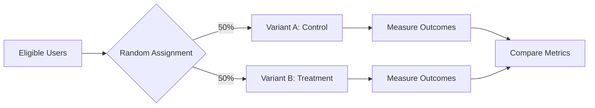
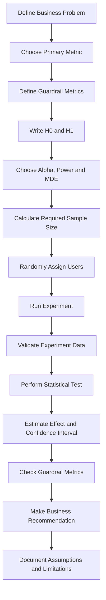

# 004 — A/B Testing Analysis

| Field                  | Details                              |
| ---------------------- | ------------------------------------ |
| **Course Section**     | 05 — Capstone and Portfolio          |
| **Module**             | Module 09 — Capstone Projects        |
| **Content Group**      | Capstone Options                     |
| **Roadmap Source**     | Capstone Projects / Capstone Options |
| **Lesson Type**        | Capstone                             |
| **Order in Module**    | 004                                  |
| **Suggested Duration** | 24 minutes                           |

---

## 1. Lesson Summary

**A/B Testing Analysis** is the process of comparing two versions of a product, feature, message, or experience to determine whether one performs better than the other.

A typical A/B test contains:

* **Variant A:** The current or control experience.
* **Variant B:** The new or treatment experience.
* **Primary metric:** The outcome used to compare the variants.
* **Random assignment:** Users are randomly assigned to A or B.
* **Statistical analysis:** The observed difference is evaluated to determine whether it is likely to represent a real effect.

A/B testing is widely used in:

* Product development
* Marketing
* E-commerce
* User experience design
* Recommendation systems
* Pricing experiments
* Email campaigns
* Advertising
* Machine learning product evaluation

In technology companies, A/B testing is essentially a modern form of a **randomized controlled experiment**. Users are randomly divided between different product variants, and their behavior is measured to determine which variant performs better.

A strong A/B testing capstone project should connect:

```text
Business question
      ↓
Experimental design
      ↓
Data collection
      ↓
Exploratory analysis
      ↓
Statistical testing
      ↓
Effect-size estimation
      ↓
Business recommendation
```

---

## 2. Learning Objectives

By the end of this lesson, you should be able to:

1. Explain A/B testing in your own words.
2. Identify where A/B testing belongs in the AI and data science workflow.
3. Define control and treatment groups.
4. Select an appropriate experiment metric.
5. Write null and alternative hypotheses.
6. calculate and interpret conversion rates.
7. Perform a statistical significance test.
8. Interpret a p-value and confidence interval correctly.
9. Distinguish statistical significance from practical significance.
10. Communicate experiment results through charts, metrics, recommendations, and limitations.
11. Build a reproducible A/B testing notebook for your portfolio.

---

## 3. Why A/B Testing Matters

Without an experiment, a team may observe that a metric changed after releasing a feature. However, that change could have been caused by:

* Seasonality
* Marketing campaigns
* Different user populations
* External events
* Product changes released at the same time
* Random variation
* Tracking errors

A/B testing reduces these problems by comparing two groups under similar conditions.

For example, suppose a company adds an autoplay video to its website. The team wants to know whether the video increases the time users spend on the site.

Instead of releasing the video to every user, the company can:

1. Randomly assign some users to the original website.
2. Randomly assign other users to the website with the video.
3. Measure time spent on the site.
4. Compare the two groups.
5. Determine whether the difference is large and reliable enough to justify deployment.

The supporting example describes this exact structure: a control group sees the existing website, while a treatment group sees the new video feature. The experiment then compares the average time spent on the website.

---

## 4. Core A/B Testing Concepts

### 4.1 Control Group

The **control group** receives the current experience.

Examples:

* Current checkout page
* Existing recommendation algorithm
* Original email subject line
* Current pricing page
* Existing button color

The control group provides a baseline against which the treatment is evaluated.

---

### 4.2 Treatment Group

The **treatment group** receives the new experience.

Examples:

* Redesigned checkout page
* New ranking model
* Personalized email subject line
* New pricing layout
* Different call-to-action button

Only the intended experimental change should differ between control and treatment whenever possible.

---

### 4.3 Random Assignment

Users should be randomly assigned to the experiment groups.



Random assignment helps balance user characteristics across the two groups.

These characteristics may include:

* Age
* Location
* Device type
* Existing engagement level
* Traffic source
* Purchase history
* Subscription status

Without proper randomization, the treatment group may not represent the same population as the control group, creating biased results.

The experiment dataset must also be representative of the user population. For example, selecting only users who arrived through video advertisements would produce a biased sample for an autoplay-video experiment.

---

### 4.4 Experimental Unit

The **experimental unit** is the entity randomly assigned to a variant.

Common experimental units include:

* User
* Session
* Household
* Device
* Store
* Region
* Organization

For many product experiments, the correct unit is the **user**, not the page view.

If the same user can appear in both variants, the experiment may become contaminated.

---

### 4.5 Primary Metric

The **primary metric** is the main outcome used to make the decision.

Examples include:

| Business Goal                  | Possible Primary Metric     |
| ------------------------------ | --------------------------- |
| Increase purchases             | Conversion rate             |
| Increase engagement            | Session duration            |
| Improve retention              | 7-day retention rate        |
| Improve email performance      | Click-through rate          |
| Increase revenue               | Revenue per user            |
| Reduce abandonment             | Checkout completion rate    |
| Improve recommendation quality | Click-through or watch time |

A good primary metric should be:

* Relevant to the business question
* Measurable
* Sensitive to the treatment
* Defined before the experiment begins
* Difficult to manipulate unintentionally

---

### 4.6 Guardrail Metrics

A treatment may improve the primary metric while damaging another important outcome.

For example:

```text
Primary metric:
Conversion rate increases.

Possible negative effects:
- Refund rate increases.
- Page-load time becomes slower.
- Customer-support tickets increase.
- User retention decreases.
```

Guardrail metrics protect the experiment from producing a locally positive but globally harmful decision.

Examples:

* Crash rate
* Latency
* Unsubscribe rate
* Refund rate
* Complaint rate
* Retention
* Revenue
* User satisfaction

---

## 5. Hypothesis Testing

A/B testing normally starts with two competing hypotheses.

### 5.1 Null Hypothesis

The **null hypothesis**, written as \(H_0\), usually states that the treatment has no effect.

For a conversion-rate experiment:

$$
H_0: p_B = p_A
$$

Where:

* \(p_A\) is the true conversion rate of the control.
* \(p_B\) is the true conversion rate of the treatment.

Equivalent form:

$$
H_0: p_B - p_A = 0
$$

---

### 5.2 Alternative Hypothesis

The **alternative hypothesis**, written as \(H_1\), represents the effect the team wants to detect.

For a two-sided test:

$$
H_1: p_B \neq p_A
$$

For a one-sided test where the team only cares whether B is better:

$$
H_1: p_B > p_A
$$

The hypotheses must be defined before examining the results.

The source material also describes this process as attempting to reject the hypothesis that the treatment has no effect in favor of an alternative hypothesis that it does have an effect.

---

## 6. One-Sided Versus Two-Sided Tests

### One-Sided Test

Use a one-sided test when only one direction is relevant.

Example:

$$
H_1: p_B > p_A
$$

This asks:

> Does variant B increase conversion compared with variant A?

### Two-Sided Test

Use a two-sided test when both an increase and a decrease matter.

Example:

$$
H_1: p_B \neq p_A
$$

This asks:

> Does variant B produce a different conversion rate from variant A?

A two-sided test is usually safer when a treatment could either improve or damage the metric.

Do not choose a one-sided test after seeing the direction of the result.

---

## 7. Statistical Significance

### 7.1 Significance Level

The significance level is normally represented by:

$$
\alpha
$$

A common value is:

$$
\alpha = 0.05
$$

This means the experiment accepts a maximum 5% Type I error rate under the assumptions of the statistical procedure.

---

### 7.2 P-Value

The p-value is:

> The probability of observing a result at least as extreme as the result obtained, assuming the null hypothesis is true.

It is **not**:

* The probability that the null hypothesis is true
* The probability that the treatment does not work
* The probability that the result occurred only by chance
* The probability that the experiment will reproduce successfully

The decision rule is commonly written as:

```text
If p-value < alpha:
    Reject the null hypothesis.

If p-value >= alpha:
    Do not reject the null hypothesis.
```

Failing to reject \(H_0\) does not prove that A and B are identical. It only means that the experiment did not provide sufficient evidence of a difference.

Traditional fixed-sample experiments select a sample size in advance, collect the data, and then calculate the p-value after the planned sample has been obtained.

---

## 8. Type I and Type II Errors

### 8.1 Type I Error

A **Type I error** occurs when the analysis concludes that there is an effect even though no real effect exists.

```text
Conclusion: Variant B is better.
Reality: Variant B is not better.
```

This is also called a **false positive**.

The probability of a Type I error is controlled by (\alpha).

---

### 8.2 Type II Error

A **Type II error** occurs when the analysis fails to detect a real effect.

```text
Conclusion: No meaningful difference was detected.
Reality: Variant B is actually better.
```

This is also called a **false negative**.

The probability of a Type II error is represented by:

$$
\beta
$$

Statistical power is:

$$
Power = 1 - \beta
$$

A common experiment design target is:

$$
Power = 0.80
$$

---

### 8.3 Error Matrix

| Reality            |      Reject \(H_0\) | Do Not Reject \(H_0\) |
| ------------------ | ----------------: | ------------------: |
| No real effect     |      Type I error |    Correct decision |
| Real effect exists | Correct detection |       Type II error |

The relative cost of these errors depends on the business context.

For example:

* A false positive may lead to deploying a harmful feature.
* A false negative may cause the company to reject a valuable improvement.

---

## 9. Statistical Significance Versus Practical Significance

A result can be statistically significant but too small to matter.

Suppose:

```text
Control conversion rate:   10.00%
Treatment conversion rate: 10.08%
P-value:                    0.01
```

The difference is statistically significant, but the absolute improvement is only:

$$
10.08\% - 10.00\% = 0.08
\text{ percentage points}
$$

Whether this is valuable depends on:

* Number of users
* Revenue per conversion
* Development cost
* Maintenance cost
* Operational risk
* User experience impact

A good recommendation must consider:

```text
Statistical evidence
        +
Effect size
        +
Confidence interval
        +
Business value
        +
Guardrail metrics
```

---

## 10. Effect Size

### 10.1 Absolute Difference

$$
Absolute\ Difference = p_B - p_A
$$

Example:

$$
0.12 - 0.10 = 0.02
$$

The treatment improves conversion by **2 percentage points**.

---

### 10.2 Relative Lift

$$
Relative\ Lift =
\frac{p_B - p_A}{p_A}
$$

Example:

$$
\frac{0.12 - 0.10}{0.10} = 0.20
$$

The relative lift is:

$$
20\%
$$

Be precise when communicating results:

* **2 percentage-point increase**
* **20% relative increase**

These statements describe the same experiment but are not interchangeable.

---

## 11. Confidence Intervals

A confidence interval provides a plausible range for the treatment effect.

Suppose the estimated effect is:

$$
+2.0 \text{ percentage points}
$$

With a 95% confidence interval:

$$
[+0.5,\ +3.5]
$$

This suggests that the treatment probably improves conversion, and the likely effect lies between 0.5 and 3.5 percentage points under the assumptions of the method.

A useful decision framework is:

| Confidence Interval                        | Interpretation                                          |
| ------------------------------------------ | ------------------------------------------------------- |
| Entirely above zero                        | Evidence that B improves the metric                     |
| Includes zero                              | Result is inconclusive                                  |
| Entirely below zero                        | Evidence that B reduces the metric                      |
| Above zero but below minimum useful effect | Statistically positive but possibly not worth deploying |

Confidence intervals are often more informative than reporting only a p-value.

---

## 12. Minimum Detectable Effect

The **Minimum Detectable Effect**, or MDE, is the smallest effect that the experiment is designed to detect reliably.

Example:

```text
Baseline conversion rate: 10%
Minimum useful lift:       5% relative
Absolute MDE:              0.5 percentage points
Significance level:        5%
Statistical power:         80%
```

The MDE should be based on business value rather than selected arbitrarily.

A smaller MDE requires a larger sample.

---

## 13. Sample Size Planning

Sample size depends on:

* Baseline conversion rate
* Minimum detectable effect
* Significance level
* Statistical power
* Allocation ratio
* Metric variability

General relationships:

```text
Smaller effect to detect
        ↓
Larger required sample

Higher statistical power
        ↓
Larger required sample

Lower significance level
        ↓
Larger required sample

Higher metric variance
        ↓
Larger required sample
```

Sample size should be calculated before starting the experiment.

Stopping an experiment as soon as the p-value becomes significant can inflate the false-positive rate.

---

## 14. End-to-End A/B Testing Workflow



### Step 1: Define the Business Problem

Weak question:

> Is version B better?

Better question:

> Does showing the new checkout design increase purchase conversion among eligible users without increasing refund rate or page latency?

---

### Step 2: Define the Population

Specify:

* Who is eligible?
* Are existing users and new users included?
* Which countries are included?
* Which platforms are included?
* Are employees and bots excluded?
* Is assignment based on users or sessions?

---

### Step 3: Select Metrics

Example:

```text
Primary metric:
Purchase conversion rate

Secondary metrics:
Average order value
Revenue per user

Guardrail metrics:
Refund rate
Page latency
Checkout error rate
```

---

### Step 4: Define Hypotheses

$$
H_0: p_B - p_A = 0
$$

$$
H_1: p_B - p_A \neq 0
$$

---

### Step 5: Plan the Experiment

Define:

* Significance level
* Statistical power
* Minimum detectable effect
* Required sample size
* Planned duration
* Assignment ratio
* Stopping rule

---

### Step 6: Randomize and Run

Users should remain in the same group throughout the experiment.

A common assignment method is:

```python
variant = hash(user_id) % 2
```

Where:

* `0` represents the control.
* `1` represents the treatment.

Production systems normally use a stable hashing or experimentation platform rather than Python's default process-dependent hash function.

---

### Step 7: Validate the Data

Before testing the hypothesis, check:

* Duplicate users
* Missing values
* Invalid events
* Bot traffic
* Tracking differences
* Assignment consistency
* Sample-ratio mismatch
* Experiment start and end dates
* Unexpected exposure to both variants

---

### Step 8: Analyze the Results

The analysis should report:

* Sample size per group
* Number of conversions
* Conversion rate
* Absolute difference
* Relative lift
* Confidence interval
* P-value
* Guardrail changes
* Segment-level observations

---

### Step 9: Make a Decision

Possible recommendations include:

* Ship the treatment
* Keep the control
* Continue collecting data
* Run a follow-up experiment
* Roll out only to a specific segment
* Investigate tracking or randomization problems

---

## 15. Practical Example: Website Advertisement Experiment

Assume a company wants to determine whether displaying a new advertisement increases purchases.

The dataset contains:

| Column          | Description                                |
| --------------- | ------------------------------------------ |
| `user_id`       | Unique user identifier                     |
| `test_group`    | `ad` or `psa`                              |
| `converted`     | Whether the user purchased                 |
| `total_ads`     | Number of advertisements seen              |
| `most_ads_day`  | Day with the most advertisement exposures  |
| `most_ads_hour` | Hour with the most advertisement exposures |

A similar practical dataset compares users who saw an advertisement with users who saw a public-service announcement, using conversion as the target outcome.

### Business Question

> Does showing the advertisement increase conversion compared with showing the public-service announcement?

### Hypotheses

$$
H_0: p_{ad} = p_{psa}
$$

$$
H_1: p_{ad} \neq p_{psa}
$$

### Primary Metric

$$
Conversion\ Rate =
\frac{Number\ of\ Converted\ Users}
{Total\ Number\ of\ Users}
$$

---

## 16. Python Analysis Example

```python
from __future__ import annotations

import math

import pandas as pd
from statsmodels.stats.proportion import proportions_ztest


def analyze_ab_test(
    df: pd.DataFrame,
    group_column: str = "test_group",
    outcome_column: str = "converted",
    control_label: str = "psa",
    treatment_label: str = "ad",
    alpha: float = 0.05,
) -> dict[str, float | int | str]:
    """
    Analyze a two-group A/B test with a binary outcome.

    The function:
    - validates the required columns,
    - calculates conversion rates,
    - runs a two-proportion z-test,
    - estimates an approximate confidence interval,
    - returns a deployment-oriented summary.
    """

    required_columns = {group_column, outcome_column}
    missing_columns = required_columns.difference(df.columns)

    if missing_columns:
        raise ValueError(
            f"Missing required columns: {sorted(missing_columns)}"
        )

    experiment = df[
        df[group_column].isin([control_label, treatment_label])
    ].copy()

    if experiment.empty:
        raise ValueError("No valid control or treatment observations were found.")

    experiment[outcome_column] = experiment[outcome_column].astype(int)

    grouped = experiment.groupby(group_column)[outcome_column].agg(
        conversions="sum",
        users="count",
        conversion_rate="mean",
    )

    for label in (control_label, treatment_label):
        if label not in grouped.index:
            raise ValueError(f"Experiment group '{label}' is missing.")

    control_conversions = int(grouped.loc[control_label, "conversions"])
    treatment_conversions = int(grouped.loc[treatment_label, "conversions"])

    control_users = int(grouped.loc[control_label, "users"])
    treatment_users = int(grouped.loc[treatment_label, "users"])

    control_rate = float(grouped.loc[control_label, "conversion_rate"])
    treatment_rate = float(grouped.loc[treatment_label, "conversion_rate"])

    counts = [treatment_conversions, control_conversions]
    observations = [treatment_users, control_users]

    z_statistic, p_value = proportions_ztest(
        count=counts,
        nobs=observations,
        alternative="two-sided",
    )

    absolute_difference = treatment_rate - control_rate

    relative_lift = (
        absolute_difference / control_rate
        if control_rate > 0
        else math.nan
    )

    standard_error = math.sqrt(
        treatment_rate * (1 - treatment_rate) / treatment_users
        + control_rate * (1 - control_rate) / control_users
    )

    critical_value = 1.96
    confidence_interval_low = (
        absolute_difference - critical_value * standard_error
    )
    confidence_interval_high = (
        absolute_difference + critical_value * standard_error
    )

    if p_value < alpha and confidence_interval_low > 0:
        recommendation = "Treatment shows evidence of improvement."
    elif p_value < alpha and confidence_interval_high < 0:
        recommendation = "Treatment shows evidence of harm."
    else:
        recommendation = "The result is inconclusive."

    return {
        "control_users": control_users,
        "treatment_users": treatment_users,
        "control_conversion_rate": control_rate,
        "treatment_conversion_rate": treatment_rate,
        "absolute_difference": absolute_difference,
        "relative_lift": relative_lift,
        "z_statistic": float(z_statistic),
        "p_value": float(p_value),
        "confidence_interval_low": confidence_interval_low,
        "confidence_interval_high": confidence_interval_high,
        "recommendation": recommendation,
    }


if __name__ == "__main__":
    data = pd.DataFrame(
        {
            "test_group": ["psa"] * 1_000 + ["ad"] * 1_000,
            "converted": (
                [1] * 100
                + [0] * 900
                + [1] * 125
                + [0] * 875
            ),
        }
    )

    results = analyze_ab_test(data)

    for metric, value in results.items():
        print(f"{metric}: {value}")
```

---

## 17. Example Result Interpretation

Suppose the analysis produces:

| Metric          | Control | Treatment |
| --------------- | ------: | --------: |
| Users           |  10,000 |    10,000 |
| Conversions     |   1,000 |     1,150 |
| Conversion rate |  10.00% |    11.50% |

### Absolute Difference

$$
11.50\% - 10.00\% = 1.50
\text{ percentage points}
$$

### Relative Lift

$$
\frac{11.50\% - 10.00\%}{10.00\%}
= 15\%
$$

Suppose the statistical result is:

```text
P-value: 0.001
95% confidence interval:
[0.65 percentage points, 2.35 percentage points]
```

A suitable interpretation is:

> The treatment increased observed conversion from 10.00% to 11.50%, representing an absolute increase of 1.50 percentage points and a relative lift of 15%. The result was statistically significant at the 5% level. The 95% confidence interval suggests that the true improvement is likely between approximately 0.65 and 2.35 percentage points. Assuming the experiment was correctly randomized and no guardrail metric deteriorated, the treatment is a reasonable candidate for deployment.

Avoid writing:

> There is a 99.9% probability that the treatment is better.

That conclusion is not provided by a frequentist p-value.

---

## 18. Recommended Visualizations

### 18.1 Conversion Rate Comparison

```python
import matplotlib.pyplot as plt

summary = (
    data.groupby("test_group")["converted"]
    .mean()
    .sort_index()
)

plt.figure(figsize=(7, 4))
summary.plot(kind="bar")

plt.title("Conversion Rate by Experiment Group")
plt.xlabel("Experiment Group")
plt.ylabel("Conversion Rate")
plt.xticks(rotation=0)
plt.tight_layout()
plt.show()
```

---

### 18.2 Sample Size by Group

```python
group_sizes = data["test_group"].value_counts().sort_index()

plt.figure(figsize=(7, 4))
group_sizes.plot(kind="bar")

plt.title("Number of Users by Experiment Group")
plt.xlabel("Experiment Group")
plt.ylabel("Number of Users")
plt.xticks(rotation=0)
plt.tight_layout()
plt.show()
```

---

### 18.3 Treatment-Effect Chart

A useful portfolio visualization should display:

```text
Estimated effect: +1.50 percentage points
Confidence interval: [+0.65, +2.35]
Reference line: 0
```

This communicates both the estimated improvement and its uncertainty.

---

## 19. Experiment Quality Checks

### 19.1 Sample-Ratio Mismatch

If assignment is expected to be 50/50, the observed group sizes should be reasonably close.

Example:

```text
Expected:
Control   50%
Treatment 50%

Observed:
Control   72%
Treatment 28%
```

A large unexpected difference may indicate:

* Assignment bugs
* Logging failures
* Eligibility differences
* Variant-loading failures
* Data-pipeline problems

Do not proceed directly to the outcome test when a serious sample-ratio mismatch exists.

---

### 19.2 Pre-Experiment Validation

Before evaluating the treatment effect, compare pre-treatment characteristics:

* Device distribution
* Country distribution
* Historical activity
* User tenure
* Existing subscription tier
* Previous purchase behavior

Large differences may indicate a randomization or implementation problem.

---

### 19.3 Exposure Validation

Confirm that:

* Control users did not receive the treatment.
* Treatment users successfully received the treatment.
* A user was not assigned to both groups.
* Experiment events occurred after assignment.
* Metric events were tracked consistently.

---

## 20. Common Mistakes

### Mistake 1: Looking Only at Average Metrics

A larger treatment mean does not automatically prove that the treatment is better.

The observed difference may be caused by random sampling variation.

---

### Mistake 2: Treating the P-Value as the Probability That the Hypothesis Is True

Incorrect:

> The p-value is 0.03, so there is a 97% chance that B is better.

Correct:

> Assuming no true difference exists, a result at least this extreme would occur with probability 0.03 under the test assumptions.

---

### Mistake 3: Stopping When the Result First Becomes Significant

Repeatedly checking the p-value and stopping when it falls below 0.05 increases the false-positive rate.

Use:

* A fixed sample size
* A fixed analysis date
* Or a valid sequential-testing method

Online experiments make constant monitoring easy, but traditional fixed-sample statistical methods assume that the sample size and stopping rule were planned in advance. This mismatch is an important pitfall in modern A/B testing.

---

### Mistake 4: Testing Too Many Metrics

Testing 20 independent metrics at a 5% significance level increases the chance that at least one metric appears significant by accident.

Possible solutions include:

* Preselecting one primary metric
* Applying multiple-testing corrections
* Labeling secondary analyses as exploratory
* Confirming discoveries in a new experiment

---

### Mistake 5: Ignoring Practical Significance

A statistically significant improvement may be too small to justify:

* Engineering work
* Infrastructure cost
* User confusion
* Maintenance burden
* Operational risk

---

### Mistake 6: Running the Experiment for Too Short a Period

A short experiment may fail to capture:

* Weekday versus weekend behavior
* Pay cycles
* Returning-user behavior
* Novelty effects
* Delayed conversions

---

### Mistake 7: Ignoring Novelty Effects

Users may initially interact more with a feature simply because it is new.

The effect may disappear after several days or weeks.

---

### Mistake 8: Segmenting After Seeing the Results

Searching through many segments until one becomes significant can create false discoveries.

Segment analysis should be:

* Predefined
* Corrected for multiple comparisons
* Clearly labeled exploratory
* Validated with another experiment

---

### Mistake 9: Using Sessions When Assignment Occurs by User

If users generate multiple sessions, treating every session as independent can underestimate uncertainty.

The analysis unit should align with the randomization unit.

---

### Mistake 10: Ignoring Interference

The standard analysis assumes that one user's treatment does not affect another user's outcome.

This assumption may fail in:

* Social networks
* Marketplaces
* Ride-sharing systems
* Multiplayer games
* Referral programs
* Shared workspaces

Cluster-level experiments may be required.

---

## 21. A/B Testing in the AI and Data Science Workflow

A/B testing usually appears near the end of the workflow, after offline development and evaluation.


For a machine learning system:

```text
Offline evaluation asks:
Does the model perform well on historical test data?

A/B testing asks:
Does the model improve real user or business outcomes in production?
```

A ranking model may improve offline accuracy but reduce actual user satisfaction. Online experimentation provides evidence about real-world impact.

---

## 22. Portfolio Capstone Proposal

### Project Title

**Evaluating Advertisement Effectiveness with A/B Testing**

### Problem Statement

Determine whether showing a new advertisement increases the probability that a user purchases a product.

### Dataset

Each row represents one user and contains:

* Experiment group
* Conversion outcome
* Number of advertisement exposures
* Most active advertisement day
* Most active advertisement hour

### Method

1. Load and validate the dataset.
2. Remove unnecessary index columns.
3. Check unique users and duplicates.
4. Inspect missing values.
5. Compare group sizes.
6. Calculate conversion rates.
7. Visualize the groups and outcomes.
8. Define hypotheses.
9. Perform a two-proportion z-test.
10. Estimate absolute lift and relative lift.
11. Calculate a confidence interval.
12. Analyze guardrail or secondary metrics.
13. Write a business recommendation.
14. Document assumptions and limitations.

### Deliverables

* Jupyter notebook
* Cleaned dataset or data-loading instructions
* Statistical test result
* Effect-size table
* Confidence-interval chart
* Experiment summary
* Business recommendation
* README
* Optional dashboard or API

---

## 23. Suggested Project Structure

```text
ab-testing-analysis/
├── README.md
├── requirements.txt
├── data/
│   ├── raw/
│   │   └── marketing_ab.csv
│   └── processed/
│       └── experiment_clean.csv
├── notebooks/
│   └── 01_ab_testing_analysis.ipynb
├── src/
│   ├── __init__.py
│   ├── data_validation.py
│   ├── metrics.py
│   ├── statistical_tests.py
│   └── visualization.py
├── reports/
│   ├── figures/
│   │   ├── conversion_rate.png
│   │   ├── group_size.png
│   │   └── treatment_effect.png
│   └── experiment_summary.md
└── tests/
    ├── test_metrics.py
    └── test_statistical_tests.py
```

---

## 24. Suggested Notebook Structure

```text
1. Business problem
2. Experiment design
3. Dataset description
4. Data-quality checks
5. Sample-ratio validation
6. Exploratory data analysis
7. Metric calculation
8. Hypothesis definition
9. Statistical test
10. Effect size
11. Confidence interval
12. Segment analysis
13. Guardrail metrics
14. Limitations
15. Business recommendation
```

---

## 25. README Template

```markdown
# A/B Testing Analysis

## Business Problem

Describe the product or business decision that the experiment supports.

## Experiment Design

- Control:
- Treatment:
- Experimental unit:
- Primary metric:
- Guardrail metrics:
- Significance level:
- Statistical power:
- Minimum detectable effect:

## Dataset

Explain where the data came from and what each row represents.

## Method

Describe the validation, metric calculation, statistical test, effect-size
estimation, and confidence-interval procedure.

## Results

Report:

- Sample size
- Control metric
- Treatment metric
- Absolute effect
- Relative lift
- Confidence interval
- P-value
- Guardrail results

## Recommendation

State whether the treatment should be shipped, rejected, investigated, or
tested further.

## Assumptions

Document the assumptions required by the experiment and statistical method.

## Limitations

Discuss tracking quality, experiment duration, representativeness,
interference, novelty effects, and external validity.

## Reproduction

Provide commands for installing dependencies and running the analysis.
```

---

## 26. Practical Exercise

Create an end-to-end A/B testing notebook using either a real or simulated dataset.

### Required Tasks

1. Define a business question.
2. Identify the control and treatment variants.
3. Define one primary metric.
4. Define at least one guardrail metric.
5. Write \(H_0\) and \(H_1\).
6. Validate user-level uniqueness.
7. Check group sizes.
8. Calculate the metric for both groups.
9. Create at least two charts.
10. Perform an appropriate statistical test.
11. Calculate absolute and relative lift.
12. Report a confidence interval.
13. Write a recommendation.
14. Document at least three limitations or assumptions.
15. Create a reproducible README.

### Expected Output

```text
Input:
An experiment dataset with user assignment and outcome data

Process:
Validation, exploratory analysis, metric calculation, hypothesis testing,
effect-size estimation, confidence-interval calculation, and interpretation

Output:
Notebook, charts, statistical results, business insight, limitations,
recommendation, and reproducible README
```

---

## 27. Completion Checklist

### Understanding

* [ ] I can explain A/B testing in one or two minutes.
* [ ] I can explain the difference between control and treatment groups.
* [ ] I can identify the experimental unit.
* [ ] I can define a primary metric and guardrail metrics.
* [ ] I understand the role of random assignment.

### Statistics

* [ ] I can write null and alternative hypotheses.
* [ ] I can explain a p-value correctly.
* [ ] I understand Type I and Type II errors.
* [ ] I can distinguish statistical significance from practical significance.
* [ ] I can calculate absolute lift and relative lift.
* [ ] I can interpret a confidence interval.
* [ ] I understand why sample size should be planned in advance.

### Experiment Quality

* [ ] I checked duplicates and missing values.
* [ ] I checked assignment consistency.
* [ ] I checked for sample-ratio mismatch.
* [ ] I avoided stopping the experiment early based only on the p-value.
* [ ] I documented possible novelty, seasonality, and tracking effects.
* [ ] I aligned the analysis unit with the randomization unit.

### Portfolio Artifact

* [ ] I created a notebook, query, chart, dashboard, API, or experiment report.
* [ ] I included the business problem, data, method, results, and limitations.
* [ ] I included at least one chart and one statistical metric.
* [ ] I wrote a clear business recommendation.
* [ ] Another person can reproduce or understand the project through the README.

---

## 28. Related Outcome

Build one end-to-end portfolio project that connects:

```text
Analysis
   +
Experiment design
   +
Statistical evaluation
   +
Business recommendation
   +
Reproducible delivery
```

---

## 29. Related Project

**Capstone: End-to-End AI/Data Science Portfolio Project**

A/B Testing Analysis can serve as either:

* A complete standalone portfolio project
* The online-evaluation stage of a machine learning project
* A component of a product analytics dashboard
* A statistical-analysis API
* An experiment-monitoring service
* A decision memo for product stakeholders

---

## 30. Final Summary

A/B Testing Analysis helps data scientists determine whether an observed product difference is supported by experimental evidence.

A complete analysis should not stop at comparing two averages. It should connect:

```text
Question
  → Hypothesis
  → Randomization
  → Data validation
  → Statistical test
  → Effect size
  → Confidence interval
  → Guardrail analysis
  → Business decision
```

The most important lesson is:

> A statistically significant result is not automatically a valuable result, and an insignificant result does not prove that the variants are identical.

Turn this topic into a concrete artifact such as:

* A reproducible notebook
* An experiment report
* A conversion dashboard
* A statistical-analysis API
* A Dockerized analysis service
* A portfolio case study

A strong capstone demonstrates not only that you can calculate a p-value, but also that you can design a valid experiment, identify data-quality risks, quantify uncertainty, and make a responsible product recommendation.
