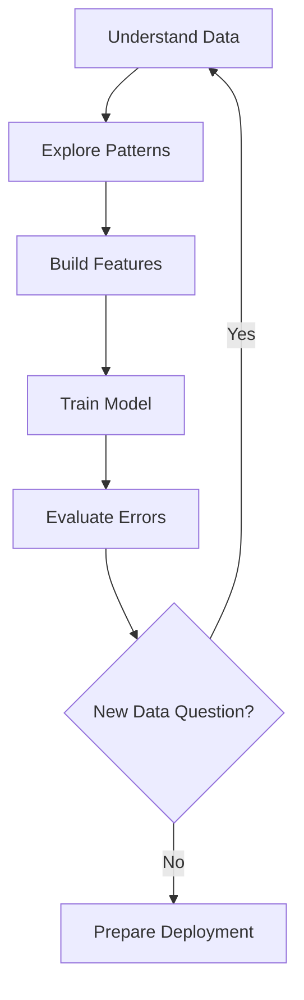
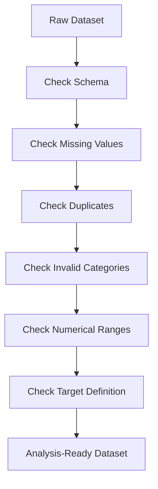

# 005 — Notebook EDA

| Field                  | Details                                    |
| ---------------------- | ------------------------------------------ |
| **Course Section**     | 05 — Capstone and Portfolio                |
| **Module**             | Module 09 — Capstone Projects              |
| **Content Group**      | Customer Churn Outputs                     |
| **Roadmap Source**     | Capstone Projects / Customer Churn Outputs |
| **Lesson Type**        | Capstone                                   |
| **Order in Module**    | 005                                        |
| **Suggested Duration** | 24 minutes                                 |

---

## 1. Lesson Summary

An **Exploratory Data Analysis notebook**, or **EDA notebook**, is a structured analysis document used to understand a dataset before building a machine learning model.

In a customer churn project, the EDA notebook should answer questions such as:

* How many customers have churned?
* Is the target variable balanced?
* Which customer groups have higher churn rates?
* Are there missing, invalid, or duplicate records?
* Which numerical variables differ between churned and retained customers?
* Which categorical features appear associated with churn?
* Are there possible data-leakage features?
* What transformations may be required before modeling?
* Which business insights can be extracted from the data?

A strong EDA notebook is more than a collection of charts. It connects:

```text
Business question
      ↓
Dataset understanding
      ↓
Data-quality validation
      ↓
Univariate analysis
      ↓
Bivariate and multivariate analysis
      ↓
Feature hypotheses
      ↓
Modeling recommendations
```

The notebook should be readable, reproducible, and useful to both technical and non-technical reviewers.

---

## 2. Learning Objectives

By the end of this lesson, you should be able to:

1. Explain the purpose of an EDA notebook.
2. Identify where EDA belongs in an AI and data science workflow.
3. Inspect the structure and quality of a customer churn dataset.
4. Analyze the churn target variable.
5. Explore numerical and categorical features.
6. Compare customer groups by churn status.
7. identify missing values, duplicates, invalid values, and outliers.
8. Detect possible data leakage.
9. Form feature-engineering and modeling hypotheses.
10. Communicate insights through charts and written interpretation.
11. Organize a reproducible notebook and repository.
12. Document assumptions, limitations, and recommended next steps.

---

## 3. What Is Notebook EDA?

EDA stands for **Exploratory Data Analysis**.

It is the process of examining a dataset using:

* Summary statistics
* Data-quality checks
* Tables
* Charts
* Group comparisons
* Correlation analysis
* Domain reasoning

The purpose is not only to describe the data, but also to discover:

* Important patterns
* Unexpected relationships
* Potential errors
* Modeling risks
* Business opportunities
* Questions that require further analysis

An EDA notebook should answer:

```text
What data do we have?
Is the data trustworthy?
What patterns are visible?
Which patterns may be useful?
Which findings may be misleading?
What should happen next?
```

---

## 4. Notebook EDA in the Data Science Workflow

EDA normally happens after data collection and before feature engineering and modeling.


EDA is not always a one-time step.

During modeling, you may return to EDA when:

* A feature behaves unexpectedly.
* Model performance is poor.
* A segment has unusually high errors.
* Data leakage is suspected.
* Production data differs from training data.

A more realistic workflow is iterative:



---

## 5. Customer Churn Problem Context

Customer churn occurs when a customer stops using a product or service.

Depending on the business, churn may mean:

* Canceling a subscription
* Closing an account
* Not renewing a contract
* Becoming inactive for a defined period
* Moving to a competitor
* Stopping purchases

A churn dataset often contains:

| Feature Type     | Example Features               |
| ---------------- | ------------------------------ |
| Customer profile | Age, region, account type      |
| Product usage    | Login frequency, monthly usage |
| Billing          | Monthly charges, total charges |
| Contract         | Contract length, renewal type  |
| Support          | Number of support tickets      |
| Engagement       | Last login, feature adoption   |
| Target           | Churned or retained            |

The EDA notebook must begin by defining exactly what **churn** means in the dataset.

---

## 6. Business Questions for a Churn EDA

A useful notebook begins with clear business questions.

Examples:

1. What percentage of customers churn?
2. Which contract types have the highest churn rate?
3. Does customer tenure relate to churn?
4. Are high monthly charges associated with churn?
5. Do customers with more support tickets churn more often?
6. Does payment method relate to churn?
7. Are new customers more likely to leave?
8. Are there customer segments with unusually high churn?
9. Are any features recorded after the customer has already churned?
10. Which variables should be investigated during modeling?

Weak objective:

> Explore the dataset.

Better objective:

> Identify customer characteristics associated with churn, validate dataset quality, and produce hypotheses for feature engineering and predictive modeling.

---

## 7. Recommended Notebook Structure

A professional EDA notebook can follow this structure:

```text
1. Project objective
2. Business context
3. Dataset description
4. Library imports and configuration
5. Data loading
6. Initial inspection
7. Data-quality validation
8. Target-variable analysis
9. Numerical-feature analysis
10. Categorical-feature analysis
11. Churn relationship analysis
12. Multivariate analysis
13. Outlier investigation
14. Leakage checks
15. Key findings
16. Modeling recommendations
17. Assumptions and limitations
18. Next steps
```

---

## 8. Example Project Setup

### 8.1 Import Libraries

```python
from __future__ import annotations

from pathlib import Path

import matplotlib.pyplot as plt
import numpy as np
import pandas as pd
```

Optional libraries:

```python
import scipy.stats as stats
from sklearn.model_selection import train_test_split
```

Keep imports organized and remove unused libraries before publishing the notebook.

---

### 8.2 Define Paths

```python
PROJECT_ROOT = Path.cwd().parent
DATA_PATH = PROJECT_ROOT / "data" / "raw" / "customer_churn.csv"
FIGURE_PATH = PROJECT_ROOT / "reports" / "figures"

FIGURE_PATH.mkdir(parents=True, exist_ok=True)
```

Avoid hardcoding personal paths such as:

```text
C:\Users\myname\Desktop\project\data.csv
```

Relative project paths make the notebook easier to reproduce.

---

### 8.3 Load the Dataset

```python
df = pd.read_csv(DATA_PATH)

print(f"Rows: {df.shape[0]:,}")
print(f"Columns: {df.shape[1]:,}")
```

---

## 9. Initial Dataset Inspection

Start by understanding the dataset structure.

```python
df.head()
```

```python
df.sample(5, random_state=42)
```

```python
df.info()
```

```python
df.describe(include="all").T
```

Useful questions:

* How many rows and columns are present?
* What does one row represent?
* Which column is the target?
* Which columns are numerical?
* Which columns are categorical?
* Are numerical values stored as text?
* Are there obvious missing values?
* Are identifiers unique?
* Are date columns parsed correctly?

---

## 10. Data Dictionary

Create a small data dictionary early in the notebook.

| Column            | Type          | Description                  | Example          |
| ----------------- | ------------- | ---------------------------- | ---------------- |
| `customer_id`     | Identifier    | Unique customer ID           | `C10293`         |
| `tenure_months`   | Numerical     | Months as a customer         | `24`             |
| `monthly_charges` | Numerical     | Monthly billing amount       | `79.50`          |
| `contract_type`   | Categorical   | Customer contract            | `Month-to-month` |
| `support_tickets` | Numerical     | Number of support requests   | `3`              |
| `churn`           | Binary target | Whether the customer churned | `Yes`            |

The data dictionary helps reviewers understand the notebook without reading the raw dataset.

---

## 11. Data-Quality Validation

EDA should validate the dataset before interpreting patterns.



---

## 12. Check Duplicate Rows

```python
duplicate_rows = df.duplicated().sum()

print(f"Duplicate rows: {duplicate_rows:,}")
```

Check duplicate customer identifiers:

```python
duplicate_customers = df["customer_id"].duplicated().sum()

print(f"Duplicate customer IDs: {duplicate_customers:,}")
```

Duplicate customer IDs may be valid if each row represents an event rather than one customer. Always confirm the unit of observation.

---

## 13. Check Missing Values

```python
missing_summary = (
    df.isna()
    .sum()
    .to_frame("missing_count")
    .assign(
        missing_percentage=lambda x:
        x["missing_count"] / len(df) * 100
    )
    .sort_values("missing_percentage", ascending=False)
)

missing_summary
```

A useful missing-value table contains:

| Column           | Missing Count | Missing Percentage |
| ---------------- | ------------: | -----------------: |
| `total_charges`  |            12 |              0.17% |
| `payment_method` |             4 |              0.06% |

Do not immediately drop missing values.

First investigate why they are missing.

Possible reasons:

* New customers have not yet received a bill.
* A tracking system did not record an event.
* The field is not applicable.
* The customer refused to provide information.
* The data pipeline failed.

Missingness may itself contain useful information.

---

## 14. Check Invalid Numerical Values

Example validation rules:

```python
validation_issues = {
    "negative_tenure": (df["tenure_months"] < 0).sum(),
    "negative_monthly_charges": (df["monthly_charges"] < 0).sum(),
    "negative_support_tickets": (df["support_tickets"] < 0).sum(),
}

validation_issues
```

Possible domain checks:

```text
tenure_months >= 0
monthly_charges >= 0
support_tickets >= 0
age between reasonable limits
total_charges approximately consistent with tenure
```

A value can be statistically unusual without being invalid. Do not remove outliers only because they look extreme.

---

## 15. Check Categorical Values

```python
categorical_columns = df.select_dtypes(
    include=["object", "category", "bool"]
).columns

for column in categorical_columns:
    print(f"\n{column}")
    print(df[column].value_counts(dropna=False))
```

Look for inconsistent categories:

```text
Male
male
MALE
Male 
```

Or:

```text
No
NO
N
False
0
```

Normalize categories carefully:

```python
df["gender"] = (
    df["gender"]
    .astype("string")
    .str.strip()
    .str.lower()
)
```

Document every transformation.

---

## 16. Target Variable Analysis

The churn target is the most important variable in the notebook.

```python
target_counts = df["churn"].value_counts(dropna=False)
target_rates = df["churn"].value_counts(
    normalize=True,
    dropna=False,
)

target_summary = pd.DataFrame(
    {
        "count": target_counts,
        "percentage": target_rates * 100,
    }
)

target_summary
```

Example:

| Churn | Count | Percentage |
| ----- | ----: | ---------: |
| No    | 5,174 |      73.5% |
| Yes   | 1,869 |      26.5% |

---

### 16.1 Churn Distribution Chart

```python
churn_rate = (
    df["churn"]
    .value_counts(normalize=True)
    .sort_index()
)

plt.figure(figsize=(7, 4))
churn_rate.plot(kind="bar")

plt.title("Customer Churn Distribution")
plt.xlabel("Churn Status")
plt.ylabel("Proportion of Customers")
plt.xticks(rotation=0)
plt.tight_layout()
plt.show()
```

### Interpretation Example

> Approximately 26.5% of customers churned. The target is moderately imbalanced, so accuracy alone may not be an appropriate model-evaluation metric. Precision, recall, F1-score, PR-AUC, and ROC-AUC should also be considered.

---

## 17. Why Target Imbalance Matters

Suppose:

```text
Retained customers: 90%
Churned customers: 10%
```

A model that predicts every customer as retained achieves:

$$
Accuracy = 90\%
$$

But it detects no churned customers.

For churn modeling, important metrics may include:

* Recall for churned customers
* Precision
* F1-score
* PR-AUC
* ROC-AUC
* Recall at a fixed intervention budget
* Expected retained revenue
* Cost-sensitive metrics

EDA should identify imbalance before modeling begins.

---

## 18. Numerical Feature Analysis

Common numerical churn features include:

* Tenure
* Monthly charges
* Total charges
* Number of support tickets
* Login frequency
* Number of products
* Usage duration

Start with summary statistics:

```python
numerical_columns = df.select_dtypes(
    include=["number"]
).columns

df[numerical_columns].describe().T
```

Useful statistics include:

* Count
* Mean
* Standard deviation
* Minimum
* Quartiles
* Maximum
* Skewness
* Missingness

---

## 19. Numerical Distribution Function

```python
def plot_numerical_distribution(
    data: pd.DataFrame,
    column: str,
) -> None:
    series = data[column].dropna()

    plt.figure(figsize=(8, 4))
    plt.hist(series, bins=30)

    plt.title(f"Distribution of {column}")
    plt.xlabel(column)
    plt.ylabel("Frequency")
    plt.tight_layout()
    plt.show()
```

Example:

```python
plot_numerical_distribution(
    data=df,
    column="tenure_months",
)
```

Questions to ask:

* Is the feature symmetric or skewed?
* Are there multiple peaks?
* Are there unusual zero values?
* Are there impossible values?
* Does the distribution suggest customer segments?
* Would a transformation be useful?

---

## 20. Numerical Features by Churn Status

```python
def summarize_numerical_by_target(
    data: pd.DataFrame,
    feature: str,
    target: str = "churn",
) -> pd.DataFrame:
    return (
        data.groupby(target)[feature]
        .agg(
            count="count",
            mean="mean",
            median="median",
            standard_deviation="std",
            minimum="min",
            maximum="max",
        )
        .round(2)
    )
```

Example:

```python
summarize_numerical_by_target(
    data=df,
    feature="tenure_months",
)
```

Possible interpretation:

> Churned customers have substantially shorter median tenure than retained customers. This suggests that the early customer lifecycle may be a high-risk period.

---

### 20.1 Box Plot by Churn

```python
groups = [
    group["tenure_months"].dropna().to_numpy()
    for _, group in df.groupby("churn")
]

labels = [
    str(label)
    for label in df["churn"].dropna().sort_values().unique()
]

plt.figure(figsize=(8, 4))
plt.boxplot(groups, tick_labels=labels)

plt.title("Customer Tenure by Churn Status")
plt.xlabel("Churn Status")
plt.ylabel("Tenure in Months")
plt.tight_layout()
plt.show()
```

A box plot helps compare:

* Median
* Spread
* Quartiles
* Extreme observations

---

## 21. Categorical Feature Analysis

Common categorical churn features include:

* Contract type
* Payment method
* Internet service
* Region
* Customer segment
* Subscription plan
* Device type
* Auto-renewal status

Start with frequency tables:

```python
df["contract_type"].value_counts(dropna=False)
```

Normalized frequencies:

```python
df["contract_type"].value_counts(
    normalize=True,
    dropna=False,
).mul(100)
```

---

## 22. Churn Rate by Category

```python
def churn_rate_by_category(
    data: pd.DataFrame,
    category: str,
    target: str = "churn_binary",
) -> pd.DataFrame:
    summary = (
        data.groupby(category, dropna=False)[target]
        .agg(
            customers="count",
            churned_customers="sum",
            churn_rate="mean",
        )
        .sort_values("churn_rate", ascending=False)
    )

    summary["churn_rate"] *= 100

    return summary.round(2)
```

Convert the target first:

```python
df["churn_binary"] = (
    df["churn"]
    .map({"No": 0, "Yes": 1})
)
```

Then analyze:

```python
contract_summary = churn_rate_by_category(
    data=df,
    category="contract_type",
)

contract_summary
```

Example:

| Contract Type  | Customers | Churned Customers | Churn Rate |
| -------------- | --------: | ----------------: | ---------: |
| Month-to-month |     3,875 |             1,655 |     42.71% |
| One year       |     1,473 |               166 |     11.27% |
| Two year       |     1,695 |                48 |      2.83% |

Possible interpretation:

> Month-to-month customers have a substantially higher observed churn rate than customers with longer contracts. Contract duration may be a useful predictive feature, but this relationship should not automatically be interpreted as causal.

---

## 23. Plot Churn Rate by Category

```python
contract_rates = (
    df.groupby("contract_type")["churn_binary"]
    .mean()
    .sort_values(ascending=False)
)

plt.figure(figsize=(8, 4))
contract_rates.plot(kind="bar")

plt.title("Churn Rate by Contract Type")
plt.xlabel("Contract Type")
plt.ylabel("Churn Rate")
plt.xticks(rotation=30, ha="right")
plt.tight_layout()
plt.show()
```

Charts should be accompanied by interpretation.

Do not leave a chart without explaining:

* What pattern is visible
* Why the pattern may matter
* What alternative explanation may exist
* What should be tested next

---

## 24. Bivariate Analysis

Bivariate analysis studies the relationship between two variables.

Examples:

```text
Tenure vs churn
Monthly charges vs churn
Contract type vs churn
Support tickets vs churn
Payment method vs churn
```

Common techniques include:

* Grouped statistics
* Cross-tabulations
* Box plots
* Stacked proportions
* Scatter plots
* Correlation coefficients
* Statistical tests

---

## 25. Cross-Tabulation

```python
contract_churn_table = pd.crosstab(
    df["contract_type"],
    df["churn"],
    margins=True,
)

contract_churn_table
```

Normalized by row:

```python
contract_churn_rate = pd.crosstab(
    df["contract_type"],
    df["churn"],
    normalize="index",
)

contract_churn_rate
```

Row normalization helps answer:

> Within each contract type, what proportion of customers churned?

---

## 26. Correlation Analysis

For numerical features:

```python
correlation_matrix = (
    df[numerical_columns]
    .corr()
    .round(2)
)

correlation_matrix
```

A correlation coefficient measures linear association.

Important cautions:

* Correlation does not imply causation.
* A low correlation does not mean no relationship exists.
* Nonlinear relationships may not appear clearly.
* Categorical variables require different analysis.
* Highly correlated features may contain redundant information.

---

### 26.1 Correlation With Churn

```python
numeric_with_target = df.select_dtypes(
    include=["number"]
)

churn_correlations = (
    numeric_with_target.corr()["churn_binary"]
    .drop("churn_binary")
    .sort_values(key=abs, ascending=False)
)

churn_correlations
```

This is only a screening tool. It is not a complete feature-selection method.

---

## 27. Multivariate Analysis

Multivariate analysis investigates how several features interact.

Examples:

* Churn rate by contract type and tenure group
* Churn rate by payment method and monthly charges
* Churn rate by support-ticket count and customer segment
* Churn rate by service type and auto-renewal status

Create tenure groups:

```python
df["tenure_group"] = pd.cut(
    df["tenure_months"],
    bins=[-1, 6, 12, 24, 48, np.inf],
    labels=[
        "0–6 months",
        "7–12 months",
        "13–24 months",
        "25–48 months",
        "49+ months",
    ],
)
```

Create a pivot table:

```python
churn_pivot = pd.pivot_table(
    df,
    index="tenure_group",
    columns="contract_type",
    values="churn_binary",
    aggfunc="mean",
    observed=False,
)

churn_pivot
```

This may reveal that the relationship between contract type and churn differs by customer tenure.

---

## 28. Outlier Analysis

An outlier is an observation far from most other values.

Possible outliers:

* Extremely high monthly charges
* Very large support-ticket counts
* Unusually long session durations
* Negative values
* Extremely large total charges

Outliers may represent:

* Real high-value customers
* Data-entry errors
* Fraud
* Enterprise accounts
* Tracking bugs
* Rare but important behavior

Use the interquartile range as an investigation tool:

```python
def iqr_bounds(series: pd.Series) -> tuple[float, float]:
    clean_series = series.dropna()

    q1 = clean_series.quantile(0.25)
    q3 = clean_series.quantile(0.75)
    iqr = q3 - q1

    lower_bound = q1 - 1.5 * iqr
    upper_bound = q3 + 1.5 * iqr

    return lower_bound, upper_bound
```

Example:

```python
lower, upper = iqr_bounds(df["monthly_charges"])

potential_outliers = df[
    (df["monthly_charges"] < lower)
    | (df["monthly_charges"] > upper)
]

print(f"Potential outliers: {len(potential_outliers):,}")
```

Do not automatically delete these rows.

---

## 29. Data Leakage

Data leakage occurs when a feature contains information that would not be available at prediction time.

Examples:

* Cancellation date
* Final account status
* Refund issued after churn
* Exit survey reason
* Churn-processing timestamp
* Number of days since cancellation
* Support case created after account closure

Leakage can produce unrealistically strong model performance.

Ask for every feature:

```text
Would this value be available at the moment we want to predict churn?
```

If the answer is no, the feature should normally be excluded.

---

## 30. Leakage-Check Table

| Feature                    | Available at Prediction Time? | Leakage Risk |
| -------------------------- | ----------------------------- | ------------ |
| `monthly_charges`          | Yes                           | Low          |
| `tenure_months`            | Yes                           | Low          |
| `support_tickets_last_30d` | Yes                           | Low          |
| `cancellation_date`        | No                            | Critical     |
| `exit_reason`              | No                            | Critical     |
| `account_status_closed`    | No                            | Critical     |

Document leakage decisions in the notebook.

---

## 31. Time-Based Considerations

A churn project may contain timestamps such as:

* Account creation date
* Last login
* Last purchase
* Cancellation date
* Billing date
* Support-contact date

Time-aware analysis can answer:

* Does churn vary by acquisition month?
* Does churn increase after a price change?
* How long before churn does engagement decline?
* Does user behavior change over the customer lifecycle?

Avoid using future information when constructing features.

For example, if the prediction date is June 1, only data available on or before June 1 should be used.

---

## 32. Segment-Level Analysis

Useful segments may include:

* New versus long-term customers
* High-value versus low-value customers
* Monthly versus annual contracts
* Mobile versus web users
* Regions
* Subscription tiers
* Acquisition channels

Example:

```python
segment_summary = (
    df.groupby("customer_segment")["churn_binary"]
    .agg(
        customers="count",
        churn_rate="mean",
    )
    .sort_values("churn_rate", ascending=False)
)

segment_summary["churn_rate"] *= 100
segment_summary
```

Use caution with small segments.

A group with three customers and two churns has a 66.7% churn rate, but that estimate is highly uncertain.

Always report group size alongside the rate.

---

## 33. Statistical Tests in EDA

Statistical tests can support exploratory findings, but they should not replace domain reasoning.

Possible tests include:

| Variable Relationship                 | Possible Test            |
| ------------------------------------- | ------------------------ |
| Categorical feature vs churn          | Chi-square test          |
| Numerical feature vs two churn groups | t-test or Mann–Whitney U |
| Multiple numerical groups             | ANOVA or Kruskal–Wallis  |
| Two binary variables                  | Two-proportion test      |

Example chi-square test:

```python
from scipy.stats import chi2_contingency

contingency_table = pd.crosstab(
    df["contract_type"],
    df["churn"],
)

chi2_statistic, p_value, degrees_of_freedom, expected = (
    chi2_contingency(contingency_table)
)

print(f"Chi-square statistic: {chi2_statistic:.3f}")
print(f"P-value: {p_value:.6f}")
```

Cautions:

* Statistical significance does not imply business importance.
* Large datasets can make tiny effects statistically significant.
* EDA often involves many comparisons.
* Multiple testing increases false-positive risk.
* Association does not imply causation.

---

## 34. Feature-Engineering Hypotheses

EDA should generate hypotheses for modeling.

Examples:

### Tenure Buckets

```python
df["is_new_customer"] = (
    df["tenure_months"] <= 6
).astype(int)
```

### Average Monthly Value

```python
df["average_charge_per_month"] = (
    df["total_charges"]
    / df["tenure_months"].replace(0, np.nan)
)
```

### Support Intensity

```python
df["support_ticket_rate"] = (
    df["support_tickets"]
    / df["tenure_months"].replace(0, np.nan)
)
```

### Product Count

```python
service_columns = [
    "phone_service",
    "internet_service",
    "streaming_service",
    "security_service",
]

df["service_count"] = (
    df[service_columns]
    .eq("Yes")
    .sum(axis=1)
)
```

Do not implement every possible feature. Prioritize features supported by:

* EDA findings
* Business knowledge
* Prediction-time availability
* Simplicity
* Interpretability

---

## 35. Example EDA Findings

A final findings section might include:

### Finding 1: New Customers Churn More Often

> Customers with fewer than six months of tenure have the highest observed churn rate. This suggests that onboarding and early customer engagement may be important areas for intervention.

### Finding 2: Month-to-Month Contracts Are High Risk

> Month-to-month customers have a substantially higher churn rate than customers on one-year or two-year contracts.

### Finding 3: Higher Monthly Charges May Be Associated With Churn

> Churned customers have higher median monthly charges, although this may be influenced by service type and contract structure.

### Finding 4: Support Friction May Matter

> Customers with repeated support contacts show a higher observed churn rate. A support-ticket frequency feature may be useful during modeling.

### Finding 5: Target Imbalance Is Present

> Churned customers represent a minority of the dataset. Model evaluation should therefore include recall, precision, F1-score, PR-AUC, and business-cost metrics rather than accuracy alone.

---

## 36. From EDA to Modeling

Each EDA finding should lead to a modeling action.

| EDA Finding                          | Possible Modeling Action                  |
| ------------------------------------ | ----------------------------------------- |
| Churn target is imbalanced           | Use stratified split and suitable metrics |
| Tenure is strongly skewed            | Test transformation or tenure buckets     |
| Rare categories exist                | Group categories or use robust encoding   |
| Missingness is informative           | Add missing-value indicators              |
| Some features are leakage            | Remove before training                    |
| Numerical variables have outliers    | Test robust preprocessing                 |
| Contract type has strong association | Encode and include in baseline            |
| Time patterns exist                  | Use temporal validation                   |

The notebook should explicitly connect analysis to the next project stage.

---

## 37. Train-Test Split Considerations

Do not perform a random split automatically without considering the problem.

### Random Split

Suitable when:

* Observations are independent.
* There is no meaningful time structure.
* Customers appear only once.

```python
train_df, test_df = train_test_split(
    df,
    test_size=0.2,
    stratify=df["churn_binary"],
    random_state=42,
)
```

### Time-Based Split

Suitable when:

* The model predicts future churn.
* Data contains historical periods.
* Customer behavior changes over time.

```text
Training data: January–September
Validation data: October
Test data: November–December
```

Time-based validation usually better represents production behavior for temporal problems.

---

## 38. Recommended Visualizations

A strong churn EDA notebook may contain:

1. Churn distribution
2. Missing-value summary
3. Numerical distributions
4. Tenure by churn status
5. Monthly charges by churn status
6. Churn rate by contract type
7. Churn rate by payment method
8. Churn rate by tenure group
9. Support tickets by churn status
10. Correlation matrix
11. Segment-level churn table
12. Outlier investigation

Avoid adding charts that do not support a question.

Each chart should have:

* Clear title
* Labeled axes
* Readable categories
* Appropriate units
* Written interpretation

---

## 39. Reusable EDA Helper Function

```python
def build_column_summary(
    data: pd.DataFrame,
) -> pd.DataFrame:
    summary = pd.DataFrame(
        {
            "dtype": data.dtypes.astype(str),
            "non_null_count": data.notna().sum(),
            "missing_count": data.isna().sum(),
            "missing_percentage": (
                data.isna().mean() * 100
            ),
            "unique_values": data.nunique(dropna=True),
        }
    )

    return summary.sort_values(
        "missing_percentage",
        ascending=False,
    )
```

Usage:

```python
column_summary = build_column_summary(df)
column_summary
```

This creates a compact overview of the dataset schema and quality.

---

## 40. Common Mistakes

### Mistake 1: Producing Charts Without Questions

Weak approach:

```text
Create every possible chart.
```

Better approach:

```text
Question:
Does customer tenure relate to churn?

Chart:
Tenure distribution by churn status

Interpretation:
New customers show a higher observed churn rate.
```

---

### Mistake 2: Describing Without Interpreting

Weak statement:

> The chart shows different contract types.

Better statement:

> Month-to-month customers have the highest observed churn rate, suggesting that contract commitment may be associated with retention.

---

### Mistake 3: Treating Association as Causation

EDA can show:

> Customers with higher monthly charges churn more often.

EDA cannot prove:

> Higher charges cause customers to churn.

Possible confounders include:

* Product bundle
* Customer type
* Contract length
* Service quality
* Usage intensity

---

### Mistake 4: Ignoring Data Leakage

A feature such as `cancellation_reason` may make the model appear extremely accurate but would be unavailable before churn.

---

### Mistake 5: Removing Outliers Automatically

Extreme values may be:

* Valid
* Business-critical
* High-value customers
* Enterprise customers
* Fraud cases

Investigate first.

---

### Mistake 6: Filling Missing Values Without Investigation

Replacing every missing value with zero may incorrectly change the meaning of the data.

---

### Mistake 7: Using Only Correlation

A feature can be predictive even when its linear correlation with churn is low.

---

### Mistake 8: Ignoring Group Size

A high churn rate in a tiny segment may not be reliable.

Report:

```text
Segment size
Churn count
Churn rate
```

---

### Mistake 9: Building a Model Inside the EDA Section Too Early

EDA should first establish:

* Data quality
* Target definition
* Feature behavior
* Risks
* Hypotheses

A simple baseline model can be added later, but it should not replace exploratory reasoning.

---

### Mistake 10: Publishing a Notebook That Cannot Run

Common reproducibility problems include:

* Hardcoded file paths
* Missing dependencies
* Cells executed in the wrong order
* Variables created manually
* Hidden preprocessing
* Missing data instructions
* Randomness without fixed seeds

Before publishing, restart the kernel and run all cells from top to bottom.

---

## 41. Practical Exercise

Create an EDA notebook for a customer churn dataset.

### Required Tasks

1. Define the business problem.
2. Define what one row represents.
3. Explain the churn target.
4. Create a data dictionary.
5. Inspect dataset shape and types.
6. Check duplicate rows and duplicate customers.
7. Measure missing values.
8. Validate numerical ranges.
9. Inspect categorical values.
10. Analyze target imbalance.
11. Analyze at least three numerical features.
12. Analyze at least three categorical features.
13. Compare features by churn status.
14. Create at least five useful charts.
15. identify at least one leakage risk.
16. Propose at least three feature-engineering ideas.
17. Write key business insights.
18. Write assumptions and limitations.
19. Recommend the next modeling steps.
20. Create a reproducible README.

---

## 42. Expected Output

```text
Input:
A customer-level churn dataset

Process:
Data inspection, quality validation, univariate analysis,
bivariate analysis, multivariate exploration, leakage checks,
and hypothesis generation

Output:
A reproducible EDA notebook containing charts, metrics,
business insights, limitations, and modeling recommendations
```

---

## 43. Suggested Project Structure

```text
customer-churn-capstone/
├── README.md
├── requirements.txt
├── data/
│   ├── raw/
│   │   └── customer_churn.csv
│   └── processed/
│       └── customer_churn_clean.csv
├── notebooks/
│   ├── 01_eda.ipynb
│   ├── 02_feature_engineering.ipynb
│   └── 03_modeling.ipynb
├── src/
│   ├── __init__.py
│   ├── data_validation.py
│   ├── preprocessing.py
│   ├── visualization.py
│   └── features.py
├── reports/
│   ├── figures/
│   │   ├── churn_distribution.png
│   │   ├── churn_by_contract.png
│   │   └── tenure_by_churn.png
│   └── eda_summary.md
└── tests/
    ├── test_data_validation.py
    └── test_features.py
```

---

## 44. README Template

```markdown
# Customer Churn Exploratory Data Analysis

## Business Problem

Explain why churn matters and what decision the analysis supports.

## Dataset

Describe:

- Data source
- Number of rows and columns
- Unit of observation
- Target definition
- Important features

## Analysis Questions

List the main questions investigated in the notebook.

## Data Quality

Summarize:

- Missing values
- Duplicates
- Invalid values
- Category inconsistencies
- Leakage risks

## Key Findings

Present the most important customer and churn patterns.

## Visualizations

Include the most useful charts and explain what they show.

## Modeling Recommendations

Describe:

- Candidate features
- Features to exclude
- Preprocessing requirements
- Evaluation metrics
- Validation strategy

## Assumptions and Limitations

Document possible bias, missing information, data age, and causal limitations.

## Reproduction

Provide commands for installing dependencies and running the notebook.
```

---

## 45. Example Executive Summary

> The dataset contains one record per customer and includes contract, billing, service, engagement, and churn information. Approximately one quarter of customers have churned, indicating moderate target imbalance. Churn is highest among customers with short tenure, month-to-month contracts, repeated support interactions, and certain high-cost service configurations. Several post-churn fields were identified as potential leakage and should be excluded before modeling. The next phase should build a stratified baseline model using recall, precision, F1-score, PR-AUC, and business-cost metrics, followed by segment-level error analysis.

---

## 46. Assumptions and Limitations

A professional EDA notebook should include limitations such as:

* The dataset may not represent current customer behavior.
* Churn may be defined differently across business units.
* The analysis is observational and does not establish causality.
* Some important factors may not be recorded.
* Missing values may not be random.
* Historical product changes may influence behavior.
* Customer records may not be independent.
* Small segments may produce unstable churn rates.
* The dataset may contain selection bias.
* The training population may differ from future production users.

---

## 47. Completion Checklist

### Dataset Understanding

* [ ] I know what one row represents.
* [ ] I know how churn is defined.
* [ ] I created a data dictionary.
* [ ] I identified numerical, categorical, date, identifier, and target columns.

### Data Quality

* [ ] I checked missing values.
* [ ] I checked duplicate rows.
* [ ] I checked duplicate customer identifiers.
* [ ] I validated numerical ranges.
* [ ] I inspected categorical values.
* [ ] I investigated possible outliers.
* [ ] I identified potential data leakage.

### Analysis

* [ ] I analyzed the churn target.
* [ ] I measured class imbalance.
* [ ] I explored numerical distributions.
* [ ] I explored categorical distributions.
* [ ] I compared features by churn status.
* [ ] I performed at least one multivariate analysis.
* [ ] I reported group sizes alongside rates.

### Communication

* [ ] Every important chart answers a question.
* [ ] Every important chart has a written interpretation.
* [ ] I distinguished association from causation.
* [ ] I summarized the most important business findings.
* [ ] I documented assumptions and limitations.
* [ ] I recommended clear next steps.

### Reproducibility

* [ ] The notebook runs from top to bottom.
* [ ] File paths are portable.
* [ ] Dependencies are documented.
* [ ] Random seeds are fixed where needed.
* [ ] The README explains how to reproduce the analysis.
* [ ] Charts and outputs are saved in organized folders.

---

## 48. Related Outcome

Build one end-to-end portfolio project that connects:

```text
Business understanding
        +
Data validation
        +
Exploratory analysis
        +
Feature engineering
        +
Modeling
        +
Evaluation
        +
Deployment
```

---

## 49. Related Project

**Capstone: End-to-End Customer Churn Prediction Project**

The Notebook EDA can become:

* A standalone portfolio artifact
* The first analytical stage of a churn prediction system
* A source for dashboard requirements
* A guide for feature engineering
* A business-retention report
* A foundation for model monitoring
* A reproducible case study for interviews

---

## 50. Final Summary

A strong **Notebook EDA** does not simply display charts. It creates a logical path from raw data to modeling decisions.

The recommended flow is:

```text
Define the problem
      ↓
Understand the dataset
      ↓
Validate data quality
      ↓
Analyze churn distribution
      ↓
Explore numerical features
      ↓
Explore categorical features
      ↓
Compare customer segments
      ↓
Detect leakage and limitations
      ↓
Generate feature hypotheses
      ↓
Recommend modeling steps
```

The most important principle is:

> Every chart should answer a question, every finding should include interpretation, and every interpretation should lead to a decision, hypothesis, or next step.

Turn the lesson into a concrete portfolio artifact containing:

* A reproducible notebook
* A clear business problem
* A data dictionary
* Data-quality checks
* Useful charts
* Churn metrics
* Business insights
* Leakage warnings
* Modeling recommendations
* Assumptions and limitations
* A complete README

A high-quality EDA notebook shows that you can move beyond code execution and understand how data quality, customer behavior, business context, and modeling decisions connect.
