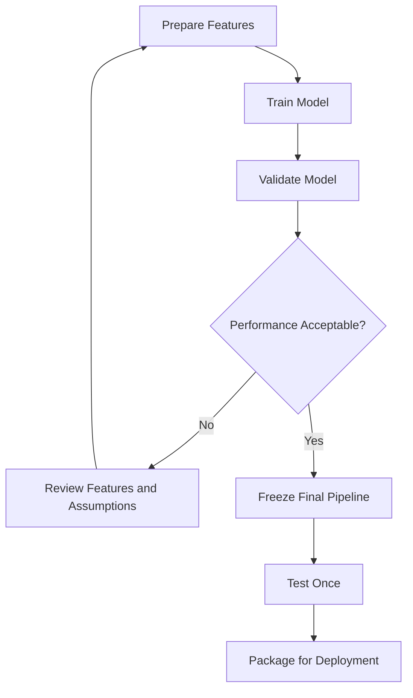
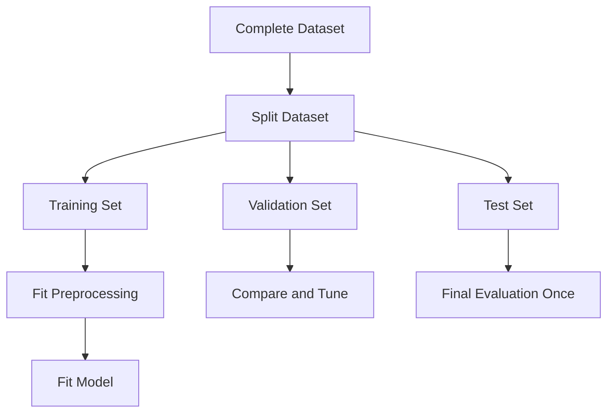
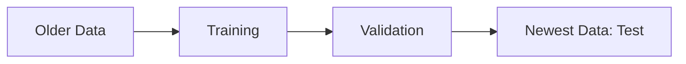
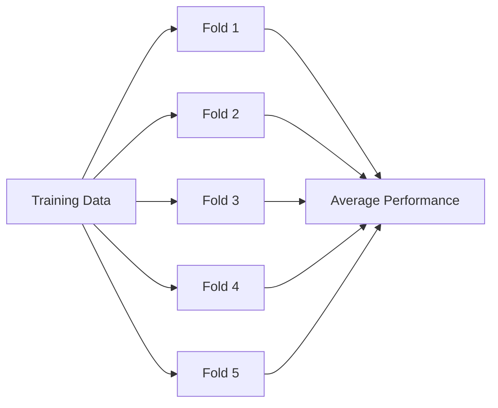

# 006 — Notebook Training

| Field                  | Details                                    |
| ---------------------- | ------------------------------------------ |
| **Course Section**     | 05 — Capstone and Portfolio                |
| **Module**             | Module 09 — Capstone Projects              |
| **Content Group**      | Customer Churn Outputs                     |
| **Roadmap Source**     | Capstone Projects / Customer Churn Outputs |
| **Lesson Type**        | Capstone                                   |
| **Order in Module**    | 006                                        |
| **Suggested Duration** | 24 minutes                                 |

---

## 1. Lesson Summary

A **training notebook** is a reproducible document that transforms an analysis-ready dataset into one or more trained machine learning models.

In a customer churn project, the notebook should demonstrate how to:

* Define the prediction target
* Select features available at prediction time
* Split data correctly
* Build preprocessing pipelines
* Train a simple baseline
* Train and compare candidate models
* Handle class imbalance
* Tune important hyperparameters
* Evaluate validation performance
* Select a final model
* Save the complete preprocessing and model pipeline
* Document assumptions, limitations, and next steps

A strong training notebook connects the exploratory analysis to a deployable model artifact.

```text
EDA findings
    ↓
Feature selection
    ↓
Train-validation-test split
    ↓
Preprocessing pipeline
    ↓
Baseline model
    ↓
Candidate models
    ↓
Cross-validation and tuning
    ↓
Model selection
    ↓
Saved model artifact
```

The notebook should make it possible for another person to understand:

1. What was trained
2. Which data was used
3. How leakage was prevented
4. How models were compared
5. Why the final model was selected
6. How to reproduce the result

---

## 2. Learning Objectives

By the end of this lesson, you should be able to:

1. Explain the purpose of a model-training notebook.
2. Identify where model training belongs in the AI and data science workflow.
3. Convert EDA findings into modeling decisions.
4. Separate features, identifiers, and targets correctly.
5. Create train, validation, and test datasets.
6. Prevent data leakage during preprocessing.
7. Build reusable preprocessing pipelines.
8. Train a baseline churn model.
9. Compare multiple classification models.
10. Handle class imbalance appropriately.
11. Use cross-validation for reliable model comparison.
12. Perform basic hyperparameter tuning.
13. Select a model using technical and business criteria.
14. Save a complete trained pipeline.
15. Document experiment results and limitations.

---

## 3. What Is a Training Notebook?

A training notebook contains the code, reasoning, experiments, and results required to train a machine learning model.

It should answer the following questions:

```text
What outcome are we predicting?

Which data is available when the prediction is made?

How is the data divided?

How are missing values and categories processed?

Which baseline should the model beat?

Which models were tested?

How were they compared?

Which model was selected?

How can the model be reused?
```

A training notebook is not only a place to call `.fit()`.

It should explain the complete training process from raw features to a saved model artifact.

---

## 4. Training in the Data Science Workflow

Model training usually begins after the dataset has been explored and validated.


The process is iterative rather than strictly linear.



When model performance is weak, the correct response is not always to use a more complex algorithm.

You may need to revisit:

* Target definition
* Data quality
* Feature availability
* Missing values
* Leakage risks
* Class imbalance
* Validation strategy
* Business objective

---

## 5. Customer Churn Training Objective

A churn model estimates the probability that a customer will leave within a defined future period.

A clear objective might be:

> Predict whether an active customer will churn within the next 30 days using only information available at the prediction date.

This statement defines:

* **Population:** Active customers
* **Prediction event:** Churn
* **Prediction window:** Next 30 days
* **Feature cutoff:** Prediction date
* **Task type:** Binary classification

The target can be represented as:

$$
y =
\begin{cases}
1, & \text{if the customer churns within 30 days} \\
0, & \text{otherwise}
\end{cases}
$$

Without a clear target window, model results may be difficult to interpret or deploy.

---

## 6. Input and Output

### Input

A customer-level dataset containing features such as:

* Customer tenure
* Contract type
* Subscription plan
* Monthly charges
* Product usage
* Support interactions
* Payment method
* Engagement activity
* Renewal status

### Output

The notebook should produce:

* A preprocessing pipeline
* A trained baseline model
* One or more candidate models
* Cross-validation results
* Validation metrics
* Feature or coefficient analysis
* A selected final model
* A serialized model file
* Assumptions and limitations
* Recommended next steps

```text
Input:
Analysis-ready customer dataset

Process:
Split, preprocess, train, validate, compare, tune, and select

Output:
Reproducible notebook, experiment results, and saved model pipeline
```

---

## 7. Recommended Notebook Structure

```text
1. Business objective
2. Modeling assumptions
3. Imports and configuration
4. Data loading
5. Schema validation
6. Target preparation
7. Feature selection
8. Train-validation-test split
9. Preprocessing pipeline
10. Dummy baseline
11. Logistic regression baseline
12. Candidate model training
13. Cross-validation
14. Class-imbalance experiments
15. Hyperparameter tuning
16. Validation comparison
17. Error and feature analysis
18. Final model selection
19. Final test evaluation
20. Model serialization
21. Limitations and next steps
```

---

## 8. Suggested Project Structure

```text
customer-churn-capstone/
├── README.md
├── requirements.txt
├── data/
│   ├── raw/
│   │   └── customer_churn.csv
│   └── processed/
│       └── customer_churn_clean.csv
├── notebooks/
│   ├── 01_eda.ipynb
│   ├── 02_training.ipynb
│   └── 03_evaluation.ipynb
├── src/
│   ├── __init__.py
│   ├── data_validation.py
│   ├── preprocessing.py
│   ├── train.py
│   ├── evaluate.py
│   └── config.py
├── models/
│   ├── churn_pipeline.joblib
│   └── model_metadata.json
├── reports/
│   ├── figures/
│   └── training_summary.md
└── tests/
    ├── test_preprocessing.py
    ├── test_training.py
    └── test_prediction_schema.py
```

---

## 9. Imports and Reproducibility

```python
from __future__ import annotations

import json
import random
from pathlib import Path

import joblib
import numpy as np
import pandas as pd

from sklearn.compose import ColumnTransformer
from sklearn.dummy import DummyClassifier
from sklearn.ensemble import HistGradientBoostingClassifier, RandomForestClassifier
from sklearn.impute import SimpleImputer
from sklearn.linear_model import LogisticRegression
from sklearn.metrics import (
    average_precision_score,
    classification_report,
    confusion_matrix,
    f1_score,
    precision_score,
    recall_score,
    roc_auc_score,
)
from sklearn.model_selection import (
    GridSearchCV,
    StratifiedKFold,
    cross_validate,
    train_test_split,
)
from sklearn.pipeline import Pipeline
from sklearn.preprocessing import OneHotEncoder, StandardScaler
```

Set a random seed:

```python
RANDOM_STATE = 42

random.seed(RANDOM_STATE)
np.random.seed(RANDOM_STATE)
```

A fixed seed improves reproducibility, although exact results may still vary across library versions and hardware.

---

## 10. Load the Analysis-Ready Dataset

```python
PROJECT_ROOT = Path.cwd().parent
DATA_PATH = PROJECT_ROOT / "data" / "processed" / "customer_churn_clean.csv"

df = pd.read_csv(DATA_PATH)

print(f"Rows: {len(df):,}")
print(f"Columns: {df.shape[1]:,}")
```

Perform basic validation:

```python
required_columns = {
    "customer_id",
    "churn",
    "tenure_months",
    "monthly_charges",
    "contract_type",
}

missing_columns = required_columns.difference(df.columns)

if missing_columns:
    raise ValueError(
        f"Missing required columns: {sorted(missing_columns)}"
    )
```

The training notebook should fail clearly when expected columns are missing.

---

## 11. Prepare the Target Variable

Convert the churn target into a binary value.

```python
target_mapping = {
    "No": 0,
    "Yes": 1,
}

df["churn_binary"] = df["churn"].map(target_mapping)
```

Validate the mapping:

```python
if df["churn_binary"].isna().any():
    invalid_values = (
        df.loc[df["churn_binary"].isna(), "churn"]
        .drop_duplicates()
        .tolist()
    )

    raise ValueError(
        f"Unexpected churn values: {invalid_values}"
    )
```

Check the distribution:

```python
target_distribution = (
    df["churn_binary"]
    .value_counts(normalize=True)
    .sort_index()
)

target_distribution
```

---

## 12. Select Features Carefully

Separate:

* Target columns
* Identifier columns
* Leakage columns
* Valid modeling features

```python
target_column = "churn_binary"

identifier_columns = [
    "customer_id",
]

leakage_columns = [
    "churn",
    "cancellation_date",
    "exit_reason",
    "account_closed_at",
]

excluded_columns = set(
    identifier_columns
    + leakage_columns
    + [target_column]
)

feature_columns = [
    column
    for column in df.columns
    if column not in excluded_columns
]
```

Create the feature matrix and target vector:

```python
X = df[feature_columns].copy()
y = df[target_column].copy()
```

For every feature, ask:

> Would this feature be available at the time the churn prediction is generated?

A feature should not be used only because it improves performance.

---

## 13. Split Before Preprocessing

The dataset should be split before imputers, scalers, encoders, or feature selectors are fitted.



Incorrect process:

```text
Full dataset
    ↓
Fit scaler and encoder
    ↓
Split into train and test
```

This allows information from the validation or test data to influence preprocessing.

Correct process:

```text
Split the dataset
    ↓
Fit preprocessing only on training data
    ↓
Transform validation and test data
```

A scikit-learn pipeline handles this safely.

---

## 14. Train, Validation, and Test Split

A useful structure is:

* **Training set:** Fit model parameters
* **Validation set:** Compare models and tune settings
* **Test set:** Estimate final performance once

First separate the test set:

```python
X_train_validation, X_test, y_train_validation, y_test = (
    train_test_split(
        X,
        y,
        test_size=0.20,
        stratify=y,
        random_state=RANDOM_STATE,
    )
)
```

Then create training and validation sets:

```python
X_train, X_validation, y_train, y_validation = (
    train_test_split(
        X_train_validation,
        y_train_validation,
        test_size=0.25,
        stratify=y_train_validation,
        random_state=RANDOM_STATE,
    )
)
```

This produces approximately:

```text
Training:   60%
Validation: 20%
Test:       20%
```

Check distributions:

```python
split_summary = pd.DataFrame(
    {
        "rows": [
            len(X_train),
            len(X_validation),
            len(X_test),
        ],
        "churn_rate": [
            y_train.mean(),
            y_validation.mean(),
            y_test.mean(),
        ],
    },
    index=["train", "validation", "test"],
)

split_summary
```

---

## 15. Random Split Versus Time-Based Split

A random stratified split may be appropriate when:

* Each customer appears once
* Rows are independent
* There is no important time ordering
* The deployment population resembles the historical population

A time-based split is usually better when predicting future churn from historical data.

Example:

```text
Training:
January–September

Validation:
October

Test:
November–December
```

A time-based split prevents future customer behavior from influencing earlier model training.



The validation design should resemble production use as closely as possible.

---

## 16. Identify Numerical and Categorical Features

```python
numerical_features = X_train.select_dtypes(
    include=["number"]
).columns.tolist()

categorical_features = X_train.select_dtypes(
    include=["object", "category", "bool"]
).columns.tolist()
```

Validate coverage:

```python
modeled_features = set(
    numerical_features + categorical_features
)

unhandled_features = set(X_train.columns).difference(
    modeled_features
)

if unhandled_features:
    raise ValueError(
        f"Unhandled feature types: {sorted(unhandled_features)}"
    )
```

---

## 17. Build a Preprocessing Pipeline

### Numerical Pipeline

```python
numerical_pipeline = Pipeline(
    steps=[
        (
            "imputer",
            SimpleImputer(strategy="median"),
        ),
        (
            "scaler",
            StandardScaler(),
        ),
    ]
)
```

### Categorical Pipeline

```python
categorical_pipeline = Pipeline(
    steps=[
        (
            "imputer",
            SimpleImputer(strategy="most_frequent"),
        ),
        (
            "encoder",
            OneHotEncoder(
                handle_unknown="ignore",
                sparse_output=True,
            ),
        ),
    ]
)
```

### Combined Transformer

```python
preprocessor = ColumnTransformer(
    transformers=[
        (
            "numerical",
            numerical_pipeline,
            numerical_features,
        ),
        (
            "categorical",
            categorical_pipeline,
            categorical_features,
        ),
    ],
    remainder="drop",
)
```

This pipeline ensures that:

* Missing values are handled consistently
* Numerical scaling is learned only from training data
* Categorical variables are encoded safely
* Unknown production categories do not crash the model
* The same transformations are applied during inference

---

## 18. Establish a Dummy Baseline

Every model should be compared with a simple baseline.

```python
dummy_pipeline = Pipeline(
    steps=[
        ("preprocessor", preprocessor),
        (
            "model",
            DummyClassifier(
                strategy="prior",
                random_state=RANDOM_STATE,
            ),
        ),
    ]
)
```

Train the baseline:

```python
dummy_pipeline.fit(X_train, y_train)
```

Generate validation probabilities:

```python
dummy_probabilities = dummy_pipeline.predict_proba(
    X_validation
)[:, 1]
```

Evaluate:

```python
dummy_roc_auc = roc_auc_score(
    y_validation,
    dummy_probabilities,
)

dummy_pr_auc = average_precision_score(
    y_validation,
    dummy_probabilities,
)

print(f"Dummy ROC-AUC: {dummy_roc_auc:.3f}")
print(f"Dummy PR-AUC:  {dummy_pr_auc:.3f}")
```

A candidate model should provide meaningful improvement over this baseline.

---

## 19. Train an Interpretable Baseline

Logistic regression is often a strong first model for churn prediction.

```python
logistic_pipeline = Pipeline(
    steps=[
        ("preprocessor", preprocessor),
        (
            "model",
            LogisticRegression(
                max_iter=2_000,
                class_weight="balanced",
                random_state=RANDOM_STATE,
            ),
        ),
    ]
)
```

Train the model:

```python
logistic_pipeline.fit(X_train, y_train)
```

Why logistic regression is useful:

* Fast to train
* Produces probabilities
* Provides an interpretable baseline
* Handles one-hot encoded variables well
* Supports class weights
* Easy to deploy

A complex model should not be selected unless it produces a meaningful improvement.

---

## 20. Candidate Models

Possible candidate models include:

* Logistic regression
* Decision tree
* Random forest
* Gradient boosting
* HistGradientBoosting
* XGBoost
* LightGBM
* CatBoost

For a portable scikit-learn project, begin with:

```python
candidate_models = {
    "logistic_regression": LogisticRegression(
        max_iter=2_000,
        class_weight="balanced",
        random_state=RANDOM_STATE,
    ),
    "random_forest": RandomForestClassifier(
        n_estimators=300,
        class_weight="balanced",
        random_state=RANDOM_STATE,
        n_jobs=-1,
    ),
}
```

Not every algorithm must be included.

A focused comparison of two or three well-chosen models is often better than testing many models without explaining the decisions.

---

## 21. Build Candidate Pipelines

```python
candidate_pipelines = {
    name: Pipeline(
        steps=[
            ("preprocessor", preprocessor),
            ("model", model),
        ]
    )
    for name, model in candidate_models.items()
}
```

Keeping preprocessing and modeling in one pipeline prevents training-serving skew.

---

## 22. Select Evaluation Metrics

Churn is often an imbalanced classification problem.

Accuracy alone may be misleading.

Useful metrics include:

| Metric          | Question Answered                                                    |
| --------------- | -------------------------------------------------------------------- |
| ROC-AUC         | How well does the model rank churners above non-churners?            |
| PR-AUC          | How well does the model identify the positive class under imbalance? |
| Recall          | What percentage of churners are detected?                            |
| Precision       | What percentage of flagged customers actually churn?                 |
| F1-score        | How balanced are precision and recall?                               |
| Log loss        | How accurate are the predicted probabilities?                        |
| Recall at top K | How many churners are captured within an intervention budget?        |

The final metric should reflect the business decision.

For example:

> The retention team can contact only 1,000 customers each week.

In that case, useful metrics include:

* Precision among the top 1,000 customers
* Recall among the top 1,000 customers
* Expected retained revenue
* Cost per successful retention

---

## 23. Cross-Validation

A single validation split may produce an unstable estimate.

Cross-validation repeats training across multiple folds.



Use stratified folds for imbalanced classification:

```python
cross_validation = StratifiedKFold(
    n_splits=5,
    shuffle=True,
    random_state=RANDOM_STATE,
)
```

Define scoring metrics:

```python
scoring = {
    "roc_auc": "roc_auc",
    "pr_auc": "average_precision",
    "recall": "recall",
    "precision": "precision",
    "f1": "f1",
}
```

Run cross-validation:

```python
cross_validation_results = []

for model_name, pipeline in candidate_pipelines.items():
    scores = cross_validate(
        estimator=pipeline,
        X=X_train,
        y=y_train,
        cv=cross_validation,
        scoring=scoring,
        n_jobs=-1,
        return_train_score=False,
    )

    cross_validation_results.append(
        {
            "model": model_name,
            "roc_auc_mean": scores["test_roc_auc"].mean(),
            "roc_auc_std": scores["test_roc_auc"].std(),
            "pr_auc_mean": scores["test_pr_auc"].mean(),
            "recall_mean": scores["test_recall"].mean(),
            "precision_mean": scores["test_precision"].mean(),
            "f1_mean": scores["test_f1"].mean(),
        }
    )

cv_results_df = pd.DataFrame(
    cross_validation_results
).sort_values(
    "pr_auc_mean",
    ascending=False,
)

cv_results_df
```

Report both the mean and standard deviation.

A model with slightly higher average performance but much higher variance may be less reliable.

---

## 24. Handle Class Imbalance

Common strategies include:

### 24.1 Class Weights

```python
LogisticRegression(
    class_weight="balanced",
)
```

```python
RandomForestClassifier(
    class_weight="balanced",
)
```

Class weights increase the importance of errors on the minority class.

---

### 24.2 Threshold Adjustment

The default classification threshold is usually 0.5.

That threshold may not match the business goal.

```python
validation_probabilities = (
    logistic_pipeline.predict_proba(X_validation)[:, 1]
)

decision_threshold = 0.35

validation_predictions = (
    validation_probabilities >= decision_threshold
).astype(int)
```

A lower threshold usually:

* Increases recall
* Decreases precision

A higher threshold usually:

* Increases precision
* Decreases recall

---

### 24.3 Resampling

Possible techniques include:

* Random oversampling
* Random undersampling
* SMOTE
* Hybrid sampling

Resampling must happen only inside the training folds.

Never oversample before the train-test split, because synthetic or duplicated observations may leak into validation data.

---

## 25. Threshold Analysis

Create a function to compare thresholds:

```python
def evaluate_thresholds(
    y_true: pd.Series,
    probabilities: np.ndarray,
    thresholds: list[float],
) -> pd.DataFrame:
    rows = []

    for threshold in thresholds:
        predictions = (
            probabilities >= threshold
        ).astype(int)

        rows.append(
            {
                "threshold": threshold,
                "precision": precision_score(
                    y_true,
                    predictions,
                    zero_division=0,
                ),
                "recall": recall_score(
                    y_true,
                    predictions,
                    zero_division=0,
                ),
                "f1": f1_score(
                    y_true,
                    predictions,
                    zero_division=0,
                ),
                "predicted_positive_rate": predictions.mean(),
            }
        )

    return pd.DataFrame(rows)
```

Usage:

```python
threshold_results = evaluate_thresholds(
    y_true=y_validation,
    probabilities=validation_probabilities,
    thresholds=[
        0.20,
        0.30,
        0.40,
        0.50,
        0.60,
        0.70,
    ],
)

threshold_results
```

Select the threshold using business capacity and intervention cost, not only the highest F1-score.

---

## 26. Hyperparameter Tuning

Hyperparameters are settings chosen before training.

For logistic regression, useful parameters include:

* Regularization strength
* Penalty type
* Class weighting

Example grid:

```python
logistic_parameter_grid = {
    "model__C": [0.01, 0.1, 1.0, 10.0],
    "model__class_weight": [
        None,
        "balanced",
    ],
}
```

Create the search:

```python
logistic_search = GridSearchCV(
    estimator=logistic_pipeline,
    param_grid=logistic_parameter_grid,
    scoring="average_precision",
    cv=cross_validation,
    n_jobs=-1,
    refit=True,
)
```

Train:

```python
logistic_search.fit(X_train, y_train)

print(logistic_search.best_params_)
print(logistic_search.best_score_)
```

The best model is available as:

```python
best_logistic_pipeline = (
    logistic_search.best_estimator_
)
```

---

## 27. Avoid Excessive Hyperparameter Search

A very large search space may:

* Increase training cost
* Overfit the validation process
* Make the notebook difficult to reproduce
* Produce small gains with little business value

Start with:

1. A simple baseline
2. A small set of candidate models
3. A limited set of meaningful parameters
4. Cross-validation
5. Clear selection criteria

More tuning is not automatically better modeling.

---

## 28. Compare Validation Performance

Create a reusable evaluation function:

```python
def evaluate_classifier(
    model: Pipeline,
    X_data: pd.DataFrame,
    y_true: pd.Series,
    threshold: float = 0.5,
) -> dict[str, float]:
    probabilities = model.predict_proba(
        X_data
    )[:, 1]

    predictions = (
        probabilities >= threshold
    ).astype(int)

    return {
        "roc_auc": roc_auc_score(
            y_true,
            probabilities,
        ),
        "pr_auc": average_precision_score(
            y_true,
            probabilities,
        ),
        "precision": precision_score(
            y_true,
            predictions,
            zero_division=0,
        ),
        "recall": recall_score(
            y_true,
            predictions,
            zero_division=0,
        ),
        "f1": f1_score(
            y_true,
            predictions,
            zero_division=0,
        ),
        "predicted_positive_rate": float(
            predictions.mean()
        ),
    }
```

Evaluate candidate models:

```python
validation_rows = []

for model_name, pipeline in candidate_pipelines.items():
    pipeline.fit(X_train, y_train)

    metrics = evaluate_classifier(
        model=pipeline,
        X_data=X_validation,
        y_true=y_validation,
        threshold=0.5,
    )

    validation_rows.append(
        {
            "model": model_name,
            **metrics,
        }
    )

validation_results = pd.DataFrame(
    validation_rows
).sort_values(
    "pr_auc",
    ascending=False,
)

validation_results
```

---

## 29. Example Model Comparison

| Model               | ROC-AUC | PR-AUC | Precision | Recall |    F1 |
| ------------------- | ------: | -----: | --------: | -----: | ----: |
| Dummy baseline      |   0.500 |  0.265 |     0.000 |  0.000 | 0.000 |
| Logistic regression |   0.842 |  0.612 |     0.553 |  0.781 | 0.648 |
| Random forest       |   0.831 |  0.598 |     0.625 |  0.611 | 0.618 |

Possible interpretation:

> Logistic regression produced the strongest PR-AUC and recall, while random forest produced higher precision. Because the business objective prioritizes identifying as many potential churners as possible, logistic regression is the preferred candidate. The final threshold should be selected according to the retention team's weekly intervention capacity.

Do not select a model based on one metric without considering the business objective.

---

## 30. Confusion Matrix

```python
selected_model = logistic_pipeline
selected_model.fit(X_train, y_train)

validation_probabilities = (
    selected_model.predict_proba(
        X_validation
    )[:, 1]
)

selected_threshold = 0.35

validation_predictions = (
    validation_probabilities >= selected_threshold
).astype(int)

matrix = confusion_matrix(
    y_validation,
    validation_predictions,
)

matrix
```

The matrix contains:

|                   | Predicted Retained | Predicted Churn |
| ----------------- | -----------------: | --------------: |
| Actually Retained |      True Negative |  False Positive |
| Actually Churned  |     False Negative |   True Positive |

In churn modeling:

* A false negative is a churner the model fails to identify.
* A false positive is a retained customer unnecessarily targeted by an intervention.

The costs may be different.

---

## 31. Classification Report

```python
print(
    classification_report(
        y_validation,
        validation_predictions,
        target_names=[
            "retained",
            "churned",
        ],
        zero_division=0,
    )
)
```

The report includes:

* Precision
* Recall
* F1-score
* Support

Always inspect metrics for the churn class separately.

---

## 32. Feature Interpretation

For logistic regression, inspect coefficients after preprocessing.

```python
trained_preprocessor = (
    selected_model.named_steps["preprocessor"]
)

trained_model = selected_model.named_steps["model"]

feature_names = (
    trained_preprocessor.get_feature_names_out()
)

coefficients = pd.DataFrame(
    {
        "feature": feature_names,
        "coefficient": trained_model.coef_[0],
    }
)

coefficients["absolute_coefficient"] = (
    coefficients["coefficient"].abs()
)

top_coefficients = coefficients.sort_values(
    "absolute_coefficient",
    ascending=False,
).head(20)

top_coefficients
```

General interpretation:

* Positive coefficient: associated with higher predicted churn probability
* Negative coefficient: associated with lower predicted churn probability
* Larger absolute value: stronger model influence after preprocessing

Important cautions:

* Coefficients do not prove causation.
* Correlated features can distort coefficient interpretation.
* One-hot encoded categories are interpreted relative to reference behavior.
* Scaling affects coefficient magnitude.
* Model influence is not the same as business importance.

---

## 33. Error Analysis

Model evaluation should investigate incorrect predictions.

Create an error table:

```python
validation_analysis = X_validation.copy()

validation_analysis["actual_churn"] = (
    y_validation.to_numpy()
)

validation_analysis["predicted_probability"] = (
    validation_probabilities
)

validation_analysis["predicted_churn"] = (
    validation_predictions
)

validation_analysis["error_type"] = np.select(
    [
        (
            validation_analysis["actual_churn"].eq(1)
            & validation_analysis["predicted_churn"].eq(0)
        ),
        (
            validation_analysis["actual_churn"].eq(0)
            & validation_analysis["predicted_churn"].eq(1)
        ),
    ],
    [
        "false_negative",
        "false_positive",
    ],
    default="correct",
)
```

Analyze errors by:

* Contract type
* Customer tenure
* Subscription tier
* Region
* Device
* Monthly charge
* Customer value
* Acquisition channel

Questions to ask:

* Which churners are consistently missed?
* Does performance differ across customer groups?
* Are high-value customers detected reliably?
* Are errors concentrated in small segments?
* Does the model rely on unstable features?

---

## 34. Select the Final Model

The final model should be selected using several dimensions.

```text
Predictive performance
        +
Business usefulness
        +
Probability quality
        +
Interpretability
        +
Inference latency
        +
Maintenance cost
        +
Fairness and risk
```

Example selection table:

| Criterion             | Logistic Regression | Random Forest |
| --------------------- | ------------------: | ------------: |
| PR-AUC                |              Strong |      Moderate |
| Churn recall          |              Strong |      Moderate |
| Interpretability      |                High |        Medium |
| Training speed        |                Fast |      Moderate |
| Inference cost        |                 Low |      Moderate |
| Deployment complexity |                 Low |        Medium |

A simpler model may be preferable when its performance is close to a more complex alternative.

---

## 35. Retrain on Training and Validation Data

After selecting the model and hyperparameters, combine the training and validation sets.

```python
X_final_train = pd.concat(
    [
        X_train,
        X_validation,
    ],
    axis=0,
)

y_final_train = pd.concat(
    [
        y_train,
        y_validation,
    ],
    axis=0,
)
```

Train the final pipeline:

```python
final_pipeline = Pipeline(
    steps=[
        ("preprocessor", preprocessor),
        (
            "model",
            LogisticRegression(
                C=1.0,
                class_weight="balanced",
                max_iter=2_000,
                random_state=RANDOM_STATE,
            ),
        ),
    ]
)

final_pipeline.fit(
    X_final_train,
    y_final_train,
)
```

Do not use the test set during tuning or model selection.

---

## 36. Evaluate the Test Set Once

```python
test_metrics = evaluate_classifier(
    model=final_pipeline,
    X_data=X_test,
    y_true=y_test,
    threshold=selected_threshold,
)

test_metrics
```

The test set should be treated as a final unbiased estimate.

If the test result is disappointing, document the finding honestly.

Repeatedly modifying the model based on the test set turns the test set into another validation set.

---

## 37. Save the Complete Pipeline

Create the model directory:

```python
MODEL_DIRECTORY = PROJECT_ROOT / "models"
MODEL_DIRECTORY.mkdir(
    parents=True,
    exist_ok=True,
)
```

Save the pipeline:

```python
MODEL_PATH = (
    MODEL_DIRECTORY / "churn_pipeline.joblib"
)

joblib.dump(
    final_pipeline,
    MODEL_PATH,
)
```

Because preprocessing and modeling are stored together, the saved artifact can accept raw feature columns.

Load the pipeline:

```python
loaded_pipeline = joblib.load(
    MODEL_PATH
)
```

Generate predictions:

```python
sample_probabilities = (
    loaded_pipeline.predict_proba(
        X_test.head(5)
    )[:, 1]
)

sample_probabilities
```

---

## 38. Save Model Metadata

The binary model file should be accompanied by metadata.

```python
metadata = {
    "model_name": "customer_churn_logistic_regression",
    "model_version": "1.0.0",
    "target": "churn_within_30_days",
    "decision_threshold": selected_threshold,
    "random_state": RANDOM_STATE,
    "feature_columns": feature_columns,
    "numerical_features": numerical_features,
    "categorical_features": categorical_features,
    "test_metrics": {
        key: float(value)
        for key, value in test_metrics.items()
    },
}
```

Save it:

```python
METADATA_PATH = (
    MODEL_DIRECTORY / "model_metadata.json"
)

with METADATA_PATH.open(
    "w",
    encoding="utf-8",
) as file:
    json.dump(
        metadata,
        file,
        indent=2,
    )
```

Useful metadata includes:

* Model version
* Training date
* Dataset version
* Git commit
* Feature list
* Target definition
* Threshold
* Validation metrics
* Test metrics
* Library versions
* Known limitations

---

## 39. Verify Model Reloading

A saved model should be tested after reloading.

```python
reloaded_pipeline = joblib.load(
    MODEL_PATH
)

original_predictions = (
    final_pipeline.predict_proba(
        X_test.head(10)
    )[:, 1]
)

reloaded_predictions = (
    reloaded_pipeline.predict_proba(
        X_test.head(10)
    )[:, 1]
)

np.testing.assert_allclose(
    original_predictions,
    reloaded_predictions,
)
```

This confirms that serialization did not change model behavior.

---

## 40. Example Training Summary

> The training dataset was split into stratified training, validation, and test partitions. Missing numerical values were imputed with training-set medians, categorical values were imputed with the most frequent category, and categorical features were one-hot encoded inside a scikit-learn pipeline. A dummy classifier, logistic regression, and random forest were compared using stratified cross-validation. Logistic regression produced the strongest validation PR-AUC and churn recall while remaining interpretable and inexpensive to deploy. A lower classification threshold was selected to match the retention team's preference for higher recall. The final pipeline was retrained on the combined training and validation data, evaluated once on the test set, and serialized with its preprocessing steps.

---

## 41. Common Mistakes

### Mistake 1: Preprocessing Before Splitting

Fitting an encoder, imputer, or scaler on the complete dataset leaks information into validation and test data.

Use a pipeline fitted only on training folds.

---

### Mistake 2: Using the Test Set Repeatedly

The test set should not guide feature engineering, threshold selection, or hyperparameter tuning.

Use the validation set or cross-validation for those decisions.

---

### Mistake 3: Evaluating Only Accuracy

A model can achieve high accuracy by predicting the majority class.

Use metrics that reflect churn detection and business value.

---

### Mistake 4: Training Without a Baseline

Without a dummy or simple baseline, it is difficult to determine whether the model adds value.

---

### Mistake 5: Including Leakage Features

Post-churn information can produce unrealistic performance.

Remove features unavailable at prediction time.

---

### Mistake 6: Oversampling Before the Split

This may place duplicated or synthetic observations in both training and validation data.

Apply resampling only inside training folds.

---

### Mistake 7: Selecting the Model With the Highest Single Metric

A model should also be evaluated for:

* Stability
* Interpretability
* Latency
* Probability quality
* Business value
* Maintenance cost

---

### Mistake 8: Ignoring Threshold Selection

The 0.5 threshold is only a default.

The appropriate threshold depends on intervention capacity and error costs.

---

### Mistake 9: Tuning Too Many Parameters

A massive search can overfit the validation process and make the project difficult to reproduce.

Begin with a small, meaningful search space.

---

### Mistake 10: Saving Only the Model

Saving the estimator without preprocessing creates training-serving inconsistencies.

Save the full pipeline.

---

### Mistake 11: Failing to Record the Feature Schema

Production inputs may have:

* Missing columns
* Extra columns
* Different types
* Unknown categories

The expected schema should be documented and validated.

---

### Mistake 12: Running Notebook Cells Out of Order

A notebook may appear correct while depending on hidden state.

Before publishing:

```text
Restart kernel
    ↓
Run all cells
    ↓
Confirm outputs
    ↓
Save notebook
```

---

## 42. Practical Exercise

Create a complete model-training notebook for a customer churn dataset.

### Required Tasks

1. Define the churn prediction objective.
2. Define the prediction window.
3. Identify the target column.
4. Remove identifiers and leakage columns.
5. Split data into train, validation, and test sets.
6. Verify class distributions across splits.
7. Identify numerical and categorical features.
8. Build a preprocessing pipeline.
9. Train a dummy baseline.
10. Train logistic regression.
11. Train at least one tree-based model.
12. Use stratified cross-validation.
13. Compare ROC-AUC and PR-AUC.
14. Compare precision, recall, and F1-score.
15. Experiment with class weights.
16. Analyze multiple classification thresholds.
17. Perform limited hyperparameter tuning.
18. Select a final model.
19. Retrain using training and validation data.
20. Evaluate the test set once.
21. Save the complete pipeline.
22. Save model metadata.
23. Reload the model and verify predictions.
24. Document assumptions and limitations.
25. Update the project README.

---

## 43. Expected Output

```text
Input:
An analysis-ready customer churn dataset

Process:
Feature selection, leakage prevention, dataset splitting,
preprocessing, baseline training, model comparison,
cross-validation, tuning, threshold selection, and final training

Output:
A reproducible training notebook, model comparison table,
selected model, saved pipeline, metadata, caveats, and next steps
```

---

## 44. README Template

```markdown
# Customer Churn Model Training

## Business Objective

Describe the customer population, prediction event, prediction window,
and business decision supported by the model.

## Dataset

Explain:

- Data source
- Unit of observation
- Target definition
- Feature cutoff date
- Important features
- Excluded leakage fields

## Data Split

Describe:

- Training set
- Validation set
- Test set
- Stratification or temporal split
- Random seed

## Preprocessing

Document:

- Missing-value handling
- Numerical scaling
- Categorical encoding
- Unknown-category handling

## Baseline

Report the dummy and interpretable baseline results.

## Candidate Models

List the models and explain why they were selected.

## Evaluation Metrics

Explain why ROC-AUC, PR-AUC, recall, precision, F1-score,
or business metrics were used.

## Model Selection

Describe the validation results and justify the final model.

## Decision Threshold

Explain how the classification threshold was selected.

## Test Results

Report the final locked test-set performance.

## Model Artifact

Explain where the model is saved and how it can be loaded.

## Limitations

Document leakage risk, target quality, data age, class imbalance,
population drift, and causal limitations.

## Reproduction

Provide commands for installing dependencies and running the notebook.
```

---

## 45. Assumptions and Limitations

A professional training notebook should discuss limitations such as:

* Churn labels may contain errors.
* Historical behavior may not represent future customers.
* Some useful customer signals may be unavailable.
* The model predicts association rather than causation.
* Retention actions may change customer behavior.
* Customer groups may have different error rates.
* The selected threshold depends on current intervention capacity.
* Model probabilities may require calibration.
* Changes in pricing or product design may cause drift.
* Random cross-validation may be optimistic for temporal data.
* Small customer segments may have unstable performance estimates.

---

## 46. Completion Checklist

### Problem Definition

* [ ] I defined the churn event.
* [ ] I defined the prediction window.
* [ ] I defined the customer population.
* [ ] I documented which data is available at prediction time.

### Data Preparation

* [ ] I separated identifiers from features.
* [ ] I removed leakage columns.
* [ ] I created train, validation, and test sets.
* [ ] I checked target distributions across splits.
* [ ] I selected a validation strategy appropriate for the data.

### Preprocessing

* [ ] Missing values are handled inside a pipeline.
* [ ] Categorical variables are encoded inside a pipeline.
* [ ] Numerical scaling is learned only from training data.
* [ ] Unknown categories are handled safely.
* [ ] The preprocessing steps are documented.

### Training

* [ ] I trained a dummy baseline.
* [ ] I trained an interpretable baseline.
* [ ] I trained at least one candidate model.
* [ ] I used cross-validation.
* [ ] I reported mean and variation across folds.
* [ ] I tested a limited set of meaningful hyperparameters.

### Evaluation

* [ ] I used metrics appropriate for class imbalance.
* [ ] I analyzed precision and recall.
* [ ] I evaluated classification thresholds.
* [ ] I considered business capacity and error costs.
* [ ] I performed segment-level or error analysis.
* [ ] I used the test set only for final evaluation.

### Reproducibility

* [ ] Random seeds are fixed.
* [ ] The notebook runs from top to bottom.
* [ ] The complete pipeline is saved.
* [ ] Model metadata is saved.
* [ ] The saved model can be reloaded.
* [ ] Reloaded predictions match the original predictions.
* [ ] Dependencies and commands are documented.

---

## 47. Related Outcome

Build one end-to-end portfolio project that connects:

```text
EDA
  +
Feature engineering
  +
Model training
  +
Validation
  +
Model selection
  +
Deployment
  +
Monitoring
```

---

## 48. Related Project

**Capstone: End-to-End Customer Churn Prediction Project**

The training notebook can become:

* A standalone portfolio artifact
* The model-development stage of a churn service
* A reproducible experiment record
* A source for an inference API
* A foundation for batch churn scoring
* A model artifact used by a dashboard
* A starting point for Docker deployment
* A baseline for future model monitoring

---

## 49. Final Summary

A strong **Notebook Training** artifact does more than train a classifier.

It creates a controlled and reproducible path from validated data to a reusable model.

```text
Define prediction objective
        ↓
Select available features
        ↓
Prevent leakage
        ↓
Split data correctly
        ↓
Build preprocessing pipeline
        ↓
Train baseline
        ↓
Compare candidate models
        ↓
Tune and select threshold
        ↓
Evaluate final test set
        ↓
Save model and metadata
```

The most important principles are:

> Split the data before fitting preprocessing steps.

> Establish a simple baseline before testing complex models.

> Select metrics and thresholds according to the business decision.

> Use the test set only for the final locked evaluation.

> Save the preprocessing and model as one complete pipeline.

Turn this lesson into a portfolio artifact containing:

* A reproducible notebook
* A clear prediction objective
* Leakage-safe feature selection
* A preprocessing pipeline
* Baseline and candidate models
* Cross-validation results
* Threshold analysis
* A justified final model
* A saved pipeline
* Model metadata
* Assumptions and limitations
* A complete README

A high-quality training notebook demonstrates that you can move from exploration to reliable model development while keeping the workflow reproducible, explainable, and ready for evaluation or deployment.
