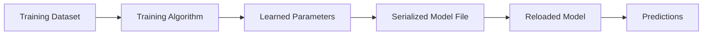
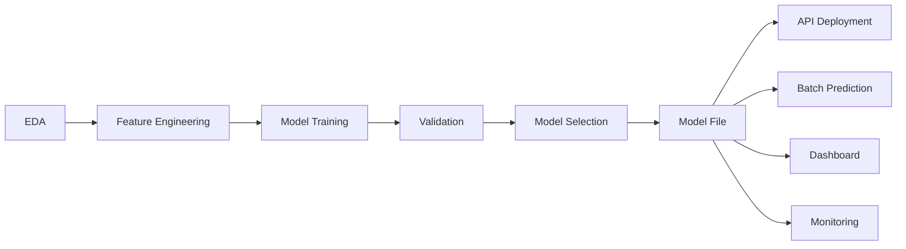
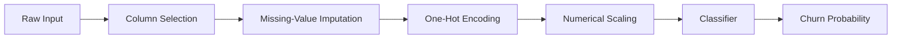
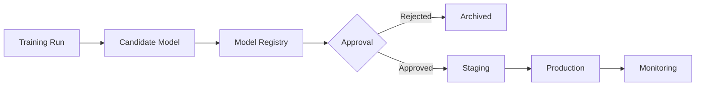
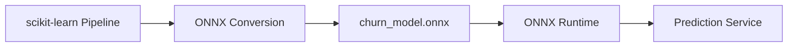
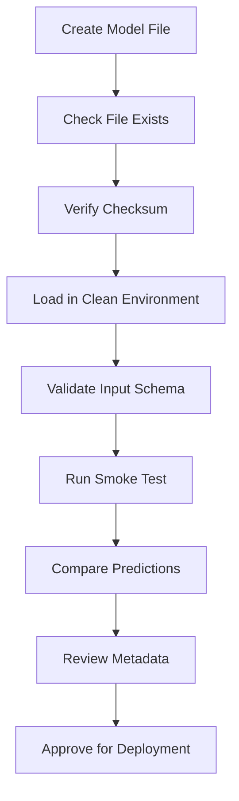
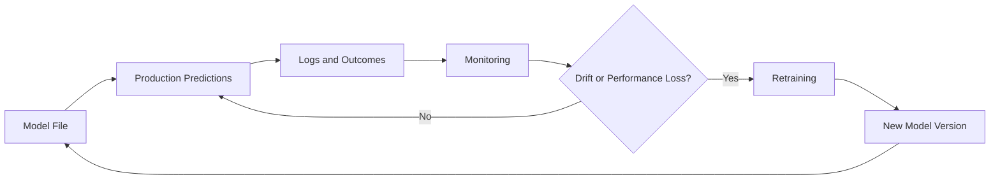

# 007 — Model File

| Field                  | Details                                    |
| ---------------------- | ------------------------------------------ |
| **Course Section**     | 05 — Capstone and Portfolio                |
| **Module**             | Module 09 — Capstone Projects              |
| **Content Group**      | Customer Churn Outputs                     |
| **Roadmap Source**     | Capstone Projects / Customer Churn Outputs |
| **Lesson Type**        | Capstone                                   |
| **Order in Module**    | 007                                        |
| **Suggested Duration** | 24 minutes                                 |

---

## 1. Lesson Summary

A **model file** is a serialized artifact containing a trained machine learning model, and sometimes its preprocessing pipeline, configuration, and learned parameters.

In a customer churn project, a model file allows the trained model to be reused without training it again every time a prediction is required.

A complete model artifact should support the following workflow:

```text
Training data
    ↓
Preprocessing
    ↓
Model training
    ↓
Validation
    ↓
Serialization
    ↓
Model file
    ↓
API, batch job, dashboard, or application
```

Examples of model files include:

* `churn_pipeline.joblib`
* `churn_model.pkl`
* `churn_model.onnx`
* `churn_booster.json`
* `churn_model.ubj`
* `churn_model.pt`
* `churn_model.keras`

For a traditional customer churn project built with scikit-learn, a common deliverable is:

```text
models/churn_pipeline.joblib
```

The best model file usually contains the entire inference pipeline:

```text
Raw customer features
        ↓
Missing-value handling
        ↓
Categorical encoding
        ↓
Numerical scaling
        ↓
Churn classifier
        ↓
Churn probability
```

Saving the entire pipeline reduces the risk that training-time preprocessing and production-time preprocessing behave differently.

---

## 2. Learning Objectives

By the end of this lesson, you should be able to:

1. Explain what a model file is.
2. Identify where model serialization belongs in the machine learning workflow.
3. Distinguish a model file from a training notebook.
4. Save and load a trained model safely.
5. Save a complete preprocessing and model pipeline.
6. Store model metadata separately from the binary model artifact.
7. Validate that a reloaded model produces the same predictions.
8. Version model artifacts clearly.
9. Understand compatibility risks between library versions.
10. Avoid loading untrusted pickle or joblib files.
11. Choose an appropriate serialization format.
12. Prepare a model artifact for API or batch deployment.
13. Document model inputs, outputs, assumptions, and limitations.
14. Create a portfolio-ready model package.

---

## 3. What Is a Model File?

During training, a machine learning model learns parameters from data.

For logistic regression, learned values include:

* Feature coefficients
* Intercept
* Class labels
* Preprocessing statistics

For a random forest, learned values include:

* Decision-tree structures
* Feature thresholds
* Leaf predictions
* Class distributions

For gradient boosting, learned values include:

* Sequential decision trees
* Learning-rate behavior
* Initial predictions
* Feature splits

A model file stores these learned values so that the model can be loaded later.



The model file does not usually contain the original training dataset.

It contains the fitted state required for inference.

---

## 4. Model File in the Data Science Workflow

A model file is created after the model has been trained and selected.



The model file acts as the handoff between:

* Model development
* Software engineering
* Deployment
* Prediction services
* Monitoring systems

Without a saved model file, a production system would need to retrain the model before generating predictions.

---

## 5. Model File Versus Training Notebook

A training notebook and a model file serve different purposes.

| Artifact          | Main Purpose                                 |
| ----------------- | -------------------------------------------- |
| Training notebook | Explain and reproduce model development      |
| Model file        | Reuse the trained model for inference        |
| Metadata file     | Describe the model and its requirements      |
| README            | Explain how to use and reproduce the project |
| Evaluation report | Document model quality and limitations       |

The training notebook contains:

* Data preparation
* Experiments
* Model comparison
* Hyperparameter tuning
* Evaluation
* Commentary and charts

The model file contains:

* Learned preprocessing state
* Learned model parameters
* Feature transformations
* Class information

A model file should not replace documentation.

A reviewer should not need to inspect binary model contents to understand the project.

---

## 6. Recommended Artifact Package

A professional model package may contain:

```text
models/
├── churn_pipeline_v1.0.0.joblib
├── churn_pipeline_v1.0.0.sha256
├── model_metadata_v1.0.0.json
├── input_schema_v1.0.0.json
├── sample_request.json
├── sample_response.json
└── README.md
```

Each file serves a different purpose.

| File                   | Purpose                                     |
| ---------------------- | ------------------------------------------- |
| `.joblib`              | Serialized preprocessing and model pipeline |
| `.sha256`              | Integrity checksum                          |
| `model_metadata.json`  | Model version, metrics, threshold, features |
| `input_schema.json`    | Expected input fields and types             |
| `sample_request.json`  | Example input                               |
| `sample_response.json` | Example prediction output                   |
| `README.md`            | Usage and deployment instructions           |

---

## 7. Recommended Project Structure

```text
customer-churn-capstone/
├── README.md
├── requirements.txt
├── pyproject.toml
├── data/
│   ├── raw/
│   └── processed/
├── notebooks/
│   ├── 01_eda.ipynb
│   ├── 02_training.ipynb
│   └── 03_evaluation.ipynb
├── src/
│   ├── __init__.py
│   ├── preprocessing.py
│   ├── train.py
│   ├── predict.py
│   ├── validation.py
│   └── config.py
├── models/
│   ├── churn_pipeline_v1.0.0.joblib
│   ├── model_metadata_v1.0.0.json
│   ├── input_schema_v1.0.0.json
│   └── churn_pipeline_v1.0.0.sha256
├── tests/
│   ├── test_model_loading.py
│   ├── test_prediction.py
│   ├── test_schema.py
│   └── test_serialization.py
└── reports/
    ├── figures/
    └── model_card.md
```

---

## 8. What Should Be Saved?

The safest artifact for a tabular machine learning model is usually the complete inference pipeline.

### Weak Approach

Save only the classifier:

```python
joblib.dump(
    classifier,
    "models/churn_model.joblib",
)
```

This may lose:

* Missing-value rules
* Category encoding
* Numerical scaling
* Feature ordering
* Feature selection
* Custom transformations

### Better Approach

Save the complete pipeline:

```python
joblib.dump(
    churn_pipeline,
    "models/churn_pipeline.joblib",
)
```

The pipeline may include:



This helps keep training and inference behavior consistent.

---

## 9. Example Training Pipeline

```python
from __future__ import annotations

import pandas as pd

from sklearn.compose import ColumnTransformer
from sklearn.impute import SimpleImputer
from sklearn.linear_model import LogisticRegression
from sklearn.pipeline import Pipeline
from sklearn.preprocessing import OneHotEncoder, StandardScaler
```

Define features:

```python
numerical_features = [
    "tenure_months",
    "monthly_charges",
    "total_charges",
    "support_tickets",
]

categorical_features = [
    "contract_type",
    "payment_method",
    "internet_service",
    "auto_renew",
]
```

Create preprocessing pipelines:

```python
numerical_pipeline = Pipeline(
    steps=[
        (
            "imputer",
            SimpleImputer(strategy="median"),
        ),
        (
            "scaler",
            StandardScaler(),
        ),
    ]
)

categorical_pipeline = Pipeline(
    steps=[
        (
            "imputer",
            SimpleImputer(strategy="most_frequent"),
        ),
        (
            "encoder",
            OneHotEncoder(
                handle_unknown="ignore",
                sparse_output=True,
            ),
        ),
    ]
)
```

Combine preprocessing:

```python
preprocessor = ColumnTransformer(
    transformers=[
        (
            "numerical",
            numerical_pipeline,
            numerical_features,
        ),
        (
            "categorical",
            categorical_pipeline,
            categorical_features,
        ),
    ]
)
```

Create the complete model pipeline:

```python
churn_pipeline = Pipeline(
    steps=[
        (
            "preprocessor",
            preprocessor,
        ),
        (
            "model",
            LogisticRegression(
                class_weight="balanced",
                max_iter=2_000,
                random_state=42,
            ),
        ),
    ]
)
```

Train:

```python
churn_pipeline.fit(
    X_train,
    y_train,
)
```

The fitted object now contains both preprocessing and model parameters.

---

## 10. Save a Model With Joblib

Create the model directory:

```python
from pathlib import Path

MODEL_DIRECTORY = Path("models")
MODEL_DIRECTORY.mkdir(
    parents=True,
    exist_ok=True,
)
```

Save the pipeline:

```python
import joblib

MODEL_VERSION = "1.0.0"

MODEL_PATH = (
    MODEL_DIRECTORY
    / f"churn_pipeline_v{MODEL_VERSION}.joblib"
)

joblib.dump(
    churn_pipeline,
    MODEL_PATH,
)
```

Check that the file exists:

```python
if not MODEL_PATH.exists():
    raise FileNotFoundError(
        f"Model file was not created: {MODEL_PATH}"
    )

print(f"Saved model to: {MODEL_PATH}")
print(f"Model size: {MODEL_PATH.stat().st_size:,} bytes")
```

---

## 11. Load the Model File

```python
loaded_pipeline = joblib.load(
    MODEL_PATH
)
```

Create sample inputs:

```python
sample_customers = pd.DataFrame(
    [
        {
            "tenure_months": 3,
            "monthly_charges": 89.90,
            "total_charges": 249.50,
            "support_tickets": 4,
            "contract_type": "Month-to-month",
            "payment_method": "Electronic check",
            "internet_service": "Fiber optic",
            "auto_renew": "No",
        },
        {
            "tenure_months": 48,
            "monthly_charges": 49.90,
            "total_charges": 2_450.00,
            "support_tickets": 0,
            "contract_type": "Two year",
            "payment_method": "Bank transfer",
            "internet_service": "DSL",
            "auto_renew": "Yes",
        },
    ]
)
```

Generate probabilities:

```python
probabilities = loaded_pipeline.predict_proba(
    sample_customers
)[:, 1]

probabilities
```

Generate class predictions:

```python
DEFAULT_THRESHOLD = 0.50

predictions = (
    probabilities >= DEFAULT_THRESHOLD
).astype(int)
```

---

## 12. Use the Selected Business Threshold

The default threshold of 0.5 may not match the selected business decision.

Suppose model evaluation selected:

```text
Decision threshold: 0.35
```

Apply it explicitly:

```python
DECISION_THRESHOLD = 0.35

predictions = (
    probabilities >= DECISION_THRESHOLD
).astype(int)
```

Do not assume that the threshold is automatically stored as part of the classifier.

The model file may store predicted probabilities, but the business threshold should also be recorded in metadata or wrapped in a custom inference component.

---

## 13. Build a Prediction Function

```python
from typing import Any


def predict_churn(
    model: Pipeline,
    customer_data: pd.DataFrame,
    threshold: float,
) -> pd.DataFrame:
    """
    Generate customer churn probabilities and binary predictions.
    """

    if customer_data.empty:
        raise ValueError(
            "Customer data must contain at least one row."
        )

    probabilities = model.predict_proba(
        customer_data
    )[:, 1]

    predictions = (
        probabilities >= threshold
    ).astype(int)

    return pd.DataFrame(
        {
            "churn_probability": probabilities,
            "churn_prediction": predictions,
        },
        index=customer_data.index,
    )
```

Usage:

```python
prediction_result = predict_churn(
    model=loaded_pipeline,
    customer_data=sample_customers,
    threshold=0.35,
)

prediction_result
```

Example output:

| Customer | Churn Probability | Churn Prediction |
| -------- | ----------------: | ---------------: |
| 0        |              0.82 |                1 |
| 1        |              0.07 |                0 |

---

## 14. Validate Predictions Before and After Saving

Serialization should not change predictions.

Generate predictions before saving:

```python
probabilities_before_save = (
    churn_pipeline.predict_proba(
        X_validation.head(20)
    )[:, 1]
)
```

Save and reload:

```python
joblib.dump(
    churn_pipeline,
    MODEL_PATH,
)

reloaded_pipeline = joblib.load(
    MODEL_PATH
)
```

Generate predictions after loading:

```python
probabilities_after_load = (
    reloaded_pipeline.predict_proba(
        X_validation.head(20)
    )[:, 1]
)
```

Compare them:

```python
import numpy as np

np.testing.assert_allclose(
    probabilities_before_save,
    probabilities_after_load,
    rtol=1e-10,
    atol=1e-12,
)
```

This test confirms that the serialized model reproduces the original inference results.

---

## 15. Save Model Metadata

A binary model file is not enough for a reliable handoff.

Create a metadata file:

```python
import json
import platform
from datetime import datetime, timezone

import sklearn
```

```python
metadata = {
    "model_name": "customer_churn_classifier",
    "model_version": MODEL_VERSION,
    "artifact_filename": MODEL_PATH.name,
    "created_at": datetime.now(
        timezone.utc
    ).isoformat(),
    "framework": "scikit-learn",
    "framework_version": sklearn.__version__,
    "python_version": platform.python_version(),
    "model_type": "LogisticRegression",
    "target": "churn_within_30_days",
    "positive_class": 1,
    "decision_threshold": 0.35,
    "numerical_features": numerical_features,
    "categorical_features": categorical_features,
    "expected_feature_count": (
        len(numerical_features)
        + len(categorical_features)
    ),
    "random_state": 42,
    "training_dataset_version": "customer_churn_2026_07",
    "validation_metrics": {
        "roc_auc": 0.842,
        "pr_auc": 0.612,
        "precision": 0.553,
        "recall": 0.781,
        "f1": 0.648,
    },
    "known_limitations": [
        "The model was trained on historical customers.",
        "The model predicts association, not causation.",
        "Performance may decline after pricing or product changes.",
    ],
}
```

Save it:

```python
METADATA_PATH = (
    MODEL_DIRECTORY
    / f"model_metadata_v{MODEL_VERSION}.json"
)

with METADATA_PATH.open(
    "w",
    encoding="utf-8",
) as file:
    json.dump(
        metadata,
        file,
        indent=2,
        ensure_ascii=False,
    )
```

---

## 16. Recommended Metadata Fields

A useful metadata file should include:

### Identity

* Model name
* Model version
* Artifact filename
* Creation timestamp
* Model owner

### Technical Environment

* Python version
* Framework name
* Framework version
* Dependency-lock file
* Operating system when relevant

### Training Information

* Dataset version
* Training period
* Git commit
* Random seed
* Target definition
* Feature cutoff date

### Inference Contract

* Feature names
* Feature types
* Required fields
* Optional fields
* Output fields
* Decision threshold
* Positive class

### Evaluation

* Validation metrics
* Test metrics
* Segment-level performance
* Calibration results

### Governance

* Known limitations
* Intended use
* Prohibited use
* Monitoring requirements
* Retraining conditions

---

## 17. Save an Input Schema

A schema documents the input expected by the model.

Example JSON schema:

```json
{
  "type": "object",
  "required": [
    "tenure_months",
    "monthly_charges",
    "total_charges",
    "support_tickets",
    "contract_type",
    "payment_method",
    "internet_service",
    "auto_renew"
  ],
  "properties": {
    "tenure_months": {
      "type": "number",
      "minimum": 0
    },
    "monthly_charges": {
      "type": "number",
      "minimum": 0
    },
    "total_charges": {
      "type": ["number", "null"],
      "minimum": 0
    },
    "support_tickets": {
      "type": "integer",
      "minimum": 0
    },
    "contract_type": {
      "type": "string"
    },
    "payment_method": {
      "type": "string"
    },
    "internet_service": {
      "type": "string"
    },
    "auto_renew": {
      "type": "string",
      "enum": ["Yes", "No"]
    }
  }
}
```

The schema can be used by:

* An API
* A data-validation layer
* A batch-scoring job
* Automated tests
* Documentation

---

## 18. Validate Input Columns

```python
EXPECTED_FEATURES = (
    numerical_features
    + categorical_features
)


def validate_feature_columns(
    data: pd.DataFrame,
    expected_features: list[str],
) -> None:
    expected = set(expected_features)
    actual = set(data.columns)

    missing = expected.difference(actual)
    extra = actual.difference(expected)

    if missing:
        raise ValueError(
            f"Missing required features: {sorted(missing)}"
        )

    if extra:
        raise ValueError(
            f"Unexpected features: {sorted(extra)}"
        )
```

Usage:

```python
validate_feature_columns(
    data=sample_customers,
    expected_features=EXPECTED_FEATURES,
)
```

Whether extra columns should cause an error depends on the inference contract.

A strict API may reject them, while a batch pipeline may ignore them explicitly.

---

## 19. Validate Data Types and Ranges

```python
def validate_customer_values(
    data: pd.DataFrame,
) -> None:
    if (data["tenure_months"] < 0).any():
        raise ValueError(
            "tenure_months cannot be negative."
        )

    if (data["monthly_charges"] < 0).any():
        raise ValueError(
            "monthly_charges cannot be negative."
        )

    if (data["support_tickets"] < 0).any():
        raise ValueError(
            "support_tickets cannot be negative."
        )

    valid_auto_renew_values = {
        "Yes",
        "No",
    }

    invalid_auto_renew = set(
        data["auto_renew"].dropna().unique()
    ).difference(valid_auto_renew_values)

    if invalid_auto_renew:
        raise ValueError(
            "Invalid auto_renew values: "
            f"{sorted(invalid_auto_renew)}"
        )
```

Input validation should occur before inference.

---

## 20. Create a Complete Loading Utility

```python
from pathlib import Path
from typing import Any

import joblib


def load_model_artifact(
    model_path: str | Path,
) -> Any:
    path = Path(model_path)

    if not path.exists():
        raise FileNotFoundError(
            f"Model file does not exist: {path}"
        )

    if path.suffix != ".joblib":
        raise ValueError(
            "Expected a .joblib model file."
        )

    try:
        model = joblib.load(path)
    except Exception as error:
        raise RuntimeError(
            f"Unable to load model artifact: {path}"
        ) from error

    if not hasattr(model, "predict_proba"):
        raise TypeError(
            "Loaded artifact does not support predict_proba."
        )

    return model
```

This utility produces clearer errors than calling `joblib.load()` directly throughout the codebase.

---

## 21. Model Versioning

Model files should have explicit versions.

Poor filename:

```text
model_final_latest_really_final.joblib
```

Better filename:

```text
churn_pipeline_v1.0.0.joblib
```

Possible semantic versioning interpretation:

```text
MAJOR.MINOR.PATCH
```

### Major Version

Change when:

* Input schema changes incompatibly
* Target definition changes
* Model output contract changes
* Major preprocessing logic changes

Example:

```text
v1.4.2 → v2.0.0
```

### Minor Version

Change when:

* Model is retrained with new data
* New compatible features are added
* Performance improves without breaking the API contract

Example:

```text
v1.3.0 → v1.4.0
```

### Patch Version

Change when:

* Metadata is corrected
* A compatible implementation bug is fixed
* Packaging changes without conceptual model changes

Example:

```text
v1.4.0 → v1.4.1
```

A team may use a different version policy, but it should be documented.

---

## 22. Model Registry Concept

As the project grows, storing files manually may become difficult.

A model registry records:

* Model versions
* Model stages
* Metrics
* Parameters
* Artifacts
* Approval status
* Deployment history



Possible stages include:

* Candidate
* Validated
* Staging
* Production
* Archived

For a small capstone project, a local `models/` folder and metadata file may be sufficient.

For larger projects, a registry provides stronger traceability.

---

## 23. File Integrity With a Checksum

A checksum helps detect accidental file corruption or replacement.

```python
import hashlib


def calculate_sha256(
    file_path: str | Path,
) -> str:
    path = Path(file_path)

    sha256 = hashlib.sha256()

    with path.open("rb") as file:
        for block in iter(
            lambda: file.read(1_048_576),
            b"",
        ):
            sha256.update(block)

    return sha256.hexdigest()
```

Calculate the checksum:

```python
checksum = calculate_sha256(
    MODEL_PATH
)

CHECKSUM_PATH = MODEL_PATH.with_suffix(
    MODEL_PATH.suffix + ".sha256"
)

CHECKSUM_PATH.write_text(
    checksum,
    encoding="utf-8",
)
```

Verify later:

```python
expected_checksum = CHECKSUM_PATH.read_text(
    encoding="utf-8"
).strip()

actual_checksum = calculate_sha256(
    MODEL_PATH
)

if actual_checksum != expected_checksum:
    raise RuntimeError(
        "Model file checksum verification failed."
    )
```

A checksum detects changes, but it does not prove that the artifact is trustworthy unless the checksum itself comes from a trusted source.

---

## 24. Security Warning

Pickle-based formats can execute arbitrary Python code when loaded.

This includes artifacts created with:

* `pickle`
* `joblib`
* `cloudpickle`

Therefore:

> Never load a pickle or joblib model file from an untrusted source.

Unsafe example:

```python
model = joblib.load(
    "unknown_downloaded_model.joblib"
)
```

Before loading an artifact, verify:

* Who created it
* Where it was stored
* Whether its checksum matches
* Whether access is restricted
* Whether the environment is isolated
* Whether the artifact was approved

Model files should be treated similarly to executable code.

---

## 25. Dependency Compatibility

A model saved with one library version may fail or behave differently under another version.

Potential compatibility factors include:

* Python version
* scikit-learn version
* NumPy version
* pandas version
* Operating system
* Processor architecture
* Custom class definitions

Save dependency versions:

```bash
pip freeze > requirements-lock.txt
```

Or use a project configuration file:

```toml
[project]
dependencies = [
    "numpy==2.3.1",
    "pandas==2.3.0",
    "scikit-learn==1.7.0",
    "joblib==1.5.1"
]
```

The exact versions should match the environment in which the artifact was tested.

---

## 26. Custom Transformers

If the pipeline contains a custom transformer, its class definition must be available when the model is loaded.

Example:

```python
from sklearn.base import BaseEstimator, TransformerMixin


class SupportTicketRateTransformer(
    BaseEstimator,
    TransformerMixin,
):
    def fit(
        self,
        X: pd.DataFrame,
        y: pd.Series | None = None,
    ) -> "SupportTicketRateTransformer":
        return self

    def transform(
        self,
        X: pd.DataFrame,
    ) -> pd.DataFrame:
        transformed = X.copy()

        denominator = (
            transformed["tenure_months"]
            .replace(0, 1)
        )

        transformed["support_ticket_rate"] = (
            transformed["support_tickets"]
            / denominator
        )

        return transformed
```

Place the class in an importable source module:

```text
src/features.py
```

Do not define important production transformers only inside a notebook cell.

Otherwise, the serialized model may fail to load outside the notebook.

---

## 27. Serialization Format Comparison

| Format                | Common Use               | Advantages                          | Limitations                                    |
| --------------------- | ------------------------ | ----------------------------------- | ---------------------------------------------- |
| Joblib                | scikit-learn pipelines   | Simple, efficient for NumPy objects | Python-specific and unsafe for untrusted files |
| Pickle                | General Python objects   | Built into Python                   | Python-specific and unsafe for untrusted files |
| ONNX                  | Cross-platform inference | Language-neutral runtime support    | Some operators or pipelines may not convert    |
| JSON                  | Some boosting frameworks | Portable and inspectable            | Not available for all model types              |
| TorchScript           | PyTorch deployment       | Optimized PyTorch inference         | Mainly for PyTorch                             |
| SavedModel / `.keras` | TensorFlow and Keras     | Standard deep-learning deployment   | Framework-specific                             |
| PMML                  | Traditional models       | Standardized format                 | Limited modern-framework support               |

The best format depends on:

* Model framework
* Deployment environment
* Portability requirements
* Security requirements
* Performance requirements
* Need for cross-language inference

---

## 28. When to Use Joblib

Joblib is suitable when:

* The model uses scikit-learn
* The deployment service also uses Python
* The environment is trusted
* The exact dependencies can be controlled
* The complete pipeline must be serialized easily

Example artifact:

```text
churn_pipeline_v1.0.0.joblib
```

---

## 29. When to Consider ONNX

ONNX may be useful when:

* The model must run outside Python
* The deployment system uses C#, Java, JavaScript, or another runtime
* Inference performance is important
* A standardized model representation is preferred

Conceptual workflow:



Not every preprocessing operation or custom transformer can be converted directly.

Conversion should be followed by prediction-equivalence testing.

---

## 30. Separate Model Artifact From Configuration

Not every value should be embedded in the model binary.

A useful separation is:

```text
Model artifact:
- Preprocessing parameters
- Model parameters
- Learned classes

Configuration:
- Decision threshold
- Model version
- Feature flags
- Business capacity
- Logging settings
```

Example configuration:

```json
{
  "model_path": "models/churn_pipeline_v1.0.0.joblib",
  "decision_threshold": 0.35,
  "model_version": "1.0.0",
  "positive_label": 1
}
```

This allows the threshold to change without retraining the model, provided the change is evaluated and documented.

---

## 31. Sample Request

```json
{
  "tenure_months": 4,
  "monthly_charges": 92.5,
  "total_charges": 354.4,
  "support_tickets": 3,
  "contract_type": "Month-to-month",
  "payment_method": "Electronic check",
  "internet_service": "Fiber optic",
  "auto_renew": "No"
}
```

---

## 32. Sample Response

```json
{
  "model_version": "1.0.0",
  "churn_probability": 0.7842,
  "decision_threshold": 0.35,
  "churn_prediction": true,
  "risk_band": "high"
}
```

The prediction response should clearly distinguish:

* Probability
* Classification threshold
* Binary decision
* Model version

---

## 33. Risk Bands

A model may provide risk categories in addition to raw probabilities.

Example:

```python
def probability_to_risk_band(
    probability: float,
) -> str:
    if probability >= 0.70:
        return "high"

    if probability >= 0.40:
        return "medium"

    return "low"
```

Example mapping:

| Probability | Risk Band |
| ----------- | --------- |
| 0.00–0.39   | Low       |
| 0.40–0.69   | Medium    |
| 0.70–1.00   | High      |

Risk-band boundaries are business rules and should be documented separately from model training.

---

## 34. Batch Prediction Example

```python
def score_customer_file(
    model_path: str | Path,
    input_path: str | Path,
    output_path: str | Path,
    threshold: float,
) -> None:
    model = load_model_artifact(
        model_path
    )

    customers = pd.read_csv(
        input_path
    )

    validate_feature_columns(
        customers,
        EXPECTED_FEATURES,
    )

    validate_customer_values(
        customers
    )

    probabilities = model.predict_proba(
        customers
    )[:, 1]

    output = customers.copy()

    output["churn_probability"] = probabilities
    output["churn_prediction"] = (
        probabilities >= threshold
    ).astype(int)

    output.to_csv(
        output_path,
        index=False,
    )
```

This converts the model file into a reusable batch-scoring artifact.

---

## 35. API Loading Pattern

A web service should usually load the model once when the application starts.

```text
Application starts
        ↓
Load model file once
        ↓
Validate model
        ↓
Receive prediction requests
        ↓
Reuse loaded model
```

Avoid loading the model for every request:

```python
def predict(request):
    model = joblib.load("model.joblib")
    return model.predict(request)
```

Better conceptual structure:

```python
MODEL = load_model_artifact(
    "models/churn_pipeline_v1.0.0.joblib"
)


def predict(request_data: pd.DataFrame) -> pd.DataFrame:
    return predict_churn(
        model=MODEL,
        customer_data=request_data,
        threshold=0.35,
    )
```

Loading once reduces latency and unnecessary file access.

---

## 36. Model File Tests

### Test 1: File Exists

```python
def test_model_file_exists() -> None:
    assert MODEL_PATH.exists()
```

### Test 2: Model Loads

```python
def test_model_loads() -> None:
    model = load_model_artifact(
        MODEL_PATH
    )

    assert hasattr(
        model,
        "predict_proba",
    )
```

### Test 3: Prediction Shape

```python
def test_prediction_shape() -> None:
    model = load_model_artifact(
        MODEL_PATH
    )

    probabilities = model.predict_proba(
        sample_customers
    )

    assert probabilities.shape == (
        len(sample_customers),
        2,
    )
```

### Test 4: Probability Range

```python
def test_probabilities_are_valid() -> None:
    model = load_model_artifact(
        MODEL_PATH
    )

    probabilities = model.predict_proba(
        sample_customers
    )[:, 1]

    assert (
        (probabilities >= 0)
        & (probabilities <= 1)
    ).all()
```

### Test 5: Serialization Consistency

```python
def test_reloaded_predictions_match() -> None:
    original = churn_pipeline.predict_proba(
        sample_customers
    )[:, 1]

    reloaded = joblib.load(
        MODEL_PATH
    ).predict_proba(
        sample_customers
    )[:, 1]

    np.testing.assert_allclose(
        original,
        reloaded,
    )
```

---

## 37. Model Smoke Test

A smoke test confirms that the artifact works with a known sample.

```python
def smoke_test_model(
    model_path: Path,
) -> None:
    model = load_model_artifact(
        model_path
    )

    sample = pd.DataFrame(
        [
            {
                "tenure_months": 12,
                "monthly_charges": 70.0,
                "total_charges": 840.0,
                "support_tickets": 1,
                "contract_type": "One year",
                "payment_method": "Credit card",
                "internet_service": "DSL",
                "auto_renew": "Yes",
            }
        ]
    )

    probability = float(
        model.predict_proba(
            sample
        )[0, 1]
    )

    if not 0 <= probability <= 1:
        raise RuntimeError(
            "Model produced an invalid probability."
        )

    print(
        f"Smoke test passed: {probability:.4f}"
    )
```

Run the smoke test before deployment.

---

## 38. Model Artifact Validation Workflow



A file should not be considered deployable only because serialization completed successfully.

---

## 39. Model File and Docker

A model file may be packaged into a Docker image.

```text
Docker image
├── Application code
├── Dependencies
├── Model file
├── Metadata
└── Input schema
```

Conceptual Dockerfile:

```dockerfile
FROM python:3.12-slim

WORKDIR /app

COPY requirements.txt .
RUN pip install --no-cache-dir -r requirements.txt

COPY src/ src/
COPY models/churn_pipeline_v1.0.0.joblib models/
COPY models/model_metadata_v1.0.0.json models/

CMD ["python", "-m", "src.api"]
```

Advantages:

* Controlled dependency versions
* Repeatable deployment
* Easier environment isolation
* Clear artifact packaging

For large models, the file may be downloaded from object storage at startup instead of copied into the image.

---

## 40. Model File and CI/CD

A deployment pipeline may perform:


Automated checks may include:

* Artifact exists
* Metadata exists
* Version matches
* Checksum matches
* Model loads
* Schema is valid
* Predictions are reproducible
* Performance meets minimum requirements
* No prohibited feature is present

---

## 41. Model File and Monitoring

A saved model is not the end of the lifecycle.

After deployment, monitor:

* Input distributions
* Missing-value rates
* Unknown categories
* Prediction distributions
* Churn probability drift
* Actual churn outcomes
* Precision and recall
* Calibration
* Latency
* Error rates



A model version should remain traceable after a newer version is deployed.

---

## 42. Reproducibility Requirements

A model file is reproducible when another person can determine:

* Which dataset created it
* Which code created it
* Which dependencies were used
* Which random seed was used
* Which parameters were selected
* Which metrics were achieved
* Which features were included
* Which threshold was selected

Recommended supporting artifacts:

```text
Git commit
Dataset version
Configuration file
Dependency lock file
Model metadata
Training notebook
Evaluation report
```

---

## 43. Model Card

A model card summarizes intended use and limitations.

Suggested structure:

```markdown
# Customer Churn Model Card

## Model Details

- Model name:
- Version:
- Framework:
- Model type:
- Creation date:

## Intended Use

Describe the approved use of the model.

## Prohibited Use

Describe situations where the model should not be used.

## Inputs

List required features and expected types.

## Outputs

Describe probability, prediction, threshold, and risk bands.

## Training Data

Describe the dataset and time period.

## Evaluation

Report validation and test metrics.

## Limitations

Document bias, drift risk, missing data, and causal limitations.

## Monitoring

Describe production metrics and retraining triggers.
```

---

## 44. Common Mistakes

### Mistake 1: Saving Only the Classifier

The production system may not know how to reproduce preprocessing.

Save the complete pipeline.

---

### Mistake 2: Loading an Untrusted Model File

Pickle-based files may execute malicious code.

Only load trusted and verified artifacts.

---

### Mistake 3: Omitting the Decision Threshold

A probability model does not define the final business action by itself.

Save or document the selected threshold.

---

### Mistake 4: Using an Unclear Filename

Avoid:

```text
final_model_2_updated.joblib
```

Prefer:

```text
churn_pipeline_v1.2.0.joblib
```

---

### Mistake 5: Forgetting Dependency Versions

A model may fail after a library upgrade.

Record exact tested versions.

---

### Mistake 6: Saving Custom Classes Only in a Notebook

The artifact may fail to load in the API environment.

Place reusable classes in importable Python modules.

---

### Mistake 7: Not Testing Reloaded Predictions

Serialization success does not guarantee correct inference.

Compare predictions before and after loading.

---

### Mistake 8: Missing Input Schema

An API may send incorrect columns, types, or units.

Define and validate the input contract.

---

### Mistake 9: Committing Large Model Files Directly to Git

Large binary files can make repository history difficult to manage.

Consider:

* Git LFS
* Object storage
* Artifact storage
* A model registry

---

### Mistake 10: Overwriting the Production Model

Never silently replace a production artifact without preserving the previous version.

Maintain rollback capability.

---

### Mistake 11: Mixing Model and Business Logic

The model predicts probability.

Business logic decides:

* Threshold
* Intervention type
* Contact capacity
* Risk bands
* Eligibility

Keep these concerns clearly documented.

---

### Mistake 12: Assuming a Model File Is Deployment

A model file is only one deployment component.

Production also requires:

* Input validation
* Application code
* Error handling
* Logging
* Monitoring
* Security
* Version control

---

## 45. Practical Exercise

Create a production-ready model artifact from the customer churn training notebook.

### Required Tasks

1. Train or load the selected churn pipeline.
2. Save the complete pipeline with joblib.
3. Add an explicit model version.
4. Confirm that the model file exists.
5. Reload the model in a new Python process or clean notebook session.
6. Compare predictions before and after serialization.
7. Create a model metadata JSON file.
8. Record the selected decision threshold.
9. Record input feature names.
10. Record numerical and categorical feature types.
11. Record Python and framework versions.
12. Create an input schema.
13. Create a sample prediction request.
14. Create a sample prediction response.
15. Calculate a SHA-256 checksum.
16. Write a model-loading utility.
17. Write an input-validation function.
18. Write a prediction function.
19. Add at least three model artifact tests.
20. Document security and compatibility limitations.
21. Add model usage instructions to the README.
22. Explain how the file will be used by an API or batch process.

---

## 46. Expected Output

```text
Input:
A validated and selected customer churn pipeline

Process:
Serialize, version, document, validate, reload, and test the artifact

Output:
A trusted model file, metadata, schema, checksum, sample inputs,
sample outputs, tests, limitations, and deployment instructions
```

---

## 47. README Template

```markdown
# Customer Churn Model Artifact

## Overview

Describe the purpose of the model and the business decision it supports.

## Model File

- Filename:
- Model version:
- Framework:
- Model type:
- File size:
- Checksum:

## Target Definition

Explain what churn means and the prediction period.

## Inputs

List all required input features and types.

## Outputs

Describe:

- Churn probability
- Decision threshold
- Binary prediction
- Risk band

## Loading the Model

Provide code for loading the artifact safely.

## Prediction Example

Provide a sample input and output.

## Metadata

Explain where the metadata and schema files are stored.

## Compatibility

Document tested Python and dependency versions.

## Security

State that pickle and joblib files must only be loaded from trusted sources.

## Limitations

Document known modeling and deployment limitations.

## Reproduction

Explain which notebook, dataset version, and code commit created the artifact.
```

---

## 48. Example Model Artifact Summary

> The selected customer churn pipeline was serialized as `churn_pipeline_v1.0.0.joblib`. The artifact contains median imputation, categorical imputation, one-hot encoding, numerical scaling, and the trained logistic regression classifier. A separate metadata file records the target definition, model version, feature schema, decision threshold, dependency versions, and test metrics. Predictions generated before and after serialization were equivalent within numerical tolerance. A SHA-256 checksum was created for integrity verification. Because joblib uses a pickle-based format, the artifact must only be loaded from trusted storage.

---

## 49. Assumptions and Limitations

A professional model-file deliverable should document limitations such as:

* The artifact depends on specific Python and library versions.
* Pickle-based artifacts are unsafe when obtained from untrusted sources.
* The model expects the same units and feature meanings used during training.
* Unknown categories are ignored, which may hide data drift.
* The decision threshold may need adjustment when intervention capacity changes.
* The model predicts churn risk but does not explain causal drivers.
* Production performance may decline when customer behavior changes.
* The file does not include production monitoring.
* The artifact may rely on custom Python modules.
* Probability calibration may degrade over time.
* The model should not be used for populations not represented in training data.

---

## 50. Completion Checklist

### Artifact Creation

* [ ] I saved the complete preprocessing and model pipeline.
* [ ] The model filename includes a clear version.
* [ ] The model file exists and has a reasonable size.
* [ ] I did not accidentally include the training dataset.
* [ ] I preserved the previous model version.

### Validation

* [ ] The model loads successfully.
* [ ] Reloaded predictions match original predictions.
* [ ] Output probabilities remain between 0 and 1.
* [ ] A smoke test passes.
* [ ] The expected input columns are validated.
* [ ] Invalid values produce clear errors.

### Metadata

* [ ] I recorded the model name and version.
* [ ] I recorded the target definition.
* [ ] I recorded the decision threshold.
* [ ] I recorded feature names and types.
* [ ] I recorded training and test metrics.
* [ ] I recorded Python and framework versions.
* [ ] I documented known limitations.

### Security and Integrity

* [ ] I understand that joblib and pickle files can execute code.
* [ ] The artifact comes from a trusted source.
* [ ] Access to the model file is controlled.
* [ ] I generated a checksum.
* [ ] I verified the checksum before deployment.

### Deployment Readiness

* [ ] I created a sample request.
* [ ] I created a sample response.
* [ ] I created an input schema.
* [ ] I wrote a reusable loading function.
* [ ] I wrote a reusable prediction function.
* [ ] I documented API or batch usage.
* [ ] The README explains how to use the artifact.

---

## 51. Related Outcome

Build one end-to-end portfolio project that connects:

```text
EDA
  +
Model training
  +
Evaluation
  +
Model serialization
  +
API or batch inference
  +
Deployment
  +
Monitoring
```

---

## 52. Related Project

**Capstone: End-to-End Customer Churn Prediction Project**

The model file can become:

* A model used by a REST API
* A batch-scoring artifact
* A scheduled churn-risk pipeline
* A backend component for a dashboard
* A file packaged inside a Docker image
* An artifact stored in a model registry
* A portfolio deliverable
* A foundation for production monitoring

---

## 53. Final Summary

A **model file** transforms a trained model from an experimental object into a reusable software artifact.

The complete workflow is:

```text
Train model
    ↓
Select final pipeline
    ↓
Serialize artifact
    ↓
Save metadata and schema
    ↓
Calculate checksum
    ↓
Reload and validate
    ↓
Package for deployment
    ↓
Monitor in production
```

The most important principles are:

> Save the complete inference pipeline, not only the classifier.

> Version the artifact and preserve its metadata.

> Test that predictions remain unchanged after serialization.

> Record the input schema, output contract, and decision threshold.

> Never load an untrusted pickle or joblib file.

> Treat the model file as one component of a larger production system.

Turn this lesson into a concrete portfolio artifact containing:

* A versioned model file
* A complete preprocessing pipeline
* A metadata JSON file
* An input schema
* A decision threshold
* A checksum
* Sample input and output files
* Loading and prediction utilities
* Automated artifact tests
* Security warnings
* Compatibility information
* A complete README

A high-quality model-file deliverable demonstrates that you can move beyond model training and prepare a reliable, traceable, and reusable artifact for real applications.
