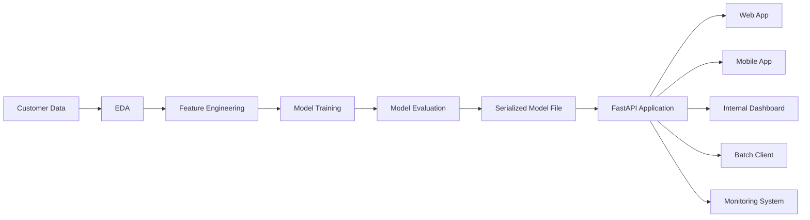
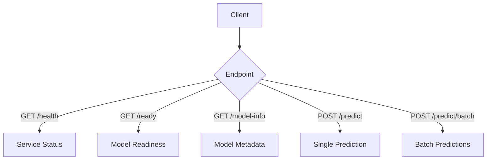
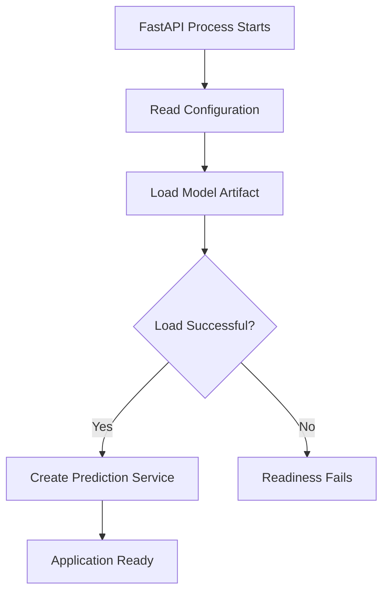
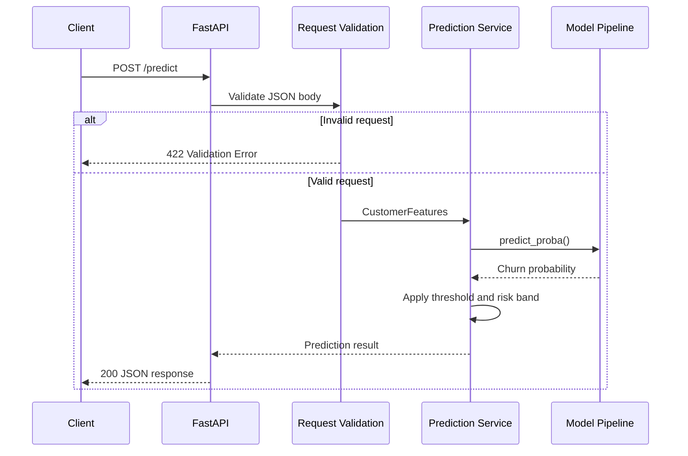
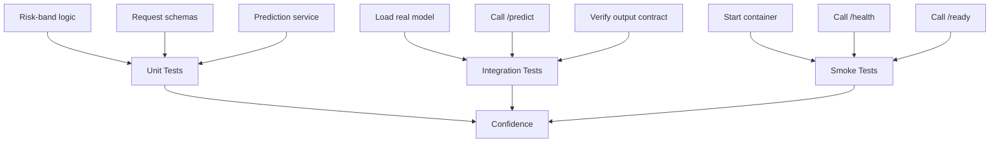
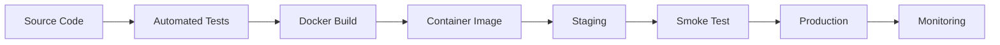
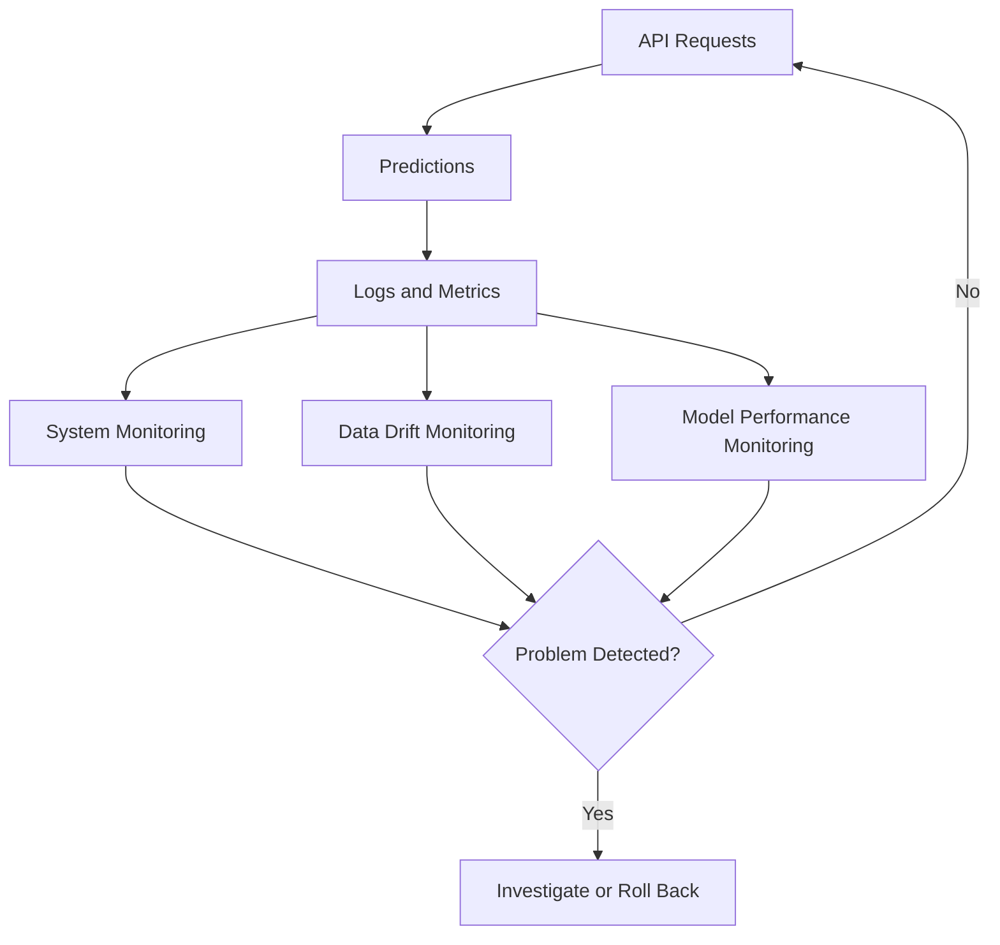

# 008 — FastAPI App

| Field                  | Details                                    |
| ---------------------- | ------------------------------------------ |
| **Course Section**     | 05 — Capstone and Portfolio                |
| **Module**             | Module 09 — Capstone Projects              |
| **Content Group**      | Customer Churn Outputs                     |
| **Roadmap Source**     | Capstone Projects / Customer Churn Outputs |
| **Lesson Type**        | Capstone                                   |
| **Order in Module**    | 008                                        |
| **Suggested Duration** | 24 minutes                                 |

---

## 1. Lesson Summary

A **FastAPI application** exposes a trained machine learning model through an HTTP API.

In a customer churn project, the API receives customer information, validates the request, runs the saved model pipeline, and returns a churn prediction.

```text
Customer application
        ↓
HTTP request
        ↓
FastAPI validation
        ↓
Preprocessing pipeline
        ↓
Churn model
        ↓
Probability and prediction
        ↓
JSON response
```

A typical request may contain:

```json
{
  "tenure_months": 4,
  "monthly_charges": 89.9,
  "total_charges": 351.2,
  "support_tickets": 3,
  "contract_type": "Month-to-month",
  "payment_method": "Electronic check",
  "internet_service": "Fiber optic",
  "auto_renew": "No"
}
```

The API may return:

```json
{
  "model_version": "1.0.0",
  "churn_probability": 0.7842,
  "decision_threshold": 0.35,
  "churn_prediction": true,
  "risk_band": "high"
}
```

A strong FastAPI capstone artifact should demonstrate:

* Request validation
* Model loading
* Prediction logic
* Structured responses
* Error handling
* Health checks
* Automated tests
* API documentation
* Docker readiness
* Logging and monitoring considerations
* Clear README instructions

---

## 2. Learning Objectives

By the end of this lesson, you should be able to:

1. Explain the purpose of a FastAPI model service.
2. Identify where an API belongs in the machine learning lifecycle.
3. Load a saved machine learning pipeline when the application starts.
4. Define validated request and response schemas.
5. Create a customer churn prediction endpoint.
6. Return model probabilities and business decisions separately.
7. Implement health and readiness endpoints.
8. Handle invalid inputs and model errors.
9. Support individual and batch predictions.
10. Test API behavior without starting a live server.
11. Organize the application into reusable modules.
12. Package the application with Docker.
13. Document the API for portfolio reviewers.
14. Recognize security, privacy, and monitoring limitations.

---

## 3. What Is FastAPI?

FastAPI is a Python framework used to build HTTP APIs.

It is especially useful for machine learning services because it supports:

* Python type hints
* Request validation
* JSON serialization
* Automatic interactive documentation
* Structured error responses
* Asynchronous endpoints
* Dependency injection
* Application lifecycle management

In a churn prediction project, FastAPI acts as the delivery layer around the trained model.

The model performs prediction.

FastAPI handles:

* Receiving requests
* Validating data
* Calling the prediction service
* Formatting responses
* Returning HTTP status codes
* Exposing operational endpoints

---

## 4. FastAPI in the Machine Learning Workflow



The FastAPI application should not retrain the model during normal prediction requests.

Its main responsibility is inference:

```text
Load an approved model
        ↓
Accept valid customer data
        ↓
Generate a prediction
        ↓
Return a stable response
```

---

## 5. API Responsibilities

A production-oriented prediction API should perform several tasks.

### Input Responsibilities

* Check required fields
* Validate data types
* Validate numerical ranges
* Reject invalid categories when appropriate
* Limit request size
* Avoid accepting unknown sensitive fields

### Model Responsibilities

* Load the approved model artifact
* Apply the same preprocessing used during training
* Generate churn probabilities
* Apply the selected business threshold
* Return the active model version

### Operational Responsibilities

* Return clear HTTP status codes
* Log failures without exposing private customer data
* Provide health and readiness checks
* Support monitoring
* Fail safely when the model is unavailable

---

## 6. Proposed API Contract

A minimal churn API may expose:

| Method | Endpoint         | Purpose                             |
| ------ | ---------------- | ----------------------------------- |
| `GET`  | `/`              | Basic service information           |
| `GET`  | `/health`        | Confirm that the process is running |
| `GET`  | `/ready`         | Confirm that the model is loaded    |
| `GET`  | `/model-info`    | Return non-sensitive model metadata |
| `POST` | `/predict`       | Score one customer                  |
| `POST` | `/predict/batch` | Score multiple customers            |



---

## 7. Recommended Project Structure

```text
customer-churn-capstone/
├── README.md
├── requirements.txt
├── pyproject.toml
├── Dockerfile
├── .dockerignore
├── models/
│   ├── churn_pipeline_v1.0.0.joblib
│   └── model_metadata_v1.0.0.json
├── src/
│   └── churn_api/
│       ├── __init__.py
│       ├── main.py
│       ├── config.py
│       ├── schemas.py
│       ├── model_loader.py
│       ├── prediction_service.py
│       ├── exceptions.py
│       └── logging_config.py
└── tests/
    ├── test_health.py
    ├── test_prediction.py
    ├── test_validation.py
    └── test_model_loading.py
```

This is better than placing the entire API in a single large file.

---

## 8. Install the Required Packages

Example `requirements.txt`:

```text
fastapi
uvicorn[standard]
pandas
numpy
scikit-learn
joblib
pydantic
httpx
pytest
```

For reproducible deployment, use tested version constraints or a lock file.

---

## 9. Application Configuration

Create `src/churn_api/config.py`:

```python
from __future__ import annotations

import os
from dataclasses import dataclass
from pathlib import Path


@dataclass(frozen=True)
class Settings:
    app_name: str
    app_version: str
    model_path: Path
    metadata_path: Path
    decision_threshold: float
    maximum_batch_size: int


def load_settings() -> Settings:
    threshold = float(
        os.getenv("DECISION_THRESHOLD", "0.35")
    )

    if not 0 <= threshold <= 1:
        raise ValueError(
            "DECISION_THRESHOLD must be between 0 and 1."
        )

    maximum_batch_size = int(
        os.getenv("MAXIMUM_BATCH_SIZE", "500")
    )

    if maximum_batch_size <= 0:
        raise ValueError(
            "MAXIMUM_BATCH_SIZE must be positive."
        )

    return Settings(
        app_name="Customer Churn Prediction API",
        app_version="1.0.0",
        model_path=Path(
            os.getenv(
                "MODEL_PATH",
                "models/churn_pipeline_v1.0.0.joblib",
            )
        ),
        metadata_path=Path(
            os.getenv(
                "MODEL_METADATA_PATH",
                "models/model_metadata_v1.0.0.json",
            )
        ),
        decision_threshold=threshold,
        maximum_batch_size=maximum_batch_size,
    )


settings = load_settings()
```

Configuration values should not be scattered throughout the application.

---

## 10. Request Schema

Create `src/churn_api/schemas.py`.

```python
from __future__ import annotations

from typing import Literal

from pydantic import BaseModel, ConfigDict, Field


class CustomerFeatures(BaseModel):
    model_config = ConfigDict(
        extra="forbid",
        str_strip_whitespace=True,
    )

    tenure_months: int = Field(
        ge=0,
        description="Number of months the customer has been active.",
        examples=[12],
    )

    monthly_charges: float = Field(
        ge=0,
        description="Current monthly charge.",
        examples=[79.90],
    )

    total_charges: float | None = Field(
        default=None,
        ge=0,
        description="Total charges collected from the customer.",
        examples=[958.80],
    )

    support_tickets: int = Field(
        ge=0,
        description="Number of recorded support tickets.",
        examples=[2],
    )

    contract_type: Literal[
        "Month-to-month",
        "One year",
        "Two year",
    ]

    payment_method: Literal[
        "Electronic check",
        "Mailed check",
        "Bank transfer",
        "Credit card",
    ]

    internet_service: Literal[
        "DSL",
        "Fiber optic",
        "No",
    ]

    auto_renew: Literal[
        "Yes",
        "No",
    ]
```

The schema provides:

* Required fields
* Type validation
* Range validation
* Category validation
* Documentation examples
* Rejection of unknown fields

---

## 11. Response Schemas

```python
class PredictionResponse(BaseModel):
    model_version: str
    churn_probability: float = Field(
        ge=0,
        le=1,
    )
    decision_threshold: float = Field(
        ge=0,
        le=1,
    )
    churn_prediction: bool
    risk_band: Literal[
        "low",
        "medium",
        "high",
    ]


class BatchPredictionRequest(BaseModel):
    model_config = ConfigDict(
        extra="forbid",
    )

    customers: list[CustomerFeatures]


class BatchPredictionItem(PredictionResponse):
    row_index: int


class BatchPredictionResponse(BaseModel):
    model_version: str
    prediction_count: int
    predictions: list[BatchPredictionItem]


class HealthResponse(BaseModel):
    status: Literal["ok"]


class ReadinessResponse(BaseModel):
    status: Literal[
        "ready",
        "not_ready",
    ]
    model_loaded: bool
```

Explicit response schemas create a stable contract for API clients.

---

## 12. Model Loader

Create `src/churn_api/model_loader.py`.

```python
from __future__ import annotations

import json
from pathlib import Path
from typing import Any

import joblib


class ModelArtifact:
    def __init__(
        self,
        pipeline: Any,
        metadata: dict[str, Any],
    ) -> None:
        self.pipeline = pipeline
        self.metadata = metadata


def load_model_artifact(
    model_path: Path,
    metadata_path: Path,
) -> ModelArtifact:
    if not model_path.exists():
        raise FileNotFoundError(
            f"Model file was not found: {model_path}"
        )

    if not metadata_path.exists():
        raise FileNotFoundError(
            f"Model metadata was not found: {metadata_path}"
        )

    pipeline = joblib.load(model_path)

    if not hasattr(pipeline, "predict_proba"):
        raise TypeError(
            "Loaded model does not support predict_proba."
        )

    with metadata_path.open(
        "r",
        encoding="utf-8",
    ) as file:
        metadata = json.load(file)

    if "model_version" not in metadata:
        raise ValueError(
            "Model metadata does not contain model_version."
        )

    return ModelArtifact(
        pipeline=pipeline,
        metadata=metadata,
    )
```

A dedicated loader provides clearer error handling and easier testing.

---

## 13. Security Warning for Model Files

Joblib and pickle-based files may execute Python code when loaded.

Therefore:

> Only load model artifacts created by a trusted training process and stored in trusted infrastructure.

Do not allow API users to provide arbitrary model-file paths.

Unsafe design:

```python
@app.post("/load-model")
def load_user_model(path: str):
    return joblib.load(path)
```

A prediction service should load only an approved, configured artifact.

---

## 14. Prediction Service

Create `src/churn_api/prediction_service.py`.

```python
from __future__ import annotations

from typing import Any

import pandas as pd

from .schemas import CustomerFeatures


def probability_to_risk_band(
    probability: float,
) -> str:
    if probability >= 0.70:
        return "high"

    if probability >= 0.40:
        return "medium"

    return "low"


class ChurnPredictionService:
    def __init__(
        self,
        pipeline: Any,
        model_version: str,
        decision_threshold: float,
    ) -> None:
        if not 0 <= decision_threshold <= 1:
            raise ValueError(
                "Decision threshold must be between 0 and 1."
            )

        self.pipeline = pipeline
        self.model_version = model_version
        self.decision_threshold = decision_threshold

    def predict_one(
        self,
        customer: CustomerFeatures,
    ) -> dict[str, object]:
        customer_frame = pd.DataFrame(
            [customer.model_dump()]
        )

        probability = float(
            self.pipeline.predict_proba(
                customer_frame
            )[0, 1]
        )

        prediction = (
            probability >= self.decision_threshold
        )

        return {
            "model_version": self.model_version,
            "churn_probability": probability,
            "decision_threshold": self.decision_threshold,
            "churn_prediction": prediction,
            "risk_band": probability_to_risk_band(
                probability
            ),
        }

    def predict_many(
        self,
        customers: list[CustomerFeatures],
    ) -> list[dict[str, object]]:
        customer_frame = pd.DataFrame(
            [
                customer.model_dump()
                for customer in customers
            ]
        )

        probabilities = (
            self.pipeline.predict_proba(
                customer_frame
            )[:, 1]
        )

        results = []

        for row_index, probability_value in enumerate(
            probabilities
        ):
            probability = float(probability_value)

            results.append(
                {
                    "row_index": row_index,
                    "model_version": self.model_version,
                    "churn_probability": probability,
                    "decision_threshold": self.decision_threshold,
                    "churn_prediction": (
                        probability
                        >= self.decision_threshold
                    ),
                    "risk_band": probability_to_risk_band(
                        probability
                    ),
                }
            )

        return results
```

The service layer contains inference logic without depending directly on HTTP concepts.

---

## 15. Load the Model During Application Startup

The model should be loaded once when the application starts.



Create `src/churn_api/main.py`:

```python
from __future__ import annotations

from contextlib import asynccontextmanager
from typing import AsyncIterator

from fastapi import FastAPI, HTTPException, Request, status

from .config import settings
from .model_loader import load_model_artifact
from .prediction_service import ChurnPredictionService
from .schemas import (
    BatchPredictionRequest,
    BatchPredictionResponse,
    HealthResponse,
    PredictionResponse,
    ReadinessResponse,
)
```

Create the application lifecycle:

```python
@asynccontextmanager
async def lifespan(
    app: FastAPI,
) -> AsyncIterator[None]:
    app.state.prediction_service = None
    app.state.model_metadata = None
    app.state.model_load_error = None

    try:
        artifact = load_model_artifact(
            model_path=settings.model_path,
            metadata_path=settings.metadata_path,
        )

        model_version = str(
            artifact.metadata["model_version"]
        )

        app.state.prediction_service = (
            ChurnPredictionService(
                pipeline=artifact.pipeline,
                model_version=model_version,
                decision_threshold=(
                    settings.decision_threshold
                ),
            )
        )

        app.state.model_metadata = (
            artifact.metadata
        )

    except Exception as error:
        app.state.model_load_error = str(error)

    yield

    app.state.prediction_service = None
    app.state.model_metadata = None
```

Create the FastAPI application:

```python
app = FastAPI(
    title=settings.app_name,
    version=settings.app_version,
    description=(
        "API for predicting customer churn risk "
        "from customer account features."
    ),
    lifespan=lifespan,
)
```

---

## 16. Root Endpoint

```python
@app.get("/")
def root() -> dict[str, str]:
    return {
        "service": settings.app_name,
        "version": settings.app_version,
        "documentation": "/docs",
    }
```

Example response:

```json
{
  "service": "Customer Churn Prediction API",
  "version": "1.0.0",
  "documentation": "/docs"
}
```

---

## 17. Health Endpoint

A health endpoint confirms that the application process is running.

```python
@app.get(
    "/health",
    response_model=HealthResponse,
)
def health() -> HealthResponse:
    return HealthResponse(
        status="ok"
    )
```

This endpoint should normally remain simple.

It does not necessarily confirm that the model is usable.

---

## 18. Readiness Endpoint

A readiness endpoint confirms that the model has loaded successfully.

```python
@app.get(
    "/ready",
    response_model=ReadinessResponse,
)
def ready(
    request: Request,
) -> ReadinessResponse:
    model_loaded = (
        request.app.state.prediction_service
        is not None
    )

    if not model_loaded:
        raise HTTPException(
            status_code=status.HTTP_503_SERVICE_UNAVAILABLE,
            detail={
                "message": "Prediction service is not ready.",
                "reason": request.app.state.model_load_error,
            },
        )

    return ReadinessResponse(
        status="ready",
        model_loaded=True,
    )
```

The difference is important:

| Endpoint  | Meaning                               |
| --------- | ------------------------------------- |
| `/health` | The API process is alive              |
| `/ready`  | The model service can receive traffic |

---

## 19. Model Information Endpoint

```python
@app.get("/model-info")
def model_info(
    request: Request,
) -> dict[str, object]:
    metadata = request.app.state.model_metadata

    if metadata is None:
        raise HTTPException(
            status_code=status.HTTP_503_SERVICE_UNAVAILABLE,
            detail="Model metadata is unavailable.",
        )

    allowed_fields = {
        "model_name",
        "model_version",
        "model_type",
        "target",
        "decision_threshold",
        "validation_metrics",
        "known_limitations",
    }

    return {
        key: value
        for key, value in metadata.items()
        if key in allowed_fields
    }
```

Do not expose:

* Local file paths
* Storage credentials
* Private customer information
* Internal secrets
* Sensitive training records

---

## 20. Single Prediction Endpoint

```python
@app.post(
    "/predict",
    response_model=PredictionResponse,
)
def predict(
    customer: CustomerFeatures,
    request: Request,
) -> PredictionResponse:
    service = (
        request.app.state.prediction_service
    )

    if service is None:
        raise HTTPException(
            status_code=status.HTTP_503_SERVICE_UNAVAILABLE,
            detail="Prediction model is unavailable.",
        )

    try:
        result = service.predict_one(
            customer
        )

        return PredictionResponse(
            **result
        )

    except Exception as error:
        raise HTTPException(
            status_code=status.HTTP_500_INTERNAL_SERVER_ERROR,
            detail="Unable to generate prediction.",
        ) from error
```

The internal exception should be logged, but the response should avoid exposing stack traces or sensitive implementation details.

---

## 21. Batch Prediction Endpoint

```python
@app.post(
    "/predict/batch",
    response_model=BatchPredictionResponse,
)
def predict_batch(
    payload: BatchPredictionRequest,
    request: Request,
) -> BatchPredictionResponse:
    service = (
        request.app.state.prediction_service
    )

    if service is None:
        raise HTTPException(
            status_code=status.HTTP_503_SERVICE_UNAVAILABLE,
            detail="Prediction model is unavailable.",
        )

    if not payload.customers:
        raise HTTPException(
            status_code=status.HTTP_400_BAD_REQUEST,
            detail="At least one customer is required.",
        )

    if (
        len(payload.customers)
        > settings.maximum_batch_size
    ):
        raise HTTPException(
            status_code=status.HTTP_413_REQUEST_ENTITY_TOO_LARGE,
            detail=(
                "Batch size exceeds the configured "
                f"limit of {settings.maximum_batch_size}."
            ),
        )

    try:
        predictions = service.predict_many(
            payload.customers
        )

        return BatchPredictionResponse(
            model_version=service.model_version,
            prediction_count=len(predictions),
            predictions=predictions,
        )

    except Exception as error:
        raise HTTPException(
            status_code=status.HTTP_500_INTERNAL_SERVER_ERROR,
            detail="Unable to generate batch predictions.",
        ) from error
```

Batch-size limits help protect the service from oversized requests.

---

## 22. Complete Request Flow



---

## 23. Example Request With cURL

```bash
curl -X POST \
  "http://localhost:8000/predict" \
  -H "Content-Type: application/json" \
  -d '{
    "tenure_months": 4,
    "monthly_charges": 89.9,
    "total_charges": 351.2,
    "support_tickets": 3,
    "contract_type": "Month-to-month",
    "payment_method": "Electronic check",
    "internet_service": "Fiber optic",
    "auto_renew": "No"
  }'
```

Example response:

```json
{
  "model_version": "1.0.0",
  "churn_probability": 0.7842,
  "decision_threshold": 0.35,
  "churn_prediction": true,
  "risk_band": "high"
}
```

---

## 24. Run the Application

From the project root:

```bash
uvicorn churn_api.main:app \
  --app-dir src \
  --host 0.0.0.0 \
  --port 8000
```

For local development:

```bash
uvicorn churn_api.main:app \
  --app-dir src \
  --reload
```

Do not use automatic reload mode as a production deployment strategy.

---

## 25. Interactive API Documentation

After starting the application, FastAPI exposes interactive documentation.

Common local paths are:

```text
http://localhost:8000/docs
http://localhost:8000/redoc
```

These pages allow reviewers to:

* Inspect request schemas
* Inspect response schemas
* Read field descriptions
* Submit sample requests
* Review possible status codes

For a portfolio project, include a screenshot or short demonstration of the API documentation.

---

## 26. Validation Error Example

Invalid request:

```json
{
  "tenure_months": -5,
  "monthly_charges": 72.5,
  "total_charges": 400.0,
  "support_tickets": 1,
  "contract_type": "Monthly",
  "payment_method": "Cash",
  "internet_service": "Fiber optic",
  "auto_renew": "Sometimes"
}
```

Possible validation issues:

* `tenure_months` is negative
* `contract_type` is unsupported
* `payment_method` is unsupported
* `auto_renew` is unsupported

FastAPI should reject this request before calling the model.

---

## 27. HTTP Status Codes

Use status codes consistently.

| Status | Meaning                            |
| -----: | ---------------------------------- |
|  `200` | Request completed successfully     |
|  `400` | Request is logically invalid       |
|  `401` | Authentication is required         |
|  `403` | Client lacks permission            |
|  `413` | Request body or batch is too large |
|  `422` | Request schema validation failed   |
|  `429` | Rate limit exceeded                |
|  `500` | Unexpected internal failure        |
|  `503` | Model service is not ready         |

Do not return HTTP `200` for every failure.

---

## 28. Testing With FastAPI TestClient

Create `tests/test_health.py`:

```python
from fastapi.testclient import TestClient

from churn_api.main import app


def test_health_endpoint() -> None:
    with TestClient(app) as client:
        response = client.get(
            "/health"
        )

    assert response.status_code == 200
    assert response.json() == {
        "status": "ok"
    }
```

---

## 29. Test a Valid Prediction

```python
def valid_customer_payload() -> dict[str, object]:
    return {
        "tenure_months": 4,
        "monthly_charges": 89.9,
        "total_charges": 351.2,
        "support_tickets": 3,
        "contract_type": "Month-to-month",
        "payment_method": "Electronic check",
        "internet_service": "Fiber optic",
        "auto_renew": "No",
    }


def test_prediction_endpoint() -> None:
    with TestClient(app) as client:
        response = client.post(
            "/predict",
            json=valid_customer_payload(),
        )

    assert response.status_code == 200

    body = response.json()

    assert 0 <= body["churn_probability"] <= 1
    assert isinstance(
        body["churn_prediction"],
        bool,
    )
    assert body["risk_band"] in {
        "low",
        "medium",
        "high",
    }
    assert "model_version" in body
```

---

## 30. Test Request Validation

```python
def test_negative_tenure_is_rejected() -> None:
    payload = valid_customer_payload()
    payload["tenure_months"] = -1

    with TestClient(app) as client:
        response = client.post(
            "/predict",
            json=payload,
        )

    assert response.status_code == 422
```

Test an unknown field:

```python
def test_unknown_field_is_rejected() -> None:
    payload = valid_customer_payload()
    payload["private_note"] = "Do not include this."

    with TestClient(app) as client:
        response = client.post(
            "/predict",
            json=payload,
        )

    assert response.status_code == 422
```

---

## 31. Test Batch Limits

```python
def test_empty_batch_is_rejected() -> None:
    with TestClient(app) as client:
        response = client.post(
            "/predict/batch",
            json={
                "customers": []
            },
        )

    assert response.status_code == 400
```

A separate test should verify that batches larger than the configured maximum are rejected.

---

## 32. Use a Fake Model in Unit Tests

Unit tests should not always depend on a large real model file.

```python
import numpy as np


class FakeChurnModel:
    def predict_proba(
        self,
        features,
    ) -> np.ndarray:
        number_of_rows = len(features)

        positive_probability = np.full(
            number_of_rows,
            0.80,
        )

        negative_probability = (
            1 - positive_probability
        )

        return np.column_stack(
            [
                negative_probability,
                positive_probability,
            ]
        )
```

Use the fake model to test service logic:

```python
from churn_api.prediction_service import (
    ChurnPredictionService,
)
from churn_api.schemas import CustomerFeatures


def test_prediction_service() -> None:
    service = ChurnPredictionService(
        pipeline=FakeChurnModel(),
        model_version="test-version",
        decision_threshold=0.35,
    )

    customer = CustomerFeatures(
        **valid_customer_payload()
    )

    result = service.predict_one(
        customer
    )

    assert result["churn_probability"] == 0.80
    assert result["churn_prediction"] is True
    assert result["risk_band"] == "high"
```

This separates API logic tests from model artifact integration tests.

---

## 33. Testing Layers

A useful test strategy includes:



---

## 34. Logging

Useful log fields include:

* Request ID
* Endpoint
* HTTP status
* Response time
* Model version
* Batch size
* Error type
* Prediction count

Avoid logging raw customer payloads by default.

Customer data may contain:

* Personal information
* Billing details
* Behavioral information
* Sensitive account attributes

Safer log example:

```text
request_id=abc-123
endpoint=/predict
status=200
latency_ms=18.4
model_version=1.0.0
```

Unsafe log example:

```text
Customer John Smith from 12 Main Street has churn probability 0.82.
```

---

## 35. Add a Request ID

A request ID helps trace failures across services.

Conceptual middleware:

```python
import uuid

from fastapi import Request


@app.middleware("http")
async def add_request_id(
    request: Request,
    call_next,
):
    request_id = request.headers.get(
        "X-Request-ID",
        str(uuid.uuid4()),
    )

    response = await call_next(
        request
    )

    response.headers["X-Request-ID"] = (
        request_id
    )

    return response
```

Production logging should include the same request ID.

---

## 36. Latency Measurement

Prediction services should monitor response time.

```python
import time


@app.middleware("http")
async def measure_request_time(
    request: Request,
    call_next,
):
    start_time = time.perf_counter()

    response = await call_next(
        request
    )

    elapsed_seconds = (
        time.perf_counter()
        - start_time
    )

    response.headers[
        "X-Process-Time"
    ] = f"{elapsed_seconds:.6f}"

    return response
```

For production monitoring, record latency through structured metrics rather than relying only on response headers.

---

## 37. Authentication and Authorization

A public demonstration API may be intentionally open.

A production API should normally include:

* Authentication
* Authorization
* HTTPS
* Secret management
* Rate limiting
* Audit logs
* Network restrictions

Authentication answers:

> Who is calling the API?

Authorization answers:

> Is this caller allowed to score these customers?

Do not hardcode API keys inside the repository.

---

## 38. Privacy and Data Minimization

Only request features needed by the model.

Do not send fields such as:

* Full name
* Email address
* Phone number
* Home address
* Government identifier

unless they are required by a justified system design.

A churn model generally needs customer behavior and account features, not direct personal identifiers.

```text
Preferred:
Customer features required by the model

Avoid:
Unnecessary personal information
```

---

## 39. Synchronous Versus Asynchronous Endpoints

Model inference with pandas and scikit-learn is generally CPU-bound and synchronous.

A normal endpoint can use:

```python
@app.post("/predict")
def predict(...):
    ...
```

Using `async def` does not automatically make CPU-heavy model inference faster.

Asynchronous endpoints are more helpful when the route spends most of its time waiting for:

* Databases
* External APIs
* Object storage
* Network services

For expensive inference, consider:

* Worker processes
* Batch inference
* Task queues
* Dedicated model servers
* Hardware acceleration

---

## 40. API Versioning

APIs change over time.

A versioned route structure may use:

```text
/api/v1/predict
/api/v1/model-info
```

Example:

```python
from fastapi import APIRouter


router_v1 = APIRouter(
    prefix="/api/v1",
)


@router_v1.post(
    "/predict",
    response_model=PredictionResponse,
)
def predict_v1(...):
    ...
```

Version the API when the request or response contract changes incompatibly.

Model version and API version are different:

| Version             | Represents                    |
| ------------------- | ----------------------------- |
| API version         | Request and response contract |
| Model version       | Trained model artifact        |
| Application version | Service code release          |

One API version may serve several compatible model versions.

---

## 41. Model Threshold Versus Probability

The API should return both:

* Raw probability
* Business decision

Example:

```json
{
  "churn_probability": 0.62,
  "decision_threshold": 0.35,
  "churn_prediction": true
}
```

This is more transparent than returning only:

```json
{
  "churn_prediction": true
}
```

The threshold may change when:

* Retention-team capacity changes
* Intervention cost changes
* Model calibration changes
* Business priorities change

A threshold change should be evaluated and versioned.

---

## 42. Prediction Does Not Equal Intervention

The API estimates risk.

It should not automatically assume the correct customer action.

```text
Model output:
Churn probability = 0.78

Possible business actions:
- Send a retention offer
- Request customer feedback
- Prioritize a support call
- Add the customer to a review queue
- Take no action
```

The correct intervention depends on:

* Customer value
* Contact policy
* Offer cost
* Eligibility
* Regulatory constraints
* Previous interactions

Prediction and business policy should remain distinguishable.

---

## 43. Dockerfile

Create a `Dockerfile`:

```dockerfile
FROM python:3.12-slim

ENV PYTHONDONTWRITEBYTECODE=1
ENV PYTHONUNBUFFERED=1

WORKDIR /app

COPY requirements.txt .
RUN pip install --no-cache-dir -r requirements.txt

COPY src/ src/
COPY models/ models/

EXPOSE 8000

CMD [
  "uvicorn",
  "churn_api.main:app",
  "--app-dir",
  "src",
  "--host",
  "0.0.0.0",
  "--port",
  "8000"
]
```

---

## 44. Docker Ignore File

Create `.dockerignore`:

```text
.git
.github
__pycache__
*.pyc
.pytest_cache
.ipynb_checkpoints
notebooks
data
reports
tests
.env
.venv
venv
```

Do not copy unnecessary training data into the API image.

---

## 45. Build and Run the Container

Build:

```bash
docker build \
  -t customer-churn-api:1.0.0 \
  .
```

Run:

```bash
docker run \
  --rm \
  -p 8000:8000 \
  customer-churn-api:1.0.0
```

Test:

```bash
curl http://localhost:8000/health
```

Expected response:

```json
{
  "status": "ok"
}
```

---

## 46. Container Deployment Flow



The image should contain:

* Application source code
* Runtime dependencies
* Approved model artifact
* Required metadata
* No training dataset
* No development secrets

---

## 47. Environment Variables

Example environment configuration:

```text
MODEL_PATH=models/churn_pipeline_v1.0.0.joblib
MODEL_METADATA_PATH=models/model_metadata_v1.0.0.json
DECISION_THRESHOLD=0.35
MAXIMUM_BATCH_SIZE=500
```

Run with Docker:

```bash
docker run \
  --rm \
  -p 8000:8000 \
  -e DECISION_THRESHOLD=0.35 \
  -e MAXIMUM_BATCH_SIZE=500 \
  customer-churn-api:1.0.0
```

Do not place credentials in model metadata or committed configuration files.

---

## 48. Monitoring Requirements

After deployment, monitor both system and model behavior.

### System Metrics

* Request count
* Error rate
* Response latency
* CPU usage
* Memory usage
* Worker availability
* Batch size

### Data Metrics

* Missing-value rate
* Invalid-request rate
* Unknown categories
* Numerical distributions
* Feature drift

### Model Metrics

* Prediction distribution
* Average churn probability
* Positive prediction rate
* Calibration
* Precision
* Recall
* Business impact



---

## 49. Drift Detection

A technically healthy API may still serve a poor model.

Possible drift signals include:

* More missing values than during training
* New contract categories
* Different charge distributions
* Large changes in churn-probability distribution
* Declining recall
* Declining calibration

The API should record enough non-sensitive information to support drift analysis.

---

## 50. Common Mistakes

### Mistake 1: Loading the Model for Every Request

This increases latency and file access.

Load it once during application startup.

---

### Mistake 2: Training the Model Inside the API

The prediction service should not retrain during normal requests.

Training and serving should be separate workflows.

---

### Mistake 3: Saving Only the Classifier

The API may not reproduce training-time preprocessing.

Load a complete preprocessing and model pipeline.

---

### Mistake 4: Accepting Arbitrary JSON

Without a schema, invalid types and missing fields may reach the model.

Use strict request validation.

---

### Mistake 5: Returning Only a Binary Prediction

Include the probability, threshold, prediction, and model version.

---

### Mistake 6: Exposing Internal Exceptions

Do not return stack traces or local file paths to clients.

Log internal details securely and return a stable public error.

---

### Mistake 7: Logging Complete Customer Payloads

This can expose sensitive customer information.

Log operational metadata instead.

---

### Mistake 8: Using `async` for CPU-Heavy Inference Without a Plan

Asynchronous syntax does not make CPU-bound prediction faster.

Use appropriate worker and scaling strategies.

---

### Mistake 9: Missing Readiness Checks

A process may be alive even though the model failed to load.

Separate health and readiness endpoints.

---

### Mistake 10: No Batch-Size Limit

An oversized batch request may consume excessive memory or block workers.

Validate batch size.

---

### Mistake 11: No Model Version in the Response

Without a model version, predictions are difficult to audit.

Return the active model version.

---

### Mistake 12: No Tests

An endpoint that works manually may still fail with:

* Missing fields
* Invalid categories
* Empty batches
* Model-loading failures
* Dependency changes

Add automated tests.

---

### Mistake 13: Exposing the API Without Security Controls

Production services may require authentication, rate limiting, HTTPS, and network restrictions.

---

### Mistake 14: Assuming Deployment Completes the Project

Deployment must be followed by:

* Monitoring
* Incident handling
* Rollback planning
* Drift analysis
* Retraining decisions

---

## 51. Practical Exercise

Create a FastAPI application for the customer churn model.

### Required Tasks

1. Create a structured application directory.
2. Load application settings from configuration.
3. Load the approved model artifact at startup.
4. Load model metadata.
5. Define a strict customer request schema.
6. Define a prediction response schema.
7. Add a root endpoint.
8. Add a health endpoint.
9. Add a readiness endpoint.
10. Add a model-information endpoint.
11. Add a single prediction endpoint.
12. Add a batch prediction endpoint.
13. Apply the selected decision threshold.
14. Return a risk band.
15. Return the active model version.
16. Add clear error handling.
17. Limit batch size.
18. Add a fake model for unit testing.
19. Test valid predictions.
20. Test invalid requests.
21. Test model-loading behavior.
22. Add Docker support.
23. Document local execution.
24. Document example requests and responses.
25. Record at least three security or monitoring limitations.

---

## 52. Expected Output

```text
Input:
Validated customer features sent through HTTP

Process:
Request validation, preprocessing, model inference,
threshold application, and response serialization

Output:
A tested FastAPI service that returns churn probability,
prediction, risk band, threshold, and model version
```

---

## 53. README Template

```markdown
# Customer Churn Prediction API

## Overview

Explain the business problem and the purpose of the API.

## Architecture

Describe the request, validation, model, and response flow.

## Model

Document:

- Model filename
- Model version
- Target definition
- Decision threshold
- Required features

## Installation

Provide commands for installing dependencies.

## Local Execution

Provide the Uvicorn command.

## API Endpoints

Document:

- `/`
- `/health`
- `/ready`
- `/model-info`
- `/predict`
- `/predict/batch`

## Request Example

Provide a valid JSON request.

## Response Example

Provide the probability, threshold, prediction, risk band,
and model version.

## Testing

Provide the command for running tests.

## Docker

Provide build and run commands.

## Security

Document authentication, privacy, model-file trust,
and rate-limiting considerations.

## Monitoring

Describe system, data, and model metrics.

## Limitations

Document model, data, API, and deployment limitations.
```

---

## 54. Example Architecture Summary

> The FastAPI service loads the approved customer churn pipeline once during application startup. Incoming requests are validated through typed schemas before they reach the model. The complete pipeline applies the same imputation, encoding, scaling, and classification steps used during training. The service returns a churn probability, configured decision threshold, binary prediction, risk band, and model version. Separate health and readiness endpoints distinguish process availability from model availability. Automated tests verify request validation, prediction behavior, and model loading. The application can be packaged as a Docker image for repeatable deployment.

---

## 55. Assumptions and Limitations

A professional FastAPI deliverable should document limitations such as:

* The API depends on a compatible model artifact.
* Joblib artifacts must come from a trusted source.
* The input schema must match training-time feature definitions.
* Unknown real-world categories may require model retraining.
* The selected threshold reflects current business capacity.
* The model predicts risk rather than causal impact.
* The API does not determine the correct retention intervention.
* Authentication may be absent from a demonstration deployment.
* Horizontal scaling may require several worker processes.
* Large batch jobs may require a separate asynchronous workflow.
* Logging must avoid exposing customer information.
* Production performance requires outcome monitoring.
* Model quality may decline because of data drift.

---

## 56. Completion Checklist

### API Structure

* [ ] The application uses organized modules.
* [ ] Configuration is separated from application code.
* [ ] The model is loaded once at startup.
* [ ] The complete pipeline is used for inference.
* [ ] Model metadata is available.

### Request Validation

* [ ] Required fields are defined.
* [ ] Numerical ranges are validated.
* [ ] Categorical values are validated.
* [ ] Unknown fields are rejected or handled intentionally.
* [ ] Empty and oversized batches are rejected.

### Prediction Response

* [ ] The API returns churn probability.
* [ ] The API returns the decision threshold.
* [ ] The API returns a binary prediction.
* [ ] The API returns a risk band.
* [ ] The API returns the model version.

### Operations

* [ ] A health endpoint exists.
* [ ] A readiness endpoint exists.
* [ ] Internal errors are not exposed to clients.
* [ ] Requests can be traced with an identifier.
* [ ] Latency can be monitored.
* [ ] Sensitive customer payloads are not logged.

### Testing

* [ ] Health behavior is tested.
* [ ] Readiness behavior is tested.
* [ ] A valid prediction is tested.
* [ ] Invalid data is tested.
* [ ] Batch behavior is tested.
* [ ] Model loading is tested.
* [ ] A fake model is used for isolated unit tests.
* [ ] The real artifact has an integration test.

### Deployment

* [ ] The API runs locally with Uvicorn.
* [ ] Interactive documentation is available.
* [ ] A Dockerfile exists.
* [ ] The container passes a smoke test.
* [ ] Environment variables are documented.
* [ ] Security and monitoring limitations are documented.

---

## 57. Related Outcome

Build one end-to-end portfolio project that connects:

```text
EDA
  +
Model training
  +
Evaluation
  +
Model serialization
  +
FastAPI inference
  +
Docker deployment
  +
Production monitoring
```

---

## 58. Related Project

**Capstone: End-to-End Customer Churn Prediction Project**

The FastAPI application can become:

* A REST API for a web application
* A backend for an internal retention dashboard
* A scoring service for a mobile application
* A Dockerized portfolio artifact
* A microservice in a larger customer platform
* A model endpoint used by scheduled batch jobs
* A foundation for cloud deployment
* A monitored production prediction service

---

## 59. Final Summary

A **FastAPI App** transforms a saved model artifact into a usable prediction service.

The complete flow is:

```text
Receive customer data
        ↓
Validate request
        ↓
Load trusted model pipeline
        ↓
Generate churn probability
        ↓
Apply business threshold
        ↓
Return structured response
        ↓
Log and monitor service behavior
```

The most important principles are:

> Load the model once rather than for every request.

> Validate inputs before they reach the model.

> Return probability, threshold, decision, and model version separately.

> Keep prediction logic separate from HTTP routing.

> Distinguish health from readiness.

> Test both successful requests and failure cases.

> Protect customer data and load only trusted model artifacts.

> Treat deployment as the beginning of monitoring, not the end of the project.

Turn this lesson into a portfolio artifact containing:

* A structured FastAPI project
* Typed request and response schemas
* A trusted model-loading process
* Single and batch prediction endpoints
* Health and readiness endpoints
* Model metadata
* Automated tests
* Docker support
* Example requests and responses
* Security considerations
* Monitoring requirements
* A complete README

A high-quality FastAPI deliverable demonstrates that you can connect data science work to reliable software that other applications can use.
