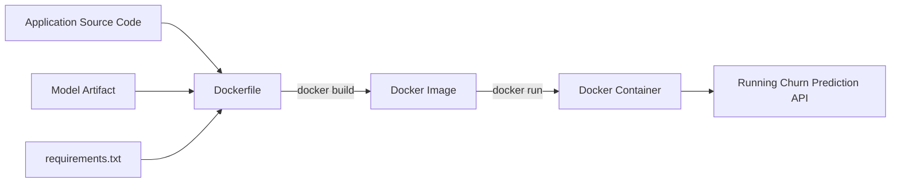
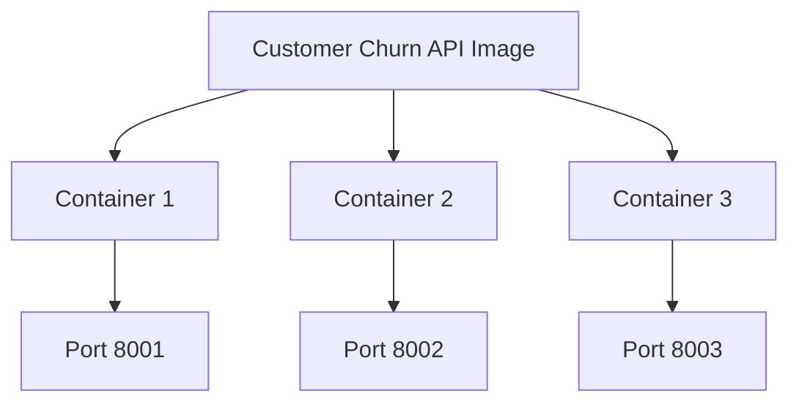
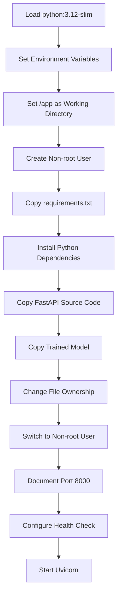
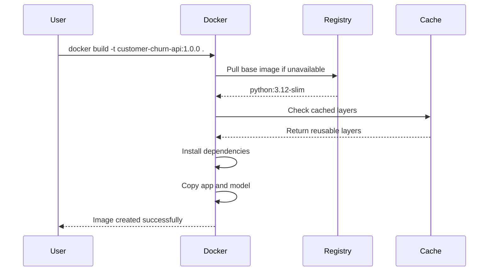
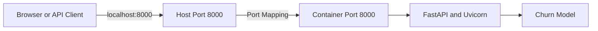
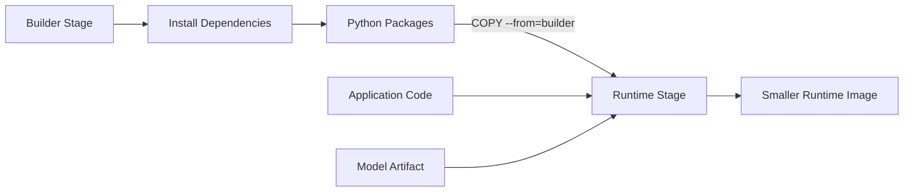
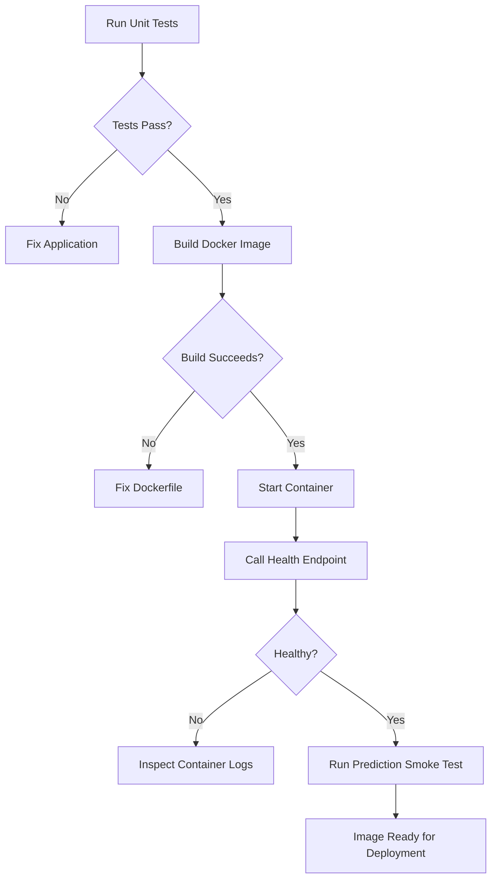

# 009 — Dockerfile

**Course Section:** 05 — Capstone and Portfolio
**Module:** Module 09 — Capstone Projects
**Content Group:** Customer Churn Outputs
**Roadmap Source:** Capstone Projects / Customer Churn Outputs
**Lesson Type:** Capstone
**Lesson Order:** 009
**Suggested Duration:** 24 minutes

---

## 1. Lesson Overview

This lesson explains how to use a **Dockerfile** in an AI and Data Science project.

A Dockerfile is a text file containing instructions for building a Docker image. The image packages an application together with its runtime, dependencies, configuration, and source code.

For the Customer Churn capstone project, a Dockerfile can package:

* The trained churn prediction model
* The FastAPI application
* Python dependencies
* Preprocessing code
* Feature definitions
* Runtime configuration

The resulting Docker image can run consistently on a developer laptop, a testing server, a cloud platform, or a production environment.

A Dockerfile helps solve the common problem:

> “The application works on my machine, but it does not work on another machine.”

By the end of this lesson, you should be able to create, build, run, test, and explain a Docker image for a small machine-learning API.

---

## 2. Learning Objectives

After completing this lesson, you should be able to:

* Explain what a Dockerfile is in your own words.
* Distinguish between a Dockerfile, Docker image, and Docker container.
* Understand where containerization belongs in the AI/Data Science workflow.
* Write a Dockerfile for a Python or FastAPI application.
* Package a trained machine-learning model inside a Docker image.
* Build and run a Docker container locally.
* Expose an API port from a container.
* Use a `.dockerignore` file to reduce the build context.
* Apply basic Docker security and optimization practices.
* Document the Docker workflow in a portfolio README.

---

## 3. Why Docker Matters in Data Science

A machine-learning project usually depends on more than a model file.

It may require:

* A specific Python version
* Particular package versions
* Preprocessing functions
* Environment variables
* Model artifacts
* API source code
* Operating-system libraries

Without containerization, another developer may need to manually reconstruct the environment.

Docker packages these requirements into a reproducible application unit.

### Without Docker

```text
Developer's machine
├── Python 3.11
├── FastAPI
├── scikit-learn
├── pandas
├── preprocessing code
└── churn_model.joblib

Deployment server
├── Different Python version
├── Missing libraries
├── Different package versions
└── Application fails
```

### With Docker

```text
Docker image
├── Defined Python version
├── Exact dependencies
├── FastAPI application
├── Preprocessing code
├── Trained model
└── Startup command
```

The same image can be executed in multiple environments with fewer configuration differences.

---

## 4. Dockerfile, Image, and Container

These three concepts are related but not identical.

| Concept          | Description                                        | Analogy                      |
| ---------------- | -------------------------------------------------- | ---------------------------- |
| Dockerfile       | A text file containing image-building instructions | Recipe                       |
| Docker image     | A packaged, immutable application template         | Prepared application package |
| Docker container | A running instance of an image                     | Running application process  |

### Relationship



One Docker image can be used to create multiple containers.



---

## 5. Docker in the AI/Data Science Workflow

Docker is normally introduced after the model and API have been tested locally.

```mermaid
flowchart LR
    A[Define Business Problem] --> B[Collect Data]
    B --> C[Explore and Clean Data]
    C --> D[Engineer Features]
    D --> E[Train Model]
    E --> F[Evaluate Model]
    F --> G[Save Model Artifact]
    G --> H[Build FastAPI Service]
    H --> I[Write Tests]
    I --> J[Create Dockerfile]
    J --> K[Build Docker Image]
    K --> L[Test Container]
    L --> M[Deploy]
    M --> N[Monitor]
```



Docker does not replace:

* Data validation
* Model evaluation
* API testing
* Security checks
* Production monitoring

It packages the tested application into a deployable unit.

---

## 6. Suggested Project Structure

A clean Customer Churn API project may use the following structure:

```text
customer-churn-api/
├── app/
│   ├── __init__.py
│   ├── main.py
│   ├── schemas.py
│   ├── predictor.py
│   └── preprocessing.py
├── models/
│   └── churn_model.joblib
├── tests/
│   ├── test_api.py
│   └── test_predictor.py
├── notebooks/
│   └── churn_model_training.ipynb
├── requirements.txt
├── Dockerfile
├── .dockerignore
├── README.md
└── .env.example
```

### Important files

| File                        | Purpose                                          |
| --------------------------- | ------------------------------------------------ |
| `app/main.py`               | FastAPI application entry point                  |
| `app/predictor.py`          | Loads the model and generates predictions        |
| `models/churn_model.joblib` | Trained machine-learning model                   |
| `requirements.txt`          | Python dependencies                              |
| `Dockerfile`                | Instructions for creating the image              |
| `.dockerignore`             | Files excluded from the build context            |
| `README.md`                 | Instructions for running and testing the project |

---

## 7. Basic Dockerfile Syntax

A Dockerfile consists of instructions and arguments.

```dockerfile
INSTRUCTION argument
```

Docker instructions are conventionally written in uppercase.

Example:

```dockerfile
FROM python:3.12-slim
WORKDIR /app
COPY requirements.txt .
RUN pip install -r requirements.txt
COPY . .
CMD ["python", "app.py"]
```

The standard filename is:

```text
Dockerfile
```

It normally has no file extension.

---

## 8. Important Dockerfile Instructions

### 8.1 `FROM`

`FROM` defines the base image.

```dockerfile
FROM python:3.12-slim
```

This image provides:

* A Linux-based environment
* Python 3.12
* Basic runtime tools

Pinning a Python version is safer than using an unversioned image.

Less reproducible:

```dockerfile
FROM python:latest
```

More reproducible:

```dockerfile
FROM python:3.12.4-slim
```

The exact version should match the version supported by the project.

---

### 8.2 `WORKDIR`

`WORKDIR` sets the default directory inside the image.

```dockerfile
WORKDIR /app
```

Following instructions operate relative to `/app`.

For example:

```dockerfile
WORKDIR /app
COPY requirements.txt .
```

The destination `.` refers to `/app`.

---

### 8.3 `COPY`

`COPY` transfers files from the build context into the image.

```dockerfile
COPY requirements.txt .
```

This copies:

```text
Host machine:  requirements.txt
Container:     /app/requirements.txt
```

To copy the application source:

```dockerfile
COPY app ./app
```

To copy the trained model:

```dockerfile
COPY models ./models
```

Avoid copying unnecessary files into the image.

---

### 8.4 `RUN`

`RUN` executes a command while the image is being built.

```dockerfile
RUN pip install --no-cache-dir -r requirements.txt
```

Typical uses include:

* Installing packages
* Creating directories
* Installing operating-system dependencies
* Changing file permissions

Each major `RUN`, `COPY`, or similar build instruction creates an image layer.

---

### 8.5 `ENV`

`ENV` defines an environment variable inside the image.

```dockerfile
ENV PYTHONDONTWRITEBYTECODE=1
ENV PYTHONUNBUFFERED=1
```

These settings:

* Prevent Python from generating unnecessary `.pyc` files
* Ensure logs appear immediately

Do not place secrets directly in a Dockerfile.

Unsafe:

```dockerfile
ENV DATABASE_PASSWORD=my-secret-password
```

Secrets should be supplied at runtime using environment variables or a secret-management service.

---

### 8.6 `EXPOSE`

`EXPOSE` documents the port used by the application.

```dockerfile
EXPOSE 8000
```

This does not automatically publish the port to the host.

The host mapping is created with `docker run -p`.

```bash
docker run -p 8000:8000 churn-api
```

The format is:

```text
host_port:container_port
```

---

### 8.7 `CMD`

`CMD` defines the default command executed when a container starts.

For a FastAPI application:

```dockerfile
CMD ["uvicorn", "app.main:app", "--host", "0.0.0.0", "--port", "8000"]
```

A Dockerfile should normally contain one effective `CMD`.

If multiple `CMD` instructions are present, Docker uses the last one.

The JSON or exec form is generally recommended:

```dockerfile
CMD ["python", "app.py"]
```

Instead of:

```dockerfile
CMD python app.py
```

The exec form provides clearer argument handling and better operating-system signal behavior.

---

### 8.8 `ENTRYPOINT`

`ENTRYPOINT` defines the main executable for a container.

Example:

```dockerfile
ENTRYPOINT ["python"]
CMD ["app.py"]
```

This produces the default command:

```bash
python app.py
```

For a basic FastAPI capstone project, using only `CMD` is usually sufficient.

---

### 8.9 `USER`

`USER` specifies which user runs the application.

```dockerfile
USER appuser
```

Running an application as a non-root user is safer than running it as root.

---

### 8.10 `HEALTHCHECK`

`HEALTHCHECK` allows Docker to test whether the application is responding.

```dockerfile
HEALTHCHECK --interval=30s --timeout=5s --retries=3 \
    CMD python -c "import urllib.request; urllib.request.urlopen('http://localhost:8000/health')"
```

The FastAPI application should provide a health endpoint:

```python
@app.get("/health")
def health_check() -> dict[str, str]:
    return {"status": "healthy"}
```

---

## 9. Customer Churn FastAPI Example

### 9.1 API implementation

```python
# app/main.py

from contextlib import asynccontextmanager
from pathlib import Path
from typing import Any

import joblib
import pandas as pd
from fastapi import FastAPI, HTTPException
from pydantic import BaseModel, Field


MODEL_PATH = Path("models/churn_model.joblib")
model: Any | None = None


class ChurnRequest(BaseModel):
    tenure: int = Field(ge=0)
    monthly_charges: float = Field(ge=0)
    total_charges: float = Field(ge=0)
    contract_type: str
    internet_service: str


class ChurnResponse(BaseModel):
    prediction: int
    churn_probability: float
    risk_level: str


@asynccontextmanager
async def lifespan(_: FastAPI):
    global model

    if not MODEL_PATH.exists():
        raise RuntimeError(f"Model file was not found: {MODEL_PATH}")

    model = joblib.load(MODEL_PATH)
    yield
    model = None


app = FastAPI(
    title="Customer Churn Prediction API",
    version="1.0.0",
    lifespan=lifespan,
)


@app.get("/health")
def health_check() -> dict[str, str]:
    return {"status": "healthy"}


@app.post("/predict", response_model=ChurnResponse)
def predict_churn(payload: ChurnRequest) -> ChurnResponse:
    if model is None:
        raise HTTPException(status_code=503, detail="Model is unavailable.")

    input_frame = pd.DataFrame([payload.model_dump()])

    try:
        prediction = int(model.predict(input_frame)[0])
        probability = float(model.predict_proba(input_frame)[0][1])
    except Exception as exc:
        raise HTTPException(
            status_code=422,
            detail=f"Prediction failed: {exc}",
        ) from exc

    if probability >= 0.70:
        risk_level = "high"
    elif probability >= 0.40:
        risk_level = "medium"
    else:
        risk_level = "low"

    return ChurnResponse(
        prediction=prediction,
        churn_probability=round(probability, 4),
        risk_level=risk_level,
    )
```

---

### 9.2 Python dependencies

```text
# requirements.txt

fastapi==0.116.1
uvicorn[standard]==0.35.0
pandas==2.3.1
scikit-learn==1.7.1
joblib==1.5.1
pydantic==2.11.7
```

Versions shown here are examples. A real project should use versions validated by its test suite.

---

## 10. Complete Dockerfile

```dockerfile
FROM python:3.12-slim

ENV PYTHONDONTWRITEBYTECODE=1 \
    PYTHONUNBUFFERED=1 \
    PIP_NO_CACHE_DIR=1

WORKDIR /app

RUN groupadd --system appgroup \
    && useradd --system --gid appgroup --create-home appuser

COPY requirements.txt .

RUN pip install --upgrade pip \
    && pip install -r requirements.txt

COPY app ./app
COPY models ./models

RUN chown -R appuser:appgroup /app

USER appuser

EXPOSE 8000

HEALTHCHECK --interval=30s --timeout=5s --start-period=10s --retries=3 \
    CMD python -c "import urllib.request; urllib.request.urlopen('http://localhost:8000/health')"

CMD [
    "uvicorn",
    "app.main:app",
    "--host",
    "0.0.0.0",
    "--port",
    "8000"
]
```

### Dockerfile execution flow



---

## 11. Why Dependencies Are Copied First

Consider these instructions:

```dockerfile
COPY requirements.txt .
RUN pip install -r requirements.txt
COPY app ./app
```

Docker can reuse cached layers.

When only the source code changes, Docker may reuse the dependency-installation layer.

### Better layer order

```text
1. Copy requirements.txt
2. Install dependencies
3. Copy application code
```

### Less efficient order

```text
1. Copy the entire project
2. Install dependencies
```

In the second approach, changing one source file may invalidate the dependency layer and force Docker to reinstall every package.

---

## 12. Creating a `.dockerignore` File

The Docker build context may contain files that should not be copied or uploaded to the Docker daemon.

Create:

```text
.dockerignore
```

Example:

```dockerignore
.git
.gitignore
.github

.env
.env.*
!.env.example

__pycache__
*.py[cod]
.pytest_cache
.mypy_cache
.ruff_cache

.venv
venv

notebooks
data
reports
artifacts

tests
coverage.xml
htmlcov

*.log
.DS_Store
Thumbs.db
```

Do not exclude a required model artifact unless it is downloaded separately during deployment.

### Benefits

* Faster builds
* Smaller build context
* Reduced risk of copying secrets
* Cleaner images
* Better cache behavior

---

## 13. Building the Docker Image

Run the command from the directory containing the Dockerfile:

```bash
docker build -t customer-churn-api:1.0.0 .
```

### Command breakdown

| Part                 | Meaning                                        |
| -------------------- | ---------------------------------------------- |
| `docker build`       | Build an image                                 |
| `-t`                 | Assign a name and tag                          |
| `customer-churn-api` | Image name                                     |
| `1.0.0`              | Image version tag                              |
| `.`                  | Use the current directory as the build context |

### Build process



---

## 14. Listing Docker Images

```bash
docker image ls
```

Example output:

```text
REPOSITORY           TAG       IMAGE ID       CREATED          SIZE
customer-churn-api   1.0.0     94ab12cd34ef   20 seconds ago   320MB
```

You can also inspect the image:

```bash
docker inspect customer-churn-api:1.0.0
```

To examine its layers:

```bash
docker history customer-churn-api:1.0.0
```

---

## 15. Running the Container

```bash
docker run \
  --name churn-api \
  -p 8000:8000 \
  customer-churn-api:1.0.0
```

Windows PowerShell:

```powershell
docker run `
  --name churn-api `
  -p 8000:8000 `
  customer-churn-api:1.0.0
```

Run in detached mode:

```bash
docker run -d \
  --name churn-api \
  -p 8000:8000 \
  customer-churn-api:1.0.0
```

### Port mapping



---

## 16. Testing the Running API

### Health check

```bash
curl http://localhost:8000/health
```

Expected response:

```json
{
  "status": "healthy"
}
```

### Prediction request

```bash
curl -X POST "http://localhost:8000/predict" \
  -H "Content-Type: application/json" \
  -d '{
    "tenure": 6,
    "monthly_charges": 89.5,
    "total_charges": 537.0,
    "contract_type": "Month-to-month",
    "internet_service": "Fiber optic"
  }'
```

Example response:

```json
{
  "prediction": 1,
  "churn_probability": 0.7824,
  "risk_level": "high"
}
```

FastAPI documentation can usually be opened at:

```text
http://localhost:8000/docs
```

---

## 17. Useful Container Commands

### View running containers

```bash
docker ps
```

### View all containers

```bash
docker ps -a
```

### View logs

```bash
docker logs churn-api
```

Follow logs continuously:

```bash
docker logs -f churn-api
```

### Open a shell inside the container

```bash
docker exec -it churn-api sh
```

### Inspect files

```bash
docker exec churn-api ls -la /app
```

### Stop the container

```bash
docker stop churn-api
```

### Start it again

```bash
docker start churn-api
```

### Remove the container

```bash
docker rm churn-api
```

### Force-remove a running container

```bash
docker rm -f churn-api
```

### Remove the image

```bash
docker image rm customer-churn-api:1.0.0
```

---

## 18. Passing Environment Variables

Configuration should usually be supplied when the container starts.

Example:

```bash
docker run -d \
  --name churn-api \
  -p 8000:8000 \
  -e LOG_LEVEL=INFO \
  -e MODEL_PATH=models/churn_model.joblib \
  customer-churn-api:1.0.0
```

Using an environment file:

```bash
docker run -d \
  --name churn-api \
  -p 8000:8000 \
  --env-file .env \
  customer-churn-api:1.0.0
```

Example `.env.example`:

```dotenv
LOG_LEVEL=INFO
MODEL_PATH=models/churn_model.joblib
MODEL_VERSION=1.0.0
```

Do not commit the real `.env` file if it contains secrets.

---

## 19. Development and Production Commands

During local development, automatic reload may be useful:

```bash
uvicorn app.main:app \
  --host 0.0.0.0 \
  --port 8000 \
  --reload
```

Do not normally use `--reload` in production.

Production container command:

```dockerfile
CMD [
    "uvicorn",
    "app.main:app",
    "--host",
    "0.0.0.0",
    "--port",
    "8000"
]
```

For higher traffic, deployment may use multiple workers or a platform-level replica strategy.

Example:

```dockerfile
CMD [
    "uvicorn",
    "app.main:app",
    "--host",
    "0.0.0.0",
    "--port",
    "8000",
    "--workers",
    "2"
]
```

The correct number of workers depends on:

* Available CPU
* Available memory
* Model size
* Prediction latency
* Traffic pattern
* Deployment architecture

---

## 20. Multi-Stage Build Example

Multi-stage builds allow one stage to prepare dependencies and another stage to contain only the runtime files.

```dockerfile
FROM python:3.12-slim AS builder

WORKDIR /build

COPY requirements.txt .

RUN pip install \
    --prefix=/install \
    --no-cache-dir \
    -r requirements.txt


FROM python:3.12-slim AS runtime

ENV PYTHONDONTWRITEBYTECODE=1 \
    PYTHONUNBUFFERED=1

WORKDIR /app

RUN groupadd --system appgroup \
    && useradd --system --gid appgroup appuser

COPY --from=builder /install /usr/local
COPY app ./app
COPY models ./models

RUN chown -R appuser:appgroup /app

USER appuser

EXPOSE 8000

CMD [
    "uvicorn",
    "app.main:app",
    "--host",
    "0.0.0.0",
    "--port",
    "8000"
]
```

### Multi-stage architecture



Multi-stage builds are especially useful when compilation tools are required to install dependencies but are not needed while the application is running.

---

## 21. Model Packaging Strategies

There are several ways to make a model available to the container.

### Strategy A: Copy the model into the image

```dockerfile
COPY models/churn_model.joblib ./models/churn_model.joblib
```

Advantages:

* Simple deployment
* Model and application are versioned together
* Container can start without downloading the model

Limitations:

* A model update requires rebuilding the image
* Large models increase image size

---

### Strategy B: Mount the model at runtime

```bash
docker run \
  -p 8000:8000 \
  -v "$(pwd)/models:/app/models:ro" \
  customer-churn-api:1.0.0
```

Advantages:

* Model can be changed independently
* Image remains smaller

Limitations:

* Deployment requires correct volume configuration
* Model and application versions can become inconsistent

---

### Strategy C: Download the model at startup

The container downloads a versioned model from object storage or a model registry.

Advantages:

* Centralized model management
* Easier model promotion and rollback

Limitations:

* Startup depends on network access
* Authentication and integrity checks are required
* More operational complexity

For a portfolio capstone, copying the model into the image is usually the clearest approach.

---

## 22. Model and Image Versioning

Do not rely only on the `latest` tag.

Less traceable:

```bash
docker build -t customer-churn-api:latest .
```

Better:

```bash
docker build -t customer-churn-api:1.0.0 .
docker build -t customer-churn-api:model-2026-07 .
docker build -t customer-churn-api:git-a1b2c3d .
```

A useful version record may contain:

```json
{
  "api_version": "1.0.0",
  "model_version": "churn-rf-2026-07-01",
  "training_dataset": "telco-churn-v3",
  "git_commit": "a1b2c3d"
}
```

The API can expose this information:

```python
@app.get("/version")
def get_version() -> dict[str, str]:
    return {
        "api_version": "1.0.0",
        "model_version": "churn-rf-2026-07-01",
    }
```

---

## 23. Testing Before Building the Image

A Docker image should package an application that has already passed tests.

```bash
pytest -v
```

Recommended checks include:

* Preprocessing unit tests
* Model-loading tests
* Prediction shape tests
* API schema tests
* Health endpoint tests
* Invalid-input tests
* Missing-model tests

Example API test:

```python
from fastapi.testclient import TestClient

from app.main import app


client = TestClient(app)


def test_health_check() -> None:
    response = client.get("/health")

    assert response.status_code == 200
    assert response.json() == {"status": "healthy"}
```

---

## 24. Testing the Built Image

Building successfully does not prove that the application works correctly.

A basic validation flow is:

```bash
docker build -t customer-churn-api:test .
docker run -d --name churn-api-test -p 8000:8000 customer-churn-api:test
curl --fail http://localhost:8000/health
docker logs churn-api-test
docker rm -f churn-api-test
```

### Validation pipeline



---

## 25. Basic Security Practices

### 25.1 Do not run as root

```dockerfile
USER appuser
```

### 25.2 Do not copy secrets

Exclude secret files:

```dockerignore
.env
*.pem
*.key
credentials.json
```

### 25.3 Pin important versions

```dockerfile
FROM python:3.12.4-slim
```

```text
scikit-learn==1.7.1
```

### 25.4 Use trusted base images

Prefer official or internally approved images.

### 25.5 Keep images minimal

A smaller image normally contains:

* Fewer unnecessary packages
* A smaller attack surface
* Faster transfer times
* Faster startup and deployment

### 25.6 Scan the image

Depending on the environment, image scanning can be performed with tools such as:

```bash
docker scout quickview customer-churn-api:1.0.0
```

The exact scanning tool depends on the CI/CD platform and organization.

---

## 26. Common Mistakes

### Mistake 1: Naming the file incorrectly

Incorrect:

```text
Dockerfile.txt
docker-file
DockerFile
```

Recommended:

```text
Dockerfile
```

---

### Mistake 2: Using `localhost` as the Uvicorn host

Problematic inside a container:

```bash
uvicorn app.main:app --host 127.0.0.1
```

Recommended:

```bash
uvicorn app.main:app --host 0.0.0.0
```

The application must listen on the container network interface.

---

### Mistake 3: Forgetting port mapping

This starts the container but does not publish the API port:

```bash
docker run customer-churn-api:1.0.0
```

Use:

```bash
docker run -p 8000:8000 customer-churn-api:1.0.0
```

---

### Mistake 4: Copying the entire project too early

Less efficient:

```dockerfile
COPY . .
RUN pip install -r requirements.txt
```

Better:

```dockerfile
COPY requirements.txt .
RUN pip install -r requirements.txt
COPY app ./app
COPY models ./models
```

---

### Mistake 5: Not using `.dockerignore`

This may copy:

* Virtual environments
* Git history
* Training datasets
* Notebook outputs
* Local credentials
* Cache directories

---

### Mistake 6: Installing unpinned dependencies

Risky:

```text
fastapi
pandas
scikit-learn
```

More reproducible:

```text
fastapi==0.116.1
pandas==2.3.1
scikit-learn==1.7.1
```

---

### Mistake 7: Embedding secrets in the image

Do not write:

```dockerfile
ENV API_KEY=real-production-secret
```

Image layers may preserve sensitive values even after later instructions attempt to remove them.

---

### Mistake 8: Copying incompatible model files

A model trained with one library version may fail when loaded with another.

Record:

* Python version
* Library versions
* Model format
* Feature schema
* Training code version

---

### Mistake 9: Assuming a successful build means a valid model

The Docker build may pass even when:

* The model file is corrupt
* The feature columns are wrong
* Prediction input order has changed
* The API returns invalid values

Always run a prediction smoke test.

---

### Mistake 10: Using `latest` without version tracking

The `latest` tag does not identify which code or model is running.

Use an explicit version or commit tag.

---

## 27. Practical Exercise

Create a Docker image for the Customer Churn Prediction API.

### Required tasks

1. Create a `Dockerfile`.
2. Use an appropriate Python base image.
3. Set `/app` as the working directory.
4. Copy and install `requirements.txt`.
5. Copy the FastAPI source code.
6. Copy the trained model artifact.
7. Run the application as a non-root user.
8. Expose port `8000`.
9. Start FastAPI with Uvicorn.
10. Create a `.dockerignore` file.
11. Build the image.
12. Start a container.
13. Test `/health`.
14. Test `/predict`.
15. Record the commands in `README.md`.

### Build command

```bash
docker build -t customer-churn-api:1.0.0 .
```

### Run command

```bash
docker run -d \
  --name churn-api \
  -p 8000:8000 \
  customer-churn-api:1.0.0
```

### Test command

```bash
curl http://localhost:8000/health
```

---

## 28. Exercise Deliverables

The final project should contain:

```text
customer-churn-api/
├── app/
├── models/
├── tests/
├── Dockerfile
├── .dockerignore
├── requirements.txt
└── README.md
```

Your README should explain:

* The business problem
* The dataset
* The model
* The evaluation metric
* The API endpoints
* How to build the image
* How to run the container
* How to test the API
* Model assumptions
* Known limitations
* Recommended next steps

---

## 29. Suggested README Section

````markdown
## Run with Docker

### Build the image

```bash
docker build -t customer-churn-api:1.0.0 .
````

### Start the API

```bash
docker run -d \
  --name churn-api \
  -p 8000:8000 \
  customer-churn-api:1.0.0
```

### Check service health

```bash
curl http://localhost:8000/health
```

### Open API documentation

Visit:

http://localhost:8000/docs

### Stop and remove the container

```bash
docker rm -f churn-api
```

````

---

## 30. Portfolio Evaluation Criteria

A strong Docker deliverable should demonstrate more than a successful build.

| Area | Evidence |
|---|---|
| Reproducibility | Versioned base image and dependencies |
| Structure | Clean separation of API, model, and tests |
| Reliability | Health endpoint and smoke test |
| Security | Non-root user and no embedded secrets |
| Efficiency | `.dockerignore` and cache-friendly instruction order |
| Traceability | Image, API, and model versions |
| Documentation | Complete build and run instructions |
| Model quality | Metrics, assumptions, and limitations are documented |

---

## 31. Completion Checklist

### Concepts

- [ ] I can explain a Dockerfile in one or two minutes.
- [ ] I can distinguish a Dockerfile, image, and container.
- [ ] I understand where Docker belongs in the ML lifecycle.
- [ ] I understand the difference between build-time and runtime commands.

### Implementation

- [ ] My project contains a valid `Dockerfile`.
- [ ] My Dockerfile uses a versioned Python base image.
- [ ] Dependencies are installed before source code is copied.
- [ ] The application listens on `0.0.0.0`.
- [ ] The container exposes the expected application port.
- [ ] The API runs as a non-root user.
- [ ] My project contains a `.dockerignore` file.
- [ ] No secrets are included in the image.

### Testing

- [ ] The image builds successfully.
- [ ] The container starts successfully.
- [ ] The health endpoint responds successfully.
- [ ] The prediction endpoint returns a valid response.
- [ ] Invalid input is handled correctly.
- [ ] The model loads with the expected library versions.
- [ ] Container logs are readable.

### Documentation

- [ ] The README contains build instructions.
- [ ] The README contains run instructions.
- [ ] The README contains API test examples.
- [ ] The model version is documented.
- [ ] At least one assumption is documented.
- [ ] At least one limitation is documented.
- [ ] At least one next step is documented.

---

## 32. Related Outcome

Build one end-to-end portfolio project that connects:

- Data exploration
- Feature engineering
- Model training
- Model evaluation
- API development
- Automated testing
- Containerization
- Deployment
- Monitoring

---

## 33. Related Project

**Capstone: End-to-End AI/Data Science Portfolio Project**

Recommended final architecture:

```mermaid
flowchart LR
    A[Customer Dataset] --> B[EDA Notebook]
    B --> C[Feature Pipeline]
    C --> D[Model Training]
    D --> E[Evaluation Report]
    D --> F[Versioned Model Artifact]

    F --> G[FastAPI Prediction Service]
    C --> G

    G --> H[Unit and API Tests]
    H --> I[Dockerfile]
    I --> J[Docker Image]
    J --> K[Container Registry]
    K --> L[Cloud Deployment]
    L --> M[Health and Performance Monitoring]
````

---

## 34. Summary

A Dockerfile is a reproducible set of instructions for packaging an application into a Docker image.

For a Customer Churn capstone project, the Docker image should contain:

* The Python runtime
* Required libraries
* FastAPI source code
* Preprocessing logic
* The trained model
* A startup command
* Basic runtime and health configuration

The essential workflow is:

```text
Write Dockerfile
      ↓
Build Docker image
      ↓
Run Docker container
      ↓
Test health and prediction endpoints
      ↓
Version and publish the image
      ↓
Deploy and monitor the service
```

A high-quality capstone should not stop after training a model. It should demonstrate that the model can be packaged, tested, documented, and executed consistently in a deployment-ready environment.

---

## 35. Source Notes

This lesson was expanded from tutorial material covering the relationship between Dockerfiles, images, and containers; Dockerfile instructions such as `FROM`, `WORKDIR`, `COPY`, `RUN`, `EXPOSE`, and `CMD`; image building; container execution; and port mapping.
