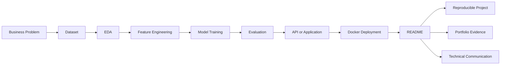
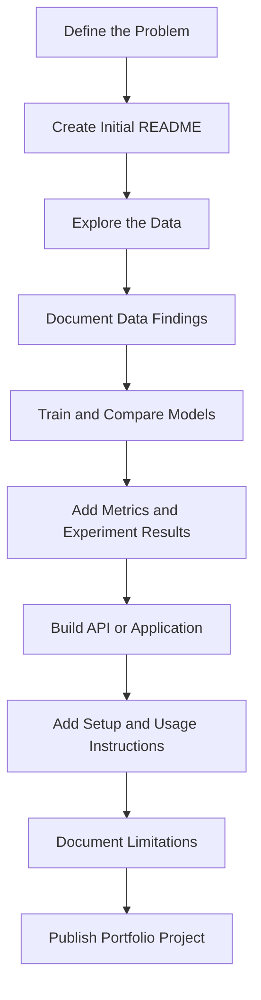

# 010 — README

**Course Section:** 05 — Capstone and Portfolio
**Module:** Module 09 — Capstone Projects
**Content Group:** Customer Churn Outputs
**Roadmap Source:** Capstone Projects / Customer Churn Outputs
**Lesson Type:** Capstone
**Lesson Order:** 010
**Suggested Duration:** 24 minutes

---

## 1. Overview

This lesson explains how to create an effective **README** for an AI or Data Science project.

A README is often the first file that recruiters, engineers, data scientists, instructors, or project stakeholders read. It should explain:

* What problem the project solves
* What data was used
* How the solution was developed
* How well the model performs
* How to run the project
* What limitations still exist
* What should be improved next

For a capstone project, the README connects the entire workflow—from exploratory data analysis and model training to evaluation, API deployment, and business recommendations.

A strong README should allow another person to understand the project without reading every source-code file.

---

## 2. Learning Objectives

By the end of this lesson, you should be able to:

* Explain the purpose of a README in your own words.
* Describe where the README belongs in an AI and Data Science workflow.
* Organize a README for an end-to-end machine learning project.
* Document datasets, assumptions, experiments, metrics, and limitations.
* Provide reproducible setup and execution instructions.
* Present technical results in a way that both technical and non-technical readers can understand.
* Use the README as a professional portfolio artifact.

---

## 3. What Is a README?

A **README** is the main documentation file located at the root of a software or data project.

It is commonly named:

```text
README.md
```

The `.md` extension means that the file is written in **Markdown**.

A README acts as the entry point to the project. It should answer the following questions:

1. What is this project?
2. Why was it created?
3. What problem does it solve?
4. What data does it use?
5. How does the solution work?
6. What results were achieved?
7. How can someone run it?
8. What are its limitations?
9. What should be done next?

---

## 4. Why the README Matters

A machine learning project may contain good code and a high-performing model, but it can still be difficult to evaluate if the documentation is unclear.

The README turns separate technical outputs into a coherent project story.



A good README provides three major benefits:

### 4.1 Understanding

Readers can quickly understand the project goal, methodology, and results.

### 4.2 Reproducibility

Other developers or data scientists can install the dependencies and run the project.

### 4.3 Portfolio Value

Recruiters and hiring managers can assess your technical ability, reasoning, and communication skills.

---

## 5. README in the AI/Data Science Workflow

The README is usually written and updated throughout the project rather than created only at the end.



The README should evolve with the project:

| Project Stage      | README Information                           |
| ------------------ | -------------------------------------------- |
| Problem definition | Objective, scope, target users               |
| Data collection    | Data source, schema, license                 |
| EDA                | Main patterns, charts, missing values        |
| Modeling           | Algorithms, features, training strategy      |
| Evaluation         | Metrics, validation method, model comparison |
| Deployment         | API endpoints, Docker commands, architecture |
| Final delivery     | Results, limitations, recommendations        |

---

## 6. Recommended README Structure

A professional AI/Data Science README can use the following structure:

```text
README.md
├── Project Title
├── Project Overview
├── Business Problem
├── Objectives
├── Dataset
├── Project Structure
├── Methodology
├── Exploratory Data Analysis
├── Feature Engineering
├── Model Training
├── Evaluation
├── Results
├── Installation
├── Usage
├── API Documentation
├── Docker Instructions
├── Limitations
├── Future Improvements
└── Author and License
```

Not every project requires every section. However, the reader should always be able to understand the problem, data, method, results, and limitations.

---

## 7. Essential README Sections

## 7.1 Project Title

The project title should clearly communicate what the project does.

Weak title:

```markdown
# Machine Learning Project
```

Better title:

```markdown
# Customer Churn Prediction Using Machine Learning
```

Stronger portfolio title:

```markdown
# Customer Churn Prediction: From Exploratory Analysis to FastAPI Deployment
```

---

## 7.2 Project Overview

The overview should summarize the project in a few sentences.

Example:

```markdown
## Project Overview

This project develops a machine learning system for predicting whether a
telecommunications customer is likely to cancel their subscription.

The project includes exploratory data analysis, feature engineering, model
comparison, evaluation, a FastAPI prediction service, and Docker-based
deployment.
```

The overview should be understandable even to someone who has not read the source code.

---

## 7.3 Business Problem

Explain why the prediction problem matters.

Example:

```markdown
## Business Problem

Customer churn reduces recurring revenue and increases customer acquisition
costs. The objective of this project is to identify customers at high risk of
churning so that the retention team can prioritize targeted interventions.
```

A useful problem statement includes:

* The affected users or organization
* The decision that needs to be made
* The predicted outcome
* The expected business value

---

## 7.4 Project Objectives

Define measurable goals.

```markdown
## Objectives

- Explore the main factors associated with customer churn.
- Build a classification model that estimates churn probability.
- Compare multiple machine learning algorithms.
- Evaluate the final model using ROC-AUC, precision, recall, and F1-score.
- Expose the selected model through a REST API.
- Package the application as a Docker container.
```

Avoid objectives that are too vague, such as:

```text
Build a good model.
```

Instead, describe what “good” means using measurable metrics or operational requirements.

---

## 7.5 Dataset

Document where the data came from and what it contains.

```markdown
## Dataset

The dataset contains customer profile, subscription, payment, and service usage
information.

- **Rows:** 7,043 customers
- **Target:** `Churn`
- **Task type:** Binary classification
- **Positive class:** Customer leaves the service
- **Negative class:** Customer remains active
```

A useful dataset section may also include:

| Field             | Description                                    |
| ----------------- | ---------------------------------------------- |
| `customer_id`     | Unique customer identifier                     |
| `tenure`          | Number of months as a customer                 |
| `monthly_charges` | Current monthly subscription cost              |
| `contract_type`   | Month-to-month, one-year, or two-year contract |
| `payment_method`  | Customer payment method                        |
| `churn`           | Target variable                                |

Also document:

* Data source
* Data collection period
* License or access restrictions
* Missing values
* Known data-quality issues
* Potential bias or sampling limitations

Do not publish confidential or personally identifiable information.

---

## 7.6 Project Structure

Show readers where important files are located.

```text
customer-churn-project/
├── data/
│   ├── raw/
│   └── processed/
├── notebooks/
│   ├── 01_eda.ipynb
│   └── 02_model_training.ipynb
├── models/
│   └── churn_model.joblib
├── reports/
│   └── figures/
├── src/
│   ├── preprocessing.py
│   ├── train.py
│   └── predict.py
├── tests/
│   └── test_api.py
├── app/
│   └── main.py
├── Dockerfile
├── requirements.txt
└── README.md
```

A clear folder structure improves maintainability and makes the project easier to review.

---

## 7.7 Methodology

Describe the major stages of the solution.

```mermaid
flowchart LR
    A[Raw Customer Data] --> B[Data Validation]
    B --> C[Cleaning]
    C --> D[Feature Engineering]
    D --> E[Train/Validation Split]
    E --> F[Model Training]
    F --> G[Model Evaluation]
    G --> H[Model Serialization]
    H --> I[FastAPI Service]
    I --> J[Docker Container]
```



Example methodology:

```markdown
## Methodology

1. Validate columns, data types, and target labels.
2. Handle missing and inconsistent values.
3. Encode categorical features.
4. Scale numerical features where required.
5. Split the dataset using stratified sampling.
6. Train baseline and candidate classification models.
7. Compare models using cross-validation.
8. Select the final model based on recall and ROC-AUC.
9. Save the preprocessing and model pipeline.
10. Serve predictions through FastAPI.
```

The methodology should be detailed enough to explain the reasoning, but it does not need to reproduce every line of code.

---

## 7.8 Exploratory Data Analysis

Summarize the most important data findings.

Example:

```markdown
## Exploratory Data Analysis

The analysis identified several patterns associated with churn:

- Month-to-month customers had a higher churn rate.
- Customers with shorter tenure were more likely to leave.
- Higher monthly charges were associated with increased churn.
- Customers without technical support showed greater churn risk.
```

Add relevant visualizations when possible:

```markdown

```

Charts should include:

* A descriptive title
* Clearly labeled axes
* Units where applicable
* A caption or interpretation
* Accessible colors and readable text

Do not add charts without explaining why they matter.

---

## 7.9 Feature Engineering

Explain how raw data was converted into model inputs.

```markdown
## Feature Engineering

The preprocessing pipeline performs the following transformations:

- Converts `TotalCharges` to a numerical field.
- Imputes missing numerical values using the median.
- Imputes missing categorical values using the most frequent category.
- One-hot encodes categorical variables.
- Standardizes numerical features for models that require scaling.
- Combines preprocessing and classification into a single pipeline.
```

This section is particularly important when production predictions must use exactly the same preprocessing logic as model training.

---

## 7.10 Model Training

Document the models that were tested.

```markdown
## Models Evaluated

The following classification algorithms were compared:

- Logistic Regression
- Random Forest
- Gradient Boosting
- XGBoost
```

Example experiment table:

| Model               | ROC-AUC | Precision | Recall | F1-score |
| ------------------- | ------: | --------: | -----: | -------: |
| Logistic Regression |    0.84 |      0.66 |   0.78 |     0.71 |
| Random Forest       |    0.82 |      0.70 |   0.62 |     0.66 |
| Gradient Boosting   |    0.85 |      0.69 |   0.75 |     0.72 |

The numbers above are illustrative and should be replaced with actual experiment results.

---

## 7.11 Evaluation Strategy

A README should explain not only the metric values, but also how they were calculated.

Document:

* Train, validation, and test split
* Cross-validation strategy
* Random seed
* Class imbalance handling
* Decision threshold
* Main evaluation metrics
* Reason for selecting the final metric

Example:

```markdown
## Evaluation Strategy

The dataset was divided into training and test sets using a stratified 80/20
split. Five-fold stratified cross-validation was used during model comparison.

Recall was treated as an important metric because failing to identify a customer
who is likely to churn may result in a missed retention opportunity.
ROC-AUC was used to evaluate the model's ranking ability across different
classification thresholds.
```

### Important Classification Metrics

#### Precision

Of all customers predicted to churn, how many actually churned?

[
\text{Precision} =
\frac{TP}{TP + FP}
]

#### Recall

Of all customers who actually churned, how many did the model identify?

[
\text{Recall} =
\frac{TP}{TP + FN}
]

#### F1-score

The harmonic mean of precision and recall:

[
F1 =
2 \times
\frac{\text{Precision} \times \text{Recall}}
{\text{Precision} + \text{Recall}}
]

#### ROC-AUC

Measures how well the model ranks positive examples above negative examples across multiple thresholds.

Accuracy alone may be misleading when the target classes are imbalanced.

---

## 7.12 Final Results

State the final outcome clearly.

Example:

```markdown
## Results

Gradient Boosting was selected as the final model.

Test-set performance:

- **ROC-AUC:** 0.85
- **Precision:** 0.69
- **Recall:** 0.75
- **F1-score:** 0.72

The model successfully identifies a large proportion of customers who are at
risk of churning while maintaining a reasonable false-positive rate.
```

Avoid claiming that the model is “production-ready” based only on test-set performance.

Production readiness also depends on:

* Data reliability
* Security
* Latency
* Monitoring
* Scalability
* Drift detection
* Business validation
* Responsible AI review

---

## 7.13 Business Recommendations

Translate model findings into possible actions.

```markdown
## Business Recommendations

Based on the analysis, the company could:

- Prioritize high-risk month-to-month customers for retention campaigns.
- Offer long-term contract incentives to suitable customers.
- Review support experiences for customers without technical support.
- Test personalized offers based on churn probability and customer value.
- Measure the incremental effect of retention interventions with A/B tests.
```

Model predictions do not prove that an intervention will work. A controlled experiment is still required to estimate causal impact.

---

## 7.14 Installation

Provide clear setup instructions.

```bash
git clone https://github.com/username/customer-churn-project.git
cd customer-churn-project

python -m venv .venv
```

Activate the environment.

macOS or Linux:

```bash
source .venv/bin/activate
```

Windows PowerShell:

```powershell
.venv\Scripts\Activate.ps1
```

Install dependencies:

```bash
pip install -r requirements.txt
```

The README should state the expected Python version:

```text
Python 3.11 or later
```

For reproducibility, dependency versions should be pinned where appropriate.

---

## 7.15 Running the Analysis

Explain how to reproduce the main analysis.

```bash
jupyter lab
```

Then open:

```text
notebooks/01_eda.ipynb
notebooks/02_model_training.ipynb
```

For a script-based workflow:

```bash
python -m src.train
```

The reader should not have to guess which command starts the workflow.

---

## 7.16 Running the API

Example FastAPI command:

```bash
uvicorn app.main:app --reload
```

The API may then be available at:

```text
http://localhost:8000
```

Interactive API documentation:

```text
http://localhost:8000/docs
```

Example health-check request:

```bash
curl http://localhost:8000/health
```

---

## 7.17 Prediction Example

Example request:

```bash
curl -X POST "http://localhost:8000/predict" \
  -H "Content-Type: application/json" \
  -d '{
    "tenure": 5,
    "monthly_charges": 89.50,
    "contract_type": "Month-to-month",
    "payment_method": "Electronic check",
    "technical_support": "No"
  }'
```

Example response:

```json
{
  "prediction": "churn",
  "churn_probability": 0.78,
  "model_version": "1.0.0"
}
```

The input fields and output format should match the actual API implementation.

---

## 7.18 Running with Docker

Build the Docker image:

```bash
docker build -t customer-churn-api .
```

Run the container:

```bash
docker run --rm -p 8000:8000 customer-churn-api
```

Test the service:

```bash
curl http://localhost:8000/health
```

The README should document any required environment variables:

```env
MODEL_PATH=models/churn_model.joblib
LOG_LEVEL=INFO
```

Never commit passwords, access tokens, or private credentials to the README or repository.

---

## 7.19 Testing

Document how to run automated tests.

```bash
pytest
```

For verbose output:

```bash
pytest -v
```

For coverage:

```bash
pytest --cov=src --cov=app
```

Useful tests may include:

* Data schema validation
* Preprocessing tests
* Prediction pipeline tests
* API request and response tests
* Invalid-input tests
* Model-loading tests
* Health-check tests
* Regression tests for important metrics

A working demo is not a replacement for validation and automated testing.

---

## 7.20 Limitations

Every serious project should document its limitations.

Example:

```markdown
## Limitations

- The dataset represents a limited customer population and may not generalize
  to other markets.
- The available features may not capture customer satisfaction or competitor
  activity.
- Churn probabilities may become less reliable when customer behavior changes.
- The model identifies statistical patterns but does not prove causal
  relationships.
- The current API has not been load-tested for high-traffic production use.
- The decision threshold has not yet been optimized using real retention costs.
```

Limitations increase credibility because they show that the author understands where the solution may fail.

---

## 7.21 Assumptions

Document assumptions that affect the analysis.

Example:

```markdown
## Assumptions

- Historical churn labels are accurate.
- Customer records are independent.
- The training data is representative of future API traffic.
- Missing values are not caused by an unobserved business process that strongly
  affects churn.
- The financial cost of false negatives is greater than the cost of some false
  positives.
```

Assumptions should be reviewed with domain experts whenever possible.

---

## 7.22 Future Improvements

Describe realistic next steps.

```markdown
## Future Improvements

- Perform probability calibration.
- Optimize the decision threshold using business costs.
- Add model and data-drift monitoring.
- Track experiments using MLflow.
- Add continuous integration tests.
- Deploy the container to a cloud platform.
- Add batch prediction support.
- Evaluate fairness across relevant customer segments.
- Run an A/B test to measure the effect of retention actions.
```

Future work should follow logically from the current limitations.

---

## 8. Complete README Example

The following is a compact README template for a customer churn project.

````markdown
# Customer Churn Prediction

## Project Overview

This project predicts whether a telecommunications customer is likely to churn.
It includes exploratory data analysis, feature engineering, model comparison,
evaluation, a FastAPI prediction service, and Docker deployment.

## Business Problem

Customer churn reduces recurring revenue. The model is designed to help a
retention team prioritize customers for proactive intervention.

## Dataset

The dataset contains customer demographics, account information, subscribed
services, payment behavior, and churn labels.

- Task: Binary classification
- Target: `Churn`
- Positive class: Customer leaves
- Negative class: Customer remains

## Project Structure

```text
.
├── app/
├── data/
├── models/
├── notebooks/
├── reports/
├── src/
├── tests/
├── Dockerfile
├── requirements.txt
└── README.md
````

## Methodology

1. Validate and clean the data.
2. Explore churn patterns.
3. Build a preprocessing pipeline.
4. Train multiple classification models.
5. Compare models using cross-validation.
6. Evaluate the selected model on a held-out test set.
7. Save the model pipeline.
8. Expose predictions through FastAPI.
9. Package the service with Docker.

## Results

The selected model achieved:

* ROC-AUC: 0.85
* Precision: 0.69
* Recall: 0.75
* F1-score: 0.72

## Installation

```bash
python -m venv .venv
source .venv/bin/activate
pip install -r requirements.txt
```

## Run the API

```bash
uvicorn app.main:app --reload
```

## Run with Docker

```bash
docker build -t customer-churn-api .
docker run --rm -p 8000:8000 customer-churn-api
```

## Run Tests

```bash
pytest -v
```

## Limitations

* Results may not generalize to other customer populations.
* The dataset does not include all possible causes of churn.
* Predictions may degrade when customer behavior changes.
* The current deployment has not been validated under production traffic.

## Future Work

* Add model monitoring.
* Optimize the classification threshold.
* Add experiment tracking.
* Evaluate fairness and probability calibration.
* Test retention actions through controlled experiments.

````

---

## 9. README Quality Checklist

Before publishing the project, verify the following items.

### Project Context

- [ ] The title clearly describes the project.
- [ ] The business problem is explained.
- [ ] The intended user or stakeholder is identified.
- [ ] The project objective is measurable.
- [ ] The project scope is clear.

### Data

- [ ] The data source is documented.
- [ ] The target variable is explained.
- [ ] Important features are described.
- [ ] Missing values and quality problems are mentioned.
- [ ] Data-license or privacy restrictions are documented.

### Modeling

- [ ] The preprocessing steps are described.
- [ ] The models evaluated are listed.
- [ ] The validation strategy is explained.
- [ ] The main metrics are reported.
- [ ] The final model-selection reason is clear.
- [ ] Metric values come from real experiments.

### Reproducibility

- [ ] The expected Python version is stated.
- [ ] Installation commands are provided.
- [ ] Dependency files are included.
- [ ] Training or notebook instructions are provided.
- [ ] API execution instructions are provided.
- [ ] Docker instructions are provided when applicable.
- [ ] Test commands are included.
- [ ] Required environment variables are documented.

### Communication

- [ ] Important charts include interpretations.
- [ ] Technical terms are explained.
- [ ] Business implications are discussed.
- [ ] Assumptions are stated.
- [ ] Limitations are stated.
- [ ] Future improvements are realistic.
- [ ] No private credentials or confidential data are exposed.

---

## 10. Practical Exercise

Create a complete `README.md` for a customer churn capstone project.

Your README should include:

1. Project title
2. Project overview
3. Business problem
4. Dataset description
5. Project structure
6. Methodology
7. Exploratory findings
8. Models evaluated
9. Evaluation metrics
10. Final results
11. Installation instructions
12. Notebook or training commands
13. API usage
14. Docker commands
15. Testing instructions
16. Assumptions
17. Limitations
18. Recommendations
19. Future improvements

### Minimum Deliverables

Your project repository should contain:

```text
README.md
notebooks/01_eda.ipynb
notebooks/02_model_training.ipynb
models/churn_model.joblib
app/main.py
Dockerfile
requirements.txt
tests/
reports/figures/
````

Add at least:

* One data visualization
* One model comparison table
* One final evaluation metric
* One example API request
* One business recommendation
* One assumption
* One limitation
* One next step

---

## 11. Common Mistakes

### 11.1 Writing Only a Project Description

A README that only says what the project is does not explain how it works or how to run it.

**Improvement:** Add methodology, metrics, setup instructions, limitations, and examples.

---

### 11.2 Reporting Metrics Without Context

A metric such as `85% accuracy` is difficult to interpret without knowing the class balance, validation strategy, or baseline.

**Improvement:** Explain the test split, target distribution, metric choice, and baseline performance.

---

### 11.3 Treating Accuracy as the Only Metric

Accuracy can hide poor performance on the minority class.

**Improvement:** Include precision, recall, F1-score, ROC-AUC, and a confusion matrix where appropriate.

---

### 11.4 Publishing Fake or Placeholder Results

Example numbers can accidentally remain in the final README.

**Improvement:** Generate tables and metrics from the actual evaluation pipeline and clearly label illustrative values.

---

### 11.5 Missing Reproduction Instructions

The project may work only on the author's machine.

**Improvement:** Document the runtime version, dependencies, environment variables, commands, and expected outputs.

---

### 11.6 Copying Notebook Content into the README

A README should summarize the project rather than reproduce every analysis step.

**Improvement:** Present the most important findings and link to detailed notebooks.

---

### 11.7 Ignoring Assumptions and Limitations

A project can appear unrealistic or unreliable when weaknesses are hidden.

**Improvement:** State what the model assumes, where it may fail, and what remains unvalidated.

---

### 11.8 Adding Charts Without Interpretation

A chart alone does not explain its relevance.

**Improvement:** Add one or two sentences describing the pattern and its possible impact.

---

### 11.9 Exposing Secrets

API keys or database passwords may be accidentally included in commands or screenshots.

**Improvement:** Use environment variables and provide a safe `.env.example` file.

```env
API_KEY=replace_with_your_key
DATABASE_URL=replace_with_your_database_url
```

---

### 11.10 Claiming Production Readiness Too Early

A model with a good offline score is not automatically ready for production.

**Improvement:** Discuss monitoring, security, performance, data drift, rollback procedures, and business validation.

---

## 12. Completion Checklist

* [ ] I can explain the purpose of a README in one or two minutes.
* [ ] I can describe how the README connects all parts of a capstone project.
* [ ] My README includes the problem, data, method, results, and limitations.
* [ ] My project structure is easy to understand.
* [ ] Another person can install and run the project.
* [ ] My evaluation metrics are based on actual experiments.
* [ ] I explain why the selected metrics matter.
* [ ] I include at least one useful chart or table.
* [ ] I provide an example prediction request and response.
* [ ] I document at least one assumption.
* [ ] I document at least one limitation.
* [ ] I identify at least one future improvement.
* [ ] I have checked that the repository contains no secrets or private data.

---

## 13. Related Outcome

Build one end-to-end portfolio project that connects:

```text
Problem Definition
        ↓
Data Analysis
        ↓
Feature Engineering
        ↓
Model Training
        ↓
Evaluation
        ↓
API Development
        ↓
Docker Deployment
        ↓
README Documentation
        ↓
Portfolio Presentation
```

The README provides the narrative that connects these technical components into one complete project.

---

## 14. Related Project

**Capstone: End-to-End AI/Data Science Portfolio Project**

Recommended outputs:

* Exploratory data analysis notebook
* Model-training notebook or script
* Saved model pipeline
* Evaluation report
* Charts and figures
* FastAPI application
* Automated tests
* Dockerfile
* Dependency file
* Complete README
* Public portfolio repository

---

## 15. Summary

A README is not an optional description added after development. It is a central deliverable of an AI or Data Science capstone project.

A strong README should make the project:

* Understandable
* Reproducible
* Reviewable
* Maintainable
* Credible
* Portfolio-ready

At minimum, it should document:

```text
Problem
+ Data
+ Method
+ Evaluation
+ Results
+ Setup
+ Usage
+ Limitations
+ Next Steps
```

The goal is not only to show that the model works. The goal is to demonstrate that you can define a problem, analyze data, build and validate a solution, deploy it, communicate its value, and acknowledge its limitations.
