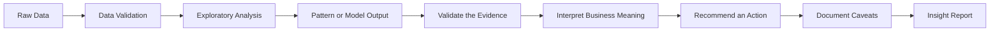
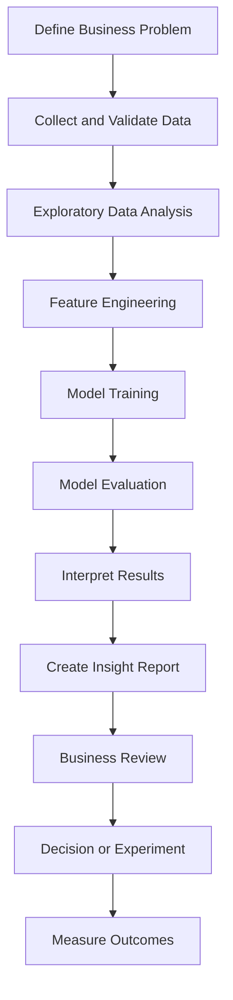
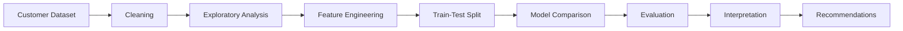
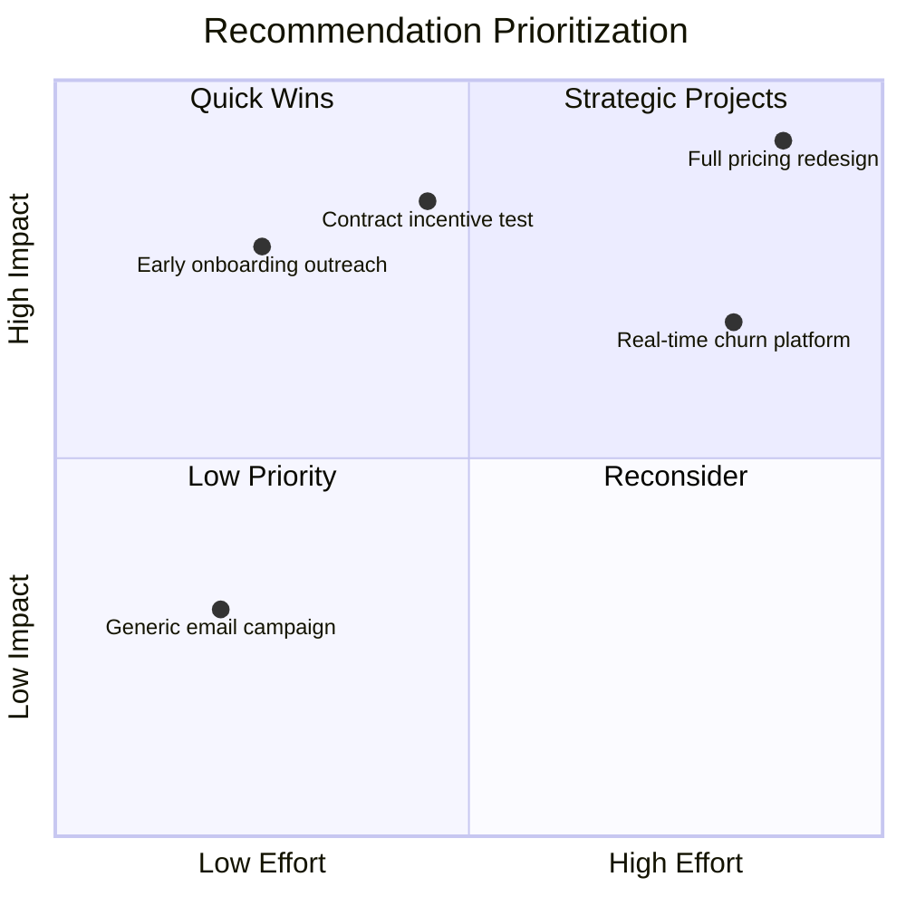
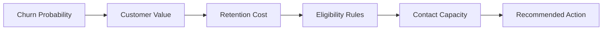

# 011 — Insight Report

**Course Section:** 05 — Capstone and Portfolio
**Module:** Module 09 — Capstone Projects
**Content Group:** Customer Churn Outputs
**Roadmap Source:** Capstone Projects / Customer Churn Outputs
**Lesson Type:** Capstone
**Lesson Order:** 011
**Suggested Duration:** 24 minutes

---

## 1. Overview

This lesson explains how to create an **Insight Report** in the context of AI and Data Science.

An Insight Report transforms raw data, exploratory analysis, model outputs, and evaluation metrics into clear findings that support decisions.

A good report does not simply present charts or model scores. It explains:

* What happened
* Why it may have happened
* Why the finding matters
* What action should be considered
* How confident we are
* What limitations remain

For a customer churn capstone project, the Insight Report connects technical analysis with business decisions such as customer retention, campaign prioritization, service improvements, and model deployment.

---

## 2. Learning Objectives

By the end of this lesson, you should be able to:

* Explain the purpose of an Insight Report in your own words.
* Distinguish an insight from a metric, observation, or chart.
* Identify where an Insight Report belongs in an AI/Data Science workflow.
* Convert exploratory analysis into decision-oriented findings.
* Present model results to both technical and non-technical readers.
* Connect evidence, interpretation, recommendation, and limitation.
* Create a reusable portfolio artifact from a capstone project.

---

## 3. What Is an Insight Report?

An **Insight Report** is a structured document that summarizes the most important findings from data analysis or machine learning work.

It usually combines:

```text
Business Problem
+ Data Evidence
+ Analysis
+ Model Results
+ Interpretation
+ Recommendation
+ Limitations
```

The report should help a reader answer:

1. What problem was analyzed?
2. What data was used?
3. What patterns were discovered?
4. Which findings are important?
5. What does the model predict?
6. How reliable are the results?
7. What actions should be considered?
8. What should be investigated next?

---

## 4. Observation, Metric, Finding, and Insight

These terms are related, but they are not identical.

| Term           | Meaning                                   | Example                                                                  |
| -------------- | ----------------------------------------- | ------------------------------------------------------------------------ |
| Metric         | A numerical measurement                   | Churn rate is 26.5%                                                      |
| Observation    | Something visible in the data             | Month-to-month customers churn more often                                |
| Finding        | A validated pattern from analysis         | Month-to-month contracts are associated with higher churn                |
| Insight        | A finding connected to meaning and action | Retention programs should prioritize high-value month-to-month customers |
| Recommendation | A proposed action                         | Test a long-term contract incentive campaign                             |

### Weak statement

```text
Month-to-month customers have a 42% churn rate.
```

This is a metric or observation.

### Stronger insight

```text
Month-to-month customers show the highest churn rate, especially during their
first six months. This suggests that early retention programs and contract
conversion offers may reduce avoidable churn.
```

The stronger version includes:

* Evidence
* Context
* Interpretation
* Possible action

---

## 5. The Insight Development Process



An Insight Report should not jump directly from data to recommendations.

Each important recommendation should follow a traceable chain:

```text
Evidence
    ↓
Finding
    ↓
Interpretation
    ↓
Business Impact
    ↓
Recommendation
    ↓
Validation Plan
```

---

## 6. Where the Insight Report Fits in the Workflow

The report is usually created after exploratory analysis and model evaluation, but it should be updated throughout the project.



The Insight Report acts as a bridge between technical work and stakeholder action.

---

## 7. Main Purposes of an Insight Report

### 7.1 Communicate Important Findings

The report filters a large amount of analysis into a small number of meaningful conclusions.

### 7.2 Support Decisions

It connects patterns and predictions to possible business actions.

### 7.3 Explain Model Results

It describes what the model learned, how well it performs, and where it may fail.

### 7.4 Document Assumptions

It records the conditions under which the conclusions are expected to remain valid.

### 7.5 Demonstrate Portfolio Skills

It shows that the author can do more than train a model. It demonstrates analytical reasoning, business communication, and responsible interpretation.

---

## 8. Recommended Insight Report Structure

A professional Insight Report can use the following structure:

```text
Insight Report
├── Executive Summary
├── Business Problem
├── Analysis Questions
├── Data Overview
├── Methodology
├── Key Metrics
├── Exploratory Insights
├── Model Performance
├── Model Interpretation
├── Business Recommendations
├── Risks and Limitations
├── Validation Plan
├── Next Steps
└── Appendix
```

A shorter report may contain only:

```text
Problem
+ Evidence
+ Key Insights
+ Recommendations
+ Limitations
+ Next Steps
```

---

## 9. Executive Summary

The executive summary should communicate the most important message in a few paragraphs.

It should answer:

* What was analyzed?
* What were the most important findings?
* What action is recommended?
* What major limitation should the reader understand?

### Example

```markdown
## Executive Summary

This project analyzed customer churn for a telecommunications service and
developed a machine learning model to identify customers at risk of leaving.

The analysis found that customers with month-to-month contracts, short tenure,
high monthly charges, and no technical support had the highest churn risk.

The final model achieved a ROC-AUC of 0.85 and a recall of 0.75 on the held-out
test set. The model can support retention prioritization, but predictions should
not be treated as direct evidence that a specific retention action will work.

The recommended next step is to test targeted retention offers for high-value,
high-risk customers through a controlled experiment.
```

The executive summary should not include every chart or technical detail.

---

## 10. Business Problem

Clearly define the decision the report is intended to support.

### Example

```markdown
## Business Problem

Customer churn reduces recurring revenue and increases the cost of acquiring
replacement customers.

The business needs a way to identify customers who are likely to leave so that
the retention team can prioritize outreach and test appropriate interventions.
```

A useful problem statement includes:

* Business context
* Target population
* Decision to be supported
* Expected value
* Scope of analysis

---

## 11. Analysis Questions

Define the questions that guide the report.

### Example

```markdown
## Analysis Questions

1. What is the overall customer churn rate?
2. Which customer groups have the highest churn rate?
3. How does churn vary by tenure, contract, and service usage?
4. Which features are most useful for predicting churn?
5. How accurately can the model identify customers at risk?
6. What actions should be tested based on the findings?
```

Clear questions prevent the report from becoming a collection of unrelated charts.

---

## 12. Data Overview

Describe the dataset and its important limitations.

### Example

```markdown
## Data Overview

The dataset contains customer account, billing, contract, service, and churn
information.

- **Number of records:** 7,043
- **Target variable:** `Churn`
- **Task type:** Binary classification
- **Positive class:** Customer leaves
- **Negative class:** Customer remains
- **Main feature groups:** Demographics, contracts, services, tenure, and billing
```

### Example Data Dictionary

| Feature             | Description                                        |
| ------------------- | -------------------------------------------------- |
| `tenure`            | Number of months the customer has used the service |
| `monthly_charges`   | Current monthly service charge                     |
| `total_charges`     | Total amount charged to the customer               |
| `contract_type`     | Month-to-month, one-year, or two-year contract     |
| `internet_service`  | Type of internet service                           |
| `technical_support` | Whether technical support is included              |
| `payment_method`    | Customer payment method                            |
| `churn`             | Whether the customer left                          |

Also document:

* Data source
* Collection period
* Missing values
* Duplicate records
* Sampling issues
* Privacy restrictions
* Label quality
* Known data gaps

---

## 13. Methodology

Explain how the insights were generated.



### Example

```markdown
## Methodology

1. Validated column names, data types, and target labels.
2. Removed duplicate records.
3. Converted inconsistent numerical fields.
4. Analyzed missing values and target distribution.
5. Compared churn rates across customer groups.
6. Created a preprocessing and classification pipeline.
7. Trained multiple classification models.
8. Evaluated the models using stratified cross-validation.
9. Selected the final model using ROC-AUC and recall.
10. Translated the findings into business recommendations.
```

The methodology section should be understandable without exposing every implementation detail.

---

## 14. Key Metrics

A useful report begins with a small number of high-value metrics.

### Example Scorecard

| Metric                |         Result | Interpretation                              |
| --------------------- | -------------: | ------------------------------------------- |
| Total customers       |          7,043 | Size of the analyzed population             |
| Churned customers     |          1,869 | Customers who left                          |
| Overall churn rate    |          26.5% | Approximately one in four customers churned |
| Highest-risk contract | Month-to-month | Contract group with the highest churn       |
| Final model ROC-AUC   |           0.85 | Strong ranking performance                  |
| Final model recall    |           0.75 | Identified 75% of actual churners           |

Do not overload the report with every metric produced during analysis.

Select metrics that help answer the business questions.

---

## 15. Writing a Strong Insight

A complete insight can follow this structure:

```text
Insight =
Evidence
+ Interpretation
+ Impact
+ Recommendation
+ Caveat
```

### Insight Template

```markdown
### Insight: [Clear Finding Title]

**Evidence:**  
Describe the numerical result, chart, or model output.

**Interpretation:**  
Explain what the result may mean.

**Business Impact:**  
Explain why the finding matters.

**Recommendation:**  
Describe an action that should be considered or tested.

**Caveat:**  
State what the evidence does not prove.
```

---

## 16. Example Insight 1: Contract Type

```markdown
### Insight 1: Month-to-Month Contracts Show the Highest Churn Risk

**Evidence**

Customers with month-to-month contracts have a substantially higher churn rate
than customers with one-year or two-year contracts.

| Contract Type | Churn Rate |
|---|---:|
| Month-to-month | 42.7% |
| One year | 11.3% |
| Two year | 2.8% |

**Interpretation**

Longer contracts may increase commitment or may be selected by customers who are
already more satisfied with the service.

**Business Impact**

Month-to-month customers represent an important retention opportunity because
their churn risk is high and their contracts make cancellation easier.

**Recommendation**

Test a targeted campaign that offers suitable month-to-month customers an
incentive to switch to a longer contract.

**Caveat**

The analysis shows an association, not proof that changing the contract will
directly reduce churn. A controlled experiment is required.
```

---

## 17. Example Insight 2: Customer Tenure

```markdown
### Insight 2: Churn Is Concentrated During Early Customer Tenure

**Evidence**

Customers in their first six months have a higher churn rate than customers who
have remained with the company for longer periods.

**Interpretation**

The onboarding experience, early service quality, unexpected costs, or unmet
expectations may influence early churn.

**Business Impact**

Reducing early churn may improve customer lifetime value and lower replacement
acquisition costs.

**Recommendation**

Create an onboarding retention program that includes:

- A welcome check-in
- Billing explanations
- Service setup support
- Early satisfaction surveys
- Proactive issue resolution

**Caveat**

The dataset does not contain detailed onboarding experience or satisfaction
survey data, so the reasons for early churn require further investigation.
```

---

## 18. Example Insight 3: Monthly Charges

```markdown
### Insight 3: High Monthly Charges Are Associated with Greater Churn

**Evidence**

Customers with higher monthly charges show a greater probability of churn,
particularly when combined with month-to-month contracts and short tenure.

**Interpretation**

Customers may perceive insufficient value relative to the price they pay.

**Business Impact**

High-value customers may create significant revenue loss when they churn.

**Recommendation**

Prioritize high-value, high-risk customers for value reviews, service audits, or
personalized retention offers.

**Caveat**

High charges may be correlated with premium services and customer complexity.
The relationship should not be interpreted as purely price-driven.
```

---

## 19. Example Insight 4: Technical Support

```markdown
### Insight 4: Customers Without Technical Support Have Higher Churn

**Evidence**

Customers without technical support exhibit a higher churn rate than customers
who subscribe to technical support services.

**Interpretation**

Support access may reduce unresolved problems and improve the customer
experience.

**Business Impact**

Improved support access may be especially valuable for new or high-risk
customers.

**Recommendation**

Test temporary technical support access or proactive support outreach for
selected high-risk customers.

**Caveat**

Customers who purchase support may differ in other ways, such as product usage,
income, contract type, or service complexity.
```

---

## 20. Presenting Exploratory Data Analysis

Charts should support a specific message.

### Recommended Visualizations

* Churn rate by contract type
* Churn rate by tenure group
* Monthly charges by churn status
* Churn rate by payment method
* Churn rate by technical support
* Target class distribution
* Correlation or association summary
* Customer segment comparison

### Example Markdown

```markdown
## Exploratory Insight: Churn by Contract Type


Month-to-month customers have the highest observed churn rate. This group should
be examined further by tenure, monthly charges, and customer value before
retention actions are selected.
```

Every chart should contain:

* A clear title
* Labeled axes
* Units
* Readable categories
* An interpretation
* A source or data scope
* A relevant caveat

---

## 21. Model Performance Section

The report should explain what the model can and cannot do.

### Example Model Comparison

| Model               | ROC-AUC | Precision | Recall | F1-score |
| ------------------- | ------: | --------: | -----: | -------: |
| Logistic Regression |    0.84 |      0.66 |   0.78 |     0.71 |
| Random Forest       |    0.82 |      0.70 |   0.62 |     0.66 |
| Gradient Boosting   |    0.85 |      0.69 |   0.75 |     0.72 |

The values above are illustrative and should be replaced with actual experiment results.

### Example Interpretation

```markdown
## Model Performance

Gradient Boosting achieved the highest ROC-AUC and produced a better balance
between precision and recall than the other candidate models.

Recall was treated as an important metric because a false negative represents a
customer who is likely to churn but is not identified for possible retention
action.
```

---

## 22. Confusion Matrix Interpretation

A confusion matrix helps explain operational trade-offs.

|              | Predicted Stay | Predicted Churn |
| ------------ | -------------: | --------------: |
| Actual Stay  |  True Negative |  False Positive |
| Actual Churn | False Negative |   True Positive |

### Business Interpretation

* **True positive:** A churner is correctly identified.
* **False positive:** A customer is contacted even though they would have stayed.
* **False negative:** A likely churner is missed.
* **True negative:** A staying customer is correctly ignored.

The preferred balance depends on:

* Retention campaign cost
* Customer value
* Contact capacity
* Offer cost
* Cost of missed churn
* Customer experience risk

---

## 23. Model Interpretation

Model interpretation should answer:

* Which variables influence predictions?
* Do these patterns agree with exploratory analysis?
* Are the relationships plausible?
* Are there unexpected or suspicious features?
* Could any feature create leakage or unfair outcomes?

### Example

```markdown
## Model Interpretation

The final model assigned high importance to:

1. Contract type
2. Customer tenure
3. Monthly charges
4. Technical support
5. Internet service type
6. Payment method

These features are consistent with the exploratory analysis. However, feature
importance does not prove that changing a feature will change customer behavior.
```

Potential interpretation methods include:

* Logistic regression coefficients
* Permutation importance
* SHAP values
* Partial dependence plots
* Local prediction explanations

---

## 24. Segment-Level Insights

Overall model performance may hide weak results for specific groups.

### Example Segment Table

| Customer Segment      | Sample Size | Churn Rate | Model Recall |
| --------------------- | ----------: | ---------: | -----------: |
| New customers         |       1,120 |        41% |          82% |
| Long-tenure customers |       2,050 |        10% |          54% |
| Month-to-month        |       3,875 |        43% |          79% |
| Two-year contract     |       1,695 |         3% |          31% |

Possible questions:

* Does the model perform equally well across contract groups?
* Are small groups producing unstable metrics?
* Is recall lower for important customer segments?
* Are predictions calibrated across groups?
* Could the model disadvantage certain populations?

---

## 25. Turning Insights into Recommendations

Recommendations should be specific, testable, and connected to evidence.

### Weak Recommendation

```text
Improve customer satisfaction.
```

### Better Recommendation

```text
Test proactive onboarding support for high-value customers during their first
90 days, beginning with customers on month-to-month contracts.
```

### Recommendation Framework

```text
Target Group
+ Proposed Action
+ Expected Outcome
+ Success Metric
+ Validation Method
```

### Example

| Element          | Example                             |
| ---------------- | ----------------------------------- |
| Target group     | High-risk month-to-month customers  |
| Action           | Offer contract conversion incentive |
| Expected outcome | Reduced churn                       |
| Primary metric   | Incremental retention rate          |
| Secondary metric | Campaign cost per retained customer |
| Validation       | Randomized controlled experiment    |

---

## 26. Recommendation Prioritization

Recommendations may be prioritized using impact and effort.



A recommendation with high predicted impact may still require validation before large-scale implementation.

---

## 27. From Prediction to Decision

A churn model does not automatically determine the correct action.



A useful decision policy may consider:

```text
Expected Benefit =
Probability of Churn
× Probability the Action Works
× Customer Value
− Intervention Cost
```

The model estimates risk. Business rules and experimentation determine the final action.

---

## 28. Assumptions

Document assumptions that affect the report.

### Example

```markdown
## Assumptions

- Historical churn labels are accurate.
- The dataset represents the current customer population.
- Customer behavior during the analysis period is relevant to future customers.
- Missing values do not hide a major unobserved churn process.
- A missed churner is more costly than contacting some customers who would stay.
- Customer value can be estimated from available billing information.
```

An assumption should be reviewed when:

* New data becomes available
* The product changes
* Pricing changes
* Customer behavior changes
* The model is deployed to a new market

---

## 29. Limitations and Caveats

A credible report clearly states its weaknesses.

### Example

```markdown
## Limitations

- The dataset covers a limited customer population.
- The data does not include customer satisfaction surveys.
- Competitor activity is not available.
- The analysis is observational and does not prove causality.
- Churn labels may reflect delayed or inconsistent operational processes.
- Offline model performance may differ from production performance.
- The current decision threshold has not been optimized using campaign costs.
- The model may become less accurate when customer behavior changes.
```

Important distinctions:

```text
Correlation ≠ Causation
Prediction ≠ Intervention Effect
Feature Importance ≠ Business Action
Offline Accuracy ≠ Production Value
```

---

## 30. Validation Plan

Recommendations should include a plan for validation.

### Example

```markdown
## Validation Plan

The contract incentive recommendation should be tested using a randomized
controlled experiment.

### Test Design

- Population: Eligible high-risk month-to-month customers
- Treatment group: Receives contract incentive
- Control group: Receives the current experience
- Primary metric: Churn rate after 60 days
- Secondary metrics:
  - Offer acceptance rate
  - Revenue retained
  - Cost per retained customer
  - Customer complaints
- Guardrail metric: Profit after campaign cost
```

Model improvement should be separated from intervention validation.

A better churn model does not guarantee that a retention campaign is effective.

---

## 31. Suggested Insight Report Folder Structure

```text
customer-churn-project/
├── data/
│   ├── raw/
│   └── processed/
├── notebooks/
│   ├── 01_data_validation.ipynb
│   ├── 02_eda.ipynb
│   ├── 03_model_training.ipynb
│   └── 04_model_interpretation.ipynb
├── reports/
│   ├── insight_report.md
│   ├── insight_report.pdf
│   ├── metrics.json
│   └── figures/
│       ├── churn_distribution.png
│       ├── churn_by_contract.png
│       ├── churn_by_tenure.png
│       ├── confusion_matrix.png
│       └── feature_importance.png
├── models/
│   └── churn_model.joblib
├── src/
├── tests/
├── README.md
└── requirements.txt
```

The report should use artifacts generated from the actual analysis whenever possible.

---

## 32. Compact Insight Report Template

```markdown
# Customer Churn Insight Report

## Executive Summary

Summarize the business problem, most important findings, model performance,
recommended action, and major limitation.

## Business Problem

Explain the decision that the analysis supports.

## Analysis Questions

1. What is the current churn rate?
2. Which customers are most likely to churn?
3. Which patterns may support retention actions?
4. How well does the model identify churn risk?

## Data Overview

- Data source:
- Number of records:
- Target:
- Analysis period:
- Main feature groups:
- Known data limitations:

## Methodology

1. Data validation
2. Data cleaning
3. Exploratory analysis
4. Feature engineering
5. Model training
6. Evaluation
7. Interpretation
8. Recommendation development

## Key Metrics

| Metric | Result | Meaning |
|---|---:|---|
| Overall churn rate | | |
| Final ROC-AUC | | |
| Final precision | | |
| Final recall | | |
| Final F1-score | | |

## Key Insight 1

**Evidence:**  

**Interpretation:**  

**Business Impact:**  

**Recommendation:**  

**Caveat:**  

## Key Insight 2

**Evidence:**  

**Interpretation:**  

**Business Impact:**  

**Recommendation:**  

**Caveat:**  

## Model Performance

Describe the final model, validation strategy, metrics, threshold, and comparison
with the baseline.

## Business Recommendations

| Priority | Recommendation | Expected Impact | Effort | Validation |
|---|---|---|---|---|
| 1 | | | | |
| 2 | | | | |
| 3 | | | | |

## Assumptions

- 
- 
- 

## Limitations

- 
- 
- 

## Next Steps

- 
- 
- 
```

---

## 33. Practical Exercise

Create an Insight Report for a customer churn dataset.

### Step 1: Define the Problem

Write a short business problem statement.

### Step 2: Validate the Data

Check:

* Row count
* Duplicate records
* Missing values
* Invalid categories
* Target distribution
* Data types

### Step 3: Create Exploratory Findings

Analyze churn by at least three variables:

* Contract type
* Tenure
* Monthly charges
* Support services
* Payment method

### Step 4: Train a Model

Train at least two classification models.

Possible options:

* Logistic Regression
* Random Forest
* Gradient Boosting
* XGBoost

### Step 5: Evaluate the Models

Report:

* Precision
* Recall
* F1-score
* ROC-AUC
* Confusion matrix

### Step 6: Write Three Insights

Each insight must contain:

```text
Evidence
+ Interpretation
+ Business Impact
+ Recommendation
+ Caveat
```

### Step 7: Propose a Validation Plan

Describe how at least one recommendation could be tested using an experiment.

---

## 34. Minimum Deliverables

Your final report should include:

* One executive summary
* One business problem statement
* One data overview
* At least three data insights
* At least three charts
* One model comparison table
* One confusion matrix
* One model interpretation section
* At least two business recommendations
* One assumptions section
* One limitations section
* One validation plan
* One next-step section

Suggested files:

```text
reports/insight_report.md
reports/figures/
reports/metrics.json
notebooks/02_eda.ipynb
notebooks/03_model_training.ipynb
```

---

## 35. Common Mistakes

### 35.1 Reporting Charts Without Insights

A chart is evidence, not the final insight.

**Improvement:** Explain what the chart shows, why it matters, and what action may follow.

---

### 35.2 Repeating Every EDA Result

A report should prioritize important findings rather than reproduce the entire notebook.

**Improvement:** Select findings based on business relevance, reliability, and actionability.

---

### 35.3 Confusing Correlation with Causation

A high churn rate in one group does not prove that the group characteristic causes churn.

**Improvement:** Use careful language such as:

```text
associated with
correlated with
observed among
may indicate
requires experimental validation
```

---

### 35.4 Presenting Metrics Without Context

A ROC-AUC or recall score is difficult to interpret without a baseline and validation method.

**Improvement:** Document the test split, cross-validation strategy, class balance, and threshold.

---

### 35.5 Using Accuracy Alone

Accuracy may be misleading for imbalanced data.

**Improvement:** Include precision, recall, F1-score, ROC-AUC, and confusion matrix analysis.

---

### 35.6 Giving Generic Recommendations

Recommendations such as “improve service” are difficult to implement or test.

**Improvement:** Define the target group, action, expected outcome, metric, and validation method.

---

### 35.7 Ignoring Costs

A model may identify many churners but produce an expensive retention campaign.

**Improvement:** Include customer value, intervention cost, false-positive cost, and contact capacity.

---

### 35.8 Hiding Limitations

Reports that present findings as certain may lose credibility.

**Improvement:** State uncertainty, missing variables, bias risks, and generalization limits.

---

### 35.9 Treating Feature Importance as Causal Evidence

A feature may help prediction without being a useful intervention target.

**Improvement:** Separate predictive importance from causal or operational importance.

---

### 35.10 Writing Only for Technical Readers

Stakeholders may not understand modeling terminology.

**Improvement:** Use plain language, explain metrics, and connect technical findings to decisions.

---

## 36. Insight Quality Checklist

For each insight, ask:

* [ ] Is the evidence based on real data?
* [ ] Is the metric or chart clearly described?
* [ ] Is the interpretation logically supported?
* [ ] Is the business relevance clear?
* [ ] Is the recommendation specific?
* [ ] Can the recommendation be tested?
* [ ] Is uncertainty documented?
* [ ] Have correlation and causation been separated?
* [ ] Is the sample size sufficient?
* [ ] Are alternative explanations considered?

---

## 37. Report Completion Checklist

### Business Context

* [ ] The business problem is clearly defined.
* [ ] The target decision is identified.
* [ ] The intended audience is clear.
* [ ] The analysis questions are listed.

### Data

* [ ] The data source is documented.
* [ ] The target variable is explained.
* [ ] Data quality issues are described.
* [ ] Privacy or access restrictions are stated.
* [ ] The analysis period is clear.

### Analysis

* [ ] Important metrics are summarized.
* [ ] Charts support specific findings.
* [ ] Findings are validated where possible.
* [ ] Segment-level patterns are considered.
* [ ] Alternative explanations are discussed.

### Modeling

* [ ] The validation strategy is documented.
* [ ] The baseline is reported.
* [ ] Multiple relevant metrics are included.
* [ ] The classification threshold is explained.
* [ ] Model limitations are stated.
* [ ] Feature leakage has been checked.

### Recommendations

* [ ] Recommendations are linked to evidence.
* [ ] Target groups are defined.
* [ ] Expected outcomes are stated.
* [ ] Costs and risks are considered.
* [ ] A validation method is proposed.
* [ ] Recommendations are prioritized.

### Communication

* [ ] The executive summary is concise.
* [ ] Technical language is explained.
* [ ] Assumptions are documented.
* [ ] Limitations are documented.
* [ ] Next steps are realistic.
* [ ] The report can be understood without reading all notebooks.

---

## 38. Related Outcome

Build one end-to-end portfolio project that connects:

```text
Business Problem
        ↓
Data Validation
        ↓
Exploratory Analysis
        ↓
Modeling
        ↓
Evaluation
        ↓
Interpretation
        ↓
Insight Report
        ↓
Recommendation
        ↓
Experiment or Deployment
```

The Insight Report communicates what the project discovered and how the findings may support real decisions.

---

## 39. Related Project

**Capstone: End-to-End AI/Data Science Portfolio Project**

Recommended project outputs:

* Exploratory data analysis notebook
* Model-training notebook or script
* Saved model pipeline
* Evaluation metrics
* Insight Report
* Charts and visualizations
* FastAPI application
* Dockerfile
* Automated tests
* Project README
* Portfolio repository

---

## 40. Summary

An Insight Report turns technical work into decision-oriented communication.

A strong report connects:

```text
Data
+ Evidence
+ Interpretation
+ Business Impact
+ Recommendation
+ Caveat
+ Validation
```

The goal is not to include every result generated during the project.

The goal is to identify the findings that matter most, explain them clearly, connect them to possible actions, and communicate the uncertainty behind them.

For a customer churn capstone project, the Insight Report should help the reader understand:

* Which customers are most likely to churn
* Which patterns are supported by the data
* How well the model identifies churn risk
* What actions may be worth testing
* What the analysis cannot prove
* What should happen next

A professional Insight Report demonstrates that you can analyze data, build models, evaluate evidence, communicate results, and support responsible decision-making.
