# 012 — Raw Data → EDA → Feature Engineering → ML Model → Evaluation → FastAPI Deployment → Docker + README

**Course Section:** 05 — Capstone and Portfolio
**Module:** Module 09 — Capstone Projects
**Content Group:** Project Pipeline
**Roadmap Source:** Capstone Projects / Project Pipeline
**Lesson Type:** Capstone
**Lesson Order:** 012
**Suggested Duration:** 24 minutes

---

## 1. Overview

This lesson explains how to build a complete, end-to-end AI and Data Science project:

```text
Raw Data
    ↓
Data Validation
    ↓
Exploratory Data Analysis
    ↓
Feature Engineering
    ↓
Machine Learning Model
    ↓
Model Evaluation
    ↓
Model Serialization
    ↓
FastAPI Deployment
    ↓
Docker Container
    ↓
README and Portfolio Delivery
```

Many beginner Machine Learning projects stop after training a model inside a notebook. However, a professional capstone project should demonstrate more than model accuracy.

A complete project should show that you can:

* Understand a business problem
* Acquire and validate data
* Explore patterns and data-quality issues
* Build reproducible preprocessing logic
* Train and compare models
* Select suitable evaluation metrics
* Save the final model
* Expose predictions through an API
* Package the application with Docker
* Test the system
* Document the project clearly
* Explain limitations and future improvements

The goal is to transform an experiment into a usable and reproducible Machine Learning product.

---

## 2. Learning Objectives

By the end of this lesson, you should be able to:

* Explain the complete Machine Learning project pipeline in your own words.
* Identify the output produced at each stage.
* Organize an end-to-end Data Science repository.
* Validate raw data before analysis and modeling.
* Perform Exploratory Data Analysis to discover useful patterns.
* Create and document meaningful features.
* Build reusable preprocessing and modeling pipelines.
* Compare Machine Learning models using suitable metrics.
* Save a trained model for later inference.
* Build a prediction API using FastAPI.
* Package the API and model using Docker.
* Write a README that allows another person to understand and run the project.
* Document assumptions, limitations, caveats, and next steps.

---

## 3. The Complete Project Pipeline


Each stage produces an artifact that becomes the input for the next stage.

| Stage               | Main Question                                  | Typical Output                    |
| ------------------- | ---------------------------------------------- | --------------------------------- |
| Business problem    | What decision should the project support?      | Problem statement                 |
| Raw data            | What information is available?                 | CSV, database table, API response |
| Data validation     | Is the data usable and trustworthy?            | Validation report                 |
| EDA                 | What patterns and problems exist?              | Notebook, charts, insight notes   |
| Feature engineering | What useful signals can be created?            | Feature pipeline                  |
| Model training      | Which algorithm learns the problem best?       | Candidate models                  |
| Evaluation          | How well does the model generalize?            | Metrics and plots                 |
| Serialization       | How can the model be reused?                   | `.joblib` or `.pkl` file          |
| FastAPI             | How can other systems request predictions?     | REST API                          |
| Docker              | How can the environment be reproduced?         | Container image                   |
| README              | How can others understand and run the project? | Project documentation             |

---

## 4. Example Project: Customer Churn Prediction

Throughout this lesson, we will use a customer churn classification project.

### Business Problem

A telecommunications or banking company wants to identify customers who are likely to leave.

The company may use the prediction to:

* Prioritize retention campaigns
* Contact high-risk customers
* Offer suitable contract incentives
* Improve onboarding
* Investigate customer-service problems
* Reduce avoidable revenue loss

### Prediction Target

```text
Churn = 1 → Customer leaves
Churn = 0 → Customer stays
```

### Example Input Features

| Feature             | Description                         |
| ------------------- | ----------------------------------- |
| `credit_score`      | Customer credit score               |
| `age`               | Customer age                        |
| `tenure`            | Length of the customer relationship |
| `balance`           | Current account balance             |
| `num_products`      | Number of products used             |
| `monthly_charges`   | Monthly service cost                |
| `contract_type`     | Current contract category           |
| `payment_method`    | Customer payment method             |
| `is_active_member`  | Whether the customer is active      |
| `technical_support` | Whether support is included         |

---

## 5. Stage 1 — Define the Business Problem

Before downloading data or training a model, define the problem clearly.

A useful problem statement includes:

```text
Target Population
+ Prediction Target
+ Business Decision
+ Success Metric
+ Operational Constraint
```

### Example

```markdown
## Business Problem

Customer churn reduces recurring revenue and increases the cost of replacing
lost customers.

The objective of this project is to build a binary classification model that
estimates the probability that an active customer will leave the company.

The prediction will support customer-retention prioritization. Because missing
a real churner may represent a lost intervention opportunity, recall will be
treated as an important evaluation metric.
```

### Important Questions

* Who will use the prediction?
* What action will follow the prediction?
* What is the positive class?
* What is the cost of a false positive?
* What is the cost of a false negative?
* How frequently will predictions be generated?
* What response time does the API require?
* Is the project a batch system or a real-time system?

---

## 6. Stage 2 — Raw Data

Raw data is the original data collected from a source before project-specific processing.

Common data sources include:

* CSV files
* Excel files
* SQL databases
* Data warehouses
* REST APIs
* Object storage
* Application logs
* Event streams
* Public datasets
* Survey results

### Example Folder

```text
data/
└── raw/
    └── customer_churn.csv
```

### Important Rule

The raw dataset should normally remain unchanged.

```text
Raw data → Read-only reference
Processed data → Generated by code
```

Do not manually edit the original CSV file to fix values. Instead, implement cleaning logic in a script or pipeline.

This ensures that the project can be reproduced.

---

## 7. Stage 3 — Load and Inspect the Data

A first inspection should answer:

* How many rows and columns exist?
* What are the column names?
* What are the data types?
* Which column is the target?
* Are values missing?
* Are duplicates present?
* Are categories inconsistent?
* Is the target imbalanced?

### Example

```python
from pathlib import Path

import pandas as pd

DATA_PATH = Path("data/raw/customer_churn.csv")

if not DATA_PATH.exists():
    raise FileNotFoundError(f"Dataset not found: {DATA_PATH}")

df = pd.read_csv(DATA_PATH)

print("Shape:", df.shape)
print(df.head())
print(df.info())
```

### Summary Statistics

```python
print(df.describe(include="all").transpose())
```

### Missing Values

```python
missing_summary = (
    df.isna()
    .sum()
    .sort_values(ascending=False)
    .to_frame(name="missing_count")
)

missing_summary["missing_rate"] = (
    missing_summary["missing_count"] / len(df)
)

print(missing_summary)
```

### Duplicate Records

```python
duplicate_count = df.duplicated().sum()
print("Duplicate rows:", duplicate_count)
```

### Target Distribution

```python
target_counts = df["churn"].value_counts(dropna=False)
target_rates = df["churn"].value_counts(normalize=True, dropna=False)

print(target_counts)
print(target_rates)
```

---

## 8. Stage 4 — Data Validation

Data validation checks whether the incoming data follows the expected structure and business rules.

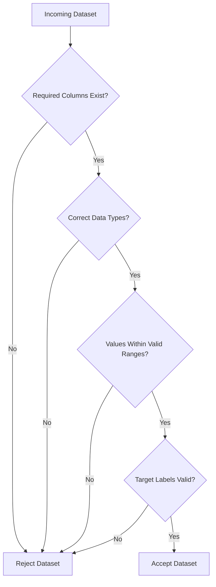

### Example Validation Rules

| Column          | Rule                             |
| --------------- | -------------------------------- |
| `age`           | Must be between 18 and 100       |
| `credit_score`  | Must be within an expected range |
| `tenure`        | Cannot be negative               |
| `balance`       | Must be numeric                  |
| `contract_type` | Must belong to known categories  |
| `churn`         | Must contain only 0 and 1        |
| `customer_id`   | Must be unique                   |

### Simple Validation Function

```python
import pandas as pd


REQUIRED_COLUMNS = {
    "customer_id",
    "age",
    "tenure",
    "balance",
    "num_products",
    "contract_type",
    "churn",
}


def validate_dataset(df: pd.DataFrame) -> None:
    missing_columns = REQUIRED_COLUMNS - set(df.columns)

    if missing_columns:
        raise ValueError(
            f"Dataset is missing required columns: {sorted(missing_columns)}"
        )

    if df["customer_id"].duplicated().any():
        raise ValueError("customer_id contains duplicate values")

    if not df["age"].between(18, 100).all():
        raise ValueError("age contains values outside the accepted range")

    if not set(df["churn"].dropna().unique()).issubset({0, 1}):
        raise ValueError("churn must contain only 0 or 1")
```

### Why Validation Matters

Without validation:

* Training may silently use invalid records.
* A changed column name may break production inference.
* The model may receive categories that did not exist during training.
* Metrics may be calculated on corrupted labels.
* API predictions may become inconsistent.

A notebook that appears to run successfully is not proof that the data is valid.

---

## 9. Stage 5 — Exploratory Data Analysis

Exploratory Data Analysis, or EDA, is used to understand the dataset before modeling.

EDA should answer:

* What is the target distribution?
* Which features differ between churners and non-churners?
* Are numerical values skewed?
* Are outliers present?
* Which categories have high churn rates?
* Are variables strongly correlated?
* Could any feature cause data leakage?
* Which findings may be useful for feature engineering?

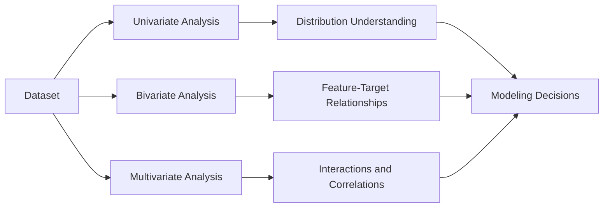

---

## 10. Univariate Analysis

Univariate analysis studies one variable at a time.

### Numerical Features

Useful charts include:

* Histogram
* KDE plot
* Box plot
* Violin plot

```python
import matplotlib.pyplot as plt

df["age"].hist(bins=30)

plt.title("Customer Age Distribution")
plt.xlabel("Age")
plt.ylabel("Number of Customers")
plt.show()
```

### Categorical Features

```python
category_counts = df["contract_type"].value_counts()
category_counts.plot(kind="bar")

plt.title("Customers by Contract Type")
plt.xlabel("Contract Type")
plt.ylabel("Number of Customers")
plt.show()
```

### Questions to Ask

* Is the distribution symmetric or skewed?
* Are extreme values realistic?
* Are rare categories present?
* Is a category dominant?
* Should numerical values be transformed?
* Should rare categories be grouped?

---

## 11. Bivariate Analysis

Bivariate analysis examines the relationship between two variables.

For churn analysis, this often means comparing one feature with the target.

### Churn Rate by Contract Type

```python
contract_churn = (
    df.groupby("contract_type", observed=True)["churn"]
    .mean()
    .sort_values(ascending=False)
)

print(contract_churn)
```

### Churn Rate by Tenure Group

```python
tenure_bins = [-1, 6, 12, 24, 48, float("inf")]
tenure_labels = [
    "0-6 months",
    "7-12 months",
    "13-24 months",
    "25-48 months",
    "49+ months",
]

df["tenure_group"] = pd.cut(
    df["tenure"],
    bins=tenure_bins,
    labels=tenure_labels,
)

tenure_churn = (
    df.groupby("tenure_group", observed=True)["churn"]
    .mean()
)

print(tenure_churn)
```

### Numerical Distribution by Target

```python
for churn_value, group in df.groupby("churn"):
    group["balance"].plot(
        kind="kde",
        label=f"Churn = {churn_value}",
    )

plt.title("Balance Distribution by Churn Status")
plt.xlabel("Balance")
plt.legend()
plt.show()
```

### Interpretation Example

```markdown
Customers with month-to-month contracts show a higher observed churn rate than
customers with longer contracts.

This relationship may indicate that customers with low switching barriers are
more likely to leave. However, the analysis is observational and does not prove
that changing the contract alone will reduce churn.
```

---

## 12. Multivariate Analysis

Multivariate analysis examines several variables together.

Useful methods include:

* Correlation matrix
* Pair plots
* Grouped aggregations
* Pivot tables
* Scatter plots
* Interaction analysis
* Segment analysis

### Correlation Matrix

```python
numeric_df = df.select_dtypes(include="number")
correlation_matrix = numeric_df.corr()

print(correlation_matrix["churn"].sort_values(ascending=False))
```

### Important Caveat

Correlation does not prove causation.

```text
High correlation
    ≠
Changing the feature will change churn
```

A variable may be useful for prediction while being inappropriate as an intervention target.

---

## 13. EDA Deliverables

A useful EDA stage should produce:

```text
notebooks/
└── 01_eda.ipynb

reports/
├── eda_summary.md
└── figures/
    ├── target_distribution.png
    ├── churn_by_contract.png
    ├── churn_by_tenure.png
    ├── balance_distribution.png
    └── correlation_matrix.png
```

The notebook should include:

* Data-loading logic
* Quality checks
* Important charts
* Written interpretations
* Assumptions
* Potential leakage risks
* Candidate features
* Questions for further investigation

EDA is not complete when charts are created. It is complete when the charts produce justified modeling decisions or business questions.

---

## 14. Stage 6 — Feature Engineering

Feature engineering creates useful model inputs from existing data.

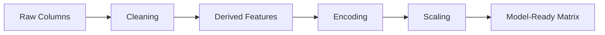

### Example Features

#### Balance per Product

```python
df["balance_per_product"] = (
    df["balance"] / df["num_products"].clip(lower=1)
)
```

#### Salary-to-Balance Ratio

```python
df["salary_balance_ratio"] = (
    df["estimated_salary"] / df["balance"].replace(0, pd.NA)
)

df["salary_balance_ratio"] = (
    df["salary_balance_ratio"]
    .replace([float("inf"), -float("inf")], pd.NA)
)
```

#### Age Group

```python
age_bins = [0, 24, 34, 44, 54, 64, float("inf")]
age_labels = [
    "under_25",
    "25_34",
    "35_44",
    "45_54",
    "55_64",
    "65_plus",
]

df["age_group"] = pd.cut(
    df["age"],
    bins=age_bins,
    labels=age_labels,
)
```

#### High-Balance Customer

```python
high_balance_threshold = df["balance"].quantile(0.75)

df["is_high_balance"] = (
    df["balance"] >= high_balance_threshold
).astype(int)
```

#### Products per Year of Tenure

```python
df["products_per_tenure_year"] = (
    df["num_products"] /
    (df["tenure"].clip(lower=1) / 12)
)
```

---

## 15. Feature Engineering Principles

A useful feature should be:

* Available during inference
* Based on defensible logic
* Consistent between training and production
* Resistant to data leakage
* Easy to test
* Clearly documented
* Stable enough for deployment

### Avoid Data Leakage

Data leakage occurs when the model receives information that would not be available when the prediction is made.

Examples:

* Using cancellation date to predict cancellation
* Using a retention-offer result created after churn risk was identified
* Creating preprocessing statistics from the complete dataset before splitting
* Including future customer activity in historical predictions

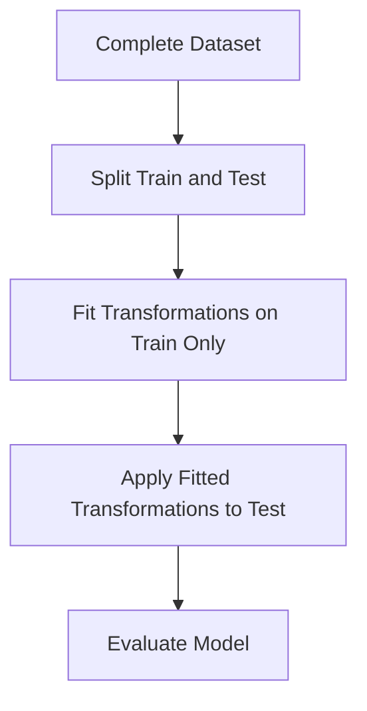

Do not fit imputers, encoders, or scalers on the complete dataset before creating the test set.

---

## 16. Stage 7 — Preprocessing Pipeline

Machine Learning models usually require numerical and consistent inputs.

Typical preprocessing steps include:

### Numerical Columns

* Missing-value imputation
* Scaling
* Outlier handling
* Log transformation

### Categorical Columns

* Missing-value imputation
* One-hot encoding
* Ordinal encoding
* Rare-category grouping

### Example with Scikit-Learn

```python
from sklearn.compose import ColumnTransformer
from sklearn.impute import SimpleImputer
from sklearn.pipeline import Pipeline
from sklearn.preprocessing import OneHotEncoder, StandardScaler


numeric_features = [
    "age",
    "tenure",
    "balance",
    "num_products",
    "estimated_salary",
    "balance_per_product",
]

categorical_features = [
    "country",
    "gender",
    "contract_type",
    "payment_method",
    "age_group",
]

numeric_pipeline = Pipeline(
    steps=[
        ("imputer", SimpleImputer(strategy="median")),
        ("scaler", StandardScaler()),
    ]
)

categorical_pipeline = Pipeline(
    steps=[
        (
            "imputer",
            SimpleImputer(strategy="most_frequent"),
        ),
        (
            "encoder",
            OneHotEncoder(
                handle_unknown="ignore",
                sparse_output=False,
            ),
        ),
    ]
)

preprocessor = ColumnTransformer(
    transformers=[
        ("numeric", numeric_pipeline, numeric_features),
        ("categorical", categorical_pipeline, categorical_features),
    ]
)
```

### Why Use a Pipeline?

A pipeline ensures that:

* Training and inference use the same transformations.
* Preprocessing is included in cross-validation.
* Data leakage is reduced.
* The complete workflow can be saved as one artifact.
* API code remains simpler.
* Testing becomes easier.

---

## 17. Stage 8 — Train-Test Split

The dataset must be divided into independent subsets.

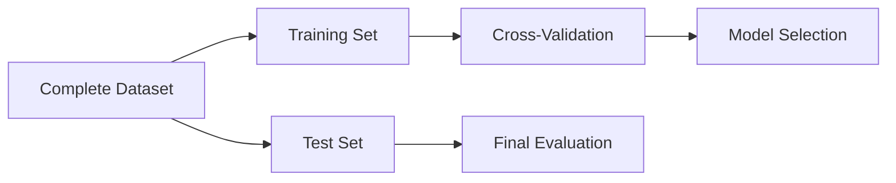

### Example

```python
from sklearn.model_selection import train_test_split


X = df.drop(columns=["churn", "customer_id"])
y = df["churn"]

X_train, X_test, y_train, y_test = train_test_split(
    X,
    y,
    test_size=0.20,
    random_state=42,
    stratify=y,
)
```

### Why Use Stratification?

For classification problems, stratification preserves approximately the same target-class distribution in both training and test sets.

This is important when churn is imbalanced.

---

## 18. Stage 9 — Baseline Model

Always begin with a baseline.

Possible baselines include:

* Predicting the majority class
* Logistic Regression
* Simple Decision Tree
* Business-rule baseline

### Majority-Class Baseline

```python
from sklearn.dummy import DummyClassifier


baseline_model = DummyClassifier(strategy="most_frequent")

baseline_model.fit(X_train, y_train)

baseline_accuracy = baseline_model.score(X_test, y_test)

print("Baseline accuracy:", baseline_accuracy)
```

A candidate model should be compared with the baseline, not evaluated in isolation.

---

## 19. Stage 10 — Train Candidate Models

Candidate models for tabular classification may include:

* Logistic Regression
* Decision Tree
* Random Forest
* Gradient Boosting
* XGBoost
* LightGBM
* Support Vector Machine
* Naive Bayes

### Example Logistic Regression Pipeline

```python
from sklearn.linear_model import LogisticRegression


logistic_pipeline = Pipeline(
    steps=[
        ("preprocessor", preprocessor),
        (
            "model",
            LogisticRegression(
                max_iter=1000,
                class_weight="balanced",
                random_state=42,
            ),
        ),
    ]
)

logistic_pipeline.fit(X_train, y_train)
```

### Example Random Forest Pipeline

```python
from sklearn.ensemble import RandomForestClassifier


random_forest_pipeline = Pipeline(
    steps=[
        ("preprocessor", preprocessor),
        (
            "model",
            RandomForestClassifier(
                n_estimators=300,
                class_weight="balanced",
                random_state=42,
                n_jobs=-1,
            ),
        ),
    ]
)

random_forest_pipeline.fit(X_train, y_train)
```

---

## 20. Cross-Validation

Cross-validation estimates model performance across multiple data splits.

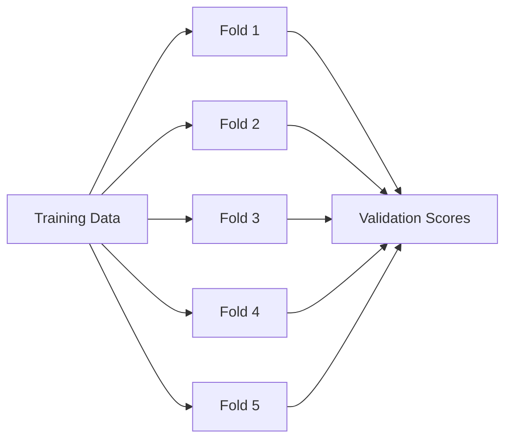

### Example

```python
from sklearn.model_selection import StratifiedKFold, cross_validate


cv = StratifiedKFold(
    n_splits=5,
    shuffle=True,
    random_state=42,
)

scoring = {
    "precision": "precision",
    "recall": "recall",
    "f1": "f1",
    "roc_auc": "roc_auc",
}

cv_results = cross_validate(
    logistic_pipeline,
    X_train,
    y_train,
    cv=cv,
    scoring=scoring,
    n_jobs=-1,
)

for metric_name in scoring:
    score_key = f"test_{metric_name}"
    mean_score = cv_results[score_key].mean()
    print(metric_name, round(mean_score, 4))
```

Cross-validation should be performed on the training data. The test set should remain untouched until final evaluation.

---

## 21. Hyperparameter Tuning

Hyperparameters are model settings configured before training.

Examples include:

* Number of trees
* Tree depth
* Learning rate
* Regularization strength
* Minimum samples per leaf
* Class weights

### Grid Search Example

```python
from sklearn.model_selection import GridSearchCV


parameter_grid = {
    "model__n_estimators": [200, 400],
    "model__max_depth": [None, 8, 16],
    "model__min_samples_leaf": [1, 3, 5],
}

grid_search = GridSearchCV(
    estimator=random_forest_pipeline,
    param_grid=parameter_grid,
    scoring="recall",
    cv=cv,
    n_jobs=-1,
    verbose=1,
)

grid_search.fit(X_train, y_train)

print("Best parameters:", grid_search.best_params_)
print("Best cross-validation score:", grid_search.best_score_)
```

### Important Caveat

Hyperparameter tuning does not guarantee a useful production model.

A model may achieve a slightly better score while becoming:

* Slower
* Larger
* Harder to interpret
* More expensive
* Less stable
* More difficult to maintain

Model selection should consider both predictive performance and operational requirements.

---

## 22. Stage 11 — Model Evaluation

A classification model should usually be evaluated using more than accuracy.

### Confusion Matrix

|              | Predicted Stay | Predicted Churn |
| ------------ | -------------: | --------------: |
| Actual Stay  |  True Negative |  False Positive |
| Actual Churn | False Negative |   True Positive |

### Accuracy

The proportion of all predictions that are correct.

```text
Accuracy = (TP + TN) / (TP + TN + FP + FN)
```

Accuracy can be misleading when the classes are imbalanced.

### Precision

Of all customers predicted to churn, how many actually churned?

```text
Precision = TP / (TP + FP)
```

Use precision when false positives are expensive.

### Recall

Of all customers who actually churned, how many were identified?

```text
Recall = TP / (TP + FN)
```

Use recall when false negatives are expensive.

### F1-Score

The harmonic mean of precision and recall.

```text
F1 = 2 * (Precision * Recall) / (Precision + Recall)
```

### ROC-AUC

Measures how effectively the model ranks positive examples above negative examples across thresholds.

### PR-AUC

Precision-Recall AUC is often useful when the positive class is rare.

---

## 23. Evaluate the Final Model

```python
from sklearn.metrics import (
    accuracy_score,
    classification_report,
    confusion_matrix,
    f1_score,
    precision_score,
    recall_score,
    roc_auc_score,
)


best_model = grid_search.best_estimator_

predictions = best_model.predict(X_test)
probabilities = best_model.predict_proba(X_test)[:, 1]

metrics = {
    "accuracy": accuracy_score(y_test, predictions),
    "precision": precision_score(
        y_test,
        predictions,
        zero_division=0,
    ),
    "recall": recall_score(
        y_test,
        predictions,
        zero_division=0,
    ),
    "f1": f1_score(
        y_test,
        predictions,
        zero_division=0,
    ),
    "roc_auc": roc_auc_score(
        y_test,
        probabilities,
    ),
}

print(metrics)
print(confusion_matrix(y_test, predictions))
print(classification_report(y_test, predictions))
```

### Example Model Comparison

| Model               | Precision | Recall |   F1 | ROC-AUC |
| ------------------- | --------: | -----: | ---: | ------: |
| Logistic Regression |      0.65 |   0.78 | 0.71 |    0.84 |
| Random Forest       |      0.72 |   0.64 | 0.68 |    0.83 |
| Gradient Boosting   |      0.69 |   0.76 | 0.72 |    0.86 |

These values are illustrative. Replace them with actual experiment results.

---

## 24. Selecting the Main Metric

The main metric should reflect the business cost.

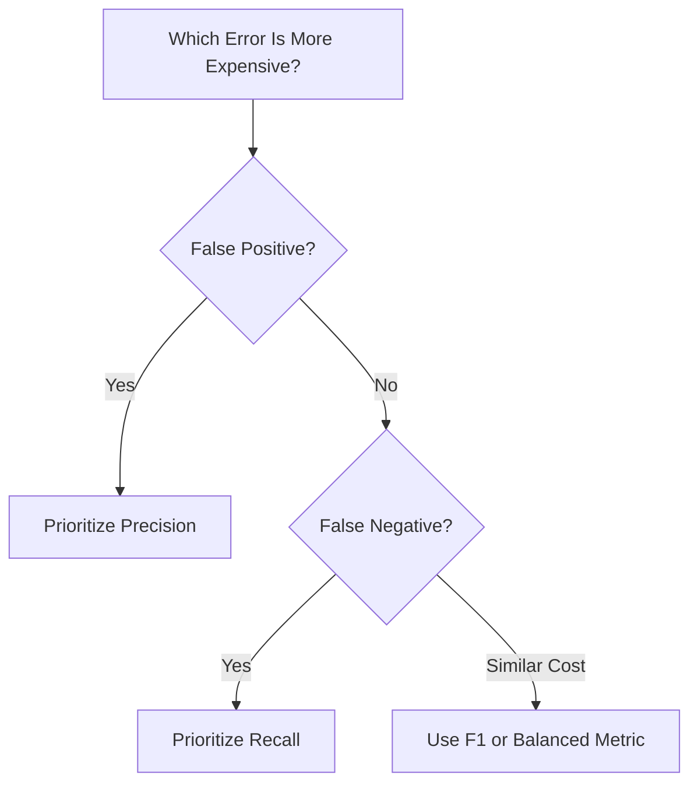

### Churn Example

A false negative means:

```text
The model predicts that the customer will stay,
but the customer actually leaves.
```

The business may lose the opportunity to intervene.

Therefore, recall may be an important metric.

However, optimizing recall can reduce precision and increase unnecessary customer contacts.

The final threshold should be selected with stakeholders.

---

## 25. Probability Threshold

The default classification threshold is often `0.50`, but it may not be optimal.

```python
import numpy as np
from sklearn.metrics import precision_score, recall_score


thresholds = np.arange(0.10, 0.91, 0.05)

for threshold in thresholds:
    threshold_predictions = (
        probabilities >= threshold
    ).astype(int)

    precision = precision_score(
        y_test,
        threshold_predictions,
        zero_division=0,
    )

    recall = recall_score(
        y_test,
        threshold_predictions,
        zero_division=0,
    )

    print(
        f"Threshold={threshold:.2f} "
        f"Precision={precision:.3f} "
        f"Recall={recall:.3f}"
    )
```

A lower threshold usually:

* Detects more churners
* Increases recall
* Produces more false positives
* Reduces precision

A threshold decision should consider:

* Contact capacity
* Retention-offer cost
* Customer lifetime value
* Cost of missed churn
* Customer experience
* Campaign profitability

---

## 26. Stage 12 — Save the Model Artifact

A trained model must be saved before it can be loaded by the API.

```python
from pathlib import Path

import joblib


MODEL_PATH = Path("models/churn_pipeline.joblib")
MODEL_PATH.parent.mkdir(parents=True, exist_ok=True)

joblib.dump(best_model, MODEL_PATH)

print(f"Saved model to: {MODEL_PATH}")
```

Because the preprocessing and model are stored in one pipeline, the API can load one artifact.

### Save Model Metadata

```python
import json
from datetime import datetime, timezone


metadata = {
    "model_name": "customer_churn_classifier",
    "model_version": "1.0.0",
    "created_at": datetime.now(timezone.utc).isoformat(),
    "decision_threshold": 0.45,
    "target": "churn",
    "metrics": metrics,
}

with open(
    "models/metadata.json",
    "w",
    encoding="utf-8",
) as file:
    json.dump(
        metadata,
        file,
        indent=2,
    )
```

Useful metadata includes:

* Model version
* Training date
* Dataset version
* Features
* Evaluation metrics
* Classification threshold
* Code commit
* Library versions

---

## 27. Training Pipeline and Inference Pipeline

Training and inference are related but different workflows.

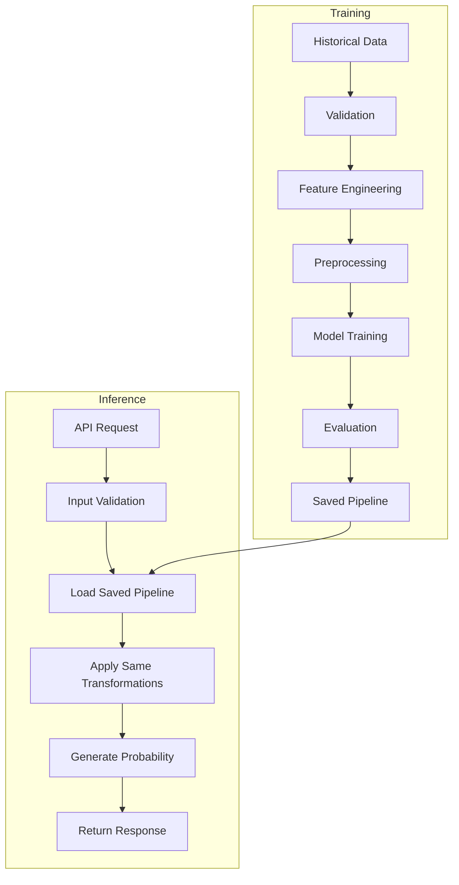

The most important rule is:

```text
The transformations used during training
must be identical to the transformations used during inference.
```

Using a Scikit-Learn pipeline helps enforce this consistency.

---

## 28. Stage 13 — FastAPI Deployment

FastAPI exposes the model through HTTP endpoints.

An external application can send customer information and receive a prediction.

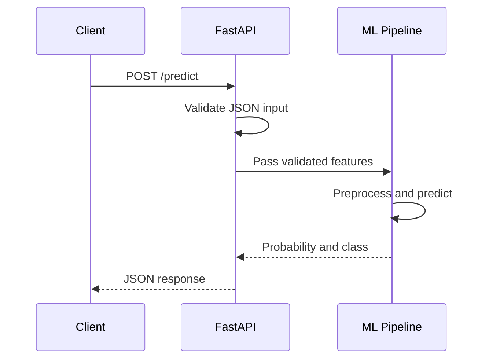

### Suggested Application Structure

```text
app/
├── __init__.py
├── main.py
├── schemas.py
├── model_service.py
└── settings.py
```

---

## 29. Define Request and Response Schemas

```python
from pydantic import BaseModel, Field


class ChurnPredictionRequest(BaseModel):
    age: int = Field(ge=18, le=100)
    tenure: int = Field(ge=0)
    balance: float = Field(ge=0)
    num_products: int = Field(ge=1)
    estimated_salary: float = Field(ge=0)
    country: str
    gender: str
    contract_type: str
    payment_method: str


class ChurnPredictionResponse(BaseModel):
    prediction: int
    label: str
    churn_probability: float
    model_version: str
```

Pydantic validates:

* Required fields
* Data types
* Minimum and maximum values
* Response structure

Invalid requests are rejected before reaching the model logic.

---

## 30. Create the Model Service

```python
from pathlib import Path
from typing import Any

import joblib
import pandas as pd


class ChurnModelService:
    def __init__(
        self,
        model_path: Path,
        threshold: float = 0.50,
    ) -> None:
        if not model_path.exists():
            raise FileNotFoundError(
                f"Model artifact not found: {model_path}"
            )

        self.pipeline: Any = joblib.load(model_path)
        self.threshold = threshold

    def predict(
        self,
        features: dict[str, object],
    ) -> tuple[int, float]:
        input_frame = pd.DataFrame([features])

        probability = float(
            self.pipeline.predict_proba(input_frame)[0, 1]
        )

        prediction = int(
            probability >= self.threshold
        )

        return prediction, probability
```

---

## 31. Create the FastAPI Application

```python
from pathlib import Path

from fastapi import FastAPI, HTTPException

from app.model_service import ChurnModelService
from app.schemas import (
    ChurnPredictionRequest,
    ChurnPredictionResponse,
)


app = FastAPI(
    title="Customer Churn Prediction API",
    description=(
        "Predicts whether a customer is likely to churn."
    ),
    version="1.0.0",
)

model_service = ChurnModelService(
    model_path=Path("models/churn_pipeline.joblib"),
    threshold=0.45,
)


@app.get("/health")
def health_check() -> dict[str, str]:
    return {
        "status": "healthy",
        "model": "customer_churn_classifier",
    }


@app.post(
    "/predict",
    response_model=ChurnPredictionResponse,
)
def predict_churn(
    request: ChurnPredictionRequest,
) -> ChurnPredictionResponse:
    try:
        prediction, probability = model_service.predict(
            request.model_dump()
        )

        return ChurnPredictionResponse(
            prediction=prediction,
            label=(
                "likely_to_churn"
                if prediction == 1
                else "likely_to_stay"
            ),
            churn_probability=round(probability, 4),
            model_version="1.0.0",
        )

    except Exception as error:
        raise HTTPException(
            status_code=500,
            detail="Prediction failed",
        ) from error
```

---

## 32. Run the API Locally

Install dependencies:

```bash
pip install fastapi uvicorn pandas scikit-learn joblib
```

Start the application:

```bash
uvicorn app.main:app --reload
```

The API will usually be available at:

```text
http://localhost:8000
```

Interactive Swagger documentation:

```text
http://localhost:8000/docs
```

Alternative ReDoc documentation:

```text
http://localhost:8000/redoc
```

---

## 33. Test the API

### Health Check

```bash
curl http://localhost:8000/health
```

Example response:

```json
{
  "status": "healthy",
  "model": "customer_churn_classifier"
}
```

### Prediction Request

```bash
curl -X POST "http://localhost:8000/predict" \
  -H "Content-Type: application/json" \
  -d '{
    "age": 42,
    "tenure": 8,
    "balance": 125000.0,
    "num_products": 1,
    "estimated_salary": 65000.0,
    "country": "France",
    "gender": "Female",
    "contract_type": "Month-to-month",
    "payment_method": "Electronic check"
  }'
```

Example response:

```json
{
  "prediction": 1,
  "label": "likely_to_churn",
  "churn_probability": 0.7821,
  "model_version": "1.0.0"
}
```

---

## 34. HTTP Status Codes

A reliable API should return suitable HTTP status codes.

|  Code | Meaning                 | Example                 |
| ----: | ----------------------- | ----------------------- |
| `200` | Successful request      | Prediction generated    |
| `400` | Invalid business input  | Unsupported category    |
| `404` | Resource not found      | Unknown model version   |
| `422` | Schema validation error | Missing required field  |
| `500` | Internal server error   | Model-loading failure   |
| `503` | Service unavailable     | Model service not ready |

Clear error behavior makes the API easier to integrate and monitor.

---

## 35. Stage 14 — API Testing

### Example Pytest Test

```python
from fastapi.testclient import TestClient

from app.main import app


client = TestClient(app)


def test_health_check() -> None:
    response = client.get("/health")

    assert response.status_code == 200
    assert response.json()["status"] == "healthy"


def test_prediction_endpoint() -> None:
    payload = {
        "age": 42,
        "tenure": 8,
        "balance": 125000.0,
        "num_products": 1,
        "estimated_salary": 65000.0,
        "country": "France",
        "gender": "Female",
        "contract_type": "Month-to-month",
        "payment_method": "Electronic check",
    }

    response = client.post(
        "/predict",
        json=payload,
    )

    assert response.status_code == 200

    result = response.json()

    assert result["prediction"] in [0, 1]
    assert 0 <= result["churn_probability"] <= 1
    assert "model_version" in result
```

### Invalid Input Test

```python
def test_prediction_rejects_invalid_age() -> None:
    payload = {
        "age": -10,
        "tenure": 8,
        "balance": 125000.0,
        "num_products": 1,
        "estimated_salary": 65000.0,
        "country": "France",
        "gender": "Female",
        "contract_type": "Month-to-month",
        "payment_method": "Electronic check",
    }

    response = client.post(
        "/predict",
        json=payload,
    )

    assert response.status_code == 422
```

---

## 36. Stage 15 — Docker

Docker packages the following components into a reproducible environment:

```text
Python Runtime
+ Dependencies
+ FastAPI Application
+ Model Artifact
+ Configuration
```

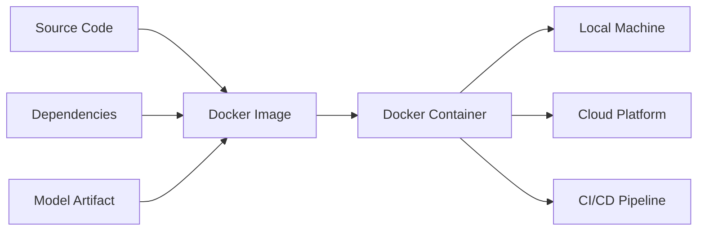

Docker reduces problems caused by:

* Different Python versions
* Missing dependencies
* Operating-system differences
* Inconsistent model paths
* Different local environments

---

## 37. Example Dockerfile

```dockerfile
FROM python:3.11-slim

ENV PYTHONDONTWRITEBYTECODE=1
ENV PYTHONUNBUFFERED=1

WORKDIR /app

COPY requirements.txt .

RUN pip install \
    --no-cache-dir \
    --upgrade pip \
    && pip install \
    --no-cache-dir \
    -r requirements.txt

COPY app ./app
COPY models ./models

EXPOSE 8000

CMD [
    "uvicorn",
    "app.main:app",
    "--host",
    "0.0.0.0",
    "--port",
    "8000"
]
```

---

## 38. Example `.dockerignore`

```text
.git
.github
.venv
venv
__pycache__
*.pyc
.pytest_cache
.ipynb_checkpoints
notebooks
data
reports
tests
.env
```

Do not exclude the model directory when the model must be copied into the image.

---

## 39. Build the Docker Image

```bash
docker build \
  -t customer-churn-api:1.0.0 \
  .
```

List available images:

```bash
docker images
```

---

## 40. Run the Docker Container

```bash
docker run \
  --rm \
  -p 8000:8000 \
  customer-churn-api:1.0.0
```

Test the container:

```bash
curl http://localhost:8000/health
```

Open the interactive documentation:

```text
http://localhost:8000/docs
```

---

## 41. Docker Runtime Flow

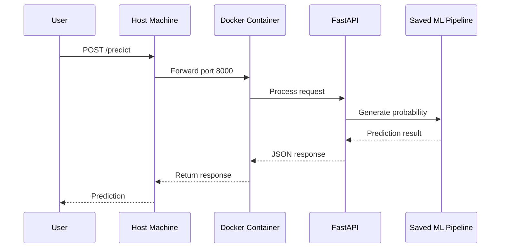

---

## 42. Environment Variables

Configuration should not be hardcoded.

### Example `.env.example`

```env
MODEL_PATH=models/churn_pipeline.joblib
MODEL_VERSION=1.0.0
PREDICTION_THRESHOLD=0.45
LOG_LEVEL=INFO
```

### Example Settings

```python
import os
from pathlib import Path


MODEL_PATH = Path(
    os.getenv(
        "MODEL_PATH",
        "models/churn_pipeline.joblib",
    )
)

MODEL_VERSION = os.getenv(
    "MODEL_VERSION",
    "1.0.0",
)

PREDICTION_THRESHOLD = float(
    os.getenv(
        "PREDICTION_THRESHOLD",
        "0.50",
    )
)
```

Never commit:

* API keys
* Passwords
* Database credentials
* Cloud secrets
* Private tokens

---

## 43. Suggested Project Structure

```text
customer-churn-project/
├── app/
│   ├── __init__.py
│   ├── main.py
│   ├── model_service.py
│   ├── schemas.py
│   └── settings.py
├── data/
│   ├── raw/
│   │   └── customer_churn.csv
│   └── processed/
│       └── customer_churn_processed.csv
├── models/
│   ├── churn_pipeline.joblib
│   └── metadata.json
├── notebooks/
│   ├── 01_eda.ipynb
│   ├── 02_feature_engineering.ipynb
│   └── 03_model_training.ipynb
├── reports/
│   ├── insight_report.md
│   ├── metrics.json
│   └── figures/
│       ├── target_distribution.png
│       ├── churn_by_contract.png
│       ├── confusion_matrix.png
│       └── roc_curve.png
├── src/
│   ├── __init__.py
│   ├── data_validation.py
│   ├── features.py
│   ├── train.py
│   └── evaluate.py
├── tests/
│   ├── test_api.py
│   ├── test_features.py
│   ├── test_model.py
│   └── test_validation.py
├── .dockerignore
├── .env.example
├── .gitignore
├── Dockerfile
├── README.md
├── requirements.txt
└── pyproject.toml
```

---

## 44. Separate Notebook Exploration from Production Code

Notebooks are useful for:

* Exploration
* Visualization
* Testing ideas
* Comparing models
* Communicating findings

Production scripts are useful for:

* Reproducibility
* Automation
* Testing
* Deployment
* Scheduled retraining
* CI/CD


A recommended workflow is:

1. Explore the problem in notebooks.
2. Identify stable transformations.
3. Move reusable logic into Python modules.
4. Add tests.
5. Run training through a script.
6. Save the model artifact.
7. Load the artifact from the API.

---

## 45. Training Script Example

```python
from pathlib import Path

import joblib
import pandas as pd
from sklearn.model_selection import train_test_split

from src.features import build_model_pipeline
from src.data_validation import validate_dataset


def train_model() -> None:
    data_path = Path(
        "data/raw/customer_churn.csv"
    )

    model_path = Path(
        "models/churn_pipeline.joblib"
    )

    df = pd.read_csv(data_path)

    validate_dataset(df)

    X = df.drop(
        columns=[
            "customer_id",
            "churn",
        ]
    )

    y = df["churn"]

    X_train, X_test, y_train, y_test = (
        train_test_split(
            X,
            y,
            test_size=0.20,
            stratify=y,
            random_state=42,
        )
    )

    pipeline = build_model_pipeline()

    pipeline.fit(
        X_train,
        y_train,
    )

    model_path.parent.mkdir(
        parents=True,
        exist_ok=True,
    )

    joblib.dump(
        pipeline,
        model_path,
    )

    print(
        f"Model saved to {model_path}"
    )


if __name__ == "__main__":
    train_model()
```

Run the script:

```bash
python -m src.train
```

---

## 46. Experiment Tracking

As the project grows, track:

* Model type
* Hyperparameters
* Dataset version
* Feature set
* Training duration
* Evaluation metrics
* Model artifact
* Code version

### Simple Experiment Table

| Run | Model               | Features   | Recall |   F1 | ROC-AUC |
| --- | ------------------- | ---------- | -----: | ---: | ------: |
| 001 | Logistic Regression | Raw        |   0.72 | 0.68 |    0.82 |
| 002 | Random Forest       | Raw        |   0.65 | 0.69 |    0.83 |
| 003 | Gradient Boosting   | Engineered |   0.76 | 0.72 |    0.86 |

Tools such as MLflow can store:

* Parameters
* Metrics
* Charts
* Models
* Training metadata

However, a capstone can begin with a well-structured CSV or JSON experiment log.

---

## 47. README as the Final Entry Point

The README should connect the entire project.

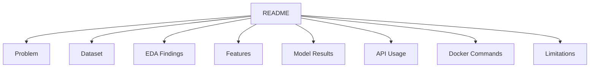

A reviewer should be able to understand the project without opening every source file.

---

## 48. Recommended README Structure

```text
README.md
├── Project Title
├── Overview
├── Business Problem
├── Objectives
├── Dataset
├── Architecture
├── Project Structure
├── Installation
├── EDA Findings
├── Feature Engineering
├── Model Training
├── Evaluation
├── API Usage
├── Docker Usage
├── Testing
├── Assumptions
├── Limitations
├── Future Improvements
└── Author
```

---

## 49. README Example

````markdown
# Customer Churn Prediction

## Overview

This project builds an end-to-end Machine Learning system that predicts whether
a customer is likely to churn.

The project includes:

- Data validation
- Exploratory Data Analysis
- Feature engineering
- Model comparison
- Evaluation
- FastAPI deployment
- Docker packaging
- Automated tests

## Project Pipeline

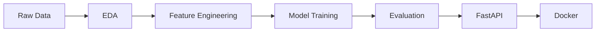

## Business Problem

The company needs to identify customers at high risk of leaving so that the
retention team can prioritize suitable interventions.

## Main Metric

Recall is treated as an important metric because a false negative represents a
customer who is likely to churn but is not identified.

## Installation

```bash
python -m venv .venv
source .venv/bin/activate
pip install -r requirements.txt
```

## Train the Model

```bash
python -m src.train
```

## Run the API

```bash
uvicorn app.main:app --reload
```

## Run with Docker

```bash
docker build -t customer-churn-api .
docker run --rm -p 8000:8000 customer-churn-api
```

## Run Tests

```bash
pytest -v
```

## Limitations

* The dataset may not represent future customers.
* The analysis is observational and does not prove causality.
* The model has not been load-tested under production traffic.
* The decision threshold has not been optimized using actual campaign costs.

````

---

## 50. Optional README Generation Tools

A visual README builder can help create an initial Markdown structure.

Such tools may provide reusable sections for:

- Title
- Description
- Logo
- Features
- Installation
- Usage
- Authors
- FAQ
- Related resources

The sections can then be reordered and exported as Markdown.

However, a generated README is only a starting point.

You must replace placeholder content with:

- Actual project information
- Real metrics
- Correct commands
- Real limitations
- Verified file paths
- Accurate model behavior

A visually attractive README cannot compensate for missing technical evidence.

---

## 51. Insight Report and README

The README and Insight Report serve different purposes.

| README | Insight Report |
|---|---|
| Explains the project repository | Explains the analytical findings |
| Shows installation and usage | Presents evidence and recommendations |
| Includes API and Docker commands | Focuses on business interpretation |
| Targets developers and reviewers | Targets stakeholders and decision-makers |
| Describes reproducibility | Describes implications and caveats |

A complete capstone can include both:

```text
README.md
reports/insight_report.md
````

---

## 52. Testing Strategy

A professional project should include multiple test levels.

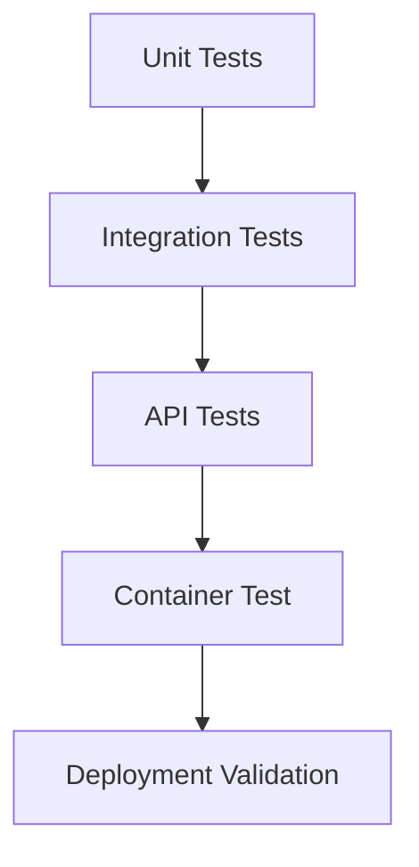

### Unit Tests

Test isolated functions:

* Feature creation
* Data validation
* Category normalization
* Threshold calculation

### Integration Tests

Test combined components:

* Preprocessing plus model
* Saved artifact loading
* Prediction pipeline

### API Tests

Test:

* Valid requests
* Invalid values
* Missing fields
* Response schema
* Health endpoint

### Docker Tests

Test:

* Image builds successfully
* Container starts
* Model artifact is present
* Health endpoint responds

---

## 53. Feature Test Example

```python
import pandas as pd

from src.features import add_features


def test_balance_per_product_feature() -> None:
    input_frame = pd.DataFrame(
        {
            "balance": [1000.0],
            "num_products": [2],
        }
    )

    result = add_features(input_frame)

    assert (
        result.loc[0, "balance_per_product"]
        == 500.0
    )


def test_feature_engineering_handles_zero_products() -> None:
    input_frame = pd.DataFrame(
        {
            "balance": [1000.0],
            "num_products": [0],
        }
    )

    result = add_features(input_frame)

    assert result[
        "balance_per_product"
    ].notna().all()
```

---

## 54. Reproducibility Checklist

A project is reproducible when another person can:

1. Clone the repository.
2. Create the environment.
3. Obtain the data.
4. Run validation.
5. Train the model.
6. Reproduce evaluation results.
7. Start the API.
8. Build the Docker image.
9. Send a prediction request.
10. Run the tests.

Required information includes:

* Python version
* Dependency versions
* Data source
* Random seed
* Training command
* Evaluation command
* Model path
* Environment variables
* Docker commands
* API request examples

---

## 55. Production Readiness Considerations

A successful local API is not automatically production-ready.

Production systems may also require:

* Authentication
* HTTPS
* Request limits
* Structured logging
* Monitoring
* Model versioning
* Data-drift detection
* Prediction-drift detection
* Alerting
* Rollback strategy
* CI/CD
* Secret management
* Load testing
* Cost monitoring
* Audit records

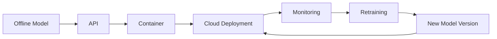

For a capstone, it is acceptable to document these as future improvements when they are outside the current scope.

---

## 56. Model Monitoring

After deployment, monitor four major areas.

### Service Monitoring

* Request count
* Error rate
* Response time
* CPU and memory usage

### Data Monitoring

* Missing fields
* Category changes
* Feature distributions
* Out-of-range values

### Model Monitoring

* Prediction distribution
* Confidence distribution
* Calibration
* Performance when labels become available

### Business Monitoring

* Churn rate
* Retention rate
* Campaign cost
* Revenue retained
* Customer complaints

---

## 57. Common Mistakes

### 57.1 Starting with the Model

The model is trained before the business objective is understood.

**Improvement:** Define the prediction target, user, action, and error costs first.

---

### 57.2 Editing Raw Data Manually

Manual corrections cannot be reproduced.

**Improvement:** Keep raw data unchanged and implement cleaning in code.

---

### 57.3 Skipping Validation

A small demo appears to work, so the data is assumed to be valid.

**Improvement:** Validate schema, ranges, categories, duplicates, and labels.

---

### 57.4 Creating Charts Without Interpretation

EDA becomes a collection of visuals.

**Improvement:** Connect each important chart to a finding, decision, or modeling question.

---

### 57.5 Performing Preprocessing Before Splitting

Scalers or imputers are fitted on the complete dataset.

**Improvement:** Fit transformations only on the training data through a pipeline.

---

### 57.6 Using Accuracy Alone

An imbalanced model may achieve high accuracy while missing most churners.

**Improvement:** Include recall, precision, F1-score, ROC-AUC, PR-AUC, and confusion matrix.

---

### 57.7 Selecting the Most Complex Model

A small metric improvement is prioritized over latency and maintainability.

**Improvement:** Compare performance, speed, size, stability, and interpretability.

---

### 57.8 Training and Inference Use Different Logic

The API manually recreates transformations used in the notebook.

**Improvement:** Save the preprocessing and model as one pipeline.

---

### 57.9 Loading the Model for Every Request

Repeated loading increases latency.

**Improvement:** Load the artifact once when the application starts.

---

### 57.10 Missing API Validation

Invalid values reach the model.

**Improvement:** Use Pydantic request schemas and business validation.

---

### 57.11 Dockerizing Only the Source Code

The container does not include the model artifact.

**Improvement:** Copy the model into the image or configure an external model store.

---

### 57.12 Missing README Commands

The project works only on the author's machine.

**Improvement:** Document the exact installation, training, API, test, and Docker commands.

---

### 57.13 Publishing Placeholder Metrics

Example values remain in the final README.

**Improvement:** Generate metrics from the actual evaluation pipeline.

---

### 57.14 Claiming Causality

A predictive relationship is described as a causal effect.

**Improvement:** Clearly separate correlation, prediction, and intervention impact.

---

## 58. Practical Exercise

Build a customer churn project using the complete pipeline.

### Step 1 — Raw Data

* Obtain a churn dataset.
* Save it under `data/raw/`.
* Do not edit the original file manually.

### Step 2 — Data Validation

Check:

* Required columns
* Data types
* Missing values
* Duplicate records
* Target labels
* Valid ranges

### Step 3 — EDA

Create at least:

* One target-distribution chart
* One numerical-distribution chart
* One churn-by-category chart
* One correlation analysis
* One written insight

### Step 4 — Feature Engineering

Create at least three features, such as:

* Balance per product
* Age group
* Tenure group
* Salary-to-balance ratio
* High-value customer flag

### Step 5 — Model Training

Train at least three models:

* Logistic Regression
* Random Forest
* Gradient Boosting

### Step 6 — Evaluation

Report:

* Precision
* Recall
* F1-score
* ROC-AUC
* Confusion matrix

### Step 7 — Save the Model

Save the complete preprocessing and model pipeline.

### Step 8 — FastAPI

Create:

* `GET /health`
* `POST /predict`

### Step 9 — Docker

Create:

* `Dockerfile`
* `.dockerignore`
* Build command
* Run command

### Step 10 — Documentation

Create a README containing:

* Problem
* Dataset
* Architecture
* Results
* Setup
* API usage
* Docker usage
* Limitations
* Next steps

---

## 59. Minimum Deliverables

```text
customer-churn-project/
├── app/main.py
├── data/raw/customer_churn.csv
├── models/churn_pipeline.joblib
├── notebooks/01_eda.ipynb
├── notebooks/02_model_training.ipynb
├── reports/insight_report.md
├── reports/figures/
├── src/train.py
├── tests/test_api.py
├── Dockerfile
├── requirements.txt
└── README.md
```

The completed project should include:

* One validated dataset
* Three meaningful charts
* Three engineered features
* Three candidate models
* One comparison table
* One selected final model
* One saved model artifact
* One FastAPI prediction endpoint
* One health endpoint
* One Docker image
* Automated tests
* One complete README
* At least one limitation
* At least one assumption
* At least one future improvement

---

## 60. Completion Checklist

### Business Problem

* [ ] I clearly defined the prediction target.
* [ ] I identified who will use the prediction.
* [ ] I explained the cost of false positives and false negatives.
* [ ] I selected a business-relevant primary metric.

### Raw Data

* [ ] The raw dataset is stored separately.
* [ ] The original data has not been manually modified.
* [ ] The data source is documented.
* [ ] Sensitive information is handled appropriately.

### Validation

* [ ] Required columns are checked.
* [ ] Data types are checked.
* [ ] Missing values are measured.
* [ ] Duplicates are checked.
* [ ] Target labels are validated.
* [ ] Numerical ranges are validated.

### EDA

* [ ] The target distribution is analyzed.
* [ ] Numerical distributions are analyzed.
* [ ] Categorical churn rates are compared.
* [ ] Important charts include written interpretations.
* [ ] Leakage risks are considered.
* [ ] At least one actionable insight is documented.

### Feature Engineering

* [ ] New features have clear reasoning.
* [ ] Features are available during inference.
* [ ] Division-by-zero and missing values are handled.
* [ ] Feature logic is tested.
* [ ] Training and inference use the same transformations.

### Modeling

* [ ] A baseline is included.
* [ ] Multiple models are compared.
* [ ] Cross-validation is used.
* [ ] Hyperparameters are documented.
* [ ] Random seeds are defined.
* [ ] The final model-selection reason is explained.

### Evaluation

* [ ] Precision is reported.
* [ ] Recall is reported.
* [ ] F1-score is reported.
* [ ] ROC-AUC or PR-AUC is reported.
* [ ] A confusion matrix is included.
* [ ] The classification threshold is documented.
* [ ] Metrics are calculated on unseen test data.

### Deployment

* [ ] The model artifact is saved.
* [ ] The API validates request data.
* [ ] A health endpoint exists.
* [ ] A prediction endpoint exists.
* [ ] The API returns a stable response schema.
* [ ] API tests are included.

### Docker

* [ ] The Docker image builds successfully.
* [ ] The model artifact is available in the container.
* [ ] The container exposes the correct port.
* [ ] The health endpoint works inside Docker.
* [ ] Unnecessary files are excluded.

### README

* [ ] The project problem is explained.
* [ ] The dataset is described.
* [ ] The architecture is shown.
* [ ] Installation instructions are included.
* [ ] Training instructions are included.
* [ ] API usage is included.
* [ ] Docker commands are included.
* [ ] Actual model results are included.
* [ ] Assumptions and limitations are documented.
* [ ] Future improvements are listed.

---

## 61. Related Outcome

Build one end-to-end portfolio project that connects:

```text
Problem Definition
        ↓
Raw Data
        ↓
Data Validation
        ↓
Exploratory Data Analysis
        ↓
Feature Engineering
        ↓
Preprocessing
        ↓
Model Training
        ↓
Model Evaluation
        ↓
Model Artifact
        ↓
FastAPI
        ↓
Docker
        ↓
README
        ↓
Portfolio Presentation
```

The result should be more than a notebook.

It should be a reproducible project that another person can understand, test, run, and extend.

---

## 62. Related Project

**Capstone: End-to-End AI/Data Science Portfolio Project**

Recommended outputs:

* Raw dataset reference
* Data-validation script
* EDA notebook
* Feature-engineering module
* Training script
* Model-comparison report
* Saved model pipeline
* Evaluation figures
* Insight Report
* FastAPI application
* Automated tests
* Dockerfile
* Dependency file
* Complete README
* Public portfolio repository

---

## 63. Summary

The complete AI/Data Science project pipeline is:

```text
Raw Data
    ↓
EDA
    ↓
Feature Engineering
    ↓
ML Model
    ↓
Evaluation
    ↓
FastAPI Deployment
    ↓
Docker
    ↓
README
```

Each stage solves a different problem:

* **Raw Data** provides the original evidence.
* **Data Validation** protects the pipeline from invalid inputs.
* **EDA** reveals patterns, quality problems, and modeling opportunities.
* **Feature Engineering** converts domain knowledge into useful signals.
* **Model Training** learns patterns from historical data.
* **Evaluation** measures performance on unseen data.
* **Model Serialization** creates a reusable artifact.
* **FastAPI** makes predictions accessible to other applications.
* **Docker** creates a reproducible runtime environment.
* **README** explains how the complete project works.

A strong capstone project does not only answer:

```text
How accurate is the model?
```

It also answers:

```text
What problem does it solve?

Can the analysis be reproduced?

Are the features valid?

Which errors matter most?

Can another application use the model?

Can another person run the project?

What are the limitations?

What should be improved next?
```

The final objective is to demonstrate that you can connect Data Science, Machine Learning, software engineering, deployment, testing, and technical communication into one coherent portfolio project.
