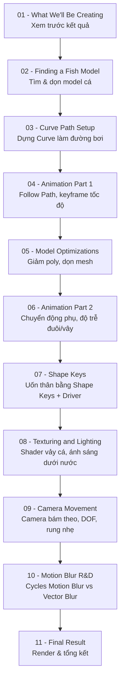

# Learn How to Animate and Render a Fish in Blender! (Beginner Friendly)

Mega-tutorial dạng "unedited/raw" của kênh **Polyfjord**, trình bày trọn vẹn quy trình animate và render một con cá bơi trong Blender — từ việc tìm model, dựng đường bơi bằng Curve, animate, tối ưu model, dùng Shape Keys, texturing & lighting, camera movement, cho đến R&D motion blur và render cuối cùng. Đây là video tiếp nối của video ngắn trước đó *"The secret to easy fish animation in Blender!"*, lần này đi sâu vào từng bước không cắt bớt, kể cả những chỗ tác giả thử-sai.

- **Kênh:** Polyfjord (~799K người đăng ký)
- **Ngày công chiếu:** 28/2/2026
- **Lượt xem tại thời điểm ghi chú:** 23.145
- **Tổng thời lượng:** ~3 giờ 25 phút (đến hết chương "Final result")
- **File dự án:** được tác giả chia sẻ miễn phí (liên kết trong mô tả video gốc trên YouTube)
- **Đối tượng:** người mới bắt đầu ("beginner friendly"), không giả định kiến thức nền trước đó

## Cấu trúc video (theo chương/timestamp)

| # | Chương | Thời điểm bắt đầu | Thời lượng ước tính | Ghi chú |
|---|---|---|---|---|
| [01](01%20-%20What%20We'll%20Be%20Creating.md) | What we'll be creating | 00:00:00 | 1:19 | Preview kết quả cuối |
| [02](02%20-%20Finding%20a%20Fish%20Model.md) | Finding a fish model | 00:01:19 | 14:51 | Tìm & chuẩn bị model |
| [03](03%20-%20Curve%20Path%20Setup.md) | Curve path setup | 00:16:10 | 22:05 | Dựng đường bơi bằng Curve |
| [04](04%20-%20Animation%20Part%201.md) | Animation part 1 | 00:38:15 | 26:51 | Animate theo path lần đầu |
| [05](05%20-%20Model%20Optimizations.md) | Model optimizations | 01:05:06 | 17:29 | Tối ưu topology/hiệu năng |
| [06](06%20-%20Animation%20Part%202.md) | Animation part 2 | 01:22:35 | 20:34 | Tinh chỉnh chuyển động |
| [07](07%20-%20Shape%20Keys.md) | Shape keys | 01:43:09 | 19:04 | Uốn thân/vây bằng Shape Keys |
| [08](08%20-%20Texturing%20and%20Lighting.md) | Texturing & lighting | 02:02:13 | 32:04 | Shader vảy cá & ánh sáng |
| [09](09%20-%20Camera%20Movement.md) | Camera movement | 02:34:17 | 23:58 | Camera bám theo & phối cảnh |
| [10](10%20-%20Motion%20Blur%20R%26D.md) | Motion blur R&D | 02:58:15 | 23:04 | So sánh các kiểu motion blur |
| [11](11%20-%20Final%20Result.md) | Final result | 03:21:19 | — | Render & tổng kết |

## Lộ trình học

## Các kỹ năng chính đạt được sau video

- Tìm, đánh giá và dọn dẹp một model 3D miễn phí để dùng cho animation (scale, origin, normals).
- Dựng đường bơi bằng Bezier Curve và gắn đối tượng vào path bằng Follow Path constraint.
- Animate chuyển động dọc theo path bằng Offset Factor/Evaluation Time và Graph Editor.
- Tối ưu mesh (giảm poly, dọn n-gon, Apply transform) trước khi rig/texture.
- Tạo chuyển động phụ tự nhiên (đuôi/vây trễ nhịp) bằng bone constraints và F-Curve modifiers.
- Dùng Shape Keys kết hợp Driver để thân cá tự uốn theo độ cong của đường bơi.
- Xây dựng shader vảy cá procedural và thiết lập ánh sáng mô phỏng môi trường dưới nước.
- Dựng camera bám theo chủ thể với constraint, thêm rung nhẹ hữu cơ và Depth of Field.
- Hiểu và so sánh các phương pháp tạo motion blur trong Blender (render-time vs compositor).
- Hoàn thiện một cảnh render ngắn có chuyển động, ánh sáng và hậu kỳ hoàn chỉnh.

## Cách sử dụng thư mục ghi chú này

- Mỗi file `NN - Tên chương.md` tương ứng với một chương/timestamp trong video, gồm: mục tiêu, nội dung chính, quy trình thực hành gợi ý, phím tắt/công cụ liên quan, lưu ý & lỗi thường gặp, checklist và tóm tắt.
- Ghi chú được biên soạn dựa trên tiêu đề chương, mô tả video và kiến thức thực tế về quy trình animation/rendering trong Blender — **không phải bản chép lại lời giảng nguyên văn** trong video (video là bản raw/unedited nên tác giả có thể đi đường vòng, thử sai; ghi chú tập trung vào kỹ thuật cốt lõi rút ra được từ mỗi chương). Nên vừa xem video vừa đối chiếu ghi chú và tự thực hành lại trong Blender của riêng bạn.
- Vì đây là một video YouTube đơn (không phải khóa học nhiều bài giảng riêng lẻ), mỗi "bài học" ở đây tương ứng một chương lớn thay vì một lecture ngắn như các khóa học Udemy khác trong repo.

## Checklist tổng thể

- [ ] Xem qua chương 01 để nắm kết quả cuối cùng cần hướng tới.
- [ ] Tìm được một model cá phù hợp (hoặc dùng file dự án miễn phí của tác giả) và dọn sạch mesh.
- [ ] Dựng được một Curve path bơi tự nhiên và gắn Follow Path constraint.
- [ ] Animate được chuyển động cơ bản dọc theo path (Animation part 1).
- [ ] Tối ưu model trước khi rig/texture (Model optimizations).
- [ ] Thêm chuyển động phụ, độ trễ tự nhiên cho đuôi/vây (Animation part 2).
- [ ] Tạo Shape Keys và driver để thân cá tự uốn theo path.
- [ ] Xây dựng shader vảy cá và ánh sáng cảnh dưới nước.
- [ ] Dựng chuyển động camera bám theo cá kèm Depth of Field.
- [ ] So sánh và chọn phương pháp motion blur phù hợp.
- [ ] Render kết quả cuối cùng và rút kinh nghiệm cho project animation tiếp theo.
