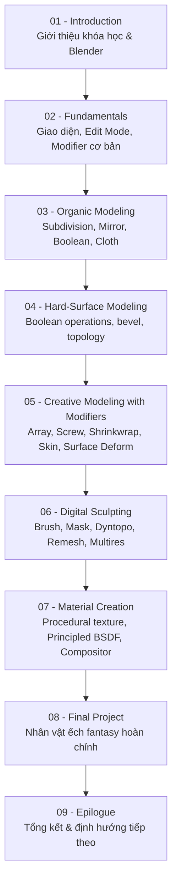

# Blender 3D for Beginners: Complete Modeling & Texturing Guide

Khóa học Blender dành cho người mới bắt đầu, đi từ thao tác cơ bản đến quy trình dựng hình, sculpting, tạo vật liệu và hoàn thành một nhân vật fantasy 3D hoàn chỉnh.

- **Số module:** 9
- **Số bài học:** 77
- **Tổng thời lượng:** 11 giờ 17 phút
- **Cập nhật gần nhất:** tháng 4/2026
- **Giảng viên:** The Parabox 3D / 3D Production House

## Cấu trúc khóa học

| Module | Tên module | Số bài | Thời lượng | Dự án chính |
|---|---|---|---|---|
| [01](01 - Introduction/README.md) | Introduction | 6 | 11 phút | — |
| [02](02 - Fundamentals/README.md) | Fundamentals | 16 | 1 giờ 25 phút | Scene render đầu tiên |
| [03](03 - Organic Modeling/README.md) | Organic Modeling | 5 | 1 giờ 10 phút | Bộ đồ gốm, lợn đất, mũ phù thủy, hamburger |
| [04](04 - Hard-Surface Modeling/README.md) | Hard-Surface Modeling | 7 | 1 giờ 45 phút | Thanh kiếm, tai nghe, mũ bảo hiểm mô-tô |
| [05](05 - Creative Modeling with Modifiers/README.md) | Creative Modeling with Modifiers | 8 | 53 phút | Cầu thang xoắn, dây thừng, ốc vít, cây |
| [06](06 - Digital Sculpting/README.md) | Digital Sculpting | 10 | 2 giờ 02 phút | Quân mã, mèo con, chiếc đe, hộp sọ cách điệu |
| [07](07 - Material Creation/README.md) | Material Creation | 8 | 1 giờ 21 phút | Vật liệu hard-surface & organic chuyên nghiệp |
| [08](08 - Final Project/README.md) | Final Project | 15 | 2 giờ 27 phút | Nhân vật ếch fantasy hoàn chỉnh |
| [09](09 - Epilogue/README.md) | Epilogue | 2 | 3 phút | — |

## Lộ trình học

## Các kỹ năng chính đạt được sau khóa học

- Làm quen giao diện, viewport, navigation và tổ chức scene bằng Collections.
- Dựng hình organic và hard-surface bằng Edit Mode, Boolean và các công cụ chỉnh sửa mesh.
- Sử dụng modifier theo quy trình không phá hủy (Array, Mirror, Subdivision Surface, Shrinkwrap, Skin, Screw, Wireframe, Surface Deform...).
- Sculpting nhân vật và đồ vật với brush, mask, Dynamic Topology, Voxel Remesh và Multiresolution.
- Tạo procedural texture và vật liệu chuyên nghiệp bằng Shader Editor và Principled BSDF.
- Thiết lập ánh sáng ba điểm, camera, render bằng Cycles và hậu kỳ bằng Compositor.
- Hoàn thành một nhân vật fantasy 3D có trang phục, phụ kiện, rig cơ bản và vật liệu hoàn chỉnh.

## Cách sử dụng thư mục ghi chú này

- Mỗi module có một `README.md` liệt kê danh sách bài học kèm thời lượng và checklist học tập.
- Mỗi bài học có một file ghi chú riêng (`NNN - Tên bài học.md`) gồm: mục tiêu bài học, nội dung chính, quy trình thực hành gợi ý, phím tắt liên quan, lưu ý/lỗi thường gặp, checklist và tóm tắt.
- Ghi chú được biên soạn dựa trên tiêu đề bài học, mô tả ngắn và kiến thức thực tế về Blender 4.x — không phải bản chép lại lời giảng trong video. Nên vừa xem video vừa đối chiếu với ghi chú và tự thực hành lại từng kỹ thuật trong Blender của riêng bạn.

## Checklist tổng thể khóa học

- [ ] Hoàn thành Module 01 và nắm được tổng quan khóa học.
- [ ] Hoàn thành Module 02 và scene render đầu tiên.
- [ ] Hoàn thành Module 03 và các bài tập organic modeling (gốm, lợn đất, mũ phù thủy, hamburger).
- [ ] Hoàn thành Module 04 và các bài tập hard-surface (kiếm, tai nghe, mũ bảo hiểm).
- [ ] Hoàn thành Module 05 và các bài tập modifier sáng tạo (cầu thang, dây thừng, ốc vít, cây).
- [ ] Hoàn thành Module 06 và các bài tập sculpting (quân mã, mèo con, đe, hộp sọ).
- [ ] Hoàn thành Module 07 và tạo được vật liệu hard-surface & organic chuyên nghiệp.
- [ ] Hoàn thành Module 08 — dự án nhân vật ếch fantasy hoàn chỉnh.
- [ ] Đọc Module 09 và tổng hợp lại danh sách phím tắt Blender đã học được xuyên suốt khóa học.
