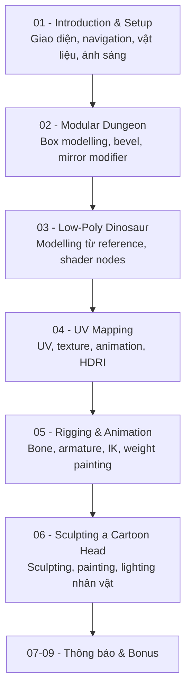

# Complete Blender Creator: 3D Modelling (Compatible with 4.3)

Khóa học Blender theo hướng thực hành dự án (project-based), dành cho người mới bắt đầu. Module đầu tiên đã được quay lại/cập nhật cho Blender 4.4.2; phần còn lại của khóa học tương thích với Blender 4.3.

- **Số module:** 9
- **Số bài học:** 104
- **Tổng thời lượng:** 13 giờ 49 phút
- **Cập nhật gần nhất:** tháng 2/2026

## Cấu trúc khóa học

| Module | Tên module | Số bài | Thời lượng | Dự án chính |
|---|---|---|---|---|
| [01](01 - Introduction & Setup/README.md) | Introduction & Setup | 22 | 3 giờ 03 phút | Cảnh ngọn hải đăng (lighthouse) low-poly |
| [02](02 - Modular Dungeon/README.md) | Modular Dungeon | 18 | 2 giờ 32 phút | Hầm ngục modular (barrel, crate, pillar, wall, door, torch) |
| [03](03 - Low-Poly Dinosaur/README.md) | Low-Poly Dinosaur | 13 | 1 giờ 41 phút | Nhân vật khủng long low-poly + cảnh quan |
| [04](04 - UV Mapping/README.md) | UV Mapping | 18 | 2 giờ 21 phút | Máy bay có texture UV + animation |
| [05](05 - Rigging & Animation/README.md) | Rigging & Animation | 16 | 2 giờ 19 phút | Nhân vật Blob Man với rig và walk cycle |
| [06](06 - Sculpting a Cartoon Head/README.md) | Sculpting a Cartoon Head | 14 | 1 giờ 51 phút | Đầu nhân vật hoạt hình được sculpt và tô màu |
| [07](07 - Important Messages and Updates/README.md) | Important Messages and Updates | 1 | ~1 phút | — |
| [08](08 - Updates and Important Messages/README.md) | Updates and Important Messages | 1 | ~1 phút | — |
| [09](09 - Bonus - One Last Thing/README.md) | Bonus: One Last Thing… | 1 | ~1 phút | — |

## Lộ trình học

## Các kỹ năng chính đạt được sau khóa học

- Sử dụng giao diện và công cụ cơ bản của Blender.
- Dựng hình bằng primitive, Edit Mode và box modelling.
- Sử dụng Bevel, Mirror, Decimate và Subdivision Surface Modifier.
- Tạo vật liệu, màu sắc, phản chiếu và Shader Nodes.
- Thiết lập ánh sáng, HDRI, Eevee và Cycles.
- UV Mapping, seams, UV islands, unwrap và texture.
- Tạo keyframe animation và làm việc với Graph Editor.
- Rigging bằng bone, armature, IK và weight painting.
- Tạo walk cycle cho nhân vật.
- Sculpting và painting nhân vật.
- Compositing, glow và render ảnh hoặc animation.

## Cách sử dụng thư mục ghi chú này

- Mỗi module có một `README.md` liệt kê danh sách bài học kèm thời lượng và checklist học tập.
- Mỗi bài học có một file ghi chú riêng (`NNN - Tên bài học.md`) gồm: mục tiêu bài học, nội dung chính, quy trình thực hành gợi ý, phím tắt liên quan, lưu ý/lỗi thường gặp, checklist và tóm tắt.
- Ghi chú được biên soạn dựa trên tiêu đề bài học, mô tả ngắn và kiến thức thực tế về Blender 4.x — không phải bản chép lại lời giảng trong video. Nên vừa xem video vừa đối chiếu với ghi chú và tự thực hành lại từng kỹ thuật trong Blender của riêng bạn.

## Checklist tổng thể khóa học

- [ ] Hoàn thành Module 01 và dự án lighthouse.
- [ ] Hoàn thành Module 02 và dự án modular dungeon.
- [ ] Hoàn thành Module 03 và dự án dinosaur scene.
- [ ] Hoàn thành Module 04 và dự án plane animation.
- [ ] Hoàn thành Module 05 và dự án rigging/walk cycle.
- [ ] Hoàn thành Module 06 và dự án sculpting đầu nhân vật.
- [ ] Đọc các bài thông báo (Module 07, 08) và bài bonus (Module 09).
- [ ] Tổng hợp lại danh sách phím tắt Blender đã học được xuyên suốt khóa học.
