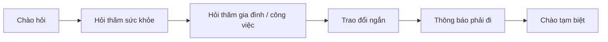

# LESSON 01 — BẮT ĐẦU MỘT CUỘC TRÒ CHUYỆN

> **Module 01 — Connect / Kết nối và giao tiếp xã hội**  
> **Chủ đề:** Greetings — Chào hỏi và mở đầu giao tiếp  
> **Trình độ gợi ý:** A1–A2  
> **Thời lượng:** 8–12 phút học bài + 5–10 phút luyện nói

---

## 1. Tình huống thực tế

Bạn gặp một người quen, bạn học hoặc người mới gặp. Bạn cần biết cách:

- chào hỏi phù hợp với thời điểm trong ngày;
- hỏi thăm sức khỏe;
- hỏi thăm người thân;
- nói rằng đã lâu không gặp;
- kết thúc cuộc trò chuyện lịch sự.

*Nguồn ảnh: [Wikimedia Commons — Two young people demonstrating a lively conversation](https://commons.wikimedia.org/wiki/File:Two_young_people_demonstrating_a_lively_conversation.jpg).*

---

## 2. Mục tiêu bài học

Sau bài học, người học có thể:

1. Sử dụng đúng các lời chào cơ bản như **Hello**, **Good morning**, **Good evening**, **Good night**.
2. Hỏi và trả lời tự nhiên với **How are you?**.
3. Dùng các cách đáp như **Fine, thanks**, **Very well**, **Not too bad**, **Not so well**.
4. Hỏi thăm gia đình bằng **How are your parents?** và **How is your sister?**.
5. Nói **I haven't seen you in ages / for a long time** khi gặp lại người quen lâu ngày.
6. Kết thúc hội thoại bằng **Bye** và **See you later**.
7. Duy trì một hội thoại ngắn từ 6–8 lượt nói.

---

## 3. Sơ đồ giao tiếp

**Mẫu đơn giản:**

`Hello!` → `How are you?` → `How about you?` → `Where are you going?` → `See you later.`

---

# 4. Từ vựng trọng tâm — Core Vocabulary

## 4.1. **hello** /həˈləʊ/

**Nghĩa:** xin chào, chào bạn  
**Từ loại:** thán từ

*Nguồn ảnh: [Wikimedia Commons — Waving hello](https://commons.wikimedia.org/wiki/File:Waving_hello_%289468829996%29.jpg).*

**Ví dụ:**

- **Hello! My name's Hugo.** — Xin chào! Tôi tên là Hugo.
- **Hello, nice to meet you.** — Xin chào, rất vui được gặp bạn.

> **Ghi nhớ:** **Hi** thân mật hơn **Hello**.

---

## 4.2. **morning** /ˈmɔː.nɪŋ/

**Nghĩa:** buổi sáng  
**Cụm quan trọng:** **Good morning!** — Chào buổi sáng!

*Nguồn ảnh: [Wikimedia Commons — Sunrise in the early morning](https://commons.wikimedia.org/wiki/File:Sunrise_in_the_early_morning.png).*

**Ví dụ:**

- **Good morning, Mr Brown.** — Chào buổi sáng, thầy Brown.
- **Good morning! How are you today?** — Chào buổi sáng! Hôm nay bạn thế nào?

---

## 4.3. **evening** /ˈiːv.nɪŋ/

**Nghĩa:** buổi tối, khoảng thời gian chiều tối  
**Cụm quan trọng:** **Good evening!** — Chào buổi tối!

*Nguồn ảnh: [Wikimedia Commons — Sunset in the evening](https://commons.wikimedia.org/wiki/File:Sunset_in_the_evening.jpg).*

**Ví dụ:**

- **Good evening, everyone.** — Chào buổi tối mọi người.

> **Phân biệt:** **Good evening** dùng khi *gặp* ai đó vào buổi tối; **Good night** thường dùng khi *tạm biệt* hoặc trước khi đi ngủ.

---

## 4.4. **in ages** /ɪn ˈeɪ.dʒɪz/

**Nghĩa:** đã rất lâu rồi  
**Cách dùng:** thường xuất hiện trong câu phủ định với thì hiện tại hoàn thành.

*Nguồn ảnh: [Wikimedia Commons — Calendar clock](https://commons.wikimedia.org/wiki/File:Calendar_clock.jpg).*

**Ví dụ:**

- **I haven't seen you in ages!** — Lâu lắm rồi tôi không gặp bạn!

---

## 4.5. **well** /wel/

**Nghĩa trong bài:** khỏe, ổn  
**Cụm thường gặp:** **very well** — rất khỏe / rất ổn

*Nguồn ảnh: [Wikimedia Commons — Smile Portrait One](https://commons.wikimedia.org/wiki/File:Smile_Portrait_One.jpg).*

**Ví dụ:**

- **I'm very well, thank you.** — Tôi rất khỏe, cảm ơn bạn.
- **I'm not so well today.** — Hôm nay tôi không được khỏe lắm.

---

## 4.6. **bye** /baɪ/

**Nghĩa:** tạm biệt  
**Sắc thái:** thông dụng, thân mật

*Nguồn ảnh: [Wikimedia Commons — Waving goodbye](https://commons.wikimedia.org/wiki/File:Waving_goodbye_VPL_1384_%2833335605241%29.jpg).*

**Ví dụ:**

- **Bye! See you later.** — Tạm biệt! Hẹn gặp lại sau.

---

## 4.7. **library** /ˈlaɪ.brər.i/

**Nghĩa:** thư viện  
**Từ loại:** danh từ

*Nguồn ảnh: [Wikimedia Commons — Bookshelves at the library](https://commons.wikimedia.org/wiki/File:Bookshelves_at_the_library.jpg).*

**Ví dụ:**

- **I'm going to the library.** — Tôi đang đi đến thư viện.

> **Chú ý:** nói **go to the library**, không nói `go library`.

---

## 4.8. **a long time** /ə lɒŋ taɪm/

**Nghĩa:** một khoảng thời gian dài, lâu  
**Cụm quan trọng:** **for a long time** — trong một thời gian dài

*Nguồn ảnh: [Wikimedia Commons — Clock calendar](https://commons.wikimedia.org/wiki/File:Clock_calendar.jpg).*

**Ví dụ:**

- **I haven't seen you for a long time.** — Tôi đã lâu không gặp bạn.

---

## 4.9. **thanks** /θæŋks/

**Nghĩa:** cảm ơn  
**Sắc thái:** tự nhiên, thân mật hơn **thank you**

*Nguồn ảnh: [Wikimedia Commons — Waving hello and thanks](https://commons.wikimedia.org/wiki/File:Waving_hello_and_thanks_%2853656631108%29.jpg).*

**Ví dụ:**

- **Fine, thanks.** — Tôi khỏe, cảm ơn.
- **Thanks for your help.** — Cảm ơn vì sự giúp đỡ của bạn.

---

## 4.10. **today** /təˈdeɪ/

**Nghĩa:** hôm nay  
**Từ loại:** trạng từ / danh từ

*Nguồn ảnh: [Wikimedia Commons — Kalenderseite](https://commons.wikimedia.org/wiki/File:Kalenderseite.jpg).*

**Ví dụ:**

- **How are you today?** — Hôm nay bạn thế nào?

---

## 4.11. **later** /ˈleɪ.tər/

**Nghĩa:** sau, lát nữa  
**Cụm quan trọng:** **See you later.** — Hẹn gặp lại sau.

*Nguồn ảnh: [Wikimedia Commons — Clock Face](https://commons.wikimedia.org/wiki/File:Clock_Face.png).*

**Ví dụ:**

- **I'll see you later.** — Tôi sẽ gặp bạn sau.

---

## 4.12. **parents** /ˈpeə.rənts/

**Nghĩa:** bố mẹ, cha mẹ  
**Dạng số ít:** **parent** — cha hoặc mẹ

*Nguồn ảnh: [Wikimedia Commons — Parents, enfants, famille](https://commons.wikimedia.org/wiki/File:Parents%2C_enfants%2C_famille.png).*

**Ví dụ:**

- **How are your parents?** — Bố mẹ bạn khỏe không?
- **They're fine.** — Họ khỏe.

---

## 4.13. **sister** /ˈsɪs.tər/

**Nghĩa:** chị gái hoặc em gái  
**Từ loại:** danh từ

*Nguồn ảnh: [Wikimedia Commons — Smiling sisters](https://commons.wikimedia.org/wiki/File:Smiling_sisters.jpg).*

**Ví dụ:**

- **How is your sister?** — Chị/em gái của bạn thế nào?
- **She's fine.** — Cô ấy khỏe.

---

## 4.14. **class** /klɑːs/

**Nghĩa trong bài:** lớp học, buổi học

*Nguồn ảnh: [Wikimedia Commons — Students in classroom](https://commons.wikimedia.org/wiki/File:Students_in_classroom.jpg).*

**Ví dụ:**

- **I must go to class now.** — Bây giờ tôi phải đi học rồi.

---

# 5. Bảng tổng hợp từ vựng

| Từ / cụm từ | IPA | Nghĩa tiếng Việt | Ví dụ ngắn |
|---|---|---|---|
| **hello** | /həˈləʊ/ | xin chào | Hello, I'm Anna. |
| **morning** | /ˈmɔː.nɪŋ/ | buổi sáng | Good morning! |
| **evening** | /ˈiːv.nɪŋ/ | buổi tối | Good evening! |
| **in ages** | /ɪn ˈeɪ.dʒɪz/ | đã rất lâu rồi | I haven't seen you in ages. |
| **well** | /wel/ | khỏe, ổn | I'm very well. |
| **bye** | /baɪ/ | tạm biệt | Bye! See you later. |
| **library** | /ˈlaɪ.brər.i/ | thư viện | I'm going to the library. |
| **a long time** | /ə lɒŋ taɪm/ | thời gian dài | for a long time |
| **thanks** | /θæŋks/ | cảm ơn | Fine, thanks. |
| **today** | /təˈdeɪ/ | hôm nay | How are you today? |
| **later** | /ˈleɪ.tər/ | sau, lát nữa | See you later. |
| **parents** | /ˈpeə.rənts/ | bố mẹ | How are your parents? |
| **sister** | /ˈsɪs.tər/ | chị/em gái | How is your sister? |
| **class** | /klɑːs/ | lớp học, buổi học | I must go to class. |

---

# 6. Mẫu câu giao tiếp — Useful Structures

## 6.1. Giới thiệu bản thân

### **Hello, my name's + tên.**

- **Hello, my name's Hugo.**  
  Xin chào, tôi tên là Hugo.

`my name's` = `my name is`

---

## 6.2. Hỏi thăm sức khỏe

### **How are you?**

**Một số câu trả lời tự nhiên:**

| Câu trả lời | Nghĩa |
|---|---|
| **I'm fine, thanks.** | Tôi khỏe, cảm ơn. |
| **Very well, thank you.** | Tôi rất khỏe, cảm ơn. |
| **Pretty good, thanks.** | Khá ổn, cảm ơn. |
| **Not too bad.** | Không tệ lắm / cũng ổn. |
| **Not so well.** | Không được khỏe lắm. |

### Hỏi lại người đối diện

- **How about you?** — Còn bạn thì sao?
- **And you?** — Còn bạn?

---

## 6.3. Hỏi thăm người thân

### **How are your + danh từ số nhiều?**

- **How are your parents?** — Bố mẹ bạn thế nào?
- **They're fine.** — Họ khỏe.

### **How is your + danh từ số ít?**

- **How is your sister?** — Chị/em gái bạn thế nào?
- **She's fine.** — Cô ấy khỏe.

---

## 6.4. Gặp lại sau một thời gian dài

### **I haven't seen you in ages.**

hoặc

### **I haven't seen you for a long time.**

**Nghĩa:** Lâu lắm rồi tôi không gặp bạn.

**Cấu trúc:**

`I + have not + seen + you + thời gian`

Đây là **Present Perfect — thì hiện tại hoàn thành**, dùng để nối một khoảng thời gian trong quá khứ với hiện tại.

---

## 6.5. Hỏi nơi ai đó đang đi

### **Where are you going?**

- **Where are you going?** — Bạn đang đi đâu?
- **To the library.** — Đến thư viện.

Câu đầy đủ là:

- **I'm going to the library.**

---

## 6.6. Kết thúc cuộc trò chuyện

- **I must go to class now.** — Bây giờ tôi phải đi học rồi.
- **Bye!** — Tạm biệt!
- **See you later.** — Hẹn gặp lại sau.
- **Good night.** — Chúc ngủ ngon / tạm biệt vào cuối buổi tối.

---

# 7. Cách dùng lời chào theo thời điểm

| Tình huống | Câu nên dùng | Ghi chú |
|---|---|---|
| Gặp ai đó nói chung | **Hello / Hi** | Dùng hầu hết mọi thời điểm |
| Gặp vào buổi sáng | **Good morning** | Lịch sự, phổ biến |
| Gặp vào buổi chiều tối | **Good evening** | Dùng khi bắt đầu gặp nhau |
| Rời đi vào buổi tối / đi ngủ | **Good night** | Không thường dùng để mở đầu cuộc gặp |

---

# 8. Phát âm trọng tâm

## 8.1. Âm /θ/ trong **thanks**

Đặt đầu lưỡi nhẹ giữa hai hàm răng và đẩy hơi ra:

- **thanks** /θæŋks/

Không nên đọc thành `tanks`.

## 8.2. Trọng âm

- hel-**LO** → /həˈləʊ/
- to-**DAY** → /təˈdeɪ/
- **LI**-brar-y → /ˈlaɪ.brər.i/
- **EVE**-ning → /ˈiːv.nɪŋ/

---

# 9. Hội thoại thực tế — Real-Life Conversation

*Nguồn ảnh: [Wikimedia Commons — Conversation - RWiC](https://commons.wikimedia.org/wiki/File:Conversation_-_RWiC.png).*

## Hội thoại 1 — Gặp lại bạn cũ

**Nam:** Hi, Linh! I haven't seen you in ages.  
**Linh:** Hi, Nam! It's really nice to see you.  
**Nam:** How are you today?  
**Linh:** Pretty good, thanks. How about you?  
**Nam:** Very well, thank you. How are your parents?  
**Linh:** They're fine. Thanks for asking.  
**Nam:** Great! I must go to class now.  
**Linh:** Me too. Bye! See you later.  
**Nam:** See you!

### Dịch nghĩa

**Nam:** Chào Linh! Lâu lắm rồi mình không gặp bạn.  
**Linh:** Chào Nam! Thật vui khi gặp lại bạn.  
**Nam:** Hôm nay bạn thế nào?  
**Linh:** Khá ổn, cảm ơn. Còn bạn?  
**Nam:** Mình rất khỏe, cảm ơn. Bố mẹ bạn thế nào?  
**Linh:** Bố mẹ mình khỏe. Cảm ơn bạn đã hỏi thăm.  
**Nam:** Tuyệt! Bây giờ mình phải đi học rồi.  
**Linh:** Mình cũng vậy. Tạm biệt! Hẹn gặp lại sau.  
**Nam:** Hẹn gặp lại!

---

## Hội thoại 2 — Trên đường đến thư viện

**Mai:** Hey, Alex! How are you?  
**Alex:** Not too bad, thanks. And you?  
**Mai:** Not so well today.  
**Alex:** Oh, I'm sorry to hear that. Where are you going?  
**Mai:** I'm going to the library.  
**Alex:** Okay. Take care. I'll see you later.  
**Mai:** Thanks. Bye!  
**Alex:** Bye!

---

# 10. Natural Expressions — Cách nói tự nhiên

| Cụm từ | Nghĩa | Khi dùng |
|---|---|---|
| **Nice to see you.** | Rất vui được gặp bạn. | Gặp người quen |
| **Glad to meet you.** | Rất vui được gặp bạn. | Lần đầu gặp / cách nói lịch sự |
| **How about you?** | Còn bạn thì sao? | Hỏi lại |
| **Pretty good.** | Khá ổn. | Trả lời thân mật |
| **Not too bad.** | Không tệ lắm. | Tình trạng khá ổn |
| **Not so well.** | Không được khỏe lắm. | Sức khỏe/tâm trạng không tốt |
| **See you later.** | Hẹn gặp lại sau. | Kết thúc cuộc trò chuyện |
| **Me too.** | Tôi cũng vậy. | Đồng tình / cùng tình huống |

---

# 11. Lỗi thường gặp — Common Mistakes

## Lỗi 1: Dùng **Good night** để chào khi vừa gặp

❌ **Good night! How are you?**  
✅ **Good evening! How are you?**

**Good night** thường dùng khi chia tay vào buổi tối hoặc trước khi đi ngủ.

---

## Lỗi 2: Quên động từ **be**

❌ **How your parents?**  
✅ **How are your parents?**

❌ **How your sister?**  
✅ **How is your sister?**

---

## Lỗi 3: Nói thiếu giới từ với **library**

❌ **I'm going library.**  
✅ **I'm going to the library.**

---

## Lỗi 4: Dịch từng chữ

❌ **Long time no meet.**  
✅ **I haven't seen you for a long time.**  
✅ **I haven't seen you in ages.**

> **Long time no see!** cũng tồn tại trong tiếng Anh giao tiếp, nhưng nên học cùng các mẫu câu hoàn chỉnh ở trên để hiểu cấu trúc chuẩn.

---

# 12. Luyện tập có hướng dẫn

## Bài 1 — Nối từ với nghĩa

1. library  
2. parents  
3. later  
4. evening  
5. thanks

A. bố mẹ  
B. cảm ơn  
C. thư viện  
D. lát nữa  
E. buổi tối

Đáp án

1–C, 2–A, 3–D, 4–E, 5–B

---

## Bài 2 — Điền từ vào chỗ trống

Dùng: `morning` · `parents` · `library` · `later` · `well`

1. Good ________, Ms Taylor.  
2. How are your ________?  
3. I'm going to the ________.  
4. See you ________.  
5. I'm very ________, thank you.

Đáp án

1. morning  
2. parents  
3. library  
4. later  
5. well

---

## Bài 3 — Chọn câu phù hợp

### 1. Bạn gặp giáo viên lúc 8 giờ sáng.

- A. Good night.
- B. Good morning.
- C. Bye.

**Đáp án:** B

### 2. Bạn sắp rời khỏi cuộc trò chuyện.

- A. See you later.
- B. Good morning.
- C. How are you?

**Đáp án:** A

### 3. Bạn muốn hỏi thăm bố mẹ của một người bạn.

- A. Where are your parents?
- B. How are your parents?
- C. What are your parents?

**Đáp án:** B

---

# 13. Speaking Challenge — Thử thách nói

## Nhiệm vụ 1

Đọc hội thoại mẫu thành tiếng 2 lần.

- Lần 1: đọc chậm, rõ từng câu.
- Lần 2: đọc theo tốc độ hội thoại tự nhiên.

## Nhiệm vụ 2

Thay thông tin trong hội thoại:

- tên nhân vật;
- nơi đang đi: **library / class / café / office**;
- tình trạng: **fine / very well / pretty good / not so well**.

## Nhiệm vụ 3

Tạo một hội thoại **8 lượt nói**, sử dụng ít nhất:

- 5 từ vựng mới;
- 3 mẫu câu của bài;
- 1 câu hỏi thăm người thân;
- 1 câu chào tạm biệt.

## Nhiệm vụ 4

Ghi âm từ **45–60 giây**, sau đó tự kiểm tra:

- [ ] Tôi phát âm rõ **thanks**.
- [ ] Tôi dùng đúng **Good morning / Good evening / Good night**.
- [ ] Tôi hỏi lại bằng **How about you?** hoặc **And you?**.
- [ ] Tôi kết thúc hội thoại tự nhiên.

---

# 14. Practice Mission — Nhiệm vụ thực tế

Trong hôm nay, hãy bắt đầu một cuộc hội thoại bằng tiếng Anh theo công thức:

> **Greeting → Ask → Respond → Continue → Close**

Ví dụ:

> **Hello! → How are you? → Pretty good, thanks. → Where are you going? → See you later.**

Viết lại đoạn hội thoại của chính bạn trong **6–8 lượt**.

---

# 15. Tự đánh giá cuối bài

Đánh dấu khi bạn có thể thực hiện mà không nhìn bài:

- [ ] Tôi có thể chào một người vào buổi sáng.
- [ ] Tôi có thể chào một người vào buổi tối.
- [ ] Tôi có thể hỏi **How are you?** và trả lời bằng ít nhất 3 cách.
- [ ] Tôi có thể hỏi thăm bố mẹ hoặc anh/chị/em của ai đó.
- [ ] Tôi có thể nói rằng đã lâu không gặp.
- [ ] Tôi có thể hỏi ai đó đang đi đâu.
- [ ] Tôi có thể kết thúc hội thoại bằng **See you later**.
- [ ] Tôi có thể nói liên tục ít nhất 45 giây về tình huống này.

---

# 16. Câu hỏi mở cuối bài

**Imagine you meet an old friend this morning. What would you say first, and how would you continue the conversation?**

*Hãy tưởng tượng sáng nay bạn gặp lại một người bạn cũ. Bạn sẽ nói câu gì đầu tiên và tiếp tục cuộc trò chuyện như thế nào?*

---

# 17. Ghi chú dành cho giảng viên

- **Module:** 01 — Connect / Kết nối và giao tiếp xã hội
- **Chủ điểm:** Greetings
- **Thời lượng video:** 8–12 phút
- **Luyện nói:** 5–10 phút
- **Trọng tâm phát âm:** /θ/ trong **thanks**, trọng âm của **hello**, **today**, **library**
- **Trọng tâm cấu trúc:**
  - How are you?
  - How about you?
  - How are your parents?
  - How is your sister?
  - I haven't seen you in ages.
  - Where are you going?
  - See you later.
- **Hoạt động gợi ý:** đóng vai cặp đôi, thay đổi bối cảnh sau mỗi lượt.

---

## Nguồn ảnh minh họa

Các ảnh trong bài được liên kết trực tiếp từ **Wikimedia Commons**. Giấy phép cụ thể của từng ảnh nằm trên trang nguồn được đặt ngay dưới ảnh. Khi xuất bản công khai hoặc dùng cho tài liệu thương mại, hãy kiểm tra và giữ phần ghi công theo đúng giấy phép của từng tệp.
