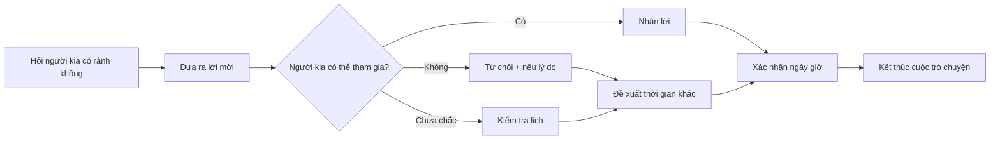
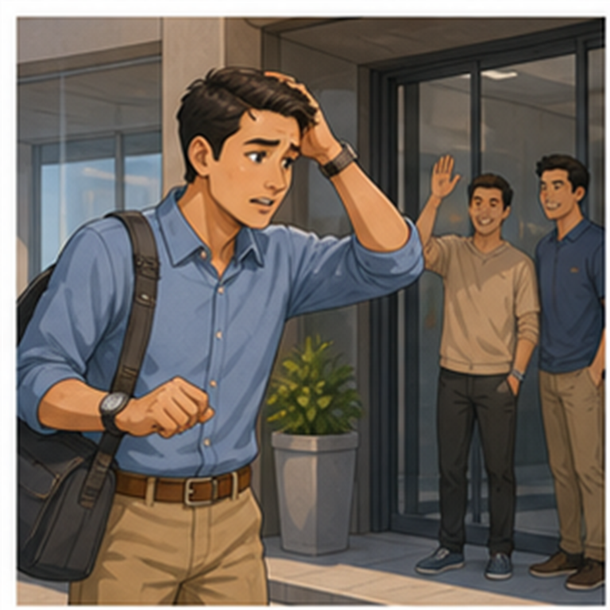

# LESSON 02 — RỦ AI ĐÓ CÙNG THAM GIA

> **Module 01 — Connect / Kết nối và giao tiếp xã hội**
> **Chủ đề:** Invitation — Đưa ra lời mời, nhận lời và từ chối lịch sự
> **Trình độ gợi ý:** A1–A2
> **Thời lượng:** 8–12 phút học bài + 5–10 phút luyện nói

---

## 1. Tình huống thực tế

Bạn muốn rủ một người bạn, đồng nghiệp hoặc người quen cùng tham gia một hoạt động như:

* đi ăn trưa hoặc ăn tối;
* xem một trận bóng đá;
* đi chơi vào buổi chiều;
* gặp nhau vào một thời điểm cụ thể;
* sắp xếp lại lịch khi người kia bận;
* từ chối lời mời một cách lịch sự;
* xác nhận giờ và ngày của cuộc hẹn;
* thông báo rằng mình sẽ đến muộn.


---

## 2. Mục tiêu bài học

Sau bài học, người học có thể:

1. Hỏi xem ai đó có rảnh bằng **Are you free ...?**
2. Đưa ra lời mời bằng **How about + V-ing ...?**
3. Mời ai đó tham gia bằng **Would you like to ...?**
4. Nhận lời bằng **Sure, that sounds great.**
5. Từ chối lịch sự bằng **I'm sorry ...** hoặc **I'm afraid ...**
6. Giải thích lý do không thể tham gia.
7. Hỏi thời gian phù hợp bằng **What time would be good for you?**
8. Xác nhận ngày giờ của cuộc hẹn.
9. Thông báo rằng mình sẽ đến muộn.
10. Duy trì một đoạn hội thoại mời – nhận lời – sắp xếp lịch từ 6–10 lượt nói.

---

## 3. Sơ đồ giao tiếp



**Mẫu đơn giản:**

`Are you free this afternoon?` → `Would you like to come?` → `Sure, that sounds great.` → `What time would be good for you?` → `See you then.`

---

# 4. Từ vựng trọng tâm — Core Vocabulary

## 4.1. **free** /friː/

**Nghĩa trong bài:** rảnh, không bận
**Từ loại:** tính từ


**Ví dụ:**

* **Are you free on Sunday evening?** — Tối Chủ nhật bạn có rảnh không?
* **I shall be free this evening.** — Tối nay tôi sẽ rảnh.

> **Ghi nhớ:** Trong giao tiếp hiện đại, **I'll be free this evening** tự nhiên hơn **I shall be free this evening**.

---

## 4.2. **finish** /ˈfɪn.ɪʃ/

**Nghĩa:** hoàn thành, kết thúc
**Từ loại:** động từ


**Ví dụ:**

* **Didn't you finish your exam?** — Bạn chưa thi xong sao?
* **I finished my work at five.** — Tôi hoàn thành công việc lúc 5 giờ.

---

## 4.3. **football match** /ˈfʊt.bɔːl mætʃ/

**Nghĩa:** trận bóng đá


**Ví dụ:**

* **I have two tickets for a football match.** — Tôi có hai vé xem một trận bóng đá.
* **Would you like to watch the football match?** — Bạn có muốn xem trận bóng đá không?

---

## 4.4. **promise** /ˈprɒm.ɪs/

**Nghĩa:** lời hứa; hứa
**Từ loại:** danh từ / động từ


**Ví dụ:**

* **I promise I'll be there.** — Tôi hứa tôi sẽ đến.
* **Don't break your promise.** — Đừng thất hứa.

---

## 4.5. **convenient** /kənˈviː.ni.ənt/

**Nghĩa:** thuận tiện, phù hợp


**Ví dụ:**

* **Is Tuesday convenient for you?** — Thứ Ba có thuận tiện cho bạn không?
* **What time is convenient for you?** — Thời gian nào thuận tiện cho bạn?

---

## 4.6. **thoughtful** /ˈθɔːt.fəl/

**Nghĩa:** chu đáo, biết quan tâm


**Ví dụ:**

* **It's very thoughtful of you to invite me.** — Bạn thật chu đáo khi mời tôi.
* **That was very thoughtful of you.** — Bạn thật chu đáo.

---

## 4.7. **team** /tiːm/

**Nghĩa:** đội, nhóm


**Ví dụ:**

* **Which team do you support?** — Bạn ủng hộ đội nào?
* **Our team is playing tonight.** — Đội của chúng tôi thi đấu tối nay.

---

## 4.8. **exciting** /ɪkˈsaɪ.tɪŋ/

**Nghĩa:** thú vị, hào hứng, gây phấn khích


**Ví dụ:**

* **The match was exciting.** — Trận đấu rất hấp dẫn.
* **That sounds exciting!** — Nghe thú vị đấy!

---

## 4.9. **What a pity!** /wɒt ə ˈpɪt.i/

**Nghĩa:** Thật tiếc!


**Ví dụ:**

* **You can't come? What a pity!** — Bạn không thể đến à? Thật tiếc!
* **What a pity! Maybe next time.** — Thật tiếc! Có lẽ lần sau vậy.

---

## 4.10. **business trip** /ˈbɪz.nəs trɪp/

**Nghĩa:** chuyến công tác


**Ví dụ:**

* **I'll be on a business trip for the next two days.** — Tôi sẽ đi công tác trong hai ngày tới.
* **She's away on a business trip.** — Cô ấy đang đi công tác.

---

## 4.11. **meeting** /ˈmiː.tɪŋ/

**Nghĩa:** cuộc họp, buổi gặp


**Ví dụ:**

* **I have an important meeting this afternoon.** — Chiều nay tôi có một cuộc họp quan trọng.
* **The meeting starts at two.** — Cuộc họp bắt đầu lúc 2 giờ.

---

## 4.12. **dinner** /ˈdɪn.ər/

**Nghĩa:** bữa tối


**Ví dụ:**

* **How about having dinner with me?** — Đi ăn tối cùng tôi nhé?
* **Would you like to have dinner tonight?** — Tối nay bạn có muốn ăn tối cùng tôi không?

---

## 4.13. **hang up** /hæŋ ʌp/

**Nghĩa:** cúp máy, kết thúc cuộc gọi


**Ví dụ:**

* **Don't hang up yet.** — Đừng cúp máy vội.
* **She hung up after saying goodbye.** — Cô ấy cúp máy sau khi chào tạm biệt.

---

## 4.14. **appointment** /əˈpɔɪnt.mənt/

**Nghĩa:** cuộc hẹn


**Ví dụ:**

* **I have an appointment at three.** — Tôi có một cuộc hẹn lúc 3 giờ.
* **I can't keep the appointment because I'm sick.** — Tôi không thể đến cuộc hẹn vì tôi bị ốm.

> **keep an appointment** = đến hoặc thực hiện cuộc hẹn đã sắp xếp.

---

## 4.15. **engaged** /ɪnˈɡeɪdʒd/

**Nghĩa trong bài:** bận, đã có lịch


**Ví dụ:**

* **I'm engaged at that time.** — Tôi bận vào thời gian đó.

> Trong giao tiếp hiện đại, **I'm busy at that time** hoặc **I already have plans** thường tự nhiên hơn.

> **Chú ý:** **engaged** còn có nghĩa là **đã đính hôn**, vì vậy cần hiểu theo ngữ cảnh.

---

## 4.16. **sick** /sɪk/

**Nghĩa:** bị ốm


**Ví dụ:**

* **I can't come because I'm sick.** — Tôi không thể đến vì tôi bị ốm.
* **She's been sick all day.** — Cô ấy đã bị ốm cả ngày.

---

## 4.17. **late** /leɪt/

**Nghĩa:** muộn, trễ



**Ví dụ:**

* **I'll be about 15 minutes late.** — Tôi sẽ đến muộn khoảng 15 phút.
* **Sorry I'm late.** — Xin lỗi tôi đến muộn.

---

# 5. Bảng tổng hợp từ vựng

| Từ / cụm từ        | IPA              | Nghĩa tiếng Việt | Ví dụ ngắn                   |
| ------------------ | ---------------- | ---------------- | ---------------------------- |
| **free**           | /friː/           | rảnh             | Are you free tonight?        |
| **finish**         | /ˈfɪn.ɪʃ/        | hoàn thành       | I finished my exam.          |
| **football match** | /ˈfʊt.bɔːl mætʃ/ | trận bóng đá     | We watched a football match. |
| **promise**        | /ˈprɒm.ɪs/       | lời hứa; hứa     | I promise I'll come.         |
| **convenient**     | /kənˈviː.ni.ənt/ | thuận tiện       | Is Friday convenient?        |
| **thoughtful**     | /ˈθɔːt.fəl/      | chu đáo          | That's very thoughtful.      |
| **team**           | /tiːm/           | đội, nhóm        | My favorite team is playing. |
| **exciting**       | /ɪkˈsaɪ.tɪŋ/     | thú vị, hào hứng | The match was exciting.      |
| **What a pity!**   | /wɒt ə ˈpɪt.i/   | Thật tiếc!       | What a pity!                 |
| **business trip**  | /ˈbɪz.nəs trɪp/  | chuyến công tác  | I'm on a business trip.      |
| **meeting**        | /ˈmiː.tɪŋ/       | cuộc họp         | I have a meeting.            |
| **dinner**         | /ˈdɪn.ər/        | bữa tối          | Let's have dinner.           |
| **hang up**        | /hæŋ ʌp/         | cúp máy          | Don't hang up.               |
| **appointment**    | /əˈpɔɪnt.mənt/   | cuộc hẹn         | I have an appointment.       |
| **engaged**        | /ɪnˈɡeɪdʒd/      | bận, đã có lịch  | I'm engaged then.            |
| **sick**           | /sɪk/            | bị ốm            | I'm sick today.              |
| **late**           | /leɪt/           | muộn             | I'll be 15 minutes late.     |

---

# 6. Mẫu câu giao tiếp — Useful Structures

## 6.1. Hỏi xem ai đó có rảnh không


### **Are you free + thời gian?**

* **Are you free on Sunday evening?**
  Tối Chủ nhật bạn có rảnh không?

* **Are you free this afternoon?**
  Chiều nay bạn có rảnh không?

* **Are you free tomorrow morning?**
  Sáng mai bạn có rảnh không?

**Cấu trúc:**

`Are you free + time?`

---

## 6.2. Đưa ra lời mời với **How about**


### **How about + V-ing ...?**

* **How about having dinner with me?**
  Đi ăn tối cùng tôi nhé?

* **How about coming out with me this afternoon?**
  Chiều nay đi chơi cùng tôi nhé?

### **How about + danh từ?**

* **If you're free, how about lunch?**
  Nếu bạn rảnh thì đi ăn trưa nhé?

**Cấu trúc quan trọng:**

`How about + V-ing?`

Không dùng:

❌ `How about have dinner?`

Mà dùng:

✅ **How about having dinner?**

---

## 6.3. Đưa ra lời mời với **Would you like to**


### **Would you like to + động từ nguyên mẫu?**

* **Would you like to come?**
  Bạn có muốn đi cùng không?

* **Would you like to watch the match?**
  Bạn có muốn xem trận đấu không?

* **Would you like to have dinner with us?**
  Bạn có muốn ăn tối cùng chúng tôi không?

Đây là cách mời lịch sự và rất phổ biến.

---

## 6.4. Nhận lời


Một số cách trả lời tự nhiên:

| Câu trả lời                  | Nghĩa                         |
| ---------------------------- | ----------------------------- |
| **Sure!**                    | Được chứ!                     |
| **Sure, that sounds great.** | Được chứ, nghe tuyệt đấy.     |
| **I'd love to.**             | Tôi rất muốn.                 |
| **That sounds good.**        | Nghe hay đấy.                 |
| **That works for me.**       | Thời gian đó phù hợp với tôi. |

**Ví dụ:**

**A:** Would you like to come?
**B:** Sure, that sounds great!

---

## 6.5. Chưa chắc mình có rảnh


### **I'm not quite sure if I'm free.**

**Nghĩa:** Tôi chưa chắc mình có rảnh hay không.

Các cách tương tự:

* **I'm not sure yet.**
* **Let me check my schedule.**
* **I need to check first.**

---

## 6.6. Từ chối lịch sự


### **I'm sorry, but ...**

* **I'm sorry, I have an important meeting.**
* **I'm sorry, I can't come tonight.**

### **I'm afraid + mệnh đề**

* **I'm afraid I'm not free.**
* **I'm afraid I can't make it.**

> **I'm afraid ...** trong trường hợp này không có nghĩa là *tôi sợ*, mà là cách mở đầu một thông tin không thuận lợi một cách lịch sự.

---

## 6.7. Nêu lý do không thể tham gia


### **I can't + động từ + because + lý do**

* **I can't keep the appointment because I'm sick.**
* **I can't come because I have a meeting.**
* **I can't join you because I'll be on a business trip.**

**Cấu trúc:**

`I can't + verb + because + subject + verb`

---

## 6.8. Hỏi thời gian phù hợp


### **What time would be good for you?**

— Thời gian nào sẽ phù hợp với bạn?

Các cách tương tự:

* **What time works for you?**
* **When are you free?**
* **When are you next free?**
* **Is Tuesday morning okay?**
* **Would eight o'clock be all right?**

---

## 6.9. Xác nhận ngày giờ


* **It's Friday at 12 o'clock, right?**
  Là thứ Sáu lúc 12 giờ, đúng không?

* **Tuesday morning at eight o'clock. Will that be all right?**
  Sáng thứ Ba lúc 8 giờ. Như vậy có ổn không?

* **What time will you come?**
  Bạn sẽ đến lúc mấy giờ?

* **I'll be there at seven o'clock.**
  Tôi sẽ có mặt lúc 7 giờ.

> Transcript sử dụng **I shall be there at seven o'clock**. Câu này đúng, nhưng trong tiếng Anh giao tiếp hiện đại, **I'll be there at seven** phổ biến hơn.

---

## 6.10. Thông báo đến muộn


### **I'll be about + thời gian + late.**

* **I'll be about 15 minutes late.**
  Tôi sẽ đến muộn khoảng 15 phút.

Các cách tự nhiên khác:

* **I'm running about 15 minutes late.**
* **Sorry, I'll be a little late.**

---

## 6.11. Cảm ơn vì lời mời


### **It's very thoughtful of you to invite me.**

— Bạn thật chu đáo khi mời tôi.

Các cách đơn giản hơn:

* **Thanks for inviting me.**
* **That's very kind of you.**
* **I'd love to come.**

---

# 7. Công thức đưa ra lời mời

| Mức độ         | Mẫu câu                    | Ví dụ                    |
| -------------- | -------------------------- | ------------------------ |
| Thân mật       | **How about + V-ing?**     | How about having dinner? |
| Thân mật       | **How about + noun?**      | How about lunch?         |
| Trung tính     | **Do you want to + V?**    | Do you want to come?     |
| Lịch sự        | **Would you like to + V?** | Would you like to come?  |
| Hỏi trước lịch | **Are you free + time?**   | Are you free tonight?    |

### Công thức hội thoại tự nhiên

```text
Are you free ...?
        ↓
How about ...? / Would you like to ...?
        ↓
Sure! / I'm afraid I can't.
        ↓
When are you free?
        ↓
How about Tuesday at 8?
        ↓
That sounds great.
```

---

# 8. Phát âm trọng tâm

## 8.1. Âm /θ/ trong **thoughtful**

Đặt đầu lưỡi nhẹ giữa hai hàm răng rồi đẩy hơi ra:

* **thoughtful** /ˈθɔːt.fəl/

Không nên đọc thành `totful`.

---

## 8.2. Trọng âm

* **FREE** → /friː/
* **FIN**-ish → /ˈfɪn.ɪʃ/
* con-**VE**-ni-ent → /kənˈviː.ni.ənt/
* **THOUGHT**-ful → /ˈθɔːt.fəl/
* ex-**CIT**-ing → /ɪkˈsaɪ.tɪŋ/
* **BUSI**-ness trip → /ˈbɪz.nəs trɪp/
* **MEET**-ing → /ˈmiː.tɪŋ/
* ap-**POINT**-ment → /əˈpɔɪnt.mənt/

---

## 8.3. Nối âm trong hội thoại

Người bản ngữ thường nối các từ khi nói:

**Would you like to come?**

có thể nghe gần giống:

`Wouldja like to come?`

**What time would be good for you?**

khi nói tự nhiên các từ không được phát âm tách rời hoàn toàn.

Người học không cần cố bắt chước ngay, nhưng nên luyện nghe cả cụm thay vì nghe từng từ.

---

# 9. Hội thoại thực tế — Real-Life Conversation

## Hội thoại 1 — Mời bạn đi xem bóng đá


**Hugo:** Oh, hello. Is this Amit?
**Amit:** Yes, speaking.
**Hugo:** This is Hugo. How are things?
**Amit:** Oh, I'm great, but I'm very busy.
**Hugo:** But didn't you finish your exam?
**Amit:** Yes, but I have a lot of things to do.
**Hugo:** How about coming out with me this afternoon?
**Amit:** What's happening?
**Hugo:** Well, I have two tickets for a football match. Would you like to come?
**Amit:** Sure, that sounds great!

### Nội dung giao tiếp

Hugo thực hiện 4 bước:

```text
Hỏi thăm
   ↓
Hỏi tình trạng hiện tại
   ↓
Đưa ra lời mời
   ↓
Giải thích hoạt động
   ↓
Amit nhận lời
```

---

## Hội thoại 2 — Người được mời đang bận


**Amit:** Hey, Hugo. How are you?
**Hugo:** Good morning, Amit. I'm good, thank you.
**Amit:** Are you free this afternoon?
**Hugo:** I'm sorry. I have an important meeting to attend.
**Amit:** Okay. We can leave the rest for next time. Are you free tomorrow morning?
**Hugo:** I'm afraid I'm not. I'll be on a business trip for the next two days.
**Amit:** When are you next free then?
**Hugo:** Tuesday morning.
**Amit:** Eight o'clock. Will that be all right?
**Hugo:** Sure, that sounds great.

### Nội dung giao tiếp

```text
Invitation
   ↓
Không rảnh
   ↓
Nêu lý do
   ↓
Đề nghị thời gian mới
   ↓
Không rảnh lần nữa
   ↓
Hỏi lịch trống tiếp theo
   ↓
Chốt ngày + giờ
```

---

# 10. Natural Expressions — Cách nói tự nhiên

| Cụm từ                      | Nghĩa                         | Khi dùng                                  |
| --------------------------- | ----------------------------- | ----------------------------------------- |
| **Are you free ...?**       | Bạn có rảnh không?            | Hỏi lịch trước khi mời                    |
| **How about ...?**          | ... thì sao?                  | Đề xuất hoạt động                         |
| **Would you like to come?** | Bạn có muốn đi cùng không?    | Đưa ra lời mời                            |
| **Sure!**                   | Được chứ!                     | Nhận lời                                  |
| **That sounds great.**      | Nghe tuyệt đấy.               | Nhận lời tích cực                         |
| **I'd love to.**            | Tôi rất muốn.                 | Nhận lời                                  |
| **I'm not sure yet.**       | Tôi chưa chắc.                | Chưa biết lịch                            |
| **Let me check.**           | Để tôi kiểm tra.              | Kiểm tra lịch                             |
| **I'm afraid I can't.**     | E là tôi không thể.           | Từ chối lịch sự                           |
| **What a pity!**            | Thật tiếc!                    | Phản hồi khi người kia không thể tham gia |
| **When are you next free?** | Khi nào bạn rảnh tiếp?        | Sắp xếp lịch mới                          |
| **That works for me.**      | Thời gian đó phù hợp với tôi. | Đồng ý lịch                               |
| **I'll be there.**          | Tôi sẽ đến.                   | Xác nhận                                  |
| **I'll be a little late.**  | Tôi sẽ đến hơi muộn.          | Báo trễ                                   |
| **Thanks for inviting me.** | Cảm ơn vì đã mời tôi.         | Cảm ơn lời mời                            |
| **Maybe next time.**        | Có lẽ lần sau nhé.            | Từ chối nhẹ nhàng                         |

---

# 11. Lỗi thường gặp — Common Mistakes

## Lỗi 1: Dùng động từ nguyên mẫu sau **How about**

❌ **How about have dinner?**

✅ **How about having dinner?**

**Công thức:**

`How about + V-ing`

---

## Lỗi 2: Nhầm cấu trúc với **Would you like**

❌ **Would you like coming with us?**

✅ **Would you like to come with us?**

**Công thức:**

`Would you like + to + verb`

---

## Lỗi 3: Trả lời quá trực tiếp khi từ chối

❌ **No. I'm busy.**

Không sai ngữ pháp nhưng có thể nghe khá lạnh lùng.

Tự nhiên hơn:

✅ **I'm sorry, I'm busy this afternoon.**

✅ **I'm afraid I can't. I have a meeting.**

---

## Lỗi 4: Chỉ nói **I don't know** khi chưa chắc lịch

❌ **I don't know.**

Tự nhiên hơn:

✅ **I'm not sure yet.**

✅ **Let me check my schedule.**

---

## Lỗi 5: Nhầm nghĩa của **engaged**

**I'm engaged.**

Câu này đứng riêng thường có thể được hiểu là:

> Tôi đã đính hôn.

Nếu muốn nói **tôi bận**, người học nên dùng:

✅ **I'm busy.**

✅ **I already have plans.**

✅ **I'm not available at that time.**

---

## Lỗi 6: Dùng **shall** quá nhiều trong hội thoại hiện đại

Trong transcript:

**I shall be there at seven o'clock.**

Câu này đúng ngữ pháp.

Tuy nhiên trong giao tiếp hiện đại tự nhiên hơn là:

✅ **I'll be there at seven.**

Tương tự:

**I shall be free this evening.**

→ tự nhiên hơn:

✅ **I'll be free this evening.**

---

## Lỗi 7: Quên giới từ với ngày và buổi

✅ **on Sunday evening**

✅ **on Tuesday morning**

Nhưng:

✅ **this afternoon**

✅ **tomorrow morning**

Không dùng:

❌ `on this afternoon`

---

# 12. Luyện tập có hướng dẫn

## Bài 1 — Nối từ với nghĩa

1. appointment
2. business trip
3. thoughtful
4. meeting
5. late
6. convenient

A. thuận tiện
B. chu đáo
C. cuộc hẹn
D. cuộc họp
E. chuyến công tác
F. muộn

<details>
<summary>Đáp án</summary>

1–C
2–E
3–B
4–D
5–F
6–A

</details>

---

## Bài 2 — Điền từ vào chỗ trống

Dùng:

`free` · `meeting` · `late` · `business trip` · `appointment`

1. Are you ______ this afternoon?
2. I have an important ______ at three.
3. I'll be about fifteen minutes ______.
4. I'll be on a ______ for the next two days.
5. I can't keep the ______ because I'm sick.

<details>
<summary>Đáp án</summary>

1. free
2. meeting
3. late
4. business trip
5. appointment

</details>

---

## Bài 3 — Chọn câu phù hợp

### 1. Bạn muốn hỏi một người có rảnh chiều nay không.

* A. Are you free this afternoon?
* B. Do you free this afternoon?
* C. Are you freedom this afternoon?

**Đáp án:** A

---

### 2. Bạn muốn rủ một người đi ăn tối.

* A. How about have dinner?
* B. How about having dinner?
* C. How about to having dinner?

**Đáp án:** B

---

### 3. Bạn không thể tham gia vì có cuộc họp.

* A. I'm afraid I can't. I have a meeting.
* B. No, meeting.
* C. I afraid meeting.

**Đáp án:** A

---

### 4. Bạn muốn hỏi khi nào người kia rảnh tiếp.

* A. When are you next free?
* B. Where are you next free?
* C. What are you free?

**Đáp án:** A

---

## Bài 4 — Hoàn thành hội thoại

Điền câu thích hợp.

**A:** Are you free tomorrow evening?
**B:** ____________________________. I have a meeting.
**A:** No problem. ____________________________?
**B:** Saturday afternoon.
**A:** ____________________________ having lunch together?
**B:** Sure. ____________________________.

<details>
<summary>Đáp án gợi ý</summary>

**B:** I'm afraid I'm not. I have a meeting.
**A:** No problem. When are you next free?
**B:** Saturday afternoon.
**A:** How about having lunch together?
**B:** Sure. That sounds great.

</details>

---

# 13. Speaking Challenge — Thử thách nói

## Nhiệm vụ 1

Đọc hai hội thoại mẫu thành tiếng 2 lần.

* Lần 1: đọc chậm và rõ.
* Lần 2: nói theo tốc độ hội thoại tự nhiên.

---

## Nhiệm vụ 2

Thay đổi hoạt động trong lời mời:

* **have lunch**
* **have dinner**
* **watch a football match**
* **go to a café**
* **see a movie**
* **go shopping**
* **study together**

Ví dụ:

**Are you free tonight?**

→ **How about seeing a movie?**

---

## Nhiệm vụ 3

Thay đổi lý do từ chối:

* **I have a meeting.**
* **I have an appointment.**
* **I'm sick.**
* **I'm on a business trip.**
* **I have to study.**
* **I already have plans.**

---

## Nhiệm vụ 4

Tạo một hội thoại **8–10 lượt nói**, trong đó phải có:

* 1 câu **Are you free ...?**
* 1 câu **How about ...?** hoặc **Would you like to ...?**
* 1 câu nhận lời hoặc từ chối;
* 1 lý do;
* 1 câu đề nghị thời gian mới;
* 1 câu xác nhận thời gian.

---

## Nhiệm vụ 5

Ghi âm từ **45–60 giây**, sau đó tự kiểm tra:

* [ ] Tôi dùng đúng **How about + V-ing**.
* [ ] Tôi dùng đúng **Would you like to + V**.
* [ ] Tôi có thể từ chối mà không nói quá trực tiếp.
* [ ] Tôi có thể hỏi **When are you next free?**
* [ ] Tôi có thể xác nhận một ngày và giờ cụ thể.
* [ ] Tôi phát âm rõ **thoughtful**, **meeting**, **appointment**.

---

# 14. Practice Mission — Nhiệm vụ thực tế

Trong hôm nay, hãy tạo một lời mời bằng tiếng Anh theo công thức:

> **Check availability → Invite → Respond → Give reason → Reschedule → Confirm**

Ví dụ:

> **Are you free this afternoon?**
> ↓
> **How about having coffee together?**
> ↓
> **I'm afraid I can't. I have a meeting.**
> ↓
> **When are you next free?**
> ↓
> **Tomorrow morning.**
> ↓
> **How about ten o'clock?**
> ↓
> **Sure, that sounds great.**

Sau đó viết một hội thoại của riêng bạn gồm **8–10 lượt nói**.

---

# 15. Tự đánh giá cuối bài

Đánh dấu khi bạn có thể thực hiện mà không nhìn bài:

* [ ] Tôi có thể hỏi một người xem họ có rảnh hay không.
* [ ] Tôi có thể đưa ra lời mời bằng **How about ...?**
* [ ] Tôi có thể đưa ra lời mời bằng **Would you like to ...?**
* [ ] Tôi có thể nhận lời bằng ít nhất 3 cách.
* [ ] Tôi có thể từ chối lời mời lịch sự.
* [ ] Tôi có thể giải thích vì sao mình không thể tham gia.
* [ ] Tôi có thể hỏi người kia khi nào họ rảnh.
* [ ] Tôi có thể đề xuất một ngày và giờ mới.
* [ ] Tôi có thể xác nhận lịch hẹn.
* [ ] Tôi có thể thông báo mình sẽ đến muộn.
* [ ] Tôi có thể nói liên tục ít nhất 45 giây về tình huống này.

---

# 16. Câu hỏi mở cuối bài

**Imagine you have two tickets for a football match this weekend. How would you invite a friend? What would you say if your friend were busy?**

*Hãy tưởng tượng bạn có hai vé xem một trận bóng đá cuối tuần này. Bạn sẽ mời một người bạn như thế nào? Nếu người bạn đó bận, bạn sẽ nói gì để sắp xếp một thời gian khác?*

---

# 17. Ghi chú dành cho giảng viên

* **Module:** 01 — Connect / Kết nối và giao tiếp xã hội
* **Chủ điểm:** Invitation
* **Thời lượng video:** 8–12 phút
* **Luyện nói:** 5–10 phút
* **Trọng tâm phát âm:**

  * /θ/ trong **thoughtful**
  * trọng âm của **convenient**
  * **exciting**
  * **appointment**
  * **business**
* **Trọng tâm cấu trúc:**

  * Are you free ...?
  * How about + V-ing ...?
  * Would you like to + V ...?
  * I'm not quite sure if I'm free.
  * I'm afraid I can't.
  * I can't ... because ...
  * What time would be good for you?
  * When are you next free?
  * Will that be all right?
  * I'll be there at ...
  * I'll be about 15 minutes late.
  * It's very thoughtful of you to invite me.
* **Từ vựng chính:**

  * free
  * finish
  * football match
  * promise
  * convenient
  * thoughtful
  * team
  * exciting
  * What a pity!
  * business trip
  * meeting
  * dinner
  * hang up
  * appointment
  * engaged
  * sick
  * late
* **Điểm cần lưu ý:** Một số cách diễn đạt trong video như **shall** và **engaged at that time** vẫn đúng nhưng không phải lựa chọn tự nhiên nhất trong hội thoại tiếng Anh hiện đại. Nên giới thiệu thêm **I'll ...**, **I'm busy**, **I already have plans** để người học sử dụng thực tế.
* **Hoạt động gợi ý:**

  * Chia người học thành cặp A/B.
  * A nhận một hoạt động cần mời.
  * B nhận ngẫu nhiên một lịch bận hoặc lịch rảnh.
  * Hai người phải thương lượng cho đến khi tìm được một thời gian phù hợp.
  * Đổi vai sau mỗi lượt.

### Role-play mẫu

**Người A nhận:**

> Bạn có 2 vé xem bóng đá tối thứ Sáu. Hãy rủ người B.

**Người B nhận:**

> Bạn có cuộc họp tối thứ Sáu nhưng rảnh sáng thứ Bảy.

Hai người phải sử dụng ít nhất:

* **Are you free ...?**
* **Would you like to ...?**
* **I'm afraid ...**
* **When are you next free?**
* **That sounds great.**

---
