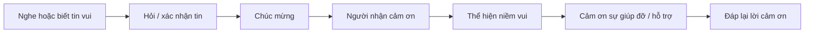

# LESSON 03 — CHIA SẺ NIỀM VUI VÀ LỜI CHÚC

> **Module 01 — Connect / Kết nối và giao tiếp xã hội**
> **Chủ đề:** Congratulations — Chúc mừng và phản hồi tin vui
> **Trình độ gợi ý:** A1–A2
> **Thời lượng:** 8–12 phút học bài + 5–10 phút luyện nói

---

## 1. Tình huống thực tế

Một người bạn, đồng nghiệp hoặc người thân vừa đạt được một thành tích đáng vui như:

* tốt nghiệp;
* được thăng chức;
* thi đỗ;
* được nhận vào một trường đại học;
* hoàn thành một mục tiêu quan trọng;
* đạt thành công trong học tập hoặc công việc.

Bạn cần biết cách:

* hỏi về tin vui;
* chúc mừng người khác;
* thể hiện sự tự hào;
* cảm ơn khi nhận được lời chúc;
* bày tỏ niềm vui;
* cảm ơn sự giúp đỡ và hỗ trợ của người khác;
* phản hồi lời khen một cách tự nhiên.


---

## 2. Mục tiêu bài học

Sau bài học, người học có thể:

1. Sử dụng **Congratulations!** để chúc mừng người khác.
2. Dùng cấu trúc **Congratulations on + danh từ / V-ing**.
3. Chúc mừng trang trọng bằng **Let me congratulate you on ...**
4. Dùng **Please accept my warmest congratulations.**
5. Bày tỏ niềm vui bằng **I'm really happy about it.**
6. Nói **I can't tell you how happy I am.**
7. Cảm ơn lời chúc bằng **It's very nice of you to say so.**
8. Cảm ơn sự giúp đỡ bằng **I really appreciate your help and support.**
9. Phản hồi lời khen bằng **I don't know what to say.**
10. Duy trì một đoạn hội thoại chia sẻ tin vui từ 6–8 lượt nói.

---

## 3. Sơ đồ giao tiếp



**Mẫu đơn giản:**

`I heard you got promoted.`
→ `Congratulations!`
→ `Thank you.`
→ `I'm really happy about it.`
→ `We're very proud of you.`
→ `That's very nice of you to say.`

---

# 4. Từ vựng trọng tâm — Core Vocabulary

## 4.1. **congratulations** /kənˌɡrætʃ.əˈleɪ.ʃənz/

**Nghĩa:** lời chúc mừng
**Từ loại:** danh từ số nhiều


**Ví dụ:**

* **Congratulations on your promotion!** — Chúc mừng bạn được thăng chức!
* **Congratulations! You did it!** — Chúc mừng! Bạn làm được rồi!

> **Ghi nhớ:** Trong lời chúc, tiếng Anh thường sử dụng dạng số nhiều **Congratulations!**

---

## 4.2. **congratulate** /kənˈɡrætʃ.ə.leɪt/

**Nghĩa:** chúc mừng
**Từ loại:** động từ


**Ví dụ:**

* **Let me congratulate you on your graduation.**
  — Cho phép tôi chúc mừng bạn đã tốt nghiệp.

* **Everyone congratulated her on her success.**
  — Mọi người đều chúc mừng cô ấy về thành công của mình.

**Cấu trúc:**

`congratulate + someone + on + something`

---

## 4.3. **appreciate** /əˈpriː.ʃi.eɪt/

**Nghĩa:** trân trọng, cảm kích


**Ví dụ:**

* **I really appreciate your help.**
  — Tôi thực sự cảm kích sự giúp đỡ của bạn.

* **I appreciate your support.**
  — Tôi rất trân trọng sự hỗ trợ của bạn.

---

## 4.4. **notice** /ˈnəʊ.tɪs/

**Nghĩa trong bài:** thông báo, giấy báo
**Từ loại:** danh từ


**Ví dụ:**

* **I got the notice last week.**
  — Tôi nhận được thông báo vào tuần trước.

* **She received an admission notice from the university.**
  — Cô ấy nhận được thông báo nhập học từ trường đại học.

> Trong ngữ cảnh nhập học hiện đại, **acceptance letter** hoặc **admission letter** thường tự nhiên và cụ thể hơn.

---

## 4.5. **success** /səkˈses/

**Nghĩa:** thành công


**Ví dụ:**

* **Congratulations on your success!**
  — Chúc mừng thành công của bạn!

* **Her hard work led to success.**
  — Sự chăm chỉ của cô ấy đã dẫn đến thành công.

---

## 4.6. **graduation** /ˌɡrædʒ.uˈeɪ.ʃən/

**Nghĩa:** lễ tốt nghiệp; việc tốt nghiệp


**Ví dụ:**

* **Congratulations on your graduation!**
  — Chúc mừng bạn tốt nghiệp!

* **Her graduation is next month.**
  — Lễ tốt nghiệp của cô ấy diễn ra vào tháng tới.

---

## 4.7. **warmest** /ˈwɔː.mɪst/

**Nghĩa:** nồng nhiệt nhất, chân thành nhất


**Cụm quan trọng:**

**my warmest congratulations** — lời chúc mừng nồng nhiệt nhất của tôi

**Ví dụ:**

* **Please accept my warmest congratulations.**
  — Xin hãy nhận lời chúc mừng nồng nhiệt nhất của tôi.

---

## 4.8. **forget** /fəˈɡet/

**Nghĩa:** quên


**Ví dụ:**

* **I won't forget your help.**
  — Tôi sẽ không quên sự giúp đỡ của bạn.

* **I'll never forget what you did for me.**
  — Tôi sẽ không bao giờ quên những gì bạn đã làm cho tôi.

---

## 4.9. **lucky** /ˈlʌk.i/

**Nghĩa:** may mắn


**Ví dụ:**

* **I think I'm very lucky.**
  — Tôi nghĩ mình rất may mắn.

* **You're lucky to have such good friends.**
  — Bạn thật may mắn khi có những người bạn tốt như vậy.

---

## 4.10. **make it** /meɪk ɪt/

**Nghĩa trong bài:** thành công, làm được điều gì đó


**Ví dụ:**

* **I'm glad I made it.**
  — Tôi rất vui vì mình đã làm được.

* **After years of hard work, she finally made it.**
  — Sau nhiều năm làm việc chăm chỉ, cuối cùng cô ấy đã thành công.

> **make it** có nhiều nghĩa khác nhau. Trong bài này, nó mang nghĩa **đạt được mục tiêu / thành công**.

---

## 4.11. **support** /səˈpɔːt/

**Nghĩa:** sự hỗ trợ; hỗ trợ


**Ví dụ:**

* **Thank you for your support.**
  — Cảm ơn sự hỗ trợ của bạn.

* **I really appreciate your help and support.**
  — Tôi thực sự trân trọng sự giúp đỡ và hỗ trợ của bạn.

---

## 4.12. **promotion** /prəˈməʊ.ʃən/

**Nghĩa:** sự thăng chức


**Ví dụ:**

* **Congratulations on your promotion!**
  — Chúc mừng bạn được thăng chức!

* **She got a promotion last month.**
  — Cô ấy được thăng chức vào tháng trước.

---

## 4.13. **proud** /praʊd/

**Nghĩa:** tự hào


**Ví dụ:**

* **We're very proud of you.**
  — Chúng tôi rất tự hào về bạn.

* **I'm proud of what you've achieved.**
  — Tôi tự hào về những gì bạn đã đạt được.

**Cấu trúc:**

`be proud of + someone / something`

---

## 4.14. **happy** /ˈhæp.i/

**Nghĩa:** vui, hạnh phúc


**Ví dụ:**

* **I'm really happy about it.**
  — Tôi thực sự rất vui về điều đó.

* **I can't tell you how happy I am.**
  — Tôi không thể diễn tả mình vui đến mức nào.

---

## 4.15. **help** /help/

**Nghĩa:** sự giúp đỡ; giúp đỡ


**Ví dụ:**

* **Thanks. I won't forget your help.**
  — Cảm ơn. Tôi sẽ không quên sự giúp đỡ của bạn.

* **Thank you for helping me.**
  — Cảm ơn vì đã giúp tôi.

---

# 5. Bảng tổng hợp từ vựng

| Từ / cụm từ         | IPA                    | Nghĩa tiếng Việt     | Ví dụ ngắn                         |
| ------------------- | ---------------------- | -------------------- | ---------------------------------- |
| **congratulations** | /kənˌɡrætʃ.əˈleɪ.ʃənz/ | lời chúc mừng        | Congratulations!                   |
| **congratulate**    | /kənˈɡrætʃ.ə.leɪt/     | chúc mừng            | Let me congratulate you.           |
| **appreciate**      | /əˈpriː.ʃi.eɪt/        | trân trọng, cảm kích | I appreciate your help.            |
| **notice**          | /ˈnəʊ.tɪs/             | thông báo            | I got the notice.                  |
| **success**         | /səkˈses/              | thành công           | Congratulations on your success.   |
| **graduation**      | /ˌɡrædʒ.uˈeɪ.ʃən/      | việc/lễ tốt nghiệp   | your graduation                    |
| **warmest**         | /ˈwɔː.mɪst/            | nồng nhiệt nhất      | my warmest congratulations         |
| **forget**          | /fəˈɡet/               | quên                 | I won't forget your help.          |
| **lucky**           | /ˈlʌk.i/               | may mắn              | I'm very lucky.                    |
| **make it**         | /meɪk ɪt/              | làm được, thành công | I'm glad I made it.                |
| **support**         | /səˈpɔːt/              | sự hỗ trợ            | Thanks for your support.           |
| **promotion**       | /prəˈməʊ.ʃən/          | sự thăng chức        | Congratulations on your promotion. |
| **proud**           | /praʊd/                | tự hào               | We're proud of you.                |
| **happy**           | /ˈhæp.i/               | vui, hạnh phúc       | I'm really happy.                  |
| **help**            | /help/                 | giúp đỡ              | Thanks for your help.              |

---

# 6. Mẫu câu giao tiếp — Useful Structures

## 6.1. Chúc mừng đơn giản


### **Congratulations!**

Đây là cách chúc mừng ngắn gọn và phổ biến nhất.

* **Congratulations!** — Chúc mừng!
* **Congratulations, Anna!** — Chúc mừng Anna!

---

## 6.2. Chúc mừng về một thành tích cụ thể


### **Congratulations on + danh từ / V-ing**

* **Congratulations on your promotion!**
  — Chúc mừng bạn được thăng chức!

* **Congratulations on your graduation!**
  — Chúc mừng bạn tốt nghiệp!

* **Congratulations on getting into Cambridge!**
  — Chúc mừng bạn được nhận vào Cambridge!

**Cấu trúc:**

`Congratulations on + noun`

hoặc:

`Congratulations on + V-ing`

---

## 6.3. Chúc mừng trang trọng


### **Let me congratulate you on + thành tích.**

* **Let me congratulate you on your graduation.**
  — Cho phép tôi chúc mừng bạn đã tốt nghiệp.

Đây là cách nói trang trọng hơn **Congratulations!**

---

## 6.4. Lời chúc trang trọng và nồng nhiệt


### **Please accept my warmest congratulations.**

— Xin hãy nhận lời chúc mừng nồng nhiệt nhất của tôi.

Có thể mở rộng:

* **Please accept my warmest congratulations on your success.**
* **My warmest congratulations on your graduation.**

> Cấu trúc này thường phù hợp hơn với thư, email hoặc tình huống trang trọng.

---

## 6.5. Bày tỏ niềm vui


### **I'm really happy about it.**

— Tôi thực sự rất vui về điều đó.

Các cách khác:

* **I'm very happy.**
* **I'm so happy!**
* **I'm really excited about it.**
* **I'm glad I made it.**

---

## 6.6. Nhấn mạnh mức độ vui


### **I can't tell you how happy I am.**

— Tôi không thể diễn tả mình vui đến mức nào.

Cấu trúc:

`I can't tell you how + adjective + subject + be`

Ví dụ:

* **I can't tell you how excited I am.**
* **I can't tell you how grateful I am.**

---

## 6.7. Cảm ơn lời chúc hoặc lời khen


### **It's very nice of you to say so.**

— Bạn thật tốt khi nói như vậy.

Các cách tự nhiên khác:

* **That's very nice of you to say.**
* **That's really kind of you.**
* **Thank you. That means a lot to me.**

---

## 6.8. Khi quá xúc động chưa biết nói gì


### **I don't know what to say.**

— Tôi không biết phải nói gì.

Thường dùng khi:

* bất ngờ vì tin vui;
* nhận được lời khen lớn;
* nhận được sự giúp đỡ đáng kể;
* cảm thấy xúc động.

Ví dụ:

* **Thank you. I don't know what to say.**
* **That's so kind. I don't know what to say.**

---

## 6.9. Cảm ơn sự giúp đỡ


### **I really appreciate your help.**

— Tôi thực sự cảm kích sự giúp đỡ của bạn.

### **I really appreciate your help and support.**

— Tôi thực sự trân trọng sự giúp đỡ và hỗ trợ của bạn.

**Cấu trúc:**

`appreciate + noun`

hoặc:

`appreciate + V-ing`

Ví dụ:

* **I appreciate your advice.**
* **I appreciate you helping me.**

---

## 6.10. Nói rằng mình sẽ ghi nhớ sự giúp đỡ


### **I won't forget your help.**

— Tôi sẽ không quên sự giúp đỡ của bạn.

Tự nhiên hơn trong một số tình huống:

* **I'll never forget your help.**
* **I won't forget what you've done for me.**

---

## 6.11. Khiêm tốn khi được cảm ơn


### **Oh, it was nothing.**

— Ôi, có gì đâu.

Các cách tương tự:

* **Don't mention it.**
* **No problem.**
* **I'm glad I could help.**
* **Anytime.**

---

## 6.12. Thể hiện sự tự hào


### **We're very proud of you.**

— Chúng tôi rất tự hào về bạn.

**Cấu trúc:**

`be proud of + người / điều gì`

Ví dụ:

* **I'm proud of you.**
* **Your family must be proud of you.**
* **You should be proud of yourself.**

---

## 6.13. Thể hiện mình đã nghe tin


### **I heard + mệnh đề.**

* **I heard you're going to study at Cambridge University.**
  — Tôi nghe nói bạn sắp học tại Đại học Cambridge.

* **I heard you got promoted.**
  — Tôi nghe nói bạn được thăng chức.

Phản hồi:

* **So you heard!** — Vậy là bạn nghe tin rồi à!
* **Yes, I got the notice last week.**

---

# 7. Các mức độ chúc mừng

| Tình huống           | Mẫu câu                                       | Sắc thái          |
| -------------------- | --------------------------------------------- | ----------------- |
| Tin vui thông thường | **Congratulations!**                          | Tự nhiên          |
| Thành tích cụ thể    | **Congratulations on your promotion!**        | Rất phổ biến      |
| Bạn bè thân thiết    | **That's amazing! Congratulations!**          | Thân mật          |
| Trang trọng          | **Let me congratulate you on ...**            | Trang trọng       |
| Rất trang trọng      | **Please accept my warmest congratulations.** | Thư/email/sự kiện |
| Tự hào về người khác | **We're very proud of you.**                  | Ấm áp, gần gũi    |

### Công thức giao tiếp

```text
Good news
   ↓
I heard ...
   ↓
Congratulations!
   ↓
Thank you!
   ↓
I'm really happy about it.
   ↓
We're very proud of you.
```

---

# 8. Phát âm trọng tâm

## 8.1. Từ **congratulations**

**congratulations**

/kənˌɡrætʃ.əˈleɪ.ʃənz/

Trọng âm chính rơi vào:

**LA**

`con-gra-tu-LA-tions`

Không nên đọc đều từng âm tiết.

---

## 8.2. Âm /ʃ/ trong **appreciate**

**appreciate**
/əˈpriː.ʃi.eɪt/

Chú ý phần:

`-ci-` → /ʃi/

---

## 8.3. Trọng âm

* con-grat-u-**LA**-tions
* ap-**PRE**-ci-ate
* suc-**CESS**
* grad-u-**A**-tion
* pro-**MO**-tion
* sup-**PORT**

---

## 8.4. Nối âm

Trong:

**Congratulations on your promotion.**

`congratulations_on`

thường được nối liền khi nói.

Tương tự:

**I'm really happy about it.**

`happy_about_it`

nên luyện theo cả cụm thay vì đọc từng từ rời rạc.

---

# 9. Hội thoại thực tế — Real-Life Conversation

## Hội thoại 1 — Chúc mừng được thăng chức


**Hugo:** Morning, Anna. Congratulations on your promotion!
**Anna:** Thank you. I'm really happy about it.
**Hugo:** We're very proud of you.
**Anna:** I don't know what to say. I really appreciate your help and support.
**Hugo:** Well, you're one of the best people in our company.
**Anna:** That's really nice of you to say.

### Sơ đồ hội thoại

```text
Biết tin thăng chức
      ↓
Congratulations on ...
      ↓
Thank you
      ↓
I'm really happy about it
      ↓
We're proud of you
      ↓
Cảm ơn sự giúp đỡ
      ↓
Phản hồi lời khen
```

> Cách nói câu **“you're the best man in our company”**. Trong bài học tổng quát, dùng **“you're one of the best people in our company”** tự nhiên hơn và không phụ thuộc giới tính.

---

## Hội thoại 2 — Được nhận vào Đại học Cambridge


**Anna:** Hey, Hugo. I heard you're going to study at Cambridge University.
**Hugo:** Yes. I got the notice last week. I'm very happy about it.
**Anna:** Congratulations! It's a great university.
**Hugo:** Yes, it is. I'm really excited.

### Phiên bản tự nhiên hơn

**Anna:** Hey, Hugo! I heard you got into Cambridge University.
**Hugo:** Yes! I got my acceptance letter last week. I'm really happy about it.
**Anna:** Congratulations! That's amazing.
**Hugo:** Thank you! I'm really excited.

> **get into a university** = được nhận vào một trường đại học.

---

# 10. Natural Expressions — Cách nói tự nhiên

| Cụm từ                               | Nghĩa                        | Khi dùng              |
| ------------------------------------ | ---------------------------- | --------------------- |
| **Congratulations!**                 | Chúc mừng!                   | Tin vui nói chung     |
| **Congratulations on ...**           | Chúc mừng về...              | Thành tích cụ thể     |
| **That's amazing!**                  | Tuyệt quá!                   | Phản ứng với tin vui  |
| **That's great news!**               | Tin tuyệt quá!               | Phản ứng với tin vui  |
| **I'm really happy about it.**       | Tôi rất vui về điều đó.      | Người nhận tin vui    |
| **I can't tell you how happy I am.** | Tôi vui không thể diễn tả.   | Niềm vui lớn          |
| **I'm glad I made it.**              | Tôi vui vì mình đã làm được. | Thành công sau nỗ lực |
| **We're proud of you.**              | Chúng tôi tự hào về bạn.     | Khen/ngợi             |
| **That's nice of you to say.**       | Bạn thật tốt khi nói vậy.    | Nhận lời khen         |
| **I don't know what to say.**        | Tôi không biết phải nói gì.  | Xúc động              |
| **I really appreciate it.**          | Tôi thực sự rất cảm kích.    | Cảm ơn                |
| **Thanks for your support.**         | Cảm ơn sự hỗ trợ của bạn.    | Cảm ơn                |
| **It was nothing.**                  | Có gì đâu.                   | Đáp lại lời cảm ơn    |
| **I'm glad I could help.**           | Tôi vui vì có thể giúp.      | Đáp lại lời cảm ơn    |
| **You deserve it.**                  | Bạn xứng đáng với điều đó.   | Chúc mừng thành tích  |

---

# 11. Lỗi thường gặp — Common Mistakes

## Lỗi 1: Dùng **congratulation** số ít

❌ **Congratulation!**

✅ **Congratulations!**

Khi dùng như một lời chúc độc lập, tiếng Anh sử dụng:

**Congratulations!**

---

## Lỗi 2: Sai giới từ sau **congratulations**

❌ **Congratulations for your promotion.**

✅ **Congratulations on your promotion.**

**Cấu trúc chuẩn:**

`Congratulations on + noun / V-ing`

---

## Lỗi 3: Sai cấu trúc với động từ **congratulate**

❌ **I congratulate for your success.**

✅ **I congratulate you on your success.**

Cấu trúc:

`congratulate + someone + on + something`

---

## Lỗi 4: Nói **I'm pride of you**

❌ **I'm pride of you.**

✅ **I'm proud of you.**

* **proud** = tính từ
* **pride** = danh từ

---

## Lỗi 5: Dùng **appreciate** giống **thank**

❌ **I appreciate you for your help.**

Tự nhiên hơn:

✅ **I appreciate your help.**

✅ **I really appreciate it.**

✅ **Thank you for your help.**

---

## Lỗi 6: Dịch từng chữ câu “Tôi rất vui về nó”

❌ **I'm very happy for it.**

✅ **I'm very happy about it.**

**happy about something** = vui về một việc gì đó.

---

## Lỗi 7: Phản hồi lời chúc quá ngắn

Chỉ nói:

**Thanks.**

không sai.

Nhưng để tiếp tục hội thoại, có thể nói:

✅ **Thanks! I'm really happy about it.**

✅ **Thank you. I really appreciate it.**

✅ **Thanks! I can't believe I made it.**

---

# 12. Luyện tập có hướng dẫn

## Bài 1 — Nối từ với nghĩa

1. promotion
2. graduation
3. success
4. support
5. proud
6. appreciate

A. tự hào
B. thành công
C. sự hỗ trợ
D. tốt nghiệp / lễ tốt nghiệp
E. thăng chức
F. trân trọng, cảm kích

<details>
<summary>Đáp án</summary>

1–E
2–D
3–B
4–C
5–A
6–F

</details>

---

## Bài 2 — Điền từ vào chỗ trống

Dùng:

`congratulations` · `promotion` · `proud` · `happy` · `support`

1. __________ on your graduation!
2. Congratulations on your __________!
3. We're very __________ of you.
4. I'm really __________ about it.
5. Thank you for your help and __________.

<details>
<summary>Đáp án</summary>

1. Congratulations
2. promotion
3. proud
4. happy
5. support

</details>

---

## Bài 3 — Chọn câu đúng

### 1. Bạn của bạn vừa được thăng chức.

* A. Congratulations on your promotion!
* B. Congratulations for your promotion!
* C. Congratulation your promotion!

**Đáp án:** A

---

### 2. Bạn muốn nói mình rất tự hào về người khác.

* A. I'm pride of you.
* B. I'm proud of you.
* C. I'm proud with you.

**Đáp án:** B

---

### 3. Bạn muốn cảm ơn sự giúp đỡ.

* A. I really appreciate your help.
* B. I really appreciate for your help.
* C. I appreciate you your help.

**Đáp án:** A

---

### 4. Bạn vừa đạt một mục tiêu lớn.

* A. I'm glad I made it.
* B. I'm glad I make it yesterday.
* C. I'm glad I making it.

**Đáp án:** A

---

## Bài 4 — Hoàn thành hội thoại

**A:** I heard you graduated from university.
**B:** Yes! I finished last week.
**A:** ________________________________!
**B:** Thank you. ________________________________.
**A:** Your family must be very __________________.
**B:** They are. I really appreciate their __________________.

<details>
<summary>Đáp án gợi ý</summary>

**A:** Congratulations!
**B:** Thank you. I'm really happy about it.
**A:** Your family must be very proud.
**B:** They are. I really appreciate their support.

</details>

---

# 13. Speaking Challenge — Thử thách nói

## Nhiệm vụ 1

Đọc hai hội thoại mẫu thành tiếng 2 lần.

* Lần 1: đọc chậm và rõ.
* Lần 2: đọc theo tốc độ tự nhiên.

---

## Nhiệm vụ 2

Thay thành tích trong câu:

**Congratulations on your ______!**

Dùng:

* **graduation**
* **promotion**
* **success**
* **new job**
* **new house**
* **exam results**
* **award**

---

## Nhiệm vụ 3

Luyện phản hồi lời chúc bằng ít nhất 5 câu:

* **Thank you!**
* **I'm really happy about it.**
* **I can't tell you how happy I am.**
* **That's very nice of you to say.**
* **I really appreciate your support.**

---

## Nhiệm vụ 4

Tạo một hội thoại **8 lượt nói** có:

* 1 tin vui;
* 1 câu **I heard ...**
* 1 câu **Congratulations on ...**
* 1 câu bày tỏ niềm vui;
* 1 câu thể hiện sự tự hào;
* 1 câu cảm ơn sự hỗ trợ;
* 1 câu phản hồi lời cảm ơn.

---

## Nhiệm vụ 5

Ghi âm từ **45–60 giây**, sau đó tự kiểm tra:

* [ ] Tôi phát âm rõ **congratulations**.
* [ ] Tôi dùng đúng **Congratulations on ...**
* [ ] Tôi dùng đúng **proud of**.
* [ ] Tôi sử dụng được **I really appreciate ...**
* [ ] Tôi phản hồi lời chúc bằng câu đầy đủ.
* [ ] Tôi duy trì hội thoại ít nhất 6–8 lượt.

---

# 14. Practice Mission — Nhiệm vụ thực tế

Trong hôm nay, hãy tạo một đoạn hội thoại theo công thức:

> **Hear the news → Confirm → Congratulate → Thank → Share happiness → Praise → Appreciate**

Ví dụ:

> **I heard you got promoted.**
> ↓
> **Yes! I got the news yesterday.**
> ↓
> **Congratulations on your promotion!**
> ↓
> **Thank you. I'm really happy about it.**
> ↓
> **We're very proud of you.**
> ↓
> **That's really nice of you to say.**
> ↓
> **I really appreciate your help and support.**

Sau đó tự viết một đoạn hội thoại **8 lượt nói** với một trong các tình huống:

* tốt nghiệp;
* được thăng chức;
* thi đỗ;
* nhận công việc mới;
* được nhận vào đại học;
* giành giải thưởng.

---

# 15. Tự đánh giá cuối bài

Đánh dấu khi bạn có thể thực hiện mà không nhìn bài:

* [ ] Tôi có thể nói **Congratulations!** đúng ngữ cảnh.
* [ ] Tôi có thể sử dụng **Congratulations on ...**
* [ ] Tôi biết cấu trúc **congratulate someone on something**.
* [ ] Tôi có thể chúc mừng ai đó tốt nghiệp.
* [ ] Tôi có thể chúc mừng ai đó được thăng chức.
* [ ] Tôi có thể bày tỏ rằng mình rất vui.
* [ ] Tôi có thể nói rằng mình tự hào về ai đó.
* [ ] Tôi có thể cảm ơn sự giúp đỡ và hỗ trợ.
* [ ] Tôi có thể phản hồi lời khen một cách tự nhiên.
* [ ] Tôi có thể duy trì hội thoại ít nhất 45 giây.

---

# 16. Câu hỏi mở cuối bài

**Imagine your best friend has just been accepted into their dream university. How would you congratulate them, and how might they respond?**

*Hãy tưởng tượng người bạn thân nhất của bạn vừa được nhận vào trường đại học mà họ mơ ước. Bạn sẽ chúc mừng họ như thế nào và họ có thể phản hồi ra sao?*

---

# 17. Ghi chú dành cho giảng viên

* **Module:** 01 — Connect / Kết nối và giao tiếp xã hội

* **Chủ điểm:** Congratulations

* **Thời lượng video:** 8–12 phút

* **Luyện nói:** 5–10 phút

* **Trọng tâm từ vựng:**

  * congratulations
  * congratulate
  * appreciate
  * notice
  * success
  * graduation
  * warmest
  * forget
  * lucky
  * make it
  * support
  * promotion
  * proud
  * happy

* **Trọng tâm phát âm:**

  * **congratulations**
  * **appreciate**
  * **success**
  * **graduation**
  * **promotion**
  * **support**

* **Trọng tâm cấu trúc:**

  * Congratulations!
  * Congratulations on ...
  * Let me congratulate you on ...
  * Please accept my warmest congratulations.
  * I'm really happy about it.
  * I can't tell you how happy I am.
  * It's very nice of you to say so.
  * I think I'm very lucky.
  * I'm glad I made it.
  * I don't know what to say.
  * I really appreciate your help.
  * I really appreciate your help and support.
  * We're very proud of you.
  * I heard ...

* **Lưu ý ngôn ngữ:**

  * Ưu tiên dạy **Congratulations on ...** vì đây là cấu trúc thực tế và phổ biến nhất.
  * **Please accept my warmest congratulations** mang sắc thái trang trọng, phù hợp với thư hoặc những dịp chính thức.
  * Với việc được nhận vào đại học, có thể dạy thêm **get into university** và **acceptance letter** để hội thoại tự nhiên hơn.
  * **I got the notice** đúng trong một số ngữ cảnh, nhưng **I got my acceptance letter** rõ nghĩa hơn khi nói về nhập học.
  * **It was nothing** có thể dùng để đáp lại lời cảm ơn, nhưng **I'm glad I could help** thường ấm áp và tự nhiên hơn.

* **Hoạt động gợi ý:**

  * Cho mỗi học viên một “thẻ tin vui”.
  * Người A phải thông báo hoặc để người B hỏi về tin vui.
  * Người B phải chúc mừng.
  * Người A phải cảm ơn và chia sẻ cảm xúc.
  * Người B phải nói thêm một lời khen hoặc thể hiện sự tự hào.
  * Đổi vai sau mỗi tình huống.

### Role-play mẫu

**Người A nhận:**

> Bạn vừa được thăng chức sau hai năm làm việc.

**Người B nhận:**

> Bạn vừa nghe tin từ một đồng nghiệp. Hãy chúc mừng người A và nói rằng bạn tự hào về họ.

Hội thoại phải sử dụng ít nhất:

* **I heard ...**
* **Congratulations on ...**
* **I'm really happy about it.**
* **I'm proud of you.**
* **I really appreciate ...**

---
