# LESSON 04 — NÓI VỀ SỞ THÍCH CÁ NHÂN

> **Module 01 — Connect / Kết nối và giao tiếp xã hội**
> **Chủ đề:** Like and Dislike — Nói về điều mình thích, không thích và quan tâm
> **Trình độ gợi ý:** A1–A2
> **Thời lượng:** 8–12 phút học bài + 5–10 phút luyện nói

---

## 1. Tình huống thực tế

Trong giao tiếp hằng ngày, mọi người thường hỏi nhau về:

* loại nhạc yêu thích;
* môn thể thao yêu thích;
* trò chơi;
* món ăn;
* phim ảnh;
* hoạt động giải trí;
* nơi ở;
* ngôn ngữ;
* những điều mình không thích;
* những điều mình đã chán hoặc không còn hứng thú.

Bạn cần biết cách:

* nói mình thích điều gì;
* nói mình rất thích hoặc yêu thích một hoạt động;
* nói mình quan tâm đến một chủ đề;
* so sánh hai lựa chọn;
* nói mình thích cả hai;
* nói mình không thích;
* nói mình ghét hoặc đã chán điều gì;
* hỏi người khác về sở thích;
* tìm điểm chung giữa hai người.


---

## 2. Mục tiêu bài học

Sau bài học, người học có thể:

1. Nói sở thích bằng **I like ...**
2. Thể hiện sở thích mạnh hơn bằng **I love ...**
3. Nói về hoạt động yêu thích bằng **I enjoy + V-ing**.
4. Nói mình quan tâm đến điều gì bằng **I'm interested in ...**
5. So sánh sở thích bằng **I prefer A to B**.
6. Nói mình thích một lựa chọn hơn bằng **I like A better**.
7. Nói mình thích cả hai bằng **I like both of them**.
8. Diễn đạt điều không thích bằng **I don't like ...**, **I dislike ...**, **I hate ...**
9. Nói mình đã chán bằng **I'm tired of ...**
10. Nói mình không quan tâm bằng **I'm not interested in ...**
11. Hỏi người khác bằng **What type of ... do you like?**
12. Tìm điểm chung bằng **We have the same interest.**
13. Duy trì một đoạn hội thoại 6–8 lượt về sở thích cá nhân.

---

## 3. Sơ đồ giao tiếp

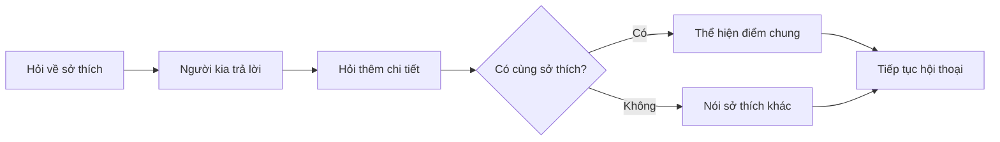
```mermaid
flowchart LR
    A[Hỏi về sở thích] --> B[Người kia trả lời]
    B --> C[Hỏi thêm chi tiết]
    C --> D{Có cùng sở thích?}
    D -->|Có| E[Thể hiện điểm chung]
    D -->|Không| F[Nói sở thích khác]
    E --> G[Tiếp tục hội thoại]
    F --> G
```

**Mẫu đơn giản:**

`What type of music do you like?`
→ `I enjoy listening to jazz.`
→ `Really? I like jazz too.`
→ `We have the same interest.`

---

# 4. Từ vựng trọng tâm — Core Vocabulary

## 4.1. **since** /sɪns/

**Nghĩa:** kể từ khi
**Từ loại:** giới từ / liên từ

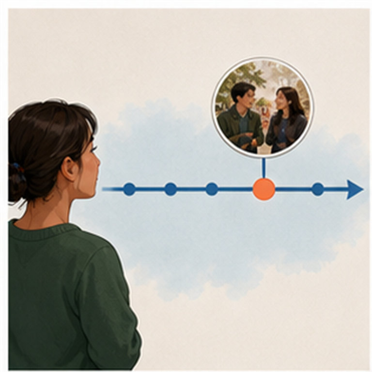

**Ví dụ:**

* **It's a long time since I last saw you.**
  — Đã lâu rồi kể từ lần cuối tôi gặp bạn.

* **I've lived here since 2024.**
  — Tôi sống ở đây từ năm 2024.

> **Ghi nhớ:** **since** thường đi với một mốc thời gian hoặc một sự kiện bắt đầu trong quá khứ.

---

## 4.2. **last** /lɑːst/

**Nghĩa trong bài:** lần cuối, trước đó

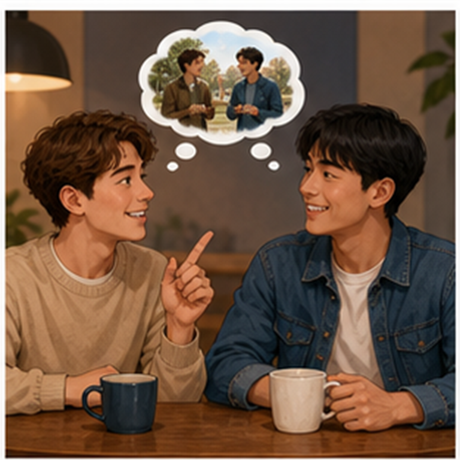

**Ví dụ:**

* **When did you last see him?**
  — Lần cuối bạn gặp anh ấy là khi nào?

* **It's been a long time since I last saw you.**
  — Đã lâu rồi kể từ lần cuối tôi gặp bạn.

---

## 4.3. **month** /mʌnθ/

**Nghĩa:** tháng

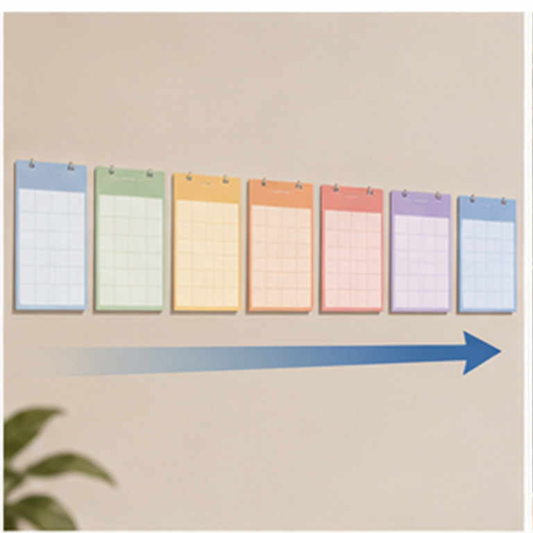

**Ví dụ:**

* **I moved here two months ago.**
  — Tôi chuyển đến đây hai tháng trước.

* **See you next month.**
  — Hẹn gặp bạn tháng sau.

---

## 4.4. **ago** /əˈɡəʊ/

**Nghĩa:** trước đây, cách đây


**Ví dụ:**

* **I moved here two months ago.**
  — Tôi chuyển đến đây cách đây hai tháng.

* **We met three years ago.**
  — Chúng tôi gặp nhau ba năm trước.

**Cấu trúc:**

`khoảng thời gian + ago`

---

## 4.5. **like** /laɪk/

**Nghĩa:** thích
**Từ loại:** động từ


**Ví dụ:**

* **I like summer best.**
  — Tôi thích mùa hè nhất.

* **I like reading.**
  — Tôi thích đọc sách.

---

## 4.6. **dislike** /dɪsˈlaɪk/

**Nghĩa:** không thích
**Từ loại:** động từ / danh từ

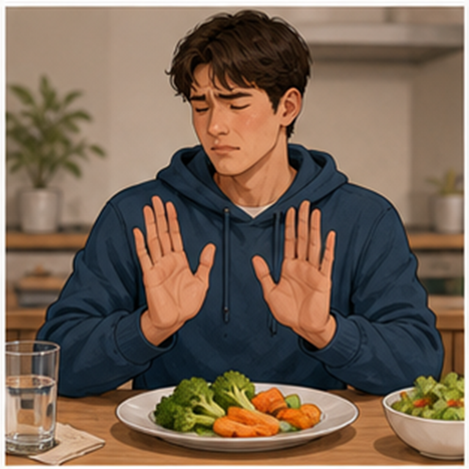

**Ví dụ:**

* **She dislikes driving.**
  — Cô ấy không thích lái xe.

* **I dislike crowded places.**
  — Tôi không thích những nơi đông người.

> **dislike** thường mang sắc thái rõ hơn **don't like**, nhưng nhẹ hơn **hate**.

---

## 4.7. **stay** /steɪ/

**Nghĩa:** ở lại, ở


**Ví dụ:**

* **I hate staying in the same place for too long.**
  — Tôi ghét ở cùng một nơi quá lâu.

* **We're staying at a hotel.**
  — Chúng tôi đang ở khách sạn.

---

## 4.8. **hope** /həʊp/

**Nghĩa:** hy vọng

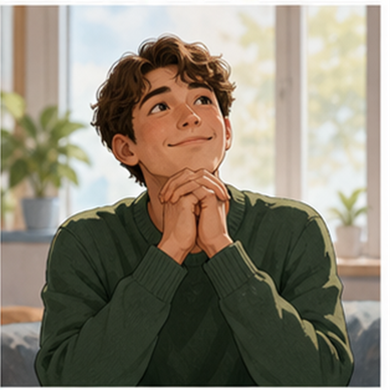

**Ví dụ:**

* **I hope you enjoy the film.**
  — Tôi hy vọng bạn thích bộ phim.

* **I hope to see you again.**
  — Tôi hy vọng sẽ gặp lại bạn.

---

## 4.9. **tired of** /ˈtaɪəd əv/

**Nghĩa:** chán, mệt mỏi vì điều gì đó


**Ví dụ:**

* **I'm tired of endless homework.**
  — Tôi chán ngấy đống bài tập về nhà không bao giờ hết.

* **I'm tired of waiting.**
  — Tôi chán việc phải chờ đợi rồi.

**Cấu trúc:**

`be tired of + noun / V-ing`

---

## 4.10. **collect** /kəˈlekt/

**Nghĩa:** sưu tầm, thu thập

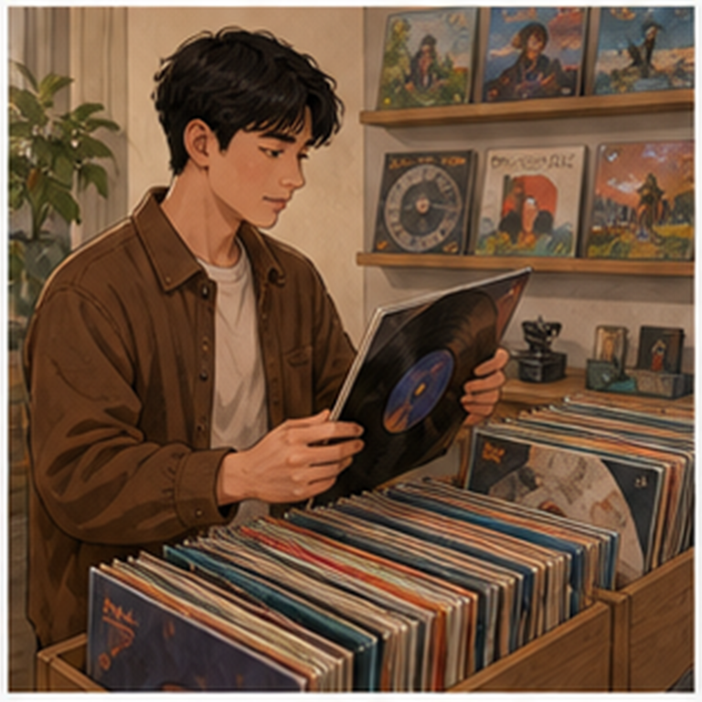

**Ví dụ:**

* **She collects records.**
  — Cô ấy sưu tầm đĩa nhạc.

* **My brother collects stamps.**
  — Anh trai tôi sưu tầm tem.

---

## 4.11. **record** /ˈrek.ɔːd/

**Nghĩa trong bài:** đĩa nhạc

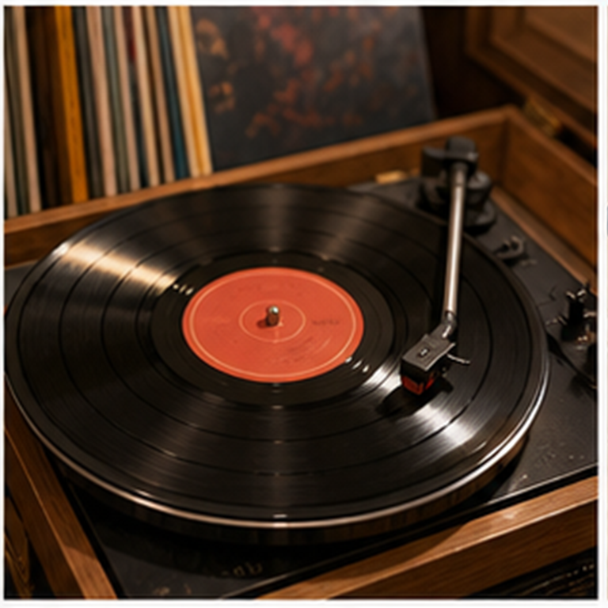

**Ví dụ:**

* **She has collected a lot of records.**
  — Cô ấy đã sưu tầm rất nhiều đĩa nhạc.

* **This is my favorite jazz record.**
  — Đây là đĩa nhạc jazz yêu thích của tôi.

---

## 4.12. **classical music** /ˈklæs.ɪ.kəl ˈmjuː.zɪk/

**Nghĩa:** nhạc cổ điển

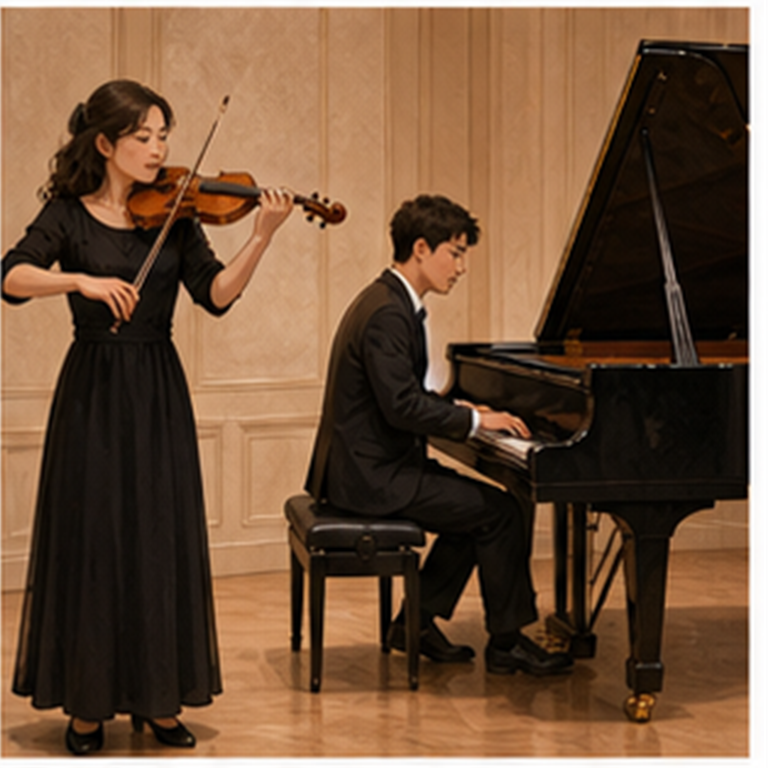

**Ví dụ:**

* **I enjoy listening to classical music.**
  — Tôi thích nghe nhạc cổ điển.

* **Do you like classical music?**
  — Bạn có thích nhạc cổ điển không?

---

## 4.13. **video games** /ˈvɪd.i.əʊ ɡeɪmz/

**Nghĩa:** trò chơi điện tử

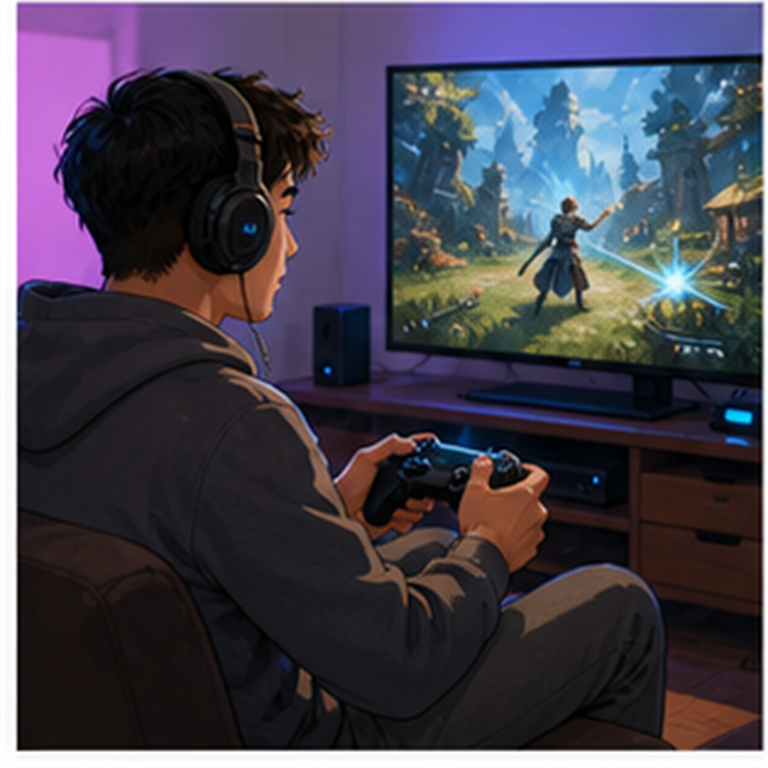

**Ví dụ:**

* **I'm interested in video games.**
  — Tôi quan tâm đến trò chơi điện tử.

* **He plays video games after school.**
  — Cậu ấy chơi trò chơi điện tử sau giờ học.

---

## 4.14. **choice** /tʃɔɪs/

**Nghĩa:** sự lựa chọn

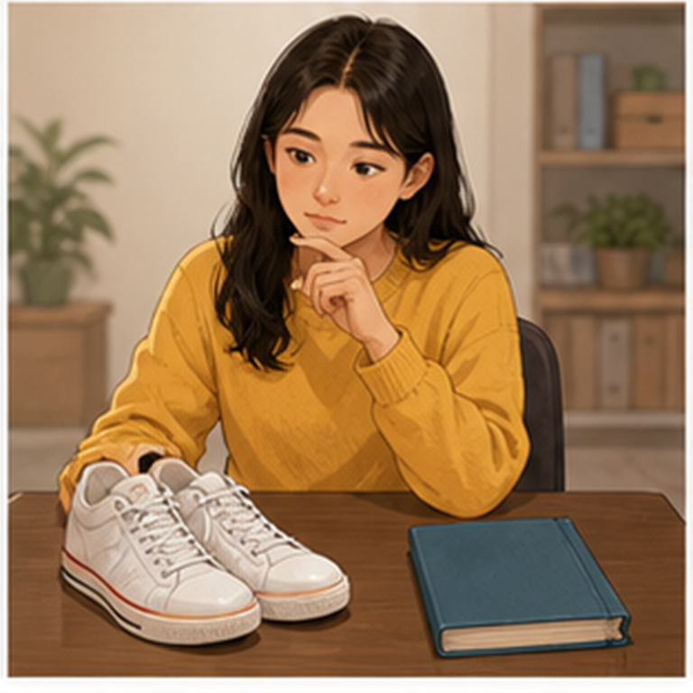

**Ví dụ:**

* **They are my choice.**
  — Chúng là lựa chọn của tôi.

* **This restaurant is my first choice.**
  — Nhà hàng này là lựa chọn đầu tiên của tôi.

---

## 4.15. **homework** /ˈhəʊm.wɜːk/

**Nghĩa:** bài tập về nhà

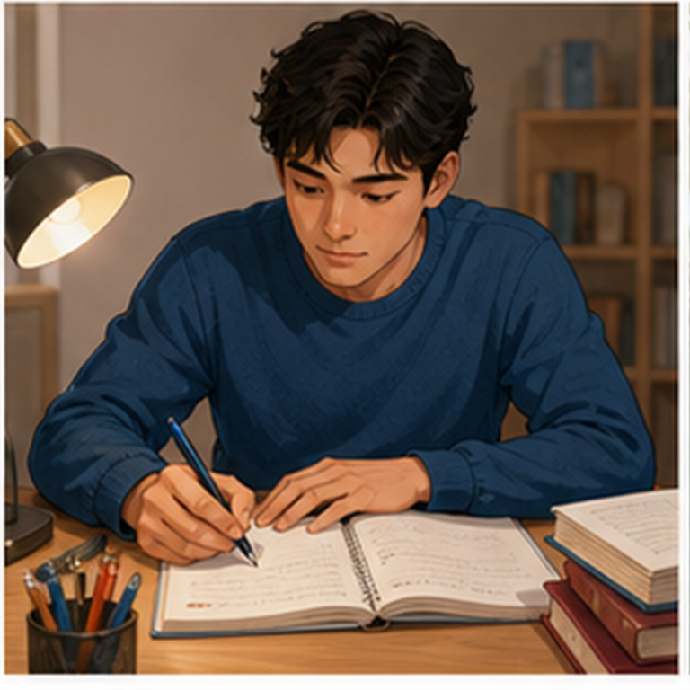

**Ví dụ:**

* **I have a lot of homework tonight.**
  — Tối nay tôi có rất nhiều bài tập về nhà.

* **I'm tired of endless homework.**
  — Tôi chán ngấy bài tập về nhà không bao giờ hết.

> **Chú ý:** **homework** là danh từ không đếm được. Không nói `homeworks`.

---

## 4.16. **jazz** /dʒæz/

**Nghĩa:** nhạc jazz

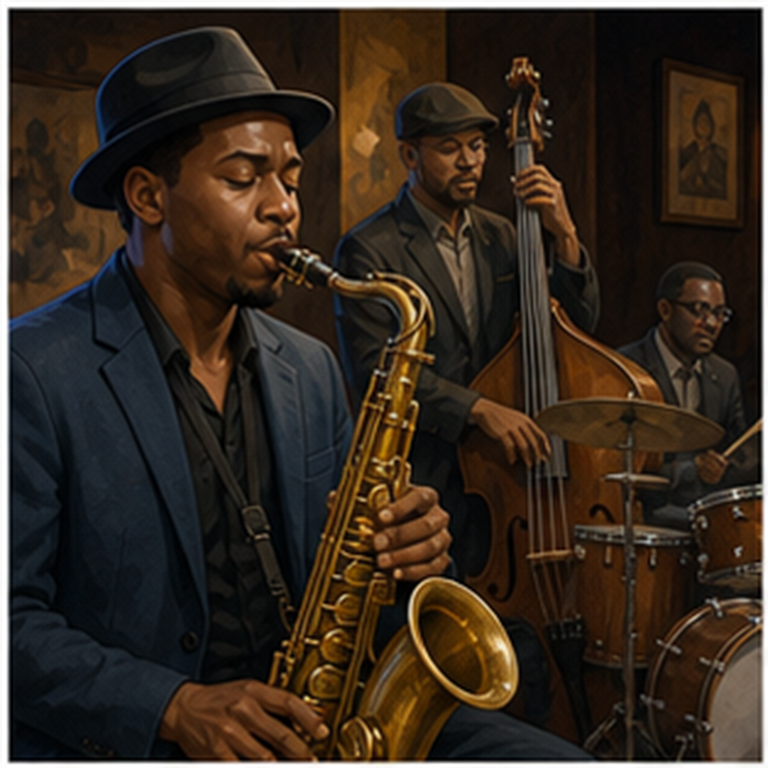

**Ví dụ:**

* **I really enjoy listening to jazz.**
  — Tôi thực sự thích nghe nhạc jazz.

* **Jazz is my favorite type of music.**
  — Jazz là thể loại nhạc yêu thích của tôi.

---

## 4.17. **rap** /ræp/

**Nghĩa:** nhạc rap


**Ví dụ:**

* **My sister is a fan of rap.**
  — Chị/em gái tôi là người hâm mộ nhạc rap.

* **Do you listen to rap?**
  — Bạn có nghe nhạc rap không?

---

## 4.18. **fan** /fæn/

**Nghĩa:** người hâm mộ, người rất yêu thích


**Ví dụ:**

* **She's a fan of rap.**
  — Cô ấy rất thích nhạc rap.

* **I'm a big fan of football.**
  — Tôi rất thích bóng đá.

**Cấu trúc:**

`be a fan of + noun`

---

## 4.19. **interest** /ˈɪn.trəst/

**Nghĩa:** sở thích, sự quan tâm

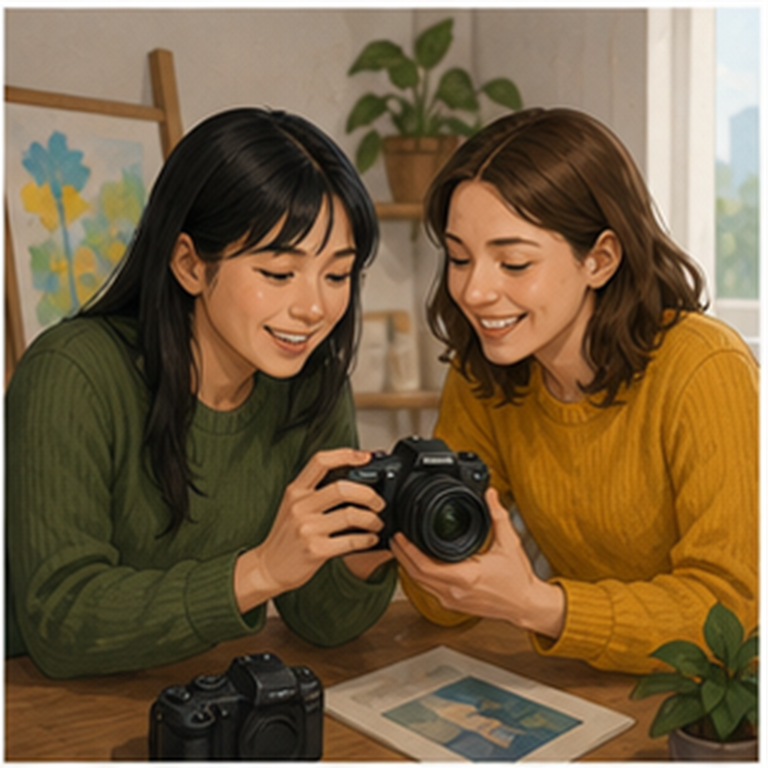

**Ví dụ:**

* **We have the same interest.**
  — Chúng ta có cùng sở thích.

Tự nhiên hơn khi nói về nhiều sở thích:

* **We have the same interests.**
* **We have similar interests.**

---

# 5. Bảng tổng hợp từ vựng

| Từ / cụm từ         | IPA                     | Nghĩa tiếng Việt      | Ví dụ ngắn                 |
| ------------------- | ----------------------- | --------------------- | -------------------------- |
| **since**           | /sɪns/                  | kể từ khi             | since I last saw you       |
| **last**            | /lɑːst/                 | lần cuối              | I last saw him yesterday.  |
| **month**           | /mʌnθ/                  | tháng                 | two months                 |
| **ago**             | /əˈɡəʊ/                 | cách đây              | two months ago             |
| **like**            | /laɪk/                  | thích                 | I like summer.             |
| **dislike**         | /dɪsˈlaɪk/              | không thích           | She dislikes driving.      |
| **stay**            | /steɪ/                  | ở lại, ở              | I don't like staying here. |
| **hope**            | /həʊp/                  | hy vọng               | I hope you like it.        |
| **tired of**        | /ˈtaɪəd əv/             | chán                  | I'm tired of homework.     |
| **collect**         | /kəˈlekt/               | sưu tầm               | I collect records.         |
| **record**          | /ˈrek.ɔːd/              | đĩa nhạc              | jazz records               |
| **classical music** | /ˈklæs.ɪ.kəl ˈmjuː.zɪk/ | nhạc cổ điển          | I like classical music.    |
| **video games**     | /ˈvɪd.i.əʊ ɡeɪmz/       | trò chơi điện tử      | I play video games.        |
| **choice**          | /tʃɔɪs/                 | lựa chọn              | That's my choice.          |
| **homework**        | /ˈhəʊm.wɜːk/            | bài tập về nhà        | I have homework.           |
| **jazz**            | /dʒæz/                  | nhạc jazz             | I listen to jazz.          |
| **rap**             | /ræp/                   | nhạc rap              | She's a fan of rap.        |
| **fan**             | /fæn/                   | người hâm mộ          | I'm a fan of jazz.         |
| **interest**        | /ˈɪn.trəst/             | sở thích, sự quan tâm | We have similar interests. |

---

# 6. Mẫu câu giao tiếp — Useful Structures

## 6.1. Nói mình thích điều gì


### **I like + danh từ**

* **I like summer best.**
  — Tôi thích mùa hè nhất.

* **I like jazz.**
  — Tôi thích nhạc jazz.

### **I like + V-ing**

* **I like swimming.**
* **I like reading.**

---

## 6.2. Nói mình rất thích một hoạt động


### **I love + V-ing**

* **I love going fishing.**
  — Tôi rất thích đi câu cá.

* **I love travelling.**
  — Tôi rất thích đi du lịch.

**love** thể hiện mức độ thích mạnh hơn **like**.

---

## 6.3. Dùng **enjoy**


### **I enjoy + V-ing**

* **I enjoy listening to classical music.**
* **I enjoy playing football.**
* **I enjoy watching movies.**

❌ **I enjoy to listen to music.**

✅ **I enjoy listening to music.**

> **enjoy** đi với **V-ing**, không dùng **to + V** trong cấu trúc này.

---

## 6.4. Nói mình quan tâm đến điều gì


### **I'm interested in + danh từ / V-ing**

* **I'm interested in video games.**
* **I'm interested in photography.**
* **I'm interested in learning English.**

**Cấu trúc:**

`be interested in + noun / V-ing`

---

## 6.5. Nói ai đó rất thích một hoạt động


✅ **He loves swimming.**

✅ **He's really into swimming.**

✅ **He's a big fan of swimming.**


---

## 6.6. Nói lựa chọn ưu tiên bằng **prefer**


### **I prefer + A.**

* **I prefer the Daewoo Hotel.**
  — Tôi thích khách sạn Daewoo hơn.

### **I prefer A to B.**

* **I prefer French to English.**
  — Tôi thích tiếng Pháp hơn tiếng Anh.

**Cấu trúc:**

`prefer A to B`

Không dùng:

❌ `prefer A than B`

---

## 6.7. Nói mình thích một thứ hơn


### **I like + A + better.**

* **I like Spanish better.**
  — Tôi thích tiếng Tây Ban Nha hơn.

Nếu so sánh rõ hai thứ:

* **I like Spanish better than Italian.**

---

## 6.8. Nói mình thích cả hai

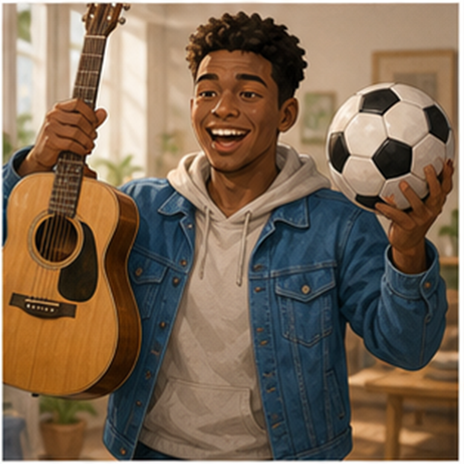

### **I like both of them.**

— Tôi thích cả hai.

Có thể nói:

* **I like both.**
* **I like both of them.**

---

## 6.9. Nói mình không thích

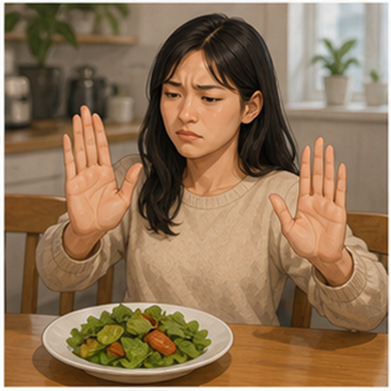

### **I don't like + noun / V-ing**

* **I don't like eating fish.**
* **I don't like horror movies.**

### **dislike + V-ing**

* **She dislikes driving.**

**don't like** phổ biến hơn trong hội thoại hằng ngày.

---

## 6.10. Nói mình rất ghét

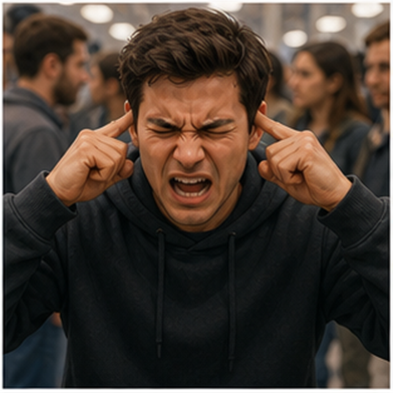

### **I hate + noun / V-ing**

* **I hate swimming.**
* **I hate waiting.**
* **I hate noisy places.**

> **hate** mạnh hơn **don't like** và **dislike**.

---

## 6.11. Nói mình đã chán điều gì


### **I'm tired of + noun / V-ing**

* **I'm tired of endless homework.**
* **I'm tired of staying at home.**
* **I'm tired of waiting.**

**Nghĩa:** Tôi đã chán / mệt mỏi với...

---

## 6.12. Nói mình không hứng thú

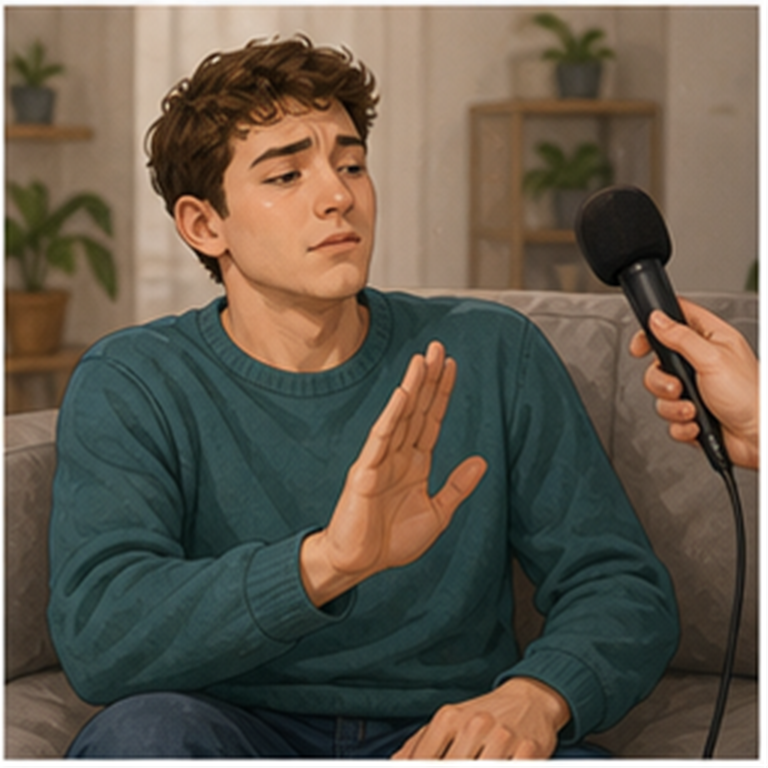

### **I'm not interested in + noun / V-ing**

* **I'm not interested in this kind of film.**
* **I'm not interested in football.**
* **I'm not interested in playing video games.**

---

## 6.13. Không thích cả hai lựa chọn

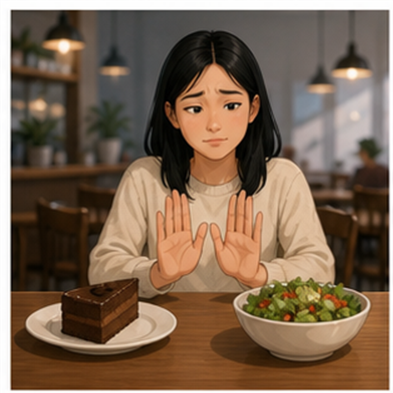

### **I like neither of them.**

— Tôi không thích cả hai lựa chọn đó.

Trong giao tiếp A1–A2, cách tự nhiên và dễ dùng hơn là:

* **I don't like either of them.**

Ví dụ:

**A:** Do you prefer tea or coffee?
**B:** I don't like either of them.

---

## 6.14. Dùng **neither ... nor ...**


### **Neither A nor B + động từ**

Câu mẫu:

**Neither Italian nor Korean is easy to me.**

Tự nhiên hơn:

✅ **Neither Italian nor Korean is easy for me.**

— Cả tiếng Ý lẫn tiếng Hàn đều không dễ đối với tôi.

**Cấu trúc:**

`Neither A nor B ...`

Ví dụ:

* **Neither tea nor coffee is my favorite.**
* **Neither swimming nor running interests me.**

---

## 6.15. Hỏi về sở thích âm nhạc

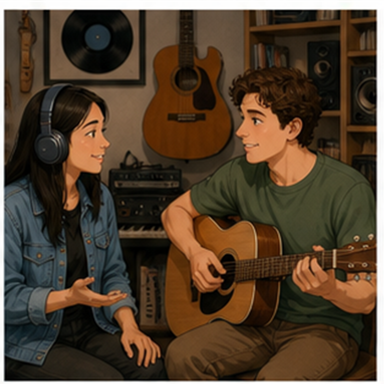

### **What type of music do you like?**

— Bạn thích thể loại nhạc nào?

Các cách khác:

* **What kind of music do you like?**
* **What music do you listen to?**
* **What's your favorite type of music?**

---

## 6.16. Hỏi người khác có thích một hoạt động không

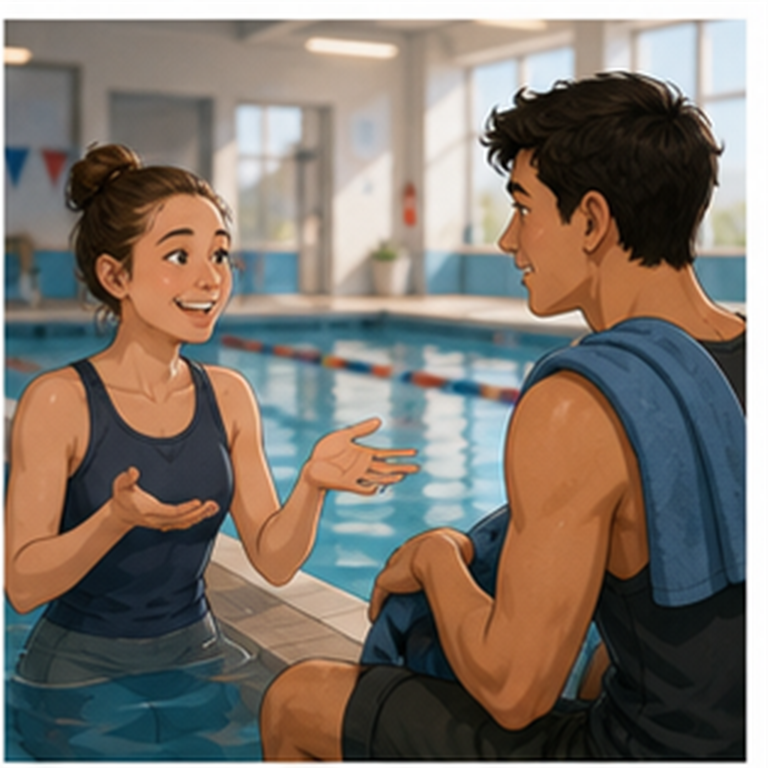

### **Do you enjoy + V-ing?**

* **Do you enjoy listening to those records?**
* **Do you enjoy swimming?**
* **Do you enjoy playing video games?**

Câu trả lời:

* **Yes, I do.**
* **Yes, I love it.**
* **Not really.**
* **No, I don't.**

---

## 6.17. Nói có cùng sở thích

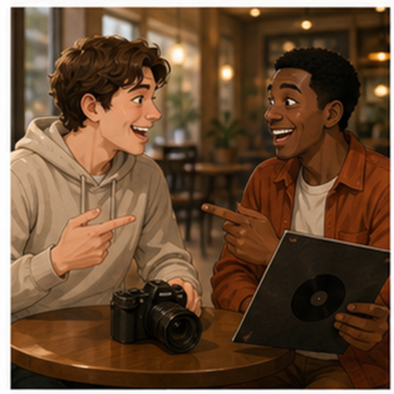


✅ **We have the same interests.**

✅ **We have similar interests.**

✅ **We both like jazz.**

---

# 7. Thang mức độ thích và không thích

```text
LOVE
  ↓
really like
  ↓
like
  ↓
don't mind
  ↓
don't really like
  ↓
dislike
  ↓
hate
```

| Mức độ          | Cách nói                    | Ví dụ                    |
| --------------- | --------------------------- | ------------------------ |
| Rất thích       | **I love ...**              | I love fishing.          |
| Rất thích       | **I'm really into ...**     | I'm really into jazz.    |
| Thích           | **I like ...**              | I like summer.           |
| Thích hoạt động | **I enjoy ...**             | I enjoy reading.         |
| Quan tâm        | **I'm interested in ...**   | I'm interested in games. |
| Không thích lắm | **I don't really like ...** | I don't really like rap. |
| Không thích     | **I don't like ...**        | I don't like fish.       |
| Không thích     | **I dislike ...**           | I dislike driving.       |
| Ghét            | **I hate ...**              | I hate waiting.          |
| Chán            | **I'm tired of ...**        | I'm tired of homework.   |

---

# 8. Phát âm trọng tâm

## 8.1. Âm /θ/ trong **month**

**month** /mʌnθ/

Âm cuối /θ/ được tạo bằng cách đặt đầu lưỡi nhẹ giữa hai hàm răng rồi đẩy hơi ra.

Không nên đọc thành:

`mon`

---

## 8.2. Âm /dʒ/ trong **enjoy**

**enjoy** /ɪnˈdʒɔɪ/

Phần **j** được phát âm /dʒ/.

---

## 8.3. Trọng âm

* dis-**LIKE**
* en-**JOY**
* in-**TER**-est
* col-**LECT**
* clas-si-cal **MU**-sic
* **VI**-de-o games

---

## 8.4. Phát âm **interested**

**interested**

/ˈɪn.trə.stɪd/

Không cần phát âm từng chữ thành:

`in-ter-es-ted`

Hãy luyện theo cụm:

**I'm interested in ...**

---

# 9. Hội thoại thực tế — Real-Life Conversation

## Hội thoại 1 — Gặp lại bạn cũ và nói về nơi ở


**Hugo:** Hi, Amit. Where have you been? It's been a long time since I last saw you.
**Amit:** Yeah, long time no see. I moved to Kosei Street.
**Hugo:** What? You moved again? Do you like moving so much? I remember it was only two months ago that you last moved.
**Amit:** Yeah. I hate staying in the same place for too long.

### Cấu trúc chính

* **It's been a long time since ...**
* **Do you like + V-ing?**
* **I hate + V-ing.**

---

## Hội thoại 2 — Nói về sở thích âm nhạc

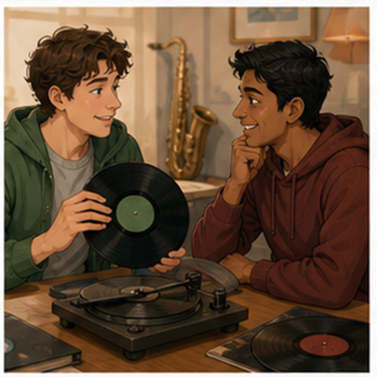

**Hugo:** My sister is a fan of rap. She has collected a lot of records. Do you enjoy listening to those records?
**Amit:** No, I don't. Those songs are just noise to me. What type of music do you like?
**Hugo:** I really enjoy listening to jazz.
**Amit:** Ah, we have the same interests!

### Sơ đồ hội thoại

```text
Nói sở thích của người khác
        ↓
Hỏi người đối diện
        ↓
Không thích
        ↓
Hỏi sở thích của người kia
        ↓
Trả lời
        ↓
Phát hiện sở thích chung
```

---

## Hội thoại 3 — Phiên bản mở rộng tự nhiên hơn

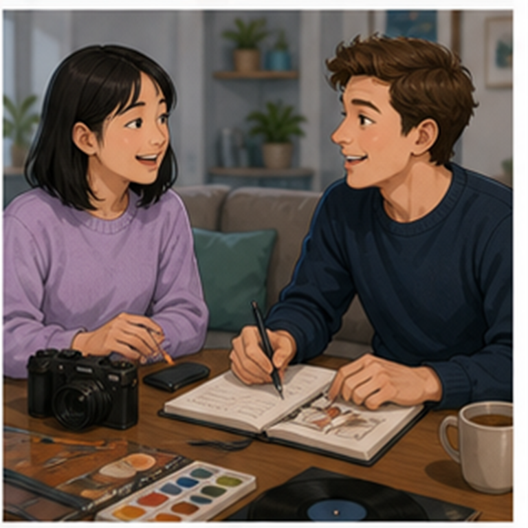

**Mai:** What kind of music do you like?
**Alex:** I really enjoy listening to jazz. How about you?
**Mai:** I'm more interested in classical music.
**Alex:** Do you like rap?
**Mai:** Not really. I don't like it very much.
**Alex:** Me neither. What about movies?
**Mai:** I love science-fiction films.
**Alex:** Really? Me too! We have similar interests.

---

# 10. Natural Expressions — Cách nói tự nhiên

| Cụm từ                            | Nghĩa                            | Khi dùng               |
| --------------------------------- | -------------------------------- | ---------------------- |
| **I like ...**                    | Tôi thích...                     | Sở thích nói chung     |
| **I love ...**                    | Tôi rất thích...                 | Sở thích mạnh          |
| **I enjoy ...**                   | Tôi thích / tận hưởng...         | Hoạt động              |
| **I'm interested in ...**         | Tôi quan tâm đến...              | Chủ đề / hoạt động     |
| **I'm really into ...**           | Tôi cực kỳ thích...              | Giao tiếp thân mật     |
| **I'm a big fan of ...**          | Tôi rất thích...                 | Nhạc, phim, thể thao   |
| **I prefer A to B.**              | Tôi thích A hơn B.               | So sánh                |
| **I like both.**                  | Tôi thích cả hai.                | Hai lựa chọn           |
| **Not really.**                   | Không hẳn / không thích lắm.     | Từ chối nhẹ            |
| **I don't really like ...**       | Tôi không thích lắm...           | Không thích nhẹ        |
| **I hate ...**                    | Tôi ghét...                      | Không thích mạnh       |
| **I'm tired of ...**              | Tôi chán...                      | Chán sau một thời gian |
| **Me too.**                       | Tôi cũng vậy.                    | Cùng sở thích          |
| **Me neither.**                   | Tôi cũng không.                  | Cùng không thích       |
| **We have similar interests.**    | Chúng ta có sở thích giống nhau. | Tìm điểm chung         |
| **What kind of ... do you like?** | Bạn thích loại ... nào?          | Hỏi sở thích           |

---

# 11. Lỗi thường gặp — Common Mistakes

## Lỗi 1: Dùng động từ nguyên mẫu sau **enjoy**

❌ **I enjoy listen to music.**

❌ **I enjoy to listen to music.**

✅ **I enjoy listening to music.**

**Cấu trúc:**

`enjoy + V-ing`

---

## Lỗi 2: Quên **in** sau **interested**

❌ **I'm interested video games.**

✅ **I'm interested in video games.**

**Cấu trúc:**

`be interested in + noun / V-ing`

---

## Lỗi 3: Dùng sai với **prefer**

❌ **I prefer French than English.**

✅ **I prefer French to English.**

---

## Lỗi 4: Nói **I'm interesting in ...**

❌ **I'm interesting in jazz.**

✅ **I'm interested in jazz.**

* **interested** = cảm thấy quan tâm
* **interesting** = thú vị

Ví dụ:

* **I'm interested in this film.**
* **This film is interesting.**

---

## Lỗi 5: Sai cấu trúc **tired of**

❌ **I'm tired with homework.**

✅ **I'm tired of homework.**

✅ **I'm tired of doing homework.**

---

## Lỗi 6: Dùng **homeworks**

❌ **I have many homeworks.**

✅ **I have a lot of homework.**

**homework** là danh từ không đếm được.

---

## Lỗi 7: Dùng cách nói thiếu tự nhiên **swimming lover**

⚠️ **He's a swimming lover.**

Có thể hiểu nhưng không phải cách phổ biến.

Tự nhiên hơn:

✅ **He loves swimming.**

✅ **He's really into swimming.**

✅ **He's a big fan of swimming.**

---

## Lỗi 8: Dùng sai **easy to me**

❌ **English is easy to me.**

✅ **English is easy for me.**

Tương tự:

✅ **Neither Italian nor Korean is easy for me.**

---

## Lỗi 9: Nhầm **like** và **would like**

**I like coffee.**

= Tôi thích cà phê nói chung.

**I'd like some coffee.**

= Tôi muốn một ít cà phê lúc này.

Hai cấu trúc có ý nghĩa khác nhau.

---

# 12. Luyện tập có hướng dẫn

## Bài 1 — Nối từ với nghĩa

1. jazz
2. collect
3. dislike
4. homework
5. tired of
6. interest

A. bài tập về nhà
B. không thích
C. sở thích / sự quan tâm
D. sưu tầm
E. nhạc jazz
F. chán

<details>
<summary>Đáp án</summary>

1–E
2–D
3–B
4–A
5–F
6–C

</details>

---

## Bài 2 — Điền từ vào chỗ trống

Dùng:

`enjoy` · `interested` · `prefer` · `hate` · `both`

1. I ______ listening to jazz.
2. I'm ______ in video games.
3. I ______ French to English.
4. I ______ waiting for buses.
5. I like ______ of them.

<details>
<summary>Đáp án</summary>

1. enjoy
2. interested
3. prefer
4. hate
5. both

</details>

---

## Bài 3 — Chọn câu đúng

### 1. Bạn thích nghe nhạc cổ điển.

* A. I enjoy listen to classical music.
* B. I enjoy listening to classical music.
* C. I enjoy to listening classical music.

**Đáp án:** B

---

### 2. Bạn quan tâm đến trò chơi điện tử.

* A. I'm interested in video games.
* B. I'm interesting in video games.
* C. I'm interested video games.

**Đáp án:** A

---

### 3. Bạn thích tiếng Pháp hơn tiếng Anh.

* A. I prefer French than English.
* B. I prefer French to English.
* C. I prefer French with English.

**Đáp án:** B

---

### 4. Bạn không thích cả hai lựa chọn.

* A. I don't like either of them.
* B. I don't like neither of them.
* C. I like not both.

**Đáp án:** A

---

## Bài 4 — Hoàn thành hội thoại

**A:** What kind of music do you ______?
**B:** I really ______ listening to jazz.
**A:** Are you ______ in classical music?
**B:** A little, but I ______ jazz to classical music.
**A:** Really? I like jazz too.
**B:** Great! We have similar ______.

<details>
<summary>Đáp án</summary>

1. like
2. enjoy
3. interested
4. prefer
5. interests

</details>

---

# 13. Speaking Challenge — Thử thách nói

## Nhiệm vụ 1

Đọc hội thoại chính thành tiếng 2 lần.

* Lần 1: đọc chậm và rõ.
* Lần 2: đọc theo tốc độ giao tiếp tự nhiên.

---

## Nhiệm vụ 2

Hoàn thành các câu bằng thông tin thật của bạn:

* **I like __________.**
* **I love __________.**
* **I enjoy __________.**
* **I'm interested in __________.**
* **I don't like __________.**
* **I hate __________.**
* **I'm tired of __________.**

---

## Nhiệm vụ 3

Chọn một chủ đề:

* music;
* movies;
* sports;
* food;
* video games;
* books;
* travel;
* languages.

Sau đó nói ít nhất **5 câu** về sở thích của bạn.

Ví dụ:

> I really like music.
> I enjoy listening to jazz.
> I'm also interested in classical music.
> I don't really like heavy metal.
> I prefer jazz to rap.

---

## Nhiệm vụ 4

Tạo một hội thoại **8 lượt nói** có:

* 1 câu hỏi về sở thích;
* 1 câu **I like / I love**;
* 1 câu **I enjoy + V-ing**;
* 1 câu **I'm interested in ...**;
* 1 câu nói điều không thích;
* 1 câu **prefer A to B**;
* 1 câu thể hiện sở thích chung.

---

## Nhiệm vụ 5

Ghi âm **45–60 giây**, sau đó tự kiểm tra:

* [ ] Tôi dùng đúng **enjoy + V-ing**.
* [ ] Tôi dùng đúng **interested in**.
* [ ] Tôi dùng đúng **prefer A to B**.
* [ ] Tôi phân biệt được **like / dislike / hate**.
* [ ] Tôi có thể hỏi **What kind of ... do you like?**
* [ ] Tôi có thể nói ít nhất 5 câu liên tục về sở thích.

---

# 14. Practice Mission — Nhiệm vụ thực tế

Trong hôm nay, hãy hỏi một người về sở thích bằng công thức:

> **Ask → Answer → Ask for detail → Compare → Find common ground**

Ví dụ:

> **What kind of music do you like?**
> ↓
> **I enjoy listening to jazz.**
> ↓
> **Do you like classical music?**
> ↓
> **Yes, but I prefer jazz to classical music.**
> ↓
> **Really? I like jazz too!**
> ↓
> **We have similar interests.**

Sau đó viết một đoạn hội thoại của riêng bạn gồm **8 lượt nói**.

---

# 15. Tự đánh giá cuối bài

Đánh dấu khi bạn có thể thực hiện mà không nhìn bài:

* [ ] Tôi có thể nói ít nhất 5 sở thích của mình.
* [ ] Tôi có thể dùng **I like ...**
* [ ] Tôi có thể dùng **I love + V-ing**.
* [ ] Tôi có thể dùng **I enjoy + V-ing**.
* [ ] Tôi có thể nói **I'm interested in ...**
* [ ] Tôi có thể nói một điều mình không thích.
* [ ] Tôi biết khi nào dùng **hate**.
* [ ] Tôi có thể dùng **I'm tired of ...**
* [ ] Tôi có thể so sánh bằng **prefer A to B**.
* [ ] Tôi có thể nói mình thích cả hai.
* [ ] Tôi có thể hỏi người khác về sở thích.
* [ ] Tôi có thể tìm và nói về sở thích chung.
* [ ] Tôi có thể nói liên tục ít nhất 45 giây.

---

# 16. Câu hỏi mở cuối bài

**What are three things you really enjoy doing, and what is one thing you dislike or are tired of doing? Why?**

*Ba điều bạn thực sự thích làm là gì? Có một điều nào bạn không thích hoặc đã cảm thấy chán không? Tại sao?*

---

# 17. Ghi chú dành cho giảng viên

* **Module:** 01 — Connect / Kết nối và giao tiếp xã hội

* **Chủ điểm:** Like and Dislike

* **Thời lượng video:** 8–12 phút

* **Luyện nói:** 5–10 phút

* **Trọng tâm từ vựng:**

  * since
  * last
  * month
  * ago
  * like
  * dislike
  * stay
  * hope
  * tired of
  * collect
  * record
  * classical music
  * video games
  * choice
  * homework
  * jazz
  * rap
  * fan
  * interest

* **Trọng tâm phát âm:**

  * **month**
  * **enjoy**
  * **interested**
  * **dislike**
  * **collect**

* **Trọng tâm cấu trúc:**

  * I like ...
  * I love + V-ing.
  * I enjoy + V-ing.
  * I'm interested in ...
  * I'm a fan of ...
  * I prefer A to B.
  * I like A better.
  * I like both of them.
  * I don't like ...
  * I dislike + V-ing.
  * I hate + V-ing.
  * I'm tired of ...
  * I'm not interested in ...
  * I don't like either of them.
  * Neither A nor B ...
  * What type / kind of ... do you like?
  * Do you enjoy + V-ing?
  * We have similar interests.

* **Lưu ý ngôn ngữ:**

  * **enjoy** luôn nên được luyện cùng **V-ing**.
  * **interested in** cần có giới từ **in**.
  * Dạy rõ sự khác nhau giữa **interested** và **interesting**.
  * **I prefer A to B** là cấu trúc chuẩn, không dùng `than`.
  * **He's a swimming lover** trong bài có thể hiểu nhưng không tự nhiên; nên ưu tiên **He loves swimming** hoặc **He's a big fan of swimming**.
  * **Neither Italian nor Korean is easy to me** nên sửa thành **Neither Italian nor Korean is easy for me**.
  * **I really enjoyed listening to jazz** trong đoạn hội thoại mang thì quá khứ; nếu đang nói về sở thích hiện tại, nên dùng **I really enjoy listening to jazz**.
  * **We have the same interest** có thể dùng nếu nói về đúng một sở thích; trong giao tiếp chung, **We have the same interests** hoặc **We have similar interests** tự nhiên hơn.

* **Hoạt động gợi ý:**

  * Chia lớp thành từng cặp.
  * Mỗi học viên nhận một danh sách 5 sở thích ngẫu nhiên.
  * Hai người phải đặt câu hỏi để tìm ít nhất 2 sở thích giống nhau.
  * Không được đọc trực tiếp danh sách của mình.
  * Sau 2–3 phút, mỗi cặp báo cáo:

> **We both like ...**
> **We both enjoy ...**
> **Neither of us likes ...**

### Role-play mẫu

**Người A nhận:**

> Bạn thích jazz, bóng đá, trò chơi điện tử và đi câu cá. Bạn không thích nhạc rap.

**Người B nhận:**

> Bạn thích jazz, phim ảnh, đi bơi và đọc sách. Bạn không thích nhạc rap.

Hai người phải tìm ra:

* sở thích chung;
* một điều cả hai đều không thích;
* một sở thích khác nhau.

Phải sử dụng ít nhất:

* **What kind of ... do you like?**
* **I enjoy ...**
* **I'm interested in ...**
* **I prefer ...**
* **Me too / Me neither**
* **We have similar interests.**

---
