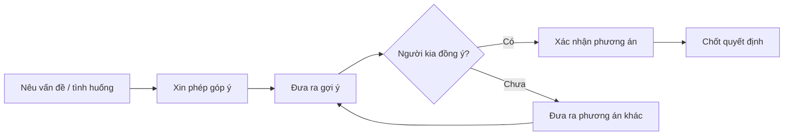
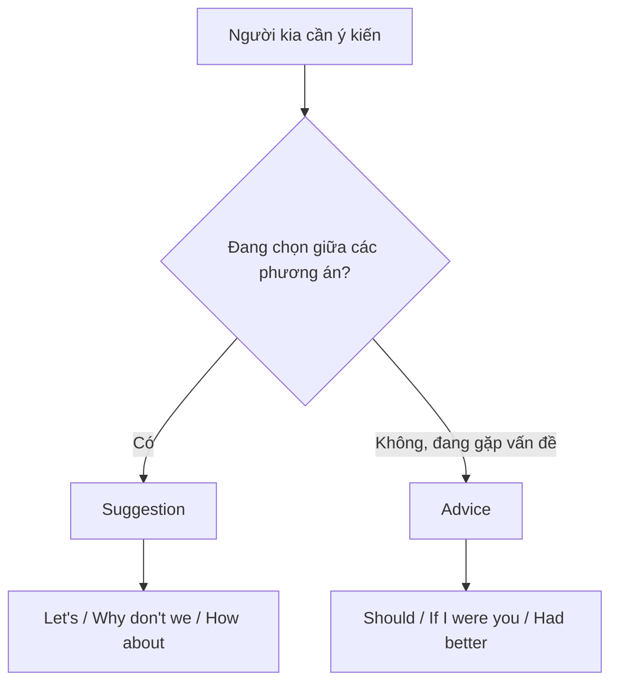

# LESSON 05 — ĐƯA RA GỢI Ý VÀ PHƯƠNG ÁN

> **Module 01 — Connect / Kết nối và giao tiếp xã hội**
> **Chủ đề:** Suggestions — Đưa ra gợi ý, đề xuất và lời khuyên
> **Trình độ gợi ý:** A1–A2
> **Thời lượng:** 8–12 phút học bài + 5–10 phút luyện nói

---

## 1. Tình huống thực tế

Trong cuộc sống hằng ngày, bạn thường cần đưa ra ý tưởng hoặc lời khuyên khi:

* cùng bạn bè quyết định sẽ làm gì;
* đề xuất một hoạt động;
* chọn thời gian thực hiện;
* góp thêm một ý kiến;
* khuyên ai đó thay đổi một thói quen;
* đưa ra phương án khi người khác gặp vấn đề;
* đồng ý hoặc phản hồi một đề xuất;
* đề nghị hoãn một việc sang ngày khác.

Bạn cần biết cách nói những câu như:

* **Why don't you ...?**
* **Let's ...**
* **How about ...?**
* **You should ...**
* **If I were you, I would ...**
* **Maybe you'd better ...**
* **Is it okay if ...?**


---

## 2. Mục tiêu bài học

Sau bài học, người học có thể:

1. Xin phép đưa ra ý kiến bằng **Do you mind if I make a suggestion?**
2. Thêm một ý tưởng bằng **I have another idea.**
3. Thêm một luận điểm bằng **I'd like to make one more point.**
4. Đưa ra gợi ý bằng **Why don't you + V ...?**
5. Đề xuất cùng làm một việc bằng **Let's + V ...**
6. Dùng **Let's ..., shall we?** để mời người khác cùng tham gia.
7. Đề xuất thay đổi thời gian bằng **Is it okay if ...?**
8. Đưa ra lời khuyên bằng **If I were you, I would ...**
9. Đưa ra lời khuyên với **should** và **had better**.
10. Phản hồi một ý tưởng bằng **That sounds interesting / good.**
11. Phân biệt **suggestion** và **advice**.
12. Duy trì một đoạn hội thoại 6–8 lượt để cùng đưa ra quyết định.

---

## 3. Sơ đồ giao tiếp



### Mẫu đơn giản

`What should we do?`
→ `I have another idea.`
→ `Why don't we do it tomorrow?`
→ `That sounds good.`
→ `Let's do that.`

---

# 4. Từ vựng trọng tâm — Core Vocabulary

## 4.1. **suggestion** /səˈdʒes.tʃən/

**Nghĩa:** lời gợi ý, đề xuất
**Từ loại:** danh từ


**Ví dụ:**

* **Can I make a suggestion?**
  — Tôi có thể đưa ra một gợi ý không?

* **That's a good suggestion.**
  — Đó là một đề xuất hay.

### Cụm quan trọng

* **make a suggestion** — đưa ra một gợi ý
* **accept a suggestion** — chấp nhận một gợi ý

---

## 4.2. **another** /əˈnʌð.ər/

**Nghĩa:** một cái khác, thêm một


**Ví dụ:**

* **I have another idea.**
  — Tôi có một ý tưởng khác.

* **Let's try another restaurant.**
  — Hãy thử một nhà hàng khác.

---

## 4.3. **grandparents** /ˈɡræn.peə.rənts/

**Nghĩa:** ông bà


**Ví dụ:**

* **Why don't you visit your grandparents?**
  — Sao bạn không đi thăm ông bà?

* **My grandparents live in the countryside.**
  — Ông bà tôi sống ở vùng quê.

---

## 4.4. **bring** /brɪŋ/

**Nghĩa:** mang, đem theo


**Ví dụ:**

* **You should bring an umbrella.**
  — Bạn nên mang theo ô.

* **Don't forget to bring your book.**
  — Đừng quên mang sách của bạn.

---

## 4.5. **pick** /pɪk/

**Nghĩa:** chọn; hái; nhặt


**Ví dụ:**

* **You can pick one.**
  — Bạn có thể chọn một cái.

* **Let's pick another place.**
  — Hãy chọn một nơi khác.

---

## 4.6. **interesting** /ˈɪn.trə.stɪŋ/

**Nghĩa:** thú vị


**Ví dụ:**

* **That sounds interesting.**
  — Nghe thú vị đấy.

* **It's an interesting idea.**
  — Đó là một ý tưởng thú vị.

---

## 4.7. **enjoy** /ɪnˈdʒɔɪ/

**Nghĩa:** thích, tận hưởng


**Ví dụ:**

* **You should enjoy life.**
  — Bạn nên tận hưởng cuộc sống.

* **I enjoy travelling.**
  — Tôi thích đi du lịch.

**Cấu trúc:**

`enjoy + V-ing`

---

## 4.8. **hate** /heɪt/

**Nghĩa:** ghét, rất không thích


**Ví dụ:**

* **If you hate your job, you won't be happy.**
  — Nếu bạn ghét công việc của mình, bạn sẽ không hạnh phúc.

* **I hate waiting.**
  — Tôi ghét phải chờ đợi.

---

## 4.9. **everything** /ˈev.ri.θɪŋ/

**Nghĩa:** mọi thứ


**Ví dụ:**

* **You don't have to change everything.**
  — Bạn không cần thay đổi mọi thứ.

* **Everything looks fine.**
  — Mọi thứ trông ổn.

---

## 4.10. **right** /raɪt/

**Nghĩa trong bài:** đúng, phù hợp


**Ví dụ:**

* **I think you're right.**
  — Tôi nghĩ bạn đúng.

* **That's the right choice.**
  — Đó là lựa chọn đúng.

---

## 4.11. **motorbike** /ˈməʊ.tə.baɪk/

**Nghĩa:** xe máy


**Ví dụ:**

* **Why don't you buy a new motorbike?**
  — Sao bạn không mua một chiếc xe máy mới?

* **He goes to work by motorbike.**
  — Anh ấy đi làm bằng xe máy.

---

## 4.12. **put on** /pʊt ɒn/

**Nghĩa:** mặc vào, đeo vào


**Ví dụ:**

* **Why don't you put on the new shirt?**
  — Sao bạn không mặc chiếc áo mới?

* **Put on your jacket.**
  — Hãy mặc áo khoác vào.

> **Phân biệt:**
> **put on** = hành động mặc vào
> **wear** = đang mặc

---

## 4.13. **shirt** /ʃɜːt/

**Nghĩa:** áo sơ mi


**Ví dụ:**

* **That's a nice shirt.**
  — Đó là một chiếc áo đẹp.

* **Why don't you wear your new shirt?**
  — Sao bạn không mặc chiếc áo mới?

---

## 4.14. **tomorrow** /təˈmɒr.əʊ/

**Nghĩa:** ngày mai


**Ví dụ:**

* **Is it okay if we do it tomorrow?**
  — Chúng ta làm việc đó vào ngày mai có được không?

* **I'll call you tomorrow.**
  — Tôi sẽ gọi cho bạn ngày mai.

---

## 4.15. **give up** /ɡɪv ʌp/

**Nghĩa:** từ bỏ


**Ví dụ:**

* **You should give up smoking.**
  — Bạn nên bỏ thuốc lá.

* **Don't give up.**
  — Đừng bỏ cuộc.

> **give up + V-ing** = từ bỏ một thói quen hoặc hoạt động.

---

## 4.16. **morning exercises** /ˈmɔː.nɪŋ ˈek.sə.saɪ.zɪz/

**Nghĩa:** bài tập thể dục buổi sáng


**Ví dụ:**

* **You should do morning exercises.**
  — Bạn nên tập thể dục buổi sáng.

* **I do morning exercises every day.**
  — Tôi tập thể dục buổi sáng mỗi ngày.

---

## 4.17. **too much** /tuː mʌtʃ/

**Nghĩa:** quá nhiều


**Ví dụ:**

* **Don't eat too much sweet food.**
  — Đừng ăn quá nhiều đồ ngọt.

* **You work too much.**
  — Bạn làm việc quá nhiều.

---

## 4.18. **point** /pɔɪnt/

**Nghĩa trong bài:** ý, luận điểm


**Ví dụ:**

* **I'd like to make one more point.**
  — Tôi muốn bổ sung thêm một ý nữa.

* **That's a good point.**
  — Đó là một ý hay.

---

# 5. Bảng tổng hợp từ vựng

| Từ / cụm từ           | IPA               | Nghĩa tiếng Việt    | Ví dụ ngắn               |
| --------------------- | ----------------- | ------------------- | ------------------------ |
| **suggestion**        | /səˈdʒes.tʃən/    | lời gợi ý           | I have a suggestion.     |
| **another**           | /əˈnʌð.ər/        | thêm một / cái khác | I have another idea.     |
| **grandparents**      | /ˈɡræn.peə.rənts/ | ông bà              | Visit your grandparents. |
| **bring**             | /brɪŋ/            | mang theo           | Bring an umbrella.       |
| **pick**              | /pɪk/             | chọn                | Pick one.                |
| **interesting**       | /ˈɪn.trə.stɪŋ/    | thú vị              | That sounds interesting. |
| **enjoy**             | /ɪnˈdʒɔɪ/         | tận hưởng, thích    | Enjoy your life.         |
| **hate**              | /heɪt/            | ghét                | I hate waiting.          |
| **everything**        | /ˈev.ri.θɪŋ/      | mọi thứ             | Everything is fine.      |
| **right**             | /raɪt/            | đúng                | You're right.            |
| **motorbike**         | /ˈməʊ.tə.baɪk/    | xe máy              | Buy a motorbike.         |
| **put on**            | /pʊt ɒn/          | mặc vào             | Put on your shirt.       |
| **shirt**             | /ʃɜːt/            | áo sơ mi            | a new shirt              |
| **tomorrow**          | /təˈmɒr.əʊ/       | ngày mai            | See you tomorrow.        |
| **give up**           | /ɡɪv ʌp/          | từ bỏ               | Give up smoking.         |
| **morning exercises** | —                 | thể dục buổi sáng   | Do morning exercises.    |
| **too much**          | /tuː mʌtʃ/        | quá nhiều           | Don't eat too much.      |
| **point**             | /pɔɪnt/           | ý, luận điểm        | One more point.          |

---

# 6. Mẫu câu giao tiếp — Useful Structures

## 6.1. Xin phép đưa ra một gợi ý


### **Do you mind if I make a suggestion?**

— Bạn có phiền nếu tôi đưa ra một gợi ý không?

Đây là cách nói lịch sự.

### Cách đơn giản hơn

* **Can I make a suggestion?**
* **May I suggest something?**
* **Can I give you an idea?**

### Cách phản hồi

**A:** Do you mind if I make a suggestion?
**B:** Not at all. Go ahead.

> Với **Do you mind ...?**, **Not at all** mang nghĩa “Không phiền đâu”.

---

## 6.2. Đưa ra thêm một ý tưởng


### **I have another idea.**

— Tôi có một ý tưởng khác.

Các cách tương tự:

* **I have an idea.**
* **Here's another idea.**
* **What about this?**

---

## 6.3. Thêm một luận điểm


### **I'd like to make one more point.**

— Tôi muốn bổ sung thêm một ý.

Thường dùng trong:

* thảo luận;
* họp nhóm;
* thuyết trình;
* tranh luận;
* cùng nhau đưa ra quyết định.

---

## 6.4. Gợi ý bằng **Why don't you ...?**


### **Why don't you + động từ nguyên mẫu?**

* **Why don't you buy a new motorbike?**
  — Sao bạn không mua một chiếc xe máy mới?

* **Why don't you put on the new shirt?**
  — Sao bạn không mặc chiếc áo mới?

* **Why don't you take a break?**
  — Sao bạn không nghỉ một chút?

> Mặc dù có dạng câu hỏi, **Why don't you ...?** thường được dùng để **đưa ra gợi ý**, không nhất thiết để hỏi lý do.

---

## 6.5. Đề xuất làm việc gì cùng nhau


### **Let's + động từ nguyên mẫu**

* **Let's do it now.**
  — Hãy làm ngay bây giờ.

* **Let's go home.**
  — Chúng ta về nhà nhé.

* **Let's try another idea.**
  — Hãy thử một ý tưởng khác.

**Let's** = **Let us**

---

## 6.6. Dùng **Let's ..., shall we?**


### **Let's + V ..., shall we?**

* **Let's sing an English song, shall we?**
  — Chúng ta hát một bài hát tiếng Anh nhé?

Cách khác:

### **Shall we + V ...?**

* **Shall we start?**
* **Shall we go?**
* **Shall we meet tomorrow?**

---

## 6.7. Đề xuất thay đổi thời gian


### **Is it okay if + mệnh đề?**

* **Is it okay if we do it tomorrow?**
  — Nếu chúng ta làm vào ngày mai thì có được không?

### **Is it all right if + mệnh đề?**

* **Is it all right if we go to see her tomorrow?**
  — Nếu ngày mai chúng ta đến thăm cô ấy thì có ổn không?

Hai cấu trúc này cũng có thể dùng để **xin phép**.

---

## 6.8. Đưa ra lời khuyên với **should**


### **You should + V**

* **You should do something interesting.**
  — Bạn nên làm điều gì đó thú vị.

* **You should enjoy life.**
  — Bạn nên tận hưởng cuộc sống.

* **You should get some rest.**
  — Bạn nên nghỉ ngơi một chút.

### Phủ định

**You shouldn't + V**

* **You shouldn't work too much.**
* **You shouldn't worry so much.**

---

## 6.9. Đưa ra lời khuyên bằng **If I were you**


### **If I were you, I would + V**

* **If I were you, I would give up smoking right now.**
  — Nếu tôi là bạn, tôi sẽ bỏ thuốc ngay bây giờ.

* **If I were you, I'd talk to my manager.**
  — Nếu tôi là bạn, tôi sẽ nói chuyện với quản lý.

**Cấu trúc:**

`If I were you, I would + verb`

Trong giao tiếp:

`I would` → `I'd`

---

## 6.10. Đưa ra lời khuyên với **had better**


Câu mẫu:

**Maybe you'd better go to visit Vietnam first.**

Tự nhiên hơn:

### **Maybe you'd better visit Vietnam first.**

— Có lẽ bạn nên đến Việt Nam trước.

**Cấu trúc:**

`had better + động từ nguyên mẫu`

Ví dụ:

* **You'd better leave now.**
* **You'd better get some sleep.**
* **You'd better check first.**

> **had better** thường mạnh hơn **should**, đôi khi ngụ ý rằng sẽ có hậu quả nếu không làm.

---

## 6.11. Khuyên ai đó không nên làm quá nhiều


Câu mẫu:

### **It's wrong to eat too much sweet food.**

— Ăn quá nhiều đồ ngọt là không tốt.

Trong hội thoại tự nhiên có thể nói:

* **You shouldn't eat too much sweet food.**
* **You shouldn't eat too many sweets.**
* **It's not good to eat too much sugar.**

---

## 6.12. Nói ý kiến cá nhân


### **It seems to me + mệnh đề**

* **It seems to me that everybody wants to make money.**

— Theo tôi thấy thì mọi người đều muốn kiếm tiền.

### **I think ...**

* **I think you should change jobs.**

### **I believe ...**

* **I believe you should do something interesting.**

Các cấu trúc này giúp lời khuyên bớt trực tiếp hơn.

---

# 7. Phân biệt Suggestion và Advice

## Suggestion — Gợi ý

Dùng khi có nhiều phương án và người nói đề xuất một lựa chọn.

Ví dụ:

* **Let's go tomorrow.**
* **Why don't we eat outside?**
* **How about watching a movie?**

## Advice — Lời khuyên

Dùng khi người khác có vấn đề và bạn cho rằng một hành động sẽ tốt cho họ.

Ví dụ:

* **You should get some rest.**
* **If I were you, I'd change jobs.**
* **You'd better see a doctor.**

### Sơ đồ



---

# 8. Mức độ của các cách đưa ra gợi ý

| Mẫu câu                    | Chức năng            | Sắc thái            |
| -------------------------- | -------------------- | ------------------- |
| **Let's ...**              | Rủ cùng làm          | Trực tiếp, thân mật |
| **Why don't we ...?**      | Gợi ý cho cả nhóm    | Tự nhiên            |
| **Why don't you ...?**     | Gợi ý cho người khác | Thân mật            |
| **How about + V-ing?**     | Đề xuất phương án    | Tự nhiên            |
| **Maybe we could ...**     | Gợi ý nhẹ            | Lịch sự             |
| **You should ...**         | Lời khuyên           | Trung tính          |
| **If I were you, I'd ...** | Lời khuyên           | Mềm, tự nhiên       |
| **You'd better ...**       | Lời khuyên mạnh      | Có tính cảnh báo    |

---

# 9. Phát âm trọng tâm

## 9.1. **suggestion**

**suggestion**
/səˈdʒes.tʃən/

Trọng âm:

sug-**GES**-tion

Không đọc thành từng chữ:

`su-ges-ti-on`

---

## 9.2. **interesting**

**interesting**
/ˈɪn.trə.stɪŋ/

Trọng âm rơi vào âm đầu:

**IN**-ter-est-ing

---

## 9.3. **enjoy**

**enjoy**
/ɪnˈdʒɔɪ/

Trọng âm:

en-**JOY**

---

## 9.4. **motorbike**

**motorbike**
/ˈməʊ.tə.baɪk/

Trọng âm chính:

**MO**-tor-bike

---

## 9.5. Nối âm trong câu

### **Why don't you ...?**

Trong hội thoại nhanh, **don't you** có thể nghe gần giống:

`don'tcha`

Không cần cố phát âm như vậy ngay, nhưng người học nên nhận diện khi nghe.

### **If I were you ...**

Nên luyện theo cả cụm:

`If-I-were-you`

thay vì đọc từng từ rời rạc.

---

# 10. Hội thoại thực tế — Real-Life Conversation

## Hội thoại chính — Đưa lời khuyên về công việc và cuộc sống


**Hugo:** It seems to me everybody wants to make money, and you do too.
**Amit:** It's true. I'm sure money is a good thing.
**Hugo:** I believe you should do something interesting. You should enjoy life. If you hate your job, you won't be happy.
**Amit:** That sounds interesting.

### Nội dung giao tiếp

```text
Nêu nhận xét
     ↓
Người kia xác nhận
     ↓
Đưa ra quan điểm
     ↓
Dùng should để khuyên
     ↓
Giải thích lý do
     ↓
Phản hồi lời khuyên
```

---

## Hội thoại 2 — Chọn thời gian thực hiện


**Mai:** We still need to finish the project.
**Alex:** Let's do it now.
**Mai:** I'm a little tired. Is it okay if we do it tomorrow?
**Alex:** Sure. What time should we meet?
**Mai:** How about ten o'clock?
**Alex:** That sounds good.
**Mai:** Great. Let's meet at the library.
**Alex:** Perfect. See you tomorrow.

---

## Hội thoại 3 — Đưa lời khuyên cho một người bạn


**Nam:** I'm really tired of my job.
**Linh:** Why?
**Nam:** I work too much, and I don't enjoy it anymore.
**Linh:** If I were you, I'd take a short break first.
**Nam:** That's a good idea.
**Linh:** You should also think about what kind of work you really enjoy.
**Nam:** Maybe you're right.
**Linh:** Don't make a decision too quickly.

---

# 11. Natural Expressions — Cách nói tự nhiên

| Cụm từ                       | Nghĩa                     | Khi dùng               |
| ---------------------------- | ------------------------- | ---------------------- |
| **I have an idea.**          | Tôi có một ý.             | Bắt đầu đề xuất        |
| **I have another idea.**     | Tôi có một ý khác.        | Thêm phương án         |
| **Can I make a suggestion?** | Tôi góp ý được không?     | Xin phép góp ý         |
| **Why don't we ...?**        | Sao chúng ta không...?    | Gợi ý cùng làm         |
| **Why don't you ...?**       | Sao bạn không...?         | Gợi ý cho người khác   |
| **Let's ...**                | Chúng ta hãy...           | Đề xuất trực tiếp      |
| **Shall we ...?**            | Chúng ta ... nhé?         | Đề xuất cùng làm       |
| **How about ...?**           | ... thì sao?              | Đề xuất phương án      |
| **Maybe we could ...**       | Có lẽ chúng ta có thể...  | Gợi ý nhẹ              |
| **You should ...**           | Bạn nên...                | Lời khuyên             |
| **If I were you, I'd ...**   | Nếu tôi là bạn, tôi sẽ... | Lời khuyên mềm         |
| **You'd better ...**         | Bạn nên...                | Lời khuyên mạnh        |
| **That sounds good.**        | Nghe ổn đấy.              | Đồng ý                 |
| **That sounds interesting.** | Nghe thú vị đấy.          | Phản hồi tích cực      |
| **That's a good idea.**      | Đó là ý hay.              | Đồng ý                 |
| **Maybe you're right.**      | Có lẽ bạn đúng.           | Chấp nhận lời khuyên   |
| **I'm not sure about that.** | Tôi chưa chắc về điều đó. | Không hoàn toàn đồng ý |
| **What about another idea?** | Một ý khác thì sao?       | Muốn phương án khác    |

---

# 12. Lỗi thường gặp — Common Mistakes

## Lỗi 1: Dùng sai sau **Why don't you**

❌ **Why don't you buying a new motorbike?**

✅ **Why don't you buy a new motorbike?**

**Cấu trúc:**

`Why don't you + V nguyên mẫu?`

---

## Lỗi 2: Dùng **to** sau **Let's**

❌ **Let's to do it now.**

✅ **Let's do it now.**

**Cấu trúc:**

`Let's + V nguyên mẫu`

---

## Lỗi 3: Dùng sai **If I were you**

❌ **If I am you, I will quit.**

✅ **If I were you, I would quit.**

Cấu trúc cố định thường dùng để đưa lời khuyên:

`If I were you, I would + V`

---

## Lỗi 4: Dùng **to** sau **had better**

❌ **You'd better to go home.**

✅ **You'd better go home.**

**Cấu trúc:**

`had better + V nguyên mẫu`

---

## Lỗi 5: Nhầm **suggest** và **suggestion**

### **suggestion** = danh từ

✅ **I have a suggestion.**

### **suggest** = động từ

✅ **I suggest taking a break.**

❌ **I suggestion taking a break.**

---

## Lỗi 6: Dùng **suggest to do**

❌ **I suggest to go tomorrow.**

Tự nhiên hơn:

✅ **I suggest going tomorrow.**

✅ **I suggest that we go tomorrow.**

---

## Lỗi 7: Dùng **too much** với danh từ đếm được số nhiều

❌ **too much sweets**

✅ **too many sweets**

Nhưng:

✅ **too much sugar**

✅ **too much sweet food**

### Quy tắc

* **too much + danh từ không đếm được**
* **too many + danh từ đếm được số nhiều**

---

## Lỗi 8: Dùng lời khuyên quá mạnh

**You'd better quit your job.**

có thể nghe khá mạnh.

Nếu chỉ muốn đề xuất nhẹ:

✅ **Maybe you should think about changing jobs.**

✅ **If I were you, I'd consider another job.**

---

## Lỗi 9: Nhầm **put on** và **wear**

**Put on your shirt.**

= Hãy mặc áo vào.

**You're wearing a shirt.**

= Bạn đang mặc áo.

---

# 13. Luyện tập có hướng dẫn

## Bài 1 — Nối từ với nghĩa

1. suggestion
2. another
3. motorbike
4. put on
5. give up
6. interesting

A. thú vị
B. từ bỏ
C. mặc vào
D. xe máy
E. một cái khác / thêm một
F. lời gợi ý

<details>
<summary>Đáp án</summary>

1–F
2–E
3–D
4–C
5–B
6–A

</details>

---

## Bài 2 — Điền từ vào chỗ trống

Dùng:

`suggestion` · `another` · `tomorrow` · `give up` · `interesting`

1. Can I make a __________?
2. I have __________ idea.
3. Is it okay if we do it __________?
4. You should __________ smoking.
5. That sounds __________.

<details>
<summary>Đáp án</summary>

1. suggestion
2. another
3. tomorrow
4. give up
5. interesting

</details>

---

## Bài 3 — Chọn câu đúng

### 1. Bạn muốn gợi ý ai đó mua xe máy mới.

* A. Why don't you buy a new motorbike?
* B. Why don't you buying a new motorbike?
* C. Why you don't buy a new motorbike?

**Đáp án:** A

---

### 2. Bạn muốn rủ cả nhóm bắt đầu ngay.

* A. Let's to do it now.
* B. Let's doing it now.
* C. Let's do it now.

**Đáp án:** C

---

### 3. Bạn muốn đưa ra lời khuyên nhẹ.

* A. If I were you, I'd take a break.
* B. If I am you, I'll take a break.
* C. If I was you, I take a break.

**Đáp án:** A

---

### 4. Bạn muốn khuyên người khác ngủ sớm.

* A. You'd better to go to bed early.
* B. You'd better go to bed early.
* C. You better going to bed early.

**Đáp án:** B

---

## Bài 4 — Chọn **Suggestion** hay **Advice**

1. **Let's go to the cinema.**
2. **You should drink more water.**
3. **Why don't we meet tomorrow?**
4. **If I were you, I'd talk to the teacher.**
5. **How about having lunch outside?**

<details>
<summary>Đáp án</summary>

1. Suggestion
2. Advice
3. Suggestion
4. Advice
5. Suggestion

</details>

---

## Bài 5 — Hoàn thành hội thoại

**A:** I don't know what to do this weekend.
**B:** Why don't you __________ your grandparents?
**A:** That's a good __________.
**B:** Or we could go somewhere together.
**A:** How about going on Sunday?
**B:** Sunday works for me. __________ meet in the morning.
**A:** Great. That __________ good.

<details>
<summary>Đáp án gợi ý</summary>

1. visit
2. idea
3. Let's
4. sounds

</details>

---

# 14. Speaking Challenge — Thử thách nói

## Nhiệm vụ 1

Đọc các mẫu câu sau thành tiếng:

* **Can I make a suggestion?**
* **Why don't you take a break?**
* **Let's do it tomorrow.**
* **How about going out?**
* **You should get some rest.**
* **If I were you, I'd wait.**
* **That sounds like a good idea.**

Đọc mỗi câu 2 lần:

* lần 1 chậm và rõ;
* lần 2 với tốc độ hội thoại tự nhiên.

---

## Nhiệm vụ 2 — Tạo 5 gợi ý

Dùng 5 cấu trúc khác nhau:

1. **Why don't you ...?**
2. **Let's ...**
3. **How about ...?**
4. **You should ...**
5. **If I were you, I'd ...**

Ví dụ:

> **Why don't you take a break?**

---

## Nhiệm vụ 3 — Giải quyết vấn đề

Chọn một tình huống:

* bạn của bạn học quá nhiều;
* bạn của bạn không thích công việc;
* cả nhóm chưa biết đi đâu cuối tuần;
* bạn cần chọn một nơi ăn tối;
* một người bạn muốn bỏ thuốc;
* cả nhóm chưa biết nên làm dự án hôm nay hay ngày mai.

Đưa ra ít nhất **3 phương án**.

---

## Nhiệm vụ 4 — Hội thoại 8 lượt

Tạo một đoạn hội thoại có ít nhất:

* 1 vấn đề;
* 1 câu **Can I make a suggestion?**
* 1 câu **Why don't you ...?**
* 1 câu **Let's ...**
* 1 câu **You should ...**
* 1 câu phản hồi như **That sounds good.**
* 1 phương án thay thế;
* 1 quyết định cuối cùng.

---

## Nhiệm vụ 5 — Ghi âm

Ghi âm từ **45–60 giây**, sau đó kiểm tra:

* [ ] Tôi dùng đúng **Why don't you + V**.
* [ ] Tôi dùng đúng **Let's + V**.
* [ ] Tôi dùng đúng **If I were you, I'd + V**.
* [ ] Tôi không dùng **to** sau **had better**.
* [ ] Tôi phân biệt được suggestion và advice.
* [ ] Tôi có thể đưa ra ít nhất 3 phương án.
* [ ] Tôi có thể phản hồi một lời đề xuất tự nhiên.

---

# 15. Practice Mission — Nhiệm vụ thực tế

Trong hôm nay, hãy giải quyết một tình huống bằng tiếng Anh theo công thức:

> **Problem → Suggestion → Response → Alternative → Decision**

Ví dụ:

> **I'm tired of staying at home.**
> ↓
> **Why don't we go somewhere tomorrow?**
> ↓
> **That sounds good.**
> ↓
> **How about visiting the museum?**
> ↓
> **Great idea. Let's go in the morning.**

Sau đó tự viết một hội thoại **8 lượt nói**.

---

# 16. Tự đánh giá cuối bài

Đánh dấu khi bạn có thể thực hiện mà không nhìn bài:

* [ ] Tôi có thể xin phép trước khi đưa ra một gợi ý.
* [ ] Tôi có thể nói **I have another idea.**
* [ ] Tôi có thể dùng **Why don't you ...?**
* [ ] Tôi có thể dùng **Why don't we ...?**
* [ ] Tôi có thể dùng **Let's + V**.
* [ ] Tôi có thể dùng **How about + V-ing?**
* [ ] Tôi có thể hỏi **Is it okay if ...?**
* [ ] Tôi có thể đưa lời khuyên bằng **should**.
* [ ] Tôi có thể dùng **If I were you, I'd ...**
* [ ] Tôi biết cách dùng **had better**.
* [ ] Tôi phân biệt được suggestion và advice.
* [ ] Tôi có thể đồng ý hoặc từ chối một đề xuất.
* [ ] Tôi có thể đề xuất một phương án khác.
* [ ] Tôi có thể duy trì hội thoại ít nhất 45 giây.

---

# 17. Câu hỏi mở cuối bài

**Imagine your friend says, “I work all the time, I don't enjoy my job, and I'm always tired.” What suggestions or advice would you give them?**

*Hãy tưởng tượng người bạn của bạn nói: “Tôi làm việc suốt ngày, tôi không thích công việc và lúc nào cũng mệt.” Bạn sẽ đưa ra những gợi ý hoặc lời khuyên nào?*

---

# 18. Ghi chú dành cho giảng viên

* **Module:** 01 — Connect / Kết nối và giao tiếp xã hội
* **Chủ điểm:** Suggestions
* **Thời lượng video:** 8–12 phút
* **Luyện nói:** 5–10 phút

### Trọng tâm từ vựng

* suggestion
* another
* grandparents
* bring
* pick
* interesting
* enjoy
* hate
* everything
* right
* motorbike
* put on
* shirt
* tomorrow
* give up
* morning exercises
* too much
* point

### Trọng tâm cấu trúc

* Do you mind if I make a suggestion?
* I have another idea.
* I'd like to make one more point.
* Why don't you + V ...?
* Why don't we + V ...?
* Let's + V.
* Let's ..., shall we?
* Shall we + V ...?
* Is it okay if ...?
* Is it all right if ...?
* You should + V.
* If I were you, I would + V.
* You'd better + V.
* It seems to me that ...
* I believe you should ...
* That sounds interesting.

### Trọng tâm phát âm

* **suggestion**
* **another**
* **interesting**
* **enjoy**
* **motorbike**
* **tomorrow**

### Lưu ý ngôn ngữ

* **Why don't you + V** dùng động từ nguyên mẫu, không dùng V-ing.
* **Let's + V**, không dùng `Let's to + V`.
* **If I were you, I'd ...** là mẫu chuẩn để đưa ra lời khuyên giả định.
* **had better** không đi với `to`.
* **had better** mạnh hơn **should**, vì vậy không nên dùng cho mọi lời khuyên.
* **I suggest going ...** hoặc **I suggest that we go ...** tự nhiên hơn `I suggest to go`.
* Cách nói **Maybe you'd better go to visit Vietnam first** có thể hiểu, nhưng tự nhiên hơn là **Maybe you'd better visit Vietnam first**.
* **It's wrong to eat too much sweet food** đúng về cơ bản nhưng hơi cứng. Với người học A1–A2, **You shouldn't eat too many sweets** hoặc **You shouldn't eat too much sugar** dễ sử dụng hơn.
* Cần giúp người học phân biệt:

  * **suggestion** = đưa ra một phương án;
  * **advice** = khuyên người khác nên làm gì vì điều đó tốt cho họ.

### Hoạt động gợi ý — Problem & Solution

Chia lớp thành cặp.

**Người A** nhận một vấn đề.

Ví dụ:

> Tôi học đến 2 giờ sáng mỗi ngày và lúc nào cũng mệt.

**Người B** phải đưa ít nhất 3 lời khuyên:

> **You should go to bed earlier.**
> **Why don't you make a study schedule?**
> **If I were you, I'd take more breaks.**

Người A phải phản hồi từng lời khuyên:

> **That's a good idea.**
> **I'm not sure about that.**
> **That sounds interesting.**

Sau đó hai người phải thống nhất **một phương án cuối cùng**.

### Role-play mẫu

**Người A nhận:**

> Bạn không thích công việc hiện tại nhưng sợ đổi việc.

**Người B nhận:**

> Hãy đưa lời khuyên nhưng không quyết định thay cho người A.

Phải sử dụng ít nhất:

* **Can I make a suggestion?**
* **You should ...**
* **If I were you, I'd ...**
* **Why don't you ...?**
* **That sounds ...**
* **Maybe ...**

---
