# LESSON 06 — TÌM ĐƯỜNG VÀ XÁC ĐỊNH ĐỊA ĐIỂM

> **Module 02 — Everyday Conversations / Những cuộc hội thoại thường ngày**
> **Chủ đề:** Asking the Way — Hỏi đường, chỉ đường và xác định vị trí
> **Trình độ gợi ý:** A1–A2
> **Thời lượng:** 8–12 phút học bài + 5–10 phút luyện nói

---

## 1. Tình huống thực tế

Trong cuộc sống hằng ngày, bạn thường cần hỏi đường hoặc xác định vị trí khi:

* tìm một công viên, nhà ga hoặc khách sạn;
* hỏi đường đến bảo tàng hoặc trung tâm thành phố;
* muốn biết một nơi cách đây bao xa;
* hỏi xem có thể đi bộ đến đó hay không;
* hỏi nên đi xe buýt nào;
* tìm điểm dừng xe buýt;
* hỏi nên xuống xe ở đâu;
* xác nhận mình có đang đi đúng đường không;
* hỏi đường ngắn hơn;
* chỉ cho người khác cách rẽ trái, rẽ phải hoặc đi thẳng.

Bạn cần biết cách nói những câu như:

* **Excuse me, where is the nearest park, please?**
* **Can you tell me the way to the station?**
* **How can I get to the park?**
* **Is this the right way to the station?**
* **How far is it?**
* **Can I go there on foot?**
* **Which bus should I take?**
* **Go straight and turn left.**

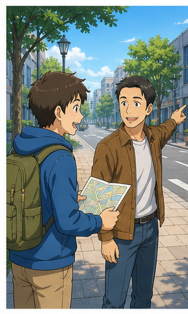

---

## 2. Mục tiêu bài học

Sau bài học, người học có thể:

1. Mở đầu lịch sự bằng **Excuse me**.
2. Hỏi vị trí bằng **Where is ...?**
3. Hỏi đường bằng **Can you tell me the way to ...?**
4. Hỏi cách đến một địa điểm bằng **How can I get to ...?**
5. Hỏi xem mình có đang đi đúng đường bằng **Is this the right way to ...?**
6. Hỏi khoảng cách bằng **How far is it?**
7. Hỏi thời gian di chuyển bằng **How long will it take me to get to ...?**
8. Hỏi phương tiện bằng **Can I take a bus there?**
9. Hỏi khả năng đi bộ bằng **Can I go there on foot?**
10. Chỉ đường bằng **go straight**, **turn left**, **turn right**.
11. Hướng dẫn đi xe buýt bằng **take bus number ...** và **get off at ...**.
12. Duy trì một đoạn hội thoại hỏi và chỉ đường ít nhất 6–8 lượt.

---

## 3. Sơ đồ giao tiếp

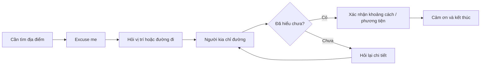

### Mẫu đơn giản

`Excuse me.`
→ `Can you tell me the way to the station?`
→ `Go straight and turn right.`
→ `How far is it?`
→ `About 200 meters.`
→ `Thank you.`

---

# 4. Từ vựng trọng tâm — Core Vocabulary

## 4.1. **excuse me** /ɪkˈskjuːz miː/

**Nghĩa:** xin lỗi / cho tôi hỏi

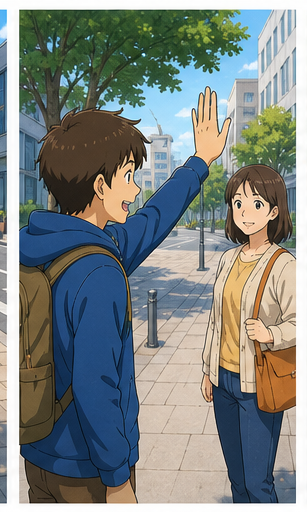

Dùng để thu hút sự chú ý của người khác một cách lịch sự.

**Ví dụ:**

* **Excuse me, where is the nearest park?**
  — Xin lỗi, công viên gần nhất ở đâu?

* **Excuse me, can you help me?**
  — Xin lỗi, bạn có thể giúp tôi không?

---

## 4.2. **the way to** /ðə weɪ tuː/

**Nghĩa:** đường đến...

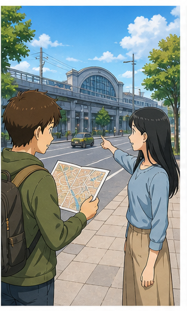

**Ví dụ:**

* **Can you tell me the way to the station?**
  — Bạn có thể chỉ cho tôi đường đến nhà ga không?

* **Do you know the way to the museum?**
  — Bạn có biết đường đến bảo tàng không?

---

## 4.3. **walk along** /wɔːk əˈlɒŋ/

**Nghĩa:** đi dọc theo

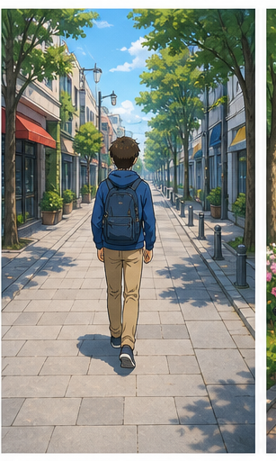

**Ví dụ:**

* **Walk along this street.**
  — Đi dọc theo con phố này.

* **Walk along the river for five minutes.**
  — Đi dọc theo con sông khoảng năm phút.

---

## 4.4. **park** /pɑːk/

**Nghĩa:** công viên

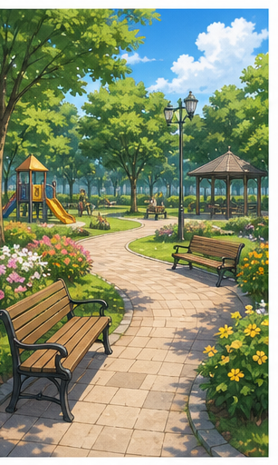

**Ví dụ:**

* **Where is the nearest park?**
  — Công viên gần nhất ở đâu?

* **The park is opposite the museum.**
  — Công viên nằm đối diện bảo tàng.

---

## 4.5. **street** /striːt/

**Nghĩa:** đường phố, con phố

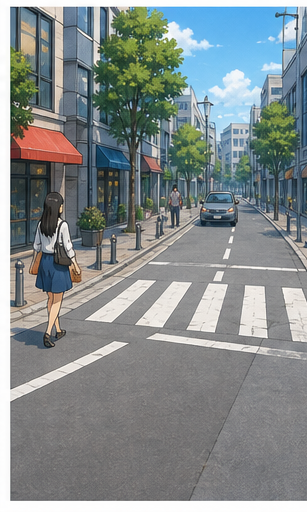

**Ví dụ:**

* **Walk along this street.**
  — Đi dọc theo con phố này.

* **The hotel is on King Street.**
  — Khách sạn nằm trên phố King.

---

## 4.6. **sea** /siː/

**Nghĩa:** biển

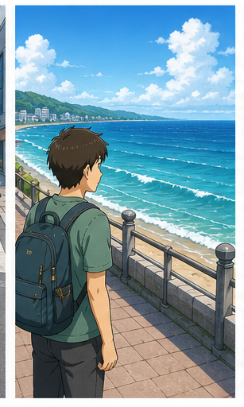

**Ví dụ:**

* **How long will it take me to get to the sea?**
  — Tôi sẽ mất bao lâu để đến biển?

* **The hotel is near the sea.**
  — Khách sạn ở gần biển.

---

## 4.7. **lake** /leɪk/

**Nghĩa:** hồ


**Ví dụ:**

* **The restaurant is near the lake.**
  — Nhà hàng ở gần hồ.

* **Walk around the lake.**
  — Đi vòng quanh hồ.

---

## 4.8. **center / centre** /ˈsen.tər/

**Nghĩa:** trung tâm

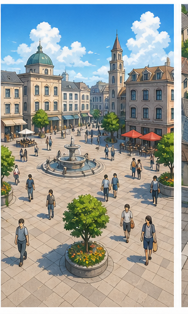

**Ví dụ:**

* **Does this bus go to the town center?**
  — Xe buýt này có đi đến trung tâm thị trấn không?

* **The hotel is in the city center.**
  — Khách sạn nằm ở trung tâm thành phố.

> **center** phổ biến trong tiếng Anh-Mỹ.
> **centre** phổ biến trong tiếng Anh-Anh.

---

## 4.9. **short way** /ʃɔːt weɪ/

**Nghĩa:** đường ngắn

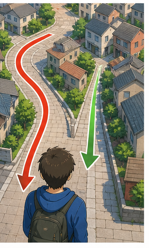

**Ví dụ:**

* **Is there a shorter way?**
  — Có đường nào ngắn hơn không?

* **This is the shortest way to the station.**
  — Đây là đường ngắn nhất đến nhà ga.

> Trong giao tiếp tự nhiên, **Is there a shorter way?** thường tự nhiên hơn **Is there a short way?**

---

## 4.10. **take a bus** /teɪk ə bʌs/

**Nghĩa:** đi xe buýt

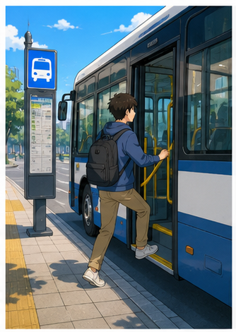

**Ví dụ:**

* **Can I take a bus there?**
  — Tôi có thể đi xe buýt đến đó không?

* **You can take bus number 30.**
  — Bạn có thể đi xe buýt số 30.

---

## 4.11. **on foot** /ɒn fʊt/

**Nghĩa:** đi bộ

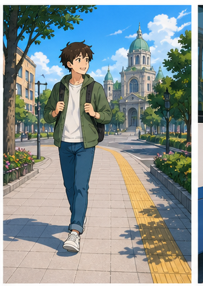

**Ví dụ:**

* **Can I go there on foot?**
  — Tôi có thể đi bộ đến đó không?

* **It's only ten minutes on foot.**
  — Chỉ mất khoảng mười phút đi bộ.

> Cách nói chuẩn là **on foot**, không phải **by foot**.

---

## 4.12. **get off** /ɡet ɒf/

**Nghĩa:** xuống xe

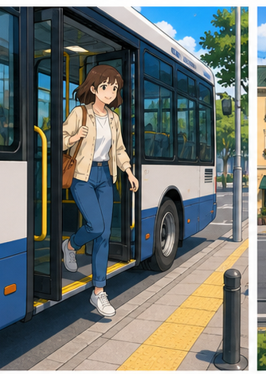

**Ví dụ:**

* **Get off at the terminal.**
  — Xuống xe ở bến cuối.

* **Where should I get off?**
  — Tôi nên xuống ở đâu?

---

## 4.13. **opposite** /ˈɒp.ə.zɪt/

**Nghĩa:** đối diện

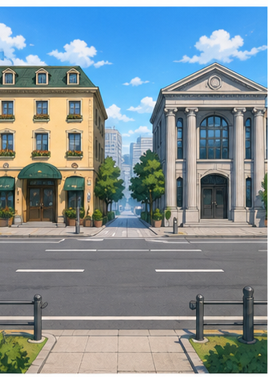

**Ví dụ:**

* **The bank is opposite the hotel.**
  — Ngân hàng nằm đối diện khách sạn.

* **The park is opposite the station.**
  — Công viên nằm đối diện nhà ga.

---

## 4.14. **turn right** /tɜːn raɪt/

**Nghĩa:** rẽ phải

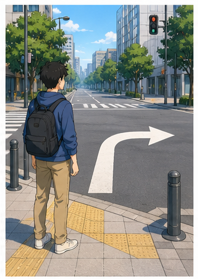

**Ví dụ:**

* **Turn right at the second crossing.**
  — Rẽ phải tại chỗ giao nhau thứ hai.

* **Turn right after the bank.**
  — Rẽ phải sau ngân hàng.

---

## 4.15. **turn left** /tɜːn left/

**Nghĩa:** rẽ trái

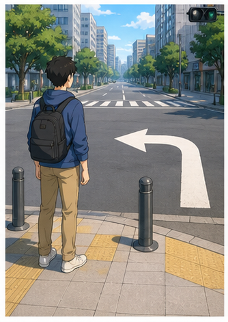

**Ví dụ:**

* **Go straight and turn left.**
  — Đi thẳng rồi rẽ trái.

* **Turn left at the traffic lights.**
  — Rẽ trái tại đèn giao thông.

---

## 4.16. **crossing** /ˈkrɒs.ɪŋ/

**Nghĩa:** chỗ giao nhau; chỗ sang đường

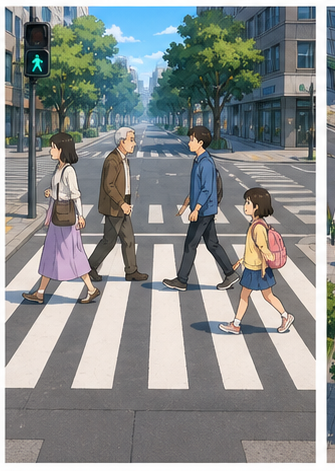

**Ví dụ:**

* **Turn right at the second crossing.**
  — Rẽ phải ở chỗ giao nhau thứ hai.

* **Use the pedestrian crossing.**
  — Hãy sử dụng vạch sang đường.

---

## 4.17. **crossroads** /ˈkrɒs.rəʊdz/

**Nghĩa:** ngã tư, nơi hai con đường giao nhau

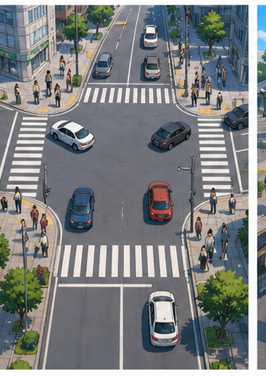

**Ví dụ:**

* **Turn left at the crossroads.**
  — Rẽ trái tại ngã tư.

* **The shop is just after the crossroads.**
  — Cửa hàng nằm ngay sau ngã tư.

---

## 4.18. **terminal** /ˈtɜː.mɪ.nəl/

**Nghĩa trong bài:** bến cuối

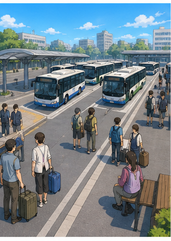

**Ví dụ:**

* **Get off at the terminal.**
  — Xuống xe tại bến cuối.

* **The bus terminal is near the station.**
  — Bến xe buýt ở gần nhà ga.

---

## 4.19. **nearest** /ˈnɪə.rɪst/

**Nghĩa:** gần nhất

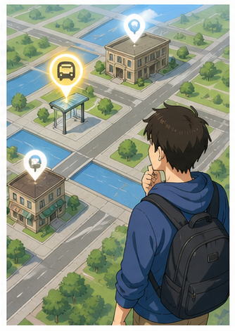

**Ví dụ:**

* **Where is the nearest park?**
  — Công viên gần nhất ở đâu?

* **What's the nearest bus stop?**
  — Điểm dừng xe buýt gần nhất ở đâu?

---

## 4.20. **station** /ˈsteɪ.ʃən/

**Nghĩa:** nhà ga, trạm


**Ví dụ:**

* **Can you tell me the way to the station?**
  — Bạn có thể chỉ đường đến nhà ga không?

* **The station is about 500 meters away.**
  — Nhà ga cách đây khoảng 500 mét.

---

# 5. Bảng tổng hợp từ vựng

| Từ / cụm từ     | IPA             | Nghĩa tiếng Việt      | Ví dụ ngắn              |
| --------------- | --------------- | --------------------- | ----------------------- |
| **excuse me**   | /ɪkˈskjuːz miː/ | xin lỗi / cho tôi hỏi | Excuse me, please.      |
| **the way to**  | /ðə weɪ tuː/    | đường đến             | the way to the station  |
| **walk along**  | /wɔːk əˈlɒŋ/    | đi dọc theo           | Walk along this street. |
| **park**        | /pɑːk/          | công viên             | the nearest park        |
| **street**      | /striːt/        | đường phố             | this street             |
| **sea**         | /siː/           | biển                  | get to the sea          |
| **lake**        | /leɪk/          | hồ                    | near the lake           |
| **center**      | /ˈsen.tər/      | trung tâm             | town center             |
| **shorter way** | /ˈʃɔː.tər weɪ/  | đường ngắn hơn        | Is there a shorter way? |
| **take a bus**  | /teɪk ə bʌs/    | đi xe buýt            | Take a bus.             |
| **on foot**     | /ɒn fʊt/        | đi bộ                 | Go there on foot.       |
| **get off**     | /ɡet ɒf/        | xuống xe              | Get off here.           |
| **opposite**    | /ˈɒp.ə.zɪt/     | đối diện              | opposite the hotel      |
| **turn right**  | /tɜːn raɪt/     | rẽ phải               | Turn right here.        |
| **turn left**   | /tɜːn left/     | rẽ trái               | Turn left here.         |
| **crossing**    | /ˈkrɒs.ɪŋ/      | chỗ giao nhau         | second crossing         |
| **crossroads**  | /ˈkrɒs.rəʊdz/   | ngã tư                | at the crossroads       |
| **terminal**    | /ˈtɜː.mɪ.nəl/   | bến cuối              | bus terminal            |
| **nearest**     | /ˈnɪə.rɪst/     | gần nhất              | nearest station         |
| **station**     | /ˈsteɪ.ʃən/     | nhà ga                | railway station         |

---

# 6. Mẫu câu giao tiếp — Useful Structures

## 6.1. Mở đầu lịch sự bằng **Excuse me**

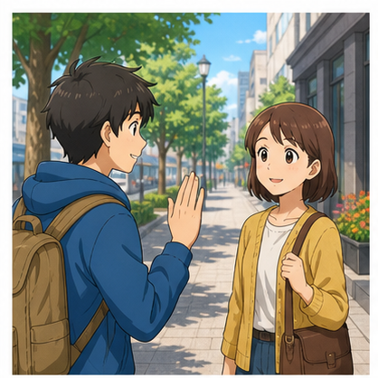

### **Excuse me, ...**

Dùng trước khi hỏi một người lạ.

* **Excuse me, where is the nearest park, please?**
* **Excuse me, can you help me?**
* **Excuse me, is this the right way to the station?**

> Khi hỏi đường người lạ, bắt đầu bằng **Excuse me** tự nhiên và lịch sự hơn việc hỏi trực tiếp.

---

## 6.2. Hỏi vị trí một địa điểm

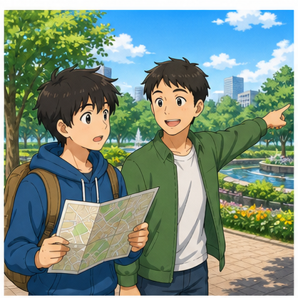

### **Where is + địa điểm?**

* **Where is the nearest park?**
  — Công viên gần nhất ở đâu?

* **Where is the bus stop?**
  — Điểm dừng xe buýt ở đâu?

* **Where is the Marriott Hotel?**
  — Khách sạn Marriott ở đâu?

### Lịch sự hơn

**Excuse me, where is the nearest park, please?**

---

## 6.3. Hỏi đường đến một địa điểm

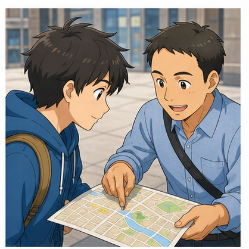

### **Can you tell me the way to + địa điểm?**

* **Can you tell me the way to the station?**
* **Can you tell me the way to the museum?**

Lịch sự hơn:

### **Could you tell me the way to ...?**

* **Could you tell me the way to the city center?**

---

## 6.4. Hỏi cách đến một nơi

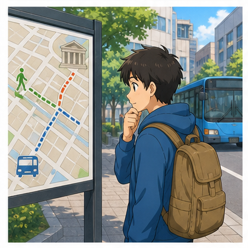

### **How can I get to + địa điểm?**

* **How can I get to the park?**
  — Tôi có thể đến công viên bằng cách nào?

* **How can I get to the airport?**
  — Tôi có thể đến sân bay bằng cách nào?

Đây là một trong những câu hỏi đường phổ biến nhất.

---

## 6.5. Xác nhận đang đi đúng đường

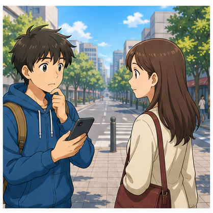

### **Is this the right way to + địa điểm?**

* **Is this the right way to the station?**
* **Is this the right way to the museum?**

— Đây có phải đường đúng đến ... không?

---

## 6.6. Chỉ dẫn rẽ phải

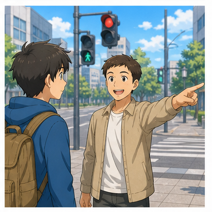

### **Turn right at + địa điểm / mốc**

* **Turn right at the second crossing.**
* **Turn right at the traffic lights.**
* **Turn right after the supermarket.**

---

## 6.7. Chỉ dẫn rẽ trái

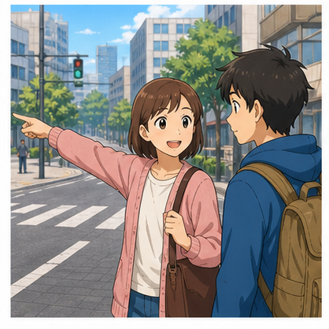

### **Turn left at + địa điểm / mốc**

* **Turn left at the crossroads.**
* **Turn left after the bank.**

Có thể kết hợp:

**Go straight and turn left.**

---

## 6.8. Yêu cầu đi thẳng

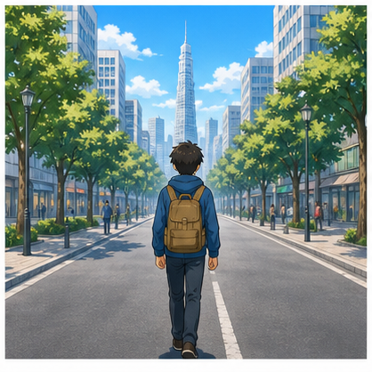

### **Go straight.**

— Đi thẳng.

Các cách mở rộng:

* **Go straight for about 200 meters.**
* **Go straight until you see the bank.**
* **Go straight and turn right.**

---

## 6.9. Hỏi khoảng cách

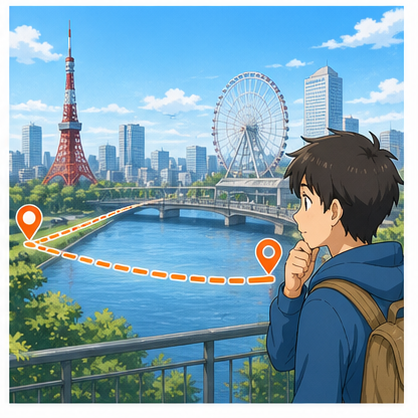

### **How far is it?**

— Nó cách đây bao xa?

Trả lời:

* **It's about 100 meters from here.**
* **It's about 200 meters from here.**
* **It's about two kilometers away.**

---

## 6.10. Hỏi thời gian di chuyển

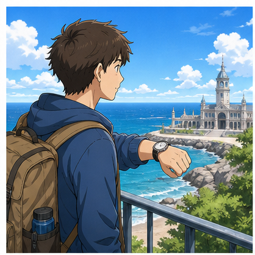

### **How long will it take me to get to + địa điểm?**

* **How long will it take me to get to the sea?**
* **How long will it take me to get to the station?**

Cách đơn giản hơn:

### **How long does it take to get there?**

— Mất bao lâu để đến đó?

---

## 6.11. Hỏi xe buýt có đi đến đâu không

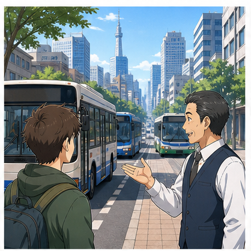

Câu mẫu:

### **Do these buses run to the center of the town?**

— Những xe buýt này có chạy đến trung tâm thị trấn không?

Trong hội thoại hiện đại, có thể nói đơn giản hơn:

* **Does this bus go to the town center?**
* **Does bus number 30 go to the city center?**

---

## 6.12. Hỏi đường ngắn hơn

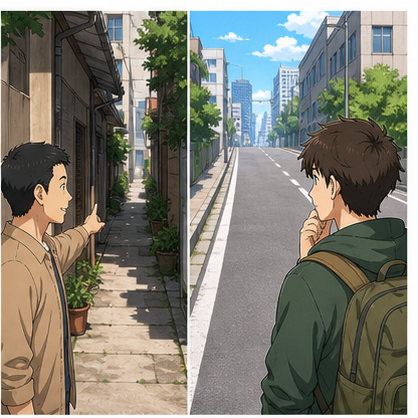

Câu mẫu:

**Is there a short way?**

Tự nhiên hơn:

### **Is there a shorter way?**

— Có đường nào ngắn hơn không?

Hoặc:

### **Is there a shortcut?**

— Có đường tắt không?

---

## 6.13. Hỏi có thể đi xe buýt không

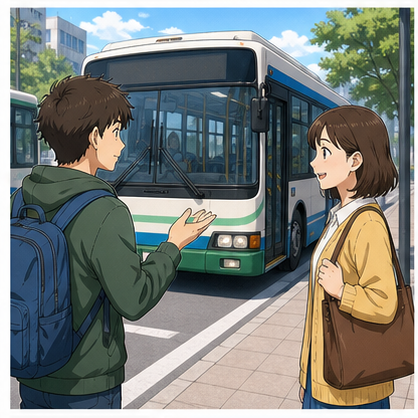

### **Can I take a bus there?**

— Tôi có thể đi xe buýt đến đó không?

Trả lời:

* **Yes. You can take bus number 30.**
* **No. It's easier to walk.**

---

## 6.14. Hỏi có thể đi bộ không


### **Can I go there on foot?**

— Tôi có thể đi bộ đến đó không?

Tự nhiên hơn nữa:

### **Can I walk there?**

### **Is it within walking distance?**

Câu cuối phù hợp hơn ở trình độ cao hơn.

---

## 6.15. Hướng dẫn đi xe buýt

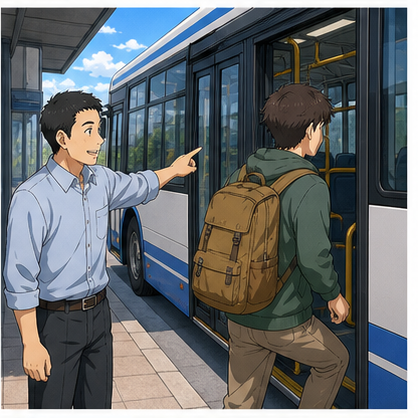

### **Take bus number + số**

* **Take bus number 32.**
* **Take the number 30 bus.**

Cả hai đều đúng.

---

## 6.16. Hướng dẫn xuống xe

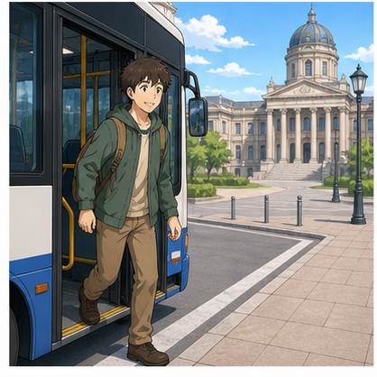

### **Get off at + địa điểm**

* **Get off at the terminal.**
* **Get off at the next stop.**
* **Get off at Central Station.**

Hỏi lại:

### **Where should I get off?**

— Tôi nên xuống ở đâu?

---

## 6.17. Hỏi nên đi xe buýt nào

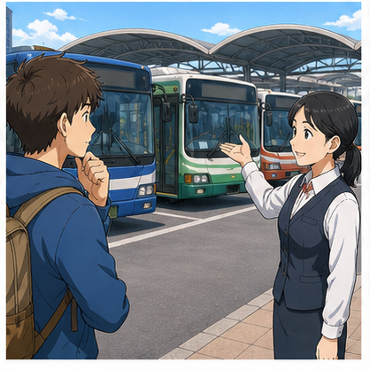

### **Which bus should I take?**

— Tôi nên đi xe buýt nào?

Câu mẫu trong bài:

**Which bus shall I take?**

Câu này đúng, đặc biệt trong tiếng Anh-Anh.

Trong giao tiếp hiện đại, **Which bus should I take?** phổ biến hơn.

---

## 6.18. Hỏi vị trí điểm dừng xe buýt


### **Where is the stop for bus number 30?**

— Điểm dừng xe buýt số 30 ở đâu?

Tự nhiên hơn:

### **Where is the bus stop for the number 30?**

Hoặc:

### **Where can I catch the number 30 bus?**

---

# 7. Phân biệt các câu hỏi đường quan trọng

## **Where is ...?**

Dùng khi chủ yếu muốn biết **vị trí**.

**Where is the museum?**

---

## **How can I get to ...?**

Dùng khi muốn biết **cách đi đến đó**.

**How can I get to the museum?**

---

## **Can you tell me the way to ...?**

Dùng khi muốn người khác **chỉ đường cụ thể**.

**Can you tell me the way to the museum?**

---

## **Is this the right way to ...?**

Dùng khi bạn **đã bắt đầu đi nhưng muốn xác nhận**.

**Is this the right way to the museum?**

### Sơ đồ

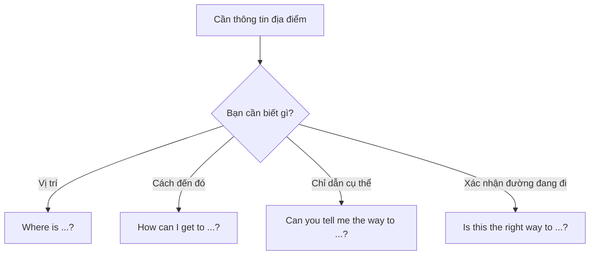

---

# 8. Các cách mô tả vị trí

| Cụm từ            | Nghĩa          | Ví dụ                                |
| ----------------- | -------------- | ------------------------------------ |
| **next to**       | bên cạnh       | The bank is next to the hotel.       |
| **opposite**      | đối diện       | The park is opposite the station.    |
| **near**          | gần            | It's near the museum.                |
| **between**       | ở giữa hai nơi | It's between the bank and the hotel. |
| **on the left**   | ở bên trái     | It's on your left.                   |
| **on the right**  | ở bên phải     | It's on your right.                  |
| **at the corner** | ở góc đường    | It's at the corner.                  |
| **across from**   | đối diện       | It's across from the park.           |
| **behind**        | phía sau       | It's behind the supermarket.         |
| **in front of**   | phía trước     | It's in front of the station.        |

---

# 9. Phát âm trọng tâm

## 9.1. **excuse**

**excuse me**
/ɪkˈskjuːz miː/

Trọng âm:

ex-**CUSE**

Nên luyện cả cụm:

`Excuse-me`

---

## 9.2. **station**

**station**
/ˈsteɪ.ʃən/

Trọng âm:

**STA**-tion

---

## 9.3. **opposite**

**opposite**
/ˈɒp.ə.zɪt/

Trọng âm:

**OP**-po-site

---

## 9.4. **terminal**

**terminal**
/ˈtɜː.mɪ.nəl/

Trọng âm:

**TER**-mi-nal

---

## 9.5. **crossing**

**crossing**
/ˈkrɒs.ɪŋ/

Trọng âm:

**CROSS**-ing

---

## 9.6. Nối âm trong câu hỏi đường

### **How can I get to ...?**

Nên luyện theo cụm:

`How-can-I-get-to`

Không cần ngắt từng từ.

### **Can you tell me ...?**

Trong hội thoại nhanh:

`Can-you-tell-me`

các từ thường nối với nhau.

### **Where is ...?**

Có thể nghe gần như:

`Where-riz`

do âm cuối và âm đầu nối với nhau.

---

# 10. Hội thoại thực tế — Real-Life Conversation

## Hội thoại chính — Tìm khách sạn

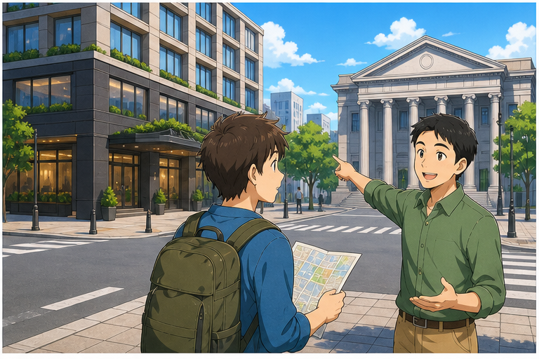

**Traveller:** Excuse me, can you tell me where the Marriott Hotel is?
**Local:** Sure. It's not far from here.
**Traveller:** How far is it?
**Local:** It's about 200 meters from here.
**Traveller:** Can I go there on foot?
**Local:** Yes. Go straight, then turn right at the first crossing.
**Traveller:** Is the hotel on the left or the right?
**Local:** It's on your left, opposite the bank.
**Traveller:** Great. Thank you very much.
**Local:** You're welcome.

### Nội dung giao tiếp

```text
Thu hút sự chú ý
        ↓
Hỏi vị trí
        ↓
Hỏi khoảng cách
        ↓
Hỏi có thể đi bộ không
        ↓
Nhận hướng dẫn
        ↓
Xác nhận vị trí
        ↓
Cảm ơn
```

---

## Hội thoại 2 — Tìm bảo tàng bằng xe buýt


**Tourist:** Excuse me, could you show me the way to the museum?
**Local:** You can take a bus there.
**Tourist:** Which bus should I take?
**Local:** Take the number 30 bus.
**Tourist:** Where is the stop for the number 30?
**Local:** Go straight and turn left at the traffic lights.
**Tourist:** Where should I get off?
**Local:** Get off at Museum Street. The museum is opposite the park.
**Tourist:** Okay, great. Thank you.
**Local:** No problem.

---

## Hội thoại 3 — Hỏi đường đến nhà ga

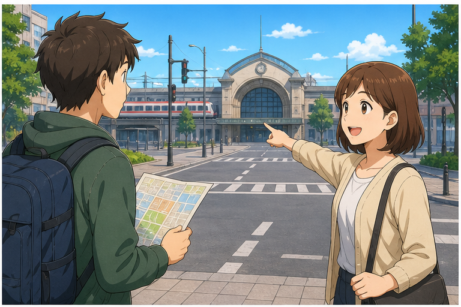

**Anna:** Excuse me, is this the right way to the station?
**Ben:** Yes, it is. Just keep going straight.
**Anna:** Is it far from here?
**Ben:** Not really. It's about 500 meters away.
**Anna:** Is there a shorter way?
**Ben:** Yes. Turn left at the next crossroads and walk along King Street.
**Anna:** Can I get there on foot in ten minutes?
**Ben:** Yes, easily.
**Anna:** Thanks for your help.
**Ben:** You're welcome.

---

# 11. Natural Expressions — Cách nói tự nhiên

| Cụm từ                              | Nghĩa                             | Khi dùng             |
| ----------------------------------- | --------------------------------- | -------------------- |
| **Excuse me.**                      | Xin lỗi / cho tôi hỏi             | Bắt đầu hỏi người lạ |
| **Could you help me?**              | Bạn giúp tôi được không?          | Xin trợ giúp         |
| **Where is ...?**                   | ... ở đâu?                        | Hỏi vị trí           |
| **How can I get to ...?**           | Tôi đến ... thế nào?              | Hỏi cách đi          |
| **Can you tell me the way to ...?** | Bạn chỉ đường đến ... được không? | Hỏi đường            |
| **Is this the right way to ...?**   | Đây có đúng đường đến ... không?  | Xác nhận             |
| **How far is it?**                  | Nó cách bao xa?                   | Hỏi khoảng cách      |
| **Is it far from here?**            | Có xa đây không?                  | Hỏi khoảng cách      |
| **Can I walk there?**               | Tôi đi bộ đến đó được không?      | Hỏi đi bộ            |
| **Which bus should I take?**        | Tôi nên đi xe nào?                | Hỏi phương tiện      |
| **Where should I get off?**         | Tôi nên xuống ở đâu?              | Đi xe buýt           |
| **Go straight.**                    | Đi thẳng.                         | Chỉ đường            |
| **Turn left.**                      | Rẽ trái.                          | Chỉ đường            |
| **Turn right.**                     | Rẽ phải.                          | Chỉ đường            |
| **It's on your left.**              | Nó ở bên trái bạn.                | Chỉ vị trí           |
| **It's on your right.**             | Nó ở bên phải bạn.                | Chỉ vị trí           |
| **It's opposite ...**               | Nó đối diện...                    | Mô tả vị trí         |
| **It's not far.**                   | Không xa đâu.                     | Trấn an              |
| **You can't miss it.**              | Bạn sẽ dễ thấy thôi.              | Chỉ nơi dễ nhận biết |
| **Thanks for your help.**           | Cảm ơn bạn đã giúp.               | Kết thúc             |
| **You're welcome.**                 | Không có gì.                      | Phản hồi             |

---

# 12. Lỗi thường gặp — Common Mistakes

## Lỗi 1: Dùng **by foot**

❌ **Can I go there by foot?**

✅ **Can I go there on foot?**

✅ **Can I walk there?**

### Quy tắc

`on foot`

nhưng:

* **by bus**
* **by car**
* **by train**
* **by taxi**

---

## Lỗi 2: Quên **to** trong **get to**

❌ **How can I get the park?**

✅ **How can I get to the park?**

### Cấu trúc

`get to + địa điểm`

---

## Lỗi 3: Dùng sai sau **How can I get to**

❌ **How can I get to there?**

✅ **How can I get there?**

Nhưng:

✅ **How can I get to the station?**

> Với **here / there / home**, thường không dùng **to**.

---

## Lỗi 4: Nói **turn to left**

❌ **Turn to left.**

✅ **Turn left.**

❌ **Turn to right.**

✅ **Turn right.**

---

## Lỗi 5: Nhầm **left** và **right**

* **left** = trái
* **right** = phải

Nên liên tưởng với tay trái và tay phải khi luyện.

---

## Lỗi 6: Dùng **How long** để hỏi khoảng cách

❌ **How long is the museum from here?**

Nếu hỏi khoảng cách:

✅ **How far is the museum from here?**

Nếu hỏi thời gian:

✅ **How long does it take to get to the museum?**

---

## Lỗi 7: Nhầm **crossing** và **crossroads**

**crossing** có thể là:

* nơi hai đường giao nhau;
* chỗ sang đường;
* pedestrian crossing.

**crossroads** thường là nơi hai con đường giao nhau, đặc biệt là ngã tư.

---

## Lỗi 8: Dùng **short way** khi muốn nói “đường ngắn hơn”

Có thể hiểu:

**Is there a short way?**

Nhưng tự nhiên hơn:

✅ **Is there a shorter way?**

Hoặc:

✅ **Is there a shortcut?**

---

## Lỗi 9: Hỏi người lạ quá trực tiếp

Có thể nghe hơi đột ngột:

**Where is the station?**

Tự nhiên hơn:

✅ **Excuse me, where is the station?**

Hoặc lịch sự hơn:

✅ **Excuse me, could you tell me where the station is?**

---

## Lỗi 10: Sai trật tự từ trong câu hỏi gián tiếp

❌ **Could you tell me where is the station?**

✅ **Could you tell me where the station is?**

### So sánh

Câu hỏi trực tiếp:

**Where is the station?**

Câu hỏi gián tiếp:

**Could you tell me where the station is?**

---

# 13. Luyện tập có hướng dẫn

## Bài 1 — Nối từ với nghĩa

1. opposite
2. terminal
3. on foot
4. turn right
5. crossing
6. station

A. rẽ phải
B. nhà ga
C. đối diện
D. đi bộ
E. bến cuối
F. chỗ giao nhau

<details>
<summary>Đáp án</summary>

1–C
2–E
3–D
4–A
5–F
6–B

</details>

---

## Bài 2 — Điền từ vào chỗ trống

Dùng:

`station` · `foot` · `right` · `terminal` · `opposite`

1. Can you tell me the way to the ________?
2. Can I go there on ________?
3. Turn ________ at the second crossing.
4. Get off at the ________.
5. The hotel is ________ the bank.

<details>
<summary>Đáp án</summary>

1. station
2. foot
3. right
4. terminal
5. opposite

</details>

---

## Bài 3 — Chọn câu đúng

### 1. Bạn muốn hỏi cách đến công viên.

* A. How can I get the park?
* B. How can I get to the park?
* C. How I can get to the park?

**Đáp án:** B

---

### 2. Bạn muốn hỏi có thể đi bộ không.

* A. Can I go there by foot?
* B. Can I go there with foot?
* C. Can I go there on foot?

**Đáp án:** C

---

### 3. Bạn muốn bảo ai đó rẽ trái.

* A. Turn left.
* B. Turn to left.
* C. Turn at left.

**Đáp án:** A

---

### 4. Bạn muốn hỏi khoảng cách.

* A. How long is it from here?
* B. How far is it from here?
* C. How much far is it?

**Đáp án:** B

---

## Bài 4 — Chọn câu hỏi phù hợp

### 1. Bạn muốn biết nhà ga ở đâu.

**Where is the station?**

### 2. Bạn muốn biết cách đến nhà ga.

**How can I get to the station?**

### 3. Bạn đang đi và muốn xác nhận đúng đường.

**Is this the right way to the station?**

### 4. Bạn muốn biết mất bao lâu.

**How long does it take to get to the station?**

### 5. Bạn muốn biết khoảng cách.

**How far is the station from here?**

---

## Bài 5 — Hoàn thành hội thoại

**A:** Excuse me. Can you tell me the ________ to the museum?
**B:** Sure. Go straight and turn ________ at the second crossing.
**A:** Is it far from here?
**B:** No. It's about 300 ________.
**A:** Can I go there on ________?
**B:** Yes. It'll take about five minutes.
**A:** Great. Thanks for your ________.
**B:** You're welcome.

<details>
<summary>Đáp án gợi ý</summary>

1. way
2. right / left
3. meters
4. foot
5. help

</details>

---

# 14. Speaking Challenge — Thử thách nói

## Nhiệm vụ 1

Đọc các mẫu câu sau thành tiếng:

* **Excuse me, where is the nearest park?**
* **Can you tell me the way to the station?**
* **How can I get to the museum?**
* **Turn right at the second crossing.**
* **Is this the right way to the station?**
* **How far is it from here?**
* **Can I go there on foot?**
* **Which bus should I take?**
* **Get off at the next stop.**

Đọc mỗi câu 2 lần:

* lần 1 chậm và rõ;
* lần 2 với tốc độ hội thoại tự nhiên.

---

## Nhiệm vụ 2 — Tạo 5 câu hỏi đường

Dùng 5 cấu trúc khác nhau:

1. **Where is ...?**
2. **Can you tell me the way to ...?**
3. **How can I get to ...?**
4. **Is this the right way to ...?**
5. **How far is ...?**

Ví dụ:

> **Excuse me, how can I get to the railway station?**

---

## Nhiệm vụ 3 — Chỉ đường

Hãy tưởng tượng một người hỏi:

> **Excuse me, how can I get to the museum?**

Bạn phải sử dụng ít nhất:

* **go straight**;
* **turn left / right**;
* một mốc như **bank / park / traffic lights**;
* một cụm vị trí như **opposite / next to**.

Ví dụ:

> **Go straight for about 200 meters. Turn right at the traffic lights. The museum is on your left, opposite the park.**

---

## Nhiệm vụ 4 — Hội thoại 8 lượt

Tạo một đoạn hội thoại có ít nhất:

* 1 câu **Excuse me**;
* 1 câu hỏi đường;
* 1 câu hỏi khoảng cách;
* 1 câu hỏi phương tiện;
* 1 câu **turn left / turn right**;
* 1 câu mô tả vị trí;
* 1 lời cảm ơn;
* 1 lời đáp.

---

## Nhiệm vụ 5 — Ghi âm

Ghi âm từ **45–60 giây**, sau đó kiểm tra:

* [ ] Tôi bắt đầu bằng **Excuse me**.
* [ ] Tôi dùng đúng **get to + place**.
* [ ] Tôi dùng đúng **on foot**.
* [ ] Tôi phân biệt **left** và **right**.
* [ ] Tôi dùng đúng **How far ...?**
* [ ] Tôi dùng đúng **How long ...?**
* [ ] Tôi có thể chỉ đường bằng ít nhất 3 bước.
* [ ] Tôi có thể hỏi lại khi chưa hiểu.

---

# 15. Practice Mission — Nhiệm vụ thực tế

Trong hôm nay, hãy luyện một tình huống theo công thức:

> **Excuse me → Ask the way → Get directions → Confirm → Thank**

Ví dụ:

> **Excuse me, can you tell me the way to the station?**
> ↓
> **Go straight and turn left at the second crossing.**
> ↓
> **Is it far from here?**
> ↓
> **No, it's about 300 meters.**
> ↓
> **Can I walk there?**
> ↓
> **Yes. It'll take about five minutes.**
> ↓
> **Thank you very much.**

Sau đó tự viết một hội thoại **8 lượt nói** cho một trong các địa điểm:

* nhà ga;
* bệnh viện;
* công viên;
* khách sạn;
* bảo tàng;
* nhà hàng;
* bến xe;
* trung tâm mua sắm.

---

# 16. Tự đánh giá cuối bài

Đánh dấu khi bạn có thể thực hiện mà không nhìn bài:

* [ ] Tôi có thể dùng **Excuse me** để bắt đầu hỏi người lạ.
* [ ] Tôi có thể hỏi **Where is ...?**
* [ ] Tôi có thể hỏi **Can you tell me the way to ...?**
* [ ] Tôi có thể hỏi **How can I get to ...?**
* [ ] Tôi có thể hỏi **Is this the right way to ...?**
* [ ] Tôi có thể hỏi **How far is it?**
* [ ] Tôi có thể hỏi **How long does it take?**
* [ ] Tôi có thể nói **go straight**.
* [ ] Tôi có thể nói **turn left**.
* [ ] Tôi có thể nói **turn right**.
* [ ] Tôi có thể dùng **opposite / next to / near**.
* [ ] Tôi có thể hỏi **Which bus should I take?**
* [ ] Tôi có thể nói **Get off at ...**
* [ ] Tôi biết dùng **on foot**, không dùng **by foot**.
* [ ] Tôi có thể duy trì hội thoại hỏi đường ít nhất 45 giây.

---

# 17. Câu hỏi mở cuối bài

**Imagine you are visiting a new city and need to get from your hotel to a museum. How would you ask a local person for directions, and what questions would you ask before leaving?**

*Hãy tưởng tượng bạn đang đến một thành phố mới và cần đi từ khách sạn đến bảo tàng. Bạn sẽ hỏi một người địa phương như thế nào và sẽ hỏi thêm những thông tin gì trước khi đi?*

---

# 18. Ghi chú dành cho giảng viên

* **Module:** 02 — Everyday Conversations / Những cuộc hội thoại thường ngày
* **Chủ điểm:** Asking the Way
* **Thời lượng video:** 8–12 phút
* **Luyện nói:** 5–10 phút

### Trọng tâm từ vựng

* excuse me
* the way to
* walk along
* park
* street
* sea
* lake
* center / centre
* shorter way
* take a bus
* on foot
* get off
* opposite
* turn right
* turn left
* crossing
* crossroads
* terminal
* nearest
* station

### Trọng tâm cấu trúc

* **Excuse me, where is ...?**
* **Can you tell me the way to ...?**
* **Could you tell me where ... is?**
* **How can I get to ...?**
* **Is this the right way to ...?**
* **Turn right at ...**
* **Turn left at ...**
* **Go straight.**
* **Walk along ...**
* **How far is it?**
* **How long does it take to get there?**
* **Can I take a bus there?**
* **Can I go there on foot?**
* **Which bus should I take?**
* **Take bus number ...**
* **Get off at ...**
* **Where should I get off?**
* **It's opposite ...**
* **It's on your left / right.**

### Trọng tâm phát âm

* **excuse**
* **station**
* **opposite**
* **terminal**
* **crossing**
* **right**
* **left**
* **nearest**

### Lưu ý ngôn ngữ

* Dùng **on foot**, không dùng `by foot`.
* Dùng **get to + địa điểm**:

  * **get to the station**
  * **get to the museum**
* Nhưng với **here / there / home**:

  * **get there**
  * **get here**
  * **get home**
* Dùng:

  * **turn left**
  * **turn right**

  Không dùng:

  * `turn to left`
  * `turn to right`
* **How far ...?** hỏi khoảng cách.
* **How long ...?** hỏi thời gian.
* Cách nói **Is there a short way?** có thể hiểu, nhưng trong hội thoại tự nhiên nên ưu tiên:

  * **Is there a shorter way?**
  * **Is there a shortcut?**
* Cách nói **Can I go there by foot?** chưa tự nhiên; cách chuẩn là:

  * **Can I go there on foot?**
  * **Can I walk there?**
* **Which bus shall I take?** đúng, đặc biệt trong tiếng Anh-Anh; với người học A1–A2 có thể ưu tiên **Which bus should I take?**
* Khi dùng câu hỏi gián tiếp:

  * ✅ **Could you tell me where the station is?**
  * ❌ `Could you tell me where is the station?`
* **crossing** và **crossroads** không hoàn toàn giống nhau:

  * **crossing** = chỗ giao nhau hoặc chỗ sang đường;
  * **crossroads** = nơi hai con đường giao nhau, thường là ngã tư.

### Hoạt động gợi ý — Information Gap Map

Chia lớp thành cặp.

**Người A** có bản đồ nhưng thiếu tên một số địa điểm.

**Người B** có tên địa điểm nhưng không được nhìn bản đồ của người A.

Người A phải hỏi:

> **Excuse me, where is the museum?**

Người B trả lời:

> **Go straight and turn right at the second crossing.**

> **It's next to the bank.**

Người A tiếp tục hỏi:

> **How far is it?**

> **Can I walk there?**

Hai người tiếp tục cho đến khi xác định đúng tất cả địa điểm.

### Role-play mẫu

**Người A nhận:**

> Bạn là khách du lịch và muốn đến bảo tàng nhưng không biết đường.

**Người B nhận:**

> Bạn là người địa phương. Bảo tàng cách khoảng 800 mét. Có thể đi bộ hoặc đi xe buýt số 30.

Người A phải sử dụng ít nhất:

* **Excuse me**
* **Can you tell me the way to ...?**
* **How far is it?**
* **Can I walk there?**
* **Which bus should I take?**
* **Where should I get off?**

Người B phải sử dụng ít nhất:

* **Go straight.**
* **Turn left / right.**
* **Take bus number 30.**
* **Get off at ...**
* **It's opposite / next to ...**

Sau cùng, người A phải xác nhận:

> **So I go straight, turn right, and the museum is opposite the park. Is that right?**

Người B trả lời:

> **Yes, that's right. You can't miss it.**

---
