# LESSON 07 — GIỜ GIẤC, LỊCH TRÌNH VÀ CUỘC HẸN

> **Module 02 — Everyday Conversations / Những cuộc hội thoại thường ngày**
> **Chủ đề:** Asking About the Time — Hỏi giờ, lịch trình và sắp xếp cuộc hẹn
> **Trình độ gợi ý:** A1–A2
> **Thời lượng:** 8–12 phút học bài + 5–10 phút luyện nói

---

## 1. Tình huống thực tế

Trong cuộc sống hằng ngày, bạn thường cần nói về thời gian khi:

* hỏi xem bây giờ là mấy giờ;
* hỏi hôm nay là thứ mấy;
* hỏi một người thường thức dậy lúc mấy giờ;
* hỏi khi nào họ trở về nhà;
* kiểm tra giờ tàu hoặc xe khởi hành;
* kiểm tra giờ máy bay cất cánh;
* hỏi một sự kiện diễn ra vào ngày nào;
* hỏi ngày sinh hoặc năm sinh của ai đó;
* đặt lịch khám;
* đặt một cuộc hẹn;
* hỏi người khác rảnh vào ngày nào;
* lựa chọn buổi sáng hoặc buổi chiều;
* đề xuất một khung giờ;
* xác nhận lại thời gian cuộc hẹn;
* nói rằng mình đang vội hoặc sắp muộn.

Bạn cần biết cách nói những câu như:

* **What time is it?**
* **What day is it today?**
* **What time do you get up every morning?**
* **When do you come back home?**
* **What time does the train leave?**
* **When is your birthday?**
* **I'd like to book an appointment.**
* **Are you available on Wednesday?**
* **Does eight o'clock sound good?**
* **Eight on Thursday morning sounds great.**


---

## 2. Mục tiêu bài học

Sau bài học, người học có thể:

1. Hỏi giờ bằng **What time is it?**
2. Đọc giờ tròn bằng **It's ... o'clock.**
3. Dùng **past** và **to** để nói giờ.
4. Hiểu và sử dụng **quarter past**, **half past** và **quarter to**.
5. Hỏi hôm nay là thứ mấy bằng **What day is it today?**
6. Hỏi thời gian của một thói quen bằng **What time do you ...?**
7. Hỏi thời gian của lịch trình bằng **What time does ... leave/start?**
8. Hỏi thời điểm bằng **When ...?**
9. Hỏi năm hoặc tháng bằng **In which year/month ...?**
10. Đặt lịch bằng **I'd like to book an appointment.**
11. Hỏi và nói về thời gian rảnh bằng **available**.
12. Đề xuất thời gian bằng **Does ... sound good?**
13. Xác nhận một cuộc hẹn bằng **That sounds great.**
14. Nói mình đang vội bằng **I'm a bit pressed for time.**
15. Duy trì một đoạn hội thoại 6–8 lượt để sắp xếp và xác nhận thời gian.

---

## 3. Sơ đồ giao tiếp

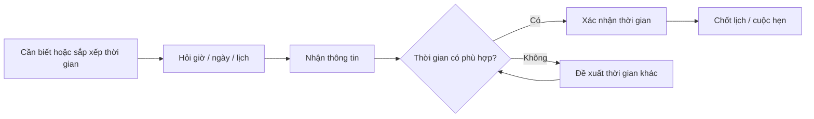

### Mẫu đơn giản

`Are you free on Thursday?`
→ `Yes, I am.`
→ `Morning or afternoon?`
→ `Morning, if possible.`
→ `Does eight o'clock sound good?`
→ `That sounds great.`

---

# 4. Từ vựng trọng tâm — Core Vocabulary

## 4.1. **time** /taɪm/

**Nghĩa:** thời gian; giờ


**Ví dụ:**

* **What time is it?**
  — Bây giờ là mấy giờ?

* **What time does the train leave?**
  — Tàu rời đi lúc mấy giờ?

---

## 4.2. **clock** /klɒk/

**Nghĩa:** đồng hồ treo tường, đồng hồ để bàn


**Ví dụ:**

* **The clock is five minutes slow.**
  — Đồng hồ chậm năm phút.

* **Look at the clock.**
  — Hãy nhìn đồng hồ.

---

## 4.3. **watch** /wɒtʃ/

**Nghĩa:** đồng hồ đeo tay

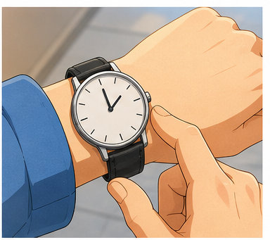

**Ví dụ:**

* **My watch is five minutes fast.**
  — Đồng hồ của tôi nhanh năm phút.

* **Let me check my watch.**
  — Để tôi xem đồng hồ.

> **clock** thường là đồng hồ đặt hoặc treo ở một vị trí.
> **watch** thường là đồng hồ đeo tay.

---

## 4.4. **second** /ˈsek.ənd/

**Nghĩa:** giây

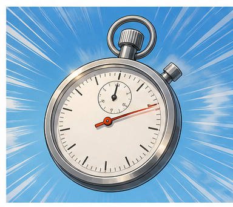

**Ví dụ:**

* **Wait a second.**
  — Chờ một giây nhé.

* **The clock is five seconds slow.**
  — Đồng hồ chậm năm giây.

---

## 4.5. **minute** /ˈmɪn.ɪt/

**Nghĩa:** phút

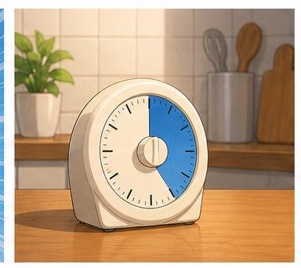

**Ví dụ:**

* **Just a minute, please.**
  — Xin chờ một phút.

* **The train leaves in ten minutes.**
  — Tàu sẽ rời đi sau mười phút nữa.

---

## 4.6. **noon** /nuːn/

**Nghĩa:** buổi trưa, 12 giờ trưa

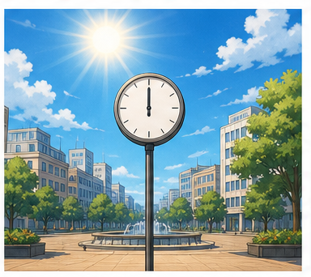

**Ví dụ:**

* **It's almost noon.**
  — Gần trưa rồi.

* **Let's meet at noon.**
  — Chúng ta gặp nhau lúc 12 giờ trưa nhé.

---

## 4.7. **morning** /ˈmɔː.nɪŋ/

**Nghĩa:** buổi sáng


**Ví dụ:**

* **What time do you get up every morning?**
  — Bạn thức dậy lúc mấy giờ mỗi sáng?

* **Thursday morning is good for me.**
  — Sáng thứ Năm phù hợp với tôi.

---

## 4.8. **afternoon** /ˌɑːf.təˈnuːn/

**Nghĩa:** buổi chiều


**Ví dụ:**

* **Are you free in the afternoon?**
  — Bạn có rảnh vào buổi chiều không?

* **I have an appointment this afternoon.**
  — Tôi có một cuộc hẹn chiều nay.

---

## 4.9. **Wednesday** /ˈwenz.deɪ/

**Nghĩa:** thứ Tư

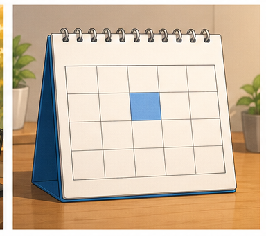

**Ví dụ:**

* **Are you available on Wednesday?**
  — Bạn có rảnh vào thứ Tư không?

* **I'll see you on Wednesday.**
  — Tôi sẽ gặp bạn vào thứ Tư.

---

## 4.10. **Thursday** /ˈθɜːz.deɪ/

**Nghĩa:** thứ Năm

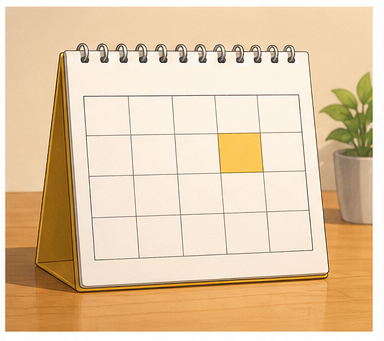

**Ví dụ:**

* **Thursday is better for me.**
  — Thứ Năm phù hợp với tôi hơn.

* **Let's meet on Thursday.**
  — Chúng ta gặp nhau vào thứ Năm nhé.

---

## 4.11. **Friday** /ˈfraɪ.deɪ/

**Nghĩa:** thứ Sáu

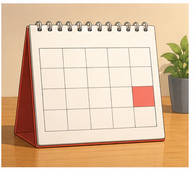

**Ví dụ:**

* **Are you free on Friday?**
  — Bạn có rảnh vào thứ Sáu không?

* **The clinic is open on Friday.**
  — Phòng khám mở cửa vào thứ Sáu.

---

## 4.12. **get up** /ɡet ʌp/

**Nghĩa:** thức dậy, ra khỏi giường


**Ví dụ:**

* **What time do you get up every morning?**
  — Bạn thức dậy lúc mấy giờ mỗi sáng?

* **I usually get up at seven.**
  — Tôi thường thức dậy lúc 7 giờ.

---

## 4.13. **come back** /kʌm bæk/

**Nghĩa:** quay lại, trở về


**Ví dụ:**

* **When do you come back home?**
  — Khi nào bạn về nhà?

* **I'll come back at six.**
  — Tôi sẽ quay lại lúc 6 giờ.

---

## 4.14. **train** /treɪn/

**Nghĩa:** tàu hỏa


**Ví dụ:**

* **What time does the train leave?**
  — Tàu rời đi lúc mấy giờ?

* **The train leaves at four o'clock.**
  — Tàu rời đi lúc 4 giờ.

---

## 4.15. **airport** /ˈeə.pɔːt/

**Nghĩa:** sân bay


**Ví dụ:**

* **Could you take me to the airport?**
  — Bạn có thể đưa tôi đến sân bay không?

* **What time should we leave for the airport?**
  — Chúng ta nên đi sân bay lúc mấy giờ?

---

## 4.16. **flight** /flaɪt/

**Nghĩa:** chuyến bay


**Ví dụ:**

* **My flight leaves at ten o'clock.**
  — Chuyến bay của tôi khởi hành lúc 10 giờ.

* **What time is your flight?**
  — Chuyến bay của bạn lúc mấy giờ?

---

## 4.17. **take off** /teɪk ɒf/

**Nghĩa:** cất cánh


**Ví dụ:**

* **The plane takes off at ten.**
  — Máy bay cất cánh lúc 10 giờ.

* **What time does the flight take off?**
  — Chuyến bay cất cánh lúc mấy giờ?

---

## 4.18. **clinic** /ˈklɪn.ɪk/

**Nghĩa:** phòng khám


**Ví dụ:**

* **The clinic opens at eight.**
  — Phòng khám mở cửa lúc 8 giờ.

* **I'd like to book an appointment at the clinic.**
  — Tôi muốn đặt lịch hẹn tại phòng khám.

---

## 4.19. **appointment** /əˈpɔɪnt.mənt/

**Nghĩa:** cuộc hẹn đã được sắp xếp trước

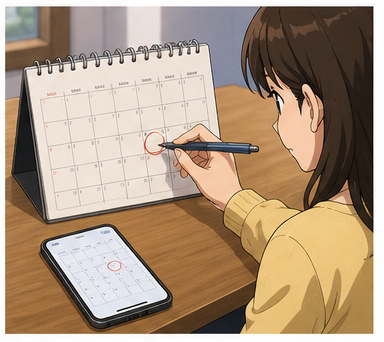

**Ví dụ:**

* **I'd like to book an appointment.**
  — Tôi muốn đặt một cuộc hẹn.

* **I have a doctor's appointment tomorrow.**
  — Tôi có lịch hẹn với bác sĩ vào ngày mai.

### Cụm quan trọng

* **book an appointment** — đặt lịch hẹn
* **make an appointment** — sắp xếp một cuộc hẹn
* **have an appointment** — có một cuộc hẹn
* **cancel an appointment** — hủy cuộc hẹn

---

## 4.20. **available** /əˈveɪ.lə.bəl/

**Nghĩa:** rảnh; có thời gian; có thể sắp xếp được

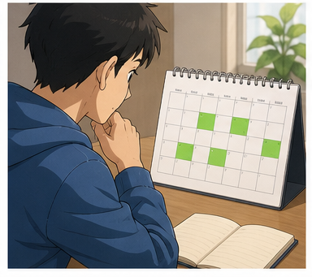

**Ví dụ:**

* **The doctor is available on Friday.**
  — Bác sĩ có lịch trống vào thứ Sáu.

* **Are you available tomorrow morning?**
  — Bạn có rảnh sáng mai không?

---

## 4.21. **possible** /ˈpɒs.ə.bəl/

**Nghĩa:** có thể, khả thi


**Ví dụ:**

* **Morning, if possible.**
  — Buổi sáng, nếu có thể.

* **Is it possible to meet earlier?**
  — Có thể gặp sớm hơn không?

---

## 4.22. **take it easy** /teɪk ɪt ˈiː.zi/

**Nghĩa:** bình tĩnh; đừng quá lo


**Ví dụ:**

* **Take it easy. We still have time.**
  — Bình tĩnh. Chúng ta vẫn còn thời gian.

* **Take it easy. We'll get there on time.**
  — Bình tĩnh. Chúng ta sẽ đến đúng giờ.

---

## 4.23. **pressed for time** /prest fə taɪm/

**Nghĩa:** đang gấp về thời gian, không có nhiều thời gian


**Ví dụ:**

* **I'm a bit pressed for time.**
  — Tôi đang hơi gấp.

* **We're pressed for time, so let's leave now.**
  — Chúng ta không có nhiều thời gian, nên đi ngay thôi.

---

# 5. Bảng tổng hợp từ vựng

| Từ / cụm từ          | IPA              | Nghĩa tiếng Việt    | Ví dụ ngắn               |
| -------------------- | ---------------- | ------------------- | ------------------------ |
| **time**             | /taɪm/           | thời gian, giờ      | What time is it?         |
| **clock**            | /klɒk/           | đồng hồ             | Look at the clock.       |
| **watch**            | /wɒtʃ/           | đồng hồ đeo tay     | Check your watch.        |
| **second**           | /ˈsek.ənd/       | giây                | Wait a second.           |
| **minute**           | /ˈmɪn.ɪt/        | phút                | Ten minutes.             |
| **noon**             | /nuːn/           | 12 giờ trưa         | Meet at noon.            |
| **morning**          | /ˈmɔː.nɪŋ/       | buổi sáng           | Thursday morning         |
| **afternoon**        | /ˌɑːf.təˈnuːn/   | buổi chiều          | this afternoon           |
| **Wednesday**        | /ˈwenz.deɪ/      | thứ Tư              | on Wednesday             |
| **Thursday**         | /ˈθɜːz.deɪ/      | thứ Năm             | on Thursday              |
| **Friday**           | /ˈfraɪ.deɪ/      | thứ Sáu             | on Friday                |
| **get up**           | /ɡet ʌp/         | thức dậy            | Get up at seven.         |
| **come back**        | /kʌm bæk/        | quay lại, trở về    | Come back home.          |
| **train**            | /treɪn/          | tàu hỏa             | The train leaves.        |
| **airport**          | /ˈeə.pɔːt/       | sân bay             | go to the airport        |
| **flight**           | /flaɪt/          | chuyến bay          | My flight leaves at ten. |
| **take off**         | /teɪk ɒf/        | cất cánh            | The plane takes off.     |
| **clinic**           | /ˈklɪn.ɪk/       | phòng khám          | doctor's clinic          |
| **appointment**      | /əˈpɔɪnt.mənt/   | cuộc hẹn            | Book an appointment.     |
| **available**        | /əˈveɪ.lə.bəl/   | rảnh, có lịch trống | Are you available?       |
| **possible**         | /ˈpɒs.ə.bəl/     | có thể              | If possible.             |
| **take it easy**     | /teɪk ɪt ˈiː.zi/ | bình tĩnh           | Take it easy.            |
| **pressed for time** | /prest fə taɪm/  | đang gấp            | I'm pressed for time.    |

---

# 6. Mẫu câu giao tiếp — Useful Structures

## 6.1. Hỏi giờ


### **What time is it?**

— Bây giờ là mấy giờ?

Cách hỏi lịch sự:

### **Could you tell me what time it is?**

— Bạn có thể cho tôi biết bây giờ là mấy giờ không?

### Hội thoại

**A:** Excuse me, what time is it?
**B:** It's two o'clock.

---

## 6.2. Nói giờ tròn

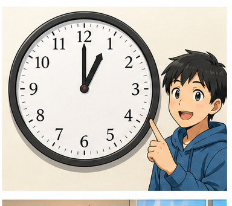

### **It's + giờ + o'clock.**

* **It's two o'clock.**
  — Bây giờ là 2 giờ.

* **It's eight o'clock.**
  — Bây giờ là 8 giờ.

* **It's ten o'clock.**
  — Bây giờ là 10 giờ.

> **o'clock** thường chỉ dùng khi không có phút.

---

## 6.3. Dùng **past** để nói số phút sau giờ

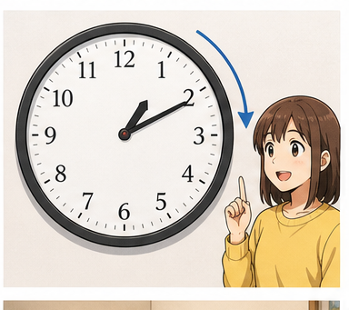

### **It's + số phút + past + giờ.**

Ví dụ:

* **It's ten past five.**
  — Bây giờ là 5 giờ 10.

* **It's twenty past seven.**
  — Bây giờ là 7 giờ 20.

### Công thức

`minutes + past + hour`

---

## 6.4. Dùng **to** để nói số phút trước giờ tiếp theo

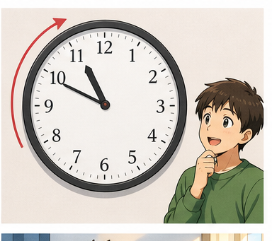

### **It's + số phút + to + giờ tiếp theo.**

Ví dụ:

* **It's a quarter to eight.**
  — Bây giờ là 7 giờ 45.

* **It's ten to nine.**
  — Bây giờ là 8 giờ 50.

### Công thức

`minutes + to + next hour`

---

## 6.5. **quarter past**, **half past**, **quarter to**

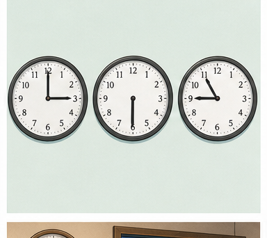

### **a quarter past**

= hơn 15 phút

**It's a quarter past three.**
— 3 giờ 15.

### **half past**

= hơn 30 phút

**It's half past three.**
— 3 giờ 30.

### **a quarter to**

= còn 15 phút nữa đến giờ tiếp theo

**It's a quarter to eight.**
— 7 giờ 45.

### Sơ đồ

```text
3:00  → three o'clock
3:15  → a quarter past three
3:30  → half past three
3:45  → a quarter to four
4:00  → four o'clock
```

---

## 6.6. Dùng **almost**

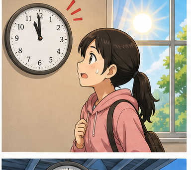

### **It's almost + thời gian**

= gần đến...

* **It's almost noon.**
  — Gần 12 giờ trưa rồi.

* **It's almost half past three.**
  — Gần 3 giờ 30 rồi.

* **It's almost eight o'clock.**
  — Gần 8 giờ rồi.

---

## 6.7. Hỏi hôm nay là thứ mấy

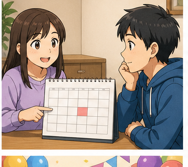

### **What day is it today?**

— Hôm nay là thứ mấy?

Trả lời:

* **It's Wednesday.**
* **It's Thursday.**
* **It's Friday.**

---

## 6.8. Hỏi thời gian của thói quen

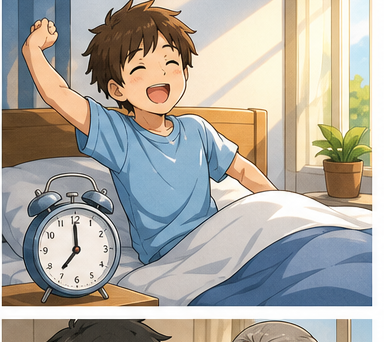

### **What time do you + V ...?**

* **What time do you get up every morning?**
  — Bạn thức dậy lúc mấy giờ mỗi sáng?

* **What time do you go to work?**
  — Bạn đi làm lúc mấy giờ?

* **What time do you go to bed?**
  — Bạn đi ngủ lúc mấy giờ?

### Trả lời

**I usually get up at seven.**

---

## 6.9. Hỏi khi nào ai đó trở về


### **When do you come back home?**

— Khi nào bạn về nhà?

Hoặc cụ thể hơn:

### **What time do you come home?**

— Bạn về nhà lúc mấy giờ?

Ví dụ:

**I usually come home at six.**

---

## 6.10. Hỏi giờ tàu, xe hoặc chuyến bay

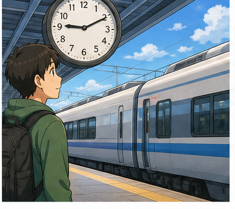

### **What time does + phương tiện / sự kiện + động từ?**

* **What time does the train leave?**
* **What time does the bus arrive?**
* **What time does the flight take off?**
* **What time does the meeting start?**

### Trả lời

**The train leaves at four o'clock.**

---

## 6.11. Hỏi ngày sinh

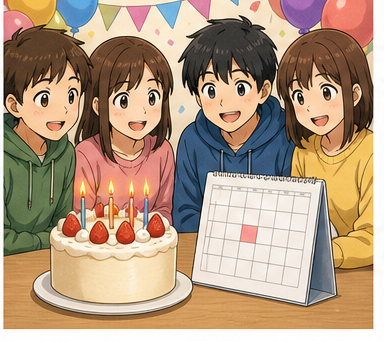

### **When is your birthday?**

— Sinh nhật của bạn là khi nào?

Ví dụ:

**My birthday is on May 14th.**

---

## 6.12. Hỏi năm sinh


### **When were you born?**

— Bạn sinh khi nào?

Cách hỏi cụ thể năm:

### **What year were you born?**

— Bạn sinh năm nào?

Ví dụ:

**I was born in 2003.**

---

## 6.13. Hỏi năm một sự việc xảy ra


### **What year did you + V ...?**

* **What year did you graduate from university?**
  — Bạn tốt nghiệp đại học năm nào?

Trả lời:

**I graduated from university in 2004.**

### Giới từ

`in + year`

* **in 2004**
* **in 2010**
* **in 2026**

---

## 6.14. Hỏi tháng


### **What month did you + V ...?**

* **What month did you come to Paris?**
  — Bạn đến Paris vào tháng nào?

Trả lời:

**I came to Paris in May.**

### Giới từ

`in + month`

* **in May**
* **in August**
* **in December**

---

## 6.15. Đặt một cuộc hẹn


### **I'd like to book an appointment.**

— Tôi muốn đặt một cuộc hẹn.

Ví dụ:

* **I'd like to book an appointment with Dr. John.**
* **I'd like to make an appointment for Friday.**

### Cấu trúc

`book an appointment with + người`

`book an appointment for + thời gian`

---

## 6.16. Nói về lịch rảnh

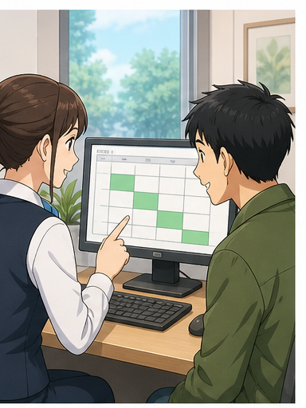

### **be available + thời gian**

* **The doctor is available on Wednesday.**
* **I'm available tomorrow morning.**
* **Are you available on Friday?**

### Câu hỏi

**When are you available?**

— Khi nào bạn rảnh?

---

## 6.17. Chọn buổi sáng hoặc buổi chiều


### **Morning or afternoon?**

— Buổi sáng hay buổi chiều?

Trả lời:

* **Morning, please.**
* **Afternoon would be better.**
* **Morning, if possible.**

---

## 6.18. Đề xuất một giờ

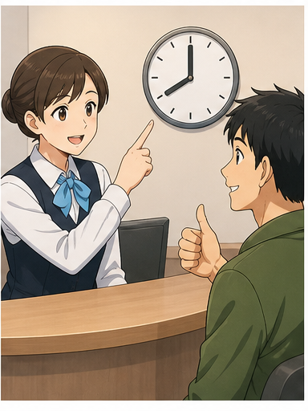

### **Does + thời gian + sound good?**

* **Does eight o'clock sound good?**
* **Does ten thirty sound good?**
* **Does Friday afternoon sound good?**

— ... có ổn không?

### Phản hồi

* **That sounds good.**
* **That sounds great.**
* **That works for me.**
* **I'm afraid that doesn't work for me.**

---

## 6.19. Xác nhận lại cuộc hẹn


Khi chốt lịch, nên nhắc lại **ngày + buổi + giờ**.

Ví dụ:

**Thursday morning at eight?**

**Yes, that's perfect.**

Hoặc:

**So that's eight o'clock on Thursday morning.**

— Vậy là 8 giờ sáng thứ Năm.

---

## 6.20. Nói mình đang vội


### **I'm a bit pressed for time.**

— Tôi đang hơi gấp về thời gian.

Cách đơn giản hơn:

* **I'm in a hurry.**
* **I'm running late.**
* **I don't have much time.**

### Phản hồi

**Take it easy. We still have time.**

— Bình tĩnh. Chúng ta vẫn còn thời gian.

---

# 7. Cách nói giờ trong tiếng Anh

## 7.1. Cách đọc trực tiếp bằng số

Đây là cách rất phổ biến trong giao tiếp hiện đại.

| Giờ  | Cách đọc             |
| ---- | -------------------- |
| 7:00 | **seven o'clock**    |
| 7:05 | **seven oh five**    |
| 7:10 | **seven ten**        |
| 7:15 | **seven fifteen**    |
| 7:30 | **seven thirty**     |
| 7:45 | **seven forty-five** |
| 7:55 | **seven fifty-five** |

---

## 7.2. Cách dùng **past / to**

| Giờ  | Cách đọc                 |
| ---- | ------------------------ |
| 7:05 | **five past seven**      |
| 7:10 | **ten past seven**       |
| 7:15 | **a quarter past seven** |
| 7:30 | **half past seven**      |
| 7:45 | **a quarter to eight**   |
| 7:50 | **ten to eight**         |
| 7:55 | **five to eight**        |

### Sơ đồ

```text
                     12
                     │
              five past
          ten past       ten to
       quarter past     quarter to
               \           /
                \         /
9 ───────────────────────────── 3
                /         \
               /           \
          twenty past    twenty to
               half past
                     │
                     6
```

---

# 8. Giới từ thời gian — **at / on / in**

## **at** — giờ cụ thể

* **at eight o'clock**
* **at noon**
* **at midnight**
* **at 7:30**

## **on** — ngày và thứ

* **on Wednesday**
* **on Friday**
* **on Monday morning**
* **on May 14th**

## **in** — tháng, năm, buổi

* **in May**
* **in 2004**
* **in August**
* **in the morning**
* **in the afternoon**
* **in the evening**

### Sơ đồ

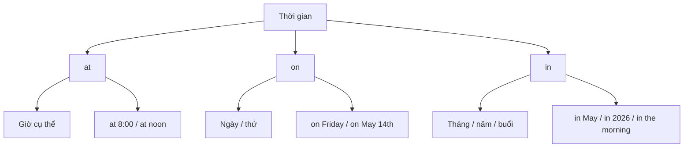

---

# 9. Phát âm trọng tâm

## 9.1. **minute**

**minute**
/ˈmɪn.ɪt/

Trọng âm:

**MIN**-ute

---

## 9.2. **Wednesday**

**Wednesday**
/ˈwenz.deɪ/

Cách phát âm gần đúng:

**WENZ-day**

Không đọc tách thành:

`Wed-nes-day`

---

## 9.3. **Thursday**

**Thursday**
/ˈθɜːz.deɪ/

Chú ý âm **/θ/** đầu từ.

---

## 9.4. **Friday**

**Friday**
/ˈfraɪ.deɪ/

Trọng âm:

**FRI**-day

---

## 9.5. **appointment**

**appointment**
/əˈpɔɪnt.mənt/

Trọng âm:

a-**POINT**-ment

---

## 9.6. **available**

**available**
/əˈveɪ.lə.bəl/

Trọng âm:

a-**VAIL**-a-ble

---

## 9.7. **airport**

**airport**
/ˈeə.pɔːt/

Trọng âm:

**AIR**-port

---

## 9.8. Nối âm trong câu hỏi giờ

### **What time is it?**

Nên luyện theo cụm:

`What-time-is-it?`

### **What time do you get up?**

Luyện:

`What-time-do-you-get-up?`

### **When are you available?**

Luyện cả cụm thay vì đọc từng từ tách rời.

---

# 10. Hội thoại thực tế — Real-Life Conversation

## Hội thoại chính — Đặt lịch khám


**Receptionist:** Good morning. Dr. John's clinic. How may I help you?
**Hugo:** Hi. I'd like to book an appointment with Dr. John.
**Receptionist:** Of course. Let me check the schedule. Are you available on Wednesday or Friday?
**Hugo:** Friday would be better for me.
**Receptionist:** Morning or afternoon?
**Hugo:** Morning, if possible.
**Receptionist:** Does eight o'clock sound good?
**Hugo:** Yes. Eight on Friday morning sounds great.
**Receptionist:** Perfect. I've booked you for eight o'clock on Friday morning.
**Hugo:** Thank you very much.

### Nội dung giao tiếp

```text
Yêu cầu đặt lịch
       ↓
Kiểm tra lịch trống
       ↓
Chọn ngày
       ↓
Chọn buổi
       ↓
Đề xuất giờ
       ↓
Xác nhận
       ↓
Chốt cuộc hẹn
```

---

## Hội thoại 2 — Đi sân bay


**Passenger:** Excuse me. Could you take me to the airport, please?
**Driver:** Sure. Please get in.
**Passenger:** Thanks. I'm a bit pressed for time. My flight leaves at ten o'clock.
**Driver:** What time is it now?
**Passenger:** It's nine thirty.
**Driver:** Take it easy. We still have thirty minutes.
**Passenger:** Do you think we can make it?
**Driver:** Yes. The airport isn't far from here.
**Passenger:** Great. Thank you.

---

## Hội thoại 3 — Sắp xếp cuộc gặp


**Mai:** Are you free this Thursday?
**Alex:** Let me check. Yes, I'm free in the afternoon.
**Mai:** I'd like to talk about our project.
**Alex:** Sure. What time works for you?
**Mai:** How about three o'clock?
**Alex:** I'm busy at three. Is four possible?
**Mai:** Yes. Four o'clock works for me.
**Alex:** Great. Shall we meet at the library?
**Mai:** That sounds good. See you at four.

---

## Hội thoại 4 — Hỏi lịch tàu


**Traveller:** Excuse me, what time does the train to London leave?
**Staff:** It leaves at four fifteen.
**Traveller:** What time is it now?
**Staff:** It's ten past four.
**Traveller:** So I have five minutes?
**Staff:** Yes, but you should go to the platform now.
**Traveller:** Which platform is it?
**Staff:** Platform six.
**Traveller:** Thank you.
**Staff:** You're welcome.

---

# 11. Natural Expressions — Cách nói tự nhiên

| Cụm từ                           | Nghĩa                         | Khi dùng            |
| -------------------------------- | ----------------------------- | ------------------- |
| **What time is it?**             | Mấy giờ rồi?                  | Hỏi giờ             |
| **Do you have the time?**        | Bạn có biết mấy giờ không?    | Hỏi giờ lịch sự     |
| **What day is it today?**        | Hôm nay là thứ mấy?           | Hỏi thứ             |
| **What time works for you?**     | Mấy giờ phù hợp với bạn?      | Sắp lịch            |
| **When are you free?**           | Khi nào bạn rảnh?             | Hỏi lịch            |
| **Are you available on Friday?** | Bạn rảnh thứ Sáu không?       | Hỏi lịch            |
| **Let me check.**                | Để tôi kiểm tra.              | Kiểm tra lịch       |
| **Morning or afternoon?**        | Sáng hay chiều?               | Chọn buổi           |
| **Morning, if possible.**        | Buổi sáng, nếu có thể.        | Nêu mong muốn       |
| **Does eight sound good?**       | 8 giờ có ổn không?            | Đề xuất giờ         |
| **That sounds good.**            | Nghe ổn đấy.                  | Đồng ý              |
| **That sounds great.**           | Nghe rất ổn.                  | Đồng ý              |
| **That works for me.**           | Thời gian đó phù hợp với tôi. | Xác nhận            |
| **Thursday is better for me.**   | Thứ Năm hợp với tôi hơn.      | Đổi ngày            |
| **Is four possible?**            | 4 giờ có được không?          | Đề xuất giờ khác    |
| **I'm not free then.**           | Lúc đó tôi không rảnh.        | Từ chối thời gian   |
| **How about three?**             | 3 giờ thì sao?                | Đề xuất             |
| **I'm a bit pressed for time.**  | Tôi đang hơi gấp.             | Nói về thời gian    |
| **I'm in a hurry.**              | Tôi đang vội.                 | Nói đang vội        |
| **I'm running late.**            | Tôi đang trễ giờ.             | Khi có nguy cơ muộn |
| **Take it easy.**                | Bình tĩnh.                    | Trấn an             |
| **We can make it.**              | Chúng ta vẫn kịp.             | Trấn an             |
| **See you at four.**             | Hẹn gặp lúc 4 giờ.            | Kết thúc            |
| **See you on Friday.**           | Hẹn gặp thứ Sáu.              | Kết thúc            |

---

# 12. Lỗi thường gặp — Common Mistakes

## Lỗi 1: Dùng **in** trước giờ

❌ **The meeting starts in eight o'clock.**

✅ **The meeting starts at eight o'clock.**

### Quy tắc

`at + giờ cụ thể`

---

## Lỗi 2: Dùng **at** trước thứ

❌ **I'll see you at Friday.**

✅ **I'll see you on Friday.**

### Quy tắc

`on + day`

---

## Lỗi 3: Dùng **on** trước năm

❌ **I graduated on 2020.**

✅ **I graduated in 2020.**

### Quy tắc

`in + year`

---

## Lỗi 4: Sai trợ động từ với lịch trình

❌ **What time the train leaves?**

✅ **What time does the train leave?**

### Cấu trúc

`What time does + subject + V?`

---

## Lỗi 5: Dùng sai với thói quen cá nhân

❌ **What time does you get up?**

✅ **What time do you get up?**

### So sánh

* **What time do you get up?**
* **What time does he get up?**

---

## Lỗi 6: Nhầm **What time** và **When**

### **What time**

hỏi **giờ cụ thể**.

**What time does the meeting start?**

→ At 8:00.

### **When**

hỏi thời điểm rộng hơn.

**When is the meeting?**

→ On Friday morning.

---

## Lỗi 7: Nói **half to three** khi muốn nói 3:30

❌ **It's half to three.**

✅ **It's half past three.**

3:30 = **half past three**

---

## Lỗi 8: Nhầm **quarter past** và **quarter to**

### 7:15

✅ **a quarter past seven**

### 7:45

✅ **a quarter to eight**

---

## Lỗi 9: Quên giới từ trước ngày và giờ

❌ **See you Friday eight o'clock.**

✅ **See you on Friday at eight o'clock.**

---

## Lỗi 10: Dùng **free** và **available** không đúng ngữ cảnh

Cả hai đều có thể mang nghĩa **rảnh**:

✅ **Are you free on Friday?**

✅ **Are you available on Friday?**

**available** thường phù hợp hơn trong:

* công việc;
* đặt lịch;
* phòng khám;
* cuộc hẹn chuyên nghiệp.

**free** tự nhiên hơn trong hội thoại thông thường.

---

## Lỗi 11: Nhầm **appointment** và **meeting**

### **appointment**

Một cuộc hẹn đã được sắp xếp, thường với:

* bác sĩ;
* nha sĩ;
* chuyên viên;
* dịch vụ.

**I have a doctor's appointment.**

### **meeting**

Một cuộc họp hoặc buổi gặp để trao đổi.

**I have a meeting with my manager.**

---

## Lỗi 12: Nói giờ nhưng không xác định sáng hay tối khi cần

**Let's meet at eight.**

Có thể gây nhầm nếu ngữ cảnh không rõ.

Rõ hơn:

✅ **Let's meet at eight in the morning.**

✅ **Let's meet at eight in the evening.**

Hoặc:

✅ **Let's meet at 8 a.m.**

✅ **Let's meet at 8 p.m.**

---

# 13. Luyện tập có hướng dẫn

## Bài 1 — Nối từ với nghĩa

1. appointment
2. available
3. noon
4. flight
5. get up
6. take off

A. cất cánh
B. cuộc hẹn
C. chuyến bay
D. rảnh / có lịch trống
E. thức dậy
F. 12 giờ trưa

<details>
<summary>Đáp án</summary>

1–B
2–D
3–F
4–C
5–E
6–A

</details>

---

## Bài 2 — Điền từ vào chỗ trống

Dùng:

`appointment` · `available` · `noon` · `flight` · `morning`

1. I'd like to book an ________.
2. Are you ________ on Friday?
3. It's almost ________.
4. My ________ leaves at ten.
5. Thursday ________ works for me.

<details>
<summary>Đáp án</summary>

1. appointment
2. available
3. noon
4. flight
5. morning

</details>

---

## Bài 3 — Đọc giờ

Viết các giờ sau bằng tiếng Anh:

1. 2:00
2. 3:15
3. 4:30
4. 5:10
5. 7:45
6. 8:50

<details>
<summary>Đáp án gợi ý</summary>

1. It's two o'clock.
2. It's a quarter past three.
3. It's half past four.
4. It's ten past five.
5. It's a quarter to eight.
6. It's ten to nine.

</details>

---

## Bài 4 — Chọn giới từ đúng

### 1.

The appointment is ___ Friday.

* A. at
* B. on
* C. in

**Đáp án:** B

---

### 2.

The meeting starts ___ eight o'clock.

* A. at
* B. on
* C. in

**Đáp án:** A

---

### 3.

I graduated ___ 2024.

* A. at
* B. on
* C. in

**Đáp án:** C

---

### 4.

I'll see you ___ the morning.

* A. at
* B. on
* C. in

**Đáp án:** C

---

## Bài 5 — Chọn câu đúng

### 1. Hỏi giờ tàu rời ga.

* A. What time the train leaves?
* B. What time does the train leave?
* C. What time do the train leave?

**Đáp án:** B

---

### 2. Hỏi người khác thức dậy lúc nào.

* A. What time do you get up?
* B. What time does you get up?
* C. What time you get up?

**Đáp án:** A

---

### 3. Đặt lịch với bác sĩ.

* A. I'd like book appointment.
* B. I'd like to book an appointment.
* C. I'd like booking an appointment.

**Đáp án:** B

---

### 4. Hỏi người khác có rảnh thứ Sáu không.

* A. Are you available at Friday?
* B. Are you available in Friday?
* C. Are you available on Friday?

**Đáp án:** C

---

## Bài 6 — Hoàn thành hội thoại

**Receptionist:** Good morning. How may I help you?
**Anna:** I'd like to book an ________.
**Receptionist:** Certainly. Are you ________ on Thursday?
**Anna:** Yes. Morning, if ________.
**Receptionist:** Does ten o'clock sound ________?
**Anna:** Yes, that ________ great.
**Receptionist:** Perfect. See you on Thursday at ten.

<details>
<summary>Đáp án</summary>

1. appointment
2. available
3. possible
4. good
5. sounds

</details>

---

# 14. Speaking Challenge — Thử thách nói

## Nhiệm vụ 1 — Đọc giờ

Đọc thành tiếng:

* 7:00
* 7:10
* 7:15
* 7:30
* 7:45
* 7:50
* 8:00

Cố gắng dùng cả hai cách:

* cách đọc trực tiếp;
* cách dùng **past / to**.

Ví dụ:

> **7:15 — seven fifteen / a quarter past seven**

---

## Nhiệm vụ 2 — Tạo 5 câu hỏi về thời gian

Dùng các cấu trúc:

1. **What time is ...?**
2. **What time do you ...?**
3. **What time does ...?**
4. **When is ...?**
5. **Are you available ...?**

Ví dụ:

> **What time do you usually get up?**

---

## Nhiệm vụ 3 — Sắp xếp một cuộc hẹn

Bạn muốn gặp một người bạn để làm dự án.

Phải hỏi ít nhất:

* ngày nào người đó rảnh;
* buổi sáng hay buổi chiều;
* giờ nào phù hợp;
* địa điểm gặp.

Phải sử dụng:

* **Are you available ...?**
* **What time works for you?**
* **How about ...?**
* **That works for me.**

---

## Nhiệm vụ 4 — Hội thoại 8 lượt

Tạo một đoạn hội thoại có ít nhất:

* 1 yêu cầu đặt lịch;
* 1 câu hỏi về ngày;
* 1 câu hỏi về buổi;
* 1 đề xuất giờ;
* 1 thời gian không phù hợp;
* 1 phương án khác;
* 1 câu xác nhận;
* 1 câu kết thúc.

---

## Nhiệm vụ 5 — Ghi âm

Ghi âm từ **45–60 giây**, sau đó kiểm tra:

* [ ] Tôi có thể hỏi **What time is it?**
* [ ] Tôi dùng đúng **at + giờ**.
* [ ] Tôi dùng đúng **on + ngày**.
* [ ] Tôi dùng đúng **in + tháng / năm**.
* [ ] Tôi phân biệt **What time** và **When**.
* [ ] Tôi đọc đúng **quarter past**.
* [ ] Tôi đọc đúng **half past**.
* [ ] Tôi đọc đúng **quarter to**.
* [ ] Tôi có thể hỏi người khác khi nào họ rảnh.
* [ ] Tôi có thể đề xuất và xác nhận một giờ hẹn.

---

# 15. Practice Mission — Nhiệm vụ thực tế

Trong hôm nay, hãy tạo một cuộc hội thoại theo công thức:

> **Purpose → Check availability → Suggest day → Suggest time → Confirm**

Ví dụ:

> **I'd like to meet about our project.**
> ↓
> **Are you available on Friday?**
> ↓
> **Yes, but only in the morning.**
> ↓
> **How about ten o'clock?**
> ↓
> **Ten is a little late. Is nine possible?**
> ↓
> **Yes. Nine works for me.**
> ↓
> **Great. See you on Friday at nine.**

Sau đó tự viết một hội thoại **8 lượt nói** cho một trong các tình huống:

* đặt lịch khám bác sĩ;
* hẹn gặp bạn;
* sắp xếp buổi học nhóm;
* hỏi lịch tàu;
* kiểm tra giờ chuyến bay;
* sắp xếp cuộc họp;
* đặt lịch phỏng vấn;
* hẹn gặp tại nhà hàng.

---

# 16. Tự đánh giá cuối bài

Đánh dấu khi bạn có thể thực hiện mà không nhìn bài:

* [ ] Tôi có thể hỏi **What time is it?**
* [ ] Tôi có thể nói giờ với **o'clock**.
* [ ] Tôi có thể dùng **past**.
* [ ] Tôi có thể dùng **to**.
* [ ] Tôi hiểu **a quarter past**.
* [ ] Tôi hiểu **half past**.
* [ ] Tôi hiểu **a quarter to**.
* [ ] Tôi có thể hỏi **What day is it today?**
* [ ] Tôi có thể hỏi **What time do you get up?**
* [ ] Tôi có thể hỏi **What time does the train leave?**
* [ ] Tôi có thể hỏi **When is your birthday?**
* [ ] Tôi biết dùng **at + giờ**.
* [ ] Tôi biết dùng **on + ngày**.
* [ ] Tôi biết dùng **in + tháng / năm**.
* [ ] Tôi có thể nói **I'd like to book an appointment.**
* [ ] Tôi có thể hỏi **Are you available ...?**
* [ ] Tôi có thể hỏi **What time works for you?**
* [ ] Tôi có thể đề xuất thời gian bằng **How about ...?**
* [ ] Tôi có thể xác nhận bằng **That works for me.**
* [ ] Tôi có thể duy trì hội thoại ít nhất 45 giây.

---

# 17. Câu hỏi mở cuối bài

**Imagine you need to make a doctor's appointment this week, but you are only free on two mornings. How would you ask about the doctor's availability, suggest a time, and confirm the final appointment?**

*Hãy tưởng tượng bạn cần đặt lịch khám bác sĩ trong tuần này nhưng chỉ rảnh hai buổi sáng. Bạn sẽ hỏi lịch trống của bác sĩ, đề xuất thời gian và xác nhận cuộc hẹn cuối cùng như thế nào?*

---

# 18. Ghi chú dành cho giảng viên

* **Module:** 02 — Everyday Conversations / Những cuộc hội thoại thường ngày
* **Chủ điểm:** Asking About the Time
* **Thời lượng video:** 8–12 phút
* **Luyện nói:** 5–10 phút

### Trọng tâm từ vựng

* time
* clock
* watch
* second
* minute
* noon
* morning
* afternoon
* Wednesday
* Thursday
* Friday
* get up
* come back
* train
* airport
* flight
* take off
* clinic
* appointment
* available
* possible
* take it easy
* pressed for time

### Trọng tâm cấu trúc

* **What time is it?**
* **Could you tell me what time it is?**
* **It's two o'clock.**
* **It's ten past five.**
* **It's half past three.**
* **It's a quarter to eight.**
* **It's almost noon.**
* **What day is it today?**
* **What time do you get up?**
* **When do you come home?**
* **What time does the train leave?**
* **What time does the flight take off?**
* **When is your birthday?**
* **When were you born?**
* **What year did you graduate?**
* **I'd like to book an appointment.**
* **Are you available on ...?**
* **When are you available?**
* **Morning or afternoon?**
* **Morning, if possible.**
* **Does eight o'clock sound good?**
* **That sounds great.**
* **That works for me.**
* **Is four possible?**
* **I'm a bit pressed for time.**
* **Take it easy.**
* **We can make it.**

### Trọng tâm phát âm

* **minute**
* **Wednesday**
* **Thursday**
* **Friday**
* **appointment**
* **available**
* **airport**
* **flight**
* **noon**

### Lưu ý ngôn ngữ

* **What time ...?** dùng khi muốn biết giờ cụ thể.
* **When ...?** có phạm vi rộng hơn, có thể trả lời bằng ngày, buổi hoặc thời điểm.
* Dùng **at** trước giờ:

  * **at eight**
  * **at noon**
* Dùng **on** trước ngày và thứ:

  * **on Wednesday**
  * **on May 14th**
* Dùng **in** trước tháng, năm và các buổi trong ngày:

  * **in May**
  * **in 2026**
  * **in the morning**
* Với ngày + buổi:

  * **on Friday morning**
* **a quarter past seven** = 7:15.
* **half past seven** = 7:30.
* **a quarter to eight** = 7:45.
* **appointment** thường dùng cho một cuộc hẹn được sắp xếp trước, đặc biệt với bác sĩ hoặc dịch vụ.
* **meeting** thường là cuộc họp hoặc buổi gặp để trao đổi.
* **available** phù hợp với ngữ cảnh đặt lịch và công việc.
* **free** tự nhiên hơn khi hỏi bạn bè.
* **What time works for you?** là cách hỏi rất hữu ích khi sắp xếp lịch.
* Khi chốt lịch nên nhắc lại đầy đủ:

  * ngày;
  * buổi;
  * giờ.

### Hoạt động gợi ý — Find a Time

Chia lớp thành cặp.

Mỗi người có một lịch khác nhau.

Ví dụ:

**Người A:**

| Ngày      | Sáng | Chiều |
| --------- | ---- | ----- |
| Monday    | Bận  | Rảnh  |
| Tuesday   | Rảnh | Bận   |
| Wednesday | Bận  | Rảnh  |
| Thursday  | Rảnh | Rảnh  |
| Friday    | Bận  | Bận   |

**Người B:**

| Ngày      | Sáng | Chiều |
| --------- | ---- | ----- |
| Monday    | Rảnh | Bận   |
| Tuesday   | Bận  | Rảnh  |
| Wednesday | Rảnh | Bận   |
| Thursday  | Rảnh | Bận   |
| Friday    | Rảnh | Rảnh  |

Hai người không được xem lịch của nhau.

Phải hỏi:

> **Are you available on Thursday?**

> **Morning or afternoon?**

> **What time works for you?**

> **How about ten o'clock?**

Mục tiêu là tìm được **một thời điểm cả hai cùng rảnh**.

### Role-play mẫu — Đặt lịch khám

**Người A nhận:**

> Bạn muốn đặt lịch khám trong tuần này. Bạn rảnh sáng thứ Năm và sáng thứ Sáu.

**Người B nhận:**

> Bác sĩ rảnh lúc 8:00 và 10:30 sáng thứ Sáu.

Người A phải sử dụng ít nhất:

* **I'd like to book an appointment.**
* **Are there any appointments available on ...?**
* **Morning, if possible.**
* **Is ... possible?**
* **That works for me.**

Người B phải sử dụng ít nhất:

* **Let me check.**
* **The doctor is available ...**
* **Morning or afternoon?**
* **Does ... sound good?**
* **I've booked you for ...**

Cuối hội thoại, hai người phải xác nhận rõ:

> **So that's Friday at ten thirty in the morning.**

> **Yes, that's correct.**

---
